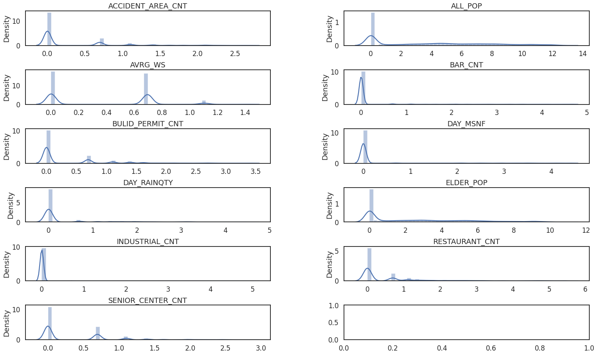
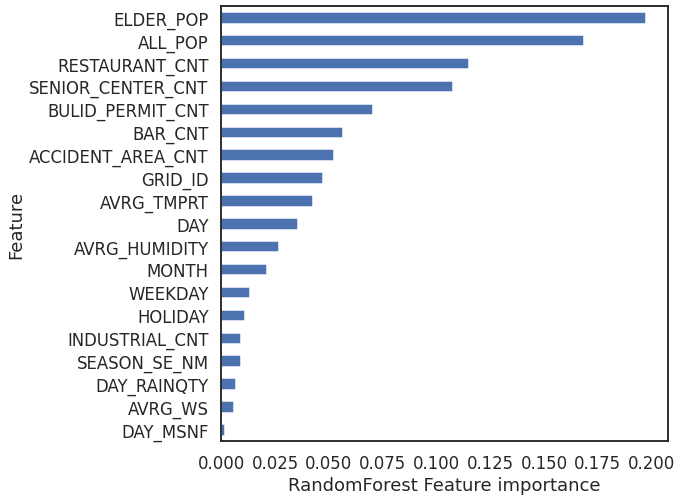

# 2022년 제2회 소방안전 AI예측 경진대회

# 목차
## 0. 개요
## 1. 라이브러리 & 데이터확인
#### 라이브러리
#### 테이블정의서
#### 데이터확인
#### 종속변수확인
## 2. 데이터 전처리 (1)
#### 사고유형예측에 관련이 적은 데이터 제거
#### 날짜와 기상 관련 컬럼 추가
#### 휴가 컬럼 추가
#### 12월 데이터 누락으로 행 삭제
#### 계절 컬럼 추가
#### 기온/강수량/적설량/풍속/습도 컬럼 추가
## 3. EDA와 시각화
#### 일별 사건 발생 빈도 시각화
#### 독립변수와 종속변수간의 관계 파악
##### 함수정의
##### 유동인구와 사고의 연관성 시각화
##### 날씨와 사고의 연관성 시각화
##### 휴가철 사고 발생 현황 시각화
##### 기상조건과 사건발생의 연관성 시각화
#### 공간정보 데이터 시각화
##### 함수정의
##### 격자별 사고 발생 건수
#### 사건별 영향을 주는 변수 시각화 및 전처리
##### 산업단지
##### 유흥가
##### 경로당
##### 음식점
##### 건축허가현황
##### 교통사고정보
#### 데이터 전처리(2)
##### 파생변수 추가[유동인구분류]
##### 비대칭 데이터 정규화
##### 데이터 스케일링
##### 최종 변수 정리
##### 데이터 변수명 지정
## 4. 데이터 모델링
### 모델링
#### 파라미터 조정결과
### MCHN_ACDNT_OCRN_CNT 
### ETC_OCRN_CNT
### BLTRM_OCRN_CNT
### ACDNT_INJ_OCRN_CNT
### EXCL_DISEASE_OCRN_CNT
### VHC_ACDNT_OCRN_CNT
### HRFAF_OCRN_CNT
### DRKNSTAT_OCRN_CNT
### ANML_INSCT_ACDNT_OCRN_CNT
### FLPS_ACDNT_OCRN_CNT
### PDST_ACDNT_OCRN_CNT
### LACRTWND_OCRN_CNT
### MTRCYC_ACDNT_OCRN_CNT
### DRV_ACDNT_OCRN_CNT
### BCYC_ACDNT_OCRN_CNT
### POSNG_OCRN_CNT
### FALLING_OCRN_CNT
## 5.최종모델테스트
## 6. 결론 및 한계점
### 결론 및 한계점

![캡처.PNG](data:image/png;base64,iVBORw0KGgoAAAANSUhEUgAABOAAAAKsCAYAAABF8cJdAAAAAXNSR0IArs4c6QAAAARnQU1BAACxjwv8YQUAAAAJcEhZcwAAEnQAABJ0Ad5mH3gAAP+lSURBVHhe7J0JeFTlvf97bWuvVSuyW6t1pSKKShEXUNZIWMsqBmRRsJBgIsoSGkQEIpsgsghiCBQIsgiJGMKiBkgkBkwIAgnZyDowCVnvve3f3tu7fP/zO8mEk8k7mSUzOYF8P8/zeZTMe5Y5M3POeb/nXX4GQgghhBBCCCGEEEKI12AARwghhBBCCCGEEEKIF2EARwghhBBCCCGEEEKIF2EARwghhBBCCCGEEEKIF2EARwghhBBCCCGEEEKIF2EARwghhBBCCCGEEEKIF2EARwghhBBCCCGEEEKIF2EARwghhBBCCCGEEEKIF2EARwghhBBCCCGEEEKIF2EARwghhBBCCCGEEEKIF2EARwghhBBCCCGEEEKIF2EARwghhBBCCCGEEEKIF2EARwghhBBCCCGEEEKIF2EARwghhBBCCCGEEEKIF2EARwghhBBCCCGEEEKIF2EARwghhBBCCCGEEEKIF2EARwghhBBCCCGEEEKIF2EARwghhBBCCCGEEEKIF2EARwghhBBCCCGEEEKIF2EARwghhBBCCCGEEEKIF2EARwghhBBCCCGEEEKIF2EARwghhBBCCCGEEEKIF2EARwghhBBCCCGEEEKIF2EARwghhBBCCCGEEEKIF2EARwghhBBCCCGEEEKIF2EARwghhBBCCCGEEEKIF2EARwghhBBCCCGEEEKIF2EARwghhBBCCCGEEEKIF2EARwghhBBCCCGEEEKIF2EARwghhBBCCCGEEEKIF2EARwghhBBCCCGEEEKIF2EARwghhBBCCCGEEEKIF2EARwghhBBCCCGEEEKIF2EARwghhBBCCCGEEEKIF2EARwghhBBCCCGEEEKIF2EARwghhBBCCCGEEEKIF2EARwghhBBCCCGEEEKIF2EARwghhBBCCCGEEEKIF2EARwghhBBCCCGEEEKIF2EARwghhBBCCCGEEEKIF2EARwghhBBCCCGEEEKIF2EARwghhBBCCCGEEEKIF2EARwghhBBCCCGEEEKIF2EARwghhBBCCCGEEEKIF2EARwghhBBCCCGEEEKIF2EARwghhBBCCCGEEEKIF2EARwghhBBCCCGEEEKIF2EARwghhBBCCCGEEEKIF2EARwghhBBCCCGEEEKIF2EARwghhBBCCCGEEEKIF2EARwghhBBCCCGEEEKIF2EARwghhBBCCCGEEEKIF2EARwghhBBCCCGEEEKIF2EAR5okP/30E8rLy+v4t7/9rboEIYQQQgghhBBCyPUBAzjSJDlw4AAmT55cx7Vr11aXIIQQQgghhBBCCLk+YABHGo2ysjLExMTggw8+qOWnn36K7777rrpUFStXrkT79u3rOGHChOoShBBCCCGEEEIIIdcHDOBIo5Gfn4/58+fjkUceqeXAgQO1EE7P+++/j5/97Gd1HDJkSHUJQgghhBBCCCGEkOsDBnCkFn//+9+RmZmJ5ORkJCUlNdisrKzqNQPZ2dn485//XCdUkxBOWsLpYQBHCCGEEEIIIYSQGwUGcKQWEr6FhIRg6NChGDBgQIOVIM0KAzhCCCGEEEIIIYQ0RxjAkVpIyzcJ31q0aIF//dd/bbAjRoyoXjMDOEIIIYQQQgghhDRPGMCRWki3UWm5JuGZKgBzVX1gdr0EcNINNz09HUeOHMH+/fu18elk//TKJBGbN2/G4cOHcfbsWVy5cgU//fRT9RoIIYQQQgghhBBCrsEAzk3+7//+D//85z9RWFiIM2fO4Ouvv8bu3btrPHr0KFJTU1FRUYH//d//rV6q6ePJAO6OO+7A66+/Xr3mphvA/c///A+Ki4uRmJiohWpz587F5MmTtW35+Pjg6aef1vZR7+OPP47nnnsOgwcPxvjx4xEYGIhly5YhKipKe58Sxl1PnzshhBBCCCGEEEK8BwM4N/jHP/6BnJwcfPnll1ixYgXefPNNraulBDJWhw0bhjlz5iA8PBwJCQkoKirCf/3Xf1WvoekiLb9mzZqFfv364YUXXnDKzp07o3Xr1nXCsvvvvx/z5s2rXnPTC+D++7//GyUlJdrn88knn2DKlCno2LGjcrvO2KZNG/Tt21fb9507dyIjIwP/7//9v+qtEUIIIYQQQgghpLnCAM5F/vM//1Nr2RYaGqq18FIFMXp/9atfoXfv3tiyZYsW2jX1EE4Co0uXLuH8+fM4d+6cU0rIKMGT7Xt/7LHHtIDSSlMK4CR8u3z5Mj7//HPt85HPSbW9higt6VJSUhjCEUIIIYQQQgghzRwGcC4SFxeHSZMmaeHbTTfdpAxe9P7Lv/yLFu60bNkSU6dO1QKZpox0rZVwSrrXOutXX32ldVu1fe/9+/fXumRaaUoBXF5entbSr1WrVtrnI5+TansN8Te/+Q0GDRqkdUkmhBBCCCGEEEJI84UBnAt89913WoDUvn17ZeDiyLvvvhsBAQFad1QZd+xGYd26dfjjH/9Y5/2OGjUK8fHx1aWaRgAnx12O/4wZM/D73/9euQ1RQrkXX3xRG98tODhYG99t9erVNcr+Sdfjl19+Wetqa2/MvDvvvBO+vr5aCMeWcIQQQgghhBBCSPOEAZwTyGD6MpnC7NmztbBFFbQ4qwze/9e//lWbafNGwd/fXzkGnIRtErpZMTqAk8+xtLRUG5fO3ucofx85ciQWLFiAL774QgsQpctxQUGBNtOpVXkvycnJiI2NxcaNG/HWW29pY//dfvvtddYpIZy0EJR1/fu//3v13hBCCCGEEEIIIaS5wADOCWTcNwlannnmmTrhinjLLbfgnnvuQbdu3bRJCbp06YK2bdsqy0oYI90Ss7KyrotJGerDGkxKV1Pb9yktwt5991387W9/qy5tfAAnoadMuGDvs3n44Ye1IE26GctEG9Id11ny8/MRFhamfbYtWrSo0z35tttu0957Wlpa9RKEEEIIIYQQQghpLjCAc4Ly8nKt66h0IdWHKuIvfvELdOrUSQtuvvnmG5w9exaRkZEYO3as3UkaZDy4HTt24OrVq9VbuD6RYPL48ePKYFK6d27YsKG6ZBVGB3ASki1fvrzO5yLjv916663aPsgEFO4i4+FJKzcfHx+7XVJlTLwbqfsxIYQQQgghhBBCHMMAzgESlkgo88ADD+DnP/95nUClQ4cOWLNmDSorK7VWUxLC/PTTT9oyMm6YbXlRwp7XXnsNFy5cqN7K9cl//Md/aIGWtByzfY/SEiwmJqa6ZBVGB3CJiYno2bNnnRlP5fOYMGGC1qVUJqBwF2kxJ11MJZS018pu7dq1KC4url6CEEIIIYQQQgghzQEGcA6QLpYHDhxQjnEmSsu4pKSk6tLXkO6lMmmDjP1l2xpKgjxpTSct5q5npAWfjHv261//utb7E+fMmaONnabH6ADuyJEjyu6hMhOqTJJQUlJSXdJ9pFvu5cuXMXjwYK27sX474syZM3H+/Pnq0oQQQgghhBBCCGkOMIBzQG5uLkJDQ+12J928ebPW+k2FdHlcsWKFFvqolpXJGKQV2fWIjO0m3S3ttfRSHRejA7ivvvpKuU6Z1VbCQk+NySet4BYuXKi1mrTd1tSpU3H69OnqkoQQQgghhBBCCGkOMIBzwI8//gg/P786rbykFZWET19//XV1ybpIAHXo0CG0adOm1rJWFy9ejJycnOrS1xey3zJT6G9+85ta70nGxJPx32TSCluaagD329/+FoWFhS5NulAfEk7K+HePPvponW0xgCOEEEIIIYQQQpofDOAcIN1In3zySfzyl7+sFaRIt9KBAwcqu59akUkKzp07p7Ww0i9rVcKo6zGMkXHxZJwz1XG5/fbb8fbbbyMjI6O69DXsBXAPPfQQQkJCtMkurAYHB9cpJ14PLeD+7d/+DfPmzcN9991XZ1v2uiwTQgghhBBCCCHkxoUBnAMOHjyohUwyU6Y+SJEWcWPGjNFayNlDWlSZTCathZV+Wasy8L8EfNcbMonA+vXrlcdFWvtJq0AJoWyxF8BJq7kHH3wQkydPrvGpp56qU070RgAnY8Dt3LnTI2PACbKePn361GkdKErQmJ6eXl2SEEIIIYQQQgghzQEGcA6wF9pIuDJ37lxkZWVVl1Rz5coVuwFcv3798OWXX1aXvH744osv8MILL9R5PzLpgEw+UFBQoLWSs8VeACfKzKTSEs3qbbfdpizXkABOWp6pJsWQf/fv3x8nT55s0CyoQllZGfbt24d77rlHOWuudE0tLS2tLk0IIYQQQgghhJDmAAO4epAJEmSiBNsQRZRJGWTcsry8vOrSaqS12NNPP41bbrmlzjpkBlGZffN6Qt7vO++8o3U1tX0/nTp1wmeffYa///3v1aVrU18A56wNCeBknLePP/64zqQYMp6fhIdvvfUWEhIS8NNPP1Uv4RryWUs4qQr5br75ZnTt2lWb+dZTXV0JIYQQQgghhBByfcAArh6k9drq1atrBSlWnQ3gpEXU6NGj0bp16zrruN4COGnVFhYWpu237XuRFmsjR47Ujoe9VmRGB3ASDMqYe88//7yyhZ20WnvjjTe0Vo8yyYTMZqpqyWdFuhhLmCZdTn/44Qd8+umnGDZsWJ31ivJ9Wbp0qcPvCyGEEEIIIYQQQm48GMDVgycCOJlQQMY0U03EcD0FcBJEFRUVwcfHp877EJ944gntWNWHvQBOumrKmHoyfpxV21lnrTYkgBMkhAsPD9fGmJOx51TbkEkhZIZXaa0m+ywt2yRI1U8ScfXqVa1FnUzeIOPHSRdWaUWnWp90r5XWgRcuXNAm5iCEEEIIIYQQQkjzggFcPTCAu4a0Bnv//ffxwAMP1HkfogRrElbVh70A7u6778b48eNx+PDhGl999dU65cSGBnDSak1CuHfffVcL2lTbkGBOxviTIPCuu+7SuhBLK0b9JBEvvviiNraffK4yiYN0OZWurKr1de/eXWt5949//EPbPiGEEEIIIYQQQpoXDODqgQFcFdL6KzIyEp07d1aOZde7d2/tfUjAVB/2AriHH35YC8Rk5lSrMsGFbTmxoQGcFZk8Q2ZylX1XbUevvGfpQiyfoVV7k0TobdmyJfz8/BAdHY3/9//+H8M3QgghhBBCCCGkmcIArh4YwEELjo4dO6acWMA6ecHy5cu1MdMcYS+Ae+SRR7RjqUda29mWEz0VwAn5+flaCCct4ex1R22Io0aN0saTk8k8CCGEEEIIIYQQ0nxhAFcPzT2A++c//4lTp04hICCgzr6L0jJs6NChSExMtDvxgp6mFsAJSUlJynDRE8p3R75DhBBCCCGEEEIIad4wgKsHs9mMjz/+WBmuOBvASffNcePGoW3btnXW0ZQDOOkuWVBQYDd8++Uvf4kHH3wQsbGx2vhwznA9BXDSuk/GdmvXrp2mfoIIq/J3CVZlwgjV+G8M4AghhBBCCCGEECIwgKuH0tJSbNy4sU6wIjobwEmId//99ysDmqYawEn4Jl1PZSbQP/zhD3X2W5TQbM2aNaioqMD//u//Vi9ZP9dTACfhm8xu+uOPP2oTKOgniBAleDxz5gzS0tK0cd5UASsDOEIIIYQQQgghhAgM4Orhv/7rv7B37946wYrobAAnAYzMlqlah0wAIJMbNCX+53/+B1evXtUCsCeeeEI56cLvfvc7TJ8+HYWFhVp5Z7meAjhp4SZBm3Qh/umnn2pNECHKuG4y6UR9XYwZwBFCCCGEEEIIIURgAOcAGUTfNlgRZRbMqVOnai2g6qO+AO7ll1/WWlI1FaTV2w8//IAZM2ZoLd9U4ZsEU5MmTdImZnCV6zGAk7CtPhjAEUIIIYQQQgghxBEM4Bzw9ddfa90LbbuQSmDTt29frXuiPWQSg/T0dGU4IwYFBSElJaW6tLHIWHUSqtkb883qoEGDcODAAa11oKswgCOEEEIIIYQQQkhzhAGcA5KTk7WZPm1bg8kkBE8++STi4uK0MdNUyPhoBw8eROvWrWsta1VCJgmlmgISvg0fPly5n6IEkPI+tm3bpr0vd2AARwghhBBCCCGEkOYIAzgHZGZmYubMmbj99ttrhSv/8i//ooVwERER+Pvf/15dujYSvmzYsAF33nlnrWWthoeHOwx4GouYmBitdZtqP0UJ36KiolBSUuL0pAu2MIAjhBBCCCGEEEJIc4QBnAOKioqwefNmtGzZsk7AIv7lL3/BxYsXq0vXRrqnSjdV23Dn5z//Odq1a6eFXv/93/9dXdpYiouLtfHuxo8fX2tfxc6dO2st3yR8c2XSBVsYwBFCCCGEEEIIIaQ5wgDOATIxwalTp7TAzDZgEbt27Yr169drM4dakVBNWs4tXbpUa/1mO36cdGcdOXJkveO/SXCze/fuOn7xxRc4fvy4Fvx4msrKSm1SiDfeeAMdOnTAvffei8GDB2sBpHQ7dbflm5XGCuDy8/O1sftUx8/WRYsW4aGHHsIvfvGLWtuRFo/BwcFaK0XVclbDwsLw9NNPa5Ny6JcXX331Va0FpGo5W2XyC5lZlRBCCCGEEEIIITceDOCcQFp+9enTp043VKvSyk2CFgnGpNWbjPv23nvv4bnnnlOWl9Z0EtyYzebqLdTlu+++05a3tWfPnnjrrbfstrprKP/4xz+08HDBggVa11tppefOhAsqGiuAk/BNWqWpjp+tsm3VdiSQkxBSAlbVclb/+Mc/4uabb1au45577sFTTz2lXM5WCWsLCwur3wEhhBBCCCGEEEJuJBjAOYG0gpNWSl26dKnTms3qr3/9azz88MPw8fHRZk1VlRFl3Dgpd/78efznf/5n9RbqIt1BVctLV0npMildJ72FTCoh71nGtpOZXD1FYwVw8llJqKVavqkqx0WODyGEEEIIIYQQQm48GMA5gXS9LCsr08ZHszehgkzKIK2mJCCzF9KJEjatWbNGG1vM3uypgpEBnCD7ZtVTMICzLwM4QgghhBBCCCHkxoUBnJPI5AMyPtrw4cOVAYozysD+kyZN0roaOprMwOgAzhswgLMvAzhCCCGEEEIIIeTGhQGcC8gg+fv27dNCONXkCvX54IMPYsqUKdrMms7AAM79AE4mNJAx1WRb14s7duyoNZEHIYQQQgghhBBCbhwYwLmIhHDSEm7ChAno1q2bNjuqvUH4ZbbT+++/H88884w2o+bJkyedntCAAZz7AZx8RtLKULZ3vSjhm6cmuyCEEEIIIYQQQkjTggGcG0j30fLycm22UxkX7tFHH9WCOOlialX+/fTTT2PevHlaYFdRUVG9tHMcPXq01vqs/u53v8OYMWNw9uzZ6pLXDxI0NUYARwghhBBCCCGEENKUYADnJjIxw08//aQFcdLa6scff9S6l1pNSUlBcXGxNtmCzHYq5V1BWkTp12dVgrnTp0+jsrKyuuT1AwM4QgghhBBCCCGENEcYwHkACdckZJOwzeo//vGP6lfd45///Get9en929/+5nASh6YIAzhCCCGEEEIIIYQ0RxjAkUaDARwhhBBCCCGEEEKaIwzgSKNx+fJlfPjhh3jhhRdq+eqrr2L79u3VpapgAEcIIYQQQgghhJAbBQZwpNGQbrkmkwnnzp2rZXp6OoqKiqpLVbFixQrlJBTjxo2rLkEIIYQQQgghhBByfcAAjjQa//d//6eNXSfj29lqO6addFdVTUJx5syZ6hKEEEIIIYQQQggh1wcM4EiTRFrLqSag+Pvf/15dghBCCCGEEEIIIeT6gAEcIYQQQgghhBBCCCFehAEcIYQQQgghhBBCCCFehAEcIYQQQgghhBBCCCFehAEcIYQQQgghhBBCCCFehAEcIYQQQgghhBBCCCFehAEcIYQQQgghhBBCCCFehAEcIYQQQgghhBBCCCFehAEcIYQQQgghhBBCCCFehAEcIYQQQgghhBBCCCFehAEcIYQQQgghhBBCCCFehAEcIYQQQgghhBBCCCFehAEcIYQQQgghhBBCCCFehAEcIYQQQgghhBBCCCFehAEcIYQQQgghhBBCCCFehAEcIYQQQgghhBBCCCFehAEcIYQQQgghhBBCCCFehAEcIYQQQgghhBBCCCFehAEcIYQQQgghhBBCCCFehAEcIYQQQgghhBBCCCFehAEcIYQQQgghhBBCCCFehAEcIYQQQgghhBBCCCFehAEcIYQQQgghhBBCCCFehAEcIYQQQgghhBBCCCFehAEcIYQQQgghhBBCCCFehAEcIYQQQgghhBBCCCFehAEcIYQQQgghhBBCCCFehAEcIYQQQgghhBBCCCFehAEcIYQQQgghhBBCCCFehAEcIYQQQgghhBBCCCFehAEcIYQQQgghhBBCCCFehAEcIYQQQgghhBBCCCFehAEcIYQQQgghhBBCCCFehAEcIYQQQgghhBBCCCFehAEcIYQQQgghhBBCCCFehAEcIYQQQgghhBBCCCFehAEcIYQQQgghhBBCCCFehAEcIYQQQgghhBBCCCFehAEcIYQQQgghhBBCCCFehAEcIYQQQgghhBBCCCFehAEcIYQQQgghhBBCCCFehAEcIYQQQgghhBBCCCFehAEcIYQQQgghhBBCCCFehAEcIYQQQgghhBBCCCFehAEcIYQQQgghhBBCCCFehAEcIYQQQgghhBBCCCFehAEcIYQQQgghhBBCCCFehAEcIYQQQgghhBBCCCFehAEcIYQQQgghhBBCCCFehAEcIYQQQgghhBBCCCFehAEcIYQQQgghhBBCCCFehAEcIYQQQgghhBBCCCFehAFcE+X//u//8L//+7+UUkobWTn/EkIIIdczqusbpZQ2VZvL/TcDuCaIfPn+53/+Bz/99BOllNJG9B//+Id2/mUIRwgh5HpFrmH/+Z//qbzOUUppU/Sf//ynFsTd6DCAa4LIRfO//uu/8G//9m+UUkob0X//93/XbgCaYwAnNz3//d//TSml1IFN/UGN7Nt//Md/KK9zlFLaFJUQTs6tNzoM4Jog1gCusrKSUkppIyo3AM01gJPrzt/+9jdKKaUO/Pvf/64FcU31WiEPVCSAU13nKKW0KcoAjhgGAzhKKTXG5hzASfdbef+q40IppfSaTf1awQCOUnq9yQCOGAYDOEopNUYGcAzgKKXUkQzgKKXUszKAI4bBAI5SSo2RARwDOEopdSQDOEop9awM4IhhMICjlFJjZADHAI5SSh3JAI5SSj0rAzhiGAzgKKXUGBnAMYCjlFJHMoCjlFLPygCOGAYDOEopNUYGcAzgKKXUkQzgKKXUszKAI4bBAI5SSo2RARwDOEopdSQDOEop9awM4IhhMICjlFJjZADHAI5SSh3JAI5SSj0rAzhiGAzgKKXUGBnAMYCjlFJHMoCjlFLPygCOGAYDOEopNUYGcAzgKKXUkQzgKKXUszKAI4bBAI5SSo2RARwDOEopdSQDOEop9awM4IhhMICjlFJjZADHAI5SSh3JAI5SSj0rAzhiGAzgKKXUGBnAMYCjlFJHMoCjlFLPygCOGAYDOEopNUYGcAzgKKXUkQzgKKXUszKAI4bBAI5SSo2RARwDOEopdSQDOEop9awM4IhhMICjlFJjZADHAI5SSh3JAI5SSj0rAzhiGAzgKKXUGBnAMYCjlFJHMoCjlFLPygCOGAYDOEopNUYGcAzgKKXUkQzgKKXUszKAI4bBAI5SSo2RARwDOEopdSQDOEop9awM4IhhMICjlFJjZADHAI5SSh3JAI5SSj0rAzhiGAzgKKXUGBnAMYCjlFJHMoCjlFLPygCOGAYDOEopNUYGcAzgbgTLy8tRXFyMgoICzdLSUmW5G1nr+y8sLERFRYWyjLcsKyvD5cuXte3LfsjnoSpnT9nfK1euaPtuNptdXp56XwZw7mnvdynnKOv5yp3fjKeVfZN9tO6PqkxjW1RUpO2TnFvkHKMq01SVz1P2X46nyWRCSUmJspwRyr7IPsm+yT42he+e/B7ks25qx8rbMoAjhsEAjjqjXCDkBC0nZk8pF/TGrqhQ2pRkAMcA7kZQKow//vgj9u3bp5mdna0sdyN75swZ7b1/9dVXjV6Bzs/Px7fffov9+/drn4Or25fr8XfffYcDBw7g+++/18I4VTlqnAzg3NPe71LOUdbzlTu/GU8r25d9lP2RfVaVaWxlP2JiYvDNN99o4cz1FMzLg4Tk5GRERUXh6NGjSE9PV5ZzR6m7WOtD8l9Xj4vsi+yT7Jvso+yrqpytDamH1bef8pr8HuT87+lj1dRlAEcMgwEcdaSctC9duoSkpCScPHnSY6ampvJGnzZrGcAxgLsRzMzMxEcffYRWrVppShCkKncju3DhQu29P/roo9rxUJXxlvHx8RgxYgR++9vfap+Dq9uXAG/atGl45JFHMH36dC2QUJWjxskAzj3t/S7lHGU9X7nzm/G0sn3ZR9kf2WdVmcZ2yZIl6NatG3x9fZGYmKgFNapyTdELFy5o+3/fffehX79+iIiIUJZzx4yMDJw+fVqrx8hxkXDSlRaCsi+yT7Jvso+yr6pytkqLubNnz9apSzmj1N/y8vKU65X9l/Dt4Ycf9vixauoygCOGwQCOOlKaSO/duxd+fn547rnnPObixYu1i5hqm5Q2BxnAMYBrLKW1sbSySEtL01o2NESpgOjXLU/MpSLxs5/9THPXrl21Xr9ezcnJwfnz55XHwNapU6dq771NmzZaKwJVGb0pKSnaZyHXV9W2XfHYsWNaxelf//Vftc/B1RYMubm5GD9+PNq1a4eJEydq+6cqR42zuQVwEmjIeUbCYNvfjj0vXryodZfUryc4OFj7XbZv377W70LOUdbzlTu/Gb3yG87KyqrZDwm0XQ2rZPuyj7I/ss+qMipl23IekfOJ/lg4qwQ6cp6TVlK2654/fz46dOig3a9LiKMq01DlM1btl6vank/PnTun7f9vfvMbPP300wgPD6+zbWeVdZ46dQorV67EsGHD0KtXL3Tv3l07LvLfvn374pVXXtGCXAm6VOvQK/si+yT7Jvso+6oqZ6tcV4KCgmrVo5z17bff1lpJq9YrwZ60vJTwt6HH6nqTARwxDAZw1JHSSu2TTz7Rns7JzcGtt96qXZTd8e6776656XnttdcQGxur3KYnlRs5uSmTGxxvKTdf8hRJtX1K7ckAjgFcYynnQWl1vGjRIi1kaYgffvhhrXXLObChAZwEhHKtka4wtufXhupOhVjcs2cPZs+erTwGtj755JPae//1r3+Nl19+WVlG75QpU7B06VKnK1/1yQDuxre5BXByLtiwYQMCAwPr/HbsuWzZMi0o0q/HWwGc9AyRVmu7d+/G+++/r7Ugte7Hm2++qe2LtCqSVkfOdFGU7bsTwMn5Q84jcj7RHwtnlf2W85z0crFdd2MEcHItUe2Xq9qeTz0VwEmoFxYWhldffRVPPfUUbr75ZrRu3Rr333+/dmweeOAB/OIXv8Btt92GLl26wN/fHzt37qy3y667AVx0dLT2XvV1qvrU17fGjBmjdSdWrbehAZy8T/mey+9BvseeUu4FnO2e664M4IhhMICjjtQHcBK+SZN0uWi444QJE7QWAjfddFOjBXASvp04cUK7yfKWcnxknAzV9im1JwM4BnCNpVSepLvMoEGDtKDFVqlUSCXCesPeokULZTlRnvbr1y03y3IetC7rTgAn+yfjj23cuLHO+bWhylg7EsKptlufUqGTyqfqGOiVitQvf/lL7b3/y7/8C2655RatMqMqa/Xee+/FqFGjtO6jqm1blWDy6tWrNYN2q5Sxo3r27Ilf/epXeO+99/DDDz8oy4lSMbQde5UBXNO3uQVw+u+k/LbkN6b//agcPXq09lvXr8cbAZy0JJbQRFo8SfAt50757Vn3Q/5fwg9pLSUhopR1NMacbN+dAE4fvst277zzzlrHxJEPPvig9v5V3SDlnl2CHG8GcHItUe2Xq9qeTxsawMk5Us6Vcm///PPPa8dXuoy+8MILWt1lzpw52vrnzp2LIUOGaMforrvu0q6b0iIuMjLSbpdPdwM4aV23efNmbRlnlNDN+h2XUPj48ePK64h89tu2bUPLli3dOlbSQlACvNWrV9e67jZUCT7lWqbapqdkAEcMgwEcdaQ+gJOLsZzYVeWcUX+z0FgBnDRxX758ubZNb/nYY481mXE76PUjAzgGcI2ltICT7pQLFizQKra2Dh8+XHvCb71h7927t7KcKOdT/bo9EcDJdebTTz/VWpKpzrGuKpVRCcNkf9wNleR9zJw5U3kMRGkVIUqlRQI32Za0hpDWERJ0ymuq5US5/oWGhjocb00+N6kgHT58WKvkqJSg8PHHH9eCikmTJmkVF1U5UTVJBAO4pm9zDuDEHj161Pr9qPzggw8QFxdXaz2eDuDk9yi/WVnmjjvu0MJ2CS7kHtC6H/L/EsTIOUjKSFkJWeprCeeJAE4CIh8fn1rHxJFvvPGG1mJLNXGO3Ot7O4CTa4lqv1zV9nza0ABOHnpIl09pcCDn1T/84Q/a5yJdduU12/LyvZN9kO3JZyHnf6nfqD5zdwM4V5Tv6Y4dO2q+43KcZR/lPdleEyR8e/fdd90+VhI0ynuXEFR/DXZHaWH485//XNtnd/bFVRnAEcNgAEcdeb0HcNK0fvv27dp2vaW07JMnU6rtU2pPBnAM4BpTuSmXp/pSubVVxriRm3DrDbucz1TlRHmKrl+vJwI4eYr+xRdfaNcF1TnWVaWlglSAZX/cDZVkn6SFgOoYiDJ2kow79ec//7mmu49U1iRElEqtdMlRLSdKpUWOo3wmqm1blS448llIKwwJ+VRKJV+2K4GjtFKXVjCqcqJcx20HnJf9kUosA7ima3MO4GTMLamI638/KuX3ZBsSeTqAk2781vBNenL86U9/wtatW7WHG9b9kP//+OOPtd+slJGy0hLOXoso0RMB3NixY7UWgPpj4kjZJznPqYKixgjg5DNT7Zer2p5PGxrASYtpGddTJraRc6a0LJZrgQxlYNuCWJRjI+GcdEeW87B8HjJmnO25VmyMAE6+p9IowPodl4kVrPUg22uCBMiyL/JddedYyXGX8FNaIOqvwe4o37Xf/e53WgjHAM5zMIBrgjCAo4683gM4uTDKRVC2bfXQoUPauBdycpcLk/xb/7qtsp/SAkHKSmVIbt70ryckJDh9A0epVQZwDOCaig0J0RqyrFWpAEorDOmGqj+3uuuXX36pdQWSlijeCJWk0ipdgqSyLC1e5JomXXhlJjmp1Lz00kvaddN2wgpXle18/vnnWvc6qZColG1aj70EgZ07d1aWE2VGQ9vxnqQCywCuaducAzhp1SX3a6pyjvR0ACdh2zPPPKP93uVeVn6b8nvSB1jy/7I+a4teCcelO6qMCadfl14p39AAztP31I0RwOmV8EzCKDn/yOevKiP7IA8+JOySlsH2xl5uSAAnn5+EqHJel4c4EmzKPb6qrF7ZN6lLWD8PaV0ow9/YlmuMAE5m+ZVWeNbvqXxPJJyV35T+eiBKy3fpiiytt+XfroZe8rlJy0Pp/qu/BrujPLiS77E8SHJnX1yVARwxDAZw1JHXewCnUi4WmzZtcnogbLnA6Acwtx2EnFJ3ZADHAK6p2JAQrSHLektvhUqyXqloSOVaWj5LxUUcPHgwQkJCtJYAzz77rNZyQv77zjvvaC0PJFi0naHRGaXFhczwJ60DpTKiUrZrHQxcJoCQlheqcqIEBhLq6bfBAK7pywDO+ABOBuSXWSglaJdWpjJepUzApSorSkAks/1LCzgJxqVFkr3AiAFcVaszOb5yDrJ3DZGwU74LMnmEtEqz934bEsBJq2OZMVTGq5bPQ87htudMeyYnJ+Ott97C7bffrj2E2bt3b50ysi+yT94K4OS3I8dGvnPyPV27dq32IEhCRQnh9NcDcd26dTX73BihV3025HNzRwZwxDAYwFFH3ogBnDzNkkFJ9U+HVOWsyo2H3IDIjYg8mbEdhJxSd2QAxwCuqcgArkrpXiShl1SUpcuRtMqTSoFcM6QyJV3LZKY7CdekYi2tzaQLqoytJpU02a5UeGRMvUceeUQbl0nGr5KKpYR2MpOdXEukMiSVSek6JRU+VRcwZ9VfV50NE/QygGv6MoAzPoCTVrUDBw7U7gHlXlAeytb3u5X7Rmklax3XUsaElK7+qrKy/eYewDlzDPQBjezXX//6V4flXA1y5NwvQZVMruHq5+HM/sm+eCuAk8YCMq6btHSW76lcpyQUrO+zk+ucLCMttxnA3ZgwgGuCMICjjtQHcNLVRZ62y8ncHb/++mv06dPH8ABOLvRy0+VOANfQEJJSqwzgGMA1Fa3nRGul1IgATiqzEn7ZXjfcUVqmSNehtm3buhQqSQVGWmLExMRo3XhkQgNpTSAPXX79619rXZKkcnDPPfdo1w4ZwFo1gLlUJCSs69+/v1axkVYzMq6NtFST7qTSGkYqF9KyTWZ6czRLYn0ygLvxZQBnfAAnv+euXbtqwbrM+OhMi1YJN2bMmKGdL+TeV7rYqcrJ9hnAuRbAyfvevXu3w3KuBjlS55G6irUF3KxZs5x+79JaWSbukdZk9r633grg5Pop1z2Z/VRavnXq1El7GOToe+qJAM5T12259kgdkwGcZ2EA1wRhAEcdqQ/g5CZi8uTJ2sXYHT/77DPtBkZmumEAR5u7DOAYwDUVredEa6W0sQM4qTxIizBpMWJ73XBHGYtHWgFIRcTVUEkCNek+JNc7WV4qAxK+yeDaMrC6VBCkxZvsr73WaxLkScVHxiqSsUOl1ZysT7qJyrqk9ZwMft2xY0etYq8a2NtZGcDd+DKAMz6Ak2Dl97//vTYGnPzmVLNh2irngDVr1mihnfzW7c2WL9tnAOdaACdDAHzzzTcOy7ka5Mi5WLoPW/dFAi3b2XXtKQ9u5HOWcf9kEgfVct4K4GQyBJkJWGZsleuW7Lft+IQqGxrASfgmLTttr8HuKA+kZOw8jgHnWRjANUEYwFFH6gM4uchLJUIuyO74+OOP18we1RQCOAkCpYm2PO1SlbMqN1oyJoTceDGAo56SARwDuKaitVu+tVIqs/bZG6/IVuv51LqsOwGcdN+ULp5+fn7Ka4erys27tGCQipCroZJc8+RhkeyLdCUNCAjQKs4yAc+RI0e0MUSdPTZSOZEwQVq5ySDsclznzZunVR6l4izjC9mrRDqrVPqktYO8V3thguyvVCrlONh6/PhxDBkyRKuAMYBrmjKAUwdwEnTL+Fbym7T9XosSgsg5yRMBnMzyKPfAvXv31kJ6R8GGKPeO8jBAzkcS3kmIpyon229oADdy5EhtvEnVcdArraScGdOsqQdw9dUhGhLAifqWi3fddZfW8EC+Z/J9U5UXZWzQ6dOn45ZbbtEe1siDFfke25bzRgAn3aGXLVumTRwhD3hkTFK53tS3v1YbGsDJpBiyPdtrsDt26dJFO+acBdWzMIBrgjCAo46UJ/zSzUZaE8jF2J7WQaDl4iknclUZvXPmzNEu6qptelu50MtNl5zk5eIqY3uoylmVmxW5YZOxPGTf5aKpKkepKzKAYwDXVJSbdQmbrJXSd999V6vUqsraaj2fWpd1J4DTP+iRdcgTcNtrhrvOnj1bG3NNtV2VUrGWmbMl2JLj8t1332nhlVwHnKl016e0UpBWcRK6SfcpuQZKl1dVWWeUCpaEEzLbqzzYkgq+hH225aSiKl1pJWCzVYJGmUhCKvHyb6mk2y5PjZUBnDqAk/OGhNqBgYF1vtei3LPJ+cQTAZzcA0t5aR0rYZQzrVb1vSckcBk3bpyynDPhk0p9ACfnOpn5UnUc9MoEZM6c2+U+V9Yp+97YAZy9iQ/cCeBknE6ZmEbWr1eCI3tBpLxXCdQkWJJ1SHgq3zH53siEOhJ4yTpkYg75twxVMGnSJO14SQAns97KZ6MKwDwZwFlbn8nkPzKbqTQqkGEPpM5m+5BIrj22x0CU64Xsv7Sacyf0knVYPzfrsbJeexviiBEjlJNYeFIGcMQwGMBRR8qFSJpRy9McuVjYU54WybgHchLu2bOnsoxeuaGSi5dqm95WKlfytEj2VXRUYdRXDuvrRkCpKzKAYwDXFJRQSSqx0kLZek6sr3uPrXIDrg/g5AZenqrrlQc59T2N159jJXzr1q2b8rrhjnKtkcqWart65VonlRTbfW8MpbIkx8DVrqiynBw367GXCriMXWdbTsaekuBAAg1bpaWghHeyvFTQGcA1PRnAqQM4Ca+lhaq0ALX9XotyLpHvtScDOPmv6nWV+gCuvmX1IYa7AZyMTykhiuo46JUJYeSe3nbCGVtl7DMJ5o0I4GSWU9UMs+4EcDIbqMwOLZ+z3h07dmgPQ1TLW5UZQgcMGKDNai3HWI61HD+pA8g6ZJZb+beEX3Ls5YG+fMaHDx+uE4BZ9UQAJ5+dXC9OnDiBv/zlL9q1W8I36aUjD3ZU25aePrbHQJQHMxIeutvtU/+5SeAtwy3I+2qocl1LTExUbtNTMoAjhsEAjnpKd28gvK1cqKTiJzcPVuXCvmrVKm1fRRmjR/+6rXKTJ4OZSvj2xBNPYPny5XXKONPUm1K9DOAYwDUFJXR66623tG4z0ipYzoky1pnM4OZMiy8598uNvPV8OnfuXK1Li17p4lpfSy99ACdPv+UGXFXOm8r7OHr0aJ19bwytLe3kWqLaN3tKWCbXW+uxl0knZBwg2+uRDKEgXV8l1LBVutZZW9AxgGuaMoCz3wJOQhIJ4Wy/16K0fpLfRXMI4GTGZTlWquOgV86zMlmAhG/SlVbOPapzkowhJoGSEQGcvfOQOwGcrE9658gx0isPK2TMMdXyVmVyHAnTZKZreVAhQ+hIUCWt3KzrkQl2JHyTSepef/11rUWaHFvV+sSGBHDW0FRmz5YHZDLR0O9+9zttn6R+Iud5+U2olpXzv/79W5XgVoYvkOt/QwO46+36wQCOGAYDOOop3b2B8LZyMZLm4nIDYVWalusrjBKo6V+3VS508pRJutlKywxZ1raMO0+xaPOWARwDuKagPEWXFgJSqZCbeQnh5KZcugFJSwjVMnrl3K8/n0rFQoYh0Cvjy9U3kHVTCODkQYxUZm33vTGUQdql1Yer3VGli450ObIeewnRpkyZUud6JGNRSasICTZslVYgEsJJBZMBXNOUAZw6gLO2BJLfje33WpQHC/K7aA4BnIQxUVFRyuOgV46XteWbhG8SHKnOSTKWmFwLboQATu7d5TjplRZ+jsZ/lu+XnDul14zUA6Srp7QWk66psg5pHSfXNnlAL5+FBGP1hW9iQwI4+QxOnz6tLSeBq3xGcs2WFuvSFVa61Mo+q5aVcU1tj4EoPZakBZ2EcAzgbkwYwDVBGMBRvfLUvL4BbetTWg5Yp+2WgW9VZRwp4+zYa7btrnKxkmbichOhVyo8sq+i/L/t63qlWbc0xZeLnbQUUJWXLriq7VNqTwZwDOCaglIBlRtwuaGX7iN/+tOftIqvBDuOWgiIcgOuD+CkQic38nqlm4tUEFTLi/oATsaQkf1QXSPcVa5rqu3qlcqrVPpt990ZpZuTvHepxEg3HFWZ+pTuodJCwZXrn8ywKBWx1q1ba9cmabEiA1jL9j/88EPlMiqlUm4NOxjANU0ZwKkDOEdaW4d6MoDr1auXwwH5rUoLqoMHD2qz/8s5QsYRU5XThxjuBnD1BVIqpeWz3LfL8qpzktzryv7I/e31HMDJ9UhmrpZjpTc5OdnpBx7SElyGUZA6inSLlIdJsg6ZwEZm7pbvg7yuWtZW63VGvkfSetPRd0+2LQ/CZOZteSjWvXv3mjG35bOT3jxybZWg0F74Jl68eLHOMRBlvUuXLtVa98nnzgDuxoMBXBOEARzVK5Wg+ga0rU9pQSGVADkJSwVAVcaRUklz5QbCGeXGQSZ80A/uef/992uVFtlXUW6M9K/b+tBDD2nlpXIl5aW5t20ZaXqu2j6l9mQAxwDOSKUCKa2DZbBjqajIgwaZeGDr1q1aV3s5L8qsbnJdqO/GXm7A9QGcjIkjN/F65bxe3zhs+gBO9sXda4g9nQmkZKIGqRzZ7rszSmgp710qrVIhUpWpTxmjTboPSSVKtW8qIyMjtRYYsk2piMm+S1ghoYW00JCW3s5UmhnANX0ZwBkfwMk9nrQMk/OkBBfO/FblvLZ+/Xqte6B0h5XeFqpy+hCjsQI4OTfIdqXlr+qcNHDgQO39Xu8BnDuhkje1XmdkxloJzuRBiqqcKOGbdQic0aNHaw+npP4hs53KMZJx7CRYUy3rrBLuSZdj+awbGsBJPVBCXfmbJ6xvogxPyACOGAYDOKpXTvT1DWjrbaUVgFREVPvmrjLRg9y8ycXYqnRLkJsW6w2YtBzQv26r3BDJ008J4eTipxogXCqtqu1Tak8GcAzgjFQqh9axLaX18uTJk7Wn+PI0X86JEuxIyw0J5aQlh2odotwo6wM4qdyqytWnbHfz5s3o0aNHzfVAPzmAVDClgqC/XliVcc9kDB7rAxLpPmtb5pVXXlFu11Paq+h7Q6mUydhNMi6RhKRSGZPuRfJ5yuDg8nlKSzh5kCaV2Po+O5EBXNOXAZzxAZwE6126dNEeEsjDAvm9qcrp1b8P6eon42qqysn2GzuAc6Tc18rD5cYK4OS6Iy27pNurvfOQ9M6R4WAaO4CTc64EQdYJKjylrFPWrdqmaD3Xy7iqEvxKS/WhQ4dq31k5Pp4Ip2Q/PBXAyfIyE7fsnyd0ZqKMhsgAjhgGAziqV24o6hvQ1ttKFxxpBaDaN08qFww5uVtvwBxVGOW4GD0+Eb3xZADHAM4opfWbVFL++Mc/aoNIS4speSpvfd0ahkkIJk/e5Sm7vS5Xrp5PVVq7as2ePbvmeqCfHECGABgyZEit64VVGftIHpBYh0CQMXFsy9hreeJIafkn71sqn/Up+y3bloqItHBQlbEqYwTVV+mqT9kf6Tq2ZcsWrTImFe9hw4ZpAaa8Jp+pdN+V1ujSpUg+F6nA1DcuEQO4pi8DOOMDOBmMX35r1nOijAtWX8tgOW/IZAfyHmQ70jpIxttUldWHGM01gJOgSbpXyvXI3nlIunvKmGtSpjEDODm/SpdVuUbqJ6poiLIuWaejrqvyHZMy8pBFHvTLe1OV0yvLyDVGde2x/c5KACczZ8tMr3L87YXE9pTgVFrmyXewPuXBmEz0IN9x1aQYKp2ZKKMhMoAjhsEAjuqVE7OETfYGtPW2Mv6NK11w3JUBHG0KMoBjAGeU0vVUzoEtW7bUKohyTpMbcevrco6UsTwl/JLXpaWc3Gjr16Ev29AATq49EsLJPlivB/rJAfz8/LTxdvTXC6syq/WhQ4e0ipZsv2/fvnXKSGil2q4j5dxvO4mPSumeJtuWVtJffvmlsoxVqUReunTJrRBO9kcGA5dhEaTFn4QTu3fvrqlUSaU/Ojpaa8Eon52EcDK0gwQBtuuyKseHAVzTlgGc8QGcnGck3JbflbQ8lQkM6huz0XqOld+gbEd6Xtg7D8n2m3sAJ5+5nOelRbO985BcA6TbvaP36+kATsZ+k89SxkmVlmKeUNYl65R1q7ap11o3kyDO3oMwvfJZSaBpe+2R64D1YY21rHSBlYYPMhSFTAQkD8L063KkfG4SLsv3sD5feOEFLYST77hqUgyVzkyU0RAZwBHDYABHHSkne7mYycXQk8rNjDf79tenqxVGBnDUGzKAYwBnhHLulbE+5VwmT6LfeOMNrSKnD4TkBl7GGBs+fLgW9Ei3RukOoqpweiKAU+lsMCT7KpULqSjK9l2ZpdCR9ibxsVW6fMq2b775Zq3brqqMValkyuylrl7/5NhL2CZdkWQ70gJOxrazHVtPHqBJYCEVGKmoSutBGZdPPmN9OasM4Jq+DOCMD+DkPCOtgyRIsP7OZT2qc6Lsv7Qitp5j5bf4+eef2w3dGcA5dx5y9v16OoCTz0d6B8nECbK+hijhrXzOsm+yj860aHOknPOlheZHH32EcePGacP59O7du861R7678nuSa6S02pZx6E6dOqUtL2OGyv/L56Dahj3le/Hdd99pn019Sks2CR7lvcvnqypjqysTZbgjAzhiGAzgqCPl5Cc373LC9KSbNm3SxnNQbdPbulphZABHvSEDOAZwja1UFsPCwrTxiORp9IsvvqjdGKtaZkiwI10dn3rqKa3CKbOibtu2rU6F09XzqbM6Gwx5M4CT9dpO4uOuUsG+5ZZbXBpDyqocC/ks5DOQMZLuuusubSwkqTCpykvrB6lcSWtA6cYrIZx01f3444/xww8/1Or25OxxpsbZnAM4OUdt3LhRO884Us5Zcj6wtvDxZAAnyj1raGio9vuT36H8HiX0kK6l1n2QFjsyq6T89iR8k9Y+8rurb7B8Wa6hAZy0epWg0rofrijnC9uukN4M4CSIlC68+n2Qc5k88JFWxPYG85cHF9JNUq5d9t6vXMs8HcBJKzGZMEHOqbKuhiitpSWE80QAJ9diafEs1wKZCEjGKJT1yvdINVmcNfwTZTI6Celk7Fdp4S4tNr0Zsspn48533JsygCOGwQCOOlIukvKkXW6EGqpUBKwnf08/rXNFuRAwgKNGywCOAVxjKRVSuVmXc51UGmWMMJnpVMI4aRGnWkaU7jFS4bz33nu1lnCyrLTkyMvLq2nN4er51FmbQgCnmsTHXaU7rVR6XAngZMweaQUgD6ykQi/vTz47CdOk0l/f2G5SoZYKn8xmKN14pdIqLRmlEiufn7UcA7imb3MO4OSeS/5fzjGOlHGy5Ptr/V14OoCT9UpLIQktZNwr+U3JJCjSiti6D7Kvss8Sij388MOYMWOG9htWrc+qu+GEPoCToEm6yFr3wxUl4ExMTKy1bjlnyfvwRgAngZaEkvp9ePfdd7WHPTK+m7wX1WD+8v7kYYIEm/berwSgng7g5FrnqUkYpCWdvM+GBHDWLqnSInrkyJFaaCldnWWmXXm4Ji3gZOIh67XHqkzMI9dHaQX37LPPatd1WU6GNFi0aJH2cMZbIZy733FvygCOGAYDOOpIaQE3ffp07aaioUoFQm5YZCBObwdwcqMkFxKVUqmUbkXWGzCZhl1VzqocA+tsgXJDFRISoixnVbrt6sdYoFQlAzgGcI2lVB6++uorrduUtGaTSqNUVhyNjSbnMgmhpNukDNIsrT6kQiPdXazjdboTwMn5sb5ztCjBoARNMibQhAkTtO6gqnJSEZEwSioUsn2pfKjK6XX2HC1lpKxqHa4qM3xLZdmVAE5CU6k4SSsaeW/y2T3yyCPamD3OLC/KmHQS/kn3H6loyRhy+mUZwDV9m1sAJwGx3CNKQCDhkrM++eST+PTTT2u+354O4EQ5H0h5maxM7gklwJBQ3LoP0vJIHjZLGCKzV8pDbFlGtS6r7oYTMiaaBOyyD/rj4KqdOnXSzkn6dct5x1sBnLMD97ujTObm6QBOHmZ4ahIGGQtQQsSGBHDyWSQkJOD555/Xwki5Rkr9SlqoO2rJJtc0eT8S3krIKdcjOW5SL3Pmt+Du9VAmJ7J+x6X7q6qMI+WewV43bndkAEcMgwEcdaSc7CSAkpv0hioVAetAnN4M4OQkLc3Z5aZBpeyHdKu13oDJDHmqclalwiJNvKUSJGP9yNNPVTmrcgF0tnJEm68M4BjANYZywyxdp6SyKAGOPH1ftmyZFr45E0LJ+VRCODnvSdcraTknDy2sY5jJDbsrAZy1AiADQqvOn1ZlYgV5Wn/nnXdi6NChWks0VTkJ36TiIfsl25cuSqpyeuUcLZM+qPZPr5zHpaxqHa4q1xkJCV0J4KSM9eGPvDcZ/03CNzl+znx2orxPuR5KACjdWG0/d7k2M4Br2ja3AE6+o9LyVoJjCa2dVe4rpUu99dzkjQBOlHOq3BfLvaF0N5UHFNZ9kPOkdEuV1yRAdxS+ie4GcDKhi4QoEsLpj4OrynlWxqzTr9ubAZycc5wZuN8dpRWkpwM4T07CcPvtt2uhWUMCOGlJJ0MjSIgp9RKpz8g+yvVCvm+Org3yujxAk/XIgzmZbVRCOJngQkJC1TKirFuCNGktaXt9c6TUu6SlnnzHpRuuqowj5fuub73dUBnAEcNgAEcbU31zeW8GcDIOyODBg7UbB5XSCkQupNYbMGlRoCpnVSo98sTK+pRTQjhVOavSuk5aa6j2jVKrDOAYwDWGcrMtXX6k0imzikn4I6GSqqw95cZbul5JiCQVY2nBYK1YuhrASaAn4Zt021KdP61KxUm6TkrXVwmHJDhUlZNQS8I3qdDI9iWwU5XTK91tJFRU7Z9eZydhcEa5zkjLGFcCODnG8lnJPrz//vvaDHWynLPhm1UJ4aTSK2M92bYgYADX9G1uAZx87+WhgZxz5L7RWWWcLv133FsBnFX5LcrvU1ojWfdBwm5ZnzO/b6vuBnCyDQklpCWc/ji4o+0Ydd4M4GRdzgzc747yPjwdwOnXJ9eXP/zhD9p6G6JM6CDdUd357llbiMp3Rh5OyXXBej12VbmWr1mzRrs2yWctE42oyokSKC9YsEAL7PTXNme0tr6X77ijOpQ95T3L7MOqfXNHBnDEMBjA0cZULo6NEcDJDZg0zZabByOUJ1Nyw6LaN0qtMoBjANdYSmAjlR4Z46W+wcDrU4IzecpuO56RVCBcDeAk2JIWEKrzZ2MoXWDkSb5q//TKNUquVTfddJNWQZEHN6r1uaK0NpEWe9KKTbVNlXLM5djLsVO93hAZwDV9m1sA5ym9HcB5SncDOG/qzQDO23ozgJNePDIMjayzIcqEDhIYy8Mx1TbrU3/OluuotAJXlXNGqS/JWLASLDo6VtJiTlpcynfC9rrWGI4YMUIbw1S1b+7IAI4YBgM42pg2VgAn3RekpYZcMI1Quko507qCNm8ZwDGAuxF0NYCTJ/Xy1F3GalKdPxtDOUdLS2nV/um1BnAybEKPHj208VBV63NFGXw8Li6uyVRoGcA1fRnAuScDOPeVc5WEHgzgaq/Pm3UXZ5UgTB4iSRdUeX8ffvhhrVbpziot2mJiYjBp0iRt7EJ5OCRduFVlRenaLb8d6XYtx6OxlZbjtpOFNEQGcMQwGMDRxrSxAjhKrwcZwDGAuxF0NYC7nrQGcFLxklYPEk5JRbShSks2Tw4m3RAZwDV9GcC5JwM495XAgwFclfr1yTny6NGjdc7p7irXAXeGFJBup/JQSLp1yhihMlaotOqWcE66JktYZrstGfdNWl5Lqzt5ACXjv0n4JhMwyBA78h5leAjVNm9EGcARw2AARxtTBnCUXpMBHAO4G8HmEMBJ6wAZs05aB0hltKHKU3xnB2j3tgzgmr4M4NyTAZz7MoC7pn59MuaaTPRge053V+kC6uqxlcBOQrgVK1ZoY6PKOKkywYGMszZjxgytpZhMpmC7ra+//hpbt27VWswNGzZMmxVbrm0Svr3yyivaWILeGOagqcoAjhgGAzjamDKAo/SaDOAYwN0INocA7uc//7k2cHSXLl20CmlDla4+MkuiO+P/eFoGcE1fBnDuyQDOfRnAXVO/PjlPPv7443XO6e4qgZgzwyGolAlAZGZrmYVX9uu2227TrlMy0Y9q0qJu3bpp+y6fq8zIKuO+SWgn703CNxm+R7WdG1UGcMQwGMDRxpQBHKXXZADHAO5G8EYO4KTiKZPqSIXFk0pFSMbekVZwqu02pgzgmr4M4NxTWgjJ700m5ZKWRta/M4BzLAO4a8qYzqtWrdIewOjP455QWqtlZWUpt+uMEt4dPnwYH3zwAfz9/TFq1Cj4+PjgmWeeqbMtCd9k9lWZxXTChAnad02OjXQ7bU4t36wygCOGwQCONqYypbxcHO69914EBQVpA1GrylHaHGQAxwDuRjAzMxOrV6/WAhwxMjJSWe56VCpeMmGDVOY8qVT6JeiScXpU221M8/PzERAQgE6dOiEwMBA//vijshw1TgZw7nno0CHt9yaTculb98g5ynq+knOXnMP0yzW2sn0JR2R/Fi9erCzT2MpA+xK+SVgjXeavpwBOZoyWc+yDDz6Il156CTt37lSWc1Y5R8p3ST4b23N5Q5WW0J54EGOd3EgaNsg1S4I9223JZyozcB84cABJSUlN4gGQkTKAI4bBAI42pnJjHxoaqrV+k4tDcxrsk1JbGcAxgLsRzMvL08abkVZU4nfffacsR5umMmD3unXrtBBuw4YNWiVOVY4aJwM4zyrnKOv5Ss5dcg5TlWssJeCRGZZlfz7//HNlmcZWWgnOnDkTCxYs0Ab3bwrjVTqrtHaU0E3G7Zw3bx6+/fZbZTnavGUARwyDARxtTOUCLk8h5WZHbvqbY5NnSq0ygGMAdyMos7hJSy7pyiheTy0laNWA3nI9lhBA/ns9VbSbiwzgPKuco6znKzl3GT0jsWxffn/W/VGVaWxlP2RGzaYyWYwrWq9JUteQ/ZfZP1XlaPOWARwxDAZwlFJqjAzgGMBRSqkjGcBRSqlnZQBHDIMBHKWUGiMDOAZwlFLqSAZwlFLqWRnAEcNgAEcppcbIAI4BHKWUOpIBHKWUelYGcMQwGMBRSqkxMoBjAEcppY5kAEcppZ6VARwxDAZwlFJqjAzgGMBRSqkjGcBRSqlnZQBHDIMBHKWUGiMDOAZwlFLqSAZwlFLqWRnAEcNgAEcppcbIAI4BHKWUOpIBHKWUelYGcMQwGMBRSqkxMoBjAEcppY5kAEcppZ6VARwxDAZwlFJqjAzgGMBRSqkjGcBRSqlnZQBHDIMBHKWUGiMDOAZwlFLqSAZwlFLqWRnAEcNgAEcppcbIAI4BHKWUOpIBHKWUelYGcMQwGMBRSqkxMoBjAEcppY5kAEcppZ6VARwxDAZwlFJqjAzgGMBRSqkjGcBRSqlnZQBHDIMBHKWUGiMDOAZwlFLqSAZwlFLqWRnAEcNgAEcppcbIAI4BHKWUOpIBHKWUelYGcMQwGMBRSqkxMoBjAEcppY5kAEcppZ6VARwxDAZwlFJqjAzgGMBRSqkjGcBRSqlnZQBHDIMBHKWUGiMDOAZwlFLqSAZwlFLqWRnAEcNgAEcppcbIAI4BHKWUOpIBHKWUelYGcMQwGMBRSqkxMoBjAEcppY5kAEcppZ6VARwxDAZwlFJqjAzgGMBRSqkjGcBRSqlnZQBHDIMBHKWUGiMDOAZwlFLqSAZwlFLqWRnAEcNgAEcppcbIAI4BHKWUOpIBHKWUelYGcMQwGMBRSqkxMoBjAEcppY5kAEcppZ6VARwxDAZwlFJqjAzgGMBRSqkjGcBRSqlnZQBHDIMBHKWUGiMDOAZwlFLqSAZwlFLqWRnAEcNgAEcppcbIAI4BHKWUOpIBHKWUelYGcMQwGMBRSqkxMoBjAEcppY5kAEcppZ6VARwxDAZwlFJqjAzgGMBRSqkjGcBRSqlnZQBHDIMBHKWUGiMDOAZwlFLqSAZwlFLqWRnAEcNgAEepfa+kRCMqfCnGLI5BsqkY2fFhWLN2LWaFxSPH8nq5TXm15RZzEB82C2vXrkFYfIHN67S5ygCOARyllDqSARyllHpWBnDEMBjAeUszik2nEBO6EMuCgxHsrMs2Y2N0Cgot66ios85qs+IRHbFOvbwd5y8Mxe5TJmSbFetrkFeQcXIfYnZuxPaEQphLKhRlmqL5yE46hN1ybKqP0bLN+xCdcqVWufwTm7AuZBzajApDbK4Z5yOD4R8QgJ7BkUizvF6mK2vfMotpiAzuiYAAfwRHZtu87oqlKDFfRML2RVi1qO7nrOnMd4g2CRnAMYCjlFJHMoCjlFLPygCOGAYDOG9ZCHPuEYT7jcZEX1/4OmGfrg/hvmdGOg53zkchbEmQch117YkeXTqgY8v2eGNbOk7lKNbXIFPxzeopeHNAD/RZcwbZl0sVZZy3MDUW8Yd3Ydeuuu4/+DXiLhahpKyhId9VFKR9hQMfT8eEJ3phoE9/y3Hqg+Gv+ePdT6OQnFeJ0vKqsi4FcGWWfcs/i7jIfdhfa993WvwEISMfw8CBAzAyZJPutWr3H0Rk3EXkl5TZ/9zN2cg8cwTbtixHoF9PDB/Yx+azrrLn4DEYERCCT/dH4rv0YphKFOuiTUIGcAzgKKXUkQzgKKXUszKAI4bBAK7pmO1W6ypHnsOpXfMR2LI9Ar0QwJWaj2Dn28PQ754uaDcjCim5xSirUJe1a0UZyksuIy8zA9ErBmFc79Zo27492teyHR553hd+a0/g9NksFJhLUOLqdqyWpuLoOn/M9PPFxIgM5BVJC7UcJGydgRX+QzAjqgi5xRVa6zGXAriii8iL/whTOnXAozb73r7VbfjVL3+On/3sZvzyV3egVa3XLT7aC52mRCA+rwhF+nXWWI6SpF3YETIIt/y2A9q+tRuRyXmKcpVIjQnFsrGtcM+992Dsp2fxXVYZW8I1URnAMYCjlFJHMoCjlFLPygCOGAYDuKbj9RjAnQ4fjddfuAX/+vP2aHHfRKw8kYeLReqydtUFVx2em4ypq/cjIT0d6bX8ASf2r8B7L/0OD90zFLM2xyGhULEuZzwdhgWTAvHCwA8RVVSGYi3Iqwq4IlbNxH0TI3CiOghzKYDTBYmZ+n0/l4T0z4PQ+8l78LOfPYUne3+Azy1/P6cvk5mNTMs2S8qrgr9a+6tZFRAumNALg1fFITHjMopLZWy5umXLik24lLAbX7z3Eu4ZtRafHr+odUdVlaXGygCOARyllDqSARyllHpWBnDEMBjANR21AO4vc+Dz4TEt/PFMqyVvBHBXUWxKRsziMRjbfRD8poRgxWdrERY8Ac/6DMSkVVF1xlKzbxZSv96IlX27YdDry7B8+wkkphXgap1ypSjKu4AfvvwUS8Y8iH5T3sfiqBQU1Cnn2PM7JmLy1InoM/8Q8iz/rplIwfw9jm17F4PuegK9+vrAx9cX/Z7vjMf++Lz7Y8AVpiL30DL49XsMg6YtwBtvTMG0QX3Rzy8chyzrcz4Yy8aJTf4IGdcTo8LSkGuWVnuqclWaL3yD2BWD0GbQCqz75gLyFWWo8TKAYwBHKaWOZABHKaWelQEcMQwGcE3HH7dNxGtzAuC7PkH5unt6MoDLQkp0BLYEz8TMWVMxdNw4BAR9gojoFGSZs2E6tROhC1/Ha2OmYNqkGVi0yomJGYpPIz78XYxt+TT8/3oGiTn1jyFXVpSL1N1j8XL/SQhYuB8nr6jLqZX9KMTXH/TD62++honbfrR5PRNnDizD3D/chhdHTceUoGDMmDQYA/r3dT2As06UETQLs8YHYfysOfjkUBKOH4/GoU0hmBuwAPPmzMVfgrdUHT/VOmp5BRkxH2LNmy/h0ZGz8FbE90jKNivKVSI/JRpffTwBU4Z2QY85X2J/cgGKFeWo8TKAYwBHKaWOZABHKaWelQEcMQwGcE3HhPW+8Av0a1oBXK2JBVZgRdBkvN7dF77DRsN35RHEphbqykt4dhpRIUEI8u2HoWNeweQFn2DrDpmE4Bjik7LrtvjKP4Fv1oVgUJtRWBGbiwuOZmktM6MyLQzBPcchwH8TIrMVZezqaDbSfFz4Zh1WDWmHN7aexcmsMhe6oJphyjyDhF27sFcmVdi2CsEz34Cv70SM9gvHEX1rt6vZMCVHYPGYEXjZ923MDP4E22SZvfuxKyEdmaaS6nXamBWP2K3z4DPQB09MCMaitZ/VnczB4trQAEz36wrf0X748EguUt3tqku9LgM4BnCUUupIBnCUUupZGcARw2AA13S0H8BVoKzEjMs56cjQjxvmlN/i4IYZeL1FW7z+cRwOJlr+lpWLHFOxc2PM2UwsMMA/FOGnFeXqWIiLcZvx0dD26HCvTDQwHv6hMThtW64wHrGfzMPQNkOx+HAWzl12MMNp6RWUnV2Pt/tMQEBQOKJdChSdC+BWDGqDQSti8c0FswsBXCqSI5djhuUYPSCTKoxfjtCYVN267XkaMaH+GC/LPNAR7WfssTu5QpVFKMqLR8SUTuj1aPUEDrZ2G4vhi2OQYSnv1GdMDZMBHAM4Sil1JAM4Sin1rAzgiGEwgGs62g/gbMMsV2yD1nfejltvugm3tmiL1m0tf3MloLGZWOBSvgnmUkW5OtqGhrnINxWj1LZcxVkk7pyPP9/xOwxdfgLH0opqv25jmTkXGdtehc8rwfBf/y0ulqvLqfVmAFeG0mITCizvVXu/uSaYiusfp63KUhSb8pEry2RkIr2gyO7kClVWoKK8BEV5mcjOlOOq0JWAlRoqAzgGcJRS6kgGcJRS6lkZwBHDYADnWQviw7Bm3kT4+vq6bPfH2+Lu++9G28e7W/49xOI7WB2VhJQrVRMQnD26C/v21O1y6LIHYvF1UrYHJ3poiGaYLhzF18tex7BuffHSpFVYE62aXOEKspOisOOt/hjYtS/GLtqNz5NUkzXUpzcDOC8oEzgcWQm/0cNqfU/cdWJQiNZ60bkAlTaGDOAYwFFKqSMZwFFKqWdlAEcMgwGcZ72SEo19m5chODhY6ZyZbyFg6KO47/EX0HXwJAQqylQ5z+IGfBGXhoxi9ba8bz6ykw5ht2V/5tfZPzdcF4Gw+Ky62yktgPnCV9g+1Qedu/S1c1xmIGDCAPT/Qws8O2o5Nh5x57g4NwnDnA63opPPBEwImOnkJAzWySls99lNtxxCdEo+KrWJLXYjdOF8dTkXXbY2DDGplSgu079naqQM4BjAUUqpIxnAUUqpZ2UARwyDAVzjKl0o08JGoee4EPhvOoFsRRmHXs1GWmIi4r9OwsUiyzorFGVqrJoc4NT+SJxKL4apRFXGnllIjd2Klb6+GGbTmuqaffB85/vw8N2tcNcTvdDXp7+iTLVBSxASdV6xHYtXC1F5NAS+3Z7F3Q91Rfc6y/dEjy4d0LFle7zRwNlcz++YiMlTJ6LP/EPIs/y73Pqa+Xsc2/YuBt31BHr19YGPZbv9nu+Mx/74vIMA7jziw5Zgfp19dtP5WxVB5VUUpCXi+xhFi0Z77tmHXUfP4kJeUd2uv7RJyACOARyllDqSARyllHpWBnDEMBjANa4eCeCyI7HJPwDjegYjLK0S5npbNDVwFlSHZuPEJn+EjOuJUWFpyDU7M+6ZwpoALhB+wZFIqFPGg+/jdBgWTArECwM/RFRRGYq1ALMcJUm7ELFqJu6bGIETeUVaF11Du6DWMgcJ24Mxq4/tGH9q27VphVat2+CmF0Ox7psLyFeukxotAzgGcJRS6kgGcJRS6lkZwBHDYADXuDKAs2NjBnClqTi6zh8z/XwxMSIDeUWyzzlI2DoDK/yHYEZUEXKLK7Tx8ZpOAFeOEnMBCrIVky4oPHtsN/bO90GrgcsZwDVhGcAxgKOUUkcygKOUUs/KAI4YBgO4xpUBnB0bM4DTunN+hQMfT8eEJ3phoNZttg+Gv+aPdz+NQnJeJUqrZ1d1LYC7imJTMmIWj8HUlxVdS+06EVNnhSHG8p6KXZrV1b7mC98gdsUgtBm0ggFcE5YBHAM4Sil1JAM4Sin1rAzgiGEwgGtcPRfAjYXPfd0xNCAYM+eoB92vchqmjOqJHi3bYyoDOJ11J5hYtnkfolOu1CrnWgBXihLzRSRsX4RVi2w/BzsGjsHgri+hr8Mw9QoyTu7DF6sV61A4M2ACJvg+jlv7LWUA14RlAMcAjlJKHckAjlJKPSsDOGIYDOAaV88FcCPRo9VDeKKXL3z6q1pVWfXc5AVq3QjgyktRmZeM2MMHrk0YsGMLdi0cjS4dBqPnqBCs0E8moLkWK2e/gsG334nBMzZg5WfXXtu7PxIJLk8w4ZyuBXBu6HRrxqrj/GYPJya7sDpkBHzfiUBUUjauKNdJjZYBHAM4Sil1JAM4Sin1rAzgiGEwgGtc2QXVYokJlceXwG9AN+UEAq76QMfOmLEnU+s6qtxeA2xqAVyDWxrSJiUDOAZwlFLqSAZwlFLqWRnAEcNgANe4MoCzWFGhhXC5l7KUEwi4akZmJgqKymvGbfOkDOCoN2UAxwCOUkodyQCOUko9KwM4YhgM4BpXdkG9vmxqAZxLXVCrnb81FvFZqnVSo2UAxwCu6Vlq8TSiQoKwfkkYos6rytiYFY/YrfNtzj3qyWWuZichefe7GPPu7ibaPd7OZDrDRsN35RHEphbqyrpxrAz12ntbGh5VZ8xT2nRlAEcppZ6VARwxDAZwjWtFiRmFCduxcWcM9p3McK/ycSUFJ/dtxmrF4Pv2nL8wFLtPmZBtVqyvQVZNDhCzcyO2JxTCXFKhKHP9WpxxEnExO7FoewIumkuQnxKNffv3Y2N0Cgotr1fYlHdZ7bPcj50bo5FQWImSCkUZTdcmYdC75VASUvJV66RGywCOAZx3dfK8seUQolPyq5e5avEo1vt2Q6BfMNYn2K6ztlnxYYgInYaACa/VnhRoWtXfhr+zCGuOXERagYRVlU17hubiDKTFfY41s6Zi+LhxCAgKqj5GMzHT8reh2t8+QYTl/J+lLeP4WJmzk3BqdzAWzq8+Lq64bC1CY1JhKnbwYKu0AOaL32L7onDExKUho1hRRtMMc24swka1wbiQddh0wvqZ06YuAzhKKfWsDOCIYTCAo5RSY2QAxwDOuxYgJXoNVvvrWnLV6AOfvs/hibtuxt1jQ7Ho4MXqZZwM4CrKUFl0EfvnDcXEl3wwMsimtZu0ivvsbfh0fxJPvbYTe77Pgdnyd+cCODNMmWeQIJPs1EzE49hjZzIb9JDJfO4L7Fn6Cp56rB98lh3StXaTlmNJiFn8J4zs4ouJszZhf7YcJ8fHqjA1FkdW+mL0MJvj/1I/+D77MNq2+DVa3P0QHu9u87o4MQh+4aeRa64KL+1qvoDc2BUY1WYQQtZ9gxN2H7gwgLteZQBHKaWelQEcMQwGcJRSaowM4BjAGWbFZVzJOoL1Q+/GhPkbEX7yWtjkVABXdgWV5z/FOy+Oh39AGL5UDW+QexrpETNwb8sAzN+ZiLMVzgZwVWOXTr7pJrRp0Rat26on4LF1/PJIxKSq1ueM5Ti7bw7mT38G9773LdIL5TjoX5dWaBn4MqQX/KdPxTtfZFr+7eSxqmM5KoqyYdozAwOefgBdx8zBh7HF7g9pwADuhpcBHKWUelYGcMQwGMBRSqkxMoBjAGeYRWnIPbEar/7uJQR/fBjf5liHD3AyVLpaiMpv38OQZ6Zj3Jx9+E41Cc6V88j5eimGthmKeZ/EIr7QtQDuzRZtMfnjOBxMVE/AY2uuqRjF9U5KVJ85iA8LwLzxL2Lop5b9vqLq9lmG79b0x7jAcRiyMdHyb3cDuDyYMndhScd78KcnH8dDPm/Cd0EMMiyvuRXCMYC74WUARymlnpUBHDEMBnCUUmqMDOAYwBnjFWSf+hxbpnXFQ0+/gw+jkpFean3NyVCp9DIqz6yBf49JeCNwK2IK6pa5mhmPxPXj8Midk/DutpNItmzDlQDOe7N3q7yK5N0z8e605/BoaBwyTSU2r1dNuLBjYne8MmoK/D9PtfzbnQAuC6mxn2HVoJ4YM3k5wrZHYVfYhwiZ/iaG+IXjcK5ZG19UvawdGcDd8DKAo5RSz8oAjhgGA7impQzyfyjSyYGXzdkwnYpE6MJIHErKtlORyUd20iFELgxFpBcmYdAG4I6MQFh8lvJ1j1tWjMrUGIStjdQNhF2fdgYhX6faZ+8eK0ptZQDHAM4IizNiEb1mOgY81gUD3v8S0ecKUFzz+rVQacTjPTBwsuV8OW8BgjccRVyarlxFCSoLE7AlYDheHzYegatsJpLJT0Hi7lC8PqAzOg5Yh82x6do1qukGcJbrb+JmbH5/KB7t+2e8tT0BSdnm6tdKUWK+gITtUzGpc2/4TfoQW7QZRJ0N4KR1YSFSojdi87K/IGRmCBa9swgbqien0Cb7+WIDQoI/wkfBIVhQa1IMJyw8g6yoOejWuhMmLzuAw5mKMpoM4K5XGcBRSqlnZQBHDIMBnDctt5iH1NjDOGw7YPSxM7qb+2ueiwzG/MBuaB9yVDEGjY05p5C+LRDtWwZi/q5TOKcq42JFpry0GHnJkTh84Nq+7t0fiYT0YphK6pZPWO8Lv0A/+K5PqPOaQ69mIy0xFjH646Kw1sDa0u3paAh8uwXCL9iyX7brtFo9QHjS159jzbwpGD+ku25w6z54ftQEDJ+zHvsjk5FebKlcacsZU+mjzVcGcAzgGtur2UmIDZ+Nt1/phyf6L8ZffzAh+6q+zLVQqb91coAhI+D7TgSikrLrzNx9PioES94YjOEjAhD4yS5s21l97l4bikXT/dB14Bi8tSPZcr2rup415QBOZqVOilqFtwb6oOuEYCxa+1n1dWgbtm1ZjkC/nhg+cC6WhMXjvLZM/QFcaUEaLnwfU3Mt+3TBFASOm4ips2wmrNAshDn3CML9RmPi26EI/mRH1XJ792NXQjrqtsi7ZlnWSZz9dAza3flr9J2zDbuT7U3awADuepUBHKWUelYGcMQwGMB5yYoylJfkIS9zN1YO6onerdvVGiy69ai5mLU9DpdyzVr4U1G9nHEBXAXKSszIOx+P3bMfRM8n26Cd7Gvb1rjv/vswdm08jpyz3LyXWMcJqrJBAVxODLYHj0Uf3XGpsV0btG31G9xy079i+II9+PJC9TJOBnAVpZdRkvwRZvTrqrVmkJnkrr2eg4TtlgroC4/h3ntm4NOzucgqk/fl3LGqsBwnc0G2cgwitRlIz7lsOXZlNZ8zpSIDOAZwjWVFRTlKTJn44a9v4c+DO+OJ/n5YcrxS8WCl/lBJaWoMIpePtzmPd0Ov4YsRkVGJIt24bE06gNMsQlFePCKmdEKvR3Xv54GOaD9jDyKT83Rl6z9WhQnbsXlWH8vy91ocilmb47RWgvoySk+HI9R/QD3b1VsG09kYHAx+Br9tdRsem/wx1n+bg3JlWQZw16sM4Cil1LMygCOGwQDOSxZdRF78KkzpdB8GTV6O1ft/qBXKHFg1BOP7voQBfuE4bilf1QLLyACuEBfjNmPVyAdx34C5WL7vGH6QfU08iPi1Y7UQ7sV3NmN7gnWmvCobFMCVF8NckIts3XGp8ewxJO59F4Nb9cWcNUdxPK96GScDuBJTBo4v7oAe02ZrXYlyzfoWAZaKqDkVp/YvxXsv3YdRa0/g+MUiy9+dO1bXKlW6yll93tsB7Yd+hM1xF10f24fe0DKAYwDXWEr4dnxJZ/R/ohsG/3kV/vpDrha+VVi7jNboRgBXVoxiU67NeTwL2TkmLXzTP3ho+gFcBSrKS1CUl4nsTN37ychEekERikulZbu1bP3HqvbDmhwUmEuuddGtz1IzTPmX6tmu3lQk7VuMt1vdhj7PPoN2/ecjKPwkcpRlGcBdrzKAo5RSz8oAjhgGAzhvWD3A9fSueGjYbCzfmwgZ50VfpjA1CtvnjcWfR/thZozlxry46ubaXgBXmBqLIyt9MXqYtRulxT490PvJ+/GrX96PDl16oGdNF8sq/VdHITol0amKzJWUKHz+/hR0fXgsZu9NQGJeEUrltRITzOeOYPM7L+L5F55H5+f71dpG98fb4u7+bgZw9agN3r1pAh7pHlx7gHCnArirlspTAiImtcWwOSux+ptLijKlyDq5DZ9NboUH5+zB/iSpiDhX6cs/sQnrZg3FHd0DERq2DduquxfZdc8+7Dp6Fhesx5TSahnAMYDztldSohG12h8vDRiEZ/80GcGrtiM6Mc2m26leRwGc5fqWFIWId3wxYkjta44jg5aEYdehJhbAlZq1FmchQROV+2zXl6dizOJIJJu+wkeuhJUe9krKXuwIGY/HWo3Gkt1bMHPqcPwldBX2nFeVZwB3vcoAjlJKPSsDOGIYDOC8YT4ufLMOywe1Qa9l3+Lw+bpjvUkl5vSOGXh3Snd0+zARWZerxnexF8CZs5NwancwFs7XTSTgwNVfxOFkxg9OVGSu4Mf9C7F0Un/8cexuHM8tgln3esXVQhQemYtx3Z7B010HY0zgtW1MHvgQHh/h4QCuOAPnotfg/cFP4rGpO7ArMefawN9OBXClKMr/AXuntoPvrGVYdjhTUSYf5w+vxQcvtsbjc6Nw4Iy07HMhgAsZhzajwhCba6nQKMpQ6owM4BjAeVOZJCd83nhMHDkSQ4MWYOZ6m4kUlDoK4IpRkBaHoxuCsWBe7WvOrLenY/wLt+Hubj3RY8y0Wq+J6yKicfSY8wHc1FtuQ49h0zElqPZ67Orq5AVizcQ+y+quL3AMBnd9Go/f1x1DA4Ixc47utUWrsGj7cVw0H8THqmOVFY/oiHW119cAtxxKQkqd2U2zkLj5L3h/6GC85B+NuPxsJGwJwLyAd/DGknikWsqU1SrPAO56lQEcpZR6VgZwxDAYwHnDqgDuw8FtMfKTRBxLVw2efBXJu2fi3WnP4dHQOFgHWHauC+pVSwUoEd/H2LS0OhyP2NTaXUSdC5VS8c3qKZgzrA8mReQgr8imq0t5ESpzIvB+n2GYPmU1Pk+99lqDuqAqtby3pM+xfd5oPP3Qi5i25TROVQ/erVkTwL2MnqNCsMLyvvfsi8TRs/mW/b42a2zplWyc/qQXBkx8AxNW7Lc5LnL8vsLexa/hTy274vXNp5CgbYMBHG1cGcAxgPOm2gQJQTaD/tc7+c1+7Iv8FmfzT2LX3CCsXxKGKGVLKrVXC9NxNKQ9ugXOR3DkOWUZ57qgZiE1ditW+vpimK7VmU/PZ/Fcx3a4uV1HPPZsT/TTvaY5f6tnZ+TOjsQm/wCM6xmMsDTLvuvGsquynrDyfBTClgTV3j+9/X3g2+sJPNTqbtx3X2d07aMoo3P+1ljEZ1nXL2OWFiE7KRwfB/nh9RFBCD9t2T9pKW7Z7tqZMzDoT7OxLO4iLpWU6UI4BnDXqwzgKKXUszKAI4bBAM4bFuLiiU1YOfJetJ20FuHH0upMXlBqTsah1VMw088XEyMyasKj+gM4WUeJ5Qb6B3y1eiomP9daN9ZYW7TuPQ6DVsYgM68IJeUV1ePuOBMqJSAyeDyCnhmC976tRGGdrkmyH99i45BnEDhuDtZ8dy2g82wAV4ZiUxIOrpqC1/p2Q4cpEYizvJcifZmaAK4jbrmtJVpb3vu9HTph6EfxiNPGcasuV2b5/4wILB7+IrrIcVlx4NpYPukJ2K8dv6fQsfMS7Mk0IU9bjgEcbVwZwDGAayytkzBcOrUNa/yHo0db3TiVVts9goc6+OG9fadxIt0EU/G1hxp21cYrK9QmFDIVpuOIPoDTJiO6jLzMDGRWn3/PHtuNvfN90Grg8noCOLXOhXcNsWoyoiu5mci9UoKSjP11ArhScy7yL1mvJecsfo4Pej+Jqa52QS0zozItDME9xyHAfxMisxVllMoYdTJRRBy2vd0XgydOwZhakwxVIjVmEZYEdMN9I1fhi5RLyK2ZAIgB3PUqAzhKKfWsDOCIYTCA84aWm/jCM0g9MBdD7r0XQ2Z8VmfygtPhYzCldw+8MPBDRBWVobh6YOb6AzhpJXcc4X794WMvVBrUHZ2mRCC+JrhyNoCbi+AX38Gn5ytxpc5TfqmEnccX77yI6ZbKSMiXOTWveS6Ak21kIGbxnzC6cw90778Cuy3v4XJNkFhtTQD3BoZN34wD8t4zMpFz2VJZ0mYytZa1/H9ZEUw5p/GlvbByxUFkZppQZNlG1YxxDOBo48oAjgFcY2mdhGFA1x4Y7r8G2xKs1w6dZ0/g9L734NfhITzy6nKExqQq11VLbcbOEG1CoSOF6TioD+CKZDKijzClUwc8Wn3+bdemFVq1boObXgxtggFc1WRE61/thFfXxyMu/vM6AdzpcD/4D7BeS8RWuONXv0SPRgvgqsK3iCkd8Zzv6/jz2kNIrjXJUCXKii/ih6+WYa7PPVoIF1YzARADuOtVBnCUUupZGcARw2AA5yXLilCS/wPiIpfg3eEjMMp28oLXAxG0YgcOx6Zqra+qAqD6A7hS8yXLzf8AjBjyCsbO244oVbfK5W9gZIde+CA6G+cK5e/OBnDzMNduNxsJx9IsZXriL3Nm4sNj1/bLMwFcoaVScBjhfkMwqN9YTJy9EXtsjkuNTo0Bp9fT3XUZwFHPyQCOAVyjWJiKSwdXYcBTozBtwWfYbW8SBt11K2jAIMyYudZxF9SE9Qj2C0Q33/WILkxHtD6A09Z31rK+fdhffe7dtn4xQic/hzv6L2uCAVzV8BErBrXBoBWx+Ob4zjoBnEyIFH/Yei3ZYXEhpnXpgPGNFMBdzT6F0zsC8eLQqZi18SvEphXgap1ypSjKO4NTUcvw9p+64c2PPkdUyhXL3xnAXa8ygKOUUs/KAI4YBgM4byrBVSriw9Zine2gynYGi7YfwOkmFnjjXSzc/yOu6JarsmpigaW92qDXUuvkD1WhUu3BrJdh1cZoJBRWokRreScBXABmdp+IDxMrcbnEdr3S8i4R2yaOwPvvLMO2H6+91rAA7goyTu7DF6uDMGvmOIyzVCiCFn6OfSczFO+tWkcBXH4Kkg5tqX2snXH1F5btfo1jDOBoI8oAjgFcY1iaEY8fPnkV7Z6Yh2UHziBTUeaa1vN9d7z5+gx88LUEN6py1eoCuEPFJqTEhGJtpP3JEBoSojV6AHf6e5zctx87a10v9co1ur4JK+rRzQCutCANF78Nx6Lwbx1MqFGKEvNFJGxfhJ0xMiFTseVvDOCuVxnAUUqpZ2UARwyDAZyHLUxFUvzh6qfjrnnsTCZid9oL4Jy7cc45tQvbAluiZeA27DolXUWrArg3fvkrdHyyN3poAz3bDMpdmYyDiybg7d4+eOvLIhQU1x6vrrLCcuNe9CU+9BmFyQOmI2TTtX1eMa0Leo53NYCTMeTykBq7BxtnT8TYfl3hM2IM3o5IRpJ+wgWVjgK4rHjEbp1fq7Whpk9P9H2uI+66uR0efuxZPN/P5nX/1VgT/SW+djaAmzUUd3QPRGjYNmzTfYZq91g8iu8v5KFABslWrJM2TxnAMYBrDK9ePI6ENaPR9vmFWBnzIy4pylxTujOewef+PTD9jUC8H1Ng87qNugDuqOXfdVtj1fZqdhKSd7+LMe/uRlRSds3DlvLSYuQlR+LwAdU5tEqt9dykrrij6yRMXbwe4YoyVR7A/shkpBeXokS3bcfaBHAX5CGWqpxVOVanERXi+oQV7ndBbYgM4K5XGcBRSqlnZQBHDIMBnIfVxsMZoBsfptp2rdHqjtvwrzfdgt+0aos27Wxetzh+eSQ2rrMXwBVZbpyPY8srbTFmzkdY/21O3e6ZlWXITtiBsMkt0f6tCOw5nWv5mzPdKnNwMjwI81/tjaEfWSotl0trrbui9DJKkj/CjH5d8WjLNrX2ufUdv8ItPVwN4Kxj2Q3AgG5jMXxxDDIsf5eZ2sqLTSjIzao7NpGYmY3MrGyUxH6AVwaEwD80BqdrrbcezReQG7sCo9oMQsi6b3AiX1HGyS6ohQnbsXlWn1rHoX37Nmh95+249aabcGuLtmhda4Dzey0OxazNcVorCtU6afOUARwDuEYxLxmZu+ai4z1TMGfTEXxXYK5++GJjueXcX2Q5z2buwge+LyDo9YXa7Jp1yul1MYCzZ80Ydd3050537WYzwY6zuhrANUAGcNQFGcBRSqlnZQBHDIMBnIfVZoS7VDc8+mE/docGoW+rwXh3byKOnbV53WKuqRg/fGEvgKvA1YJUHJrTHs+Pmo6g8JPI0W9XMxU/7F2IoPZt0Gfh1zh6XroOORMqlSPn2/X4+I2huKvDYuzKqF1pKTFl4PjiDugxbTbe2vxtrX0+8EFvDJvqagBnnc31Ei5l5SLH8r4lfJPXcmIWI3is5f2rKlWP9kKnKTsQn5WNi5cKkW9ZrrTWeuvRgwFcRYmlElOQXes4pKd/i4MbZuD1Fm3x+sdxOJiof03MQYG5RNGFiTZnGcAxgGsUy0tRlJ2MPTPuxwudX8SY4O1aC+g65SSo2zMDnTvegzsGz8GcnadgdtRq10MBXM0srVm25053zLKZYMdZGcDRpikDOEop9awM4IhhMIBrJPNP4Jt1IRjUZhRWxObigllRxmJ9kzCUl5qQl7wccwf2w0uj5mJW1Hnd6wVIiV6Gxa/1Q+deM7EpPhOZRTIGnXOhUmlBEk5sX4DXuj2B7m/9FXusXYP0g3dvOIBD2bUrJJ6bhOEIwv1Gw2/0dPgvXINNim5F2z77GCtmW7Y1ZCDmbY1FfJZqXValm2sO4sNmYe3aNQg7mlAngJPBtI+s9MXoYdauqD3Ro0sHdLQcqzfqOVZqnTvOlOplAMcArrGs6eK5YxkW+r+G0dpwBDb2GYhBPf0wefkWrD9yBkk253ulWgDXHy3aPo5nLet4yXad9Tjf4Xm8sa0K4D7ofTPu7/wcnu3po9xvpRPnYVZYvPZgzKnQjwEcdUEGcJRS6lkZwBHDYADXSHoggLs2qcMyzJv2Gsa8Nlk3kUAgJsnf3pyLRdsTcNFcUt06zNlgqBgFaXE4tHYmpkwciilBAZgh6w2ahVnjZ2H8rF3Yn5RdZ9BrTwRw5ux4xG33w0t9/TBl3na7kzBog08fWo1FU3pjoN8KhEakIEtRrsprM7cGBPgjeOfxOgGcOTsJp3YHY+F86zGchimjeqKH5VhNZQBHG0EGcAzgGt0rKTi5bzNW11w79C7CgkXbcfSi2fnxKrPiER2xTrEux245lIQUZWtko6y6Dh7dEIwF89T7bNdlm7ExOgWFlvVU1FmvwooSVBYmIHrjTuzfdxIpVxRlPK5qYgZVOdrUZABHKaWelQEcMQwGcI2kRwI4q9LabQ1W+9s8gQ9agpBareJE14KhUnMuTof7IWiidb0TMdovHEdyzVrFwrZ8wwO4UmSd3IbPJrfCg3P2YH+SgyfyJSZUxoXi5eemYeLM3Th2VVFG0yaA250IU/JuLB7zLsKjLJU+ZWWnISEaAzjqugzgGMBRSqkjGcBRSqlnZQBHDIMBXCPp0QDOFb0bDDU8gCtEauwnWDm0DXyWWsetU5Wrtszy+vlP8c6L4+EfEIYv7b4fmwAuMtvmdZWpSI5cjpCOnRGyJxPJedV/ryhDecll5GVmIFM53pDoaAy4a2Zm5yCvyLJOjgfX7GUAxwCOUkodyQCOUko9KwM4YhgM4BpJBnB2rMClxJ3YEtAS7WdYZ25Vlav2aiEqv30PQ56ZjnFz9uE71Ux+mu4EcGUoLTahMDMThUXlKLWuu+gi8uI/wpROHfCoanIIzfpmQa3to72GY0pEhhbC1d0H2pxkAMcAjlJKHckAjlJKPSsDOGIYDOAaSQZwdi0xnUHK4TkY1+UFDBi/AmuiU1CgKKdNmvBhP4zu+TAGTduATw5lK7vFVulOAGfHsiKU5J9FXOQ+7FdMDuGq+w9+jbiLlnWWyWywiu3RZiMDOAZwlFLqSAZwlFLqWRnAEcNgANdIFmcgLS4G4Yu249t6BrhujgGczMxWbDqFmNCFeC8oCP5vv41AxSDXQUEBGDduKKbOmolNDgfvvhbAjX2pK7qPCayzPrvOW4DgDUcRl1aAYuW6KfWMDOAYwFFKqSMZwFFKqWdlAEcMgwFc0zIrPgxb1wfBL/w0cs2lyjKumYXU2K1YP9oP64/kIrVQVcZ9z0eFYMl61eQP7llgef9r5k2sPbmE1ZenYsziGCSbinFVsWxtyy3mID5sFubVTCjhpENGwPedCEQlZStnY6XUUzKAYwBH3fUqCtISkRx/rUWxtJKOPxWP2NRCRXk3NWcj88wp7I9MRnpxKUpUZVy2BKXF6UiO3I9TZzKRbadFPKVWGcBRSqlnZQBHDIMBHKWUGiMDOAZwjWJ5KcqLCpCZmaGcGMael/JNMNtprW1VZs7Ov6ReXm2WZT9MKCqvQLlifc6bjROb/BEyridGhaUh11zmZIvsMhSbcpCbZd0fOSYFMBWXokxV/lwkds0PRMv2IdiWXoicWq/LMAIlMOdewqU679PWHBSYS1CiTb6Tg8L0bQhp3xKB83ch8px+nZTWlQEcpZR6VgZwxDAYwFFKqTEygGMA1yjmJSNzzwx07viAcmIYew7wD0X4acX6dJ4O94P/APXyaruhY+cl2JNpQp5ifc7rTgAnQxNkIGbxcIztZt0fOSYzsDwyGamqZeoN4EosHke43wAMqPM+9d5rcShmbY5DgtYKnQEcdU0GcJRS6lkZwBHDYABHKaXGyACOAVyjWGJCcXoCIvfvVU4MU9sdFhdiWpcOGO8XjPUJivXp1Lp9HlatR+HaEMx+5WU7YVa156MQtiRIPTyA70SM9gvHkVwzCl0O4Aphzj2McL8hGOQ3HQGha6v2acc27Fo4E6+8MgvvrIlGfIHNcvUGcDJO61Gs9+2G8T1HYdoKm/db4x6LR/H9hbzq8V8ZwFHXZABHKaWelQEcMQwGcJRSaowM4BjANT2vhUqBTgRwLllvmFVtwnoE+43A3Q8NxPjgYMyqNUnOMiwMjcEpUzHMLgZwpQXJOPvlHPh2GYqxobuxLyW/6rWyYlSmxmDJG4MxfNLbCN6Tos2uXWFd1skAzrVjxQCOuiYDOEop9awM4IhhMIC70S1FUd4FnDsWiWPn8pFXJF1wVOVoU7SirARFF+PwdXwyEtMKnJh8gl5PMoBjAGeYWqu4U4jcfwpnMk0w17zW8ADO7mQITgdwgejmux5HLf+2f85zJYArRX5yFPYHd8fDEzZha3xmnQl2zu+ZisDxI9H/z+E4WVRZPVabRQZwtAnIAI5SSj0rAzhiGAzgrhcrUFFegqK8TOSbzDCXyODPNmXKilFsKrQZ4DofF75ZhxWD2mDQilh8c8Fcd7lqJewpuZKLzNwrlvWXXWsBoLKiHGVFecjJN2kDS9sfTNuyn2VFMOXko7DAjOJyVRm95SgxF8CUn6OFheXWSpCrVli2a6lg5l7KUgyGbd/MbMfbLSs2wZSrXl6tg0G+67HMnIu0sFHoOS4E/ptOIFtRxqGlZsvxvGSzT/WZiYzMPFwusXzG7h5/6pQM4BjAGWbOKaRvC0T7loGYv+sUztW8Zg2VuuOtcfOwMVG3jJPaDcIkzFoQhJb3voeI9ELk6l+z6o0AriIH5w5/jNCXfofhq0/gWFpR7dfFnC8RFuCP8S++g0/PV+JKWfXfGcDRJiADOEop9awM4IhhMIC7XixCUV48IqZ0QsCSzdieYNOyQEyNQeTyEJsBrp0P4KSlVfz6V9Hp1fXYHHdR64ajKidK+JYRMQXDA5YgeHuCuiWDWGap6GREYPHwAMwN3o6YHEWZWuYgYXswlgQMx5SIDPdb7JWYUHl8CfwGdLMZDLt+H+3leLupMaFYPl69vFoHg3zXo0cCuNPhCPUfYLNP9fkoOnSago/i83CxSLE+6jEZwDGAM0yHAdwkvDd1A77I1C3jpPUGcKuD0Wbop/g650qdVmia3gjgCk/i2Mb5GH73UIQeycK5y4oHWOXfYd+ccZj+zBC8920lCq9W/50BHG0CMoCjlFLPygCOGAYDuEa21KwFIiFB67EkLB7nbV+3qxnm3FiEjWqDcSHrsOlE9fg1epUVBecDOPOFbxC7YhDaDFqBdd9cQL6ijFWng6Eyy/bSwhDccxwC/DchMltRppZ1K1Xqcg4sL9Vm/os9fMBmMGx7bsLS6QPw6hDH2zVnJ+HMMdU6FH62EhtmDMOdtwfYVHL1XkF2UhQi3vHFiCG1Bx3v79MXvZ64C63ufhj3dX4efXSvVTkRU2eFacGm3daFUqF9OwCPjQzBJ5Z92mm7j3Xcj32RcTibX4IiaysQ6hUZwDGAM0yHAdwbeN+pc3Zd6w3g1sxFm1FhiM21XNP0r1n1RgCXfwLfrAvBoDajsCI2FxfMutdqTMU3q6dgzrA+mBQhLaHLq/7uZADX/+6H8Hh32/OzLyYGhWgzyZq1yResMoCjrskAjlJKPSsDOGIYDOAa2auFqDwaAt9ugfALjkSCqozSRgrglvZDm8d9MWBCAGbUGvy6tnNmvoWAoY/iPp8ZTTOAc1kvbdduJVdvMQrS4nB0QzAWzNMf5yC8PX0YXrjtFrT42c9w9+M9MHCy/nVxGVZtjEZCoW7MIlulQjvvffS0fN/SLP92tRss9Z4M4BjAGabdc5Oc+1IRH7YXh/edRMoV3TJOaj8IS0HSiYNYtD0BF80lKNW/ZtVeACfLHtqiO/cFYtLgrujf11MBnJ1rgJMB3Ajl+TkYy9aGIeZCCYrzEhC9cRWWaX+/dm4fzwCOOiEDOEop9awM4IhhMIBrXMuLcpH3+Xj0eXIw/hS0BYcK1eXqei2AG/LqVExfGl635dLaEMx+5eWGBXAf9Eab+zvjsWd7op/Nk3y9NS2zerzpZAA3BKMHTEfIJpt9rqPzLdE8a1Xl670JNq0fGqpTAZzC0gLkXTiKLz+djTEPdkXfxx7CS35TELTxa8RdLEJJmaILlT0ZwDVZGcAxgPOOcv7KQ2rsYRxWnmctaq1zB+PO2wfjldkrsVZVxure/diVkI5MUwkqzdnIPHNMXa7aFdO6oOfgnugybYXydb2H45OQqr8O2gvgsuIRu3W+7jrUB893vg9/fN5TAVzDWsDV2wW1vNhyLYhB2KypmFi97/16P4mHf/VLvMwAjjohAzhKKfWsDOCIYTCAa0TLS1GUnYw9M+7Bsw//Ct385uDD2GInA5FrAdxTv78DLVq3qzt2V5uWlspUR2UAt3xgK/jM34vdx84iPf0SLuWaUWJ5XT/Rgne7oD6Fjre2QMu2Nvtcx7Zo3eJW/P6pxg7gMnF8w1SETvJFyFHd+D8N1aUAzjphRTayftiPvcteR8+2D+KeIR9hc1gogv1fQodnffDyyuM4lZKK7ALLd0I1GYetUqGdOxfPTd+M4+npSK0z6UJdMzIzUWCpgJY6nDSDNkQGcAzgvGOJxeMI9xuAAcrzrIs+0BHtZ+xBZHJe9Vij49Xl3HCAf6jWRbNm3+0FcHV0oQsqx4Cj17kM4Cil1LMygCOGwQCuEc1LRuauWeh4Tx8M9O2Bbq+8Cd8FMciwvOY4hLsWwL08IxTL9/9QNzj5djM2zHhDGcCFvngT2rRuhVZtJLizVMr8wnHc8rqEcNZteDeAexmTJyzH5gSbfa5jAvYvn4AZLzd2AJeIL+eNw4zuBgZwNRNW9EK3dq3xcLe+GLEyDqdSC2C+YkJBfhwOhQXjtRZtcV+79ugza7N6Mg5bpUI7/kXcfFtLtFVUgFU+0LEzZuzJRHKeYn3UYzKAYwDnHSVgKrFcMy7hkvI866IZmUgvKEJxabnlPCWzbeeqy7nhpXxT7fHRvBHAcRZUep3LAI5SSj0rAzhiGAzgGssspB5ejxXdO+O51zbhs727sPEDf4wdNxbDw08jx1yqWEZvw8aAW9b/Djw3ORSL12/Drl2HcTg2VZsltVy3vHe7oDb1MeASEBnsh8BujR/AZcWHYet8y3HtPxC+vfwwPeRjrAnfhf0HbbubmmHKPIOEXTuxd9cnWPbOK3hteD/L5zERo/3CcSTXrJ65tjAVSfGHbbp+VXX1Hd3zMXQP/ARh23bWen3v/kgkpBfDVKJYH/WYDOAYwFEbvRHAVZYiPzkK+4O74+EJm7A1PrPODKzn90xF4PiR6P/ncJws0o2pyQCONgEZwFFKqWdlAEcMgwFcI3glBSf3rcIHARMwcfRsrD2YirSCfGSc3InwD6Zg6MQpmLn2EOLSClCsWl6zYQGcM2PAlRak4eLRDVi0YJ5uEOlrg0V36zkKY6ZZ/17t6i+w72RGncpMjTUBXF+81HUwxgTaLF/HugNrK9frcesJ4EoLYL54FNsXLcAi5T7XY9AUTB/WDbfd0g09R03BNMvfFq3aqLVcs3YfzU+JxqEtUl6O+wZ8EZeGjGLd9usoyxUiJXojNi+T5ZZhYWgMTpmK1bMKKjUq6KR6GcAxgGtsJfCPWKc7R9VyERYs2o6jF80oqDVrpyPzkZ10CLst65hfZ53VOrpWWPVKACfXt2Sc/XIOfLsMxdjQ3diXUnUNrSgxozBhOxZN8sHwSW8jeE+K9iCjZngGJwM4e5Mw1HYLIqJTkMUAjrooAzhKKfWsDOCIYTCA857lpcXIS47E4R3LsND/NUyeNAuLY3JgKrYO8H/FUmmJwo5ZQzBwwmyEfPwZdsUmIilbbupt13ctgPPWJAxqG1hRqDP4tHO+PNX2WDnjVRSkJeL7GJvj4pQrEDKqJwZ36ILRC3dhyw7L32K+R2JaAa5ezYYpOQKLx4zAy4p9dVX9eytMjUX8Ydt9cce9FhNwJtMEc01LuV3YW6ec1fpbwNXycDxiU53o6kpdlgEcA7hGsawIJflnERe5Dx/PGY4Jo55HH8W5ybfPQAzq6YfJy7dg/ZEzlmuR4+vF1ewkJMZuxtpF0zHhiV4Y6NO/7notdh8yHlPmLcWOw7Fa13a740tqAdx4dOgyDQst558dNuejPfsicfRsPvKKMlwK4OShhTn3MML9hmCQ33QEhK7V1rdz2xZ8YllmxPDpeGdNNOILbJarN4CTluunERUShCDFe67rfCwJi8d5BnDURRnAUUqpZ2UARwyDAZznLSs2wZSbjvNnvsOX7z0Gn659MDZ4O2Jy7JQvykNGxBQM7/Uo/jgyAMERCYpB8ItQlBePiCmd0OtR9bhdVXZDx85LsCfTpHUxrT+Aq9AqZtqg/4qxeapMRFLcxwhq2wKvz9iAzd+qylSbkYmcyyWuzdDpUXOQsD0Ys/qojovVtmh528249dZbcVvLtorXdfaZheDtCTYVLs96OtwP/gMU27bari3atrgFN99yG25t0bqeMdwesDgDyyOTkVqZiuTI5Zhh+fsDdcq54QB/+IWfVu4/bZgM4BjANYblprNIj5mLoffeiwdffMf+eU3GKd39Fjp3+C1uGxSCObuSUGx3IhY5z5cgNWIG/Ac9ivu7D8eUiAzkFalb08q5bqpPCzz2wkDMiCpCbnFFrUmAajwdjlD/AepzkcV7O3TC0I/iEXfxgosBnCj7loGYxcMxtpt1nfpzp2KZegM4d2UAR12TARyllHpWBnDEMBjAed7UmFAsH98eD/zhMUwP/w5Hf8hGboHZfkWmolwL4XKyM3E8Yg7mv9xWMQi+pbJSXoKivExkZyrCrxqzkJlpQlF5RfX4bvUEcPpB/20qOddsi3ZtW+C2m27CrbffiZZtVGWqvFYxUgxw3SiWo8RcgIJs1XERUy0ex+bpz2HSpAmYvjnB5nUbsy3rMpfUGifP05aac5F/SbHtalNTEnF85WA8NyIIE5bvR4KiTJUZFgtgKi5FmaWSWVpsQoHl7xl1yrnhpXxL5dbRGIXUHRnAMYBrDPOS9mHX7Htx15S1+PTIOfvntfJSlF/OQGbcKkzvNQFvzthq98GRdabVsBE9EPjKW1gak6OFb+XWsdNslHPdha+WY+lMP9w3MQIn8opQpChXWWqGKf+S+lwk1jzoyXIjgBPLUGzKQW6WdZ36c6eiPAM42gRkAEcppZ6VARwxDAZwntecnYQzx+wMZG+pXMgT/pCg9dVdUXSvWax3WbcsRVHeBZw7Folj56Tbjq51QoXl/4suIunrgzhg083HHa91DSq7NrGAshuOq1q77ejflzvKe09DZHBPBAT4Izgy2+Z157ySEo2o8KUYszgGyabiesYosliYitwj6+E3ej22xqYiS1WmHp2ebZZelzKAYwDXGOac2oVtgS3RMnAbdp3KUZap0emJc1yfgCD/xCasCxmHNqPCEJtrdmHMSpWujQHntgzgaBOQARyllHpWBnDEMBjANbJXC1F5NAS+3QLhFxyJBFUZZ3VmcoB1EQiLz1Iv70WvTSxg38Ax3dH16adxX/cxCLD8e47N69e0Dlyt3pbzeiaAc6kS6cQsqJp2Pss5M99CwNBHcd/jL6Dr4EkI1L0mLtu8D9EpV9TrtFHC3VO7g7Fwfu11XHM1Nu87iZQr6uWp52UAxwCuMTSnx+L4J4Pwx96vYMK87fYnQzBnw/R9BEJnjUT3l97E2x/G1HM+kPNpKg7PexnThw/GqLm1J5exVR7KhM8bjLGvDIfv0gScNZWgVFHOeRnA0eYjAzhKKfWsDOCIYTCAa2Q9EsBVTzYQ9Rm2rpiNyb5DMNRH1XLMFz3HTsYr732MfZFxOJtfgqIy1fqqLDFlIv3Ufuw/lY5MS+VIVcaTZkcGwz8gAD0txyHN8m9l9x+P2oQDOJcmepBBznuh60Ot8MxIJ96HZd1pibHYs3YRgic8AZ+BPvBRrbfPaLzmvxDLdhxGZHIeiktdmQCDuiMDOAZwjaLu/DKgejKETYpWzLs+W4uw4Al41mcges7b6tTDm4L4MKyZ9zIGDh8Bv8BPsMXOhC4rqid/8AsKQfjpSphdmmVVZQFSotcgfOm1SW0YwNEbVQZwlFLqWRnAEcNgANfIeiKAK03F0XX+eO2p+3FfpylYFZ+Hi0WKchZlPLqlfg/i3nuHYm5MOs6a7IcqLnVT8oDXdQA392W0GrwSexNTcNZ2jCK9iQcR9/FktG3xZv0BXEUZyksuIy8zA5mq9dTy2lh2k6c6fh+lqRFY5z8IT93fHZ2mRCDe3thLOTHYPns0XnjsBdwzIwpnc4tRZmc8J+oZGcAxgGts65/45VF0sFxTPqrnmqLWiYlfGmtSmxAPTxqTGoPI5SE2kxs11DyYMvdgSeeOCFkeiZhUVRlKr8kAjlJKPSsDOGIYDOAaWU8EcKfDsGBSILr7LMXuzDzklZTbDUpkRtYL33yKtVPuwr2zd2FfUp6ynMgAzjm1AG7aH3HTLS3Qqm07tFNVNq22bY22Ldrgppsm1x/AFV1EXvxHmNKpAx5VraeOVbO5dhzs+H2cDhuBSYGvwGdpDDLzilBSbmf2wfJimFMPYv/SmXjpvolYe8LVSjh1VQZwDOAa2/onfslEhuWacrmea4paJyZ+aaxJbQo9PGlMWTGKTYU2kxs11HJUlBfBlJmJQpNl/fW0TKdUZABHKaWelQEcMQwGcJ61qjvOxLrd+6y+1A++zz6Mti3ux90PdUV3VRnNIRbfweqopLpj8CSsR7DfBDzR531E5FRaKgU2r9vobLDGAM45tQBu1lDc0T0QoWHbsE3R3arGz1Ziw4xhuPP2gPoDOPMF5MYuw6g2z+HVqYuxNFyxLoUHYhORlC2DoSvWWa1L3bLyT+CbdSEY1GYUVsTm4oJZUYZ6TAZwDOAopdSRDOAopdSzMoAjhsEAzrPKDJn7Ni9TDHDvqvMsbsAXcWnIKLbZTlY8IkKnYfRLPhg9ezsOpppRoBxP5woyTu7D9nkT8ErvP2LQJ8cRm25WlKuSAZxzemUMOC2AW4FRbQYhZN03OJGvKOOmWYfn4S/Th6P7qLlYtD0BF812Bj+/koKTOz/A7LGvoIvvUnx51mTne0U9JQM4BnCUUupIBnCUUupZGcARw2AAd30qM8ptnTcUQ3wnY/aKrfhsm6qF1CYsnTcF44cMwIgxixGRbEL2VfX6RC2AC7gdLYfNwOyVnynWp/ZwfBJSC9XrrE+2gNPpZgu4XbsO43BsqjYukd2uUQXxiF4zD5MHDkdPv0As32Jnnzctw0L/1zDaL0gbQ8mj3bioUgZwDOAopdSRDOAopdSzMoAjhsEA7jrWmXHDBjg/IHVeciT2zGiPjg8o1lOPA/xDtVntVOusz5yYxQieOxfDF8cgw/LvxgngMhCzeDjmzg3WZs5Tl6vfwoTt2Dyrj/JYqH3A4gwsj0xGqmJ9mi6PAWd1AAb4heO4ZR0ltuu00fHn2wdjg7cjJke9PPW8DOAYwFFKqSMZwFFKqWdlAEcMgwHcdawzM2decn5A6vLSYhQVpCMzQ7GeeryUb4LZja6K5TJod2EhckzFjRC+WS1DsSkHhYUFMBXbnxG2PitKzDAXZCuPhdoMi7K9Uvvv06VZUPVewqVcsxa+KSdW0On4881GboEZxQ7GFKSekwEcAzhKKXUkAzhKKfWsDOCIYTCAo5RSY2QAxwCOUkodyQCOUko9KwM4YhgM4Cil1BgZwDGAo5RSRzKAo5RSz8oAjhgGAzhKKTVGBnAM4Cil1JEM4Cil1LMygCOGwQDOWLVxuQozkVlYhOLS8qrxxUz5yMwrQkl5hcNxvZzTst7yIpgyM1FoKkZxmaqMe5aac5Ff6Pw4c56y0cePq6hAZYkJuZcKkW/ZZqmqjLtWlKDEbFl3Zh6ulJSjrEJRht6QMoBjAEcppY5kAEcppZ6VARwxDAZwxqrNTBnSER1D9iAyOa9qhs0lAeg0JQLxeUUoUizjunkwZe7Bks4dEbI8EjGpqjLueTrcD/4hzs+06ikbfQbVEhMqjy+B34AQ+IfG4LSqjLsWJiBu8xK82mkK1sfn4WKRogy9IWUAxwCOUkodyQCOUko9KwM4YhgM4Iw159QubAtsiZaB27DrVA7yT2zCupBxaDMqDLG5ZpgVy4hXUqIRtdofvr6+NQYtCUPUeVX5HBSmb0NI+5YInL8LkefqlsmKD8PW+dfWZc+J89YgLL6gZrmE9b7wC/SD7/qEWutzVtX7UGn73rIjg+EfEICewZFIs/zbpQCuIB7Ra+bBX7EdW2u2e7UQlUdD4NstEH6WbSao1luYitwjK+E3ephyXZpBSxASdb72cvkn8M26EAxqMworYnNxwax7jd7QMoBjAEcppY5kAEcppZ6VARwxDAZwXrA4A2lxX2BDcDDmWQyu5TyLG/BFXBoyit0L4CQsC583DVPGvIbxlnXO0tY7Ge9Mm4aQuRuxPaEQ5pIK3TKOA7hzkcGYP/5u3PbCeEx/e5Zuf2u7bPM+RKdcqVmuoQGc9n5n+ODWR4diwlszMbPW9mQ/xmPgQ3djhF8w1idcW65BAdyVFJzctxmra21Lr2K7zgRw5myYTu1G6ML5NuurcvLAh/D4CMWxYgDXbGUAxwCOUkodyQCOUko9KwM4YhgM4LygFqi8id4334XOz/VFTx99K6ghFt/B6qgkpFxxMYCrKENl0UXsnzcUE18ahbGzorSukFXjkZ1H/NqZmNNvAHrNjER8ZjGKasZ6czKAC+yG9iFHkV54tc7r9vRIAGc3cJT9OIr1vt0Q6MkAzqHW7fbDzAmLsDnZ8jdnAjgH1hyr1UdRnJ6AyP17sWvXLuwKX4rFU1/Fc21GYRkDuGYlAzgGcJRS6kgGcJRS6lkZwBHDYADnBV1o0eRSAFd6BWVn1+PtPhMQEBSO6Bzda2JqNPYtfgN33z0U849k4dxlays4BnCuadlu2SGs6T8F8/03ITLb8jdPBnCh25G5ZwY6d3wA7du3R/t2rdHqjt+jjeX7EsoArlnJAI4BHKWUOpIBHKWUelYGcMQwGMB5QS8FcGXmXGRsexU+rwTDf/23uFhee12VZdk4G/MR5r/0OwxffQLH0oqqX2MA55JlZlRmbEFIr1cR6I0Abm0cyosKkJmZgfT0dKT/sB+7Q2fAx/J9Wc4ArlnJAI4BHKWUOpIBHKWUelYGcMQwGMB5Qa8EcFdRnJ+I/QGPYMTbH+LDmHRc1a2nylJkndyGzya3woNz9mB/Un713xnA2bO82KTNqDpraTjWRKegQP4uAVxaGIJ7jkOAKwGcg0kYuj/eFnf3VxwrjgHXbGUAxwCOUkodyQCOUko9KwM4YhgM4LygVwI4y//nxiJsVBuMC1mHTSes4VptC88cQNS8J9D61U8QHp+BYu3vDZyEYf5CBO8+haRsc53lrvcATloVpoWNQs9xIfDfdALZ8veaAM4fM2fswNdXLH+rCeD64/EeYzDZclzmLViEDUcvIq2gtGp9OaeQvm0q2rfsgZ6jpmCa/hhaXReBsPis2vvBAK7ZygCOARyllDqSARyllHpWBnDEMBjAeUF7gUpZEUryzyIuch/2y+D7Fj9bORszhrXE7QGeCeDMF75B7IpBaDNoBdZ9cwH52t+dDOBeboFfPfwsevd7qXbrrWGj4bvyCGJTL6EgLRHfx1Ttu7hiWhf0HN/AAG7WUNzRPRChYduwrXq9Ve6wuBDTunTA+MYM4MqLUZkTg7BZm7ElLB7n5W81AdyzuPuhruhuOS5DRozBOxHJSMqubjGoBXCBaN8yEPN3ncK56m3UscTESRioJgM4BnCUUupIBnCUUupZGcARw2AA5wXtBXBFF5EX/xGmdOqAR2XwfYttW9+JFm1a4qbJngngrpw/iq+X+qDN0JX4JDYVhdrfPdUFNQcJ24Mxq0/Vvout7/gVbunhfgBXmLAdm2f1qVmfPQf4hyL89LXlvBrAqXSmC6qzAVxeMidhoJoM4BjAUUqpIxnAUUqpZ2UARwyDAZwXtBfAVZShvOQy8jIzkCmD71tMPLgBH09uiRZveiaAyz29BxEz2qNlwBbsTLyECu3vngrgylFiLkBBdtW+iwc+6I1hU90P4CpKLO+rILtmffa8lG+CufTactd1AFdeykkYqCYDOAZwlFLqSAZwlFLqWRnAEcNgAOcFvTIGXBlKTKk4uaQ3+k9ZhOCdP1RNGFDLK7h4fBPWjG6N5xceRMyPpuq/N91JGOq1pivoUqxdE434gmuvuRPA1Uy4MPXlmu61/X36otcTd6HV3Q/jvs7Po4+1263OiUEhCP+uEOYYZwK4N9C+ZUd06NIDPRXrEl+eOguLY3JgKi6vWo5jwDVbGcAxgKOUUkcygKOUUs/KAI4YBgM4L+iVAK4SFVcLUXhkLsYNCUDAwv04KZMD6F6vzE9E7OYQDH7yaUzdcQaJOdWTA1yvAZxqNtLq166kRGPf/v3YGJ2idbOtaulXv9LaTrq8bly1qO7kCPW4bG0YYlIKUXzIQQBnzobp1G6ELpyvXI/VRas2YntCIcwlFVXLMYBrtjKAYwBHKaWOZABHKaWelQEcMQwGcF7QSwGctUXYR36j8cbYeVgRlYo8y9/L5bWr2Uj76mMsf+NlPPTiPGw5XYjsq9ZlnQzgJnfAnaMXYsMWmfxAPxlCbQ8cjkVyXiVKyz0UwNlOSmB1p+WYfBKIkY/1xMAB0xGySfdatfp9Ua7bUzrTBdVdGcA1WxnAMYCjlFJHMoCjlFLPygCOGAYDOC+oBSpzMbDVYMzfm4hjZ+uOaZaea4KpuMy1AK7a0+F+mOrTGz0HrcDnlnWdk/UlbMbqqUMxqPtwTInIQF5RmW4ZxwFcakwolo+vO/mBym4D/LDkeCVMJR4K4GwnJbDari3atrgFN//iJvz8V7fitpZta79uUb8vynXXY3lpMYoKM5FZWITi0uruoPZ0NYArNcOUX4hLls+wxPLvelvoMYBrtjKAYwBHKaWOZABHKaWelQEcMQwGcF5QC1Sm4cWbbkHrVm3Rpl3t0Ehz/HKExqS6FcCVmnNx4avVWD75ObSyrq9tS/QeNxMrY3K08K28Qr+M4wCurNgEU65NSGjHrEu5WuBVYdmGRwI420kJqk1NScTxlYPx3B9a4t4+EzB9c0Kt10X9vijXXY95yZHYE9IRHUP2IDI5T1mmRlcDuNPhCPUPwQC/cBy3/FtCOGU5kQFcs5UBHAM4Sil1JAM4Sin1rAzgiGEwgPOCpQXIu/A9ju7ahT02XSZrPHYGSdlmtwI4sbQgDRe+j6m1zsPxSUgtVJV3HMC5q9fGgLuajcLTWzDvxYfwcp/ueLLHePSZ9AlicipR7KHuprbHXlWmxvJSraVe7OFTiE+y7JuqjN6E9Qj2C0Q33/U4avn3VdvX9Wrfl2Qci4zDufwSFJUpytAbUgZwDOAopdSRDOAopdSzMoAjhsEAzljdDeBc8zoL4IozkBYbjrVTh2LiuJlY/8kWfDhvLiaOHI/Rs7fjYKoZBaWK5VzUpQDOVV0J4GizlQEcAzhKKXUkAzhKKfWsDOCIYTCAM1YGcFZlDLY8pMYexuHwNfg4ZDpeG+KHjw7naq36ZNbTqFVBGOI7GbNXbMVnUd8jMa2gQcEWAzhqtAzgGMBRSqkjGcBRSqlnZQBHDIMBnLHajkPW/AK4MpQWm1CQfg4Z6Z9j1ZDe6NumG3oNX4yIjMra3TGLLiIv/iNM6dQBj744HQHrvkJCehYyM00oKq+omg3WBbUA7s0WaDn5Y2w4mFhnfDl7Xso3weyoBZ4WwE3Fk70/uDZRhiMzMpFzuQQlZRXqddIbTgZwDOAopdSRDOAopdSzMoAjhsEAzlhtZ+JsfgFcKpIjl2NG+/Z4oH0rjJq7Gdu/zUJ2jkkL32rNHlpRhvKSy8jLzEDmodWYM8kHbdt3Q8fOS7An04Q8fVkn1AK4yTehZZsWuLN127oTZdhxgH8owk+r11mjFsD1wC9/dce1iTIceG+HThj6UTziLhap10lvOBnAMYCjlFJHMoCjlFLPygCOGAYDuKalNrlCcjwi4y4iv6QMZYoyrluC0uJ0JEfux6kzmcj24CybhamxiD8Vj9jUQuXrjjXDlHkGCbt2Ya/FY87uX2EqkuIPY9euA9gfmYz04tL6ZxpVWGLKRHrCLuzfq5scwwntT3ahs2b/1OtQuWdfJI6ezddmsVWuk95wMoBjANf0LLV4GlEhQVi/JAxR51VlbMyyXAO2zoevr6/OiZg6K6zOxDlXs5OQvPtdjHl3N6KSsnFFv54m4VUUm5IRs3gMpr6sez/DRsN35RGba50bx8pQr723peFRiE65oihT24L4MKxZuxazwuKRY/m3vZbm56NCsGT9EoREnVe+ThsmAzhKKfWsDOCIYTCAo5RSY2QAxwDOu15Bxsl9+GJ1MIKD63HLIUSn5Fcvc9XiUaz37YZAv2CsT7BdZ22z4sMQEToNARNew9CAYMycU73OaVV/G/7OIqw5chFpBRJWVcJ84RvErhiENoNWYN03F5Bvsz5DlQmA4j7HmllTMXzcOAQEBVUfo5mYafnbUO1vnyAiOgVZ2jKOj5U5Owmndgdj4fzq4+KKy9YiNCYVpmIHD2VKC2C++C22LwpHTFwaMooVZTTNMOfGImxUG4wLWYdNJ6yfuX2zI4PhHxCAnsGRSLP8295DQa/NiE41GcBRSqlnZQBHDIMBHKWUGiMDOAZw3rUAKdFrsNpf15KrRh/49H0OT9x1M+4eG4pFBy9WL+NkAFdRpo3LuX/eUEx8yQcjg2xau0mruM/ehk/3J/HUazux5/scbUgF5wK42i2jVS2GVTrdgtqO5nNfYM/SV/DUY/3gs+yQrrWbtBxLQsziP2FkF19MnLUJ+7PlODk+VtJK/MhKX4weZnP8X+oH32cfRtsWv0aLux/C491tXhcnBsEv/DRyzVXhpV3NF5AbuwKj2gxCyLpvcCJfUUbTQQCnaLm9KWQkBgwciMdGhuATy793Wl87XLvlOwM478oAjlJKPSsDOGIYDOAopdQYGcAxgDPMisu4knUE64fejQnzNyL85LWwyakAruwKKs9/indeHA//gDB8maMok3sa6REzcG/LAMzfmYizFc4GcOdwatd8TL7pJrRp0Rat26rHzbR1/PJIxKSq1ueM5Ti7bw7mT38G9773LdIL5TjoX5dWaBn4MqQX/KdPxTtfZFr+7eSxqmM5KoqyYdozAwOefgBdx8zBh7HF7g854akA7nQ4Qv0H1DqmbVvehltvvRU339YSbXV/bz/AXwsHrcsygPOuDOAopdSzMoAjhsEAjlJKjZEBHAM4wyxKQ+6J1Xj1dy8h+OPD+DbHOvuyk6HS1UJUfvsehjwzHePm7MN3unHearxyHjlfL8XQNkMx75NYxBe6FsC92aItJn8ch4OJilmjFeaailGsnznbJXMQHxaAeeNfxNBPLft9RdXtswzfremPcYHjMGRjouXf7gZweTBl7sKSjvfgT08+jod83oTvghhkWF5zK4TzVABXaoYp/1KtY5qweTomTJqE56ZvxnHLv1Otr13Kr9UyjwGcd2UARymlnpUBHDEMBnDGqnVPWT8ao9dXDe58JSUaUeFLMWZxDJItlYmrimVct9By030E4X6jsX6rpRKUpSrjntfFwMvaAOHrMdovHEdyzShUlanuqhW+dBYWx+TAVFyuKNNIFsQjes1aLFUMYF6l7JtUFmdh7do1CIsvsHm9YTb9QdJvHBnAMYAzxivIPvU5tkzrioeefgcfRiUjvdT6mpOhUullVJ5ZA/8ek/BG4FbEFNQtczUzHonrx+GROyfh3W0nkWzZhisBXGDL9gjclo5TqtZ1Hveq5bw3E+9Oew6PhsYh01Ri83rVhAs7JnbHK6OmwP/zVMu/3QngspAa+xlWDeqJMZOXI2x7FHaFfYiQ6W9iiOUaddjuNaoePRXAKUze/DImTBjJMeAMlgEcpZR6VgZwxDAYwBlrzqld2BbYEi0Dt2HXqRzkn9iEdSHj0GZUGGItN+IyZo5queKMk4j7YnWtAZvXRUTbCddyUJi+DSHtWyJw/i5EnqtbJj8lGoe2XFuXPZdt3ldr5jSHN90VlkpMYQKiN67CMsX67Llo1UZsTyiEucTaKqMBnovErvmBaNk+BNvSC7WZ3OqWy8aJTf4IGdcTo8LSkGt2dSbSfGQnHULkwlBEnjI1bKbZ7Ehs8g/AuJ7BCEuzVFjrtOiQfUtDZHBPBAT4Izgy2+b1uqq+L7afpdUmPUj6DSYDOAZwRlicEYvoNdMx4LEuGPD+l4g+V4DimtevhUojHu+BgZMt54t5CxC84Sji0nTlqs/tWwKG4/Vh4xG4KhoJhZUoqah+PT8FibtD8fqAzug4YB02x6Zr55KmG8BZroOJm7H5/aF4tO+f8db2BCRlm6tfK0WJ+QIStk/FpM694TfpQ2zRzp3OBnByHStESvRGbF72F4TMDMGidxZhQ/XkFFXn5w0ICf4IHwWHYEGtSTGcsPAMsqLmoFvrTpi87AAOZyrKaLoSwMl1JhX7g3rC97Gn0W3cWhyxfL5Xtc+37uQekwc+hMdHMIDzlgzgKKXUszKAI4bBAM4LlhYg78L3OLprF/ZYByyucY/Fo/j+Qh4KSt0L4LRWcxvnIXj8EDzr64uXtAGbu2Ps5CB8sPFrxF0sQkmZPrhyHMCdiwzG/Jdb4FcPP4ve/V6qOxh0tRPn1W5x5TCAKy9GZU4MwmZNxUTF+uraB893vg9/fN6dIOwqCtIS8X2MzTFfG4LZrwzG7XeOxowNW/CZ7rW9+yORkF4MU0kDAzjz9zj2WRAGt2iLwR8l4li6besJF/RwAKf8vvTpCp+RE/Ha4j2ITM5Dcem1Fn8M4BpPBnAM4BpbaeEaGz4bb7/SD0/0X4y//mBC9lV9mWuhUn/r5ABDRsD3nQhli1itFfQbgzF8RAACP7Fcz3Zaz7uhWDTdD10HjsFbO5KRpE1a0LQDuMorKUiKWoW3Bvqg64RgLFr7WfW1Yhu2bVmOQL+eGD5wLpaExeO8tkz9AVxpQRoufB9Tc735dMEUBI6biKnK1s3XWqpPfDsUwZ/sqFpu737sSkhH3RZ51yzLOomzn45Buzt/jb5ztmF3sr1JG5wP4MpLTchLXo65A/uh933PoN/wIMyMvIjM4jKUKSb36P54W9zdnwGct2QARymlnpUBHDEMBnBeMP8Evlk3DS/edAtat2qLNu10Axe3v9fiUMzaHKe1FnAtgKtAZVkRYj8ciHE9eqPPmHAct/y9RHvtNGIWvo5pXftiyEenkFpQijJrSwRnA7jAbmgfclQx+LR9HXc7qdpnU042sqxjx9RrAvYvn4AZL7sThOUgYXswZvXRH+/6faBjZ8zYk4nkPPcDuPJiEwq++ys+nT0Av2p3L271W4tNR86hwFyCckV5vdqyuVm1j0HCZiyfMAkjnpuOlcfTkZKqey3rkqUiVoTyilTHAVyF5diXmHDkwwF4xfb7khOD7bNGovujz6Jt0OeISzpXs42zx3Zj73wftBq4nAGcl2UAxwCusayoKEeJKRM//PUt/HlwZzzR3w9LjlfCVGJb1tlWXTpTYxC5fLzN+bUbeg1fjIiMShTpHiI06QBOswhFefGImNIJvR7VvZ8HOqL9jKoHFtfK1n+sChO2Y/OsPpbla1/39WWU6idDUG5XbxlMZ2NwMPgZ/LbVbXhs8sdY/22OnWuPcwFcRVkJLmecwu637sMLfjPw57lzsGThJNw3chW+OJ+HfN0DG6vsgupdGcBRSqlnZQBHDIMBnBfUAri5GNhqMObvTcSxs7oARTNHC2ekq45LAVxZESozIrDA1w/+U1Zje7JZC1MqtNdLUXxqJ/46ezzaPvg6Vsbl4WKRdVkDA7jqfV48vBe61VTM6rMtWre4Fb9/yp0AzlLBNBegINv2eNs3IzMTBUXlKC13P4DLiVmM4DFP4sGuT6BX8FxMaHcvOr/4DoK3J9jp7npNbdmxluOuPwZtW6LFrbfilptvQ4u27dFO/1q3Aei85Ftkms46DuBKTKg8vgSje/4Jg2y/L+XFMH8fgbBZA3HTba3QVhcSt2vTCq1at8FNL4YygPOyDOAYwDWWEr4dX9IZ/Z/ohsF/XoW//pCrhW8VNQ9qrLoRwJUVo9iUa3N+zUJ2jkkL36quUVU2/QCuAhXlJSjKy0R2pu79ZGQivaCoVmthR8eqosRyDS/Irl7Hteu+voxS/WQIyu3qTUXSvsV4u9Vt6PPsM2jXfz6Cwk/aufY4F8AVXYxD3KqX0eG3r2HOlmNIKEzDDzGrMHfAfbhv9m5lGMgAzrsygKOUUs/KAI4YBgM4L6gFcCEY1GYUVsTm4kI944G5EsCVF+cjZ38Aho14G/4fxuBMrW5DFs3n8P2eULzR/RG8uikR8ZnWIM3IAM6MyrQwBPccgtEDpiNkU3X3JAfuP6jqSuuC9XV99V+NNdEpKKi1jGsBnNatc6UvRg/zRZ+ufpgQEIqPDx5E7NmzSNy3D+vnDMeEUc+jj+/Eeid/kO5gibEHlMdA6YHDlsrPJUtl7ILDAK70chZOr+qG7q++hYBNJ2y6mVm0dpu9/U4MnrEBKz+r2sa29YsROvk53NF/GQM4L8sAjgGct9Um9lntj5cGDMKzf5qM4FXbEZ2YVvd8UKOjAO4KspOiEPGOL0YMsTm3OjBoSRh2HWpiAVyp5Rp1OhwhQROV+2zXl6dizOJIJJu+wkeuhJUe9krKXuwIGY/HWo3Gkt1bMHPqcPwldBX2nFeVdxTAVXUtXTXpJfTtNgyvL/saRy+YLPchpSjKO4NTXy7H25ZrZO1uuFUygPOuDOBo01Yml9mK9aP9sP5ILlKdaelLqcEygCOGwQDOC3olgCvF1cIzODL3aQwJWIqF+39UzE5ZjIz4cHzyams8MS8KB84UVv+9KQRw4xDgvwmR2YoyntacDdP3EQidNRKvTQjAtGnXBorWBot+bQxem/Y2Fm/UDxpeFcDN8LkPjw4NwFsz51jKbkFEdAqyZJ02k0kEzQrC+KDxmDVnVu1y1WbFhyFinWV7QbMwa7yl7Kw5CLIsZ2/iA7Gs2ITUmFCsXabbX9Xg506NAWepMOX/gL1T28F31jIsO5ypKJOJMweWYd4T7fDqJz8gPqNq3CCOAdd4MoBjAOdN5TwUPm88Jo4ciaFBCzBzve25RKWjAK4YBWlxOLohGAv+f3v3HtXUnaiNf37zrpmenjqn1gsyp6c9dmo9Yy/WaR3GVlu8oeCt3hHvrVoEC0VFsVDqIIh4r4paC2hVWrwA1mJUbFFJpUBBHJU7ckkiISRc1rve9f71/vH8dsItCTsk4A6b6vOs9Vmzmnz3TohMkv2w9/cbZvZeJQhevw7L3uuH593cMc57rcV9RsaFgtKvO17A+T7dD+Nmr8PqQMv92NTdxQuMGnSmS2jjDsZ03l+AN2aM/jveGDoWs/xDsHGz2X3b9mLbqRso1l7Cl2KvVbkSaYmHLPf3CI5fzkNBp9VNy5Ed/xn+OWsGpvilIbOmAlnH/RHmvwFropUoFMZYrlpqq4Az/qHLuEjEXmwP9MG8eR9iw7ZTuFqsNc1V2zLGuBBFMbJObUPkhx/iw5WRCI/reAwWcM7FAo56nek97DT2WnxXtkXOs5YdZDw2yElGVEQczmcWoVTXcnvbd+/0X8TeY+lxxgKOkS0s4JzAKQWcvb9ct6jJS8HZzS9j4KqvcfJWOQym2x0s4FYNx3MLInDkeOvkz226mATaWWfAJaVcQmpmMWr0xgmfRfZrkwF196/i5o7p+KvbeAQevdZpZdh7F4KxZf4/MGnqx4i+VQeNaaXVlgLuk3ED8ec3x2OSx1R4eoZ3/JXf+oy6FYHwSchFldbWZNet1IWouroHPgtmm86asF7EooXx7IL7+PWHOET7j8HcD9wxufUsi46zVs7hal5F61l0jhRwHb8vqyOO4USWWOlXi+Ibx3BgwSC8G3EJin9pTLezgOs9LOBYwDmTaYGEQKtJ/+srUJSdAYXY+25SCpJTf8KdmltI2hKI2Og4XBA9k0pcvboE6aGucAsIF96X7oqOcez9peVsij3Ce+Ds1vdCIw/3MXhnxBD8ccgIvD6m432yXfgJ4f21XGR/PWR3QZwuysp7FxAXHWj5/MxN9YDn+DcxbODzGDp0JEZPFBljJvxEhtlnmfEzqw4VeQn4MtAHH80NREKu8PyMZZnwuAc3BmH6B5sQI3yGPrD4DLX1PcJ4eWsllHHBCAsJQ7DwuWe8hNXWHKYqZRwOhG1HYOgF5Ar/bfyeYfpdi41G6IV7otvQo2EBR71NfTkcgSsWYbTPPpFFY6xJUMA1Ct+nq/ORcSUHyvbvu9LRl1xH9oEP4PLGRwg9nYWC2pbb2z63th0XPz6ixxcLOEa2sIBzAlsFXFMDGvUPUV1WirLWeWWyLx3Bl6sGoP8n0hRw4gc3DhZws//QaT4wk/ZJoCs7zbF2cfsEzPbtqoDr7hxwrV4dj9dWJ0JZXYc6sf3aVIP7Px7CrumDMX1XBn68rxUZI3a5ac/ngHtUTfoy3E7bgy3u/4kX5+7F18JBU9sXj5Z5m17DxFenY8nmJGTojAdK3Svgthyw/aXCWACfChgg/Psm4mxulek2FnC9hwUcC7je0rYIw4OckzjgNwfjXETed4f8FcOG++CL5FzcLNFAo3PgfdA0X5kaD4TPK41wIHPVvIAT+cx7lEVenP/e1IQGvRa1VWWoqtVDX5rSqYAzaKtQ86DtM9C4eM132D5hFHy7ewlqj88ON85RZ1woIhMn10/CjBWr4Z2QazGmULEN0f5uLYsmFDxAlb6hdR4+x75HWLI3t2opSiofQtv+GOQMLOCo9zSZvrubFnwLWIm5cZbvL+IkKODq1WhOD4WnWwB8QlKRJTamp5r0KP/5NL5a/We8uCkJybml0KqqUFFShnv5Ofh+ywsIP5KAb26Uo6SsAmXCsYe+UXivFdsXPTZYwDGyhQWcE9gq4OqKUa3ch9WvDcerrQc8LoOeQ//BA/D7VX2ggPMf1WlFTJP2SaArOq0yOujZp/D0uK4uO2n5IHd8FdRWPf4A/O0VcOqsb3Ds04V48YVPcTCnFEVmBzJNwpcGvUaJU4Hj4fdJELYqKoXbpS3gkoIGw3P3NaTfazlLjgVc72EBxwKut7QtwuA1ehzm+B3AySyR9907N5Gb/AV8hg/DX5fuRJSiUHRfFkwrdobCyzjXpboEl8wLOJHPvEdZ5MX5701qFGfGI3bpa1gaq0Sm8rtOBVxugg/8vDo+A11dB+LZp/6Acb1WwLWUb4mrR+Adz4/w8cHLyLc6E7tBV4xff4jBFo8XTCVcXPsfdXpSwNlZXfzF4XCdtQ/xZn84IumxgKNe0/qHc9OCb36HkFho50oPkz5ewKmzcOOrrZj/4ix8oSjBnbtpOBWyGBNdX8VfXpqLdavdsWDRTIx62+0RTgCg3xoWcIxsYQHnBLYKOOFDTV9zB5mpyUhpveTn6z2bEDR7AP7k3wcuQbU7B1w9VEXZ+EXRccnSrrVvwX1Z5wLOOPfQiXDxS2m6z+xSULscvQR1CqbNCkNccR1qTQs9dFHA1VdAk5+ISO+5WCj6/LpnoW8wIhWV0JjOZmtG8aVtiFr3PlyWfYfsKuF3pO1xTVouNbqd8DH8/P0xe8ePqGxuQGNrATfvH0MxbPTE9n13XKbU8fti7xLUIz5D8PE3d3CrvOVnZgHXe1jAsYDrFepCPLi0F15/m4+1W7/GGVuLMJg+o34VPqOiEeg1HUEbD9q/BDUrFiE+AXDzjEWaugRp5gWcyGfeoyzy4vz3Jqs/4Nz4tlMBZ1yAR3ml7TPQOF1DBNa+NRzLeqmAq6/IQe7pALw/yxfBR39ARpEK9Z3GtS6acCEG6z9wwyf7vsMF09yjjhdwjTqNaZXuYN/ZmPOhHzbEHGv9mS19e/oEDm9dhUXes+DfzUuWyXEs4Ki32F3wTVTfLuBqf/0WJ7atxisTopFSqEGNtm0qhpM4eWw7No58CW/O/ATLo+IfYQoc+q1hAcfIFhZwTsBFGFBTkIbLxztPJN0znRc56JJDizCEIcZsAukuCziDCtridJzathXbzPbTU9v2HsWpLDW0prnnHHvtK4QxxgLOXfhSUtRs/FLQUsAtnjIaY70D2vfdMVG344swbPmffnh/fsdE5xv9l2O55xt4ZvIOFnBOxgKOBVxvMJQq8evhpRjypvC+d/E2ykTGdDDO9ZmNkyvG4pOPgrD9mviiMe3MCrjLOg0KjAvJpNpeDOFRSrReL+Byf8Gt5BR8a3MScnsLVnShhwWcQVWE4p8SsC3hJzsLanQsmvCtIhO3SnXCbY4WcFrUVd3AmcVvY+GC5Vi71/biQU16LdRZp7A3wAOz56y1sfgDPSoWcNQ7zP6//8kB7FaUWh1rlKMgLRHHW79ztjB+R/8eaaIFnBY6TQ4UURGmBczatgmPiMKZHA0qTMdHrQv7HFqPrSvfw7Dn3fDGOG+sEsaFbd2GI+nFKFK1LhJWkYecMyGICDd7/JiDprO1bU+Z0LpYzaI58NyRhTsafevJCcbHvYqrh5Zh08pgrPBdhc+OJnR+r9OVoijzPI4Yn0/bYx5KtJpvtBalt5Jxfr/Z89p/Hsm3hNfP7BjijOhiOs3Qld5C5vkTiIhSIEejMzv2I2diAcfIFhZwTuCUAs6Bv0pp7+KXs1FYM/avWHosG8qytjKn9wu4dk3CB2JdMfKuXcJFkb+e25Jy6Royi+ugN52dJrJfe6wXTTDntx8H0gqgsthGvktQHT0DbsWaNZj4T4XFGXC2L0EVDtQeliN3rxvGLv0U/sdudjrjxaC6iatfb8T0P7+J8ZM84NH6+pgmOh/5Ev44YTsLOCdjAccCrjfUF99A1oEFcHk3AnsU/8IDkTEdjAc6t/Gd3zisWxOAfyqsF42xYlbApQv/3flsLEv1wgFU/pnP4f35GVzIq2g/uGs06FCdn4orF8U/E4xMZ8+tHI1nR6+Eb2QsEkTGtLiIlNR8lOgMVu+n9jgyhYE542uViwuh3V+woueXoD4KRws4+98ZrJn+SOS1yOHfA+oeFnDUK/QlqMo+gGUub2DDrotIb7uCpP27/FHs818OH7MrLzwn+gvvE9sRGfkxPhrgik/aCzjjmbh3kff9YeyaPwc+7ePHwfO9UZixORnnsquhMtSiIu8CEoMmY+64V+DS/yU8P2w0xgpjZ871xobEfORV1Jv++HD3x2M4/Lkn5sxq3ZenO8Z5TceoxTFIznqA6jqR7+7qyzgeuAJLx67A3txmPGxb2dl4zHRhN/xnj0fM1QpcOh2IXeGBCNmbgeK6ZjQ0tXxeZacdwN6QZfhgjCe8prQ+7pqNCEy4jPzqRhgaq1GYcRYnI/ywboHZ67I0GF+c/BFZD8pQkx0L/78+hznBX+P4L9afK/UoUezG7lXTMXz8YaRV1PJy/l7CAo6RLSzgnMBJBZzFvAyr9+NUvtZ0cGGaL6xRB+0viUjYtAwuL3+EPZnVpg+Qlm0fcQ44K+UPqqDRG+cnc2QV1O4uwuCCQf2fwX//rbeLsJZ5bqL952B1Yqn4h3gr45LlGvUDGFeFbWyyUxA2GtBYp0ZZmRoa4WBQ7KwAR+eAm77kIywwTbZtfG72C7hmvQbNN6KxwP0DTBf5fSm7Gou9wcvx8keJyDSb64KXoPYeFnAs4HpFdT7KkrZgxAursfnYVfys0oqvaGd6v6oQ3q+SsN3zPQR+FGFaXbPTOHPdLOBsaZ+jzk3sc6G73DBiZDTOlmlQLfJYtnW3gHsEfbqAq4amNAmRw/+MtZu+wjc/q9qnTOikqRENddXIOxmA1dOXwH1BAm4It3ev+CR7WMBRb2isyMK9+NV48b83ITI5z3Q2q/H2JsND6PP3IWjyaHjOa5lGpX27SgVOHVyPmf94CxMGuGJtewFnnFPzGo6vjsblarP34uo8lCatx/A/T8SaL6/gp8rW79F2LkE1nml7LTES0TeaTccgLbcXIi85Euuffx4Tw6/iyt2HneaNNtzcgy3LAjBubpzle1OhAqlxUWbzveVCEbUDUXMikVjShDp9He6e/hS+01/F65N9LB9X2DY/PQHR1+uhqbuMA1PfxeIZgfg8zex1yU2AIl0hfIYa5+28icQVQ/Hm0s8RfOZ26xl4rRqL8VOs8F1+kQeWnizt1RMAnnQs4BjZwgLOCZxVwJmvTDRuAiZ6m33RNX4ABs/DzNGTMHNfDgpVBtNfb1q2c7CAs7UKqhU3r44PIrsFXLcXYchCys7lCFrY2wVcy0pvmppKU/nW2OlSow6FiijsDPXCyOgbphJObEw744Hv2VCMHBGKnan57V9mzDm6Cuqi4G9x1TTZtoMFnLEc1GtwdbcXFon8vnyz4VOs9AjGvpw6qAwdi12wgOs9LOBYwPWKRgPqKvJxNuglvDfyfXiHnIJCbI4e0/tVkPB+9QKenbEZm7/NgbbtbAFbJCrg2ldpLRf7XOiucpSVaVDX2IRGkceyjQVci0YYHpYgf98sTB79MkZ5h1gecJsxlm+liavxwTsvYtyiYOy+avaHHpIMCzjqDdW/nkPy5hfhtU0BxR1N+x+N9ZpS3IgcjnFrN2FD4i+WhbzxBIBfk5CwyQvPDXDFqvYCzriqdD201RrUm78XN2rwsOQS9s36TywNP4qEW63T5dgp4IyXu9fXadpPAGi5vQGaOwpcCp+C/5yzH0evF3U6eyz32GyEfe6HoMRCy/emBh10tRqzBd8M0GmE/VcKnx36OjSVJCJi2mgsXvQpYi53nHjQtq2hXgtNnVYYdxyh473h93EszhSbvS4GLXT1wmtj/H6tq0LdhSB4vPsploX/gNy2MUaVaUgI9MfyiesRe6cBtfY+c0kyLOAY2cICzglMBdwnmPDHP2PkO5Pg7tF6OrK58BOm+QO6V8C1ME4CffVoGEKWzcQYYV9TjPubOBrzl/vj86Nil27aL+CM8yrcvm59GY+4i1cykF/dDEOjIwVcd0lzKahBW2VarS5whdXrbof1AgliunW5bmUOSk4GwHVAAMKTcnBXbIzpNP37+PWHOET7j8HcD9wxufX5TPGajjEfrELI3nO4mlfR+sXCwQKulfjvywJ86Lcbh5Pz2k+1bxvPAq73sIBjAddb2i/xPB2DCL8PsWCi5XufycRpmO7ug1U7jyP26m3kVThQQJkKuKno7/JGx/uLgzoWjekrWgq47RP+iJdGvoMx7h6iz1vUijAExylRKezHodKvTxdwwoFmgx51xZm4dukEDlhfWmVm6rSZGO+zCaFffo0UZR4K1eL7o0fDAo6crrYAWcLng+/fJmDLhULk17R9/1bjYflF7HUbhKVbxC6hFGh/wfWvAzF7gCv8rRdh6DQljAc8Jr2DN//8R4z7xOx9yKFFGOqh0+RDEekN34Ut70E2p01pfdx9PgvwadBuJNx2fHqdjil/VmF19HnTHKBi45qbhMeo+x67PSZgytD5WBx8wVSuWZzhZtRYh+bq7xA+cQoWeX+BfcqOqR3unfVFwLJ5mPpxAm4J38c7zzVKzsICjpEtLOCcQGzCTmvHWyap7kkBZ9QyYed+i30eSkyzcTDT/flcHGV/Dji9afnvtKN7LSZgtS0AK2eMxtRJj1bAGS8TNZ6pdjBG7DHEOP64pgJu2fPo994yrFsfLLIvM4GrsW72OPR72reLAq6F6HMO24qQI+lWk213r4Az6vz7sh/xybdQUNt5LAu43sMCjgVcrxMOsm4lx2N/+3uBuW3Yuu0U0ou1UDn6V/hyJdISD4nsy76ORWP6itbJwI+EYGuY+HO2KSYeR9MKTH8kcejsr/bPxm+RYuO9WHpiCzOIjTMnMrm4OdHPKJIaCzhyNt2/UpC091O85bkD39/RdHwGGEpR8+tB+A55Dr42jyHEVkGtQUXeZZzZvAXh/lsRujEUn5neNzZi46fLMevVZ+AR5HgB17K420Zs2eIvvD9vRuhnLe9BthYOaxL2p766BUuWbsb63YpuvcfqH5Yje7cbxi4Igp9xDmWRMS2M38cLoYwLx4ZxnpgwbBqWCc8pWGD5+dYyLiXQHT6zfbDk4C3hs8I43UzLbat8VsL/eDc+P0gSLOAY2cICTl49LeC6R8YCrv2v/O/iH0NHYrTYWRciHDkTTVqOn3lnKuAW9sdTr4zBhMlTRJ9/u4njMGHUCDz1hzV2CzjHdb+A6w4WcL2HBRwLOCIie1jAkXOpcfd8NHYELoXb3lyUP2xZddSkvhjVWXuw0qU/Vts6hjDk49bJzRaLMHQs9OWG8ZN2ISGjEOWm8TbOxO2qgKs3fkcPxkbPYXCb6YNdV6raz7YV/86qR70qD9eCJ2Bm6FeISTdfsdQ+43QImVGv4p15n9gp4NrcgzIuGuHC9/4pkydgzCtPwePDTYg6k21aQKJtnMXZbrV10Fe1nBXnuyoGp7uziA9JggUcI1tYwMnrySngevMym57oZgEn6SWo3cUC7nHBAo4FHBGRPSzgyKkMN3EmeAl8x8xGhMUiB0ZVwjFEIr54cQA+Dj2NM7c7fz9uqvwJV/attFiEofrGERz4zBsui47jhnA807bQl/Gs2trKa/hq1mAs3uJgAVd2Hkd818F7fCiOlwrfUxs67qu9l45rOzyE76w7O76zNlZAdTceQa7P49OIc/ihsGO8Ixq0VSg9vgjjvTfj49ifUCy2aJENbQsKTX79KfzP9I+x/kxxxwJs5vO95VSh+kIQpr+/Hiu3plnOC0e9ggUcI1tYwMmLBVxfwQKuDQu43sMCjgUcEZE9LODIqXKPIXzZOoydsgdp+mboLOYh6yjM3l4VgfAfCs3ua6G+lYCj60ZbLMJw//swbA18F66bL6NQVW92aWVHoTdnrYMFXPZRhC0JwLtTD+Byg+ViP1W5Z5H4yWAM8Izq+M5a/StKv9uAvwxcjc9PZ+G2WWHnkHoVGi5vxtR352NGYALSzOe0s6NtQaHLMRMwf+EMeHyehlLhdlMJZ7bi6cLDN5G6ZSg+2rofh9IrOs8bR07HAo6RLSzg5GV8ky7JSUFKTgmMK2ryEtQ2K7DAJwFXhdfAekUj5+AlqG1YwPUeFnAs4IiI7GEBR1K5dyEU0YGBCAw1LhjQCINwjKDc54PANf5YtT8L1cIYy4VkGtBQW4LiuKVwn/QexvrGIM5sEYHmexdw9EQoJs2fZLEIw4Mf92PPWncMGL0R8TkqVNQbx9eiIu8svlk3Cm/2+wPe+disgDM8RPPtA/Ab545F1pdkFn6H/avnw320DzYqKqFqnZ6mtiANZyPnYdSwZ/GH8ZGt31mFx8g6jZNrRmHcx9/i7C+V3T+WajSYVgU/sWUaFkzxwLzAONPK4bq2M+HKlSjMuoCEbB20ZQpc+PE2lAW1rdsbn1slFP+ciDVrVuDjhNums/9aCsh6lCh2Y/f6ifivBWux7H/+juD9F6AoMbvkl3oNCzhGtrCA61tMk+UrvsW2U1ko1uol+ouIFjpNDhRREUiVeNLrcmUcElMTTSu6it3f/UUY2sQgIkqBHI3w4Sa2X8m1TDSt+PYoTmWpodWbryJrqWUiWLHnbEu44Awu51VIVGYZn5saBWlHkZKSjLT2D31pGFRFKP4pAdsSfuLE2k7GAo4FHBGRPSzgSCqmP5y7ucHNMxbpTfWoV1/FwSUz4e8fgYO3bHyfbNChuVCBuPDFmDFnNsZ6B3R8x925EyEnvkRw6BqLRRiMxzNXj27ConGvYvrqT+G/0Tg+AlvD/4nd/1yO2a9bLcLQerxwNmQOVs6ZgWmrQhC2dRuOpBejqORX3EoIw6YFU/DqLH98unGz6bEjtkfgn5+vs1yEQfcvZCftgP+ov8P/9G1kV/a83DIe4ySELcOKefMwyz8EGze3/sxRUYhJTIHivh666iykJEQiKiyo9TUxPjd/BAb6Ydvhbzt9R9eVKpByYCVGD3sNw0ZvwIGUfJTqLB+XegcLOEa2sIAjIpIHCzgWcERE9rCAI6mYnwGXXa9CxbVgrJq5BoFfnINSJb5Nu3sXEBcdaHmlR/gJxCmzUJhxArELfBB7tWOBBHVhBq7u8cSC2W3jV8A3+DBS7+YjNcIbOxIudCqoVMo4HAhbYRo/c643NiTmtyxkUK5ExonwjscVrAg7gMOpGcg/8zm8Pz+DC3kVeHD3PM7u+BjjRm/EyfYz73rOeJbdhf1+Fo/rGRiN0Av32se0vKZm9wv89nf+2VqUm16rPbMXYPaeq8goVIuMod7AAo6RLSzgiIjkwQKOBRwRkT0s4EhyTQ3QVRXgQtAQvPup+NxuvzmNOuQlbcRnvmPwl4gbKNXoxccRCVjAMbKFBRwRkTxYwLGAIyKyhwUcSa6uGNU392DF0P5Y+rn46qa/OZUKnAiahfljpyAoTQ+VzvZ0MkQs4BjZwgKOiEgeLOBYwBER2cMCjiTXUAd9zR1kpibj1u0yVGhFxvzW1FegKDsDN65kIL+6GYa2RROIRLCAY2QLCzgiInmwgGMBR0RkDws4IiJpsYBjZAsLuCdNPVRF2chXXkNmsRb6Bi0q8q4hOzu7ZZJT0W1ENDWYTl/Pu6YUti165ElO+xbjKet1Zq+LFg36GhRnpkKZfx9FKi4XTtJgAccCjojIHhZwRETSYgHHyBYWcI+RBh10miqUlJS0qkCVSgudxSnYFbh5zA+hS9wxP+4eqrT3kBriDn9/P4SkVpiNs6NBi+aiOIS4L4G/3zGkVoiM6WuamtCs16DqQbnZa2Sp/EEVNPoGNDUVmb0u96CtykDc/MFYEmq2ZLpNDcK/QyWqysUfo6SsAmXVddA3NqFJdHt6UrCAYwFHRGQPCzgiImmxgGNkCwu4x0ihAqk7l8HV1bXVRCwOOQVFpfm4J7iA02vQfCMaPl5uZq+RJTcvH0TfaIBG39MCzjiJbSkUkXOw2E38MVxfHY/XVidCWV2HOtF90JOCBRwLOCIie1jAERFJiwUcI1tYwD0mVEqkxWzFhrn+CDichJPfJiHpWAwi/HYgLPgCcoUxBtPY7hVw9RV5yE/cAO+5M+Hp6dlhqgc8x7+JYQOfx9ChIzF6otl9rRb6BiNSUQmNrrHTfu1TQ1t1FQk+C7DCar9dCoxG6IV7IvsT1KvRnB4KT7eFcJ8fil1Jwmtk5aJp4tYGGBp7UMCpC1F1dTd8FnhitM86+Ecd7LR/o68PbkPI8jfhMc0DYScyoCwX2Rc9EVjAsYAjIrKHBRwRkbRYwDGyhQWc85Ur45B4KAZ7j6YhS90MfZP4uOZyJdIST9sfJ6L8Shg+W/cR5vgf79i2tgCK3WEIW+mPHVlqaPTGuc26V8AZVEUoTj+CbVvDEBIS0i54/Tose68fnu//O/zu+TcwbNoqi/uNtu09ilPC42pNj2u5X/sqoS45iVDXAZjqPh/eay33LWbVtGF4Y64PPGOzRPYnaC/gAuATkoossTEmxrPYulvA6aDKT8H3m8fhrVmrsfzLH5BWIF7UaSvy8Evipwie9yqmfHIAuxWlqBUZR48/FnAs4IiI7GEBR0QkLRZwjGxhAedMxjO/qnE5fCI+GD4Er7zzMaJv1bUWYSLjs2IR4rMIr7uHIK6oGdoGkTGddDzGCt9VWHHa8uyv8vQYfBU6CWMDDiPu5LdISjqGHeu8sHRmzy9B1WvKcP9HYT8+IzHdaxRem+YDr/VfIzW/GjpDT852E9NRwAWEJyH1rtgYS1mxnvAJ6FkBpy7MgPJK21lqxtfpMELnvY4FKx0t4GqE1+QQdk0fjOm7MvDjfa3ImA4N2ioUxc2H+5JQ+B27iQqRMfT4YwHHAo6IyB4WcERE0mIBx8gWFnBO1KRDsz4Ne6aMwej/9b8w5PVxmLUvHyUPDWgUG9+jAq4ezQ2XcWDquwhYEoaj2Vb33/8eZ7fOxb/9vh+ecxkCF1cXDOr/DP77b90v4AzaKtQ8KEH2lXgcWv0Chr8UhJ2p3+HrKD8sfXsSRoQl4+f8eyip0kCjM55FJr4fx/RuAZeb4AM/L/O52lwwoN8fMWKGowWcGsU3vsLB+S9gyhfncSbrgc3XoNGgw8PSbGTunYHxy7ci6EQWKkXG0eOPBRwLOCIie1jAERFJiwUcI1tYwDmRadL/CMweMxPDXnwRr785DH8eHomkUg2qxcb3pIAzLoZQehyh472xzvcIzpdZ3V99A+kHIjDFJRBHM/OQXZKFlJ3LEbSw+wVcW0nl8tYEDN+ShJ/zK6DR1aFWU4OSzFQkb/PCiGEvwnXZTkQpCkX34bjeLeDaysWWlUoLBTcQv+4drPJ1tIBrQkP5z7jz1WK88OILGLg4xuZrUJ2fijOfumD4fz6N6aGnkZSnFy9k6bHHAo4FHBGRPSzgiIikxQKOkS0s4JylHjpVDhQbR2P0/E+x/NNPEfmxO/40yA2bLpajQC2yTU8LuK5WI625iR8PfYEZLitxKKsaxfXdmAOuXImME+HtCxysj9qFw6eTkHTxSqfLTRvqqlFzJx2pyWeRdHIvQjauMW0ze4EP9lytQqHYz9ul3i3gLPVkDjiBXgNdyc9ITfkKof5z4T3DvWNxCDMTp82Bu08Adh4/iau3y1ChFdkXPRFYwLGAIyKyhwUcEZG0WMAxsoUFnJMYKqG+/Q22/H0Apnx6EIe+v4qM+CBMfWMwxmz/CVfuicwR5rQCLhTTB8/Hrowq3Nd2o4CrKUDe5ePtixwcv5yHghqz+20xLSZxyLRNeEQUzuRoelAyObOAm4o3xnljVevPZSHmIKIUd6HRmb8uDhZwJsb5/dQoSDuK+BiR/Rtt24ttp7JQrNW3rkxLTyoWcCzgiIjsYQFHRCQtFnCMbGEB5xwNNfkoPL8eEwa+Cr9dF5FeXosy5QnE+ryE52ZtR+zV+1AZrLbrawWcrJxQwBmE1yo3AaGBK0TPTDNZEQifhF+E1+Wu/QKu0YDm6nxkXLnYunjDozmXkoqsEh00eqvnTY8tFnAs4IiI7GEBR0QkLRZwjGxhAecMDdDcUeBSyET85/PrEZmch0Lh9rriG7i5ZyaG9n8fq/ddwU+VVquhOm0OuM2YNHAGPj+Xjet3HJwDzqCFpuZB65xoj65Ko4POkZ+nXUcBtyboCOJ/Et+vuYvbJ2C2bxcFnMOMl6CWQhE5B1u2hCBSUYS6aiUSV78G/+h4nMpSt4wzzfEXDR8vN7PFG3ruLyNGIuhsGfKrrZ8PPa5YwLGAIyKyhwUcEZG0WMAxsoUFnDMUIi85Euuf/09MDLkExR0NGoTbmxrKUVVwFEFDhmDuuqNIuNVa5LTpSQHn0Cqoc/Bvv38a/zHQBYOHOLgKam4Covy8RIuinli2MxWKQrPnZVdHATfiT89hwGDx/Zob9OxTeHqcFAWcUQN0GuE5qFWm1UybGvWoqy5DjUYLrb61OG0S/levQdWDctFCsLtKy8qgqmuEodH6udDjigUcCzgiIntYwBERSYsFHCNbWMA5QXk6Lu7yw6sDJ2D9+ULk1xjPqDLep0ddVTa+W+aC9xcGI+TbX6Ey365HBZxxIYRqXA6fiBW+q7Di9D2L+8vTY/BV6CSMDTiMuJPfIinpGHas88LSmXYKOHUh8pRXOl0m2VPXu73YgB4GXQnyU1Nw0Xxfp48jKWIB3ho+A+7zQ7HL/D6jK0pkFFoVm6LKUZhxAns8PTHb+jLULvjtv4C0glqR/dWiIu8CEjd4Yu5M8W1F+e3HgbQCy98DemKwgGMBR0RkDws4IiJpsYBjZAsLOOnV3DiEg2tG4alnXsXE5Z/Cf2PHBPzB69dh2Xv98Pxf38bsz+Jxpdxs2x4VcC3Kr4Ths3UfYY7/cWSpm6FvEm6vLYBidxjCVvpjR5YaGtOZW7+VOeBscHglU3tqUJF3GWeEf5PwtsURbNqIjZ8ux6xXn4FHkK1FGHRQFWUi/UgItoaJ7cPS5o3C78WsVzHUIwh+x26iotP+6EnAAo4FHBGRPSzgiIikxQKOkS0s4KSmxi/HA7HFwwWvjPHE5CnWZz1NFYzH6GEDMc4nEOGXzc7WeoQCrlmlRFrMVmyY64+Aw0k4+W0Sko7FIMJvB8KCLyBXGNOy4mY3C7iGOuhr7iAzNRkp1mebdeViBq7lVaBO2EeT9T4fhWQFXHdou7EKqmMatFUoipsP9yWhLOCeYCzgWMAREdnDAo6ISFos4BjZwgJOWo26DCRt9IHvmNmIuNEssqJlywT/aZ97YMZCH0zZcxN64XZTSfUoBZxRoQKpO5eZzYs2EYtDTkFRaT6umwVcXTGqlfuw+rXheNVsvrWuuAzoh2dGzIB7SCqKhH0Y57/rtN+ekqyAa4BBp4HKOPea1Vxsnd1BQfY57JkxEAu32CrgmtCg1+JhpSP7K0FhQTZu7JmBdxZuYQH3BGMBxwKOiMgeFnBERNJiAcfIFhZw0qpUbEXQrEUYO2UP0vTN0BkvBe00rgHFZ9bj4+mLMGb2MdwQbjOWcI9cwDXooNNUmRU9FahSaaGzmNS/mwVcUwMa9Q9RXVaKMrMCqStZ8euwfJVvHy/gCpGfuhNBrq74i1WB2NkQDHEZiP5P/x5vr7VVwKlRnBmPfbNcMfxFsX1YGeICl/5P449vr2UB9wRjAccCjojIHhZwRETSYgHHyBYWcFIxLoZQiR93zMa8eT6YGH4Z1cLtjZ3GtaivSMExfx/MH+2DjYpKqHTC9o9awDnE+XPAVaSGwM/fv0cFnEoZhwNhK6wu2zUzZTI8x7wCl/4v4flhozFWbIzJTMEG7L+Qh4Jasce6i5ykcPj/6TnMDjqCPV+LXEYrQvHLfRSpDCL7q8H9Hw8hZuqzeGdVFCJjT3baVpTiF2QXqVDfaX/0JGABxwKOiMgeFnBERNJiAcfIFhZwEmmoQ3PhGYQtHIXxPmsRmFIuPq5dOW4cWotPp7jh71uu4ra6HgYWcKgtSENyfIzowgXdEyY4gvOZRSjViT1WSwEXMMAVASdLkGNxmW5PtBRwu6YPxvRdGfjxvlZkDJElFnAs4IiI7GEBR0QkLRZwjGxhAScRgxbNuQkIDVyBwOg4XLgnMsZKuTIOJ3b7wjtSgXyNDvX3LiAuejt8g+NM87ZZXjoqlb5dwPWenp0Bl5R0Hcq8Cqg77a+HZ8AJrijzUKi23h89CVjAsYDrq+or8pCdnS3tYjraCpTdzkFKaj5KdIaWqRe6ZDyzvBqFGVeQ09X7ZFODab7SvGtK4TkXoaJeZAzRbxgLOCIiabGAY2QLC7gnTSWyToUg2n8OVicWobquCIrIOdiyJQSRikqR8d1XqYhEyJYtmBOpQKnw332zgOvOHHDmlsEvSmFaVdZyf92cA86Ml18UEnKt90dPAhZwLOD6qu79IaVlURt1WRnUdY0w2Prj0d1UJIUHYIBrKE6WqFEpNsZCvSAdsZ5uCPAJQWyW2BhBgxbNRXEIcV8Cf79jSK0QGUP0G8YCjohIWizgGNnCAu5J0wi9VgVNTSWq6xrQ2NQAnaYSarVwm3EeOtFtuqfRuLqoWji40uj6aPlm1J1VUM1VoUb4uQyd9te9VVDNPajRQGuw3h89CVjAsYDrq7pXwLX8QSN0xEiEni1DfrXYGAELOKIeYQFHRCQtFnCMbGEBR0QkDxZwLOCcS4WCtAPY7ye2UI25cETHKXHPbNvuFXAOzqnZZQHXspCRMi4YYSvantcUwRi84dIfLz0/DG+MNX/Ofgg7kAalStiWBRw95ljAERFJiwUcI1tYwBERyYMFHAs456pF6a1knN8vtlCNIHg9Qpa9h2HPL4NPSCqyzLbtSQG37rkhWHzwVyhLxVaKFnRZwDUJ1ChIO4r4mLbnGCxYhmnDnofbG+MwbZXZcw/Zj/jkWy2rXLOAo8ccCzgiImmxgGNkCws4IiJ5sIBjASenJp0Kdd9/Co8J67F82yXkm93XrQJO+wuufx0Ir/8YhLc+uwTFvzTi47p7CWqTDs1132O3x9vw5SWo9ARjAUdEJC0WcIxsYQH3+GjQaaBRP0CZRo/GJuPZBOLjHGHQVqFGXYMqrY0zGYz712tQ9UBtY06034CmBjTqa1FdVgWNVg+98DMZ53GrrSpDVa3w3w22X8NGgw51qhKUlVrN6VZahhJVHXQGs/n0HofXipyCBRwLOPk0wVBbjjuxszBxeTgCE25ZFGKOF3CN0Ocl4fRnnnhq0H/iKZ+D+OZmCXQNImNNBZw/+rsE4svMPGQL75nlVV3MP2qoRcOdWKx/bwQ+WBiMPTfNPo8MWmhqHrS87xYWoOTGHqx7ZyF8WcDRY4gFHBGRtFjAMbKFBdzjo1ARhZ2hXhgZfcNUwomNcVRugg/8Qv3gk5Arer+xUGq+EQ0fr1Abq4L+BtQVo1oZi9WvLUV0fCay1C0rmcYufQ1LY5XILK4T305QnZ+Ks0GuGPEXq1VN/zICrkFnkZpf3TH+cXityClYwLGAk08dtFU3cXLpf2FRyJeI/akSjWb3O17AVSLrRBC2zn8F43wWY9yg/8Ta7SlQFIqMNRVws/H73/dDf5chcBHeM90W216Bu0FbhdKTS+ExcgiefncZZh8z+zzKTUCUn1fre+8QuLr0R78/vo0ZLODoMcQCjohIWizgGNnCAs5Z1MLBzVUk+CzAivZJox2wIgzBcUrTmQjmB0OOuCscMIUHuME1NB0lauPqceLjHJEV6wmfAB94xmaJ3t9cr0Zzeig83QI6zR30m6G9j6qMXZg/eDpCD/2ImzU1uP/jIeyaPhjTd2Xgx/take1aJjXftW4O3H0CsPP4SZxMSkKSydc4fmwzFox8D17LduFAWgFUxm0eh9eKnIIFHAs42ajvoiJtO8YPn4eNX1/FTZXl2c6OFnD3LgRjyyfzMGddJM7e/BHp233wwXR/+Ma0LpBgPt5UwK3Cn55bgKAjx/G18L55MSMbeRUin1f1FVDnHkfY+8OwcM1yzPjABx/NDURCbnPLqtHqQuQpr7S89357EkmHAzDv9VlYyQKOHkMs4IiIpMUCjpEtLOCcRQudJgeKqAjEtE8a3bUA77EYPWVxFwc8DYJCKOMO4pDI9mu9x8Hd7Xn0e28Z1q03Tl5tfn+44Awu51WgptN+O5OsgGvQoblQgbiDMVbPp2vb9h7FqSw1tPruXkqrg6ooE+lHQrA1THzfISHHkZhWgPKeFHC1t5AS4Y+VE+Zg0eEs3K3Vm11SKvybq36GIsQbM/6xEv4RKbhlnCCcBRzZwAKOBZw8hPfJ/BR8v3kC3pp1GPEZJZ0+F7ou4Do+3zZ+6I0Pt2zHXuE9VS283zcZ3+/DN2Dlh2vhGxNnOhOu/XJUh+eAq0FF9hmc/ngGZs34GPvO/IDUw1HY5TMfHr6n8IPw3qwylnBt4zkHHD3mWMAREUmLBRwjW1jA9R32zzgwnqGQiwuhgQi0PnNu4miMHOqC//jdv+MPT72CURMmY6LFmNmCPTiRUYjy9v0Z592pRmHGFVxpP4urxa61b8F9hjveWrvL4vakpIu4dC0PxSo1Gq46UCoZhAOj3ASEBq4wey5dmYh3Rw7F2++6Y35cEaq0xtJRZL82tZRo2yf8ES+NfAdj3D069j1lMjzHvAKX/gtbnnNPCriKVBzz88cS9xDEFTVDaz3PkdiBIAs4soEFHAs4OWgrMpH+TTB8Z72PgNO5yBE5A83m55FBher76fghLgT+Yzzwwcq9HWf7trl3AXHbVuKDuXOwbkcqMu7roNELtztSwJnObDuNPVvXYs6bU7Hhm19bzpArVyLj639iursPVu08jlM376Oo7aw9FnD0mGMBR0QkLRZwjGxhAdd3mA54Aj7B+NDvUSr8t61Lfiw1CQcfddDkncTe1dMx6plX8dLQT3FQWYT7OoOdfRjnibuBBB8veJnPY9YlN4yfE4nEu2rUXXZGqVSBm8f8ELrk0Qo40RLNugjrSQFXmYaEQH8sHf8p9uXUQWVoQlP7/Y1o0ldDo9yLwPeXwj8wAWmVwu0s4MgGFnAs4Hpbo06DXxKDsXm5G4avTkRmdR3qRMbZLODUWciMD8b84a9h/r4u5spsHbdoxEhsPluG/Grhtq4KuLbFai7HYL3Pe3j2byLzmVbno+xsEEaOeAHvrNqJg5cKWxZwYAFHjzkWcERE0mIBx8gWFnB9h+mAJ/wzTD3ws4Plm6BBOPgpTUTkB+9g5LhF+PtHwTi42MVUwu1IzUeh2DbtjJd36qGteoAH5it5dqkcFZUa1GnVaHJKqdTHC7jGYvwU64c1k0bj5Y+sD16roSk7g+jXhuLVv62BX+xPKG4UbmcBRzawgGMB19sqFZEInrcE703bhTPC+9fDRvM/InSwWcA16aHXqlBVWoaqh12sFt02rqwMqrpGGIzvhV0VcG2L1Ux+He/5rMf2SyIrejca0FhXgbKyJOF92h0rFmxqWcCBBRw95ljAERFJiwUcI1tYwPUd+fELsXzjatvzrpmrLUDehf3YMNUDM8e/CZ912xB1WokrObdR8nMiUr7ahc+WL8FCzxXwDY6DorIZOuMBkNi+2tRXQJOfiEjvucJ2HZeFzl7ggz1Xq1CoNh/rrFKpjxdwzfVQFWUj/ZttCFn+JjymecCj/bWaCC/hoPCDVTux99RNZBepUC/2uJ32SU8qFnAs4HqLQVtlWt3ad/pkzFuxHbsuFKJauN3WYj82Czgb6ivykJ+4Ad5zZ7Z/dljw248D535E3u0cpKTmo0RngN58H40G0xluGVcu4ooyz/LzxkLH1AnKtgUcmoTPibpi5F1TIju7CBX1YtsR/XaxgCMikhYLOEa2sIDrO7pe+EA4WNEWI+vUNuzdFoKQoDB8FhCOsJAQbBEcv5yHgprWsU160+U/aUf3IibkM4RuDMVWf2HcZmG7/eeRfKsUtdb7rylA3g9fIth3FpYs2YjAQONiBYKN/u23bT+ViVulupbxT2wB10IrHGzmnAlBRHjr69QqbOs2HEkv7pibyIgFHNnAAo4FnNMZ39svH0dw8EYsWzILqwMjcDj5FgqMC8SIjW/leAFXjoK0RBzzD4TvrCVYsjEYgWbviW0CAgPht349vjhotTCDI8qVSEs81GmfbcIjonAmR4MKrci2RI8BFnBERNJiAcfIFhZwfUfXBVw9dJp8KCK94bvQeEZBIAJDLyBXuK9jFU4x5SjMOIE9np6Y3XYWgvWE2c1qVFw+jINrPPHS2DnYoajsOPvAeFbcr98gcuqbmLxoB6LP34XadPvjUsDFYP7gd7DUNxI7EhIQG+mLVe8MxtQYy20bDTpU56fiykXzBSnsu3glA/llahiusICjzljAsYBzKuOCBim7sHXtdLwybi4mByXiQl5F5z/AiHC0gFMXnsDhwAXwHDYdM30ScKVK2/IZYUWljMOBDTPgNX0eluzMR4HG6gy4TvQw6EqQn5qCi7u+QOCqxRhrfkZdu4mYMXMC/LbE48jZXzrOPCZ6jLCAIyKSFgs4RrawgJOWcYJrVVW5yNxp9l3cPgGzP5qNCdsvtt5WCZVWD32T+GNJpvFnJG9egpUjPbD0ZGnn0ss0N08EZo/xxZLgM7hpEG5rL7PWYPa6eFw0Pd9SlFQ+hFbfIDqnULumRjTUVaOyRnithJ/P8hKo3i7gojB/8GD897MDMWjIEAwe+CwGCf/9fpTltnpNGW5Ej4SXW+eFKQY9+xSefuZpPPXsoE73uXn5IPqqGppLLOCoMxZwLOCcKjcBUX5eLe9DN5pbViIVGyfCsQKuAT8fmIoli2fA4/M0+4sH3f8eZ7cGCu+Nm3G8UIUHXXy2NTWUo+rOVwh64UW8PnAxfKMUpj84dR7bOvfmyJfx+t8+hO+Bq7hrXJhBdCzRbxMLOCIiabGAY2QLCzhpGSe4Dlns1qmIcYRlkfOiYBaC4zORZXMuHIlUfo84fz8seW89Yu80oNZYsJnf36RDsz4Ne6aMxbpl4TiWK9zWXmaNwNP9BmCQ8Wd4cThcZ+1DfGax6BkQbYzlW2niaszxj0bIqSzLibh7vYDbifmDPRAUdQYpv/6K62eiEO4xGNN2Wm7b1NRoKuEelFuWpuLFaYfyB1XQaNRousoCjjpjAccCzqkMWmhqHrS8D+mN72MiY2ywX8AZ35tL8X3oePj5fYz1Z4q7Lt+Mqm8g/cBn8HBZhD03qlBYJzKmVV3xDdw8OB9Dp3yBHWeycF+js3G2dyOaGtWmEi7GYywWz9mACOPCDKJjiX6bWMAREUmLBRwjW1jAScs4EXV2xsVOlyK2+fZkHA4HjMXr7gvgtW4HjomMaXFWkI5f7ldDZahFRd4FJG7wxNyZYpfgdNOKMATHKU3Fl+nss4pUHPPzxxL3EMQVNUPbaW6eekE6Yj3dEOATgtgs4bb2Mmsh3OeHYpfxOZ9NRlL6HdyvruvystgGbRWK4ubDfUko/I7dRIXF/fm4tG051k/wwKff10Gls7HCnk29MwecOctLh41nXlRCGReMsBWtr/eUyfAc8wpc+i9kAUcWWMCxgOur7BdwxvfmOlzf7YEVy+dh9o4fOz5TbCm+hJSo9Xh5yKf4+o4K5V3MA6e9/yMydk3H4Om7cOjH+6gRGdOh4zNqkZcfQlIrrO4n+m1jAUdEJC0WcIxsYQHXu7oun2zRQVWUifQjIdgaJj4JtdFa73Fwd3se/d5bhnXrg0XHmMTE42hageksNdOlorXXcDroIyx3W4ItV9VQ11uVXg21aC78GoHuk7Dkwxic/Jdwm3WZZT7ejq5fgyykhvggwM0ToenNwnMxv88RvV/AlSvjkJiaiDhlufDfxtdOjYK0o4iPsX7tjyNReN3LRfZBTyYWcCzg+ipH54ArV0Yjau0cTBnri+AoBX7R6KAVHSe8T0Z5Y7XPYkzxUyCzRnxcG4MqH3e+3wzPt2Zh8fIvkWDzvVMLnSYLiqiPsXjsLKxcfxhnC4TPLNGxRL9NLOCIiKTFAo6RLSzgelfPCjjH3BUOmMID3OAamo4StfGMAPFxnd2D8uBGbJ48Ce9viMfVu9qOuYIa6qB/kIXMGOGgafJqfBh5AUqVcLuzCrj66zizcQXWvrMQUZndm7OoRUuJFjP1WbyzKgqRsSc7zio8fRxJEQvw1vBVj1jAGVBXfR930pOQfLbtjEVHXIcyr6LLy3PpycICjgVcX+VoAWf6/IiLRpj7B/AYsxYhcd/ga5H3v12b52D5/HfhExiKhNxmaK2nOuhEDW3VVST4LMCKsR9hVeCuljOtO/kaJ+O3YOOEmZi3SmyRIaLfPhZwRETSYgHHyBYWcL1LigLOIOyj5oHlXGNGP8WvQ9BHo+AS+B0y8+5a3FdaVgZVXSMMjeL7bC5UIDVmMYa+/DI+PKTE5ezWbe9cR875LVgo3D57QzxOZalbxjurgKtU4FTIFvjPiURiaTPqurhESZwaxZnx2DfLFcNf7DzPXotl8DNO6N3jAs6RxzA3BK4D++GpP8zu9mtFjzcWcCzg+irTfKZbtmBOpML+4gqCuuJMKPfNwmvDjfOXirwPTgwWmfPTQa2LSYjuV/CXESMRdLYM+dUi2xI9BljAERFJiwUcI1tYwPUuKQq43AQf+Hl1PggZPKAf/vTMH/D7fgPhMsTyPrsHKA066B5ktZdtw11atx0yuL2Uu3ZXC62+9fJUZxVwjTpoVWrUVGpM5VuXq6mKakKDXouHlSUoNSsgLVWhxjihd48LOEcew8zdPJR8F4gJo/xZwJEFFnAs4Poq04reajUqhfdKu4srCJoa9NA/rERZqch7oFGFSmTVawe1LiYhul+B3T8wEf3GsYAjIpIWCzhGtrCA611SFHDqwgwor4hdiiPmIPZsWoTZA1zhf7IEOZXi+zQxXm5acweZqclIMdvHuZRUZJXoLC8HddoccL2oxwVcNxfF4CIMZAMLOBZwRET2sIAjIpIWCzhGtrCA6129Xz7dRU5SOAIGuCLAXgHXHXYKuJqCNFw+br0IQYvNGz+F/6xXMfSN9zB6xkoEiIyx5KTFC3pcwLWM2zH5GbzhuRzL/TeKPGcxXISBLLGAYwFHRGQPCzgiImmxgGNkCwu43vWkFHDGFe9OhIucDdYj4YiOU+Ke1WM8skcs4OyPI+oaCzgWcERE9rCAIyKSFgs4RrawgOtdT0oB95tQV4xqZSxWv7YU0fGZyFJ3r4DbOW0gPMLP4cz1O6LzEokpr1JBo2sU2Sc9iVjAsYDrq7o7B5xDjHONatQoK9OgrrGpZ/PBddKEpkY96qrLUKMxm6e0z2kQfvZKqNWtnwFNjWioq0ZljfA693RuPAvGn1sPbdUDqIV92l9lti/oeM41/GzsEgs4IiJpsYBjZAsLuN7FAq4PaWpAo74W1WVV0AgHQPqm7hVwUe//HoMHDcTAwUMsFrzoitviEEQqKkX2SU8iFnAs4Pqq7q6C6hDjats7QzFiZDTOlmlQLTam2+pQV61E4urX4B8d37FSd5/SICiFInIOtmxp+Qwwlm+liasxxz+656vDWtALbiDBxwuhflFIyBUb09d0PGdffjZ2iQUcEZG0WMAxsoUFXO8yrhRXV5yJa8p8ZBepUC8yRlpaaMpuIyclFTnWCyk8ikYDmqvzkXElB8q8CqjFxvzmGIQDufu4ez0V1+/WoLrOeNBke9yd9CQknzVf8MK+ixnZyKuoF9knPYlYwLGA66sqUkPg5+8P95BUFAn/3XUBV47CjBOIXeCD2KtVKFSLjRHcTUVSeAAGuIbiZInaqnQSPlOac3EhNBCBolMRWPHbjwNpBVAJn3HaqgzEzR+MJaGHcOxmjdk++wrjZ0kRUkPc4e/vh5DUCjt/jLsHZVw0YgNDTUWa9dlsxrMTjQVp8I6E1tfAeLvxcyUdsZ5uCPAJQWyW5Ta9wdGpJwKj43DhnnGbjue8yKvldRHbL7GAIyKSGgs4RrawgCMikgcLOBZwzlWL0lvJOL9fbFEYc50XiOleAefgmdZdFnDGkqoQyriDONT2vDZvRIj/LIwd+gb+PnoGvAPMnvP+80i+VYpahws4A/TaYmSd2oa928z2Y1cM9h5NQ5a6Gfomy3026bVQZ53C0b3bRLYzOoSDcUoUCj9bQ7cKuCxhrA8C3DwRmt4Mdb35fbbOpHesgGvQaVCoiMLBGLHna0d4BELO5CCvQvzs8LvC70z4sufR771lWLc+WHwfgkOJaVCWG7dhAecoFnBERNJiAcfIFhZwRETyYAHHAs65VChIO4D9fuJnInlOmQzPMa/Apf/CTlMJ9KSA++S5Ifjoqzu4VW7j7OEuCzgRDVo0F8UhxH0J/P2OIbVCZIzDBVw9dJp8KCK94btQ5LUQM3E0Rg79B951D0FcUTO0DZb7bD8TzXdh523HvoFhr8zAOwvjkdncAH0fKeAMwra5CT4IXGH1fB0xewE891xFRqH4Zb6mAi7ADa6h6ShRG59P5zGWWMA5igUcEZG0WMAxsoUFHBGRPFjAsYCTVb0KDZc3Y+q7gVgS9j2yze7rVgHXcBtZp7dg+X8Mxvh/XkP6vVrxcbIWcD1QkYpjfv5YYqOA60rjzwewOWwrxod+j9IengHnP2oCAr8rQd5dy8V8CguycWOPsdzb0u0CzpzxDD6tqtrGohjdXyDBVMD5j4JL4HfIzLtr8ZxLSstQoqqDzmAsQmtQZbrdOOY7bJ8wCnNZwHWJBRwRkbRYwDGyhQUcEZE8WMCxgJOTsQQqPb4I470/g++RGygzu69bBVzhDzgXMQfPPDMAT61JxNncKvFxT1ABV/l9KPy3hmHqgZ+F1667c8C1FHCz//AU+g10xRDrBX2GuMCl/9P449trH6mAM14+Gx+80saiGN1fIMFUwM3+A37fbyBchlg957+MgGvQWaTmp0MR5Ydl7fcNxLNP/QH/wwKuSyzgiIikxQKOkS0s4PqOexdCER0bjdAL90Tv7zF1IaquxsJnQSxOZBRazPPTY406NFcqEBe8AwcPpEGpEhnTQ6aJnGMD4ZOQiyqtcWJu8XFEv3Us4FjAyaceuppspPj/FXPX78ZuRYnFokCOF3AqFJz7AjHLRuJNz2l485Ux2Bx7pXWOLyumAm4h/vDUKxg1YTImenpiRdgBxClVncca6TVozozCwnfewpTl2xCfLzJGxktQxRnPFKvEjztm47PPP0P4ZePlmj0r4FYNfwsLIpJw/LTlYj7fnozD4YCxeH1WsGgBN/X5YXhjrPD8Z86F54ZEXMirQK3F/lvU3DyGQx/PtlGIdv/yUFMBt2o4nlsQgSPHT1s856RzKUjKKkGZphIVeUpcN91uHBOBtW8NhycLuC6xgCMikhYLOEa2sICTnq70FjLP7xedfNjCoUThwKO8fbusWE/4BPjAMzbLYn8ttMLBQw4UURGIEduXhXDBGVwWvnTXGLetzEHJyQC4DghAeFIO7lrvu7YAt5LjsV90Xx32n8/ErVJdyzaOnJmgrYAmJxVREakdz8UB3Z9Hhui3iQUcCzjZaEtQdeMwFr89AZ8cSIGi7b29laMFXLnyAPZu8cGyVb7Y8+0pfPXRJMz3CUNYwi0U1FqNNxVwy/B0v/cwe916BAqfKzHxyUgrEL9ktaH2AQq/9oL7a/3x+pwgbL8mNs7RAq5j3KSpXpixMkj0c64z24swiGqoQ3PhGYQtXIhPPjuEFFMR2bMCrqdzwM19YxymrRKee9hWhBxJR2aRCjqz7dvock8jYcNyuwXcRzZfe0ucA855WMAREUmLBRwjW1jASc/0V+VPxuGPf34T70zygIfIX9bHvuGC56dalm1dF3Bq4eDhKhJ8FmBF23483DHpnRH48x+H4JXXx+DdyW37ny3Y03G2m70CznSZzTyMGzgMb473hMfUtv0YCc9/0jt4889/xLhPzA5uHCng7D2uDSzg6EnBAo4FnDwMqLt/FTd3zMNf3bbjy0t3O50Z3XUBp4dBV4L81BTEbp6D5Z8EIDBOiUqDFo25CQj9cDW8V4ch8mwG8qubYWhs3a5bl6DqUVeVje+WuWDUkN9hyHsr8HHCbdQJ9zVZjOso1mYu9cW6HQmmM67OJqci/U4NquvaFoRw4qWq7RrQUFuC4rilcJ+0Aati0nGv9fbeLOAcvQS15d/DD88N+RRf3VGh3PwMvyYdmuu+x26Pt+Hr4P66PAPOwhVcEb6fVAvPuZEFnENYwBERSYsFHCNbWMBJz1TAhS7B4PlxyKgSvvSLjBEr27ou4ERo76MqYxfmD56O0EM/4maNyBgjhwo4W/Pc2DhoYQFH9MhYwLGAk0ODrhi//hCDL2a8DO+DmbhZXNdpjM0CrkkPvfYu7ikPYdPLL2PU+I0IOZVlWablJiDK1wOj3Kdj05kyFKkbW0q4bhRwTQ3lqCr4CkFDnserz/XHs69Ox+SgROTrm2GwOBOt4zPqb//9LPoPGmKaW+zF4a9h1j4lMtt/NucXcE0NaqgKL2LfzBcxeu12RCgKW+/rKOB8Vy3HuvgsGwsptOmdRRia73+Ps1tXYfDg+YjKqMJ9rdl97Z/xf8PiJWE4mm12nw2FiijsXGY275tNXvDyScAN4TnrWcA5hAUcEZG0WMAxsoUFnPRYwLViAUfUJRZwLODkUKjYhmh/N7w0fx8uFqmgbjCueGk5xmYBp85CZvwGzHv5ZXhtOY9kZRlUWr3lCpoGLTT3f0DyzlWY8fJIUwlnPBOuOwVcXfEN3NwzG0P7r0TwkX2I+HQR1o6bi8gbzdDozcd2fEYtDIrCzpRfW4qq0jJUPtRD3/6zOb+Aqyu+icw98/Cyy0ps+uYmcnRtZ991FHAzRjyDfgNcbCyk0KZ3FmForr6B9ANb4DF4PnbaLOAWws/3CM6Xmd1nQ4NOA02VZVko7gEeCN+N9MJzbmIB5xAWcERE0mIBx8gWFnDSYwHX6lEKuIX98dQrYzBh8hR4evohTOKFHoj6AhZwLOB6m0oZhxjfDzH9g02IySzGA32D6PxuNgs4gwrV93/Bj8mp+NHiEk8rreMyUlKRXaJrKc0cLeBqC5Dz3T+x9q1h+PvK0zj7y13knI/GjkUz8TevBFx6oIW6fbyjxVrHuHfffh0j351sNtVC1xb6BptWAdXojAssiO1b0Pqc140ejtmbLuPibY3ZZ39HAbdygRfmhR6zsZBCG7XZQgVdUPyC7CJV6+IZjhRwVlNZTH4XY15/BUP++GeMeGcS3D3Mfu6pHvAc/yaGDXweQ4eOxOiJxtutprd4ZMbXsxqFGVegzMhGXgX/4GYLCzgiImmxgGNkCws46fVaAae+jfILm+E26DWsirmIK7b+Qu3UAm4SpoyeAe+AEISERyDkTI7wJVq4zzjmUQq4Zc+j33vLsG59MEJC9iM+WWRCb6LfOBZwLOB6i/HsJOMlgjG+8+DjswUbDihRaLzdalwbRxdhaGNQFaE4/Qi2bQ2zWsSg1f7zSFZcQeblVEREKZCj0Yl+NjY316I04zAOrPPC628twj+/v4u7KgN0pRlIO7Ae00dNwaJvMqFs+5xxuIAzQK8tRtapbdi7LQRrvcfB3c38c6b1eQauxrrZbuj3tBvc56/GWuG2bXuP4lSWGlp95zMFTYwLGX27HVtXzMMs7xCc/lmFCvOzybo9B1xPGB+jEMq4g0hNTBNfhVZ4rbpczCnAGzNG/x1vDB2LWf4h2LjZeozVAk+iurNgVIeuFuMgFnBERFJjAcfIFhZw0uutAk5fch3Z+ybDpf+/4e+BX+P4L20HJFacWsC9i3+0/XV89gJ47rmKjEJ1yxjT4/oLjzsbizbtwUGxv+C3OytIxy/3q/HzOV6CSk8GFnAs4JxOW4Gy29dx+ps4RKwdg7kfrESIA2cUO17AtZytdTV2L3au+gDu070wse0sKjMTF6yDX8QBnL5itTBDO2O5VSfsKxkJmxZj0eTpmBqpwK8aXesZXrXCfWfxzYb38Oaczdh7LhtFKoNwu6MFnCWbUx104w9HTQ161BVn4tp3/8SmFfMwb16gjTPlJCjg1IXIU14x+8y01HnRiR7o8ruAo0QWjLJpqmA8Rg8biH/M4yWoXWEBR0QkLRZwjGxhASe9RyrgfGdjwvaLHXOlVGmEL/NiX6gbUJF1Gl8v+h2e+/ff4XeTtyD4zG0YOo0TOFTA+WLhO+uw50YJCgrN52q5g4Lsc9gzYyAWbhEr4Lq4BLU6H2VngzByxF8s568R9aJgFoLjM5F0kgUcPRlYwLGAcyrjXGxZp3Bs8wz0+/NwDJm1D/GZxWaXb9rmaAFn0F7Ft8GLML3fmxg+MhpnyjSoFhlXqYhEiPcojHxvBoLOalBR12Q5b1yTAQ11OTj96SRMf3USJpsm6W+G3nxMczU0ZWcQPfJleK/aicOXi6EVfkZZCrhGA/TVd6HcOxPjR7+MUd4hpvJNdGyPC7hGNDXWCT9zGcov7kXwskkYJPr5OQQvDBuOKV8kI+VmCWo0OvHvAvZIUsB1R+fXRXwcsYAjIpIWCzhGtrCAk94jFXDjnsZTzw7q+GK9bCei2ldSM1eIX89FYO2//w79/r/f4Xf/NgfLwn9AbqdxAocKuBl4+4/90N/FesLnIRjiMhD9n/493l7bzQJOOEBprFOhrKzUrNDrSqVpMu/8FBZw9GRgAccCzqmMq5F+PAkj3/NEYFIp8koeQqtvQJPYWCuOFnC5CQvw0ZLpGL/uG2SWafCw0apYa9Wo00D18zc4ttkPL4yIRpJVUddQV43SxI8wbfQyLPr0FC4Ln53G8s3yuRoLKbWphNs73R3rV29DQq5MBZzxD0xnAvHa0IGYvukrfPOzqos54npawBkLx7OIHjkCboPmY1nwKVwU/ey8gzu5yTjoMxzv/nUp/KIU4t8F7GEB12exgCMikhYLOEa2sICT3iMVcMvc8dbaXR2Xlly/3TGnmpnagnM4HboMrz43B8FHtmDJW+9hkfcX2KdUdRpr94CivgJF2RlQmF3OIkbxy320XPIjbONIAddD2oo83M65gtT8augMXUx6TfQbxwKOBZxTtV62eNHmZZ+22S/gjO/NlVD8cyLWrFmBjxNuo064vcty78GPUOzZjHddVuJAVjWK6zvua7+c89ItKPMqujhLr2Pi/hxlHgrVMhVweg10JVlITTmH67fLrOZ8s9azAq6+Igs5J9dg9LiPsT7yHK7afF0a0KCvQnFmHHb4TMKaQBvfBezhJah9Fgs4IiJpsYBjZAsLOOk9UgHnyBxwtQXIOLwe67ym4u3F3+JGVT5SwxZipddKLAy70nlibUcPKLqjmwVcuTIOiYfEJ18WFXPQdOaf+OW3RI8HFnAs4Poq+wWccc42Na5tn4yPPvTBkoO3TOVQlwVc2RVcjAnGm0N8cfjXGpQaRMZ0m50CzrhAQnI89lt9xnRnEQbz7fafz8StUp3lY9jVswJOe/9HZOzwwuA3PkPMxdsoExnTwc7ZZDUFyLt83OJn6cTuIgwdDtlc6KES6pKTCHUdgKnu8+G9Vnx7a1yEoWss4IiIpMUCjpEtLOCk57wCrnWS6oy9iFjuhYkTVyJMIXzZ1TVCpTyMyA+XYfKUTYjJLMYDfUPHAZMzCrhG4QCkUoG44B046MCE3vcuhCI6UOwv4J25jx6G4WN4CSo9/ljAsYDrqxy9BPXehUBs/HAWJs2LxNep+SjSGazmbWuhLsyA8nQotq79CH/zSsClB1qH5qKzz04Bp1Ii7UAY/EQ+a3rCb/+FHhRFPT0DLge5x9fh/WGzsSbsNFJsngGnh0FXhPzUrxE5z8YZcOVKZJwIF/2ZeiIwOg4X7pntv11HARcQnoTUu2JjqLtYwBERSYsFHCNbWMBJz1TAbVmIgTP24Fx2Ae6IzNlycfsEzPbtTgHXZJqMua46EycDxmO65zzMjFSgVLiv5cCoElmnghE0czRemLkX528/QFXbXD8OFXBNaNBr8bCyBKUiz9e2ClSptNB149Ime2xeGkT0mGEBxwKur3K0gGtuzoUiyg9LB4/Cyy8H45AyH9kinxUXd03HkgmDMNrLB9E3mqHRi+2rJ3p2CWrvMhZwpVBEzsGWLS2LNTg2B5zxM1+JxNWvYfzwruaAy0a+8hCCX34ZowY/whxwkugo4NYEHUH8T2LPV0R5FSo1ui5+z55sLOCIiKTFAo6RLSzgpGcq4Na+jd8/3R8DXYZYLWrQYtCzT+Hpcd0p4FrKt8TVI/DOi9OxaEMirlh8WW2EXvsLridswuJnXzCVcHFtq905VMCpUZwZj32zXDH8xc7P17aJWBxyCopKsX32DAs4elKwgGMB11c5XsAZoNPUoOR6Ms5vmYiXX34BLiKfFYPeWQXf/SnIeVBlKt+amsT21RO/hQLOqEF4nSqhVrcs1uBYAWf8w5te+OwvQ0VaV6uguuCFl1/GxC3nkXz9EVZBlURHATfiT89hwGCx5yvCbTHmWPxRkcyxgCMikhYLOEa2sICTnkFVhPu/KDotYtDJFSUyCtXt23VVwDl2KYoWmrKb+PGrTfB5eTS2fHkJGcY5Whwq4AzCl/z7uJOehOSzIs/V2rcnkXQ4APNen4WVDswBx0tQiTpjAccCrq+qr8hDdnY2rgmfNXYXVxAYVzGtuZOO1OSz4p8Zil+QXaRCvci2j8a4AEENijNTocw3Wyioj2tfdMJ4xqAjr0vrghqir63gbHIq0u/UoLpO7nlTjZfDliA/NQUXRZ6nTRczHP5dexKxgCMikhYLOEa2sIDrO7oq4IylXnF6HLZtTcZl4UtqjdX9HbTQaXKgiIpA6uU8FNQIt/WBRRhMP9vcNzBs2irRCZg74SIM9ARgAccCjojIHhZwRETSYgHHyBYWcH1H15egPoK+UsA542cj+g1jAccCjojIHhZwRETSYgHHyBYWcH0HCziiJwsLOBZwRET2sIAjIpIWCzhGtrCA6ztYwBE9WVjAsYAjIrKHBRwRkbRYwDGyhQVc3/HYF3BTn4fLG2NFF17obCHmekciMV+DinrxfRL91rGAYwFHRGQPCzgiImmxgGNkCwu4vqNcGYfE1ETEKctF7+8xbQU0OamIiki1s4BDNzTp0azOQtrRb5GSfAsFtSJjzJh+tkMiiy3YtA1bt51CerEWKoP4Pol+61jAsYAjIrKHBRwRkbRYwDGyhQUcEZE8WMCxgCMisocFHBGRtFjAMbKFBRwRkTxYwLGAIyKyhwUcEZG0WMAxsoUFHBGRPFjAsYAjIrKHBRwRkbRYwDGyhQUcEZE8WMCxgCMisocFHBGRtFjAMbKFBRx1TQudJgeKqAikXs5DQY3YmN+Ibi4cIQmDCtrin3BqWwIUmUUo1YmMcZSuFEWZCiRsO4WfTItT1KL0VjIU3x7FqSw1tPom8e1aGVRFKP4pAdsSfkJmkQo6kTHNzTWoyLuM1IgopOZoUKEVG0NSYQHHAo6IyB4WcERE0mIBx8gWFnDOoodBV4L81BRcTEpCkqMuZuBaXgXqhH00ddpnK3Uh8pRXxLe34VxKKrJKdNDoRfbXpUqoS04i1HUAAsKTkHpXbExXGgXVKMy4gisiz8uWlEvXkFlcB31D16WSXlOGkixh/Lm2bS/i0rU8FNc1o6HJanyDFs1FcQhxXwJ/v2NIrbC6vytNDWiuK0beNSWys4tQUd95jOm55KQgJacEZRp9y+3a+6jK2IX5g6cj9NCPuNllgdnxWuUo81Cotrq/5iZ+PBSK6YPnY1dGFe5rK3DzmB9Cl7hjflwRqrTCczQfb0V7/0dk7JqOwdN34dCP922shnsXOUnhCBjgioCTJcipFBtDUmEBxwKOiMgeFnBERNJiAcfIFhZwzlINTdlZRI8cATdXV7g6wGVAPzwzYgbcQ1JRJOyjodM+W+UmIMrPS3QfnQ3GoOf+hMEDXLGqq0KlQQedpgolJSVWspGX+SUCXfrjo6AjiP/J+n7BgxpUaQ3i+22uF6Qj1nMs3n+mPwa4iD3Hzl4dPwerE0tRXWerVGqEXqvC3WtxOPRhf7w8dAiGGLcd8hbe9dyEQ5llKHvYCEOj2TaPUsA5sG1lThJOBgzAgICTSMqpbLm9WwVc22vlhgCfEMRmWd3vcAHXAINOA5Xwb1Nq9u905/oZnPt8EgZO+hxRZ67jV7P7SkoqodLqoW9iAdebWMCxgCMisocFHBGRtFjAMbKFBZyzNKKpsQ6asjKUWxQdtmXFr8PyVb72CziDFpqaB6L76OwnXDoShFUDXPFJV4VKoQKpO5eJlGEuGOLSH/1+/3s886fnMGCw9f0CLz/4JOSK77e9VFqJLct3Ij5L7Dl2VlZRaSrfGq3PYmtXiaxTIdgwe8N/qzQAADePSURBVAxeXrgH53MKcMe47a/fI2XXWswePhKbzpQhv9psmyemgCtEfupOBAn/Nn8x+3caMnggBv7Hv+H3//YfeHbg4JbC0uRFwSwEx2ciS80CrjexgGMBR0RkDws4IiJpsYBjZAsLuL6jIjUEfv7+9gu4bnGwUNFWoOz2dYvLQI1OxkYiaumrePbf/4DfvTQVXut24JjVmKQrSmQUqsX3214qrcE/u1t6deXeWewN+ASTp2xCTGYxHugbWl4vgwplN0/h2IfvYOTYXYi9Uojytm2emAJOC03ZbWQJ/zbnrP+tRJ0VpOOX+9VQGVjA9SYWcCzgiIjsYQFHRCQtFnCMbGEB13eYCrhNGzF5+zWohf+2OQdct/S8UKkpSMMPXy7H6ukjMG7RR5g0bR58loUhJk6JQuF+xwpC5xRw5SmBWLtqFdwDUzo9F4MqH3dSguE56D1sOngFN9pKL0kKuEmYMnoGvANCEBJiKXD1fMweNwBP+1oXcDswf/AbmOq1HCuDhLExBxGlKIRGZ3V5bUMtmgu/RqD7a3DzXIvAlHLL+3s6B1xtAW4lx2O/1fONiU9GWoHwmBbjWcD1JhZwLOCIiOxhAUdEJC0WcIxsYQHXdxR+54fVoevhGZslen/PdK9QaTToUJ2fiisXk3AwdDXWTn8D7gu8sftqPr7bF4yQOfMxd85mRCSdw+mkLNwu00Arsp8ObQWcN/y91iH0mNgZWCIuXkFqfjV0BuPCBOb7a1mo4HL4RKzwXYUVp+9Z3W9UY5p/L+rVgVj7+UmcyW+dn06SAu5d/GPoSIye6AlPT0sTx72FUSMG4A9rrAu47Zg/+CW8/foYvDtZGLsi0HTJruW8eQ1oqC1BcdxSzJo0EoPcVmBO+GVUC/c1to0xFXDBmPrsWKyKikPsyWPYsc4LS2faKOAahf1X5yPjbCTCVntj5ljz5zsWM7xXwz/yrNXrzAKuN7GAYwFHRGQPCzgiImmxgGNkCwu4viMr1hM+AT69X8A16qBVVaGipAR383/Gd1uGY8JbLnB19YKXTwJuCGP0rWPVWacQHzxRuO8luA5cjS3xV/BTl3O2GVcDvYEEH2FfZvORGZkWnXjmGfyx3wC4WN3n6uaFkdE30L6aaDs7l2ma1EFbdQPHF7nA+7MDOHKjuuV2SQo451yC2tSghqroIvbNfwkr/Rdjrsd6+M3chzPVdXjY2NRyNqSpgFuL93//NAYNdMHgIS4Y1P8Z/PffxAo4YRtdFeouBGHae69jwuptSMjteLzm5lwotq2G9+vv4YWgC7hTpWtdNZYFXG9iAccCjojIHhZwRETSYgHHyBYWcH2HbAVcpQKnQhZjorH4emk4Bq4+hPgr2SgpeYAHVVpT+dZ2OWyTXgutqgIld/NR8t0WzJzwFgYL29letbRJoIe2SthX6wILbUyLTqxciXfWxeOG8N+F5veXPzCVb41Nxu3N9+dIAdeEelUhLm92xbuBWxH2/f2W2/twAVdXfBOZB73x8owvsPeHLPz8w2Hs2/Qhhq9ORGZ1HeqM40wF3BZMGzgD4eeycf1OFlJ2LkfQQrECTtim+iYSVwyFz8Yd2H+5GFpDx+M1NxugK76M73dsxJShK3DwZjWK64y3s4DrTSzgWMAREdnDAo6ISFos4BjZwgKu77BdwNWiIu8CEjd4Yu5M88sIHeGOcW8Nx0t/eAovjZqAccZLJ1eEIThOiUph36bLG+srUJSdAYXx0s9zKUjKKhE588xK2+WNVy6aLhlNuXQNmcV10DdYF2a29WzRCUcKuGbUq0uQHuoKt4BwhKTebbldkgKuJ5egdl3AlSvjkLDpA3i8+wlCUrKRXV0HraoI2Re/RMiqd+ARfBLJeRWo7dYccDYuwzVnyMetk59j1cBXsflsGfJMz62lgFsj/L6MsPX7QpJhAccCjojIHhZwRETSYgHHyBYWcNKqLUhDcnyMxWT3jlo1bRjecHsDw6atEv47THAE5zOLUKrTQVWUifQjIdgaJr5tt8TE42haAdRNejSps5B2dC9ixMZ1U9jWbTiSXowilcG0gMPl4+Lj2gR4j8Xov/8dQ8d6w1/4781W93c4jkTh+basZupIAWdAXc2vOOc7BJ7BMYi5UtZy+6MUcMJr1ezIaxUegZAzOcirEB7LuJ2dAs5Yvh2OXInlH/oiOEqBXzS69jn1tBV5yPp2Iz7+cBZWx55B8s2L3Sjg1HhYfgG73QZh9ecJOJ2rM7uvlS4XyoTPsXSQG8IulOO22nh7SwHn+3Q/jJu9DqsDhZ+p7fdF2EaahUGoDQs4FnBERPawgCMikhYLOEa2sICTlkoZhwNhKzqdHdVmqsckjH/zzxj4/CsYOvJdTBQZ02KmYAP2X8hDQa34Yz2yRp3p8tO4YF+sEH0ORhMxecIovPLUH/DS8Lcw2l1sTIuZc72xITEfeRX1pmLpRLj4uO4LR3ScEvdMz9t4JlcuTq8YC98VgQi/rLb8mUw0eFhxCQcmDsLKsGM4kdW60uejFHA9VV8BTf4ZRHp/jgSRf8t7F0IRvd32GWYGbRVyE3wQGHsCcWnJ3Sjg6qFT5UCxcTQWfLweYacyUWgq2NqoUZF5Cl+v/xjjRm/EyRwVKuqNt/MS1N7EAo4FHBGRPSzgiIikxQKOkS0s4HpXg7YKRXHz4b4kFH7HbqJCZIxdpkUT1Kip1KCuwd5ZSQ0w6DRQl5VBXdcIQ6PYmK5UQl1yEqGuAxAQnoTUu2Jjel/usdlYtm4Jpuy5aTFHnVFTQzmqCr5C0JDn8WnEOfxQ2HqfVAVcgw46TZXFfHb2VUKl1UPfaZGKblBnITM+GktfW41YpXHOtkpknQpBtL+N+ff0GjTfiIbP1DcxYclG7Lpo/nwu4puNSzDnzalWi12wgOtNLOBYwBER2cMCjohIWizgGNnCAq53SVLAmRZN2AL/OZFILG02lXCi40wKkZ+6E6EjRiL0bBnyq8XGdKVvFnCGm3sQvGQdxsw+ZrFKq1Fd8Q3c3DMbQ/uvxOens3C77fWRqoArVCB15zLLVVu79KJgFoLjM5FlcRZaNzXpoddqUFVWjVp9IxqaGoX/VkFTY2MFWuMCFnph/K/fYL/vLLwzyPw5DcKoWb7Y8M2vpvKtY7ELFnC9iQUcCzgiIntYwBERSYsFHCNbWMD1LkkKuIpUHPPzxxL3EMQVNUPbZQHneKGiLszA1T2eWDDb/PJPe5egml8eake5Ehknwq22t+S3/wLSClovGe2KOgvno/2xaPJ0TI1U4FeNDvXG24XHuHY0EONHD8f0TZdx8bamfU41yQo4bQXKbl83LT5h18lYxEWtwthnpyK4i1VQrRnnEryw30/0NWoTfiIDynLx7S2YL7Jh5mJGtulyYcvxLOB6Ews4FnBERPawgCMikhYLOEa2sIDrXX25gDNO+p9zJgQR4a0LCnQleD1Clr2HYc8vg09IKrJE9tfCeGaVGgVpRxH/2Vr4L/8Qs/xDsHGz9T43C/wRGOiH9et342CcEoXC9rZXRq1F6a1knNouvA5LZsE3eCM2GveztuUx5gVHIfEXDSq0ZtvIMQecA6ugtjNb6CFi/Xr4BQbaWJwiWLAMQasCsWHtIQdeq3Lh9U9E6sE4KAqboZPo94UeHQs4FnBERPawgCMikhYLOEa2sIDrXdIVcCsx6/V5CDichJPfWp7ZZOkg9mxahNkDXOFvp1DRa8pQkpWElHNi+7Fy+jiSIhbgreGrui7gGuvRXH0N+1fNxKyxM7A4OA4K4TnoOs1F1yiohDIuEAEeUzBtVhjiiutQ29B2aaS4zmftrYCvrcfo42fANdarUH0tGKtmTsbYGRtsLszQthDFhVBfrBzpyGuVhdQQHwS4eSI0XXjNTIst2FKOwowTiF3gg9irVVYLN5DUWMCxgCMisocFHBGRtFjAMbKFBVzvkq6Am4G3/9gP/V1cMcRivjFrgzHouT9h8ABXrLJTwFXmJOHkqt9jwOD+eG6Qi8i+xCyDX5QCuSL7M6lXozk9FJ5uAXbOlGvT1cqej0iqAu5uKpLCZ+P3vze+/kPgIvq6mHNsDrh6dQnSQ13hFhCOkNS7omMsOfpadaeAo97EAo4FHBGRPSzgiIikxQKOkS0s4HqXdAWcLxa+sw57bpSgoNB8dUtrP+HSkSCsGuCKTxwp4D7pjwGrvsSRS9ki+xJThRqNDgaR/Zk8tgWcP/q7BOLLzDxki74u1uyvgsoC7snDAo4FHBGRPSzgiIikxQKOkS0s4HpXX54DzlTABQzAgICTSMqpFB3TbU6+BLVbJC3gAjDANRQnS9Smy0RFx3VT37gElXoTCzgWcERE9rCAIyKSFgs4RrawgOtd0hVwi+ExdKyNBQ3MrcXq+e4YN8AVvo4UcL5PY8C42Zi/OlBkX+Ji4pO7WLnUWYsw9ICkBdwyPN3vPcxetx6BFj9HF45fFl6nGvF9GjltEYaWAm7Z88Pw3rIQrA+23p+IsK0IOZKOzCIVdKL7JCmwgGMB1+e0vw99i5TkWyioFRnTQ7rSW8hUfIttp7JQrNXbPnNaTtoKaHJSERWRist5FajRlaIoU4GEbafwU7EWKoPINkROxgKOiEhaLOAY2cICrnc16jSoVEQieEcCDqQVQCUyxi6VEmkHwuBnWnTAMbMX+GCPnUn1Oy9o4JgVYQcQp1SJ7tNCuRIZJ8JF99HGb/+FLsq8R9SoQ3OlAnHBO3DwQBqUKpExjnDg5xAVfkJ4ncrF92mltiANF/b7ie+nVfiJDCjLxbe3dA/KuGiEi+zDpplz4bkhEReEA9Ba0X2SFFjAsYDrc6T6Q4WImpvHcCh0CQbPj0NGlRZakTFOYVCh+v4vSE9KwlnrhXLaKH5BdpEK9ZU5KDkZANcBAQhPysHdmpv48VAopg+ej10ZVbhvvrI2US9hAUdEJC0WcIxsYQFHRCQPFnAs4JzLAJ2mBlWi81KaqVCZ5qg0Xe7uSAHXaEBjnQplZaXi+2tVVlGJ6roGNLbOfdmzAq5B+BkqUVUu9hjlqKjUoK6hGU2i27YylWhr8f7vn8aggS4YPMRskZwhLnDp/zT++PbalrPSWcBRH8QCjohIWizgGNnCAo6ISB4s4FjAOVcuFFF+WGaxKrOIicEIOZXVMp+lIwVcdT7KzgZh5Ii/iO+v1avj52B1YqmphDNu1/0CzrhdKRSRc7DYTewx3DB+TiQSS5tNJZz4PgSmEm0Lpg2cgfBz2bh+p6PEKyzIxo09M/DOwi0s4KjPYgFHRCQtFnCMbGEBR0QkDxZwLOCcS42KPCWui11yKfj2ZBwOB4zF67OCO+YkdaSA02ugK8lCaso50f0mJR3DjnVeWDrTcoXm7hRw9RV5yE9cD++5HliwLhQRBxI6P07CAXwZug4+HnMxbX0Xl8x3UaJ1mpeVBRz1QSzgiIikxQKOkS0s4IiI5MECjgWcnPQPy5G92w1z1+9ARMq/WsorSeaA+xeuxGzAZzOXYMtVNdT1LSs0O1zA1RQg+8w+fDzDEzM+3oCI7zJxq1TXeZxpgYRT2P/pIkx4dTrWH0hDhti4bhdwvnAdMA7u81djbdBKLPeaijeEbXewgCOZsIAjIpIWCzhGtrCA61u0FXm4nXMFqfnV0BkaRcd0jxaastvISUlFTokOGr3YmEdQX4Gi7Gwor+WhuE44mGmd68dZmhr0qCvOxDVlfsuE2SJjfvMcfk1bzm7JuZKB/OpmGBrFxkjBgLrq+7h7PRXX79aguk4LVVE28pXXkFlcB31Dy8G1Y3rrOf82sIBjAScf4b20KhvfLXOBb9QxnMhqXfxGigJOfRnHA0OweuI/kVjZjLrW/587WsAZ8s/g5Ocr8Nxf/RGbXYOyevFxLdSorUjD4fHDMX3VbuxWlHT+XOh2AbcGrgNGYPhb4+A++V2Mef1tvCRsu50FHMmEBRwRkbRYwDGyhQWcMzTAoNNAVVKC0vbJojsrr1JBo7Ms2e6mhiA8wA2uoekoUdd33NfUgEb9Q1SXlaJMZF8WSstQoqprLfDuIicpHAEDXBFwsgQ5wsGQ+eNZa2pqhF5ThgcWE16XoqTyIbT6hs4TXVek4pifP5a4hyCuqBnarubhsatlsm21uvPr0qbTwZLImF4jvFYNddWorBBeb/PXv015FSo1OjSIbdsVh1/TLKSG+CDAzROh6c1Qd3mQakOnydTFJjWvwf0fD2HX9MGYvisDP96/h5vH/BC6xPLyMsdI8JwfIyzgWMA5k3HVbVVVueX7Urts5CkPIvC/XsT6yGSkFbZuZ7eAa0KDXouHlV18vl3cjk8XBWDc3DjcELbRt27raAHn6Lg2dj8XeAkq/caxgCMikhYLOEa2sIBzhkLkp+5EkKsr/tJp0ugObotDEKmotNjWZgFXV4xq5T6sfm04XhXZl4W/jIBr0FnTWXTdLeCM5duN6JHwMp/w+sXhcJ21D/GZxVBbbyNZAdcx2faWLZ1flzZ9qYAzlm+liasxZ/yrlq9/G7fFmBOpQKlxrNW2XerNAq7TZOpik5qzgHMWFnAs4JypUhGJkMXC54n1e5OJC4b814vo984W7FfcQUXb/9/tFnBqFGfGY98sVwx/UWy/gkHP4tXpfghKLDSVb21lPgs4op5hAUdEJC0WcIxsYQHnDC2XfWYlJeGc9aTRSacFEVj71nAsXLARu6+blWwCmwVcQx30NXeQmZqMlLZ9fb0HR4Jm4Lk/zcCiTXtwsO32cylIyipBmUYvbOtoAVeOwowT2O01He4frELI3lgktO7v9DdxiFg7BnM/WImQA2lQqsy2k7SAK0JqiDv8/f0QklphdX8LRws445kfxoPPYN+F8PT0dNiKwFAk5Ao/h0F8vy1aXyuPafB8cznWbTvY8dqbORjlj3U+o+G5wAe7r1ahUN15XyplHA6ErbB8HhNHY+TQoXh+4DC8Od4THlM77lvoG2wqJ1vOEHzEMqu2AHlnD2KTuw/W7jyO2JPC8zZNar4NH89JwLVKbWvh2s0CziAcwOcmIDTQ6ucyGYvRw57HS/1d8MoYT0yeYnX/7AXw3HMVGYVqy30+pljAsYBzJuNCBtkZFzu9NyUl7ECk71S89exgeEVex9X7dTC0bddewL2LfwwdidETjf/fnCnYgP0X8lBQ23JJ+p30JCSftdxv+6IO/z0JXv7HkFJh+flmKtY+GYc//vlNvDPJAx7G/8+vCENwnNK0Amtj6zjnXIL6CSb88c8Y+c4kuHt0vOdM9ZiE8W/+GQPHfcICjvosFnBERNJiAcfIFhZwvatJr4E6awf8352OVR+G4VDyeRwJCUGYIESw1nsc3KeKFHBirA8UxMY4WMDVFCTidNQCjBu5AKv3XkJGkQq61vsadBoUKqIQvngs5qz7DGFXyju27aMFXJNeK7zOp3B07zbT62rfKniPewNTHSiz2l+rV+dh9aeJ+CGvAjWi49Lww5fLsXr6KIxb9A1OKzuPqxXGJMfHiDwfcdv2HsWpLDW0euO8a49WwNVkxyP+n4vwlucOfH9HA5WxdNSVIj/lKMKEA9SwH+4gX2UQxnazgGvQoblQgbiDnX+uAG9jAfccfvfvLnjm1VlY/ulGbDQfEx6BkDM5yKvQWu7zMcUCjgVc7ytHQfJeRC2ehVFT/PBNZg0qzEul9gJuEqaMngHvAOP/N8MER3A+swilOrOx5rQVUP38DUK8R2HKgihEJRag3GqMqYAL8rD8/35MPI6mFZjK/vbL3qVehME0zvKztpP955F8qxS1LOCoD2IBR0QkLRZwjGxhAdeb9KhX5eFa8ARMfi8IAZEJSLmwHxs8PTGz9a/x7qOHYfiY3i7g6pF/ZiM+X/EW/uqfguwanejiBvdOr8Aq3xWYGH4Z1cJ/m85W6KMFXPc5WmY59lq1qS9TIjt2Cf763Ep8fvIW8m2eWaeHQVeC/NQUXDQ7oyQp6ZwgC7fLNKbLsIyXCJdkJSHlnPG+XQid746FPSrg1PjleCC2LB0Lt725KH9oLNpa7lMXXMTlra/jfb8diIw9KTxOAmIjfbHqncGYGtOzS1DbFs9I3uGLFfMm4PXx0+H2wXrEXMjB7Wqzs2+eMCzgWMD1HmNpX4eKvAR8uXYBPMcuxpyEXFRqO/6/b9KTRRgMKlRnn8O5TdPxyujxCDx6DcryzuNMBZyDl5Yaz97LTwyC99xxmLksBGE7ElrfE82YzthdBx+PuZi2PhEX8ipaVnJ9FOpCVF2Nhc+CWJzIKES58UzhCwn43DsSZ/I1qOjmHzqIpMACjohIWizgGNnCAq73NBpKhIOfgwga8p+YH/AVTmR1vszO5iWoIpoeZKPwuB9cB/gh7Nts3BFdLdORAq7CsUIlKxYhPgFw84xFuvDfpuJJ0gLuHs5veB9r1vhiw/kyq/tbyF/AVUIZ54+wJe9hVuwd4eDM0HlhCjNND++i/EokZg2ehbDDGVCKXIba3KSHXnsX95SHsOnllzFq8JCOuZSGDIVL/w8REncNP6u0KP01FWeDXDHiL8b7B2FAv6cxoicFXOPPSN68BOv+MRNf/GS1bVUuShI/xosDBuPZ5wZhsOsQDB74LAYNHoz3o7pXwBnPRNSqKlB4Jxc3DvrA8925WBRyGHGp8dg3fxiGf7ANu1Mz8WtPF6z4jWMBxwKudzSiqfEhNGWZ+ObTSZgxYwE+sDU/ZXcLOIMWmvs/4FzMR/B4YQTm7c00rY4sNrY7BVwL4zQKN5Dg4wUv4f1wyOCBGPgf/4bf/9t/4NmBgzFEdM5KBxifc40aD4TnYD5HnSjT+7MGVWXVqNU3On2lbyIxLOCIiKTFAo6RLSzgek91fgqSAv8TL/RbjM9O/ow802WElmO6U8DVFWbgRvRUuDw7FWttlTu/mQLO+LP+hKMz/4Fx45Zg5tFsq/tbyF/ANeJO8maErxyJ/1p6EjeFA7g60XEt6oqu4+bOWfivZz9GuK2SVJ2FzPgNmPfyy/Dach7J1++0ryZYWJCDG3sWwmPMbHiHnEJamQ51qhKUlRrvv4j4dbOxpicFXOX3iPP3w7L3N+Cre82oNf93q72Hymu7MGvwx4g8cgk/lfyK62eiEO4xGNN2dq+AM14GHB88Ea4vDIPLlC+wK+UW7qpqodVp8bA0H6UpYfhg0tsY0tMFK37jWMCxgOsd1dCUnUH0yOF40+0jfPzlJeTZKry7W8DlJiDK1wOvuE0ylW8FD+qgb+j82WbU/QLOuB89tFUP8EB4P7xz/QzOfT4JAyd9jqgz1/Gr6KrNDjA+Z79QePkkWKzSKsr0/hyNpa+tRqyyGsV1ImOInIwFHBGRtFjAMbKFBVzvKFfG4ev14zH29ffx4Y6rSL+vgbZciYwT4e2TQXfvEtRalClPIHbuIDz39CDMj0rBpWKxcRJfgrpoPsb5fYfbwn+bLhuUqoAzPBQOivZixdj/Qf+/zsLEfyosJuVuI38BJ/yMFZdx8eAaTP+zG8ZP2oUE42VKIuOM/+YJm8Zg/OjhmL5J2OZ2y2Wk1uNqf/0WJ7Ytx8vjN+IrZRnK6joKraYGHeqKU7F35Xis9A/Bjh9VZts+whxwXf27ae+jKmM35g9eiIhjN5BV24054OoroMlPRKT3XCwUfp+XBIRg61dJSDqbjKT0O7hvfrlpo8G0CmvGFeMk8Qk4sutz+AvbzBD47b+AtILajv0+pljAsYBzNuP70InwiZjs+R5embEZW79OR3aRyval8w4VcGpoq64iwWeB8J79Bqb5rDZddmo8881W+WbU/QLOkvb+j8jYNR2Dp+/CoR/vi8696RCxPybZwjngqA9gAUdEJC0WcIxsYQHnTMZiohDKuIOI8vaGz7T5WL3tFC4Xa1smvK8pQN7l4xYTQTu8CIPuX8hO+hwrX/wdnvlfv8PwNQdx6EaNyNiWAs736X4YN3sdVge2PE7MwTgoCpuhay1eHF6EYeV6hJw1mzBbogKuofYBCr/2wsLlk/D634X/XRiGM8Lzs76sqL2AmzQVo2esRIDxdQvbipAj6cg0e87d150yqwYVeZeRtDEYQbOWYLl/INaa/Ru2/1uuXYnlH3ojKCIKSTkay4nOzXR9UGr8HeqYGy/w6yvIOROCiHDjYzi+cEQndgu4XZg/eDpCD/2ImzXdKOAMKmiL03Fq21ZsE16DmPhkx4o0q0nS95+3Men6Y4YFHAs4ZzIu8pIQtgwLpozFrKAIbExyYIETuwWcDqqiq/hh7yJ4jJyOxcv9sTsxTXTON2ss4Ih6hgUcEZG0WMAxsoUFnHO0TJZ/GinnIrB2/GRMGbkSvqEXkCvc19WE845egqq9ex5noxbgb39+He+PfR0veW5EsPGMsE4lTEsBt+YPT2HEqAkYN7HlTLsVgaFIyBX2074oQDkKM05gt9d0uH+wCiF7Y5HQOtH16W/iELF2DOZ+sBIhB4QDLZXZ/qUo4BrqUFuSibilb2PDgUhsCfgQW6bNwtK4YpTUNlhcJtVewL37NoaOfBcThZ/Fc+ZceG6wPwF3o0GH6vxUXMm5LXIQ2v2zyRp1GlQqIhHsu9DiLMZ2K8IQHKcUPZPPXHfOgAv75gKu7vHEgtnGxzCuKPo8xvSlAo66hQUcCzhnUinjcCAsBL7BcVBUNkPXKD7Ogt0CrhYVeReQGDIXc0O6t/BB3yrglmH4W2sRYfyMa1vUQUzCDkT6LsU7g+cjhgUcyYQFHBGRtFjAMbKFBZzUDNBpalBw6RgOLu6Hl4YOgcvEYIScyjIVMeLbdHCogDNokfPtegQvfRNDl8bhZrZwsOTpAz/fAzh913peH0cuQe1gLA5vRI+El1vrIgBGLw6H66x9iM8sNp35ZrHNIxdwTWhQ30bRxW2Y/9IWHEnOQ3bWNzgWsRJ/mb8PitKH0JgdND7KJaj16hKkh7rCLSAcIal3Le/valECZzPNMbQR84cNx4wvkpFy0/YccMaD6I5tH+ESVLtzwEVj1mAPBEadQcqvDs4BZ5qsXIXK1uf+qMqrVNDoGjue12OIBRwLuD6nu3PAdUNXBVxTU6Pp8+dBufj7gVHnOeDEx5WUlKOsTIO6xibxP36YCrhx+MNTz2Jg2+ecLUMGYeCz/43Bg+cjigUcyYQFHBGRtFjAMbKFBZzUcqGI8sOSQSPx0tBAHFTmIbtCBZVW3+VZUG0cKuByExDx0Xt49V0PBF3QoqpWi592T8OSxXMwLcJ6IvvuFXDiB0GlKKl8CK2+ofNE149cwKlRLByUHfT+C2Z8ocCVOxro9WW4rdiLbR8Mx5aUUuRVd4x3WgHXVSHlbKbiqgxFuck46DMc7/7V9iqolmewPEIB59AqqAPQ79mBGDTEwVVQTUViMGYJz/vFtuf/CNwWhyBSUdnxvB5DLOBYwPU5MhVwon/8sdJ5FVTxca6ubhgxMhpnyzSoNnuMdqYCzhejJmzHd8Jn3N32zzoRv6bgTFQQPAbPx04WcCQTFnBERNJiAcfIFhZwUlOjIk+J60kXkZKajxKdoesV1qxoK/JwO+cKUvOroTNYn/1jEOTiQuBcTJvwAcZtOYH86mYYGpuhLjyBw4ELsHDiSoQpKqFuP3OoewVctz1iAVeuPIqjn0/HmLkb8fWttssvDagru4lf4tZi2YRNOHg2DwW1LeOdVsB19XNYLSwgerlpNyz0DTYVS5ZndzWgQV+D4sxUXEoxvwTqnCALt4UDyc6Xa7X8ruVcyWj/PbC8vytq/HI8EFuWjoXb3lyUPzT+brXcpy64iMtbX8f7fjsQGXtSePwExEb6YtU7gzE1posCzqBC9f1fkC4877Ptz7/nLmZkI6+ii3kQHwMs4FjA9TkyFXDtUwRcFH8/6B47n7+cA45+Y1jAERFJiwUcI1tYwDlRgw7NhQrEHYzpNEF/l2IOIkpRCI3OfG4tLXSaLCiiPsbisbMwe+1eHFCWm91fjoLkvdi3Yh5meYfg9M+q1kn/+24BZ1yd7/AGb/jMXwnfU1nCgY2+Y348gwq1dy/h8KLZWLZiK7Z/e8tUwjmtgPvXScR8+Ak8J2/HOXUz6prM7rNaWKDl3ykQ69fNxnv9noab+3x4rzX79zNpWSDB7flheG9ZCNYHd9y3be9RnMpSQ6u3vVqgrvQWMs/vN9tfZ8cv56GgRnx7R9RkxyP+n4vwlucOfH9H07IwiK4U+SlHEebhibAf7iBfZSzmOAecs7CAYwHX58hUwPUqUwE3F88Pm4ZlwntpsNV7q4WglVjuNRVvDJ6PHSzgSCYs4IiIpMUCjpEtLOCcyCAcyOQmIDRwheiZUGLcRw/D8DGdL0HVa26j4PImLBk+GpN8dmBvWgFU5o9lVFuAvOQdCPZ4F6tCUnAxuxoqQx8s4BoNaK7Ox4kt07BgynwsDhZfnKJtkYPAefMwz2839mZU4KG2CoXOKODuXUBcdCwCHVgoo0Ul1CUnEeo6AAHhSUi9a31/Dy4PbWpAc10x8q5dQtKBCISuW4Dxwu/EVKvfEU/PKYIx+ChgO3YdvIIrGYWmy6wcucTZgvH35exBbHL3wdqdxxF7MglJCQfwZeg2fDwnAdcqta1z/nW3gDOe2VeNwgzhuYmenWJLz84a/S1jAccCrs9p1KG5UoG44B04aL3oziMyrsp6IWEHvCMVyNfouj7zzJlM7/eBVu+rXVmIud6RSMzXiCx0ROR8LOCIiKTFAo6RLSzg+hZbc8AZL805u3k4RiyysRhCm7piVCtjsfq1pYiOz0SWuqsCrgnGFUg1lRUoF5v7piulZShR1UFXktz9Ak6vQfONaPh4rcTiTgsLdGYs4UK2bMEc4aCtSFuFe84o4LpN+gKuyfAQ+vx9CJo8Gq+O8jb9vJbz+bXRC24gwWcqPPqPw3vTduNCXQN05mftOao6H2VngzByxF/a504aP0c40CxtRl37v2V3C7i25+cFr05zM9kweACe+9MIDHANxckStUMLljwOWMCxgCMisocFHBGRtFjAMbKFBVzfYquAM86PU6cqRVmVjcUQ2jQ1oFFfi+qyKmi0euibuijgGurQXJqIyDnj4SZWinTlLyPgGnQWqVePd7+Aa2oylXBVD6pR1Wlhgc6MZ8Kp1GpUGs+YcNYlqN0mfQGn15TiRuRwjFu7CZ9+87Pp5+1cvhkZL13VQ1v1K37YuRobfTyxIrEU1ab588TGd6HRgMY6FcrKSlvL1XJUVGpM5VvH71h3C7i25/cAD6yLW1t+iseRoDUs4J6gsIAjInIMCzgiImmxgGNkCwu4vsWhVVC7pYsCzuySx4uilwR24VwKkrJKUHbnbI/ngOuJrueAU6Eg7QD2+4ldQuSJKZMnYMwrT6H/S8MxbLS76BgLfvtxQOxSXxPpC7j2gnBRAAJOZNl4XHP5uLRtOda+6+y52LpbwPXA3VQkhQewgHuCwgKOiMgxLOCIiKTFAo6RLSzg+pZeLeCk8IiroHZX1wVcLUpvJeP8fpGJtHti/3kk3ypFrcVjtJG+gGvQ1aBQ4Yc1M2Zh9rLtpnn+jJcadz7b0Vh4FUIZF44N4zwx/V1/7MhSQ9PFog6PhgWcs7CAYwFHRGQPCzgiImmxgGNkCwu4voUFXNceZRVUaTlhEYZm44qjubgQGgj/OR9i0YYYHE5KwrfWZx8mnRZE4ItFi7DYPbAbC0f0FAs4Z2EBxwKOiMgeFnBERNJiAcfIFhZwfUuhIgo7Q70wMvoGyjTGyezFxzmuEPmpOxE6YiRCz5Yhv1pszCOoVOBUyBb4d5q43zka6qpRmrgac/yjEXIqS8aiphqasrOIHjkCoTtToSi0vj8Xiig/hHr5IPpGMzR66/u7ps46hfjgieLz77VaJvq4zqBGcWY8Ype+hqWxSmQWFyHrVAii/edgdU/nnrNWqEDqzlCMGBmNs2Ua06quouMeMyzgWMAREdnDAo6ISFos4BjZwgKub2nQaaBRPzCVb43GxQpExnRPAwzCPtVlZVDXNcJgZ8GDbmvUQatSo6bTxP1O0tRoKuEqazRQaYXXSGxMr2hEU2MdNMbXVaODrlPxaIBOUwP1gypT+dbUzRVKm/Ra4XWtEF+woFWV6OM6QxMahOdTW1WGqlo99A0N0GtV0NRUmsq3xp6svmqtQfhZNGqUlQm/R41NMv679i4WcCzgiIjsYQFHRCQtFnCMbGEBR0QkDxZwLOCIiOxhAUdEJC0WcIxsYQFHRCQPFnAs4IiI7GEBR0QkLRZwjGxhAUdEJA8WcCzgiIjsYQFHRCQtFnCMbGEBR0QkDxZwLOCIiOxhAUdEJC0WcIxsYQFHRCQPFnAs4IiI7GEBR0QkLRZwjGxhAUdEJA8WcCzgiIjsYQFHRCQtFnCMbGEBR0QkDxZwLOCIiOxhAUdEJC0WcIxsYQFHRCQPFnAs4IiI7GEBR0QkLRZwjGxhAUdEJA8WcCzgiIjsYQFHRCQtFnCMbGEBR0QkDxZwLOCIiOxhAUdEJC0WcIxsYQFHRCQPFnAs4IiI7GEBR0QkLRZwjGxhAUdEJA8WcCzgiIjsYQFHRCQtFnCMbGEBR0QkDxZwLOCIiOxhAUdEJC0WcIxsYQFHRCQPFnAs4IiI7GEBR0QkLRZwjGxhAUdEJA8WcCzgiIjsYQFHRCQtFnCMbGEBR0QkDxZwLOCIiOxhAUdEJC0WcIxsYQFHRCQPFnAs4IiI7GEBR0QkLRZwjGxhAUdEJA8WcCzgiIjsYQFHRCQtFnCMbGEBR0QkDxZwLOCIiOxhAUdEJC0WcIxsYQFHRCQPFnAs4IiI7GEBR0QkLRZwjGxhAUdEJA8WcCzgiIjsYQFHRCQtFnCMbGEBR0QkDxZwLOCIiOxhAUdEJC0WcIxsYQFHRCQPFnAs4IiI7GEBR0QkLRZwjGxhAUdEJA8WcCzgiIjsYQFHRCQtFnCMbGEBR0QkDxZwLOCIiOxhAUdEJC0WcIxsYQFHRCQPFnAs4IiI7GEBR0QkLRZwjGxhAUdEJA8WcCzgiIjsYQFHRCQtFnCMbGEBR0QkDxZwLOCIiOxhAUdEJC0WcIxsYQFHRCQPFnAs4IiI7GEBR0QkLRZwjGxhAUdEJA8WcCzgiIjsYQFHRCQtFnCMbGEBR0QkDxZwLOCIiOxhAUdEJC0WcIxsYQFHRCQPFnAs4IiI7GEBR0QkLRZwjGxhAUdEJA8WcCzgiIjsYQFHRCQtFnCMbGEBR0QkDxZwLOCIiOxhAUdEJC0WcIxsYQFHRCQPFnAs4IiI7GEBR0QkLRZwjGxhAUdEJA8WcCzgiIjsYQFHRCQtFnCMbGEBR0QkDxZwLOCIiOxhAUdEJC0WcIxsYQFHRCQPFnAs4IiI7GEBR0QkLRZwjGxhAUdEJA8WcCzgiIjsYQFHRCQtFnCMbGEBR0QkDxZwLOCIiOxhAUdEJC0WcIxsYQFHRCQPFnAs4IiI7GEBR0QkLRZwjGxhAUdEJA8WcCzgiIjsYQFHRCQtFnCMbGEBR0QkDxZwLOCIiOxhAUdEJC0WcIxsYQFHRCQPFnAs4IiI7GEBR0QkLRZwjGxhAUdEJA8WcCzgiIjsYQFHRCQtFnCMbGEBR0QkDxZwLOCIiOxhAUdEJC0WcIxsYQFHRCQPFnAs4IiI7GEBR0QkLRZwjGxhAUdEJA8WcCzgiIjsYQFHRCQtFnCMbGEBR0QkDxZwLOCIiOxhAUdEJC0WcIxsYQFHRCQPFnAs4IiI7GEBR0QkLRZwjGxhAUdEJA8WcCzgiIjsYQFHRCQtFnCMbGEBR0QkDxZwLOCIiOxhAUdEJC0WcIxsYQFHRCQPFnAs4IiI7GEBR0QkLRZwjGxhAUdEJA8WcCzgiIjsYQFHRCQtFnCMbGEBR0QkDxZwLOCIiOxhAUdEJC0WcIxsYQFHRCQPFnAs4IiI7GEBR0QkLRZwjGxhAUdEJA8WcCzgiIjsYQFHRCQtFnCMbGEBR0QkDxZwLOCIiOxhAUdEJC0WcIxsYQFHRCQPFnAs4IiI7GEBR0QkLRZwjGxhAUdEJA8WcCzgiIjsYQFHRCQtFnCMbGEBR0QkDxZwLOCIiOxhAUdEJC0WcIxsYQFHRCQPFnAs4IiI7GEBR0QkLRZwjGxhAUdEJA8WcCzgiIjsYQFHRCQtFnCMbGEBR0QkDxZwLOCIiOxhAUdEJC0WcIxsYQFHRCQPFnAs4IiI7GEBR0QkLRZwjGxhAUdEJA8WcCzgiIjsYQFHRCQtFnCMbGEBR0QkDxZwLOCIiOxhAUdEJC0WcIxsYQFHRCQPFnAs4IiI7GEBR0QkLRZwjGxhAUdEJA8WcCzgiIjsYQFHRCQtFnCMbGEBR0QkDxZwLOCIiOxhAUdEJC0WcIxsYQFHRCQPFnAs4IiI7GEBR0QkLRZwjGxhAUdEJA8WcCzgiIjsYQFHRCQtFnCMbGEBR0QkDxZwLOCIiOxhAUdEJC0WcIxsYQFHRCQPFnAs4IiI7GEBR0QkLRZwjGxhAUdEJA8WcCzgiIjsYQFHRCQtFnCMbGEBR0QkDxZwLOCIiOxhAUdEJC0WcIxsYQFHRCQPFnAs4IiI7GEBR0QkLRZwjGxhAUdEJA8WcCzgiIjsYQFHRCQtFnCMbGEBR0QkDxZwLOCIiOxhAUdEJC0WcIxsYQFHRCQPFnAs4IiI7GEBR0QkLRZwjGxhAUdEJA8WcCzgiIjsYQFHRCQtFnCMbGEBR0QkDxZwLOCIiOxhAUdEJC0WcIxsYQFHRCQPFnAs4IiI7GEBR0QkLRZwjGxhAUdEJA8WcCzgiIjsYQFHRCQtFnCMbGEBR0QkDxZwLOCIiOxhAUdEJC0WcIxsYQFHRCQPFnAs4IiI7GEBR0QkLRZwjGxhAUdEJA8WcCzgiIjsYQFHRCQtFnCMbGEBR0QkDxZwLOCIiOxhAUdEJC0WcIxsYQFHRCQPFnAs4IiI7GEBR0QkLRZwjGxhAUdEJA8WcCzgiIjsYQFHRCQtFnCMbGEBR0QkDxZwLOCIiOxhAUdEJC0WcIxsYQFHRCQPFnAs4IiI7GEBR0QkLRZwjGxhAUdEJA8WcCzgiIjsYQFHRCQtFnCMbGEBR0QkDxZwLOCIiOxhAUdEJC0WcIxsYQFHRCQPFnAs4IiI7GEBR0QkLRZwjGxhAUdEJA8WcCzgiIjsYQFHRCQtFnCMbGEBR0QkDxZwLOCIiOxhAUdEJC0WcIxsYQFHRCQPFnAs4IiI7GEBR0QkLRZwjGxpK+D+9//+30RE1IuMByws4MS/GBERUYu+XsAZn9f/+T//R/RzjoioLzJ+D2UBx8gW4wen8a9XRETUu57E8s0YFnBERI7p6wWcMTyWIKLfkifl+zcLOIZhGIZhTAeT//f//l8iInKA8UyNJ/UPNgzDMEzPwgKOYRiGYRjTXx//3//7f0RE5ACWbwzDMEx3wwKOYRiGYRiGYRiGYRiGYZwYFnAMwzAMwzAMwzAMwzAM48SwgGMYhmEYhmEYhmEYhmEYJ4YFHMMwDMMwDMMwDMMwDMM4MSzgGIZhGIZhGIZhGIZhGMaJYQHHMAzDMAzDMAzDMAzDME4MCziGYRiGYRiGYRiGYRiGcWJYwDEMwzAMwzAMwzAMwzCME8MCjmEYhmEYhmEYhmEYhmGcGBZwDMMwDMMwDMMwDMMwDOPEsIBjGIZhGIZhGIZhGIZhGCeGBRzDMAzDMAzDMAzDMAzDODEs4BiGYRiGYRiGYRiGYRjGiWEBxzAMwzAMwzAMwzAMwzBODAs4hmEYhmEYhmEYhmEYhnFiWMAxDMMwDMMwDMMwDMMwjBPDAo5hGIZhGIZhGIZhGIZhnBgWcAzDMAzDMAzDMAzDMAzjxLCAYxiGYRiGYRiGYRiGYRgnhgUcwzAMwzAMwzAMwzAMwzgxLOAYhmEYhmEYhmEYhmEYxolhAccwDMMwDMMwDMMwDMMwTgwLOIZhGIZhGIZhGIZhGIZxYljAMQzDMAzDMAzDMAzDMIwTwwKOYRiGYRiGYRiGYRiGYZwYFnAMwzAMwzAMwzAMwzAM48SwgGMYhmEYhmEYhmEYhmEYJ4YFHMMwDMMwDMMwDMMwDMM4MSzgGIZhGIZhGIZhGIZhGMaJYQHHMAzDMAzDMAzDMAzDME4MCziGYRiGYRiGYRiGYRiGcWJYwDEMwzAMwzAMwzAMwzCME8MCjmEYhmEYhmEYhmEYhmGcGBZwDMMwDMMwDMMwDMMwDOPEsIBjGIZhGIZhGIZhGIZhGCeGBRzDMAzDMAzDMAzDMAzDODEs4BiGYRiGYRiGYRiGYRjGiWEBxzAMwzAMwzAMwzAMwzBODAs4hmEYhmEYhmEYhmEYhnFiWMAxDMMwDMMwDMMwDMMwjBPDAo5hGIZhGIZhGIZhGIZhnBgWcAzDMAzDMAzDMAzDMAzjxLCAYxiGYRiGYRiGYRiGYRgnhgUcwzAMwzAMwzAMwzAMwzgxLOAYhmEYhmEYhmEYhmEYxolhAccwDMMwDMMwDMMwDMMwTgwLOIZhGIZhGIZhGIZhGIZxYljAMQzDMAzDMAzDMAzDMIwTwwKOYRiGYRiGYRiGYRiGYZwYFnAMwzAMwzAMwzAMwzAM48SwgGMYhmEYhmEYhmEYhmEYJ4YFHMMwDMMwDMMwDMMwDMM4MSzgGIZhGIZhGIZhGIZhGMaJYQHHMAzDMAzDMAzDMAzDME4MCziGYRiGYRiGYRiGYRiGcWJYwDEMwzAMwzAMwzAMwzCME8MCjmEYhmEYhmEYhmEYhmGcGBZwDMMwDMMwDMMwDMMwDOPEsIBjGIZhGIZhGIZhGIZhGCeGBRzDMAzDMAzDMAzDMAzDODEs4BiGYRiGYRiGYRiGYRjGiWEBxzAMwzAMwzAMwzAMwzBODAs4hmEYhmEYhmEYhmEYhnFiWMAxDMMwDMMwDMMwDMMwjBPDAo5hGIZhGIZhGIZhGIZhnBgWcAzDMAzDMAzDMAzDMAzjxLCAYxiGYRiGYRiGYRiGYRgnhgUcwzAMwzAMwzAMwzAMwzgxLOAYhmEYhmEYhmEYhmEYxolhAccwDMMwDMMwDMMwDMMwTgwLOIZhGIZhGIZhGIZhGIZxYljAMQzDMAzDMAzDMAzDMIzTAvz/cZ4I4s3XweEAAAAASUVORK5CYII=)

## 라이브러리 & 데이터확인

### 라이브러리


```python
## 라이브러리 설치
# ! pip install pytimekr
# ! pip install pyproj
# ! pip install pyjanitor==0.23.1
# ! pip install optuna
# ! pip install imblearn
# ! pip install catboost
```

    Looking in indexes: https://pypi.org/simple, https://us-python.pkg.dev/colab-wheels/public/simple/
    Requirement already satisfied: pytimekr in /usr/local/lib/python3.7/dist-packages (0.1.0)
    Requirement already satisfied: lunardate>=0.1.5 in /usr/local/lib/python3.7/dist-packages (from pytimekr) (0.2.0)
    Looking in indexes: https://pypi.org/simple, https://us-python.pkg.dev/colab-wheels/public/simple/
    Requirement already satisfied: pyproj in /usr/local/lib/python3.7/dist-packages (3.2.1)
    Requirement already satisfied: certifi in /usr/local/lib/python3.7/dist-packages (from pyproj) (2022.9.24)
    Looking in indexes: https://pypi.org/simple, https://us-python.pkg.dev/colab-wheels/public/simple/
    Requirement already satisfied: pyjanitor==0.23.1 in /usr/local/lib/python3.7/dist-packages (0.23.1)
    Requirement already satisfied: multipledispatch in /usr/local/lib/python3.7/dist-packages (from pyjanitor==0.23.1) (0.6.0)
    Requirement already satisfied: natsort in /usr/local/lib/python3.7/dist-packages (from pyjanitor==0.23.1) (5.5.0)
    Requirement already satisfied: pandas-flavor in /usr/local/lib/python3.7/dist-packages (from pyjanitor==0.23.1) (0.2.0)
    Requirement already satisfied: scipy in /usr/local/lib/python3.7/dist-packages (from pyjanitor==0.23.1) (1.7.3)
    Requirement already satisfied: six in /usr/local/lib/python3.7/dist-packages (from multipledispatch->pyjanitor==0.23.1) (1.15.0)
    Requirement already satisfied: xarray in /usr/local/lib/python3.7/dist-packages (from pandas-flavor->pyjanitor==0.23.1) (0.20.2)
    Requirement already satisfied: pandas in /usr/local/lib/python3.7/dist-packages (from pandas-flavor->pyjanitor==0.23.1) (1.3.5)
    Requirement already satisfied: pytz>=2017.3 in /usr/local/lib/python3.7/dist-packages (from pandas->pandas-flavor->pyjanitor==0.23.1) (2022.6)
    Requirement already satisfied: python-dateutil>=2.7.3 in /usr/local/lib/python3.7/dist-packages (from pandas->pandas-flavor->pyjanitor==0.23.1) (2.8.2)
    Requirement already satisfied: numpy>=1.17.3 in /usr/local/lib/python3.7/dist-packages (from pandas->pandas-flavor->pyjanitor==0.23.1) (1.21.6)
    Requirement already satisfied: typing-extensions>=3.7 in /usr/local/lib/python3.7/dist-packages (from xarray->pandas-flavor->pyjanitor==0.23.1) (4.1.1)
    Requirement already satisfied: importlib-metadata in /usr/local/lib/python3.7/dist-packages (from xarray->pandas-flavor->pyjanitor==0.23.1) (4.13.0)
    Requirement already satisfied: zipp>=0.5 in /usr/local/lib/python3.7/dist-packages (from importlib-metadata->xarray->pandas-flavor->pyjanitor==0.23.1) (3.10.0)
    Looking in indexes: https://pypi.org/simple, https://us-python.pkg.dev/colab-wheels/public/simple/
    Requirement already satisfied: optuna in /usr/local/lib/python3.7/dist-packages (3.0.3)
    Requirement already satisfied: importlib-metadata<5.0.0 in /usr/local/lib/python3.7/dist-packages (from optuna) (4.13.0)
    Requirement already satisfied: cmaes>=0.8.2 in /usr/local/lib/python3.7/dist-packages (from optuna) (0.9.0)
    Requirement already satisfied: tqdm in /usr/local/lib/python3.7/dist-packages (from optuna) (4.64.1)
    Requirement already satisfied: scipy<1.9.0,>=1.7.0 in /usr/local/lib/python3.7/dist-packages (from optuna) (1.7.3)
    Requirement already satisfied: colorlog in /usr/local/lib/python3.7/dist-packages (from optuna) (6.7.0)
    Requirement already satisfied: PyYAML in /usr/local/lib/python3.7/dist-packages (from optuna) (6.0)
    Requirement already satisfied: packaging>=20.0 in /usr/local/lib/python3.7/dist-packages (from optuna) (21.3)
    Requirement already satisfied: alembic>=1.5.0 in /usr/local/lib/python3.7/dist-packages (from optuna) (1.8.1)
    Requirement already satisfied: cliff in /usr/local/lib/python3.7/dist-packages (from optuna) (3.10.1)
    Requirement already satisfied: numpy in /usr/local/lib/python3.7/dist-packages (from optuna) (1.21.6)
    Requirement already satisfied: sqlalchemy>=1.3.0 in /usr/local/lib/python3.7/dist-packages (from optuna) (1.4.44)
    Requirement already satisfied: importlib-resources in /usr/local/lib/python3.7/dist-packages (from alembic>=1.5.0->optuna) (5.10.0)
    Requirement already satisfied: Mako in /usr/local/lib/python3.7/dist-packages (from alembic>=1.5.0->optuna) (1.2.4)
    Requirement already satisfied: typing-extensions>=3.6.4 in /usr/local/lib/python3.7/dist-packages (from importlib-metadata<5.0.0->optuna) (4.1.1)
    Requirement already satisfied: zipp>=0.5 in /usr/local/lib/python3.7/dist-packages (from importlib-metadata<5.0.0->optuna) (3.10.0)
    Requirement already satisfied: pyparsing!=3.0.5,>=2.0.2 in /usr/local/lib/python3.7/dist-packages (from packaging>=20.0->optuna) (3.0.9)
    Requirement already satisfied: greenlet!=0.4.17 in /usr/local/lib/python3.7/dist-packages (from sqlalchemy>=1.3.0->optuna) (2.0.1)
    Requirement already satisfied: pbr!=2.1.0,>=2.0.0 in /usr/local/lib/python3.7/dist-packages (from cliff->optuna) (5.11.0)
    Requirement already satisfied: PrettyTable>=0.7.2 in /usr/local/lib/python3.7/dist-packages (from cliff->optuna) (3.5.0)
    Requirement already satisfied: autopage>=0.4.0 in /usr/local/lib/python3.7/dist-packages (from cliff->optuna) (0.5.1)
    Requirement already satisfied: stevedore>=2.0.1 in /usr/local/lib/python3.7/dist-packages (from cliff->optuna) (3.5.2)
    Requirement already satisfied: cmd2>=1.0.0 in /usr/local/lib/python3.7/dist-packages (from cliff->optuna) (2.4.2)
    Requirement already satisfied: attrs>=16.3.0 in /usr/local/lib/python3.7/dist-packages (from cmd2>=1.0.0->cliff->optuna) (22.1.0)
    Requirement already satisfied: pyperclip>=1.6 in /usr/local/lib/python3.7/dist-packages (from cmd2>=1.0.0->cliff->optuna) (1.8.2)
    Requirement already satisfied: wcwidth>=0.1.7 in /usr/local/lib/python3.7/dist-packages (from cmd2>=1.0.0->cliff->optuna) (0.2.5)
    Requirement already satisfied: MarkupSafe>=0.9.2 in /usr/local/lib/python3.7/dist-packages (from Mako->alembic>=1.5.0->optuna) (2.0.1)
    Looking in indexes: https://pypi.org/simple, https://us-python.pkg.dev/colab-wheels/public/simple/
    Requirement already satisfied: imblearn in /usr/local/lib/python3.7/dist-packages (0.0)
    Requirement already satisfied: imbalanced-learn in /usr/local/lib/python3.7/dist-packages (from imblearn) (0.8.1)
    Requirement already satisfied: joblib>=0.11 in /usr/local/lib/python3.7/dist-packages (from imbalanced-learn->imblearn) (1.2.0)
    Requirement already satisfied: scikit-learn>=0.24 in /usr/local/lib/python3.7/dist-packages (from imbalanced-learn->imblearn) (1.0.2)
    Requirement already satisfied: scipy>=0.19.1 in /usr/local/lib/python3.7/dist-packages (from imbalanced-learn->imblearn) (1.7.3)
    Requirement already satisfied: numpy>=1.13.3 in /usr/local/lib/python3.7/dist-packages (from imbalanced-learn->imblearn) (1.21.6)
    Requirement already satisfied: threadpoolctl>=2.0.0 in /usr/local/lib/python3.7/dist-packages (from scikit-learn>=0.24->imbalanced-learn->imblearn) (3.1.0)
    Looking in indexes: https://pypi.org/simple, https://us-python.pkg.dev/colab-wheels/public/simple/
    Requirement already satisfied: catboost in /usr/local/lib/python3.7/dist-packages (1.1.1)
    Requirement already satisfied: scipy in /usr/local/lib/python3.7/dist-packages (from catboost) (1.7.3)
    Requirement already satisfied: numpy>=1.16.0 in /usr/local/lib/python3.7/dist-packages (from catboost) (1.21.6)
    Requirement already satisfied: graphviz in /usr/local/lib/python3.7/dist-packages (from catboost) (0.10.1)
    Requirement already satisfied: matplotlib in /usr/local/lib/python3.7/dist-packages (from catboost) (3.2.2)
    Requirement already satisfied: plotly in /usr/local/lib/python3.7/dist-packages (from catboost) (5.5.0)
    Requirement already satisfied: pandas>=0.24.0 in /usr/local/lib/python3.7/dist-packages (from catboost) (1.3.5)
    Requirement already satisfied: six in /usr/local/lib/python3.7/dist-packages (from catboost) (1.15.0)
    Requirement already satisfied: pytz>=2017.3 in /usr/local/lib/python3.7/dist-packages (from pandas>=0.24.0->catboost) (2022.6)
    Requirement already satisfied: python-dateutil>=2.7.3 in /usr/local/lib/python3.7/dist-packages (from pandas>=0.24.0->catboost) (2.8.2)
    Requirement already satisfied: kiwisolver>=1.0.1 in /usr/local/lib/python3.7/dist-packages (from matplotlib->catboost) (1.4.4)
    Requirement already satisfied: cycler>=0.10 in /usr/local/lib/python3.7/dist-packages (from matplotlib->catboost) (0.11.0)
    Requirement already satisfied: pyparsing!=2.0.4,!=2.1.2,!=2.1.6,>=2.0.1 in /usr/local/lib/python3.7/dist-packages (from matplotlib->catboost) (3.0.9)
    Requirement already satisfied: typing-extensions in /usr/local/lib/python3.7/dist-packages (from kiwisolver>=1.0.1->matplotlib->catboost) (4.1.1)
    Requirement already satisfied: tenacity>=6.2.0 in /usr/local/lib/python3.7/dist-packages (from plotly->catboost) (8.1.0)
    


```python
# 경고 무시 
import warnings
warnings.filterwarnings('ignore')
```


```python
# 기본 라이브러리
import re
import os
import json
import requests
from google.colab import drive
import pandas as pd
import numpy as np

# 쿼리 언어 라이브러리
import janitor

# 시각화 라이브러리
import matplotlib.pyplot as plt
import seaborn as sns

# 지도 시각화 라이브러리
import folium
from folium import plugins
from folium.features import DivIcon
import pyproj
from pyproj import Proj, transform

# 칼럼 추가를 위한 라이브러리

# 날짜 관련 
import datetime
from pytimekr import pytimekr

# 기상 관련
from collections import deque

# 모델 평가 라이브러리
from sklearn.metrics import accuracy_score, confusion_matrix, roc_auc_score, roc_curve
from sklearn.metrics import plot_confusion_matrix, classification_report, f1_score

# 전처리 라이브러리
from sklearn.preprocessing import LabelEncoder, OneHotEncoder
from sklearn.preprocessing import StandardScaler, MinMaxScaler
from scipy.special import boxcox1p
from scipy.stats import norm
from scipy import stats

# 모델링 준비 라이브러리
from imblearn.under_sampling import RandomUnderSampler, NearMiss
from sklearn.model_selection import train_test_split
from sklearn.model_selection import StratifiedKFold
from sklearn.model_selection import RepeatedKFold
from sklearn.model_selection import KFold

# 모델링 라이브러리
from catboost import CatBoostClassifier
from sklearn.linear_model import LogisticRegression
from sklearn.ensemble import GradientBoostingClassifier
from sklearn.ensemble import RandomForestClassifier
from xgboost import XGBClassifier
import xgboost 

# 모델 파라미터 라이브러리
from sklearn.model_selection import cross_val_score
from sklearn.model_selection import GridSearchCV
from sklearn.model_selection import RandomizedSearchCV
from sklearn.ensemble import VotingClassifier
from sklearn.ensemble import StackingClassifier
import optuna

# 모델 저장
import pickle
```


```python
# 구글 드라이브 마운트
from google.colab import drive
drive.mount('/content/drive')
```

    Drive already mounted at /content/drive; to attempt to forcibly remount, call drive.mount("/content/drive", force_remount=True).
    


```python
# colab으로 데이터 불러오기 
path = "/content/drive/MyDrive/Competitions/a firefighting competitions/공모전 서류/02.dataset.csv"
data_DF = pd.read_csv(path, encoding = 'euc-kr')
```

###테이블정의서

> 테이블 정의서

1. GRID_ID : 격자ID
2. GRID_X_AXIS : 격자X좌표
3. GRID_Y_AXIS : 격자Y좌표
4. OCRN_YMD : 발생일자
5. M00 : 남성10세미만
6. M10 : 남성10~14
7. M15 : 남성15~19
8. M20 : 남성20~24
9. M25 : 남성25~29
10. M30 : 남성30~34
11. M35 : 남성35~39
12. M40 : 남성40~44
13. M45 : 남성45~49
14. M50 : 남성50~54
15. M55 : 남성55~59
16. M60 : 남성60~64
17. M65 : 남성65~69
18. M70 : 남성70세이상
19. F00 : 여성10세미만
20. F10 : 여성10~14
21. F15 : 여성15~19
22. F20 : 여성20~24
23. F25 : 여성25~29
24. F30 : 여성30~34
25. F35 : 여성35~39
26. F40 : 여성40~44
27. F45 : 여성45~49
28. F50 : 여성50~54
29. F55 : 여성55~59
30. F60 : 여성60~64
31. F65 : 여성65~69
32. F70 : 여성70세이상
33. DONG_CD : 행정동코드
34. DONG_NM : 행정동명
35. HGTPOJ_ACDNT_OCRN_CNT :고온체사고발생건수
36. PNTRINJ_OCRN_CNT : 관통상발생건수
37. MCHN_ACDNT_OCRN_CNT : 기계사고발생건수
38. ETC_OCRN_CNT : 기타발생건수
39. BLTRM_OCRN_CNT : 둔상발생건수
40. ACDNT_INJ_OCRN_CNT : 사고부상발생건수
41. EXCL_DISEASE_OCRN_CNT : 질병외발생건수
42. VHC_ACDNT_OCRN_CNT : 탈것사고발생건수
43. HRFAF_OCRN_CNT : 낙상발생건수
44. AGRCMCHN_ACDNT_OCRN_CNT : 농기계사고발생건수
45. DRKNSTAT_OCRN_CNT : 단순주취발생건수
46. ANML_INSCT_ACDNT_OCRN_CNT : 동물곤충사고발생건수
47. FLPS_ACDNT_OCRN_CNT : 동승자사고발생건수
48. UNKNWN_OCRN_CNT : 미상발생건수
49. PDST_ACDNT_OCRN_CNT : 보행자사고발생건수
50. LACRTWND_OCRN_CNT : 열상발생건수
51. MTRCYC_ACDNT_OCRN_CNT : 오토바이사고발생건수
52. THML_DAMG_OCRN_CNT : 온열손상발생건수
53. DRV_ACDNT_OCRN_CNT : 운전자사고발생건수
54. DRWNG_OCRN_CNT : 익수발생건수
55. PRGNTW_ACDNT_OCRN_CNT : 임산부사고발생건수
56. BCYC_ACDNT_OCRN_CNT : 자전거사고발생건수
57. ELTRC_ACDNT_OCRN_CNT : 전기사고발생건수
58. POSNG_OCRN_CNT : 중독발생건수
59. ASPHYXIA_OCRN_CNT:질식발생건수
60. FALLING_OCRN_CNT : 추락발생건수
61. FLAME_OCRN_CNT : 화염발생건수
62. CHMC_SBSTNC_ACDNT_OCRN_CNT : 화학물질사고발생건수
63. WETHR_ACDNT_OCRN_CNT : 날씨사고발생건수
64. SXAL_ASALT_OCRN_CNT : 성폭행발생건수
65. BURN_OCRN_CNT : 화상발생건수


### 데이터 확인


```python
# 데이터 확인 
data_DF.head()
```


  <div id="df-1cae0dad-91ea-4c41-8912-143c1bc3a2bd">
    <div class="colab-df-container">
      <div>
<style>
    .dataframe tbody tr th:only-of-type {
        vertical-align: middle;
    }

    .dataframe tbody tr th {
        vertical-align: top;
    }

    .dataframe thead th {
        text-align: right;
    }
</style>
<table border="1" class="dataframe">
  <thead>
    <tr style="text-align: right;">
      <th></th>
      <th>GRID_ID</th>
      <th>GRID_X_AXIS</th>
      <th>GRID_Y_AXIS</th>
      <th>OCRN_YMD</th>
      <th>M00</th>
      <th>M10</th>
      <th>M15</th>
      <th>M20</th>
      <th>M25</th>
      <th>M30</th>
      <th>...</th>
      <th>BCYC_ACDNT_OCRN_CNT</th>
      <th>ELTRC_ACDNT_OCRN_CNT</th>
      <th>POSNG_OCRN_CNT</th>
      <th>ASPHYXIA_OCRN_CNT</th>
      <th>FALLING_OCRN_CNT</th>
      <th>FLAME_OCRN_CNT</th>
      <th>CHMC_SBSTNC_ACDNT_OCRN_CNT</th>
      <th>WETHR_ACDNT_OCRN_CNT</th>
      <th>SXAL_ASALT_OCRN_CNT</th>
      <th>BURN_OCRN_CNT</th>
    </tr>
  </thead>
  <tbody>
    <tr>
      <th>0</th>
      <td>378508</td>
      <td>378475</td>
      <td>508475</td>
      <td>2021-01-01</td>
      <td>0.00</td>
      <td>0.00</td>
      <td>0.0</td>
      <td>0.00</td>
      <td>0.00</td>
      <td>0.00</td>
      <td>...</td>
      <td>0.0</td>
      <td>0.0</td>
      <td>0.0</td>
      <td>0.0</td>
      <td>0.0</td>
      <td>0.0</td>
      <td>0.0</td>
      <td>0.0</td>
      <td>0.0</td>
      <td>0.0</td>
    </tr>
    <tr>
      <th>1</th>
      <td>378509</td>
      <td>378475</td>
      <td>509475</td>
      <td>2021-01-01</td>
      <td>0.00</td>
      <td>0.00</td>
      <td>0.4</td>
      <td>0.00</td>
      <td>0.27</td>
      <td>0.22</td>
      <td>...</td>
      <td>0.0</td>
      <td>0.0</td>
      <td>0.0</td>
      <td>0.0</td>
      <td>0.0</td>
      <td>0.0</td>
      <td>0.0</td>
      <td>0.0</td>
      <td>0.0</td>
      <td>0.0</td>
    </tr>
    <tr>
      <th>2</th>
      <td>378510</td>
      <td>378475</td>
      <td>510475</td>
      <td>2021-01-01</td>
      <td>0.00</td>
      <td>0.00</td>
      <td>0.0</td>
      <td>0.00</td>
      <td>0.00</td>
      <td>0.00</td>
      <td>...</td>
      <td>0.0</td>
      <td>0.0</td>
      <td>0.0</td>
      <td>0.0</td>
      <td>0.0</td>
      <td>0.0</td>
      <td>0.0</td>
      <td>0.0</td>
      <td>0.0</td>
      <td>0.0</td>
    </tr>
    <tr>
      <th>3</th>
      <td>378511</td>
      <td>378475</td>
      <td>511475</td>
      <td>2021-01-01</td>
      <td>0.08</td>
      <td>0.08</td>
      <td>0.2</td>
      <td>0.39</td>
      <td>0.16</td>
      <td>0.22</td>
      <td>...</td>
      <td>0.0</td>
      <td>0.0</td>
      <td>0.0</td>
      <td>0.0</td>
      <td>0.0</td>
      <td>0.0</td>
      <td>0.0</td>
      <td>0.0</td>
      <td>0.0</td>
      <td>0.0</td>
    </tr>
    <tr>
      <th>4</th>
      <td>378512</td>
      <td>378475</td>
      <td>512475</td>
      <td>2021-01-01</td>
      <td>0.00</td>
      <td>0.00</td>
      <td>0.0</td>
      <td>0.00</td>
      <td>0.00</td>
      <td>0.00</td>
      <td>...</td>
      <td>0.0</td>
      <td>0.0</td>
      <td>0.0</td>
      <td>0.0</td>
      <td>0.0</td>
      <td>0.0</td>
      <td>0.0</td>
      <td>0.0</td>
      <td>0.0</td>
      <td>0.0</td>
    </tr>
  </tbody>
</table>
<p>5 rows × 65 columns</p>
</div>
      <button class="colab-df-convert" onclick="convertToInteractive('df-1cae0dad-91ea-4c41-8912-143c1bc3a2bd')"
              title="Convert this dataframe to an interactive table."
              style="display:none;">

  <svg xmlns="http://www.w3.org/2000/svg" height="24px"viewBox="0 0 24 24"
       width="24px">
    <path d="M0 0h24v24H0V0z" fill="none"/>
    <path d="M18.56 5.44l.94 2.06.94-2.06 2.06-.94-2.06-.94-.94-2.06-.94 2.06-2.06.94zm-11 1L8.5 8.5l.94-2.06 2.06-.94-2.06-.94L8.5 2.5l-.94 2.06-2.06.94zm10 10l.94 2.06.94-2.06 2.06-.94-2.06-.94-.94-2.06-.94 2.06-2.06.94z"/><path d="M17.41 7.96l-1.37-1.37c-.4-.4-.92-.59-1.43-.59-.52 0-1.04.2-1.43.59L10.3 9.45l-7.72 7.72c-.78.78-.78 2.05 0 2.83L4 21.41c.39.39.9.59 1.41.59.51 0 1.02-.2 1.41-.59l7.78-7.78 2.81-2.81c.8-.78.8-2.07 0-2.86zM5.41 20L4 18.59l7.72-7.72 1.47 1.35L5.41 20z"/>
  </svg>
      </button>

  <style>
    .colab-df-container {
      display:flex;
      flex-wrap:wrap;
      gap: 12px;
    }

    .colab-df-convert {
      background-color: #E8F0FE;
      border: none;
      border-radius: 50%;
      cursor: pointer;
      display: none;
      fill: #1967D2;
      height: 32px;
      padding: 0 0 0 0;
      width: 32px;
    }

    .colab-df-convert:hover {
      background-color: #E2EBFA;
      box-shadow: 0px 1px 2px rgba(60, 64, 67, 0.3), 0px 1px 3px 1px rgba(60, 64, 67, 0.15);
      fill: #174EA6;
    }

    [theme=dark] .colab-df-convert {
      background-color: #3B4455;
      fill: #D2E3FC;
    }

    [theme=dark] .colab-df-convert:hover {
      background-color: #434B5C;
      box-shadow: 0px 1px 3px 1px rgba(0, 0, 0, 0.15);
      filter: drop-shadow(0px 1px 2px rgba(0, 0, 0, 0.3));
      fill: #FFFFFF;
    }
  </style>

      <script>
        const buttonEl =
          document.querySelector('#df-1cae0dad-91ea-4c41-8912-143c1bc3a2bd button.colab-df-convert');
        buttonEl.style.display =
          google.colab.kernel.accessAllowed ? 'block' : 'none';

        async function convertToInteractive(key) {
          const element = document.querySelector('#df-1cae0dad-91ea-4c41-8912-143c1bc3a2bd');
          const dataTable =
            await google.colab.kernel.invokeFunction('convertToInteractive',
                                                     [key], {});
          if (!dataTable) return;

          const docLinkHtml = 'Like what you see? Visit the ' +
            '<a target="_blank" href=https://colab.research.google.com/notebooks/data_table.ipynb>data table notebook</a>'
            + ' to learn more about interactive tables.';
          element.innerHTML = '';
          dataTable['output_type'] = 'display_data';
          await google.colab.output.renderOutput(dataTable, element);
          const docLink = document.createElement('div');
          docLink.innerHTML = docLinkHtml;
          element.appendChild(docLink);
        }
      </script>
    </div>
  </div>


```python
# 데이터 기술 통계량 확인 
data_DF.describe()
```


  <div id="df-53592fc8-fdd5-4e1f-ad29-7894a96ec763">
    <div class="colab-df-container">
      <div>
<style>
    .dataframe tbody tr th:only-of-type {
        vertical-align: middle;
    }

    .dataframe tbody tr th {
        vertical-align: top;
    }

    .dataframe thead th {
        text-align: right;
    }
</style>
<table border="1" class="dataframe">
  <thead>
    <tr style="text-align: right;">
      <th></th>
      <th>GRID_ID</th>
      <th>GRID_X_AXIS</th>
      <th>GRID_Y_AXIS</th>
      <th>M00</th>
      <th>M10</th>
      <th>M15</th>
      <th>M20</th>
      <th>M25</th>
      <th>M30</th>
      <th>M35</th>
      <th>...</th>
      <th>BCYC_ACDNT_OCRN_CNT</th>
      <th>ELTRC_ACDNT_OCRN_CNT</th>
      <th>POSNG_OCRN_CNT</th>
      <th>ASPHYXIA_OCRN_CNT</th>
      <th>FALLING_OCRN_CNT</th>
      <th>FLAME_OCRN_CNT</th>
      <th>CHMC_SBSTNC_ACDNT_OCRN_CNT</th>
      <th>WETHR_ACDNT_OCRN_CNT</th>
      <th>SXAL_ASALT_OCRN_CNT</th>
      <th>BURN_OCRN_CNT</th>
    </tr>
  </thead>
  <tbody>
    <tr>
      <th>count</th>
      <td>302168.000000</td>
      <td>302168.000000</td>
      <td>302168.000000</td>
      <td>302168.000000</td>
      <td>302168.000000</td>
      <td>302168.000000</td>
      <td>302168.000000</td>
      <td>302168.000000</td>
      <td>302168.000000</td>
      <td>302168.000000</td>
      <td>...</td>
      <td>302168.000000</td>
      <td>302168.000000</td>
      <td>302168.000000</td>
      <td>302168.000000</td>
      <td>302168.000000</td>
      <td>302168.000000</td>
      <td>302168.000000</td>
      <td>302168.0</td>
      <td>302168.0</td>
      <td>302168.000000</td>
    </tr>
    <tr>
      <th>mean</th>
      <td>393874.438084</td>
      <td>393826.635514</td>
      <td>523277.570093</td>
      <td>18.742905</td>
      <td>39.280078</td>
      <td>56.934226</td>
      <td>108.415764</td>
      <td>132.298048</td>
      <td>109.834970</td>
      <td>106.759611</td>
      <td>...</td>
      <td>0.000304</td>
      <td>0.000003</td>
      <td>0.000281</td>
      <td>0.000036</td>
      <td>0.000248</td>
      <td>0.000013</td>
      <td>0.000003</td>
      <td>0.0</td>
      <td>0.0</td>
      <td>0.000007</td>
    </tr>
    <tr>
      <th>std</th>
      <td>9567.726970</td>
      <td>9566.993065</td>
      <td>9041.045158</td>
      <td>101.171821</td>
      <td>207.873529</td>
      <td>295.132547</td>
      <td>521.291677</td>
      <td>671.963387</td>
      <td>538.590764</td>
      <td>519.003592</td>
      <td>...</td>
      <td>0.017635</td>
      <td>0.001819</td>
      <td>0.016966</td>
      <td>0.006033</td>
      <td>0.015753</td>
      <td>0.003638</td>
      <td>0.001819</td>
      <td>0.0</td>
      <td>0.0</td>
      <td>0.002573</td>
    </tr>
    <tr>
      <th>min</th>
      <td>378508.000000</td>
      <td>378475.000000</td>
      <td>505475.000000</td>
      <td>0.000000</td>
      <td>0.000000</td>
      <td>0.000000</td>
      <td>0.000000</td>
      <td>0.000000</td>
      <td>0.000000</td>
      <td>0.000000</td>
      <td>...</td>
      <td>0.000000</td>
      <td>0.000000</td>
      <td>0.000000</td>
      <td>0.000000</td>
      <td>0.000000</td>
      <td>0.000000</td>
      <td>0.000000</td>
      <td>0.0</td>
      <td>0.0</td>
      <td>0.000000</td>
    </tr>
    <tr>
      <th>25%</th>
      <td>385534.750000</td>
      <td>385475.000000</td>
      <td>516475.000000</td>
      <td>0.000000</td>
      <td>0.000000</td>
      <td>0.000000</td>
      <td>0.000000</td>
      <td>0.000000</td>
      <td>0.000000</td>
      <td>0.000000</td>
      <td>...</td>
      <td>0.000000</td>
      <td>0.000000</td>
      <td>0.000000</td>
      <td>0.000000</td>
      <td>0.000000</td>
      <td>0.000000</td>
      <td>0.000000</td>
      <td>0.0</td>
      <td>0.0</td>
      <td>0.000000</td>
    </tr>
    <tr>
      <th>50%</th>
      <td>392530.500000</td>
      <td>392475.000000</td>
      <td>522475.000000</td>
      <td>0.000000</td>
      <td>0.000000</td>
      <td>0.000000</td>
      <td>0.000000</td>
      <td>0.000000</td>
      <td>0.000000</td>
      <td>0.000000</td>
      <td>...</td>
      <td>0.000000</td>
      <td>0.000000</td>
      <td>0.000000</td>
      <td>0.000000</td>
      <td>0.000000</td>
      <td>0.000000</td>
      <td>0.000000</td>
      <td>0.0</td>
      <td>0.0</td>
      <td>0.000000</td>
    </tr>
    <tr>
      <th>75%</th>
      <td>401516.250000</td>
      <td>401475.000000</td>
      <td>530475.000000</td>
      <td>0.000000</td>
      <td>0.000000</td>
      <td>0.050000</td>
      <td>0.530000</td>
      <td>1.090000</td>
      <td>0.820000</td>
      <td>1.050000</td>
      <td>...</td>
      <td>0.000000</td>
      <td>0.000000</td>
      <td>0.000000</td>
      <td>0.000000</td>
      <td>0.000000</td>
      <td>0.000000</td>
      <td>0.000000</td>
      <td>0.0</td>
      <td>0.0</td>
      <td>0.000000</td>
    </tr>
    <tr>
      <th>max</th>
      <td>418520.000000</td>
      <td>418475.000000</td>
      <td>544475.000000</td>
      <td>2530.480000</td>
      <td>3186.910000</td>
      <td>5969.100000</td>
      <td>9616.610000</td>
      <td>10751.320000</td>
      <td>9515.460000</td>
      <td>9995.430000</td>
      <td>...</td>
      <td>2.000000</td>
      <td>1.000000</td>
      <td>2.000000</td>
      <td>1.000000</td>
      <td>1.000000</td>
      <td>1.000000</td>
      <td>1.000000</td>
      <td>0.0</td>
      <td>0.0</td>
      <td>1.000000</td>
    </tr>
  </tbody>
</table>
<p>8 rows × 63 columns</p>
</div>
      <button class="colab-df-convert" onclick="convertToInteractive('df-53592fc8-fdd5-4e1f-ad29-7894a96ec763')"
              title="Convert this dataframe to an interactive table."
              style="display:none;">

  <svg xmlns="http://www.w3.org/2000/svg" height="24px"viewBox="0 0 24 24"
       width="24px">
    <path d="M0 0h24v24H0V0z" fill="none"/>
    <path d="M18.56 5.44l.94 2.06.94-2.06 2.06-.94-2.06-.94-.94-2.06-.94 2.06-2.06.94zm-11 1L8.5 8.5l.94-2.06 2.06-.94-2.06-.94L8.5 2.5l-.94 2.06-2.06.94zm10 10l.94 2.06.94-2.06 2.06-.94-2.06-.94-.94-2.06-.94 2.06-2.06.94z"/><path d="M17.41 7.96l-1.37-1.37c-.4-.4-.92-.59-1.43-.59-.52 0-1.04.2-1.43.59L10.3 9.45l-7.72 7.72c-.78.78-.78 2.05 0 2.83L4 21.41c.39.39.9.59 1.41.59.51 0 1.02-.2 1.41-.59l7.78-7.78 2.81-2.81c.8-.78.8-2.07 0-2.86zM5.41 20L4 18.59l7.72-7.72 1.47 1.35L5.41 20z"/>
  </svg>
      </button>

  <style>
    .colab-df-container {
      display:flex;
      flex-wrap:wrap;
      gap: 12px;
    }

    .colab-df-convert {
      background-color: #E8F0FE;
      border: none;
      border-radius: 50%;
      cursor: pointer;
      display: none;
      fill: #1967D2;
      height: 32px;
      padding: 0 0 0 0;
      width: 32px;
    }

    .colab-df-convert:hover {
      background-color: #E2EBFA;
      box-shadow: 0px 1px 2px rgba(60, 64, 67, 0.3), 0px 1px 3px 1px rgba(60, 64, 67, 0.15);
      fill: #174EA6;
    }

    [theme=dark] .colab-df-convert {
      background-color: #3B4455;
      fill: #D2E3FC;
    }

    [theme=dark] .colab-df-convert:hover {
      background-color: #434B5C;
      box-shadow: 0px 1px 3px 1px rgba(0, 0, 0, 0.15);
      filter: drop-shadow(0px 1px 2px rgba(0, 0, 0, 0.3));
      fill: #FFFFFF;
    }
  </style>

      <script>
        const buttonEl =
          document.querySelector('#df-53592fc8-fdd5-4e1f-ad29-7894a96ec763 button.colab-df-convert');
        buttonEl.style.display =
          google.colab.kernel.accessAllowed ? 'block' : 'none';

        async function convertToInteractive(key) {
          const element = document.querySelector('#df-53592fc8-fdd5-4e1f-ad29-7894a96ec763');
          const dataTable =
            await google.colab.kernel.invokeFunction('convertToInteractive',
                                                     [key], {});
          if (!dataTable) return;

          const docLinkHtml = 'Like what you see? Visit the ' +
            '<a target="_blank" href=https://colab.research.google.com/notebooks/data_table.ipynb>data table notebook</a>'
            + ' to learn more about interactive tables.';
          element.innerHTML = '';
          dataTable['output_type'] = 'display_data';
          await google.colab.output.renderOutput(dataTable, element);
          const docLink = document.createElement('div');
          docLink.innerHTML = docLinkHtml;
          element.appendChild(docLink);
        }
      </script>
    </div>
  </div>


```python
# 데이터 타입 및 결측값 여부 확인
data_DF.info()
```

    <class 'pandas.core.frame.DataFrame'>
    RangeIndex: 302168 entries, 0 to 302167
    Data columns (total 65 columns):
     #   Column                      Non-Null Count   Dtype  
    ---  ------                      --------------   -----  
     0   GRID_ID                     302168 non-null  int64  
     1   GRID_X_AXIS                 302168 non-null  int64  
     2   GRID_Y_AXIS                 302168 non-null  int64  
     3   OCRN_YMD                    302168 non-null  object 
     4   M00                         302168 non-null  float64
     5   M10                         302168 non-null  float64
     6   M15                         302168 non-null  float64
     7   M20                         302168 non-null  float64
     8   M25                         302168 non-null  float64
     9   M30                         302168 non-null  float64
     10  M35                         302168 non-null  float64
     11  M40                         302168 non-null  float64
     12  M45                         302168 non-null  float64
     13  M50                         302168 non-null  float64
     14  M55                         302168 non-null  float64
     15  M60                         302168 non-null  float64
     16  M65                         302168 non-null  float64
     17  M70                         302168 non-null  float64
     18  F00                         302168 non-null  float64
     19  F10                         302168 non-null  float64
     20  F15                         302168 non-null  float64
     21  F20                         302168 non-null  float64
     22  F25                         302168 non-null  float64
     23  F30                         302168 non-null  float64
     24  F35                         302168 non-null  float64
     25  F40                         302168 non-null  float64
     26  F45                         302168 non-null  float64
     27  F50                         302168 non-null  float64
     28  F55                         302168 non-null  float64
     29  F60                         302168 non-null  float64
     30  F65                         302168 non-null  float64
     31  F70                         302168 non-null  float64
     32  DONG_CD                     302168 non-null  int64  
     33  DONG_NM                     302168 non-null  object 
     34  HGTPOJ_ACDNT_OCRN_CNT       302168 non-null  float64
     35  PNTRINJ_OCRN_CNT            302168 non-null  float64
     36  MCHN_ACDNT_OCRN_CNT         302168 non-null  float64
     37  ETC_OCRN_CNT                302168 non-null  float64
     38  BLTRM_OCRN_CNT              302168 non-null  float64
     39  ACDNT_INJ_OCRN_CNT          302168 non-null  float64
     40  EXCL_DISEASE_OCRN_CNT       302168 non-null  float64
     41  VHC_ACDNT_OCRN_CNT          302168 non-null  float64
     42  HRFAF_OCRN_CNT              302168 non-null  float64
     43  AGRCMCHN_ACDNT_OCRN_CNT     302168 non-null  float64
     44  DRKNSTAT_OCRN_CNT           302168 non-null  float64
     45  ANML_INSCT_ACDNT_OCRN_CNT   302168 non-null  float64
     46  FLPS_ACDNT_OCRN_CNT         302168 non-null  float64
     47  UNKNWN_OCRN_CNT             302168 non-null  float64
     48  PDST_ACDNT_OCRN_CNT         302168 non-null  float64
     49  LACRTWND_OCRN_CNT           302168 non-null  float64
     50  MTRCYC_ACDNT_OCRN_CNT       302168 non-null  float64
     51  THML_DAMG_OCRN_CNT          302168 non-null  float64
     52  DRV_ACDNT_OCRN_CNT          302168 non-null  float64
     53  DRWNG_OCRN_CNT              302168 non-null  float64
     54  PRGNTW_ACDNT_OCRN_CNT       302168 non-null  float64
     55  BCYC_ACDNT_OCRN_CNT         302168 non-null  float64
     56  ELTRC_ACDNT_OCRN_CNT        302168 non-null  float64
     57  POSNG_OCRN_CNT              302168 non-null  float64
     58  ASPHYXIA_OCRN_CNT           302168 non-null  float64
     59  FALLING_OCRN_CNT            302168 non-null  float64
     60  FLAME_OCRN_CNT              302168 non-null  float64
     61  CHMC_SBSTNC_ACDNT_OCRN_CNT  302168 non-null  float64
     62  WETHR_ACDNT_OCRN_CNT        302168 non-null  float64
     63  SXAL_ASALT_OCRN_CNT         302168 non-null  float64
     64  BURN_OCRN_CNT               302168 non-null  float64
    dtypes: float64(59), int64(4), object(2)
    memory usage: 149.8+ MB
    

### 종속변수 확인

사고가 1건 이상 발생한 격자


```python
# 총 격자 개수 확인 (총 856개)
data_DF["GRID_ID"].value_counts()  ##
```


    378508    353
    397529    353
    397531    353
    397532    353
    397533    353
             ... 
    388523    353
    388524    353
    388525    353
    388526    353
    418520    353
    Name: GRID_ID, Length: 856, dtype: int64


```python
# 각 사고 발생 횟수
data_DF.iloc[:,34:]
```


  <div id="df-6fdb0e3d-4839-4974-9687-a3ae78a2c08c">
    <div class="colab-df-container">
      <div>
<style>
    .dataframe tbody tr th:only-of-type {
        vertical-align: middle;
    }

    .dataframe tbody tr th {
        vertical-align: top;
    }

    .dataframe thead th {
        text-align: right;
    }
</style>
<table border="1" class="dataframe">
  <thead>
    <tr style="text-align: right;">
      <th></th>
      <th>HGTPOJ_ACDNT_OCRN_CNT</th>
      <th>PNTRINJ_OCRN_CNT</th>
      <th>MCHN_ACDNT_OCRN_CNT</th>
      <th>ETC_OCRN_CNT</th>
      <th>BLTRM_OCRN_CNT</th>
      <th>ACDNT_INJ_OCRN_CNT</th>
      <th>EXCL_DISEASE_OCRN_CNT</th>
      <th>VHC_ACDNT_OCRN_CNT</th>
      <th>HRFAF_OCRN_CNT</th>
      <th>AGRCMCHN_ACDNT_OCRN_CNT</th>
      <th>...</th>
      <th>BCYC_ACDNT_OCRN_CNT</th>
      <th>ELTRC_ACDNT_OCRN_CNT</th>
      <th>POSNG_OCRN_CNT</th>
      <th>ASPHYXIA_OCRN_CNT</th>
      <th>FALLING_OCRN_CNT</th>
      <th>FLAME_OCRN_CNT</th>
      <th>CHMC_SBSTNC_ACDNT_OCRN_CNT</th>
      <th>WETHR_ACDNT_OCRN_CNT</th>
      <th>SXAL_ASALT_OCRN_CNT</th>
      <th>BURN_OCRN_CNT</th>
    </tr>
  </thead>
  <tbody>
    <tr>
      <th>0</th>
      <td>0.0</td>
      <td>0.0</td>
      <td>0.0</td>
      <td>0.0</td>
      <td>0.0</td>
      <td>0.0</td>
      <td>0.0</td>
      <td>0.0</td>
      <td>0.0</td>
      <td>0.0</td>
      <td>...</td>
      <td>0.0</td>
      <td>0.0</td>
      <td>0.0</td>
      <td>0.0</td>
      <td>0.0</td>
      <td>0.0</td>
      <td>0.0</td>
      <td>0.0</td>
      <td>0.0</td>
      <td>0.0</td>
    </tr>
    <tr>
      <th>1</th>
      <td>0.0</td>
      <td>0.0</td>
      <td>0.0</td>
      <td>0.0</td>
      <td>0.0</td>
      <td>0.0</td>
      <td>0.0</td>
      <td>0.0</td>
      <td>0.0</td>
      <td>0.0</td>
      <td>...</td>
      <td>0.0</td>
      <td>0.0</td>
      <td>0.0</td>
      <td>0.0</td>
      <td>0.0</td>
      <td>0.0</td>
      <td>0.0</td>
      <td>0.0</td>
      <td>0.0</td>
      <td>0.0</td>
    </tr>
    <tr>
      <th>2</th>
      <td>0.0</td>
      <td>0.0</td>
      <td>0.0</td>
      <td>0.0</td>
      <td>0.0</td>
      <td>0.0</td>
      <td>0.0</td>
      <td>0.0</td>
      <td>0.0</td>
      <td>0.0</td>
      <td>...</td>
      <td>0.0</td>
      <td>0.0</td>
      <td>0.0</td>
      <td>0.0</td>
      <td>0.0</td>
      <td>0.0</td>
      <td>0.0</td>
      <td>0.0</td>
      <td>0.0</td>
      <td>0.0</td>
    </tr>
    <tr>
      <th>3</th>
      <td>0.0</td>
      <td>0.0</td>
      <td>0.0</td>
      <td>0.0</td>
      <td>0.0</td>
      <td>0.0</td>
      <td>0.0</td>
      <td>0.0</td>
      <td>0.0</td>
      <td>0.0</td>
      <td>...</td>
      <td>0.0</td>
      <td>0.0</td>
      <td>0.0</td>
      <td>0.0</td>
      <td>0.0</td>
      <td>0.0</td>
      <td>0.0</td>
      <td>0.0</td>
      <td>0.0</td>
      <td>0.0</td>
    </tr>
    <tr>
      <th>4</th>
      <td>0.0</td>
      <td>0.0</td>
      <td>0.0</td>
      <td>0.0</td>
      <td>0.0</td>
      <td>0.0</td>
      <td>0.0</td>
      <td>0.0</td>
      <td>0.0</td>
      <td>0.0</td>
      <td>...</td>
      <td>0.0</td>
      <td>0.0</td>
      <td>0.0</td>
      <td>0.0</td>
      <td>0.0</td>
      <td>0.0</td>
      <td>0.0</td>
      <td>0.0</td>
      <td>0.0</td>
      <td>0.0</td>
    </tr>
    <tr>
      <th>...</th>
      <td>...</td>
      <td>...</td>
      <td>...</td>
      <td>...</td>
      <td>...</td>
      <td>...</td>
      <td>...</td>
      <td>...</td>
      <td>...</td>
      <td>...</td>
      <td>...</td>
      <td>...</td>
      <td>...</td>
      <td>...</td>
      <td>...</td>
      <td>...</td>
      <td>...</td>
      <td>...</td>
      <td>...</td>
      <td>...</td>
      <td>...</td>
    </tr>
    <tr>
      <th>302163</th>
      <td>0.0</td>
      <td>0.0</td>
      <td>0.0</td>
      <td>0.0</td>
      <td>0.0</td>
      <td>0.0</td>
      <td>0.0</td>
      <td>0.0</td>
      <td>0.0</td>
      <td>0.0</td>
      <td>...</td>
      <td>0.0</td>
      <td>0.0</td>
      <td>0.0</td>
      <td>0.0</td>
      <td>0.0</td>
      <td>0.0</td>
      <td>0.0</td>
      <td>0.0</td>
      <td>0.0</td>
      <td>0.0</td>
    </tr>
    <tr>
      <th>302164</th>
      <td>0.0</td>
      <td>0.0</td>
      <td>0.0</td>
      <td>0.0</td>
      <td>0.0</td>
      <td>0.0</td>
      <td>0.0</td>
      <td>0.0</td>
      <td>0.0</td>
      <td>0.0</td>
      <td>...</td>
      <td>0.0</td>
      <td>0.0</td>
      <td>0.0</td>
      <td>0.0</td>
      <td>0.0</td>
      <td>0.0</td>
      <td>0.0</td>
      <td>0.0</td>
      <td>0.0</td>
      <td>0.0</td>
    </tr>
    <tr>
      <th>302165</th>
      <td>0.0</td>
      <td>0.0</td>
      <td>0.0</td>
      <td>0.0</td>
      <td>0.0</td>
      <td>0.0</td>
      <td>0.0</td>
      <td>0.0</td>
      <td>0.0</td>
      <td>0.0</td>
      <td>...</td>
      <td>0.0</td>
      <td>0.0</td>
      <td>0.0</td>
      <td>0.0</td>
      <td>0.0</td>
      <td>0.0</td>
      <td>0.0</td>
      <td>0.0</td>
      <td>0.0</td>
      <td>0.0</td>
    </tr>
    <tr>
      <th>302166</th>
      <td>0.0</td>
      <td>0.0</td>
      <td>0.0</td>
      <td>0.0</td>
      <td>0.0</td>
      <td>0.0</td>
      <td>0.0</td>
      <td>0.0</td>
      <td>0.0</td>
      <td>0.0</td>
      <td>...</td>
      <td>0.0</td>
      <td>0.0</td>
      <td>0.0</td>
      <td>0.0</td>
      <td>0.0</td>
      <td>0.0</td>
      <td>0.0</td>
      <td>0.0</td>
      <td>0.0</td>
      <td>0.0</td>
    </tr>
    <tr>
      <th>302167</th>
      <td>0.0</td>
      <td>0.0</td>
      <td>0.0</td>
      <td>0.0</td>
      <td>0.0</td>
      <td>0.0</td>
      <td>0.0</td>
      <td>0.0</td>
      <td>0.0</td>
      <td>0.0</td>
      <td>...</td>
      <td>0.0</td>
      <td>0.0</td>
      <td>0.0</td>
      <td>0.0</td>
      <td>0.0</td>
      <td>0.0</td>
      <td>0.0</td>
      <td>0.0</td>
      <td>0.0</td>
      <td>0.0</td>
    </tr>
  </tbody>
</table>
<p>302168 rows × 31 columns</p>
</div>
      <button class="colab-df-convert" onclick="convertToInteractive('df-6fdb0e3d-4839-4974-9687-a3ae78a2c08c')"
              title="Convert this dataframe to an interactive table."
              style="display:none;">

  <svg xmlns="http://www.w3.org/2000/svg" height="24px"viewBox="0 0 24 24"
       width="24px">
    <path d="M0 0h24v24H0V0z" fill="none"/>
    <path d="M18.56 5.44l.94 2.06.94-2.06 2.06-.94-2.06-.94-.94-2.06-.94 2.06-2.06.94zm-11 1L8.5 8.5l.94-2.06 2.06-.94-2.06-.94L8.5 2.5l-.94 2.06-2.06.94zm10 10l.94 2.06.94-2.06 2.06-.94-2.06-.94-.94-2.06-.94 2.06-2.06.94z"/><path d="M17.41 7.96l-1.37-1.37c-.4-.4-.92-.59-1.43-.59-.52 0-1.04.2-1.43.59L10.3 9.45l-7.72 7.72c-.78.78-.78 2.05 0 2.83L4 21.41c.39.39.9.59 1.41.59.51 0 1.02-.2 1.41-.59l7.78-7.78 2.81-2.81c.8-.78.8-2.07 0-2.86zM5.41 20L4 18.59l7.72-7.72 1.47 1.35L5.41 20z"/>
  </svg>
      </button>

  <style>
    .colab-df-container {
      display:flex;
      flex-wrap:wrap;
      gap: 12px;
    }

    .colab-df-convert {
      background-color: #E8F0FE;
      border: none;
      border-radius: 50%;
      cursor: pointer;
      display: none;
      fill: #1967D2;
      height: 32px;
      padding: 0 0 0 0;
      width: 32px;
    }

    .colab-df-convert:hover {
      background-color: #E2EBFA;
      box-shadow: 0px 1px 2px rgba(60, 64, 67, 0.3), 0px 1px 3px 1px rgba(60, 64, 67, 0.15);
      fill: #174EA6;
    }

    [theme=dark] .colab-df-convert {
      background-color: #3B4455;
      fill: #D2E3FC;
    }

    [theme=dark] .colab-df-convert:hover {
      background-color: #434B5C;
      box-shadow: 0px 1px 3px 1px rgba(0, 0, 0, 0.15);
      filter: drop-shadow(0px 1px 2px rgba(0, 0, 0, 0.3));
      fill: #FFFFFF;
    }
  </style>

      <script>
        const buttonEl =
          document.querySelector('#df-6fdb0e3d-4839-4974-9687-a3ae78a2c08c button.colab-df-convert');
        buttonEl.style.display =
          google.colab.kernel.accessAllowed ? 'block' : 'none';

        async function convertToInteractive(key) {
          const element = document.querySelector('#df-6fdb0e3d-4839-4974-9687-a3ae78a2c08c');
          const dataTable =
            await google.colab.kernel.invokeFunction('convertToInteractive',
                                                     [key], {});
          if (!dataTable) return;

          const docLinkHtml = 'Like what you see? Visit the ' +
            '<a target="_blank" href=https://colab.research.google.com/notebooks/data_table.ipynb>data table notebook</a>'
            + ' to learn more about interactive tables.';
          element.innerHTML = '';
          dataTable['output_type'] = 'display_data';
          await google.colab.output.renderOutput(dataTable, element);
          const docLink = document.createElement('div');
          docLink.innerHTML = docLinkHtml;
          element.appendChild(docLink);
        }
      </script>
    </div>
  </div>


```python
#  격자 위치별 사고 발생 
plt.figure(figsize = (10, 150))
plt.subplots_adjust(wspace=0.7)   # subplot끼리 겹치지않게 보여주기
n = 0
for i in range(34,65):
    # 1건이상 발생한 사고 격자별로 합치기
    df_grid = data_DF.loc[data_DF[data_DF.columns[i]] >= 1, ["OCRN_YMD","GRID_ID",'GRID_X_AXIS',"GRID_Y_AXIS",data_DF.columns[i]]]
    df_grid = df_grid.reset_index(drop=True)
    df_grid1 = df_grid.groupby(["GRID_ID","GRID_X_AXIS","GRID_Y_AXIS"], as_index=False)[data_DF.columns[i]].sum()
    #subplot 설정
    ax = plt.subplot(32, 2, n + 1)
    plt.tick_params( axis='both', which='both', right=False, left=False,  bottom=False, top=False, labelbottom=False, labelleft=False)
    sns.scatterplot(data=df_grid1, x="GRID_X_AXIS", y = "GRID_Y_AXIS", size = data_DF.columns[i], hue = data_DF.columns[i]).plot(ax=ax)
    
    if df_grid1.iloc[:,3].sum() != 0:
      plt.legend(bbox_to_anchor=(1.05, 1), loc=2, borderaxespad=0.) #그래프 범주추가
    ax.set_title(data_DF.columns[i])
    ax.set_xlabel("")
    ax.set_ylabel("")
    
    n += 1
```


    

    


## 데이터 전처리(1)

####사고유형예측에 관련이 적은 데이터 제거

**15개 이하로 발생한 사고의 경우 위 격자를 확인 한 결과 우연에 의한 사고일 가능성이 높기에 제거**

* 사고 제거 리스트
  1. HGTPOJ_ACDNT_OCRN_CNT       : 고온체사고발생건     ----> 4건
  2. PNTRINJ_OCRN_CNT            : 관통상발생건수       ----> 1건
  3. AGRCMCHN_ACDNT_OCRN_CNT     : 농기계사고발생건수   ----> 0건
  4. UNKNWN_OCRN_CNT             : 미상발생건수         ----> 5건
  5. THML_DAMG_OCRN_CNT          : 온열손상발생건수     ----> 6건
  6. DRWNG_OCRN_CNT              : 익수발생건수         ----> 13건
  7. PRGNTW_ACDNT_OCRN_CNT       : 임산부사고발생건수   ----> 8건
  8. ELTRC_ACDNT_OCRN_CNT        : 전기사고발생건수     ----> 1건
  9. ASPHYXIA_OCRN_CNT           : 질식발생건수         ----> 11건
  10. FLAME_OCRN_CNT             : 화염발생건수         ----> 4건
  11. CHMC_SBSTNC_ACDNT_OCRN_CNT : 화학물질사고발생건수 ----> 1건 
  12. WETHR_ACDNT_OCRN_CNT       : 날씨사고발생건수     ----> 0건
  13. SXAL_ASALT_OCRN_CNT        : 성폭행발생건수       ----> 0건
  14. BURN_OCRN_CNT              : 화상발생건수         ----> 2건


```python
# 사고 발생건수 15건 이하인 종속변수 제거
data_DF.drop(['HGTPOJ_ACDNT_OCRN_CNT'], axis=1, inplace=True)
data_DF.drop(['PNTRINJ_OCRN_CNT'], axis=1, inplace=True)
data_DF.drop(['AGRCMCHN_ACDNT_OCRN_CNT'], axis=1, inplace=True)
data_DF.drop(['UNKNWN_OCRN_CNT'], axis=1, inplace=True)
data_DF.drop(['THML_DAMG_OCRN_CNT'], axis=1, inplace=True)
data_DF.drop(['DRWNG_OCRN_CNT'], axis=1, inplace=True)
data_DF.drop(['PRGNTW_ACDNT_OCRN_CNT'], axis=1, inplace=True)
data_DF.drop(['ELTRC_ACDNT_OCRN_CNT'], axis=1, inplace=True)
data_DF.drop(['ASPHYXIA_OCRN_CNT'], axis=1, inplace=True)
data_DF.drop(['FLAME_OCRN_CNT'], axis=1, inplace=True)
data_DF.drop(['CHMC_SBSTNC_ACDNT_OCRN_CNT'], axis=1, inplace=True)
data_DF.drop(['WETHR_ACDNT_OCRN_CNT'], axis=1, inplace=True)
data_DF.drop(['SXAL_ASALT_OCRN_CNT'], axis=1, inplace=True)
data_DF.drop(['BURN_OCRN_CNT'], axis=1, inplace=True)
```


```python
# 종속변수 제거 확인 
data_DF.iloc[:, 34:].sum()
```


    MCHN_ACDNT_OCRN_CNT           27.0
    ETC_OCRN_CNT                 111.0
    BLTRM_OCRN_CNT                44.0
    ACDNT_INJ_OCRN_CNT           126.0
    EXCL_DISEASE_OCRN_CNT        239.0
    VHC_ACDNT_OCRN_CNT            28.0
    HRFAF_OCRN_CNT               981.0
    DRKNSTAT_OCRN_CNT             58.0
    ANML_INSCT_ACDNT_OCRN_CNT     67.0
    FLPS_ACDNT_OCRN_CNT          107.0
    PDST_ACDNT_OCRN_CNT          158.0
    LACRTWND_OCRN_CNT            176.0
    MTRCYC_ACDNT_OCRN_CNT        181.0
    DRV_ACDNT_OCRN_CNT           216.0
    BCYC_ACDNT_OCRN_CNT           92.0
    POSNG_OCRN_CNT                85.0
    FALLING_OCRN_CNT              75.0
    dtype: float64


```python
# 격자와 중복으로 구역을 표시하는 행정동 컬럼 삭제
data_DF.drop(["DONG_NM"], axis=1, inplace=True)
data_DF.drop(["DONG_CD"], axis=1, inplace=True)
```


```python
# 데이터 정리 확인 65건 -> 49건
data_DF.shape
```


    (302168, 49)


```python
data_DF.columns
```


    Index(['GRID_ID', 'GRID_X_AXIS', 'GRID_Y_AXIS', 'OCRN_YMD', 'M00', 'M10',
           'M15', 'M20', 'M25', 'M30', 'M35', 'M40', 'M45', 'M50', 'M55', 'M60',
           'M65', 'M70', 'F00', 'F10', 'F15', 'F20', 'F25', 'F30', 'F35', 'F40',
           'F45', 'F50', 'F55', 'F60', 'F65', 'F70', 'MCHN_ACDNT_OCRN_CNT',
           'ETC_OCRN_CNT', 'BLTRM_OCRN_CNT', 'ACDNT_INJ_OCRN_CNT',
           'EXCL_DISEASE_OCRN_CNT', 'VHC_ACDNT_OCRN_CNT', 'HRFAF_OCRN_CNT',
           'DRKNSTAT_OCRN_CNT', 'ANML_INSCT_ACDNT_OCRN_CNT', 'FLPS_ACDNT_OCRN_CNT',
           'PDST_ACDNT_OCRN_CNT', 'LACRTWND_OCRN_CNT', 'MTRCYC_ACDNT_OCRN_CNT',
           'DRV_ACDNT_OCRN_CNT', 'BCYC_ACDNT_OCRN_CNT', 'POSNG_OCRN_CNT',
           'FALLING_OCRN_CNT'],
          dtype='object')


유동인구가 없고 사고가 발생하지 않은 격자 제거


```python
# 유동인구가 없는 격자 찾기
pop_DF = pd.concat([data_DF.iloc[:, 0], data_DF.iloc[:, 5:32]], axis=1)
pdp_DF_sum = pop_DF.groupby("GRID_ID").sum() 
# 유동인구가 0인 격자 index
pop_zero = pdp_DF_sum[pdp_DF_sum.sum(axis=1) == 0].index
pop_zero = pd.DataFrame(pop_zero)
pop_zero
```


  <div id="df-d754893e-06e9-4ce2-abca-4790645159a0">
    <div class="colab-df-container">
      <div>
<style>
    .dataframe tbody tr th:only-of-type {
        vertical-align: middle;
    }

    .dataframe tbody tr th {
        vertical-align: top;
    }

    .dataframe thead th {
        text-align: right;
    }
</style>
<table border="1" class="dataframe">
  <thead>
    <tr style="text-align: right;">
      <th></th>
      <th>GRID_ID</th>
    </tr>
  </thead>
  <tbody>
    <tr>
      <th>0</th>
      <td>378508</td>
    </tr>
    <tr>
      <th>1</th>
      <td>378510</td>
    </tr>
    <tr>
      <th>2</th>
      <td>378515</td>
    </tr>
    <tr>
      <th>3</th>
      <td>378516</td>
    </tr>
    <tr>
      <th>4</th>
      <td>379508</td>
    </tr>
    <tr>
      <th>...</th>
      <td>...</td>
    </tr>
    <tr>
      <th>376</th>
      <td>417519</td>
    </tr>
    <tr>
      <th>377</th>
      <td>417520</td>
    </tr>
    <tr>
      <th>378</th>
      <td>418517</td>
    </tr>
    <tr>
      <th>379</th>
      <td>418519</td>
    </tr>
    <tr>
      <th>380</th>
      <td>418520</td>
    </tr>
  </tbody>
</table>
<p>381 rows × 1 columns</p>
</div>
      <button class="colab-df-convert" onclick="convertToInteractive('df-d754893e-06e9-4ce2-abca-4790645159a0')"
              title="Convert this dataframe to an interactive table."
              style="display:none;">

  <svg xmlns="http://www.w3.org/2000/svg" height="24px"viewBox="0 0 24 24"
       width="24px">
    <path d="M0 0h24v24H0V0z" fill="none"/>
    <path d="M18.56 5.44l.94 2.06.94-2.06 2.06-.94-2.06-.94-.94-2.06-.94 2.06-2.06.94zm-11 1L8.5 8.5l.94-2.06 2.06-.94-2.06-.94L8.5 2.5l-.94 2.06-2.06.94zm10 10l.94 2.06.94-2.06 2.06-.94-2.06-.94-.94-2.06-.94 2.06-2.06.94z"/><path d="M17.41 7.96l-1.37-1.37c-.4-.4-.92-.59-1.43-.59-.52 0-1.04.2-1.43.59L10.3 9.45l-7.72 7.72c-.78.78-.78 2.05 0 2.83L4 21.41c.39.39.9.59 1.41.59.51 0 1.02-.2 1.41-.59l7.78-7.78 2.81-2.81c.8-.78.8-2.07 0-2.86zM5.41 20L4 18.59l7.72-7.72 1.47 1.35L5.41 20z"/>
  </svg>
      </button>

  <style>
    .colab-df-container {
      display:flex;
      flex-wrap:wrap;
      gap: 12px;
    }

    .colab-df-convert {
      background-color: #E8F0FE;
      border: none;
      border-radius: 50%;
      cursor: pointer;
      display: none;
      fill: #1967D2;
      height: 32px;
      padding: 0 0 0 0;
      width: 32px;
    }

    .colab-df-convert:hover {
      background-color: #E2EBFA;
      box-shadow: 0px 1px 2px rgba(60, 64, 67, 0.3), 0px 1px 3px 1px rgba(60, 64, 67, 0.15);
      fill: #174EA6;
    }

    [theme=dark] .colab-df-convert {
      background-color: #3B4455;
      fill: #D2E3FC;
    }

    [theme=dark] .colab-df-convert:hover {
      background-color: #434B5C;
      box-shadow: 0px 1px 3px 1px rgba(0, 0, 0, 0.15);
      filter: drop-shadow(0px 1px 2px rgba(0, 0, 0, 0.3));
      fill: #FFFFFF;
    }
  </style>

      <script>
        const buttonEl =
          document.querySelector('#df-d754893e-06e9-4ce2-abca-4790645159a0 button.colab-df-convert');
        buttonEl.style.display =
          google.colab.kernel.accessAllowed ? 'block' : 'none';

        async function convertToInteractive(key) {
          const element = document.querySelector('#df-d754893e-06e9-4ce2-abca-4790645159a0');
          const dataTable =
            await google.colab.kernel.invokeFunction('convertToInteractive',
                                                     [key], {});
          if (!dataTable) return;

          const docLinkHtml = 'Like what you see? Visit the ' +
            '<a target="_blank" href=https://colab.research.google.com/notebooks/data_table.ipynb>data table notebook</a>'
            + ' to learn more about interactive tables.';
          element.innerHTML = '';
          dataTable['output_type'] = 'display_data';
          await google.colab.output.renderOutput(dataTable, element);
          const docLink = document.createElement('div');
          docLink.innerHTML = docLinkHtml;
          element.appendChild(docLink);
        }
      </script>
    </div>
  </div>


```python
# 사고가 한번도 발생하지 않은 격자
acc_DF = pd.concat([data_DF.iloc[:, 0], data_DF.iloc[:, 32:]], axis=1)
acc_DF_sum = acc_DF.groupby("GRID_ID").sum() 

# 사고발생이 0인 격자 index
acc_zero = acc_DF_sum[acc_DF_sum.sum(axis=1) == 0].index
acc_zero = pd.DataFrame(acc_zero)
acc_zero
```


  <div id="df-8026997f-b1fd-4067-a5ae-301c72bb3e33">
    <div class="colab-df-container">
      <div>
<style>
    .dataframe tbody tr th:only-of-type {
        vertical-align: middle;
    }

    .dataframe tbody tr th {
        vertical-align: top;
    }

    .dataframe thead th {
        text-align: right;
    }
</style>
<table border="1" class="dataframe">
  <thead>
    <tr style="text-align: right;">
      <th></th>
      <th>GRID_ID</th>
    </tr>
  </thead>
  <tbody>
    <tr>
      <th>0</th>
      <td>378508</td>
    </tr>
    <tr>
      <th>1</th>
      <td>378509</td>
    </tr>
    <tr>
      <th>2</th>
      <td>378510</td>
    </tr>
    <tr>
      <th>3</th>
      <td>378511</td>
    </tr>
    <tr>
      <th>4</th>
      <td>378512</td>
    </tr>
    <tr>
      <th>...</th>
      <td>...</td>
    </tr>
    <tr>
      <th>614</th>
      <td>417521</td>
    </tr>
    <tr>
      <th>615</th>
      <td>418517</td>
    </tr>
    <tr>
      <th>616</th>
      <td>418518</td>
    </tr>
    <tr>
      <th>617</th>
      <td>418519</td>
    </tr>
    <tr>
      <th>618</th>
      <td>418520</td>
    </tr>
  </tbody>
</table>
<p>619 rows × 1 columns</p>
</div>
      <button class="colab-df-convert" onclick="convertToInteractive('df-8026997f-b1fd-4067-a5ae-301c72bb3e33')"
              title="Convert this dataframe to an interactive table."
              style="display:none;">

  <svg xmlns="http://www.w3.org/2000/svg" height="24px"viewBox="0 0 24 24"
       width="24px">
    <path d="M0 0h24v24H0V0z" fill="none"/>
    <path d="M18.56 5.44l.94 2.06.94-2.06 2.06-.94-2.06-.94-.94-2.06-.94 2.06-2.06.94zm-11 1L8.5 8.5l.94-2.06 2.06-.94-2.06-.94L8.5 2.5l-.94 2.06-2.06.94zm10 10l.94 2.06.94-2.06 2.06-.94-2.06-.94-.94-2.06-.94 2.06-2.06.94z"/><path d="M17.41 7.96l-1.37-1.37c-.4-.4-.92-.59-1.43-.59-.52 0-1.04.2-1.43.59L10.3 9.45l-7.72 7.72c-.78.78-.78 2.05 0 2.83L4 21.41c.39.39.9.59 1.41.59.51 0 1.02-.2 1.41-.59l7.78-7.78 2.81-2.81c.8-.78.8-2.07 0-2.86zM5.41 20L4 18.59l7.72-7.72 1.47 1.35L5.41 20z"/>
  </svg>
      </button>

  <style>
    .colab-df-container {
      display:flex;
      flex-wrap:wrap;
      gap: 12px;
    }

    .colab-df-convert {
      background-color: #E8F0FE;
      border: none;
      border-radius: 50%;
      cursor: pointer;
      display: none;
      fill: #1967D2;
      height: 32px;
      padding: 0 0 0 0;
      width: 32px;
    }

    .colab-df-convert:hover {
      background-color: #E2EBFA;
      box-shadow: 0px 1px 2px rgba(60, 64, 67, 0.3), 0px 1px 3px 1px rgba(60, 64, 67, 0.15);
      fill: #174EA6;
    }

    [theme=dark] .colab-df-convert {
      background-color: #3B4455;
      fill: #D2E3FC;
    }

    [theme=dark] .colab-df-convert:hover {
      background-color: #434B5C;
      box-shadow: 0px 1px 3px 1px rgba(0, 0, 0, 0.15);
      filter: drop-shadow(0px 1px 2px rgba(0, 0, 0, 0.3));
      fill: #FFFFFF;
    }
  </style>

      <script>
        const buttonEl =
          document.querySelector('#df-8026997f-b1fd-4067-a5ae-301c72bb3e33 button.colab-df-convert');
        buttonEl.style.display =
          google.colab.kernel.accessAllowed ? 'block' : 'none';

        async function convertToInteractive(key) {
          const element = document.querySelector('#df-8026997f-b1fd-4067-a5ae-301c72bb3e33');
          const dataTable =
            await google.colab.kernel.invokeFunction('convertToInteractive',
                                                     [key], {});
          if (!dataTable) return;

          const docLinkHtml = 'Like what you see? Visit the ' +
            '<a target="_blank" href=https://colab.research.google.com/notebooks/data_table.ipynb>data table notebook</a>'
            + ' to learn more about interactive tables.';
          element.innerHTML = '';
          dataTable['output_type'] = 'display_data';
          await google.colab.output.renderOutput(dataTable, element);
          const docLink = document.createElement('div');
          docLink.innerHTML = docLinkHtml;
          element.appendChild(docLink);
        }
      </script>
    </div>
  </div>


```python
# 사고가 발생하지 않으면서 유동인구가 0인 행 제거
all_index = pd.merge(acc_zero, pop_zero, on="GRID_ID", how="inner")
data_DF = pd.merge(data_DF, all_index, how="outer", indicator=True).query('_merge == "left_only"').drop(columns=['_merge']).reset_index(drop=True)
```

#### 날짜와 기상 관련 컬럼 추가

MONTH/DAY/SEASON/WEEKDAY/HOLIDAY 컬럼 추가

* MONTH : 월
* DAY : 일
* SEASON_SE_NM : 계절구분 
  1. SPRING : 1
  2. SUMMER : 2
  3. AUTUMN : 3
  4. WINTER : 4
* WEEKDAY : 요일 (월요일[0] ~ 일요일[6])
* HOLIDAY : 공휴일
  1. 공휴일 O : 1
  2. 공휴일 x : 0


```python
# MONTH, DAY, WEEKDAY 컬럼 추가
datatime = pd.to_datetime(data_DF.iloc[:, 3], format='%Y-%m-%d') # 컬럼 타입 변환
data_DF["MONTH"] = datatime.dt.month
data_DF["DAY"] = datatime.dt.day
data_DF["WEEKDAY"] = datatime.dt.weekday # 월[0] ~ 일[6]로 구성
```

####휴가컬럼추가

휴가철 사고발생 건수가 평상시 대비 증가하므로 컬럼 추가

![109305513.2.jpg](data:image/jpeg;base64,/9j/4AAQSkZJRgABAQEAeAB4AAD/4QAiRXhpZgAATU0AKgAAAAgAAQESAAMAAAABAAEAAAAAAAD/2wBDAAIBAQIBAQICAgICAgICAwUDAwMDAwYEBAMFBwYHBwcGBwcICQsJCAgKCAcHCg0KCgsMDAwMBwkODw0MDgsMDAz/2wBDAQICAgMDAwYDAwYMCAcIDAwMDAwMDAwMDAwMDAwMDAwMDAwMDAwMDAwMDAwMDAwMDAwMDAwMDAwMDAwMDAwMDAz/wAARCAHAAoADASIAAhEBAxEB/8QAHwAAAQUBAQEBAQEAAAAAAAAAAAECAwQFBgcICQoL/8QAtRAAAgEDAwIEAwUFBAQAAAF9AQIDAAQRBRIhMUEGE1FhByJxFDKBkaEII0KxwRVS0fAkM2JyggkKFhcYGRolJicoKSo0NTY3ODk6Q0RFRkdISUpTVFVWV1hZWmNkZWZnaGlqc3R1dnd4eXqDhIWGh4iJipKTlJWWl5iZmqKjpKWmp6ipqrKztLW2t7i5usLDxMXGx8jJytLT1NXW19jZ2uHi4+Tl5ufo6erx8vP09fb3+Pn6/8QAHwEAAwEBAQEBAQEBAQAAAAAAAAECAwQFBgcICQoL/8QAtREAAgECBAQDBAcFBAQAAQJ3AAECAxEEBSExBhJBUQdhcRMiMoEIFEKRobHBCSMzUvAVYnLRChYkNOEl8RcYGRomJygpKjU2Nzg5OkNERUZHSElKU1RVVldYWVpjZGVmZ2hpanN0dXZ3eHl6goOEhYaHiImKkpOUlZaXmJmaoqOkpaanqKmqsrO0tba3uLm6wsPExcbHyMnK0tPU1dbX2Nna4uPk5ebn6Onq8vP09fb3+Pn6/9oADAMBAAIRAxEAPwD9/KKKKACiiigAopu+nUAFFFFABRRRQAUUUUAFFFFABRRRQAUUUUAFFFFABRRRQAUUUUAFFFFABRRRQAUUUUAFFFN8xfWgB1FN30b6AHUUUUAFFFFABRRTfMX1oAdRRRQAUUU3zF9aAHUUUUAFFFNaRU+8aAHUVGsqv/EtSUAFFFFABRRRQAUU3fTqACim76dQAUUUUAFFFFABRRRQAUUUUAFFFFABRRUP2uP/AJ6L/wB9UATUVGlxHL91lapKACim+YvrTqACim76dQAUUU3fQA6iiigAooooA/Nf/gtR8efit+z3q3hW6sfih4T8N+Hb7xbpl1p+lW2nXX9rRW0Db7qe6eKX97Zp8zSrs+5XffE3xx8QrP4jfspyeIvHWg+I5fE3ji8aW+8J+baaZqti2l3DxKy+a/mr/F/crj/2gtB+Inhr9pDXfFHw0/Z/8fah4vvvEdnDq/ifVNQ067tr/Qon23NnYrPL+4inT+HalZNx4SX4f/HH9mzR7X4N3/wZ0dPiff3ttpU+qxXsUzT6XcPK0SxO6wLu/wCWSfJQB9Y/F/8AZA8UfE74h3uuab8bvih4Ptbzbt0rSnsvslvtXZ8vmwM/zf71eYfsox+Ovhf/AMFGvG/w51b4meMPiD4a0rwZY6wv9ufZ99tdT3Uq/wDLKJP4Erifhj+x58DfiR+1F8UvAN54f8Vad/wgP2F1vm8f6t/p/wBqieVvl+1fLsr2L4Zf8EufgV8PviZp/izQNK1ZPEmmyxXEVz/wlmo3DyeU3y+YrTt5qr/dfclAHov7T/hL4neMtN0mx+HfjLRPA8DTt/a+q3mnfbrhItvyrArNs37v71fJHi79tL4paB/wT7/aivJPFWm6v4q+C8k+n6N4z0uzSKHUmWKKXf5XzRebFv2Pt+TdX0d+3d8c/hn8O/CFn4X+L3hfXtc8C+Ld8V5cxaFcappls0TI6Jc+Qruu9vu/J/BXz3+wl8CfDf7Q/g345eCdM0HxJo/7Mvir7LZeGtMu459P37k/0xrNZf3sdu77f+B76APd/wBr745+NPhZ8AfCuseFbm8h1TUJYEuZIPCN54kd1aDc37i1+Zfm/i+7Xh//AATJ1zx9+1R8DfjdFffELxRoPiSb4gzpBrC6e0NxpqrFbv5UVneb/IT737p/ub6v/spfst/C741z+I7ybXPivH/wr3xneeH4rPVfiRqM0Mz2Eq7ZfK81flf+69dx4J/Yduk8F/GrT9U8ZapYab8QvG1x4qWfwrqT2d8lq0UX+itKvzLv2Nu20Ac/+yN408baV+3x48+H118XNf8Ait4Z8K+GLefUJbuzs4l0rU5ZW/cboEX975S7tteL/A3/AIKB+JNH/wCCNFlJo8PjaL4i7bXwrpuva9Yy/Z7zUdRv2t4p4J5f+Pryt27d/sV9Sf8ABLrxB8PdV/YZ8B654L8L6J8PtN8VWX9pS6VBcqzpK7srPLK3zyyPt++/zV4L+0x8BdS/ZQ/4JBfDPR9UvLHVv+FR+KtC1vV7yxG63+ywayssrL/sokv/AI5QB7949+B/xve68N+E/AvxCs/Cvg3QdDiiu/EWp239s65rF4vyfN5rbVXje7fxb68R0f8A4KJfEzxP+yJ4Vi0+bwzdfE7xn8Rrr4b6X4gS2b+yblYJ5UbVFi3fMvlRM23ft31c/wCCpn7baaP8R9J+Cq33i/wn4c8SWa3vinxVouh3t9MmnN8n2KzeCJ9txL8373+Ba5/44+L/AAd40/Z5+DPjb4NeGfEV14D/AGePGtncX2i2fhu6tLu205YHilaCCWJZZfKSXc2z73z0AeufBX4s/Fj4C/tl6L8KviX4v0v4haX440G61XQ9Yh0pNPu7Oe1ZfNt5VVtjKytuVqy/gn+098ddb/4KHaP4Q+Imi+G/B/hXxJ4X1HWNP0Gzl+231t9nuIoklnn+5ubf91Kyfhx8YdP/AG7v+CjPgPxt4Ds/EFx4F+GPhrUYtQ1y+0ifT7e5vLzykS3i89EdmRFZm/u13vxB0e8l/wCCu/w5vls7prOL4c6xE9ykDeSjfarfarP93d/s0AeefGL4/fFz4mfHP44ad4X+JXhf4W6N8ELSCWC01PSorx9b3Wv2pridnddtr/yy+T+49fSX7JP7QD/HT9lz4b+PPEFrb+GdU8c6Naag9jO3leXPLEH2Ju+9/s/7NfAH7Snhv4Rax+1P8bm/ao8I+L9Z1y4nS38AT2mlX9xDNpPkJ5UVg9qu37R9o37t/wDHX0D8B/2BIf2t/wBlz4Ua1+0Xpur654603wh/Zs9jqUnlPpssr71uvl+aK/RFi/ep86NQB9MfHrxB4uf4a+ILb4ZTeG7zx5CqQ2cWpXP+j2bu3+tlVfm+Vdzbf4tlfM/hL43/ABY/Zc/a60PwH8RPH2l/EzR/EHhXUfEV3LbaKmn3eifY9js3yt80T7mVN1dd430rw1/wSa/Zh8deOtNs/HXxA12+niuLmW8nl1bVtbutnlWsTyqm7yk+Vd2z5E3V4T+w98Y/h38VLzxLZ61r3irxH8d/jRp89lqeqXPhDVLHT9NRoJfKsLWWe3VYrWJP7z/O/wA333oAj/4as/aM0v8AYwtf2rrjxV4Xl8HzQReJZ/AC6R93RXlX5VvN2/7V5Tbv7m+vpL43eFvjp8W/Hk954N+IXhn4afD+z0qK7s75tMXUbvUp3Xe3nrLtWKJV218Tz/HqTXP+CTFr+yXD4R8br8dm0GD4fy6G2g3SwwyqyxPetdbfK+y+Uvm+bvr0j/goJ+1lo138W9N/Z68RXXjTwz8N9H0+2fxnq+leH7+7l8QxbU26dBLBE+2J1/1r/wBz5aANjwL+398Vv2m/g78A/Dnhe40Hwj4++LsWp3eo681i1xaW9jYSsjXVrAzfN9o+Rk3/AN+m/Ff9rP4wfs6/DH9pTwD4q8V6frnjTwD4Al8ZeFfFVlpyWszxOsqL5sHzp5sUqf7lHxa+NnhLS/in8A/j54P0HxLN8IfA0GreD9SW08NXUMugxSxRJFL9jaJZfs6OqLuRK1vhD4T0P/gpV+1P8YfF7aL4g/4VD4h8DweBIry+s7jTH15mlllnaBZVV9qIyrv20AexftDfHfxt4E/ZE8F+JPDt9eJr2qW1i15PF4TuvELP5trvd/ItfmX5v4vu18k/s+fEv4ofGj9lL9qbxVD4z8Rw+OPBPiX/AISDRpmgutJRZbOwiuPsrWc7b4oJVRlaJ/7+6vUP2X/2UPhP8Z9W8Y2M2tfFu2g+GviqXw5FZ6h8SNSe3ufsvlOrrEsqfJ8y/L/sV2Xi34f/APDJPwI/a8+IOta1pN7pfjD+0fEdottJua2X+y0t0il/23dP/H6APpr4B/FO1+O/wQ8H+NLFfKtfFujWesRL/cWeJJdv/j1fmV/wUB/ac+KmueP7Dw78P/jBa/Ea68N+KrbXdT03wH4VlvpvDdhBcbm+2TwS7Jdifeg+/Ls+5X3L+x98JfE3w2/4Ju/DnwbYX0OieMNN8D2NlFc3kH2hdPvPsqfei/i2N/D/ALNfMPxx8MftF/sN+CPB48P/ABH+Ftnpvi7xnpnhsWml/D+Kxitpb+fY0+xZdrfN83+1QB9J/sAfHC8+OPgLVNYu/i94J+Kkfmr5Uuh6d/Z8ulfL80U8TOzK3++q14T8FP8AgpPN4k/bF+Nmn6TqF74w0u/igt/hvYz3KWml+JLyzi230FhdN+6Z/Nb5vn/gr0jwP+wj8RPEGu+Jrf4oeMvAfiXwv4206XT/ABBBofhP+xNT1Vf4N95FL5vyfN/33WZ8TvgP8YtY06z8I6X8If2f734feD9TiuPCtneXl1E9gtrLutZVVYtkUqbF+5QB4TbftqfFTwJ8O/2rvFV9DceC/FVr4v0DR7Oz1PUF1O08HreRWlu0/wDzy2Ikvm/J8m/71ejeNfEXxA/YW+P/AIa8ML8ar3xho/j3w5rF7dXPjp4Gt9Bns4klW/aWJU2WvzbWX7tdL+wloX/C6PiL+014d+JHgzw3HrGpa7YWXiq0tbuXUdM1XdpybdqSou1PK2/8Cp//AATn+B/wR/sf4hapovw/0XQbyw8Q6t4Hn/tLUJdWe5s7OfylVftTPtif/nknyUAYf/BMn4ieMvjh+z58d73/AIWNp93rjeOtTh0/xFZu2p6XaIsUTLLbI7/8e/3tq79tfO1r8Qf2ivjZ4h0H40eE9U+JvirwroljdQ6VrVn4Y023h1KzlZPNnisGut86/uvlZ/n/ALtfYvwN/Zs8ffsqeAPiaPhzZ/D/AF688YeOrrXdO06ed7TT7OxnVF8pvKVtrps+6ny18A634L8deE/2afi54y03wu3hz4b/AAx1XU9M1zwnovxN1a00+ZrVv36wQKvyxPu+6jrQB+jHwOvPHX7Rf7Eug614X+LsV5qfiry9V0/xO3hqKLNm/wDywa1Z9it/D96uZ/Zt8d/FbwJ+3lq3ww8cfESz8eacnhCLXUaLRYtOe2la68r+Fm3fItXvhFJ8efhx+y8uk+F/hr8KNJuNMtLGy8J6Zp+r3H2Gzgf7zz7k3bIk2ttT53ruP2Pf2OJv2fbvxD4u8XeIp/HHxS8bNG+va/LH5SbE/wBVa20X/LK3i/gSgDxX/gnl4X8cftJ/8E1/BUlr8VPFnhLXP7Y1WWfWoFi1C7uYl1G6RYma6V/l+7/3xXF+CfjR421j9nD9sq3/AOFpax8RND8B6NeWXh7xQ6wW7pdLpcrTrFLaqib4pdvzJ9x0rj/gt4I0nV/+CFcfiPXrjxJcaH4Di8Sa9faHpGsNpcXiRIr29b7LcyRfN5T7fupX19qPws8L/Ej/AIJ56p4B8C2fhvwTp/jHwPcafpmnwBYbTTXvLPYvyr/caX5v4qAN79gr43R/Hf8AZe8Jap/ZHizS7iz0qztZ38Q6ZLY3F5KlrFunXzfmlif/AJ6/x1+dGo/tS6hJ+z1q/wASrj4/eLbL9pqz8TyWUHw1XVU+zrdLf+VFpH9k7d7RNF/y1/4Fvr9Wfgn4Ym8B/B3wnoNzNb3M+i6NZ6fJND/qpmigRGZf9n5a+Lf26PFl5p/7ayWPgu6+I0PjKz8PQahOnhPwLpOrTQQPK8XmvdXLrKu/7m2gD0LXfEGva1/wVak8Nw69q+m6fefCuWVIIp2aG2umvdn2hIm+TzV/vbK+V/DHjv49axbaW0n7QXjb/TPjTefDJv8AiVad/wAecDS7Z/8AUf635P8Acr1j9jHw38VPiP8Ate69N490rx/eeE7/AMGSaY2ueKfDNho+ppK0vzW8U9m27Zs+b733q4P4qf8ABP8A8A65+1jf/B/4V/DnS5bzw3p8HijV9T8VeMdZe3hlumdFaCCKfe0r7W3y0Aegf8E1f2rfFX7Qf7dfxpuPFmqQLZ6D4e0y1gtrWW8isYds9wnm+VdJFtlf+JkTZ/t161d/scXlxeyyL+098WovOdmESavp2xNzfdX9xXmf7Lvwk0n4j/tM/Fb4b/FzwboN9r0Pg/RdJ1CztL59Q0HUtHill+y/up/3qSoy/Mru38DV4b+z3/wT7+Ef7Y/iPTfiZpPwX+GXhfwRf+Fdd0dtGZovk1iK/e3gn2/7kW7d/BvoA+uP+CUnxH1/xp8OviNZ+IvG2oeOG0Hx/rGj6VqGoTxTXU1jaypEn+qVP493zba9c/aF+FfxE8f3mlyeB/iYvgOO2Vluo20WLUftjfw/61vlryP/AIJdf8E9fBP7IfwF8D3zeC/CGm/Fa28Owab4j1nTFSWa6n2L5u6VfvbmWuA/4Ka/tWaPb/EX4c+GYNH8fX2peB/iDpOt6u+neE9Su7dLOJXd2WeKLZJ99PlSgDT+KGsfHL9l/wCN3wYh1T4v2vjTRvHHjGLQtQsH8M29owiaCWVmVkfd/BXif/BY79pXxF8K/wBt3wfoMfxK1DwP4cvPCUt7LAvjRfDNvNP9q2bvNaCXc+z+HZWL8FvjZ4HvPG0XiDxdZ/F3S/8AhFfi3r/jvTLaLwBq1x/aUF1E8UG5vI+X7zNtr1H9syx8Wa58a/DvhvwH46+LHiDxL8UNPn13T9De807S9O0fTvk37nntXlX/AFqr5X36AOG/4Jf/ALRH/CwP2vNL0u4+MEvihprG6ddMb4sxeIfOZV/59Vs4t2z+9v8Akr68/a0+O/iL4YftYfs8+GdJ1aLT9I8da/qNlrNsyI/2uKKwlliX5vmX51X7tfJH7Kv7Ofjb4H/Fnwr8CfEPjT4pfDW4m0We78MtoutadqenTW0DJ5sW9rNZVZN38f369v8AiJ/wTK8RftXeNfFXjb4qeJ3sfGVnO0Xw5l0Cd/J8ExRS74Lpd3+tuJWVGl3fLt+SgC78fv2j9I+CH/BVzwHZeLfG1r4U8Nar4DvIo4NQ1P7JY3t817EsXys2xpf7v8VejfHX4O/GLxD4+utW8M/G6w8E+HbjyoodPn8OQXfkv93/AFrOu7e1eKeENB8Uap/wU1+Fdv8AE+Hw3rHiy1+F2o/2jLYwb7GadL+LbLEsn3dybW/2a4//AIKeftveE/jn8D7Pwv4b8O/FC/1bS/Gui6hPF/wguqInkWeoxS3Dq7QbW2IjN/tUAet/s+eP/i58PP8AgoPdfCvx18QrPx1o03gz/hIIpY9Di094ZftXlbflZt3y1m/8FQ/2k/Fn7O37QHwDm8N+INC0m11bU9UivrbXta/snR79Vs/lS6l/2H+ZP9qqHw1/af8Ahl4o/bql8e2//C0m1fxVo9n4RsbS58A6pb29n/pTN5rXDQbVV3Zd2/5U2V7F/wAFM7jw14X/AGQPF/iXxLBbxW3hu2W4j1D/AIR+11u409mliTdFb3PyOzbtlAHxj4u/a58efFf9k/8AbT1y88WaU154f0+x/sh/CfiF9Q0/St1qu77LdLt27/49n8Ve9ft3/tb+OvhJ/wAEyte8Q3lncfD/AOKusJHpPhrT9OvF1S+vLp3Tb5G1P3jNF5rfd+Wvj74i2fxk0v4IeKtB8G+GfjJeNrdtsbQ7z4LaJY6Tqrf3brym+7/wCv0j+PvgzwH8JtMuPj14q8OXGqa18LPCt5cWu1mdrOJYvNlEEX3Vlfbt3feoA+Qf+ChP7Z+ta14n+G/ij4V6lrnirw34u+GHim+8vRdY+yRf8eabb1/m27rf52/vo26s/wDaV8d/Fb4ifsZ/B34c+GfGGralqXxW+GumO2laRo73evNtsrdrq/a/aeJIl3MvzN8+96h8T/Ajx2nwC1T43W/wz+DeieH77w1rGsT6LpWr3VvdpY6na77xln/49ftDxL/c2b69O/aB8LeEfBH7EnwZ+NXhbxB438GyeC/DGj6Pod9ZRW9xfPpl8tpAkFzFP+6b70Tt/uUAeN/tJ/tv/FS9/wCCcHxImvr7xNqmqQyxaFPeaRof9h3fga8gurfzVv5fPdvnRl2PFu3769A/4Ksan8SvHnxv0n4V+CfiJrGlzeMNBXVW0gS2Wk2kMVrKu6VbyX960rvt+RP4VrpP2oP+CSXhn4p/soeIPDGl+NtU1b4jarqEuttr+q6y9vDqV9PLE8st1BAyxMvlRbETZtX5a5z/AILLfs2XHxJtdEs/EXizVPE1r421aDR/CvhCx8K6XcXCXnlb38q/n+eBf3TO7/3PloA4C+/a48WxfsufDHxx4g+IHjLxBPp/xptdH1qK1s4vORLXzUurWL7D8l5E7/N/Fvr9Q/BXi218e+C9L1qzjvYbXVLSK7hS5ga3uFR13ruif5lb/ZavzJ8M/Dfxv8L/ABf8GfBvxl0/xL4X8NJ460y78KyafBpLaTZ38CSstl5FmkTxJLub5/n+5X6oxfcWgCSiiigAooooAKKKKAK5LGv5V/jNql1/wubxl/pV1/yHtR/5bt/z9S1/VNczeRHvfhR1NfjN8QP+CMPwt1/x7r2oTfHy3tZL/U7q7lg/sr/Us0ruy/8AAN1eXmOKoUeX2tSMf8UuU9bJ8LWrSl7CnKX+GLkb3/BsXeTXPjv4q+ZNLLssbP70rP8AxNX2f8Qf2kI/E9v8aI4b7VF8P6l4Wu4vCt80m2x1Ke2s7j7Z9lb+8j7fn/i2Pt+5XBf8Eh/2HvCX7IHiPxlceG/iLH44k1yCCGeKOz+z/ZNjP81fXPxV8MaLrvwo8QaFey2uk6LJpNxaTyrtVdOgeB0aT+6uxd1dGAq06lPnpS5onLmEalOtKNWPLL+97p5z4y0Zda8PeBL3xPeeL/D+qeIZ4NF+x6HrzpbwyvFK6s+3bu+WL71cjoMmpSfAK1sdUj+IXibXJvEOtWmieRqt1Yu8SX9xFB9qulZNq7FT7+5/7qPXp/i/9mXwT8QNd06bVr7xBcXm9buxji8S3tuiNFHsEsUUUqovyN/Av8dUtf8Agh4e8SfD6XSdB8W6jZyQ6vFex6jeaq+sPbXVrL93/SZX+6y7WWuw4zyHw/4/8XfsueOZF8e65pXiDUNH8C6dZQzq10qXs6z7Hll+WVt77Wffspnws/bXXw3q+vNeeMtF8YLrFxPqDQWltfQvotz5C7bNPMi2tF8q/f2ffZq9/wDhR4d1bRPEd9FrHj638YXC20X7hdOgt5bVG3bX/dNu2tXQ+CfCFholx4m8m++3HWtVa7u42ZWFu7RRJ5X/AHyq/wDfdAHzRpPhzXPHnwo+HNn4am8Zf8J1rGkaZrd5rk2q3Vvo0LSst1O8qrKizu+6VfKRG+R03bUrU8N6x4k8MfFG11DVtQS41ST4jNoV2ti0q2k0E+lo+3YzfwPEj/8AfVb3/CnNJ0/TPBNpoPxTtND1DwVBdaRp85+y3DzWzMkSwMjN8zReUkW7/ZrqfDPw6GoeNtDXxB45g8Tap4b1C4vUtktorSV5/IRPnVX/AOWSS/8AkVaAPaE+7S0ifdpaACiiigBuyuT8Z/CXw38RfEvhvWNc0m31DUvB96+oaRPLu3WE7RPE0if8AdlrrN9RvOsW3cyr5nyrQB4X8YP+CZ/wF/aH8e3Xirxv8L/CvibxFqCqs99eQM8syqu1f4v7tXvgN/wTy+C37LHi248QfDv4c+HPCWs3Nt9llu9PgZJZIt27Z96vZvOXzvL3Lv8AvbaFuI5HZVZWZPvfN9ygCTZRsp1FAHzb46/4JNfs3/EfxlqniLXvg/4N1TXNaupL2/vLi2ZpbmeVt7u3zfeZq9H+AH7Jnw2/ZY8Malovw98H6L4S0vWJfPvLbT4vLS5bbs3N/wABr0uigD5e/wCHLn7LH/REfA3/AICt/wDFV634Q/Zc+Hvw++Bdx8M9F8LaTpvgO8tp7KTRYov9EeKfd5q7f9vc1ejUUAcz8MvANj8LPh1onhvTWvZNO0Gzj0+1e7uXuJvKiXYm6Vvmb5f4q6TZTqKAG7KNlOooAbso2U6jNADdlGynUUAN2UbKdRQA3ZRsp1FAHzn8QP8Agk/+zn8U/G2qeJPEXwh8I6xr2tXLXV9fXEDNLcyt952+arGgf8E1/gp4T+Ht14R0HwHpfh/wzqGq2esahp1kzw2+o3Fs+6Lz03fvE3Kvy/dbbX0JRQAVyfxP+Evhz4v2Gl2/ibSYNWh0TU7bWrJZ93+i3kD74JV2/wASNXWUUAFFFFAHF+B/gv4b+HPjPxVr+j6atlq/jW8ivtXnWZm+2SxRLCrfN935FVflrx/xp/wSW/Zt+IXinVNe1r4O+DdS1rW7mW+vrue2bzbmeVtzu3zfeZq+lKKAPNv2e/2T/hz+yj4evtJ+HfhHRfCOm6lcfa7qDT4tiTS7du5v+A0y+/ZV+H2qfDfxZ4PuPCthN4Z8eXVze69p77vK1Ke4bfO7/N/H/s16ZRQBTsNLh0vT47W3j8uK3jWKNV/hVfu1coooA840P9mbwH4b+CF58NrPwvYx+BdQgube50f5mt5YrhmedG3NuO9nf/vqvJf+HLn7LH/REfA3/gK3/wAVX1DRQBgeB/BOj/C/wZpegaBY2+l6NotrFY2NpAuIraCNQiIv+yq15R8fv+Cdnwb/AGqPHkfibx54Nj1zXobRbFLtdQurRxAjblT9xKn96vdqKAPCfgF/wTp+Dv7MHxA/4SbwP4R/sPW/szWn2n+1by4/dt95dssrr/DVz9on9hT4aftR69Y6x4q0W4PiDTYGtrbWdN1CfTNQhib70XnwMj7f9mvaqKAPL/2d/wBkT4f/ALLGlahb+CfD8OlzaxL9o1K+lnlu77Upf7888rPLL/wN68v1D/gjZ+y/qd/cXVx8FfBMtxcytLJI1s253ZtzN96vqCigDzn9nn9lT4efsn+G7zR/hz4T0Xwfpl/cfa7m20+LYk0u3buavRNlOooAZ5S/5NeWftEfsdfD39qay05fG2grqV3osrTabqEF1LZXums33mingdJU/wC+q9WooA8R/Z5/YJ+Gf7Mnie417wzoV3L4lu4Pssutavql1q2ovB/zy8+5d3VP9la9s2U6igDkbj4SeGbr4sWvjaTSbX/hKrHT5dKt9S+bzYbV3V3i/u7dyqa6zZTqKAG7K4/4z/Bjw7+0H8NtT8G+MNLi1nw3rsaxX9jJIyrcqrK+NysrfeVPyrsqKAPlN/8Agix+zU67W+HLfP8A9TBqn/yRX0hpng3TdL8H2+gx2cbaTb2a2C20n75HgVNnlNu+8u35fmrcooA+V0/4I7fs/pdbf+EPvG0RZfNXw42u37aCG37/APjw837Pt3fwbNte5fFb4GeD/jX8MbjwV4s0DTtc8K3axrLpU8f+jusbqyLtX+7tWu2ooA+Xn/4It/sryIyt8D/Au1v+nVv/AIqvWfjJ+zH4H/aG+HsfhPxn4asNc0C1aJra2l3o9s8X+reJ12vGy/3kavSKKAPnz4Wf8E2vhD8IfiJY+LNP0LUtQ8QaHubTb7XNZvNWk03cu1mg+1SusTf7SV9B0UUAFFFFABRRRQAUUUUAVNSk8uyk3f3Dmvya8bf8jvrH/YQuv/Rr1+tFwN0X3eteI3n7Avw61i7uLqbTbtprmV5ZP9Ll+8z7mr87484Yxecwpwwso+7f4vkfonh3xdhMkq1p4qMve5fh+Z5D/wAEtT/xPvFf/XGD/wBCetT4geIPEt1o3xk8SX/hjUbDw1428KXlrpks0bLd232OzuPmuov+WSy73ZP/AB7bur3j4Nfs5+GfgbdXs2g2ckLagqrJ5kzy7tv+9XW+KfDNn408Malo+oQrcWOqW0tldRfd3xSqUZf++Wr3uE8srZdl1PCV/ijc8HjDOqOZ5pUxmGXuy5fi9D5l8YyeLvDHj/wNrGpatHqnibQ9PdNK0rSNFluP7StZVi+1Sz/N+4+6qp8/30/j3VyGvfBtfjJ8IJ7PSfDNl421jxD4uvNdtm1qzX7JoNtFqn2iW1Z5Yt0EsvleU8X992/gr6i+I/wG0P4kSabcSS6vpOo6XF9ntr7Sr6W0uI4v4oty/eX5futW18PfAWl/C7wta6PpVu9vZws0v7yRpZZZXcvJK7t87u7szMzetfTHzJ86aTrXiLQvH3iW+8CeG7jSbVtB0y3i0GPSIorvTX3XH/LJpYolVNrfL/HvRl+SsT4TeLPGXgu+8UXHhvQ/ibfyzXVz/b39tRabND/af2VP3qeVPviX/UfKiMmxK+ttP8Iafp/ii/1mG326jqUUVvcy7vvrFv2/+htSeG/Cen+GZ9SksYRE2r3jXtzhv9dKyom7/vlFoA+HLr4T3Fn8GfBElrY+H9SXxz4a8PfZtumS32so1qsVxPLFsT+LduZ3dfmeum+Dvhi38EXPhqXS2f7ZN8UZV8iWKW3u7aKXTn8+KWKVmZfuK/32VvkevobUf2a/DOo+DdL0W3/tbS4dBeVtLudPvZbe501JWy0UUq9Iui7Pu7FX+7Vjwj+zt4d8FXmnXtvDeXWpabcT3aXV3dvcTTTyqiPPKzfefYqpn+BflWgD0dPu0tFFABRRRQB4Z+1F4Jsbjx58L/EE0l415p/iy1t7ZPtbrbpuiuNz+Vu2M/8AtPWN+2b4U8L/ABLtbLw3Ppui6x4616zn0/TZ75ldPD0Tf63UdrN+7aL+F0+ffsXdXvl/pVvqkkLTW9vMbeXzY/Mi3mJv7y/3WrhU/ZY+H09tNHqPg7w5r7zXdzevJqumQXsvmzytLL80i/d3tQB83eLdE0u00nxR4ohWzuvihpfxDs9K0rUpWV9T8rfapFAr/e8p7dpW2fcbez1t/sxaL4b8LeJPgbqHhW301NS8W+EZ73xLc2rKbjVm8i3bz7pvvyS/aHl+d/m3b1r6RtPg34SsfFVrr0Phnw/HrdjAtra6gunxLc20SrsWJZdu5U2/Ltqfwx8LvDPgjW9S1LRfDuh6RqWsP5t9c2ljFbzXjf3pXVdzf8CoA1b59SE3+i/Y/J/i8zduqPzNb/u6Z/309a9FAGR5mt/3dM/76ejzNb/u6Z/309a9FAGR5mt/3dM/76ejzNb/ALumf99PWvRQBi+ZrX93Tf8AvpqbJNrC9V0v8WetbGPwr5f/AOCiHxU8Q/Da18OnQ9VutL+2SSeZ5e359u2vJzjNqeXYSWKqx5oxPTybKamZ42ng6UuWUj6M8zWP7ul/99PR52s/3dM/76evza/4aw+I/wD0N2p/99J/8RR/w1h8R/8AobtT/wC+k/8AiK/Of+ItYD/n3L/yX/M/Uf8AiDGZf8/qf/k3/wAifpIbjWj/AA6Z/wB9PQJNYJ+7pmf95q/Ng/tW/EYj/kbtU/JP/iK++P2YPEd94r+AvhfUtSupLy+u7JWnnk+8zV9Lwvxthc5ryoUKco8seb3j5PirgXF5FRjXxE4y5pcvu3Oz363/AHdM/wC+no8zW/7umf8AfT1r0V9ufDmR5mt/3dM/76ejzNb/ALumf99PWvRQBkeZrf8Ad0z/AL6ejzNb/u6Z/wB9PWvRQBkeZrf93TP++no8zW/7umf99PWvRQBkeZrf93TP++no8zW/7umf99PWvRQBkeZrf93TP++no8zW/wC7pn/fT1r0UAZHma3/AHdM/wC+no8zW/7umf8AfT1r0UAZHma3/d0z/vp6PM1v+7pn/fT1r0UAZHma3/d0z/vp6PM1v+7pn/fT1r0UAZHma3/d0z/vp6PM1v8Au6Z/309a9FAGR5mt/wB3TP8Avp6PM1v+7pn/AH09a9FAGR5mt/3dM/76ejzNb/u6Z/309a9FAGR5mt/3dM/76ejzNb/u6Z/309a9FAGR5mt/3dM/76ejzNb/ALumf99PWvRQBkeZrf8Ad0z/AL6ejzNb/u6Z/wB9PWvRQBkeZrf93TP++no8zW/7umf99PWvRQBkeZrf93TP++no8zW/7umf99PWvRQBkeZrf93TP++no8zW/wC7pn/fT1r0UAZHma3/AHdM/wC+no8zW/7umf8AfT1r0UAZHma3/d0z/vp6PM1v+7pn/fT1r0UAZHma3/d0z/vp6PM1v+7pn/fT1r0UAZHma3/d0z/vp6PM1v8Au6Z/309a9FAGR5mt/wB3TP8Avp6PM1v+7pn/AH09a9FAGR5mt/3dM/76ejzNb/u6Z/309a9FAGR5mt/3dM/76ejzNb/u6Z/309a+aM4oAyPO1r+7pf8A309G/W/7umf99PWvRQBkedrX93S/++no363/AHdM/wC+nrXzRmgDI8zW/wC7pn/fT0eZrf8Ad0z/AL6eteigDI8zW/7umf8AfT0eZrf93TP++nrXzmjNAGR5mt/3dM/76ek365u+7pv/AH01bFFACJ92loooAKKKKAIXkWPbuZV3fLVO71i10uWBZ7qCBrp/Ki82VU81v7q/3mrxz9qX4f6bf+P/AIW+ILiOabUrDxbbW9sWnbyolaK43MsW7bv/ANr71cR+0DZeBfFvxu8ZL4+Ph+803SvBTTaf/ajRNFZ/PL9oli3fdlX9186fOny0AfTn9s2p1FbM3EH2xl81YPMXzdv97bRa6xa39xPDDcQTy2rbJlilVnhb/aH8NfA/gGOC9+B1v4g1aKxb45R+KdFiiuZ9n9sLK8Vl+6/567Wt2l3L9zl/9qvQ/wBlXTPCej+KPghceDY9HTVNa8Iz3HiaW02/a7x/Kt3aW82/M8v2h5fml+bfvoA+xaKzb/8AtISr9jWz8r/pru3VD/xPP7ul/wDj9AGxRWP/AMTz+7pf/j9H/E8/u6X/AOP0AbFFY/8AxPP7ul/+P0f8Tz+7pf8A4/QBqL98V8i/8FUf+PTwn/12m/8AQVr6mzrZP3dM/wDH6+Tf+Cnv277D4V+2fZf9ZPt8jf8A3Vr4jxA/5Edb/t380fceHH/JQYd/4v8A0lnyLRRRX8rH9gAnav0y/Y3/AOTa/CP/AGD1/wDQmr8zU7V+kf7I/wDah/Z08J/Z1sfK/s9du7fu+81frXhL/v8AW/w/qj8X8aP+RdR/6+f+2s9horH/AOJ5/d0v/wAfo/4nn93S/wDx+v6GP5vNiisf/ief3dL/APH6P+J5/d0v/wAfoA2KKx/+J5/d0v8A8fo/4nn93S//AB+gDYorH/4nn93S/wDx+j/ief3dL/8AH6ANiisf/ief3dL/APH6P+J5/d0v/wAfoA2KKx/+J5/d0v8A8fo/4nn93S//AB+gDYorH/4nn93S/wDx+j/ief3dL/8AH6ANiisf/ief3dL/APH6P+J5/d0v/wAfoA2KKx/+J5/d0v8A8fo/4nn93S//AB+gDYorH/4nn93S/wDx+j/ief3dL/8AH6ANiisf/ief3dL/APH6P+J5/d0v/wAfoA2KKx/+J5/d0v8A8fo/4nn93S//AB+gDYorH/4nn93S/wDx+j/ief3dL/8AH6ANiisf/ief3dL/APH6P+J5/d0v/wAfoA2KKx/+J5/d0v8A8fo/4nn93S//AB+gDYorH/4nn93S/wDx+j/ief3dL/8AH6ANiisf/ief3dL/APH6P+J5/d0v/wAfoA2KKx/+J5/d0v8A8fo/4nn93S//AB+gDYorH/4nn93S/wDx+j/ief3dL/8AH6ANiisf/ief3dL/APH6P+J5/d0v/wAfoA2KKx/+J5/d0v8A8fo/4nn93S//AB+gDYorH/4nn93S/wDx+j/ief3dL/8AH6ANiisf/ief3dL/APH6P+J5/d0v/wAfoA1F24pznisfbrQ/h03/AMern/iR451X4feA9W1qSPT5l022luvL3Mu/Yu7bWNSpGnGVSXwxKp05VJRpx+KR2i/f/Cmg/vq8jm+Ol1beP9DsLiTQ7e31jS2vFaSRl3v8nyo3+7XMj9rW81Twa2rWUOn3TQ61FZNDGkjTy2rS7FlVf4t6fOtebUzzCwb5pf1oelHJcXO3LHsfQ+2mcv8A7NeFan+0D4rtdb1qxOi6PGuk6c2oCQXjO23a7RfJs+98v3aNV/aqlh+G2m3mmrpeueINStIriOwsvMuGf7nm/d+7t+b/AL5oWeYX3uaXwh/YuKuuVfEe6oVx83HPGaHkwOmfpXmcXxcbxH8PtU13QZtJvjYQSOI382J0dV3NFKv3levM7L9sTxLfXukxtpeiwf2rqFjaKyTszIs6rJ93/daitnmEpSjzS+IrC5Jiq/NyR+H4r6H00eacTtFeI/E/4yeJvBGj6tqsbeE7q102CW4WL7W/myqi52/71dvL4z1O20rTrr7Pa3SX7RRbrZZZvJZv4m2/wf7VdFHMqNSpKC+yctbL6lOMZP7R2C8DcvPrQssdxJ8p+teMfF79o7Vvhh4hazOkWN5HZ263tw32ho2aNpNu2Jf+Wjf7NWPEvxl8ZeF/E+n2UnhvR5bfWL1rW0kXUG3uu133suz5V2rWP9sYZTlDm+H+6zaOTYhxjO3xbe8uh7J2+9RXgPjP9p3xf4Ee8h1LwzpMVxb2i3reXftKiK0qxLu+T5fmb/xyqNh+1t4iufGthosmn6H502rRWEphuGYsrRb9y1yy4hwkanspc3N/hZ2R4bxk6ftY8vL/AIkfSFFNiOY1+lOr6A8EKKKKAKt7p1vf+X50MUvlN5ke5d2xv71cdY/s/wDg2ztVt5vD+k3yw6nPq8TXdnFcNDeTytK8qMy/K+5v/Qa7uq5vYTC0nmLtT7zbvuUAY0vw70F/FkfiCTRdJk16GLyl1JrSL7Wkf9zzdu7bR4f8AaD4X1jUNQ0nRNJ06/1STzb65tbOKGa8f+/Kyrudv96tf+0IUhSRnXy5duxt3391WqAG78Uwsr/xVg+IvBMGv3CSSXWqQMq7dltdywr/AOO1THwntf8AoIa9/wCDO4/+LrllUqKXuxNI04OPvM6rPuKM+4rlv+FU2X/QQ1z/AMGU/wD8XR/wqmy/6CGuf+DKf/4unz1f5f8AyYv2dL+b8Dqc+4oz7iuW/wCFU2X/AEENc/8ABlP/APF0f8Kpsv8AoIa5/wCDKf8A+Lpc9X+X/wAmD2dL+b8DpvlH8WP618j/APBU4YsPCf8A12n/APQVr6QPwns8/wDIQ13/AMGU/wD8XXy3/wAFKPCkPhzTvC/lXF9cedJP/wAfN20v8K/3q+L4+lUlklbmj/L/AOlI+48OadNcQYfll/N0/us+T6KKK/l0/rkE7V+mH7Hsi/8ADN3hH/rwT/2avzPTtX6G/sq+AIdX/Z+8J3El5qsXnWSttjv5UX+L+FXr9Y8JpSjjanLH7P6o/G/GaNOWAo80uX3v/bWe5Z9xRn3Fct/wqmy/6CGuf+DKf/4uj/hVNl/0ENc/8GU//wAXX7/z1f5f/Jj+cvZ0v5vwOpz7ijPuK5b/AIVTZf8AQQ1z/wAGU/8A8XR/wqmy/wCghrn/AIMp/wD4ujnq/wAv/kwezpfzfgdTn3FGfcVy3/CqbL/oIa5/4Mp//i6P+FU2X/QQ1z/wZT//ABdHPV/l/wDJg9nS/m/A6nPuKM+4rlv+FU2X/QQ1z/wZT/8AxdH/AAqmy/6CGuf+DKf/AOLo56v8v/kwezpfzfgdTn3FGfcVy3/Cp7H/AKCGtf8Agyn/APi6ZJ8J9Pij3NqGtKvr/aU//wAXS9pU/l/8mH7Gl/N+B1e//d/Ojf8A7v51xJ8C6CP+Y1qn/g1l/wDiqP8AhBtB/wCg1qn/AINZf/iqx+ueX/kxp9UXeX/gJ3G6jc3tXEf8ILo3/Qc1X/wby/8AxdSw/DvTbz/V6rrD/wC5qk3/AMXVLEt6Jf8AkwPCpK7k/wDwE7HPuKM+4rlv+FU2X/QQ1z/wZT//ABdH/CqbL/oIa5/4Mp//AIuteer/AC/+TGXs6X834HU59xRn3Fct/wAKpsv+ghrn/gyn/wDi6P8AhVNl/wBBDXP/AAZT/wDxdHPV/l/8mD2dL+b8Dqc+4oz7iuW/4VTZf9BDXP8AwZT/APxdH/CqbL/oIa5/4Mp//i6Oer/L/wCTB7Ol/N+B1OfcUZ9xXLf8Kpsv+ghrn/gyn/8Ai6P+FU2X/QQ1z/wZT/8AxdHPV/l/8mD2dL+b8Dqc+4oz7iuW/wCFU2X/AEENc/8ABlP/APF0f8Kjsf8AoIa//wCDK4/+Lo56v8v/AJMHs6X834HU59xRn3Fcx/wqex/5/wDXv/BlP/8AF03/AIVTZf8AQQ1z/wAGU/8A8XS56v8AL/5MHs6X834HU59xRn3Fct/wqmy/6CGuf+DKf/4uj/hVFj/z/a3/AODK4/8Ai6PaVf5f/Jg9nS/m/A6nPuKM+4rlv+FR2P8A0ENf/wDBlcf/ABdH/CqbL/oIa5/4Mp//AIunz1f5f/Jg9nS/m/A6nPuKM+4rlv8AhVNl/wBBDXP/AAZT/wDxdH/CqbL/AKCGuf8Agyn/APi6Oer/AC/+TB7Ol/N+B1OfcUZ9xXLf8Kpsv+ghrn/gyn/+Lo/4VTZf9BDXP/BlP/8AF0c9X+X/AMmD2dL+b8Dqc+4oz7iuW/4VTZf9BDXP/BlP/wDF0f8ACqbL/oIa5/4Mp/8A4ujnq/y/+TB7Ol/N+B1OfcUZ9xXLf8Kpsv8AoIa5/wCDKf8A+Lo/4VTZf9BDXP8AwZT/APxdHPV/l/8AJg9nS/m/A6nPuKM+4rlv+FTWn/P/AK3/AODKf/4uj/hVNl/0ENc/8GU//wAXRz1f5f8AyYXs6X834HU59xRn3Fct/wAKpsv+ghrn/gyn/wDi6P8AhVFj/wA/2t/+DK4/+Lpe0q/y/wDkw/Z0v5vwOpz7ijPuK5j/AIVPY/8AP/r3/gyn/wDi6b/wqmy/6CGuf+DKf/4unz1f5f8AyYPZ0v5vwOpz7ijPuK5b/hVNl/0ENc/8GU//AMXR/wAKpsv+ghrn/gyn/wDi6Oer/L/5MHs6X834HUYx97Fcj8R/hna/E2ztrO/lkaxhnWWa3RvkvNv3Vk/2d38NTf8ACo7E/wDL9rn/AIMp/wD4uk/4VTYp/wAxDXf/AAaXH/xVYVIzqx9nVp+7/iLp+zpy56cve9Dzuy/Z5i0jx/a2v2cah4ch025g8u7ZZVi8yVGWBd38OzdXKHwV4v1bx5Yx32mXkklvrCtLvgtV02G0jldovLZf3u5E2bf9uvbj8JLF5s/btc/8GU//AMXR/wAKk0/zf+P3Xd3/AGE5/wD4qvJqZGpfDHl/7ePYhnUo+9KXN7ttjz/xX+zNaLpesanZzX114hvobktO0g3XayRsqwN/D5a/Lt+lZviP4Fa9B8HbJtL1DWrPxFa6bbW62lpdrFboyqqt8v8A31Xp3/CprEni8176/wBpz/8AxVSD4U2hj/5CGveZj/oKXH/xdVLJab5uWny8397/AMm9SKec1Fy81Tm5X1X/AJL6FHQPgzZaZ4evtPu7rUtYt9RTbPHqM/2hGWvB/DnwU1zTfGUMMfhtrORdYWWcRW9vFpv2aOXfE6sreazImz/gdfQ0fwks1X/kIa5+GpT/APxdH/CotPX/AJfdd/8ABlP/APF0YzJo1/Z+7y8v94eEzmeG9py1Obm8j598SfAWa78WX8lx4AVoI7rbaNYR2axPAs6Sq21/4n2sr/7L19CafpE+meH9KtdFt7HSbeGSLz7byPkSL+KNVX5Vaoz8JrR3+a+13/wZT/8AxdP/AOFR2v8Az/a5/wCDSf8A+LqsDlf1aUpxj8RnjczjioRhJ/D6nmnx9/Z11P4oeNpL6zuNMK3FotrFJdqzS6Yytu8+Db/H/wDECu6sfhrdD4rRa1d3Mc9vY2X2W0jI+dGb/WyN/vbUrQ/4VNY+Z819rn1/tKf/AOLoX4VWMn/L9rv/AIMp/wD4utKeWRjUlV9n70pc3xE1MylKEacp+7GPLsYejfCNZbvxNda4LbUJvEUyp5cib4o4Iv8AVR7W/wC+q8k+G/w08TWvi3w9BcaLJZx2epPdXsa29rBpqKu7bLB5fz7vu7f/AB6vdz8JLEnnUNcwf+olP/8AF0L8J9P8z/j+1zj/AKiU/wD8VWOKyf206c+Xl5f73nc0w+bexjOHNzc3l8Oljr04WloHAor6Q8EKKKKAOC/aL1aHwz+z/wCOdQmn1G0is9Bv5WnsB/pcKrA/zxf7a/w18eeFfA+n+G/ib4c8J+JtL8F6TouvT6K+p6VoM6vod+vkXW1p1+4zS3Cxff8A9bsT79ffjxrIrKw3K1cfpvwF8D6F4V1HQ7Hwb4XtdG1ht99YwaVAtveN/wBNYtmx/wDgVAHyz8N/h94B8UftN+MvCviLT/Dt58PtB+3PoOm33lPplm223+2eQrfIvlOzfc/1W9/uV9AfsV6xqms/sn/Du+1qSeXUbrQbN5ZJ23TTfuvldv8AadNtdNqvwD8D614RsdCvvB/he+0PSW32Onz6VA9rZt/0yiZNi12CRrHHtX7tAFK+/tLzf9F+x+X/ANNd1Qf8Tz+7pf8A4/WxRQBjj+2z/Dpn/j9Z2v8AiC68LaJc6lqV1o+n2NjG1xc3M8jRRQxr8zszN91a6kDFePft+f8AJkvxc/7FDU//AElloKiryK3/AA3F8M/+irfCn/woYP8A4uj/AIbi+Gf/AEVb4U/+FDB/8XX8xPlr6LUnlr/dWuH61I9T+zo/zH9OX/DcXwz/AOirfCn/AMKGD/4uvnL9vT45eF/jHY+H18O+LPCfiZrGSRp10bU4rzydy/xbX+Wvwa8tf7q19Sf8E0I1i1LxVtX/AJZQf+z18Zx7ipPJa0f8P/pSPuPDvAxp57Rnzfzf+ks+tKKKK/mA/qoE7V+kX7I/9qf8M6eE/s/2Hy/7PXbu37vvNX5u1+mn7Hf/ACbb4R/68F/9Cav13wh/36t/h/WJ+L+NH/Iuof8AXz/21ncf8Tz+7pf/AI/R/wATz+7pf/j9bFFf0GfzeY//ABPP7ul/+P0f8Tz+7pf/AI/WxRQBj/8AE8/u6X/4/R/xPP7ul/8Aj9bFFAGP/wATz+7pf/j9H/E8/u6X/wCP1sUUAYp/tvP3dL/8frh/2ljqo+BfizzvsPlf2XPu2bt33K9Ok/1lcD+1F/yQDxj/ANg2f/0XXn5t/uVb/DL8jvyn/faP+KP/AKUfl7RRRX8b1MRV5/jP7fp4el7Ne4FfV3/BMV71NR8VfZltf9XBu8zd/tV8o19a/wDBLL/kI+K/9yD/ANnr7Tw9rVJ55RTf835Hw3iVRpwyCs4wX2fzR9bj+3P7ul/+P0f8Tz+7pf8A4/WwDkUV/Uh/JRj/APE8/u6X/wCP0f8AE8/u6X/4/WxRQBj/APE8/u6X/wCP0f8AE8/u6X/4/WxRQBj/APE8/u6X/wCP0f8AE8/u6X/4/WxRQBj/APE8/u6X/wCP01zrgT/mF/8Aj9bVRzf6t6APjP4w/t8+LPhx8Vdc0W303R5ItPuRboX3fN8q1zP/AA8w8Zf9AvSfzavMf2rTn9onxd/1+t/6Atef1/Lub8ZZxSx1ajCtLljKX5n9XZFwHktfLqNatRjzSjH8j6M/4eX+Mv8AoG6X+bV0Xwr/AOCgPi7x18TtE0e407SI4dQuFt3ZN3ybq+Ua7j9mjn9oDwd/2Eo6Mq40zipjKdKdaXLKUfzKzrgPIqGX1qsKMeaMZf8ApJ+miHWyn3dL/wDH6P8Aief3dL/8frUg/wBWn0qSv6hjsfyeY/8AxPP7ul/+P0f8Tz+7pf8A4/WxRTAx/wDief3dL/8AH6P+J5/d0v8A8frYooAx/wDief3dL/8AH6P+J5/d0v8A8frYooAx/wDief3dL/8AH6P+J5/d0v8A8frYooA+a/2vv2ovE37P2qaNDa2OlzLqMcrvudvl2V49/wAPMPGWf+QbpH/j1dD/AMFSd3/CS+F9/wDz7z/+hJXyfX87cacWZng82rYfD1pRjHl/JH9J8B8G5PjMno4jFUYylLm/M+jv+HmHjL/oF6T+bUo/4KY+Mh/zC9I/8er5wor5inxznTf8aR9bU8PcgUG/q8T9R/hV4s1jx58NtE1iRNPik1K0jndfn+Tcu6uj/wCJyR93TP8Ax+uW/ZjHk/ADwl/2Cbb/ANFLXe9BX9QZbVlUwlOcv5Yn8k5hTjTxVSEPh5pGb/xPP7ul/wDj9H/E8/u6X/4/WxRXoHKY/wDxPP7ul/8Aj9H/ABPP7ul/+P1sUUAY/wDxPP7ul/8Aj9H/ABPP7ul/+P1sUUAY/wDxPP7ul/8Aj9H/ABPP7ul/+P1sUHpQBzOt65eeHNMmvL240m1tbdd7SzyMqov+01cv/wANG+Hz/wAzT4Q/8DF/+Kqv+2Jj/hmrxd/2D32flX5ovGv92vzXjHjipk2JjQjTjLmjzH6VwN4f08+w1TESqSjyy5T9OP8AhonQP+hs8H/+Bq//ABVH/DRPh/P/ACNXg3/wNH/xVfmP5a/3KPLX+5Xxv/EXsR/0Dx/8CPuv+IL0P+giX/gJ+qXhT4hL46jlbR9S0DUEh4la3ufO2/8AfNbH/E6B+7pv/j9fLX/BLYMdK8Tf3POh/wDQWr63B8w1+vcO5tLM8BTxUo8vMfi/E2UxyrMqmAjLm5f8jP8A+J5/d0v/AMfo/wCJ5/d0v/x+tgUV7x4YUUUUAFFFFACP92k315z+1d4n1bwd+zH8QNY0HzP7Y0rw7fXdj5X31lSB2Vlr5fi8GaL4H8b+E/hzqmi+C49E8WX1jqGpz6LK/k6xA0Vx5UV4zN+/3yrE25/9bQB9zb6VPu18UfDj4ceC/HH7SHjDwV4gsdOvvAPhX7Y+gaVcy7tPsH22/wBq8pd2xfK3t93/AFW9tuyvf/2LNf1XxX+yh8PNS1qa4nvr3QbWWWad980/7obXZv4mZdrbqAPWaKz77+0vO/0X7H5f/TXdvqv/AMTv/qF/+P0AbFeP/t+/8mSfFz/sUNT/APSWWvSP+J3/ANQv/wAfryP9vP8Atb/hir4teZ/Z/l/8Ihqe7bv3f8er1E/hNKXxH8yqdKdTU6U6vGPpAr6k/wCCZ/8AyEfFf/XKD/2evluvqT/gmf8A8hHxX/1yg/8AZ6+Q47/5E9T/ALd/OJ9lwD/yOqPz/I+tKKKK/mo/p4E7V+mX7G//ACbX4R/7B6/+hNX5mp2r9Iv2RP7U/wCGdfCfk/YfL/s9du/fu+81frXhJ/v9b/D+sT8X8aP+RdQ/6+f+2s9iorH/AOJ3/wBQv/x+j/id/wDUL/8AH6/oY/m82KKx/wDid/8AUL/8fo/4nf8A1C//AB+gDYorH/4nf/UL/wDH6P8Aid/9Qv8A8foA2KKx/wDid/8AUL/8fo/4nf8A1C//AB+gDUf79cB+1F/yQHxj/wBgyf8A9F11P/E6z/zC/wDx+uH/AGlP7U/4UV4s+0fYfJ/s2fds3bvu15mb/wC5Vv8ADL/0k9DKf9+o/wCKP/pR+ZtFFFfxpU/iH9zUv4aCvrX/AIJZ/wDIQ8Wf7lv/AOzV8lV9V/8ABMX7d/aPiz7H9l/1dvu8/f8A7Vfa+Hv/ACPaP/b35Hwfid/yT9b/ALd/NH2zRWP/AMTv/qF/+P0f8Tv/AKhf/j9f1SfyKbFFY/8AxO/+oX/4/R/xO/8AqF/+P0AbFFY//E7/AOoX/wCP0f8AE7/6hf8A4/QBsUVj/wDE7/6hf/j9H/E7/wCoX/4/QBsU2T7hrJ/4nf8A1C//AB+h/wC3Nn/ML/8AH6mewH5q/tW/8nGeLv8Ar9b/ANASvPa739qXzP8AhofxZ5u3zP7Qbdt+79xK4Kv44z//AJGdf/FL/wBKP7c4b/5FmH/69x/9JCu4/Zr/AOS/eD/+wjHXD12n7OXmf8L48J7Nvmf2pHt3fdqMi/5GFH/FH/0oOIv+RXX/AMMv/ST9TIP9Wn0qSsWA655A/wCQZ/4/Tv8Aid/9Qv8A8fr+yobH8Rvc2KKx/wDid/8AUL/8fo/4nf8A1C//AB+qA2KKx/8Aid/9Qv8A8fo/4nf/AFC//H6ANiisf/id/wDUL/8AH6P+J3/1C/8Ax+gDYorH/wCJ3/1C/wDx+j/id/8AUL/8foA+Q/8AgqX/AMjH4T/697j/ANCSvk+vqb/gp19r/wCEi8K/a/su7yZ9vl7v7yV8s1/KfiH/AMj2t/27+SP658M1bIKP/b35sKKKK+Np/wAQ+9q/w2fqH+zJ/wAm/wDhH/sFwf8Aota73NeZ/s2/2p/wofwn5P2Hyv7Lg279+/8A1a123/E6/wCoX/4/X9l5P/uNH/DH/wBJP4Zzb/fav+KX5m0OlFY//E7/AOoX/wCP0f8AE7/6hf8A4/XpnnmsnWmvIsSMzHaq1l/8Tv8A6hf/AI/XhP7ed74mv/2e9c8HaDosmt+JPiPZ3HhrT4raKXybZriJke4nl+5FFEjM+5v7u1aJFxjzSPdh4o0861DprahZjUJoftEdp56+c8fTeq/e2/7VaXmV8FfDHxx4s8V/tYfC9tS0ux8I3Xh7wLfaP4js9cglX5YLiKKXypfuMjNtdJfuOj1x+ofCT4e678XEtfh/4J+H/h/VPhr8RtFWTV7LUlR3sFiS6nl+aX7v3V2JurL2pp7I/ReTxFY5bdeWytDuZv3i/Jt+9VO08a6VqPhuDWotU02TSbmJZor1blGt5kb7rLL93a1fC/iH9mvWPjv+0x4q8ReHbDwb8J9e8G2l9566RbRX2s+Iftitsnuvl2KsqqzJ95/nrzn4ian4it/2H/h54D+IFj8Q/Cnw10Xwdo/9vrpXhVnmknVYvKieeVv3WyXyt6bN+9KPah7E++P2ypFj/Zp8XNIyqiWDbmZtv8S1+Ys3iCxtvma+s9ryrEv79PvN91a+qPGHi/4h/Fz9gP4raD4u0vUtU1CDTJbSC517Qf7GbUon+6zpvdGZP4tnyV+Tfg/wnDp/i3RrWG10uzltta06Jp7ZW+z3MsGxJV83akTNvVm/i+evyDxGyenjcTGrKpy8sf1P2nwxzqpl+EqUo0+bml/7bE+vJvEGn28zRyX1mrJ95WnVHSrSSeZ838NfNPxgkk8WQ+INLj8D+D7rVLyL7PPqVtF500M8sqRfe8r/AFqbt1e5JHcWnh7Q49U1C30O6hnii2wTrsuWX5Fg3N97fX5Djsm+r06cub4v66H7TludfWKlSPL7sT7s/wCCWpxonin/AK+IP/QWr63jfaFr8eNF8P2vh+58dfETVLX4f+INL8E6BFdtoevavLaXczKzS/uFib77/dRn/j+WvsLx74R1FP8AgoB8G/GH9qa0114sstR/4lt7eyi0sIks4m8pYPuK3zfN/Fur+juBfdySiv63P5e8Qoc2f1p/18MT7CuLuO3haSSRUVPvMzbVFZl7420fTzafaNTsIPttwtrbeZcqn2iVvuxJ/ef/AGa+LdH+Ft/8N/2p/jho66befFf+2PC2nahc6Nr2p/aEv3lurj91+9/dRRIu35dn3Urz74Z/soeJtLk+FvxA8N32g3Xhfxl8RrPxG3hzwrpm/RtHi+yyxLKsu3ftRE+dvkTe9fX8x8Z7OJ+l6fdpaRPu0tamQUUUUARyIsibW+61cHpv7NfgDR/C2qaHa+DfDNro+tMG1Gzi0qFbe8b+Heuz5tv8P92vQKhaeOONmZlVU+Zju+7QBwusfs1+Add8K6b4fvvBnhi60TSGL2NjJpULW9q38W1Nm1d38X9+u6gt1t4ljjVUWNdqqv8ABUZ1GFIY5Gmj2zbdrf3933atUAcX438f6x4U1SO30/wfrGvRPHvaezmt0RP9n9661i/8Lo8Tf9Ez8Uf+BVn/APHa9KooNDzX/hdfigf80z8U/wDgVZ//AB2vK/23vi54i1T9jr4pW9x8PfEdnFN4V1NGnlurXZCv2V/mbbLX09DXkf7fv/Jknxc/7FDU/wD0llqJ/CEfjP5g6KanSnV4x9IFfSv/AATu1e40u/8AFH2fTbrUt8UG7ymVNn3/AO81fNVfUn/BM/8A5CPiv/rlB/7PXyXHEuXJ6n/bv5xPsOAY82cUeX+9+R9J/wDCX6l/0Leqf9/4P/iqP+Ev1L/oW9U/7/wf/FV0NFfzh9Ypf8+/zP6Y+r1P+fn5f5HPp4x1L/oW9U/7/wAH/wAVX6I/sp/FrxFp/wCz74Vhh+HviK6jXT12yLc2u1/mb/prXwcnav0x/Y5P/GN/hH/sHp/Nq/WfCmUZY2pyR5fd/wDbkfjPjJGUcBR5pc3vf+2shsv2kNX1LWr7TbfwHrdxqGmiNry1j1Gwaa0EgJjMiCbcm4KxXcBkA4zirv8AwuzxR/0TPxR/4FWf/wAdrtNK+H2g6F4y1fxFY6Ho9n4g8QQ29vqmqQWccd5qUdv5gt0nmADyLF5suwOSE8x9uNxzsV+9n873PM/+F2eKP+iZ+KP/AAKs/wD47R/wuzxR/wBEz8Uf+BVn/wDHa9MooC55n/wuzxR/0TPxR/4FWf8A8do/4XZ4o/6Jn4o/8CrP/wCO16ZTZPuGgLnk0/7Q2tW8rxyfD/XonT7yvqFgrf8Ao2k/4aO1b/oQdb/8GNh/8dr8Gf8AgspGv/Dy74qfKv8AyEIP/SWKvmXy1/urXJPFcsj0oYGMocx/T8f2jtWJ/wCRB1z/AMGNh/8AHa4/9oP4+6trXwT8T2reBdZh87TZ/m/tCy+T5f8ArrX82Plr/dWu2/ZpjX/hoHwb8q/8hWKvPzXGf7HU/wAMv/ST0sny3/bqPvfaj/6UfoD/AMJfqX/Qt6p/3/g/+Ko/4S/Uv+hb1T/v/B/8VXQp2or+SKmIpX/h/mf2TTw9S38T8jnv+Ev1L/oW9U/7/wAH/wAVX1F/wTV+JWuaNfeKmtfBOvalvWDd5V1a/J9/+9LXz9X1p/wS3XdqPirj/lnb/wDs9faeH1SMs7o8sf5v/SWfDeJNOUcgrc7/AJfzR9Cf8Ls8Uf8ARM/FH/gVZ/8Ax2j/AIXZ4o/6Jn4o/wDAqz/+O16YOlFf08fyXc8z/wCF2eKP+iZ+KP8AwKs//jtH/C7PFH/RM/FH/gVZ/wDx2vTKKAueZ/8AC7PFH/RM/FH/AIFWf/x2j/hdnij/AKJn4o/8CrP/AOO16ZRQFzzP/hdnij/omfij/wACrP8A+O0f8Ls8Uf8ARM/FH/gVZ/8Ax2vTKM0Bc8z/AOF2eKP+iZ+KP/Aqz/8AjtNk+Nfigwf8kz8Uf+BVn/8AHa9OqOc/upPpQwi9T8l/2mfG+qXf7QXiqSTwnq0Ej3vzRtPBvX5E/wBquG/4S/Uv+hb1T/v/AAf/ABVex/tV/wDJxHi7/r9b/wBASvPa/kPP61P+0K37v7Uu/wDMf2pw7Sq/2Vhv3n2Y9v5fQ57/AIS/Uv8AoW9U/wC/8H/xVdj+zx4z1SD45eFnj8LatIy6lGyxrPBvf/x6s+u4/Zs/5L94P/7CMdTkVan9eo/u/tR7/wAxXEFKp/Zlf959mXb+X0PvyD40+KPI/wCSZ+KP/Aqz/wDjtP8A+F1eJ/8Aomfij/wKs/8A47XpNt/qI/pUlf15T2P4qlLU8z/4XZ4o/wCiZ+KP/Aqz/wDjtH/C7PFH/RM/FH/gVZ//AB2vTKKoVzzP/hdnij/omfij/wACrP8A+O0f8Ls8Uf8ARM/FH/gVZ/8Ax2vTKKAueZ/8Ls8Uf9Ez8Uf+BVn/APHab/wuvxN/0TPxR/4E2f8A8droPjN8XND+BPwy1nxh4ku2tdB8P2rXd7MsTS7IvXYv3q+YT/wXm/ZpT/mctR/8E11/8RUyly/aNIxlL4Ynv3/C6/FH/RM/FP8A4FWf/wAdpP8Ahdfij/omfin/AMCrP/47XgX/AA/s/Zp/6HLUf/BLdf8AxFH/AA/s/Zp/6HLUf/BLdf8AxFHtI/zFexqfynB/8FJfiVrmta/4Xa68E69Y7IJ9vm3Vr8/zJ/dlr5i/4S/Uv+hb1T/v/B/8VXun7Tf7bXw8/bSu9JvvAGqzata6KstveNJaS2+x2+ZfvV5ZX8w8fVqf9t1vd5vh/wDSUf1h4cYep/YVH3uX4u3dnPf8JfqX/Qt6p/3/AIP/AIqj/hL9S/6FvVP+/wDB/wDFV0NFfH08RS51+7/M+2qUKns3+8/I/QL9nv4veJLP4H+E4Yfhz4luFXS7ZVlW5s9j/ul+b/W12f8AwuvxR/0TPxT/AOBVn/8AHau/sx/8kA8I/wDYLg/9FrXfV/YeV/7nT/wxP4gzXTG1f8UvzPN/+F2eKP8Aomfij/wKs/8A47R/wuzxR/0TPxR/4FWf/wAdr0wdKK7TiueZ/wDC6vFH/RM/FH/gVZ//AB2mf8Lq8T/9Ex8Uf+BVn/8AHa9PooDmPnvxlosPxD8cL4g1z4PeINUvF0uXRWgu7mymtJrWV0d1aJpdjfOq1lH4L+BZPvfst+H2/wC4Ho1fSrn93X5iftR/8HCN1+zn+0R4y8Cr8NY9SXwrqcun/bP7T2fadu359uylLlj8RtSjOp8J9D/EX9nvTfiH8RbzxRP4A+K2h6vqFtBaXLaH4s/suGaOL5YkZYLhU+TdXVeJfD83jj4Et8O9Y+GnjjVPD81rFaStd6zBLdTLEyOu6dpd7NvVfmr4S/4igLz/AKJTF/4N/wD7Gj/iKAvP+iUxf+Df/wCxrH2tM2+r1/5T7l/as+L/AIivP2fPFkMnw88SWatYtune5tdqfMv/AE1r8vLP4Z2tnq0U0eg+Kvsdtef2hBp7anF9hhn3b9yxbv7/AM22vXT/AMF+Lj9ql2+H7fDmPSV8VK1r9sGp+b9m+Qtu27P9mq9fiHifmUqONp+y/l/U/evCbK41MBU9r/N/7bE8nvPhfa3eq3l4ui+NLOXUp2uJ1s9e+zo8rfebastdgmuXX2K3hbwvqVwttt8rz54JnRl/i+Zvvf7VdRRX5ZVzGVbl9rHm/wC3mfr1LK40ub2UuX/t1HtH7B3hrR/GT6tq2sfB2Dxfqml3MEtjd3NtYXE1g3+w8rb0r67vPH2rX+rWeoXXwm1yXUNN3/ZrmSWweW33fe2t5vy7q8l/4JY/8gnxZ/12g/8AQWr65H+rr+meA/eyWi/8X5n8n+ImmfV4/wCH/wBJR5B/wnGpnWbrUl+EeuLqV5CtrPdrNYLcTRL91Xbzd235mrxz4Ufst6b8G9S0OTw/4J+Ndna6DKrWdi3jhm0+FV/g8j7VsaL/AGdlfYlFfZcp8XzCJ92looqiQooooA5n4leL5vh94C1nWrfS9R1yfS7OW6j0+xj33N26L8sUS/3mr4v8M/Eyz+IHxHg8G+NNLv2j1XxHpmoeJZ9Y0qe0tNSlnt7ryrV1l+X7OksUCxRP9/Z/tV97Vz/iD4f6H4q0++g1TRdN1GHVEWO8iubSOZLxF+6koZfnX/eoA+Qfhx4D+H/in9pfxl4X8Raf4dvPh7oP259B02+8p9Js222/2zyEb90vlOzfc/1W9/uV9CfsUavqmrfsmfDm81qS4l1C50GzeWSdt0037r5Xb/aZdtdRqvwN8E654ZsNBvvB3he80TSm3WOnz6VA9pZt/wBMomTav/Aa69Y/KTatAFC+/tLzf9F+x7dv/LXdUP8AxO/+oX/4/WxRQBj/APE7/wCoX/4/Xkv7ef8Aa3/DFnxa87+zvL/4RDU923fu/wCPWWvcq8f/AG/f+TJPi5/2KGp/+kstRP4S6fxH8wKdKdTU6U6vGPpQr6k/4Jn/APIR8V/9coP/AGevluvqT/gmf/yEfFf/AFyg/wDZ6+Q47/5E9T/t384n2XAP/I6o/P8AI+tKKKK/ms/p4E7V+kX7I/8Aaf8Awzp4T+z/AGHyv7PXbv3bvvNX5up2r9Mv2N/+Ta/CP/YPX/0Jq/W/CP8A3+t/h/WJ+L+NH/Iuof8AXz/21ndf8Tv/AKhf/j9H/E7/AOoX/wCP1sUV/Qh/N5j/APE7/wCoX/4/R/xO/wDqF/8Aj9bFFAGP/wATv/qF/wDj9D/25/1DP/H62KR/u0Afzef8FiPO/wCHk3xS87y/N+3Qbtv3f+PWKvmevpz/AILJf8pL/ir/ANf0H/pLFXzHXj1PikfR0f4cQrtv2bP+TgPBv/YViria7b9mz/k4Dwb/ANhWKvOzT/c6n+GX/pJ6uVf79R/xR/M/SJO1FCdqK/kupuf1/T+AK+rP+CYf2z+0fFn2P7L/AKuDd5m7/br5Tr61/wCCWf8AyEPFn+5b/wDs1faeHv8AyPaP/b35HwXid/yT9b/t380fW/8AxO/+oX/4/R/xO/8AqF/+P1sUV/VJ/Ipj/wDE7/6hf/j9H/E7/wCoX/4/WxRQBj/8Tv8A6hf/AI/R/wATv/qF/wDj9bFFAHxr/wAFPf8AgpfrH/BObSfCl1/wiuneJv8AhJ554tv2x7fyfKVP9n/ar5F/4igNa/6JPp3/AIN2/wDiK6D/AIOgv+RT+Ff/AF933/oCV+Q9efiMRKMuWJ62FwtOVPnmfqx/xFB61/0SfTv/AAbt/wDE0H/g5+1oj/kk+nf+Ddv/AIivynorJ4qpY6IYOlf4T9Vbf45yftLW6eO5tPXSZfEw+2taLL5y238G3d/wGn15/wDsq/8AJung/wD7By/+hPXoFfyRnX/Iwrf4pf8ApR/YXD6Sy2iv7sf/AEkK7T9nLzP+F8eE9m3zP7Uj27vu1xddx+zZ/wAl+8H/APYRjoyH/kYUf8Uf/SjPiL/kV1/8Mv8A0k/TKD+3PIH/ACDP/H6d/wATv/qF/wDj9akH+rT6VJX9lQ2P4je5j/8AE7/6hf8A4/R/xO/+oX/4/WxRVAY//E7/AOoX/wCP0f8AE7/6hf8A4/WxRQB8x/8ABV0aqP8AgnR8XfP+weT/AMI9Lu2bt33kr+cF/wDWNX9KH/BWr/lG/wDGD/sX5f8A0JK/muf71ebjNz1st+GQlFFFcp6R9e/8E0v+RP8AE3/X3F/6BX03XzP/AME1P+RM8Tf9fkX/AKDX0xX81cd/8jip/wBu/lE/qDgH/kS0f+3v/Sgooor5Kn/EPrqv8Nn6afs2nVP+FD+E/J+w+V/ZcG3fv3/6ta7b/idY/wCYX/4/XMfsyf8AJv8A4R/7BcH/AKLWu9r+y8n/ANxo/wCGP/pJ/DObf77V/wAUvzMv/id/9Qv/AMfo/wCJ5/d0v/x+tgdKK9M88x/+J3/1C/8Ax+j/AInf/UL/APH62KKAMV/7c2f8wv8A8fr+a/8A4Ka+Z/w8C+L/AJ23zP8AhJp9237n8Ff0zP8Acr+Z3/gp1/ykH+MH/Yyz/wDoK1x4z4T0st+KR4TRRRXnnrHo37IX/JyHhT/r5f8A9FPX6JJ2r87f2Qv+TkPCn/Xy/wD6Kev0STtX4V4pf77T/wAP6n714U/7lW/xfpEKKKK/MEfqx9ef8Evvtv8AZHir7H9lz50G7zd391q+rj/bX/UL/wDH6+Xf+CWH/IJ8U/8AXaD/ANBavrl/vV/Vfh3/AMiOh/29/wClM/j7xI/5KDEf9u/+kxMr/id/9Qv/AMfo/wCJ3/1C/wDx+tiivtT4gKKKKACiiigApu+sfxZb29z4b1KO8uPsVm9tKs06z/Z/Jj2/M/mfw/L/AB/w18g6V8LfDOoarot5puk2vh/4W+OPEVhpsWir+5ttbgigunS6nj/i+0S+Vt3/AOtRE3b99AH2r5i/5FPr4k+Hfw08F+NP2l/F/grXrHS9Q8A+GBePoOlXMm7T7Btlv9q8pPuJ5TM33f8AVb327K+g/wBivxBqnib9lD4d6hrU1xNqN5oNrLLJO2+Wf938rs38TOu1qAPWKKzr7+0vN/0X7H5f/TXdUH/E7/6hf/j9AGxXj/7fv/Jknxc/7FDU/wD0llr0j/id/wDUL/8AH68j/b0/tj/hiv4ted/Zvlf8Ihqe7bv3f8er1E/hNKXxH8yqdKdTU6U6vGPpAr6k/wCCZ/8AyEfFf/XKD/2evluvqT/gmf8A8hHxX/1yg/8AZ6+Q47/5E9T/ALd/OJ9lwD/yOqPz/I+tKKKK/mo/p4E7V+mX7G//ACbX4R/7B6/+hNX5mp2r9IP2Rjqn/DOvhP7P9h8v7Au3zd277zV+teEv+/1v8P6xPxfxo/5F1H/r5/7az2Sisf8A4nf/AFC//H6P+J3/ANQv/wAfr+hj+bzYorH/AOJ3/wBQv/x+j/id/wDUL/8AH6ANikf7tZH/ABO/+oX/AOP0f8Tv/qF/+P0Afzr/APBZL/lJf8Vf+v6D/wBJYq+Y6+mP+Cw3nf8ADyb4pfaPL837dBu8v7n/AB6xV8z149T4pH0dH+HEK7b9mz/k4Dwb/wBhWKuJrtv2bP8Ak4Dwb/2FYq87Mv8Ac6n+GX5Hq5V/v1H/ABR/M/SJO1FCdqK/kupuf1/T+AK+tf8Agln/AMhDxX/uW/8A7PXyVX1Z/wAEw/tv9o+Kvsn2X7tvu83f/t19p4e/8j2j/wBvfkfCeJ3/ACIK3/bv/pUT7YorH/4nf/UL/wDH6P8Aid/9Qv8A8fr+qT+QzYorH/4nf/UL/wDH6P8Aid/9Qv8A8foA2KKx/wDid/8AUL/8fo/4nf8A1C//AB+gD8sv+Dn3/kU/hX/1+X3/AKAlfkRX64f8HNP27/hFfhb9s+y/8fl5t8jf/cSvyPry8V/EPewf8IKKKK5zrp7o/Rj9lX/k3Twf/wBg5f8A0J69Arz/APZV/wCTdPB//YOX/wBCevQK/k/Ov+RhW/xS/wDSj+u8j/3Cj/hj/wCkhXcfs2f8l+8H/wDYRjrh67P9nLzP+F7+EfL2+Z/aUe3d92jIf+RhR/xR/wDSjHiT/kV1/wDDL/0k/U2D/Vp9KkrFg/tzyB/yDP8Ax+nf8Tv/AKhf/j9f2VT2P4he5sUVj/8AE7/6hf8A4/R/xO/+oX/4/VAbFFY//E7/AOoX/wCP0f8AE7/6hf8A4/QB4b/wVqGP+Cb/AMYP+xfl/wDQ0r+a5/vV/R7/AMFW/wC1v+HdPxd+0f2d5X9gS7vL37vvJX84b/6xq83GHrZb8MhtFFFcp6R9gf8ABNT/AJEzxN/1+Rf+g19MV8yf8E0v+RP8Tf8AX3F/6BX03X81cd/8jip/27+UT+oOAf8AkS0f+3vzCiiivkqf8Q+uq/w2fqH+zJ/yb/4R/wCwXB/6LWu9rzP9m3+1P+FD+E/J+w+V/ZcG3fv3/wCrWu2/4nX/AFC//H6/svJ/9xo/4Y/+kn8M5t/vtX/FL8zaHSisf/id/wDUL/8AH6P+J3/1C/8Ax+vTPPNiisf/AInf/UL/APH6P+J3/wBQv/x+gDUb7lfzO/8ABTr/AJSD/GD/ALGWf/0Fa/pMf+2tjf8AIL/8fr+a/wD4Ka+Z/wAPAvi5523zf+Ejn3bfufdSuPGfCellvxSPDaKKK889Y9G/ZC/5OQ8Kf9fL/wDop6/RJO1fnd+yL/ycl4V/6+W/9FPX6I1+FeKX++0/8P6n714U/wC5Vv8AF+kQooor8wP1Y+yP+CWP/IH8Vf8AXaD/ANBavrhj89fHn/BML7d/Y3ij7H9lz58G7zd/91q+rf8Aidf9Qv8A8fr+q/D3/kR0fn/6Ufx74j/8j/Ef9u/+kxNqisf/AInf/UL/APH6P+J5u/5hn/j9fanxJsUUUUAFFFFAGXrmi2vifSLrT9QtYL6xvo2gubaeJZIpY2XayMrfeVv1rjdM/Zc+G+k6XqGn2vgPwfa2OqRrFewQaRAkN4qNuVXUL821vWvRqKAPP9X/AGd/h/4g8Lab4fvvBPhe60TS232NjLpUDW9s38WxNm1d3/j1dzBAtvCscaqqJ8qqv8FT0UAFFFFABXj/AO37/wAmSfFz/sUNT/8ASWWvYK8f/b9/5Mk+Ln/Yoan/AOkstZz+E0p/Ej+b74G+B/BPjW/urfxl4s1bwz/qksfsOitqb3jN/Dt3Jtr6jtv+CP8AY3nxC1bw7H8RmuLiHXP+EasZYNDa4RL77KlxKt5tb/RYk3bd399Hr5m/ZS+KHh/4H/HvQfGHiLS7jXLXw2zahbWK7dlzeRLvtfN3f8skl2s3+5X0P+x3/wAFLNF+Dfgvy/FTeNF1xPFF14o1OXQ5YvJ8Z+evzWuo+b96Lfu/v/fevLp8v2j3KntLe6ed+Nv2G7H4ffso6H8RNQ1zxRLea9pkuoQQWPhyW40mF0umt1ilv1bZFv27q6X/AIJdWP8AaPiXxJbedHD5rW0XnzNtih3M/wAzN/dpfAf7bfg/4d/BbXLe3uPiRqGvap4XvvDUXh6+1BX8M6at0z/NFF/di3fKuz7/APHVX/gmb+71LxV/1yg/9nr5LjjkjlFS/wDd/wDSon2XAPO81hb+9+R9yfEX4Xw+B/Fmk6bb6xZ30GqW0E8d7taK32ytt3fN/D/tV11t+yotxdGS31z+0NOj02K9e5sLKS4aV2ZlVY4vvN91vmrl/FesaP4y8LWlybtrO80HTLTTobZvma7dd25v91a6TQfj7pkPgyHQLka1Y27aXBaz3mnyqlwksUjN8v8Asvur8ZwVHK/rNRYiMeWXvR96X3fefsuMxGdfVqf1eUuaPuy92P8A4F93Ypat8A7XR/A02uSX2tNG0tzDGkejy7Y/K+X9/wD88/m/v19xfsfDyP2a/B3+3p6n/wBCr5B1H9qPS73xTNr27xN9qjjaCPS5blW0+XdH5W6T/wBCb/ar69/Y8UD9mjwcv9zT1/8AZq/SOBaWBjmMvqcvs/qtfmflniDVzOWWU/7Qj/y8/wDbXp8u56sDkUUUV+xn42FFFFABSP8AdpaR/u0Afzff8FkT/wAbLfil/wBhC3/9JYqdbf8ABNfUtL8c6ToviDXLjQfJ8L3XijxRctpkrw6DFBF5rWq/897pEaLev8DvXTf8FKPiXJ8G/wDgsF408WW+m6bq1x4d1y11CCz1CLfbzSraxbdy/wC/83/AK1H/AOCpGi+KIfBEk3h288C65pWtanquq6v4cla4uH+2fe2rdMySrK/+tWX+58teX7vNLmPe97kjyHC2H7B/hWf4heGbNvH2tXHh/wAeaVBqfhe80/wxPd3d/wCbP9nZZYFb915Tr87b/uV554L+G83wf/bYsvCdxeWt/ceG/E7aZJc2zb4ZnildNy/9817342/4KGeEfip8bNJ17UNe+Lnh/wD4Q/RYtK0XWtDntbTUbz968s/nqu2JUl+VdqfIiJXjD/Fex+On7f6+MNN0W38P2HiTxR9tg0+DbstlZv8AZ/j/AIn/ANt68rNuX6nU/wAMv/ST1sj5vr1Hm/mj/wClH6M/Cn4WxfEKPVrie/ksbbRYIpZvs0LXVw+5tq7Ylro9P/Z209vHN54buvFMCatHdPbWkEFm0yvtTfulb+FayPgr8UbPwFaa5aXX9pWTarHEkd/pzKl1abW3bV3fwvXW3Xxw8I6nf+Jr77DrWlah4ik2yTWiRM6Q7UVlX+60v3mav5+wVDK5YaEqnLzfa5r+f/AP3/M8VnMcXUhQ5uT7PLy/3f8AgnFab8JE1D4V6p4kXV7RpNNaLdZx7mlRWl27mb+GvoP/AIJZc6l4q/3YP/Z6+cPDXju28OeCPFGipFOw10wLC391IpN3zf8AAa+j/wDgll/yEvFX+7B/7PXqcGew/t3C/V/5Zc3+LX9Dz+OvrX+r+L+s/wA0eX/D7v6n2fRRRX9LH8uBRRRQAUUUUAfk3/wc/H/ik/hV/wBfl9/6Alfm34J/ZX1bxR+zf4g+I0zXkVnYXK2mmW0Fm0z6lKuzz2/6ZRRIy75f77otfpJ/wc/f8in8Kv8Ar8vv/QEr49+Ev/BTjT/C/wAIpfCuvfDPwvfrpvg6Xw1pE8DXSb2aVJWadfN2bXddzsnzu9ebU5faS5j2sLzexjyGtYf8Eh5vGHjm88E+G/H1hqnjrwreWNp4s0+TT2ht9EWdd7SxS/8ALdYv468T/aK/Zn0X4X/Drw5408G+Lm8ZeD/EN5daZFeS6e1jNDdQbdytEzfd2MrI1fTnhv8A4KyeB/hl8WvEPxK8O+FfE0vjL4kXljL4qtLyeL7DDFEuydLVl+f97/Bv+5Xzr+0n8dPA+ufBbwl8OfhzY+I18OeHtQvNYlvNcaL7XNPOqJt2xfJtRFrKpy2NaPtOf3j6z/Yw0GTxT8Gfh/psM0cEl9awWqySN8qM0rruavpHVP2XFs50uf7clXSbdbtr2a5smiltvs33tsf8Stu+WvnX9iLXo/Cvwi+HepzWy3UdjbwSyQyfdZVlf5a+oNZ/ag0fU7VtPurfWtVtb6O5t7q7u5Y/tUMc+3bFF/sqy1/O0aWVyxOI+u/F7SXLv3P6NrYjN40cP9Q+D2ceb4f5fMxdL/ZnttSE18uuStoTQ209vPbWTS3Evny+Un7r+Hay/NWb8G/DUngz9q3QdJlmjnk0/XVtWkj+6+1vvV0miftIaLodg2j2cevaVYWtvBb29/aNF9t2RSNKyN/suzVi/C/xNb+M/wBrnRdXt7RbKC91pJVh/u7qtUsrjiMP9S+L2kebf+YiOIziWGxccb/D9nLl+Ht/6V3P0uh/1afSpKjg/wBWn0qSv6cWx/KwUUUUwCiiigD51/4K1f8AKOD4wf8AYvy/+hJX8+X7Mf7PV9+0p8VF0O3ul0vTbOCXUNX1OWLfDptnF96Xb/E33VRf43dFr+g3/grV/wAo4PjB/wBi/L/6Elfg/wDso/tof8Mz6Jqmh3Hgvw74o0bXtVsb3UGvGnS422sqSqqtEyfcf5tr/Jv2V5+Jtze8epgef2cuUv8AwE/Yr0v44J4o0uTxRrOg+LdE+3OumXnh6dIbZbWJ5f8AT5/uWrPtZdr/AHHql4e/ZL8M+NP2ctc8WaH8QotU8TeGNBg8QavpC6VKlvZxSypF5H2pv+XhN33dlez+GP8Agoh8NfD/AMd/HXxIh0nx5pt14k1W+vZ/CtneRf2D4kilV0iW/iZm/vbn+8n93ZXn3if9oT4Q3H7HNh8O/D8Pj7QdUSD7bq/lRWv2fxDqe35Xnbdv+zo/3F/g/wB+ufkidSlVOm/4Jpf8if4m/wCvyL/0GvuSy/Zzk1H4e2+rw6izX1zYrfx232Zvs7xtL5W3z/uebu/hr4b/AOCan/ImeJv+vyL/ANBr770T9pWy0f4bW+mwx6n51npy2a6fuT+z/MWXf9p2fe82vwfOqWAlneI+v/y+79yP6BymtmUciwv9n/ze9/h1K/8Awy9a6jrH9n6X4lgvryx1GLTNRWS1aJbSRt3zI38S/Ky1yXxX+GMXw9j0m4tr2e+s9YilaP7TbNa3CeU21t0TV6DYftJ+F/D/AIjuNUsdD1S4k1rU49Uv4bt12WzLu+WL/gbbvm/uVxnxq+Jtj48tNGt7VtUvW0uOVGv9RZXurjc2/a23+Fa8rH0snjhHLD8vtPn/ADe7+B6OV4jPpYuEcRzey/vcv8vvbf3tj9CP2Y/+SAeEf+wVB/6LWu8FcH+zH/yQDwj/ANgqD/0Wtd4Olf0nlH+40f8ADH/0k/l3Nv8Afav+KX5kg6UUDpRXpHCFFFFAEY+4K/mh/wCCmNvJef8ABRT4uQwxyy3E3iidIo4k3u7Ns2qtf0vD7gr+c/8Aa4+NF1+zv/wVx8f+NrHS9L1m/wDDfi+e7trbUF32/m7E2s3+595P9tK5cZ8J6GA+KRxfxC/YL8VeD/jr4P8AhvZ/aNS8UeJI4kuf3DQ2Nhdffni8/wC5Ktun+tZPubHra+Gn7Efhvx5+0nq3w7uPGXiCzl+3QWWhzxeFbi4fVVnbYt4y/wDLK1+ZW81/4HRq9F8Qf8Fa9Ni+GmiabpPwm8Jrqi6bq2mavLdT3jo0V/P5sqW8vn+b+9/5atv31Yv/APgoR8NfFn7Rtr8QFsfiD8Ob/StN0yygbwheLD/aUVrEnm2s/mt/qndVVP8AY+8j1xfuju5qp4B+z34Xk8D/ALYel6LNcWt1Lo+r3Vk09s2+GZovNTcrfxL8tfo58N/Cuk+LtQSzvtUutOu7meOC3jS18z7QzfJ/e/vV+efwq8eWvxQ/bvTxNY6Ta6DZ+INevNQg0+2X91YLL5rrEv8Aubq/Qz4WeMIPAHiRtWlhkmube2k+xbfuRTMu1ZG/3fvV+KeIHsv7Wo+3+Hl/U/dPD/2/9iYj6t8fN+kT0Cz/AGWYNUkvIrXXllb7Xc2to0Voz27NAu+XzW/5Zr/BXCt8MbqD4Xr4lm+0KlxNshhWHfuj+60rN/Cu75V/vV3fwe/aK034f+FLGzvbfUpGs5LmWe2hZfs+r+auzbc7v7tVLv8AaStda+HWt6PdeHdMt7q8s7aztpbZpFWJY+V+Xd/B95P9qvnK1LJKlGMoS5Zcsu/xWPcwmK4gp1pQnHmjzR973fhv736M9y/4JY/8gfxV/wBdoP8A0Fq+tyctXyN/wSu/5BPir/r4h/8AQWr65P3q/cfD/wD5EdH5/mfg3iP/AMj/ABH/AG7/AOkolooor7Q+KCiiigAooooAK8b/AGqdPtfEqeCdB1Rm/wCEf8QeJYrHU4PNaFLyL7PcOsD/AN5XlVPl/j+7XslYHjTwRo/xJ8OT6Rr2m2er6XecS213EssUn8S0AecfsqWdv4cuvHfh/S/l8O+HvEbWWkwLK0qWcX2W3leBf7qpK7/J/Bu217NWB4L8EaP8NvDcGk6DptnpGl2f+rtrWJYoo/4mrfoA5nxZ/wAJR/aK/wBi/wBk/Zdvz/ad+7d/wGsv/i4H/Us/+Ra7qigDhf8Ai4H/AFLP/kWuP/aE+GXxB+M/wI8ZeEY5vC9vL4m0W60xJW835GliZN3/AI9XtVFAH4hf8Q0nxc/6HLwV/wB8z0n/ABDS/Fn/AKHLwV/3xP8A/E1+31cN8Xviqnwo06xaPTbzW9W1m8Wy0/T7ZlR7mXazn5m+VVVFZmbtXL9VpnZ9eqH49f8AENJ8Wf8AocvBX/fE/wD8TXr37KH/AAQy+JH7PMusTal4m8MX39pLEifZ0l+TbX3n4d/a1sdfvtPiGk3tvNNaarLfW1y6rNp09hs82Btvyt9773+7XG/AX/goPH8dfEPhmzh0G1sl8SRRSq/9ob2hV4vN/u1x5lkuHxuHlha8fdkdmX59i8FWjXw8veieU/8ADsvxl/0FtH/KWk/4dkeMv+gtpP5S19Q/Gr496p8JPEeg6fb+E7jXI/El4un2cy6nBb77lopZfK2v/sxNVn4H/tB6P8erzxH/AGHNZ3lnoN3Fafara6WaKZ2iR2wy/wBzdtr5H/iGeSfyy/8AApH2H/EVM/8A54/+AxPlX/h2f4yz/wAhbSfylr6V+EXw/wDHHwu+Hej6BHN4clXTbZYN7eb89esmbB/6aUGXJ/2h2r3Mk4TwGVVJVcHH3peZ87n3GOZZvRjQxkvdj72xxv8AxcD/AKln/wAi0f8AFwP+pZ/8i13QORRX1B8ycL/xcD/qWf8AyLR/xcD/AKln/wAi13VFAHC/8XA/6ln/AMi0f8XA/wCpZ/8AItd1QTigD8k/22P+CEnxU/ao/ah8W+PrfxR4P0+HxJcpKkDLPuTbEif+y15b/wAQ0nxa/wChy8Ff98T/APxNft4G3Cs7WNSXRdLmumhnuPs8bS+VAu+Z9q/dVf4mrD6vE6oYypFcqPxV/wCIaP4tZ/5HTwV/3zP/APEVu/C3/g3W+KXw8+JWg67ceLvCFxb6VeRXEiIk+91Wv0U0n9vrT9c0jxRc2/hfxAknh7UoNOPnxIqP5s9vb/M6s3lS75X/AHT/AD/uq1Pi7+2bb/Cz4g33h2PSbXVJbFY3kZdS2Mm5d210WJ9tY1sBSqUpUp/aN8PmlejUjVhvE8DT/gmN4y/6Cmi/+Rad/wAOyfGX/QW0j/yJX1VpPxj1DxJ8CdJ8Zab4Z1Ca41axivf7KuZ1tLi2Vl3tvZv7tcL8N/24dN+IuvfD3TX02KwvviFbf2nZ2balFcXEdi1r9oiuGVf4X3ba+I/4hnkrfwy/8CkfarxSz/8Anj/4Cjw3/h2V4yx/yFNJ/wDIlerfsw/sv+OP2errVJkvtDm/tFVXD+b8m2vpsld1NZc16GWcD5ZgK0cRhYy5o/3jzc28QM4zDDSwuKlHll/dOK/4uB/1LP8A5Fo/4uB/1LP/AJFruqK+0Pizhf8Ai4H/AFLP/kWj/i4H/Us/+Ra7qigDhf8Ai4H/AFLP/kWj/i4H/Us/+Ra7qigD4L/4Krf8E5PiZ/wUH0bwfa2eseE9Jbw3PPKzSeb8/mqn/wATXxr/AMQ0nxa/6HLwV/3xP/8AE1+3u7HWk31jKhGUuY6qOKqU48sT8Q/+IaT4s/8AQ5eCv++J/wD4mj/iGl+LP/Q5eCv++J//AImv2+r59+IP7bLfD/49ab4BbwZrl1qWqR3E1qVvrJHvFi27WiRp921/9vbWX1WmX9fqHzP8Hf8Agkt46+Gvwr0HQbrW9DurjS7b7PJLF5ux/mrpJf8AgmX4yC5/tTSD9PMr6w8d/HvRfh5440XQdUk+z3Wvafeagi7t0qJaojyful+dm+f+D+7Uf7P3x3sf2hvDGr6tpdvNDYafq9zpUbyRPE8yxbfn2SKjr977rLXxmI8OcnrVJVZxlzS/vH2WH8TM6o040oSjyx/unynF/wAEzPGRXP8AamkD6+ZW58Nf+CfHjTwX490rWP7S0Vv7OuVn2nzPn219rArsp2TmjD+HOT0asa0Iy5o/3hYjxMzqvSlRnKPLL+6cOB8QAP8AmWf/ACLR/wAXA/6ln/yLXdUV98tD4E4X/i4H/Us/+RaP+Lgf9Sz/AORa7qigDhf+Lgf9Sz/5Fo/4uB/1LP8A5FruqKAPnv8AbB+CHxE/aT/Zm8aeA4brwvZzeJ9PaxWdvN2puZa/MV/+DaP4tbv+Ry8F/wDfM/8A8TX7fYorGdKMviN6WIlT+E/EH/iGk+LX/Q5eCv8Avif/AOJo/wCIaT4tf9Dl4K/74n/+Jr9Zv2of2krX9mjwQ+sXGj6nq7fciWBUWLduX78rMqr/APY1HoX7UVn4g1rWI10u802x0nw//wAJA0+pj7I3lb5V+dG+6v7rdv8A7tT9Vpmv16ofBX7J/wDwRK+In7P+hata6l4i8N3zahOkqtB5vybVr17/AIdleMsf8hbSf/Ile0/DH9uOP4h+P9C0FfDcyrr0jRLdW121wtt+6eXe37pfk+Xbu3fxrW98QP2pbzwn8X9S8J6b4f03UZtLtrW4ubm88Qwafjz9+xER13N92vkMdwFleNxMsViIy5pf3j6zL/ETOMFRjhsPKPLH+6fO/wDw7K8Zf9BbR/8AyLSf8OxvGX/QX0j/AMi19k/Dr4hf8J3qPia3+y+R/wAI/q7aVu3bvO2xRS7v/ItdVhq414Z5Lvyy/wDAmdj8Us+enPH/AMBR5P8ADbwT448BeBNJ0dZPDsq6faRWu5vN+fau2t//AIuAB/zLP/kWu3AwtBIKfjX3uHoxo0o0obRPz6vVlWqyqy+KRxP/ABcD/qWf/ItH/FwP+pZ/8i13QOaK2IOF/wCLgf8AUs/+RaP+Lgf9Sz/5FruqKAOFI+IB/wChZ/8AItflz+1V/wAEBPit+0L+0f408cW/irwbZw+KNVl1BYGWfdCr/wANfsATigc1nOnGXxGlKrKn8J+IP/ENJ8Wv+hy8Ff8AfE//AMTR/wAQ0nxa/wChy8Ff98T/APxNftP4r8R2fgrwzqWs6jMtrp2lW0t7dSt/yyiiXczf98rXiOsfts/2H4G1PVNR8H63o95Z2tlf2ljfyRI19Z3N1FbrLuXfsZPNG5GrP6rSOj69UPzu+CH/AAby/FL4XfFfR9euvF3g+4g02fzXWJZ97/Iy19Qf8OzPGXmf8hTR/wDyJXq3xH/4KCw+A/ih4m8Mx6JDdN4ZuVtZZZb7Z5zNAsv3dv8AtV6V8Xv2hR8LPhr4d106XDqVx4kvLWyt7ZtQitIUlnjd/mnf5No2tzXzuccHZdmNSNXFR96P94+lyfjjNsspypYOUeWX90+YP+HY3jL/AKC+kf8AkWn/APDs/wAZf9BfR/8AyLX014P+Pd34j1fw7p99pNnYz+IZLxP9D1aPUFh8hEb76Lt+fd92vVfmrxf+IZ5L/LL/AMCket/xFLP19uP/AICj5s/Zd/Zr8afs/WGppFc6DdfbpFb5/N+TbXrmfiBn/mWf/ItdqODShcmvtcsy6jgsNHC0PhifDZlmVfH4mWKxPxSOJ/4uB/1LP/kWhP8AhPt67v8AhGdn/bWu6orvOEKKKKACiiigAooooAKKKKACiiigAooooAK89+Nvw01Tx3Dot/oN5a2OveG9R/tC0a7jZ7eb908TxS7fm2Or/wAPpXoVFAHyzL+ztqPhTxrpC3k2rX1xqVjr+q6vqGkLLb7Lqdrd1SJl+dfuKqfP8+yvmf4BfDvWvEHxU8Gs3h/XtEiv76J7ySW1v7S4s4mR93zLF8sv8H39n36/T6m7KAPnf9q3wxoaeO/C+oeKvDGveLNHvo57SeWzs73UH0FlVWingitkd4pXb/lr95di/NXYfs3/ANnaxqnirWtLk8RGPVrqDcus6RdafMnlQJF/y3RGl+596vWNlGygB1GKKKACiiigAooooAKKKKADpWbrmlLqmkXVq0kkX2mNot0bbWTcu35a0qKAPjP4g/sZa1oHwTms7y10fUl03SNJ8MwWeh2LRNqttFqNq7zzr/f2I7fL9z5mrS+L/wCxLrR+IOk3Wi+IJLe11rUE0+dbG0vLf7BZxQS+Vu8i8RG2bVi3un8dfXVN2UAeJeMfhFfaT+y1rHh/U7y/8YT6Pp89xBawJLbvqqxRM8VnL87yyI7Ltb5vn37a4/4Y6f4J8T/EjwePDem+NPDn9j3l1qf9n3PhfUbTT0lnt9jJE08SxQL/AB7U+TfX0/TdlADqKKKACiiigAooooAKKKKACjrRRQBHLukRlVtrV8w67+yzr0fjuPw7/aWj3nh/xVHdahrU8vhC1dZrpWTa0rfxM+9vv/8AAa+oqbsoA+fvH37ImqaxBayaXqXh+bUXSA32oarp0s1y7Qf6jyGWVfsyp/dT++9b/wCx9oetaD4a8Ww+ILVbfVH8U30ss8UEkMV//qv36K38Lf8AsteyUUAFFFFABRRRQAUUUUAFFFFABRRRQB5f8dvhVqXxA1bwzrGlros+oeGZ55Us9XgaazuPNi2N937rr/C3+9Xifgz9imbS/H0+gyeVusfBiaZb6vLp7y2KefdXD3UEUW5F27Jdqpv+RNtfXlFAHx/8C/2SPGHhv4xay3/CVahYWfhO8tk0ySeC/mi1KJov3vyy3jRN/Ev3W2V2H7SP7MF58TPjT4Z1IXl1cWOpXLW+of8AEm067/s2BYHZNss8Duv73/0Ovo7ZTqAPKf2cfDt94TuvHNvfLft53iWV4Lm8Ta95F9ltU837qo250f7terUUUAFFFFABTGkWOiaTy0rlPEXiSQXa29urS3EzbFVaAOr89fWjz19a4K81nVNEh868tZYot23c22i08U3mtOy2NvJOyLubbQB3vnr60z7Wv96vP18S6lPqL2MdvK11H9+NatJb69/z43H/AH2v/wAXQBtfEjwTY/FH4fa94bvmb7D4g0+fTblovveXPE0Tf+OtXzX8ePgJ42uPgzrd9rl3Z+Jtct7HSdH0+20ixlTzootRt5ZZXX5vnfZu+X5U2V7vf6hq2kW/nXFrJFF93czL/wDFVFcazqlhpq3k1rJHbsqtubZ/FQB8N/tVeAL4/H3xZb2eg+JtQS3n/dXV9BdXCXO+JH+SVYn3RI7bf9jZtr6mi+Bs3jf9kXw/pE2palHeRaVFqEkEsSah5tz5G/ytt5E/yrL91dqsmO1egJrOqSaW18trJ9lRWfd8v3Vo0vWdU1uFpLW1kliVtm5dtAHj/wAEvgbqnw51X4TXVx/akks2nXV1qsDWVrb2+lXUtrb7l2wRIq/NuX5t33K+nftsf96vOtL8U6hr/wDx528s+xd3y1eSPXt/zWNx/wB9L/8AFUAdt9pX+7T/AD19a4C51jVLO8it5LeVbib7qfL89R3/AIk1DT79bWa3lW4f7q/f/wDQaAPQPta/3qek6vXDCPxBJ96xuP8Avpf/AIqp4bjVNPTzLq1nWP8AvfJ/8VQB2ifdpaz9KvGuIK0KACkf7tLSP92gDzTxR+1D4P8ACt9NY3V5eNfw65a+H5La30+4mmgurr/UM6Km5Yn/AOev3P8AarovA/xH0nx7ealHpFz9si0e7fT7iaNW8kTp99Ff7rbPutt+63y18i/tE/2xefEvVmtfiJZ6TqX9uf2JB4hnX+zIdt4qeR4aWWL55ZXf5/P+/Fv+X569u/ZHuXv/AAjr9nb30uk2Vvcrplp4aaxit7jwZ5UCK1ruT/X/ADfvUl/jV91AGT8aP287L4J/F7w14S1Dwfr32rxJfXFlbyy3NlD5vlozrJErT/Mj/dXfsrrvjd+1VpPwE+C114y17SPElq0GmXV/Hpv9my3Fxugid/Kla3WVIt2377ttr4k8eaHqHg/4ka9ovhnWrO80l9VurTxQzWNrNNrDL/DKy6WybvNb51d2r3X4e/DjxF48/Yq0fwP4csdc0vTvidY3VpqE+qwW9v8A8InYTqyzrFEkUW6VldvKXZ/Hvb7u2gD2Kw/a10TxLB4PuNJsdXmh8U6zHo/+l6fcae9s72stxv2zxIzL+62/LXpU3iTT4Nat9OlvrVdSuo2lis2mXzpo1+8yJ95lr5X1f4feJNG+IPwhuPF39p/25oPjGLR47mLVZW0zWIF02923S2u7ZFK/8fyfe3V9H6ne6Ovxa0u1n0ee411rKeW11QaYWS1i3Lvi+07f3e/5fl3fPs9qAML4iftJWfw++IMPha38M+LPEurNY/2lJHpFpFKsMG7ZuZpJU/irc+H3xMuPH+l3lzJ4X8UeH/sjlVg1WCKGa4+X+DZK9fMf7cnxr0n4V+LPF3inwx8TrfQfiJoHhqWxTQ20hr7+0JV3XEEX3fvO+37v96u2+Hf7Ung+XwZ4jtdW+Mdh4lke0ZvtS6U1j9gRv3W/5V+b52WgDrPG37XR+H/hW+1zWvh18Q7DSdLga4u7lra1b7PEv3m+WfdXXfEz40S/DjUre3j8H+MvEf2iLd5mjWcVxFD/ALLbpU+avz38EXvw50jWLPwfqF98I9WsNK0O2ZtevtP1SZNSnT90ysrfIzfLvb/fr6V+Of8AwUH8L6H428Fw6D4ytf7PvI7yXVGis5Zl2fZd0Dt+6+X97QB7L8L/ANpPTfin4j13SV0PxRoOreH7aK6ubTV7Nbd2il3bWTaz7vuNXgfgr/grj4d8ZaFpd/b6f4Xt7fVYop4orrxtp0Vyiy7NqvH/AAv833aj/ZI+L6/GcXurWPi7w/dfEbxV4O0WKW1vLSdHhngg/wBM8+Lam397K/ypXjnh6Dx14Q8K2Pi7T7jxRYfCiw0qK3s7yK51FNMtrNW/dXiRfbPtH2fytv8AB9z5tlAH3f8AFz4p698OGtW0vwXf+J4JlZp54L6C0S2/3vNauLtP2xV03QfiBeeKPCOueGp/h3o39u3ttLLBcPc23lSv+7Ktt3fumrzH9q3w98QvGmm2fw9u/FlxqGseM7KQXOkaNpFvDbxQRsnmy+fO+9V+5/eqb4efDDxB8el+J3hXxp4g1DTNc1jRX0XXrVtGtUmkgureWKCdJ43bcqbpdi0Aeqz/ALT+sab4A8VeINW+G/irw/Z+GdDuta36hNa7bzyIml8pPKlf5m216DP43jHgH/hILe1utQT7H9qS1sdk1xN8u7anzbWavnfQvBHjb9oD9mrxZdWfxC1TXrfWdI13QrXTbrRbWxS5uE+1WXzMu/avmpXssOr+D/2Vfg/pa6kuk+EdDsIord1trbyreOVl/hWNe7bqAOX1j9s228LWFvdax4B+Jej2ct3BaNeXWlReTE086W8TPtnZtu+Vazv2mP27tH/Zv+J1n4XvLPTZbq80/wDtLzdQ1y10yLZ5uzYvm/eavmPRP21F+O/gbw7ofi7xtY2sdzpGganqrX2ny26/bINUiuLpPli/1vlRfdr0D9r7SPF3xP8AiJu8B6lNJrnifQfN0m78P/are+sdObbtuJX+0RRf61vk3pQB9E/s0ftIWP7SXhzUdSs49JjWwufs7fYdag1RPu7vmaL7v+7VTxf+1lo+h/Azxh44sbG8v7XwfqF1ps8DDynmnt7j7PJt/wBnfXlP7OHjT4kaf4f8WR29mura5o8q2knh7Vbq6S7trqXZ5UrTzzyp9n2Nu/dff2f364344fA/xl8BP2Qfil4b1bU18S6D4mtpdan1SP8A0S4s9RubqJ7qJFX/AJZO7s0X8aUAfUnxN+OTfC/Vbe1Xwb428R/aI/N8/RdPiuIU+b7rM0qfNVP4T/tLaX8U7vxNYw6H4m0TUfCscU19Y6vZrbzbZVd0ZdrPu3bGryP9pT9pvwv+zZ8KP+ER0XxxqC+KtF1XS4pPtjXGoX3kNqNu0++Vkbd/o7S/8Bo+H3xY0Px/8TvipeeDfGXhnUNY8T21nLp8bWs8yw21rEyS+au1N33n/ioA2h/wUq8C/wDCgY/HS6b418ubRE1r7J/wi+or96LzfK8/yPK/i+/v2f7VexfED4rWPw31Pwxa3kcrP4q1hdHttu35JWill+b/AL9NXxj8Of2TfEXxN8O6Dp+lw6DJ4A17wxbalYvJLra2PkSKvlWrQfbNn+qZfk/uV698cP2eNa8a/wBkat4q0u9+JGrW8Bis7bStQXR7fw9cf8/9ru+b7R93ZL/Bs/2qAPUvB/7SPh34gfGzUvBeh6hpmsS6Xpf9oXVzY30Vwts3n+V9ndV+63y/xVoWHx30vV9E8b3lnDdSt4Dup7K9WRNm6WKBJ22/7O11rwn4WeI/E3h/436xcXfg3Vn8ZaX4FiWO0e8s9+ust1/rWli2oru/3vlqx4V+EPxE+C3hvx9ca1dWHiCx+IOn6hretNC3k/2HqD2uzyoP+elvsRU/v703fx0Ae4aB8ZbHUP2f7P4hXlvJa6bceHk8RSwL8zxRNa/aGX/abbUniz436T4U+AV/8Rpo7qXRLDQX8QNGi/vmgWD7Rt2/3ttfLFj8SPBniD4HfDTwf42+I1roPhVfBulDV/D8EEqXGsBrKL91POq/Lbun31T7/wB3dXRfDd/APxM8OeKPhJ4Z+Ji6p4N8VaDc6Tp2kNbSvd6JE8TROsE7L80SK3yo/wBz7tAHoum/tq2s+k6bdal4dutJbWNas9Fs4pdVs5nuXnfbuXyJX+5/FXSWX7S2mR/svwfFLUrW4s9NfSE1V7RT5s3zL8kS/wB5nbai/wC09fLPgz4Sa9ql/dWeg+BYvEGneCfF8T219bWOk6Mj3VjKjS7UiXeu/wC7urv/ABMbez/4Jp+Abq3a4/snTW8M3t556puS2i1G0eXft+X5EVt3+5QB6Lrn7ZsXhjxhZ+HdQ+HfxI/tu8illigs9Pgmim8pU83ypfNXcqb1+b5a7QftD+HU+M2m+A5JLqPxFqWmvqsUDQfIkS/wu38Mv+z/ALDVznxHRv8Ahsn4aMqtt/sbWvm2/wDXrXzx4kPjfV9E1z47WOn6LdaHY+Jl8S2bb5/7RfRbPfauirt2/Pb+fKv++tAH1b40/aA8N+Avid4X8I6jcTrrHixpY9PVI96ful3fvW/h3fw/3qwPGv7Vul+F/GuqeH9P8O+MvFN3ovlf2pLomm/aItOaVNyq/wAyszbfm2puevB/it4Q8fftGeIfiR4v8F2vh+8g0ee1svDU95PL9oefTJVumaJV+TbLcb4v+ANUXxK+PfgTSoNU8f8Agr4qN4L8ZeIdIttafw7fQfaIfEMrWqvaqtqyebLK/wAkX+jvv/4ElAH1P4H+K9p4q+IXibwyYZbXU/DbwOyyN/x8QTrvjlT/AGfldf8AgFdpXz38G9TvvFn7Xmp6peae2m3n/CB6V/alqfm+x3Usry+Uzf3k+evoSgAooooAKKKKACiiigAooooAKKKKACiiigAooooAKKKKACiiigAooooAKKKKACiiigCrqtx9mtmauJ8KJ/a/jtpm+7bqzV13iD57Jttc94HvLHR/tjXV5awSzS7dssqq1AGveSWvilL/AE59yNCQjf8AoW5azfhrobaBp15JcK0bebtbf/s/xVyeieILrS/FTakyy/Z5pWeVP9hv/iK7Dxl4r0+Tw7eR295Z3Esy+V5cUqu3zfe/8doAX4a2nmW95esu2S8n3n/0L/2aua8SeDdS1zWri4aaxkR5W2b5l+5/DW14c1+xk8FfZWvYLO4eORW81tjIzbvmrmz4Dt3fd/b2k/8Af2gClL4Mmg16zs5lt2+2MqfuGV/l/i/9mrsfi/dsbC2tY13PI+7bXP8Ahmzt9A8a27XF1b3FvD92eP7m/bXQ69/ZeueIbW8bWNN8q227l89d3ytvoAl8fIui+A4LGNt3+qt0/wCA/wD7NMsj/wAI58KWkX5ZHg3K3+3L93/0Jab41Om+LIoVj1rTofJ3bv36VU+IfiO31iyt9PsZI2Xeu6VW/dJ/d+agCx8Kdcsf7J+yq0cd15rMyN/H/u1l+J/hbfedLcW8i32/523f616ov4Atf+g3o/8A39rqvD+t2vhTRGW41aG/ZPu+XJvoA5f4U6Y134s8xo1X7GrM/wAu3Y/3P/iq1IfEtnF8T7qa6ZVjj/0eKRvup/n56PAXiG109tWvLrbHNM7Sqrfx/ffatYNj4UXV4WurjVtOtbiZ2Zlkl+bdQB2PjjwRJ4wEVxa3UTLt+VX+dP8AgNctpXh+bQ9YW3vLeKOX76/Kvz/7ta3g3S7fwxqnmNr2nNEfvRxT/eqxqepr4n8TRNb7vs9su3dt+/QB1mkQeXAtXqr6bHstlqxQAUUUUAZ93pVvqCItxBFN5ciyr5i79rL91v8Aeq75S/5NPooA8f1r9in4c6v4kvtUk0O8t7zVbpr27a11q/tUnnf7z7Ip0Tc3+7XoPg7wTZ+APDFroulwzR2FguyBZbiW4Zfm3ffkZnb/AIE1b9FAGL4h8KaZ4jvNNuNQs4LqbR7oXtk0if8AHvPtdN6/7W13X/gVbVFFADdlJ5S/5NPooAZ5S/5NHlL/AJNPooAbsryFf2L/AIZpfLL/AMI/N9h+0/a10r+0rr+yfN3ebu+x+b9n+/8AN9zbXsFFAHE/Ez4GeF/jGLL/AISDTXuLjS2ZrK7guZbS7s2ZdreVPEySp/wFqf8ADL4I+G/hDaXkPh/Tfsb6jL9ou55biW5uryTbt3Szyu0sv/A2rs6KAPFb/wDYK+D9/f3V1J4E0b7RfTy3FwyeYm+WR2d22q38TszV65pum2+j2FvZ28axW9rGsMSr0RF+VVq9RQAzyl/ya4j4m/AXwv8AF+8s7jW9PuH1DTVdba+tLuexu7ZW+8qzwMj7f9ndXdUUAcj8MvhB4d+DmjXFp4d0tbOO8mNxcyNK9xcXkv8Az0llkZnkf/adq0vGvgrSfiJ4ZutF1yyt9R0u+XZPbTruSZd27n/vmtyigBnlL/k1HNaR3MLRyLvR12MrfxVPRQB4jbf8E9/g1p1tDDD4B0eC3hTZFHG0qKi/3VXdXtFvbR2cKRxrtRF2qtTUUAYyeENLTxa2urZ2/wDbL2n2Jrn+PyN2/Z/u7qtappNvrmnXFndQrNbXUbQyxt910ZdrLV+igDK8PaDZ+E9BsNJ023js7DTYI7S1gj4SGJF2Ki/7qrWl5S/5NPooA8d8RfsOfC/xP4g1HVp/C6f2hqty13dyQX91b+dK33m2xSqu6u6s/hb4dsPhivguPSbJfC66d/ZP9m7f3P2bZ5XlY/u7PlrqKKAMnQ9Ih8P6Ja6fC03kWcC26+bI0r7VXb8zt8zf71amynUUAFRyW6SSKzL8yfdqSigDm9B+H+l+E9Z1jULG1WK8165W6vpS3zTOqqi/8BVV+7XSUUUAFFFFABRRRQAUUUUAFFFFABRRRQAUUUUAFFFFABRRRQAUUUUAFFFFABRRRQAUUUUAQ3Fv9oTa1Y9z4TjuJt22t6igDBfwnD5O3atVf+EDh3/drqKKAOVm8AQyfdXbSQ+BI466uigDmX8DxyJ92qr/AA6jxXYUUAcenw6jxVqDwPDGn3a6aigDl5vA8clEPgOH+Ja6iigDm38Fw4+7Ub+B466iigDlE8Bx761NK8Pw6f8AdWteigBqJsFOoooAKKKKACiiigAooooAKKKbJ939aAHUVwv7QP7Rngj9lb4a3XjD4geIrDwv4ds2Ecl5eMQm9gSqDAyWO04A6147+zv+3r4q/au+L2kp4P8AhB4n0/4U3FnJc3fjLxLKNLaU4IhFlaqshuFc7Tud4iFJODjBAPpyiuE/aV8E6t8SfgF4v0HQ5LyHWNW0ua1s3tdR/s6ZJWUhStx5cnlEH+Py3x6GvmT46fEP4zf8E6v+CM0OtedoXi74rfD7wvapqt/ql4zW0k67ElmyFzMcngfJnOcjGKAPtaivzJ/be/4Ktah4P8Kfsz+Bm+I+i/C3xJ8avDFr4k8T+IptPkmGm2clmrsbRVYlZnmEiJkMAduc1y+s/wDBRv41fs8/8E7de8ZWvxK+GfxXXQPG9h4f0XxbDby+dqunys3m/bbVmUwXK/LzvYEHpxQB+r1FfBv/AAV1/b/1L9nTwPqlr4T+JHw90RdQ8I6tMEuZJZ9Ue5W3m8lrYxBlUhguC+Buruv+CFHxU8Q/Gf8A4JL/AAV8U+LNWvNc8Q6zpE817qF02+W5cXlwoLH1wAPwoA+uKKxfH2sHQPAutX39oW+kNZ2E84vriEzQ2ZWNiJWQEF1XG4qCCQMZGa/H34sf8FG/2sdT8Zwap8I/Etn8bfh/oM0UfibxV4b+G8tlZaQoxJIY7eW/LXjpGwdk3xAj5dw60Afs5RXz9+xH+0lF8Rf2Yrzxl4l+KXhXx7b6bd3H23XtN0KTw/aWKRojNDLBLNKVePJ3NvwcgAcc/H37On/BX/VviB/wUv17XdWfxVZ/suePreHwt8Ndcu9LMWl6nrkTokzhwzMI5njlWKQqAwdOBngA/UKivz6/4N4vjf40+PP7P/xk1Txvr2sa9qWl/FnWtKtTqEoka1tYo7UxxKQB8o3nH1r7m+JvjBvh58O/EHiBbOW/bQ9MudQFrEcPcmKJpPLXg8ttwOD1oA36K/JX4Pf8FiPjbrnwy+C/xa1LW/hbqXhn4ueMLjw9ceA2sn03WvD0Bv3s4pGuhLL5nl7RJIWgjAXP1r3H/glj+0p4s+OX7ff7W+m654gXUtD8L6hog0mxh1MahZ6UJVvjIsT+XHtB8tMqQcbRyaAPvmivyl/4LKfGX4kP8Z9H+G/hn422+gx+PGa90VbWBdKsdK+yoTJFdamJJsuzRMwj+zr1HzV03/BFH49fEHx7411jwn4i+Kx8QeH/AIbM2jXEV3p63EWu3kyrIr2mqmZDP5e47k+yrjcPmOeAD9NKKjJI6mvzf/4Ki/EDxf4r+JGteE/gz44+Mmk/E2+sEXT57fxVYaT4J0h2zGJ7iRopZiUYFmjCjcVI3LnNAH6SUV+ZH/BMDx7448AfFDw74P8Ajt8QvjFrPxOt7Wdrm7XxVYap4G1lUMY82NxFFMrkuMRbTj+82eO9/wCCoH7XPxD8HftjfCH4K+HvFVv8K/B3xFtZrrWfHT2TXM1o8bPss4G3KkMkpRVEjkhd/wB00AffVFfnZ8Ef2mfiB+z7/wAFEPCfwRh+KA+PvhPxdZ3eoXs8lp5ms+FSgjCyXF0jeU9u2TtAUMCr9civ0P3fL/FQBJRX5o/8Fqvj7428H/EHTfDvwL+LHjGH44apbWtppXgLSkEtlIHnbde3QK/IpU7c7v8Aln0r59139trxdefDf9nWPS/jB8SNR8Yax47t4PGun6kpiudMPlShrcoIsLFu/wBo0AfthRXyd/wVS/bGl/ZG8H+B0XUPEFnJ481+38PWX9j6YLiRbh2BDS3DSKtvFjguVb04zmvhr/got+3942X/AIJ9XGreHfiN4k8P+IPCXxS0vw9rLy2yw3lsHG9glwrOk8DKy4YKOdwxxkgH7LUV8A/8Fl/26vGn7Pvw5+Avib4R69panxL8SINGvxqM72mn6jbNY3jGCaURu0amRI8NsOGC8Yr86f8AgoX/AMFWv2nNU+DP7U00Oo6X4WsfDPiLRbSzm0DxPJeHQY5ILbzIrV2tEFxHIzNvcmMqzOMHaCQD+hSisX4eXcl94C0SaZ2kmm0+CR2bqWMak5+tfLf/AAWS/bH+JH7G37PvhrWPhzpNrv1/xRp+iaz4ku7J7+z8HWM9zHHLfS2yFWmUK5AAdcEg54xQB9fUV+Nv7Rn/AAU3+NHifwV+094Z8EeLtP8AiN4M8K/C5PEOleOfD2hXGk3Gg6pI0yfZCJGk8928oOCu3aGxg9a+qPhH8bfHVh/wQt+GPjseOrXw742j+HWna1eaprFgLya+ljs0nmTy2mhzK4Vx97IyTg4xQB91UV+PPwv/AOCxXxMsvibqZHxI8B+PtF8K6RYXetw6pp8vhi2a41G3SWC3guYnvmd4VlRnPkgEkr8uM19df8E0f2k4Lf8A4JDeA/iL8SvFl5DFdaGLjUtZlkaWW38xioZSqEnaSMHb74oA+zKK/LfxR+1R+zJ4fs9XvLj9u745J/ZaGa4gj8SIrxZG5Uw2njaWyAoYjORzXsH/AAQV/afuv2gf2SJofEnxL1b4ieN7fUJ9QvP7VRxf6XZTSMlpFKTGiklYWf5c/foA+6KKhuLiO1geaWRYo4xuZmO0KPc1+W9v4o+Pmo/Ejx83xl1L9oiadfEM48LH4HTWTaGNG2J5Hnm4O/7Tnfvxx0xQB+p1FfI//BLzxn8X4fht4wb4z6mkljY37zeGTqcyN4gTTVDFjqCISolHyfd461x/izTPhj4k8RXmrD9rT49aXHrFzJdR2llr6R2tsJHLCKJDYkrGudqgkkAAZPWgD7oor85P+COHxk8WeKf2vv2idF1r4teNviN4FstWt9P8CJ4kBkl+zwRb7mdJhHGH3NOin5RjyxjNef8Ax4/4Kp/Gaz+O/wC0bYt428CfBW0+Cjk+HPDviLwxPq1141tlyi3cdwk8QVJ5TGqIsbFTMuScE0Afq3RX5wfs3/tDePviB/wV98I2er+KNaXQ/FXwc07xLeeGz+7s7G9mNwHAjIyOU3DJyM16D+1j/wAFO/Cfwj/bRv8A4OwSfFDUPG+neHYfEEum6Dp9s1qLV2ChxLLOnzZIBXHegD7eor4a/Yq/a/8AjV8c/wBuTxNo+p6LDo/wRh0S3m0J9bWGPxBcXvlJ9oDiKZ1ZRJ5hUAD5AMmsL/gqB/wWE/4Yv/bJ+Bvw48P3Wl6pa+INXaX4gxxQNdXeh6aQot24IWNpnEwUuf8AlkeKAP0Cor8Yf2Zf22/il8af+CmXwwXVPGHjS28Oa38XfF+kDw3qZjiNnYwWuqNBbTRruAaLyoxgMQNnU9a+lP8AgoX/AMFCfHHwL/b/ANP+GOm/Ff4ffCXwnL4It/Eb6h4h8IXOvS3d1JeXcBjQQ3EWxQsCdc8k0AfoVRX5B/tbf8FRdclvf2f/AA/4M/aM0XxV4s1bx3FZeIX8NaDPosWo2DxSHY0EzS/KGUAkSZJZeK/XgnIBzn6UASUV4D46/az1Xw1/wUL8A/ByHSbVtJ8WeGdV12bUGmPnI9o9sqoExjB845Oefwr8y/8AgsR+278WfhR/wV20XwJovxO8Q+H/AAbdf8IzLDodtOsdveSS6rp8cykbSW3JJISMjvQB+2VFfJ//AAVr+LXxK+G3wAs4/hfqS6dqF5qEMet3Nn5U+tWGls2J7iygkkjWSZF3EbnABA618T/Fn9sb4xfC/wDYW+PGsRfEPxxp+m6ZcaU3gXWvEQt7fxK1xJchLu3kWFpY2hCkbWyp68c0AfsRRXzp8Yf2m3/Z7/4J26b8SNe1i+hnsfDWnXt9ew6YdSurmV4Yi+yFXTdJIxIB3ABmz0r8/P2ov+Cofi3S/wBnT45eFbHxR4603xzb/DSTxbpVzLZxyw2kXmBVdblJMQzfMcxsjEjHIxyAfsdRXxn+xH8UvFv7UP8AwSj+F134P+Jmm6H48h8HaLPrWv6tpTaksE5tYpJzLH5sIJYB8sHwM5r5H/ZM/wCCi/xx/bO+An7RHiG++L/hKOP4PSatpP8AZ+h+FWsb7U4IoF8m/jna7kEJMvmqPkcHy8+1AH7CUV8d/wDBDb9oKT4+/wDBOb4b3ureMF8XeLF0eCXWJJLkTXMEjj7svAwRg8V9OfGL4hSfCr4Z6z4gh0u61ubSrV7iPT7ZlWa8ZQSI49xA3seACRkkUAdRRX5l+NH/AGuP2qPGHh/4taf4q8D/AAPk8KxLceHvhpda2t9/wlkjO3nw6ncAR+QCqw7VSOTYd3LZ4+yv2Lf2kPGH7Rng3WpvHHw+b4da/oepS2D2Sasmp214qMwW4gnVELxOACCyKcMOKAPaqK89/ad+IfjT4WfBnVNe+H/gqH4heJNOAlh0KTU/7Pa9QfeEcnlyfP8A3VK4J7ivL/gB/wAFQfh18avigvw91WPXvhz8TCnmDwp4qtBZahcKPvPCFZ0kQeoYHkcUAfSVFRg7jUlABRRRQAUUUUAFFFFABRRRQAUUU1pNpoAdQRmm789OacDkUAcP+0H+zd4J/am+HU3hXx74d07xHoskqXKQ3UQc2s6Z2TxMRmOVcna64YZODXiHwB/Y3+LH7L3x2sBoHxg1bxh8Hbp7iXUtB8YzS6nq9kzI5i+y30m+Z1EhTKyyABc46AV9TkZFN8vNADtoNfPv/BVH4JeJ/wBo3/gnx8UvA/gvT49U8T+ItJFtp9o8yQrPJ50bbd7kKPlU9SBX0FSEZoA/ND41/sGfED4a/Er9k746aR4FuviR4h+Cvga08J+IPBMd3ZxtFi0CtdQSTSLE1xFK7Y+fH7tSCa0/2LP+CdOveL9W/an8d/Fv4Z2NnZ/GzxDHrGg+BPEL2epmxe1hm8qeQxPLbq8jzY+VyQEOcZr9HCuaQpxQB+RHwW0Dxp8PPgT4m0XxV+xV408M/ELx54bv/DOv6l4M1HRTp8UVzG8PmxRtdKN21g5AXGeOlfdv/BJv4IL+zZ/wT0+GPgWPT/Eulx+G9PltltvEC266lGDczP8AvhAzxAndxtYjGO9fRG319aUpz/OgDO8WeFLbxt4autLvWuo7a8ULIbedoZAAwbh1II6du2RXxH/wUE+CvjHwx+0j+y/p3w7vPicvhq88ZTDxTDpGvXkVqtmsSMDclXC+WG3Ha33uRgk4r7wHAoIzQB56n7Mngu78LeIND1XSV8SaJ4qRY9W0/XJG1K2vgCT+8jm3K2T1yOdo9BXhV3/wTU8UW+uTro/xy8VaN4VjnU6d4bh0a0fTdHt43DQW9vGw2osIVAhABXYpGMV9alOc0LFtHWgD4D/4N8/h143+GHwA+LenePPD95oOpt8UNVmt2udMjsW1C3MFoEuNsYAbftJ3jOcdcg19+MeOv3fSgR4NKVzQB+ZGs/DDUP2Zv24/i5r837F2l/EDw7qV/E3hPXfC+keHrS5aCa0ha8E7SyRzO73TXJZ3BLBgMkYr0r/gkz8BLHwf8b/j74xt/hH4w+D8PxGm0t30TV4NMisz5S3YJtvsUsgP+t+cyYPKYzzj7sK7F4puMcc/jQB+Xn/BRj/gj1a+Ivjt8EX+F3wvk1jwmfG39rePIP7XSKxuLV2d5Gmt5ZFWYByGICsSBtwQcV3P/BLz/glPpfwzm8V6x8RvATaPq3hv4k3er+BreW/W5j03TxDbGAwrG7KieaJiE4I9BxX6F7cdqCpP9M0AKoyK+I/+Cpf/AATO+D3i39hv46at4c+B/wAPb74iah4S1e5069s/C9q2qTai1tIY5I5Fj8wzGTBDA7t3vX24PlHSg8jpQB8B/wDBHr/gmN8J/C//AATx+CeoeNPgb4BtviPZ6BbTand6l4Ytv7VS8Usd8kjR7/MHHJOa7L9v/wDZx/aU/aw0K58I6A3wHsvBLaxYagP7Xl1KW71C3trqK4a1uEWBo9kwjMb7Sfldq+ysYoVcUAfnf+yN+xB+1Z+yF8XfH2seH3/Zmt/B/jK4tpbLwpYpqVjY+HFjBDi38q2G7fnJDdCPc1+iEa5jGep64prYH1HNPXgUAfFv/BVj4G+PvF2reBJ/hP4Jkmv/ABJrEdj4y8VaT4hn8P6joumoVZJXktXSe6jVi58kb+hwvPPjHwY/Ye+Lfhz9qH4aa9qXxa1O+8N+G9X+06vpFxLrepNrqCJ1hEkt5FgGPc2CWA+c+1fpx96jyufpQB8Wf8Flf2OvEH7QPwA1DVfBlj4w8WeJRJYadc+FrbxLLZaZq+mPexLfq1u0qW5mNqZtkjDerbSpDAV4B8bf+CWfwp+KP7M/w/8Ahfo3hz42fD/R/AN/b6jZWthqE97bLIG3ukkUkpjkbccea2WUDg4NfqkI9vTtjFGygDxX9vrw7q+qfsw65e+F/hh4d+L/AIw0UQ3Wh+HNaMKQXcxlSOQiSUhY2WB5mByM4x3xXyv+0D8CvFXxd/Ze1PwZoPh3wr8O9Q1mC1urmzufCx1XR4Z9itNDLa+TJDMQcxiTax+UEHoa/RIJznvjHFDL70AZHgXTbjR/B2l2t5cR3d1b2sccsyQCFZGCgEhAAFHsAMVk/Hl9Yh+C3iybw3p8mr+I7XSLqfSbBLxrQ392kLNBB5oIMYeQKpbIwGzmuqTBP15p+3JoA/NXxR4U/aX+O3wKvtP1248N/DHXvEmjvaTwQanr+pT6FKxIyoSJ7eVgADncQc9a971X9iyDx5/wTF8J+BPFXh/wt8WfGHgzwlEdJbxDpizW13q8Nk0cc/l3KfIzsSPnVeHIbAJr6v2UFOaAPxf+Ev7IHxf+EHwWu/Gngr4Y614F/aEsIXstP0/SPCPhjTbSa6kQDcJbdxD9lDHBDsCQCSpzX6K/sJfB7xj+zr/wTb8HeE7zR7PSfiFonhZklsIZI5Ik1Ly3IXdnYwMm3nO38K+i9mFo8ugD8O9V/Zy+PPxy/Zu+Jnh/49fBv4wH4t/GmW0HizxJ4UutCfTooLOWIWscNv8Aaggb7NBDGzBQc7jk1+tH7EnxG1T4i/AHS/7X8CeKPh7caCF0WPT/ABBJbSXlxFBDEq3GbeSRAr5OBuzlTwOK9cKZ7/lQRk9PagCnrWi2XiXS7jT9Qtbe9srtDHNbzxiSOVD1VlPBHsa/K3wx8Bf2hrP49/Eix8XaHqfw/wDDNrqLS+D18A+HtFfTNQ08KoRZG3LcfaCwYN5qhQMYOK/Vw4JojO7/AIDxQB8df8Ek/hJ8UvDXhXxZ4g+MHg3w1oWt3WqyweHbwaZYWfiC40zOf9P+w5gDMQhAR2Jw27GBXzx8d/iT+1H4L/4KB/G6HwP/AMLwbwe13pTaSmlaToupaYinTrbzfJOpyrsPm7ywhG3Oc/NkV+p2zn2pSmTQB+ev/BGG6+PGu/Fz9oS8+MVz8Ril1rVuugS+KBDEsaCE7xBbQO1tGASpIh+Q8ck5x6H8QP8AgnL8Vvi7r8OpeJf2gLe/vtNllOl3Enw00Oe401GJ2+VK8W9HAwdykYIzmvsYpk0FPegD84/2Xv2Cfi58Ff8AgsrqXxA8Ral4o8deCbjwXFpSeKNYuLVSLhWmPlRwxyGRUJYH7gG5m7c16F+21/wTZ1H9sn41+DfFGo/D34E3cnhfxJFfaje63p73F94g0yK3uYksZW8lt0e6dZNjHaGiUjpX21jaKQr+S8YoA/Pf/gmp/wAEjtU/4J6fEDxJr6+Ffg9rGseI/Ft/q1prFlZyRXvh7TLmV8WVs7RKyKkL7NikJxjpSftwfsp33wX+JUsngP4M6t8R/APxdk1K8+LEWnS6fJrGsz7LVbGP7ReypIkMe24IWJvlLkgDca/QgHPHvTtm2gD8lv2Pf2NtNh/bm+Eev6P8E/jx8KdJ8HavquuTf8JBqunavZX99d2l1G89xP8AapbhcidwAgILMM+tfavx6/YT8WfET9q9Pi34H+Met/DTW5PDMHhe7tbbQbLU7e7t4bm4uEdhcA4YNcOOB2FfSZBPTilKfLRcD8v/APgp/wDsp/E7T734A2Md94m+MVza/E631a51R9Mgil0iDyLgMhMf3YjuB5wo2gdSM/p8Oenp19qcRmgjb0oA+ef2m/8AgnfoP7TPx98J/EObxT4u8L614XsLrSi2h6jLZvd2lwYzLF5kbK0eTEvzIQeK/Kn/AIKUf8ElviR8O/8Agol4T8aeFfCfjr4gfD5Lzw5aQa7rGvyeIr/T549VsZZnP2iV7hECRyAso2hc5OK/dwjB701uTz36igD4/wD+CyH7NfiH4t/sv6xrHwx+EHw/+JnxgWKPS9MbxDpdhdSWtnIzCbY12NmFDFghOCSeK/P/AMa/sAaR4k/Zq0X4U6H+zP8AtDfDeOxeBL3W9F1jR/L1MrIjM1zbre7J8sobLqxG3iv3BX5vqBxS7OaAPm79pL9l3U/iD+w/Y6L4fvvGyeL/AAT4YD+HrfSvEM2hzajqMNkEghumgkSORWkVQyOxjyT25r4d+C3/AAS28K6b/wAE6Na+GPirwB8Tfh/44+KViZvGr6Dq0t5DHel2z0lMUyBcHYSUJY96/XPy+Pf1o2c0AfKa/sKf8LU/4JmeDfgXpPjjxl4K0HTdA0/w9e38NtHDqmo2NvHHG8L8jyvORNr7CPldh0NeX/tCf8EXPDHw58E3HiD4DW954L8RaZ4Mn8MXvhzRkgg0/wAeW4RjFBdxyMsQl3vIRcH5wZPvDAr782UbMUAfJf8AwRe/ZGm/ZJ/YT8DaL4i8B6J4L8fR6XDb6/8AZLe2FxdyRjAaaaDIlbk/MWJ5r6g8beAtD+JPh6bSfEOk6brml3BVpbS+t1uIJCpyCUYEHBAI461pAbDuxTw3FAH5jf8ABTH9hCx13/gpd+xRc+DPhbpr+EtD8RavdeJn07SI0sraEpZhGuNqhcHDYDdcHHev0U+HXwY8I/COO6Xwr4Z0Hw4t6we4Gm2MdqJyOAW2AZP1rpPL56+9OHAoA87/AGp/DfxH8WfBPWNP+E/iHQ/Cvji6ULYapq1r9ptbU92Me1gx6YBUivI/gJ/wS38GfDz4h6d4+8eatr3xg+JWniU2+veKrl7xNLeUqZDY2zlorMEqBiALxx0r6fYZpAuPfnvQAbAKdRSA5NAC0UZ5pA26gBaKKKACiiigAoIyKKKAGyNtjY+1fnz+xF+zZe/tLfsz6J468VfGv9oldc8QahqzTppvju5tbSNYtUu4I0jjHCKI4kGB6V+g0n+pb6GvkT/glV/yYH4F/wCv3XP/AE939bYeCnPlZM5WVy3/AMO/dK/6Lb+07/4ca6/wpf8Ah35pX/RbP2nv/DjXX+Fe5p9wU7vXofU4XOb20jwkf8E/NKJ/5Lb+09/4ca6o/wCHfml/9Ft/ae/8ONdV7zHayzDckcre6pmlaynU/wComVR3KGp+rUu4/aT7Hg5/4J+aT/0W39p7/wAONdf4Un/DvzSv+i3ftPf+HFuv8K97g0+a4jLJGzKPaobh1s1RppIofMfy0MsgQOx/hGercdKX1eiuoe0meFH/AIJ+aT/0W39p7/w411/hR/w780r/AKLb+09/4ca6r3Zk2MR3U4P1pKuODpsXtZdTwuP/AIJ86XLKqj42ftOKXYDJ+I11/hXnv7Ov7IQ+J3hTWL3VPjd+0s0tjrVzp0flfEO6X5IwhHH/AAKvrm2P+lQ/9dF/mK8e/Yw/5J94k/7Gu+/9BirN4eClYr2jtcyP+Hfuln/mtn7Tv/hxrr/Cj/h37pR/5rb+09/4cW6/wr3UcgVI1rMekFwwP92M/pVSwtJdSPbSex4N/wAO/NK/6Ld+09x/1UW6/wAKQf8ABP3SSP8Akt37T3/hxbr/AAr3j7My3UcJaNLiaNnSFmCyOq4yQvUgbhk+4pyWk0wyscknOMhc4pfV6Pcr2kzwX/h37pWP+S2/tPf+HGuqX/h35pX/AEWz9p7/AMONdf4V7xdW5sZ7dJpIIZLpykKSyBGmIxwoPJPP60zBXhuo6044elLZh7SZ8s/tD/sYw/Db4B+NvEWl/G79phdS0HQ7zULYy/EO6dBJFCzrkdxkDiuj8L/sF6fq3hbS7yb42ftNebe2kU7bfiLdAZZc+ld7+2H/AMmlfFD/ALFTUv8A0meuy8Bf8k+8O/8AYMg/9BqfqsOblK9pLluzx9P+CfWlyMqr8bP2niW6f8XFuqw0/ZN+HsnihdCX9pz46f29JMLddM/4W432wyHonlbt+4+mM19IovmMy+dJD5isgdANyFlIDDPHGc89xX4lfGT9kax8DeGPEnwlvPFnwhs/G3hzx0PFet/EHR3u9Q8a2xZhJAHMcrXEEhT5PLAWPEYIXkk41cOotKJUJNn6FeB/gb8LPiZ8W/FXgPw/+0t+0hqnjDwPj+3NMi8f6gsmnZYKNzNGEPJx8rGpPHHwD+Ffw08T2+ieIP2n/j1peuXTBY9Ok+KF090SRkAxoGYZyMZAzmvmn/gnvF4q8cf8Fjvjp8SvDPhO71T4ceIIY2bVri5k01w21mQrbyMvnFmAUkqwBYdK5P4n/DnWPiL/AMFFPHnxG8G/Dr4ieEPipqFlbDWdOgufD2vP5EB8m3vFgu4J5LTcsa4KbA2OcnNTGmtmVd3PtL4bfst/D34zaZdXnhH9pT9oTxJDYyeVdfYfidcyPatzgOuAy5weoGcGuh/4d+6X/wBFs/ae/wDDjXX+FfLn/BOP4JeLPgX+2TrHibW/hF8V5dU+IVrBpWo+JL6TSdJ0nSoYvMfe1jp8MEcrszAebJG0gxgMAWz+jJ4Ld+cfhWtHDwluZ1KjR8k/tE/sgp8MvCmkX2l/G39pZZLrXbPT5fN+Id0wMcpYNjjrx1r0Ob/gnvpdvM0bfG39pzch2nHxGuv8K1v2y/8Akm+g/wDY16X/AOhSV7FqXGo3H/XQ1aw8HK39dAdRo8E/4d+aV/0W39p3/wAONdf4UD/gn3pR/wCa3ftPf+HFuv8ACvd0iaVsKrM3oBk05bKfB/czKo5JZSoH41X1WktGyfaz6Hg3/DvvSs/8lu/ae/8ADjXX+FH/AA780k/81u/ae/8ADjXX+Fe62DLqVqtxayQ3UcjMqPA4kUkEhhleMgg8deKm/s+4YD9xNwcfcORU/V6PcPaTPBf+HfelD/mtn7T3/hxrqmv/AME+9JI/5LZ+099P+Fi3Ve5W91DcyXMcNxbTSWkhhnWKUSeS46o2D8rcHj2qQf0qo4Wk9Uw9rPqfJHiL9jhtP/as8F+EYPjh+0oui654b1fVLlW+IV0ZDNaz2KR4bsMXD8d+PSvQj/wT90oH/ktv7T3H/VRrqt/xZ/yf18Mf+xI8R/8ApVpVernr+NZ0sPCTaY5VGtTwof8ABPzSf+i2ftPf+HGuqP8Ah37pP/Rbf2nv/DjXVe7C3kk+5FJJ/uqTT47C4mbAguB9YyP6Vp9Vpdxe0meDf8O/NJ/6LZ+09/4ca6pv/DvzSf8Aot37T3/hxrr/AAr3mS1kjk2GNvM9B1pWs5ELb1aPapYmT5QAOScmj6tSXUPaT7Hg4/4J+aT/ANFt/ae/8ONdf4Ug/wCCfmlsf+S2ftO9v+ajXX+Fe6iPfbwyqytFMgkjdXDK6kZBBHUHrnoaI+GH1o+q07XTD2sup8o+A/2M11340/ETQbr43/tLGw8LzafFZhPiHdBwZrdpHycc8jj0ruR/wT90rP8AyWz9p78PiNdV1Hwu/wCTnfjV/wBfukf+kclem4qaWFhNXYSqSWx4Wf8Agn5pOP8Aktv7T3/hxrqk/wCHfmlf9Fu/ae/8OLdf4V7ylrLMMxxSSepUZxTVhJuIoS0aTTsyxoz4aUgZIAPJIAJwOgqnhqS6h7SZ4T/w780n/otn7T3/AIca6/wo/wCHfmk/9Fs/ae/8ONdV7wllJJ92GRsccDNR3+3TYlkupI7VXcRq1w4iUsTgDLdST2FL6tRXUPaT7HhR/wCCfulf9Ft/ae/8ONdf4VW1j9gPTrbSrqSH43ftOeZHBJIhb4i3WMqpI7e1fQEkRglZGG1lOCKpa5/yBb7/AK9Z/wD0W1N4WHK2g9pK+p8s/s2/sdx/FL4OaXrmqfG79pdry+e4VjH8Q7pFwk7xjjHoorvB/wAE+9LwP+L2ftPfT/hY11xW/wDsTf8AJs/h3/rre/8ApXLXrCcSfNu9TgZwPw/lUxw0HDmB1XzWPiH423v7Pv7OnxJuvB3jL9qv9pLS/FFjax31zpkfjPWL2e3gkAKSOLeCQKp3Lgk9xWh8ANB+CX7UniG80nwB+03+054g1LT4PtM8H/CX6zZ7I+fm3XEEanoeASa8d+LXxs+Gf7Pv7cHxe/aK1rS/jx4RvdW8PQeENYudV+G99c+H7S1tZ4AlzFL9lKt5jQoMszLh8jtXs/7MX7dUXjL4qeG7Sx8K/FzUdJ8YtDbWuot8LL3SdPjjmxsuZbk2qKsIDbslguOehrnVGO5s5M7fxN+yZ8PPA99Ha69+038dNBupEEiwaj8W3tZGX1CuwOPfFJ4b/ZS+G/jTVk0/Q/2ovjdrmoyKzJaWHxea4ncKMsQiMWOACTgcAVwHxl/4JweJPFX/AAVcuPjlqHw/8JfFLwQ3gH/hGIND1cWzmC+E8DicpdZTAWNwGUA/Meea9t+BfwVTwZ8S7TUIf2bfh18OmhhmX+3NIt9LW8tt0bLtUwASYfO047Mc8VHs48wXdrmcf+Cfmlg/8ls/ae/8ONdVwX7Sn7HifC74Q32uaV8bv2mFu7W8sIsyfEO6cFJr2CBxj/dkbnsa+sWHNeU/tsf8m2a1/wBf+kf+nS0rrlhIKNzFVWzn0/4J96Ysa7vjZ+05uZFY4+I113APp70v/Dv3S/8Aotn7T3/hxrr/AAr3dvux/wDXKP8A9AWmhd5wO9VHCwauwdSV9Dwn/h35pX/Rbf2nv/Di3VO/4d+aT/0Wz9p7/wAONdf4V72dLuEI/cyn0wtNnsZrdlEkbLu6UfV6T6h7SfY8F/4d+aSf+a3ftPf+HGuqT/h35pWf+S2/tPf+HGuv8K+gk8PXUi5WL9ahutOmsseYpXPvU/V6L0TD2s+p4If+Cfmlf9Fs/ad/8ONdf4VxHxB/Yw/4R/4z/DPRbT43/tKLp/iu51GK9D/EK6LlbeyedNpxx8yj619WV5v8W+f2k/gb/wBf+uf+muWprYaEY3Q6dRtnJN/wT70oN/yW39p7/wAONdUf8O/NK/6Ld+09/wCHGuq92f75+tKkEk/3Y3kx2UZNafVadri9tM8IH/BP3Sf+i2/tPf8Ahxrr/Cl/4d+6SP8Amtn7T3/hxrr/AAr3aSCSGNpJF8uONdzO3yxqB6k8D8abbKLy2gmhdJ4bhd8ckLCRZR7EZB+opfVqXcPazPC/+Hfmk/8ARbP2nv8Aw411Sf8ADvzSj/zW39p7/wAOLdf4V72unXDOq+TIrN3K4qtbTx31qk8M0NxDJkJJFIHQ464I6mmsNSvZMPaTPDH/AOCf+kgf8ls/aeO3n/kot1zXI/8ABNnXfEnhf9tn9oL4c6h458ceMvDng+TTn0r/AISfV5NTubXzoQzgSvzgntX1FKf3bf7pr5Y/YH/5SoftU/XR/wD0nFY4ihGC0NKc3Lc+5aKKK4TYKKKKACiiigBsn+pb6GvkX/glT/yYJ4G/6/Nc/wDT3f19dSf6lvoa+Rf+CVP/ACYJ4G/6/Nc/9Pd/XTg/4pnU+E+gF6UFtvPpQOlBr1o6o41seJ/tCa38J9f8bx6b460HxFql9oduxFxb2zi3hjI3Md6yDPCZOR2r4/k+Ivhv4kft1fs8+Nv2f7DWtU+AOmLq114p8W6NJJLaNcrbXMUVpIHb5j5hQdOCMe9fo94ysbrxF4G17TLeR2n1DTbm2hQvhS7xMqj06kV8rf8ABCL9lLx5+wz/AMEx/CHw1+IWnrofivRtX1We4tobyK4XypbyWSNt8TMpDKynGcjPIBrhmpc9jojJWPLP+CxmmwfGL9o/9m2DR/ixpfgOT4feIZfEviOH+2ptL1T7BcCARNAVhlRpAYZMBxgH1rzTxdJpOkftufAPx9f/ALRza/4D8B6real4jtvFPjr+1GAe0mhg8iKKxiDNulBIdhgDvX2D+3d+zP8AED4t/En4X+KPh1bfD910HV2m8Z22t6fE9z4h09dhitUmZCQA3nZBYD56wfgt+xF4W+F/inW7az/Zx8Fw6T4u16bWdUuNR+wXRtHlLN+6j3NtjTJCoowAeBWUqb5mVGSsfVmnaxa+I9MtdUsLiO6sNUhS8tZ0OUnhkAdHU+hUg/jU1MtrG30u1htLWGK3tLSNYbeKJBHHFGoCqqqOFUAAADin16UL8quc0tx9t/x9Q/8AXRf5ivH/ANi//knviT/sbL7/ANBir2C2/wCPqH/rov8AMV4/+xf/AMk98Sf9jZff+gxVlU/iF/ZPXU+8oGM5BGa/JT/gq14Dvvj9+3ZaW37P+k+KvG3izwjIvir4q2lnq8tnZXdhBCqJo6N5ZC3EyQDaoBBaYEkZr9a0byzuXg8Hjqa+Zvjf8Bfi5p3/AAUW8E/FzwLrXmfDnTfCl5puv+EINVayTW9Uk89YbuWIssUjIrQjexLgRgDoKzxUXpylUWkfnRH8ZpPiN/wUl/YMPhHQ5vCPwvj1zWrPRYJ9Ynm1e7kSK2+0x6jC0aCORGMYChpAQSd1fSf/AAXD/a18UfsufFH4bLqlvrGm+C/FGt2+iaRqPh74iLoV008ibpXvLdtPuD5CtvAdW5wOBmvonxX+zvN+0v8AtXfCv4jfEb4WSWut/Cm4nuNC1OHxJmPTmmVQ7NAkpEu4Iv3lOMVJ8Zv+CVvwk/aU+MPifxz8RbPWPGGv65ZLp2lyaheM0fhWFdrA6cm7FvIJFD+ZGFYtnnk1zezm0ae0R+OY+J1148/4ODvhhrVnrd7dWOp/GO1tB5eqS3EEscen6aNuWVAw3FiTsXJJ4Ff0Satxqdx/10PavyM8S/8ABCf4ofDD/gqn8I/ip4b1a18ZeAdN+I6eI76S71RpNU0myjtbKENcPcEPM7GB8CMuQFHSv1xv5BLfTMv3WckH1rTCRanqTWacdDzP9sP/AJNK+KH/AGKmpf8ApM9dl4C/5J74d/7BkH/oNcb+2H/yaV8UP+xU1L/0meuy8Bc/D7w7/wBgyD/0Cur/AJeGf2TUr4v8Yf8ABFrwT4p/av8Aip8WLjUNN1a++KUlnNeafruivfW+ntAhQGEx3ER+YYznPQV9pIu4t6KpY846DPU8fia/OP8A4KWft/fE7/hUl3Hotrqn7OPgvS/EsWl6l8QvEredJqUnBitrG2sjNOVmJIMskaoMDDdcZ4jlsrhSvfQ+uf2Rf2PtJ/ZAt/Eltosfhq1tfETRPPFpOjSWGXjyFZi9xLu4JGBjrXLfFD/gmn4c8a/tF+IPix4e+JPxc+HXjTxXZW+n6tN4c1WGG3uYIABGmx4WIAIz16k1f/ZL/ap+InxW8T3HhX4rfCPWfh34k0nSvt9zrK3trdeH9RKlAfs80crOCQxbbIFYKDkDBr5z+O//AAV91XwN/wAFLdJsfCt9N4q/Zp8C6XFpfxO1bSLCO5s9F1m7lcQyNeY+eOGOS3eUQswRQdwHNYzlTtsaKMrn1n8A/wBlzWvgf4lvNU1D4wfFv4hW9xbG3Sx8TX0NxawsSD5gCRIdwxgHPQmvVPuj/Gvzg8L/ALZWoWX/AAcTax4Xl8deLtY+G/if4dW8+h6VpxutT0c3M02VuNkIeKEbUYea21ecFskCv0fkXY7L97aSD9RW2Faa90mqpNnkf7Zf/JN9B/7GvS//AEKSvY9S41Gf/rof5145+2X/AMk30H/sa9L/APQpK9j1P/kIz/75/nVx/iP+uxL+E8u/a/tPh5e/s5eJIfirrcnh3wJcRrFqd/HcvbtApOBh0VmBJ9BX56/sZfs5t8RPjx40+KngaPxh4P8AgZoHgvUtP8OWut6q327xbeyxHZe+UwyIlWNgB1JkHTFfqnJoGl+Kom0/WbGz1LT7j/WW91CssTkdMqwI4Nfl/wDs2/stftdeCfglHpfiz4f+D/FXiWO71Notb8R+NZ7rVbeOUYgCusjqFX+BN21D0xmuevdyaNKclY2P+DbXQ/iJ47/4JMWfhLxfouqeF9BuJ9VhsfEttrzrr13M9/MHHkSQEQeXlgr733bAdozxa8c+GPF3wy/4Kk/A34R/CP42fGLxPIkz+JPiTY694ggvLO20ZGVYkBjt1xK7LP8AKxGQor2P/gmb+zH8XPC3/BLu1+G/xu8QeLNL+IN5d6nHc6rb+ImvNVtIZLuZoHju0lYg+UUxh8gcHBGK9u/ZA/Y38A/sXaTfW3gzTbj+1NeuEutc17UrhrzWNacDCtc3MhaSQDnCsxAycdTWXs5OJXMkeI/8EsYlfx1+1BN8xkb4y63GS0hb5UurgIvPQKOgFfXgGD/nmvnP9gP9n3xj8D/EXxyu/FenQafH42+Jur+ItJEdykxnspriZ45DsY7dwdSFOGGeQDX0YvA9+td2HjaBjU3PKfFn/J/Xwx/7EjxH/wClWlV6v/F+P9a8o8Wf8n9fDH/sSPEf/pVpVer/AMX4/wBaij8TCfQ+SP8AgsHd+C7f4P8AhG31vw34w8cePNUvriy8CeG/D129rJqt/IsYJmlCkRwpiMliDtzwDnj842+DHxA/Zh/4JnftHeDfidY+PP8AhoLTfCzuPFNrqD3mj67pn9u6eP8ARpFw/moTGv3AShc8V+un7enwd+Jn7Qf7KviTwd8KfHcfw98W6sYxFqru8W2IbvMiWWMGSFn+UCSPDLjgivinVf8Agl38adY+G2h6X4Lm174YeMry+gm1jXZvipq+p6fZxxsJJGW2aZ/tTSbShSdCpEhJ6Vy1IvmaNqclY9W/an+IXxa8Nf8ABIvwTrHh238W+HdQ0ez8MvrV/wCFphea0NDW2tmvbmJHVf3gjMuVJJyvU5rxv4ZfH74zH43/ABv0/wAD6x8SvGH7PT+DZYbLVfFenR39/wD22sLiQWWJISLYo5ySpO5Ux05+9P2ovAHjjxb+xf458K+DNbmh+IN54NudK0nVbW4/s+QagbTy450dCvkkyfMCpG3tjFfmTon/AATc/au1L4A6e3iDw5fa98RLbw4beXVbv4xasl+17kfNtS48lWOM/K23jGcE0pU2tGVGSZ9of8ENl1BP+CV/whXVV1BL7+zZfMF8W87/AI+Hxndz9M9q+tU+8PrXHfs36J4h8KfsxfC/SPFrXDeLNH8JaZZ60Z7kXMpvo7WJJ90oZg7eYHywJycnJ612KffH1ruo/BY5pfEeY/C7/k5741f9fukf+kclem9fT8a8y+F3/Jz3xq/6/dI/9I5K9PQfMMnC55qaOlPUJbn5z/8ABRf4veOPB37c/i7Tde8Y/GXwh8Nf+FeJe+CF8IJGsOr62rqsiGQq2ZVZ4vkIAKlznivnH44/Fb9oj4q/DT9gv/hcmn63a+OrP4p2H9sCx05oVlhWVVjlnlSZ97tCEaUMiruL9uK+yv8Agqt8Df2gfjp4z+El18I4fEkeh6HfXp8VaXZ+MZNAi1GB0URLI8MyMw3AkFckY7ZNeP8A7KX7F37Q/wAI/wBs34Y+JpfA2qeF/COm3d8/iU2/xOvdYS9jkglWMSwXNwVbEjI2QC2RjpXmynTT1f4HbGnN7Hun/BZTxxq2keAfD+i+BtY+L2n/ABWv7PUZvDEPg+5jtdPLx+Tvm1KSSN9sKblII55bg1+Yv7U/jrx9qH7Gv7P/AIi+IerfG7XPEN58UNFa712+1eLUfCviGD5imoaZIkcMhSeP51R14V8ZJ5r9ev2p/wBjz/hq7xrZ3eseIfi5oehpaNp+oaHoHiV9OsdUhLEneI5lwxzjcBnAFfMP7ZH/AAREfxR8K/hL4f8AgvceNtPtPh3410rWG03xZ42vdSsbTT7TI8u0illeONl+UAALxkClKurqxUaM+p+inhTxHaeL/DlpqVil1Ha3EahFuI/LkG1QvK5OOnrUmvf8gS+/69Zv/RbVbimluoVkmVklZFDqzbiGAAPP4Zqrr4xol9/16zf+i2r1Lp07rscEotSszzT9iX/k2jw7/wBdL3/0rlr1ZxIY28op5uPkLnKhu2a8p/Yl/wCTaPDv/XS9/wDSuWvVuN3zY69+acPgH9u9jxf9uT9krUP26f2Q/HHwn1LxJa+GY/GdpDbnVLa0Nw9o0dzFPnyy67gfK2kbh97Oe1d58JfhfrfwZ+EnhLwrZ6nZ6jB4U0i20tbua3ZWufJQKHK7jtzjpk/Wvzx/4KT/APBSbxt8Mo/jAnwN+N3irxV4+8B6itlD4H0/4QNqlnZTC4VZLebUBZso2Q+awZpPm8vqc1a+EX7cOufG7/gut8C9B074hahqnh3Uvgo+oeKNCsdRddMj1nZM8vmWyny1mQlf4crgDjGK8vlut39518z7L7j7a1/9j3wX4s1691TU/Dem3WoajMbi5lN1Ou9z1OA2BUemfsT+CdIv7XULDwvpsN3YypcQS/ap2CSIwZWxu5wQDj2rwf8A4KW+KPjZ+yX8BPiL8VtL/aIs9J07TTu8P+HZPBemTG4nlkVIbNHePzJnILcLuc7SegNcD4D+M/xW1T/gqd+yZpPjPxdryS+JPgtdeIPEeiQs+n2FzqEkNw5aeyXbH5kRIX5lypjHQiq1T3f3j5n2X3H6Inn7338AHA4ryj9to/8AGNetf9f+kf8Ap1tK9WU/L1ryn9tn/k2vWv8Ar/0j/wBOtpXqVPg+44o/Eern7sP/AFyj/wDQFrK8YeNtH+Gfha/8QeINQj0vRdHi8+8u5VZlhTcBkhQT1IHArVblIv8ArlH/AOgLT7S5aznWReq9vWkk/ZadhR+I/Bfw98d7f9k344eJ7hfjD468ZaP8Wvirdatbz+CvFlzpkHhrTpyGWe8im06ckJnbhGAwo4r7k/4IP+NfCPwA/Zo17wJrnxe0Xxx4pj8R6r4tnkilu7j7NYSiADdNNEmSuwk4HVuBX0Zr/wDwTh8C+NPFd9ql146/aAtLjVruW7ljtPiprdtaxNI5YrHElyFjjBOFRQFUAAAAVyv/AASS+C3xf+Df7ImreF/j3qep+IvEE/izU5bR9Z1X+2pzpLiFbaN5meTcPlc7S3fkc150adROx0uasflx8Sfh/wCBfAHxi+KHjj4neLJPEWi/Gv4syHwDcaBPNqQS3uzPJCk6NLB9nj+ZcsAwWv0Z/wCCRuo+D/gz4S8R/C6z1C0g1+41qfVrbT5LiSW4u4hDCryoGLDYNhGd3JB4rw3U/wDgiv4g/wCGmviVr3jjwf4H+L/hfxNPNceFmj1OTSpvD1uMiKwMA2RiHG3dsz93vX0d/wAEq/2DfEH7Hfw41p/G0PhQavfapLL4estPLX8vhrTXRF+yfbJl81gXEjbQxRQ4A9K1p6WSFJqx9YD/ADnqa83+LX/JyfwN/wCv7XP/AE1y16R1Pt1rzf4tf8nJ/A3/AK/tc/8ATXLXRifgMae56S/3j9a+cP8Agr14U8ceN/8AgnB4+034cx6w3i6a80l7RtMQPcxImpWrTOqlk3BYlkYjcuQCMjrX0e/3z9axvidoF94v+EPjHRdKks4dW1rQr2xsHvYxJbJPJA6RmRSCGj3kbgQQRkYq6yvT0FGWup+O/wC2B8Pv2ndf+LHiJdX8WyePPB958AdT0mK50Swj0S1j1NopxDaSQ/bJjJd5I/eBlB3AYGMn6S/Z8s/jxon/AAb/APg+x8KaJqmh+OrDw3pCWU+j6iLvXby286L7XJGroqxT+WDgFnGN3NeY6F/wSV+INr8N7XRfFHwL+EvinXvsb22oa7p3iGXSWnkZmxLbpCU8ghSoBUKQQSPWv0G/Zz+DeqfC39ifw/4Fhsbfw9rmneG5dOitLnUpNXgsJmgKxq00pdpUDYzuJyAa4Y02dPMkfEvh39qL4tfCj9sWx1bwpD8f9S+D0nhIW+t2Hiqx0/Ub2TWPmjjls4kuogMfu3lLOcnzMAcV7p/wQ30PW9D/AOCdnhv/AISCz1Sx1K71bUrp0vxiVg8ikN95sA8jGTjBr43m/wCCLfx01bwqLHxX4d+FPiDWriC4t77VdKsrOxVvNLgPBhUaJwjDDKFIYbgc81+iH/BNz9mzV/2TP2OfCvgfXZLyTVtLeZ51uNRa/Zd23AEjM3y/LwucDmtKMGpJkSl7p7lKMRN/umvlj9gf/lKh+1T9dH/9JxX1PN/q2/3TXyx+wP8A8pUP2qfro/8A6Tiqxu39eRGHPuWiiivNOoKKKKACiiigBsvETfQ18if8Eqcn9gPwPwflvNc5/wC43f19dTP5UDN12qTivzm/4JufsCR/GD9jbw54jX4vfHbw22qalrch0/RPGdxZ6fakaxeriKFeEHGSB3JPetKNTklzEyjdWPuDYQOh/Kl2t6V4kP8Agl4v/RfP2lh/3P8AdcV5h8cfgV8L/wBmvxDZ6V43/ap/aK0HUNQt/tVvBL441GQyxbiu7MaMMblI59K6/r3Sxj7A+u9nJ+VvSjY2Bw3y18ZWnwq+GOt6F4R1LRf2nP2kdasfGXiWLwpYS2vju8B+2yRySKrrIFZV2xN82O4ru/i7+xD4V+A3gtvEXi79pT9o7Q9FW7tbA3U3jy9ZRPczx28CYVScvNLGg4xlucDJpfXn2D2HmfSRTOMruGfTNHl/xY5618l/HT9mLwr+z5q/gKy1z4+ftRy3HxG1+28O6SLbx1csGuJyAhckjagyMnk+xrpPij+wz4X+Cfhf+2vFX7Sn7RWh6W1zFaCe4+IF3tMssixxoMAklnZQOO9H17yD2HmfSG3jpRj/AB/CvlH4sfso+G/g18Vvh74R1f49/tRHUviTeXVjpTQ+O7lohJbwec4kOcqCvAIB564616Ev/BLtRn/i/n7S3/hf3VH159g+rnt9qM3UPp5i8/iK8g/YzR4/h94kBVhnxXfEA9/lirPH/BLpARn4+ftLMM5I/wCFgXXNef8A7O//AATrTxn4a1iZfj1+0krWusTwZXxvcQ8AJxhSQTz948n0qXi7u7RXsXbc+rPLZf4Wz06UGIk/d/MV4Trn/BNnTvC+mPeal+0T+0Zp9nGVV5rj4iXEcaFmCqCx45ZgB6kgVyvxK/ZH8D/CDXLHS/EX7T37RWn6nqUT3FrZ/wDCe3s1xPGmdzrHGrMVGDk4xwar695E+w8z6gERHRWH4dKNjf3f0614HoX/AATn0zxJ4ah1iz/aG/aUfTbiLz0nfx7dxLs/vEMAVHHcCvLfhR8P/gz8b/ihqPg3wx+1x+0FqPiTS4pp5bVvHOo26yxxMVkeGWWNY51Ug5aJnGAWzjmj68+wfVz7O2NnO3OORml2N/db29q+Mvhr8N/g78XviZc+D/Dv7Wn7Q2oeILUSHyD431KGOcR/f8maSNYptvfynbHetD4O/A/4WfH7xpqXh3wj+1Z+0RrGsaWGaW3HjnUIfNUEKXhaRFWdASBviLryOeRR9e8g9ge7fthRsf2Svif8p/5FXUh/5LPXZ+A0x8P/AA9xn/iWwDp/s183ftOf8E3Y/CP7OfjrVW+O37R9yNP0K8uBHN46uZY3KwscMh4YccqeDXUeFf8AgmELzw1psx+Pn7Sm6S1jbjx7cqBlQeB2+lT9c15rFey0se9T2y3lrNDInmRTRtE6kkblYEEcc9CRxzXxfpXwK8eWP7Sfxa0/4k/B+z8efBaOexk+HdnZzT3cowrG5knDs+GDFdvHHbFelfEn9gjw/wDB/wAEah4k8TftIftGaPoulxmW5upviBd7UHQAAAszE4AVQWYkAAkgVyf7Of7PHw3/AGstH1K8+Hv7U37RXiBNHuPst9CPHOoWtzZybQwEkEyJKgIYEEqAecE4OJqYpy6FRp2PXPgt4D0DWdbvr2T4XeIPBs1vEUSTVNQupY7pZBtdUR3252k546Zr5A+Ovgj4mfCr9prxr4APhH4i+BP2b7jT4LzwzcfB7whBrNzrNzMd13/af2mG4TzPMLgAqMxhK9M+I/wz+EHwk+KNv4L8QftZftD2PiKaRIfs6+NtRnjtnc4RZpo42igZiQAJXUknAq/4z+BPwx+HcWqSa7+1L+0dpdvoqNJez3HjTUkgt1UbiTJ5ezGOeCc1lKpcrlOC/wCCZ3wC8ZW/7bnj74ka54F8Rx+HYfDlv4d8O+LfGmlnRfE0sCyMxtGtIhHbtD0O9YVIIxnmvvkqx559Pwr49+Jnwe+FPwe8Z6P4d8S/tXftEabq2uRJNbRN431GSNUfGx5pEjaOBWz8plZA3OM4Nep2/wDwTEt7u3SWL9oD9pKWORQ6OnxBuWVweQQe4PrWlPFez6Ezp8zNX9smNm+HegqFYt/wlelnAH+1JXsOogtqE/H/AC0P86+Tv2hf+CdEfg/w/oM3/C+v2kt1zr9lbhm8cXE/l7i3IViAD6HPFegH/gl4jHI+Pn7Syj0/4WBdVf1y0uaxPsdLHtRRvQ/lR5fP+rwe3HSvCdd/4Jsaf4X0W61LUv2iP2jNP0+xiae5ubj4h3EcUEajLOzHhVA5JPSpm/4JlWqWRuW/aD/aQW3VPNMp+IVyECYzuz0xjnNV9efYn2J7gIyFxtalCt6HGc9OtfGHwi+Hvwa+PPxRufBnhH9rf9oPXPEVqZl8iHxzqKxTmJmWUQztGIpipVs+U7Y2k9BTfC3gH4M+Nfjkfhvpv7W/7Qlx4xMkkMVmfG+oxxXUkYUukNw0YgmZd65WORjk4xnNH159g9h5n2gqFf4Wz39zTgjZ+6fTAr53v/2BPD+l+O7HwvcftJftEw+INStZL21sH+IdyJriFGVXdR3AZlB+tbTf8EulK/8AJfP2lT/3P91R9e8g9ga3izP/AA318M+PlXwT4jGT/wBfWlV6xg5PHevkDxb/AME747H9sbwLoJ+OH7RbNqHhfWbs3LeObgzJ5Vxp6hVk6qp8zlRw2Fz90V6l/wAOu1/6L5+0r/4cC6rOGL5Xcp0bntYVs/dP+NIIdoHy/p0rwbXP+Ccuk+GZbKPUP2jP2irF9SuVs7RZviJcIbmZvuxoD95j6Cr3/Dr2PP8AyX79pX/wv7qtPr3kT7HzPbdjEnhufboKQw5I+TtjpXzLN+xv4JtrPxbcSftRftARweA3MfiB2+ItyF0lhCk5830xFIjZ9Grnfhj8DvhZ8YPh3rnivQf2rP2h5tA8NZOq3V3451Cw+wDBIaRLhEdVbB2ttw2DtJo+veQex8z692N/db246UqI29eGznjjrXyH+zl8Cfhd+1rDqDfD39qr9ojxE2lFPtUK+OdQtp4lcBkfypkRzGwYEOAVIIwTmvTj/wAEu1x/yXz9pYj0/wCE/uqPr3kHsToPharH9p340na2Ptukdv8ApzevTQrBvut8p5BHWvlD4cf8E4l1T47/ABK03/hen7Ritpb6aRKnjq5V5BJbM2Hbq+O2eg4r0L/h12oPPx9/aV9P+R/uqmnjOVWSKlRv1PbWVm6q2R09qAhU52n6dq8A8Y/8E7dH+H3he+1rXP2jf2i9L0nS4Wnurq5+IdzHFAg6kk//AKycAc15j8F/ht8Hf2hPDPibWPCf7Wn7Q+o2Pg6A3WstN421KyksIRH5vnNHPGjmPyyG3qpUjvVfXfIn2L7n2cAw9frSFWI/ir5Q0z9mn4d6t4c1jWIv2oP2kI9K0G1S9v7ufxtqNvDbwvna+6RFBBwfu5rY+HP7FHhX4tTXMfh/9o/9pi/a0VWlz411CEKD0IMiKDn2zR9d8h+xfc+lyG9/yqpryFtFvuDzazdv+mbV48P+CXan/mvv7S3/AIX91VbWP+CYcdnpF3M3x8/aWYRQO2P+E/uj0U/5xSljLq1g9ib/AOxRE0f7NXh8MrKRLe5BHT/S5a9UlkW2haSTcI4hvdgMkfSvlr9m/wD4JzJ40+ENhfj49ftJDzJrhcr45uIAdszjOxSQOnrz1ruj/wAEul/6L5+0r/4X91S+uWVkh+x967PBtX/4J0eIPA3xl+KHi74UfHzxv8Pz8Wtak17W7VdJtbuPz2DgKm+I4VQ5AByfUmuM+Hn7GHiv4T/8Fu/g/wCNodN8QeJPA/hT4TXula543udMgtk1PU5ri8kxKbeKOIy4kRQAoO0JnJ5Pu3x0/Y/8E/s1+D/7e8bftLftHaLprSiGNv8AhOL64mnc9FjhiV5JG6nCKSACTgAkc/4V+C/wp8bfDfSfFuj/ALVP7RWreHtamlt7S5tPG2ozZljO10eNYy8bqeqyKprjcps6n7M09O/Y3vPix+1Xe/ET40fECf4gaH4fu1ufAnhC20j7HpGgPhg1xOjF2uLkAgKxYIoLfJkgjI+OXwx8UeJ/+C3/AMF/iZZ+HtYuvAeh/DXVdN1LXVtm+yWd05u9kLt0DtuXC99wqrr3w1+Dvhnwvq+sXn7WX7QYstBuorC/EXjbUZriC4kDskPkJGZWkKxudiqSApJHFdt8GP2LfCP7Q/gW28SeC/2lv2itd0S6d0SeHx9eLhkYqyOjqHR1YEFWUEEdKIyle7FJQ6H00i741bDYYAjivK/214mf9m3WlCtk6hpGBjr/AMTS0rH/AOHXK/8ARfv2lv8Awv7qvP8A9p//AIJxL4O+Dt1ff8L3/aOmK6hp0SiXxzcTKDJfQJnYcAkbsjng4Pau14y6tY5lR1ufVzKdsfyt/qox0/2FpNjf3W/KvEYf+CXqyRq3/C/f2lvuj/mf7qn/APDrtf8Aovv7S3/hf3VCxlklYToHtQRl/hb8qBEw7H06da+YfG37H3g/4d+I00nWP2kv2mrTUJEEojHjLUpRtPfckZUfia8/+JWk/An4R6NoOoa9+2D+0BbWviaBrrTmg8b6ldtLCrhDKywxu0ce443yBVJB54OH9efYXsPM+3jGWP3efXFAjIX7v5CvkH4w/BT4VfAW00O48UftW/tD2cPiRFl057bxzqF8txEek2bdH2w9P3rYQZGW5r0nQv8AgmvYeJtHtdQ0/wDaG/aPvbG8iWaCeH4hXLxyowyGBHUEUfXrK1g9j5nu2xj/AAt7cV5t8W1YftJfA35W/wCP7XM8dP8AiVy1zh/4JdLj/kvn7S3/AIcC6rzj4p/8E649D+PXwp0xvjj+0bO2sXeqRmV/HdyXi2WEjjY3VOmCR1GRWdTF86sXGjY+tGVt5+VuvpSbD/dP5dK8U/4ddL/0X39pb/wv7qkP/BLxB/zX79pb/wAL+6rT69paxHsT2vyuPu/kKNjAYwfyr44+IXws+D3wp+MFr4D8RftcfH7S/FN35YW1l8fXxjhaQlY1lnCGGF2I4WR1YjBxgg1LN8H/AIS2/wAcW+G8n7WX7QkfjBWEf2NvHeoCLzCCfK+0bPI83AJ8vzN/B+Xij695B7HzPsIQ4/g+vFCx4/hI9hXxj4i+H3wZ8J/GFfAeoftc/tAW/ihp0tGt/wDhO9QeCKZ8bYpLhUMEchyMI8gbkcV7FH/wS9jkRWX4/ftKMrDII+IF1gij695B7HzPa5UJjb12818sfsEIV/4Kn/tUHnro/b/p3Fd43/BLwA/8l8/aUP8A3UC6rzH/AIJnfDlfg5/wUO/aQ8MJ4g8U+KRZx6VL/aPiLUGv9QbdGfkaZvmZRjIz0yazrYjnRrCnyn3tRRRXKWFFFFABRRRQBFd/8e8n+4a+aP8Agjqw/wCHeHgn/r+1z/09X9fTFwu+CT+HIIzXw7/wS3/aIuPAf7DXhHTU+HvxI11bfUNbH2vStLintpc61ffdZplP6UAfcblSe/Svz+/4K9eIfGHgv45fC3xPo/gvwVfWPh+PU7WK98Ra3p8Ca3dXdo8FvZx2szCW4eOVlkEag7icKNxr6f8A+Gu7n/okvxi/8EcH/wAkV5Z+09Jo/wC1RZ6AdW+G/wC0JoGreF7t73SNY0PTbS3v9Pkddkmx5JJFG5PlOVJweCDzQB8F/sy6XdeOPjF+zvYzaTo/hHVPBvjLShdWepvfWeoawYotQM1zbmWQWtyMzRqVVGnUBcnBFfZX/BUHwvefHHxHp/gX4neLPDnwy+AV/PCj30upxQax4s1bAezt7XLbozBdCKYBQGdrcDLIxU2LXwBoVz8WvC/i7WvA/wC0x4quvBshutJstXs7KWytrrGBdbEZW85V3ANuxh246Y3P2rItH/ay0/w3/a3w3/aA0TVvBmotq2i6npGlWkVxY3JieIt+8ldSpjkdSMZwxwQeaLsD5Z8c+JfF37W3gP4GfD1viJplv8QPCvxOtpNM1a1sDpusLpNk0QN6bTUARPMgzlhGY2wCAec+7f8ABRX4IfED9u/xH4e+DHhufW9H0PwPND4p8Q+KNQ0jy49ZurYbrKwt5GQRN5k5SSR4+EWFlypcVg/Cz4CNpHxI0HxV4+0v9pX4kal4P1FtT0SLUdGsoba0l+Uq5VJdzshXI+YDJOQa+p/+Gu7gf80l+MX/AIJIP/kijUND5N8RfH3X/wBoP9ov9j3UPFng7XvBXizS/FHiLS9Z0/UrKSBHuYNOaN57dmAEtvJt8xHUkbXAySDX6Krx/L618t/FfxFovxl+KHw/8X6x8J/jourfDS9ub7SPs+l28cTSTw+TJ5i+cS67egBGDXoK/tdXIz/xaX4xf+CSDn/yYo1A9lrx/wDY1/5EvxJ/2MN1/JKZH+11csR/xaX4wrnudEg/+SK8x/Zc/aauNA8J64n/AAqv4vSebrly5xosBxkJ/wBPFGoEn/BaDw1a65+wXr1zcfaPM0vW/D9zB5c7xru/tuxT51UgOMMflYEZwcZAIi/aF/Zu+JXj39s2Hxx8PvE3w70uay+H76HHHrWli81CyuzPcSRzxlRuSFvMRJB/EoYDmui+N/xT0r9oL4bXnhTxN8HPjNdaLqMttNPEmjQKXaC4juI+fP7SRIfwrzn9o7wVpH7RHj3TPFS+EP2o/AviLTdOOkjUPCcNrYzXNoWZvJl3vIGUM7EYAPPWjUDZ/ZE/aP03/gpH/wAE6dcvviJDb+HY4ZLzw54rbRtQks7NZLbYZpLa4Rw6wsGHzK/dhmvF/Cvwr0f9rr4n/DbUPC/gez+H/wCzH8DfD2qWlr4r1QvY3viCxuNIudOKWkjMsy2aQzmYXLErJ5YdXO4Gux8V/BvQ9XtPCfhHTfhX8atJ+FGi+HtR0TUvDVtpsEUOpfaHt2SSRRNlnUxSHduGC3Q54wPh7+yB4P8Ah5HHaLoX7X+saHFos/h7+xtTks5tPksprR7QxGNSpwsTnbyMFQecUagct450S4/4KQ/BjSdN+CvhOP4b/Cf4Yi8h0Lx3qUa6bJqE8SxhRYqdsq2sjhxLP9yU9GJVqm8c/G3VNY/a1/ZF8K/8KZ1D4TzeGfHE2iTzyzW8URhXQ9TLWNt5YBuLUvGkm6MtDuhjJ+bZW5oP7F/gvRpLa3n8P/tfavoVrD9kOhXr2baXNb4x5DxIVJjxxgMD71237LXwd8K/sp6xpt9ZeAf2mPGF14f03+x9Cl8VW9rqLaDZkqWgtiHTYrbEyTub5evXJqB9Kftp/wDJoXxM/wCxZv8A/wBEPXd+Cv8AkS9J/wCvOH/0AV82fta/tR3OufsufES1/wCFV/F2D7R4dvk8yTRYAq5gcf8APeu08K/ta3Ft4W0xV+E/xhYLaRDI0SD+6P8Ap4o1Az/+CiFh8J9P+G3h/wAVfF1r2fR/BuuW2p6XpttczhtV1Leq2kIt4WBupPOMZjiKv+8CELkCvPf2Avg5498S/ta/Fj4++MvBejfDax+I2laXoWjeHokH9qSW1jJdSi+v2U7fPlN2U2kBlWBAR0qT9r/RPCv7bHhjQ9N8WfCr4+WcnhnU01fSr/SNPt7e7sbpOBIjNKy5xxyp/PmvLZ/2b7zwp8MvGGk+ELj9sG01zxWtsE1PVHs7g6e0LyMDGoK/K3mEOufmAXkY5AN7/goX8Jb6L9kn4rn4B6L4B1Sw1/WL3UfiTd3Vx9o1AyW8/nXohkdyi3MO19iSAiIjCKpxVf4iWVj+2B40/Zr+CultrE3gSPwrpfxF8XC6SOaTUtNijUadb3Tup8wTXFuyTKPvKxzwar/Eb9kr4cfEf4geJ9Ym+G37S+l6Z47u01HxT4b0yO3g0TxLcqdxluoTIWZmYlm2uoJ616j8KYPBfwU+Let+N/DfwN+Mljr2vaZaaLPJ/ZELRxWVqoSCCNftHyooXIHqTRoB8z6d4S+NWow/tR+JvCem/C3xR4N0f4g6rZ3vh7xDayvfa/Z2i27/AGRp2cJHFArO0CAqql345Ffoj+zF8QtL+LP7Nvw/8VaHp82l6N4l8N6fqlhZTPvktLea2jkjiY92VWCk9yK+Q/i9+zp4G+LvxD8Ra83w9/aa8Nw+M5IpfE+j6HHbWumeJWjYsjXcRkYsck5KMuc85r6I0L9p5fDWi2mnaf8ABz4vWljYQpbW8EehQKkMaAKqqPtHACgAD0FAGp+2F/yJ3hX/ALGrT/8A0J69cHSvlP8AaY/aZuPEfhzw1G3wr+L0Pl+JrCTDaLBl8M/A/wBI5r0r/hre6jO3/hUvxgbHcaJBz/5MUagee/8ABa7w3a+JP+CUP7QAuvtGLPwJq91H5NxJD86WkjLu2EblyOVOVI4IIr26x0XTPEX7PdvYa3IIdHu/D6Q3ztMYVWA24EhLgjaNucnIwK8p+N/xY039oT4PeJvAvib4PfGa58PeLtNn0nUoY9HgVpbeZDHIoPnnBKse1ef/ABtk1L4u+MvAsln4S/aE8OeH/C9nd2GpabY2VslrrdrNEsX2aeIyEvwAyuGG0qRtbdwageb/AAh+Hnhz9qTxf8P9B+Ffgm6+H/wF+A7XVvbeL2h/s/8A4SaGTTpbZxpzYWVo2MjO14CVlG51cswauX8XXmm/EWH4Zw/Bv4W3ifAb9nXxCfF8/i5rCfUL7V5baR2ey0iL5rm5MsjOJJl3oxULnKEV03w8/Y78IfDqPTbaPQ/2wNR0PS9MOix6Ley2cmntYm3Nt9naNdp8sQnYMMDjvmpfhP8AsjeE/gp4l8O33h/Rf2wLXT/C1ws+n6N5tmdMiRXZxEYuCY8u3G7PvRqGh5Z8CfH9z4s/4Ka/An4geNbvULbx58ZLDVdSh0i9imWbwzpwjZ7fSGjP7uKWFColYKGd4skk1+saH5f8a+XvFXiLwv4z+NXhj4gX3wR+Lz+JvCEE9vpdymiW6iFJuJBjz+9d7/w1zcl/+STfGIf9wSD/AOSKNQKfj7/lIb8Nf+xK8Qf+lWl17jXx74z/AGmbif8Abm+Huo/8Ku+LC/Z/COvQ+SdGh807rnTTkDz+ny17B/w13c/9Ek+MX/gkg/8AkigDyn/gp18NtL1fx/8As4+JpkvP7W0n4u6Ha27C8lWFY5fO35iDeWxO1cMVJGOCOa9A/wCChX7Smrfs2/s/TXPhnS9a1Lxd4muo9B0J7HSpb6PTrmc7ftdxsVljhgTfKWkwpMYXksAcf4rfFHS/jM3hs658HvjNN/wiuu23iLT9mjQL5V3b7vKY/v8AlRvbisHwn8S/EGkftH+MPGV94J+Ol7oOvWFpaWegy6XbSWVpJGgDzLH5uUckY+8chj0o1A/PfwlpHh3wr41+KXwvvdcbWFk+NXgSy8Y3MtxP5fiGO+XTTfNNJI3zQTNJKvlZ2CMKm0KAK9M/4Lkx+K9D/bK+Efhb4beG9C8RQ/FTRbrRfFej6s7Wmj6hawXVjJbS3cyMnEJDBMuD+8ZRw5B+mPF3ww+G3jay+KUV98CfjJ/xeLafEkkej26PM628dskkZ87MbLHEmCM4IzWT4O+CfgvRfBPi7R9e+HH7SPjy48Z21vZX+qeJbW1utRjgtyxt44pEkQRrGzblwucgZzii7DQ2P2XX1r4Rf8FAbnwZ8QNB+Htx411jwN9v0/xD4S0qazVdNivPLSwuVJ27YtgWNsD5URMk19oCviv9mPwL4d/Zh8da34tt/h/+0n408Za/axafc6/4qtra/wBQW0iC7LZGSSNViBVWxtznnNe5L+1zck/8kl+MX46JB/8AJFGoFj4Qf8nSfGH66N/6RtXrD18p/DD9qO4tP2ifipd/8Ks+LjG6fSF8pdGg3pttGGSPP716X/w11c/9Ek+MX/gkg/8AkijUDzf/AILMeIdN079gDxVo97HNcXXiq70/SNMt0QMLq8N3HNGjkggRnyW3E9gRnJFfNnxi+H3jHxF+2H4k8A+KLnwL4J+JHxh+EKeG9FvtI0mQ+H3gWX/SbW537naYbZUQ7gPK2KPmwa+sPjd8T9F/aH+GOqeEfFnwU+L2paJq8flzwtosCspBDK6t9o+V1YBgexFeD6d+yX8OL3wP4m0XxX8M/wBpj4h3HijTk0mTWPE0Vvdanp1rHgxRW00ckflKjqsinaTuGSSOKNQHftI+D/ilqWiR/sw+INc8F3B+MHg68i8Na3FZtGLCfTBaCaC5Q8SROJ4vL2jcNsmSeMetfCr48eP/AIWft2WXwb8dSeG9Y07xR4Qm8S6Pe6Lpk0MlnJb3EEEkExHyCI+axRiARtUEknnyHSf2Tfh//YPiG217wD+1F401TxBpMehf23rq21xqmmWUZJjhtZUdBEAWJztJPcnArtP2b/A3hv8AZw+IureNE+H/AO0l418batYrpU3iHxTa219qEdmrIwt0ZJI1WPciHG3JKDmjUD7SQYGKp+KP+RZ1H/r1l/8AQDXlEf7Xdzj/AJJH8YvfOiQf/JFV9d/azubvQ76P/hU/xgTzLeRdx0SDA+U/9PFGoGv+xb/yb5pf/Xzd/wDpRJXqwr5X/ZY/aeuPD/wS0y2X4V/F6XbPdHKaLBxmeQ8/6RXo3/DXd1/0SX4xf+CSD/5IoAg+PHw38F+MPjZoOsquiaj8ZPCujXt94P0/UtUlWOPcDE1wbVZArLukEZl27lEhUMN2K+Nf2TP2i7X9in9m39rzxj4u8P6ZafEDwJ4uudY8RaLpxgh0ifUW0ewlji00dVSWIw5DlnaZpWzhhXuf7TmleH/2pL/QtU1T4Z/tB+G/E3heVpdH8QeH7C2s9U04urK6xyNK67WVmBUqQc+uDXL+H/gD8L9D+Eh8HSfA/wCOOqWN14ltvFurXV9psEt54g1KBkKz3b+cBJkRohACgqgHHWjUDw28/Z3+IPwz+N37NOk+E4fDt1+0B4mOq/ETxvfavGh0O9IWGK8vZUj2yGZZru2SIQMpRZZtoClq9/8A+COugeIfAmtfH7w946htY/iPpvj2S48Qvpoji0eY3Vul1atZwx4EafZZYN+7LtJvZyXZidX9p3w14X/akv8AwzqmqfC79oLw74m8FyvJoXiHw9YW9nqmlh12yJHI0rrsYAblKkEqvpWh+y1B4T/ZC8N6tY+Evg38bmuvEd+2qa3qmoaZDcahrV4wwbi4k88BnIAHCgAAAAUAfW1eTfttf8m+3f8A2F9H/wDTna1W/wCGurr/AKJL8Yv/AASQf/JFeaftbftQXGvfBG6hb4V/Fy3UappUhMmjQLnbqNscD9/14o1A+qbb/j3j/wB0VIeleNp+1tcRAKvwm+MTYA/5gkHP/kxSt+13chf+SS/GH/wSQf8AyRRqB5x/wVX+I2sWXwm8PfDPwfNqFn44+NesReE7K6sLZpLmysJGX+07qNwCI2gsjNKrHgMgr5p0r4OXGi/ts/Gjwj8G/Dvgq8s/B/wr0bwxrc3imyeaKJkfUnjitFjKtuk8yZpS2VZvJxjDZ+pPF3jjQ/G/xo8I+P8AUfg78aJfEXgeO5TSXGkweXb/AGiJ4pSV8/klJGGc9683/aN+D/hH9or4ljxlJ8PP2lfBfiS6sBpeqXvha2tbGTXbMMWW3ut0jiREJfGNpHmvzzwageB/8E6viX/wp74IaP4u0f4b+KPin4N8TeDtI8D2sMsUbX3heTTrCO0u9OvVddqW80sLSPMFW3JXLHkV9ef8EYdcuvEn/BODwDeXkbQzTXOsjyDcLcC1VdZvlSEOpKssahUUr8u1RjjFeS+Nf2X/AId+IfEmmah4f+Gv7S3w9t7LQl8MXGneFYbaysdX0xdn+jXMbySb0KoEJBViuecnNfQ3gr9om1+HnhLT9D0X4M/FzT9J0m3S1tLaHQrdVijUYAA+0f8A6zzQB7xXjfx1b/jKj4G/9f2s/wDpslo/4a6uMf8AJJfjF9f7Eg/+SK8t+L/7Tc+pftIfBu8/4Vf8WIfsd5q7COTR4Q8mdNkHyjz6APramSLk15B/w13c/wDRJPjF/wCCSD/5IprfteXJ4/4VL8Yv/BJB/wDJFGoH5p/BTTvihZfsP/FD4zeMvBPwp8W/DmbxFreteIdKvLd7rXPF1pZ3Mtut35zuUguYkgEUSgKq+SrbSWJPYeFtG0XV/wDggLc+LrNbfVPE+p61p/iaXUrlVa+TWJtVs1kkc/egnIkaNgu0qsjDADEH2L4r/sufDv4x+Nbq+1b4ZftKQ+G9V1WLXNV8H2dvbQ+HdYvY9oEtxb+YWYsqIrBXUEKOM5JdqX7L/wAOtV+La+JZvhh+0h/ZMeuHxN/wiItrVfDjanhh9qNsJNxf5yfv7c4OOKNQOH8beHvDf7Ufg7xp+zb8D/AdtcNeasNU8f8Ajl1E2k6Hqc91592sN0+Td30JdljEbuYGRFIUR7R+knhXSP8AhHPDGm6eZmnNhaxW3mN96TYgXcfc4zX543n7E3g1L7UG0nR/2xPDdjqOp3ervp+kzWVvaRz3Nw9xMVXk4aWR2wSfvda+tNL/AGq7jStMt7VfhP8AGaRbaJYg8mjQM7hQBlj5/JOOTQB7STmviz9jD/lLB+1B/wBe+j/+i2r3Bv2urnP/ACSX4xe//Ekg/wDkivnv/gnx4pbxt/wU3/aa1JtH1rQWki0hDaarAsNxxGTu2qzDac469VNAH3RRRRQAUUUUAFBGaKKAI7s/6NJ/uGvmf/gjqM/8E8fBP/X9rn/p6v6+l7v/AI9pP9wivmb/AII83EcX/BPLwSGdVP2/XOCf+o1f0AYf/BTn9oLxZ8GtV8Kaf4T8cax4XvNagugthp3gm58QS6tIAFjQSx28sdt87Ku+Ro1G7OcAkeJfsb/tM/Hbwb8X/B/hT42+IPEnhfVtQvPLk8PHwhLq1pqEUw/cuNVtoZYoWDMA6yTJtZWx8uCfufx9+zz4G+JniOTVta09rvUJYlhaVNSuYfkXoAI5FA+oHPevnf8A4JyfscaXo/7Osb+P9C1638UR+KvEEqDVNWvVnW1/tu9ayba0v3Tb+SUOOUK9aANX/gqB+1v4q+F3w5l8DfBvTrvxZ8aNaiW7ttL00oZtLsI3VpryVnIjjBA2IsjBpSW2BtjbfM/iD+3a/wC0/wDFn9kvXPBUni7w34T8WeM9Rs9VS4d7BrmWDRr5pdPurclZN0NxHhldNu+LIJ4NfV3x5/Z+h+MGgeTofjPxB8NdcaSLzNf8MJZLqk8MYYLbvJcwTBo/nJwVyD0Iyc/JXjr9hjx18Ev2uf2d/EGl/Eb4pfFjQ9N8X6lca1a63baW1jo6T6Teob1vslnAyu8sirvZiCZOmTmgD0D9qf8Aav8AHFh+2NrXwz0Pxp4J+GeheG/AMfixtX1vyjLqtxNNdRCFFmGzy4Bah5CvzATrnjFeS6b/AMFFda/acn/Yr1KPxF4f8L618RPFNrqGueGdL1o/bprWTQdUlPm2+7c1mZViZS4wWVD1Ar3H/gpjpuv2tt4D1zw58MtL+KGnW2tRweJtPSyW41JtOYrkQkfMV+/uU5U5GRXl+h+JtN/ab/aX+Ds2pfs0fEX4a3XgXXf7T07xAmlQWtvabLC7tlguX8jP2bZOwCKy4cR88YIB6x/wVL8feJvh18HLTUvDfxG1zwTHJqFrpepLpGk2d/MkF3MsBu5nm+e3t4NxkkljwVVGI6V8pf8ABN2H4l/Bv9o/TfAOqftQXnxKsdShvPEWpXmmXMPibSLSKFoUSzur67LTWk03nEpHGQCIZMfdr3b/AILH/wDBPfRf2ov2XPiNrHhnwnJ4g+K994fm0/SpI9avLcn5G2gRRyrExBOQGQg9DmvOfhR/wR88C6T+2lJPffCzT9P+Hdz4J0xZLmz1y9tDNq0RYyB44plDEZBy2e/vQB+kAfeuQQ6nGCMc+9eR/sbfN4M8Sf8AYwXQ/RK9S0y3s9G023s7Zo47e1jWKNPM3bVUYAySSePXmvMf2RbeTSfB/iBLpTbtJr1y6iT5dykJgj2oA4T9p7wv8a/ip8cDpPh7xo3wj+FeiaI9/f8AiWK1sry41G9DxssQExJihRBKXY7QdoHKk18lfDP/AIKj+NNd1zwDpnir4oX2iR3Hh7XNW1C40bwC+tz69FaazqNhb3caW1vIkSvFaRyYXCvu+Xdnn0//AIKO/s//ABu+P/7YPgm8s/CqePPgf4PtWvj4asvGsXh3+2NVICo18zRO8sEaNLiNCgYlS24DB6vV/jX8bPg/4h8P6pZ/sx+Grjw9daANMGmaJrtvJqmiXwupgkLTLDtayaMxOSI1EbO5O7BFAH0F4d+L1t4j/ZObxpofiaPxJDJoE+oWeufZBGt4yxOVlMKjAwy8rjsRivmr/gnJ+3Gf2kvCXgXTde+M+pah4/8AGHg6HV/7OvfBP9iw3E7wK0ktpJLBGtwsbFmCoWBRNxG3JrC/Y48I/E39h34G+FfhD/win9qeNPiVb654ovNQkmOo+HvCN4HtQmnOq7T9nkWRtpDqAVfrnAb4Y+HfxX/bN+NnwLvfHHwrg+Da/AnVZ7zV77T9Uhkh1Fzp89qlvYL5QJtGaRWJBIVcp1+agDrvEnxD+NGrft7eGPhJ4P8AilHqlj4f04eJPH95PoGnqbGymd47K3jAXPmTPBcglRlQik4DDOlp/wAR/jFq3/BQvRPhn4f+Ilvr/hfwXZf2z8Qpr7w9b2zIk8ZFlYwuif6yUv525TgLbuCQSAem/YD/AGf/ABZ8JtR+Lfjf4hWPh+Dx98SvFc+pgWF356QafHBDDaWwkJOFHlPJt6Bpnqb/AIJvfAXxN8JfDnxE8UfEXSdL0X4gfErxjqGt36Wurf2iI7IyubKDzeFxFG7KAoGAaAPSP20m/wCMRfiZ7eGb/wD9EPXdeCkB8G6Sx5/0OL/0AVwf7ZbLdfsl/EqKJkklk8NX6qqnlj5D13Pgq8jXwdpStIikWcQILDj5BQB5l+2hpHxc8VfD7TNH+D+taH4U1jU9RiTU/EWowpcf2LYKweeSKJgyySvGGjXcMBnBJAGR4/8A8E3/AI8+KPGfxw+KPw/uPiJbfGTwb4Ajs47XxgttBBKdSlaY3WnN5I2SeSiwPvBb/j4K5+TA9P8A24bn4xaV4W8Oa/8ABX/hHdZ1Lw9qiz614b1VvKj8S6eymOWCOfOIZUDGRGIYFowpUg18zeF7/wCKX7PnxH+I/wC0NB8EbnSNN1Tw9pWi2nw30PWbfz7yaC5vZLjUJAkAVZCLiNduzcwjBLEbQADz39rX9uL4meH/AIz/ABY1MfGOz+HetfC3xRp2j+GPh6umQzjxPbXNwIo5J3kXc32pDuVlJERIyUrsf2rfix+0N+z7o938VPFHxc8L+FvEmoX1tD4F+EUFpbTx67JJFFH/AGbPPtMrTTXPmL5yFkiWRTvXbwfGH9nb4g+FdT+J/gK3+C2j/ExvjR4j1LVLLx3capHD/wAI1Bdu8sazB0aRPseVEYWRA5UbdvSsnxd8Bf2ktW/ZS1b9nfxf4J8K/EzWpNBl0Dwz8Wo9Qisn0yKS28tbt4pFkljuIGJxslVpPLUggtmgD2v9vT4s/Fn4QeBdBXwZ8RPs/wAQfihq1rovhfw82jadIljcSoZZZGaUbnhiSOQFjn5nQHqK+tvBWnalong/SbTWNS/tjVrWziivr8wJB9tnVAHl8tMKm9gW2rwM4HFfM/hb9lLxjrX/AAUE8N+P/FeoaZfeC/hr4GGg+Gg0iSXVzqF20TX08q/wlPskAjYAHEsnWvqj7TDj/Wx/99CgDyn9sEbfB/hXH/Q06f8A+hPXrW7YB/nNeT/tZxtqnhTwtHbjzpB4osG2ocnAZ8mvUmu4if8AXRjjpuFAHgH7W3hX40fFn4reGfCfgHxDL8O/As1jcXXiPxXbwWt1dbyGWK0gjlO5GyoZpABgOMHIwGf8E5Pjb4i+MHwk8ZP4o8T2vjD/AIRHxjqXh6y8RxW0NtFrdlbCLy7rEOIvm3t8yZX5eteT/wDBVX4HfGf9ov4l/D3R/CugjxV8HdLf+0/E+i2HjBPDd9rl0jkxW8twUd/sw2oWEexm3MN3TGlqXxT8ff8ACNeCfhDN+z74g+HWh/EZr7RtR1jwfr9rfw+CYESPZcyOLbZ++DOoJHBXkkkYAMnwp/wUD8VfG/8A4KP+B9K8G6pp8nwK1afWPDLSm3jafX9W0+C5e4miZh5qQwTW8kBPyq7R7l3KwY+o+E/2k/Gmoft9/GX4dakNK/4R7wb4E0TxLokdtGWlaW7n1SOQysRkk/Y4xtBIAHHJNeW+H/8Agmjrfwc/ao/Z31Dwf4u1q++Hfwqsb2yvkv7mxSVN1hNAj7I7dGlkkdl8x85JdmPPNd146/ZN8WeMP2u/jl4ss9RstJ0f4gfDTQ/C2j6hFcg3EV7aXWrSzbkHKqFu4cNnnLelAHyr+xV/wUU8ffFP4q/s1Xs3xhfxhrfxwe4k8YeBn8PW9pF4Vgt7C4eby5VQOrQXi28BViGcSFiDgkfqqvz1+Vfw8/Y9+MnxA0T9nv4a3Hwj8O/Ca7+Cup2V/wCIPHuna1HOb2OOzlR0sxsDymd2USCR5NoZs5fa4/U9byEf8tI/++hQB4p4+H/Gw34a+/grxB/6VaXXuVeG+PDv/wCCgXw3nXBhj8Ga+jPn5QTc6Zgfofyr277bD/z2j/76FAHw9+05YftEXnj74kePNY+Lmj/Az4YeAZI08I2cVla3z+IDGhklu715FO2OVnWJIgSwMLnaNwJ97/Zw8f8Ajb9qX9ir4eeLr5rj4beNPF3h+x1bUbb+z1lk0ueWJZJYDDcLwVYlcMARXzH+0D8Jvjd8Rv2zdU8U+Kvg7pvxY8E+ErxT4E05fH0GkaZbx7VZrm4tGhdprpnyp8x2i2xx7Y1O4t7Te/tG/Ez4waV8TPAVn8LdT8G+LtO8GxXOmapJq8c2mPqd3bcW0dz5YQvbyPy2CG8snAoA+aPiz+3x8aLL4IfH74j+B/GC3/gX4ZRN4bstY1fwxFbq1/Fl77W41WLM9parIItgDFpbSYbSME8rYftr/FjwNrfiz4f+D/jdpPxIsdcbR7S28fahYWqweBNQvxPIqybV8uaGWK2nCltwR0QHaXGfor4hfsC61b/8EyPAvwt8PjT9Q1/wnd6d4g1TSb+/22via6jujfX9hLMpAEd1PJMhYgqA/KkcV4x4w/Zk+IH7Tnji7+IMvwD8L+CfDXhvw5e+Gb/4fXmp7X8frJcWkyTJJbiEW0lv9lbypGVywncDGTkA+g/2VPHvjv4K/tl6x8CfGvxCPxQil8LL4w0/WLuyitNQsiboQSWsqQjbtJ3SKW5ClQOMCvrgDivgP/gll+ynqnhn9pHxh8Ybz4d/8Kd8OaloUfhfQfDGo6ndalrMkazrPNd3c1xIzKxlDqiAKPLKdetffH22H/nrH/30KAPKfhB/ydH8YB76N/6RtXrDHYteT/CR1h/ac+LsrMqxynR9jFhhsWjA4+leqG9hcf6yP/voUAfM9h+1L48b/gqo3wjvrfQ4PAreCrjX7OSAlr26uEntkPmZHyBRKcBThtxz0Fc3/wAFUv2uda+B1x8P/BGgeKP+EHuPiDeXMep+IYtKl1S90uygt3mb7JbJG/nTzGMxKqqXUyBgBjNdBqn7O3ixf+CqFv8AFqO30ybwba+AbzQ/MF6q3L3jz2siJ5fXaRC/zduPWvM/iHfeNf2i/Evwt/aC0/4T30mtfCnW/EGnX/gzUtTRLma2T7XZLe2jmPDysMTIu07lKqMMQ9AFP4Qap8dv2hPhL4f0Xwx8ZrbXPB+rapqk2o/EeLRoLHWdDsYIrT7Lp9zYTIjRXbu90zsUDIixEkbqj/Y3/aX8f/Eb4B/FLW9f+NUGqeHvg7rurWQ8YWPh+0eLxJZWjy/NygjMiLGFLQ7ldjwTkZ8t1f8AZS+PvjbxtrvjST4UaXZ+F/id4il1HxL4E07xyNJuZ7W2hhFk81yVZQ07S3S3CxJG22C3AZcEt6z8YPgl8Wvjx+yHo/wn8P8AwZ8G/CHw7ceJtLi1ixj8UxXsaaNbzpdTPGYY4sySPBHEytuLLM5JOKAPc/8Agml4j+LXj/8AZyj8WfF7VrPUNU8W3suqaJbwWcFu2n6S+BaI/kjazyRBZiSSR520424Hu3innwzqP/XrL/6AaNFtLDw/pFrYWS29tZ2MKW8EKEBYo0AVVA9AAB+FR+JbmOXw5qCrJGzNbSAAMOTtNAHnf7F3P7Pml/8AXzd/+lElepTs4ibZt3gHGeme2a8v/Y9jbSfgNpcF0PImW4uyUc4IzcSEV6YbyEsD5kft8woA+f8A/gn9+0n4q/aN0/4mN4tTTob7wf461fw3BFZL+6SC0upYUO7ALEqgOTzXjfxB+Ifxm/bP/a6+LHhP4X/EW4+FeifBKO101C+l2l6ut628K3ZeXeGcWohuLZduOWWTg9+5/ZY+GfjH9jH4b/tA+INY0W11q61Xxl4h8ZaNpun36tNqdrLcT3EUecHZIykDaQcE4ryHwndfGD9nz9pHxZ8RvA/wn1Lxd4d/aP02x1uewu9TjtLrwnrwtktmhuf3ZxamGG2zIQNreYenAAK3hX9oT44ftZfsv3fxym+JFr8EPCGh+GLbWNPtIrGwvI9R1BYpvtC3Ek2WSPzBEixtjJl+7uVa9G+OH7ZnxU8D/sTfs7/ELSbbRVu/H2r+DLHxZLdRlZoU1W6soZ/Ji27QWM7DnBUHIwRXzr4B/wCCdXxg/Z/+J3he11b4fWfxu8B/D3w3baX4c0z/AITmHQ9Na9Y77u8urRoZGuJWZIgm9yijf8pJBH1/+1v8IPGX7Uf7LXgPSrPw5pPhnxBpvjXwt4gvtIbVY5YdOtdP1e0u50SVVVXKwwttAUZIAFAH0/Xk37bPy/s/3TDhv7X0jn/uJ2teq/bYf+esf/fQryn9tBhe/AO6jhxLJ/a2kttQ5JA1K2J/QUAerW3/AB7x/wC6K4v9pDxdrvgL4CeMdd8NDT21rRtGur60+27vJ3xRM/zbQT/D0xycdq7C3u4RCmZIwQo6sK5n44eHpfHnwW8YaHYSW732taJe2NsryhVMssDomT2G5hzQBl/sn/EjUvjD+y18NfFureW2q+KfCul6vetGgRDNcWkUsmAOANznAHArxn4vftU/Eb4a/wDBRzwn4BksPD5+HOueCNe1+J4GL6jd3lj9kOyQEfIiicY2n5i5z90VoaP8QfFv7E37J3wF8ML4DvPG+pQWvh3wbry6XfKF0MmK2tJbs/I3mRRNuY42/KpORVn4ufADxN4v/wCChXw1+I2nLpJ8N+E/CPiHSLqW4uAXFzemxMA8rqyf6PJuIIxx60AfJ3gj9q741eH/ANnnwf8AtTa18XdF1jw/431/T7dvh1Fp9sttY2GpX0VtDZLMq+d9utRcI0o+8WgdSSCcyeNP22vip8N/2Zz+1rrPxPtIfBsPiKWxvPh+NOtRarpltqE9q0UU7ASm8kELOMkEmQKThRjk/EP/AAT58VfGn48aD4Pb4FeHfAF5Z+KbbxP4x8f2mtXsmi6glvdLeq+l2LTGGKe4uI4g6HeY45JByRuq58Qv2CNY/aq+JyeFfFv7Pen+E9XuvFa6j4i8Z6b4luW0KfSkuCVktLJ3a3W7eHAK7TtkUuQd+AAfqnpV+uqadb3CqVW4jWUA9gQD/WvJPjquf2pvgaPW+1n/ANNktesWL29jaQwxyx7IUCD5hngYryf44MJv2ofgjIhVo4b7WC7A8LnTJQM/jQB7JTHG5xxSfbYf+esf/fQprXcRP+tj/wC+hQB+UPiv9uv4xXPxo8X65b/FbS7Px14Z+JMHgzRPg4LC3EOqwyxW7QwTTsokV5jKWE+dqCQDeCpA3tR/bg+In/C6PGWrWPxptrnxdpPxTuPAGifC3+ybUW95biUsEkn2+Yj/AGeK4lEzkZ8jaG+fBr+L/wBjD4naV8HfHHwBs/hRouq6x48utTubT4yx6qscth9okaSK9lVlaYXFuHEaRrMpYQKVK5qn4Y/Y5+MPgn4G337PifCPQbzXLzVodVPxkt9YjjlvlhvbeR7+YOjyLeyIrr5SygEO+AFDKQBtp/wUC+IPx7+Outa54b+Peg+BX0/xpNoOg+DtU8NSyeH4obO8NlcwatqkcDpBcXUkMrwq0m8LPCVwSBX6q6XLNPplu85gad4laQwMWiLEDO0nkrnoT2r81PE/7K/xW+Hv7P3xD/Zm8O/DnQde0/4j6lqt5D8R57mKKG3j1K5muJby4iCbjeWpncRgOCxhQrtBAH6MeB9OXwp4K0fS5bqO4l02xhtXl3Y80pGqluvfGaANlq+LP2MD/wAbX/2n/a30fH/ftq+zmvYc/wCsj/76FfGf7GUTJ/wVc/accqdslto7KezDY4oA+0qKKKACiiigAooooAjuX2QSEdVUmvin/gl1+zV4X+KX7CXgvVNWgvGunvdcBMVwY1/5DV/2Ffat3/x7yf7hr5o/4I6/8o8PBP8A1/a5/wCnq/oA70/sReAwf+PbUfp9savI/wBrjwF4b/Zg8M6brFj8M/HXj2zup3S/bR9Us4F0qNVz5szXdxCgU9OCTx0r65b71fIP/BTPXPCuleOPhtZ+MNA1Txu2uXk0Ph3wtp1vqNx/bF7EnmyC5it28h4BHgt9qVolGSeM0AeH/sc/tZ/Dv9uTxrY6f4N+BnxqtdIbUm07U9V1a5062TR2UZMk0P2sz+X0CssbBucZwa96/aBP7Pf7K2tWOm+ONU8QaPearA1xbJb2Go6gJEVsElraCRV57MQfavLdH+KOk+KP2gfAcHib4Y3Pwj8dalqKx+HdSv7a4sodbljU/wCiyyWJjikKKxMcNzvDZcqp2tj2P9sD9uLUNH+I8vwN+E2n6hr3xq1/Ti8UsdoX07wlDInGoXkzAxKIwwdY3IMjBVAYsAQDzb4gfEn4K2Hhn4L6/wCD7TU/GXhz4y+LLfw1YalFcy28cHmTGF5WSRVf5XDDaVByp6Vp/treLvg/+xPqfg3SNR8L+OPFXibx9fSWGjaRok0SyTskUkrO01xJFAigJjDSBiWGFIyR5Z+3Z+zXefs6/Ab9kf4Z+H/EMkPiDTvidpiQ648Kuy3s10Z5pxGQVIM0rsFK4AIGKyP+CzPhr4geF/CPgnTf+FvS6x4q1xrWKy8NXFv4bgt5Z4MG6voBeWxuvMaPzBmFxtZwOFJBAO9+Dnxm+Hfjz45eHvh34w+EfxS+GfiDxd566SNbvtPmjuzFB5zDFpdTuny8gsoU5HNfVX/DEXgTP/HrqG7/AK/G6V+Xn7EWhfFTx1/wUP0m1uPE3j7R9P1aKRtM8QLpfhvVLqyhtrQb4LuYWjvCkoRolMRTIIGSc1+zdtG0UaK0jSMqhWcgZc+p/wDretAHlEX7EvgWCVXW11Lcrbhm7bg15d+yj+x/4E1nwZr4XT9RgSPxBd8fb2fJIjyc4GPpX1dXj/7Gv/Il+JP+xhuv5JQA2X9ibwDDGzyW+oJHGpZme9IAHfJ9O9eWeEU/Zz8ffDDxp4y0nxM194T+Hst1Br+ppcTeRp7Wylp85TLbADkqCOOM19X3UCXUUkUsayQyKVdWAKuDwQQeoNfjf4lGrN/wTJ/a0s/BNxZ6P9k+JlxDcTW1rG1lpVnmL7TLNCF2GBIyzSKVwy7s5yaAPoLwV+1l+zR4gh1rVvEWg+PvAsWi6BJr+m33iCxeNtb0kyJG9xaGMu2zzDApSQI5MkZ24yRvfAT43fAv4w3fia117w38QvhfqXhvSofED2XisLbzX+mShPLvIRC8oZGaREEZIl3sF2Z4r5v/AOCgOueJP2avAGh+FNU+J3/C7NP+KXhqVZk1qx061fwkvn2DLqSS2kUTx2KttEis20v5H+0D6l45+B9544/bl8P/AAy+I3ifWPi5/wALY+GRsB4qsDb2d34QktpEvI7xUtVjVYZLqBJY5HU4meNQ207CAe3fC3W/2efiv8K9V8XWmpatp1lorlNQtNSaa1vrQknZmB1DkOOUKghuQPmVgPZof2JfAMkSsLfUsMMjN41fDPxc8OaL+zPrHii4ubzXPi54i+Hs2ky6j4q8Uyw2dnf6khl/s6wuriFYoIorP55pfMIBW+QvncDX2h+xJ+0p4g+PuleLtJ8WQeFv+En8Das2lX114auTcaRdnLbTExd2RwFO+J23xkgMAeKAOV/a3/Y78D6B+yx8SLqO01GQx+Gr/Km8b5h9nfI6V2Hg39ibwLN4O0km11JQLKIAfbGOBtFdB+2muP2Q/iZ/2LN//wCiHru/BR/4orSf+vOL/wBAFAHjPxH/AGaPhP8ACPwJq3ijxLdXGjaDodpJfX97cXrCO3hjUu7HAycKDwASegBNee/tA6V8Bfgf8BdP8da1b6vrmj648C6HY2Zee7125lGYIreJguXfPBfaozyRXqf/AAUb0m11j/gn98bo7y1tryJPAetzBJ41kUOlhOyttYEZVgCD2IBr4x/aH+H/AIw+Ldx+wfa+HfHjfDzT5tPvItQ11rG3vF8xrTTxb20X2iOSFbuQiQQsV3Aq+3vQB7R8EvFXwL+NHgHxnr2oW3ijwTefDmRo/Ful+JGNreaA4R3IlKl4nyqOQYXkBxwTkZ1vjJH8Bvgl8JvD/jDUZ9e1DT/FlvHcaFDpxmubvWEkjWVfKjC7j8jqx3YAB5xXl3w+1+41f4U/tifCjxF4i0n4rR/DDw+YB4kurO0Oo3by6bdSC1vPJRY2ltWjCKSu5ecnPNereE/2Rof2nP2K/wBnfUrHxZ4g8BeMfBPhXSrzQvEejiGW608y6dBHOnlTo8EiyRjYRIjYHTB5oA0/BXgf4EfETw94S1PRNVuNQt/GxxpKxXT+dOAMuTGQHUJwGLABSyg43DPog/Yj8Bn/AJd9S/8AAxq+C/Cnxjs/2ffF3w1m+GOh6PNfalpGsWXhLXvGdz9l0/8Aseze2e/uP3bRs91fSPblQxJAs2OAAa/Rr9nb4ur8ffgR4T8aR2Z08eJtKttSNuX8xYjLGrkK44kT5vldSVYYIJBFAHhv7U37HvgTSPB/h1WsNQmjuPE+noy/bmX+J8c4r0yf9ifwPcSFzbahljk/6W1O/bD/AORO8K/9jVp//oT164OlAHzf8bPhJ8E/2c/Dljq3jTVrjQbHUr+DSrR5rqR/tFzO4jiiVEUsSzsB0wM8kCvKP2kfHvwN/Z3+KFv4aTwj478b+KrLS/7W1CHw9CJ5dA0x2XN1O8rRqsbEA7FZpG2EhDtOOh/4LeiztP2T/DN/cR2YuLP4geHRBcTIha3LahECUZhlSR3XBrg/j5rnjj4GftXfFrxX4HvPh34i03xN4D0ePxTpmp6iLfU/DUdrDei3vNrSKskMgnmBXaWJRcd8gGh8efjH8C/hJo/h268P+G/iB8UrzxPoB8WWlh4SCz3SaOqFzfMJ3iURjGNm4yE8BM8VXg/aX/ZTvNF8K6lb65rdxp/iqwj1I3ccVy0elQPI8Stdts/c/vI5U55Bjbtgn5o/4Jq/ATx5ceI/A+k2fxek8I6wvws1DWZdcitYmn1ey1a9k1C1WCG7RxHbWxuYj8qgqYdmQo210f7P/wAAvBPjz/gntcfFDXLnxR8P/Ddrp0/hXxd4e0ZVutP+IdpZ31zLEyNKsk482W5mJktnRyxZd21FVQD7xsP2bfhVrHxB1DwzatfT6xplslzewJdsfsyvgpvOMAsDkDuAa3R+xH4DZf8Aj31I/wDb41fIUn7ZHiT9kb43+LI30Lwgk0Or6Jd/EOLVNV3axeXOtMq2tvpjiQIYLQzbdsgc7FIWv0bTjI9P0oA+RvG/7Jngu3/br+HOnCzvjHJ4P1+Td9rbIxc6ZkdPcflXrv8AwxB4Dz/x66l1z/x+NWZ4/wD+Uhvw1/7ErxB/6VaXXuNAHzvrXwR+DPh74raL4IvNUkg8V+Iba6vtP0wXztNcQ2wj86TAGFC+an3iM7uM4OPA9Y/aQ/Zz0H42ah4aGh+OX0O312PwxqfjeCEtoUOrgtElnJMG81pA4Me8RmMMQN/Iz6v+0f4a08f8FRv2d7xbS1gvb/wv41guLuOFVnkjWPStoZsZIXcxAPTcfWvij9pDw/4n+CX7DvjX4Wab4n8BT/DXxV8RLRNB8WQ6mjas9/L4itJm0/7PvLPfQbGaT5CAIZCRxwAfRnxS+OPwJ+FnxQ1HRbjw38QNQ8N+HdQh0fxH4wstjaH4avJVR1gumMgm4jkjdnjieNVkGWBDAdd4M8R/s6+O/jdeeAdP1LVv7Xt28uG5k8+Ow1GYAs8MFwyiOR0ABIB5Byu4BsfCfxJ8C6o/7DP7Svxpj+MFv/wiVn4nfUtW+Gd9JAtrqM+lW8NnNp+oSKBcRyagLPzRFFIitHdxnbliT9YfEj9lzQfhfrfhF7fxV4s1mH4ga62reGfArxRmx8J3k1pIJ9RiESC7WGGEvCFaQxI10nAZhQB9EfD39m74UfFPSJtQ0CW+1KwguprIzx3ThGlikaKVQSOdrqy56Ejgkc10A/Yi8Bj/AJdtS/8AAxq+bf2A/wBtu4PxO8H/AAttdD8H2fgXVl1TR/DKadf+drlodJknhln1NDI3zTfZXYvtDCSTY5MgYV94UAfKvwr/AGPvBF1+0V8WrP7HqCpHLpEpP2xssxtG9uMZr0v/AIYi8Brz9l1L/wADGqX4Qf8AJ0nxh+ujf+kbV6xIdozQB8u6Z4U/Z91bW/HNhbeI4Zrj4aQwy+JcX7GPSlnWQxiRsbdzCKThSTkYxkjPmvwJ+JPwI+J2uSaNceFfG3w5tZrO51jQ5/EASztPEWnRb5Jb62ZHfEZRXkKy+XJtyxQVy3xV+DfgvxR8Zv23vDuqalpPgHw5qnh/wVdahqkEMdvBazK+oSiabAAO6REDseSpPNeOft2+KPir8bNB8E6P4i0/wTbxaP4A8Z3ulr4Vu/7Sm16zk8J38EGoRqjuIrK4ZlSPcAxZ1UHOBQB9D/CD41/AT4oeNLrS9R0Px14JtZLCXVNE1XxDi2sfEtnE22aa1dXZgqHblZljc71KqwOa6v4Ma/8As7/HLwt4i1fS9Q1mxt/CxaS9h1Xz7CcQ5xHOscqqzRyZG0gZy6qQGIWvOP2tdF8K/tSfCP8AZE8KaXHF4k/4SvVLIvPpl2JFXR4LaNNSPyHlFka3DN/CygEiuS+L/wAI9F/ZZsvFWk65r3jb4133gvRdOvPEGseIPIiPkR3NsNN0uaa3SPygbj7LdvIxBaO0kLsRuoA+09B/Y7+HfiLRbS/tYNUa1voUuImN06lkdQwOCMjgjg807W/2LPAtjod9MtrqRaO2kODeNz8hrmP2Cf2tfEv7QV14q8P+MLPwXH4g8JyWzNc+Er8X2lywz20U8a7g7mOVRJgozAlQsgGyRCfoDxR/yLOo/wDXrL/6AaAPmf8AZK/Y68B638BdJdbHUoI0nuwqfbmYj/SJO+PWnftQeAfg3+yT8K5vFnixdeFn9pjsbS2s3kuLrULqTPlW8Maj5pH2nAOBwckV6d+xb/yb5pf/AF83f/pRJWH+3r8c/D37PPwl0jxBrHha58aa5/b9ra+E9Gt4t09/rTrJ9mVGIIjOBJ+8bAUZyRmgDw/4QeJfhP8AGrw54otpPh38SdH8VeF3SHWvBusGAarDHIwVJCqTPDJGwIOUlPB5weKp/EL4x/s/fCjTfFS6/pXjLStS8Gafa3k+jria6lNwzxW1tCsTMpmkaMqsZYHlc4BBrpPgFZax8Jk+JX7R3xdv/DP/AAnlx4UFxf8Ah3w9diS10GztYRK1sHLN5krNEoaTcylvu4U4r5tv/hXefDL4A/AX4seNpjb658TvjPovjHxVqN5doUhjnvYl05GcHYqR2cdsNowqsHJG4sSAe3fC340fs+fEH4eeNNa1TT/G3gvVvh/cxWev+HNbjddXsppg7QIscPmLMZRHIV8lnGEYnABNdx4Bs/2f/iT8NNJ8UWOpahHaarfQaalrdSSw31veyuqLbyQMokRwzDqNuPmBKkNXjXxX/Z+i/bc/4Kl/FLw7oGuat4Z0bQ/CGky6/r+j3MbXVpriyltLmtywYRyQ241GN1Iwy3BBBrmtc1Ww+CXj2PW/D0kfjjxVp/jaPQ7Lxd40lW00vXtduIktp76eSHyoGW2hc2qQpgma2CIPMwKAPuIfsR+AyP8Aj31L/wADGrzP9r/9j3wNo3wB1ArZ6hJHPqelRupvWGQdSth1xxXo37EH7SV7+1L8DV8Qapa6TaavY38+lXzaTdC7024ni27pLWZWYSREMMEM2CGGcg1a/bX4/Z7uv+wvpH/pztaAIY/2J/Acsas1tqQ+UD/j8bjAxXMfGP4GfBn4AeAbrxP4y1KfQdBs5Iopbq4vJCoeR1jjUKoLMWZgAACe/QE19BQf8e8f0Ga+WP8AgtTZW9x/wTa8fXE1vbTSWM2lTwPLEr+RINUtF3ruHysFZhkc4Y0ATfF/4U/CP4Xaz4OsbvQ/EGvat4umn/sO1s33zSNBbm4kcbyqqViUtkkHjHXiuF+OPjX4P/BSy8O2cnhDx94i8deKoZbyx8FaRPBJrjWsWPOuHR5UiSNNyZLSAtuG0Ng46r44fDXwn8bP2pPhLp1x8YNQ8G+PNP8ADFxfaT4fsrm2E+rQSwSRSzxpKrMSql8tHggJycV4D8F/2w76/wBT8VaT4Xh8F/FL9oK31XVPDnhzxlqENrbpL4esktW/tC6uIgi+UJbp0CRFfNaJsBjG+ADs9N/ah/Zc1T4JeG/HEN34se38SGRP7OW1uW1LTWgfy7sXEIUmMW7hlkbJUFSAWJGfdNB+Cnwb8VapoVlpeoT6lP4ksDqNitvfM++2xkSNxlFbkAtjJVh1BA8K0D/gldpHhT9ny38Uar8ZfEVj4y02PXdS8Z+LfD0ds0OsW2oyy3uq2PkSRtGtuZmZlKoJk2Lhwa83s/2rr79lfxf/AGx4P8KeGdPu/wDhAYfEVy3i2/Ww/wCKbtZrmO1sLLDxoZneK4umkkDbPtqlzjFAH3Wf2IfAh/5d9SPHX7Y1eYfF79k3wXo/7SPwXtI7O+Zbq91gFjdt8v8AxLZc9q+m/CPiFfFnhrT9UjjngTUIEnEc0ZjdNwzgqeR+NeXfHX/k6f4G/wDX9rP/AKbJaAJz+xF4DJ/499S/8DGrjvG3wX+C/wAPPiH4V8K6xqktn4i8bXUtnountfO019LHbyXDgKAcBYopG3NgfLjOSAfo6vkr9vHw/p6/ty/sf6mLK1/tJvHeq25uhCvnmP8A4RrVTs343bcgHGcZAoAs/tXaF8Bf2Kvhl/wmHxG1a60HRmuEs45DcySyzzOcKiIilmJPfGBnnFYXxhj+FHwK0LXtc8Q+E/Hlr4a8NxLNd6wro1tsZlVWUCTe25mRQAuSWHFfOn/BXXRPFXxA+C37RHjX4jeD9SXS/BPhq70f4eWkELTQ2RkgDT61JIuU8xiwjAY5jFsrKFLFj7V+1V4is/2vP2yPgV+z/DqWntpmj2LfEvxhp5vJY7m4tLNYre2s5oo3DKsk97FOvmDafsnfFAFyD4ofs3N8TvD/AIVlu/EFrqfiCGw2vNFOkNnPexxyWtpO+3Ec8izRYQ95ADg17B4V/Zv+FfjbxLrml6Y+oXlx4fmW1v8Ay7tisE2CTETjG4DBI6jcPWvI/wBt79lfw18NvHl58Sp/EXiS5j8X+KtEv08DRJCdP1/xJbvbW+lXEkuz7REscsNqW8uRIsIWcEFieO/Zy/a81T4D/HaD4f2Om+FZPB9x8QJPA2rSXmo7vFV/r8kC3Emot+88t7bZtjxs8z92OcUAfVi/sR+BAR/oupf+BjV88fsA+EdP8Cf8FQf2ntN02KSO38rSJW3vvZn8ornPphRxX3IvCivi39jD/lLB+1B/176P/wCi2oA+1KKKKACiiigAoPSiigCOWPfEy/3l218J/sw6F+1p+yN8FLD4f6X8G/hT4j0/Q77UZLbU5viPNaSXcVxf3F0rNCNOfYQswBG9uR1r7wxSFQaAPlD/AIXh+2ID/wAkB+EWO3/F0pv/AJV1xfxw0D9on9pfw9b6R4+/Zd+CvibTLSYXEMM/xUuUMUgxhlZNMDDoOh56V9yAYFGM0Afn74a+BXxk8FfFSx8caR+yP8EbXxbptt9jttRb4r3c0lvF2VQ2mlQfcDPvXpUXxY/a4g1OS9T9nf4MreTKEknX4myiV1HQFv7KyQMDg+lfXAGKKAPin4hT/tKfFnU/D194n/Zj+C2tXfhHUY9X0iWf4pT7tPu0IKTJjS/vDA61yv7QnwS+M/7WuoaPd/Ez9kb4F+MLvw/v/sya8+KVzvst4w+wrpgIyK+/9oJpdtAH5y/CT9kj4kfAXx7Z+KfBv7GvwK0DxBpqutre2/xYvDJEHXa33tNI5BI5Fe2f8Lv/AGwgcf8ACgvhHk8j/i6U3/yrr6uxRigD5RX43/thAjd8APhGR/2VOf8A+Vdcp8J/Ev7Ynwy0XULVvgT8Grlr7UJb0ND8Sp4VUOF+Uj+zWyRj72RnPQV9s4pNvOaAPlD/AIXf+2Eo5+APwj/8OnN/8q653wzqH7Tng/T9YtdN/Zl+CNna6/O9zqMSfEyXZeyuMO0inSyGLDg5r7S20YoA/PD4T/s3fFv4GjXv+ET/AGPvgHo6+KLf7LqoHxQuZvtcfzfIfM01sKdx4XA6egxq/s8fCT44fsnwX0fw5/ZO+B/hZdS2/aTbfFS6d5NoAA3SaaxC4H3RgV987BS7c0AfF1vq/wC1BBomraav7M/wTax1uZ576BvibMyXcjKFZnB0s7iVVR9AKf8ADPXv2ovg14Ps9A8L/s1/BbRdHsUEcNtbfE+dVUDgc/2WST7kk+9fZoXFLQB8WfGLxj+2F8V/hN4l8Mn4E/B+0/4SDTLjTxO/xOnlWEyRlNxT+zBuAznGRn1FbOhfF/8AbE0jQrO1b4CfCGVrWFI2dfihOqsVAGQP7LOOnTNfXWM0YoA+Q/EfxP8A2tfGHh3UNJ1L9nj4PXunapbSWt1BL8UJmjnhkUo6MP7L6MpIP1rmfiFov7RfxZ+F6+CvEv7LvwT1bwrHGkS6bJ8UbhY0CDC7SumBlwOhBBr7i24pNuDQB8H/AAi8A/Hz4C/C/UPBng39lP4G6B4Z1Yzm7sbf4oXDJdmYESeYzaYWbcGOck9e1dSPGf7VieBE8MR/s5/BuPQYbFdNWzX4pXCxrAsYQRjGl5ChQB16V9kAYpNtAHw/47039o74n+EbPQdd/Zb+BupaTp7o9ray/E2YJblOm3Glgj8Dg+9dbZ/GT9r3T7aG3t/2ffg9BDCgSOJPihMqooGAFA0vAAHYV9Z7eaTyxQB8U/FjxR+2L8StI023T4FfBu3fTdUt9RBm+JU86v5RJK7f7NXk5654x0NdU3xw/bCDHb+z/wDCNVzwD8U5un/grr6tK5pVG0UAfG3jzxX+1R8T9ETTvEH7NvwX1ayhuIrtIbj4nzOiyxMHjfH9l9VYAg+tcF8b/gL8Y/2lfE2m6148/ZF+BfibVdGTy7K6n+Kd0jwqCrbTs00blBVThsjiv0GZdwpNooA+APjx8GfjZ+05aaXD4+/ZJ+BfiKPRVMdiJPilcw/ZlIICKY9MU7QDjb09q66XVf2np/C+kaK37M/wT/sfQZYZ7C0/4WbN5Nq8WRGVX+y8ZGT19ec19pYpCuaAPiDxXpf7R3jf4h6X4s1b9lv4G6h4i0VStnfTfEyZpYc/9wvBx2yDjtiuwHxt/bDBJPwC+EeG/wCqpzcf+UuvrDGBSbRigD4d13Uv2wdY+Pvhvxx/wo34Po3h/RtQ0k2x+Jk7NP8AapbWTeH/ALM+UL9nwVwc7xyMc9r/AMLv/bE6/wDCgfhFj/sqU3/yrr6t2gdqXFAHxxqnjH9qvXPFuk69efs4/Bm41jQYbiCwu3+J8/mWyXHliZVP9l8B/KTPrtFebQ/s2/Fq1+NI+JEf7HvwDHjkXkmof2s3xQuWYXEgYNKEOm7A5DNltueTX6IbaCM0Afnfrn7OHxa8UfFw/EDUP2PPgFd+MftKXTak3xPuf3kiBQrtH/ZnlswCjkqegr0q48YftVXnjCz1+X9nH4Myaxp9tJZ212fifN5kEUhQui/8SvGGMaZ/3RX2KUzSeWvpQB8T+G4/2lPB3j7VfFGk/swfA2w1/XCDe30XxLmWabCheT/ZfHAGcYz1OSSa6z/hd37Ynf4A/CLH/ZUpv/lXX1YYwadtoA+JvCHiX9sTwv8AErxh4gf4GfB+b/hKHsyIl+Jk6NbiCEx4Lf2Yd2c56DHTnrXU/wDC7v2xP+iBfCP/AMOlN/8AKuvrDFJtGaAPi291D9pvUrzxJcXH7M3wTuJfFlrFZawz/E6Zv7QhiWRUjk/4lfzKokcD03GuO+AHwR+NH7LJuz8O/wBkf4F+GP7RhEFyYPildS+YgA+QeZph2px90YFfoHspCgP86APz5+BvwD+MX7NPiu817wH+yJ8CvDetagrrc3Vr8VLos4dizBQ2mEICxJIUDNd5beJP2pbb+2Nv7NnwWx4gYvqQf4nTN9tOCPnzpfPBI9q+zCuaTYCelAHxd8MdX/ae+DPhpdH8Lfsz/BPRNOWR5PJtfidMo3OxdiT/AGXknJPU8dBwBW9f/Gb9sK/sLiA/AH4QjzomjyfijOQMgjp/ZdfWgXFHWgD4p+EHi39sX4W+ArTRW+BPwbuZLd5XaWH4lzwxtvkZ+E/s1sY3Y6nJ59qo/HnQf2jP2n/A6+G/H37L/wAFfE2iR3cd8trdfFO5CpPHuCSArpgIYbmwQe9fcewYo2jFAH5x/Cr9k/4p/BG316Hwp+x78CdHi8TWR07U0T4q3ki3tuWVjG4fTj8pKg8Y6V6H44/4aW+JXwouPAuvfsx/BHVPCN3ZLp0ulT/E+cwNbhNgjH/EryoCjAIOR619tYoAxQB8LfArwn+0H+zJ4MuPDvgD9lj4J+F9FupnuJre1+Kdy3myP1ZnbTCzfieO2Kt6laftJ6v8OLrwjc/swfA6bw3fed59i/xNmaGQyszSH/kF5DMzMcg5yc5r7d280bRigD4/8KfED9rDwLoFrpej/s5/BnTdOs0EcFtb/E6ZEjA46DS6yPjN4l/bE+LPw+n0MfAv4PWckt1aXKzSfE2eZV8i5inxs/sxc58vGc8ZzzjFfbG2jGKAPk+P43/thpEq/wDCgfhF8oAP/F0p8dP+wXWV448cftW/EnwvdaLrn7OPwZ1TS7zZ59tcfE+Zo5drq65H9l9mVT9QK+xaKAPgP49/CL44ftS2ujwfET9kz4GeKItALNpxn+KVzHJaZXadjppgYDacYziuX8dfsc/Ef4l6FoOl61+xj8Abyw8M2z2mlxD4o3cX2SFiCyKU00EgkA8k1+kRjBNLtoA+DPhd8O/j58FvhRJ4H8L/ALK/wT0jwrJObl9Nj+Kl08LOX8wk7tNJOXGeuK1vHVl+0h8Tp9Fm179l34G6pL4flSbTjP8AEuZvsrLjbgf2X90YHynI9q+3SuaXbQB8nL8bP2wlAC/AH4RBV4AHxRm/+Vdcr4z139sDxf8AE3wT4ib4F/CCL/hD57yYwn4mzsbj7RbNBgN/Zg2bd2c4OcY4619tBQO3vRtoA+Uj8cf2xM/8kB+EX/h0pv8A5V1ieJvGH7VHi3X9B1XVP2b/AIM3l/4ZuXvNMnk+KE5eymeF4WkQ/wBl8ExyOp9mNfZNIVzQB8deO/Gv7VfxO8H3+geIP2cfgzqmjapCbe8tLj4oTtFcRnhlYf2XyCKo6XqP7Tmi/EW+8WWf7M/wSt/EmoWkVjc6ivxNm+0SwR/ciLf2X90dhX2ntxRt4oA+PNc8cftWeJ9c0vUNQ/Zz+DV3eaLK81jJL8UJ2Ns7JsZl/wCJXjOOM4rB/sv9o7/hbX/CdN+y78DW8WeT9nGqD4lzefszn/oF4z/tYz719xFc0YxQB8n/APC7/wBsLv8AAH4R/QfFKbn/AMpdQ/sB/s7/ABW8LftJ/F74pfFTRvCfhe++IDWcFlo2has+qpbRQJgvJcNFDuZmZuBGMADk19alcmlAxQAUUUUAFFFFABRRRQAUUUUAFFFFABRRRQAUUUUAFFFFABRRRQAUUUUAFFFFABRRRQAUUUUAFFFFABRRRQAUUUUAFFFFABRRRQAUUUUAFFFFABRRRQAUUUUAFFFFABRRRQAUUUUAFFFFABRRRQAUUUUAFFFFABRRRQAUUUUAFFFFABRRRQAUUUUAFFFFABRRRQAUUUUAFFFFABRRRQAUUUUAFFFFABRRRQAUUV5d+1x+0lbfsx/CqTWfLhu9WupRbadaSMQs8h5Ytg52quSSO+BxkVMpJK7KjFt2R6jRXP8Awr+JOm/F/wCHuk+JNJk32OrQCZAT80TdGRv9pWBU+4Ncr42+Nuvaf4s1zS/DPhH/AISD/hGbVLjUZ7jUhYJudS6ww5jfzZNgyc7VGQN2TVT9xtS6foTD31eJ6VRXkNv+0/e+OZLVPA/hVvEbNokGuXn2vURp/wBljn3GKEfu5N8zbH4+VRgfNzTNe/bD02y8L+GdV03w74g1S18SGz/0jyfJtLD7RMsIWWY5UyKxI2IGPy87QQ1Pld+Xre3zu1+af3E8ytfyv8rJ/k0ew0VxXxI+LVx4V8S6d4e0PRZPEXiTU4nuktftItYLa3RgrTTTFW2LuYKAFZmPAHWpdS+KUmj/ABS8MeFrjTkFz4g0+6vJJo7nclq0HlbkAKAuCZOG+X7vTnhR128/wTb/ACfzVtypab/1e1vzX57HYUV4b8WP2yIfCPjzS/DWk2dpLqVx4itNIuWuNSsJgsUkoSRlhhujcqwzwZIgB/EBwK9g8Va7deHtK+0Wei6lr028L9msXt0lwc/NmeWJMD/ezzwDQtY83T/hv8wekuXr/wAP/kaVFeJ/DD9qnWvH3j7xnpK+B9avI/Dd/FapFZ3GnC4tQYwWFwXvdrN5gcAxZXAwfmBFdp8d/jba/Azw7pOo3kcMkep6xa6WfNn8kRLM+Hkzg52KGbHfHUUdvO1vna35h38r3+W53FFeW+MP2hJNM+Ofg3wnp1ndeTrV5eW2ozX2kXluqiG3aRTbzOqRSZZeSpcY6YyDWLf/ALW2pWfgWTxtH4Na68CpfG0W8j1VF1GWMTeQJ1tmjCbDLwA04bByQBQtdv62/wA/6sD0/r1/yZ7ZRXkvgT44+JvGfxM8e6L/AMI7BpjeGrSwnsbLVbqO3kZplkLmaa3a4QLhAV2qSOhHpyc/7XviJr3+0YNN8ITeGbeN0uLqGbW7i2MgbHmLfJphtxGvIPDA9dwA5Otg7/10T/Jn0NRWJ4S17UvEPguHUJbfRftl1CZrdLHU3urOZSMxkTmFCVYYORGcZ43d/MNF/aa8Sa18b9Q8Ap4c8HLrmmWiXkx/4Sqfy2VsEon+gZaRVZWK4GAw564dnzcnUL+7zdP6R7VRXkUP7Q+qQeF/HGqz2vhtIPCXiSfSd17fTWMRt0SMqxZIp2eUvIFCKg3ZGOcA8dJ+1X4y0D4XeKLu8s/CcuueHLGTUWSV9RtZ/LaQiE/Y7izt3aMAhDIsgBK56nbUp3V12v8AK1/yK5W3y+dvne35n0dRVDU9UksvDFxeqqGWG1acAj5SwQt+VeDfDn9o7xf458CaTrE2qW9nNqVslw8Fv8LtevYoiwzhZo59kgH95eDT6tdrfjf/ACZEXeKmtnt8rf5o+iKK5KPxtrGmeDtKu/7D1bxVd3ibpjptnFpZj7gtBfXCPHkHG0szAg5xXj3i79v2xvNAN14VtrO4uV0bVNQmtr64je4sJbRlVEmjhkYBZCWI+cZUAiiWja9fwTb/AARUU5Wt1svv0R9HUVV0S+bU9Gs7lwqvcQpKwXoCygnH51g678To9D+LHh/wq1pJJLr1nd3a3AcBYRB5eVK453eZ1zxiqlFqXJ11/BNv8EyIyUo8620/H/hzqKK4Hwv8T9Z8S/EL4iaJb2OmTP4TltItPWSZ7cXBmtllIlkCybRuOAVQ4HYmsP4f/HrxV46+KfiLwuPDHhe3m8JzWsepzL4lmk+SdN+6FfsQ3lVyCGKfMMZxzUx1sl1Sfydv80U9Fc9aorh/2f8A4j3/AMUvA91qWox2sdxBq1/YqIEKr5cFy8SEgk/NtUZOevYVc+NPxQ/4VB4H/tr7D/aH+m2tp5PneT/r50h3btrfd35xjnGMjrQtbedrfO1vzB6Nrte/yvf8jrKKK5T4w/E9fhL4XtdSayN99p1K007yxL5W3z5ki35wfu7s4xzjGR1o6pd2l827IOjfZN/JK7OrorifiB8Sb7wp8WvAeg28No9n4omvY7p5FYyRiG3Mq7CGAGWGDkHj061n/tM/tAW37O/ge01WVLe4nvL+G1jgkcqWjLZmcBQT8kYZjxjgZ60dvVL79P1D/K/5/wCR6NRUdlew6lZw3FvLHPb3CCSKSNgyyKRkMCOCCDnIqSjbRhvqgooooAKKKKACiiigAooooAKKKKACiiigAooooAKKKKACiiigAooooAKKKKACiiigAooooAKKKKACiiigAooooAKKKKACiiigAooooAKKKKACiiigAooooAbJKsMbO7KqqMsxOAB6mvyv/bl/aMb9of41XU1pMz+H9F3WWlqD8rqD8831kYZ/3Qo7V+qVFRKF5KT6FRlaLS6nwD/wS0/aR/4RHxjP4A1S426drrmfTGduIboD5o/pIo4/2lAHLV9G/tH/AB40lvFw+HH/AAk+l+FWvrbztb1W7u47drK0fjyYN5G6eUZAI4jUluTtFe40VrUlz25um/n2/rqlYzguW9vl5Pr/AF31Pnbwl8S/BfwQ+LHiLUJNUsLPwjr+g6cdAu4ZPMtLtLNZoZIIXXIaRfk+QEsd3es7WfD994Y/Ym8AWepWslneLrOkSyQSDDw+ZqCSBWHZgGGQeQcivpqihSd+Z/zJ/dJv8b2v87D5dGl1TX3x5f8Agnzr8efDXg2z/abXWPiVDbN4Xv8Aw0LSxnvw32FbqOaVnjbHy+b5cm5N3P3tvzAVkaLoVxofwg+G3ijUNS8X6Xq1tqD6Bpbwvbi4Syvrzy4GmW6glyVhWEgYDY719Q1neKfCGk+ONJaw1rS9O1ixZg5tr62S4hLDodrgjI9cVEfdSS6P8G2387NpPomVL3m35filZfK6Ta6tI8y+J/wB1jWtB0O3s9e1bxBcWfinTtYuJdYuIgYoYJCXEYijRRx/CF5NdH8dvCXiTxxolrp+hnyYGl8y7li8Qy6POyjgRh47WdijZOcFGG0YPJqxa/s4/Dyxuo54PAfgyGaFw8ciaJbKyMDkEEJkEHnIrs6bSat53/BL9Bdb+Vvxb/U+XPDHwzn8Ta/qmj+GPAugeD9Y8BSx6c2p6V4zurW4cSos+0v9gfz1O4Z89W+bPHOT6T48+CN74u1u11y+0HR/FGpTWDWM2m6v4hmj03SldAshtgtm29pBkNIyI2AMYBwPSNG8H6b4e1fVL+ztI7e81qVJ72VSc3DqgRScnHCqBxjpWlRvFJ/P1tZ/J6hs7r+tdPu0PnOLw5feAvi/8IdF1rRY4Iba91IaTNb+Kp9UaDNo5aOQT2cbNGqYVAHBGBnOObdt8FfDPi/4jeIfhyNS8ZW/h7R2ttdn0aK9ij02Rp5HkEaMsf2lUEil9glChjkYxXut/wCHtP1XUrK8urGzubzTWZ7SeWFXktWZdrGNiMqSvBIxkcVi+Kfgt4O8c6s1/rXhPwzrF8yhDcX2lwXExUdBudScD0zRfVSf9dvuaT+QWVrLsvzd/wAG18zznwf8Ftc+HnxX+I19pelJq2l+ILPTbeyGua/PILsIkqzq8zi4mAXeMBlwc4GB08jl1TxN4W+DniWOzXVbHwf4Z1ZvDc+kweLYmKkzRwlIZX0kzeTmZQCZgwUH2B+qvB/wq8L/AA8uJpvD/hvQdDmuFCSvp+nxWrSqOQGKKMgehqab4eaDcaXe2MmjaXJZ6ldfbbuBrZDHcz7lfzXXGGfcqncecqD2oSV9dV1+9ffpe1+4Xe60d/0t8novuM34b+FbrSPh1HoN9pOneH7azg+w2tvpOrT3QjgCBVImaKF1fryASMA7snj5/u/Bc+u6lrHh7wn4Sj1DS/COuOBdjSEa9hvdqSPL9sfW7eeSRgyZk2rkYHQYr6qrk9b+AfgXxNq09/qXgvwnqF9dNvmubnSLeWaZvVmZCSfcmh3c+f8Aq900/wA/mCsocq/pWat/XQ8ctPB/iPSvgP8AEK88Y6Xoegw3OsXGuXaXOmte/bLdYY281YodQPkzb48jbOdpQY5IaqGtfsp+KLj4G+InsfEg8Yat4k0kxRPeWsq311E7eZHB9oubuURxoWBCrtB2jcWPNe/aL8J/C3hrQ73S9N8M+H9P03UgVvLS206GKC6BG0iRFUK+RxyDxWR/wzP8N/8Aon/gj/wRWv8A8RRZaryS/Cz/AAt+PcqMmmn2bf43X6/h2L8vgTTfDPwym0nS/L8I2EMJd20qzt1+zj70hWN4niO7DA5jbOT3wa+YdN+B/gvxXpsHjDTPDfjrUNFjt5PJv4dF8JQ2k0JIJkNu8SFj8vBeLeBkDGSD9hWdnDp9pFb28UcFvAgjjjjUKkagYCgDgADgAVyt7+z74C1PUpLy48EeEbi8lcyPPJo1u8jseSSxTJPvRL4nJf1/Xquu99IglGCh2/4H9bP5deB0Lw3rPij4LaJpXw914Hwz4iiZ31q7tre0uNJtGABitrW2t4U3tl8MwGw7jz8uPI/2qfhdD8JPsek2WqaneaVbeCtcisrW6S3CWEarB8qGKJGbOeTIXYkZzkkn7GggS2hSONFjjjUKqqMKoHAAHYCo9Q0631exltbq3huradSksUqB45FPUFTwR7GierbXW/4xaX3X/PuyqT5eVvpb8Gm/vt+XYwvh74y0zXLZtJtbpZtQ0O2tVvoQrA25lhDpkkYOV54Jrxzxb8M/iJ49+I8nxItbSPSdX8KzfZfDugXNymNRs/nFz58ilkSScMNmCQnlrn+9X0JGixIqqqqqjAAGABTqqcrz51v/AF/wVZ3VmyKceWmqb7JPzt/V++h4D8MvCVx40+PHxavlu9X8N68P7NWExXrSR2MsmmpnfAHNvOyE8F1YcZBHBp3wA+DPh7X7ePxBoVx4g0PXtB1q+0+/1P7Uk1z4g8u4Im+1bkKyLIwyBtBTjaRivbNN8Lafo+s6lqFrZwwX2rtG97Mi4e5ZECIWPfCgAe1c9qH7O/w/1a/murrwL4Ourq5kaWaaXRbZ5JXY5ZmYpkkkkknk1MdGmukUvmrfhvddb63sO3u8r7/fv/wLPp0tc8/0P4JeJvD3wvXS1svtd4dd1G/K23iy80MLFPcSSRkyW0bGQ7WGVYAA1fm+GPiI/CnULG9tfDcMKyyXVxY+ILm98ZQ3aqiMmHuJIDHhlPy4dQcMMEmvT/CfgrRvAelmx0PSdM0WyaQym3sLVLeIucAttQAZOBz14FaM8CXMLxyKskcilWVhkMDwQRUyi+Rxj2SXySS/IuMlzqUu7b+bbf5nyL4Y8MnXtP8AhhdL4R+CUDfEYOwA8B7v7O22zz9ftQ8z7u3+Hrn2r0b42fCHxh+0Tf2nhTUZF0bQdDi+3T63aoIP7U1Dy2EAgh8yR0iiZt7b2yxUAf3q9gtfAeiWMWkxw6TpsSaDkaaqW6qLDKFD5XHyZUlflxwcVrVpOzbtte68u3zW/rYzjdJX3tZ+euv3rT7z5/u9W8Tal8Xvg2vi/S4dM1yzvdWt5mt51mt77bY/8fEWOVV+TtYBhyMdDWposngXTPGeoeINQs/iN4i1i+WWFZ9W8J6vcrZwSfet4E+yCOOMjg4XLD7xbNeual4W0/WNZ07ULqzhnvtJaRrOZ1y9sXXY5U9srwfatCperu/6vv8Af/wNitlZf1Zt/r/TPLPgLpvhnwnrV7p/hlvHlrp9wnmQ6Xqukahb6bp+D83kNcwLs3FvuCQj+6o5r1OiincAooopAFFFFABRRRQAUUUUAFFFFABRRRQAUUUUAFFFFABRRRQAUUUUAFFFFABRRRQAUUUUAFFFFABRRRQAUUUUAFFFFABRRRQAUUUUAFFFFABRRRQB/9k=)


```python
# HOLIDAY 컬럼 추가 
KR_holidays = pytimekr.holidays(year=2021) # 2021년 휴가 일자 
hol_list = []

# 공휴일 추가 
for KH in sorted(KR_holidays):
  KH = str(pd.to_datetime(KH, format='%Y-%m-%d')).split()[0]
  hol_list.append(KH)

# 2021년도 대체공휴일 추가
Replaced_holidays = ["2021-08-16", "2021-10-04", "2021-10-11"]
for RH in Replaced_holidays:
  hol_list.append(RH)

# 공휴일 : 1 / 평일 : 0
hol_df = pd.DataFrame(columns=['YMD','HOLIDAY'])
hol_df['YMD'] = sorted(hol_list)
hol_df['HOLIDAY'] = 1
hol_df.rename(columns = {'YMD' : 'OCRN_YMD'}, inplace=True)
```


```python
hol_df["OCRN_YMD"]
```


    0     2021-01-01
    1     2021-02-11
    2     2021-02-12
    3     2021-02-13
    4     2021-03-01
    5     2021-05-05
    6     2021-05-19
    7     2021-06-06
    8     2021-08-15
    9     2021-08-16
    10    2021-09-20
    11    2021-09-21
    12    2021-09-22
    13    2021-10-03
    14    2021-10-04
    15    2021-10-09
    16    2021-10-11
    17    2021-12-25
    Name: OCRN_YMD, dtype: object


```python
# 공휴일 DF 합치기
data_DF = pd.merge(data_DF, hol_df, on=['OCRN_YMD'], how='left').fillna(0)
```

#### 12월 데이터 누락으로 행 삭제


```python
# 12월 데이터 누락 데이터 확인 
data_DF[data_DF["MONTH"] == 12].sum(axis=0)[4:49]
```


    M00                          0.0
    M10                          0.0
    M15                          0.0
    M20                          0.0
    M25                          0.0
    M30                          0.0
    M35                          0.0
    M40                          0.0
    M45                          0.0
    M50                          0.0
    M55                          0.0
    M60                          0.0
    M65                          0.0
    M70                          0.0
    F00                          0.0
    F10                          0.0
    F15                          0.0
    F20                          0.0
    F25                          0.0
    F30                          0.0
    F35                          0.0
    F40                          0.0
    F45                          0.0
    F50                          0.0
    F55                          0.0
    F60                          0.0
    F65                          0.0
    F70                          0.0
    MCHN_ACDNT_OCRN_CNT          0.0
    ETC_OCRN_CNT                 0.0
    BLTRM_OCRN_CNT               0.0
    ACDNT_INJ_OCRN_CNT           0.0
    EXCL_DISEASE_OCRN_CNT        0.0
    VHC_ACDNT_OCRN_CNT           0.0
    HRFAF_OCRN_CNT               0.0
    DRKNSTAT_OCRN_CNT            0.0
    ANML_INSCT_ACDNT_OCRN_CNT    0.0
    FLPS_ACDNT_OCRN_CNT          0.0
    PDST_ACDNT_OCRN_CNT          0.0
    LACRTWND_OCRN_CNT            0.0
    MTRCYC_ACDNT_OCRN_CNT        0.0
    DRV_ACDNT_OCRN_CNT           0.0
    BCYC_ACDNT_OCRN_CNT          0.0
    POSNG_OCRN_CNT               0.0
    FALLING_OCRN_CNT             0.0
    dtype: object


```python
# 12월 행 삭제
drop_index_12 = data_DF[data_DF["MONTH"] == 12].index
data_DF = data_DF.drop(index = drop_index_12, axis=1).reset_index(drop=True)
data_DF.tail()
```


  <div id="df-54a364fe-eb67-4e91-a0f1-0b272ff3d3b8">
    <div class="colab-df-container">
      <div>
<style>
    .dataframe tbody tr th:only-of-type {
        vertical-align: middle;
    }

    .dataframe tbody tr th {
        vertical-align: top;
    }

    .dataframe thead th {
        text-align: right;
    }
</style>
<table border="1" class="dataframe">
  <thead>
    <tr style="text-align: right;">
      <th></th>
      <th>GRID_ID</th>
      <th>GRID_X_AXIS</th>
      <th>GRID_Y_AXIS</th>
      <th>OCRN_YMD</th>
      <th>M00</th>
      <th>M10</th>
      <th>M15</th>
      <th>M20</th>
      <th>M25</th>
      <th>M30</th>
      <th>...</th>
      <th>LACRTWND_OCRN_CNT</th>
      <th>MTRCYC_ACDNT_OCRN_CNT</th>
      <th>DRV_ACDNT_OCRN_CNT</th>
      <th>BCYC_ACDNT_OCRN_CNT</th>
      <th>POSNG_OCRN_CNT</th>
      <th>FALLING_OCRN_CNT</th>
      <th>MONTH</th>
      <th>DAY</th>
      <th>WEEKDAY</th>
      <th>HOLIDAY</th>
    </tr>
  </thead>
  <tbody>
    <tr>
      <th>153420</th>
      <td>418518</td>
      <td>418475</td>
      <td>518475</td>
      <td>2021-11-25</td>
      <td>0.0</td>
      <td>0.0</td>
      <td>0.0</td>
      <td>0.0</td>
      <td>0.0</td>
      <td>0.0</td>
      <td>...</td>
      <td>0.0</td>
      <td>0.0</td>
      <td>0.0</td>
      <td>0.0</td>
      <td>0.0</td>
      <td>0.0</td>
      <td>11</td>
      <td>25</td>
      <td>3</td>
      <td>0.0</td>
    </tr>
    <tr>
      <th>153421</th>
      <td>418518</td>
      <td>418475</td>
      <td>518475</td>
      <td>2021-11-26</td>
      <td>0.0</td>
      <td>0.0</td>
      <td>0.0</td>
      <td>0.0</td>
      <td>0.0</td>
      <td>0.0</td>
      <td>...</td>
      <td>0.0</td>
      <td>0.0</td>
      <td>0.0</td>
      <td>0.0</td>
      <td>0.0</td>
      <td>0.0</td>
      <td>11</td>
      <td>26</td>
      <td>4</td>
      <td>0.0</td>
    </tr>
    <tr>
      <th>153422</th>
      <td>418518</td>
      <td>418475</td>
      <td>518475</td>
      <td>2021-11-27</td>
      <td>0.0</td>
      <td>0.0</td>
      <td>0.0</td>
      <td>0.0</td>
      <td>0.0</td>
      <td>0.0</td>
      <td>...</td>
      <td>0.0</td>
      <td>0.0</td>
      <td>0.0</td>
      <td>0.0</td>
      <td>0.0</td>
      <td>0.0</td>
      <td>11</td>
      <td>27</td>
      <td>5</td>
      <td>0.0</td>
    </tr>
    <tr>
      <th>153423</th>
      <td>418518</td>
      <td>418475</td>
      <td>518475</td>
      <td>2021-11-28</td>
      <td>0.0</td>
      <td>0.0</td>
      <td>0.0</td>
      <td>0.0</td>
      <td>0.0</td>
      <td>0.0</td>
      <td>...</td>
      <td>0.0</td>
      <td>0.0</td>
      <td>0.0</td>
      <td>0.0</td>
      <td>0.0</td>
      <td>0.0</td>
      <td>11</td>
      <td>28</td>
      <td>6</td>
      <td>0.0</td>
    </tr>
    <tr>
      <th>153424</th>
      <td>418518</td>
      <td>418475</td>
      <td>518475</td>
      <td>2021-11-29</td>
      <td>0.0</td>
      <td>0.0</td>
      <td>0.0</td>
      <td>0.0</td>
      <td>0.0</td>
      <td>0.0</td>
      <td>...</td>
      <td>0.0</td>
      <td>0.0</td>
      <td>0.0</td>
      <td>0.0</td>
      <td>0.0</td>
      <td>0.0</td>
      <td>11</td>
      <td>29</td>
      <td>0</td>
      <td>0.0</td>
    </tr>
  </tbody>
</table>
<p>5 rows × 53 columns</p>
</div>
      <button class="colab-df-convert" onclick="convertToInteractive('df-54a364fe-eb67-4e91-a0f1-0b272ff3d3b8')"
              title="Convert this dataframe to an interactive table."
              style="display:none;">

  <svg xmlns="http://www.w3.org/2000/svg" height="24px"viewBox="0 0 24 24"
       width="24px">
    <path d="M0 0h24v24H0V0z" fill="none"/>
    <path d="M18.56 5.44l.94 2.06.94-2.06 2.06-.94-2.06-.94-.94-2.06-.94 2.06-2.06.94zm-11 1L8.5 8.5l.94-2.06 2.06-.94-2.06-.94L8.5 2.5l-.94 2.06-2.06.94zm10 10l.94 2.06.94-2.06 2.06-.94-2.06-.94-.94-2.06-.94 2.06-2.06.94z"/><path d="M17.41 7.96l-1.37-1.37c-.4-.4-.92-.59-1.43-.59-.52 0-1.04.2-1.43.59L10.3 9.45l-7.72 7.72c-.78.78-.78 2.05 0 2.83L4 21.41c.39.39.9.59 1.41.59.51 0 1.02-.2 1.41-.59l7.78-7.78 2.81-2.81c.8-.78.8-2.07 0-2.86zM5.41 20L4 18.59l7.72-7.72 1.47 1.35L5.41 20z"/>
  </svg>
      </button>

  <style>
    .colab-df-container {
      display:flex;
      flex-wrap:wrap;
      gap: 12px;
    }

    .colab-df-convert {
      background-color: #E8F0FE;
      border: none;
      border-radius: 50%;
      cursor: pointer;
      display: none;
      fill: #1967D2;
      height: 32px;
      padding: 0 0 0 0;
      width: 32px;
    }

    .colab-df-convert:hover {
      background-color: #E2EBFA;
      box-shadow: 0px 1px 2px rgba(60, 64, 67, 0.3), 0px 1px 3px 1px rgba(60, 64, 67, 0.15);
      fill: #174EA6;
    }

    [theme=dark] .colab-df-convert {
      background-color: #3B4455;
      fill: #D2E3FC;
    }

    [theme=dark] .colab-df-convert:hover {
      background-color: #434B5C;
      box-shadow: 0px 1px 3px 1px rgba(0, 0, 0, 0.15);
      filter: drop-shadow(0px 1px 2px rgba(0, 0, 0, 0.3));
      fill: #FFFFFF;
    }
  </style>

      <script>
        const buttonEl =
          document.querySelector('#df-54a364fe-eb67-4e91-a0f1-0b272ff3d3b8 button.colab-df-convert');
        buttonEl.style.display =
          google.colab.kernel.accessAllowed ? 'block' : 'none';

        async function convertToInteractive(key) {
          const element = document.querySelector('#df-54a364fe-eb67-4e91-a0f1-0b272ff3d3b8');
          const dataTable =
            await google.colab.kernel.invokeFunction('convertToInteractive',
                                                     [key], {});
          if (!dataTable) return;

          const docLinkHtml = 'Like what you see? Visit the ' +
            '<a target="_blank" href=https://colab.research.google.com/notebooks/data_table.ipynb>data table notebook</a>'
            + ' to learn more about interactive tables.';
          element.innerHTML = '';
          dataTable['output_type'] = 'display_data';
          await google.colab.output.renderOutput(dataTable, element);
          const docLink = document.createElement('div');
          docLink.innerHTML = docLinkHtml;
          element.appendChild(docLink);
        }
      </script>
    </div>
  </div>


####계절 컬럼 추가

계절과 사고의 연관성을 확인하기 위하여 컬럼 추가

> ![135675_117996_159.png](data:image/png;base64,iVBORw0KGgoAAAANSUhEUgAAAjwAAAFaCAIAAACVKBAXAAAgAElEQVR4nOyddXxVt9vAn+TY1bpRaLEWd3d318HQwcaMIfPBBmxjwMYGgyFjDB3uOhgOw12LSwullLpcO5a8f9y21CmMCu/vfD98ttuT3DzJuefkSZ48eYIopaChoaGhofE6wKb8P3IZOEILsyIaGhoaGho5oSsFPv0B61gAgIgFcOeDwq6RhoaGhoZGzkiREPgVm/IJANxagGvzwq2ShoaGhoZGZhKPQMJhIA54Zh4EANfmUOrbwqqShoaGhoZG9oR+CwmHnR9xoVZEQ0NDQ0PjBdCUloaGhobGa4OmtDQ0NDQ0Xhs0paWhoaGh8dqgKS0NDQ0NjdeG/z9KixJVlpWCDe9BFVlWyX+VSVRZVtS851dlWXlpoZTIskwoUKLKUh5vF1VkKe8SiSrLygv9EFSRZTVvkVkoUZ31LyIQRZZVkumiqshKlosaGhqvBPb5WYoSUXcv34oW6jeswGdJenRgzqd/hE7fOKv08wp5euf8iathzn4PYYbnOaoqaQqPM/o1btnIwylAjD957N8niSogxHE8EFlWCAD4BNVoVK0MliMm9hvu+8HvY9qW+S+N2vLj0PmxLffMHJG3HyNx+lv9lO4/TXij+ssIC93f//MFI+dvrn73jzc+vzRzz8LqJgAAII5r544Tv9rVAt0yf8UePu6tXnzv5VPeqJQxwXHu1N6HEQrSlWzRsra7PuXqkfkjfrwWtPqPbzzTMlqj/j12PMZKARDLcYgozo6+eKX69SsUh6QbH7/5SZ3vVgyt4/3c6secXfnO1+vH/vV3S/+XaX1ekGMfHj5/I9liBQBPv4Bajeqac868bfrQzeyAFV90SV/AinFDzwYOnzeqTX5VUUPjf5jXTGmdXP7Dp7uKnTr/mxcAACiiLTHJ6hzThoXefxAWI+ehkMs7fn9z3AqKEGZ4A6/GJdgAeA83wWaXCKUuJTvuPLW1vgcAACTem/7F0F3X7ABEkhQAxPMcALT8aM7OGe9irD59+ICx5EWmvG7asCWHo9Nf0plcun704zstyybFPHoQGZ9+8nB5yy/fLNgnpf2NWHOx4DETpzUtrQdQox+FyYmO50m0rPzpqxUH7wDmXcw6e3KSTMCz3lu/DzY/efzIooBii3twP8KRNsGTo34Z21Pqv2f16IaZS6Lyk0f3dIli+msk7vKEkW//eehCYjwHyCu4avs5a2a3DDIDgCU2/EGEa/qZI42+Omn0gBOhBIBKkgyAeZ4FgB4T16z7uhcQ8UlYWLxdydqGi5t/Wvco4JsxA0ypVxR7fNiDMEumvEROSEiQs5+sMiZXVz3PPO92ObGtm/nFzCVHbj1+ZLfZAcDs5lYquOXHk6YOTDcuUSVbfKKVAgDQB/fu3OFCo6Odvyw2ubrreYiPfBRhtORNooaGxovxysyDSaEhf86bO3fe4l2nwzKmyNf/XjN37tylK7bF2TMkXD70z9y5c+f9ueVqROYuOO7KwaXz5s6dtyjkQWL666ygNxp0KPXP27t+reaXQvP35sYif0Meqtruk0UWq9VmtcbdO/396DcAILBRg/mbj8VZrTabNfJmqsYCAO+aK488jIqKiom+P7pjif6/7I2NjoqOjf9nxrssADBGg0HPYpSzqHQ15wVdBphrh7fvPfcIAFhO0PEZRg+Y5TPkRfF7t26+Em4DAADECQLHPv+HYzlep9PxjofbN++McPA6nU7Hs4AZQRAYBAizOh2fru5YbzDl0LkjXtBllJg85/MRCy+7L9t5PSoq6knI2kYux3sM+TgkUQUAhhV0PJf+pqDA5jvPRUZFRUVHXnu/Q/CIP45HRUXFxMav/boXAIDBaNALTHa3MfTs9rW7T6R/OBBmBZ3AZMobcbJPowC/bChWsnSTRUczPZA5oR6Z9dmoiXtqvzHp6rWbUVFRUVFRR/eu7OZ3f2Tf/mvOx6XlCzs4v5qfn18x/8CSZcb/deHsks9Klwz09/Pz86v514VEAM5oNHBMHtWkhobGi/FKZlr0wtopwycuj4iNUwmVVa7/pKXzPu3EAQBNWPjD4IlTj8oGBuzxc9Z+tnbD9HIGADl2zhfDZ225nJCcTGwK+33NWZvXDazr6yzu/J5vBw2cG0UoKIlTfvpr9vbtb9RwSxOG0nVYpVsM33W6vXOm8+DAgl92xGWYDmSHao+7dfdJ3P3bu1avORF23+Faet3BY/Gnl//wyfszeN9WPd/o3aqct3/JwBJeGAAQYzS5AADYQkOuhj8qcd/k0sZyY1uPgd8+UAlQ6fE9abyBy8Mt4np/urj3pxku/TGyw7+O7OtbtevoDV1Hp7twa1CrEVTOy5QuDVP/T2b2/wQgem+H3r+NX7+jmdP2dmerouawIoRy1L4UQG92T/vTdvvAprP87I07O1USAABcmy7cte5O5Tc2HbpXuUc5RAkrGDzTfx+zRrMrAID18Z0798ijRFdXVxCTQu/cdqgEkm/F2YDJTgvrjO7urqbn62evKlMXbo21ZmmXGjv3s2+jE547K3USs2336V7frp7/Wd20S67V207c2Di6Xtlte06/Wbuj86Jf7V4rd9cUjPjh/ZtR8SoDKuPhW6FMoJqcpGPCb96MeBSTzAT+/1kt1tAoUrwSpRVzPiSp/5e/fjqsM6vE7/xx+Fs/jOvYpXnP8sZb2377ctKZ9zedmdojOC5kRavmQyfMa772885iwvXQ+LJztv3SsVqQ/PDsxwPemPT1zHb//OSNQY48/unQKe4Dlh6dMdDTcX1MtzaffzGx2Y7f/IRsBFujHxw9cNQKAABRVx+IJPi5XYWaeOuL7m0PiSVbtmrUZeDnw9/v58EBtGzcsfWBuX+tufrPD79NfNBn8uYlX3Z4VhSNnjzio+v6muzfU77bUP+b5gF1mzT2VwioyUeiT6svsuT+6MLe/ff0g/o25SDhSUKyroILAFBKMafLTfURhcJL+h7ISTZC1OQEBbydv3VumonTGbNJYDCH4fCy78ad9ynbpN87nWvEh92jgk/NSul+EiGocUldUrIVAHi9OfzCno/HyebSDT4b1t0tXcP2zPv+cgRv3bT80ufti5/+vX67r6JSUqr212czNXHY4pNtNoWkswhQihBjMGXMp/Oo16xDdm2yHJj5M8mr2wZrYCHs4WOAuhkui+GRcYrRoEu7YPAu06qd7475UxYsX3nxRgIAuFeq/da7E78eVmFYpVqrb8YD4Hea6EBDQyMfeDmlRW4eXjxvf/yoUZ+U82UBXAdPmu6MFw+8R9dPJzdZ1eL6I1vP8oat61eVGjBpWs9yAOBZZcjMTzd2WrchfFRnf8+6Py9r6uyI+JL1xn7c+9/vL4ZL4K2DKzv/vOHZ8cC0QV4cAFf5558mrOw1+++rcW/XSbHZIYTTKm0Jv7Z+2bJoShVVES1xQmC157aH92u47fL9eMbLy5BBwQXWbT29bmsAGhUZ7eXnk5YWHXHlt88GTt8jb/n3ZPHLPzYZ3JrM/Ou73+YCAID141uNbGI2izE5cefQqslbvN/o25RTk+8/vItbmgCAYThL+PVDR48a3QNrVinJASRF3rtxP1JKU4eW64/ibI2znYw8Dyo7HkbFRidZANwAAChFmHX1BE9XI5PxLDVE1NArx44ejQMAZDS66XREEhMlvlqwQeDw/bP7NtzkG7o0fKdzDc+AUiBuC7mrVgxK1TTJN07Hk/bFvACA4YTE8NvbN8Tq6/EfDn6mtK5umN3v+6PfrNrH7h7Vp/+o7X9+cyqkU7xDhuTb49//MdmeVfdLNy/fvnfRFG0Fn1RfCMSwqph45uBRxgf5lqpcLsA9y7fSoSSJCtXnyXwLAJ4D3+3fadBbDcNGfv1+M1eTAQAePzi17ofpp7mWa7pnWOo7Mnv02z+emDh37ZxgEwAkXTo4fHT/p7Y1vx28Ok0Wl30x9IY1gyn89q4/fr/sGDBoeN2AXLw6NDQ0ns+LKi1y88y635euPXQsvMP7X3m6pmgqXbpi7GGXw8XAIaVcAMJvXBFbfdUoLalM7Ya+U3ffiJcCimUYh94JCWV8K/tzAEAvn35QsXqnoNQRv1CxRnUHvX0zDFKVFlElq8PhHOT7Nx3+7413ndcfbP9u6M93n2MJSrz7y08/3orlWFBFUVQIBcAGs4mKVrukAiCWEwSBURz22v2+eL99JevDowNbddpnrbNy75+dKrtD5cnrEhJHjOy86+q8g/M+NNM4u0zdc7aqZcXD09PLy8sIAEzAqG/nC1UrA4CgN4Ttmddqz7yAjt9c3DXZE+DMqontP1udrhdHrHfFd80vM3gPDTl9686ly1fvQ+1aAACCXo65N2ngEM/Ea5H68kJa3THr4uKyf/YH//xKAQC5ufmZzcRueWqrsHnvLMTxQ2bs+m1QBWdeXYXWXatNGf1GH6+VsxqU8VUfXvv6g0EXdS3n1vYHAFtSbMVO7x1d/2Na9ywnRGxePP6Tr1c2HbXmk55NcJM/jjdt17bLwz9XLu5UywsUs48Jshotk25tPxnuVc78aOnOS7+8WcN5kRN0jpjbX/ZpBsAPm7ZzyVdtM31LVWSVYp5zatMXO+K0YvfPt2/xmfP7qsFvzklITAaAYqWCWrUbt+vLD2qUTn/zafzTGGryq16zVrUyOgCw0RhfD6Oc+PCfZftOhMdfuRJWpnaGmbNX2XJ0869De+5sMaDPqLeGVfTI6v2qoaGRJ15AaYVe2b9wwbRTd9iKrbtv+2Foac9sTEnS0/OffPChX5eZnYMEmnQn7KGpvOczU45rsRIldLZEuwLw7KV9sPfHScuODZl7xpcBgMQHd+yGcr7Pks3FgnywNdnpgwAcJleO/xrktTB10oEQAijW5O/ju4M5nIvtKwVFfPLwbsh9CQAAYYZlWeS4cOy0UKZWZX+Tqqpp22tKJNgAQDC69hz61Ve9Pm5V2enhwXf6cMGR4E7HHF5mDACcKjmybtPJjJx8+uiBsBgJAK4fuRxxz2XF+vUCYsyubvTULq56Q0lxBPf+ZvfMETq9q3Pi4LCQavXeWbxhgldqGYjhPLxNOUnImfgtu+/17dwy7PCu+LdquQMAwlQRI0LvJtliZZTO+YH1HvfnkdHzgEFEklWqqiohgDCLBQ8X606bKChSumLdPpm54MmIYX1bB9uTeVBc/co1X73+l/LuDAAAQoSoIkCa0koMO/T99H11Ri5Z/3NfDADe9Vbu2Tao0/BvZq5rs3gkb7MrJMuCmho+7r1v9UNmra14qs+I0W0b7GlfWg8AksOm962ybPffLf2R0S2ri7y0/JuhG9Uuu34eCAAgx8dFSbnOxTJTtc3QhW2GzpVEUZQAwGA2Z+dQgTqP+WbI3bGDWpWIjREZljV7+tRo9cXU91ot/WLr1TvRDyPjS2XUlh7lW85a1OLR+QM//f7XO28ebNvtjcH9Opf10kyIGhovTB6Vlrrn9w/fG/tXzQHf/7X18xLZLXwAQPi5FaM+/i468OMNPwzXARAFEM6kRhASOA6nmbls/ywZ98mPWzp9ueGTziVTcmT2IkOIZ7iUgTPU6DN2fdnunJ6zJyaKaWNzzrOUDqxSTg4G6fCsPGPl4fQXFOnOB50HeQ2f/92btbOOflnPah9MqAYAoiU+0SZRCggx3g1b9SVK1NOnlNh7fjLJu6bfc4TaIxZ89/7qU/GAEMfrdSwZMXhXalU9vlu2tbSR17n4lA0MTPsGIaA3egYHBv5HW9L9HX/sCi+3ZPm7v73/7qYTH7zTyBPsVs6v4u+7/m0QMqvOG0ccabcMMW5exdyo7FAYHZfRDukIpSrNNGdhfer9uu3qW+e2X7mWQPRlOnRo5uuamkYpzbiO5FW164ZDzctULAGWxGTGYNZzQsnm60+cC40nHAAQmql0Vbw/bWDfnfEN/nm3fUVz0y86HB/YY8jmjUubBZsQJYjVFS8bGJj9ni6aEBX+UE31OFUdos7g6vo8l1LH41/Gj/nnSgIAMLzB1VUvW6wKIABAjGDQ0cS4RJkAANR+c/xPb7cCAM637oz1B988sS/siZSc8ETxKdO+SWOeKB8t2vIVRrsmD9/GZh0/oYDabeYuavPg+PaxQz9atGTZnKWLe1bzeU7dNDQ0MpJHpYVrdRg86iM4dGHPpO+UQUOGtaySuac+uuCLDxYcaP/xglVD2zg7Caz39nJLjot7tmEl8cmjx+DmZRIAABIjpox6c90T/2/Wnh5Qq1hqFhdvX2xLipYAUkahyRF343EzLzfnXz7l6vQtV/7kPxfKDe6RwT8N4Jrd7nCIeXWKsEduWDR77ca1+y6FJicB7K/z64QqbZp2Gvn5yI6VArPkphu/7T9i7iGHlHH5CrEevnVnbGpRt5RbbrLMwfN33ZmtUpbX8wx1OETyrItGgt6w6vPYZJtNBshgUUIohyWsvBq8LGH7x341v+mEXWV9y73dt957n33V8O+FlXUcENWaBEkWB0GZpzdH5r478VqlXX98nmFYQogo2pCS+dZG3TofnVB28FtVM11XZdEuShlqiV0qVXIBSJz8Yb+EZt/MeKcJACBX99JOPUeJaLenmQfFJ0d79ux56FHwpv0zK5oBwPDe7KXXujds3qjl1pOHWpp0iBIpZyswywlC6qKn8vTpoximk/vzVD9i9EazqysFgKRHlzbujmzctYMPBwCQ/PjyjtORTTq38xEAAIxC+p9IqNOoLexYPHf/2n9PXPrwsU0hlClRvHGjdgPf+uDn9nWzEUQTD29bv2bVDrlai487920Y9EKTQA0NDYA8Ky3kXbrJpzOaDL51dsu62VM/6r+0RI3Bn37cvEZJHgEAubB2yjuLLkxZvKdPba9nXxICgyrTU9fuAdRwXnhw/pxSLjjYDYEa//PnQ7fKLXdt+bZEBqMXrlKj2M87r8UDOPWYeONqKKf7sFxAWg7L7X8+7PHF+yfOv1fLI/039e7+5cpBngwu1PHXpHfGrQjp8+7XKz4LNBoYIKoScW/zuuVDel9Yvnldp4oeGb+gRMU56vb9avygxhkuy1G/fjL5YYztOeIQ1hvNeoCL6ycvC/H54bv3XDKme/iXrSj4pNcfLCuePDirVtWdmSZ/lXtPWvttFwah5zu/J934+t2P1C7fjO9fBQCqDZjQe1enN7/489/xpdnMu5zSNcienGixZ9aKiC8ZXJX31Ge6fGP3/PdmJe0K3VQ+4/VGw39d/YYhu/6Y2pKTrFn9VszBk1escg1OGYRgcGnUpv+IN7/vVDH1PpmKz1n3t8fURQJmKMk93pVg0vGsmqKl2LKdNx2tFVDGK9evAAh+IycvHQkAADHHZnceevCP7ZucwT8Sz8xv0u/gHzs3Vsr6LWpfN/7Nz1Zc6Tv6qxn9vjE4b09y3JmTm7/64J3431Z+3rVq2o2WkiOPbd04Y+nOOGLoOfzDyf06+GTnDauhofFcXswRw6d83fcmrhzy3unls36dMn128Vk/V/JlIOHy5F+XdPx8fwaNBQDYtUPX9j9+MWF2q9pj2pZKurnis/n7u3+715eFR7vnzDsDaw9n0lgAAPW69GN/fHfk9zuXT+xitt8YN2Gqsc77bSo9G/ojhnP18HRzy9TzQ9n2Y1a1z1sz5Hurdt3o/MO22W9XS3+5w9Ce9opBW4+HZlFaRAGhQv0O7ds3ynhd2TdzhkryOrt7dPnfA6fLTc5yvccXy3pkvFKx7eCJ9qAEiyOT/ggs7w+QBysoAHCuXUb9Ur1Vl1TTmPnT2X9UvCnrpMe51BdhRqfP7E8O+hJT/zqaNTMrGDw8Gdcs1z1LVfPMmhsAADDLZS0eWFPlOs/mJVyx6t/8MDdzHq+q382cDQCRj+QMzbdF/LVw/tXHadvdlFP/nA0h9s8/vwAAwHAmAy/abLJKq3YcNqRVNqonE/FJNoVIiRYAk/NPq0qkxDgKHlk0vePRij1nm3+ze+b7GZ6i9n3edIssvXTb4U+7Vk1bD7u7d8m0LZdavjP+3X7NvLRtxxoa/4GXcXnX+9Z/f9ragYlxrA4BgO3hzZAroXtHNl//8bPusMUXy1ePbdts+NcT9/X5rFvNn9z1VCYl+38+bmh9ALh56XjY5f09qpTAaT2oudyMtVverOlurNz392/29500MHC+UU8ABddfsHi0Wwb5WJVjLxza7fcoo95CCCPGt1TlcgEZs2eFK9OvXfCESX2+eDqxdZ0AnQAAQJ482LTmpz2k5qKGpbJ8AbMg3rlw8MiRjDMcOfLGE3sDnFdPdN5okBIf7ztyJNPIHyHMCl5V61RMW/Qv3aDndw165lBMHMmLS5zev22XDOH5kGelzo0Bbt+Xcg44ixkmJvT67iNHMq0CYcyYfMtUL+ePM1xESbGhB44cKZFNSaaKdar5GDPtPUMMsd+7fOzIEWvWL5hLVKhV1vf57cpk0ZSTzh75e09IWoFIby5dGeK2bduW6Xv2sh3zorReAKFE/9Y1x03t+5U4vnm5UgYDAACNjj1zdPP0f4XRs5qkv1elW7+/qaeHi7bhWEPjP/Pym4vNrinTEa5Evanz5jyKs6X3hChdrwwAAF/q23V7G27ZeOl+vEvx5oMGNXAabip1/mSesZPV4XjWewpelf2ctj3c/tM/zzTovOP4LcKW7T6kdwWvDP0Uw5ldXCJnvtt9ejZdr37ELzsXftrqOVVH+uHfLxL8f1235evfpz20WAAAuFIVu7Xv8Of3o7pV9sjyBdbLjTs+99sWSzPZphAvlO9szqv7souXx9Orq/u22Ja13ia/Pofvbqidg4dLJmzJSfKLbA7LAOaMRiOHQZXtiYmWTMHYTR7FHh+d07nF0qw1rDVs7sklI9M31ejubn16dEiLFtnN3GquvrLvzaqZZlyCjwvZM++zHbOzMfHV/XTFmV8GPbf6RHEkJSbJaSJdK8zZcvG538o7quxISkxOuy1EdiQmZL5LKWDDoKkL3cr9Pn/ttAUXbiUmAADg4v6N6reetmTd0LbV0z+1ejePzNZVDQ2NlwJRSiH0Wwj7DkpOglLfFnZ9ng9VxbiYWEf2HQkyuHq6m/K6XEDF+KgEm6IAACCji79bjiv2tsSYBIuYVSRCrKunl1HIk8VHssbHJtqznSchrPfy8+DztOPL8tekCUqzkcNbB+Uld2YUR0yCxeTulXh54w9/3B3z61dB6WZVki0xJsGS7USOM7h6u5vSV1C2J8XGW3I4UoRz9/EyZPJCBGqNj0m0Sdl/weTu81w3P4D4kF3T/jjQb+KM2s9bqHo5npzf9MvCkHdnTyyvAwCIurx18tzrH/06rrwpx9+GyEkx8ckpMbb0Oi8PT225SkPjFZNOSb1+SktDQ0ND43+LdEpKs7JraGhoaLw2aEpLQ0NDQ+O1QVNaGhoaGhqvDZrS0tDQ0NB4bdCUloaGhobGa4OmtDQ0NDQ0Xhs0paWhoaGh8dqgKS0NDQ0NjdcGTWlpaGhoaLw2aEpLQ0NDQ+O1QVNaGhoaGhqvDZrS0tDQ0NB4bdCUloaGhobGa4OmtDQ0NDQ0Xhs0paWhoaGh8dqgKS0NDQ0NjdcGNu9ZCSFWi00lJE/n62po/K9CKdXrdZLkICoB7W3R0MgZSsFgMPDCCxz3/QJKa/z48aGP7hgMBpr9CesaGhoAABjju3dCixUvbTDoifayaGjkDMOgJ+Hhfy1b5uXllcevvIDSiouP/fCTQZUql5ck+aWqp6HxP4HRqP9oxIR3xk6qUKmMJGlKS0MjRwwG9PGI9+PjYvNFafE8z2AGAUbaSpiGRm4gnucZjBBo1kENjdxAADzPY/wCOuUFlBYA0FResGIaGv9DOF8Q54uivSwaGrlAX3xcp82ZNDQ0NDReG15spqXxikAMgwGoqpIMVzHGCFFCtNV7jf8REEqxDFFC0x57SpHehIwAFhEcMkHPG4unFZItmd4yjdcdTWkVCkSWVQCEcYbXkaiqSilC+LlvqYbGaw8FzGOBAZtNoQgJBoZVkCgRhJAgSMeX/L73mtjlgw9rlzI915mFElVWc8qT+S3TeN3RzIMFDeb1XNTVd9p0azrwtyTe09/V3d3Vzd3Vzd/V79zSb5rW6TZv1wOdXp8v7xlCDMfxPMfzHMsyKdcwTvusoVFAUGAEjJPDF309un2VoEY1Ko2esjgumRh4RAEJnHxuzazff/3xymOrwOU6hEPYYMA3d0xvXalMo0z/Kgc1r1Fx4LvTohDm8+sBRwyLOR7zPGa5VN2IMMtqejIf0WZaBQ7CSLaFPngUen3n2MGxHjqqEAqAWJa5d/pw6H1LVJKIXv1UiwJiDXomIeLxk3gHBdbD16+Yl2C3S4rosCqg1wsINJukRkHBIqMcNfOz/t8vOw7AsFjdMPGd5Fhm+ay3fHkQwOTh6Q2ABRbn5aGkRJVlOf1GHISBiNaIuGSHV4ScPz6cFJDBgOyx0WGRiQpFJvdiASUMko0oiphkUQSDntXeqPxBU1qFAcJ6Fx3ER+3ZtC1rIs+mTX8pwizHYlmSAHMCzwICIsuSouZeOifwTMpQj6qyLMsEMCMw9oPL1mzYdc9U3J2l1BqT3PTdIX1b1bq1dvbEPXTmgtElwGJ1qJqPtkb+gwQdun9g64Jlx43F2k1dvaRDyafj3uq2ecGPPwRCZW8OYfHkvWhgdc9/GCmVZfCp1OK9T82iIkpyyqvBCMj26PKSeWuVLOtZmMEsBkkmgDDPA8ZAFJDk56x7IQbzPCAARQJFJQBIJ6jXdq1avPQA6+2u4wVLRHTFPoMHv9GKnN8xZtrRsfNm1/MBSQY5aw00/hua0iociChDsSqfje7lb6SSQgEBz3Hnty1ete/hMycMzDHEGvYg3sM/wADJ9+/GKiqYixcvbuJsdjl77YIQImr0o9AkOwEKgJDJw9PTVYc5g/XGoZm/neq/ZNY7df0Q0EubZn80dX756n8YVTEhSU6Kjo7EjIcHL4ua3tLIZzDiVHpq78YogCHjprzdojiF4uPHfXK04/ZlJd8AACAASURBVKdzPh32LJup5vOfRIR4HsLPbPz6i9nY7Fe2hDuQlPkNwkxgrTqBtSsYGSCpigMxmDhiQ6NEv0B/kwBPwx/GJ8kmzxLe7pyq5CCCAuYxS5Twm2F2in1LlXYVsEiAib85d/Ki4p8s/f6NIBbgyaUdb4+e5FW5STdGTYhPoADxjyIdJh8PIzxnkKnxgmhKq+BBQFVRUiHu2uxv73A8r9dxRJYcouKwOwBAdjo7IWQ2MofmLVse5jnj267Lxn38/aITNgcEtGr3y/RJbSu52aVsXjLM8qwl/Nd3ey0+bKMAALoh03+f8XlTYiesoDfwatSjqNhyegYrTyJiOZOLnsWAsMFoSLx6fObOO+OnjA7kiJjjmraGxisAAaiK8uj+VQCPGnXKyQTsFHwqNqkeAMccdfsMbuoOyoXta48/dOTxQcQMxwKUqNGqb6eqVMroemt0iY10+BUTZEIBIxfeuuy7CZeLdf1ptOffMz/9Yc6SO6H2wEZD/tywrKYXOORsBGIOM44nf3z99uy5u+MA1+v73cx5X5bz5BArmExM3OPHMZZAHUMjHz0mvNmsx1RGHMfr9PTujsWLwv1//noYT6iq+QO/OjSlVYBQCizvonPR+Zds3rFFsSciAWR7GnYu5LHet2StGsUZBBhDzQrF3TlXK8tEXf9n3b7oYb996iFepu6t/lw72tvVtuzTKVMmbKj990dmScmqtRBCUnJkOFd+0oqxLcvqLHbVI6CUbLEDwe6V2sycq65YvubHEyasAoM9p88ZVduNO62oogQV2revvWvDn6vPTnuvnmi1F8LN0fgfAyEK4Gs2MCoFSoETXPVGwKbaX86YUQVg9pOTx+/GPLenRxhYACCyAhB6dPXUo1mz+Ho17NWopE6UgdehW/uXHXngO+mHjvfX//DR+JVvTl+7oIH3rRPH7NEy9eYhm0UoJAj01NLpC3bFfrXlZG3PyN8+fvurqUFrf+nv4h783cKZS+eumjlxN8cKspX55Nc/25dlo0/JhBKbhFq82W/92++vOdz+wzb+iXaq2S9eFZrSKjgwJ6jRd2b9PP1RAuJ9g6r5AcMJ8bekiyGPzX4latatxlCZUrixddEHm3Gzof0dmw/gem2bliKWhLIjJtXyZAwAnO6j01/vQ6pCKAVOrzcIrOSwOxwywYxBx1FAVkusqvjWalSvQRlOBZ0sJ1odVLWGLZi2NYLhi1UseefuI8Fg9i9lPLZ+e2jNpqUMJpYm2bBP7+4tRvyx51bfOmUMIGkGDY18hlIEEJVsUxkECEAWkyzxwHgocUlKksGWaJfy4j9BZCWJUO/qXb7+1id7857Bt7ovirUrFLFYjtmw/EBw39mVpIjhs5Z1GLdtyujmmECdeg0dInGIBBDSGZCAQJRAlAgwWK8DntK7V28Hd/10ZI8GBoDEvpumnAhXkG3zzDmX40T/MmXiwh6JilSycslbh7Y+vt24eUmzjkVUBvAO6tWm+q9bN/dr/ZEOgWa/eFVoSqvgQJwOYu7N+X5ZZJakqMvH514+nv5KtFdA4E253qhKIEoMy8TdubTrWoScHLr78KM33/nMW1UUPRd78/zG84/L1qlfu6o/b4u/eCnUt3wwz9DoQ/+8Uf0Y7+bS4f2Ppr3X3dUADt6tTofmycD6+5iv7vrgXpV33u9Y/Z/1B25dOHnnwcUke2lVtJeoXbuc48S1UGuFaryk7cfUyDcoAMOyAaWrAOy/dP4O17A2C3D75rGrTyE5ek2fSrtYSi1xMaCvmNuOHIQNAuyb/e6Yn3dzOqOL2ZC9iiPK6jmTcHD7JWsWV7ZcuBPh8naLgIjbm8LU4k3dj7YL7HHH6tlz4q8T3u1qYgnm0P0TB87dsdVs07ZCCR1Jij9/Pb589TItBwzbO3H5D4v0VeDW2u0RfSdM0ANXvmlbD7viV8Jr1/Thm6LqvzOm7ZW9O67fPLYn5NaTODtmQAIo17Cpx/btt6OhjgeyZ2d71HgJNKVVcBDJhopVnbFyamyynJxsU0j2D7HOYDKYXUu5OxZfFlqUdFFVqhO46yd2DH9vOSDk3bjrm/4ujKCPv7Lnh+n/BFQoE3J0xqnW3Zvr73y3PuzbX7+pWKz6F398/0QG69PQP7+b9i31+GVca1Y1V2pUF2Rb1MOnbd4ckuweTERgGBobdgcMZUYMbe5CbCD4e5WkoeGRbK0yIEoFfHM0/ocgVGZQ/Y5v+M/Yv3na13WrL2vvdXfalF9jAHgdssTFEQqqrILwnJkWQiA7LAnxcbxeUiVbDrJkS1IS62cBBhJCQ5N9AwI9IflmcuyDB3uO3e017kcu4c60yW+7uB35cWjF6/sW/7jsfO3yvku+3Vm91zv+DzfNv+S1YN5ngZUalkVfT/ugF4dUt4p9RlQJ4iguVatWEILY8PDq7Ycb7cUYhWMYbI0JvY3MA9/pXNJAJRmZvMoZPBPCH9sa+BhAU1qvCE1pFRxUkcGlWPeBI3TRR3v2+eJqmM0hyekXaDHLCTzz9uxlX3RpHH5unt2d8dMJhCiSKFfo8f7V1m8Bazu4avH0D6Z5bZzumZBcqXXnkcM7W+6e3/Dn5qWx8oiPB1VwJyop1v3dtzCAALhJSfLFmmOPR7YJ4KkiK46oB9v+3BGjN2H1wNXDxGg2+RTzS7h7bc/Ba6071/fCOkZyPImMkdkglJ11X0PjFUFFO5Ru3u/TEes//WPPqGaBHJJlCt7N31mycEp5N47lbIuGdJz6tyW3+T4lNgc0eX/R1bfnP7p2/PjF+9nmQia/Jq3bFnfjzB5wM+4pF+DmDRApO5AucPRPy94sDRhA/zhk47+HEodWTEgQWwwY837n8vcunNyw9K+LnMeXX47wUaJnf/puWJ2xp1b182KTDv/+7bcjx81f+mMpMxIdTw4sX3xbZAR0b+H5Azqji6evrxJ99+CeQ417dvDVA+IMJDk2MjaOYkP+3Mn/RTSlVYAgBERJdiTao2Pu3boXGiP4FfPgUEoccISRPSHmSZL0MCI2GRLtElET7TaVYAaJyXZsNJf1CORAcH/j/qaVC+/cT6zTtMfIRqotMZr1Lzt0yvhhGKmiJEqy4rDGIeRtcAGwJidYKDI4w7KpisK5BnZ5u29cslWlKXYXwaC7veH2rpOPJWAwVWSWNRr1nBb6UCO/IdSmuAyYtpQpPm/+4pXJiq5C8+FfzhhVz88kyWDiTCaBhec9hpQCbzT5C3B2yepJ49dmn8m/4Ya2/ep7gxUACJXjk5MBfPyDvf1I1JNEVNpVBZpgszKCjgDU7PVhbYBoK/Wo2nDUnIYIgKhgjT9z/nxU03mD6vuaATz49m1nLZ0TEkOCzYzMeDcf9Hbl+HhZBWc8AEbA9vMbN+y/nCQBRqCqiqzTm/T6PO2R1sgbmtIqDBCiEnVr2nvP5u8DdHZRoQDIYNAdmvVZj8+2IgAVFA8fH6NDfRRnr1vc+97RbdOXHPcqXdqI5NO7N8lB3RsEuVhtVudOSlWW7anRAHid7snhLV+vulyxQqAceWPtilN9Z/5RwkhkG+V0+tjL/3z59trA7q09WUfqohWiKOCD4Q1ckSJK0YlPURk/H1A1NwyNfIdIBJlKDP56Wo8x31NAnMAKDFgsBBCWOEnNwXieuRAVRAqEYgCo0+3d5lW8RJkCAGIQY4veuebPewxLFCqpSAbw8y9FYi9GxEP9co061vGZOrhr6KAW8uPTK/eKP2zq4qJAkpjyVigSVSQAAISwzq1Si0aG74Y2DenXzY9Vz2xdwlQYWaskowCA9eJPA0arjbqWdodnwQ8pM/j9YWVcQAFwWB5KCa7FfMxEc8N4dWhKq1CgWMAJp3f2a3GJRykbHxmMkiIfpSSrEl+yXFW3pOvXI/tU8yxRrnKQcd/q1VsAdK3f+HDM2D7+OrtNhKzBnlSVeFWtEJy0ZeOyU0b3gC+XzerftRax2wkFBiHZkSxhY/XGjUoLyc92eWFMWb3DQfG9kNtJrt0r+Tq0k6k1CgAEqkRsCHMCBwCUULvy7HAloqoASl6n/JQCQMTdy+esJkWlAIAQQnJybDJQPsVuQGTwqFS3pLLuxn2xTm39gO8Wq+pH85et4P3K/7xsda/6PsnWbIyRlBJRNQ2Yuh57TZy9YoVMoWm3T6d9O8YfiEwwUWxWB61at2XDEtSeGtUXIYwwZ0+ws/76RxdOxOqDKpTixedF3NDIO5rSKgwQ1hsNbFTizSuJmVI4juVZDESWkXfrLjVnHzgS0bOim0/w5/MXfEopADAMoyqSTVSzDU+oyhLnU/W7besmUooAMQySHA6JAAJQJcm1VIOefZMfnjwYmvHkNeoWEFy32oX9xz2qNajsy0p2zQtDo4CglGQbioLlBY7TM3kL6I05HcdxEddPR1zPcB0xnM6kTzn6RKWse8UWzUod+Ht3r9o9GFfPd35fM4wAQoAxiNYcZ3aqTMDgO+j7P96cBACAMVAFRJkgTBlTpe5vD7hx6+DBmxm/w3s0L1ahGhKP7TtZsdU3/gKI1jw1RCMvaEqroCGSTfap9ueOjZKS/Wti9vJ22B0IszU69Cqz5atZi6tNGlFPdogACIDKkkRpNnOsNKiqOIiKEAKgokghdbcLkWXOvfSQrz9mgGbaAcMBG3py3ZyDSe/N6OxCJe390ihUiNWm6/nL1pbfEw8/D6stV0MhJcl2qDfkxyNdJ2Sbjlidly+1ihQARAW1fePt3e99uWxPzbfblnQ4qPM1IblKQAiIQuxqyolBaUe3U0Ip9u760ehe2bYB4NiG6f9El/qhX0MqaovErxJNaRU4lFJWH1CmVE6h3FVJlFVKVVnW+YwYP+ryQ87uUNjUVyWPErLJjBBV5aTEhKz5WZaxYe/hX4xtEqy3O8QXaIuGRj5AKXL1L+7FgCzS5y5uqRQM7j5BPjmVBZJIVAoIQBWpULzWx9+MC6dUkmn2r0nOdcrOP4lYsh/iIZ4hrFftUd8MDXYF59hR41WhKa3CgBIxD7pBskse5ep0qESsFgfNz3MhZVnxrV6vNEstFsfzj4nV0Mh/VInk0R0IARCFOHIKd5uaBwAAUYedlmrUKoiC1ZavTzoVFVShRWuOgtVGtAjUrxZNaRVdEAJFtCsi5GYNfDWCkCo6kvNfkIZG4YIQSDYi5f+TniZI01ivHO3kYg0NDQ2N1wZNaWloaGhovDZoSktDQ0ND47XhBda0KKUMy3AcRyh1ek2nnOjujEKEAJwB69InAUA6/2z6ipIKXTSllBd4BEgURYRQwdQqT+UXkmiEEGYYRVb+p1qdUxLHsizLshzHckApzqlWGQrJKQkA4FUn5Xf5mZIAGBYAIGU/VkGKLpI3BDMgsGBP2cPyv9LqnERz8MK8gNIyGg1nT168eyuMwZhhGUVRZFnBGPM8BwCSJBNCOI5lWVZRVEWWEcI8zwECWVZUVXW+xapKZEkGhHiexQjLsqyoKssyHMsRSiRJBgCO4xgGy7KiKArDMBzHUUplSaaUcBxX2KJVWZbNZtORQyeJqrZs0zg52cpxHJua9KxWskJUlWNZNoNoDiGkpIhmOY5VCZGdonmOwTmI5nmGwYqsyIqCGYbn2HStLnzRiqIQQlVVMZtNoiQTVXUmqSqRJQkhzPEcQkiWZTVX0SzDsBxHKZUkGSjleC5NNMMw3Au3utBEcxx77MjJwKAdj8MqWK02p2iW44hKZFkCAJ7jEYMVWVYVBTMMx/OUEEmSgALH85jBiiwrisJghuN5ClQWJUIJx/FsysPvFM0DgCzJKnHecFZRVFmWEEI8LyCEZElSSTrRkgTomWhFURiG5TiO0vwVTQlJTkyiQF1dXQH/J9EMZriUV15K/S1SRGOEOYFHkEOreR4hLMuyqioptVKJJOcgmlJJEiml+SFap9NFPnly7NCB7n3fAIrQKxXtTFJVIksiIJQqWkp7AlNaDcBx6VrNMByXTjTPMwyjyIqi5CRakWU5VXTKY8CyHMuxRFVlSXoh0XqDgDGTqsJetdJyOMTylYLKli2jKApCKGWXA0Iodc8dUIoQepYEgDBGACT7JIQg5c+UJKCUUHCGYElXPkaIAlBCsiYVlmh3d7cL564ostq4aYP4+PistcpZNHZO1LIRna5WgBCv03MMiHa7rFLnrkbMcgLHKLIkKwQQyqbVOYumABwvCDwrO+yiQnCuonO54SlJGctnOfbBvYfL/lw7dcbXNps9T79FdqJTk15AdB5veAGL1huEKtUq1azToFzFIFFUnpVPgVJn+RihjI8BBUopAM2QBAhhBACEZE5KbRlQQilkKt/ZsmyTCkG0iwEvXbRcUZRu3Tok2sh/EZ0lKaPonGvl/J2yiM5yQ5zlUyDPr9VLiuYF9u6tu3t2bGnYtKHdTgtSdO6PwYuIfv5jkHfRegOzd8dOmjI3e9VKixBiNps8vdwlSaLwTDOmnwlCyszvZZLS/swl6b+U/wpFu5lcfPy8FFl1d3FBmMIrEe3sA3HKWx/7+OHTZNUnsKSvkSWEIgTWuKjH4RYXbz9vLz2QZ6HMMpefVg5QQohzIo4xWGKjwyOtrn7+vt6CmhoD4JXccI7n42ITeJ5393DV6fgXa/V/E/0SSQUg2mDUubiaXT08Xd1dZCmbnC9Xq7TPlAIjgBsGBSDJDhSl2JletHyEMlhHU63+L1ar5+Z004HRZFYU2d3VFYSXbPWLNi2/k166EJYHDy8v32L+7u5ugr5ARRdiq3NJMujSruWVF9unRQhRVVX9nz/WVgVCVEJUogJ5pXcDYQCMGQFJK78a8sOmxB/3HPyojY/FJutNwslNv3Ubs3nwz8tnftZISbTlLhVTihAQZzgBxBgNdN+Snwd+u+edpevnDqkcm5zrVswXBKsqIQQhUNVXezdeV1SVEEKIqhIV8uOGMByKCzk2e9MRz+od+naozRL6YjHEKWAO6wWQlWfrTCwLLAMOO3nl9VUBO4fVKsCrL/11A6uYqCohRCXa3QAAUF/cGVDbXFxU4HS6hFuHPun7000ADDTqYTQATB8+YImZJYRWeeezt008OC1RuYIYgXfc/3bol/ujy/yyakLDAJ1DAgDn3DyPBz5oFDEoAINNenBOY3UA8Y+O/PjdhDJDfd7pWccAyBmW366A7bkhTShgAXNi0r/b167dvvfcmRsARCdwNVoP6NK1T5NmQYys9aUaRRpNaRUVEEZEtITdfnAXgBcMJhcvX3ckWqLvR9oVFYyRSagcAwD4uVv5EcLU8eDqtZuPabJEnYtozssADH7etzWKIJhDasKDP6fMvBFLAYBhUeK9sxgg8eyaMSOvsgQIUABz88EfdarrL0m5jWswi1nH04Wf957wx/H010Oujls157eBs9f98kFT6sg2zp6GRpFAU1pFBdnuMJZuuu7eMUa2Xbx06vrdRADgOJ8qjaoGl3I1uJivLTsHAAzLCSAA45ByGQ8jRmfQg0nPMZqO+v8AwyLF+nDttLkXM/7msdcP/3X9cNqfSrVePRsVl6Rc9A0SBLi2ee6EP477VO/+/Xfj61ctplKkUvvF3cunTpiyauK4rm0Pti3DW7UYrxpFFU1pFRUopbzZ0xB5Yuq3iw5fvf40WkKAMJiKBQd2+mzkhL4tGKAIwBofE/40gqOswcDncB45QpQSDGBLtjqcx4A/y6YzuwjY3cWUkGyxEy3U4GuCIlHkVnnChrVPHZzJqLMkxcbGJhFVBQCDi6u7ty8jW212Jrh+kO15p2AgBDGP7wFArZ4jBnSvZ3BeBKj8zqijK6esOnPrXrilUzkP0GL9axRVNKVVdGD0grR35ZKFm/5tMurH/b92NSps5M0NHep98/MIuX2zenqdzgiw4fvRGydzg3/+4+ePmxOLJesaFa/noy5evxpuA+Xh0QuPeteojuwigNPJg17asXFe9AldQIU2zaoLVNSWuF4LqEqRzqtFr35mgMPblv11YMu+fRdFhw0Aytao3bTr20OGv1HFBRIksEnPWdNSCQTXax9gXvPPd/16h41oXbsCBpBV+9ldK7aeAVOtbs2quWun02gUZTSlVXQgMtEF1W9TqdiFC6vm9L6yzcjixOj78Wa3Ft3blPY03FVUAmD29PF0M3q6CJRkYx5EDG9G8YuWbrmXDMDYNs1ZNrTTL9U8WQAZMIeAHFv+x7Hl4NV6yNGWTUxEFPN4/ING4YIAgKqS488p/cd8v10GPqCkv07nRhHcPrX/3MG9K7fsX/3X3Br+3PPmzlR0gH/TwQvnPxj/zYJ9S2ftW5qWJATX6zN29rSKHshm1zwxNIoumtIqOhB7sj24c98NJYO3bTm4fskfhyOgft8hs2f1aNeoqgcrhSiyDWDwVz87Xd5Vqy3DtylFrOBqEv5dPvPnJWcrdR/es1TYD7N3fjC6/PrlH1XkEBAZANXq3rdjNW/XCnV0qjWHk5M1iiKMDlmv7Pnp5+1Qpum8uQt6NC9PEQaMYh+emznqjeV7/vxj0+DfP2mKZJqTfZBSYHhs4AEBajHo24PdPz/87/4LV+8DEJ7nKtTv2KRBsCcDVgCzEdvtRFY187FGUaSoKC2EMctgoqqpTtkUEGt2ceFATEiyOQ8ezQnMMAxGqqJmcHlCiGUZIER5LRx4EdbryZovP/h21U1erzMb+IinAAD3zpyYcfXotxa7qVzlLlX1AGCTCAMMQSiTfxdiWKRaDv712+hhf8a615n908e9PO/cPnBh/YYZfeXIX74dxrAMBdxo8Igfele3qvFJFptSNDslhFkW/8cfjlLQmcxGlrHbk2yiinJqKKXAcK5mMyL2JJtiMpkxdSQl2Ypgd40AZCIjGXTepSvXqORrAAWAArgEV69Qyh3ggazIuQ9CGBasT+6fvRNOKADCmOMM3qVbdygHgCilkiPpzL/HFVUFCsAbgypV9zLhIv3qIMzm2nupSl5dIBHCDOPctg2qmhJLhVLgDNgFg0MBa5E9GzXXm0AUktn+78xP4D++XLwBmzHYZbCJhXBniorSUmXJZlUYjhdYTAEQw2PrwzmTltxyrf7lR929dUTOYf8kApAddqtCOF7gWJwSvAchShRrkp1iRhB49II7rgsBShSZrda+63vudQEQrzcaBSSKYlKiRVYJAsT7FmtYrVTZKg2LVS8p2uxZh9O8Xn994+phw36PKV5xxtIpnYN1drXarL+mqm9+umnrlhODe9bkOABwJCeJJC7RUnQPfKSqbLHJwLA6PveHkwIwBhcTn7kdqs1qB6qcWDV349HHrd56v2ttH4ekAKWIE8xGffqtjJSS5LDLk8atEYObf9i51O+/LY/3b/zRyA5u4FCKWH+tiNStUusBvZtPXfdXt3rXO7Sprud5CmrotaP/nrhhLtd5SPd6oOTgmgMAAIIOX/tnes/3/8iDNL/ZJ+691cDwvC3shQqRrUlizvXDvCA8d4cHpcALmGMhId6iEmAYwcWNoxISFdDp4OauvxZtO9lg4Je9G5eUc91IUFhQVbLYcvIWRbygy3wHVMlik4DhdHweAtVSQCw26IADoAA2O5VUijDS83B11+Jl2841e2tC93rFHLl5q+YLRUFpIYORu7h24Zufr285/pc/P6yfZBER5rAYvW3++jPFEz58r2cxA81eaWHWlbUvmfLlDyvuvL9kxbcdg60gAgAHrnEhGwZ1mJBYt8fKxV8H8IniqwwBkS9IklyhVZ867Xkd4KgnFzb+te3wwcsh92MACACAj0fI1Zq9+vZtWCWAKlY5i8qRHY5SjVt+N9mmr9+hV+syjkSrAlhftc2Pa+bWP6UO61Xt0PdLCqNZLwanM8SdXN/+zVn69sN3zxlmQJKS02AFMUCST209/NgqZ0igpuqt6lbyZkIObPtrxT194/59Gvo7JAWznBj1YNvpm+nPZTeUrdna9GTFvPVJLVyGNNKtn7P+YQ1u2KhuXjT309sLHIQ5DhDr8fGCrSWCJiz7e/f6ZYudKW5+wc37Txz71ZdtyhvsKrAMzmkQrSjUrWzDrl2fpgaWAhbDw6tHr96PLV2rVeVAFzltgdOtVEkPRi7C5mNej+NDdr3bYujVHOtY7eeDm3pU97Dnoncp4nXIHn9tydwpfy7fG59E3bwr9Bzx2XsjewUYwQBw4uqeFYtWO6oPebNFKbnAu+bnwulw3Ml1PQd/lWCTJTk1tAlQCojlBNbgMX7FsUEN3ayOlDvA6nDSmU2den3GtPti/9IxZgRyxntDZJBUkhZVjtVhxm49dfjE4/gk1lSucZuqHjpkk0Dg4OHprSsW7WTqf/BGY///TaUFCCPFlvw0MjrGIrMoNUIVYszuAK4GnOtEiUFgSUx4GvlowdiRh34ySAoBAMxwcuKTC+HRPmUTVHg9NishhCSbNdmghF36Z0Svz46GE5/AYkYOp8SDi4w5ennZtsUb+n/7wy9fdmFlS6auiSgy6+4/4MuPQJFsiTYKCAG1W20uFRu/W43hqb3ovXTZgBCiovVhZLQ5UXYze5rBIWf48akoWix2GSGEMM+oj39+Y9TBzOolYNbxNTWLewhGMwDW84xzVsrqTNFX9w1689f0WauP+qXdaF93N8BmHWZYF3dwc9Hj3KYrhQECUOxRUfGyCgwvtPn4+3qDhh9c+Mv4X1f7NR7x85QPylcqp1dst+8nUAp6V08XA5dtAyQHLdFs6Io2Q9NeBxPA4i/bvDv9QI/xy2b2DkhKl9nmIFaRFtHJeAqUEMLoXcwGXrQkWOwKAmD1RheTXrYlJdueH4IVcwiS7k8Z3GnxnkdI5+Kux+G3T876vO/ebR1Le3NAIer2BQCTi8AWrechFYSAismPQiPsvGvJAG+curUFA41+dC82KtGS0XbnzP84MgJCHzwKizQjkDM6c+nMHm5G3mlRZHnMJNz78eMRC1YecgAAuDX+4KsZP39ZhgNKgdObAcAgMIVyZ4qE0sIUOTedMLKq4HT2GwqAWb3RYDTIcrJNIdmsmYfRsQAAIABJREFUbFEAhmEBGA8/v1KlXUVZBQDM8mK0cutqGMexr4FtMB0MxkmR4RfDZc6lbKcBXUq6clQhgDAgcn3vlo1HHhy7cNOqdHdHkNnvDyGqKjZLhi4cASiiQ5EYxvQiof8LF8wYGVAfXJg7ax4PmazyTFCTFi2r+IiySqmiIo/unwwtEWMDAEAMR5P/3fLPHaF4SU8T0Mzja1V26AOrjf6gb4IIDCck3D2/5cCNahVLG41qEb8zjA7L148M69TxwqOUKywvsCApAOHHlwzr8JfsSHMCRYN/PzX7/XpWazZ7GRACIpOktHkpxipH7aICAKItKREgyUoy5S+ySHZiCuq65Wn87RNb/zl5p2Lrga1r+lOAyMsHNu27EFi/R+cmwUBobtMsAF6AK+vmLd7zqHSrsXP/mFjLl7+y9acP351y/djf15/l8mTyvTX/AYRZFgzlGr45sA3vjLeOMAfy4VU/HLrJZI2eQxFhAGz/zm5SZjZmeYHnVMkupZjCuR6/HvhrbNMEKwGE9Zyy8efRs1YeEgKbDexY6d6hNcd//2qiR6nF3/czFHwzM1IElBZmGNV25vgpALh77NwDe7sAFhwAAIAYDLa4kAtXksysV4C/i4Azex9gzLJYFu0A6tPHEaEoSZIJACCWk+MikwgwVhExLJMayqjIQ0W7XKZJpylfnpu+/PyyH2dnSNSZy9Xr9vXoXh6sXX7BnTQIgWy3AqhWUX1+IKhCBCEqixYV4PLhCR8fzpre4vuS3eqVEBPtlMgU+Q796bt3AQNQBC5C8r/N/tkdXsy/uLcLUS2ZvqiKdmNww2nzW2FgdIA3fDd8y4Ebf//0ZbM/UWgyFHvO+lmhQgE4Q/HS5ROEdM8wxizLAFGVDItv2NtFl91WiJzLJgQAcvQ4LKogBFJS9JPE+LM7Fv4wc3e7r0oEu9UmAJe2//7D5E1NR7lXLk5MboEeLkKW0UsaGANcO30UwH3411+1DHJPUqHR4O/7rv/jx53SlysPDKpj3L9w3Mczt8s5FVC4IMRgwKDYFFCv/fPjuH+y5GAUwCwGhIAQwDx2w8CVrNyiXYt4OyFUTXh081ZYrGtApZqB7oQAAFepbKAZwMFhEcD2+PzKv3YhQ70ZG3e+X9f84FzzXu0G7F+14vJ7fdoHFLIeL/R3FZvMpjv/LFiy8R4A3Du8efnGjpMH1yGiQ6HAGExw82D/FgcBAhec3fBmNZPFnmEmQVUlWUS1u775mW8TyW53yCl+YpRSxFRq1lXnGVTFRCxiEbbOZ4Iqssz5DJo8v+WQ28ePXL376LHzOvL2qFKzdsNalbwF4nCIuXpTZi2UOBwQ3LL7p7hKrRreFkeRfA0pRRyv53if6s2m/wx2FXiOvXVw67K/r1fr2r9/i7KKLFPKVO5QCQPPMw5RAYRUa2KiFQAAmVzV42s2nIkg7d7rUNYDiY4sfRVCVBETEkXEG4yWm2u3ngaAuLC7cWEARTsmo+oguETT3/+5mZfMlJIX2mWFMAaAHL0riyhIb0B3N05vOfQX5997fxyw98dnyUfnjGg8B95ZdOnHt6vbs5t0AoDzGBmdXg8gxTyNI+BrYoDI0XFxCgB3/8K+XU+5kJvhAFwRvTWUShLiAxp8Nelbe7YLsKy+dgBvkyilwPDIev/M1DU7k2VUoW4LQMBxKPSE9VZYrF+52s2bBqkKpRTsp5Z8fMbYov97LSq73rp46EIklB/Yv3Ndc4wI3nV69Wpe/urWk+dvRLYLKF7Qjc3UskKVjo2upqTrR74Z/1uo6PfuJ10OrVg046OvDcykMQOaCSyiigJGzxpVSulNJX0MTPo1eYQZA5ZWT/n8xzU39CaTUe90hkmZVqlyyvhT3bV/0Q9TPBt2/3P22AC94zXQXgiIqoh27Fem/KBK1ThIG9QQSRbtomh3pD/zKI9QhwjBLbtNac87HEnJDqUITrYQy0qxjw/8G6YwujpNGyCEdDpeeHQcAHyCKrVsU0d0OCgFMfb21t13ylSuVMKDT30eKKs30achv85ZI/pUeeuNhrxsz/moDqTXMSG79h+7El+iZd9Fcz/3Dd/To/cEa9F31IG8/ew0z0YFQmwStBm77OAQm7t/acvrs6GYAuIASlRu3KHrXUCYYRHYYk8dORxLvBq0aOZjRLJCCKX1qpY2ATgASPZ3jioU1Wnby2XGv79/9oEHGVe/uHBhw08rTsQBwIaZX21IyeZV6OP6rHB6/PTfZcM+mBxP9G6uZoyAUsAMwzKYqIqiUoQAKNm55k8H9hr7+7b3Wvg8vbNv8veTsxZ168CK6QcyXCHV+nWu7GqzxMkApUuVYQFUQhXgAyp7w9Y7VsvLdECvlkL7RRBmWCof/+vXiV8vOh9u6z3x55++636sTOKgjzZMHjjszImvfv64IiPboXynFXt/DnKRE5PtdinD8gNGkBwb9TA0XDAYDToWEEJEjou3AIDBxVXPIUKByGKyxe4ok6DS12k0SSmRRVEWX1k4Had5MNZuhbzEiS8MeL058tzC7r1/y5q0/9eJ+zP4T8C4zfsndCseb5EAgBGMZhw755sfdl5Te/3yeetyOotVNGT7XFPK6g0o4da87xZHEf6TtwY2rFjMoXpzGJ4Xsa/QoVl23LwCVAruxUv5lgJZBEkuqluRMoIwEqht6+8/77sYHVCqNAAgBiGLYOAhlhh8S5Qqbganp/GJRV+EnOn84bAuZgxKdndPdkDJFsO+G7933NRdkwYdcV40lGr+8cj+JQwYc3Bly7ylu68kS0pRuzEIg+pIfBz2IFbVJ5j0CAAhcCTH2iQA3uhh1jl3mtmSE0TWmuxQCQWXyt1/+93TYpfsYg7O+wgJOgPLG2rX8LQAIMRQAKvDSik4zwq1J0oAuCgsdRaa0qKAOJZaH9y+ZXfpPWnGnEndeMXa7L2JCyX91zN3MyY3LyOrUgCiOOwOO6eqGb0wKFEthOkzcW7XLx13L1+8cjcWMRxrj1qzYNGlOO++Hw6t6sM4FGL0DWzYsJpZh104u/iczZcahYkqi/ri5Qf2bZsgAWZYQeBYhsHOtWRKiUoUVZFFSVYpElwr++tEWUUY64wmbH04d8yELxedrjlo9NQRzWR7Ms32WDkKWDAacNLvX09cddVSuWefR3+OChwdT1TVaoVSujxsW/l/BwJQJKJIAEXb7SIDCAlUPLlx5sqDSVnSHm5bPDP937omwvBhXd0Ymu2uO6oSEbkM/H5D+abL1m87Kzo4t9LN33h7YItU69etyp6i3+6GlfyKmve/bCOe9d/ef6tf4qOQo6dCFEA8h24dWL5027lqHYe92bq8LBPAQtWmHcv66ASTR4Kd6IpXeff9KmHHl/UZNjkpo1mBArCcwOo9xq089lYViJbARsCnVCVfBkL+PRkjDgjWA5EenT1+H/igUgGeuLAdBApv7ksUG+VbfvL93z0Sipf0Tbh7/Sln9PF06zhmXLk2/XTFgvTyBUWhQFPIWgAFMHr4lNE7Nn+/9Jvl6fx9IHL5jz85PwW06vd3nz4luegkWxF77jQyojhsrlVaLVjfiQVeB46Lp4/9fXjf9RtJigTAsS5VKnZt2bplvap6cIigOKxWm6hSoI/PHZoxcdqyPXcqtnxz4fQP/QXnhvLsBDCMQG2bf5o84fez5oqtp08ctvPz45jhGOQM7FfAzdV4SSihNmp88/vNdd6JS4h9as9hfZYRTJ4eri7FK5iA5qhyEBCViMjQssOH8Q9/2HbsXvSt3b+O3jJNlClQSoHXm0wGT1z0okpTCozOFOhuunZs5vhPf06fdGXb3CvbnB9NP/07uH2AId5OVUJBIQkcTrQ4GI5nM/rBYwSxj2/HJnOPIqLjK3s7ZIJU7FO9TYcGnn8eX/rNDy0nv1//wuLx6y5G+7Qc1KCCa6HHKy1Ugy1VJDDUql4ifN/vLbtNd+vxwY6FI1mbI6B8EAAjR6qyBCDlpmxUWUwgSo2OfT90C0u9hgAAc7wj4ubGtUcAYVl0iPQ10FiUAsNxeoER7aKs5rBFBmGdTgBVVoARWOSwO5TcXDKQYNBjVbaLUi5WaArACzqeIXabVJjLGghRRbJYKWO988s33/z45xlrxvRFMLvJu2Nm/zA40KBKChJM3PXtcwf1mvcQoM7Qjxb8NKq8u5JoV3O6b0aD+s/074dO2MqUqPLrggnNqvhVWbXtC96I7x1s1WqUVSySzil5gFLg9ZhD4BCB1wPIYM8tsg7idYjLTqlTFWxZvVeKIJTKwFVu3LpunahRncqtO5v5zUaY1Rl0xVt9uG7lW4EAMdbnGFYpBeqIPbVrxfptt7NLx0L9AW+2LiMVsQPGKCE2GZnLtRnzCaRVDQEAQhwil/evOhJiJbLoIIa008pVhRqLV+s5aFj6OCIIIZ6hZ7fP33k6Jm3hgBJKDcXeHjdx98Axu6b03jUFAAC8Ko7+emSgAQr9ThTuKiMCqtoVUVZkm0PkRYVhWBZhWZIBqci13NTtKxN5D1+dkrPmQhhBUszTe3dCHVaLLdWfG7GcHBeeQADZHNkbiwoXhBicoVaUEgBwxD25Hm4tVqaEu4F1vmqUUszp3Ix60Z5skwhS7Heu3SEmH3eUFBGvBpQOMAuIIMZsduHTlaZSMSnZRqj04NIdyehZsoQXpioFwBhnXdlDRHn64E5UMlemfDGhsPfVcoL+5rYNk/4841Kvwy8j+1f054GhSKXi4ztL5v26Y+H0FS0b/9AnSFJExUECqrZ4451Ipkard4e19WTkRHsuaw9UckBwi3bvvmUo32/I0KbFk5JtgtHI6IzYqCt6z0eOUAqCCZvTXbHJJPz2jXhiCvBzvX/9AfIoVdrPnL3XOwJE5IfXr8dasknm3IoFBfoyqLCfgDyAgDokJCZadW7+fsUyVhcDsSeFhkWQ8Cfx8eBuzNMUmgISOA7A851ZywY28E6yEwBs0MOZ5ZO//n0PyxfVzcUYZEts6J1byXarxZa6/o0Qi2ho6BNQQM54Yh7Lo/jr/3w/fnIOUyWkPMtP7XYI7jBq+daAuT/Ov/ogXOfd7O3Jn7/ZsqzDBqw+X5v1fIqGawzCLACDkaqqKlJVlQJVKNJXbtyAJYrFlvOxTwgJmDw4f3zPrquV2/foWN/LJirgjGTCVGvVU/AsU9mMrEUmjhzSGQ0clZNtopp5ioQMBt3tA8taDzv865EVbzX2tVkkAGB53hJ2Ye7i41X79mlTuxTz+OZX/YdZ2o97W9j+wZKkVYdW9ajikvA0dMXvs64/clgcMgDSmYzFKlQfMKCbNxMyrWufOy3GbF36iVmJlwmQrJ0ZZj14ecG0rybtKn7k7syqPMZ6QbFbHVLOQWbzE4SRNTGBAHi5Fq/ZomGDEjzBFBEkPdLtW+kBkBSfYMUYAYAqK7piVcfNrYIYrIqixZ6rHwGlkowCarWY9ntzCiQxyUoBgaJQWcE5xYkqaiCkNyA9wOntq7cevWy1WBQCSOc+6POvzkzsMuNp6zXT+nzWsT0/ctv+ad0s2fl5YwZzUtzC0Y0XH1MNArZbnf6CjN5oUBzJbt1/OL7iaxMLPA/kOdO1wofIBIwlx628Pj5jJVkdWC9uadekVxShL1Z9qgLwZWs1a1HfJR4AAMwA9uP+AEXXSIMZZAm/vG3HdnOFVgO6NGIITQs2XrtpG53BXLekTswYCAezvIDBXLPboG71WAIZtr0yurql9M/yU2oVcdXmPX9v1FMlAAh4DkQrIajwx3hFQ2lRghkI3bm0VdWtGJGMoyP2g3mL3m8bYLNn70pHARheAICnt0OOxOszBV5TdQ9L1azerpKrkv1ehoIE8Tx378zJULZEUPLxsR8vuh+TbHEoCLNmd3Ot/h8u+v5NnGW3EMNx1vDLM2bMG1ypZcf6wQQhQPDsHwBmeLBErvhl0SmLZ+UgbwDxwdUHQr0eA9/7wA0eCQxKiWbD8gZH6Lh+H68794ThdS4uejE5ySaqXrXbbFk3Rc8hQIhhWSkx/MS+2yXrNynlwtqlHExt+YksiRWad+xU6Z9d+xa3r7Ld310ATBEBR9yTpxbiUrlt9+bBDqcpDwFRRFFFzq2xWatKVAWApNlGEKKyw6Eg5MyemgsBURKTIDnZQShVZJCz9TMrdBDiWXTj2LFEd//Q3cvmLNhXLLiKuwCqzre9RWUYnPI4pD4V2UJUIrGeHy081+XG1asPxco1a3gasZj09Orl665B9SqWL63DVEqMOnX6QrE67cp6Mg4xuwg0RQkKmRcjKQAlRJFBfsGxiIo5gCfT+lT5w+n/BYAR2OIiAfSoSD4RThDDcQBS9L3TRywoU+AqSsISigVPf1OvUPXZNUIIxD24tH9nJM6S/0G8X7kZgwxyan5KHDbATpsQBYf92Y2gqgIAaiHdmSKgtChFLO/uabQnSxGPwrO8dlyyI7dRPwUQjGaTyZAcfv9cKMmc0421yZBVGRQ0FDiTIfn83/06TKj63R/fVU64cDU0qMeQsa3K2hPu/Dlx5fXQWIqctruMHumUMpzOE0w6ntWBSXAzCRxjBYQQTm0VBUDICLWGTT7zU2+AiMkd3vjp9KkRXbqZcMKFOFrCIAAAEFVGLq0HDizVSYy8dHjW8mMN3ny7Zz1/xqO4JycqFCGMEGZ1jGXN119eL//uxhUfeLEWqcCXXFXRYSjTcP72RSsWbtm8d/e1G7GqDMBh14r1h7Vv3X9Ej9rFdfZ06085hXKgALzBZDKZ9TyTPkum/FRxEK/yUxZ8SwJrurAxehejq1mHi5pXBkWCET09tKxv56+6LtvYwCh4+NRfd/1UUxZUABtIv4gKxhgQwjjX/QwEKMNVDa6YdHzmhE9Prrp1rVkpCDt34a1PRvXeEvN2Gc+nMgBr3TFl+L8u72zYOrkEixxFexaadR8AIZgg1sXdLJoNeZ8RUEB6k7vJZHLER4TF0NTgp8BwgsnkbRTYImoypcDweg8Xc5L1yZXzj7KmGyomA07Xn1LAvN7DzZxge3r1fHjW/EJwUob8AADZmGcoBVafzctVYBS+0pLtFreaXbaeaJmTpdXo4prTNAuIkiBx3T6d3OrDHBbSEeviZrDZCnuZneEFOWLy51Pjijeb8lFntPcExVCve79P32ouOg4e/WnlQ5z9K4YAEVm2ATYzypmjW66cOfswTvLMskkfARBZshE7YIdMgRLFZrEAtj8zbRBFQi5thgzugwy3D8LS5ceaDxj6RZeKdrCyYpQz2LMqiZxPjUlzxjRrNf23LvWmDqmlWKwFb1gVHZKhRO1RP1Qd+MlIi1WhFAAhzuji7eHKE4fFLj3XO5sS1SahLp//3HyUYjC7WuxSjjkVmZr9B7w3DFMpIT5h4b87Kad3Vaw5fqFQYBFjffDjqLFM7RHfvNHk4MkfHbbI9bOXX3Wn1KNyt+41GYwQyxtNRibXOJuIRar1yabNew/vvgjSg02/z7JUdHtwZmukAue2zP/T1rR+h+b+7mW+mjdzb90hvyxqO2tUM2zNOQpSkURxEL5su5VnbhNW78aRPLnXqCQBXIZO3dx3Yra5sc7sZrcXxdmWZCfFW47ac3l4TnXjdGbORpR0+Ys1/WDXpcE5aRpWZ+bT5c8eSiwOqDd05tE+U/UuHoWyJ73wlRZQyggG3+LmnLoiRZZzmYcSCkZXd1ePnMZVVJbkwn7iEG/gHv17eNPpp52nDQrmxBAJEALRmmyFuKS4ZDk765YTzOKn90MTwO5IjD10ePlPK86LotRKYCDTTgsKrN5oxu4ANka0eldotvLw6mA4MzCg1bWULhshILakJOyq3LocYgF4dOeRBYonJzvc045oRyDabQGNug5tNvOPWRvf7lG9FI8KPoYIQiA7rArGRrOni2uaO5Oq2K1StnbA7KAABjdPFwbl/vAAQkCUxMQEAABW513chIgq53R0W+GABB3c3b5x143EN5d+GACgYp1offTnxJEMAte6I5t1qaM3ucfvX/f2gH0Pk6AOm8P9ocAKSC/Hb54y+ZSiq1I9+NLG307LhOF1FarXjPl32S/XElb1acGq4F3rjeGdP5k++/d3BzSt5IIK/uCJ/wQFxOl9iuuBgJzn914FZPLwdMuhC1EVWjTXPSkFVmf2M+fYcxIV5HTr+U5HeT+zKcf8BGT5+UqIUhDMbv7uoMi0UCyERUBpAVCiSuJLmqIQgKooaqGvWOUCQjoQr506+0Ryb9CoDAKZIqAAnKAzglE16pictgkxgh4nHN13HkBeu+X8oW1rR311vFeHEYlWBYT0+SjIcHfvxon6W4CT9t6IcgRISYmJVj5ZIhnCynF6E4kOWbFynwqwY/6KoW/WbObDg2R7VhBRMW9u2LnFr1+euBCaULaSCZTCubOUEIU8b9CXK6oiv9hTQYksFq0pFgAAQnpKLhw7koDL1K9XmgBI9iSTR43ll8+3LA42BYwsESWJ0buVCCjx9M7NnPoQzCP7o5ur127069a/GwAAwiyn03Gy3S6rFIAixKz7bU3fN/tX9mXqd+0l7th6/nZclQae8HopLQCgRHrRcNIAqkwKffvRS0DJizX2RfPnBFHJy3bYr4AiobT+/6OqsdHRlA0K8OMUoACACETcvn78Am+NvhEnQ3aOxqxJT/b/Mfu3TbdKFysTunf5jys7z+/nzrPIli4TpQR4U9VawXF3bq9fe1+1WmW3UjVrlxFQxtEhpYzOpJcjfhjz5Ya7vuNnfLRx6k8fvPvrpiVf1PBMZ5imIDPYL6C0O/x9NzSZqeqSf7dEI08gAEWKjn4K5mr+vikTbFlMvnftiudTapOxbxl/Ittcq3abMuPND5vsz2kVCrNISXiwe/XC6/EczwkGF6McG3rnYZx32arFzNSSZJdkSSnerFnXvlV9We/ACr4QcftBLGrgWZBt1dDIC5rSKhAoVRQFMM86rTes4KnHu38ev+tnAACEcV09n/ELWG+Uj66aPXTkX57t+2yYN3b9l0N+HPtRWd0XgiCkn92rsh3cy07Z9Lcl7PLSJft8Wvce3KKk3SFTSJZUYk9WrHaJAmJ0esejyxPHfrNwZ9T7Sxd8/1bjbmVI/8HTe/UWt64bZeCfbTelACzHsQCKqhZ2YEwNAGcQK0UGzDMsEADe6C7Z9n/aoToAADDdvv6rlpsJxTgSExIVCnwOhSh2oivbYdnpcEGA2Ih7R9cs3/XP9jsP4wIq1W/fvmuvN9qW8daLDlBVmgzAcDwHULTNFxr/u2hKqyBADOPq5gbSrZhYVfFJ8q7TY/3xFjIhhFIECGGsc/VgFHs6AzFVZOQbWGXQZ190+3BIhUDTxz9PNze5ULuE63El6yoTxTxnDb8688eF1Q0NR7apoHCUAsNQl7qdmxerVpalsqqorNlcpWajid1bfTi4RqwlrlK3EUvXmHeeYz2NKP0+AYZSm8Uig+DhZnztjln6fwlmeRdXD7DejYsDUQ9NR/96cMhkSojTRcXD133jqIkkLx6PCOkFOLd26idfzJVMfm7u7i3bdxCjr2+de3TJrx5j5/w1omOQwwYYwGFJdADj5a7NszWKIprSyn8oFbFQoXoVI+w/cja8X7XynNE9qJJ3epcCoigoxVErZX+gJJLAeh2/a4IVSYpLSGB8Kn80tgETfmJCTEKyVQJdhnUwoqoUc648sJLlSVxUgkV0TpmGzPkVU8pISTICpPcfOOFLDES02mRCFQup0q5fjY7YqMZLauouQ4QYVb194UyCV80aZUyq8jra+f9/QaiI2Wq1ajPzfj1xPrxjyRJmX3/PEqmpCHSgSgmx8UnW5++mRSAQ8cKBLSGPnry/dNc3vaqoDAgKHF32Xt+xS/b+e3VIxyCEEANw/9zBGNc6NYM9X+g8SQ2NgkFTWgUAddhJ5Tadu9VesfuvreFvTfJAiY7Mm52RkeOILALYnYEHEQJFFlUFKAWEEFEkmzWZYVza9e2l1i4jn0oGi01J2/2JEKWUleDID6NK/vRsWwlCwJZtu+2faXV8WLukOmz21OsIKJXsdolh9SzIogMsDgKAOUGJv7Z5a0j17uOrlzDJog00Chlql1DtHm+3mbZg58rVY3p9oVOpXX72A6s8qdRuyABHNSO2JSWAQcw5lhWhyYTv8uHUq9FT9n7bbOn7IqGAGKwrVrpF/48/HtoGy1RlELI+3Lz+aFC7SbVL6xXtYASNooemtAoEWRTNZcZNfe9Q15kTZzWfPaYhtjsyOnpRh0Mq3qz/X+vbVQoyO2wpKi29fY4oomos8fmsmRzYb5X74q/2tGYxxiqpAKDY7C5BjWZtmpsoKpligiCTb4ARSTlFsiJqksx2GTOh/JtCCQyIxi/+cuL+hAobxvYxg5jjoa8aBQiVqepRYeL0Lzr1n/rj0tbfvlUb2VKfC0pFB9P+89k9AOKjI6Zv2cGVrmNz5GTVpZIDvKq1nbG26Y3zh++FWykBYBhzycoNawWbENgkquPs6yaM2Ho/cPHq9z1YsNq1B0CjyKEprQIBgWi1BbYc8OsC+eDjmES74oIyhyZVFMVcolKvcqzdYhWVbCO/IURVa1IipVCiVuNyPFiTrbJCEQKiKLybf6teZbOJ301lS7Jdycl4RKlEcVCdRlVYYrWp1uiYZO9K3y1+o20Fnc1q0xwxigbUYYcK3cZPn81eiY+0SFSHUNpyI0IgWokIgM3+rXv4UxVyCcOIEMgOghld1cYdaqdeJBRsDrARglkkJcbHG4O/WjalWy0XWyHsLNfQeD6a0iooKLHYUIehH3ZHckKSTc2iRBBCRHYkJjo/51aS8xjiRHu6nAhRVbYk5hgAIJfyEIBos4oAQCm4BHzy009YtScm216fYwH/ByDUIjJ93x/XHyDJQki2p8erxGIFyMNxjkQldivYs15XKBj83508lwNI0DSWRlFFU1oFBwJqS06yOT8WQRACqiY7w0NoGquIgWiKTsrfZ4cSq/X5uTQ0CpEXUFqUUoZFHM9Y6FzXAAAgAElEQVQQSlLitKa4sKV6nj378+WSIN0bmR/lvzLRHDAcxyJAHDAcx/yPtDqnJI5nGBYTorIcw3JMHr+VTm42tcrPVue7aI5lWI5lOZ7lgFAMqWnP7nf6P/9j0ispJD9FcwCAMCDEAbAczi/RBXZD/ptolgOW41mOY3Hq3fgfaHUuSWzGkvLCCygts8kl5MKjx/eTGIZlWUaWFVmWGYbheQ4ARFEihPA8x7KsoqiyLCGEeZ5HCEmSpKoqx7Ecx6kqkSQRAPE8jzGWZVlRFJZlOY4jhEiSBAA8zzMMlmVZlhWGYXiep5RKkkgp5Ti+cEUriiJJsoeH++H9pxVZqVyxZnx8HMc5RSuyLGcRzXEc6xSNEOJ5IS2JZVmed9bqJVtNKSkKohVVTU6y+HoH/rv3kt1mV1XV+VtkKzrdb/FMtCTJipIimhAiyxKllOcFhsHpRPMANNtWCwIPAJIkp7U69TEoHNEcxx4/crpcuR0JERUtFquqqCzH8k7RcqpojCVJVtR0oiWJUCrwAsNgSZYV528h8JRQSRIJpTzPs0zKE4gZzPM8AMhO0TzHsayiqpIkYWerMZIkKVvRGGNZSn34eS6/RWNEbHFRlKoH9u5VCPovohnGue8ZJEkiauor7xSNMc/xCCNJlFT1WavFlCcwm1anPAYc/0w0y/B8ZtGyosivTrTBqL9z+87JI4eO/LOHqPBqRTt/C6fozL+F85X/L60mhE99+CVZflWiDQbBwDG5HcD+X5SWKIp1qjcJDAx0HoBLKKXE6ZyNAYBSQilgjBBClFKSloTAuRESIYRxShIgwClJlFKKEEIYAQVCCQBghBBCJGNS+vILUbSzEIzxtfr3ZEWuW6MZISQ30RjhbJJSyscY0fxrdcGJJuGPH1+9eLtx3daU0pxrlV40dW4NwwgjBHkSjXG2v0WmWuWh1fkumlKoXXNH8wa1g4ODCSGUUowQQthZBgAgjBAgQklKrVKTKFCMMQJEKSE5JlFCCULIeQoJoZRSihFGCFGghBAEKH35hS6aUPokLExVlUZ16mCUb6KdZGl11lqlLz/thhScaIyLe7qdO1G1Wb26CMGrFp3jb/EqW52a9EpEI0D7du58oTgGL6C0FEVxdXPx8HTP+1f+H+Pp5aEoipsWNQAAACzWZFmW3NxdC7siRQUPDw9PL29XN+1lAQDgeB4p2N3Do7ArUiTw9LJ6eHhqdyONF4288wJnJyOEVFULkZCCqqra3UhDVXM7qPN/EO3xSA91Tj81AEB7Nv4zr9h78P/No6l1wRoaGhpFkFfv8q5199nyOqpz7afU0Ch0jp+5dPHqLZ7jVKIyDMNgRlYUBIAwopQCTYtSkN4zNt9A2WyHcS5iqQqhQBDCxXy9u7RtzDDZhDp4JWj7tAoOTQdoaLwQBTPUK+Iv5qHj5xeu2OpiNDhVEqXO+0Ih9f44vYEAaAE0hJDMJwo4a8JxHMYMIaooKbWrVejQssH/rtJKTEh8EhlFAVFACnVGjwUGACOgVDXo9SUDiyP8AitzGhoarwtFXJ0UDK5mo1Ev6HScwAuSJCqKYjAYOY5L8XpNpRBrKIqi050dIQYB6HV8vtanKCotoip7D524GHJXr+Mjw8Nv3QuTKZIJlikQAggBg4DHwIDi7mKoWqUixYJB4Lq2b1oysMTzS9fQ0Ph/CiE0ISHeZrOpKmEYxmg0uLu/9g6clFCMEFAqyxLLsnq9XqfT6XQ6p2JA4NzaXkDeLplEUEoxxi4uLjabLS4uTpIkjueduznzj6KltO7eD93379mEuPjDx8/cf5KAGYZnACOUk6k2LCr+3K1wWQEdQ6/fvFmxfLnAAP9ObZpwXP7eNQ2NoobD4XBucHbu/P1fIzY27srVK/fvh8bGxjocDmdnqtPpvLw8y5YpU61aVTc3t8Ku40uiEIIwRggpimIwGFxcXCRJio2NdW4BhFR1VTCTLecm3fRXKKXOWiGEYmNjVUJQzj32K6GoKK0790IPHT9/6uyFE5duU4QMPOtq1gGFlA1sAJAl/I7zA6EUUSAUjl64te9kiJ+H+dLVG7VqVOrQoiHHC4XQEg2NgkKSpGPHjp04ceLmzZuRkZGiKJpMphIlSlSpUqVZs2Y1a9Ys7AoWBLIsHz9x6uTJkwkJCQzDMAyDMEYAqqpKkhQXF3/r1u2Tp043bdKkfv16DPP6LSU4t/cihIxGo9FoJITYbDZFUdI0ljNbweitTM76CCFCSExMDCHExcXF1dX1aVSM3e7I1zoUvtJ6cO/e6fOXdh85d+rKXY7BJr2AEKBnU99nZJ36IgAGIUCAARjMCRxrdYgrtx/adfj09ash9WtVbtiwgaDTFVBLNDQKCkVRVq9e/ccff1y4cMHhyKaP8PDwaNmy5ahRo5o3bw4AiYmJ//zzz+HDhx89esRxXPny5du0adOyZcv8Wy0vGGw2+6YtW65eucrzvNFozJrBaXRJTk7eum17ePjjHt278sJrNhNlWYaoBCHk4uLCcVxcXFxycjLLss4+Mm3qU2D+yekFUUoZhjEYDImJiQghV1dXq82e6iaSXxSm0pJF8eixY+s37z4REkqANekEJvPU8wVACBiEGMy4GbAoysu2Hd5z6GSPtiHdu3cqWar0K634K8M5wUepIynnxbQPzlk/xpgQQghhGMb5Z/pUZ2ZVVZ3Xc1qSJYRAlmVtbZX7NeXBgweff/75pk2bcskTFxe3adOmXbt2ffXVV7Vq1ZoyZcqpU6fSZ/jpp5/69Onzww8/lC9fPp/rm1/IirJ127Yrl6+YTKasz3b6vlUQBJZlz547y7C4Z4/u+LVy3aKEUkoYhmFZ1mKxSJKUvrHO6Vbq53zXW9n2MBhjhmGsVqtOp3N1dWVZNl9rUmhKS5GltWvXLV2/60ky0fE6HfPKulAGI4wZhmGirOqiTQev37ozZuQ7FStXeTWlvzpS3VVR2ivkjCuRXmmlDaacqivT19N0GMuyzkBk2ZoICCHp31KnlNfrvdVIIyQkZODAgZcvX85LZrvdPmnSJGeQ06ypGzduvH79+ubNm19TvXXmzNlLly6bTMb0z7wzEq5zkMdxnPM5d74pRqPx7NlzpUqVql3rdTKcqoQCIOeYVZIk5+QGsht0FsowlFKqqsRpJ1RVFTNcfvcthdNzSQ7H8hXrfl+1+6mVGvUCz77Ku+1U8SwGg8BgXn/06qMfZy8KCbn+ygS8Ipz6CWN8+/btrVu3hoWFOZ/LTBmuXLmyY8eOmJgYpx0gLQNCiGGYJ0+ebN++/caNG7k8KBhjm832zz//HDt2DAAY5tUNEDQKloiIiLxrrDSy1VhOrl+/Pnr06Bs3buzevXv79u337t37z3UsIGw22+nTZziOS92lBAiBLMuU0rJly9apU7t0qVJEJenb7hz8nTxxShTFQqr1y0AowRizLAsAqqo6x6BFatBJaYohh9LUANP5SSG0XBLFJSvWL1izK0kGg8Cz+dZ/IgCBRTq94eyN8B9+/fPK1ZD8kvSyIIT+/fffTp069erVq3PnzqdOnUq/xoAQWrt2bbt27bp3796zZ8+7d++mVzYIoWvXrnXt2rVHjx7t27ffsWNHmmnbqdjSnIsSExPfe++9zp07t2vXbsqUKc7XuCAt4EWKV163grmNztqOGzfuRTXWc9m7d2+jRo26dOnSo0eP+vXrf/7550lJSa9WRH5w//6D2NjY9K6SsqwYjcZ+b7wx7K0hfXr3Gj7srd69ewq8oCjPfAd4nn8aFfXwUXhhVPlloTRt47DTD6KoDTqdRiBKadpRc/lKQSstWRSXr1y7aN1uhwIGgcUoX1fsAABYDHq9/tKt8J9mLwq5di2fpb0wCxYsuHfvHqU0JCRk1apV6ZMkSZo9e/bTp08ppceOHdu8eTNkfF5XrFhx/vx5SumjR4/mzp0Lqc48aUZF58N06tSplStXEkLsdvtvv/0WERFRYLsRacb9j0UBZ63i4+MhdS773wssGPbv379y5cr8KDkhIcE5xImNjf3ll1/GjBlT9CO6PomMdFqlnH9SSlVVbdWyZaVKFZyzEMzg6tWrNWnaRJbltG9hjBVFefLkSeFU+qVACEHKkTfP1r8L8sHLHWetnKNtZ+eDcf7WrUCVlmRNWLdmzaK1ux0qGIT8m2JlhsVg1AsXbz+aPnvh9WtXCkpsnihTpkza58DAwPRJDMOUKlUq7c8SJUpAxhlS+vzOcpxPz+nTpxcsWHDt2jXnk+Tt7Z22SSUwMNDFxQUKcKZV1NiyZUufPn1atmw5ePDgK1eK1sOQC4SQ5cuXZ1rXzCeWL1++e/fuAhD0X3Bk9KsmhAiCEBCQObxAqZIBPM9lvG/UYbenz1PE59nOdYH0c6xXJhdl8zF1FPACxTjNlSj1TL78vi0F54ihxoXtXblgyZ7QZBmbhGwcbSkAdW6jywfpDEaCoD938/HvC1dM/Pozb1/ffBDyMowZMyYmJub06dMtWrR4++230ycxDDN58mSE0M2bN3v37t23b1/IONMaPnz448ePd+/eXatWrfHjxzsv/v3338OGDYuOji5VqtSyZcuaN29eo0aN2bNnL1iwwGw2f/PNN25ubrSgtiIWNebPnz969Gjn+3/58uXjx4+vXbu2Xr16hV2v5/P06dNDhw4VjCxK6cGDB7t06VIw4l6S7CK3ZlXqanZqnmb8YtF/F9I0QZod5cW+CxQ7DzJNMTNSAIIookABMALkPKERMwylQFUVGIyBIZCn2XZWPZrf97PglNa9u/fXHbn5OFnnomcRyqyKKQWWwQohNqtdEHiOY165tuYZUHn9qZCHm7fuGDx4oMGgf8UCXhDng+jt7b1gwYLExERXV1cACAsLmz59ekRExIcffti2bdugoKAVK1ZYLBZnamJi4oULF6Kjoz08PGrUqOHl5TV16tQvvvgi/W7/xYsXR0dHA0BoaOjy5cubN2+OMR4yZEjv3r0ZhtHpdPA6vKX5wZMnT6ZMmZLe8PXgwYOpU6du2LCh6IdQuXfvXkRERIGJS05OLjBZ+Ut23cjr9fQTQomqOjdmpR1cl91sBiGK0uljCkARRk6tjRlGVVVZUTmOYagKlCBwrs1QAEyI80B2TiUEKGKBxQyjUOo82TwvPPN8RoAxztdbXHDmwUMX7l+I5owCg7NoLABQVVUQhIrBpcsHlaRARTFHf6f/gp5DVgVt3nMy/OHD/Cj/hUDp/M6dOsnhcIwePXr+/Plbt24dOHDghQsXAIBhGGfqX3/91bZt206dOvXr169z585t2rRZsGABpdSpsdIe4urVq6eJqFatWlqS0WjU/W/vsw4PD8/aF8fHx+fiXFd0CAsLK0hxderUKUhxRROqyLYrFwu7Fi8AzfCRAgBRCSXEqeYAqHOwSgEAEAVwBiKnlCKMGZZTiEKpillMAWRFKRhb9EtQQErrWsjNg2evU4zZnI1/Vru9XHDpzz4c2qJRHUVVZenVdyUIQODZmCT7nkMnrTb787+Q/zjnW87nIyEh4ezZs87r0dHRN2/edH5WVfW7774bNmzY2bNnneEPJEm6fPnyBx988MsvvzjzpE2ePv744/Hjxzdv3nzq1Knvvfce/K/Oq7IiCEJW/wL0OmxZW7JkyaRJkwpS4pYtW165m+LrBn0ydertDj2ifp9f2DXJMxmmWQAAGCGMQFFkRZERAp5jGYwAGJryD1NA1BkoDwGhKmIwZhkVFIrU/PaneGkK6HXdtPvwhVuhRoHNqf9kGByfkBge8bRmtQofvz+wacOaiqrK8ivWWxRAYJCokrW7j929X6BD11xIUyre3t4DBw50fq5fv36TJk2cn0VRfPjwYVpUC990C3K//PLLrVu30v6klLq4uEyZMmX//v3jxo3T6/V2uz0iIiImJiYtj6qqr8Xc4pVTrly5TOs0CKH+/fsLQpGOUTllypS33367gHdQ7dmzp2fPnufOnStIoa+CV7OoQBz2R19+9XT2QkRwxKQfn0z7kZLX5ZWhACTlAyIsz/ACjxGoigyUAKiKJFFKAXD6f5SCLEsIAcYARAVQMaZFdqxbEGtaV0Nuhly/zTNcLkN+hIAQanc47A4xwN9vxMCeTyKjb90NU1RV4HmGQa9qiYsC8Cxjs1qPHDsTVKaksbBXttLuiXMP/+TJk6tVqxYTE9OzZ88050CDwTB37txOnTr98ccfbdu27d69+8aNG7/77jtJkqKiovbv358+ooGiKCzLsiz74MGDFStW7Nu3LzIykmXZOnXqdOnSpXfv3izLOvdg/q/NwHQ63cKFC81m899//22z2by9vceMGfP+++8Xdr1yY9u2bRMnTiwU0Q8ePBgxYsTBgwdfo9M9kN6g3Ljx8PtpVCFY4AInT0AGw4sWoiYlPPrsy/j12xh3d8SyVJIjf56jxMeXmPI94or0+CZDLHFEAcBht1MgDEaAqKpKDEUYIaAIEE7N7DQkUpZlMMaKIlFKEAabQ0KIEXTGfN+T9OIUgNKiG/4+dPX2Q5NRn0sfSQjVCYK3lwfHMABQqVyZds0bWqx2q83mcEiEIvbVRfbkGWxT1PV/H2lYr3bdWpVfVbH/hTQLlU6nGzx4cNYMer2+d+/eXbp0cU4Lxo8fv2XLFudA+O7du2nZ0szQe/bsGT169O3bt9OSbt68uXLlyuHDh//yyy+vUTf0anF1dV20aNHNmzfPnj1bp06dihUrFnaNcsPhcEydOrUQlxYuXbq0fPnysWPHFlYFXhTEsSQmJnH3HioTbBDIJyORyfWFSpAiwh+N+TRp77+spycwGChFPMe4usQsXE4syQE/T8dGUz5V/j+TTr2krFgBgGrQ61zd3EXRkZyUSFWFYTgKQAklKRu/nNZBijAAqIQqgiB4eHrYbNakJAulNH9PGXkp8l1piQ4xISHxuX6asqx4urtWLFtSpxMAQBD42tUr3r4f5ufjeSXkzqVrN3U6HcsyAIBehQkAYcYuSfHxcf+5pBcmzcr3EhOdNEPWiRMn0nzJ0rsOOvdpnT17dujQoU+fPs1awpIlSziOmzt3rjMqzP8gV65cmTJlSkhICEJoyJAhn3zySZGNdH7u3LmLFwvZEWDnzp0jR44s+t6VKVAKLMu4uFCFYIOAGBZexETjuH3j4ciPreeusN6eKaUBAKWIZVgPz7jVW1SLLXD2DNbdM39q/1+hCNJ7uVFVwQhaNm/eukX9azfubdywKTnZBgAMwzhPNjEYDaLoAEoURWZYDJgiUBvUr9OpfauomNj1G3eEhT3huCIXFD9/ey5VJVv+3n815KZR4HLpoimlNlEMKhNYs2pFp2YCALPJqChqzaoVGtapPuuPVXfuh2GsI0RVCWEwwzLMS48AKADHYqIqW3buKxdUulTJgj7v2GkJ3Ldv319//fWikQAxxqIoHjt2zKm0WJZt2rRp+lRJkiZPnpymsbp169a9e/ewsLAlS5aEh4cDwNKlS/v379+iRYtX2aRXh/Pc7nw6yTApKWnUqFH//vuv888vvvgiICCgf//++SHrvxMSEpI+mkOhEBYW9vTpU+fG9v/f2K5eCnv3I8etB6ynR+Y0CoAR6+mZsP0fNSExcM4MoWSZ7MooGqCUNS1CVFmUateq1rxO1TJlyt6/e+fw4QOUIJWiYn7+ZcuWLl7cLzo29knEkwcP7iqK4nDY/Xx9e/fs1Khq+TibeObM5Xv3HrFsbss6hUL+Ki1Jkg6fvhoenexuzs2yTAhhECoVUKxs6YC0ixzPiZIUERk99I0uDkn86bdloQ8fu7qYBJ6XJNkuy7zAMy/r98UgUCg6eeX+zbthBay00sL/XL58+b9H5enatWvDhg3T/nR6t9euXfvWrVu3b9/u06fPihUrnJ7uTZo0GTBgQExMjCRJ27dvL7JK6+DBgxs3bpwyZcqqVaswxgMGDPDx8XlVhT948OD06dPpr2zYsKHIKi27vfAdXEVRfL3Cy74cluP/ho36TA6LZD09cpycIeC8vCxHT4cOGRH4+yx9paoFW8c8QRGFNC9CBBSo1WYjAMU9DN06t7l08WxsTFwxf/cBA3q1bFJXp+dkSbkXGrFqzbqzp08BUevXq1OpXBkAiImLj4+Ly+/Qty9H/taJwViv4xHOzfwiywrLstUqlatTvZLB8GwjEYsRpTQqOk5W1KYNajWoUyWwuG/b5vUH9enUplk9by83WZaz3e6eFxAABcRyrI4vaLtHmo/1f/S0Rgh17Nhx9uzZev0zXxJKKcuykyZNOnDgwLx587755hudTuc0SLZt27ZZs2bObLdv3y6yweVKliwZEhIybNiwTz/99OOPP+7WrVv6Rbv/CE091iHtph08eDCTGis6+BaBuC3u7u6v70H1eYHKUuyaVXd7D3BcvQWIqgkJQEg2wTYQoqqqJiQiBicfPXW3Z7+kA/soKVovUTplSwAIgxmOZU4eP/EoJhEDVK1SsWb1arJka9Sgdutm9XzdjDzPu5kN9asGde3YmhLZ39erU/vWBoGTAc6dvXDtymWOZdOC6Bcd8nemFR0TnRwXw7E5LuaphGAGBZbwa92sft2aVdIfhi0ritVmRxirhAgc371dy46tmgSXCTQa9Dab4+S5S4tWbbn/MMKkNwACRVEB6Aut02AMmMiPwx8SUqcgd+o4d2UxDFO5cuW+ffu+RFAWAPDz82vRokXHjh3TayxIpwhLlCjx4Ycfpr9IKU1MTHRe4bgiN+WPjo6+c+cOQigoKKhFixYrVqxwXj99+vT48ePXr1//SqSkLSU2btzYYDBs3749ISFh5MiRe/bs8fTMZqHCYrFwHFdYPvENGzb08vJKv12h4KlRo0a2d+b/DXJstP3OTc9B/bGLGTFITbYl7TqgJiahjMt4VJI4P2/zoF6Y5ykFNSHRdu2SsX5dxuRWSBXPDgQUni1rMQghFp8/f+7M6XMlOrd2M+jatm554fyZUoHFvVwMCgACsImKi8CWLVlCr+Pq1KxRuUIQDxD6JOr40X+JKvM6lL+HEL8U+au07t0Pe/DwMcsw2XaQlFK7XaxZtVyD2tV8vTz8/bzTK7cki00UJT8fL53AI0C1qldi2ZQe2WQ0dG3fIjo2YfHqrckWG8aYwRiAOkSRZdi0VbFcoAAsxg7RcfnazZ7dHYYX94v9LyCEKKXt27dv3759wUh0OBwLFiw4evSo8886dQpUT2dLbGxsXFxcYGDgggULIiMjFUU5ceLEoEGDGjZsWL169V9//TUtZ0JCwrVr16ZMmcIwzEcffSRJUtqU8aU5f/78Z5999uTJk7Nnz54/f37IkCFvv/22n58fz/POeOGurq46nW7s2LETJkworPAQpUqVGjBgwG+//VYo0gGA5/lM8TD//8H5FCsxcXLan8RmtZ68oERFZ1JaxO7gA/1LTJ6S4ctFKWZE5oCKAACEYXBycuK/R482a1Lf19VUt26tJo0aPHkc5hAdekGnENkocAAQ8fhxyRL+rVu1MHAsABzef+DC2bMmo7uEcNHTWfntiEFAUiGnjdWyouoEvmn9mrWrV4mIjKIZ41yFRzzFCAeXDnAOjdM0liRJGDMsy3Ro3eTMhWt7D58ILlOyeqVgQmnI7XuRT2MRRnlZ60IAhCJRxS/kX/RKoJRijA8cOLB69eqXmPGkhc6EdKcb5wLGOCws7MiRI849xd7e3j169HiZer86bt++/c477/Tt2zcoKMjpUW02m1u0aJGYmBgREVG6dGmj0Zi2lNKwYcNhw4Y5/fvj4uIEQZgzZ86ECROcQapejvj4+Pnz57/77rthYWFRUVG7du3atWsXADiNh06l1a1bN0mS/ouU/864ceMOHz5cWNHoP/300/8+PijiZFq2ITZHtuZBhIAqKhHtWEhn2yjskV8GUo6zSv0LEAXEcgLLcJcvX7146Uq75o08jPoWzZqsXb/+1NnT9evU43Q8EPVuaOjJE8drVK9et1Z1BBARFXP81DlJAQZy11gEwBlKI//Pl8pIPistQDLJXmcRQhwOR8O61erWrEoocXdzYdItfdnsjsdPnhbz8/LzzWCauPvg4bHTF+rWqFK5QlCJYt71a1XGCHp1bVOlfBAFuHX3wYoNf5+7dF0Q+Of7MSOgAArNLhJifpK2pnXp0qUlS5YUrHDAGE+YMKFy5cLcnRYWFvbbb78pilKxYsUdO3Y4LyYnJ+/YsWPHjh2UUn9//9KlSwcFBRmNxg4dOkiSlBaaYd++fZ06derSpct/32r2+PHjffv2DRkyJC0UFqQesgcAiYmJOp3u+++/f/DggYeHh7e3938U93L4+fmtXr36vffeO378eEHKZRjmk08+mTx58vOz/j8j9yFsET7QByGCqdM6iACxFBChoKqYEUwJScm7du2rWqVycU/XGrVq3boXuv/gsfDwyArlyyXGxZ4/e4aq0KNbD73AU4C/9x65ducR7+YjA0MozaSRUoMXImfcDacwCrggoxDn+0xLzuFXVlRiNhlaNKrr6e568eqNSuXK8ul8ImLjEp5ExlSuGOTt+axvohT2HjqxbO320SPYyhWCAFCH1k1aN29QKqC4M0PxYj6KojyKiIyKSdA/T2khAEpBJgU9/U1b0ypYsQAAJUuWHDdu3HvvveecqxXKstbhw4dHjBgRExPDMMwbb7yRKbVVq1a7du06duwYAAwcOHDFihUIofRdp6IoMTExQ4cOfTnpmZp87Nix9u3br1y58vr16+mTBEGwWq3u7u7ly5dv166dXq9fsWJFYbl9V65cefv27QsWLNi8efOTJ09Q6nmAaVErM32GdAdEpU+F1Dl6+gDhmT4jhFxcXJo1azZ8+PCuXbsWeFs1XgmYAgaKKSCHKPGcnjPhS1eunTt3sXj7Fu4m0xtv9D18+GjEw4c3b9yWbJZSAQG1atUJKlMKAMIex128fCPZJglGI2IYAJKyRzl9rI2UfwiAAKIFf5Jwfs+0UhqXCUKoQxKrVxRCn14AACAASURBVKnSvGGthMSkqNj4hq6m9L1GbHxiTHxix9ZN0odZehoVc/bi9fCIp2cvhbRqWs/fz6d4sczuVY3q1WhxMWTt1j2SrAg8l/txZBRAKaR1RkpppUqVevXqxbLsq1peSuuzMqGqqouLS/369Vu3bh0cHAypoZ5eidC8cOvWLZ1OV7JkSQBYt25dem/ARo0a+fr67t69W6/XT5o0yWazffPNN86kVatW9erVq3Pnzm3btt29e/fJkycBoEyZMu+9997NmzcrVKjwQnVQVTUuLi7r/XE4HGnxHtMghDjjjxw7dszpW9ijR4/Vq1eXK1fuBZv+avDw8Bg/fvzo0aNtNltOGitbBZb236xJWT+oqspxXPHixQMCAorshmuNPOL0fMdMiqNybFzM4cNHatWq5u/t4WbUt23dwpqcTBSZAeRiNhhMZgBQCRw7cfrGzZssx1CCMIZ0J52kedKjdD06puBcnyhQC2G+91zZ2wapChQqlw8qGeB/P+xcQmLmAyPi4hO9Pd38iz2zyRBCDx8/ey/skclkPHfp2rnLId38nm3fuXP/oSSJlSsEmYzGlk3qHj19MSIyhuOY58YgQQU5rQWAVNVCCOnYsWPHjh0LVnhKBV50R/NL45SyevXqsLCwsWPHJiUleXl5pc/QuHHjn3766cyZM2azOTg4uHz58umjFu3fv3/dunU3btyoV6+eLMvnzp2rUqXK0qVLx40b98knn/j4+FSpUiU4ONhkMtlstqSkJD8/v5xqsmrVqp9//nns2LFms9lqtaZdv3nz5r59+6Kiom7evClJUoUKFd56660NGzaEhITMnz8/bS54/vz53r17z5kzpxD3t5lMJpOpyMYQ0ih0EMHP/DGc6x4cx1EiSYrCc/y16zeuhlwv0aKJQkDHYpO3BwYElFBVBUoBIVmlITeuP4mMdPcpplAGKKQL+Zptd4FS//tK4hTllfxVWgwCBiBreGRKqKebS6kSfgCAMHKIUkJisq93yvJVfELS0+i4GpXLe3m4pX0lPjHxyMlz0bEJRpMxPjH55NkrDWtX9/byAICkZOuGbXsIIaVLBhj0uhpVKrRt1mDZuu2SKOt0Qi6TLQTAFbiFDGOsqirDMHv37l27dq3zmOr/UmBaA0uWLNm+fftsz+FN76+BMS7IcHZ2u10UxTt37nTo0CE+Pr5OnTrFihV78uQJAOh0ukaNGiGE6tevv2LFioCAgN69e8+aNcvpMFKuXLmQkBBn9Ir79+/36dOnVatWv/32m/NwlpkzZ1avXj0uLm7kyJGlS5eeNWtW9+7dsw3b6GTfvn3Xrl27evVqplgbmzZt2rJlS/obEhER0a9fv4ULF54+fdppqHRy7dq1Xr16LVy4sE+fPq/6Jr08drtdEITcJ+t2uz3T1oj/kk2jSIMopFiPKABVFZVlEMOySMfbbHZLUhICwBgoIUQhCGPnRBuIwvAcBSqKEsKY43SqoqiyggGlqqOclRalBTzwz1+lxSJgGZrpgBFKqUqIh4ebh4cbABTz9dIJ/N3QR0GlA537tGLiEmLjElo3b2AyGtK+cuLMpVt3QzHGPMsSljtx9nLzhrU7tG4CAPEJSTfvPHgcGdW6eaOGdaoaDfoWjescPHbm4eOoXE6nphQwAo4pcIts6sapK1euLF269NWWPGPGjA8//PDbb79N3zXTlMiYCAAiIiK8vLycjt0FM9liWTYwMPD+/fvOyFInTpzo3bt3YGDghg0bwsPDv/jii8ePH0dGRs6bN+/atWtOL4zg4GB/f/+ePXuOHz/eWYjVal2+fHmvXr3SXAojIiIURVm8eHF8fPyUKVMSEhKqVKmSSzWKFy8OAG5ublkHMZlU+Jo1a7788sugoKC7d++WLl36wYMHaUnx8fFDhw5VFKWIBNFYsGBBWFjY1KlTc8nz22+/JSUlpRlds0WW5W+//bZs2bLDhw9/1XXUKDhS3AcRwRQ551zO2LjOMzQ4HY+dzm6UsgymqiqLDobjMccCwQBACdUJAs/xkuiggDB1noVMnZqLZjZLoXQzrQJdY8nfHhtRwkL2g3pCiDOldGBxXx/PS1dvWW02Z5Iky4qqupie7Z1KTEzee+jkk6g4g16PEGJY9mlM/MlzlxMSkgDAy9O9UoWy98PC9x0+ISsKAFQsX7Zt8wYYUUmSczsPBYChSu7rXvmBU2J+LBskJiZOmzYtay+GMY6Ojn7//fcbN27cu3fve/fuFZgXBsdx7u7uZcuWbdmyZcuWLZs0adKwYcMZM2Y0bty4efPm7u7uly9fTkhIqFq16smTJ0+fPl2yZMkPPvjgr7/+6tmzZ7NmzZo2bdqyZcvmzZu3a9euTp06nTt3btGihfNKy5Ytjxw5snTpUoyxIAgbN27MpRpt2rRBCEmS9NyzSO7du3fmzBkACAoKmjBhQqZUm8321ltv5a4nCgBRFL///vsPPvjA6ZqRbZ6kpKTRo0ePGTMmKSkpl6IePnz4xhtvFG44eY3/iHPFiWEwpYRSAqCyDEJUZRCRJYeqyBgAY0SRM+Y4URUFADieB6Iq/8feWcdZVXwB/MzcfLkdLFuwdHdLdwiKhViUgQEiCoKSCgaCiooYgKiIgiKCdEp3d+8CC9vx4tbM/P64y7osu7Ao7C7+3veD63t37p24b2bOxJlzdMKuSR/McYauEU0TOcyogYEgYIgaQCmPgUMA7LrzYAzlPx9WDNzdmZbDbnXa5AyvK+9FhBCH8dWk1ITLVwBAFPiGdWpcTkzate9I2/samTYLZFnK2xR3Hzhy9NRZAIYxYozxHCeKwtZdB+9rcrR9qyY2q9yqeYOV67Zs3LqrbYuGLZrUs1nkVk3rr96wPf7y1cImW4QxjoMgfxtfvBasc/fDq1Sp8sADD/A8f2P2MMamwUBVVXPPY+W7x9Qig2s69IqibNy4MS0tDQC++OKLxx57LJ+qwvfffz9z5kwAOH/+fEhIyDfffFMM54s9Hs+qVauysrKefvrpXMMcPM/PmjWrTZs2pthmjFmt1tq1a1NKzaXLlJSUuXPnIoSaNWtmnoM2zS/ZbLbw8HBCiFl2QRA8Hk9cXJx57o0QMmvWLFmWO3XqZBpxSE1NXb9+vcvlEkXx6tWrDofj008//eijjz799NOTJ0+KopiRkWGz2WrWrGmxWH799dfff/8dABRF2blzZ7NmzQCgb9++c+fO3bBhQ95Cqao6evRoXdeL2ZtwLleuXHn55ZdNIR0REVHgPQkJCc8+++yKFSsA4Cb6+rt27Xr22Wf379+PEAoMvMFQrI97BGR2LNRgzLDKNq/Hq3g0TCnPc4wSQkASMWUUAQEAyhjPc8AYJRRzPId5c4FP0/Xs7CxKCYcoMzRD8xqUYowFgc+5jQFlNM8ciwGg/9o5rSqV4uLKlzt9Zb8s8nk7Zo7j3B5l/ZbdDetWr145rlqlcm534137j4aHBVevHEcJzesEPSvbtWzt5qvJabZrdiswxjzHX0xM2rH3UJMGtew2a93qVbq0azH9m5+WrvqrXq1qVqtcpWK5Dq2bzv35D1XTLTfsbCEAQpkkyQ3r1y1mIz2mVNZ1/eaKGJcvX7ZYLLd1GumXX37p37+/2+1OTk7euHFjPqHlcv09dMjOzq/5cpdIS0t79dVXz58/XzzJmaxYsaJTp06///77xIkT9+7dmy908ODBnTp1qlKlCsY4LS3tyJEj+/fvHzVq1IgRI0yhBQC5x8JEURwyZMimTZtuNNVouut84IEH7nJp8nP48OFnnnlmz5495tcCd6F27tzZr1+/o0ePml9tNluBUS1duvTZZ5819xd5ni/sttLJvxly3exZSklmppGWjrXr7OvTrCySlV3M62C3CSFExQCa4mLUiIksExsdLQmC6lVOnDiWnp4iCHaz2IwBBYYRRhghxFFKCQOB5zwexdA0AVGganRkVNmyZQ3DcGW74s9fyMjKNAxNFKScsTLC114EK35ttrsrtARRMrBACMun+Y4xtlrlQ8dOffr1T0881LVpw9oN69aQJOnEmQsOm9VikQQe584wDh49eeT4GWJQ3sbnHjThOcxx3NadB+5rUq9l0/qyLDVtWHvx8g079x3aue9Q6+YNrVZL+/sabtq+5+TZhAInW4yBaiBOKpmdZ3NKUWDjMQzjvffe+/jjj/39/d95551bbp+Yah0A0LFjR6fTaarGpaen57utb9++69at2717d0xMzKuvvlo8Zpw4jvsHe/vBwcGdO3eOiIhACCUmJq5ZsybXeVhRcDgcixcv7tOnj6myYRIWFmaxWLKystLS0pYvX758+XIze7Vr1zadoZQrVy4iIsJMaN++fampqeZ0rWfPnr17977R+CEh5J133mnfvr3D4bjdAv5jDh48+Nhjjx07diz3yo2pb9mypU+fPgkJCblX/PwKcIQ4f/78gQMH5ipSCoLgdDrvQpbvFuav9k+fLdThC7bbQl541khJweJ1Y1mqqlJMJOJLqV8xBozjOA5xuqaIoty4fv0HevaMKxeDKdO8yp69e1asXhUWXqZSpYrM1OlliCEEHM8YMKDmIN5ht7dtdV9mWmqlypU7d+saUSZU4NHlqxnr1m3cvmNHfMJFRfWIkgSIAyCAEEDu4uB/SGgBAquEBUxzNvPywGHMKNu660BiUkq7Fg3r1qwaER5SNjw04fJVQkhkmTCbzQIALpd7+ZrNV5LSrFZL3tkSxlgUhbPxl3fsPtSwbnWLLNeuXqVj2+bf/rBoxdotjerVsFoslSqU69Sm2fmEhYqqWi3XPc4AgFGbiMRi94WYdxJpqr/nbm6Z4mfTpk1jxoxhjKWmpo4cObJ58+ZRUVF59SbM1UXTsdbPP/88f/78p59+umXLllOnTk1KSjLviYuLy5siYywuLu7XX389duxYdHR0dHR0cZb3tu5/7rnnXn31VafTeerUKVmWGWOjR4+eN2/eu+++a2oV3hxZltesWTN9+vRcifXAAw88+eSTYWFhqqra7fadO3fOmDHjyJEjABAVFfXLL79ER0cLgqDrer169UyhderUqcOHD7dq1crM/4gRIzZs2JD7bnPZu3fv6tWrH3zwwdsq4D8mNTV14MCBeSUWAOSzZhsfHz9gwIC8EgsA8h0zAIBdu3a98MILeVX/RVG8h5YHjx8/cfjQkX+2RiKK4r79B6pUrly+fLkbQ7HNFvrCoH+dweIGAaKUEOKtEFe+e+cujevViygTbuFzdBYiynSMKxfjFxAQFVvWAMCYYxQoBYyAMgYIYw4YoRaR69i2ZXRE2ejoiLCwAHOi4R/gjI56pGGjukuWrti+c4eiapwgganngRBDCP3HDhfLktS3V6f4+EtHz162SvkHKTzPIYzOXbj09fmL4WGbalatEBtdNjk5jVLa//Fefg47AJw4fX7fgeOqplks8nVLfIxxHIcx3rb7wH3N6jWpX8vpsN3XpO7SlRt37ju0e++Rls0bSJLYsmn9VRu2njwTn2+ypRMq8OiRrvfVrVUCDtfzih+O465cuXLu3Lm4uLhcx1G5Jc21ZYAQcrvdhw4dCgkJiYuLQwglJycPGjRo8eLFALBu3brAwEBznQcAatSoYR4nMgxj//79FovFtNsUFBTUokULKJrFwuIHITRt2rTOnTsvWbJk6tSp2dnZbrc7KCjosccee+mllxo2bPjYY4/lXeQsEELItGnTMjIyAMBisXz66ae1a9deu3btF198kZSUVKdOnfbt28+bN+/jjz+ePXv2+fPnf/jhB3NrShCEFi1aLF26FAB0XV+9erUptACgVq1aFSpUuFFoAcDWrVuLTWht2rRp165dea8IgpBvT2vt2rUnTpzIe0WWZVNzMi8LFiwwX1Eufn5+d9Bv2V0lLTXtjyVLvYrXkmckyhjTNC3/6BghSqmqaXIe8cbzvCs7+/fFSwYO6Od0Ft8s+W6jqUpgoOOhB+7v0aGDhIABUIMBjwBAEsT69WpCXlMPmKMAhsF4/prrEQ4DgMMhN2xYHQCAAsJgAIgAfjapSYMawcGB6Zmpu3bvtQg8YoghDAAMUQaAoVj1Me66kKxTq3pkZFmPWrA5Jw5jiyyJgpCSkr5u066Z3y1c+Mdqw9DNM1tut2f5us1XUtPySywABsAhLIviqXPx23cfNJUG69ao3Klt07MXLi1d/ZfL7QWA8jGRHVs3lSTBq6i53TQCMAhjiGtQr7bTUZLr+BjjAwcO9OzZs0uXLg888IA5/G/RosXYsWNDQkKio6MnT54cFRUFAGlpaQMHDuzcuXPHjh3NrRer1Zq7nqOqaq7EstvtEydODAkJURRl+PDhnTp1at++/cyZM/Oa84GCNDtKnL59+z7zzDNjx459/fXXExMTXS4XYywlJeWzzz4bOHBgtWrVbq63baLrutkdI4TGjh1bv379p5566s0331yzZs3Bgwfnzp37zDPPvPPOO+bKHgB88803ycnJ5rN53Wnm1XSfMmXK9u3bC0zuDvr6uiV5VztNrFZr3ik1ANzosLFMmTI3+uW68bbY2NgCVxFLG4yxDRv/SklJMWfhuRdVVY2JifHz82Pm4JgBMGCyFBgaEhUZ5fV6895ssViuXEnclOcQ3n8ASpnNZisfHSUhAABV1Xbu2rli+aojh47CNVvkmVmuv7bs3LRt5+WrKQxA5BEGyPao+w4c+3P5unPnL+XGlnw1ae3ajctWrDl/+SoBEAGioyNCQ0MBGAAFBOYrRgAIaDF3JXd9cYwBVCoXHeTYRwjjC3JRghASBZ4xRihzuz3lost079DSPKF1+vzFHXsOeRXV6XQUaKoSc5iobPvug62bN6xTo3KAv999TestW71p+56DW3ft69i6mSSJrZo1WLVx2/FT8ZQyU2xRBghohciyNy6bFD/Tpk0zFay3bt06e/bsKVOmCIIwbty4hx9+2Gq1liuXs4Lx22+/zZ8/HwAyMzMnTpzYvn17u93+5ZdfVqtWbfbs2SdPngQAURQbN248cuTIrl27AsBff/31ySefmI+PGzeua9eupvyD4rU6WETp6HA4hgwZ8sEHH/z8888AIAhCmzZtDMPYsGEDpXTz5s1TpkwZOnTo119/febMmaJE2Lx58x49evTq1evUqVMAIMtycHCw6QNlwYIF/v7+Y8eO3bVr18WLF7/77rvhw4cDQMuWLQcMGPDTTz9FRES8/PLLZjyrV68eNWqU0+ls166dw+HweDwrV67MVSIvTufCLVq0iI2NzavV0q5du9zf1KRVq1b5XHB16NDhxnW/Ll26fPHFF3mXW3v06FHi3mqKwpUrVw4fOWLq1uaiKErjxo269rwfTh6/8s1sBghJIjNI4syvw18e3G9Q/z9++33/gQPWPNurkiQdOHCwSeNG/xlvYRzHZ2W5N27bjSU7InTPrt1r161NTU6Jjo7u1q1L1apVXW7v5q1b1q/bwAipWrVam9atKlYsn5KSvmXL9t17dqelptWsUb1d2zax5aIz0zPWrFm3actWgvgGjRu1b9c6LDz03PmE+ItXecHKGA8ImYbGEcNmb1Kccuvum3FC6LEHOu49fHz99oP+drlgx1oAgBAg5rBbG9WrWbdmVYTA41FWb9h2JTldEqUCJRYDhjGSJen46fNbdu6rWa0Ch7k61Sp3bNNs4ZLVS1dubFK/ptPhiI0q27lti8tXfvd4VIssAYBiEIy5Jx/qUrli7F0te1HI6xY2r5GefIbY82p25Xr/slqtI0eOfOKJJ/bv35+RkREZGdmwYUObzWau/lksFlEUzf1qi8VSnMYGc6GUejweuOmhNHNjr0aNGsHBwbkS64UXXhg2bFhgYOCHH3746aefZmZm/vTTT88//3yXLl0+++yzmx9xMyeUvXr12rhxoymxKlas+NFHHzVo0GDu3LmTJ0/OzMxctGjRww8/3KRJk5UrV3744YemOiXHcQEBAX379nU4HKtXr/7zzz8ppbNmzapbt+7LL7984cKFtLS0hg0bdu/effr06aaGYXGOeyIjI7/44ovhw4cfPXpUkqSWLVt+8MEH+V5F1apVZ8yYMXLkyDNnzlit1s6dO48ZM+bG19WpU6cPPvjgo48+unTpUkBAQJ8+fV544YViK8i/4fiJk26Px5bHAZ6iKBUrVer1QC9l/ZqzLw83ElO4AH9ACBhLnT3ftX5T3JefPPjowxkZGfHx8bnSThCErKzs06fP/keEFgKOl9xebfnK9UeOnTEMcub0aZfLRRm7fPDYuaS08uXKeTyeM6dPu7JdIsdfTtp89OTZ6OiYrKys8+fPmY103ebtJ8/FR0REZmZmnD9/3uX1AieuWrvp0LEzYeHhruzs+PhLiJMAcaZSQE7COWuDxSe5iqMj8/Pza1C72u4DxwzChIL9QQIAaJoe6O+oXb2Sw2EDgITLiX9t3+P2eJ2Om9lb43kuK9u7Y8+hjq2aVIyLDQsNbli3+q9L1+4+cGzHnkMdWjeTZalV0/oLl6xJS8+2WGTKGKW0QrnI6tUr3/mi3g6maBk2bNjFixe3bdvWvn37gQMHFnbz/fffP3r06Llz55YvX37y5Ml2u93UrkQIRUZG5jVAbh5jAoAmTZp88MEHn332mZ+f37hx48qUKVP8W1kBAQEffvihJElWq7WwKRelNCsrKyws7OLFi+Y5s2rVqg0bNuyXX34hhIwePXrHjh2rVq3SdX3nzp2DBw9u2bLlLR3AU0rj4uJMgxqSJE2dOjU2NnbOnDn333//8ePH58yZk5KSkpyc3KpVq23btiUlJU2YMCH3WZvNZhhG7gJapUqVJk6cOGnSpFznIJ07dx4/fvyLL76YmJhYzCrvXbp0qV+//t69e2VZbty4cYGamQ899FCTJk0OHjzodDqbNGlS4GAFIfTqq6927dr11KlTZcqUqV+//t3P+x2AMZaQcBHnqcOUUlEU23TsAJcSzg0dYSSmcgH+5q0AwAcGqOcunR36etUli1q3b//jd99d3wTYhfgLjRs3LPZy3AUYcBgD4tPSMlNSDxBCgYEsWzie11QtOTktOTkVACEAq80h8oKmqAkXEy9evooAOJ6TLDZKqKqqFy9fvXwlWdd1juPsDj8CSFXUCxcuJCQkcByPEOC/HUiV2KZ4MY2+H7m/3Ymjx5ZsOuC0yYX5hOQ4rOnGhYTExKvJAPDn6k2JSamiKJiDpsJiRghZLPLx0xeWrt70hJ+fbujn4i9brHJKeubi5RtiIiPCQoJOnYnXdF3gOQTg1YjNIj//ePdy0fl3p4sZU6kvOjp6/vz5ycnJ4eHhCKHC9OBtNts777zz8ssvOxwOq9VKCMm9zfyc96yx+UEQhCFDhvTt21cQBD8/v7yPFBtWq/Xhhx8u4s3r1q0zB8KapomiGBUV5Xa7VVU1ldwopUFBQVWrVq1atUi6M4QQc/xIKRUEQdO01NTUsmXLmh29JElpaWmvvfbagw8+uH79+tTUVI7jKKVWq7VKlSq543FKably5UyJ1aJFi969ey9ZsmTFihVRUVFLly71eDwNGxZ3lxcaGtq5c+d8FxVFycjIyLUXnG8cY+L1el0uV96DxpUrV65cuYSHbreFYRgulytvNdZ1vUyZMlERZTK+mqnFX+ZvmDbxgf7KibOZq1aX6/N4QEBAWlparoUzjHF2VnbpVEq6bRAQQhgQjDgAxIsCz/PEoJqicRwWeIthGBhjhDEhhqJqgiDKPG/oBiBAmNN0gxDCi6IoiJRRg1LEcTqhlDFTRZMQQghBCCNUoN+OYqWYhJafn3/9WlU37z7sNagsFNx1ioLg9aor129Lz8ymhGzbfdAwiCwVvDaY70FF1Zat2ZyUmqap+r7DJ0VBwID3HDz28Vc/Bvn7HzpxyuXyWi2yRhihrLq/ViOqVOw5X3PKzJcpU8a8cnO5krujntfMbu7ij3nFFFq5obnrV//eMu8/4LZ6hKpVqwYEBCQmJp44ceLtt99+8803Q0JC3nrrrdyDtLe1wslxnKmkoOv6mDFjPvnkk/Hjxy9evPiPP/4AAIRQlSpVRFG8ZcednZ29Zs0aSZJef/11QsjLL7+8bdu2JUuWfPjhh6VEcyE1NXXw4MGtW7e+yRLf2bNnBw8e3L9//xt9mN1DUEoZu04N2DSnwgFoiVcQKqTtMKQlXrEDWK4/94IQooz+R4QWA4QwQjxGQA3TohPPMKGUIcQxAMaAMcQhzBBnUIIBEGACgBGHOR44nhOAMapTBgx4UcKIRzhHj948YCMIgnm6tMR1uIpvn6Nrl7bHThz/de1eHVuFQrYkBIFPz8xasW4LAABCQpE7KUkU0jKyVqzdxgAQAlEQOInTDbJ1zyHEgAFIAg8IezUWYdG7xCIr/ucnE0sDN29mBYaW/pYZGBh4//33Hz16lFL67bffbt261WKx5Jq06Nq16+16chk4cOBPP/2UnJy8c+fORx99NDY29uDBg6ZuYatWrYroHEsUxZiYmAsXLsTHx9eqVWv58uWqqoaFhZWS97lnz54XX3xxx44d3bt3L+yeDRs2DB48+NixY6+++mpx5u2Ow3Ecxly+85oul8sAkGJiGKNw44FQAEAgxUarlLnd7nyDwhIZyd0tGCaEMow4TkAIaRphlCHEM4YQA56XAIBSAMZhjAkFjLEgWQCA5Bi1QJQAoRQjjBDohCCSYzYPrqlT6bpuGvQp2YIW33qRn3/AIw92rxsXoigKKURUm8ZwEUKAcIFG+QoDIWT6iOIwFq/ZEuQ4jscYISTyPCDk1gwHpz3aqUnzx16yRdxLqyL/J0iS9OSTT+ZOBY4dO5YrsTp06PD+++/fronhKlWqzJw501wQi4+P/+uvv3Il1qhRo4p4wtrMFWNs+PDhQ4cO/eCDDyil/fr1Kw32I3766aeOHTuabioLy88333xz//33Hzt2TBAEax79hXsRnuedDielNLdjEAQhOSXl/PkLAT26ylXijNT0fEJLT0611q3uUIaJCAAAIABJREFU7NTp9MmTGRkZuZN1hBAhxN/Pv8S74CJyy/kNQggjDhjmMI+AIzoFwDwnUMoMgzKKKAVdJ4A4XhAJQzphDDjCkE4oocwwGGWYAaKAGOIYxzOEGfu7a4VrJugKyttdKXJhFKtGWY1atYcO7v/e9NmHz6fYrXKBOhnoNleB/n4QIUHI/yDHcTwHlDG3agiIPNalRd+Bz1jtJd/d+CiQatWqTZ8+vXr16osXLz5x4gRCKCwsrHv37s8++2z58uVvNzZBEHr27Gm1WqdPnx4fH5+ammqz2dq0aTNw4MDb2ot64oknzp07N3PmzH379oWHhz/33HODBpW80YRPPvlkxIgRuQojBVoOHDdu3MSJE02dHVmWi9nM5t0gOibq0OFDub0kQogYZN2q1VH9+8XN+OTMC0OUY6eBFxCHGaFgGLb6NeJmfOrixI1r1uYzK4MQio2NKbGSFB0ECGNzV8nceS1QgCGEOE5gjFGKgAHHCwhhxhBGPMM5+90cxoAwowgjnjFGiGnU6W9nueaeFTCEEUYcYEZzdQJzJVb+I7OUUUJMQz9mUB5ljbtCcatBN2jU6I2X8bufzDoRn2y3yDy+62qSDMCt6ALHHu3actDAJ30Sq5QTGho6ZsyY/v37JyYmml6yQkJC/rG+Psa4U6dOLVq0SE9PT09PDw4Ozt0+LDqSJL3zzjsDBgw4ffp0bGxsxYoV/1lm7hSMsalTp5pny0xM/y957zEVL99///3cK1ar9V6faQFA5cqVNm7cpKqKcG1BRZal8+fOL/z5lwceebjqyiWpP8xz7d5HMlx8oMPepFHgE49nIf7Xn342LVDnxqNpmr+/f76j2aUThBBjgDE2pUJelau8tzEGABQAsZyjxIgxeu3GvLuAeS+ynMNGeTwUoxyxxMzDI7lCq7CpHkIIc9i0iIFQvtjuCiVwdqdRowajhsAH02cfvZBkkQtTy7gDIADCmMurdW/fvEurBg3r1rSXgiWd/yv+8dpLgfpv/xibzWaz2f5lhOXKlcs9612yrFmz5s0338x7xeFw5DsGsHDhwrwSCwCcTmcp0Rz5N4SGhNSuXWvTpk1CHo9CskU+cuRIyhepTe5rXmXAoMjBAmg6iEKGV91y8ND2zVtSUlLySizGmKbp9evX8/e/B14IAmY69OE4Ttd104NrQTeyPH8L/ABgejZGAKjg0L+/MkDAbggtIFGEEId5wzAoZRghAEYpuatzkRIQWgDQuFGD0UPRlOnfHjhz1RAtlrvg9B4B6BRcHqV8VPizT/SqWP5eWAfw4aMILF++XNevs1MeFhaWz9y7qSSZl4CAgJs41rqHaNWyxenTp5OSknLlkHmUPiUl+Y9ff9u4Zl1AYIAgSZqipKWlZWVm3uhqwOv1xsREN2vapCSy/09A11bnbnVqpaiyomgd7m1InhzjrgiKwVNJiRluqVe//ohXBrSuEyshPcuraYTeqYKarqFdquF2e2qVDx8/rL9PYvn4L5HPiBEAxMbG5rPVdOO549jY2BsfvBdxOp09e95vsVjzGWMURVGSJLfbdeH8+VPHj8dfuOD1eGRZzj2YZeL1ev38/Hre3+NeWSylFDCHDMOglMqybIqHgtYwGKCi/QOG2K3+FVViIQAghAAzxSpmlDHG7qrYKklrY7Xr1R87evjA3u0qlPHDwLK9mk7ovxHTprjyaMSjaIE2sXXd8iNfebpRw3p3MtM+fJQ0Dz74YL4drN69e+fb9nv88cfziiiM8eOPP15M+bv7lC8X26fPIw6Hw+12U/q3egVCiOd5SZJMrZO8GsjmyX2X2x0YGNjnsUcjI0vYtkDRYYxizOm6bh5+N03eFCS0UI4121v9Q0X9V+R5G0KYw6Zyr27ohOb3mHpnKZnlwVxCw8v0H/BMp07tfl+xadHa7a6sLJeiY4xFgTNdHRfltZmySiNUMyiPmCxLlcqVG/RY15rVKgUG/xfWQ3z4yEuDBg2+++67jz76yLQV0qdPn2eeeSbfPW3btv3222+nT59umkIYNGhQz549SyCvd42KFSo88/RTy1esPHnyJMZYFMWbLJ1RSk01y1o1anTu3LE0WMouOuahaU3TdF2XZZnjuBzzFnnklqmsYX6829nJ+f+16RRjmBKD5wVzkKSoCjH+00ILAARRjC0f9/yAyE7tW65Zv2XRys2qpnm9XjdFgBCHEY8xQpDP+BNjQAEYY4ZBKQMAahV5q8UWFx32zCPdqlSuEBF+bzgH8uHjH9CjR48ePXrc/J7HH3/8vzS7upEyZcKferLv/v0Hdu7anZiYqCgKwpjD2JyImHaTCaGMUUEUY2NjGzVqWKd2rXvlYFYuHIcNwzAwUhRFFEV/f//MzMxcE6OQV92JcTlnpjCCHI/E18zaYgamUiGGv92J5Er5v4MA6PULcDlBZoQAOS+WXtNux6YxDovFYrPZNE3zerymg8i78i4AoDQILRNZkqpWKl8uJrJty6bp6Wnzfl22++gFURSo5vV4FcKAMkQh5ydACBACDpjIY3+7zUuwQ8J97m/ToF7twMCA6Mjb1mn24cPHvQjP8w0a1K9Vq9b58+fPnD175eqVrIxsRVUIITzPSZLs5+dXpkx4XFxcTHT0jec47wkIIQDA85yqqtnZ2TabLSwsLDU11TAMloccNY2/RTLKkU/Xfb1GvkkALuTzdV8R4FzDbH9f5XjO399fEATTzDQlFODuzvdK168oS2L1qhUAIDYmOuHyFUkULpw7f/jYKYMhjSGdAqGAEfAcCAg4RoL8nQ3q1eIli8DjGlUr5tWC9eHDx/8JoihUqlSxUqWKwJjL7VYUhRDK8Zwsy/aCzlzfWzAGHEIYY13XdE0DAD+nMzAggDJKr/lfzJn33P1J5DVHWtddAQCv16soiqaqlNH/2uHiIhJZNjyybDgA1KtdvUc3A1COqXcKkCvlGWOY43FhRuN9+PDx/wZCdrs9r1+6/wCqpik6kQgjFDFK0jMyXR7FYbebR3qRqQ4PCCEgd9/n/TXlwDz+XRh1uV2KVzEIAWCUIUXV2d30ZlxKhVZe+HtzUu/Dhw8f/55K5WPat2xks8iYw4wxQgzDIBgjhDBCCBigHJ2M4nDDSCmga+rt5gTPtFF87RMQisrHlMHcXdRL98mDYuKe2/714cNHaaB3j7a9e7Qt6VyUIu6wPPR1zT58+PDh4+5RkoeLffjw4cOHj9vi9pYH8xlE+X/mH9sd/08iiuLtOrv6b8NxnK+x5OJrLHnxNZZ83K435NuoTFlZWUeOHPF4PLefq/8gp0+fNgzj+PHjJZ2RUkF8fPyFCxd8byOXCxcu+BpLLr7GkpeEhARfY8mLacO+6PcjxhicHwcXxkPMWIgdd5Nbv/7660OHDt3KzPD/C7quM8Z8o2kTSqmmaf8Ne6x3BNN4ga+xmPgaS158jSUfvXv3bt68+S0aSx4hdRvyrTR4a/Xhw4cPH//P+EaCPnz48OHjnsEntHz48OHDxz2DT2j58OHDh497Bp/Q8uHDhw8f9wy3oYjxxeefHzl80HfCwIePW4Ag2+WRZYuvsfjwcXNMj9Lvvfeew+Eo4iO3IbR27dz+RJeGcZXimK7/o+z58PF/AbLIw9/8sONTz1eqUF73NRYfPgrHYrGMGTMmKSnprggth8MRVy4mtkJ50Hzt0IePwrFaIiLKlCtXvkKFCpqmlXRufPgovVit1vDw8Nt65PbMq+iGAbrum2n58HETkM5TSg1DNynp7PjwUXrRdZ1SeluP+BQxfPjw4cPHPYNPaPnw4cOHj3sGn9Dy4cOHDx/3DD6XAXcfhpDDDiKG7GymESiCn8x8vjRvy26/Dx/3JowBZ/f3k8DIyszWaVEaCoCvsfz/4RNadwwkSsDfMHM1DGZ49i//fcd5pWmHNjWjHKCTm8SBJAm4/I0VAYCusZs96MPHPQADEEVZuKGZGLqqGYyDzLXfzTtthHft0TpUxsZN9+cZIFGShRsaCwAQXVV1w2w3Pv57+ITWHQEBJqkJ569kevMFOIIio6ONpV99/PbapElRdWtVCgCdFDIUREgUshKPrVi8bfXOrceTvMwAsEghZSp37tisV4fGYRau2OQWQggwAgBgAIyag1eEce5nHz5uH8QjkpRwKjl/M0H2oDJRZUJ4I+X70a/97m1SvW2rSDs2tEKFFgMki2LGlYNrF2/cuGPd6SQPIwAWKSy8RucObVp0aBlt5T06KU6phRBGGCEAxhij1GwlGOPczz7uFD6hdSfAPLK4Z49//fXf8zl2E54a8/l34+ta7Q4A1SJgKLz+IklK2rei16Cx2865MYI8NX3X7z9//0mHxxZ99mblAMqMu9wEGCBRAqR507M1Cpwg2wNsSFUYBWDsJvn34eMWcEIAypoy/qkpi09eHyA/8u68Wa92VjKxzc8KkoNHt6hooiSn7v+977Ov7D7rxojlaSxblv7yZYX2/eZ89n6VAKYat6dL/c9gDARJ5pmSkZGtU+AlW4Cf1VAVnQLzLVbeBXxC607AGBAutmrN5pckAABAgNml00fPp8oVq8aAUYSmgxDweM/KBdvOuSvX7/BCr7qSJAClwHPupCu/fDd35+qFSw4PrNw+BAwdABDmACijgHgOEACjYBRtQIcQwgjIdTcjjoNcj9ei4Ll6/Nsvfz2cqCN/HqVDlZb1nnn8AT/1xLixc8s/+txTTUJBMxgpju7Ax38KxnTgY6o2bHjZz7zAY3Tl/OFzV6F6jVo2i8XC+Uscglv28wiJPN6zeu7us67y9Xs83bOxRRIpo5jj3ckX/5j75b413y879Gr9DmVU4++T3RhzCKhZ8THmTCfvuTFijuMwYoyQW7YjhDiOx4hRSghhAMCLgjt+95yv5p1NB9GB9TSo3qnNYw89FJi2c8SE7xoMevPBGgGqbhBfk7lD+ITWnYAZTJEeeu3th0ZgAABeAs/559v3/BrX6NY4CpSUIsQAYJCmvQb2WXXllz2rh+5ZnTeQ44UmD/d7pG4YqBoAAywAcWe6kV+oH2RlujTCiXaLQwTvLYwvIE4ACbEsD+V4c/EPEEayBIpH1xkvYIQw8OrCT75c5G74w/S+ERJxXTox7LUJU5yVJ/bgLpxLsLsJUb2qwlmtmOnUt2vg4zagegZYHnntkydGcACAOMFKr77eq9nnmQGJW78YuDiDGOlbklQcINyiWjHQDNLo/qEPrry4eM+SsXuW5A3EnFjvoZd714twqbnHuhniRKZnZXqRw24VJJnTvS7F4EXOnNAJskzcWZmqzolOP7ugKgorrGYjLEmiNzNdISDb/a0SUTRmxdlff/jhFmfPLz55PEgkmad3DB8xxh1QZ3xTEn/2XJxCDY/bQ0WbjHWdFlG7xMdN8AmtO4eug9lMHPKVzX/+etBT8+lOdYNFMACAASCLzQ52J2jpoOjXqUYxhkQJZNG/Ucd562u+tmL7+t3bTyR5KQGwSBHhlXq0a9yoeQ1ABmgc8qqA1a8mfZzZuMdDZRJGvjDtj3NZgXFtPvxo6OPNIpinEPsLjCHZAkbWsllzvlvNJn/zYnlMGGBkES4fWj9h4tJGA17o36UcuAkwpqmGIFsddhk4w+awyxxTVB2QIEmixSK5j2x/9ZdT48Y9F8VrrLDtOR8+CgIBEF3z6gAAok0+t/uP3zZdrdj1Uff2ud9vzBnbCaE365QYY5woW2TJr2GPH9fW/WvFxs27N5xJ9jICIEuhYdU6tGvZqHm9AGwoms7cLo0wxIl2lvXRO2NYiwFvPtr0ytG/3p/wpX+L/kOfu49leDjZdnHvD6Nfm7L2eGJQpe5jp7z1cKOyiregdoQ4WaCbfh43duzsY1lczfbPffDB4Lpl7IhQVdUFq81ut8iYGA6ngImq6YA4SZJki5S8Z/mENclvj3k5lPMUvk/no6j4hNYdI2d5TZCR5+In0+enQNj7j7QAMIAx4ESA7M/HvbniC0vr3gOG9KgDujd3FQTJlvMbF7zx1UYdgBNESeR5juMQAgTg9iac3vfp8d3aNE03KPhHjp8wIvDA3B2ZlYZHZTwz4N2gNi98Oyr0+M8zhw9/v+biz2r6G0y/UZAgZJMvbv3z7Q9+2X8x2eVsRjACjgfvlU9Hf/Db3ounLqHyBgOEgBCQggaOG+b9+Nd3hr1vCRXVi+6KXfo9/0wzSN1JGei64WzVrO6CBdPmbp/6fAvkdvuklo/bIqeZcKKFXZ332VcJJGRC34e7hLdrfTadY4mz3hy3SdFuUqlE2Xp+09yJM1eYjUUUBZ7jOYwQQszjTTyzc9aJbTM/VnVCwS/6pddHN4+RQRZ2/fDFMbXupO415r09aPbaQ2cuuDs2pDxGhiDjxD0fffKbo8eLX75i3//LRxNGvlVlwQ+1nIb3hs1jQRQTt8ybuuBEp7enDoGUhR9PHP2B309ThoY6bK+8O/az6fMnDz9sDxSyErLqPzrimUfqkfjVlIGu0Yqt28cuGvjNgqZj+zbQ3J67+HL/P/AJrTsHY4iXwan8OW7Me+uvNHrq9YeaRoPqBQ4A8QDaoZ3bDgHoVboNeUAAPY8ClSCknj2wYMWGWyfBlX1mwIPLfjvS5vk3PTs+pxUH/PbxEBAZdKp26eHRy3aerdkjBnQDyRJgAEVlhCKOBw4BJQxsLR8eMDzs6sgvjquEAQ/MYGUrNHn/mRp/vv+1qhMADFZ2bNmiFceTQ8qX9V7JTMtwhVUoG2TxLvx+eZvmQRaJZ8QAIeTJnu0enbHyxIONKvshuNuKIT7+eyDOz2nb9dM7U38/VrX3hKc7NyhjFxu0wgBnt05+56/sm6nI8oKQcXbXkhUripBMeI9BI9tVllxX9s5dcrzV0BfKYkUKqTV08qAzP356RNcZA0aJSuQn3vyoTo3KQXbLA/Use/vNuJCk1A1AHBJlkTM0VdUMhjhJ5Jih8cGV3/74qyYVw+wWuap0bvBP59xAdv82d+PZtNBK5bTLadmZrrAqsXaW+tv3y9o2lCwSx4imyxUe69b2lZ9/O9O9XpSIdJ864b/DJ7TuGMhiA0ld/8n4p977yxbZdtqoPk5wM4IRB0BUAOfLE996pHFYaHA0U9x5taOY11O5U//NlXq40q6eu5pdcOS8GB0d5QgKCs8+PD8p8PG6UcnbmKKkpql6oEUCQEZ2dsLFZBArIpFcOrT3ZJrQsEl1uw1BVmZ8mlY21BnVqFW/Dv6ZK7/RTb0QQpAltPcr/cBz4Q/d4AEAGBDkCAqOjUB+Zcpasxe98suBTz4eY0s6suHIcQ5Zjl1IiQYEXq9f3Qa1jXXbT6RXbuYHhu/0mI/bAGHB6bQdX/bxoCGfqJW6vT++v7+SuGffeRWJHJy/5CWIu5mZHtXrLt/h5T8WP+JKuxx/NRMhLHJ02+KZv2w616bvaz0bRCiqjnipbHSsw2aLixW9BOIP7Eg2YhvWDHN7XF0Gvejksqd9d22VjmgQWqFhBCKqh8p47bLlqGyj2nEWgnQl6fSW45fLVqlXKcqfebMvXkqW/Pz9K9YJBuL16oJyZcmqvVWavhrmIN7A8AivGBxRjl35fNLai1Om9SLntu86dcCiw5mLaQ0Q1r2eyIYt4r7+YN85V1wNUVd9Qutf4RNadwbES2pKwlcfvP/mN+tYRL3vvx/brIzI3ApgDADAKIBQrV6DFh3KQWoGU43r9rQMwx5ernn12ns+Htp5xKIbIxckiyOy0uI/FraoJh//apU7omyoKIS2a+P8cljrR9JbVw3OPnHit2Np/REGUTyxYd67vxwt5xAWr133aP8ntfXfTE+Imz+2N3gVcHmuOyTGKLjcYOTOlRioEFm7YWQjDjSaEeAZ46zbul51cjJj29E9u/cajTp16VTRyXQVieHlK4jnLl8GHAjgE1o+igonWGwWfdfPU/oPHXuerz1zxrROVYMv7f35uTZPH7x2Dx8n3kRZgRiGLbxi1+oN133yzOMjv88btP7Hj9b/CIJktZatOmfxxh4VWXJ6FmXs4pkEVK5CGTs1shhxu3hRyzPVQYwaFFsFz+VZY1+fuz3zpYnvlrPirPN7pkz9TrUGwKLfqvUe1NnvzIgvNg0Z905DG+VE2X1+5wfvvbdbbP7+oK4owxvTsHWV5ljT6CXLI95Id+M6tdLZ5f2n9+w4aDTv0btxlFXTVc4aE1kOxV+6JNSuCODzVvOv8AmtOwASJeXEtr6D3vztaGpY5W4/zBzZvkEgZHmuP5PPFI8HXC640ZITQkzXUHqmJaxiry6trw/CQNXDu3ecScvMzHaBComudP/YKNnrgor3ff/5lFff+Wbt8rOtnujxENUDAuxguE+duty6z8D+XSIOzF88772PMgICRzzXkjd0VhQLAQiYqiFO3/zDLwuPJDss/MSx+5Eg+9ktNtk4fvzUhQytRlkrgCQgI/7SFeBrI/Cd3fJRJDhByEo4MP3j8R99v0Gu1WP2lHd7NgjNSnMhObjhfY0tGkLgPXvgUOpNVcMRQlRXM9LTpbAqnTt3zrmIMUaIMcBUObL7r3NpGVnZ2dkuZFAQGErRMgJiQ/wMWsAiBmOCbPdcPfjR+Hev2muP/WhCs/IWzSBXzhwX4lqPfa1f+p4V876bMz7D3eWxfrXDZU7gT27/9aOpc4KaPv5p/0eibKpbYYiqCDxrv/5m7flMm4Qnv7WJk2wOm8UhqseOHbuSbVQLlhCy8lS5cClR56v4msy/xCe07gCMUhoRULVytUer1hz37oAqZSXI8hSqNVtoLEyy+8VGRmhet0sxcp7GHFCOaQZzewwKgJCha6rbyzBD2XrEfZ1/3tobgPdu+LzZfPpgtRjINroPeAWAsAxa+/4HanfuBpwAQG7HlAZlXq5xjwcqtsxScuUrLyH3qeee/2x/ordbrQCgjGAsWSSfoTcftwNGRvqZK1n1Hxv60fiR1SJEd5aLMCQG1f/gjxU8J/HsxOA6zb/zFqBKlA/GmGgLjIqK0rwut6LnmB9EWKAc03RwuYzc4xgIiKqoqtcwzVVcHw/iZM516vMPpoptR//47H08NbyKoruyyzR+bHQLrGWk+Fdt/uK7jXQKosBRhlKPLv1o5urOb8/r16Is0VVVxarmNhjRVanJw/2qZGaoOssZkQoWe+quZ1767FSK0qGCnRqUcLxkkXhfk/nX+ITWnUDXrfbK73w2lWEJiZRleYtq7DMvghC/d/3HX6/xK1ejXc0yQAgwAGAAuGnnnh1CIioHcaAZUUHh2YezXMjiSD4w5v2VIZWr+rvOfzh5QflnR3SpYQePhwFDjAEAUwhCCAw9bzNhlGhaPt0Jpus6//eKCY8c7h/fHr8o1b9KlA1ylxMZianXrE2cA3QAPjMtyQivHgq36b3Nx/8zhqb6lW/50ZxfDc7u4Gl2phcQQgiAEdXr1TnKM6WIaj2CIFzav/zrr/9wxNZtXTOKEAMAABgDXL9zn5bBkRWCON3IOWtSNjAi42haFkPytbVsous6oYCQaLWcWPvrH1vO921w6tvP9ysGRche+76W1SKdmq4zBrqqmBJRVanVzq35+duDqUHtzqz5bG8GYYDsZdu2bRpqlQQpefawV7eQqArhsmHOFBFCVK/crH39SJtOEGKpGSksLCQcE99y+r/FJ7TuBAiYriGeR6Azld0osRhjcMuD/ozxkgUA/OxWu9UChPz9ADXcV+JXbdxf5alm5WpWdv684vgV2jAyLIyefPf1XzK5mKdefOu91zvyqqlG//dz+Ud1jHGyrUx4gJjnEgAXFBosWfi/LUch/cqlK+Ua9RrQI4rlHlhBSOA5yUoBiZB4ev8l3LdqNOjG7b0oH//HIAS6pnKclQfDq153Mp3l4dYWMQAYY7xoAQCn3Wa1Wq8JLQAAoLrn6rmNG3ZX7NsYZyuEsLiaVcWVWy6kc7Ws4CHAGDiCQ4KdMiMMId1gEk5L+OCNlwzTrjyOemt2zbpxQca1xYlrjYgDUHnelnx49asvLDHvRdEdfm3cJNLJMVCvJl6t0H3w061CPCrJeQxhgecsgkZwgH7+0MkUy6AqkYrmE1r/Fp/QumOwwsdQxNABdHIrVVdKCQDEH9o591ABoenhrV8RmBRXr2ncn2s3Hmj4RI0Xx0wf+JpGkGD1t4GmMOMWS5JMcfnXbDfr47YCNhg182wA8n/t/VHA8cxl7g9T0OUWXTr9dmT7N7N25IuhWrsHnqkSdWLRFiW0SpM4Bxi+Qyc+bo/rBEx+mKFpoBXJIpnZWC4d3vzz4QJC04M7PTtAgGzFMPSw6i2rhy/fvP1Eve7lIcvr1vheb7xDMadnuXUG5Vr3/3PnU3kSRLwoulzKjRn3uKDjK5+2GZxndQFxoog9miZKzmZdu687veLbc+j6kaJQu9uT/apEr5u9nottUKusrOm+JvNv8Qmtuww1mGZ5ctTkVi8YMZWCC7VYAYwpat0ez26t/XAhN6DgiBiW6kJiyOMPthrw/sy/6kxoWd4q2QUABoqXFUnRAhDHS0I+24NIkOW/bQ8CZW6hxTMDWxRoBY5Q76FNkxceuv+Fd4ItBNy3TtGHj6JAqa6zMkPnLH6COio6kHqzXVimKEr17sP+qPVUITegwIg4mu4BAEZ0ao999P4Wr8/8oH6NqQ1DecUggiwjds0OISfa7PJ1OSGkMF8GvGiR5Ou0q4hBGDNUr6XjCyN6YLhR3DJCL+38Y8aKMz1HvBHC6e6bnZz2USR8Qutuw4ByZavVKisg8HiZUbi9PkKcEXFNyxf+i6gKUw1meEIat3ujD1EzshiTb/uYFGM32l7KP0dEjLlcBT6NBEHJUFr2HvBYiwjwKL725+OOwSgDS+XG99UA4vZ4CWM3U3wnxC+icuvyNQqLS1cVRc0xlqa4PLGtHnruqqykZbGwQACgeSo8Y7QoFq2v5ZEUdC9CiHmzs/L7JQIAAEEQstKNNo8P61w3VFF806w7gE9oFQOMKV4w1xtu0hARYroKunqP2r6DAAAgAElEQVSzmBACoMwjtnjsEVC9TCXFbLKWaVpAtSb962HIvn31SB8+bgFV3K5bNhQAQAgRXcnWb1zEu+6ma590RbV3fKI/VdxejRSzyVpN08LrdxzYFFwut/FPFLR85McntO5FKMt2AZSEa9YcyVoiafvw8c9AAMSTnQ1QAkIDIUQ0b5ZWIon/N7mZxRQfPnz48OGjVOETWj58+PDh457BJ7R8+PDhw8c9g09o+fDhw4ePe4bbUMRgjImCALKEcjcUEbpmaggAEKA81hiuCzK/5ipIm4/fflCh8Rd70pSBKAACUHXAqEi5KtZSl5qk//FvcU8nLUmSKEqSJEkSQgghVJjBuXxBeb8WZ5Av6WILYoxxHCcIgqqqBT5VDKXOS4knLUlSgaE34TaEliSJJ86cz/CqHAOMEaWUEIIQ5jmOARBCGGMchzHGlDJCCELAcTxCYBiEMYoxx3E5QYCA5ziEECGUUmIGMcYMgwAAz3EI5wQhjHmOY4wRQhgDjuNKQ9KSICZcSWKMRZcJU3X9WtKUEJqTNIBBbpI0oZTmT5rPmyvM3Zg0oYTmLbXBGJSGpA1CeI6z26wej9cglDHKcdz1v8XtJW0QAteSzvkt/lGpSyppJImHj586fOigoSler5dSmvetAuTLVd4XznieLyzo2ls1Kz/iOA7+rvz5g26MxDCMwoLuatKUUp7nAcAwDIxxMSd9kxdSIknzPO/xeK5evRodHW0OaO5g0kWpBresgfki4Xn+JrlCCBmGUcQaWGDSFovl71nQHRdaGCFF1dweLw+I4zAhxDAIwkjgeQDQDYNRxvMcx3GEULOFCDwPCAwj54XyPEcoNQwDAeJ5DiOk5wRhnuMoY4ZBGIDAcxhhgxBCCMaY580ml1PDSkPSLFBesGS1oZOXX37Gm+m9lvS1XHFm0gal7PaTNgihGGOBvxaUm7RBDFJYqUs0aQYpKVfXbtr5VJ+eutdLc4MoNXQDoRuT5imjukEQgBlkEFJA0gLPYWwY5m+BeJ4HBjopqNR5cpVT6mvVoASSphRRoiiq16t4vV6Px3OtBvKUUsMwAIDneYyxYRi5HdmNQddqYE53b/YL15I28gaZUsHsKPNKJjOosKQJITcJuoNJy7K8cuVKSmmnTp0URbnjSRNCcrvX3KB/U+q88syUsncwaYvFEh8fP2PGjA8//FDX9TubdN7fwkzaFA93vNQ3rwa3lTQA3EWh5VXUOtUrR1evDOo1J2ZmYubsL+/nogfB9YszBQRBzgrMP4v/LiXt72x98JhhkLrNG0BG1u0nfcNCU/GV+i4kLYqXTp5bsW5L/eYNwKv8v5T6JkE2a8O6NRo1blylUgVN0/ItnkAeQ8b/OCj3602C/k38dzDpgICA/fv3G4bRsmXL9PT0/5NSFxYkCEJwcPCePXtatGjh8Xj+A6X+l7my2Ww//fQT3A63IbQQQqqmgVdhWmEG9P5fQJKoKKphEPAqzHvTY/n/ByBCVU3DGPvehgnCWFE1RVEURdG0/3c3teYCKaXU6/Uqyv979SCEmLXC9zZMzMnW7T1yN/Lhw4cPHz583A18QsuHDx8+fNwz+ISWDx8+fPi4ZygJg7mMIckCNgm8bubNcR9ggjAHPAYAoBSMay40GCC7HUQEWa4C/BwyBpyAnDYgGrg8N3VocMNTDhtQDTw62G1AVcj2lrjlcsTzgAvJA6WsyI5IEMbAc0AIM51/AwPgkNMOiECWm1Eo6YLeNojjgSsk04yBXgRH7YVXvHsVxpAgOx1WqrpdXmJzOnmqZmW7yU3LhhAWBJ4RQyc0Nx7gRIefHetKluvesd/PGOJEh58d6d6sbC9DprINb3c6RNCzst238op6k4gZ5iWn0wa6N8tV8t1C0WAAnNXplDjiynRphCEEjDFesjpssqG4XR71tus8Y8AJDocDUzXb5ZUd/hLSsrJcBivJxnN3hBZjiJfAaSkgyNBApxe3LRk1e1PTXk+90LkG6ApjAAyQ1Qa6JzM5w2BMtlhtQQ7kVYBgcKhrPvtw7l5l4PBnW1byA8Vgub0PAIhWiN899o2ZlyOafjHqacGigcEA6N8SjgGy2UC6vqQcB2d2jx4xJyGkyeTHqn3/+azE0BbjXr0/ABRWVN86dwPmycr0FuKQmxclh1VGcOvOGRAimpKZpnCSxWkVgTGEBSDJs956d4Or7NjXn4oLwKzIPoTuHjdVdb3+SCICzZ2drRSsAYQ53mG3cSjfm0HIYQceINvFdAYIIQsfv3XpW3P+qtPr6WFdq7DrY7tJZgo7HVmcMMY4weJwWPKujVAKl/b/8fbHC4Pue+qFHlEz3n7pvKP568OfCudUvTDvvwhR3Zuc7sWS1WGRABhCiBMlJfnA+JdnpFbpOPqlXg5qkFJQ5JuCEAJOkj2X9nzwyleeCl3fGN7TqaoGFkU1/ovXP9yLqr85bGC0E7TC6zljINkcNqmAPpDDkLDvz9Ef/cxV7/rm4B42opfyF4IQQljgWOLsEcO3JoU/P/6VOqGyphPRKp/b/PNH362Na/3E831aiqr3Bm96OTAGosVmt4h5L2JecJ/f+c7oaVdCmo8Y0H3F+69s99R+fdSz5SxEKyyiu8/dEVqCoKScW/3rgfQbPGtzITEPdW6Wdf7g9wuXZZbv+EKPeqArwADZLalHtn3y+U8zF23ONEiFKnVefmXAcw+2ATsH1qwTG1d9vzK92dNPt6yOQQEQ+PSzB1dsP60DINFixO/+eO6yrKBzlYKFcKvGDADO0ap9s2h/HigAT05tWb/tTMp1GfSPaV8u85cfl50ux7/eMejX75cdrWx/fVjvACg5fR5OQChjxsTX3/39mKaqBsk/vKv34LN/fjIsANLZraZbSJaubF/Y9JnP4ga8tf6tbqAqgDhgrrW//TovueZzLz4VF4zgJk7PiwHGEC+ApfDD8ERH3mtOXhFGEqyZOeWJaesMXdP0/I40w+u1W/7Dp1X9sliuGEIYkHffsnWHrqLm7ZqVD5HBYCBwqWcOfL9wWXz5TsN61oBcocUAiVL+YU0ekOJlNyRazPCC7Lp88M8tB915fv24xj2iUs/+tHBhDG4+qLNj5U8Ld4bA88MHRCK1MAVfUZYT983v8fj40KcnLx/zmGEYkkWSLTZISlmycOHZ+oGvv/wQRkbJ9Ui3hgGIkiwJnGh1GOev/r5gYXqdmDcnPePMztY4C9Yy1v0yfw1q9fxLg+IwFK67iQQRTm//c+fJpBvDAmKqVWDnf1m4EC6VGf7SA5jqpfaFMMY4UbZKAuZlgSZsW/jjwqRKD4173d/P6fbqko1PO7Pj54UL60hNnnuqA1ILdFQJAEgU4dKhvzYdOJe3oNhatnF5Y+XPCw/GwktPdPxr0cLF6Un9X3+hopWUoFLsXRFayGLJOL3lycEfZN4YFtO+Q5uWVosFAOwybx5tQbLFfXbXcwMG/3pMcQSHhQj6sYM7nx94+Idva1skYNi4eCgVpHALb04zELIKpzf99vhrC6+LOfXYG8NHXvtin7Vmeb9QmamALMofMz4cvvTc9fmovvbPl8qEwGmnheN4pz8EOGRclEnM3YW5szLSM7OdQSFBVj6f7+4ghwVD0aZHCDFDS87MDrxuEQzbnQ7QbXzJ72MiZJVT9q15452fEgqSnRgj/yptP3/7kWCOMPMlIFA92emZ2c7wqGphdiDXvYeAsoE80Ot+PcQjzvX9hxOn7UYzly6Ii7ZDtg4MOFEGAMe1ipeTGbuw/9dv35qz7Ub/mwghhLgHXnj9+Q7lmVKSyuu8xZF2bPlrL13XppoNCfyyR1AAgMMqIsTZ/cDPacVws0kBQhymalJmJp/qFf2caTt/mzhuerzOEW9KIkCYv61IU/kSBHFOXv39m7e//vMg5jjdlZQEYJxd8HjbPSIhTA4b+FKf8DAbqHbuFiXBFitb//WoUb+duzEMVer063t9QgFUe9HWNkoOWbYeXz3jrS9WUIQReI5nIYDLE/v3/tLKE8IaPjmiqy1IBnBYxZvVC4StVti3+JNXpq29PiDo/W+nhoZCgMOKEbI5gaO3fLF3nbsitJiq2svWGvPKk4mMNzLif/5+bap/xaceb+4PlI+uZReMzLzjFoQBa+t+mvPrMaXNoy9+NfnZclbX5lmfPD3hl83btv19m5XP6X0ZAwNVad71vdeDvAwZesrqFat2nsgCgAotWvZuXFUGhqXQ1uXsYBBgwFS+xYN9h8deopnx8+atTSlb44WuDZyhleLsoJbsbKMgOEYAAsd//f3QjpHguqGXJJlFqi4IE0NjAFg14LoqxgBxNpsNHBgZBW0QFhsC701NWLpuR3Ih4VJq5BSGAKFcC4HmeY7YarW71CvDtOt+uagqLaIDNZZ/koysdgcAlvmbj0YQCNzV04f+/GtHYXfE9ngOSlzUM4Z52cIDX65xrw7NZPASCnXa1wB9Y9F7EAacJLFT+/Z5AZI2rtiQMKgRS9uwelPCtRsCS/8+H0ISx84f2rJp037zAi9JyB2/bX08AABYWz3ygMBzcFMH4AAAwFSF1evx3OCIRKtFpLri8WpYlK2ySDTFEVsviHffE8dROZ7PiD+4YdMm8ysSRElSjuzcYn5V6z7etY5QhB+VKQpUavnIYLUa1pNW/LzwNI597MFOoUGx9SLkP0vZi7g7y4Oqao+qNeyDpiBZ4eyK3d+v9YTWf/+TiYFIB0UBamh55xAIga6fPH0UoMzgIc9UCOVAD2713OD7//hz+onwX+Z906Rq5neDXnt7zbV1EZ53XTh90iV17d7s0O5Dv/2x7cRFV7nYhiHuw/tPnD4WEPxQh5Y16pVNiz8VEFPezwqgco17P9G4nxPOrdm5cG1WleafTp8AvAPOLSQUStsoimIeIO3DYS9+7yeyfNsSFZsvfO/F8gHA9JvOtxAHWN+6aasKkLBtx5G0h6s7cM5iIOZBy9y1Y6f3nBwdGxPqEKCwnY+7C2NuT1idLutX1VWuTx+Jknpu65MDpyVLN0oJBACJZ46vdyXA9Ys1dcSanIVHXu1vLRwGgDme5wAMQvOv7CGMgecRhxmhAJRlq037DN3bqh+9/iYkoLXfvPfGjwdlnisl9UQzIKJ+9/c+fSuIqRoBQMLJFcspAMKY5wtTU8kBId7udGpH/vhgzhIAyL64euhTg98d//LvW7e4dSMjYdPrT7yVTkp+p/MWUJKu8g8Mnd60P7UI5Nyx45fSswDjwOgKVaLDDBXKBrlHuVXgRP/AIP8gQpLSFIMWtGFJVQUaPfRy485JJy9ctQZHVSwXriSfP3E+2RYSVSW2zKmVH2kAPMI8z/OMM2gRNH1KAsXrrtJt+Kp6z9msEH/m7IXLqQBMDAqtXr6SFSuWyArpaz669Y/KqKJApZaPTevhFD37+6z7/TRfe+TkT2qH8hkHl6h6Kan+OdwdoYUQMzRI05CsqJluDQConpmeEcg0Rhiy2fPXIIwssg0gNeFSCjSuChLAuSvJmToomct+X3hkm7IrPgN4R85TokVL2t+n09hT5k/hF/V0v2GjXnw0IPXgh1O/+mrxb38s+Q0Aguo/snvJGH+kMsSY24UMaiQmXzGAQyjzxK4f5v929tyFBDfwQkmPoHNAyGoDkYSEhoQGJ7mTLx+7ckNNs9ewOPzApqIMd+FTJIT8nRnb50/5YR8ApBxb9+HstXNG3g9eF2iAJSukHO7f92kA+aOFi4Z1iGLuEtrDM4joCK7eJAocNgADsj3ASzlbXH5XbQiukBvEKWMAUCauSpsbZlqUv3r8ZGb1CAmuiXPEc+DKupiZCaCevZwBOBLg7+Ei0XXdqzBVz+noDeoMj6kbw5u7JSBLoHvBS8DCXVnhLFXjGgRAVE9aqgosVSMg2gLN5V9q6F6vetMRCEK8dnzb7LEvv73trLdxp4fkxHUbN//Qp8/ep59/fvTIF2qEp9kBUkq3ugEAADCDoTIV6sVo8d9NmTTju6VHk9IBIKJeywEDhr08sKczeSPlJEg6MHnkyyH24O79+jWIsml6AfvAphG3U+u/bvv4pIqPTV7248gTC8e3eWluh2Hfzp/cz9TMYdTwer0yURm+xZigpKCE2MMrt4xKmz/9w8/nLdl1NB4AuLLlH+zQ/6U3XqlfQVizyqAAvGT1c9pEpmS4lQJ7D4RAV1yphFpSryYqBtiMrPTUbItdJQwAEC86nU6Ru+nSc3FxN1XeGQAvJh49dAAAuS8mptByoQhu3NBkFHi5cdP7LPPmTnpjFE4bVNGetW7Wl/OPaQApc2Z+nnObNRibkarewBYPfz7p/K+HrQ/2vq9R02r+YcHAVEBdP2jS4t2EC1tX7/xzzd6KDz8dG8KzJG/Opg4nuFKTkgmQq97kpFPT3pl1BgAAZIG7i2+giCAEzDi1ff3JKy5n1TZjX2te8G2CdceqpQER0c2qx/KIFNSXIuS0Kad3Dhs9bW+WbciQZw6vmfHdhIl+PJk4uIdTxMzQQfJv2qCanxxUOViCIivQ33kQYoxCxpV9q/YnGn4tWtSW0k+u238huGq9OsRgAJxFlK6NjhHHg4QRogBwcN3Sg+tujK5s/S69alQUIUPJ2QGzCpc3bVu9LxMAfvx17Ru9ajvM1WXMOQDWfvJW9DdidOMuCz97O0rOYgYwXQNdAwFnnT225fDFoKhKDWtGYBdTdAoAtGTmo0UEW22wf8FbLZcLmakQGlVgf4QtIqyeN/rp4XO9GrR45r25nwy1X9784YTJP6zYfinZcHC8pileAK+ql+aimiCEOeSaN+G5lz//y6981Va1G3KGcnz/lokvHtIdK9/uYuElC2Se/WXOlwBimU6PNS/vV6DQAgBKOYvdZgPgEAaWo0HqsNkxZgyQjCFh05dt6vxgj63/xawfmoQqnlL4ehAnicbmeR+9+NbnbntEg7btAjlIOLx/wZy3Trtgybw3RQ7zAEmndy1aGBDgX6ZutTgBGYXJHsSJamZyspeAKyPVqzGMEQAnYC3l3PKlS89ngMCXvOy+m0JLkEBLnPvDKhUAEvf9sHhfs2GNUao7/22MMZXVf2TAlL3Hhs3eNfS5webliMqN3hzUK9CBQfYumTR1/okkL2HAS6AmzJ7wzZYEQ8BZCxf+/MvPhqYblAEAQ5gXBZ7jMCfjnb/NuJLYY/RjzTDRGMNgUTeu255FgZ3cvMv74NcLp10+dmD0+3MuaiW/r4WwADT7qwlDp2y64eXcgL3F4xd+GROI3ex68Y8QBg72L/rm1be/3HDe1WPwOx982O/y77jzk598+varW7cf//HDrhLTIKjGV3O/rRGNIM3FFL0ENeIQL0DWpbEvDFmaWXPniV8i9i3r9tRXzd74bEsfgTDgAhxODgMwQKC6MrLT9OhG3T6eWA9hDozsxT/MWXdWePK5pxtEy0ynIPlXFLNSLxt+FguHAMlWyDrx3uS58VxY85rWLct/GPVlw+kj24CmmG3VUJUsomV71OvXDRFyCKf/+rXbkHlNHh+7+bu+kO0xnSkEOG2lYoR5DYQQAvM/8ysQXcnOVgkr+PgdY0xHYo1KzVo3SSjX7smXnurAks6n83Evjf2waa/jgVE1PPEnXUroCxMmKJF1LLT0q3eLoJz4a9UB4KPembvkpeZxALByev/Or8xeu2Xv6+0aguaG0Dqjhw+KcTpqxtm9hapSAkKAEMY5GjeAMEMAfg47xzMAQADMULOzKXN5CLtdW+TFBeYsRsb2vza5Qewz5tsfX++MAC6smdO2d7+jh7ckujDPYRvAkRUz+62Y6Wg5eOf8D4JxViEK68hmY9t2bEpIA4ADu49d6Vi9DGMg2QTX8bVDBq8FgOBKJb80dbeEFsI8OMXd33w5fcW5MpEV7dnxMz6b+kC7rztUtRegAWeoIAYMnvxZ006bF67bm02M2PLVnn6yR1BUBAACUGorrtAdWbXDZDAADPeKX3/+5eSt81CJVBnVtxVQHTns6qHVUxduYwDgOTNz0b4NX4+Ccz9N+3jOhdKwUs0IgNCy+6MpEcnAkCiJAo/NVgQAwIAxRgxD0XQGUKZeAxkKWGNmAAgjLjPppOrsNWTsjxMfEdWM2K6DfvlaeG7Sz/awsKgAmVAGjHjcbsjG7AaV+hIAYasVwLBwwBAvcgB2WSCpV05QCOMEhBEARhJaPnXMI9M2ixarwyIAIGAkNdkDAIvm/bBawsAYUDL6bbelZvsNP7xfvSwPytXpr741fdeVB978+NMe6MH2Qz4bM84ZiEY93ljE1AXQ8dVJP7/cHKnUxmexvIMWBpwg8gBWmUcMgJLEy+cBcHCArZQsEjIAzItWm2hjNoGAIEsIqNsNdftM+ua1akO6dj2oFJhPpilacL0Hvp13v1+Q8M3gbq99vxcAEOYtFploXkUzMG8JDg8q13xAj67NbEBpaZZbzAApNLZ8IJw69+s3n2gHq9kMz+bftwBAuagIQWBU18Cv3INPDKwXSlNS0lWDFiBvGEO8KFmk8LBIqwiI420YLBLPAJx+/g7gBIy8FMLaDF76zbAAaggWr0crle+EURXZa9apK83bv3HBzA+k006eHVj929ksaP5QhygnPUaYChBWqXHLhhXL1m4iglqgwGIMRJuDXtrz9be/ZgMCyJzz5bePdppRXsK6SsSQuE7Nax3ZuCipFHSYd2lPC4PMH/ll5hNv/5QCfp9/9End4180G7t08LCpv84eVSv6htM5CDFdR3aLHWecSbxKAV1O3LB2zQrVNHPAkMXpcDiiNIMB0UAKGTf9mwHJWYlXkjwGAC+TK0fe/2xBUmjttwb1DJZ1IEyy+5cNdgZGlkO6F3jOk7jv7Zcn/3VRe3To4Ij9f0ybPWVC03pvNjZyRlMlDaMEQO7x/IgeIgeyAEnnN65Y8fuG3ZdM1brgkNatW/Xt0MQvPABUFTQV3F5Gb8g3o0zDNR97eVuzvoEhgZkn9idia0yZ4FoP9F9Zt51hLWPBCapBgDLKWIn3wAhjwBgwRggAAcY45yNCXsZViIls2aCiKAqgqsBAsjnDw4IBAHOcLMuSJERHRXIIDEPTNN2jqJpGBFF2BjokWVZO7xk5cuQnKy/UbDtg6isdIv3ZNx/07/3SrEmDn0tPn/J8GRsASDaHX0ggZHnAMBhglGOCBAHGGCEEgBHCHAegivaw8tERscFWuLYFUpIwJvJwdv2chzr/JYDOGATW7/tqa45nwMuOwMCAm2w5IGC6TjhB0BTFGhJTrdp1e5kIYaKmnzh+gcamUITyn9IuZTBm6DT48ZGj91wctXLO9A1zzMt8vU6DX+rTitP3G5SBrmZlpGcIYBqGuAEk2qyJe34f8u6cy5lJlzS4uvKzru3+9Fw8DAALpry4/5eqHVqVEQVgojUwODhA95TehVNGPJrQ6ukxM1T80WeLRg75HQBsfhHdB42bMPqpAKYYlCoADTs9++2n/cWstDSXlxRkNogTeOY9PXXEiIUHU9s/P6GZZ+WEuTMnTGv/8eN+TDXsldtO/Wz8pG6LvkspeVWduyC0EEIS3jv/4x4vfXPZQJ2ff61/j8pyq+dHrDv4/safO/e++vu8T0PEG9JFCDC9cHjPz0vWFBJv2XZPPd6SA8CWqq07Vz23oWf3N5afB0CIEd2gAPEHxo07wgu8zSLVfWTI2mlPgJ4GKgMl9Z1nX5u6LaHZE6/PmPiitK/KXw8OG/v8a7W+G2y/bUfPdw/G3NmIWpL2/P74wLFrj1+3Trhg9ryRcQ3mzPjgwUZB4NELnyJRpnHRVSvT3b827fL6xVq9D8wbH614nRGRgDC4CaMUaMnXOQAEyBRa5mwSXZNZoClee7OHDm1qjzkODC8wxlTaadDb5wYCJ8uQnX5o1+7dB85dztmNs5aJimvVvFZclBM0L6EIW/T0i8rlS+S+Bwd8+/nLsZLOMqDWk6/8Suhzs093aV3bfuIoA6DEAE1nBgHTz1aOcwQEHMb42oobokCtz0/+6hkvk2QL3Fxjs1hgwDCAN+XC9k0XzCv4cvknWlTnABg1dL1QIxi5ERBD1xFE12zaBZXPG4B5QUs/mXr8AnAlv/hTFHTVHVbroVm/1V/156r95y8RBLEN29zfrkWwjNR0QikFdIuXwfG8N+XcmvUb0wEAQE06u3ndWTPo8qn9l08dcIb1QQCMEV3TdKMUzC8KgwGjmib4PzJs+gNPDXy5ZYcfLlT8+s/fejUI0z1e1WAIAQLQFXd6llsuTAsD8xasfTXi5QkLt5dvO3jy26/WMjqdPNFj/juDqgZNssoAhpqZkaHe3D5YcXGXzDjxITGRYQHO4Hp9vhn7kOzJBEv5iZ9+mPbwkF8Yshd4zI1R5mKNH3lxX4u+14fxyOn9ecS49zYZ13R6KWRnGQqLiqtYywoA5oFJjIARhrSspINnk66mZrizsm1IZxQh7Nfzkd6oGn551FMBWgbU7Tz/s+xZR2jDcKkQq0AlBCeAnvrtlC/WHlfvf27U8N4NAkQdgAMte9tv37305Ya3vljQps6rAZwON9OfoKCoOqG6TnWDcTwPPA86AURBipg4e+4Qw1IhCLFCLEUVA0iQIP3U68PHrjjpBaKcvwBA9z/QrpvgTjEAtn09qeaSz3mMGKWE0Nb9hk8feB8iOsjC1R0rXnn767V7T6Re96vhsjEV+jz38sTn2spEZaonsEq9eb/O0aRAqwjMawBizCvUevKVFZ1Vv2i/gwevN90k292Hlj82/LPz2QAAwCFvarIOsHnBxzW2zUEGRRzHY2QQgyHr4AnvvdAuknlLptJonsyQug//uLxl3gG/ZI+WkhbdRoYQFiVj56IZ7/92qsDwINUoFd3SrUGYZ2f3LP3m1xXN+o5794X2yOPK8nh1TcHWCuN+WvMqOMo7qFLo7IgpLldYvYcXrWpR4IlxQbIZF9c9+RPg0iusAAAQL1tdx0cMG77heBrCPM+pCZdcAEdGDOg6iQfdoNaoil3rRbhFxdUAACAASURBVNpuGREjCpGadXl4CF+/56tvVLIqWVB1wvufhS4/3bJS8Mb/vso7Y0zVopp2+2l+ZTGyUllBZSoB1SPEVJ/2w5evUEu1SPFYgco8hDnCoupElcufQ6d7d5AFaEbui2Oahwur/tmPP+cfNFj90lfNKN/zvb/tjTHKEGr86MDGjwHoGlMIqNkVOtw/6X47nFhRug4XIwSGlp6dDSDHlomsW62S3UoBMHjcV7dHWAEysrJ0o2i/GEIcBxyiXo9XQ16W03RRmbiKZYBSnUARzQrfDRAGop47ffLwcRUAMC+InH725CkAEEVBT7t6OO1q7r3RSdmAMVAESvasT9/7ZUdKw5bdh7cqxyEOGAWOTz93cu4PS6e8+0mrVg27V5PAQEzT+aBQnhpMMQABAAJqMBX7BVnhxlqHMfVmHj165myema0oCnpW8pEj+c49S1eytEJtGd99GNFFZ5k6DWPy5kC0+p1dcdMxzI3xMBBkCwDfts9zraqGGtp1/bojup6oazeuPZdCMM9lXzm9ZcsWUulQwiMNRFdGzmwI4YiK1aOBqDqhhddzRojoDKvdqCBtSwDZar2wfkdp3tczYQyQhfNeunDixGXzCuIFUSQJJ46ZB8b5bNq8WtlbTp8ZY4QYlds9MbYDoobmcqsMaX7V2k5o9AA9vaJwRZaS4S4pYlDmxpXr1QRDY9emlMyt2OLiagAFj0YoAQA930lGdE3z+PocItHj8aoA1xvxZBT0G5TfdF3TNBVAy6vMzRhTVNPgsWlhgakqQgLoenYWQLaXUKZroJa4dTFDB1vY0089vmDzJ5+OGzxnaqAsAQACVUnKcoNU5s2neoXYNLi1gqF5igCydvzRpOlGDuffwRo4Yfq7feqC4imRNsl0BRzlZsz77aMi7BFYnP5M9SKEgReq1ajJLV1/eP9219Wj2PzhEajZmZcIRFWrFh0owbUlHGY6C85bNxhlGkOiyK6veMzrslVtt+mvBkVY/EN+QcHMU3LNFyFGdM/1Vhp0JBNDzQZweTQGoGugFcHaPTUIgLFv47LE/TK9frmYiGvtUbOebByY7S1VA7qCYAxhQQbY8ePbjf98D91wLmHgh7+90bOG4vUW/EIKep+5GJSpuq4BcIXoypcWiOqGiJHfLn2p4AE4sgT4nV065XMA/dYGspmmKgghs59EAIauMq8XNM2dDZkuD2Vg6EC0kt/bu2sq74jleF7P7TsQMFUFAGQVBYs9NDggyC4VaWubIntgUGiwZBOuM6vGblAoQIQg0VI2OCAkIJ8Jtfx2upmmQFDlz7+alBlQsaw9wy8kICLYXtJmDxjzGNW7PPnHguifFv3x27pdl0wbv8Gh9/d+uN8DnXs0qYo8BSuH5YsGeKlMREAyT1TVq97wwE3sXhcHjAEWQqKii6QCY+jMoIwRoFzPwWNXRzZbtHz1us3HLxhmE7XHVKg56qkWT/buWCUUmHIrm7aMmRUvOLfiMYIke0Q5/yLlXNPy2ygpaQwl21Gxw+czwuwVmop6in9oUHiwH3/TRsUY2AJCgoKCDFdy/I1GwRxIp+ZGX2mHMSZY/MoGBaUR3esuYCj3b0ahjDEs2MKDgnCQA5XqCRdjwAdHRIcVvAaAZIclzc8vPCgoyM9SlM42X0dJNS8EVBrz+QyXs2KI4LUFBoWKgUJJv5ES8KfFvJ4KbZ88tbWPIEnMe8uJg8GyxCcmTntoLJOt8s2HuszrCq7Xfe/WTogXZOq9mZIc0cEW1vmxh4HpkJn904rFDPM24inh6skII7hm6+41m7Uak+XJOULG8w6HA8kYXN6iVBamuMXYJouXLC6szYqSzLyFGXsuHpg5fLkNdAOkgDZPP9Gmdy/VlSuJsShbZKcNqMq82q02YxjzaJXbP3lq62O8JDGPmQEElDCldI+mC4fqqhxa+eGn61LN48oOmLZ4K8WCBXkKVmoGAEa8Xq7niG86DyukyAhLsiW7hPbtbgfmzfZU7vzS8tbPFtYmRNnq/af1XFO8/tW6L97aAfGiRS9de983wHSt0AU8RVXKtxu8cetALMi8J/t29UkY0cEa2vnhpzmqZWVnvTV360jgrbKmlOg8vGScQHKi7LRwQIwiDV0ZiDa7iAGMQg9y596KeMkRYAWa6/ywEBACarDMTAAAzNv9ZWAEjFIwkGaUubIR5mS7n5xzTosB0Vj2bZlF5W3+cqHhRXztpQqEGNEh20AcL/k7Jcg9wkbB62IMiqQ+wIATJafFek++gQJBiBlqZroKAIAFh78FMWrc3K8IA8nqsBa6OceIURqaQRFgjBMt/pZClQwoMW60BVZ0ECf5B1iBUb0EDcf8e669JUaJ8Q8MSyIE1MjONFUseZszACNqlPROSkkILYDb1b1mxCjqdjOjt7AnW8AjjOmlayzFKAH6L5pK6SvRHYIxQm5P8SDf86VF6f9uwIyi/eiUGP+mcpUeGCX63SsJo3opOOfw77lzb4kRo1Rs8d0bxzJ8+PDhw4cP8AktHz58+PBxD+ETWj58+PDh457BJ7R8+PDhw8c9g09o+fDhw4ePe4bb0B5klEoCB7JompUwfdEAY9e8Nlz7mhOU68yBFRBkXs4blPP5WlD++G8SVBJJS4JFEg2OgCQgWcgTdJtJ5wu67VJDqUhaFCWBo8QASUCUlESpC6kGJZW0LMiSKEmSKIoIIdPKAGPXeWQyv+YLyvv1lkG5URUYVGAkJZK0LMvmV1mWC3whd7XUd/CF3JGkeZ6XJEmSJFmWKaX/J6W+SdKSJOVNpSjchtCyOZzbjyScvOLmMeY4zjAMwzAwxoIgAICu65RSQRA4jiOE6LpuBiGENE2jlPI8z/M8pVTTNISQIAgYY13XCSEcxwmCQCnVdR0AzCAzfjOIMaZpGmPMjL8EkzbjtwUFrtq8x9CNuDr13KlpRU/abLQlUuq7l7RBaUZGll9I5KbNhzWPJzeowKRzc5U36RtzxRgTRTE3VxhjURQZY4WVOjdXZvxmUEkljUXxr217oqtuycpIc7lcZtKCIJhPAYAZv5m0GYkZf+4L13U972+RN8gwDDNpURTNpAkhgiDkLbVZDXJLnS9phJBZNDPDdztpQRBcLheldP369aqq/pukzSAAMGv4vyy1pmlmNSjOpK1W66lTp7Zv375x40YzxTuY9C1zZTbJf1ZqU+LyPG+W5U4lbbVaZVm+Lbl1G0JLN0iZSg3KRpTFHMYYU0oppQghjDEAmKMGjPMHIYQIIblBjDHTGyzHcblBCCGO4/IF5UaSN+jG+EskaYHnY6rsM3Qjqnw9Pdr4Pyl1oUkTeuXqlW0Hz0ZXaZw3qMCk/2WuCit1gS+kpJJGAJHlK9esUb1SpUqGYRRzNbizpf73SRNCTp06RQipWLGi+fU/VflvM2me52VZLl++fLVq1czZxv9DqW+SNMZ42bJld0toaZoWVbZMbGx00R/5D1MxrrxhGFGRESWdkVKBKGBV8cZElS3pjJQWysXGxMXFlS3reyEAAFarVdf16Ghf1wEAgDGOiYnxvY1c6G2e978NoWVOcm8zP/9ZNE3zvY1czDWBks5FKULXdXMxxAdcG6eXdC5KC5qm6f9NgzXFhE970IcPHz583DP4hJYPHz58+Lhn8AktHz58+PBxz+ATWj58+PDh456hZFyT+PDhw4eP0giDv93nMgYACCHKGAJAGF+7zEyNdlPrvZgz6Jtp+fDhw8e9wd1WwmSM/S2zmGnjhTHGGGUI46ysrN9//z0xMTE3J7n5KU7tUN9MqxRhnmDNHbyYBoMAmVWJoWtWhdjfYw0EjDHKMIcYAKUMABBGjDGEMKDcm8yPubXKp5vuw4ePAmCMIQaIw8DAIAYv8IxQxoDjuYz09JFvjLx8JbFx48amBSbzyHDxZ/IeE1okYRuLX8+C26nLD5ILZw3MYQ5LjetbunZEFktJ5+6fk/vb54irG6rC39N1c4CDEDBAAAghxCMwJRNGxCAYIQZAGcWAbmvmzq63D+bDh4//N0z7F4cPHb6UcLFNu7Y5FznsdrnfmfDOt99+O3TY0LCwMADIO7wu7kwWf5L/Bsx0jmYjohrJqfrlKyw1zTh4xDV1hrJlR0ln7d9iHlU27dzkHBFnDAECyjACHmMGYBBCGAMASggCQBiAMqIZistj6DpGAIwiYMTQdV1DCJmmXq8JPPT3pMuHDx8AycnJ27Zt27t3r6qqJZ2X0kJqcsqbI0fu3rNblEQAQBgBwOpVK3+a/5NskaNjYkxLTqZNJt9M69awsk31kLqCKPu93YhRijCnnTiV/uZ493c/kYRLDAAoBUKxv1OoW0usGFfS+S0qplEyxpgpusx5N0LomtwCChQjQAhjhIFRhjHC6Gr8pU3rN5w7dy4p6Yp/gF/FyhWbNG8eHRdHDJ0XBKAUMP7/EVOEkNTUVAAICQnxTRl93ByXy/Xuu+/OnTv38uXLGOOaNWsOHTr0mWeeKel83S3yrqOwa+oVBd65cuXKtWvXPvjggwDAKEMYKV7vjz/+pOu6LEket8eMwbQ9bZpPLK5C5HCPCa216zYuWPjrK6+8VKN6dfNVSbWq2554VPn9T9evfyCOA9OGY1KKWKm8863XhfKxJZvh24IQYkovSqmh6xzmOI4DjACA6YQTeEAAhFLGMMft37Fr1sxv/ly2NDM9QxKQQXUsSj26dx0ybFj1unVVTdcpFSXZlFnX/Gf8l1m8ePGnn35qt9vfeOONli1blnR2fJRe0tLSHn300TVr1jRq1OjJJ5809Qv69et38eLFt956q6RzdycxtSgAwHRlYK7p5Qotc18q3yNnz53jOO7s2bMAYMqj+Avxx48fM8fBGRkZZlSmlbIbHy8G7jGhdeDA/q+/+rJXzx41qlfPuYSQ49EHpIZ1WUYmEkUQRSQK6l9b3bN/VLZuv4eElmkL2VQkBQBBFPMOYTjh2i/FYQzgSkv/fta3c+fOJkS3SBae55GheT3Zvy74xWIRx0+a7B8SwRgBoAD4vy6tcjh48ODGjRsRQj179vQJLR83YcqUKWvWrHnrrbdGjRplsVgA4I033nj66afffvvtFi1atG7duqQzeCcxTbCbfkNMGYYxNo2FYlzA9pBFliVJWr58+RNP9K1ctSoAJCQkqIoKjBmEnDp5MiszMyAwUBAE05VJsRfoXhNakiTxPG+68/kbjjNXAplhKNt306Rk49wFwBjbHSWTy3+EWZkIIaZzGo/Xe+Lw4Z2bNl29nCjJkiTL2S63JEuNGzdu3blTYkL8vr17CNH9bQ6O47zuLIddFDBKytb27t517szpuiFlUY6zzr9nWew/Lb7Cw8M5jvPz8zM3in34KJD09PRvvvmmfv3648ePz+21Y2Njp06d2rhx42+//fa/JLRyp1a5Isr8a3ahpn+QfKKrevXqsiyfP39+2rSPp06bZrVZPV4vZdT0Krd3776DBw+2at3aXCEskXX4e0lopaen/7XxL8Mwdu3a1b59+3yh1O3J/uo7ff1fTBQ5BNYHu1s6tC2RfP4z2DVvnuZ8Ky0tbdY338ybPcdl6CIAB6AC6ABtmzapVKmCpniysrMFjsOIYUZtskSpIQiC00pTUlPT0lLNKK/9/Q+Lqr8JCwuz2WySJJUpU8a8QghJSUkJCQkpcET538OgLENl/hLicQG/uE5Ylsb8ROC5/4u3URjnzp1LTk5+8skn89WKSpUqlS9f/siRIwBw+vTpkydP8jwPAJTSatWq3aOeRMwlQcjTvVy4cOHPZcs8bneHDh1q164NN6gNN2verHXr1osWLVq+fHmvXr06d+0SEhxsuviw2WzpmZnfff99o8aNZVk2HTwWf6Humerr9Xonjp/4+x+LJbvl008/XbhgYb4baHqGsnwN4njrI72kAU+I7VqRxET1+En1+En12Ant5Gnm9pRIzosIuubu2mxLhmFcuXIFGSRMkAJli8NiCbJabACpKcnJyUkBfn5hoSGUEMMwDF0jxECAVJ1keg3/gMDQ0NC8WvT/VaF1+fLlrVu3er1e82tISIjNZpNlOTg42Lyyd+/eF154Ydq0aYqilFw2iwlC6Z5ksuYy2Zao6iS/gyKNsK2XlVWXyO5kcrvui/5jmMUvsLfNdaH71VdfdevWrVOnTp06derSpcv8+fOLO5d3CLMTyO1blixZ8nifPqNHjXrnnXf69ev3/fffw7XNrdxHnH5+rwwdGhcXl5WVtXHjRmCsXPnyIcHBprdiiyyuW7tu8eLFZk9VInXp3phpKYoyedLkz2d8HtekWnS1CtsWrxs6ZKjTz9mxY8fce7C/U2zR2LtiLZn1I4g8GAR0I2e2YRjYZnNMeFOqV6ekinC7YIxFURR5jsMIYQQIGAKMQOQwMBYeE9OmZYv9u3cbhHCY1ykzCLgVLcDP/sCDD1asUp0SjTAm8GJeifVfkl1ut/vtt9/etGnTnDlzmjVrBgDBwcEWi0WWZT8/P/OepUuXLlq0KCsr69lnn5VluUTze3dgkKkzGw88RhkKOZbkVXRDcUGdYEG4foPca7ALmZpb8ZzW5IoOMciGdcI8BPxE+G/Vi1tj9uA39ra5R/sZY7169QoODjad0FNK27a9Z9ZsGGOmgDI/m4rGgBBCaNmyZSPfGHE1MdHP4cAYX7p4cfz48V6vd9CgQaYrYYQQY4AQNGrU8P777//woykJFy/quh4SGlK7bp2z589pui6Kkivb9eUXMxrWbxBXsYJPaBVMdnb2xPETp348rXq7Bg16tlINvY1f9/Vzljw7YNCMmTO6dO1q3obtdufz/YS4WJaUDFhAefZyECUgidy1Afi9BWIMAUMMGAKEwCCGx+vBFtugFweLkvjLr4tOHz9OKXO7jQoVyj/0cO9H+z4t2/0NQ+M4gf13p1kIoatXr546dWrJkiWm0AoMDDRnWpIkAUBqauratWttNtuQIUMcDgcAKIqiKIogCDabrYRzfydgDA4kqyddKERkLSOEDA3phGIEIQ7JIuT/0W088hOxqiO3ombpoh+hf13S0wxUyU5rhcj39AGB48ePf/311/369Vu1atXOnTu/+uorp9M5bdq0o0ePTpky5bvvvmvUqFGTJk2KGJsppZo1a2ZWqnsLxph5EAgoy/lOKUMYIfTnkqXDhw9PT00L8PMHAEDgsNo8LtfkyZOBsWefew5j7PF6BVFElPE837BxIz8/P6vNCghhjLv16LFs+XJd0yXR6rDZDh448PXMme9MnswLfM7+QzFWodIutM6dOzdh3Pjvvp9bvX3DtoMeCLT7idnUqFzZFuBcOu3H/s/0//CjKU88+YR5MxcaYu/7SMlm+E5zbSBjGmJiIIgCz6Os5EsXLsbXrF3TYpEuXbok2/yAE2rXrduybWub098wdIOCyHP02qP3zCpwkbFaraNGjdqzZ8/KlStfe+214OBgq9UaEBBgs9kEQQCADRs27N+/f9CgQd27dweAZcuWzZ079+zZs0FBQffdd999990XGxsbFhaWX6nn3kEnNMGNklKyMiUhWKAuA2GEdMLCbcKNe1o8h8r6yVfdBsehFIW6NHImTdU0XSCWGsGMu5el1tWrVz/55JPz588fPXrU4/GYv/7+/ft/+OGH0NDQSZMmvfnmm0UXWvc0CAAQZpRRRjmOA3MfC+MVy5aPHDkyOTnZz8+JGKLXFgNl2eLxeN977z2E8aBBgywWmTKGGQaAwMBAWZabN29uTjfbt2vXo0ePefPmWWWZ5zirxbJo0aIu3bq2atMGoLj3zUuv0GKMrVmzZvy4cVt3bG/8SLsWfTpjq1guILJLixbLT2zOrq89+Gb/P6f/9NKLL545c+blV14ODAws6SzfdQQBKYoy/6f5iVeSzpw+CYxJorV5s8YPPNK9dtOcgaGuG5jjBI4n+QdA/zXbg82aNRs6dOjkyZNXr17dp08fnufDw8P9/f3NY9orVqyoWLHiq6++ihCaM2fOiBEjkpKSzAdXrVrl5+dXsWLF++67r1mzZpUrV46JibHb7SVbnKKjGEzmkcjjaCtLlkVD13ZdcHM8z4ATOC5ILLgLCRKpaaHyWGKWYeiIkyyyGOfHcxgBgEqYxME9Vzc+//xzVVUbNGjw22+/AUCuCnu3bt2+//77SZMmhYeHR0ZGLliwoHv37pYiWHoztRUOHTp04MABAChbtmwbs1++J0CIEcIYcBymhGKMEIeX/bnstWHDUlJS/P39CSEIGOQZo1hk2etV3n33XQAYNGgQhxBlFBhcunTpoYce6tWrFwAwxmRZfunFF7dv3x5//nygf4Asy0lJSUuX/tn8vvt4nofi1XsvpUIrISFh9qxZn3/+RZons9VT3Rr3bidaZUVREq5c/CNx+WWUATwtX6/KQ28OWPXVrxMmTNi1c+ebo95s1rz5f88UAsu1e8tAEoWUlOQ5s2Z7dLBJGBhTNXb0yOGtuw5MnjK1YZPGCCPgsEfTeJ7jeeH6mBCw6+oruy7snuTZZ59ds2bNkiVLHnvsMZ7ny5YtGxwcjDE+fPhwfHz8qFGjoqOjN2zYMHbs2FyJBQCU0vT09J07d+7cufOLL76Ijo5u2rRp48aNq1SpUr169ZCQkBIs0c0xCD2QSq4oyML0MBsXaEEW6k3xKh5dszn8KbAQpxxoKfi8Z6CFC7TLqS63QpnH5eYEPcRhCbRYDqeoV9xEQWIZmdQOFvh7R9NS07Qffvhh+/bt5lee5zt16mR+vu+++yIjIxMSEq5cufLiiy+GhITUq1cvLu7WJnIwxhjjOXPmTJ06FQAaNWq0Y8e9ZCIOYYxMTXeeAwbz5/00fvyEtLQ0h8NBTZvtGBuGQSmVJMmcismy7Ha7333nXcMwnnv+eYyxYRgNGzbs3Lmzn5+feRSHMValatVXXnllzFtvu1wuq81ms9k2rF9/MSEhtly5Yi5jqRNaKSkpq1aumv7ppzv37AqOi2j/aM/y9athDhNVt1qsu9Zs3/TDslZP96jeur6uaCGxEW2fvn+73/oV61bt3bPn2eef7/tE34oVK5Z0If4JuXuhuao+DIAixBACQIgBAHCAqMYsnOiQeAAwDMNu4whl23bt/G72t5UqVQwOD1V1nRDCcxwrYNJ+zY7Ltb+5+3736N5XQEDAsGHDvvzyy0OHDtWqVSsyMtLUd9+7d2+DBg0efvjhS5cujRs3Lj4+3rxfkiSO4zyev/VIvV7viRMnTpw4MWfOnIiIiLp169apU6dOnToNGzaMiYkpmVIVTpZKD1z1qprBKLkgyyJmmsEQY6Jk7kshK9KchaicOCTOIWjJFHiMRFGilHoNujFBUQgoigJYSbfK5ew40HrPCC1RFBcsWLBt27YNGzasXLnyzJkz6enpZlB2draiKP7+/s2bN2/QoIEpw4oSJ6WUMfbUU0/VqFEDY1y2bNm7WYI7D2MMIcA8BwAzZ858Z+JETdMsFgtjDCgFhFRNs1gsHMdlZWWZzYEQYrfZPG73+5PfA4AXXniB5/lcAY8Qys7OliRJFMXevXuvXrlqxZ/LrDYbxjgpKenSpcux5coBKtYVwlIktE6dOrVp06Zf5v+8cdNfjrJBzR/vXKZijGyTDd0gOuEFnhO4rJTMlAtXspLSGQBjzFA10SrV7di0TIWo49sOTvpg8sJfFjz51JMdOnWsV69eSRfoX2EaHqRgTuZz7LgDAw4BIA4oAwY85oABB8iO0KH9+zMy04PDQzkADhghhrm4n0Mh83eW58O9KLQAoGPHjqdOndq6dWv16tXLli0bFxeXlpbG83z//v0ppZMmTdq4caN5Z9OmTQcPHuzv73/ixIlNmzZt3749OTk5r/rT5cuXL1++/OeffwYEBFStWvX+++9//vnnc3URSwN2EZdzCpe8otereBVFw5hDvGy1AUKUUlGWov2kwp7FCIVZ8cVsiWheUbYAgAFI82qEUkEQLLIcZUd2qQSs8vwzsrKynE5nZGTkww8//PDDDx86dKhZs2Zjx469//77EUJjxoxJTk6eP3/+o48+mvtIRkaGv7//zRdjTEWM2rVrm2eYSjlm7c21zEQpNQ2UAsDMGV9OnjxZVVVTC4lSyvG82+ORrZa3x7wdGBD01ujRV5OumuYaKCE2u93tdr83+b3MzMwBAwYEBwcjhEwDV2lpaf379xdF0Waz9br//m2bN2uqCgAIIZfLVfylLnmhdenSpb179+7YsX3duvV79+/ziwxq8kSnWu0ayVbLlTMXiUHMjpUTeUKIJyMLALJTMgxNF0SB6AYlDBBE16hQuWmti8fPHVy7c/T4MXO++65jp47NmjVr2LBh+fLlS7aAdwv09weRF1KuXr2UcLFC5coYMYskUsCm+mr+KdT10qlUCSpK6cWLF7OysqBwa565mGbTgoKCQkNDH3zwwV27diUnJ8fExERGRhJC6tevHxcXN3PmzDlz5pj316hRY+rUqeaGfPfu3Z944olz584dOHBg9erVe/fuTUpKcrvduZGnp6dv3bp1x44dmZmZY8aMKT3q8iKPW0bJSV561QXpmiXVSzI9GmBMDd3U1KGGBiAU+jwlOb5vEMfxPDAaaJECLThQpGF2IdiCCzyVXAo5ffr0I4880q1bt4kTJ5pXatas+frrr48dO7Z///4BAQE///xz//7980qsZcuWDR8+fOrUqffoMeECyau+bzoKMQXYVzO/evfdd71erymxTIum6enpDofjzZEjn3r6aQAglIweNerq1asOux0hhBizW20Z2VnTp0+vUaNG9+7dr169Onr06B9//PGNN94w4wGAps2alS1b9viJE6aOLlcSi8l3XWgxxnRdzx3PEkLcbveVK1fi4+NPnTx5/MSJU6dOHTp0KCU9NbR8ZONH2lVrWT88LhIwpF1M1hUVEADL+UlSE65eOZkAAAlHzmSnZARFhgIwRqmu6YwwZ7B/3S7Nyzeodm7PscPrd30647M5s2fXqFmzatWqlSpWPILZGQAAIABJREFUqlylckxMTJkyZex2O8dxCAAAMWAIIfPt39MIPO/KyPxx9uyKFeIiYmOpqgo8YozhnGXF67luY6uY91ALJTMz86uvvvr++++TkpKKYoXTHFpWrVp16NChPXr0MG3MVKpUyWq1SpIUEhKyYcOG9957z1wJ9Pf3Hz16dF4VsrCwsLCwsCZNmvTt2zchIWH79u3r1q07cODAhQsXTKkJAISQ6dOnt2zZsnPnznen0P8EDqMyNq6MjWOMuTSaqUlJXnY+zZPiollpqQdUsVygxSYW0JW4VHLwUkaWR7fYbMFWvlyQNURGfiLYJYxK1+jl1gQFBQUFBb377rtWq/XNN980Lz788MMfffRR7jClW7duufevWLGib9++DocjKioqbzyKovz444+RkZGdOnXKe7p/586dO3bsMOshpfS+++4rtRMvs2s1LVaYJ6Znzvhy/Pjxpkkzs5kYhqGqqtVqHf3WWwMHDTQf7NmrpyDwI0eMvJKY6Od0EkIQgMhxTz/1VOvWrZOSkoYOHfr7778HBAQ0b97c3LzAGAcEB0XHxp46dYpSKlssIaElsAF814VWdnb2kCFD4s9fMA3raZqmKEp2dnZ6enpyakrubQghNct9ft+Ji0fOEU2nlBKd6F6VAqvSok797vftWfrXsY17ky8kWv3sKfGJiybNatizVWS18rsWrY8/cgZzWBBFXhJ4UeB4Lis5DTOUlZ29devWrVu3AkCgf0BQUJDD6bRYLKIg8DyPMdZ0PbZc7Mcff+x0Ou/2e7i7MMYhtGzRokA/57j3P5DtNjAMxAumo8h8d+YsQEPOOK00CC3DMKZMmTJlypTbNV2RmJh4/PhxTdN69+6d14rapUuXJkyYcP78eQDAGL/44osPPfRQgTHY7faqVatWrVq1T58+iYmJW7Zs2bhx45YtW44dOwYALpdry5YtHTp0KBFr1jcHIeSQOIcEkQ4ob5cXHcnOVDyZsu14ulE/TABAqV5y2UPL2nCgzAHA0XSSRXhNyfK3iu1j/Z1yya+y/DMMw1iwYIHNZmOMjRo1au/eveHh4RjjQ4cOKYoyefLkypUrv/LKK6NGjVq9ejVjTFXVJUuWZGRkVKhQYdWqVXXr1jWHOACQmZn5wgsvdOzYMVdomfOVBQsWTJkyJTfF999/v9QKLQAwLVOYSrNfzvhy0jvvwDX764wxYGAeTxw3blz/AQMYY8TcOwfo2q0bMcjbb7116eLF4ODg1JTU1q1bjxg50mq1TpgwYdmyZQ6Ho3z58rmSngHIklypYsV1a9cqilK/QYNoc9/3P6byrqrqkj/+SM1ICypXhhjU0HWqE4yRaJciQmMx5gCA6oau6cQwslOzTAsQgIAaRNd0Soih6hzPZ6dkXD5xwR7s16hX28Nrd1w6eq5ys9qY5zVN87q8giRQg+iqBoAAMUZZUNlQwIgXeE4QKKWEGEmejEsXkxljWOAkWQKE0s4mhh8Pf2/y5HtdaDFCJKusadr8eT/Vr1f/4f79gOeBEkAYAAG6fvOK5myTIQQMAJeCDa2tW7fOmjXrnxlbunz58rRp0xo3bpy7064oyqRJk9avX29+feCBB4YNG3ZLI2myLJcrV65cuXJ9+/bds2fP8OHDzc2w06dPZ2RkBAUF/YO8FRv+VrFBTNAO0UYN40SaXsGflzj212Ut2WuEWbnOMRa3Tk+m6QLPBYaVbRghOeXClxBLPYZhLFy4cPfu3WZnvXDhQnP9VlEUm8320EMPVahQYdKkSbt37zZHLYZhmJ4TTp069f3331euXDl3uxdjbB5Iz43cVMR47rnnWrdubY6BGGPVqlUr/mIWBYRyNrxNEfX5Z5998N4Hum7YHXbTOR/G2O1xBwYEvPHGiH4D+wMApYwyghEHFAgjPXreLwrCG6+/nnAhPjgkZOhrw/z8/JYsWTJv3jyn02kYhpDHQDkCAIwEUdR1HXNct27dAgICir/Ud11oIYQkUarX476uLz2mepSMK2lZyelEN/xCAwLLhgICRll2SkZ6Ygol1Bni718mmOM5AORKyUi5eJUxCCobanFaLQ4rAIqtU6VWxyZE15PPJapur83fft/jXaq2qMfxfEBEkCPIDzBijKUlJGWlpHOC4Bca4AwNQAgBg9SEq9mpmYjDzpCA4MhQQPj3j77TzqaVEi1502vAdZlBBazu5TUUZmqjAjBBFFRVwRiDQT764P3g8PA23btB3slBXltODAFh1wxoAqXU3LktQdG1ePHiy5cvm59r1KhRr14906lYYfebO8Dbtm27ePEiAOzatWv58uWDBg0yQ2fNmjV79uzc2N56663bOsOHEGrQoMGzzz67efNmQsiFCxfS09NLudACgCqBYrwLLmUq2R5ly+lsh8ORmm0wzZtMLHsvQ7rL5fJijLhwB18p6F49T20iSdLnn38+Y8aMadOm1alT55NPPjFPKezevfuFF17o3r17UFDQnj17XnvttX79+gGArutTpkz58ccfmzRpMm3aNLfb7fV6cxtaPjeGpiJGhQoVKlSoUCKluzl5G2mOQiADhDAwmDljxgfvvW8QIllkZrp3QMjj9YaFh40dO7b3Qw/BNaPvCHiMMbvmAqJT1y6Useeff75Fq5ZNmzVzuVzz589XvN4Ap3+2V8GmwhcAQhgADEIysjIzXa6WLVt269EjJyv/Pe1BBEiQRKufHfO8ku1VXR4icJLNYnHYAAMjTPNqklVmhMo2i9VhRTyHAemKJtssnChwArfnj7+2L1gbUTmmYqMaCGiDHi2vnIrf+fsGi9NeqWktR5CTGlSyWWSHFTACxiS7RfR4eZ6XbBaL04YQAooke7bmVRDGss1icdoAY14QtFKzmp/PM415XuTG3JlCy2xmphMTxpiuG0CA5zECdPTUqSmTJ4eXCa9atx4YDJgBHAcYA2NAGQACHgNCQAghBsWIMcYLQglK7uPHj69du9b83KZNmylTplSqVAlu6skbIaTr+tatW4cMGXLmzBlN01atWvXYY485HI7169e/9957phXdwMDAt956q06dOv8gVxUrVgwPD7906VJ8fHxGRsY/iOFOkeY1LrlZuBWFWG/WWgUe1w1GV9KV9NS0k7zg0ERGDIw5MLQjKYYrI9MwjKDAwPohtltqWyS5jSseGmXHAZbSuISIEPJ6vTNmzKhaterPP/9s1hYAyMrKQghdunTp3LlzGONHH320+jWve99++y3G+Pvvv9+3b1+9evXuXZPBjFFAXE7TYMAYYJ5jjM38YsY7EycyhCxWq050gxCEkNvjDgkJeXfSpB49egAAIQSbrswxBgCEEQJECKGUdunW9dPPPwsMCEAYHTp8eNfuXRZZ5jDiERZ54ZrBFAaAPB7P3n37KlepPH7C+LKRZfOPs4uFYqqUxCC6oumKZmi6oRvEMAxN11UNEDDCDE0nBmGUEoMYOuEYmLMEjDlXWua+ZVsOr9npFx5Yr1sLe6BTcSuhsRFtBjzg/fjHdd8sunomoVLTWo5gfwBghDFz9msY1CAEkKHpuqIhhIAhM2mE8bWkMSWkeIpfFHL1Vs16YC5T3HhbritSc4TIGCPEwBw2qKEaBkYo2Om3d/euN4YMbdu2PSCgCGGepwgIAyCEGsRhd9Rr2LBR86aEUUMlgiQWNKMrPlavXn3o0CEA8Pf3HzJkSNHPKnTr1m3Pnj0TJ040DGPjxo379++vW7fuxIkTExISAEAUxTfeeCOv/thtERAQEBsbe+nSpbS0tJSUlFs/cHfw6mRXMjmV7Alzys3LoAh7gVtrLF1lyQoYBvDUEERZtlgYpQyQIIiGriFKZZtd83oFaqSrLIuQUCvyL0hZAwAuuciWy/rVLG/lUFvrCCzypfHYVoUKFT7++ONmzZrlSiwAeP3111VV3bBhg6Io7du3nzBhwpIlS8wgSZKmT59ev379Nm3aJCcn3yRmc7C4du3adevWIYQqVKjwzDPP3NWy3BYIYcoYyzHsS83zWF9Mn/7Be+9jjgOMDcMw3TOqqhoeHv7uu+/26NHDFNJmUD4ZY+7haZrWrWtXcwn9xKmTHo+X5zhFUTieT09LS0tLj4yNMful7KysSpUqjRkzplmzZiUisaA0qLybmysIIwQYcxhzGGFMKXVnZB3bvPfsrqMpCVfLVo2t1/2+oIhQ1asyyjRFDS0f0e3Vvmu//f3Qmp2Xj1+Ia1y9VvtGtgAnxhhxjOM4jDHC95haVN5KwCiFQqYaptziOM5cQ/N41Ro1q1esWmXdhk3ZmZlEVThB2Ld339YtmxlgjhcJYoQRBohRRKnBY75evXoTJ09q0bYNxxnsBoc6xUlycvKKFSvMRlW/fv3b9b/Xu3fv2bNnnz9/Pjk5ef369eHh4bnLjHa73TCMPXv2REdH/wMjF0FBQTExMVu2bFEUxZSCJQRSDcozmpbl3gyoeRkoe4PcSvfS1QmKR0fAKBWsdqeFMUoB+dnkqgH4SBrK9uo8xwsOp465HVcMwMSKaccYyd+Sf2frYraxNdFIz3bzCGmkNOjoFIzVan3uuedyv54/f37WrFmbNm0aMWKEaei2f//+33777RdffNGvXz/TepOfn9+QIUMAILeGFIg5Fly9evX7778PAC1atChVQss0amNu5nGYo5R+8fkX70+abBBit9sBY4MYhFJN08LDwydOnJgrseCa48d8mIPjaxsNAABJV68SwxBEEXMcQyw+Pv7w4UO16tVh/2vvvOOrqNL//5xzZubOrbnphQBJIAmCFEPvioCKijRZ1p+sZe29syqLIIsFWUVX5esq6ip2EVdsiJWOiAqWUEIIIUAKqbdOOef8/jjJJQQMECA3sPN+qa/rvZOZM3dm7nPOUz4P4xRYfEL83LlzHQ4HY0zkdxxUD9oqRNtocSASMTS9+JeCYI1fddlVt1MPhPYXl5buKPHtr7Y5HXkXDunUt5sjxqlrev1ahHEjpCVmpF589+WbunVa/8HXP/z3u4L1vyZlpcenJ6lOe7AuoPkDDq+n6/C8yArm0EO3QQ642v9g2JFllrBbuq6bnOd07XrHfXdnZnf+17PPVdX4YjDGgBDCEpEAc9M0ESAiEUCg2lyGaa78Yd0P69YPOfccQohhmkLNJSrfx/r161esWAEAkiRNnjz5WCt5O3fuPHLkyJdeegkAlixZMnHixIsuumjr1q0AUFVV9fDDD//rX//q37//gAEDevTo0bNnz6OURQCAmJgYUdDDOd+xY4dhGK3/cAKAXcZnJRBfSPGFtOo6/ypwDTnEbmmU+4ImNTThwGEIU45sqq1bgu3MRIkh4/tSpOkaQYCpAYYOGFMiaWbTSo8Sn7l6n1lT5weAWKd6VnwbXWZFqKmpee655z7//PPCwsK9e/emp6ffcMMN4qNbbrnlvffeu+OOO5577rlBgwaNGTNmzJgxR1PcIpr53n777aJIuc3FMhHCCDHG6jMv/vXsY48+xij1eDyGYSDORbg3NTV11qxZFzfEnJp0zGoMxtgwjMbvCJEnhJBEiKEbgNBXX345buIEh9NJGZNlhdiw2EC0qz3ZZ3worWG0OHDZJjs8LkRI2BcMB4LUMFWXw+FxMsYZZWF/8LevN9SWVStOFQEghGRV8STG9r5wSLuumQCIUWZoRmMzwznXQ5ojxjXwT6OSO7f/7esNe/J37v6lYPevBRhh4DzkCzjjYjr166Y47Jhg4KA67XowhDBWXQ6HxwUYS4rcpmxX4zvANE3DNA97p6FGBX2UUptE4uJjM3Nyrrnl5h1FhZ8u/SwUDgPlNiJhjBkwjECWFFmRDdPkjMlE7pKa1TEjAxBQ02xy3NYkFAp98sknoqg+JyenBV2LbDbb2LFj33zzzWAwuHnz5o0bN06cOPHFF18UtVa6rpeVlX300UcfffRRfHx8r1698vLy+vTp07dv38wjCaZhjCOZvjt27AgEAl6v95jP8ETQ3qOMysAr95Aqf6im1r8aXINSIN19wG6luKTcRPX3MgqMOmxypldRCPaqJMsrAaAzE2S7DL6wrFFaWGOENAOw1DXZmew+yAbvrqNrSs0anx9jlOBxDEtT4h1tLsu/CYyx//znP+FwuLa2FgBqa2urq6szMjIAoLS0NBwOG4ZRVFSUn5+/cePGUaNGHY3REsuO1NTUSP/rNgVCiFJKCAmHw889++z8J+dTSl0ul7AigFAoGExLS5s9e/bYsWMP++eHvtNkNsYoJYRwznXDkCXJbrevXLVqzeo1I0ePQghMSqEhfmGz2U7TflocOOelhSU/f7FWD2v+qrpgjZ9S6vTu2bOlSHHY2vfKZhiqyqtik+J6jh7AGHPFejJ65XhTExRV9dfU7S/aS6lZHzxEgDHChIh8FWqYkiLHt0/qPrJf1+G9Q/4AACiqDTh899rS0h0lDPGqsv17ftuBANXtrwnVBQAhp9e1b/suhHFF8T4bZ23EakV60EFDBTvGmFF6IAkQ1X+ZGCEsEWpSzjlw7nDYk1JTiGJLSPbeNe3e7t271+6vliUl5A/JRGLATMplm02WSHlp+XsfLE5OSHp03rwho0dwwwwHw5KiICU6Ruv333//5JNPxOtx48a1TOuvT58+gwYN+vLLLxljb7/99tNPPz116lSfz9e5c+dPPvkkonYq2mt99dVXMTExXbt27dq168CBA4cNG9auXTuHw3HYPaekpNhsNk3TCgsLo2W0OOcVIco4T1P0GgCEoKY2sIY7ugWZS+JYVoSyl2QEZAkbBmOYZMQq7VwHnmuJoNw4BQBKfGZBLQMwFIKxHthTxxlHHBCYWp0Bv9WSGn+AACCAVFkzmFQR5HEqIW1YIyMuLu7zzz//8ccfr776aq/XW1NT891335111lkA8Omnn+q6brPZ0tLSnnjiCaEqEO3xnhgIIYFAYM6cR15+6SUiSU6nU7hfEEKarsfFxc+YMWPs2LHC71efz9XsxLTJRwkJSQghRqkiKcJ6Bfz+p+fPP7NH95SUFIy4cFESQqKVz3LyjRYCIks71+cX/7i9vtat3sEFjLK0jumPvPL0eRf0t+/UCupKOvbKYZzbXY74DqlYIqbJTM2gjNXXFdU3Nmus+oooZaamM86IIsckxcW1S4xJSeAIEONxdcr4UZOWf/r5Bw+/BA1pC2JICGEEQA0zMzMTopc41wTU0G8UIRTj8eTk5n6n2DTDVImEgDHGJMCcc4IwUAYAjHOdgUt1xCWmSLLdZOEzzjwrO6c71TQiK5Rx1GDnAGMMsLeo6Ot1qxlHZ3bvbnc6WFhTHXaEUVRiWoyxZcuWiXBRYmLieeed1zL/W2pq6tixY7/66ivO+YoVK7Zs2TJnzhyMsdvtvuSSS6699trvv/++8fa1tbVr165du3bt22+/3a5du27dup1zzjmDBg3KyMho4gtKSkpKTU0tKipqIvLUivCCWrpunxYOaWDqoaBfdbgIIbX+wKo6HqytVl1u2aZyxgI1lYpiUxxOTTd/LtOS7FgmB3n2dJP9VBbWDAMjCNRVr6s0HN44jLAeDoUCfqc3DiMgwJlJtZD/V+r6pYrZbLbRGY6Uwxv0tkJWVlZ+fn7Xrl1vuumm22677Ysvvrjjjjt8Pt/SpUu7d+9++eWXL1iwICMj4+gzSIUixscff/zxxx+LIBCl9NJLLz3WaOtJAommuLNnv/LKq6pNsSk2xljk0TUNIzExoW/fvgAgFmQRR+LR07XbGbIsM9MUlV4AYFPV7zdsePZfz86e8w+JEEqpEOAQSRwn+AyPgpNutNxuz/ynn6uuqsTiKeKi+oghTAxNS0xMzvJmffzOkmCtb8/2kvyNWzEGp6pIdrthcowR4abfH9INKhFkk7CuMyTZnB5VlpBOucm4IiMe1upqw4yCoiCHx8FlyWQQH+NWkzI2f7xmwpCLc17I4IgTInFGMSKMM0AAnFPKvLFxMW2msljEV8V6y+F0Tp7y513bdyz/7LOaYCDGYccACChQygEYZ4AJQ5hi5IyNi4lPBABGsU5BUmySYoPDXVrJrlDOEJaCoSAAYLXeWxKVtWZpaemSJUvE6/PPP19MkFvG8OHDu3Tpkp+fHwgEFi9eHHHl9+jRY8KECT/99FMTr70gEAhs27Zt27Ztn3zySVJSUsR6ZWZmitBXVlZWRkZGUVFRMBgsKSlpnKjWSnCoDPMQRQCAZRtndaauEYcLGMVEZhiblMoII4KBSIau2RxOzllVUNepKh/8S6UxqA0zThnCyNQ1IArCEgcwKQNEMCZADYSJaQQZ5yCrnHG/wUM06nXnR+bCCy8cMWKEcFWlpKQAgM1mmz59utvtnjRp0tSpU8WbR4n4IV6/fv0LL7wgZlGU0uzs7DZitHRDf2r+/FdfeUVVVUWWTdNsHCzgwBlwXdcBQKQCtsCodM7q1KFjx8Jt27GCOWUAgBFWZPm9997t1r3bn6f8WRxRfFGnZ8q7zUYmThgIEAdAASgABjAAXAA1AF4Abe13Hyx687UtW7Z7MWTHKXWaudXHPCp0SsOVdax4PyTLkOFVygNGYZCnxEJ6glxcYJTXQTsZ2rnJrhpaxiAzBcd7pMJivdgPmSrEqfj3GvY9wOBBfSeNy+t/zZUAFMAPEANQB+AA0ABUAAPA35zAaCvSpMJRIqRHr54PzpzZv3+/DevW/vbzzxV7SzjiRCKcUVmRQ7oJFGOEYmPjOnbIAACMSFjTTC7bFJkyzgEIRjiiEg9gGDoTORdtQHvw22+/FVJJXq9XlFi1eFc9evSYNGmS0E797rvvfvrpp4gJTElJERnAzfy5ruslJSUlJSVffvmly+Xq3r378OHD+/Xr165dO7H2CofDBQUFLQi5HS8IdfESzeRBXQkFAobdLtvsjFEkKTESjfWqdqcbYcIZrdNJADk554hIZyQ5DtUedCsoJ962uZwzQ3d6vE6uxdgRYMzs7nAAcRuvM2zM0BSHC4eD8US3eZwOhcQpbcR3fgREfmAkzU9RlL/+9a/i9bGGpkTd0q233jpx4kTxu88YazsNStZ///3ri17HhMiybJqmIiuU0voCLIQwYIyw8NpFMraO9RCpqakjR5779KbNdptKMKGMAgKbaquuqZk1e3ZmZuaA/gPEMkss5k78SR6Jky+Ya9Yau+/G6gi+0wcsjDu5OC7BWm/jp+U4d7SUVHBWju+Ffz8/9apbhzpLn7ysx/ZddVMW5Y+6wPvIrNxvvtp/84Pbbsprd/OYjG9/rpj6zpZb/9rhmus7vvLy7n8+t/vhc7PGDU199rOiR1bsenzmGUOGxT82d8d/l+x/dkJOnzPi7nht03e18fOempVmX2zu345KVKj4FXXvz/haYN341mKI6UDa+4BtQQmPIKlNtJ+IJJ5SSjnnsix36d6tS/duG779dvp995TsKlIIZsAUiWAkATepaWiGkZKYmJXRETiTCHbY1QZZQYA2PEkOBoOLFy8WPreUlJTy8vJvv/1WzBBbgAhEK4oizM/ixYt79eolHtcNGzaIQuOjgVJaW1u7atWqVatWORyOHj16iAqtUChUWFjYsrEdJ14VD09XTCp9X0pqWNjUdSSp2Qn2fknErsQ1NPaE3yrUdXvDpqF7FJJih6ABNsIj4SiTcY1CqhMVyNhvAFHsPdO8XRMU4OJG8QR0tqGCbd8PTNcUpyslztYvVY2KgHcrcNjM7wiiWiYpKSkpKanVhnT07NheEAqGVFVljElEEmquiiTVR5gQAALWkL7VZB4Mf2zDOK9XKUWAEEJjx4796MP/7t5Z5PXGinZ+jHGnw1G6d+9jjz720osvJiQmiiTDqHgIWyERw2ChrQh15bW1nAWR5mG4CGkd2f4CSM9j+m5VNnv26JqcnFq+t4iGjaqAUe3XKqt0brBan1HjM8sDGtNouV8PmayqxgCTVVXpNT5jf0ADjdYEDU3j1TUG02n5/nCVX6sNGWDQ/f6wNy4hNydTCuzRwvHE74LqnaBncV7IaTyrLsJY4UYN0ELEmpuGtxqNA6cIIcooZxwhDgjX1lVX19UCwZgQhUjMNPVwWJZkgpBimKnJSZ7EBODUMHWJKBhjyqC+iJ230e6Ov/zySyTUtGfPnhkzZoh8pJbtDWMcMXimaX799de33Xab2+1++eWX33///WaUNZohGAxGWuJyzgsLC6NVzcYY/6GC5u83qK4jWc1NsA9IlZRIyAqhgM62VJnUNDDwsK6v3YcRog4Z9UuSEpxSecD4vswMm8A51XQdATcMY0sV6eCRXIqYJiOnQgYlIwSObfuRoYd+q8AIcL80G24z4d4TiCgupocIC4hMKL/fHwgEnE5nNIZ2ZNLT2hFAYWG3EKurre3Rs8d5552/ePHiffv2Mc4542KBGBFOFImF4ueFENKkdLX+Z4dgzjhw4IhzgJ49el4+deo/Zs82qIkxBs4R5xLGcR7vmtVr3n3vvZtuukmSJF3XW/ZwHScnX3sQK8TZF6kZJCnEeRjsKkF2hNNIuzzsaQckyFnI7fZOnnDJjPtXjHxqXR3FxOP9anXd+RPXllczlyvmzd+q1xSu3RvGnpiYhe/u+3pleVEpdcTE/nPV7nd+2l0UIG63e8YTBc8v3FG4DyGX996l27yfby0K4r9dO8Hl9NJQFyx14h4ZND+2p2PeHVgmTrUhdzuQawBRhNuEFJuoJ4uAAHGgCCGqh376+afCXbsZIBkQR8Ax0sOGXbEhzjFHe4uLd2/f3j47WyKMMRMDwYhwkePTVufKGzZs2LNnj3jt8/l8Pt8J3PnOnTt//fXXoqKi++67r3GT4qMnPj7e6XTu27cv4lcsKyujlB5RdfeEwxj/odzYXBrieggr9txE+4CURhYLAADqdFYZMhgHBNikrNoXZJxzoihYHUDg5wqzuDqMmYGF1CRgACj3aT5NbjBaAACKhAckA4B9236gemhTOUfA+qXZ24gy54nipZdemjlzJgAkJCQ0+UiSpMTExBUrVpx33nlloeXuAAAfQElEQVRz5swZPnx4FMZ3JAYOGnTppZe+8cYbmqaFw+G8vLwn5j0hy/Lbb79dv+7BqIkogZgK/5EfL5JqYJomEeWdCCGErr766jWrV3/15VcxMTFINDninGCMEHrrrbdGjRqVnZ39hyWwJ5mT/xBij5R6LyIeSLIBMKAa5xoCh+TuhWxuRHpzoBg7rvnrlaoqr1n3fWxszNlDh+4oLPxhw4/D0lKGDR1cULjzhx82juzcqV/vvJ83/fL771vOn5Ddt2/v9Rt+2Lp9+7hevXI6d1q3/ofiXcV/vqZPp6ysb1esqKyqvqZv76uuvEqWPTz+RoQd4EAoYyjYXRh6AXZCEgFEuBkAFgLSJmZVkbW28A0CAGMUY6W8tHTjxp90TUuI85oh3eTAAHGMODDDZLIsbfhhw+wZf7/+5ht7DxlOMOhaUFZUIfcilIIBInKWbeUHaM+ePZHbPS4uLjY2tqysrMVdUJOSktxud0lJiaZpALB///6ioqLq6uqWWazhw4dPnz49PT39gw8+mDdvnujg/keqWieboEFLQkCpKSn2Lgn2ASmyTJpexHgV90iyV2gYOKuu9YVNKmEC3NhdRcO6UhEwZW4ijBhjNonEetwcoSQbjz9EydAm4YHJgMC+bT/ohrFHI2GT2eW2Xq11lNTW1t5yyy2LFi3KyspauHCh0Pey2WyivAQA7Hb7v//97/nz5//f//3f6NGjn3zyyZtvvjnao26K0+V8aObMvLy8Xbt2OZ3Oiy66KKtzp7Vr1ghLox8cuxV3LMZY9NOSJAkh1LTGBwGnTJJl0UGSMYYwUMY8Hs/99z9QsL1gz549HrfbNAwRRXM6HPn5+V9++WV2dnbzqtYnj1ZIeSdI6RgMaUs+XEIIueTiS+z2eADAMV4AAIgRj6DXG3PLzTddd+01EXWsQCBgtzswFq+DTqcDACZNmuT3B1wuJwCMHz8+spCfPHlyMBgUrydOnGAYxgE5faU9OuhEY6qr697/4P3UlJQxYy5oO1UokbzBhkY4wBgHQLtLdv/226+yTdY0g1Lqctg1f8BkXDeoJEkIS3U+3zvvvlOyt/iue+8bOeZiRbHpmkZkG8EYGHDgDb1JEHCEACGEScNUnTEmauxb+WSFdQGAHj16PPTQQ7179/7qq6/mzJnTgtDRiBEjHnjggaysrMWLF8+dO7eiosI0zUAg0LK6nISEhOnTp48cORIA7rvvvrKysmeeeUa8H5WYs10mWS6qhe0dY6Q+ydKhFgvEIinNFja5P6x/XB6orfWrDpfqcJqU7vMbQE2OSdjvC4cCaqxrULLHaZNV6fBXXJHwgBQgyFZcR7LcyNa2FTGOnmAweNVVVy1ZsuQvf/nL3Llzk5OTAUDX9e3bt+u6XllZWVFRkZiYmJubu2DBgnPPPffWW2+95ZZbTNMUyk9tB86Y2+O+7PL/1/hNhLDIxZAlibODeryKZVZ5efm8efOKi4tdLhdBjZZHCBm6wRm7b9q9PXr1YpSJ/luAEOf8rLyz7rrrrgcffNBkTJIk0zQJIYAxB75q1arLLrvsWPVrThSt5O7w1dW8sOB5WZZHjjjHbm+6MBd8+umn77zzzrRp00T3msZuZWGxBMJiNbxf/xohFHm9efPmBQsWjB07dsyYMYc9UFnZ3n8+8XifPn1Gjzq3+ahsa0IIEX52xphpmgghQhBw9vuvv+zdWyJJMkaYIYQleeDgwWWlpb9v2eKSMAACjGwIr1qxtrLyvt27iydOucwTmyD6kIJo+3ygOhmJ2zGiMxbdjGav1ztt2rQJEyYAwNVXXx0Oh++8885jSsdITU19+OGHBw8eDAD33HNPWVnZU089JfKpkpKSXC7Xsa7ecnNzu3TpIl5LkjRw4MB///vf4XC4e/fuOBqJCQSjnglKbiyo5AiZYKqEtgTAUD2qwWWuOW2egIa4aWAiuWQMiILTpSsxuwO8l7O5/SgED0pV8pIUVYJTS7qzGR566KElS5bceeedTz75JACEw+FXX3319ddf//77703TXL58eU5OzqhRo66//vpzzz130qRJGRkZY8eOvfPOO7t06XLeeedFe/gHME1TItKBPCvGEREOGmSaJgcuKj3FxsJtgzEOhUJffPHF1q1bY2JiGhqSHNghpfTKq68U/0skwhqcgQihP02Zsm3btpcXLkSyLApyAECRlfz8/NLS0mgZrTY0k/r1119fe+21nTt3Hud+CgsLFy5c+PPPPzezTURP/TiPdQIR+aOoQVgMI4SxVFm+77OP/stNKiNsmIZmGA6X66/XXff4vHn9B/SvCYRMRp1uu2KTHDb0+2/bH5n9j/lz5+7dXdx0WcARABCJyIQYhmGa9VFo4aSO1rfQoUMHYW8Ew4cPP9aech07djzjjDMi/zts2DChWxEIBIYPH/7iiy/efffdQ4YMOfpVl67rjT0emqYZhuFwOI6njOw4QQjZJXTE2FJliOXXME6pwxM3JCdtcHunpNo4JpJiG9rBNTAn1e72UtPcWs2qw0dw6dQf8XSxWCtWrJg3b96FF144d+5cANi1a9fEiRNvvPHGwsLCqVOnPvHEE2Les3jx4pEjR86YMYNz3qdPnzfffBMhdNdddwmNqDaCJMkgtHFE5BtjaLhpFUURfpXISovzA0kZLpcrLi7O7XJ73J7GeL1er9dLSP1mnIPQNhT7kBX5uuuvy8nJCQQCQtBUbFZRUVFZWRml76AVBXMJIc07WGRZttvtx++EkSTJ5XI1s4SKiCQd54FOLMIrLarNCSFCFbC4oGDj+h+AchHoIphkZGR2z8trn5v7ZErS44898uGH/9VM6nbKmDOEoaay8rl/PSfLyt33P6DYHU2KsCRZjvV462rrInMt3hBLa/3zBYBQKNQ4BaOuru5Ys95DoVDjP4nsQdO0uLi4KVOmTJkyZefOnQUFBT/++OM333yzadOmysrKZsq28vPzv/nmmyuuuAIAKisrly1bRimNi4trbBrbIpxvKK7ZXxmSbWo7t9w12Y6Bn5kAuwJKpoune6QUt7zTF9xXa1ZUVm/A9tHZ3rYT4DypUEofffRRh8PxxBNPSJJUWVk5ceLEjRs33n///bfffrvwEwo2btw4bdq02bNna5r2+OOPn3322ffdd99jjz32xhtv3HTTTVE8hYNA9c0YcSP1HNEaoyEfsmkiRmQzzjnCCA6nW9e4JSYgLmqwMAaMcXr79pMmTdq+bZsoZOacM84USREPWlTydNrQD7c4/xPyLQgDcPz7aU2EtRbrnnA4LO6sXzb+pAeDTptNxoRgCWPSqVO2xxsLAGf07vvPZ5+94uornG6npmkYIQKgKFJtILh69er9ZWUAAAgaehJzAJBlOSE2zqYoPJKdAdH87SoqKnr77beFVIzP53vjjTeOtd3ijh07IuqFFRUV77//vrCCja9+ZmbmqFGjpk2b9p///OfDDz/85z//OW7cuIyMDFGR2gS/3//www8/+eSTH3300Z133vnBBx8AQKdOndqc2ncjfBrdXBrcWR0K1VVzU+uRpGAEgFCfJOX8dCkvUQGEJAw9kxRmaCFf9c6q0K9lYZ/WhprJnTx++eWXL774YvLkyWLaMXPmzI0bN86dO/eRRx5pbLEAoHfv3h9//PEFF1wwd+5ccVPdfPPN8fHxr7/+ejgcjs7oo0B9T/OampofNmxgJgWAMWPGpKenh8NhMaXGCEe04U/T7EGLo4NzLjyEnFKxrq+qKPvm66+AmrKiMg66FnY4Pdm5ue7YOKAmpXp8cvI/5s7rmdf96ccfr9hTjgCrdpWD7nS6nKq9vk+xSCDkAAQIIbKiUMYYZwAAjCGCcfTy4g3DeP755zVN69ev3/LlyxctWnSsz4Df7585c2ZpaWnnzp3ff//9iAE7LMnJycnJyf379586dWpZWdnatWu//vrr/Pz8wsLCqqqqyGaFhYUPPPCA3W6PWNDevXtHy33/B3CNQlWIlQeNKg2qw7w6oMuKGpOQnOmCdGf9BUUIXI2kMdJdpJNX3iklEYzX7wtv8yGvYiTYIMmlxKlIIXBarr1WrlzJGBs3bhwAbNmy5cUXXxw5cuS999572I1VVX3qqadWr149b9680aNHp6enjx49+t133925c2dbX2qfODgHQBAKhd5+++3Y2LjsnOwOHTuelZe3Y8cOu8MBDemIUclLElhGq60QMVoIuKqqnLPln3324w8/cEo5YwyQSWlWVlavs3pjRQJD54wxarhj4vsPGty+ffuy4nIiIc4YAnC7nE6PW+xUpF8AAwBAmDDOTNMQvmnGmVAhjmL0orq6et68eZEklBZQUlIyffr0Y9qD8OPn5uZOnTp17969a9asWbt27ebNm3///feysjIA0DQtkt9ICOnZs2cbSdjhHPYFaWEtK60NaZyEdNMwDYlgxChjTHW4OiU3bU0bgWDUMTFmHzW0oB9zXOkLllFWKMt2hdoQS/GoWR6U5jrdfhA2bdokSdKZZ54JAMuXL9c07Zprrmlm+9zc3AsvvHDx4sUFBQVnnHHG4MGD33rrra1bt57SRqsFqyG73V6wY8eqlSuzc7KxRM7s1u39997jjHGEDMMQWtInfqBHRxtyD/4PwTiIfqH1gozcBE4BgGBKDSGl8v3KVa++8GLV/irGMAZMGdMBMjpnZXfrAgAGoxQBIgTArKmrq/OFCAAGooc0AiARjBUZMALEADMOjGMOIoIFXCjcQ6QvVxvIRmmxxTrOPRBC2rdv/6c//Wn+/PlvvfXWyy+/PGvWrCY/T16vt1OnTsc5vBNFXdj8tjj0e3moKqj7giHTNGSMuKFzxhBChmGUB5qTd9kfMDRNxxhzxsEwZAyGYfgCoaqA/lt5cOUevS5sttq5tA579uyJi4sTpcT5+fmSJHXr1q35P+nXr5+u68XFxQAgpJP37dvXCkM9fjjw+pwrAM54JFFQBMAQIKGPc9A/vJEQKeeiXQ0ASJLEGd+wYYN4slLT0jAhHABhpBtGly5d0tLSIhWlrczpNrE65eAAFDgF06RUIRg4l4hauCX/0Zkzf1i3zqkoDpebcfAHAilJSaPPP88bFwPAQcLMpIwzgpSwZtT6fIhjBROTIw7UrtoxkUStF2ooy0CAOTCo13fh0GC0eBvwCRFCFEVppr9qM4igsaZpx/n8JCcnjxkz5oILLti0aZNQ8hXk5OQck0z4SQVjkBBw4BLByR5nDDFLKmoqAyGEkMPtMU1jf1g2KZcOV86lmazGJJxRQBAK1HEO8R5npwRPHZMq64IGIJmgtlO2eKKglMqyLJLoNE3DGB+xFaSqqgAgYjYRofeTP9Kj5tBrhIBj4CIOwLhw+CN8QMENA8KAAIAapixJBz0pnDNK6ws3EcINd4BECGesvLzc0HTisLs8HkDIMEwZy4SQUaNGxcTEiMqck3y2h8EyWtGgfuID9Q3CgHHGCUKYY4nIFfv2zHrwwa+/+cat2BDGRJZqamoURb7xhusvmTCRyApwkAjBCBijhEBtTW1NdZ0wTgzAjsAb4wUkLBNvU62Z/4i8vLybb745ISGhBZq5qqrm5+c/9dRTJSUlxz+SHTt2FBQUNH6nZ8+ebcdouW3SOR3sFRrySCxWxT4N7/E5VSZp4SBjjGDiN1FVyExyHaZxQXXIrArpBAOlDBC2O5zIZjszyeaQULXm9lGSaGMu22mifxEhPj6+pqamrq7O6XSmp6cLSeXs7Oxm/mTHjh0AkJiYCAAirnmslRhRJCJzzEyKMRZrI9rQjPhQHTIOYLPZGGUAAJRCw5/oui5JEqWiXQRUlJeLrGafz9ezV68LLrgAGrqTtOrpAYBltKJEfS9K8S8GBAgRTGQs+euq587+x3+XfBjrcDlsNoZZtb/WAJh6+eXX3HiTM9YLnFOTAQIsojgEfLW1vjq/ExEOQBmz2+0JbVKguhnatWs3bty4Fic7ZGRkLFy4sPE7LV51FRUVRUQRBd26dWtT8qmJDpLoAAAMnK/dS306Q5KUmRTDOKrQoC4QqgyTpMOUpfEqDQJhQyZSO5fEPbZ9AebX2KZyfWSGw1kfsDvdLBYAiBqjrVu3pqamDhkyBAA++uijc84554+2DwQCS5cuzcrKEjXmmzdvBoDOnTu32oCPB5vNVllZOffxxx1OJ6NUpCLLslxTU1NWVuZwOA59MBRFMQzjpRde+HTpUpNSQAgQwhgHg8Ht27d3795dWKXy8nKEUCgc8nhibrzxxvT09Iiw2emo8m5xCEIPF6BeowIDwoAlLHFqPj//6bffeFMGrCCsaWENaJ1mXjL2omkzZsSmpJiajjFmlDIECiESwgAQ9PlNg4JCGCDKwG53xCcKzRGhd4EbrbfwgQVeVImkOQiEtHaLjZbf728iM9h8A61m6NKly7XXXvvdd98VFBRUVFRIktT8rDyKGAwoYBOw1yEPaK+UhaBiTxAh2K8drjUfh/IQJ4RQDp0T3bEK/2KXVhsyDAaMcXz6uQUbGDhwIAB88cUXZ5999vDhw/v37//ss89edtllor3vocyfP3/r1q1z5syJiYmhlH722WcdOnTIzc1t3VG3EFmW6+rq3nv/fWhwm6OGcmC73W5TVV3TyMEXm3EOCH3z7bfhsEYIpkI7DiFRu5menq7a7Zzzffv2BYNBRVGuv/46IWEj9KP/12NajLETEtljjBmG0bbc0E2oF6E4EBfFSKKU/ve9xa+8tNBf5/M6XACIUlarhXv3PuuOu+9K65jBGDWpKWObcCoCA0xkABYKhIhIsuBgUirbFE+9rmNEhazN/SR17dq1c+fOEYHgvn37eo6jf3RiYuLAgQMJIbIsU0rtdrvIFmsB6enpjz766N69e9evX79y5UrRE7LFAzupyATlJeA4hydBYYlOSWMmZxQ421MTDCd57PJBFz1o8n11IUZNCRM3oclOZXA7qNTtmU52GlssABg0aFB2dvbrr79+9913x8fHP/HEE6NHj7700ksXLVokFl6Nef7556dPn96nTx8hlbts2bLNmzffcccdQmalzcIYC4VCgUDAMAzgXAjjGoYhy3JEOiAcDgeDwYiqRQTO6uPcWCIAIMkyY0ySJMMwgsFgx44dEUK+2rp169apqjpr1qwrrr5SpLyLo0TlfNuQ0RI+0+PfD8a4DQpeNOagi11frM6Wf/bZrBkPle4rVW02AGCc+bVQtzNyZ/zj4X7Dzta1EAIs21TOAGPCgXPGEJGpoethTZIwAOLAKWdEkuvLZg+SzqzXJBML+qgnDE6ZMqVv376i0w/nPDMzs2X6toKOHTvOmTOntLRUtMJzOBxZWVnHM7y0tLTx48ePHz/+eHbSCiQ6pUQnF09xrA3FOtVKjTGg7JALTBkgIjGJxLukWJUAQFaMlAW8Tf0CnAw8Hs9tt9126623Pvnkk3PmzBk6dOgrr7xy5ZVXDhs27IYbbhg/fnxycrJhGNu2bXvttdc+//zznj17Llq0KCYmJhgMzpw5U1XV6667LtoncQScTmdOTk5ycjIhRMKE1ycmQ+PMpoh0Q5NVgVAUjMjaidAXQigcDiOEzsrLA4DCnTszMzOn/e1vYy4cE9nsBGpBHCutdMtyzkOhkGmazSykBg4afP+DM7Kzc47zWLldznhg+owhQwb/0QaMsWAwGN0q98j3ILJRK8pK33jttS3bt8Y5nQ6bLewPMdNIS0ubdv/9I0aOBECYEOAYY8wQR5wA5xhxAG4Eg6FgCDDBsowJYYYu22yemBgAYJxjjDk/oJDLKAPgRCIEk8gwonLbxcfHn0CNCYRQZmZmZmbmidrhKUX95XMqpH+qbXcItbczh9x0xuZS0IA0294wbq8yx4E2WqfzGivC1Vdf/cYbbzzyyCMDBgy4+OKLp0yZ0r59+4ceemjBggULFiwQHTc454qiXH/99TNmzEhLSwOABx98cMOGDYeWQLQphFRpdnb2c889J0oJjygkeoTPEVDDJBIBQBjjGI+HUpaVmfnc8887XU6IqupbhFYyWoqinNmjFyGSSCE9LAPyug3o3h7UuOM8Vk5W+3tv+n8g/2Hw3G539Mrrm5N7RtSlnhAgEXiihlFUvIsAooyZjOnU8Lidd9x550UTxmFJ4txEiCCMEapvSUwNzjhggrEsa5peoxsSkVVFNhiTVZtNtUOkDEt4IBEAAEGYYBwKBoXvlJoUE8xFoUa0vwqL46e9m7R3H37xhBDK8MgZHn5aZls0j8PhWLhw4YgRIy677LLXX3993LhxgwcP/vLLL1euXLl69erdu3cripKbm3v22WeL5ItwODxjxoz58+ePHz/+nnvuifbwjwDn3OVyHY+j4gj7Z9wd4wEOhq5Lkhx1iwWtZrQ8buc9V12IEHY5DyP4JuClP6HCpbz7NSjuuELfrGon/+0NnDUadRh62A1SEmNn3zrRGZvcjAU9qRxYbooO1wh54+JGnDOicPuO8qrK6lAo0eW6/KorJ1/xF8Xp5tQ0KWMMKTaFAVCTEYQwQcygwLCiOnr1OqtLhw47iovLQ8Fkj3vYkGHJqSJFGx0oHucACCJuaJNRaGjIzRjF+HB1PRanJM1fyf/R69y1a9d33333sssuGz9+/N/+9rfbb789JSVl6NChQ4c2/YnYsGHD3//+92XLlo0dO/bll192OByH3WEbgdd7U/gBN+CRBG6ar8vkQvSAMkwwxvXTXWZSxjmRJGqakixH/SZqJaMlgdEFbwFEgA8HaFrcJ7LcqG8flP6CO9Wi41tr0WCVWfKjlND9jyySisJn4l8BBQCGReUxbqj2RSBCUwirdvtNt9ySkZlRsH2r3+fv1KnTn/48xZ2YZIYDCGGMMZZl4Y+mlHMEioKxRAxdl23y+RePscny6pWran2+vLy8kRecH5+YyExTRFY5b/A7c1AUeezYsUOHDk1JTgbOEUaUMYSiU2xhYdGaDBs2bNmyZbfeeutjjz326quvTp48ecSIEV26dPF6vZTSsrKyTZs2LV269MMPP2SM3XXXXQ8//HCbKnX4I4SHP+K148fXIo+J6SzBlDKMpfoGKOIHgoveJQxFT61U0EpGy9z5DRR9zUAhcd1J55FNv9fgfnPbUl6yBlGd5S9idcVSzhiQ1GM+jBE2dyxHxcsJ0nnRMkOrkrpNQar3oG2obm5fznev4eW/k9iupP2A4zmvltF4KhRJkEhu1+6q666npsYYlRW7STVKQ0QiCBNAEufAGCCMFIUAAGUMIYQwNnTdm5g0furll0y41ORUcTgAI2aajHEMIujacCwGiqxMnDyZIyBEMjRdtimmYUryH3SxtbA4vejWrdunn366aNGiBQsWPPPMM8888wzGWFVVxpiIcKuqeskll9x+++3Dhw+P9mCPikg7i8h/jzwBbfZzIkmMUoSxRHB9oxJRT8o455xIbcK33DpGiyPDR+LaM5C4Vicm/wd9bmqsajvBDBK6cK2W1RQBP0Kfuj84DuW+EsICKCEHcY3W7eSm1vQaMROMAEnK5oyBFp32bvW9beDg5BtGOeJAQJZUAGZQU5FkRCSgjFOTAQaMgSGEgQOYJiMYSbJkmIxzE3GCVZtCEJgm1SlRZJOaJqWEkAPNiTEggmVkAxlR3RDJr6LnaVS+BAuL1kdV1WuuueYvf/nLunXrtmzZEgqFhNsDYxwbG9u7d2/RNv2U40RpriOEyEGqGQ1CUNHTdD+U1jFaiHS5FLLHYYSASHDI6hK5U+VhM6ChY6xEJCAtijYpDjnvr8CuEA5eGWMgh+iMyXbprKuATQWAFh7lhFCvYAmAMSDggIQl4xxxAgDIptgRCA80RhgIJuL+YRw4gCTU5RCSZAUBBw6MUiQawkkIMJYbXM8HxU0J4sAQBSIRIBgapNUsLP6nUBRl2LBhw4YNi/ZALFpCa1VpELk5C4EwaoEz8HA7AqIAUZpdO6AjDKYVQPUpGMAbBCsw4Ryw0LIVwswRHYuG7PSI9hMGAIREw20EiAMCDEhpaPco3Ny4vrFpkwxXJOH6o0a9VsvCwsLi2DnNSwvbLAc55Q6WrYh8crDpPSQnCP2h3MVBzbMP/bReQcryClpYnHpERTmpTWEZLQsLC4tTAysCDVYTSAsLCwuLUwjLaFlYWFhYnDJYRsvCwsLC4pTBMloWFhYWFqcMltGysLCwsDhlsIyWhYWFhcUpwzGkvHPOW9wQ/fTD4XC0uKf76UdMTIwlrtEYRVGshyWC9bA0xnpYmqDr+jE1mj8GoxUOh2fNmhUbG3vsozoN2bRpE2Ns69at0R5Im6Cmpmb9+vV///vfoz2QtsLKlSvD4bD1sAish6UxtbW169atsx6WCJmZmUlJSUe/PeKcQ9FM2DULOj4EGTOb2XTv3r3FxcXHZBJPY0RL+1AoFO2BtAkIIQ6Hw+fzRXsgbQW32x1saLZpYT0sjbEelibk5eWJO6Q5GhmpY1hppaWliUbUFhYWFhYWUcFKxLCwsLCwOGWwjJaFhYWFxSmDZbQsLCwsLE4ZLKNlYWFhYXHKYBktCwsLC4tTBstoWVhYWFicMlhGy8LCwsLilMEyWhYWFhYWpwyW0bKwsLCwOGVopIhR+x0UzYzaQCwsLCwsLA5L7XeRlxIAAFYBAGq+hZpvozMgCwsLCwuLo0ACAEi7AVg42iOxsLCwsLD4Y1KuhHqVdwsLCwsLi1MBKxHDwsLCwuKUwTJaFhYWFhanDJbRsrCwsLA4Zfj/T4xZg+MMF0gAAAAASUVORK5CYII=)


```python
# 계절정보 컬럼 추가
# 봄 : 3월,4월,5월, 여름 : 6월,7월,8월, 가을 : 9월,10월,11월, 겨울 : 12월,1월,2월
def season_check(x):
    if x in [3, 4, 5]:
        season = 1 # 봄 : 1
    elif x in [6, 7, 8]:
        season = 2 # 여름 : 2
    elif x in [9, 10, 11]:
        season = 3 # 가을 : 3
    elif x in [12, 1, 2]:
        season = 4 # 겨울 : 4
    return season

data_DF['SEASON_SE_NM'] = data_DF['MONTH'].apply(season_check)
```

####기온/강수량/적설량/풍속/습도 컬럼 생성

* AVRG_TMPRT : 평균기온(°C)	
* DAY_RAINQTY : 강수량(mm)
* DAY_MSNF : 적설량(cm)
* AVRG_WS : 평균 풍속(m/s)
* AVRG_HUMIDITY : 평균 습도(%)

#####기상정보 불러오기


```python
# 기상 정보 : https://data.kma.go.kr/data/grnd/selectAsosRltmList.do?pgmNo=36

# 일별 기상정보 받아오기 
path = "/content/drive/MyDrive/Competitions/a firefighting competitions/기상 데이터/day_climate.csv"
climate_data_day = pd.read_csv(path, encoding = 'cp949')

# 시간별 기상정보 받아오기
path = "/content/drive/MyDrive/Competitions/a firefighting competitions/기상 데이터/time_climate.csv"
climate_data_time = pd.read_csv(path, encoding = 'cp949')
```

적설량 추가


```python
# 일별 기상정보에 적설량 정보가 없음
print(climate_data_day["일 최심적설(cm)"].value_counts())
print(climate_data_day["일 최심신적설(cm)"].value_counts())
print(climate_data_day["합계 3시간 신적설(cm)"].value_counts())
```

    Series([], Name: 일 최심적설(cm), dtype: int64)
    Series([], Name: 일 최심신적설(cm), dtype: int64)
    Series([], Name: 합계 3시간 신적설(cm), dtype: int64)
    


```python
# 시간별 기상정보에서의 일적설량 (cm)
DAY_MSNF_data = climate_data_time.groupby("일시")["적설(cm)"].sum()
```


```python
# 일별 기상정보와 일일 적설량 합치기
climate_data = pd.merge(climate_data_day, DAY_MSNF_data, on = "일시", how = "inner")
```

#####기상정보 추가


```python
# 기상정보 데이터 프레임 생성
climate_que = []
for i in climate_data.index:
    YMD = pd.to_datetime(str(climate_data.at[i, "일시"]), format='%Y-%m-%d')
    AVRG_TMPRT = climate_data.at[i, "평균기온(°C)"]
    DAY_RAINQTY = climate_data.at[i, "일강수량(mm)"]
    DAY_MSNF = climate_data.at[i, "적설(cm)"]
    AVRG_WS = climate_data.at[i, "평균 풍속(m/s)"]
    AVRG_HUMIDITY = climate_data.at[i, "평균 상대습도(%)"] 
    climate_que.append([YMD, int(AVRG_TMPRT), DAY_RAINQTY, int(DAY_MSNF), int(AVRG_WS), int(AVRG_HUMIDITY)])
climate_dict = pd.DataFrame(climate_que, columns = ["YMD", "AVRG_TMPRT", "DAY_RAINQTY", "DAY_MSNF", "AVRG_WS", "AVRG_HUMIDITY"])
```


```python
climate_dict
```


  <div id="df-9fb2aeb7-be0d-4b69-9959-d23acfed5a79">
    <div class="colab-df-container">
      <div>
<style>
    .dataframe tbody tr th:only-of-type {
        vertical-align: middle;
    }

    .dataframe tbody tr th {
        vertical-align: top;
    }

    .dataframe thead th {
        text-align: right;
    }
</style>
<table border="1" class="dataframe">
  <thead>
    <tr style="text-align: right;">
      <th></th>
      <th>YMD</th>
      <th>AVRG_TMPRT</th>
      <th>DAY_RAINQTY</th>
      <th>DAY_MSNF</th>
      <th>AVRG_WS</th>
      <th>AVRG_HUMIDITY</th>
    </tr>
  </thead>
  <tbody>
    <tr>
      <th>0</th>
      <td>2021-01-01</td>
      <td>-6</td>
      <td>NaN</td>
      <td>6</td>
      <td>0</td>
      <td>71</td>
    </tr>
    <tr>
      <th>1</th>
      <td>2021-01-02</td>
      <td>-4</td>
      <td>NaN</td>
      <td>0</td>
      <td>1</td>
      <td>53</td>
    </tr>
    <tr>
      <th>2</th>
      <td>2021-01-03</td>
      <td>-5</td>
      <td>NaN</td>
      <td>0</td>
      <td>0</td>
      <td>50</td>
    </tr>
    <tr>
      <th>3</th>
      <td>2021-01-04</td>
      <td>-3</td>
      <td>0.0</td>
      <td>0</td>
      <td>0</td>
      <td>50</td>
    </tr>
    <tr>
      <th>4</th>
      <td>2021-01-05</td>
      <td>-3</td>
      <td>0.0</td>
      <td>0</td>
      <td>1</td>
      <td>46</td>
    </tr>
    <tr>
      <th>...</th>
      <td>...</td>
      <td>...</td>
      <td>...</td>
      <td>...</td>
      <td>...</td>
      <td>...</td>
    </tr>
    <tr>
      <th>360</th>
      <td>2021-12-27</td>
      <td>-7</td>
      <td>0.0</td>
      <td>0</td>
      <td>0</td>
      <td>59</td>
    </tr>
    <tr>
      <th>361</th>
      <td>2021-12-28</td>
      <td>-3</td>
      <td>NaN</td>
      <td>0</td>
      <td>0</td>
      <td>72</td>
    </tr>
    <tr>
      <th>362</th>
      <td>2021-12-29</td>
      <td>0</td>
      <td>0.0</td>
      <td>0</td>
      <td>1</td>
      <td>72</td>
    </tr>
    <tr>
      <th>363</th>
      <td>2021-12-30</td>
      <td>-2</td>
      <td>NaN</td>
      <td>0</td>
      <td>2</td>
      <td>45</td>
    </tr>
    <tr>
      <th>364</th>
      <td>2021-12-31</td>
      <td>-5</td>
      <td>NaN</td>
      <td>0</td>
      <td>1</td>
      <td>31</td>
    </tr>
  </tbody>
</table>
<p>365 rows × 6 columns</p>
</div>
      <button class="colab-df-convert" onclick="convertToInteractive('df-9fb2aeb7-be0d-4b69-9959-d23acfed5a79')"
              title="Convert this dataframe to an interactive table."
              style="display:none;">

  <svg xmlns="http://www.w3.org/2000/svg" height="24px"viewBox="0 0 24 24"
       width="24px">
    <path d="M0 0h24v24H0V0z" fill="none"/>
    <path d="M18.56 5.44l.94 2.06.94-2.06 2.06-.94-2.06-.94-.94-2.06-.94 2.06-2.06.94zm-11 1L8.5 8.5l.94-2.06 2.06-.94-2.06-.94L8.5 2.5l-.94 2.06-2.06.94zm10 10l.94 2.06.94-2.06 2.06-.94-2.06-.94-.94-2.06-.94 2.06-2.06.94z"/><path d="M17.41 7.96l-1.37-1.37c-.4-.4-.92-.59-1.43-.59-.52 0-1.04.2-1.43.59L10.3 9.45l-7.72 7.72c-.78.78-.78 2.05 0 2.83L4 21.41c.39.39.9.59 1.41.59.51 0 1.02-.2 1.41-.59l7.78-7.78 2.81-2.81c.8-.78.8-2.07 0-2.86zM5.41 20L4 18.59l7.72-7.72 1.47 1.35L5.41 20z"/>
  </svg>
      </button>

  <style>
    .colab-df-container {
      display:flex;
      flex-wrap:wrap;
      gap: 12px;
    }

    .colab-df-convert {
      background-color: #E8F0FE;
      border: none;
      border-radius: 50%;
      cursor: pointer;
      display: none;
      fill: #1967D2;
      height: 32px;
      padding: 0 0 0 0;
      width: 32px;
    }

    .colab-df-convert:hover {
      background-color: #E2EBFA;
      box-shadow: 0px 1px 2px rgba(60, 64, 67, 0.3), 0px 1px 3px 1px rgba(60, 64, 67, 0.15);
      fill: #174EA6;
    }

    [theme=dark] .colab-df-convert {
      background-color: #3B4455;
      fill: #D2E3FC;
    }

    [theme=dark] .colab-df-convert:hover {
      background-color: #434B5C;
      box-shadow: 0px 1px 3px 1px rgba(0, 0, 0, 0.15);
      filter: drop-shadow(0px 1px 2px rgba(0, 0, 0, 0.3));
      fill: #FFFFFF;
    }
  </style>

      <script>
        const buttonEl =
          document.querySelector('#df-9fb2aeb7-be0d-4b69-9959-d23acfed5a79 button.colab-df-convert');
        buttonEl.style.display =
          google.colab.kernel.accessAllowed ? 'block' : 'none';

        async function convertToInteractive(key) {
          const element = document.querySelector('#df-9fb2aeb7-be0d-4b69-9959-d23acfed5a79');
          const dataTable =
            await google.colab.kernel.invokeFunction('convertToInteractive',
                                                     [key], {});
          if (!dataTable) return;

          const docLinkHtml = 'Like what you see? Visit the ' +
            '<a target="_blank" href=https://colab.research.google.com/notebooks/data_table.ipynb>data table notebook</a>'
            + ' to learn more about interactive tables.';
          element.innerHTML = '';
          dataTable['output_type'] = 'display_data';
          await google.colab.output.renderOutput(dataTable, element);
          const docLink = document.createElement('div');
          docLink.innerHTML = docLinkHtml;
          element.appendChild(docLink);
        }
      </script>
    </div>
  </div>


```python
# 비가 오지 않은날(결측치) 0으로 바꿔주기
climate_dict["DAY_RAINQTY"] = climate_dict["DAY_RAINQTY"].fillna(0).apply(lambda x : int(x))
```


```python
# 기상정보 DF 합치기
climate_dict.rename(columns = {"YMD":"OCRN_YMD"}, inplace =True)
climate_dict.OCRN_YMD=climate_dict.OCRN_YMD.astype(str) # type 변경
data_DF = pd.merge(data_DF, climate_dict, on = ["OCRN_YMD"], how="left").fillna(0)
```


```python
# 데이터 전처리(1) 완료
data_DF.head()
```


  <div id="df-02eb7f00-6b3c-438c-ac83-b46cd74257c9">
    <div class="colab-df-container">
      <div>
<style>
    .dataframe tbody tr th:only-of-type {
        vertical-align: middle;
    }

    .dataframe tbody tr th {
        vertical-align: top;
    }

    .dataframe thead th {
        text-align: right;
    }
</style>
<table border="1" class="dataframe">
  <thead>
    <tr style="text-align: right;">
      <th></th>
      <th>GRID_ID</th>
      <th>GRID_X_AXIS</th>
      <th>GRID_Y_AXIS</th>
      <th>OCRN_YMD</th>
      <th>M00</th>
      <th>M10</th>
      <th>M15</th>
      <th>M20</th>
      <th>M25</th>
      <th>M30</th>
      <th>...</th>
      <th>MONTH</th>
      <th>DAY</th>
      <th>WEEKDAY</th>
      <th>HOLIDAY</th>
      <th>SEASON_SE_NM</th>
      <th>AVRG_TMPRT</th>
      <th>DAY_RAINQTY</th>
      <th>DAY_MSNF</th>
      <th>AVRG_WS</th>
      <th>AVRG_HUMIDITY</th>
    </tr>
  </thead>
  <tbody>
    <tr>
      <th>0</th>
      <td>378509</td>
      <td>378475</td>
      <td>509475</td>
      <td>2021-01-01</td>
      <td>0.0</td>
      <td>0.0</td>
      <td>0.4</td>
      <td>0.0</td>
      <td>0.27</td>
      <td>0.22</td>
      <td>...</td>
      <td>1</td>
      <td>1</td>
      <td>4</td>
      <td>1.0</td>
      <td>4</td>
      <td>-6</td>
      <td>0</td>
      <td>6</td>
      <td>0</td>
      <td>71</td>
    </tr>
    <tr>
      <th>1</th>
      <td>378509</td>
      <td>378475</td>
      <td>509475</td>
      <td>2021-01-02</td>
      <td>0.0</td>
      <td>0.0</td>
      <td>0.0</td>
      <td>0.0</td>
      <td>0.00</td>
      <td>0.00</td>
      <td>...</td>
      <td>1</td>
      <td>2</td>
      <td>5</td>
      <td>0.0</td>
      <td>4</td>
      <td>-4</td>
      <td>0</td>
      <td>0</td>
      <td>1</td>
      <td>53</td>
    </tr>
    <tr>
      <th>2</th>
      <td>378509</td>
      <td>378475</td>
      <td>509475</td>
      <td>2021-01-03</td>
      <td>0.0</td>
      <td>0.0</td>
      <td>0.0</td>
      <td>0.0</td>
      <td>0.00</td>
      <td>0.00</td>
      <td>...</td>
      <td>1</td>
      <td>3</td>
      <td>6</td>
      <td>0.0</td>
      <td>4</td>
      <td>-5</td>
      <td>0</td>
      <td>0</td>
      <td>0</td>
      <td>50</td>
    </tr>
    <tr>
      <th>3</th>
      <td>378509</td>
      <td>378475</td>
      <td>509475</td>
      <td>2021-01-04</td>
      <td>0.0</td>
      <td>0.0</td>
      <td>0.0</td>
      <td>0.0</td>
      <td>0.00</td>
      <td>0.00</td>
      <td>...</td>
      <td>1</td>
      <td>4</td>
      <td>0</td>
      <td>0.0</td>
      <td>4</td>
      <td>-3</td>
      <td>0</td>
      <td>0</td>
      <td>0</td>
      <td>50</td>
    </tr>
    <tr>
      <th>4</th>
      <td>378509</td>
      <td>378475</td>
      <td>509475</td>
      <td>2021-01-05</td>
      <td>0.0</td>
      <td>0.0</td>
      <td>0.0</td>
      <td>0.0</td>
      <td>0.00</td>
      <td>0.00</td>
      <td>...</td>
      <td>1</td>
      <td>5</td>
      <td>1</td>
      <td>0.0</td>
      <td>4</td>
      <td>-3</td>
      <td>0</td>
      <td>0</td>
      <td>1</td>
      <td>46</td>
    </tr>
  </tbody>
</table>
<p>5 rows × 59 columns</p>
</div>
      <button class="colab-df-convert" onclick="convertToInteractive('df-02eb7f00-6b3c-438c-ac83-b46cd74257c9')"
              title="Convert this dataframe to an interactive table."
              style="display:none;">

  <svg xmlns="http://www.w3.org/2000/svg" height="24px"viewBox="0 0 24 24"
       width="24px">
    <path d="M0 0h24v24H0V0z" fill="none"/>
    <path d="M18.56 5.44l.94 2.06.94-2.06 2.06-.94-2.06-.94-.94-2.06-.94 2.06-2.06.94zm-11 1L8.5 8.5l.94-2.06 2.06-.94-2.06-.94L8.5 2.5l-.94 2.06-2.06.94zm10 10l.94 2.06.94-2.06 2.06-.94-2.06-.94-.94-2.06-.94 2.06-2.06.94z"/><path d="M17.41 7.96l-1.37-1.37c-.4-.4-.92-.59-1.43-.59-.52 0-1.04.2-1.43.59L10.3 9.45l-7.72 7.72c-.78.78-.78 2.05 0 2.83L4 21.41c.39.39.9.59 1.41.59.51 0 1.02-.2 1.41-.59l7.78-7.78 2.81-2.81c.8-.78.8-2.07 0-2.86zM5.41 20L4 18.59l7.72-7.72 1.47 1.35L5.41 20z"/>
  </svg>
      </button>

  <style>
    .colab-df-container {
      display:flex;
      flex-wrap:wrap;
      gap: 12px;
    }

    .colab-df-convert {
      background-color: #E8F0FE;
      border: none;
      border-radius: 50%;
      cursor: pointer;
      display: none;
      fill: #1967D2;
      height: 32px;
      padding: 0 0 0 0;
      width: 32px;
    }

    .colab-df-convert:hover {
      background-color: #E2EBFA;
      box-shadow: 0px 1px 2px rgba(60, 64, 67, 0.3), 0px 1px 3px 1px rgba(60, 64, 67, 0.15);
      fill: #174EA6;
    }

    [theme=dark] .colab-df-convert {
      background-color: #3B4455;
      fill: #D2E3FC;
    }

    [theme=dark] .colab-df-convert:hover {
      background-color: #434B5C;
      box-shadow: 0px 1px 3px 1px rgba(0, 0, 0, 0.15);
      filter: drop-shadow(0px 1px 2px rgba(0, 0, 0, 0.3));
      fill: #FFFFFF;
    }
  </style>

      <script>
        const buttonEl =
          document.querySelector('#df-02eb7f00-6b3c-438c-ac83-b46cd74257c9 button.colab-df-convert');
        buttonEl.style.display =
          google.colab.kernel.accessAllowed ? 'block' : 'none';

        async function convertToInteractive(key) {
          const element = document.querySelector('#df-02eb7f00-6b3c-438c-ac83-b46cd74257c9');
          const dataTable =
            await google.colab.kernel.invokeFunction('convertToInteractive',
                                                     [key], {});
          if (!dataTable) return;

          const docLinkHtml = 'Like what you see? Visit the ' +
            '<a target="_blank" href=https://colab.research.google.com/notebooks/data_table.ipynb>data table notebook</a>'
            + ' to learn more about interactive tables.';
          element.innerHTML = '';
          dataTable['output_type'] = 'display_data';
          await google.colab.output.renderOutput(dataTable, element);
          const docLink = document.createElement('div');
          docLink.innerHTML = docLinkHtml;
          element.appendChild(docLink);
        }
      </script>
    </div>
  </div>


## EDA 와 시각화

### 사고 기본 정보 파악


```python
# 각 사고 기본 통계량
data_DF.iloc[:, 34:51].describe()
```


  <div id="df-47a00b47-6801-48ee-8d90-7487e265ee0b">
    <div class="colab-df-container">
      <div>
<style>
    .dataframe tbody tr th:only-of-type {
        vertical-align: middle;
    }

    .dataframe tbody tr th {
        vertical-align: top;
    }

    .dataframe thead th {
        text-align: right;
    }
</style>
<table border="1" class="dataframe">
  <thead>
    <tr style="text-align: right;">
      <th></th>
      <th>BLTRM_OCRN_CNT</th>
      <th>ACDNT_INJ_OCRN_CNT</th>
      <th>EXCL_DISEASE_OCRN_CNT</th>
      <th>VHC_ACDNT_OCRN_CNT</th>
      <th>HRFAF_OCRN_CNT</th>
      <th>DRKNSTAT_OCRN_CNT</th>
      <th>ANML_INSCT_ACDNT_OCRN_CNT</th>
      <th>FLPS_ACDNT_OCRN_CNT</th>
      <th>PDST_ACDNT_OCRN_CNT</th>
      <th>LACRTWND_OCRN_CNT</th>
      <th>MTRCYC_ACDNT_OCRN_CNT</th>
      <th>DRV_ACDNT_OCRN_CNT</th>
      <th>BCYC_ACDNT_OCRN_CNT</th>
      <th>POSNG_OCRN_CNT</th>
      <th>FALLING_OCRN_CNT</th>
      <th>MONTH</th>
      <th>DAY</th>
    </tr>
  </thead>
  <tbody>
    <tr>
      <th>count</th>
      <td>153425.000000</td>
      <td>153425.000000</td>
      <td>153425.000000</td>
      <td>153425.000000</td>
      <td>153425.000000</td>
      <td>153425.000000</td>
      <td>153425.000000</td>
      <td>153425.000000</td>
      <td>153425.000000</td>
      <td>153425.000000</td>
      <td>153425.000000</td>
      <td>153425.000000</td>
      <td>153425.000000</td>
      <td>153425.000000</td>
      <td>153425.000000</td>
      <td>153425.000000</td>
      <td>153425.000000</td>
    </tr>
    <tr>
      <th>mean</th>
      <td>0.000287</td>
      <td>0.000821</td>
      <td>0.001558</td>
      <td>0.000182</td>
      <td>0.006394</td>
      <td>0.000378</td>
      <td>0.000437</td>
      <td>0.000697</td>
      <td>0.001030</td>
      <td>0.001147</td>
      <td>0.001180</td>
      <td>0.001408</td>
      <td>0.000600</td>
      <td>0.000554</td>
      <td>0.000489</td>
      <td>6.018576</td>
      <td>15.195046</td>
    </tr>
    <tr>
      <th>std</th>
      <td>0.016932</td>
      <td>0.028872</td>
      <td>0.040578</td>
      <td>0.013508</td>
      <td>0.082203</td>
      <td>0.019440</td>
      <td>0.020893</td>
      <td>0.026399</td>
      <td>0.032277</td>
      <td>0.034042</td>
      <td>0.034892</td>
      <td>0.037669</td>
      <td>0.024745</td>
      <td>0.023806</td>
      <td>0.022104</td>
      <td>3.154391</td>
      <td>8.493827</td>
    </tr>
    <tr>
      <th>min</th>
      <td>0.000000</td>
      <td>0.000000</td>
      <td>0.000000</td>
      <td>0.000000</td>
      <td>0.000000</td>
      <td>0.000000</td>
      <td>0.000000</td>
      <td>0.000000</td>
      <td>0.000000</td>
      <td>0.000000</td>
      <td>0.000000</td>
      <td>0.000000</td>
      <td>0.000000</td>
      <td>0.000000</td>
      <td>0.000000</td>
      <td>1.000000</td>
      <td>1.000000</td>
    </tr>
    <tr>
      <th>25%</th>
      <td>0.000000</td>
      <td>0.000000</td>
      <td>0.000000</td>
      <td>0.000000</td>
      <td>0.000000</td>
      <td>0.000000</td>
      <td>0.000000</td>
      <td>0.000000</td>
      <td>0.000000</td>
      <td>0.000000</td>
      <td>0.000000</td>
      <td>0.000000</td>
      <td>0.000000</td>
      <td>0.000000</td>
      <td>0.000000</td>
      <td>3.000000</td>
      <td>8.000000</td>
    </tr>
    <tr>
      <th>50%</th>
      <td>0.000000</td>
      <td>0.000000</td>
      <td>0.000000</td>
      <td>0.000000</td>
      <td>0.000000</td>
      <td>0.000000</td>
      <td>0.000000</td>
      <td>0.000000</td>
      <td>0.000000</td>
      <td>0.000000</td>
      <td>0.000000</td>
      <td>0.000000</td>
      <td>0.000000</td>
      <td>0.000000</td>
      <td>0.000000</td>
      <td>6.000000</td>
      <td>15.000000</td>
    </tr>
    <tr>
      <th>75%</th>
      <td>0.000000</td>
      <td>0.000000</td>
      <td>0.000000</td>
      <td>0.000000</td>
      <td>0.000000</td>
      <td>0.000000</td>
      <td>0.000000</td>
      <td>0.000000</td>
      <td>0.000000</td>
      <td>0.000000</td>
      <td>0.000000</td>
      <td>0.000000</td>
      <td>0.000000</td>
      <td>0.000000</td>
      <td>0.000000</td>
      <td>9.000000</td>
      <td>23.000000</td>
    </tr>
    <tr>
      <th>max</th>
      <td>1.000000</td>
      <td>2.000000</td>
      <td>2.000000</td>
      <td>1.000000</td>
      <td>2.000000</td>
      <td>1.000000</td>
      <td>1.000000</td>
      <td>1.000000</td>
      <td>2.000000</td>
      <td>2.000000</td>
      <td>2.000000</td>
      <td>2.000000</td>
      <td>2.000000</td>
      <td>2.000000</td>
      <td>1.000000</td>
      <td>11.000000</td>
      <td>30.000000</td>
    </tr>
  </tbody>
</table>
</div>
      <button class="colab-df-convert" onclick="convertToInteractive('df-47a00b47-6801-48ee-8d90-7487e265ee0b')"
              title="Convert this dataframe to an interactive table."
              style="display:none;">

  <svg xmlns="http://www.w3.org/2000/svg" height="24px"viewBox="0 0 24 24"
       width="24px">
    <path d="M0 0h24v24H0V0z" fill="none"/>
    <path d="M18.56 5.44l.94 2.06.94-2.06 2.06-.94-2.06-.94-.94-2.06-.94 2.06-2.06.94zm-11 1L8.5 8.5l.94-2.06 2.06-.94-2.06-.94L8.5 2.5l-.94 2.06-2.06.94zm10 10l.94 2.06.94-2.06 2.06-.94-2.06-.94-.94-2.06-.94 2.06-2.06.94z"/><path d="M17.41 7.96l-1.37-1.37c-.4-.4-.92-.59-1.43-.59-.52 0-1.04.2-1.43.59L10.3 9.45l-7.72 7.72c-.78.78-.78 2.05 0 2.83L4 21.41c.39.39.9.59 1.41.59.51 0 1.02-.2 1.41-.59l7.78-7.78 2.81-2.81c.8-.78.8-2.07 0-2.86zM5.41 20L4 18.59l7.72-7.72 1.47 1.35L5.41 20z"/>
  </svg>
      </button>

  <style>
    .colab-df-container {
      display:flex;
      flex-wrap:wrap;
      gap: 12px;
    }

    .colab-df-convert {
      background-color: #E8F0FE;
      border: none;
      border-radius: 50%;
      cursor: pointer;
      display: none;
      fill: #1967D2;
      height: 32px;
      padding: 0 0 0 0;
      width: 32px;
    }

    .colab-df-convert:hover {
      background-color: #E2EBFA;
      box-shadow: 0px 1px 2px rgba(60, 64, 67, 0.3), 0px 1px 3px 1px rgba(60, 64, 67, 0.15);
      fill: #174EA6;
    }

    [theme=dark] .colab-df-convert {
      background-color: #3B4455;
      fill: #D2E3FC;
    }

    [theme=dark] .colab-df-convert:hover {
      background-color: #434B5C;
      box-shadow: 0px 1px 3px 1px rgba(0, 0, 0, 0.15);
      filter: drop-shadow(0px 1px 2px rgba(0, 0, 0, 0.3));
      fill: #FFFFFF;
    }
  </style>

      <script>
        const buttonEl =
          document.querySelector('#df-47a00b47-6801-48ee-8d90-7487e265ee0b button.colab-df-convert');
        buttonEl.style.display =
          google.colab.kernel.accessAllowed ? 'block' : 'none';

        async function convertToInteractive(key) {
          const element = document.querySelector('#df-47a00b47-6801-48ee-8d90-7487e265ee0b');
          const dataTable =
            await google.colab.kernel.invokeFunction('convertToInteractive',
                                                     [key], {});
          if (!dataTable) return;

          const docLinkHtml = 'Like what you see? Visit the ' +
            '<a target="_blank" href=https://colab.research.google.com/notebooks/data_table.ipynb>data table notebook</a>'
            + ' to learn more about interactive tables.';
          element.innerHTML = '';
          dataTable['output_type'] = 'display_data';
          await google.colab.output.renderOutput(dataTable, element);
          const docLink = document.createElement('div');
          docLink.innerHTML = docLinkHtml;
          element.appendChild(docLink);
        }
      </script>
    </div>
  </div>


###일별 사고 발생 빈도 시각화


```python
#365일 동안 일일 사고 발생 빈도 확인
fig, ax = plt.subplots(figsize=(30, 150), sharey=True, sharex=True)
plt.subplots_adjust(wspace=0.2,  hspace=0.5)
n = 0
for i in range(32, 49): 
    col_num = data_DF.columns[i]
    data_year = data_DF.pivot_table(values = col_num, index="DAY", columns = "MONTH", aggfunc=sum)   
    ax = plt.subplot(18, 3, n + 1)
    sns.heatmap(data=data_year, cmap="Blues").plot(ax=ax)
    ax.set_title(col_num)
    n += 1
```


    

    


### 독립변수와 종속변수간의 관계 파악

0.   함수정의
1.   유동인구와 사고의 관계 탐색
2.   날짜와 사고의 관계 탐색
3.   기상과 사고의 관계 탐색

#### 함수정의


```python
# 날짜(월, 일, 계절, 휴가일), 기상조건(온도, 강수량, 적설량, 풍속, 습도)의 사건과의 관계 탐색
# 함수 정의: 사건과의 상관 관계를 보이기 위한 그래프 플롯 함수 "plot_with_0" 정의

def plot_with_0(j):
  plt.figure(figsize = (20,150)) 

  plt.subplots_adjust(wspace=0.2, hspace=0.5)
  n = 0

  for i in range(32, 49): 

      df_temp1 = data_DF.loc[data_DF[data_DF.columns[i]] == 1]
      
      
      
      ax = plt.subplot(34, 2, n + 1)
      plt.tick_params( axis='both', which='both', right=False, left=True,  bottom=True, top=False, labelbottom=True, labelleft=True)
      sns.countplot(data=df_temp1, x=df_temp1.columns[j]).plot(ax=ax)

      ax.set_title(str(df_temp1.columns[i])+": 1") #그래프 제목 추가
      new_ticks = [i.get_text() for i in ax.get_xticklabels()]
      plt.xticks(range(0, len(new_ticks), 10), new_ticks[::10]) # len(new_ticks)에 따라 if 조건 넣어주기

      n += 1

      df_temp1 = data_DF.loc[data_DF[data_DF.columns[i]] == 0]
      
      ax = plt.subplot(34, 2, n + 1)
      plt.tick_params( axis='both', which='both', right=False, left=False,  bottom=True, top=False, labelbottom=True, labelleft=True)
      sns.countplot(data=df_temp1, x=df_temp1.columns[j]).plot(ax=ax)
      ax.set_title(str(df_temp1.columns[i])+": 0")
      
      new_ticks = [i.get_text() for i in ax.get_xticklabels()]
      plt.xticks(range(0, len(new_ticks), 10), new_ticks[::10])

      n += 1

```


```python
# 함수 정의: 값이 0에 몰려 있는 경우 0을 제외시키고 그래프를 그리는 함수 "plot_exc_0" 정의 
def plot_exc_0(j):
  plt.figure(figsize = (20,150))
  plt.subplots_adjust(wspace=0.2, hspace=0.5)
  n = 0

  for i in range(32, 49): 

    i_name = data_DF.columns[i]
    j_name = data_DF.columns[j]

    df_temp1 = data_DF[(data_DF[i_name] == 1) & (data_DF[j_name] >= 1)] # 사고가 발생한 격자에 독립변수가 1 이상의 값을 가지는 경우

    if df_temp1.shape[0] != 0:    
            
      ax = plt.subplot(32, 2, n + 1)
      plt.tick_params( axis='both', which='both', right=False, left=True,  bottom=True, top=False, labelbottom=True, labelleft=True)
      sns.countplot(data=df_temp1, x=df_temp1.columns[j]).plot(ax=ax)

      ax.set_title(str(df_temp1.columns[i])+": 1")
      new_ticks = [i.get_text() for i in ax.get_xticklabels()]
      plt.xticks(range(0, len(new_ticks), 2), new_ticks[::10])

      n += 1
      # 독립변수가 사고발생에 영향을 주지 않은 경우
    else:     
      df_temp1 = data_DF.loc[data_DF[data_DF.columns[i]] == 1]

      ax = plt.subplot(32, 2, n + 1)
      plt.tick_params( axis='both', which='both', right=False, left=False,  bottom=True, top=False, labelbottom=True, labelleft=True)
      sns.countplot(data=df_temp1, x=df_temp1.columns[j]).plot(ax=ax)
      
      ax.set_title(str(df_temp1.columns[i])+": 0")
      new_ticks = [i.get_text() for i in ax.get_xticklabels()]
      plt.xticks(range(0, len(new_ticks), 10), new_ticks[::10])

      n += 1


    df_temp1 = data_DF[(data_DF[i_name] == 0) & (data_DF[j_name] >= 1)] # 사고가 발생하지 않은 격자에 독립변수가 1이상의 값을 가지는 경우
        
    if df_temp1.shape[0] != 0:    
          
      ax = plt.subplot(32, 2, n + 1)
      plt.tick_params( axis='both', which='both', right=False, left=False,  bottom=True, top=False, labelbottom=True, labelleft=True)
      sns.countplot(data=df_temp1, x=df_temp1.columns[j]).plot(ax=ax)
      
      ax.set_title(str(df_temp1.columns[i])+": 0")
      new_ticks = [i.get_text() for i in ax.get_xticklabels()]
      plt.xticks(range(0, len(new_ticks), 10), new_ticks[::10])

      n += 1
    else:
      df_temp1 = data_DF.loc[data_DF[data_DF.columns[i]] == 0]
                  
      ax = plt.subplot(34, 2, n + 1)
      plt.tick_params( axis='both', which='both', right=False, left=False,  bottom=True, top=False, labelbottom=True, labelleft=True)
      sns.countplot(data=df_temp1, x=df_temp1.columns[j]).plot(ax=ax)
      
      ax.set_title(str(df_temp1.columns[i])+": 0")
      new_ticks = [i.get_text() for i in ax.get_xticklabels()]
      plt.xticks(range(0, len(new_ticks), 10), new_ticks[::10])

      n += 1

```

#### 유동인구와 사고의 연관성 시각화


```python
# 사고가 발생 한 장소에 대한 유동인구 비율 시각화 
fig, axes = plt.subplots(9, 2, figsize=(35, 60), sharey=True)
plt.subplots_adjust(wspace=0.1,  hspace=0.35)

sns.set_theme(style="white", context="talk")

row, col = 0, 0

for i in range(32, 49): 
    col_num = data_DF.columns[i]
    df_temp = data_DF.loc[data_DF[col_num] >= 1]
    df_group = df_temp.groupby(["GRID_ID", col_num]).mean()
    df_col = df_group.iloc[:, 2:30].columns
    sex_age_mean = df_group.iloc[:, 2:30].T.mean(axis=1)            

    if col > 1:
        row += 1
        col = 0
        sns.barplot(x=df_col, y=sex_age_mean, ax=axes[row, col])
        axes[row, col].set_title(col_num)
        col += 1

    else : 
        sns.barplot(x=df_col, y=sex_age_mean, ax=axes[row, col])
        axes[row, col].set_title(col_num)
        col += 1
```


    

    


#### 날짜와 사고의 연관성 시각화

월별 사고 발생 현황 시각화


```python
# 월별 사고 발생 현황
month_index = data_DF.columns.get_loc("MONTH")
plot_with_0(month_index)
```


    

    


일별 사고 발생 현황 시각화


```python
# 일별 사고 발생 현황
day_index = data_DF.columns.get_loc("DAY")
plot_with_0(day_index)
```


    

    


요일별 사고발생 현황 시각화


```python
# 요일별 사고 발생 현황 (0: 월요일 ~ 6: 일요일)
week_index = data_DF.columns.get_loc("WEEKDAY")
plot_with_0(week_index)
```


    

    


계절별 사고 발생 현황 시각화


```python
# 계절별 사고 발생 현황 (1: 봄 ~ 4: 겨울)
season_index = data_DF.columns.get_loc("SEASON_SE_NM")
plot_with_0(season_index)
```


    

    


####휴가철 사고 발생 현황 시각화


```python
# 휴가철 사고 발생 현황
holiday_index = data_DF.columns.get_loc("HOLIDAY")
plot_with_0(holiday_index)
```


    

    


```python
# 휴가철 사고 발생 현황 (평일 제거)
plot_exc_0(holiday_index)
```


    

    


####기상조건과 사고발생의 연관성 시각화

온도와 사고발생의 연관성 시각화


```python
# 온도와 사고별 연관성
tmprt_index = data_DF.columns.get_loc("AVRG_TMPRT")
plot_with_0(tmprt_index)
```


    

    


강수량과 사고발생의 연관성 시각화


```python
# 비와 사건별 연관성
rain_index = data_DF.columns.get_loc("DAY_RAINQTY")
plot_with_0(rain_index)
```


    

    


```python
# 강수량과 사고 발생의 연관성 (0 제거)
plot_exc_0(rain_index)
```


    

    


적설량과 사고발생의 연관성 시각화


```python
# 눈과 사고의 연관성
snow_index = data_DF.columns.get_loc("DAY_MSNF")
plot_with_0(snow_index)
```


    

    


```python
# 적설량과 사고 발생의 연관성 (0 제거)
plot_exc_0(snow_index)
```


    

    


풍속과 사고발생의 연관성 시각화


```python
# 풍속과 사고 발생의 연관성
wind_index = data_DF.columns.get_loc("AVRG_WS")
plot_with_0(wind_index)
```


    

    


습도와 사고발생의 연관성 시각화


```python
# 습도와 사고 발생의 연관성
humidity_index = data_DF.columns.get_loc("AVRG_HUMIDITY")
plot_with_0(humidity_index)
```


    

    


### 공간정보 데이터 시각화 


함수정의


```python
# GPS좌표 형식 변환 함수 (KATEC -> WGS804) 
def katec_to_wgs84(x, y):
    inProj  = Proj('+proj=tmerc +lat_0=38 +lon_0=128 +k=0.9999 +x_0=400000 +y_0=600000 +ellps=bessel +units=m +no_defs +towgs84=-115.80,474.99,674.11,1.16,-2.31,-1.63,6.43')
    outProj = Proj({'proj':'latlong', 'datum':'WGS84', 'ellps':'WGS84' })
    return transform( inProj, outProj, x, y)
```

####격자별 사고 발생 건수


```python
# 사고별 좌표
data_DF['TOTAL_CNT'] = data_DF.loc[:,'MCHN_ACDNT_OCRN_CNT':'FALLING_OCRN_CNT'].sum(axis=1)
total_DF = data_DF[['GRID_ID', 'GRID_X_AXIS', 'GRID_Y_AXIS','TOTAL_CNT']].groupby(['GRID_ID', 'GRID_X_AXIS', 'GRID_Y_AXIS']).sum().reset_index()
```


```python
# 사고 발생 건수
data_DF['TOTAL_CNT'].value_counts()
```


    0.0    150858
    1.0      2373
    2.0       184
    3.0        10
    Name: TOTAL_CNT, dtype: int64


```python
# 격자별 사고 건수 
pd.DataFrame(total_DF["TOTAL_CNT"].value_counts()).T
```


  <div id="df-105c095c-9a01-44e9-ab6b-f9e3a6b5846b">
    <div class="colab-df-container">
      <div>
<style>
    .dataframe tbody tr th:only-of-type {
        vertical-align: middle;
    }

    .dataframe tbody tr th {
        vertical-align: top;
    }

    .dataframe thead th {
        text-align: right;
    }
</style>
<table border="1" class="dataframe">
  <thead>
    <tr style="text-align: right;">
      <th></th>
      <th>0.0</th>
      <th>1.0</th>
      <th>2.0</th>
      <th>3.0</th>
      <th>4.0</th>
      <th>5.0</th>
      <th>8.0</th>
      <th>12.0</th>
      <th>6.0</th>
      <th>10.0</th>
      <th>...</th>
      <th>98.0</th>
      <th>61.0</th>
      <th>49.0</th>
      <th>28.0</th>
      <th>91.0</th>
      <th>71.0</th>
      <th>54.0</th>
      <th>105.0</th>
      <th>44.0</th>
      <th>100.0</th>
    </tr>
  </thead>
  <tbody>
    <tr>
      <th>TOTAL_CNT</th>
      <td>238</td>
      <td>71</td>
      <td>37</td>
      <td>23</td>
      <td>16</td>
      <td>9</td>
      <td>9</td>
      <td>6</td>
      <td>5</td>
      <td>5</td>
      <td>...</td>
      <td>1</td>
      <td>1</td>
      <td>1</td>
      <td>1</td>
      <td>1</td>
      <td>1</td>
      <td>1</td>
      <td>1</td>
      <td>1</td>
      <td>1</td>
    </tr>
  </tbody>
</table>
<p>1 rows × 45 columns</p>
</div>
      <button class="colab-df-convert" onclick="convertToInteractive('df-105c095c-9a01-44e9-ab6b-f9e3a6b5846b')"
              title="Convert this dataframe to an interactive table."
              style="display:none;">

  <svg xmlns="http://www.w3.org/2000/svg" height="24px"viewBox="0 0 24 24"
       width="24px">
    <path d="M0 0h24v24H0V0z" fill="none"/>
    <path d="M18.56 5.44l.94 2.06.94-2.06 2.06-.94-2.06-.94-.94-2.06-.94 2.06-2.06.94zm-11 1L8.5 8.5l.94-2.06 2.06-.94-2.06-.94L8.5 2.5l-.94 2.06-2.06.94zm10 10l.94 2.06.94-2.06 2.06-.94-2.06-.94-.94-2.06-.94 2.06-2.06.94z"/><path d="M17.41 7.96l-1.37-1.37c-.4-.4-.92-.59-1.43-.59-.52 0-1.04.2-1.43.59L10.3 9.45l-7.72 7.72c-.78.78-.78 2.05 0 2.83L4 21.41c.39.39.9.59 1.41.59.51 0 1.02-.2 1.41-.59l7.78-7.78 2.81-2.81c.8-.78.8-2.07 0-2.86zM5.41 20L4 18.59l7.72-7.72 1.47 1.35L5.41 20z"/>
  </svg>
      </button>

  <style>
    .colab-df-container {
      display:flex;
      flex-wrap:wrap;
      gap: 12px;
    }

    .colab-df-convert {
      background-color: #E8F0FE;
      border: none;
      border-radius: 50%;
      cursor: pointer;
      display: none;
      fill: #1967D2;
      height: 32px;
      padding: 0 0 0 0;
      width: 32px;
    }

    .colab-df-convert:hover {
      background-color: #E2EBFA;
      box-shadow: 0px 1px 2px rgba(60, 64, 67, 0.3), 0px 1px 3px 1px rgba(60, 64, 67, 0.15);
      fill: #174EA6;
    }

    [theme=dark] .colab-df-convert {
      background-color: #3B4455;
      fill: #D2E3FC;
    }

    [theme=dark] .colab-df-convert:hover {
      background-color: #434B5C;
      box-shadow: 0px 1px 3px 1px rgba(0, 0, 0, 0.15);
      filter: drop-shadow(0px 1px 2px rgba(0, 0, 0, 0.3));
      fill: #FFFFFF;
    }
  </style>

      <script>
        const buttonEl =
          document.querySelector('#df-105c095c-9a01-44e9-ab6b-f9e3a6b5846b button.colab-df-convert');
        buttonEl.style.display =
          google.colab.kernel.accessAllowed ? 'block' : 'none';

        async function convertToInteractive(key) {
          const element = document.querySelector('#df-105c095c-9a01-44e9-ab6b-f9e3a6b5846b');
          const dataTable =
            await google.colab.kernel.invokeFunction('convertToInteractive',
                                                     [key], {});
          if (!dataTable) return;

          const docLinkHtml = 'Like what you see? Visit the ' +
            '<a target="_blank" href=https://colab.research.google.com/notebooks/data_table.ipynb>data table notebook</a>'
            + ' to learn more about interactive tables.';
          element.innerHTML = '';
          dataTable['output_type'] = 'display_data';
          await google.colab.output.renderOutput(dataTable, element);
          const docLink = document.createElement('div');
          docLink.innerHTML = docLinkHtml;
          element.appendChild(docLink);
        }
      </script>
    </div>
  </div>


모든 사고발생 건수 격자지도 시각화


```python
def f_color(x):
    if x > 70:        # 70건이상 빨강색
        a = '#FF4F00'     
    elif x > 30:      # 30건이상 주황색   
        a = '#FCB100' 
    elif x > 10:      # 10건이상 노란색
        a = '#E0F500' 
    elif x > 1:       # 1건이상 연두색
        a = '#8CF700'  
    elif x >= 0:      # 0건  회색
        a = '#C6C6C6'
    else :            # 유동인구 0이며 사건이 0건인 경우 색 X
        pass 
    return a
```


```python
# 모든 사고 건수 격자 지도화 확인 
total_DF['cell_color']= total_DF['TOTAL_CNT'].apply(lambda x : f_color(x))
geodf = total_DF.rename(columns = {'GRID_ID' : 'id','GRID_X_AXIS':'x', 'GRID_Y_AXIS':'y', 'TOTAL_CNT':'total'})
geodf = geodf[['id','x','y','cell_color','total']]

# 원주 격자 좌표화 
cell_size = 1000
a = cell_size//2
geodf['nwx'], geodf['nwy'] = geodf['x']-a, geodf['y']+a
geodf['nex'], geodf['ney'] = geodf['x']+a, geodf['y']+a
geodf['swx'], geodf['swy'] = geodf['x']-a, geodf['y']-a
geodf['sex'], geodf['sey'] = geodf['x']+a,geodf['y']-a

geodf['lng'], geodf['lat'] = katec_to_wgs84(geodf.x.to_list(), geodf.y.to_list())
geodf['nwlng'], geodf['nwlat'] = katec_to_wgs84(geodf.nwx.to_list(), geodf.nwy.to_list())
geodf['nelng'], geodf['nelat'] = katec_to_wgs84(geodf.nex.to_list(), geodf.ney.to_list())
geodf['swlng'], geodf['swlat'] = katec_to_wgs84(geodf.swx.to_list(), geodf.swy.to_list())
geodf['selng'], geodf['selat'] = katec_to_wgs84(geodf.sex.to_list(), geodf.sey.to_list())

map = folium.Map(location=[geodf['lat'].mean(), geodf['lng'].mean()], zoom_start=11, tiles="OpenStreetMap")

geodf.apply(lambda x : folium.Polygon(locations=[[x.nwlat, x.nwlng], [x.swlat,x.swlng], [x.selat,x.selng], [x.nelat,x.nelng]], 
                                        color='white', 
                                        popup = 'id:'+ str(x.id),
                                        weight=0.1,
                                        fill=True,
                                        fill_color=x.cell_color,
                                        fill_opacity=0.6
                                        ).add_to(map), axis =1)

# 주로 사고가 발생되는 장소 : 원주 기업도시 / 원주 도심지역 / 문막읍 / 흥업리 / 신림면 / 태장농공단지
folium.Marker(location=[37.376218, 127.867677], popup="원주 기업도시", icon=folium.Icon(color="red", icon="info-sign"),).add_to(map)
folium.Marker(location=[37.340229, 127.935455], popup="원주 도심지역", icon=folium.Icon(color="blue", icon="info-sign"),).add_to(map)
folium.Marker(location=[37.313082, 127.818659], popup="문막읍", icon=folium.Icon(color="green", icon="info-sign"),).add_to(map)
folium.Marker(location=[37.30817, 127.918924], popup="흥업리", icon=folium.Icon(color="black", icon="info-sign"),).add_to(map)
folium.Marker(location=[37.232082, 128.082054], popup="신림면", icon=folium.Icon(color="pink", icon="info-sign"),).add_to(map)
folium.Marker(location=[37.403312, 127.946698], popup="태장농공단지", icon=folium.Icon(color="orange", icon="info-sign"),).add_to(map)

map
```


### 사고별 영향을 주는 변수 시각화 및 전처리

함수 정의


```python
# kakao api를 사용한 주소 위도 경도 추출 
def getLatLng(addr):
  url = 'https://dapi.kakao.com/v2/local/search/address.json?query='+addr
  headers = {'Authorization' : 'KakaoAK key'}
  result = json.loads(str(requests.get(url,headers=headers).text))
   
  # 주소를 제대로 변환하지 못하면 정규화 
  if result["documents"] == [] :
      new_addr = address_change(addr)
      url = 'https://dapi.kakao.com/v2/local/search/address.json?query=' + new_addr
      headers = {'Authorization' : 'KakaoAK key'}
      result = json.loads(str(requests.get(url,headers=headers).text))

  # 주소 자체가 카카오에 없는 경우 null값 처리 후 직접 찾거나 제거
  if result["documents"] == [] :
    return 0, 0
  match_first = result['documents'][0]['address']
  return float(match_first['y']), float(match_first['x'])
```


```python
# 위도 경도 변환 함수
def wgs84_to_katec(x, y):
    inProj = Proj("+proj=longlat +ellps=WGS84 +datum=WGS84 +no_defs")
    outProj  = Proj("+proj=tmerc +lat_0=38 +lon_0=128 +k=0.9999 +x_0=400000 +y_0=600000 +ellps=bessel +units=m +no_defs +towgs84=-115.80,474.99,674.11,1.16,-2.31,-1.63,6.43")
    return transform(inProj, outProj, x, y)
```


```python
# 주소 변환 정규표현식
def address_change (addr):
  regex = r'(\w+[원,산,남,울,북,천,주,기,시,도]\s*)?' \
          r'(\w+[구,시,군]\s*)?(\w+[구,시]\s*)?' \
          r'(\w+[면,읍]\s*)' \
          r'?(\w+\d*\w*[동,리,로,길]\s*)' \
          r'?(\w*\d+-?\d*)?'
  return re.search(regex, addr)[0]
```


```python
# 주소 좌표 추출 함수
def grid_check (data, name, address):
    grid_list = []
    for num in range(len(data)):
        country_name = data[name][num]
        position = getLatLng(data[address][num])
        grid = wgs84_to_katec(position[1], position[0])
        grid_list.append([country_name, round(grid[0]), round(grid[1])])
    return grid_list
```


```python
# 각 좌표 ID(1km 이내)에 있는 공장 수를 각 GRID_ID에 총합으로 나타내기
def xy_to_ID(DF): # DF = MCHN_factory_df
  df_place = DF
  df_place["count"] = 1
  geodf = total_DF.rename(columns = {'GRID_ID' : 'id','GRID_X_AXIS':'x', 'GRID_Y_AXIS':'y'})

  # x범위: x_min 이상 x_max 이하
  geodf["x_min"] = geodf["x"] - 500
  geodf["x_max"] = geodf["x"] + 500

  # y범위: y_min 이상 y_max 이하
  geodf["y_min"] = geodf["y"] - 500
  geodf["y_max"] = geodf["y"] + 500

  # 범위에 해당하는 격자로 합치기
  df_place = df_place.conditional_join(
      geodf, 
      ('GRID_X', 'x_min', '>='), 
      ('GRID_X', 'x_max', '<='),
      ('GRID_Y', 'y_min', '>='), 
      ('GRID_Y', 'y_max', '<='),

      how = 'right'
  )
  # 장소와 격자 ID를 합친 데이터의 모습
  resul_df = df_place.groupby(['id'], as_index=False)['count'].sum()
  print(resul_df.sort_values(["count"], ascending=False)) # ID 위치에 존재하는 장소의 수

  return resul_df # 격자 ID 순서로 배열됨
```

#### 산업단지

> 가설 : 산업단지에서 위험한 작업이나 기계, 장비로 인한 크고 작은 사고가 많이 발생할 것을 예상

![80591_43503_3014.jpg](data:image/jpeg;base64,/9j/4AAQSkZJRgABAQEAeAB4AAD/4RTsRXhpZgAATU0AKgAAAAgABwESAAMAAAABAAEAAAEaAAUAAAABAAAAYgEbAAUAAAABAAAAagEoAAMAAAABAAIAAAExAAIAAAAUAAAAcgEyAAIAAAAUAAAAhodpAAQAAAABAAAAmgAAAMYAAAB4AAAAAQAAAHgAAAABQWRvYmUgUGhvdG9zaG9wIDcuMAAyMDIyOjAyOjE3IDEzOjI2OjU2AAADoAEAAwAAAAH//wAAoAIABAAAAAEAAAL1oAMABAAAAAEAAAQ8AAAAAAAAAAYBAwADAAAAAQAGAAABGgAFAAAAAQAAARQBGwAFAAAAAQAAARwBKAADAAAAAQACAAACAQAEAAAAAQAAASQCAgAEAAAAAQAAE8AAAAAAAAAASAAAAAEAAABIAAAAAf/Y/9sAQwAIBgYHBgUIBwcHCQkICgwUDQwLCwwZEhMPFB0aHx4dGhwcICQuJyAiLCMcHCg3KSwwMTQ0NB8nOT04MjwuMzQy/9sAQwEJCQkMCwwYDQ0YMiEcITIyMjIyMjIyMjIyMjIyMjIyMjIyMjIyMjIyMjIyMjIyMjIyMjIyMjIyMjIyMjIyMjIy/8AAEQgATwCgAwEhAAIRAQMRAf/EAB8AAAEFAQEBAQEBAAAAAAAAAAABAgMEBQYHCAkKC//EALUQAAIBAwMCBAMFBQQEAAABfQECAwAEEQUSITFBBhNRYQcicRQygZGhCCNCscEVUtHwJDNicoIJChYXGBkaJSYnKCkqNDU2Nzg5OkNERUZHSElKU1RVVldYWVpjZGVmZ2hpanN0dXZ3eHl6g4SFhoeIiYqSk5SVlpeYmZqio6Slpqeoqaqys7S1tre4ubrCw8TFxsfIycrS09TV1tfY2drh4uPk5ebn6Onq8fLz9PX29/j5+v/EAB8BAAMBAQEBAQEBAQEAAAAAAAABAgMEBQYHCAkKC//EALURAAIBAgQEAwQHBQQEAAECdwABAgMRBAUhMQYSQVEHYXETIjKBCBRCkaGxwQkjM1LwFWJy0QoWJDThJfEXGBkaJicoKSo1Njc4OTpDREVGR0hJSlNUVVZXWFlaY2RlZmdoaWpzdHV2d3h5eoKDhIWGh4iJipKTlJWWl5iZmqKjpKWmp6ipqrKztLW2t7i5usLDxMXGx8jJytLT1NXW19jZ2uLj5OXm5+jp6vLz9PX29/j5+v/aAAwDAQACEQMRAD8A9U8aa94i0N9IGgeHX1cXV2Irna2PKT/2XPPzn5V289RW0bm9khkMCRhzI8cPmRSAZVSMsCAQN6tg9CuME5GR3AzXvvEs2gJLa2dr/aH2GKcMyMI5ZirF4xG7I6DIUAucjfyPlNVtH1/xFd+Glur3QJYtQZJyFC7EUoDs3IzeYNx4AAboTwCKaSa18iW3fQ1dNutV+1mDVVtRmCDabWKXHmkP5uWYY25X5ecj+LqucfSNf8UXer3dve+HJLa1FyqQyT7Y9qYLNko8u9tpXBwqEhlLA4FIo6B7q4awldEMUrFUgdoXcZYLhmjGGChmwQcYCkkgciWSS9WZdkUJi34bLndtwPm6dQeNvcc5yNpYrsznvtTS0uJI0SaZNnlr9kkjDZc5BJJONm3JAO05OH4WrFvf3s0symwlWMRl4ZSoG7+6CrMCCQcYOOVbO3K5nUZXe91uPcBZ2800NkJZIo94WWYhvkSRgBjcuOhODk7eN23TEmFFAwooAKo3Gr2lrdfZpfPEpUsu22kZWwpbCsFwzYUnaDnjpQBMb23Fi94JN1uiM5dAWyFznAHJ6dutPtrmK7t0ngbdG67hkEH8QeQfY8igLnM6340XRtfm0xrESLFaRXRmM20YdpVxjaenlZznv7VnxfEu0ndUitoJGcZUJdgkjJGR8vqD+RoAst482nH9m9gf9f7f7tVZPiZbxXgtXsAJShkwbgDj/vnnoenTHOMjIA9viLst3mbSHGzdlTcLkgZ56Y5xnr9cVFF8To5rR7iPR52CxiTYHOWyu4BTtwx+hPNAFj/hYJ8wp/ZLcAHd54wfb7vb+tP/AOE9/wCoZ/5H/wDsaAD/AIT3/qGf+R//ALGq8nxKt4rkW72AEpXeFNxyRz0+Xnoen+FAEn/Cwj5TO2kMuM/KbgZOD16Y569e/OKryfFCGPTft39ky+WY/M2mXa2OP7ygA896aVxN2JoPiPHcmTy9MfEblCWkZckHBxlOR7jipv8AhPf+oZ/5H/8AsaTGH/Cff9Qz/wAj/wD2NVYviZDcIrW2mmfJGdlwPlBxycjjrnHX2oAin+Klvb3/ANkfSpN/lmQkTdgMnAxub/gINMvPFun6xbtb32gG5t7mMlknlJUDG3oy/IxDHoAetFgvYtWfjaG2tVt7fQ/s8EeVSMTABRk9ABwO4HYEdOlbGheJV1W/a2FkYTsLlzNvPXp096HvcDmfFGk3eq+Pr9baIOq6TaK53quN0t0B1IrMtfBl5YOYY7eMTIo3gzxK2JHYrkAgctuA467gO9AHe6TokH9jW6XNlbfalJDs8SueGPGe/AxU9toNrGYDNaWjbIdjgQqQ7fL8x+XPY/n+QBLdaFYzwGOG2t7dyR+8S3jJH/fSkfpSx6JYieR3sbQqQAq+QuB19vpS1uBmax4ea90uGPS4bK2lOfMkaFQSpjYDB2nB3lD06A1NYeHfJ1bULi8SwuLWby/ssSWoTyQN2QeuScj5u/oMCmBffRdPZkK2NooByw+zr8wx06fj+FQf2VpdnbL9pgsyTtQPJDGu5jwOigZJIHH4ClrcBt3oFtLdWklvDbwxI586NYIsOvXuhPUAcFeGJzkCjT9AtrdJRd21rOzMpVmhQkAIoPRVHLBjwO/boGAT6BbvqVvNFbWaWyxussfkLlmLIVI4x0VgR/tcEY5ZpuiWVhZQ2uoJZ3F0zuFleFA0vLMOAAM7eoAwMHHAoWwDb7QBJfWs1ra6cLeJizwtAFL/ALuQYLDII3NGcbeNpOTwKXStI06G2e1uFsbu5inkV2McZYEkuqsABg7GU4x0x25p6WDqTy6BZvO7pFBGjRFBGttFhW/vglSc/Xj2pYLHRHlkt0g0+aeJj5iCOMsnQ4IA44YdexFIDHuvDGoTavezW8mmW9q8DR2oa0WTymPlfMyYXccrJjLcZHqRWvpFja2tlZ+Wlq1wi+TNNAB8zqCrjIGfvKc57il1HpYyp/L/AOEy17zbeS4T+ytPzDGCTJ++u/lwOoPQ54xnPGa1Lu4lt7mBo9NlkQzxIrRuwwW3KzOoH3VXGM5BJHQANRa71F0NG2/1Tf8AXR//AEI06cgW8haIyrtOYwMluOmD60wJKjnx5EmYTMNp/djHz+3OBz70AEH/AB7x/wC6P5UTbdg3RmQbl4AzzkYP4dfwoAkrJ1gvmBZbFp7YTwlWhkfzFfcfmKquNqkITlsEFs9AGANaopWUSQgxFyXwpC52HaeT6cZGffHegCWsmeQy+ILWJ7GV1hy0dwrOAjFGDbhgKRgoBycljwNpNAGtWVaxltYvCdOWNFnLi4aRiXfyogGVSuBwzpweNnfccAGrWBpiwf8ACS6iV0q4hkBP+lSFyjAhM7N3yruOchM58sFsHbQBv1n2jMZdr2ZgYOxyDkMNz4545wMkdBu4J60uoGJcsy+L/ETLepZbdHsWN06giECW7JY5IHAyeeB3yMitC/VRJFLJq88H+kQb/JBIdfMwkZHIXczqCRgsAeQOh1A1bb/VN/10f/0I0zUJo7fTbqeWd7eOOF3aaNdzRgAksBg5I64wfoaYFmoL6SOGwuJZrsWkSRsz3BZR5QA5bLAqMdeRj1oAfB/x7x/7o/lUd5IsUKs80kIMsa7o13EkuAF6Hgk4J7Ak5HUAFiqd/cW0Qt4biYxtcSiOHDEb3AL7cj2Q9eDjHfFAFys54JYtaF0b2URXCxwrbbCygoJWJznC7ty5OB/qwMnIAANGsqaxuDrkF4dQmSIOFFtGrbHAR/v8kA5YnOADhQckKQAatV47qCe6lijdjJbv5cg2kANtVsZ6HhlP4n0NAFiqJcnXET7XtVbZibbyz85LD593Q424wOm7nqKAL1VI5UuJxNDdCWInZsXBCMpcNz1zn5SD0K9jmgDnL1S3izxEF01dSb+x7ArZsUAlImu8Al/lHPc9PfpWrDbeZqyudFgtli3P9oeONmclpB8pVsqckvkg5EhzhiQF1A07b/VN/wBdH/8AQjS3SGW0mjEMUxaNlEUpwj5H3WODweh4P0NMCWo5xMYv3DIsgYHLqWBGRkYyOSMgHsTnB6EAIP8Aj3j/AN0fypl4srQqIo0kbzYyQ4yNu8bj16gZI9wOtAE9UNVMghgEdgbstcIDwhEIzkyHcw6Y/hyckYBoAv1FKzCSECBpNz4LDbiMbSdxyQcfw8ZOWHGMkAEtQSvOt5AqR7oGDCRsD5DxtOc/UYAPXORjkAnrOiluV1WSIaWYrd5GLXQdCJMRx4JGd2SSy9D/AKr0IoA0aqxQSi586b7OzgOu9YtrbSwKjOT0HX1PPHSgC1WRp0P2e6MUejw2FuoAjePYN/zS/LtXoAMP/wBtT0INAGPqGP8AhJfFBa7ks1XQ7NmuImCtGBJeEkEq2OB1wcdqNNhuNauba+muryFA+4w+bFKm5JZcJ/qtpHC8q275EJ5G5k9NQOptv9U3/XR//QjS3TRLaTNPJ5cIRjI+/ZtXHJ3AjGB3zxTAlqG6/wCPZx5crhsKRE+1gCcEg5GMA54OeOOcUAOg/wCPeP8A3R/KkuP9Wo2SPl14jbafvDnORwOpHcZGDnBGBLWZqWqW1vcxWMizvLKFYeSfu/OoXdgg85Y47rHJ2BFAGnVKa+sxfJatMftKFGEasQTvDgcfxcK5xzgLnHANAF2qX2tJdQFuYLgGKTHmA4QnZkdDyCCw5HVe3ykgF2qL3Fu+qwxC7bzUDobdMEE4U5bAyMAjuB+8GQSUoAvVmWrw3Gt3E8a3CSLEIHJZTHLtZsYGSQVJYZ4zuIOSvygF65n+zW0kxjeQINxVMZx36kVj6Na6bFO1xYzM0k/zyRuRuQGSZ8FcAqQ7yLg9NuOoNDQXLOo+G9C1i4W41PRdOvp1QIslzapKwUEnALAnGSePc1xthF4I1G9SCHwNpwV7GK+VpNPt1Ox5WjBxjGMJuyCcgjGTgEsBfTRPB0+lw30Xg/Q498rxPDc2cKMjRlhIuVVlLKUboccE5xVq48NeCbWwmvZPCelNBCPn8nSY5WyCQQFRCSQRzgcfgaBX1sR2HhzwdfPEv/CH6NA8sCziGbT4UmVSW+9GVyuMAfU47VDcaL4MhM7ReC9KuIYVbM8WnQlAyiXepO3jaYtp64LqKdtRc2lyZtA8ErqN1ZDwdpzPaxpJK66RGVwwcjb8uXP7vGFB5ZR64d/wjXg/yYpD4N0n95JIm0adCWBQMTwF5J2Hp61nzq9i7FafRvBsOmfbB4L0eRmuZbZIhaWqFmRnXq+0c7DwMnnpwalh8O+FJ9Sa0TwRpACOA8jWVvgKfMAbgHIzGBjr83IGCBXS5N9bFq58KeC7SRFm8LaGiMcGR9PhVRwx6lcfw/qKz5tF8IBrg2vgfSruKK385JYNPhZZD+8+RSF5OY//AB4fiwvqPv8AR/BGnySLJ4N0uQRrI7NFp1ucBI/MJx1xggZxjLKM8iqUtt4JWeCOHwVpLiS++xHdZW6tnci71XBLJ+8ByB05OAQaAvpcuano3gzSr5bebwRp8im3ecPBpUUhbayKVCqpYn5wc4A9+uH3uheDbX7AsXgvTLiS9dNkaaXEHRCyBndSu5VUOCeOOAcZFAXLd74V8GWMAml8J6MymeKDCadCTukdUB6dMsM+1KPCXg0xJKPCWkFHKhSumRN944B4U8d89MHOcUr62H0uKnhDwg9ush8IaQrMSuw6bESCM9cLjt64/StPTvDehaRcG50zRNOsZ2TYZLa1jjYqcEjKgHHA49qfUSd1c1K57+27yOG0RrWWSczra3BjsJwgk3oGZcrxHtLkOcrwPmPeZX6DL8l7eQ2OpzLYNJJbB2ggHBmwgYAEZ6sSMgfhmq8E2vzmMSW9ra4ucuzDzMw5cgYDja23y1LZYbt+FKgEtNtCdzE/trxhOJPsmmwFra8MU/nWkkYeIOAxjLONxwdwYAhgpPynCnoNRu9Qsr6GVEEmnnIlSO2eSVcRyOWBUnIyqKF25JPGciq6f12J5pf16ipqdzLpVxcw2Uss8ajyYnjeEzMUVlBDjKZLYPULg5PBAg1DUtUS4t/sNi725QSyO0O5mXcg2KCy7XwW+9jHXnBWlqVfQvw3F3LLMr2pi2KNu45DHLA4I7cA+uDyO1Nurq9hcmCwM8a9dsih2OARtBwMckfMy9D14yk20UymNZuH1+TTo7C4KRQNJJK1vIqM37vaFkYBDwz5AYn5e2DWjbzzyibzbV4djlU3Mp8wf3hgnAPocH2oegkYHiDWNb0fT5bi2sVnl+1bUWO0lmMkRRiPliLMGyANzbV57Vs6jcXsCr9ktxKSH5xuIIQleMjqQByR6Z5yGBILqdkgYWrAyKXZGJ3IOMDpt3cjjPrjOKo213rn+hC4s7b99JIZmjLARphjGMHnOAoY9M9BzwAinf6l4is7WOQWUMgFkzyvHC8jLOsbttWNWJYFguBuHoCSwxXtfEGslnWewnkY6ZDfxhdNliGePNiJLn96f4U4K992KSYM1IdVvJdY1Cz+wXG228kCRoCkbblLMVkJxIBgDCjIOM9eNmi+oBWTcWOqf2bOkV8st20jSRscxKBztXI3EBfl9c456mmBahspIrfyTdzPukZ3dzlsMSSqn+EZOB1wOB2IR7Od9SFz9uuFhCY+zrt2E+v3c/rSB6lEaNqQnmdfEF1teJERTEhMbAKGYcYO7b0I4LNjrxoy2s0xhJunjMZZiYhjcSCBnORgZzg55APbBfQCn/Ysk2mXNle6nezmeTf50cpgkQYGArRkEDjPHXJznmll0m7dDGut3yxuSHG2PcF2sMKwUEHJB3HJ+X3zQAlrpd9HeefcavNIqM4iijTapjLZCvktuYDA3DaSPqaS50i7uPPRdZvYI5pN37oqCq7VG0EqSOVJyCPvd6TXYaZpwxvFEqPM8xAxvcDcfrgAfpUlMQUUAFFABRQAUUAf/9n/7ReUUGhvdG9zaG9wIDMuMAA4QklNBCUAAAAAABAAAAAAAAAAAAAAAAAAAAAAOEJJTQPtAAAAAAAQAHgAAAABAAIAeAAAAAEAAjhCSU0EJgAAAAAADgAAAAAAAAAAAAA/gAAAOEJJTQQNAAAAAAAEAAAAHjhCSU0EGQAAAAAABAAAAB44QklNA/MAAAAAAAkAAAAAAAAAAAEAOEJJTQQKAAAAAAABAAA4QklNJxAAAAAAAAoAAQAAAAAAAAACOEJJTQP1AAAAAABIAC9mZgABAGxmZgAGAAAAAAABAC9mZgABAKGZmgAGAAAAAAABADIAAAABAFoAAAAGAAAAAAABADUAAAABAC0AAAAGAAAAAAABOEJJTQP4AAAAAABwAAD/////////////////////////////A+gAAAAA/////////////////////////////wPoAAAAAP////////////////////////////8D6AAAAAD/////////////////////////////A+gAADhCSU0ECAAAAAAAEAAAAAEAAAJAAAACQAAAAAA4QklNBB4AAAAAAAQAAAAAOEJJTQQaAAAAAANXAAAABgAAAAAAAAAAAAAEPAAAAvUAAAARwLDFxbLoycAAIMkRswDArKzgACC8HMDdrHTCGAAwADAAMQAAAAEAAAAAAAAAAAAAAAAAAAAAAAAAAQAAAAAAAAAAAAAC9QAABDwAAAAAAAAAAAAAAAAAAAAAAQAAAAAAAAAAAAAAAAAAAAAAAAAQAAAAAQAAAAAAAG51bGwAAAACAAAABmJvdW5kc09iamMAAAABAAAAAAAAUmN0MQAAAAQAAAAAVG9wIGxvbmcAAAAAAAAAAExlZnRsb25nAAAAAAAAAABCdG9tbG9uZwAABDwAAAAAUmdodGxvbmcAAAL1AAAABnNsaWNlc1ZsTHMAAAABT2JqYwAAAAEAAAAAAAVzbGljZQAAABIAAAAHc2xpY2VJRGxvbmcAAAAAAAAAB2dyb3VwSURsb25nAAAAAAAAAAZvcmlnaW5lbnVtAAAADEVTbGljZU9yaWdpbgAAAA1hdXRvR2VuZXJhdGVkAAAAAFR5cGVlbnVtAAAACkVTbGljZVR5cGUAAAAASW1nIAAAAAZib3VuZHNPYmpjAAAAAQAAAAAAAFJjdDEAAAAEAAAAAFRvcCBsb25nAAAAAAAAAABMZWZ0bG9uZwAAAAAAAAAAQnRvbWxvbmcAAAQ8AAAAAFJnaHRsb25nAAAC9QAAAAN1cmxURVhUAAAAAQAAAAAAAG51bGxURVhUAAAAAQAAAAAAAE1zZ2VURVhUAAAAAQAAAAAABmFsdFRhZ1RFWFQAAAABAAAAAAAOY2VsbFRleHRJc0hUTUxib29sAQAAAAhjZWxsVGV4dFRFWFQAAAABAAAAAAAJaG9yekFsaWduZW51bQAAAA9FU2xpY2VIb3J6QWxpZ24AAAAHZGVmYXVsdAAAAAl2ZXJ0QWxpZ25lbnVtAAAAD0VTbGljZVZlcnRBbGlnbgAAAAdkZWZhdWx0AAAAC2JnQ29sb3JUeXBlZW51bQAAABFFU2xpY2VCR0NvbG9yVHlwZQAAAABOb25lAAAACXRvcE91dHNldGxvbmcAAAAAAAAACmxlZnRPdXRzZXRsb25nAAAAAAAAAAxib3R0b21PdXRzZXRsb25nAAAAAAAAAAtyaWdodE91dHNldGxvbmcAAAAAADhCSU0EEQAAAAAAAQEAOEJJTQQUAAAAAAAEAAAAAThCSU0EDAAAAAAR2AAAAAEAAABZAAAAgAAAAQwAAIYAAAARvAAYAAH/2P/gABBKRklGAAECAQBIAEgAAP/tAAxBZG9iZV9DTQAC/+4ADkFkb2JlAGSAAAAAAf/bAIQADAgICAkIDAkJDBELCgsRFQ8MDA8VGBMTFRMTGBEMDAwMDAwRDAwMDAwMDAwMDAwMDAwMDAwMDAwMDAwMDAwMDAENCwsNDg0QDg4QFA4ODhQUDg4ODhQRDAwMDAwREQwMDAwMDBEMDAwMDAwMDAwMDAwMDAwMDAwMDAwMDAwMDAwM/8AAEQgAgABZAwEiAAIRAQMRAf/dAAQABv/EAT8AAAEFAQEBAQEBAAAAAAAAAAMAAQIEBQYHCAkKCwEAAQUBAQEBAQEAAAAAAAAAAQACAwQFBgcICQoLEAABBAEDAgQCBQcGCAUDDDMBAAIRAwQhEjEFQVFhEyJxgTIGFJGhsUIjJBVSwWIzNHKC0UMHJZJT8OHxY3M1FqKygyZEk1RkRcKjdDYX0lXiZfKzhMPTdePzRieUpIW0lcTU5PSltcXV5fVWZnaGlqa2xtbm9jdHV2d3h5ent8fX5/cRAAICAQIEBAMEBQYHBwYFNQEAAhEDITESBEFRYXEiEwUygZEUobFCI8FS0fAzJGLhcoKSQ1MVY3M08SUGFqKygwcmNcLSRJNUoxdkRVU2dGXi8rOEw9N14/NGlKSFtJXE1OT0pbXF1eX1VmZ2hpamtsbW5vYnN0dXZ3eHl6e3x//aAAwDAQACEQMRAD8A9Hz/ANtfaMf9n/Z/su277X62/wBXdt/U/suz9F/Pf0j1v8H/ADaVbes7yLHUFm7QtDg6NNdZb/Y/8EWR9acrKpzKG032UtNTiRW8tBO4CXbVSwqerZ1QsqzsgTb6Jhz3bZb6vrPO5u2v81JT0Njetm07H0tq3uj2Eu2Q70v8I1u7cWbv6iM0dUBO40ke6PpTydn+a1YTsXq/pXWh2VOPf6XpCyzdc2K6/Xp/S/zG6z1/7FiMOndXOXbjfaLRX6bX15BssLNx3VOpb+l3+pXs9d2//SpKdZzermsQ+htm527R23ZuHpnn+c9P6aTh1X1ay00+nLfVB3THs3+nof8Ahvp/8Gsa/o3W6Ki8dRuuMtAYwv3HcQyf5z6Ld256Z/T+sVjIq+0ZFr6KvVZc17x6hJcfs9LfV2+sxtO33f8AchiSnYc3rUENfjTLi07XjTd+ib9J3+D/AJx//gajt64GNl2OXmN5h4A/e2/vbll14PVXWUzZkNZkVm0l9tkUlor/AFe9rbN3q2+r/wCAWfyE7+h9brrc89UtftaTtabC4wJho9T6TklOteOse37O6j6LQ8vDufd6pYG/2NigyzqdJacy3Hawu12h0lvk530VkV4HWS6qh2RkzfU+w5Je8Nqd7NlNzfV/nfpJhjdZdVjWt+1NNtzqbKnWPLmNJfW3Ltm7+Z/Reo30v9Okp6QZFDhWQ8EW/wA2ezvgiLn39J6tTdXknqNnpNupJq3PMt9SsWV+53+Ebu/NXQJKf//Q6360vczqOO5sT6LxqJGro7qHSYsoqe8Vbh1Frh6jzTr6UH7Myr23X7T/AEZ36L0/UWj1rEqybS57HPextIaawwuDX2P9WPtJbS1jms/Svd/1r9Ki9OwcIYTP1YNIebmtu2Oe2xpdWy4en6lLX7G/o31fmJKWfi1/Zs9no0fpMj1C31nBrnD0C2y9+3dj3exn6Kv2f9uotuKX9QyH1FtN12L6Tchry61pDn7HfZHfoNrHP3et9O3+bs/m60f7PjFz6jRX6Vp9SyQ3a+yR7niPfa306/c9TbXULRfsb6xGx1mm8tBc4Mc+N2zcfopKczPxLqemWV5WSzMc+2hwOW/7OwFrqGOZXbj+9vqWVutoqd9O630P5lW78dj78omqpxtxxW4ue4Oe0G79HewN/R0e/wDnmb3/AM4i5NdOQ11ORU26naHbbNrmFwO5uj/z69rXqIqre5jrGhzrqiy4uDZe0D6Fun/CWfo2/ovekpBTjsFvT7PTqBqx3Vjbc87QW1e3HZ9DKr9n8/b+lZ/12xI4eRj4eX9rzPtYsqeP08VVNE32S+yob2M9K2qm6z9zH9VWRTjN2uaysGkGqkgNBY07Q6qvT2M9jfYxPbD7RS9u+p7HB7TtLHA6bXh3uSU08Ohs9Lt9OjdXjbA9lznloLK9zMbcP1vH9rf09r9/+EUPsVf2fFZ6VDRRmm1rW32BrXF9259bw1vr5H6R/wCqW/ofU/4tWW0VVNpNdQY6l/o1FrWAsq3fzTP3KNjK/wCb9/0E78agVWsZU2KnG2hoYw7bSDZ6tDI/nXW2Pfvf/hUlIr8TJZacl+W+yl1rduNtaGBrzjNY3dHqOdTbVZbW/d/2ofW9aaodRc8MpDS6DbUHbS0iPVp+nv8Af/J/Rq+kp//R77rDDZ6rW1uuIFDgxtbbTLbLXbvSvfVU7Z9L6X/FfpvTVjp1XpYDKo2EAkt2sYdXPcf0WOX0N3fyHKPVOnXZgcxgqcx/pbhcNwHpPNp/RxtdvY97GO/wFn6ZPiY2di4jMYNpfsEbwSwHUuLvSbVtbu3JKbe79LEGA36U6GT9H95IcN8j4/FC/wAoepu2VbdsBu90zP0t3pJD7cA0enV7f5bv/SSSmZk2uGpbs01ETJ/tblCtsfZ5bG1hBJgRo32uj6H9RqZw6kXS1tTdIHucdZmf5pMG9RD2GKtrWkFu46n9/d6Xs/qJKZ2MaGwGyBYHQI013F5/8n9NKwfrVbgCfY8Ejjlm1rn/AEmu/cUS3qMRtq+lu+m7ifofzX/TTn9oGwO2VbQPo73c/vb/AEklMamNNIlvp/pi/Y4NaQS8u4b7fpf4T+cf/XUnbg3JLBDjq3jU7Bq3cWtf/bQW0dS2sa4UO2vNjo3Nkzv42e138pTfX1F1dzC2k+rIaSSQ0ERD2el+lSUj6m0Obj+0vi6k7gGuDYtpO5zrPof9b/SLRVDKxs7J9FrhS2uu2ux4JLyfTey32Sxmx/s9qvpKf//S9D6ni4tuXi35GfbifZxaBjsuFVVwsa2ucmv6V3ofTo9/6OxV34vTHNLR1W1gJkFuSJ/znF7lX+snSreo5bDW5rfRraDIJcd7/bsDGv8Ab+i/SIXT/qpV6BGcWuskem5stMcONrHNZ7nJKdOtvTW3G09QL9zS0tdeNsEEe1rXN2/STMZ05kj9ol0s2e+8O7EF3ud9J25UG/Uro3p7XVj1Xtix2520y71Hw32pn/Uroxp2ipvrN3GtznOLAS7dr+c/+X7klOk09PY6W9RMTMG9p4GwfS3JnDp7q3s/aThueHhwyGgt0DXMa4f4N23/AL/X+kVVv1T6ZDg8bnEktcDAA/MDh+c5qG36n9INgdczdaDNT2kgANHt3fyt9j0lOvVmYFdYZ9rrft/OfY0n5ulT/aPT/wDuTT/243/ySwmfUjoe3ZdVuEbRte8CCB6sy530nolf1V6cwMGQN73wJrkNBAO/97ax35qSnZ/aHT/+5NP/AG43/wAkoW9TxGAenbVYSdR6rBA8fc5Yz/ql0f1wbqnWB0CosmG7Xb/0r/8AMUXfU/oddhFtJe2+WDaXHlzrP0jiXbG/R9/76SnYHVccmoF1Y3/zn6Wv2HTaHe/37v5CvLl8n6r9LxaXu2E1w/YxgLiHGLKn2Wfmt3ep6m7/AINdQkp//9P0XM2+tbu1GykxDjw+382ote7/AF9RGwgG47QJA9xgyDq5x4uc+xV+oWVsut3uDdzKAPdt5tezlpa/6TkXCyaXY7HbgyQTtcQCPc76Qed25JSZuwXPI3biG7ieCNdu3832qc+4anjyQxlUGwt9QS0An3N7/wC5ML8f1iRYN20SdwiJdt/kpKZnb6wd7t20gO/NiRLf3NyYhgyA4Tvc0gnsQ06fyPz1A5GN67R6g37DrIiJb3/m0vtWObwz1Bva2eWxDj/5gkpm7+frPYB0GJI+j+fOxqhYw/aqreQAWkyZEiezvS/z2pnZOL9prabB6m1xb7hG32h38lJ+Tim+ths/SCXNIIiD7TP5qSl7y31qDBLtxh0EgCNfcz2M/wCvez+2nyQ0+m87iWPbtidJO33Csj/wT9GhX5GN9pxwbRvJdtG4REe76Ps3fR2+ollZOMH0y8FxfDTOg7n6Hw/wnsSUt1bYcN+7cXAEtiTBg6ubW5nt2/vK+svq+RjHGNbrASQXN1MS3+VU5v5zvo2LUSU//9T0rMuurtpZXhPyw8P3WtNYbWWgFrbPWeyz9P8AQb6Ndv8AwqgbH7Wu/Z5Jdu3Ca5G06d/z2LP+sPW83puTVVjeiGvrc93qsc8kggQzbdQs3H+tPWsh7a2DGbY87WsfU4EmN3/ctySnoDa/03u/Z5JZBaz2y4Et+j/Zc7/ttPXY97trunFnu27j6cR7d1mjv5X/AEFjnrH1lBgsxpnb/NPOvsOsZXt/nWKNnVvrcXtZTVhky8O3ssbrW5tTtv6z++//AL+kp1hkXmw1/ssho3Q+a9p2/wDk/wAzciWWWNDwzA3lrWOYJaA4v3b2bo9rqnN96xD1b64Bwb6OIS7Y8EMsj03byX7vtP8Ao6/ofTUX9Y+uNQY+2vBFcfpnBryGwC63a4ZO32tdSkp2G5WSTUP2S8MsftcZq9oh36R7N27b7f8ApqbL7HUl/wCznNeHlpqdsB2gbvVDvoO/cWa/qP1qYyx7q8XbSCbPY4kAc+37VuTsz/rW9r3irF21mHn03DgB/t/Wvf7XfmpKdOq17wJ6ea2umd2yRAc5u5v8rb/00zrbWslvTiXGfaHVf2d3u+j/AFVj0dQ+vF7C9lGC4AlpgOHuG/T3ZP8AxaHRkfWy6716MbBcIJ9Ta8Ol7A4Sx2V+e/8A6CSnpq66i1rjU1jiJLYbIPce391GXJVZn1ncQ+7Gw/UxzY8FrLIDQ4My3Bzsr6fqb/YutSU//9X0i5rXZV5cAdtDSCe2t3535qH0703tMMZLAwh242HUeL2Vo1n9KvPhQzXjvd+d+ah9OJdUXFxfIbzYbo0/e2s/9SJKbN4eaXhn0iNIO3/p/momseXwQ7wfRftEugwBLD/25+YpgDwH+aUlMMcPFQDhtMu0JLo9x/PTtL97wQABG2JMjzH5vuTVNDWQNdTqZceT+cU7dxe8FoAEbe8j4fm+5JS53eo3QRB17z/VTAO9ZxI02tg8/vfm/mpif0rWQIIJ7zpA+j/aSA/TO8NrY0Pi781JSnNcb2mPbtInXmW/4P8A7+laHF9RiQHa8js783/CKJcPtTWafzZdz5gfzH/o1Se5jXMaSAXuhoIgmAXafvfRSUg6sHnp1wYJMAkTs0Dm7/d/U/M/wn82rqodXcGdOuOgna3n0/pOaz6X9r+b/wAN/NK+kp//1vS8jHtdY+yuxrN9fpu3NLiILjuZsfX++s3FzH11WuAvJaw3PFuJfJ9JoY4Vb7Pp2+nvrp/wj/8AjFuLMFWVQxhqottfW3c1rrwPdD2+m78x272pKRZGfeMfcW3NDi5n6LEtNjdg3F/tsdta7/Bu/wAIiuzL2WWVuBHpBxc8YthZDQ1/scy12/c13sa1CODkB+3ZkvaC0F32gEmdtlh93v27/wBH/wC2+xT+wObXhbK75pbXW4+v7g2v2MddJc3J9r7H2O+nYkpWPmXOlgNhggiyzEuG7f8ApBy9v0d2z3N/Rqbbsn1SJJLnlmuO/a0tlnPq/wA27bv3pW1ZZl/pXOLXvLWtvAkFztv7v5nuZ+5/Npn05bmBpqvgkztyACJHd3t/c/R/+CJKXtvyK/0hJcG7gWtx7DwN27Z6u78z9Gk666pr7S4uBAcW/Z7XECOGt9T2/wBRWGYQ3ttdZcH7SCw2uLfcNfb9D2/mOUhhMbMW3akHWxxiC52mv8v3JKa735TLXnducxjnFopeWkNg/o/0vusdu/N+mmc7IJFxsLQwO9gotgxt5qbY5z3N/wAHsR39PY9oa66/Ru2RY5p4f75Zt/SfpP8AqFB/TGOGmRkNJkki0nkPbw/ez2+pvSUhubfl1ekbDW1z9hIoe0nQO132fzWv0lpqszCa242+rcSdvsNhLfYXn6P8v1P0ispKf//ZOEJJTQQhAAAAAABVAAAAAQEAAAAPAEEAZABvAGIAZQAgAFAAaABvAHQAbwBzAGgAbwBwAAAAEwBBAGQAbwBiAGUAIABQAGgAbwB0AG8AcwBoAG8AcAAgADcALgAwAAAAAQA4QklNBAYAAAAAAAcACAAAAAEBAP/hEkhodHRwOi8vbnMuYWRvYmUuY29tL3hhcC8xLjAvADw/eHBhY2tldCBiZWdpbj0n77u/JyBpZD0nVzVNME1wQ2VoaUh6cmVTek5UY3prYzlkJz8+DQo8P2Fkb2JlLXhhcC1maWx0ZXJzIGVzYz0iQ1IiPz4NCjx4OnhhcG1ldGEgeG1sbnM6eD0iYWRvYmU6bnM6bWV0YS8iIHg6eGFwdGs9IlhNUCB0b29sa2l0IDIuOC4yLTMzLCBmcmFtZXdvcmsgMS41Ij4NCgk8cmRmOlJERiB4bWxuczpyZGY9Imh0dHA6Ly93d3cudzMub3JnLzE5OTkvMDIvMjItcmRmLXN5bnRheC1ucyMiIHhtbG5zOmlYPSJodHRwOi8vbnMuYWRvYmUuY29tL2lYLzEuMC8iPg0KCQk8cmRmOkRlc2NyaXB0aW9uIGFib3V0PSIiIHhtbG5zOnhhcE1NPSJodHRwOi8vbnMuYWRvYmUuY29tL3hhcC8xLjAvbW0vIj4NCgkJCTx4YXBNTTpEb2N1bWVudElEPmFkb2JlOmRvY2lkOnBob3Rvc2hvcDpjMjNjMGY3ZC04ZmE5LTExZWMtOTgwZi1mNjc2Y2E0NmQwY2E8L3hhcE1NOkRvY3VtZW50SUQ+DQoJCTwvcmRmOkRlc2NyaXB0aW9uPg0KCTwvcmRmOlJERj4NCjwveDp4YXBtZXRhPg0KICAgICAgICAgICAgICAgICAgICAgICAgICAgICAgICAgICAgICAgICAgICAgICAgICAgICAgICAgICAgICAgICAgICAgICAgICAgICAgICAgICAgICAgICAgICAgICAgICAgIAogICAgICAgICAgICAgICAgICAgICAgICAgICAgICAgICAgICAgICAgICAgICAgICAgICAgICAgICAgICAgICAgICAgICAgICAgICAgICAgICAgICAgICAgICAgICAgICAgICAgCiAgICAgICAgICAgICAgICAgICAgICAgICAgICAgICAgICAgICAgICAgICAgICAgICAgICAgICAgICAgICAgICAgICAgICAgICAgICAgICAgICAgICAgICAgICAgICAgICAgICAKICAgICAgICAgICAgICAgICAgICAgICAgICAgICAgICAgICAgICAgICAgICAgICAgICAgICAgICAgICAgICAgICAgICAgICAgICAgICAgICAgICAgICAgICAgICAgICAgICAgIAogICAgICAgICAgICAgICAgICAgICAgICAgICAgICAgICAgICAgICAgICAgICAgICAgICAgICAgICAgICAgICAgICAgICAgICAgICAgICAgICAgICAgICAgICAgICAgICAgICAgCiAgICAgICAgICAgICAgICAgICAgICAgICAgICAgICAgICAgICAgICAgICAgICAgICAgICAgICAgICAgICAgICAgICAgICAgICAgICAgICAgICAgICAgICAgICAgICAgICAgICAKICAgICAgICAgICAgICAgICAgICAgICAgICAgICAgICAgICAgICAgICAgICAgICAgICAgICAgICAgICAgICAgICAgICAgICAgICAgICAgICAgICAgICAgICAgICAgICAgICAgIAogICAgICAgICAgICAgICAgICAgICAgICAgICAgICAgICAgICAgICAgICAgICAgICAgICAgICAgICAgICAgICAgICAgICAgICAgICAgICAgICAgICAgICAgICAgICAgICAgICAgCiAgICAgICAgICAgICAgICAgICAgICAgICAgICAgICAgICAgICAgICAgICAgICAgICAgICAgICAgICAgICAgICAgICAgICAgICAgICAgICAgICAgICAgICAgICAgICAgICAgICAKICAgICAgICAgICAgICAgICAgICAgICAgICAgICAgICAgICAgICAgICAgICAgICAgICAgICAgICAgICAgICAgICAgICAgICAgICAgICAgICAgICAgICAgICAgICAgICAgICAgIAogICAgICAgICAgICAgICAgICAgICAgICAgICAgICAgICAgICAgICAgICAgICAgICAgICAgICAgICAgICAgICAgICAgICAgICAgICAgICAgICAgICAgICAgICAgICAgICAgICAgCiAgICAgICAgICAgICAgICAgICAgICAgICAgICAgICAgICAgICAgICAgICAgICAgICAgICAgICAgICAgICAgICAgICAgICAgICAgICAgICAgICAgICAgICAgICAgICAgICAgICAKICAgICAgICAgICAgICAgICAgICAgICAgICAgICAgICAgICAgICAgICAgICAgICAgICAgICAgICAgICAgICAgICAgICAgICAgICAgICAgICAgICAgICAgICAgICAgICAgICAgIAogICAgICAgICAgICAgICAgICAgICAgICAgICAgICAgICAgICAgICAgICAgICAgICAgICAgICAgICAgICAgICAgICAgICAgICAgICAgICAgICAgICAgICAgICAgICAgICAgICAgCiAgICAgICAgICAgICAgICAgICAgICAgICAgICAgICAgICAgICAgICAgICAgICAgICAgICAgICAgICAgICAgICAgICAgICAgICAgICAgICAgICAgICAgICAgICAgICAgICAgICAKICAgICAgICAgICAgICAgICAgICAgICAgICAgICAgICAgICAgICAgICAgICAgICAgICAgICAgICAgICAgICAgICAgICAgICAgICAgICAgICAgICAgICAgICAgICAgICAgICAgIAogICAgICAgICAgICAgICAgICAgICAgICAgICAgICAgICAgICAgICAgICAgICAgICAgICAgICAgICAgICAgICAgICAgICAgICAgICAgICAgICAgICAgICAgICAgICAgICAgICAgCiAgICAgICAgICAgICAgICAgICAgICAgICAgICAgICAgICAgICAgICAgICAgICAgICAgICAgICAgICAgICAgICAgICAgICAgICAgICAgICAgICAgICAgICAgICAgICAgICAgICAKICAgICAgICAgICAgICAgICAgICAgICAgICAgICAgICAgICAgICAgICAgICAgICAgICAgICAgICAgICAgICAgICAgICAgICAgICAgICAgICAgICAgICAgICAgICAgICAgICAgIAogICAgICAgICAgICAgICAgICAgICAgICAgICAgICAgICAgICAgICAgICAgICAgICAgICAgICAgICAgICAgICAgICAgICAgICAgICAgICAgICAgICAgICAgICAgICAgICAgICAgCiAgICAgICAgICAgICAgICAgICAgICAgICAgICAgICAgICAgICAgICAgICAgICAgICAgICAgICAgICAgICAgICAgICAgICAgICAgICAgICAgICAgICAgICAgICAgICAgICAgICAKICAgICAgICAgICAgICAgICAgICAgICAgICAgICAgICAgICAgICAgICAgICAgICAgICAgICAgICAgICAgICAgICAgICAgICAgICAgICAgICAgICAgICAgICAgICAgICAgICAgIAogICAgICAgICAgICAgICAgICAgICAgICAgICAgICAgICAgICAgICAgICAgICAgICAgICAgICAgICAgICAgICAgICAgICAgICAgICAgICAgICAgICAgICAgICAgICAgICAgICAgCiAgICAgICAgICAgICAgICAgICAgICAgICAgICAgICAgICAgICAgICAgICAgICAgICAgICAgICAgICAgICAgICAgICAgICAgICAgICAgICAgICAgICAgICAgICAgICAgICAgICAKICAgICAgICAgICAgICAgICAgICAgICAgICAgICAgICAgICAgICAgICAgICAgICAgICAgICAgICAgICAgICAgICAgICAgICAgICAgICAgICAgICAgICAgICAgICAgICAgICAgIAogICAgICAgICAgICAgICAgICAgICAgICAgICAgICAgICAgICAgICAgICAgICAgICAgICAgICAgICAgICAgICAgICAgICAgICAgICAgICAgICAgICAgICAgICAgICAgICAgICAgCiAgICAgICAgICAgICAgICAgICAgICAgICAgICAgICAgICAgICAgICAgICAgICAgICAgICAgICAgICAgICAgICAgICAgICAgICAgICAgICAgICAgICAgICAgICAgICAgICAgICAKICAgICAgICAgICAgICAgICAgICAgICAgICAgICAgICAgICAgICAgICAgICAgICAgICAgICAgICAgICAgICAgICAgICAgICAgICAgICAgICAgICAgICAgICAgICAgICAgICAgIAogICAgICAgICAgICAgICAgICAgICAgICAgICAgICAgICAgICAgICAgICAgICAgICAgICAgICAgICAgICAgICAgICAgICAgICAgICAgICAgICAgICAgICAgICAgICAgICAgICAgCiAgICAgICAgICAgICAgICAgICAgICAgICAgICAgICAgICAgICAgICAgICAgICAgICAgICAgICAgICAgICAgICAgICAgICAgICAgICAgICAgICAgICAgICAgICAgICAgICAgICAKICAgICAgICAgICAgICAgICAgICAgICAgICAgICAgICAgICAgICAgICAgICAgICAgICAgICAgICAgICAgICAgICAgICAgICAgICAgICAgICAgICAgICAgICAgICAgICAgICAgIAogICAgICAgICAgICAgICAgICAgICAgICAgICAgICAgICAgICAgICAgICAgICAgICAgICAgICAgICAgICAgICAgICAgICAgICAgICAgICAgICAgICAgICAgICAgICAgICAgICAgCiAgICAgICAgICAgICAgICAgICAgICAgICAgICAgICAgICAgICAgICAgICAgICAgICAgICAgICAgICAgICAgICAgICAgICAgICAgICAgICAgICAgICAgICAgICAgICAgICAgICAKICAgICAgICAgICAgICAgICAgICAgICAgICAgICAgICAgICAgICAgICAgICAgICAgICAgICAgICAgICAgICAgICAgICAgICAgICAgICAgICAgICAgICAgICAgICAgICAgICAgIAogICAgICAgICAgICAgICAgICAgICAgICAgICAgICAgICAgICAgICAgICAgICAgICAgICAgICAgICAgICAgICAgICAgICAgICAgICAgICAgICAgICAgICAgICAgICAgICAgICAgCiAgICAgICAgICAgICAgICAgICAgICAgICAgICAgICAgICAgICAgICAgICAgICAgICAgICAgICAgICAgICAgICAgICAgICAgICAgICAgICAgICAgICAgICAgICAgICAgICAgICAKICAgICAgICAgICAgICAgICAgICAgICAgICAgICAgICAgICAgICAgICAgICAgICAgICAgICAgICAgICAgICAgICAgICAgICAgICAgICAgICAgICAgICAgICAgICAgICAgICAgIAogICAgICAgICAgICAgICAgICAgICAgICAgICAgICAgICAgICAgICAgICAgICAgICAgICAgICAgICAgICAgICAgICAgICAgICAgICAgICAgICAgICAgICAgICAgICAgICAgICAgCiAgICAgICAgICAgICAgICAgICAgICAgICAgICAgICAgICAgICAgICAgICAgICAgICAgICAgICAgICAgICAgICAgICAgICAgICAgICAgICAgICAgICAgICAgICAgICAgICAgICAKICAgICAgICAgICAgICAgICAgICAgICAgICAgICAgICAgICAgICAgICAgICAgICAgICAgICAgICAgICAgICAgICAgICAgICAgICAgICAgICAgICAgICAgICAgICAgICAgICAgIAogICAgICAgICAgICAgICAgICAgICAgICAgICAgICAgICAgICAgICAgICAgICAgICAgICAgICAgICAgICAgICAgICAgICAgICAgICAgICAgICAgICAgICA8P3hwYWNrZXQgZW5kPSd3Jz8+/9sAQwACAQECAQECAgICAgICAgMFAwMDAwMGBAQDBQcGBwcHBgcHCAkLCQgICggHBwoNCgoLDAwMDAcJDg8NDA4LDAwM/9sAQwECAgIDAwMGAwMGDAgHCAwMDAwMDAwMDAwMDAwMDAwMDAwMDAwMDAwMDAwMDAwMDAwMDAwMDAwMDAwMDAwMDAwM/8AAEQgBbwLmAwEiAAIRAQMRAf/EAB8AAAEFAQEBAQEBAAAAAAAAAAABAgMEBQYHCAkKC//EALUQAAIBAwMCBAMFBQQEAAABfQECAwAEEQUSITFBBhNRYQcicRQygZGhCCNCscEVUtHwJDNicoIJChYXGBkaJSYnKCkqNDU2Nzg5OkNERUZHSElKU1RVVldYWVpjZGVmZ2hpanN0dXZ3eHl6g4SFhoeIiYqSk5SVlpeYmZqio6Slpqeoqaqys7S1tre4ubrCw8TFxsfIycrS09TV1tfY2drh4uPk5ebn6Onq8fLz9PX29/j5+v/EAB8BAAMBAQEBAQEBAQEAAAAAAAABAgMEBQYHCAkKC//EALURAAIBAgQEAwQHBQQEAAECdwABAgMRBAUhMQYSQVEHYXETIjKBCBRCkaGxwQkjM1LwFWJy0QoWJDThJfEXGBkaJicoKSo1Njc4OTpDREVGR0hJSlNUVVZXWFlaY2RlZmdoaWpzdHV2d3h5eoKDhIWGh4iJipKTlJWWl5iZmqKjpKWmp6ipqrKztLW2t7i5usLDxMXGx8jJytLT1NXW19jZ2uLj5OXm5+jp6vLz9PX29/j5+v/aAAwDAQACEQMRAD8A/fyiiigAopGbaK8k8Pft5fB7xX+1LqXwT034heG7z4qaTZm+u/DsdzuuooxgsucbDIqsGaIMZFU7ioXmjd8q3Dpc9coppkCqScAAZJz0r5Xi/wCCr/h/xxqvjL/hWPwr+MXxo0HwDeTafrPiHwdp+mtpaXUAzNb27Xl9bSXskeRkWkc2SQF3EgGeZXt8w6XPqqivA/D/APwUm+F/jj9hzxB+0F4a1DUvEngPwzpN/qt9HaWnlalF9hR2ubZrecxmO4QxsuyQoCcHO1gxx7//AIKx/Bzw78Ofg34g1q98XabN8etHXWvB2i2vhPUtc1fUIvs0N08Zt9MhuiskcU8ZYAkfe2swUkVZ/il83qvwDdX9fw3+4+lKK+dbL/gqj8HZvij4R8GX118RvDfiLx5f/wBmaBb+Jfhj4n8Px6pchSxjjmvtPhiyFGTlxgV0nxI/bi8J/C/9sf4d/A+/0/xDP4s+Jml6hq+l3VtBC2nwxWahpVmdpRIrnPyhI3B7kUf8H8NX9wpSSTb6Hs1FeC6n/wAFHPh/pGpXFrN4d+PDTWsjROYfgh40njLKSDtkTSmR1yOGUlSOQSMGum+D/wC2L4T+OPiK50vRdI+KNlc2tq148niH4a+IvDdqUVlUhbjUbG3haTLjEauXIDEKQrELmVubpuPyPVKK8b/Ym/bf8K/t6fAH/hY3g7T/ABBp2jf2jfaZ9n1iCGG7820maGQ7YpZF2lkJU78kYyAeKy/2Gf2+vDf7dn7IFn8ZdB0jWdF0G8fUEFlf+Ubtfsc8sL/ccp8xiJHzdxnFPo32V36MfK/xt8z3iivkX4ff8Fn/AIX/ABJ+EXwD8aWOg+PodL/aL8SHwv4binsrRbixuRLLFvvAtyVSPdCxzE0rYI+XqB7J+1J+2B4Y/ZOtPCK63a6xrWsePPEVp4Y0DRdHjhl1DUru4YjKLLJGgjiRXlkdnAVEJ5JVSS0372+fYiM4vbtf5a/5M9WorzP9qz9rvwH+xR8HpPHnxI1ebQfDMN3bWDXKWU92wmuJBHEvlwo78sQM4wO5FehXmqx2WkS3rbmhhhM5Cj5ioXdx74qXJJOT2W/5/kVHVqK3exaor5V+Hv8AwWS+C3jL9iPwf8ftUuvFXhLwL441htA0qLUNCnvtUmvhcz2yQ/ZtPF0xaSS3k27d2Rtzhjtq94+/4K+fBP4UaHDqniyT4s+E9JuLqGyTUNd+EHi/S7LzpnCRRme40xI1LsQBuYZJqmmnyvfb5/0w2V/X8N/uPpyivF/jd+3P4S+Av7S3wf8AhXrGn+IrrxD8bJ9Rg0O4soIZLK1axgWeX7S7Sq6hlcBfLSTJznaOa9oBzTs+Xm6ar5rf7g/yv8nsFFFeP/tsftr+Ff2DvhZpXi7xfp/iDUdN1jxBYeG4Y9HghmnW5vJPLidhLLGvlg/eIYkDopqW0t/JffohpN7HsFFNil8yNW6BhnmvFfhN+3j4R+Mf7ZvxS+Bmmab4kt/F3wks9OvdYu7q3hXTrlL2FZYhbusrSMwVhu3xoAehYc01dvlW/wDkL7PN00/HY9soryj4+ftleDv2b/it8MPBviT+1P7Y+LmsPoeg/ZbYSwm4WPzD5rbhsXb3weaj/bk/bL8MfsAfsweJfiz4ysde1Lw74W+zfa7bRoYpr2Tz7mK3TYkskSHDyqTlx8oOMnAMqSa5lte3z7FKLcuVbnrdFeV/tI/te+Gf2V/gND8SvFFrrh8IrPZJqF1Z2yTNo8F1IkYu7hN4IgiMimRo97KuW2kAken2d5Hf2kU8LLJDMgkR1O5WUjIII4INW4tNp9HZ+pN00n31RLRSM2BXiHjD/goN4D8DeKNS0e+0H42yXWlXMlrPJYfBrxfqFo7IxVmiuLfTJIZoyQcSRuyMMFWIINRzJbjsz3CivGfg5+3z8M/2iP2bPEvxY8C6pqniLwf4U/tBL6Q6Pd6bdebYxmS4hWC8jhfeuNvzALuyMjBxvfsiftQ6B+2h+zf4T+KHhez1iw0DxlZC/srfVYo4ryJCSMSLHJIgbg8K7D3qurXa347ffYm6sn3uvu3PSKK8W/b8/br8If8ABOX9mjVPip44sdf1Lw/pN1a2clrosMM19K9xMsKbEmliQ4LZbLghQSAcYr2OyvFv7KGdAyrMgdQ3UAjPNC1V13t89/yY3pa/Umorj/iV8evCfwi8S+FNG8Qastnq3jjUhpOh2ccEtxPf3GxnICRKzLGiqWeVgI0GNzLkZ64yAd1/Oi/UB1FN80eooWTcO3XH0oAdRTS+PShX3Dt6fSgB1FNaTYOSv50Fxtzkf40XAdRTUfeOCD9KyvHnj/Qvhb4P1DxD4m1rSfDugaTC1zfanql5HZ2dlEv3pJZZCERR3ZiAKNgNeivB9I/4Klfsy+INVtrGw/aL+BF7fXkqwW9vB4+0qSWeRiFVEVZyWYkgADkkgV2Xjn9rDwD8N/j94H+F+s679k8cfEe3vbrw7pws7iQahHZoJLhvOVDFHsUg4kdS2flDHigUpJK7PRqK8e+Jv/BQz4A/BTxxfeGfGXxy+D/hHxJppQXek614y06wvrUugdfMhlmV13IysMgZDA9CKyNL/wCCpX7Muuara2Nl+0X8Cby+vpUgt7eDx9pUks8jkKqIonJZmJAAAJJOKI66ob03PeKK5Hw98dvCnin4va/4CstYhk8YeF7O11HUtMaN45oba53iCddygSRsY5F3xlgGRlJDAiutU5o8wFooooAKKKKACiiigAooooAKKKKACiiigAooooAKKKKACiiigAooooAKKKKACiiigAooooAKKKKACiiigAooooAKKKKACiiigAooooAKKKKACiiigAoJxRQRmgD8h/8Ag4t/4OHrX9hDSNS+DPwf1CG8+MuoW4TVNUTEkXg2GRMg45DXjqwKIciMEOwOVVv5o/CPxp8W+BfizZ+PNI8Sa3p/jKx1H+1oNaivZFvku9/mGbzs7y5YklicnJznNf1f/wDBeX/gg34Y/wCCq3wwk8T+GI9P8OfG7w5aldJ1ZlEcOtxKGYWN4QCSpJ+STlo2PdSyn+YLwD/wT2+MXxH/AGwB8B9P8B66vxSj1A6dc6HPAYpbNlwXllY/KkKoRIZifL2EOGKkE44Tm9pb7f6d15d+3U2rcvs9Ph6/8H9D+kj/AIIZ/wDBefS/+Cr/AMHr/wCF3jS6g8M/HnT9Gljd40WK38RxiPa17ajkLMhIaSHHH30BTesc3/BIL9s74Y/8E2/2D4fgj8efEGhfBv4lfCO71O11TSfEE4s5fECNdyzx32nB+dQSZJV2/ZxIzMCAvKg+z/8ABF3/AIIp+Bf+CSvwZVYUsfEXxS1+3VfEficw/NIDtb7JbbhujtkZRxwZGUO/IVUs/D39r3x5rv8AwXS8dfBG61aCX4c6P8L7XxNaab9ihEkV899HC0nnBfMZSjMNpYrz0rqxHLKrKnT+3HXteN3dfe9NvwPPo8yopyvaLur72do6/wBXSPlX4MfCTxT4f/4JB/t7fErXfD+r+DtF+OF9418a+G9A1S1ls72106eydYp54HOYpJghbbj7oQglWUDO0nRtc8PWH/BKj4iQ+EPH3iHwf4D8DTy+IdQ8NeE9S8Q/2Sk/h6wihMsVjBNKN7/KvyHOGPRSR+pf7WPwDi/al/Zi8ffDaXUm0WDx1oF7oL30cHntZrcwPCZBHlQxUPnbkZx1FeXeKtVP/BKX/gldNLZW9x48b4FfD+O3hVU+ytq50+yWNXcLv8pW8oMxG7YCx5xUwrqjFz/lcWuuijy/qdtnUtDrJyv0+JI+Vv8Agod40m/bf/bC/ZR/4QH4a/FTxJp/hHxjeXevDxN8MPEnh/SILaWyaNRd3F/pyRrC7HYxAfAJyp6Hz/QvgAfgJ/wX3/Zrtv8AhR/wN+CZ1Hwl4ll+y/DW++1waptgx5lyf7K07a65wo2ycE/MvQ/Vf7H/AIB+OX7XXwC8K/FDxT+1BrGgyePNIttbt9H+Gfhzw/HoulJPEjiBJtUstQuJmTJVnMi/MCAoxXD+Ffj58QP2ff8Agrr4B+BPxA1rwf8AGz/hNPCmo614c8Xz+HbWx8W+EPJL7o737KEga2mCFRJFFb7nJG3C8qlH2VSNNLW8n96d/uMKyVSlN30slf0lv+J1Pw1+PPjK8/4Ly/Ez4eXniXVZPBdh8JbDXNO0OWc/ZI7pr8RSXMaf3iPlLD3FL/wRf+Nvjb48fDT9oLU/GniLWvEEmk/GbxPoulfbpC6afYW7QpDbQ5GREnzYBJwWbmorD/gmv8eNM/bm1b9oCH46fCP/AITDWPCCeCpbJvhHqJ0xLJLo3QdUHiISedvOCxk27f4Aea6H9gn/AIJ2fEj9gvwprWiw/Fzwp4k8P+IvEt/4t1e3/wCEEls7ia5vHV50hlOpSiKP5cKGSRlzks3fDbDyU9/Z2+fM3+Rcub2nu7c6fyUbf+lH5ufsMeJfBep/sO/An4Zj4J/B34t/GH4tfEXxfpnha6+Ifh6DVNL8N2VteS3F9eSbo2mZUUR4giaPzCSd67MH6a1n4W+Df2GP2yvAvw/+InwF/ZUupvilpWqzeCPHnw/+GEPhm90TVrG285reeCWW7ZN6NuiuIbkNuG0xj7w8p/4JZfsLeJ/2jP2A/g78Vfhnr2i6D8XPgj8SPFd/oH9uxyPo+rW11eyw3ljdGIGWNZYwAJYwzJg4Ulsj6++In7F3xY/aW/ag0H4xfG4/Dvw5ofwb0DVT4Q8J+EdXvNZ83Ubu28qa+vL25tLTcEjVljhSDgsGMhwVbSo7Ute3venIrW8/130Nt6jUe7t/i53v5bfLzPzL/Yy+MmkeI/2U/wDgmZ4TtrTxVHqug/FkzXM934Y1Kz0yVWvbwgQX8sC2ly3zDKwTOy4bIG04/RHxbq8n7QH/AAce+EtBvI1m0j4F/CO78Q6erI37nVNTvktJZAenNqFUenzepx8Mfspru/YH/wCCWY9fi9J/6XX1fdHxw0E/szf8HAnwu8fTFYdE+Ovw5v8A4fRzuu2CPWLK5XUIVkl6K00IKIOrGNgAcDHVOSVVN/zVfvsrfqedT/hzt/LH7ueV/wADkf8Ag7A+K2h/Dz/glzFp+qX0cN9r/jLSI7C3BBkuDBK1zJhc9Fjhck9ASozlhX6DaB440j4m/Au18RaBqNrq2ia5oa39he2sgkhu4JbcSRyIw4KsrKQe4NfN3wK/4J1eJvHv7SGofGr9pLXfDfj7xvDaXWjeFPDekwSt4X8DaZcK0U6W6XA33N1cxHE9xKgLKxjVVjAFaP7Lv7AXiD9hDU/FeieC/iNJd/AO8tLq60jwHq+mtdXXhS5kLu8dhqImVhZksSLeWKQqfuyDLE8FS6w84S63l6e6lb1sl89D0Y2eIpyj9my9bu916P7z8lf2fvDPxo+If/BCf9mS00T4X2/ibwH4b+LVvrsmo+Gb3U9c8SCC31zUHnkk0e30xgsSZcF0u5CcJ8mX2r9tf8FsfjrF+2d+w9b+A/hr8P8A49eIPFEnivQr0Wknwc8WafGIIL2N5pGmutOiiUKoLHLjgcZrvP8Ag2r1H+yP+CIfwzvBDLcG1fX5hFEu55Nur3x2qO5OMAetU/8Agmx8ZPjX/wAFbfgbH8brz43ah8H/AAvrl/e2OleC/AmjaNd3Okx21xJD/p95qtneGS4barkRxQKFKnb83HbVVq8oro1P7uVL7+UylqufbWUV83J/qc7/AMFbPhxY/FL/AIKt/sFeHtWn16zsdQvvFiSyaPrV7ot8u3Tbdv3d1ZyxXERyBkxyKSMg5BIP6MfD3wNZfDTwbp+hadcazdWOmxCGGXVdWutWvHUf89Lq6kknmb/akkZvevhX4h/tBfFD9h7/AIKRfAf4ZeKvGtj8cvCfxsuNRsbC41vQ7Cz8XeFJ7eJXa4SSwigtprVlba/+jRsgGd7YIP1N8Uv26vhb8FP2lfA/wg8S+Jm034ifEmN5fDulf2ZdzDUFTduPnRxNDHjY3+sdc44zxWcH+6io63lL7272t5E2s1F/Zil8tdT16vi3/gu5+yt42/bD/Yv0fwt4E8HN491Kz8b6NrF7oourK3+12NvKzXC5vJYoGyhxsdxu3Y6Zr7RB3CvKfi/+xp4R+OHjA65rWsfFazvWhWDy/D/xP8S+HbMKucH7Lp9/BBu5OX2bm4yTgYylG9vJp/c01+RpGXLr6/jofKkP7MvwgWFQ3/BLvcwADH/hFPhjyf8Awc1y/wDwTU/ZP1j9kr/goT+038X9W+DVt+zr8FfFWgaP/Ydhd3Gg2kFiLODF4zwaXd3EFuu8PIWLAEPknOQMX9qv9n+3+Gf/AAV3/Zd+FuifED4/WfgX4jaT4mufEWmf8Ln8XS/2hJaWqSW7ec+pGaPYxJxG6hs/NkV9peF/+Ce/gPwf4l07VrPX/jhNdaXcx3UMd98Z/GF/au6MGUS28+pvDMhI+aORGRhlWUgkHWLaXtV1Ul+Nn+RndK9D/C/1R8E/tYW3xt/4K3ftD+A/i5+z94cXSfAH7Nd4fEXha+8YwXGkr8WdVaWEyW9mjhZIbMW0cka3cqqsks20DZulToP+C237U9v+1H/wQm+NdxJ4P+IHgHxBpB0a31nRPFXh650y406c6vaArHNIn2e7T5SRLbSSxlSpyCcV7b+0d+1b8TPiR/wU50X9mLwD4k0v4V6ePAx8c6x4rn02LUNY1JDem2W00yK4zbKy7HaSWaKcYPEa7Mtx3/BUXwN8VP2RP2NPFnxLb40t8YvD3g2CLUta8E/Ffwn4evNF8R26Sp+5V9P0+ykhm3FWiZvNBkSNdo3bhhFr2cb/AA3TXrdXfza+RvFyVZNfEktPLdLX138z6C8P/sj3HjD9jbxX4H8cfEbxx8UNJ8eeFn0yRPENto9u2mwzWbRMlv8A2fY2g5353S+YwKLhhznzL/g3j+OOrfHz/gkZ8J9S126a81XRLa58OTSu+9mSwuZbWHcck7vJiiznknnvXq/xT/bG0v4cf8E0NS+N99pc3h2xt/AH/CTx6VOu2S1d7ETQ2eBt+feyRADGWI6Vw/8AwQs/Zn1r9kr/AIJZfCfwj4kt5rTxBLp8utajbzArJazX08l4YXHZoxMqEeqHvmut/wAWu2u333f6foc0XH2FJLe7fy5Vf8bH1uxxXyh/wUG/4KRWXwBt5vhl8L7WP4lftGeKrZrfwz4M0s/aprOSQBFv9S2kC0sYi6u8kzIGVSFPVl+rn5FfCOheJbH9l/8A4LVeGfgz8PPCPgXwf4J8ffD6/wDGniBNI8P21neatqiX5iE81xGgkkO0n7xPJJrlklKSpy2lf8E391kbaqEprda/195g+Ff2B/jF+wz/AMEt9T+H/hj4n/DX+ztK8E6tfeKTrPga/wBX1DV9UuYrm4v5YrxNWtVSNmkKR77Z2UIGbfnaOx/4Iqa7rfh3/giT8Grzw7osPiPXrfwmslnpsl8LKO9l3vhDMVYRg/3irY9DX2D8SvAln8Uvh14g8M38lzDY+ItNuNLuZLdgsyRzxNExQsCAwViQSCM44PSvGfhR/wAEyfg74H/ZQ8C/B3xJ4O8O/FPwp8O7cQaV/wAJto1lrMkbjcDLtkh8tZCGIyiLwcVpzSbm315fw5v81YzlFWguzk380v1PFviN/wAE1fHn/BS7xPZ337WOoeH7X4c6SXn0n4UeC9Tu30/7Q0bot3qWpssE13cRrIdiwxwRoygjfli3Y/s6/Bv9oj9iPVNH8B2epaD8c/g5atHZabquvaq2leMfC9oMqkdwVhe21OOJQoEgNvLgnKvgZ+Wv+Dh7/gnv8A/gl/wS98T+IPBvwP8AhB4R16313QoYtS0Xwbp1heRJJqdukirLFCrhWRmVgDggkHg19r6X/wAEov2WpNOt2b9mv4AljGpJPw90jJ4/696qn8La2va3fRO/rr/SCo/ejGXVXXlrb/g/8E8Z8K3bftA/8HAnib+1WkbT/gL8LrWHRLVtpWO+1i7L3F2vGQxt7eOHk4xnA5Nelfth/sMfs03vh34ifFT43eEPD/iazGjzTapqni+WXVk0K0jhbcNPW4Z/sBIBbFkImaTBGX2keT6N4E079iP/AILhaIun6Tp2heA/jz8MovDOhw2UK29rYarocpeOxijVVjijOnyExopH+ocBcCqP7UfhX4yftLftqrH8Qv2fviZ4r/Z9+Gt7DfeGdB8O6v4Wa38c6pHkrqOqLe6vbyC2gbmC08vDtiSU5URDCMOajTi3ZtO77au/z8v01NL2qSk9bcunfRW/G/oTf8Ey/wBiaP8Aai/4J0fB29/aV0fW/HV9o8V3e6RovjG+mvLc6ZNO7acdSsmb7Ld3CWnk7XuInePdgbWBp3/BInw3b+H/ANsb9qGD4Wo2m/s16brtppnhjTLb5dFt9eijb+2f7MjGFhtxMyKyxjyjLv8AL4Ugan7e3xB/aO/aM8CeGPBPgb4F/GDwX4P8WSTRePdUstb8Jp4o07Tlyv2LTw2s/ZllulypuPOYwRtuVGkICe4fsr+Mrf4SfB5vDFr+z98Sfgx4J+Huig6fa3kWjamLiGJSWitrfR9Qv7macgFiDHvlZuC7tg783vOp01Vvuu392nd66dc3H3VDq2nftrdJf1otOunVftDfsZ/Db9q3V9DuviR4dj8Yaf4dMklvouqXU0+hzu2P3lzpzP8AZbl1x8jTxOUJJXaea+Uf+CRPhu28P/ti/tQwfC1G039mvTdds9M8M6ZbfLotvr0UbHWf7MjGFhtlmZFZYx5Rl3+XwpA6H/gob8RfjX+0t4C8G+Ffg38O/io/w08eRyv438T6VHp/h/xTp+nhmjbT7Ox1y6sJre4uMMrXEqDyY3DxrI7DZ6n+z78WNP8A2efgauhf8M8/Fn4PeA/AOnW9tp1mNM03X5J4zIsQjt7TQb7UbuWTLb3ZouQXdmPzGop+63P1VvW12/0+/teqmqUe9nf06er6+WnXT5a/4OGf2c7fW9C+EPxI1DxX4zvJNG+KXhSx0zw41/HHoOnySX4Et2II4leW4Zfk3zySBFLCNU3MTm+PP2tLz9uX9v74mfD+4+HHxk+KXwr+CLLoV34R8IJY2uleI9SaMtcz6vcX19aQXMEeRFFYCR97K8kkbDYB9C/8FavgJ4w/bI/Zf+G9r8O9AvNZvLX4h+GfFE9tdFNMuLbT4LkTTSSR3ZiZHSM5MTASg5XZuBFcT8Hvgt8Zf+Cc37V/xv1Lwt8L9Q+MXwp+NGuSeN7CHw5q+l2GreHNZmiRLyK5i1G5tYpIJ2RGWSKRmTYQY2LZGdJ8ral0bt68sf8Ag2879bDq2ai472S+XNr+FvkfQn7AP7Ufwx/ab+BKN8L9Im8I6X4Lu5PC9/4RutITR7zwfeWoVZNOms0+SFogVG2MtHj7rEV7g2D1+or5N/4Jffsq+Pvg9rvxk+JnxOs9K8P+Mvjl4tbxHL4b067F5D4btEhjgtraS4HyzXAjTMjx/uyx+XivpT4o6J4h8ReANVsPCuuWXhnxBeW7RWWq3Wnf2jHYOePN8jzIxIVGSAXC5xkMMqdam1+tldefVfeTHdpbX0fl3PiP/gr34jh/aX/aE/Z4/Zl0DydU17xF420/x74ohjPmf2P4d0mUzSzThW/diacRwxlxtZwwGWArN/blC2H/AAXp/YnMjKscegeMyzMcKoFhHkk+lfS37GX7APhT9jtvEOuR6jrXjb4k+OJUuvFnjfxBMLjV9flUYRSQAkNvGPlit4lWONQAATlj82/t1c/8F8v2J19dB8Z8f9uMdXR92pTgtdZO/m4SX3JWRlivepVJf3bLv8Sb+9lX9qD/AIKK+F/2lrvXfh7oP7Un7LPwf+Hmo77K/wDF1j8VNO1HxZf2rrtljsrXMcFhKyllFy807pnKxBgGHm/7PHxk+Ef/AAS4vP8AhH/gD+1B+zL42+CGoTrPL4C8Y/FmwtNQ8MTPgT3Gl6krzCSOU5le0uYwPM3Mk8e9lPqnwQ/4KwaH4T/4KJftUfDX41fGT4c+CfDfgPUtFtvBlp4k1jTtDkEU9gZroI8rRvPiRkJJLFdwHGedX/gmD8df2aP2Hf2ZtE+E1v8AtXfATxtqSa1qF1BcWnjHSreS7kvr+W4SFIRdyMWBmCDDEsRkAZxWWH0SfdJ+t+j9Fqa1LNyT6O3ppujF/ag+MujQ/wDBS/8AY1+MHw/8TaFr3hb4mtrXw61a/wBB1CLULHWbeWE3NqqzQkrIsN5bycgkKS44JNfoaK+F/wBrnQLj9pT/AILG/s3+EdL8u40n4M6dqnxH8U4O4Wzzxmw0tT6O0v2lxnJ2wueMZP3QKqn/AAVfvK3pfT8bilpU/wC3Y39df0sFFFFBQUUUUAFFFFABRRRQAUUUUAFFFFABRRRQAUUUUAFFFFABRRRQAUUUUAFFFFABRRRQAUUUZoAKK8v+LP7YngX4LaWl3rFz4ivVm1s+HYodB8L6pr91cX4tnumhjgsbeaWTbDHIXdEKIY3VmVlKix8FP2qfDPx+vdQt9D0v4jWDaZGsszeJfh/r3hmNgxIHlvqVnbrMeDlYyxXgkAEZnmVr9P6f5Btv/XT8z0iiuI039o7wTqfwDs/iiPEVja+Ab7SItei1m9LWcH2KSMSJMwlCsgKsp2uAwJwRniuW+F/7dnw5+LXjy38M2N54p0fXNQDtp9t4n8H6x4a/tfYrO/2NtRtYFuyqKzkW5kKoNxwvNU9HyvcHors9gJorn/AHxQ0T4o2+qSaHefbE0XUrjSLw+U8fk3UDlJY/nA3bWGNwyp7EiugzUxkmlJbPX5PYP6+4KKAa4v46fH/w3+zj4Oi13xRJrQsbi7isIYtI0O+1u9uJ5DhEjtbKGa4kJ5+5GcAEnABNDklv/V9F+IHaUV5R8E/20PBH7QHjW68O6DD47sNatLM6g1r4l8B674ZaWAOqF4jqVnbiUBmUERliu5c4yK6nTvjr4W1TRLfUodVX7Dda3P4djnkhkjQ38NzLaPASyjaftELxKxwrvtCli6bq6X/re356Bf8Ar5X/AC1OuooBzRQAUUUUAFFFFAARmsO2+GXhuz8fXHiuHw/okXim7tF0+fWEsYl1Ca2DbxC0+3zGjDAMELbQecZrcoo8wDbXlPxg/YR+B/7Qvi4+IPH3wb+FPjjXmhW3OpeIPCVhqd4YlztTzZomfaMnAzgZPrXq1FHmB8//APDp39ln/o2n4Af+G80j/wCR69k8J/DTw54B8CWfhbQtA0XRfDOn2wsrXSLCxitrC2gA2iJIEUIseONoAGOMVuUUPVWYdbnzXo3/AASQ+Bfg7U9QuPCeg+MPh7HqczT3Fj4H8f8AiDwlpzyNyWFppl7b26k4H3Yx0Fdx+zn+wj8Jf2T9b1bV/Avg2y0zxBrw26prt3cT6prWpjIbFxf3Ty3UwyAcPKwyAeteuUUeYNt7gBg02WJZo2VvusCDTqKTSaswPPf2Zf2WPAn7HfwvXwX8OdDPh/w2l7c6itmb24vMT3ErSzPvnd3+Z2JxuwM4AA4rvL/T4dTsZra4jWaC4RopEblXVhgg+xFTUU3qrMNtUeK3X/BO74Mz6N8M9Nh8C6bpumfB7Wf+Eg8H2WmzTWFtot7udvNWOF0Vxukc7JAyEsTtrsvjv+zj4N/aW8N6ZpPjTSDqtrour2mvae0d3NZ3FjfWsgkguIpoHSWN1YfwsNysytlWYHuKKP8AO/z7k8qGomxQPT1pl7ZR6hZzW8y7o5kMbjOMgjBqWik4pqzKjpsef/sxfst+Bf2NvgnpPw6+HGiHw/4N0Np2stPN5PeeSZ5nnl/eTu8jbpJHb5mON2BgAAed+Iv+CWXwQ1r4nat4y0/wxrXgvxN4gkabVr7wP4t1jwe+rSszM01yNKurZZ5SzsTJIGYliSTmvoSim9XzPcPI8Z+Bv/BPv4R/s8fEe88Z+HfCr3HjbUIPss/ibX9WvfEWuvDnPlC/1Cae5WP1QSBTgZHAx0Hj79l/w78T/j74J+IeuS399qXw8iuv7CsXEH2KzubhPLkux+780zeVujH7zYFZvk3HdXo1FF9U+2wd/MKKKKAPO/Hf7KfgP4l/H/wR8Uda0M3njr4cwXtt4e1L7bcR/wBnx3iCO4XylcRSb1AGZEYr1Xaea9E28UUUdLB1ueV/tJfsT/C39rk6PL8QPB+n65qPhyb7Ro+qxyS2OraPJkEta31u0dzbklVJ8qRclVJ5AxxJ/wCCU/wR1LxFpep+IND8WePZtEmW5sbfxx4617xdZWsq/dkS21S8uIAw6hgmQQCMECvoqiiOmwSbkrSOL+OH7Pfg79pHwXb+G/G2iw6/oNtqFrqg0+aWRLaae2kWWHzY0YLNGsiq3lSBo2KrlTgV2UaCJFVfuqMCnUUAB5rzX41/sY/B79pTXLXU/iN8KPhr4/1Kxg+y2134k8MWWqz28O4t5aPPE7Km5mO0EDLE969Koo8wu1sfP/8Aw6d/ZZ/6Np+AP/hvdI/+R69g+Fvwl8K/A3wPZ+GPBPhnw/4P8N6bvNppOiadDp9ja73aR/LhhVUXc7MxwBlmJPJNdBRQB59+09+yz4F/bK+EV34D+JGht4i8K31zb3c9kL24s/Mlt5VmibzIHSQbZEVsBgDjBBBIrvooFhiVF+6gCj6U+igLXdzJ8U+ANC8cyaY+t6LpOsPot9HqentfWcdwbC7jyI7iLeD5cqhmCuuGG44Iya1dvFLRR5ABGaNtFFAARmgDFFFABtoIzRRQAY4oIzRRQAY4prRqxyVU/hTqKAEVAvQe9BUEUtFG2wGXpfgfRdD8RalrFjpGl2era0IhqF7BapHcX3lKVj82QANJsUkLuJ2g4GK1AMUUUAFFFFABRRRQAUUUUAFFFFABRRRQAUUUUAFFFFABRRRQAUUUUAFFFFABRRRQAUUUUAFFFFABWf4o1g+H/Dt9fLFJcGzgeYRoMs+0E4H1xWhTZEEilTyG6is60ZSpyjB2bTs/MqLSkmz4r+HVp4usf2NP2XPGmg+C/EnxP1awu4fF3iG10S7063vruTUdE1L7TdK2oXdtC2bzUAxUzbsOcA4r3HwR+0d428da3Z2Wofs//FTwZZXMjR3Goa3qnhmSGzULkSMllq1zIyk/LhVLA9sc1x2rfAbxd4B/4J8ePfhboGk3V/eeHtG1DRPBqW15BHNqVn5RNhGru8aRPGjpbZlZButy+QrBq1W/bG+IjDa37J3x+I751fwR/wDNDVYrlqqcYaKV7LsmtDOCaS5t1pfvZvX8T5o+BHgX4Z/Bb/gj78JbzxD8W9L+GV54s0Twnrun6n8RfGtxe6KurWIttRt4IbfUrzyoYGe3+a3tDCAgJQIY0ZdnTP29fB/7TPxK8KQ+OPjf+x34X8P+DdXj15YvCnxet/Emp63NEkixKDNb2a2KBnV3K/aGdd0WVVmY/avwXht4vhT4fjtfBlz8PbW2skgt/DdxHZRyaJEg2Jb7bOWa2UKoAAhkZAMAHsOJ/ZE+GOufDPS/Hceu2P2OTWPGur6vZgypJ51rPcM8Uvyk43KQdpww7gGtKlRSxMnbR3kvJqUEvnbVf4Sq0lKGn2nZ+jUm/lpb5nP/APBP+Vbjw78TJI2V45PiJrxVlOQwN22CDXvk8KzwtG29VcbSUYqw+hHIPuOa8l/ZC+GeufDHSvHkeuWX2GTWfGur6tZgypJ51rPcM8Unyk43KQdpww7gGvW54BcQtGxdVcFSVYq3PoRyPqK5cPFrC0ovpCC+agk195K+Ob/vzf3ybX4GZ4I8HWnw/wDCOn6JYzapcWemQrBDJqWp3Op3jqOhlubl5Jpm9XkdmPcmvLf219G8S3XhDwnqnhfwhrPjm+8N+J7LVJtH0m5sbe8uYE3q5ja9uLe3yu4HDzLkA4ycA+peCPBtp8PvCOn6JYTarcWemQrBDJqWp3Op3bqOhlubl5Jpm9XkdmPcmmfELRtS8Q+BNZ0/RdT/ALF1i9spoLHUPLEv2GdkIjm2HhtjENtPBxiqxF1HnWri1Jebi1Jfe0XGKknB7STT9GrP8GfIvxJ+E/jb9u34g6guufBW18B6LF4bbT1X4vaFoXjLRtQna/tLgA6dputOZCq27ENJLEEfYw34K1Z+HXwB1L4V/wDBKHx54Lv7XRPC2paKviyWwk0rRP7D03TZE1XULiyu7OzZ5fs0CkQTwoXkCoI/mccng/Dn7KnhnRtI0uy8a/sFv8QfHVnbxQXvjNrrwr4gN7cKAv2n+1dV1CHVn+Yb/MeASqDkLkYr3Lw7+zt4/b9h3/hWPiK+/tPVfFFxeabqM8uqy6l/Ymi3d7O7W/2qZVmupLewkFqkrLveRY2YBdzDSpBxoyo0Zd7Pzbbv8m7iptKqqku6bXpG35L7z3D4PeMJviF8J/DevXEEltPrWmW99JC42tE0kauVI9RnFdJUNjYQ6baRQW8awwwqEREG1UUdAB6VNWlSScm4qyuZ0YyjTjGTu0lcKKKKk0Cs/wAWeLNL8BeFtT13XdS0/RdD0W0lv9Q1C/uEtrWwt4kLyzSyuQscaIrMzsQFAJJAFaFfP/8AwVi/5RZftLf9kq8Uf+mi6oAP+HsX7LP/AEct+z//AOHD0j/5Io/4exfss/8ARy37P/8A4cPSP/kivxX/AGRf2RfhP4l/ZQ+GOpal8MPh5qGoah4S0q5urq58OWcs1zK9nEzyO7RlmZmJJYkkkkmvRP8Ahiv4N/8ARJfhn/4S9j/8aoA/WT/h7F+yz/0ct+z/AP8Ahw9I/wDkij/h7F+yz/0ct+z/AP8Ahw9I/wDkivyb/wCGK/g3/wBEl+Gf/hL2P/xqj/hiv4N/9El+Gf8A4S9j/wDGqAP1k/4exfss/wDRy37P/wD4cPSP/kij/h7F+yz/ANHLfs//APhw9I/+SK/Jv/hiv4N/9El+Gf8A4S9j/wDGqP8Ahiv4N/8ARJfhn/4S9j/8aoA/WT/h7F+yz/0ct+z/AP8Ahw9I/wDkij/h7F+yz/0ct+z/AP8Ahw9I/wDkivyb/wCGK/g3/wBEl+Gf/hL2P/xqj/hiv4N/9El+Gf8A4S9j/wDGqAP1k/4exfss/wDRy37P/wD4cPSP/kij/h7F+yz/ANHLfs//APhw9I/+SK/KnxH+xL8GYNQjWP4R/DFFNrbsQvhaxHJhQk/6ruST+NUf+GK/g3/0SX4Z/wDhL2P/AMaoA/WT/h7F+yz/ANHLfs//APhw9I/+SKP+HsX7LP8A0ct+z/8A+HD0j/5Ir8m/+GK/g3/0SX4Z/wDhL2P/AMao/wCGK/g3/wBEl+Gf/hL2P/xqgD9ZP+HsX7LP/Ry37P8A/wCHD0j/AOSKP+HsX7LP/Ry37P8A/wCHD0j/AOSK/Jv/AIYr+Df/AESX4Z/+EvY//Gqq63+xh8KYNHupNN+DvwoutQWJjbQ3Ph+zt4ZZMfKryLbyFFJxlgjED+E9KAWp+t3/AA9i/ZZ/6OW/Z/8A/Dh6R/8AJFH/AA9i/ZZ/6OW/Z/8A/Dh6R/8AJFfg1438IeHfh98VPCXg7Uv2b/2a49Y8Zm4Fjt1NfKj8lQx81jogK7yQiYBLNx2NexfD79jzwHqWlzN4q+BvwU0W9WXEUWlafb6nE8eB8zPJY25Vs5G0IRgA55wBaq4bOx+wf/D2L9ln/o5b9n//AMOHpH/yRR/w9i/ZZ/6OW+AH/hw9I/8AkivxN8S/Cn4MeH/2sfDPw7b4W/B9Ytc8P3uqMr+F7P7X58UsQhRfk27XjF02CpJ8gkEbSDz8HgD4O+NP2o/BXhvRfhN4ZsdHvtK1e51K31b4Yf2ULmSE2ghMb3llGz7fMlyImI+Ybuq0R961ut/wvf8AL8htWbT6W/FJr8z90v8Ah7F+yz/0ct+z/wD+HD0j/wCSKP8Ah7F+yz/0ct+z/wD+HD0j/wCSK/Jv/hiv4N/9El+Gf/hL2P8A8arkfiH8APhB4J1K30/T/wBnzw14s1O4iNwbbSPCWlKIYgdu55rkwwLk8BPM3tgkKQCQrpbiP2S/4exfss/9HLfs/wD/AIcPSP8A5Io/4exfss/9HLfs/wD/AIcPSP8A5Ir8V9O8F/s46n8JG8YR/CjwItol42ltp7+C7RdSGoLN5H2LyPK3eeZfkC9OQ2dvzVZ+Gvwj+CPxA8Xah4cvfgT4R8J+JtPtY799K1nwrpPnS2rsUWeN7czQum8FTtkLKcBgMjNW1t/W1/y19BNpb/1rb89PU/Z//h7F+yz/ANHLfs//APhw9I/+SKD/AMFYv2Wf+jlvgB/4cPSP/kivxW+C/wACfhf8Q/BPirVLr4J/C+6utC8QavpVtaad4WsI5LuO0uZIolBmATzXVACWdE3HPyjpzHhr4Q+BfE/7Vuh+G779n/wt4O0W48L6jqElnq3hnw/M17PFc2SJIj2rzsuxZZAQzID5gOGxlSC5pKK6q/y5XL8kVKPKpN9Hb5qSi/xZ+6H/AA9i/ZZ/6OW/Z/8A/Dh6R/8AJFH/AA9i/ZZ/6OW/Z/8A/Dh6R/8AJFfk3/wxX8G/+iS/DP8A8Jex/wDjVeSfEX9mnwnqH7RNn4J8KfDf4D6Lbt4cfXJ7rVvh5Dqbu4uVhEarHPbhRhs5O45HvU395R6u/wCCbf4Ji2i5PZW/FpL8Wj9v/wDh7F+yz/0ct+z/AP8Ahw9I/wDkij/h7F+yz/0ct+z/AP8Ahw9I/wDkivwH8b/Czwz4Y+C/x9+3fDn4Jt4j+GdtjTNT0nwBaWkbM+nRXSu0E7XILK0u3liDt6c4r1D9pP8AZ7+GXwm+Auo+ItG+EfwjfV7c2kcBvvCFpNbhpriKEs6IqMwAkJwHXkDmm9En3t+Ow7WaT63/AAt/mftR/wAPYv2Wf+jlv2f/APw4ekf/ACRR/wAPYv2Wf+jlvgB/4cLSP/kivww1b9mPRvhn8Xfh7pOv+A/2ede0nxnqtxpk66f8MU024t/LsLm6DrI93Op+aBVIKdGPNXf2a/hT8EviL4m8ceHdS8GfBu+8TaF4k1K3i0pfD+lLfW1hFMqRM0KRh9g3Ab2XkkZJNC1fL5N/c4r/ANuQpaW+X483/wAiz9wv+HsX7LP/AEct+z//AOHD0j/5Io/4exfss/8ARy37P/8A4cPSP/kivybP7Ffwb/6JL8M//CXsf/jVH/DFfwb/AOiS/DP/AMJex/8AjVAH6yf8PYv2Wf8Ao5b9n/8A8OHpH/yRR/w9i/ZZ/wCjlv2f/wDw4ekf/JFfk3/wxX8G/wDokvwz/wDCXsf/AI1R/wAMV/Bv/okvwz/8Jex/+NUAfrJ/w9i/ZZ/6OW/Z/wD/AA4ekf8AyRR/w9i/ZZ/6OW/Z/wD/AA4ekf8AyRX5N/8ADFfwb/6JL8M//CXsf/jVXvEf7EvwZg1CNY/hH8MUU2tuxC+FrEcmFCT/AKruST+NAH6rf8PYv2Wf+jlv2f8A/wAOHpH/AMkUf8PYv2Wf+jlv2f8A/wAOHpH/AMkV+Tf/AAxX8G/+iS/DP/wl7H/41R/wxX8G/wDokvwz/wDCXsf/AI1QB+sn/D2L9ln/AKOW/Z//APDh6R/8kUf8PYv2Wf8Ao5b9n/8A8OHpH/yRX5N/8MV/Bv8A6JL8M/8Awl7H/wCNUf8ADFfwb/6JL8M//CXsf/jVAH6yf8PYv2Wf+jlv2f8A/wAOHpH/AMkUf8PYv2Wf+jlv2f8A/wAOHpH/AMkV+Tf/AAxX8G/+iS/DP/wl7H/41WX4y/Y2+Gtj4enk8P8AwV+D+p6spXybfUdGtbG3k5G7dKlpMy4XJGI2yQBxnIG7Afrx/wAPYv2Wf+jlv2f/APw4ekf/ACRR/wAPYv2Wf+jlv2f/APw4ekf/ACRX4NN4R8Or8el+HH/DN/7Nf/CRtpH9sY/tNfJ8vzNgj3f2JnzSAX2AfcBbOK9r8F/sb/Da+8PwyeIvgp8HtL1ZmYS2+naPa39ugydu2WS0hZsrgkGMYJxzjJErrm/rsD0dv67n69f8PYv2Wf8Ao5b9n/8A8OHpH/yRR/w9i/ZZz/ycr8AP/Dh6R/8AJFfiLpHw8+Cdx+0p488E3Hwr+E8lv4R0Cx1eOKz8H29xqEjyGc3CeXHGzSFE+ylUjTf+/H3tygZ/ws+Fnwi+Kf7UXiDRbH4UeELfw5p/hexvY7PVfhxHpMy3Ul1dI8gW6tIpmUokYyMplTjndRH3mkut39yb/RhLRSb6W/Fx/wDkkfuV/wAPYv2Wf+jlv2f/APw4ekf/ACRR/wAPYv2Wf+jlv2f/APw4ekf/ACRX5N/8MV/Bv/okvwz/APCXsf8A41XmPxD8FfBH4cHVrq4/Z30m+8O+Hyw1XXrTwTphs7AIAZH2OVuZkQH5nghlUYbn5Wwrq9h2b2P2y/4exfss/wDRy37P/wD4cPSP/kij/h7F+yz/ANHLfs//APhw9I/+SK/GPx38IfgX4Su9JsdN+CfgnxfrWu27XtjpuieF9Kaaa1XbuuC8/lQpEN6AM8i7iwC7jxWj8JfgJ8B/jJ4WbVNL+Efw+tzbXUthe2d54SsYrrT7qJtssEqeWQHU+hKkEFSykEuz18v+G/PQjmWnn/w/5an7F/8AD2L9ln/o5b9n/wD8OHpH/wAkUf8AD2L9ln/o5b9n/wD8OHpH/wAkV+Tf/DFfwb/6JL8M/wDwl7H/AONVzPxi+AnwE+B/w11fxVrnwp+HK6do8BldIfCtg09w/ASGJTGA0jsQirkZZgMjqJlJJXZpGLk7I/Yr/h7F+yz/ANHLfs//APhw9I/+SKP+HsX7LP8A0ct+z/8A+HD0j/5Ir8X9a+F3wF0r4f8AhnXIfgv4J1K48ZRwvouj2nhLTW1C/aSHzggVgsalY8s7vIsahTlxxm38Jvgn8C/ixJrFrH8FvA+h634euFttU0jVPCempd2LOoeMsYhJE6Oh3K8bup5GcggaOLTcXut/6+ZmpJpNddj9lf8Ah7F+yz/0ct+z/wD+HD0j/wCSKD/wVi/ZZ/6OW+AH/hw9I/8AkivxW+C/wJ+F/wAQ/BPirVLr4J/C+6utB8QavpVtaad4WsI5LuO0uZIolBmATzXVACWdE3H+EdOY8M/CHwL4n/au0Pw3ffs/+FvBui3HhfUdQks9W8M+H5mvZ4rmyRJEe0edl2LLICGZAfMBw2MqoLmkorqr/LlcvyRcouKk30dvmpKL/E/dD/h7F+yz/wBHLfs//wDhw9I/+SKP+HsX7LP/AEct+z//AOHD0j/5Ir8m/wDhiv4N/wDRJfhn/wCEvY//ABqj/hiv4N/9El+Gf/hL2P8A8apCP1k/4exfss/9HLfs/wD/AIcPSP8A5Io/4exfss/9HLfs/wD/AIcPSP8A5Ir8m/8Ahiv4N/8ARJfhn/4S9j/8ao/4Yr+Df/RJfhn/AOEvY/8AxqgD9ZP+HsX7LP8A0ct+z/8A+HD0j/5Io/4exfss/wDRy37P/wD4cPSP/kivyb/4Yr+Df/RJfhn/AOEvY/8Axqj/AIYr+Df/AESX4Z/+EvY//GqAP1k/4exfss/9HLfs/wD/AIcPSP8A5Io/4exfss/9HLfs/wD/AIcPSP8A5Ir8qfEf7EvwZg1CNY/hH8MUU2tuxC+FrEcmFCT/AKruST+NUf8Ahiv4N/8ARJfhn/4S9j/8aoA/WT/h7F+yz/0ct+z/AP8Ahw9I/wDkij/h7F+yz/0ct+z/AP8Ahw9I/wDkivyb/wCGK/g3/wBEl+Gf/hL2P/xqj/hiv4N/9El+Gf8A4S9j/wDGqAP1k/4exfss/wDRy37P/wD4cPSP/kij/h7F+yz/ANHLfs//APhw9I/+SK/Jv/hiv4N/9El+Gf8A4S9j/wDGqq63+xh8KYNHupNN+DvwoutQWJjbQ3Ph+zt4ZZMfKryLbyFFJxlgjED+E9KAWp+t3/D2L9ln/o5b9n//AMOHpH/yRR/w9i/ZZ/6OW/Z//wDDh6R/8kV+DXjfwh4d+H3xU8JeDtS/Zv8A2a49Y8Zm4Fjt1NfKj8lQx81jogK7yQiYBLNx2NexfD79jzwHqWlzN4q+BvwU0W9WXEUWlafb6nE8eB8zPJY25Vs5G0IRgA55wBaq4bOx+wf/AA9i/ZZ/6OW/Z/8A/Dh6R/8AJFH/AA9i/ZZ/6OW+AH/hw9I/+SK/E3xL8Kfgx4f/AGsfDPw7b4W/B9Ytc8P3uqMr+F7P7X58UsQhRfk27XjF02CpJ8gkEbSDz8HgD4O+NP2o/BXhvRfhN4ZsdHvtK1e51K31b4YDShcyQm0ELRveWUbPt8yXIiYj5xu6rRH3rW63/C9/y/IHo2n0t+KTX5n7pf8AD2L9ln/o5b9n/wD8OHpH/wAkUf8AD2L9ln/o5b9n/wD8OHpH/wAkV+TZ/Yr+Df8A0SX4Z/8AhL2P/wAaqj4m/ZP+Bvg3w7fatqnwv+FtjpumwPdXVxL4ZsVSGJFLMxPldAATSlJJXY0m3ZH65f8AD2L9ln/o5b9n/wD8OHpH/wAkUf8AD2L9ln/o5b9n/wD8OHpH/wAkV+KPhjwl+zv4n+AGm/EUfB3wXZaVq5EVpY3Hg2w/tGeczmBLdYURsyvINoUN3ySADi/8NPhH8EfiB4u1Dw5ffAnwj4S8TafapftpWs+FNJ86a1diizxvbmaF03gqdshZTgMBkZq2vL1/r9NSOZWT7n7P/wDD2L9ln/o5b9n/AP8ADh6R/wDJFB/4Kw/ss/8ARy3wA/8ADh6R/wDJFfit8FvgT8L/AIieCfFWqXXwT+F91daF4g1fSra007wtYRyXcdpcyRRKDMAnmuqAEs6JuP8ACOnMeGfhD4F8T/tXaH4bvv2f/C3g3RbjwvqOoSWereGfD8zXs8VzZIkiPaPOy7FlkBDMgPmA4bGVILmkorqr/LlcvyRcouKk30dvmpKL/E/dD/h7B+yz/wBHLfs//wDhw9I/+SKD/wAFYf2WD/zct+z/AP8Ahw9I/wDkivyb/wCGK/g3/wBEl+Gf/hL2P/xqvNfin+zv8PW+J+j+BvBvwj+DMOtX1jNq9/qWq+ELa6ttKtI3WNP3EYiaWSWRiqjzYwBHI2TtCldUu/8Alf8AJNh0v/Xb89D9rv8Ah7B+yz/0ct8AP/Dh6R/8kUD/AIKw/ss4/wCTlv2f/wDw4ekf/JFfhP4h+FXgCx+B3xhgvvhJ8JdN8efDXSrqX7XY+E7FrS5zZPcWt5FFLG5RWxzFIX2tGy7nXDH2DwR+x58IdY8GaPd3Hwp+GclxdWUM0j/8IrYDezRqScCLAyT0FC1Ta6W/8mvb8hSVred1/wCA2v8Amfrx/wAPYP2Wf+jlv2f/APw4ekf/ACRR/wAPYv2Wf+jlvgB/4cPSP/kivxL/AGdvhj8Fvjh4n+Imnr8K/hDJ/wAIb4jl0m3+zeFrMNLbrGgEr5Q7szC4j3KApMLADKkmj+zV8Kfgl8RPE/jjw7qXgv4N33ibQvEupQRaWvh/SlvbawimVImaFIw+wbgN7LySMkmiOrSXWPN8vd/H3te1mEtFd9Hy/PX8NPyP3CH/AAVi/ZZ/6OW/Z/8A/Dh6R/8AJFH/AA9g/ZYz/wAnLfs//wDhw9I/+SK/Jv8A4Yr+Df8A0SX4Z/8AhL2P/wAao/4Yr+Df/RJfhn/4S9j/APGqAP1k/wCHsH7LH/Ry37P/AP4cPSP/AJIo/wCHsH7LAH/Jy3wA/wDDh6R/8kV+Tf8AwxX8G/8Aokvwz/8ACXsf/jVH/DFfwb/6JL8M/wDwl7H/AONUAfrJ/wAPYv2Wf+jlv2f/APw4ekf/ACRXsHwt+LPhX44+BLHxR4J8TeH/ABh4Z1TzPsWr6JqMOoWF35cjRSeXPCzRvtkR0O0nDIwPIIr8O/8Ahiz4N/8ARJfhn/4S9j/8ar7l/wCDXL/lBR8DP+4//wCpBqdAH3/RRRQAV8//APBWL/lFl+0t/wBkq8Uf+mi6r6Ar5/8A+CsX/KLL9pb/ALJV4o/9NF1QB+Tf7Ff/ACZv8Jf+xM0f/wBIYa9MrzP9iv8A5M3+Ev8A2Jmj/wDpDDXplAHnvib9qfwL4S16+0+81i43aTJ5WpXdvpl3c6fpLgBit1dxRNb2zAEEiaRCAQTjIrc1j4rabo3xK8N+F2jupr7xRZ3l9ZzRBGt1jtvI37m3ZyfPTbtBBw2SOM+Q/CvxBefA34f6t4C1jwj4q1jXm1LU3tJLPRp7qx8QpdXMs6TPdopt4CwlCyC4eIqytwV2lvNf2bv2er39nP8AaN+EOial4N+H/h/ULfwpq9rc6r4euzPca7JGLANJc5s7cggklctKfnbJyMsU/eaT/wCH91u3yaX3lSVtu7/B6P5n1j4++KHhn4UaTHf+KvEWheGrGaUQR3Gq38VnC8hBIQNIygthWOAc4B9K5jSv2vvhLr2p21jY/FD4d3t7eSrBb28HiSzklnkYgKiqsmWYkgADkk1z37WU8+jeKvhRrf8AZmvalp+heK2ur86VpN1qc1tEdOvYw5it45JNu+RFyFIywzWj4a/bJ8E+ML2W30yHx5eSW92bGfZ4D13ZbTjGY5WNntjYblJDkbQcnAohq7ef4aa/iTU921u1/nd6fcrnqlFFFAGj4o/5CUf/AF6W3/oiOs6t7XvDmoX91DNBYXk0TWltteOBmU4gjHUDHtVL/hENW/6Beo/+Az/4UAZ1FaP/AAiGrf8AQL1H/wABn/wo/wCEQ1b/AKBeo/8AgM/+FAGdVHxLbale6HcRaTeWmn6lIuILm6tTdRRHPUxiSMtxnA3jnB56HoP+EP1b/oF6j/4DP/hWJ47+BFn8U9E/szxN4NtvEmmiRZhaappAvIA4yA2yRGXcMnBx3NKQ0eMeL/h/4Z8P+ONC8I69pdx4u1D4pG4i1PXL+6Ed4n2GE3EOzykXywjcxiExeU/7wZclj6Z4C8Ka94UhvLXUfEh8QWa4GnyXVisd9APmyJ5UYJN1UKRFGwC/MXY7qx/+Hfnwxx/yRHwJ/wCEdaf/ABmt74f/ALKHhn4T6pLfeFfhroPhm9uIvIluNK8PRWUskeQdjNHGpK5AOCcZAp90yLdTxHxX4J8N6cdY8K6hpvi/4pfELUWt9b1XUNGigs7/AE1wXW1liuJZoYLMRYcQwrNv2+YxEm+V32PDOpQ+MP2gvAMmuQ+LfC3iTw3ompW9tp/iG0tZJtejl+yiSdbqzmktvMTyQzRqdxEm7Yijn0zxv+y1e+J/FsniHSbrxl4P8Q3NvHaXOoaNFGWvIY2ZkSWG5hmgcqWbDmPeoYgMASKb4K/ZavvDni+HxBrF5408Za/ZwSWtpfazHEv2OKQqXEUNtDDArNtUFxH5hAwWI4ohe935/k0vwY5X+z/W1zqhXn/xk+Oy/DvWNN8O6LpNz4o8ba7FJLp+kW8gjVIkwHurmVuILZGZVLkFiWARXbivUf8AhENW/wCgXqP/AIDP/hXB+Pf2PNL+JHjpfE2oaR4ytddFiumm80nW9V0l5LdZGkWNhazRBgHdj8wJyevSk9Wu3X7v87FrZvr0+88S8TfCi8+DumfCQa1fQ6leX3xHOseIbqFPKtWvry3vAnlqeViWeSKNAxycITlia7jxH/pX7dvhP7Kf3ll4L1R78r2jkvLEQBvq0cpH+49egR/sq2D/AA7vvCt5ovifWtE1F/Mnj1nUNQ1SYsCpUrPcySSoVZFZdjjYyhlw3NWfhv8As1Wnwoa8k0fQdc+2ajsF1fX895qV9cqmfLR7m5eSZkTc21C5VdzYAyc3GVpLsm2vnBQt8vy0JleS82kvum5t/O/3niHhb4YeJNG8UePPAmieOvAF7bX17c+INR0jWvAl3fNDb6rcXDiKSUajFDMhKTJgIDhfmUZGWfDL9nG3+Dn7VXhW803wr4X0tW8IatBqupeGPDA0XTp5ze2DQoyK0m1/LD7VeVidrkYGQPUfFf7Iuta18UtS8XaP4m+IXhHUtYsLXTr2PS7Kwlgnjt2maI4u7KcqwM8mSrAHI44FaXgr9n3xn4V16O8vvG/xH8S26BgbHUtM0uO3kJBAJNtYQy5HUYcDI5yMiim+VxfZNfLlcV+DHUd3K3Vp/O6k/wAUzpq8Z+I1r4n8G/tUWfi7TfBPiDxbo7eFJNHkOk3enRSQTm8WUblu7qDK7FPK55r3f/hENW/6Beo/+Az/AOFH/CIat/0C9R/8Bn/wqPtqa6X/ABTj+TYnrFxfW34NP80fG/xk0HxAv7Of7T/iTXPDOqeFYPFdibmwtdRuLOa4aOLSobdmb7LPNGvzxtgb84weM19EfFX4VWXxr+E114a1C81DT7XUI4GNzYtGtxC0ciSoy+Yjpnci/eUgjPFbvxb+Alx8Z/hjr3hPVLHXLfTfEVjLYXMlrCVmjjkUqShZGUNg8ZUj2NdBF4J1WG3WMaXqW1VCjNs/T8qcvg5V0SS+SsOTbcX2v+PLb8mfPvwZ+GcPxrh8C/Ea68f/ABF8RWukzz6lpVjrVvo9uiSPDPaM0gs7ONj8kkmAJCMkE9MV0X7LPh7UPD+m+Ol1CxvLFrvxrq13ALiFovOheUFJF3AbkYchhwexp3gz9iLxT8OfDVroug/Ef4taZpFiGW2tU03RZVgUsW2hpNMZyMsfvMT716J8P/hF4m8G6RJbalqni7xZNJMZFu9VsbWOaNcAeWBa20CbRgnJUtlj82MAOPxc3k197i//AG0UtVbzT+5SX/t1y5RWj/wiOrf9AvUf/AZ/8KP+EP1Yf8wvUf8AwGf/AApAZ1FaP/CIasP+YXqP/gM/+FH/AAiGrf8AQL1H/wABn/woAzq0fFH/ACEo/wDr0tv/AERHR/wiGrf9AvUf/AZ/8Kv+I/C2pz6hGyabfuPstuuVt3PIhQEdOxBH1FAHP0Vo/wDCIat/0C9R/wDAZ/8ACj/hENW/6Beo/wDgM/8AhQBnUVo/8Ihq3/QL1H/wGf8Awo/4Q/Vs/wDIL1H/AMBn/wAKAM6snxrpWsa1o32fRdXh0O4kkAku3shdSJFzu8tWYKsn91nDqD1RuldP/wAIhq3/AEC9R/8AAZ/8K5z4h/s3aP8AF23tYvFngHTfFEdizNbpq2iJerAWxuKCRG2k4GcdcCgaPIZvh34Vb4qr8OG0e6a/m04+NG8T/biNV/tBJlthPvCg+ZtOM5CeWPK8vyjsr0rSPDfiix8D3+n3Xie0vtYZZI7DVTpKxtACuI3niWTy5ZA2WYoIkbgBFxzlf8O/vhnjH/CkvAuPT/hDrT/4zXT/AA7/AGa9F+EMd0vhPwBpfhdb4qbldI0NLIXBXO3f5aLuxk4znGT60RS5OV+f56fcrL5E2966/rRX+93fzPn/AFjwl4YtIm8O+G/D3xF8a+LPCWptd6h4o0KSyttStdSmRXlaS7u5YIJXkjKK8CeZGqeWhjVVjUdl8LNSsfGf7TGva5cJrXh/xIvhmx0258OavYpHcQwpc3Mi3STxSyQTIzSlD5TMEKYZgTgdhr/7JepTeJ9S1jw3rHjzwPea1MtxqQ0eG3lgvpQgQSNDeW08aOVVQWjVGbau4tgVpfDv9mi48Aa5e61cf8JV4k8RalBHa3Or6sm+4eFCSsSJFHHDCmWJKxRoGJy2TzRCTum+l/vas7eX6eYpbOK62+5ST1+77/I6CvEvjH491L4+3fiL4Y+BYd67TpfifxJMAbHQklQedbxDrcXvlPwgGyMupdsjY3vw8Iatn/kF6j/4DP8A4V5h/wAMH6BDqmpXlrpvxG0uTWL6bUruPTPFuu2EEtxMxeWQQw3SRqWYknaoFTypytLbt3238t7msZOKvHf+tfU5LwPoUHg/9tLUNNG5bWP4f6bbaSHbJ8q3vLlZgD3I32+T/tLWd8KNS16x1D45X/hPToNUu7jxosGmwzSBLfzhZWEFxMxLLmOKQSM6qwZvKdVwxFeueNf2VdP+IGm6Pb6noniZ5tAQx2F/b6hqFpqVurKquBeRSLcHeFXfukO8qC24gGtzwV8Gf+Fd+G7fR9E8O3Om6da7ikMVo4G5mLO7HGWdmZmZ2JZmYsSSSTopPXm7SXrealf9PXUzf91dYv05YctjzG08UfFjT9as9DvPDuhalJJewNL4nsmFvpYs94acPaSXBuYrjYGSNUM8ZZlZnUZQeU/tJfFmHxh4l8ZWviDQvHVpoHgrTbuLR408HatdW2r6i9s6tfNPFbvCIIVYpGWcDe0sh4WJq+uv+EQ1Yf8AML1H/wABn/wqnrvw1vfE2hXmm32jalNZahA9tPH5Ei+ZG6lWGQARkEjIINYVoudNxXZ/irL7vzdzWlJRmpea/B6/f+Wh8q/BnxJBr/jH9nG/8vUIdP8A+EM1DTYPttjPZt9tW3sDwkyIzAxRTlXAKsqsVJBzXonw8Buv22PiXNbf8esPh7QrW6I+6boPfvj/AHhC8ZPTh09q9E8R/su6b4r8A6V4ZvPDOqnSdDEA00QvdW9zp5hTZE8NxGyzRyKmV3q4YhmBJBOb/wAPfgHF8LdHlsdE8P6lbx3MxubmaVZ7m6vZiAplnnlLSzSbVVd8jM21VGcAAdVSpzTcvN2+bb1+9/gc1OLjSVPyS+63+S/E8G8LfDDxJo3ijx54F0Xx14Avba+vbnxBqOka14Eu75obfVbi4cRSSDUYoZkJSZMBAcL8yjIyz4Zfs42/wc/aq8KXmm+FfC+lo3hDVrfVtS8MeGBounTzm8sGhRkV5Nr+WH2q8rE7XIwMgeo+K/2RNa1r4pal4u0fxN8QvCOp6xYWunXsel2VhLDPHbtM0RxdWU5VgZ5MlWAORxxWn4K/Z88aeFdfjvL7xv8AEbxJbxqwNjqWmaVHbyEggEm2sIZcjqMOBkcgjiopvlcX2TXy5XFfgzao781urT+d1J/imdLRWj/wiGrf9AvUf/AZ/wDCj/hENWx/yC9R/wDAZ/8ACpEZ1FaR8H6sP+YXqP8A4DP/AIUh8H6sP+YXqH/gM/8AhQBnUVo/8Ihq3/QL1H/wGf8Awo/4RDVv+gXqP/gM/wDhQAeKP+QlH/16W3/oiOs6ug8R+FtTn1CNk02/cfZbdcrbueRCgI6diCPqKof8Ihq3/QL1H/wGf/CgDOorR/4RDVv+gXqP/gM/+FH/AAiGrf8AQL1H/wABn/woAzqo+JbbUr3Q7iLSby00/UpFxBc3VqbqKI56mMSRluM4G8c4PPQ9B/wh+rf9AvUf/AZ/8KxPHfwIs/inon9meJvBtt4k00SLMLTVNIF5AHGQG2SIy7hk4OO5pSGjxjxf8P8Awz4f8caF4R17S7jxdqHxSNxFqeuX90I7xPsMJuIdnlIvlhG5jEJi8p/3gy5LH0zwF4U17wpDeWuo+JD4gs1wNPkurFY76AfNkTyowSbqoUiKNgF+Yux3Vj/8O/Phjj/kiPgT/wAI60/+M1vfD/8AZQ8M/CfVJb7wr8NdB8M3txF5EtxpXh6KylkjyDsZo41JXIBwTjIFPumRbqeI+K/BPhvTjrHhXUNN8X/FL4hai1vreq6ho0UFnf6a4LrayxXEs0MFmIsOIYVm37fMYiTfK77HhnUofGH7QXgGTXIfFvhfxJ4b0TUre20/xDaWsk2vRy/ZRJOt1ZzSW3mJ5IZo1O4iTdsRRz6Z43/ZavfE/i2TxDpN14y8H+Ibm3jtLnUNGijLXkMbMyJLDcwzQOVLNhzHvUMQGAJFN8FfstX3hzxfB4h1i88aeMtfs4JLW0vtZjiX7HFIVMgihtoIYFZtqguI/MIGCxHFEL3u/P8AJpfgxyv9n+trnVV4L8ffidHrHxisfCOs6H43XwZo6RarqV1YeEtU1SDXLgNugs1e1t5V8qNgJZc43ERJyPNFfRf/AAiGrf8AQL1H/wABn/wo/wCEQ1b/AKBeo/8AgM/+FHVPt/X/AASujXf+v+AfDnwT8XWviL4D/AidY9Uh0/SfiHNFem9024s03y/2ktuVMyIJF86WJcoSA5Cn5gQPc/Eim7/bs8J/Zj89l4L1Rr/HaOS8sRAG+rRykf7j+9ehx/ss6SnwsbwSfCd4/hht5+xSRzybS0xmLB2JdWEp3qwYFWAKkYGJfhx+zXa/Cg3kmj6Drn2zUdgur6/nu9SvrlUz5aPc3LyTMibm2qXKrubAGTkpvlav0bf3w5P+D+BMvht5JfdLm/W34niHhb4YeJNG8UePPAmieOvAF7bX17c+INR0jWvAl3fNDb6rcXDiKSUajFDMhKTJgIDhfmUZGWfDL9nG3+Dn7VXhS803wr4X0tG8Iatb6tqXhjwwNF06ec3lg0KMivJtfyw+1XlYna5GBkD1HxZ+yLrWtfFLUvF2j+JviF4R1LWLC1069TS7Kwlgnjt2maI4u7KdlYGeTJUgHI44Fafgn9nzxp4V1+O8vvG/xG8S26KwNjqWmaVHbyEjAJNtYQy5HUYcDI5yMiqpy5XF9k18uVxX4Mqo7uVurT+d1J/imdLXj3xQF58K/wBo3S/Hh0nWtY8P6hoUmgao2lWEuoXWmuk4nt5fs8IaaSN90qMY0cqfLJAXcw9y/wCEQ1b/AKBeo/8AgM/+FH/CIat/0C9R/wDAZ/8ACpWklLtf8U1+TYaWcXs7fg01+KR8oeOtH1PxD8E/2ivH2oaXfaLa+KvDNxaaTaX8RguzZWlhOqzSxMA0TSSSysI3AdVC7grEqPZm8Jw+NvgRpmnXWqavo9nLpls9zPpt0bW4MSxqzoJVG9AwBBZCrgE7WU4Ndf8AEj4LXfxR+HuveG9Q0/WYbHxBp9xpty9vAyzJHNG0bFCykBgrHBIIzjg1f0j4bahouhWunR6XqctvaW6Wy+ZbMxZVUKM/KAcgc8UfZml15bfLm3+bQ3b3PJyv8+W35M+Y/B2n6t8SrTwb4w+G/wAOdJ8P+HtIto49Eup/FL6Ld6lpnVYXtYbK5je1kGJESWRXBYMPKYk13n7ILW8/hHxXcRNeRXt34t1OfUbG7hRJtKumlBe2JR3SQKNpEithldThTkDW0z9ivV/CFoNP8K+Kvid4Q8PoT5Oj2EVncWtsCSSkTXdpPNEnJARJFVBwoUAAdt8N/gP/AMKp8NDStH0bWFhaeS6mluFmuLi7nkYvJLLK+Wd2Y5JY+gGAABSspNrazXnq4t/kTU1SXmn9ya/UvUVof8Ihq3/QL1D/AMBn/wAKX/hD9WH/ADC9R/8AAZ/8KkDOorR/4RDVh/zC9R/8Bn/wo/4RDVv+gXqP/gM/+FAGdX0z/wAGuP8Aygo+Bn/cf/8AUg1Ovnf/AIRDVv8AoF6j/wCAz/4V9Ef8GuX/ACgo+Bv/AHH/AP1INToA+/6KKKACvn//AIKxf8osv2lv+yVeKP8A00XVfQFfP/8AwVi/5RZftLf9kq8Uf+mi6oA/Jv8AYr/5M3+Ev/YmaP8A+kMNemV5n+xX/wAmb/CX/sTNH/8ASGGvTKAPH/E+u+OvAf7R+sana+EPGHjDwlqGg2NtaRaVqWnJDaXcc100zGG7vINrMjw/OoO4KAT8orS8OavP8Qvirourax8KfG3h7UNGtrq3s9X1K/0tre1ScRmVDHa38rMXMMYBMTYIHKgk16dRRHS3lf8AG/8AmEtXdeX4JL9DifGug/Ee/wDEEknh3xV4I0rSiq+Xb6l4VutQuFOBuzLHqMCkE5IAjGBgZPWuF+HfwF+Kvwzl8QNY/EL4fzf8JJrE+t3P2jwNeNsmlVAypt1YYQBBgHJ5PJr3CiiOjut7W+V0/wA0glro+9/nZr8m/vM7wna6vZ+HrePXr7TtS1ZQfPubCxeyt5Tk42xPLMy8YHMjZIJ4zgaNFFAH6h/sRf8AJqvgz/r0f/0dJXqteVfsRf8AJqvg3/r0f/0dJXqtADWbaM9APXtXzb/wTE/aX1T9qr9la88Vat4gh8SXi+LvE2nRXsMUUSm0ttcvoLNQIlVSFtI7cBsZYAMxZiSe0/bH8P8AxJ+IfgOx8G/DdodFk8ZXLabrnip7lEl8J6cY2M1zbRHLTXbgeVCMbI5JBK+VjKPw/wAL/wBlnUf2M/jvbw/C7w/po+EPjSzht/EGkR3f2d/C9/ZWaW9rqFsjfLJFPbwRW88akOHhglUMWnJ5sRJ+yqf4Wl62vf0tovPQqW0Uu936Wat827+i80cH+y18dfF1p/wQh0P4hSeItU1DxxafC651lNZ1Gc313JeR2ksiTSPNv81gyqTv3A45yOK5HxdrHxh+DfwW+BPxBb9oj4oeJrjxt4p8J6frGjatovhVdNubfUrq3juYx9l0eG4T5ZWClZgw45Nbn/BGv9j74V3X/BKzwDLD8PfCGm33xO8Dw2PizUNN0uGw1DxDFIkiuLm6hVJpCQ7/ADM+4FiQQea8s+B37FN9+1bqL+IPhrqcXgvwP8LfGVzpfh2w8d+MfHHjxp73Rb5rdbqTT28RWlpaqlxbOYoXW4zGI3OzdsHVWi1jZt7c0X8ozfOv+3lJIjFQlKm+TT44r1lH3Pu5ZM+h/gD+0vJD/wAFLPj38PdXuvHmpB7rQn0KFNE1XUNE0lDoyzTK13HC9lYmRgzbJZYjI5GAzMM/WVfLP7CE90P2n/2iLfxPDbr8RYdU0Qa/daVOz6HqEP8AZiCzntY5E822kaJT5tvJLPsYKVldXGPqYVFPSEb9l+QlJS1X9WCud+F//ItXX/YX1P8A9L7iuirnfhf/AMi1df8AYX1P/wBL7iqKOirwz/gpl8X/ABJ+z/8A8E+vjL448Iah/ZPijwp4R1DVNKvfIin+y3EUDPG+yVWjbDAHDqVPcGvc68v/AGpPhV40+M3gn/hH/C+r/DGx0nVIprXXbHxv4Hn8V2Oq27qF8nyI9RslCn5gwkMgYEDAwczK9tNzSjKMZqUtUmcHYftm/EiTRY5G/ZV+PkjtGGMg1bwTtbjr/wAjBn9K0/8AgmH8aPEn7Q3/AAT5+EfjnxlqDap4o8UeHLe/1O7eCG3M87g7mKQqsa/RFA9K+J5v+CeaxftowfCD/hWf7AZebwdJ4s/tf/hmboUvEtvs/kf25337t/mdsbec19y/Bb9mjxHoPwU1b4d+PdU+G2oeD7ixXStN0v4f+EL3wRb6bZ7WWSEBdUumCkFQvktDsAYfNu4qMoypynDd7f8AbrlFr7/yOePuv2d/hsn80mvwd/meZ/s/ft6t8UP+CkfxU+Hk2rXEngu1s7Oz8GXElmkdhqmqWKzf29Ba3QQfaJLdprJZEMjFGSYKo8qUib4BftLyW/8AwUt+Pnw91e68eanuutCfQoY9E1XUNE0lDoyzTK13HC9lYmRgzbJZYjI5GAzMM+e+EfAfiL9vn4R3nh3wBofwP+Gfwi+G/ii70Dw5p+seFb7WtRiutHvJLX7ZAtjqOm/2UyTQyiJY3kkMZViyeYUHqH7Cc9wf2oP2iIPEsFuvxEg1TQxr9zpdwZNE1CH+zEFnPaxugltnaJW823kknKMFKyuriphq0/K/qny2f4/dbuXP3ZOL3vb0a0a/D77n1JRQOlFUM534X/8AItXX/YX1P/0vuK6Kud+F/wDyLV1/2F9T/wDS+4roqAPBf2/Pjb4u+Afw80fWfCfijwzoV5falHpMOn6j4Iu/FV74gu7hlW3tbOC31Ow2SEh2ZpHZFQM7GNI2avn39g34k/H7wD8XdH+GnxW8XTabdaxLq/iO0sfGXw+A1XxBatdvPPBZarZeKtStIxatdxRpBIhlS2jQBGVTIPoD/gpl4d0Cb9jDxx4q1yy1S6l+Gem3HjbSpNL1L+zdQtb7ToXuYXgudkgic7ChLRyIUkdXjkRmRvn39n347fDiw8V+H/id4w1z9rr4neMLXRntdKuPEXwV8Qvb6DDdiJ7hLZNL8O2lq7OY0U3BjeQou0OEYqc4S+NS6fk1p/5MpfIKifLFLZ/mnr+El/Vj0X/gkr8ebv8AaZ/YH0Kyu9c+Iv8AwlljYTWmo+IdV0W+hmeaSe4VJ7W81C3NvfFAo+eMzxqVUOMEKeN+Inj/AOLX7L/7bXgPwjofjj49ftFWtz4e1TXvE3hs2fgizeztlMNvZTeb9m0nbunklOBcMzfZ2whAYj0H/gnT41/s/wD4JUeCNe+HHg/WtUePQrm60Pw5qerwre3kn2iYpBLdPDbxoztxuaJNgOCpKnMPwm/YU8dL4Z1zxn4u+KviLwn8avH15Ff+Jda8H22l3MFlaQpIlpodoNUsbpVsbZZGIcRpLNM00zFfNaMZ4u65/JO/no1b79Xbtbqg0cU+708tU9flovP5nif/AASA+OXjX4neOfhPF4l8W+Ktdj1L4CaXrN3Fqeqz3YuL59SuUe5kDuwacqqqZDliFAyQBX6OV+Xf/BEpfL+IXwbUszlf2c9IBZgMt/xNbrnjj8q/USuqXW381T/07US/AmV/bVE/7n/puAVzvwv/AORauf8AsL6n/wCl9xXRVzvwv/5Fq6/7C+p/+l9xUlHRU1m2jOcAetOrx/8AbH0D4k/EPwHY+DPhu0OiyeMrltN1zxU9yiS+E9OMbNNc20Ry0124HlQjGyOSQSvlYyjzK9vd3/rfy7+RUUm9Ti/+CYn7S+qftVfsrXnirVvEEPiS8Xxd4m02K9hiiiU2ltrl9BZqBEqqQtpHbgNjLDDMWYknz/8AZZ+Ovi6z/wCCEOh/EKTxFqeoeOLT4XXOsprOozm+vJLyO0lkSeRpt3msGVSfM3A45yK7z4X/ALLGo/sZ/Ha3h+F3h/TR8IfGtpFbeINJju/s7+F7+ys47e11C2Rvlkint4IreeNSHDwwSqGLTk+Y/wDBGv8AY/8AhXd/8Eq/AMsPw98IabffE7wPDY+LNQ03S4bDUPEMUqSK4ubmFUmkJDv8zPuBYkEHmsq0J1KNWNN2bjFLydqiv6XV/SxdGaUuea05r28m72+S0+Rh+LtX+MPwc+C/wJ+ILftE/FDxNP428U+E9P1jRtW0Xwqum3NvqV1bx3MY+y6PBcJ8sjBSswYccmvT/gD+0vJF/wAFLPj38PdXuvHmpB7rQm0KFNE1W/0TSUOjLNMrXccL2ViZHDNslliMjkYDMwz88/A79im9/au1J/EHw11SHwX4I+FvjO50vw7YeO/GHjjx41xeaLfNbrdSae3iK0tLVUuLZzFC63BMYjc7N2wfSf7CE90P2nv2iLfxPDbr8RodU0Qa/c6VOz6HqEP9mILOe1jkQTW0jRKfNt5JZyjBSsrq642jJSk5LZtyXlFqHKvk7v5+ZxRjOnLkm7tJRf8Aii5cz/JfI+pqKB0opnQc78L/APkWrr/sL6n/AOl9xXRVzvwv/wCRauv+wvqf/pfcV0VAHhn/AAUy+MHiT9n7/gnz8ZfHHhHUP7J8UeFPCOoanpV75EU/2W4ihZ438uVWjbDAHDqVPcEVjWP7ZvxIk0WJ2/ZV+PkjtGGMo1fwTtbjOf8AkYM/pXeftS/Crxp8Z/BJ8P8AhfV/hjY6TqcU1rrtj438ET+KrHVrd1C+T5Eeo2ShfvBhIZAwYDAwc/n9N/wTyWP9tG3+D/8AwrP9gMvN4Ok8Wf2v/wAMzdNl4lt9n8j+3O4fdv8AM7Y285rOT5n7O/xXS9Um3+Cb+RU5RUFJ9N/+3nFL8fzPtj/gmH8aPEn7Q/8AwT7+EfjjxlqDap4o8T+HLa/1O7aCG3M87g7mKRKsa/RAB6VwH7P37ejfFD/gpH8VPh5Pq1xL4LtbOzs/BlxJZpHYapqlis39vQWt0EH2iS3aayWRDIxRkmCqPKlI9L+C37NHiPQPgrqvw78e6l8NdQ8Hz2K6Vpul/D/whe+CLfTbPayyQgLql0wUgqF8lodoDD5t3Hzx4S8B+Iv2+fhJeeHfAGh/A/4Z/CL4b+KLvQPDmnax4Vvta1GK60e8ktReQLY6jpv9lMk0MvlLG8khjKsWTzCg2qTTrtx+HV27K/6XVu7ItJ07vTVK/nvZetn8rnoXwC/aWkg/4KW/Hv4e6vdePNSDXWhPoUMeiarqGiaSh0ZZpla8jheysTI4ZtsssRkcjAZmGfrKvlr9hS4uT+1B+0RB4kt7dfiJb6poY1+50ucyaJqEX9mILOe1jdBLbSNEp823kkn2MFKyurivqUdKzhpCPovyDmUtV/VtArnfheP+Kauv+wvqf/pfcV0Vc78L/wDkWrr/ALC+p/8ApfcVQzoq8F/b9+N3i34B/DzRtY8J+KPDOhXd9qUekw6fqPgi78VXviC7uGVLe1s4LfU7DZITvZmkdkVAzsY0jZq96rwP/gph4e0Cf9i/xx4q12x1S6l+GemXHjbSpNL1H+zdQtb7ToXuYZILnZIInOwoS0ciFJHV45EZkbOtLljzvZNN+l9fwvYunFylyx3ei9Xt+J8//sGfEn4/eAPi5o/w0+K3i6fTbrWJdX8R2lj4y+HwGq+ILVrp554LLVbLxVqVpGLVruJEglQypbxoAjKpkHon/BJT49Xn7TP7A+g2d3rnxE/4SyxsJrTUfEOraNfQzPNJPcKk9reahbm3vigUfPGZ41KqHBBCnzn9n347/Dex8WeH/id4w1z9rr4neMLXRntdKufEXwV8RPb6FDdCJ7hbZNL8O2lq7OY0U3BjeQqu1XCMVPqn/BOnxt/Z/wDwSn8Ea98OPCGtaq8ehXN1onhzU9XhW9vJPtE5SCW6eGCNGZuCzRJsB5UkHOlWPKpcy2Wvrd/ojKnLnldfad1+v4v+keffETx/8Wv2X/22fAfhLQ/HHx6/aKtLrw9qmveJvDhs/BFm9nbqYbeym837NpW3dPJKcC4Zm+znCEBiOO/4JAfHLxt8TvHPwnj8S+LfFWux6l8BNL1m7i1PVZ7sXF8+pXKPcyB3YPOVVVMhyxCgZIAr2v4TfsJ+Ol8Ma54y8W/FXxF4T+NXj68iv/EuteD7bS7mCytIUkS00O0GqWN0osbZZGIcRpLNM0szFfNaMfNn/BEpfL+IXwbUszlf2c9IG5sZb/ia3XPHH5VlT0qRjLe+vzp13b5aLzav2Ct/BnKO14f+l01+OvyZ+olFAorUo534X/8AItXP/YX1P/0vuK6Kud+F/wDyLV1/2F9T/wDS+4roqAGs20Z6Aevavm3/AIJiftL6p+1V+yteeKtW8QQ+JLxfF3ibTor2GKKJTaW2uX0FmoESqpC2kduA2MsAGYsxJPaftj+H/iT8Q/Adj4N+G7Q6LJ4yuW03XPFT3KJL4T04xsZrm2iOWmu3A8qEY2RySCV8rGUfh/hf+yzqP7Gfx3t4fhd4f00fCHxpZw2/iDSI7v7O/he/srNLe11C2Rvlkint4IreeNSHDwwSqGLTk82Ik/ZVP8LS9bXv6W0XnoVLaKXe79LNW+bd/ReaOD/Za+Ovi60/4IQ6H8QpPEWqah44tPhdc6yms6jOb67kvI7SWRJpHm3+awZVJ37gcc5HFcj4u1j4w/Bv4LfAn4gt+0R8UPE1x428U+E9P1jRtW0Xwqum3NvqV1bx3MY+y6PDcJ8srBSswYccmtz/AII1/sffCu6/4JWeAZYfh74Q02++J3geGx8Wahpulw2GoeIYpEkVxc3UKpNISHf5mfcCxIIPNeWfA79im+/at1F/EHw11OLwX4H+FvjK50vw7YeO/GPjjx4097ot81ut1Jp7eIrS0tVS4tnMULrcZjEbnZu2DqrRaxs29uaL+UZvnX/bykkRioSlTfJp8cV6yj7n3csmfQ/wB/aXkh/4KWfHv4e6vdePNSD3WhPoUKaJquoaJpKHRlmmVruOF7KxMjBm2SyxGRyMBmYZ+sq+Wf2EZ7oftPftEW/ieG3X4jQapog1+50qcvomoQ/2Ygs57WORBLbSNEp823kln2MFKyurivqYdKinpCN+y/ISlzar+rBXO/C//kWrr/sL6n/6X3FdFXO/C/8A5Fq6/wCwvqf/AKX3FUUdFXhn/BTL4weJP2fv+CfPxl8ceENQ/snxR4U8I6hqmlXvkRT/AGW5igZ432Sq0bYYA4dSp7g17nXl/wC1J8KvGnxm8E/8I/4X1f4Y2Ok6pFNa67Y+N/A8/iux1W3dQvk+RHqNkoU/MGEhkDAgYGDmZXtoaUZRjNSlqk/vODsf2zfiRJoscjfsq/HyR2jDGQat4JCtx1/5GDP6Vp/8Ew/jR4k/aG/4J8/CPxx4y1BtU8UeKPDltf6ndtBDbmedwdzFIVWNfogA9K+J5v8AgnmsX7aMHwg/4Vn+wGXm8HSeLP7X/wCGZuhS8S2+z+R/bnffu3+Z2xt5zX3L8Fv2aPEegfBTVvh3491T4bah4PuLBdK03S/h94QvfBFvptntZZIQF1S6YKQVC+S0OwBh827ioyjKnKcd3t/265Ra+/8AI54+6/Z3+GyfzSa/B3+Z5n+z9+3q3xQ/4KR/FT4eTatcSeC7Wzs7PwZcSWaR2GqapYrN/b0FrdBB9okt2mslkQyMUZJgqjypSJvgF+0vJb/8FLfj58PdXuvHmpbrrQm0KGPRNV1DRNJQ6Ms0ytdxwvZWJkYM2yWSIyORgMzDPnvhHwH4i/b5+El54d+H+h/A/wCGfwi+G/ii70Dw5p2seFb7WtRiutHvJLX7ZAtjqOm/2UyTQy+UsbySGMqxZPMMY9P/AGE57g/tQftEQeJLeBfiJBqmhjX7nS7gyaJqEX9mILOe1jdBLbSNErebbySTlGClZXVxUw1s/K/qnytP8fut3NJ3jJp73t6NaNfh99z6looHSiqA534X/wDItXX/AGF9T/8AS+4roq534X/8i1df9hfU/wD0vuK6KgDwX9vz42+LvgF8PNH1jwn4o8M6FeX2px6TDp+o+CLvxXfeILu4Krb2tnBb6nYbJCQ7M0jsioGdjGkbNXz7+wb8SPj94B+Lmj/DT4reLptNutYl1fxHaWPjL4fY1XxBatdvPPBZarZeKtStIhatdxRxwSIZUto0ARlUyD6A/wCCmXh3QJv2MPHHirXLLVLqX4Z6bceNtKk0vUv7N1C1vtOhe5heC52SCJzsKEtHIhSR1eORGZG+ff2ffjt8OLDxX4f+J3jDXP2uvid4wtdGe10q48RfBXxC9voMN2InuEtk0vw7aWrs5jRTcGN5Ci7Q4RipzhL41Lp+TWn/AJMpfIKifLFLZ/mnr+El97PRf+CSvx5u/wBpn9gfQbK71z4i/wDCWWNhNaaj4h1XRb6GZ5pJ7hUntbzULc298UCj54zPGpVQ4wQp434ieP8A4tfsv/tteA/COh+OPj1+0Va3Ph7VNe8TeGzZ+CLN7O2Uw29lN5v2bSdu6eSU4FwzN9nbCEBiPQf+CdPjX+z/APglR4I174ceD9a1R49CubrQ/Dmp6vCt7eSfaJikEt08NvGjO3G5ok2A4Kkqcw/Cb9hTx0vhnXPGfi74q+IvCfxq8fXkV/4l1rwfbaXcwWVpCkiWmh2g1SxulWxtlkYhxGks0zTTMV81oxni7rn8k7+ejVvv1du1uqDRxT7vTy1T1+Wi8/meJ/8ABID45eNfid45+E8XiXxb4q12PUvgJpes3cWp6rPdi4vn1K5R7mQO7BpyqqpkOWIUDJAFfo5X5d/8ESwY/iF8G1LNIy/s56QMtjLf8TW6544/Kv1EFdUutv5qn/p2ol+BMr+2qJ/3f/TcAr4A/wCDXH/lBR8DP+4//wCpBqdff9fAH/Brj/ygo+Bn/cf/APUg1OpKPv8AooooAK+f/wDgrF/yiy/aW/7JV4o/9NF1X0BXz/8A8FYv+UWX7S3/AGSrxR/6aLqgD81v2E/2YPiF4g/Yh+Dd/ZeD9eurO+8DaJcQTR2pZJY3sIGVge4III+teq/8Mk/Ez/oSPEX/AICNX2p/wSd/5RZfs0/9kq8L/wDpota9j+JWoeItM8C6lN4T03TNW8SLDjT7XUrxrOzklJABmlVJGWNclmKozYUgAkilJ2VwPzI/4ZJ+Jn/QkeIv/ARqP+GSfiZ/0JHiL/wEavrzwl8fvi18I/2uPBvwz+KFx8PfFem/EjSdUv8ASNb8LaPd6JJpNzYCB5LS5tri8u/OjeKfclxHKh3RlTCAQ9ebeIf+CgXxai/ZpvP2lNLsPh/N8D7GZr4eG5dPuv8AhJLzQI7kwyasuo/ahbRuYg10tobRgYwFNwGYlXHW3Z9fny6/NP5JsWvRf1a54Z/wyT8TP+hI8Rf+AjUf8Mk/Ez/oSPEX/gI1fS3/AAUY/wCCjnjf9krUtE0/wV8JdY8TWN3qOhw6v4w1OSO28OaTb6jqkdgEjIkE93ebnH7mNVWNZEkd8DY3vfxx8PfFbX303/hWvjL4e+E1jEn28eJvBt54hNyTt8vyvs+qWPlbcPnd5m7cuNu07le8eZbXa+as3+aH1t5J/J7H53f8Mk/Ez/oSPEX/AICNR/wyT8TP+hI8Rf8AgI1fXn/BPv45/Fr47eI/idc+ONY+HXiLwX4Z15vDnhvWPDfhi80OTWbi13R6lK0c+o3qmGK6DWyFXBZ7ackbdmfpin0TXVJ/Jq6F1a7Nr7tzxn9k/wASx+Bv2e/DWj6nY69DqGmwyW9zGmjXcwikWaQMu5I2UkHg4JwQQeQa9E/4Whpv/Pr4i/8ABBf/APxmj4Yc+Grn/sL6n/6X3FdFQM53/hZ+mZ/49fEX/ggv/wD4zTZPiXpcsZVrXxFtbr/xIL//AOM10lFKUU1Zgea/BfSPBH7PXwq0HwT4P0TxFpHhjwzaJYabZf2Pqlx9mhX7q+ZLG0jY9WYn3rz34gfskfBz4h+ONR8SHR/ib4X1rWnEup3Xg3VPFHhJtWkChRLdDS5bYXEgVVUSSh2AUDOABX0ZRTlq+Z7juzy74M+Ffh/+z34Xn0fwf4b1jRbO8unv7xk0HUZbjUbpwA9zczyRNLcTuFUNLKzO20ZY4rr/APhaGm/8+viL/wAEF/8A/Ga6KkJxQJK2xz3/AAtDTf8An18Rf+CC/wD/AIzWD8OfiPp9n4fuEa315mOqag/yaHeyDDXs7DlYiM4PI6g5BAIIrv8ANc98MOfDVz/2F9T/APS+4oAP+Foab/z6+Iv/AAQX/wD8Zo/4Wfpv/Pr4i/8ABBf/APxmuiooA8yk0LwPL8a4/iI2i+I/+Ewj0ZvD63/9j6nxYtMs5i8vy/L/ANYobdt3cYzjiurPxP00/wDLt4i/8EF//wDGa6KiiKsrLb/N3f4u4dW+/wDlb8kj5z+IH7JPwc+IXjnUvEh0b4meF9a1pxLql14N1TxR4SbVpAoUS3Q0uW2FzIFVVEkwdgqgZwAK7r4KeEvh7+zr4Ul0XwZ4Z1bQ7G6uWvbry9A1GSe/uXCh7i4meJpZ5mCqGllZnbaMscV6lRRHRWQS1d2c7/wtDTf+fXxF/wCCC/8A/jNH/C0NN/59fEX/AIIL/wD+M10WaM0Aef8Aw5+I+n2fh+4RrfXmY6pqD/Jod7IMNezsOViIzg8jqDkEAgit7/haGm/8+viL/wAEF/8A/GaPhhz4auf+wvqf/pfcV0VAHn3xUbwj8a/hn4h8H+JdJ8Raj4d8VadcaTqloNF1KH7TazxtFLHvjjV13IzDcjBhnIIODXjGn/sJfB/SdPhtLXUv2mrW1t0EUMMXxT+IqRxIBgKqjUMAAcYHFfVFFLlWr7/1+rC/9f16I8x+B2g+B/2cPhPofgfwdo/ifS/DPh2A21hay6Xqt48SbmY7ppkeVyWYks7MTnrXVH4m6WVwbXxER6Hw/f8A/wAZrpKKctdwWmx4/wCCPhd8Lvhl49tvEvhvwbf6BqdjoMfhi1XTvDuoWtpa6bHM0yW8dskQgRVkdmBVA3OM4wK77/haGm/8+viL/wAEF/8A/Ga6Kgmjy9fxd3+LbDrf+trfkjnf+Foab/z6+Iv/AAQX/wD8ZrB+HPxH0+z8P3CNb68zHVNQf5NDvZBhr2dhysRGcHkdQcggEEV3+a574Yc+Grn/ALC+p/8ApfcUAH/C0NN/59fEX/ggv/8A4zQfidph/wCXXxF/4IL/AP8AjNdFRQBzcnxL0uWMq1r4iw3B/wCJBf8A/wAZrmfgtpHgj9nn4VaD4J8H6J4i0jwx4Zs0sNNsv7H1S4+zQp91fMljaRserMT716VRR/X3f8OwPnP4gfsk/Bz4h+ONR8SHRviZ4X1rWnEup3Xg3VPFHhJtWkChRLdDS5bYXEgVVXfMHYBQM4AFd38GfCvw/wD2e/C8+j+D/DesaLZ3l09/eMmg6jLcajdOAHubmeSJpbidwq7pZWZ22jLHFeo0UR0VkEtXdnO/8LQ03/n18Rf+CC//APjNH/C0NN/59fEX/ggv/wD4zWh4wbV08MXx0GPTpNa8lvsQv3dbXzcfKZCgLbQeSFGT046jwH4WfHX4reBf2wtN+EvxMuPAvi6PxT4ZvvEula94U0G70NdP+xT2sM1tdWtxe3hO/wC2wtHMsqglJFMY4aiOsuRb6/gm3+CbCXux5n5fi0l+LR6h8OfiPp9n4fuEa315mOqag/yaHeyDDXs7DlYiM4PI6g5BAIIre/4Whpv/AD6+Iv8AwQX/AP8AGaPhfz4auf8AsL6n/wCl9xXRUAc7/wALP03/AJ9fEX/ggv8A/wCM1ykmheB5fjXH8RG0XxF/wmEejN4fW/8A7H1PixaZZzF5fl+X/rFVt23dxjOOK9NopWV0+3+VvybQNXVn/Vnf80c7/wALP03/AJ9fEX/ggv8A/wCM14r8QP2Sfg58QvHGo+JDo3xN8L61rTiXU7rwdqnijwk2rSBVUS3Q0uW2FzIFVVEkwdgqgZwAK+jKM0cqvcd2eW/BTwl8Pf2dfCcui+DPDOr6HY3Vy17deXoGoyT39y4UPcXEzxNLcTMFUNLKzO20ZY4Fdh/wtDTf+fXxF/4IL/8A+M10VITimK1tjnv+Foab/wA+viL/AMEF/wD/ABmsH4c/EbT7Tw/cI1vrzM2qag/yaJeyDDXs7DlYiM4PI6g5BAIIrv8ANc98MBnw1c/9hfU//S+4oAP+Foab/wA+3iL/AMJ+/wD/AIzXP/FRvCPxs+GXiDwf4l0nxFqXh3xVp1xpOqWg0XUoftNrPG0Use+OJXXcjMNyMGGcgg4NehUVMoqSs9hxk07rc+V9P/YR+D+k2ENpa6l+01a2tuixRQxfFL4ipHEgGAqqNQwABwAOletfA7QPA/7OHwn0TwP4P0fxRpfhnw7AbawtZNL1W8eJCzMQ00yPK5LMxLOzE5616dRVXZPKlsc4fibpbDBtfERHofD9/wD/ABmuC8D/AAt+Fvwy8fWviXw34NvtA1Ox0GPwxarp3h3ULW0tdNjmaZLeO2SIQIqyOzAqgbnGccV7BRSsr3/rZr8m182N6qz/AK1v+aOdHxQ03/n28Rf+CC//APjNH/C0NN/59fEX/ggv/wD4zWh4wbV08MXx0FNOk1ryWFkL93W183HymQoC20HkhRk9OOo8B+Fnx1+K3gX9sLTfhL8TLjwL4uj8U+Gb7xLpWveFNBu9DXT/ALFPawzW11a3F7eE7/tsLRzLKoJSRTGOGpx1lyLfX8E2/wAE2EvdjzPy/FpL8Wj1D4c/EfT7Pw/cI1vrzMdU1B/k0O9kGGvZ2HKxEZweR1ByCAQRW9/wtDTf+fXxF/4IL/8A+M0fC/nw1c/9hfU//S+4roqAOd/4Wfpmf+PXxF/4IL//AOM02T4l6XLGVa18RbW6/wDEgv8A/wCM10lFKUU1Zgea/BfSPBH7PXwq0HwT4P0TxFpHhjwzaJYabZf2Pqlx9mhX7q+ZLG0jY9WYn3rz34gfskfBz4h+ONR8SHR/ib4X1rWnEup3Xg3VPFHhJtWkChRLdDS5bYXEgVVUSSh2AUDOABX0ZRTlq+Z7juzy74MeFfh/+z34Yn0jwf4b1jRbO8unv7xk0HUZbjUbpwA9zczyRNLcTuFXdLKzO20ZY4rr/wDhaGm/8+viL/wQX/8A8Zrif2wf2ifEn7OXw3ttQ8I/DHxX8VvEmq3f2Cw0rR5ILa3gk8qSTzr26mYJa2o8va0u12DMgCOWAryz4Xf8FFry8/4JR+Ff2hvFGg2c2ua/4estQXQ9KkaGG61C8mS3trOJ5CxUSXE0Me9t2N27B6Uua6bXSy+bvZfgHJy2Xe9vv1Pon/haGm/8+viL/wAEF/8A/Gawfh18R9Ps/D9wjW+vMx1TUH+TQ72QYa9nYcrERnB5HUHIIBBFeQ+HP2gvjD8FP2kfhz4N+Lsnw51zSPi2t9a6XqHhXS7zS20DU7W1e9NjOLm6uPtkclvFOVuEEB3W5zAA+U98+F//ACLVz/2F9T/9L7iqasrkRlf+v6/pMP8AhaGm/wDPr4i/8J+//wDjNH/Cz9N/59fEX/ggv/8A4zXRUUijzKTQvA8vxrj+IjaL4j/4TCPRm8Prf/2PqfFi0yzmLy/L8v8A1iht23dxjOOK6s/E/TT/AMuviL/wQX//AMZroqKIqystv83d/i7hbVvv/lb8kj5z+IH7JPwd+IXjjUfEh0f4m+F9a1pxLqd14O1TxR4SbVpAqqJboaXLbC5kCqqiSYOwVQM4AFd18FPCPw9/Z18JzaL4L8M6vodjdXLXt0Y9A1GSe/uXCh7i4meJpbiZgqhpZWZ22jLHFepVxvxosviBqvh23tvh3qng/QtWlm/faj4j0q51a3togCfltILi2aVmOF5uIwoJb58bSl7qsh/E9TQ/4Whpv/Pr4i/8EF//APGaP+Foab/z6+Iv/BBf/wDxmvE/2c/2lfih8U/AnxW0O+8P+EdS+J3wt8RN4ZS4tZp9M8P+IJXtLW8hul3G4mtkEN5H5sW6dkaNwrvlareDvj38W/hP+134L+GfxQuPh74s034k6Tql/pGteFdGu9Ek0q6sPIeS0uba4vLvzo3in3JcRyod0ZUwgEPT3korqk15px5vy1I5tG+za+advzPV/hz8R9Ps/D9wjW+vMx1TUH+TQ72QYa9nYcrERnB5HUHIIBBFb3/C0NN/59fEX/ggv/8A4zR8L+fDVz/2F9T/APS+4roqCjz74qN4R+Nfwz8Q+D/Euk+ItR8O+KtOuNJ1S0Gi6lD9ptZ42ilj3xxq67kZhuRgwzkEHBrxjT/2Evg/pOnw2lrqX7TVra26CKGGL4p/EVI4kAwFVRqGAAOMDivqiilyrV9/6/Vhf+v69EeY/A7QfA/7OHwn0PwP4O0fxPpfhnw7AbawtZdL1W8eJNzMd00yPK5LMSWdmJz1rqj8TdLK4Nr4iI9D4fv/AP4zXSUU5a7gtNjx/wAD/C74W/DHx9a+JfDfg2/0DU7HQY/DFquneHdQtbS102OZpkto7ZIhAirI7MCqBucZxgV33/C0NN/59fEX/ggv/wD4zWL+0n8drL9nD4O6t4qvLW41S4tAkGnaXbFftWtX00iw2tlACQDLNM8ca54BcE4AJrx39kb9pT4w/tSfsAeCfHFvo/w/tfiZ4kmuLXUQxuo9C0nyb64tpLhIt7TzhFhBWHzUMjMAZIlJZZ5kk7dH+bbf46v1XcmTSlru9fusv+AvTyPfP+Foab/z6+Iv/Cfv/wD4zXxF/wAGuP8Aygo+Bn/cf/8AUg1OvdP2fP2hviNaftY+Jvgz8UB4O1vVtN8OWfivSfEvhfTrjSbTULWaea3lgmsbi5uXgmikiGGW4lWRXz+7IKV4X/wa5f8AKCj4G/8Acf8A/Ug1Oq0smtn+js/uaaHfVx6q34pNfg0ff9FFFAwr5/8A+CsX/KLL9pb/ALJV4o/9NF1X0BXz/wD8FYv+UWX7S3/ZKvFH/pouqAD/AIJO/wDKLL9mn/slXhf/ANNFrXSft0/ta6T+wx+yp4w+KWs2Mmp2nhe3iaOzW5jtRd3E88dtbxNNIQkKNNNGrSv8salmOQuK8+/4JU+L9Qtv+CXv7N0aeFdeuEj+FvhhVljlsgkoGk2oDDdcBsHqMgH1Ar3l/GeouOfB/iI/Waw/+SamSbVkVFpO72Pjv9iH4h/Cn43/ABsl8V+Kv2jvgt8XPj54o0eXSLLSPB/iqwuLHwvp5/fT2WlWizSTsGKK89zLulm8hCRHHGkSeR2Xxj0mP/gkBffsox31rL+0La+GpvhUPBK5bWGmLtpyal9lB83+zzAy3hu8eQITvLjpX6QHxnqLN/yJ/iL/AL/WHH/kzR/wmWoj/mT/ABD/AN/rD/5Jp6bL4Xa69G2rf+BS++4qc5wkpxfvJ3T+X/AX3Hy5/wAFh9DHhv8AYD02wVzItn418FwKx6sF8R6YBn8q9g/4KEfHXVP2bv2MvH/i7w+sD+JrPTfsmgJMT5cuqXUiWtijY5w11PCDyOvUda9DPjPUWP8AyJ/iH/v9Yf8AyTQfGepE/wDIn+Iv+/1h/wDJNKUeaEoS+1Jt/NRT/wDSfxFRSpuPKtIpL7m/8zF/Zf8AgPpv7MX7PnhHwDpLSTWnhfTYrL7RLjzr2QDMtxKR96WWQvI7dWeRj3rvq50eNdSH/Mn+Iv8Av9Yf/JNH/Cbal/0KHiL/AL/WH/yTWk5OUnJ9SaceWKiugfC//kWrr/sL6n/6X3FdFXn/AMOfGGoW/h+4VPC2vTg6pqLbkmssAm9nJX5rgHKklT2yDgkYJ3v+E21L/oUPEX/f6w/+Sako6Kiud/4TbUv+hQ8Rf9/rD/5Jo/4TbUv+hQ8Rf9/rD/5JoA6Kiud/4TbUv+hQ8Rf9/rD/AOSaP+E21L/oUPEX/f6w/wDkmgDoqMVzv/Cbal/0KHiL/v8AWH/yTR/wm2pf9Ch4i/7/AFh/8k0Acv8ACr4E+Jvh348vtY1b4y/Erx3p91FJHDoeu2egRWFkzOrK8bWOmW1yWQAovmTOu1juDNhh1Hwv/wCRauv+wvqf/pfcUf8ACbal/wBCh4i/7/WH/wAk1g/DnxhqFv4fuFTwtr04Oqai25JbIAE3s5K/NcA5Ukqe2QcEjBJ0sg63PQKK53/hNtS/6FDxF/3+sP8A5Jo/4TbUv+hQ8Rf9/rD/AOSaAOiornf+E21L/oUPEX/f6w/+SaP+E21L/oUPEX/f6w/+SaAOiornf+E21L/oUPEX/f6w/wDkmj/hNtS/6FDxF/3+sP8A5JoA6LFea/Cr4E+Jvh348vtY1b4y/Erx1p91FJHDoeuWegRWFkWdWV42sdMtrksgBRfMmddrHcGbDDqP+E21L/oUPEX/AH+sP/kmj/hNtS/6FDxF/wB/rD/5Jo63DpYPhf8A8i1df9hfU/8A0vuK6KvP/hz4w1C38P3Cp4W16cHVNRbck1lgE3s5K/NcA5Ukqe2QcEjBO9/wm2pf9Ch4i/7/AFh/8k0AdFRXO/8ACbal/wBCh4i/7/WH/wAk0f8ACbal/wBCh4i/7/WH/wAk0AdFRXO/8JtqX/QoeIv+/wBYf/JNH/Cbal/0KHiL/v8AWH/yTQB0VGK53/hNtS/6FDxF/wB/rD/5Jo/4TbUv+hQ8Rf8Af6w/+SaAOX+FXwJ8TfDvx5faxq3xl+JXjrT7qKSOHQ9ds9AisLJmdWV42sdMtrksgBRfMmddrHcGbDDqPhf/AMi1df8AYX1P/wBL7ij/AITbUv8AoUPEX/f6w/8AkmsH4c+MNQt/D9wqeFtenB1TUW3JLZAAm9nJX5rgHKklT2yDgkYJOlkHW56BRXO/8JtqX/QoeIv+/wBYf/JNH/Cbal/0KHiL/v8AWH/yTQB0VFc7/wAJtqX/AEKHiL/v9Yf/ACTR/wAJtqX/AEKHiL/v9Yf/ACTQB0VFc7/wm2pf9Ch4i/7/AFh/8k0f8JtqX/Qn+Iv+/wBYf/JNAB8V/Geh/D74e6tq3iS/l0nQbSH/AE6+jaWP7HExCNK0kXzxKu7c0oIEaguWVVLD4h/ZV1XwLa/8FEdDk/Zy8aXHxY8C+IPDt+nxJ1qTxRN42t9JktvJOkqmuXM1xcCdnluV+w/anjEbySiGM5eT7cbxnqTdfB/iH/v9Yf8AyTQPGepZz/wh/iH/AL/WH/yTUxTVTmf9XTX63CWseX0/Bp/oO+F//ItXX/YX1P8A9L7iuirz/wCHHjDULfw/cKvhbXpwdU1FiyTWWATezkr81wDlSSp7ZBwSME73/Cbal/0KHiL/AL/WH/yTVAdFRXO/8JtqX/QoeIv+/wBYf/JNH/Cbal/0KHiL/v8AWH/yTQB0VFc7/wAJtqX/AEKHiL/v9Yf/ACTR/wAJtqX/AEKHiL/v9Yf/ACTQB0VGK53/AITbUv8AoUPEX/f6w/8Akmj/AITbUv8AoUPEX/f6w/8AkmgDl/hV8CfE3w78eX2sat8ZfiV470+6ikjh0PXbPQIrCyZnVleNrHTLa5LIAUXzJnXax3Bmww6j4X/8i1df9hfU/wD0vuKP+E21L/oUPEX/AH+sP/kmsH4c+MNQg8P3Cp4W16cHVNRbcktlgE3s5K/NcA5Ukqe2QcEjBJ0sg63PQKK53/hNtS/6FDxF/wB/rD/5Jo/4TbUv+hQ8Rf8Af6w/+SaAOiornf8AhNtS/wChQ8Rf9/rD/wCSaP8AhNtS/wChQ8Rf9/rD/wCSaAOiornf+E21L/oUPEX/AH+sP/kmj/hNdS/6FDxF/wB/rD/5JoAPiv4z0P4ffD3VtW8SX8uk6DaQ/wCnX0bSx/Y4mIRpWki+eJV3bmlBAjUFyyqpYfEP7Kuq+BbX/gojocn7OXjS4+LHgXxB4dv0+JOtSeKJvG1vpMlt5J0lU1y5muLgTs8tyv2H7U8YjeSUQxnLyfbjeM9SYfN4P8Rf9/rD/wCSaP8AhM9Szn/hD/EX/f6w/wDkmpjdT53/AFdNfrcJax5fT8Gn+g74X/8AItXX/YX1P/0vuK6KvP8A4ceMNQt/D9wqeFtenB1TUW3JLZAAm9nJX5rgHKklT2yDgkYJ3v8AhNtS/wChQ8Rf9/rD/wCSaoDoqK53/hNtS/6FDxF/3+sP/kmj/hNtS/6FDxF/3+sP/kmgDoqK53/hNtS/6FDxF/3+sP8A5Jo/4TbUv+hQ8Rf9/rD/AOSaAL3jUf8AFI6n/wBesn/oJr85vg18Pda8ff8ABuX8HpvD+m3mtax4T0Hw14tg02ziM1xqK6VqVrqEkEUa/NJI8Vs6oi/MzlQMk4r9Cm8aak3/ADJ/iL/v9Yf/ACTSf8JnqQGP+EP8Rf8Af6w/+SamN4tyjveDXk4OTX4y/Ael1fz/ABt/kfKHjT49+Df+Cgf7VX7Ptv8ACfxJpfjjRvh7rmoeMvE+p6NMLu10JF0i7sbe0uZUysF3LNfqRbSYm2QTMUAQkfWPwu/5Fm5/7C+p/wDpfcU0eM9R/wChP8Rf9/rD/wCSaw/hz4w1CDw/cKnhbXpwdU1FtyS2QAJvZyV+a4BypO09sg4JGCaWit8/6+Vl8iPednJ3skvkm3+bb+Z6BRXO/wDCbal/0KHiL/v9Yf8AyTR/wm2pf9Ch4i/7/WH/AMk0FHRUVzv/AAm2pf8AQoeIv+/1h/8AJNH/AAm2pf8AQoeIv+/1h/8AJNAHRV47+2X8QPhT4T8AW2m/Fzx9L8N/D2sTfutW/wCEwvfB8ZljKsIv7Utp7cxM2eIjOplCuArhWx6B/wAJtqX/AEKHiL/v9Yf/ACTTW8Z6kT/yJ/iHPb99Yf8AyTUSTew0fBPwC/a+0r9gv9kr9oXx1pdvdeLPgD4D1m1k+G+qTvFbSeJpL1IFuF/tCQKLq1/tO5x/ac5kaTzZneafy97d1+wV8UvhX8Wf2gE8aeKP2jvgr8Xvj94g0p9MsNH8IeKrG5sPDFgP389lpVoszzurGNXnuZN0s3kIT5caJEn14fGOoFf+RP8AEH/f6w/+SaD4y1En/kT/ABF/3+sOP/Jmrjo7vokvujb8ev3CltZd2353d/wf3sd8Lv8AkWbn/sLan/6X3FdFXn/w48Yahb+H7hU8La9ODqmotuSWywCb2clfmuAcqSVPbIOCRgne/wCE21L/AKFDxF/3+sP/AJJoA6Kiud/4TbUv+hQ8Rf8Af6w/+SaP+E21L/oUPEX/AH+sP/kmgDoqK53/AITbUv8AoUPEX/f6w/8Akmj/AITbUv8AoUPEX/f6w/8AkmgD51/aD+Efx68U/tnaT400Xwr8JfGngHwVp/8AxS2ka5461HQp7XVZkaO61G4ji0e9jkkWFmggw48tJbhjlpgI/mX9l79vvxD+w1/wR98Da94o0f4d6HqvijxbeeFPCV1f+LHXRI7i51O/d7vVbia2txa28Hl3LssZkaVIVCsjyhE/SM+NdSz/AMih4i/7/WH/AMk0h8Z6lkH/AIQ/xD8vQ+dYf/JNZuD5VFP+rpv71p5fIHZy5+tv0sv82ur9T5v/AOCdHiP4P69408V6tofx9+HPx6+NPiyGG+8VatoXiCwvJIbWD93BbWtnbzSG00+BpWCISxLzu0kkkkjMfNf+DXL/AJQU/A3/ALj/AP6kOp19tHxnqW7P/CH+IeOh86w4/wDJmviX/g1y/wCUFHwN/wC4/wD+pBqdat9ESr6tn39RRRSKCvn/AP4Kxf8AKLL9pb/slXij/wBNF1X0BXz/AP8ABWL/AJRZftLf9kq8Uf8ApouqAD/gk7/yiy/Zp/7JV4X/APTRa17F8TNO8Q6t4F1O18Kalpmj+IriLy7K/wBQs2vLezckAytCrxmTauSE3qCQASBmvHf+CTv/ACiy/Zp/7JV4X/8ATRa10n7dHxw8Wfs5fsqeMPGHgXwfqPjzxhpdvFHpOjWdhdX7TzzTxwLI8Fqj3EkMXm+dIsSlzHE+3nBqKjSi7lQi5SUUeU6D41+Iv7NX7c/gP4e658UtS+K3hb4ieHta1O6XxBp2mWmq+G59PNoyzxPp9tbRtZyC5MRSaJnV/LImbdsryvxB+0r8aNT/AGGrz9rjS/Hl1baHbWz+Lbb4bnR7FtFuPDccxJWSc251D7c9kDP5yXIiWUqvkFAd3cfsJXHgG28dX0mpT/HLx58YvHVmtrr3jTxh8J/E3h6CaGFZJFtLeS706Cz0+zTdIY7dHXc7ZZpZWLt5Xa6H42T/AIJn337H8XgP4hf8LHj0mX4dQ6o3hq6Xw62jtKbZda/tYx/YNg09hObfzvtPmAxCEvxTS5dH8Stbs/ek3fyXuR9Lkw9nJ+/dQbV+6Vv+Hf3dT0j/AIKg/tc/Hn4GaboOpfDPQ/B+lfDt9X8OQ6t4w1G+F3qF2NQ1iGyksbKwCFFYJLG7XE7FdkrBELgOvqH7fXxm8W+A9c+EPg/wv4ii8CxfFTxc3h3UvFhs4bqbRYlsLu6jS2E6vbrd3E1vHBE1xHLGDIw8t3KKed/4Kt/CfWPFf7FFj4f8K6JrGv3ln4v8JSpaadaSXk6wW+v6fJLJsQFtkcSO7NjCqjMSACaqf8FJfAd54u+J3wnuPFvg3WviL8A9Pn1JvG/h7StIm1t5roxQnTbi602EPLqFpFIs+6BIpiJXgkMbeXuQVuX/ALiNXf8ALywf6tLz0CF5R9/R8nT+a0lf1vZnT/sMfFnxlr/xW+NHw98TeKh8RNO+FutWWn6b4uktba3vL5riyS6msrxbWOK2Nzal0DNDFECk0QaNWDM30gBxXx3/AME4vhz/AMIh8e/irqHw/wDAXiH4Y/s/6pa6V/wjmharpE3h+KTVlN4dRu7HSZlSawt5EezVkeGASSxPIsfzNI/2IK0krJei/L+mRDqvP/g/ht6o534Xj/imrr/sL6n/AOl9xXRVzvwv/wCRauv+wvqf/pfcV0VSWFFFFABRRRQAVg/EzT/EWreBNTtfCmpaZo/iK4i8uxv9Qs2vLezckAytCrxmTauSE3qCQASBmt6vJP26Pjj4s/Zy/ZU8YeMPAvg/UPHnjDS7eKPSdGs7C6vmnnmnjgWR4bVHuJIYvN86RYlLmOJ9vODUVGlF3KhFykkjyvwv4r+JH7O37eHgD4b6x8UNT+LHhn4keH9Z1G4j17TdMtdW8OXFgbRlmifTra2jazkFyYik0TOsnlkTNu2V9G/C/nwzc/8AYX1P/wBL7ivln9gHVfAuifEi5vL64+OHjr4zeNLVIdb8a+MfhP4l8PW8sUAeRLS3ku9Ogs9Ps0LSGO3R13M2WaWVi7fU3wu/5Fm5/wCwtqf/AKX3FacvLFRe+v5t/gml8jOLu21tp+S/U6KiiikUFFFFABRRRQAhNAOaXFea/Cr9lLwz8G/Hl94k0nVviVeahqEckUsOufEPX9dsFWR1c+XZ315NbRMCoCtHGrKuVUhWIJ11DodR8LufDNz/ANhfU/8A0vuK6Kud+F//ACLV1/2F9T/9L7iuioAKKKKACiiigArB+Jmn+ItW8Cana+FNS0zR/EVxF5djf6hZteW9m5IBlaFXjMm1ckJvUEgAkDNb1eSft0fHHxZ+zl+yp4w8YeBfB+oePPGGl28Uek6NZ2F1fNPPNPHAsjw2qPcSQxeb50ixKXMcT7ecGoqNKLuVCLlJJHlfhfxX8SP2dv28PAHw31j4oan8WPDPxI8P6zqNxHr2m6Za6t4cuLA2jLNE+nW1tG1nILkxFJomdZPLImbdsr6N+F/Phm5/7C+p/wDpfcV8s/sA6r4F0T4kXN5fXHxw8dfGbxpapDrfjXxj8J/Evh63ligDyJaW8l3p0Fnp9mhaQx26Ou5myzSysXb6m+F3/Is3P/YW1P8A9L7itOXliovfX82/wTS+RnF3ba20/JfqdFRRRSKCiiigAryP9sbx38W/A3w1t2+DfhHwr4n8T39ybeW58Saq9jpmgQeTI/22ZI1aa5VXVE8iIo7mT76AE165Wb4uge58L6jHGrSSSW7qqqMsx2ngCufFykqM5Q3SbNKNudXPjnwL+2l44vf+CCsnx21TWrdviGvwsu/E51MWcMcQ1BbSWSOTycCLaJAvyEYIGCDnntf+Ce3jHTvi9p0fiTSf2sNU+P32Wwjg1bS4L3wneadpl1KqvuZtJ023nRxtcKskuMFsqSAQz/gl9Yax+z1/wSW+EFv4n8L+KbXWvC/g22Go6H/ZUv8Aa8LovzxfZWAkMo5/d43nGACSAcDQp4/2rP8Ago18N/iZ4J8EeOPDmj+A/D2tab4l8UeJPCV/4Wm1uO7W3+y6SlvqEMF3cokqG5MhiMMRiCq5eVwO6tGMcVUUdru3klzfn+iMFd0YN9Pxvy7+ltPVn1H8Lx/xTV1/2F9T/wDS+4roq534X/8AItXP/YX1P/0vuK6KsSwooooAKKKKADNc58U/BWpfELwReaVpPi7xF4FvrkoY9Z0OKxlvrTa6sdi3tvc253AFTvhbhjjDYYdHTXbYCeTjnAHJqZWtqB8afDPSfinB/wAFGrbwRp/7QHxN8beC/AGgf2z45tvEGj+GVhubm+3x6ZYxSWOk2ssbYhubiVhISFS3XGJiR9V/C/nwzc/9hfU//S+4rxP/AIJleAdb0z4Ha3448W6XqmkeNPi14l1HxZq1rqVrJaXtrHJO0Gn28sMgDxtDp0FlEUYZBjYnJJJ9s+F//ItXP/YX1P8A9L7iq1UVF7219Xq18r2XkkTb3pPz/BaX+dr/ADOiooooKCiiigArgfjn4B8afEiz03TvCfjyb4eWplkfVdT0/TLa91Zowv7uO1N2ktrES5yzy283yrtVQW3r31fKf/BTH4/ePfhvdfD/AMHeDrfx9oOk+Obu8/4SXxz4V8Eaj4tvPCllbRxuI4LWztbnbdXUkixRyzRNHGqTvtdkUVnU2S7v+v8AglRV/wAf6/yD9mD4lfFbxpqXx8+GMvjjR/EviD4Z63Z6X4f8b6hpEbPLFd6fb3ey/tbQwQS3dt5rBvJ8hJA0RMcWTmPwv4s+JH7O/wC3h4A+G+sfFDVPix4Z+JHh/WtRuI9e0zTLXVvDlxYG0ZZon062to2s5BcmIpNEzrJ5ZEzbtlc9p/x38P8A7Kv7Afjm5/Z3+F/xT8Ra54T2TW+m+I/APiix1HXtSv7oI9/cfbLNL3USJJHuLh4RLJsjYZXKVZ/YB1TwLonxJub2+uPjh46+M3jS1SHXPGvjH4T+JfD1vNFAHkW0t5LvToLPT7NC0hjt0ddzNlmllYu1wivaL+6kn5vla/P3n8jOXwX7t28tVv8ALT7+h9TfC8f8U1c/9hfU/wD0vuK6Kud+F/8AyLV1/wBhfU//AEvuK6KmUFFFFABRRRQB5H+2N47+Lfgb4a27fBvwl4U8TeJ7+5NvLc+JNVex0vQIPJkf7bMkatNcqrqieRFtdzIPnQAmuD/YY/aN+IXxo/4JYeAfihcabD48+JWueDU1oaes0Okx63fmNmWEPt8q3V2AXcVIUHJBwc/Q3i+B7nwvqEcatJJJbuqqoyzHaeABXgP/AASE8Da18NP+CYvwP0DxHo+qeH9d0nwpaW99pupWklpd2cqrzHLFIA6MO6sARU01dVE/7lvnz3t9yKlKzhp3v5/Dv+Jzf/BM/wDaL+MXxr+Jvx80P4y/8Inaa54C8UWOnWWl+HA0lhpFvPpVreCATyKstxIPP+eVwAz7tiom1R9JfDDnw1c/9hfU/wD0vuK8A/Ye8Aa94T/bB/aw1TVtF1fTNN8R+NNJutJu7uzkhg1SFPD+nxPJA7ALKiyI6FkJAZGU8givf/hf/wAi1df9hfU//S+4qk704PvGDfq4pv8AEnq/V/mzoqKKKACiiigAri/jX8P/ABF8S/D9vpvh3x9rXw7kM++51LRrGxutRZADhIjew3FumWxuLwSEqCBtJ3DtK8d/bK1X4d/8K/ttJ+Knw11P4leDNUnzPaQ+A7jxpawzRlWi86wtoLic5OSsggZFMZ3MhKboqNJa91+ZUbt6Hnn7H/xN+KXxf+Ffxa8Px+MtG8Qan4N8VXHhrwr4/vdMilh1uBYbeSSee3tDDBNNazS3Fq/keTG8toQVjIcCt4Y8V/Ej9nb9vDwB8N9Y+KGqfFjw18SPD+s6jcR69pumWureHLiwNoyzRPp1tbRtZyC5MRSaJnWTyyJm3bK8p+GvjP4lfsf/ALMf7QPjj4c/DLxpdeCTqOnn4Q/D7UtKv5L7TongtrS4mGmxo97aacLh2uFsVRZYooZisMO9VHefsA6p4F0T4kXN7fXHxw8dfGbxpbJDrnjXxj8J/Evh63ligDyJaW8l3p0Fnp9mhaQx26Ou5myzSysXaoazi+0Vfzbh+d3zS6X28s5K0W+8pW8rSX6aL/I+pvheP+Kauf8AsL6n/wCl9xXRVzvwu/5Fq5/7C+p/+l9xXRUygooooAKKKKAPMf2svj3N8AfhU15pNjDrXjHXrpNF8KaO8hj/ALY1WYN5MJIBKxqFeWVwD5cEM0h4Q15L+wJ4x+Jv7Uf/AATZ8G6p4i+Ik1p8QNXN7a6n4rstHs0uG8jUrmAyQW7Rm1jkMcQCl4ZEU8sj85ufGX9kP4veMP2w1+Knhf4qfDvT7TStF/sbQND8TfDy81xNB80hry4ilg1izBmuCkSs7RkrHCiLtBkMnl37AHhPxB8Ev+CXen6F8fPB0/jTQb6+1O1vfDmn/Da9ubqzspdQu3b7bprS3c94kjkOohgyI5o8xsqtMcrrlbl1/R2S+d7v5dhSv7RJbW/yf4bLzv3PVf2PPiH46s/2nPix8NNd8bXXxW8M+CbbSrmz8WX1tY2+o2l9dLcm50i6+wQQWrSwxxW04KQxusd7GHByjHxj/g1y/wCUFHwN/wC4/wD+pBqddp+wR8OpNC/an8Z6x8MPBniL4Y/s6XHh6ztLHw5quhXXhu2uteW5uHuLyw0e5SOWxi8l0SUmCBZ5CrhHKmRuM/4Ncv8AlBT8Df8AuP8A/qQanW26Tf8AWtv+CvK3US+KSW1/0T/P8bn39RRRSKCvn/8A4Kxf8osv2lv+yVeKP/TRdV9AV8//APBWL/lFl+0t/wBkq8Uf+mi6oAwv+CVOo+J0/wCCXv7Ny2+j6DJbr8LfDAjeTV5Y3df7JtcEqLYhSR1AJx6nrXvP9p+LCf8AkC+Hf/B3N/8AIleR/wDBJ3/lFl+zT/2Srwv/AOmi1r2L4l+E77x14F1PR9N8Qap4XvNQi8lNV05ImvLEEjc8Pmo8Yk25CsyMFJBwcYpSvbQCE6l4sz/yBfDv/g6m/wDkWj+0vFn/AEBfDv8A4Opv/kWvlXQ9Pb9mT/gpB4L8D+CvHXxA8Q+Hta8HavrXjjQPEfijUPFC6UsUluthqSTXs001o00puYREkgilVHKxAxM48n1vV/HHiT/gmPeftfW/j74gWPxLTRpPiJZaZF4ju18Nw6VG5uE0dtIEosZI2sR5TTPEbkyMZBMrBQri01zdOr7e81+PLJ+iBRm3yRV3oku90n+q+8/QP+0/FgP/ACBfDv8A4Opv/kWk/tPxZj/kCeHf/B1N/wDItfF3/BW7x58dPD/gnw34x8D/ABE0fwT8LYNc8KxXVpplhL/wkevzXmuW1tNBJds4S2sxDNG2IU82Rg6Myxkq3qP7b3ivUtf/AGoPgf8ADC/8ReIPB3gH4hPrP9r6ho2ryaLd6te2sEElnpUd7C6XEDTBrmY/Z3jlcWZVX2+Ypm7tf+84/ck3+D07/MI2eqejSd/W59AHUvFn/QE8O/8Ag7m/+RacNT8WY/5Anh3/AMHc3/yLXzX+wf8AE/8A4Rv9rn48fA+08Xa/428PfDc6Lq2lXet6xLrN/pI1KK6E2mSXkzvPcCGazd1ad3lUXBjZyI1A+tqpqwr6tP8Aq6uvvTTPP/hzqPidPD9x5Oj6DIn9qaiSX1eVCG+2z7hgWx4DZAOeQAcDOBvf2n4s/wCgJ4d/8Hc3/wAi0fC8f8U1df8AYX1P/wBL7iuioGc7/afiz/oCeHf/AAdzf/ItH9p+LP8AoCeHf/B3N/8AItdFRQBzv9p+LP8AoCeHf/B3N/8AItH9p+LP+gJ4d/8AB3N/8i10VFAHO/2n4s/6Anh3/wAHc3/yLQdS8WH/AJgvh3/wdzf/ACJXRUE0Ac5/aPizP/IF8O/+Dub/AORKwvhzqPidPD9wIdI0GRP7U1EkyavKhDfbZ9wwLY8BsgHPIAOBnA74SAkfMvPvXP8Awv58NXX/AGF9T/8AS+4o31QB/afiz/oCeHf/AAdzf/ItH9p+LP8AoCeHf/B3N/8AItdFRQBzv9p+LP8AoCeHf/B3N/8AItH9p+LP+gJ4d/8AB3N/8i10VFAHO/2n4s/6Anh3/wAHc3/yLR/afiz/AKAnh3/wdzf/ACLXRUUAc7/afiz/AKAnh3/wdzf/ACLR/afiz/oCeHf/AAdzf/ItdETTRICR8y8+9HkBwPw51HxOnh+48nR9BkT+1NRJL6vKhDfbZ9wwLY8BsgHPIAOBnA3v7T8Wf9ATw7/4O5v/AJFo+F4/4pq6/wCwvqf/AKX3FdFQBzv9p+LP+gJ4d/8AB3N/8i0f2n4s/wCgJ4d/8Hc3/wAi10VFAHO/2n4s/wCgJ4d/8Hc3/wAi0f2n4s/6Anh3/wAHc3/yLXRUUAc7/afiz/oCeHf/AAdzf/ItB1LxYf8AmC+Hf/B3N/8AIldFQTQBzn9o+LM/8gXw7/4O5v8A5ErC+HOo+J08P3Ah0jQZE/tTUSTJq8qEN9tn3DAtjwGyAc8gA4GcDvhICR8y8+9c/wDC/nw1df8AYX1P/wBL7ijfVAH9p+LP+gJ4d/8AB3N/8i0f2n4s/wCgJ4d/8Hc3/wAi10VFAHO/2n4s/wCgJ4d/8Hc3/wAi0f2n4s/6Anh3/wAHc3/yLXRUUAc7/afiz/oCeHf/AAdzf/ItH9peLP8AoC+Hf/B3N/8AIldFRQBzn9p+LCf+QJ4d/wDB1N/8i0h1LxZ/0BfDv/g7m/8AkWl+Knwx034w+Cbvw/q114is7G+KGSXQ9evtDvl2OHGy7spobiPlRnZIu4ZU5UkH5C+Cn7Pljdf8FL7628F+MfjJH4L+CukoNfh1P4peJdesfEGt6lEWgtJYb6+niK2doBOy7QS99anOEIJHWXK/P8Ff89PVruEtI839au3/AAfRNn1B8OdR8Tp4fuPJ0jQZE/tTUSS+ryoQ322fcMC2PAbIBzyADgZwN7+0/Fn/AEBPDv8A4O5v/kWj4Xj/AIpq6/7C+p/+l9xXRUAc7/afiz/oCeHf/B3N/wDItH9p+LP+gJ4d/wDB3N/8i10VFAHO/wBp+LP+gJ4d/wDB3N/8i0f2n4s/6Anh3/wdzf8AyLXRUUAc7/aniz/oC+Hf/B1N/wDItJ/afiw/8wXw7/4Opv8A5FrhP2zNC+LniX4WR2Pwg8WeFPA+rT3DDVdd1jSX1SfTbLyZC0llb7lie68zytvn5iClyVc4U+Xf8E39PvP2tv8Agkx8H5PHniLxnqmpeKPC1leapq9n4l1DSdXu5siQv9us5orlSWUZ2SLuXKnKkgqOqk19lx/8mv8A5MclZxv1v+Fv8z6L/tLxYP8AmC+Hf/B3N/8AItYfw51HxMnh+48nSNBkT+1NRJL6vKhDfbZ9wwLY8BsgHPIAOBnA+Xvgr+z7Y3n/AAUwvrfwX4w+Mkfgv4K6Sg1+HU/il4k16x1/W9Ri3QWksN9fTxFbO0AnZdoJe/tTnCEH6/8AhcP+Kauf+wtqf/pfcU/sqXf/AD/XdeTTJv7zj2/yv+G3rdB/afiz/oCeHf8Awdzf/ItH9p+LP+gJ4d/8Hc3/AMi10VFAznf7T8Wf9ATw7/4O5v8A5Fo/tPxZ/wBATw7/AODub/5FroqKAOd/tPxZ/wBAXw7/AODub/5Fpp1PxZn/AJAvh3/wdTf/ACLXSVwXx0+Bo+O1npun3nizxl4d0O1leW/tfDery6NcatlcJG97blLqFEOXxbyxMzBQWKBkaZNpXA2f7U8WY/5Anh3/AMHU3/yLR/afiz/oC+Hf/B3N/wDItfN37AXxNk8M+JP2hNLu/HWq+KPhL8NPE62egeIfEmqPfSaZHHp8MupWUmpTsXuYrO58xTNM7yId8ckrtGdvBfsm/HT4gfGj/gqdea9rWs69YfD/AMafDSXV/CnhSWWaC2tLCLU4obe/ntmO0XlyrSzEsokSGaCJgrRuKFJOcYL7Sv8A+SOdvVpP7mTUlyQc30aX3yUfwvqfWXw51HxOnh+48nSNBkX+1NRJL6vKhDfbZ9wwLY8BsgHuADgZwN7+0/Fn/QE8O/8Ag7m/+RaPhd/yLNz/ANhfU/8A0vuK6KqKOd/tPxZ/0BPDv/g7m/8AkWj+0/Fn/QE8O/8Ag7m/+Ra6KigDnf7T8Wf9ATw7/wCDub/5Fo/tPxZ/0BPDv/g7m/8AkWuiooA53+0vFn/QE8O/+Dub/wCRaBqPiwf8wXw7/wCDub/5Eroqo+IvEdh4Q0G+1bVb2003S9Nge6u7u6mWGC1hRSzyO7EKqqoJLEgAAk0pSSV2G+hk/wBqeLAf+QL4d/8AB1N/8i1h/DnUfEyeH7jyNH0GSP8AtTUCTJq8qHd9tn3DAtjwGyAc8gA4GcD5N/ZO+OnxA+NH/BU+817Wta16w+H/AIz+Gkur+FPCksssFtaWEWpRQ29/NbMdq3l0rSzEsodIZoImCtG4r7Q+F/8AyLV1/wBhfU//AEvuKIPmgp976drScWn53RPMvaSgvstL1vGMv1D+0/Fn/QE8O/8Ag7m/+RaP7T8Wf9ATw7/4O5v/AJFroqKZRzv9p+LP+gJ4d/8AB3N/8i0f2n4s/wCgJ4d/8Hc3/wAi10VFAHO/2n4s/wCgJ4d/8Hc3/wAi0f2l4s/6Anh3/wAHc3/yLXRUUAc3/aXizP8AyBPDv/g6m/8AkWg6n4s/6Anh3/wdTf8AyLVr4hWMOqeBtWt7rWLvw/bS2sgm1K1uEt5rGPB3SLI4KoVXJ3EfL14xmvjv9jPxp4f179tua0+BXxU1v4qfBqHwvcN4tuLvxxfeNtN07WvPtzYLaajd3FwyzPA16ZreKYoipAzpGzxlyOs+T1/BN/pp56BL3Yc/p+LS/U+nvhzqPidPD9x5Oj6DIv8Aamokl9XlQhvts+4YFseA2QDnkAHAzgb39p+LP+gJ4d/8Hc3/AMi0fC7nwzc/9hbU/wD0vuK6KgDnf7T8Wf8AQE8O/wDg7m/+RaP7T8Wf9ATw7/4O5v8A5FroqKAOd/tPxZ/0BPDv/g7m/wDkWj+0/Fn/AEBPDv8A4O5v/kWuiooA53+0vFn/AEBfDv8A4Opv/kWk/tLxZj/kCeHf/B1N/wDItdHXG/Gv4GaL8fPDdvpOuX3jLT7W1uRdI/hvxZqvhu5ZwrKA0+nXEEzphifLZyhOCQSoIUgLw1PxZn/kC+Hf/B1N/wDItfEv/Brl/wAoKfgb/wBx/wD9SDU6679gD4SQ6p+1r8VvG3hvxZ8Vrj4ceE5f+ED0TStf+IOu+I7LVL+3YPqepbdQu7hcpOVso9hGxrS5zkuNvIf8GuX/ACgo+Bv/AHH/AP1INTpqzipLqk/v1X4WfzD7TXZ2+7f7ndfI+/6KKKACvn//AIKxf8osv2lv+yVeKP8A00XVfQFfP/8AwVi/5RZftLf9kq8Uf+mi6oAP+CTv/KLL9mn/ALJV4X/9NFrXSft1658VPD/7KXjCf4KaOmt/E6S3it9EgLWwMLyzxxy3Ci5ligd4YWlmWOWRUdolUnDYPnv/AASp0/xO/wDwS9/Zua31jQY4G+FvhgxpJpEsjov9k2uAWFyAxA6kAZ9B0r3ptN8WD/mN+HP/AASzf/JVTOKcbMqMrSTPnD9hHwgfg3LJ4Zj/AGefjb4ZuPFLG68S+O/G2teGdWvNcuUiIE1/cWusXV3MzD92ipCY4wwVVjjGF8yt/wBmj4xD9iS+/ZHXwFeQ+H3hl8Jw/EZtasf7H/4Rh7gjd5InOof2gNPYwiL7KITOuftAjO6vtwad4r/6DXh3/wAEs3/yVSNYeKl/5jnhz/wSzf8AyVVbyv3tdd7ar82vRvuRFuKuntrfqv6/RdjxL/gpj+zz4k+OP7Jlr4T8DaQNU1S38VeGb9LQXENvstbPW7G6nbdIyJ8kEMjbc5bbhQSQD3X7XulQ+Ifhomm6p8FU+O3h++nEeo+HANKmlKjlJBBqksFpKoYfNvnRl4KhzkDtP7P8Vj/mOeHf/BLN/wDJVB07xZj/AJDfh3/wSzf/ACVU/Za/vc3ztFf+2oIxUbJdFb5a/wCZ4h+wX+yfcfBfxD448b6t4T8N+Ab7xt9g0/SvCehJCtn4U0SwjkWzsj5KrCZjLcXc8nk5jVrny0aRYxK/0mK5tdO8VN01zw63/cFm/wDkqnf2Z4s/6DXh3/wSTf8AyVVa/gl9wK2rXX+vw2XkHwv/AORauv8AsL6n/wCl9xXRV5/8OdP8Tv4fuPJ1jQY0/tTUQQ+kSuS322fcci5HBbJAxwCBk4yd7+zfFn/Qa8O/+CSb/wCSqBnRUVzv9meLP+g14d/8Ek3/AMlUf2Z4s/6DXh3/AMEk3/yVQB0VFc7/AGZ4s/6DXh3/AMEk3/yVR/Zniz/oNeHf/BJN/wDJVAHRUYrnf7M8Wf8AQa8O/wDgkm/+SqP7N8Wf9Brw7/4JZv8A5LoA5j4V/sa/CD4F+PL7xV4I+FPw38G+J9UjkhvdX0PwzZaff3kcjrJIkk8MayOrOqsQzEFlBPIFdP8AC/8A5Fq6/wCwvqf/AKX3FJ/Z3iw/8xrw7/4JZv8A5KrC+HOn+J28P3Hk6xoMaf2pqAIfSJXJb7bPuORcjgtkgY4BAycZIB6BRXO/2Z4s/wCg14d/8Ek3/wAlUf2Z4s/6DXh3/wAEk3/yVQB0VFc7/Zniz/oNeHf/AASTf/JVH9meLP8AoNeHf/BJN/8AJVAHRUVzv9meLP8AoNeHf/BJN/8AJVH9meLP+g14d/8ABJN/8lUAdFivNvhX+xr8IPgX48vvFXgj4U/Dfwb4n1SOSG91fQ/DNlp9/eRyOskiSTwxrI6s6qxDMQWUE8gV0/8AZniz/oNeHf8AwSTf/JVH9meLP+g14d/8Ek3/AMlUeYB8L/8AkWrr/sL6n/6X3FdFXn/w50/xO/h+48nWNBjT+1NRBD6RK5LfbZ9xyLkcFskDHAIGTjJ3v7N8Wf8AQa8O/wDgkm/+SqAOiornf7M8Wf8AQa8O/wDgkm/+SqP7M8Wf9Brw7/4JJv8A5KoA6Kiud/szxZ/0GvDv/gkm/wDkqj+zPFn/AEGvDv8A4JJv/kqgDoqMVzv9meLP+g14d/8ABJN/8lUf2b4s/wCg14d/8Es3/wAl0Acx8K/2NfhB8C/Hl94q8EfCn4b+DfE+qRyQ3ur6H4ZstPv7yOR1kkSSeGNZHVnVWIZiCygnkCun+F//ACLV1/2F9T/9L7ik/s7xYf8AmNeHf/BLN/8AJVYXw50/xO3h+48nWNBjT+1NQBD6RK5LfbZ9xyLkcFskDHAIGTjJAPQKK53+zPFn/Qa8O/8Agkm/+SqP7M8Wf9Brw7/4JJv/AJKoA6Kiud/szxZ/0GvDv/gkm/8Akqj+zPFn/Qa8O/8Agkm/+SqAOiornf7M8Wf9Brw7/wCCSb/5Ko/szxZ/0GvDv/gkm/8AkqgDoJDhGIXcfSvB/wDgnR8FfEXwc/Z5kufHGntpvxA8b67qfivxLBJcRXMsF1eXksscDyxMySeRbG3t1KMV2W6AYAFernTPFn/Qa8O/+CSb/wCSqaLDxUSP+J54c56f8SWbn/ybqftX8rfr+i+4HtZ97/PVfqx/wv8A+Rauf+wvqf8A6X3FdFXn/wAONP8AE7+HrjydY0GNP7U1AEPpErksL2fcci5HBbJAxwCBk4yd7+zfFn/Qa8O/+CSb/wCSqoDoqK53+zPFn/Qa8O/+CSb/AOSqP7M8Wf8AQa8O/wDgkm/+SqAOiornf7M8Wf8AQa8O/wDgkm/+SqP7M8Wf9Brw7/4JJv8A5KoA0vFNnJqPhy+ghXdNNA6IucbiQQBXiP8AwS9+DPib9nT/AIJ3/CHwP4y0w6P4q8LeGrbT9TsftEVx9mnRcMnmRM0bY9VYj3r1z+y/Fh/5jXh3/wAEk3/yVQdN8Wf9Brw7/wCCSb/5KqVpzW+1b/yXmt/6UwetvK/42/yPJ/8AgnT8FPEXwb/Z6kuPG+ntpvxA8b67qfivxLBJcRXMkF1eXksscDyxM8cnkW32e2UoxXZboBwAK9Y+F/8AyLV1/wBhfU//AEvuKadN8WH/AJjXh3/wSzf/ACXWH8ObDxO3h+48nV9BjT+1NQBD6RK5LfbZ9xyLkcFskDHAIGTjJrokumnyWiDq33bfzbu/xPQKK53+zfFn/Qa8O/8Agkm/+SqP7M8Wf9Brw7/4JJv/AJKoA6Kiud/szxZ/0GvDv/gkm/8Akqj+zPFn/Qa8O/8Agkm/+SqAOir5S/4KZaR8XPHN78PfCvgnwp8QfEHw31e7vJviDJ4F1rTNJ8QyW0UcZtbGG4vr6z8mK4ldjNLBJ5ojgKKU83dX0X/Zniz/AKDXh3/wSTf/ACVR/Zfiz/oNeHf/AASTf/JVTKN7eTuUpWPm1/2XNN/a4/ZUb4PSfDv4tfsw+C9Ansja2NpN4WxqcEUhm+zCO2n1S3e3MiKZo54187dtPmK0oOH4A/YW+J3gn/gpvovj7UPi18TvF/g7T/As2mTahqtv4Yh+1XDXySDTpI7PTLeQQlR53mRqj7kC+dtJjb6sbTvFgP8AyHPDv/glm/8AkqhtO8WIOdb8Oj66LN/8lURilUU1um383Fx/Jmc480OSW2n4SUvzQ74X/wDItXX/AGF9T/8AS+4roq8/+HOn+J38P3Hk6xoMaf2pqIIfSJXJYXs+45FyOC2SBjgEDJxk739m+LP+g14d/wDBJN/8lVRR0VFc7/Zniz/oNeHf/BJN/wDJVH9meLP+g14d/wDBJN/8lUAdFRXO/wBmeLP+g14d/wDBJN/8lUf2Z4s/6DXh3/wSTf8AyVQB0Wa8p/bH/ZQsf2zvgxN4H1TxZ4v8I6XdXlvd3U3h57MTXyQyCQW0y3dvcQy27sq+ZE8ZWRQUbKMyt2R03xYD/wAhrw7/AOCSb/5KpTpviz/oNeHf/BJN/wDJVTKKe/8AVtRqTWqPlLwD+wt8T/BH/BTjRvH+ofFn4neL/B2n+BZtMm1DVrfwxD9ruGvkkGnSR2emW8ghK/vvMjVH3IF87aTG31d8L/8AkWrr/sL6n/6X3FM+xeKi+3+3PDe70/sWbP8A6V1ifDnT/EzeHrjydY0GNP7U1AEPpErkt9tn3HIuRwWyQMcAgZOMlw0godr/AIycn+LIUVzOS62/BJfkj0Ciud/s3xZ/0GvDv/gkm/8Akqj+zPFn/Qa8O/8Agkm/+SqZR0VFc7/Zniz/AKDXh3/wSTf/ACVR/Zniz/oNeHf/AASTf/JVAHRUVzv9meLP+g14d/8ABJN/8lUf2Z4s/wCg14d/8Ek3/wAlUAS/EbXNW8NeDL7UND0FvE2p2qiSLS0u47WS9AYbkjkk/diTbuKhyqFgoZ4wS6/NHg34Z+Ov2gf2+vBfxgvvhprHwY0nwN4f1XRdQGuX2l3GueMftn2cw28i6ZdXUAs7ZonmVpZzJ5rALEq7nb6QbTfFign+2/Dv/glm/wDkqk/s/wAVseNc8O/+CWb/AOSqmOk+b+tU1+T+/UJaxt/XR/oP+F3/ACLVz/2F9T/9L7iuirz/AOHGn+J38PXHk6xoMaf2pqAIfSJXJYXs+45FyOC2SBjgEDJxk739m+LP+g14d/8ABJN/8lVQHRUVzv8AZniz/oNeHf8AwSTf/JVH9meLP+g14d/8Ek3/AMlUAdFRXO/2Z4s/6DXh3/wSTf8AyVR/Zniz/oNeHf8AwSTf/JVAHRVy/wAa9T8RaL8H/FN54R0xta8VWmk3M2j6es0cJvrxYmMMO+QiNN8gVdzkKM5JAyakOn+LA2P7c8O+3/Elm/8Akqk+w+Ktu7+3PDm31/sWbH/pXWdWKnCUL7q3pcqMuWSZx37D3wIk/Zm/ZI+Hvge6/earoOiwRatcMd0l9qDL5l3cyNk7pJbh5ZGbJ3NIxyc5r5W/4Ncv+UFHwN/7j/8A6kGp19tjT/FZ6a54dO3r/wASWbj/AMmq+Jf+DXL/AJQUfA3/ALj/AP6kGp1tUk5yc311MqceWKje9j7+oooqSwr5/wD+CsX/ACiy/aW/7JV4o/8ATRdV9AV8/wD/AAVi/wCUWX7S3/ZKvFH/AKaLqgA/4JO/8osv2af+yVeF/wD00WtexfEv4f2PxW8Dan4d1ObU4NP1aL7PdNp99NY3DREgsqzwsske4AqSjK2GOCDzXjv/AASd/wCUWX7NP/ZKvC//AKaLWul/bo+H/wATPir+yp4w8N/CHXtP8L+P9at4rTT9UvL2WxWzjaeMXLJPHDO8MxtvOEcqxOUkZGxxmoqfDorlQV5JN2PmzwD8M/hz8Hv+Cn2mad8A9A0nwvpPg/wpqh+K9l4UtY7PRGln+zPpUd3FCBC2qFkuJAxAnEO7zG2SRhvJda+CWkeNP+CPF5+1Xc2duP2hpPC8nxStvHKj/idWU6br6LT47rHmJYrABa/ZR+4MW4FDuYn62/Yz+FnxG/Z80PRfAifBf4JfDv4caekvmSeGviLqOs3wkILeYYZ9DtRcSySYMkstwHbczku3B80i/YC+Kx/ZxvP2bWvPh9H8Dbi5ks08QrqF23iJfD73ZuG0b+zvswt9/ks1mLz7ZxHiT7OW+Smvd91b6Wfb3pN3+bjZdok03C/NUj7t1ddbWt/n82dv+2J8HP2ddZ+F+sfF347aDoetaeumQ+TP4gzeyaQCu2OPSomJNteSO/ytZhbiWVowGZljC+I/C/wb4u+KOg/si/Af4zDVtVs9S8F6x4m8baPrs3nza7/Zy2MFlY6kORcbDfpJNHJuWSW2Xf5nOfRPiV+yx8arn9vXVvilH4K+D/xQ8P6Fa2dn8OrTxN481DRD4LAtwL6eO0i0W9iN3cTswNyJPMEMcSDaN4PoHxl+B3xS+Jl58LPifpmm/D/Q/jB8OZ79ZtCl1+7utB1WwvYxDc2X9oixjnjLeVazrN9jbbJbhDG6sXojyp87Wjd7dtJcv4yUn6WJjGSSjJ3ajq+90r/k16nL/sbeDtN/Zn/b0+NPwj8KWsej/D1dB8PeMtE0G0Aj0/w/NeNqVreRWsIAW3hkaxil8qPEYeSRgqljn64FeH/svfs9eJ/CPxU+IHxP+IM3h8eOviMNPtJNO0OeW60/QNOsIpVtrOO5mjikum8y4upmmaGHJuNoiUIC3uAqvspPt/w33Ky+Q9OZuKstPyV/vld/M534X/8AItXX/YX1P/0vuK6Kud+F/wDyLV1/2F9T/wDS+4roqBhRRRQAUUUUAFc/8VfDmt+MPhrr2leG/ETeEvEGo2E1vp2trZR3raTcMhEdwIJPklKMQ2x/lbGDwa6Ck65pSV1YcXZ3Ph//AIJH/DvUvhN+0H+1f4a1bxl4s+IF9pPjfShLrniS7FxqF68mgWE7k7VVI4w8rBIo1VI0CooAUV9f/C8f8U1df9hfU/8A0vuK8t/Zd/Zm174J/tFfH7xdqt3pNxpvxU8S6frOkx2ssjT28NvpFnZOs4ZFVXMtu5ARnBUqSQcqPUvhef8Aimrn/sL6n/6X3FNO8IX35YJ+qik/xF1fq/zZ0VFFFABRRRQAUUUUAIWxXm3wr/bK+EHx08eX3hbwR8Vfhv4x8T6XFJNe6Rofiay1C/s443WOR5IIZWkRVdlViygBmAOCQK9KxTRGox8o46cdKOodDn/hf/yLVz/2F9T/APS+4roq534X/wDItXX/AGF9T/8AS+4roqACiiigAooooAK5/wCKvhzW/GHw117SvDfiJvCXiDUbCa307W1so71tJuGQiO4EEnySlGIbY/ytjB4NdBSGplqrMcXZ3Ph//gkf8O9S+E37Qf7V/hrVvGXiz4gX2k+N9KEuueJLsXGoXryaBYTuTtVUjjDysEijVUjQKigBRX1/8Lx/xTV1/wBhfU//AEvuK8t/Ze/Zm174JftFfH7xdqt3pNxpvxU8S6frOkx2ssjz28NvpFnZOs4ZFVXMlu5ARnBUqSQcqPUvhef+Kauv+wvqf/pfcVSd4QvvywT9VFJ/iLq/V/mzoqKKKACiiigAooooA+f/APgqP+0nqH7JX7BvxE8caRfRaTrOn2cNlp2oSwmaPT7m8uobOK4aMAlxFJcLIVx82zHevHf2PbT4J/Af4/8AhHQ1+CPjf4V/EHxdYXSaJ448VWdkNS+I+yLzrkXd9bXc91NcNGpuTBqYilGwssYaIhPpL9sz9mWx/bF/Zo8WfDm+1K40X/hIrZBa6lbxiSXTLuGVLi2uVQ8MYp4opNpIDbMZGc15hpH7P3xg+O/xo+G3iD4vRfDfQtI+Et7Pq9jbeE9VvdSm8R6nJZT2S3UpuLW3FlCkVzOwtlNyWaRMzYj/AHhRspSb62+6353v96QVGuRLrr9+lvx69NT334X/APItXP8A2F9T/wDS+4roq534X/8AItXP/YX1P/0vuK6KgAooooAKKKKACuf+KvhzW/GHw217S/DfiJvCXiDUbCa307W1so71tJuGQiO4EEnySlGIbY/ytjB4NdBSdc1MtVZji7O6Ph//AIJH/DvUvhN+0H+1f4a1bxl4s8f32k+N9KEuu+I7tbjUL15NAsJ3JKqqRxh5WCRRqqRoFRQAor6/+F6/8U1df9hfU/8A0vuK8u/Ze/Zm174JftFfH7xdqt3pNxpvxU8S6frOkx2ssjz28NvpFnZOs4ZFVXMlu5ARnBUqSQSVHqPwwP8AxTV1/wBhfU//AEvuKpO8IX35YJ+qik/xuLq/V/mzoqKKKACiiigAooooA534pfCTwp8cvBN54Z8beGPDvjDw3qBQ3Wla3p0OoWNyUdXTfDMrI211VhkHBUEcivi39m/9iD4MeJP+CnPiLxl4C+Evwz8F6D+z9aL4esLnw54YstLbUfEN/brNeySNBEhkFpZvbRICSoe+uON8YK/eT7tvy7d3v0rxv9g39nXV/wBmP9nHT/D/AIluNLvPGGoajqWv+IbrTpXltbjUb+/uL2cxvIiSMivOUUuoO1FGBilDSfN2T+96flf52FNXhy+a+5a/ml8rnonwv58NXP8A2F9T/wDS+4roq534X/8AItXX/YX1P/0vuK6KmMKKKKACiiigDx/9tP4IeKPj38KU0fw38UPFXwtto53n1m98NxwrqmpWfkyK1rDcyKxs2Z2jfz4h5qiPClS24eO/8ErPi7ovwe/4It/B7xl4v1ZdO0TQ/AlvqWp39yzSGONULO56s7H0GWYkAAkgH618RafJq2h3lrGVWS4haNS33QSCOfavmL4Df8E0NFuP+Cb/AMKPgZ8YIzr0nw/sdOa5fw74h1LS4Wv7JvMhmhubZ7a4IjkCuuduHRG25VSJjzJVEurhb/ydSt6afgVJ3cb9Ob9LHkP7J2k+K9Z/4LB3Xj3xsmoabr/xA+E01/BoV0w3eGNMTVoVsrBgvHnBC003XE9zMoZkRDX3N8Lx/wAU1df9hfU//S+4r5n8A/8ABLmw+GX/AAUD0n4raXr/AI6uPDmk+EpdISDV/ib4m1i+e/a7WQF1vLuVJbXyt2YpHaPzNreVuUOPpj4XnHhm5/7C2p/+l9xRS0oxj25vu55Nfg1+Zjr7apJ9XH/0iKdvmjoqKKKo0CiiigAooooA+f8A/gqFd+MLL9h7xtN4JOtLqka2b3raK8y6omli9gOpG18gGb7QLH7Ts8rEm7Gz59tfK/gD4lfs+/Cv9vr4A/8ADLz+B1034h3Or+GfGy+CGi/sm5SPSbnULU6gLf8AdHUkmsyVM3+kiN7gN8rGv0R8dLrb+EtQ/wCEbOlDXlhLWI1NXazeUchZfLO9VbGCy5K53bWxtPiHgL4B/ET4q/tGeHfiZ8XLfwXobeBbK8tfDfhbwzqtzrVrbXV2qxz6jPfXFraNJL5CmGOJbZFiWacl5TIvlzTtGrd7f8Bq3p+ruFS7p2Xn97tZ/J6/I9k+F/Phm5/7C2p/+l9xXRVzvwv/AORauf8AsL6n/wCl9xXRVQBRRRQAUUUUAeNftV/s7/Bv4kafN4u+NWl+Gdf8L+FdPlkkt/F7x3Ph7TYwd8l09rcZtRKAAPPdC6KCFZQzhvCP2F/A2j6x/wAE5tc/4WBoPjDxD8JLzXdW1bwtoGp6bf6zqE/hdr2SXT7d7FElurmFoirR20iSOYWiRkwNi737af7K3xY+N/7XPg/xTZ+Gfhf8TPhf4L0oXGm+EPFni+90G3h8Qm4Y/wBqSxQ6VfR3RigWNIBJgRPJM4XcVYeyQeIfjld/CmS+k8G/CfTPG9vffJoi+MdQvtJv7Tb31H+zIZbeUsSf+PKdQI8cmTdHlG6i5eqt/wBvb+ul12TCS95R807/APbrVvxs/NHgP/BMiy8Gp+0r8apfhPp4+H/wugi0e0g8AzaWdAn0/VFW7a51MaNIsc+mw3MbWyKJYYGna0kl8srtkk5n/g1y/wCUFPwN/wC4/wD+pDqde6fs/wD7NPjm6/at8QfHD4nN4V0bxRqfhq28Iaf4d8L6hcalp+n2MNzNctLNez29vJdTSSS5AFvCsSqVAcuznwv/AINcv+UFPwN/7j//AKkOp1t0V9/+C/018tuhP2pdrr8lf8b+u/U+/qKKKRQV8/8A/BWL/lFl+0t/2SrxR/6aLqvoCvn/AP4Kxf8AKLL9pb/slXij/wBNF1QBhf8ABKnwhqFz/wAEvf2bpE8Va9bpJ8LfDDLFHFZFIgdJtSFG63LYHQZJPqTXut94XvNNtJri48aa5b28CGSWWWPT1SNQMliTbYAA5JNeT/8ABJ3/AJRZfs0/9kq8L/8Apota9m+IHgHQ/ij4PvtA8S6Xp+t6DqSCO8sL6FZra6QMG2SI3yupIGVYEEcEEEipk2otoFueefBv41eBv2i/7Q/4V78ctI8d/wBkS+Tff8I9q+jap9ifssvkRNsb2bBpL742eBtN+MsPw6ufjno9v8QriMTReGJdY0ZNZlQqXDraGLzipUFshMYBPSvB/Dni3Q/2sf8Agoz4a+I/wrsIdU8JfB7wrrPh/WvGVgm3T/EdxdPb+To1pMg23kds9tJNIyF4oZGRFJkaQJ5Bc+DdM8Sf8G3eqeOLz7LJ4s1DwdP8Vp9ZIAuf+EkBbU1vPNzuEyXCqgbcGVUCDAAUOLvHneytfvq5JW+UW/mu5Uac5zVONrtpLtsv1aPtf4u/G/wJ+z9qWlWfj346aN4JvNcfy9Ng1/WdG02XUGyBthWaJTIckDC5OSK7aHwre3Nus0fjTXnhkAZZFj08qw7EH7NjHvXjP7Rvxn+FX7Ovw+vPEnivwzpureN/irpy6VF4as9OS+1/x26QlV0yG3IL3CKsjBlYCGJZXeQxqXauD8A/8E4I/FP/AAS/+F/wh+KmqeKLePwXo8X9taNoXiO4tbTU1WCVRpV1LEVkubKJZVTywyq/kRkjb8tZVajp06k5fZ/4N/usr+pNG1Tleykr/gv8/wCtT6W8JQR+PPDdnrGh/ELUda0nUI/Ntb6wbTbi2uUP8SSJblWXg8gmtL/hCdS/6G/xF/35sP8A5Gr59/4IlqE/4JLfs/gfKq+DbIADsNpr6krrr0/Z1ZU+za+4mnLmipdzz/4c+ENQuPD9wy+KtegA1TUV2pFZEEi9nBb5rcnLEFj2yTgAYA3v+EJ1L/ob/EX/AH5sP/kaj4X/APItXX/YX1P/ANL7iuirIo53/hCdS/6G/wARf9+bD/5Go/4QnUv+hv8AEX/fmw/+Rq6KigDnf+EJ1L/ob/EX/fmw/wDkaj/hCdS/6G/xF/35sP8A5GroqKAOd/4QnUv+hv8AEX/fmw/+RqP+EJ1L/ob/ABF/35sP/kauipC2KAOePgjUj/zN/iL/AL82H/yNWD8OfCGoXHh+4ZfFWvQAapqK7UisiCRezgt81uTliCx7ZJwAMAVfhX+1d4Z+Mfju+8OaTpPxKs9Q0+KSWWbXPh5r+hWDKjqhEd5fWcNtKxLAqscjMy5ZQVUkdR8L/wDkWrr/ALC+p/8ApfcUdLh1sH/CE6l/0N/iL/vzYf8AyNR/whOpf9Df4i/782H/AMjV0VFAHO/8ITqX/Q3+Iv8AvzYf/I1H/CE6l/0N/iL/AL82H/yNXRUUAc7/AMITqX/Q3+Iv+/Nh/wDI1H/CE6l/0N/iL/vzYf8AyNXRUUAc5/whepA/8jf4i/782H/yNWbpCR6/rOp6bYfETUL7UNFkji1G1t302SaweSMSIsyLbkxlo2VwGAJVgRwQa1/il4EX4o/DfXvDbaxr3h8a9YTWB1PRLw2epaf5iFPOt5gCYplzlXAJVgD2r41/4JCfAvw7+zZ+0L+1p4L8Kw3sGi6R470pozeX019dXEsugafNNNNPMzSSyySySSM7sSWc/SiHvTlF9It/dKK/9uHLSKfnb8G/0Pqj4c+ENQuPD9wy+KdegA1TUF2pFZEEi9nBb5rcnLEFjzjJOABgDe/4QnUv+hv8Rf8Afmw/+RqPhf8A8i1df9hfU/8A0vuK6KgRzv8AwhOpf9Df4i/782H/AMjUf8ITqX/Q3+Iv+/Nh/wDI1dFRQBzv/CE6l/0N/iL/AL82H/yNR/whOpf9Df4i/wC/Nh/8jV0VFAHO/wDCE6l/0N/iL/vzYf8AyNTf+EL1IH/kb/EX/fmw/wDkaukrB+KXgJfil8N9e8NtrGveH116wmsDqeiXhs9SsBIhTzreYAmKZc5VwCVYA9qUr20KjZuzMjSI4tf1nU9OsfiJqF9qGiSRxaja276bJNYPJGJEWZFt8xlo2VwGAJVgRwQaqfDnwjqE/h64ZfFOvQKNU1BdqQ2RBIvZwW+a3JyxG49sk4AGAPlj/gkH8CvDv7Nn7Qv7WngvwrBewaLpHjvS2jN5fTX11cSy+H9PmmmmnmZpJZZJZJJGd2JLOfpX2L8L/wDkWrr/ALC+p/8ApfcU9OWMl9qMX/4FFP8AUnq15tfc7B/whOpf9Df4i/782H/yNR/whOpf9Df4i/782H/yNXRUUAc7/wAITqX/AEN/iL/vzYf/ACNR/wAITqX/AEN/iL/vzYf/ACNXRUUAc7/whOpf9Df4i/782H/yNR/whOpf9Df4i/782H/yNXRUUAcvfeF7zTbOa4uPGmu29vboZJZZY9PVI1HJYk2+AAOcmuL+DXxq8D/tFnUP+Fe/HLSPHf8AZEnk33/CO6xo2qfYn/uy+RE+xvZsV6F8QPAWh/FHwhfaB4m0uw1vQtSQR3lhfQrNbXSBg2yRG+V1JAyrAgjgggkV8meBPEWgftgf8FLfCXxB+F9rb33g74R+GtX8Oa542sV26dr893Jb+Vo9rMvy3kdq9vJNI6loYZGRFJkaQJMXepyvaz/Jv8Wkgl8N1/WqR9G/DnwhqFx4euGTxVr0C/2pqC7UisiCRezgt81uTliCx7ZJwAMAb3/CE6l/0N/iL/vzYf8AyNR8Lv8AkWbn/sLan/6X3FdFVAc7/wAITqX/AEN/iL/vzYf/ACNR/wAITqX/AEN/iL/vzYf/ACNXRUUAc7/whOpf9Df4i/782H/yNR/whOpf9Df4i/782H/yNXRUUAc7/wAITqX/AEN/iL/vzYf/ACNVfVPDt1omnXF5eeONatLO1jaWeeddPjjhRRlmZjb4VQASSeBXVVm+MNOtNX8MX9vfaTHrtrJC3mae8UcovABny9spEZ3YwN5C56kDmpk7K447nmvwV+NPgf8AaVtL64+HPxy0jx/b6VIsN7L4b1jRtVW0dgSqSGCJwjEAkBsE4Nbnw58IahceH7hl8Va9Ao1TUV2pFZYJF7OC3zW5OWILHnGScADAHzT8MfHLfFD/AIKsaHr3irwT4j+CviK18A6jpOjaL4gktJL/AMbwNdWU08vnafNc2LR2JRNkIunnzeyuYokUNL9afC7/AJFq5/7C+p/+l9xV292Mu9/wbX42v8yOb3pR7W/FJ/rb5B/whOpf9Df4i/782H/yNR/whOpf9Df4i/782H/yNXRUUijnf+EJ1L/ob/EX/fmw/wDkaj/hCdS/6G/xF/35sP8A5GroqKAOd/4QnUv+hv8AEX/fmw/+RqP+EJ1L/ob/ABF/35sP/kauiooA5DxFpb+EdBvNU1Xx9q2l6XpsD3N3eXf9nQ29rEilnkkdrcKqqoJLEgAAmvOfg1+1d8J/2jPFsmgfD39o/wAH+O9dht2u5NO8PeJNC1S7SFSqtKYoI3cICygtjALDnkV0P7cHwa1z9ov9jn4pfD/w1Pptrr/jbwtqOh2E2oyvFaRS3Nu8KtKyJIyoC+SVRjjoM1538B/2k/GPwz+MHgv4M/Fb4eaP4P1PxBos8nhXWPDfiaTxDo+qGwjj+02skk1nZz29ysTrKqmF43jWTEu5CpmGsnF+VvP4m/uSQ52UVJd3fy+G333f3HrHw58IahceH7hl8U69ABqmoKVjisiCRezgt81uTliCx5xknAAwBvf8ITqX/Q3+Iv8AvzYf/I1Hwv8A+Rauf+wvqf8A6X3FdFVCOd/4QnUv+hv8Rf8Afmw/+RqP+EJ1L/ob/EX/AH5sP/kauiooA53/AIQnUv8Aob/EX/fmw/8Akaj/AIQnUv8Aob/EX/fmw/8AkauiooA87+KXifRvgf4PuPEXjT4rHwf4fsyBcanrd3pWn2cBJwu+aWBUXJ4GTzTfAnijRfil4Dg8VeGfit/wkXhm6iM8Or6Zd6VeWE0Yzl1njgMbKMHkHHBq18dr/wCHfw90a3+InxFm8L6Vp/gBZb631zXGijh0MyKInlSSTiN2VvLDDDEOUB+cg/PH7C3wV0v4zv8AHvxrrngY6P8ADL45eJ7fVtK8Na5p5t/7Vt4LOC2l1O5sZAPKN9LB5pjlQSPGsbSjdIUXPm+LbRX+emj+9v0QdvX/AD/yPZvg38a/A/7RZ1D/AIV78ctH8ef2RL5N9/wjusaNqn2J/wC7L5ETbG68Ng1u/DjwhqFx4euGXxVr0C/2pqC7UisiCRezgt81uTliCx7ZJwAMAfOXgTxF4f8A2v8A/gpd4S+IPwwtbe+8G/CPw1q/hzW/Gtiu3TvEE95JbiLR7WZflvI7V7eSaRlLQwyMiKTI0gT6r+F//ItXP/YX1P8A9L7itN4qXe/5tfikn8xa3a/rZMP+EJ1L/ob/ABF/35sP/kaj/hCdS/6G/wARf9+bD/5GroqKBnO/8ITqX/Q3+Iv+/Nh/8jUf8ITqX/Q3+Iv+/Nh/8jV0VFAHO/8ACE6l/wBDf4i/782H/wAjU1/BupRjLeMPEKqO5hsP/kaukrx39tj9lDw7+198If8AhHfFmpeLIPDtnM19faZo2tT6XBr8YhkQ2d6YSrzWrb9zRbgGZEzkAg416ns6bn2VzSnFSkosveJvip4Q8FfCb/hPtZ+NWn6T4F2JL/wkd7qmj2+k7XcRo32poRFhnIUHdyxAHNcb8Nv23Pgj8ZvGth4Z8H/tR/D/AMWeI9UZks9K0fxd4fvr67ZVZ2EcMSM7kKrMdoOApPQGuf8A+CJsar/wSX/Z+VVUBfBtkAAOg2mm/A2CP9qv9vnx18SblVvPC/wcD+AvB+8boxqTqsmuXqdQWDC2sgwwyG1vE/jYHqqU+SvKi+l/uWl/vaXzuc6lemp9Xb73/wAC7+R7R8OfCGoXHh64ZPFWvQKNU1BdqRWRBIvZwW+a3JyxBY84yTgAYA3v+EJ1L/ob/EX/AH5sP/kaj4X/APItXX/YX1P/ANL7iuirM0Od/wCEJ1L/AKG/xF/35sP/AJGo/wCEJ1L/AKG/xF/35sP/AJGroqKAOd/4QnUv+hv8Rf8Afmw/+RqP+EJ1L/ob/EX/AH5sP/kauiooA8m+NXxe8F/s2aTa6h8RfjdpfgGwv5jb21z4j1bR9KhuZMbiiPPCgZsc4BJxW7c6lYWfgRvFM3xMuIvDK2f9onV3n0xbEWuzf55mMGzytnzb923HOcVn/tE+N9Q+FGmw+INB+EPib4ra7JFLZeVoD6RBdWsJG8iSXULu2HksyqCsTSMTg7DivhXwL8Km17/gnt8KbzwpZ3Pjzw74F+LF14n8b+CtJsLiabTIhqV/JNpEFlcRwzP/AGZd3EDrC8KPItgGji3NGhiUvddt7peSTaV++id3/wAEJWWvk9Orsm7L1tb532TPuL4MfFHwn+0d4am1r4efGex8e6Pbzm1lvvDmp6RqltHKACY2kghdQwBB2k5wR618q/8ABrl/ygo+Bv8A3H//AFINTrV+DvxmtfiP/wAFlLXUvC/hnxV4d8P+MPhVfPq91rnhy88P3Wu3OnalZJavJZ3kcN0BAl9cIkk0S7xKwQsqZGV/wa5f8oKPgb/3H/8A1INTq46wjNdb/hJx/ON15EqXvSj2t+MVL9bH39RRRQUFfP8A/wAFYv8AlFl+0t/2SrxR/wCmi6r6Ar5//wCCsX/KLL9pb/slXij/ANNF1QAf8Enf+UWX7NP/AGSrwv8A+mi1rpP26f2cNY/a6/ZV8YfDfQ/F0nga88WW8VnJq62kl2I7fz43uIWjjngdknhWWBtk0bBZmIYECvPv+CVPw50++/4Je/s3TPca8rzfC3ww7CPXL2NATpNqThVlCqPQAADsK9i+IFj4R+FXgrU/EXiTXtU0PQdGga6vr+88S3sMFtEvVmYzYH9Tgdamdmve2KjJppo4j9n34NfGT4T3ui6VrXjb4J3fgPR7b7JHofhf4YX3h+aGNYysKQSvrl1FEiHb8vkMCqlRtzuHnKf8Ez9d/wCELu/hbJ8TLdv2fbrV31P/AIRNfDmNaS3a8+2tpP8AaZuTF/ZxlLR+X9i8/wAg+UJxgPXefBf9o74S/Hv4gXXhPQdd8eWfim1sTqn9j+IYvEXh3ULmyDiM3cEGoLBJPbh2VDNErxhmA3ZIFZuuftf/AAP8OfFT/hD7zxh4tj1BdVTQX1ASa+2gw6k5CrYSasAdPS7LsqfZ2uBLvZU27iFp35pqXXp56/jr+Ohloo+X/A/yuc74i/YZ+Kml/tpeOPjF4N+JvwztbrxZp9hpFha+Lfh1e6/ceG7G2iw9raXEOs2axwzXDS3EgEQLu67iwjTH0N4O8P8AidvhjHpvjHWdB1nxJLDJFeaho2jy6XYyli20x2stzcvGApUENO+SCcgHaPKPjf8AtN/CH9nrxLdaR4k8QePJNQ0+1W/1KLRYfEWu/wBiWrbitxfNYrMtlCQjkS3JjQiNyDhWI0/Hfxx+E/w++HHhzxXdeK/EGqaP4yjSXw9/YWpavrl34hV4vOU2VrZNNPdDysyHyY3wgLHCjNZSUJUnCWsdn87/AJ6+pd/eT6/5W/Q2/wBiX9mv/hjr9kr4f/C061/wkX/CC6NDpH9p/ZPsf27yxjzPK3vsz/d3tj1Nep15H8A/iF8Of2nPCt5rHgrxF4j1S30u+k0vUYJ9U1axvtKvIwrSWt3a3Dxz206q6kxTRo4DqSMEV3Q+F+m/8/XiL/wf3/8A8eronOU5Oct3r9+v4kxslZB8L/8AkWrr/sL6n/6X3FdFXn/w5+HOn3nh+4Z7jXgV1TUE+TW71Bhb2dRwsoGcAZPUnJJJJNb3/Cr9N/5+vEX/AIUF/wD/AB6pKOiornf+FX6b/wA/XiL/AMH9/wD/AB6j/hV+m/8AP14i/wDB/f8A/wAeoA6Kiud/4Vfpv/P14i/8H9//APHqP+FX6b/z9eIv/B/f/wDx6gDoqOtc7/wq/Tf+frxF/wCD+/8A/j1H/Cr9N/5+vEX/AIP7/wD+PUAdFjFc78L/APkWrr/sL6n/AOl9xR/wq/Tf+frxF/4P7/8A+PVg/Dn4c6feeH7hnuNeBXVNQT5NbvUGFvZ1HCygZwBk9Sckkkk0AegUVzv/AAq/Tf8An68Rf+FBf/8Ax6j/AIVfpv8Az9eIv/B/f/8Ax6gDoqK53/hV+m/8/XiL/wAH9/8A/HqP+FX6b/z9eIv/AAf3/wD8eoA6Kiud/wCFX6b/AM/XiL/wf3//AMeo/wCFX6b/AM/XiL/wf3//AMeoA6KvIv2fv2Wv+FF/G/4y+Mv7c/tT/hbeu2Wt/Y/sfk/2V9n022sfK37283d9m8zdtTG/bg43Hu/+FX6b/wA/XiL/AMH9/wD/AB6j/hV2m/8AP14i/wDB/f8A/wAeoWj5l2t8m0/zSDy/r+tQ+F//ACLV1/2F9T/9L7iuirz/AOHPw50+88P3DPca8Cuqagnya3eoMLezqOFlAzgDJ6k5JJJJre/4Vfpv/P14i/8ACgv/AP49QB0VFc7/AMKv03/n68Rf+D+//wDj1H/Cr9N/5+vEX/g/v/8A49QB0VFc7/wq/Tf+frxF/wCD+/8A/j1H/Cr9N/5+vEX/AIP7/wD+PUAdFRXO/wDCr9N/5+vEX/g/v/8A49R/wq/Tf+frxF/4P7//AOPUAcL+z7+y3/wor43/ABl8Zf25/an/AAtzXrLW/sf2Pyf7J+z6bbWPlb97ebu+zeZu2pjftwcbj3Xwv/5Fq6/7C+p/+l9xR/wq7Tf+frxF/wCD+/8A/j1YPw5+HOn3fh+4ZrjXlK6pqKfJrd7GMLezqOFlAzgDJ6k5JJJJoWiUeySXolZfgg8z0Ciud/4Vfpv/AD9eIv8Awf3/AP8AHqP+FX6b/wA/XiL/AMH9/wD/AB6gDoqK53/hV+m/8/XiL/wf3/8A8eo/4Vfpv/P14i/8H9//APHqAOiornf+FX6b/wA/XiL/AMH9/wD/AB6j/hV+m/8AP14i/wDB/f8A/wAeoA4X9uj9nHWP2uv2VPGHw30Txe/gW88WW8VnJq62kl15dv58b3ELRxzwOyTwrJA2yaNgszEMCKyv2e/g38ZPhNfaLpeteNvgndeA9HtvsiaH4W+GF94fmhjSMrCkMz65dRRIh2/L5DAqpUbc7h6f/wAKu03H/H14i/8AB/f/APx6j/hV2m/8/XiL/wAH9/8A/HqI6NtdQlqku39foHwv/wCRauf+wvqf/pfcV0Vef/Dn4c6feeH7hnuNeBXVNQT5NbvUGFvZ1HCygZwBk9Sckkkk1vf8Kv03/n68Rf8AhQX/AP8AHqAOiornf+FX6b/z9eIv/B/f/wDx6j/hV+m/8/XiL/wf3/8A8eoA6Kiud/4Vfpv/AD9eIv8Awf3/AP8AHqP+FX6b/wA/XiL/AMH9/wD/AB6gDos1h/EXRNZ8Q+DL608O64vh3WpFBs9QkslvY4JFYMPMhYjzI2xtZQyMVZtrxth1h/4Vfpv/AD9eIv8Awf3/AP8AHqP+FX6b/wA/XiL/AMH9/wD/AB6plG6sC01PH/h3+yF4u1f9ojw/8UPi5480Pxt4k8FWN7YeGbLw54Zk8O6RpQvFjW5uHhmvb2aa4dIljDNOI1QsBEGYufYPhfx4auf+wvqf/pfcUf8ACrtN/wCfrxF/4P7/AP8Aj1YPw5+HOn3nh+4Z7jXlK6pqKfJrd7GMLezqOFlAzgDJ6k5JySTVdEu36tv822HW/wDXY9Aornf+FX6b/wA/XiL/AMH9/wD/AB6j/hV+m/8AP14i/wDB/f8A/wAeoA6Kiud/4Vfpv/P14i/8H9//APHqP+FX6b/z9eIv/B/f/wDx6gDoqK53/hV+m/8AP14i/wDB/f8A/wAeo/4Vfpv/AD9eIv8Awf3/AP8AHqALXjzStW1zwhqVpoOrR6HrM8LLZahJaC7jtJf4XaIlRIoPVdykjIDKcEeNfDf9k/xpqfx+0X4lfFrx/ofjbXvCFjd2HhrT/DvhiTw9o+lfaxGtzdNDNeXs8106RCMObgIkbOFjBdmPrf8Awq7TM/8AHz4i/wDB/f8A/wAeo/4Vfpv/AD8+Iv8Awf3/AP8AHqFo7/1tb8mEtVYPhf8A8i1df9hfU/8A0vuK6KvP/hz8OdPvPD9wz3GvArqmoJ8mt3qDC3s6jhZQM4AyepOSSSSa3v8AhV+m/wDP14i/8KC//wDj1AHRUVzv/Cr9N/5+vEX/AIP7/wD+PUf8Kv03/n68Rf8Ag/v/AP49QB0VFc7/AMKv03/n68Rf+D+//wDj1H/Cr9N/5+vEX/g/v/8A49QB4p+3B+xb4s/ak+Jnwr8SeHfG3hXQYvhhqF5q66L4n8KT+ItI1S+kiSK2upIIdQsj5tqPPaIs7hXm3gBkU1S+Ov7J3xn/AGmf2TPiD8NfF3xd8C2N/wCMYLezs9Z8L+BL/SVsrYTq13BPC+szyTpcQhoCYp4GRZHOWJGPeP8AhV2m5/4+vEX/AIP7/wD+PVh/Ey18J/B74d694s8Ratr+m+H/AAzYT6rqd4+u6i62ttDG0kshVZSx2orHCgk44BNZy5VBqW27/P8Ary0KjzOUXHdbff8A5nF/s9/Bz4yfCa+0XS9a8bfBS68B6PbfZI9E8LfDC+8PzQxrGViSGZ9buookQ7fl8hgVUqNuQw9Q+F5/4pq5/wCwvqf/AKX3FeS/Ar9oT4c/tHa6mn+GYfjdG0tob6O71zwt4x8P2EsWVwUutQt4IHY7gQiuWYZIBAJHefDn4c6feeHrh2uNeUrqmoINmt3sYwt7Oo4WUDOAMnqTknJJNbSv1M42t7p6BRXO/wDCr9N/5+vEX/hQX/8A8eo/4Vfpv/P14i/8H9//APHqko6Kiud/4Vfpv/P14i/8H9//APHqP+FX6b/z9eIv/B/f/wDx6gDoqq65p39r6PdWu7y/tETR7sZ25GM4rH/4Vfpv/P14i/8AB/f/APx6j/hV+m/8/XiL/wAH9/8A/HqmpBTi4S2eg4yad0cb+xT+zUf2Pf2SfAPwtXWh4ibwLo0OkDU/sf2T7b5Yx5nlb32Z/u72+pp/7HH7Ny/sn/s9aL4JfV18Q6hZy3d9qWrCz+yf2pe3d3NeXNx5W9/L3zTyNt3tjOM11c/w20m0haSS88QRxxjLM3iG+VVHqT52K8j+C37T3wh/aF8YR6L4R8QeOtUa6SaSw1KSPxDa6LrKxHDmw1KZUsr7Ay3+izS5VWYfKrEaSk5zcnq3q/xf9enkTpGKXT+l+v4nsHwv/wCRauv+wvqf/pfcV0Vef/Dn4dafe+Hrh3uNeDDVNQTCa3eoMLezqOFlAzgDJ6k5JJJJre/4Vfpv/P14i/8ACgv/AP49UjOiornf+FX6b/z9eIv/AAf3/wD8eo/4Vfpv/P14i/8AB/f/APx6gDoqK53/AIVfpv8Az9eIv/B/f/8Ax6j/AIVfpv8Az9eIv/B/f/8Ax6gDk/jl4G+LHiDWLe6+G/xC8H+E4jB5F3aeJPB0viC3LAkiWHyL+xkjkOcNveVCETCIdxblfhP+xxqv7O/wG1bQfAfjiS08ca9rd14o1XxNrekx6jDrGp3UxluHuLOJ4B5DZCLFBLCUSOMCThi3S/Hfxf8ADn9mL4X6t40+IHi678J+F9Fi8671HUfE97DEg7KuZsu7HCqiAu7EKoJIB3dK8P8AhvWfCtvrkOqa4ulXVst4lxL4gv4k8ll3hzumG0beecY71n7ur7bvtd3t96vbyCWtov1XyVr/ACTt8zkv2fv2XdQ+HXxK8QfELxv4ph8cfEjxNZ22mXOo22l/2XpumWNu0jxWdjaGWd4IjJLJI5knmkkdvmkKpEifMn/Brl/ygo+Bv/cf/wDUg1OvqT4BfEH4aftSeCJvEvw98Xah4s8PQ39xpo1LT/Ed/LazTQSGKURSebtlUOpAkQsjYyrEc18t/wDBrnx/wQp+Bv8A3H//AFINTrRbK21tPTf/AIIdW+vX5afha3yPv6iiigAr5/8A+CsX/KLL9pb/ALJV4o/9NF1X0BXz/wD8FYv+UWX7S3/ZKvFH/pouqAD/AIJO/wDKLL9mn/slXhf/ANNFrXtni/V9J8O+Gb7UteutOsdG0uI3t5dX8iR2tpHF+8MsjvhUVNu4sSAu3ORjNeJ/8Enf+UWX7NP/AGSrwv8A+mi1rs/2w/2V9D/bV/Z18RfDPxHqmu6PoviYW4urrR3gW6Cw3MVwFAuIpoWR2iCOkkTq6M6kYNTO9vdKhbmXNseDfDfX9R/bx/ax8KfGnwzoF9pXwv8AhnoGq2nhXWdVs3s7zxveaksCSTW8EgEkenxR2y7ZZVQ3DyhkHlRh5PGV07Tb/wD4NgtQurr95eXHwtutauJXjDTNrR8y6eQjGTN/aGW6Z3+9fZfwn/Zm8X/DfxnZ6lqnx++LfjjTbVXVtE1rTfC8FhcblKgsbHR7acbSQw2TKMqM5GVPIRf8Ey/CK6rcWLeLviDJ8N7rXT4mf4dG9tB4b/tA3X20yAi2F95Ju/35tftf2UsSDCUOyiyiuVbaa9VZyb+9yv8AJBTm4yU5JOzTt0elrfhb5sn+P37Y9t8DrDSvCOg+HLjx38cvGWmm+0vwhpiASTsoWI3d/P8AcsrJGwrXEzAEIUjEsgEZzvhRD4O/4JQ/sF/D/R/iBrdnJJ4SsYdDil07TpLi41fULh9xtNOtI1aeZpJSRHDGrOUjBPCswteIf+CdkjftHeO/id4T+NXxa+Huu/EYaeusW+jWvhu7tmWythb26RnUdJupo0CmR9gl275pWABY074t/wDBPJ/jDrHwv17UPjN8WbXxp8J/7TOl+Jbe28OveXj36JFLJPBNpUll5iwqYkeG2iZUkkBJLsSatN7OTV/JK9rel3832RnCCilG91Ffe7Lf5q3oH7Bnwq8VWnin4qfFjxp4fHgvWvjJrNpqEHhp3jku9GsLOzjsrUXbxsyG7kjj82RUZlj3rGGYxlm+jq8/+B3wd8QfCaLUV174q+Pvic18YzC/ia00W3Onhd2RF/Zun2YIfIz5gc/Iu3bzn0Cr0sktkkvklZfkNX6+Zzvwv/5Fq6/7C+p/+l9xXRVzvwvP/FNXX/YX1P8A9L7iuipDCiiigAooooAKM0UY5oA81+FXx28TfEPx5faPq3wa+JXgXT7SKSSHXNcvNAmsL4q6qqRrY6nc3IZwS6+ZCi7VO4q2FPUfC/8A5Fq6/wCwvqf/AKX3FdFiud+F/wDyLV1/2F9T/wDS+4o6ah1OiooooAKKKKACiiigBM15t8Kvjt4m+Ifjy+0fVvg18SvAun2kUkkOua5eaBNYXxV1VUjWx1O5uQzgl18yFF2qdxVsKfSsUYo6h0Od+F//ACLV1/2F9T/9L7iuirnfhf8A8i1df9hfU/8A0vuK6KgAooooAKKKKACjNFGOaAPNfhV8dvE3xD8eX2j6t8GviV4F0+0ikkh1zXLzQJrC+Kuqqka2Op3NyGcEuvmQou1TuKthT1Hwv/5Fq6/7C+p/+l9xXRYrnfhf/wAi1df9hfU//S+4o6ah1OiooooAKKKKACiiigBM15t8Kvjt4m+Ifjy+0fVvg18SvAun2kUkkOua5eaBNYXxV1VUjWx1O5uQzgl18yFF2qdxVsKfSsUYo6h0Od+F/wDyLV1/2F9T/wDS+4roq534X/8AItXX/YX1P/0vuK6KgAooooAKKKKACjNFGOaAPNfhV8dvE3xD8eX2j6t8GviV4F0+0ikkh1zXLzQJrC+Kuqqka2Op3NyGcEuvmQou1TuKthT1Hwv/AORauv8AsL6n/wCl9xXRYrnfhf8A8i1df9hfU/8A0vuKOmodToqKKKACiiigAooooATNebfCr47eJviH48vtH1b4NfErwLp9pFJJDrmuXmgTWF8VdVVI1sdTubkM4JdfMhRdqncVbCn0rFGKOodDnfhf/wAi1df9hfU//S+4roq534X/APItXX/YX1P/ANL7iuioAKKKKACiiigArzn9rr4FTftQfsufEL4b2+sL4el8d+Hr3QRqbWhuxYfaYXhMvlB4/M2hydu9c9MivRqyfHPhVvG3hDUdJTVNW0WTUIWiS/0yYQ3lmx6SRMysoZTyNysp6EEEgzUipRcWaUpuE1JOzTTufN/ws+LPxU/Zt/aP+Hnwg+Jdx8P/ABfoXjzSr5PDniHwrol1oEmn3WnQpLJaXVlPeXgdJIGZ0njnXDQsjRDcr19CfC//AJFq6/7C+p/+l9xXnPwh/YutPh/8WofH3ijx94/+KvjSxsJtK0vVfFUmnxjRrSdo3nitrbT7S0tUMrQxF5TCZmEaqZNgC16N8L/+Rbuv+wvqf/pfcVpKTer31v8Ae/0MIRUVyrZWt9yOioooqSwooooAKKKKAPlT/gtj421TwJ/wTH+KFxpMVxNcalBY6NMkF19lke2vtRtbO4Am/wCWWYJ5BvONvXIxkM0X40fFn9lz43/Cjwj8QYfhfq3gX4nXM/h3Sk8I6Pd6XceEL6CwnvIbaQz3U6X1u0NrNEJo47UqyIfK2uQn0Z8W/hN4d+O3wy17wb4t0u21vwz4mspdO1OwnB8u6gkXa6kjBHB4ZSGBwQQQDXlvwo/YR03wD8SNC8U+IviB8SPidqXg+Ca18ML4rvLKSHw6ksflStEtpa2/nzNF+7NxdmefaXAkHmSbyn7rd+v5W2+Wrv5+QVJXiopa669m7W+V1r6WPUvhf/yLVz/2F9T/APS+4roq534X/wDItXX/AGF9T/8AS+4roqACiiigAooooA+O/wDgtn+y78P/AIt/sKfFXx14o8K6Tr/ir4f/AA98RN4dvr6Pzv7IeayJkkiRjsWXMUeJNu9dvykZOfXrX9njwX+1H+x14X8G/EDQbTxP4W1DS9MnutMuy32e5aDyZow4UjcokjQlTlWxhgQSD2f7RXwO0n9pr4C+Mvh3r1xqFpovjjRrrQ76awkSO6hguImidomdXUOFYkFkYA4yD0rofBnha38DeEdM0W0eaS10m1jtIWmIaRkRQoLEADOBzgD6VMIpc6ez5bfLnb/NFVJXVO28ee/z9nb/ANJZ8n/8EVtCsfDH7OvxC03TbO107TdP+K3jG2tbS1iWGC2iTXLtUjRFAVVVQAFAAAAFcF/wa5f8oKPgb/3H/wD1INTr65/Zr/Zm0H9lnwrr2j+H7vV7y28QeI9U8T3DajLHI6XOoXcl1MiFEQCNZJWCAgsFABZjyfkb/g1x/wCUFHwM/wC4/wD+pBqdVG/s4Re6jFP1UUn+KCdnVqSWzlNr0cm1+DPv+iiigkK+f/8AgrF/yiy/aW/7JV4o/wDTRdV9AV8//wDBWL/lFl+0t/2SrxR/6aLqgDC/4JU/C3wxqH/BL39m64uPDmgz3E/wt8MSSSSafEzyMdJtSWJK5JJ5JNe2+IvhToVtoV7JpPg/wjeapHA7WkF3bR21vNMFOxJJVikaNC2AXEblQchWxg+X/wDBJ3/lFl+zT/2Srwv/AOmi1r35l3DB71MtVYEflx4y/b28beH/AI+LrEngT9ny3+H3hm01DRNfSDU/Ed34XTVBcwItzceJE8GtZWptfKuYJImnCb7j5yrRqK9t079oDQ/BP/BRXw/8OfiZN8I/BMfin4fWV9p/h0XdlLb32uS6jNA0djdXFvb3F2xjVFCCNc9fLBOa8W13x34J+EJ+KX7LepftXfC74Q/D/wALytolxpvjXS9PsvE39nanarfGLTdRm1VIZIY4rzyVmn013UqwYysBIfbf2U/in8FPit/wUZul+EvxF0Hx1b+G/hRYaKYfD1/aaxpdnbRahN5Ye9huZG8/oDE8Q+Xa3mEttExd5Ubbav1Tpzf5tNfpYnELljNry/8AS6aX3q9/+CewftC/BLxbHP8A2p4G1n4G+C/D+n2bS6gvif4aT6/KWUlmlWaDVbFY4wmPlKOcgndg4HwTa/8ABRXXPir4A8A31jodr4b17UvhH438Xa0D8KrzQ9Ju7y0hspdLubKTVLd1nRI5Wci3uJ4yZAXLK0dfaH7bWl+PP2o/FkXwH8M6Jr3h/wAE+IrNZ/H3jmSPyLeLSXLCTS9NfdukvroI0TyAbbaGR3z5jRKfln/gon4B8cfDv456Tp/iPxB4G1Pwzb/Br4mQeGtO0Dwrc6PLpFqlppYWK4ll1C6W5YR+UoaOK3AKMduGATlxM37GpL+7Ut6xp1G399rejfY7MPD/AGinF91f0bVvwvfsmj7u/Zw8GaH48/Z98D65q3h/w7daprGg2V5dzf2Vbp50skCO7bVQKMsScAADPAArtP8AhUPhP/oV/Dv/AILYf/ia5z9kH/k1L4a/9ixp3/pNHXotepiYqNaSW13+Z5mCk5YenJ78q/I8/wDhz8LPDF94fuJJvDmgzOuqajGGfT4mIVb2dVXJXoFAAHYACt7/AIVD4T/6Ffw7/wCC2H/4mj4X/wDItXX/AGF9T/8AS+4roqxOk53/AIVD4T/6Ffw7/wCC2H/4mj/hUPhP/oV/Dv8A4LYf/ia6KigDnf8AhUPhP/oV/Dv/AILYf/iaP+FQ+E/+hX8O/wDgth/+JroqKAOd/wCFQ+E/+hX8O/8Agth/+JrN8X+BfCPg/wAL3+qN4K0/UlsIWm+y6fosdxdXGBwkcYXLMegHT1IHNdpVfVFuZNPuFs5IIbto2EMk0ZljjfB2lkDKWUHBIDKT0yOtTJ2Q1vqfPfwb+PHgb4lfGeT4d+Ivg3rXwu8bSaW+t6fpXinTNHkOsWMciRTT202n3V3A3lPJEHjaRZV81CU2tmvTPhx8LPDN94euJJvDmgzONU1CMM+nxMQq3s6quSvQKAAOwAHavmvwpJ40+FP/AAVB8BWvxh1bwx498Q+O/CmtWHg7VvDGkyaHZ+HI7U2dxqEMmnTT3cpNyPszfajeOoNtHEsMO9nl+svhf/yLd1/2F9T/APS+4q94Rl3v+EmvyWvncjXnkumlv/AU3+Nw/wCFQ+E/+hX8O/8Agth/+Jo/4VD4T/6Ffw7/AOC2H/4muiopFHO/8Kh8J/8AQr+Hf/BbD/8AE0f8Kh8J/wDQr+Hf/BbD/wDE10VFAHO/8Kh8J/8AQr+Hf/BbD/8AE0f8Kh8J/wDQr+Hf/BbD/wDE10VFAHGeLPB3w+8B+GdQ1rXNK8G6Louk273d9f39tbW9rZwopZ5ZJHAVEVQSWYgAAkmvJf2O/wBqP4D/ALeUvjaT4Y6bo3iDSvAuqx6PdaqNFiisr+ZoEm3WrMN0sQVwPM2hH6oXQq59+8T+F9N8a+Hr7SNa0+x1bSdSge2vLK9gW4t7qJwQ8ckbgq6sCQVIIIr5S/4J42UOnftoftiW9vDHb29v450SKKKNQqRoPDOmBVUDgADgAdKKes5Rf8ra9VKK/KQ5W5U1ve34P/I98+HPws8MX3h+4km8OaDM66pqEYZ9PiYhVvZ1VeV6BQAB2AAre/4VD4T/AOhX8O/+C2H/AOJo+F//ACLV1/2F9T/9L7iuioEc7/wqHwn/ANCv4d/8FsP/AMTR/wAKh8J/9Cv4d/8ABbD/APE10VFAHO/8Kh8J/wDQr+Hf/BbD/wDE0f8ACofCf/Qr+Hf/AAWw/wDxNdFRQBzv/CofCf8A0K/h3/wWw/8AxNJ/wqLwnn/kV/Dv/gth/wDia6OvHP26v2jNd/Zg/Z41TxF4W8H+JPHHiieaLTtJsNI0G+1kQ3EzBFubqGyjkn+ywgmWUxoXKIVQF2RTM5cqv/Wui/EqMbuxznhf9ob4O+NP20vEHwJ0vwvY3vi/wvoEev6ndxaRatptqryIotTLu3/aQksMpTZgRzRndlgK9G+HPws8M33h+4km8OaDM66pqEYZ9PiYhVvZ1VclegUAAdgAK+C/2NPiL4L8D/8ABUjwroGk2/xW1DUtS+GV6mqav4g+GviHRbrWtWn1dLm5vrkXVjEIY5G3kSNtt4/3cKsMRpX6JfC//kWrn/sL6n/6X3FOnd0oye/vX+U5LTyskYqd6s49Fy29HCL/ADbD/hUPhP8A6Ffw7/4LYf8A4mj/AIVD4T/6Ffw7/wCC2H/4muiopmhzv/CofCf/AEK/h3/wWw//ABNH/CofCf8A0K/h3/wWw/8AxNdFRQBzv/CofCf/AEK/h3/wWw//ABNcb8aYNB+E/h63utL+D9/8QNSu5vJg0rw5pOmi4fALM7S3k1tbRKAOssybjgLuYgV6pXL/ABb0rxnrPg6aDwHr3hnw34gMiGO+17Qp9askQH5wbaG8tHZiMgETgKecN0qZDXmeUfBX41/DT45fDfxVrmn/AA5vLDWPA99NpXiDwteeHrZtc0q+jjSX7K0UDSxSM8ckTo8UrxOkqsHIyRS+DXx48DfEr4zyfDvxH8G9a+FvjaTS31vT9K8U6Zo8h1ixjkSKae2m0+6u4G8p5IleNpFlXzUJTa2a5D/gnBqmp6R41/aC8D621jdfFjw54ntr7xN4nhHm6b4invdNt5LK4jgURtbpFbRwwGzLu0awITcTNIZmxvCcvjT4Vf8ABUDwHa/GLVvDPj7xB478Ka1YeDtW8M6RJodn4cS1NncahDLp0093KTcj7M32o3jqDbRxLDDvZ5bg05wX80U/nyOWndX/APJdSJXUJNbqVl6c6X/pOp9KfDn4WeGL7w/cSTeHNBmddU1CMM+nxMQq3s6quSvQKAAOwAFb3/CofCf/AEK/h3/wWw//ABNHwu/5Fq5/7C+p/wDpfcV0VIo53/hUPhP/AKFfw7/4LYf/AImj/hUPhP8A6Ffw7/4LYf8A4muiooA53/hUPhP/AKFfw7/4LYf/AImj/hUPhP8A6Ffw7/4LYf8A4muiooA8g+OmseE/gvZ6bHZ/CjUPHWua1K8Vho3hvQrOS4n2Lud3muHgtbeNRj57ieJSzKqkuyqeI8DftV/BXxH8J/iR4q1/wnH4A/4U60y+ONJ8RaDbx6l4a8u2W6JkS3MyTI8DrJHJbPNHKD+7ZzkV337Vv7W+h/sq+H9F+06brPirxb4uvjpXhfwrokaS6r4ivAhkaOFXZI0jjjV5JZpXSKKNCzMOAflX9oL4U3vwV/YK/aB8bfGyxtdW8XfHi4tLHVdE0LUHt7HRftJt9I0uxivWiJHk+ZC0t40RzI0jiPYqR1jzO0vSy/xXjZee7NIRTnCMtE2r+mt2e1fCD9pX4ffEj4r6L4L1/wCDfiP4Za54ssJtU8MJ4s0LTIk8S28AVpjAbW4uPKljR0dre6EFwFbPlYSTZ6x8OfhZ4ZvvD9xJN4c0GZ11TUIwz2ETEKt7Oqrkr0CgADsABXyWPDXxQ+BH7bn7N+o/HHxn4R+JkOpwap4Q8PTeHtEk0B9H1mbTpLqa9uYZJ7n7aZbexmhEkT2yRGUn7Mwk3RfaXwu/5Fq5/wCwvqf/AKX3FdMkrXXn+bt+FjmpOdrVN7J/h/mmvkH/AAqHwn/0K/h3/wAFsP8A8TR/wqHwn/0K/h3/AMFsP/xNdFRUGpzv/CofCf8A0K/h3/wWw/8AxNH/AAqHwn/0K/h3/wAFsP8A8TXRUUAc7/wqHwn/ANCv4d/8FsP/AMTXB/tEeLPhl+zL4BXXvEHhXT7xry7i03TNM0vQ4rvUtavZjthtLaELmSVzk8kKiq7uyIjuvr1fEv8AwUd0rxR4v/4KAfsoeH9G8RReELDUp/Fb/wBtNaR3M1heppcflm1SZXg+1m1bUFjM0ciKplYo+3Y0yvdRXV/8H8lp5lRtZt9E39yPbvhz4z8IeIvAeva/40+E8/wdt/DKG41BPGlnpEMcNqI/MN19qs7m5s/KAD7v3+6PYd6oCpbnv2PP2o/gP+3lN42k+GGmaN4g0nwLqsej3WqjRYorK/maBJt1qzLuliCuB5m0I/VC6FXOL+zl4i8VXv7RPxg+A3xK16P4xeHND0TSdZs9Z1nSbFLq4tNT+2xS6bqMVrDDZyMhsy6skEe+KcBlJXe2V/wTwsodO/bP/bEt7eGK3t7fxxokcUUahUiRfDOmAKoHAAHAA6VcbSqNdOTmXqpRT/8ASiXorPe+vo1df1/wT3z4c/CzwxfeH7iSbw5oMzrqmoxhn0+JiFW9nVVyV6BQAB2AAre/4VD4T/6Ffw7/AOC2H/4mj4X/APItXP8A2F9T/wDS+4roqQHO/wDCofCf/Qr+Hf8AwWw//E0f8Kh8J/8AQr+Hf/BbD/8AE10VFAHO/wDCofCf/Qr+Hf8AwWw//E0f8Kh8J/8AQr+Hf/BbD/8AE10VFAHkP7RHiz4Z/szeAF17X/Cun3jXd3FpumaZpehxXepa1ezHbDaW0IXMkrnJ5IVFV3dkRHdaXw18W+FPFPgfXtc8XfCK++EsfhtGuL6Dxdp+kqI7YRmQ3IuLK4ubVowqvuAm3psO9VBUt4j/AMFHdL8UeL/+CgH7J/h/RvEUfhGw1KfxW/8AbTWsdzNY3qaXH5ZtUmV4PtZtW1BYzNHIiqZWKPt2N4f/AMFEfiv8TvAv7MP7U3wh17xavxMs/Cei+FtctfEusWFvaXK6XqeqtBf2OqCwigtysUFpPJvihjLQTHcpK7niLbi+7ul8mlr+L9C+S8orppf5u352/HofYP7P3xp8KftDazZtZ/Abxn4f8K61bvdaL4p1vw5ptvp2sxjBVlhS4e+tvMTLp9stbfcBj7zKrekfDn4WeGL7w/cSTeHNBmddU1CMM+nxMQq3s6quSvQKAAOwAFeBah4g+KX7KX7T3wa03Uvipf8AxU8M/FzU73QNS0fUNG020Oh3EWnXV+l5prWVvFILZTbNE8V09wwWaM+duUl/pv4Xf8izc/8AYW1P/wBL7itZWtp/TMYt7vqk16P/AIKYf8Kh8J/9Cv4d/wDBbD/8TR/wqHwn/wBCv4d/8FsP/wATXRUVJZzv/CofCf8A0K/h3/wWw/8AxNH/AAqHwn/0K/h3/wAFsP8A8TXRUUAc7/wqHwn/ANCv4d/8FsP/AMTXmn7QvxC+Hv7Ps/h/TW+Hp8XeLPF08ttoPhrw/o9nLqWrPCnmTMrTvDbwxxoQzy3E0Ua5VS+50Vvba8F/as/Z38YeLPjR8N/ir8OX8N3XjT4cpqen/wBkeI724stN1nT9QSEXEX2iCKZ7aZZLa3dJRBMMI6FDvDLE29PX+vx0fZalRt1MDwv+1b8G774T+OvFHibwRN8P5/hjdLZeKtB1/QLZtW0mZ1jeBBHaNPHc+essRha1kmWUyBULOGUT/CP9oDwT8QfjBZeBfEnwT8SfC3xFrmmzatoUPivRtJEWv20LIJzBLZXNyiyxiSJmgnMU4V93lkK5X5p0L9mXxz+2x+0P+1nY+ItX8OaHqt9YeB7O1l0Sa41LR/D+vaVJdarFatI6wPerEJdOkmYxwF1uCoWPCmu0+KrfGL4if8FD/wBlmz8cWHw70G+8N6l4g1ufS/CeuXmsG5sU0S4tJdQnlntLU28YubyziWAJLlp8mYlQKuCvNJvdL02vdPvu7dku5nJ2i7dL/knb7/d9T60+HPws8MX3h+4km8OaDM66pqEYZ9PiYhVvZ1VeV6BQAB2AAre/4VD4T/6Ffw7/AOC2H/4mj4X/APItXX/YX1P/ANL7iuioKOd/4VD4T/6Ffw7/AOC2H/4mj/hUPhP/AKFfw7/4LYf/AImuiooA50/CHwmB/wAiv4d/8FsP/wATXgXxV/bU/Zx+Ev7UHhH4M3P/AAi+sfEzxfqA0+PQ9J023u59KJt3uBJfEfLaqY0yqyESOGBRGUMy/T+OK+M/+CjngjRfDP7Q/wCy7qGm6Rpen3+u/GOK41K5trVIptQlTw9qsavM6gGRljVUBYkhVAHAAqb+/BdHKKfzkl+pVl7Oo+qjNr1jFtfkevftE/EX4d/s7jQbGT4fnxf4q8WXL2mheGvDui2k+qas8ab5WXzmigiijT5nmnliiTKguGdFbnfiP+0B4F+D37MGofEzxV8F/EWhPpt9a6XN4XudE0v+2murm9hsreKNluDZSB5biEiRLoxBWOXDKyr4/wDGvwt4y+JX/BabT9B0vxtffD2xj+Dj3Njq+m2Npdasc6wBexWf22Ge1QEppxmd4JDtEagAsHTc+GngLxD+3n8Hvir8HviZ451yXUPhN8Q7GxsfHHh22sbPUNV+xjTtZs5pI5LaWzFxFJJHFMqQCNjCSETftVUnzwi+ru35RjU5H8+vz8iHJKpZ7Ky9W4c//A+R7d8D763+LFzqEevfs9+IfhitkqGGTxLD4cuF1AtuyIv7Nv7wgrtGfNEYO8bd3OPmb/g1y/5QUfAz/uP/APqQanXrv7PPxF+IXww/bi8SfBXxZ42uvilof/CI23jHSdf1LTrOz1rTC91LayWd59hhgtZI3MYkgkS3ib93cK3mbAw8i/4Ncv8AlBT8Df8AuP8A/qQanVqSlFSWzv8Ag2n+KYr+9KL3VvxSa/Br8j7/AKKKKCgr5/8A+CsR/wCNWX7S3/ZKvFH/AKaLqvoCjFAH5Q/8E9v+Djz9jH4HfsC/A/wT4p+Mn9l+JvB/w/0HRNXs/wDhEtcn+yXltp1vDPF5kdk0b7ZEZdyMynGQSMGvXv8AiKN/YT/6Ll/5ZniD/wCQa/QCigD8edd/4LI/sQx/HDx1468IftxfF74c3nxGu7S+1nTtD8BpdWMk9tZQWUbp/aHhq6mT9zbx5AlwWycDOBrfA/8A4LafsK/CX496j8Stc/bE+JHxL8VahoUfhxZvEngeaCK1s0necLHHpugWY3eZIxLPuODiv1wopQShZR6aL7rfloFT3/i12/CzX3WR+f8A/wARRn7Cf/Rc/wDyzPEH/wAg15n+0F/wXU/4Jv8A7S6tN4k+M95/akfh/V/DNpqVp4W8RxT2FnqkUUV4I1NiYmdhBCQ0kb7TGMYywP6mZoqalOM4uMlo7r71Z/em0VGTi+aO5+c3w4/4OVP2CPhh8PtD8N6f8d7iax0Cwh0+3e48Ha+0rxxIEUuV08AsQoyQAM9hW1/xFG/sJ/8ARcv/ACzPEH/yDX3/AEVrKTk3J7szhFQiox2R+c/gP/g53/Yb0bRLiG5+N3lyPqN9Oo/4Q7X2ykl3NIh4se6upx1GecHNbP8AxFHfsJ/9Fy/8szxB/wDINff+KKko+AP+Io39hP8A6Ll/5ZniD/5Bo/4ijf2E/wDouX/lmeIP/kGvv+igD4A/4ijf2E/+i5f+WZ4g/wDkGj/iKN/YT/6Ll/5ZniD/AOQa+/6KAPgD/iKN/YT/AOi5f+WZ4g/+QaxPiL/wck/8E/fit4MvvD+u/Gp7rS9SVVlSPwn4kgkUqwdHjljslkjkR1VlkRldGVWUhgCP0aoqZRUlZgnbVH5W/BL/AILgf8E0/wBn/wAXXniLQfjJr1/4lvrb7DJrfiSx8Z+JtVW23Bvs0d3qUFxPHAXUOYkdYywDFc813PgP/g53/Yb0bQ7iG5+N/lyPqN9Oo/4Q7XzlJLuaRDxY91ZTjqM4ODX6M0Yqg8z4A/4ijf2E/wDouX/lmeIP/kGj/iKN/YT/AOi5f+WZ4g/+Qa+/6KAPgD/iKN/YT/6Ll/5ZniD/AOQaP+Io39hP/ouX/lmeIP8A5Br7/ooA+AP+Io39hP8A6Ll/5ZniD/5Bo/4ijf2E/wDouX/lmeIP/kGvv+igD4A/4ijf2E/+i5/+WZ4g/wDkGuR+H3/Bwx/wTp+Fnjfxl4k0H4v/AGHWviDfw6nr9z/wiviaT7fcQ20VrG+17MrHthhjTEYUHbkgsST+ltFHW/y/L/JfcB+c/gL/AIOd/wBhzRtEnhufjf5cj6jfTqP+EO19spJdzSIeLHurqcdRnnBzWz/xFHfsJ/8ARcv/ACzPEH/yDX3/AIooA+AP+Io39hP/AKLl/wCWZ4g/+QaP+Io39hP/AKLl/wCWZ4g/+Qa+/wCigD4A/wCIo39hP/ouX/lmeIP/AJBo/wCIo39hP/ouX/lmeIP/AJBr7/ooA+AP+Io39hP/AKLl/wCWZ4g/+QaT/iKM/YT/AOi5/wDlmeIP/kGv0AooA/NVv+DiH/gna/xrj+Ih+MX/ABWEejN4fW//AOET8S8WLTLOYvL+xeXzIobdt38Y3Y4rR8B/8HO/7DejaHcQ3Pxv8uR9Rvp1H/CHa+fkku5pEPFj3V1OOozzzX6M0YpRSSsvP8Xd/i2wtq33/wArfkkj4A/4ijv2E/8AouX/AJZniD/5Bo/4ijf2E/8AouX/AJZniD/5Br7/AKKYHwB/xFG/sJ/9Fy/8szxB/wDINH/EUb+wn/0XL/yzPEH/AMg19/0UAfAH/EUb+wn/ANFy/wDLM8Qf/INcJ8b/APgv/wD8E6/2hbKwi8Q/HLxFbTaW7ta3ugWHjLw9qEAfbvRbvT4ILgRvtTdH5mxiikg7Rj9OqKUop7hdrY/LLwj/AMFx/wDgmb4F+DmpeA9J+KX2Xw/rU7Xmon/hGvFMmoahdEoxvJr5rQ3Ul3ujjYXLymYNGhDgqpEXwS/4Lf8A/BNP9n/xbeeItB+MmvX/AIlvrb7DJrfiSx8Z+JtWW13Bvs0d5qUFxPHAXUOYkdYywDFc81+qVFHKk+bqHSx+c/gP/g53/Yb0bRLiG5+N3lyPqN9Oo/4Q7X2ykl3NIh4se6upx1GecHNbP/EUd+wn/wBFy/8ALM8Qf/INff8AiimB8Af8RRv7Cf8A0XL/AMszxB/8g0f8RRv7Cf8A0XL/AMszxB/8g19/0UAfAH/EUb+wn/0XL/yzPEH/AMg0f8RRv7Cf/Rcv/LM8Qf8AyDX3/RQB+VP7Q/8AwW6/4JqftR+LPC+veLPjV4oj1zwYl5Fo2o6BD438OXlkl2IhcKJtOigkZZBBECGYj5eMZOW+FP8Agtr/AME1PDHgDxN4Vuvjb4t8X+HPGFuLXVtO8ar448XQXEQDDYq6pFc+Wp3HIj2hiFJyVXH6sUdKLWVkF27Psfk38I/+CyP/AATC+CvxCs/Fek/FrXNS8RaVbSWemX/iSy8a+JJtFgkAWSKxOoQz/Y43UBWW38sMoCkEACvTPAX/AAc7/sN6Loc8Nz8bvLkbUb6dR/whuvtlJLuaRDxY91ZTjqM4ODX6MUYo8hWS2PgD/iKN/YT/AOi5f+WZ4g/+QaP+Io39hP8A6Ll/5ZniD/5Br7/ooGfAH/EUb+wn/wBFy/8ALM8Qf/INH/EUb+wn/wBFy/8ALM8Qf/INff8ARQB8Af8AEUb+wn/0XL/yzPEH/wAg1x3xw/4OD/8AgnP+0b4MXQfGHxebUrGG5jvrWWDwv4nsb3TrmM5juLW6gs0ntp1ydssMiOAxAYAmv0wooDyPzF+BP/Bfn/gnD+zbo+oWfhL4wXFq+sXP23U7+/8ADnirVNT1afaEEt1e3VpLc3DhFVA00jlUVVBCgAXPh9/wcL/8E6fhZ438ZeJNC+L32HWviDfw6nr9x/wiviaX7fcQ20VrG+17MrHiGGNMRhQduSCSSf0uoo638rfLTT8F9wkklY/OfwH/AMHO/wCw3o2iXENz8bvLkfUb6dR/wh2vtlJLuaRDxY91dTjqM84Oa2f+Io79hP8A6Ll/5ZniD/5Br7/xRQM+AP8AiKN/YT/6Ll/5ZniD/wCQaP8AiKN/YT/6Ll/5ZniD/wCQa+/6KAPgD/iKN/YT/wCi5f8AlmeIP/kGj/iKN/YT/wCi5f8AlmeIP/kGvv8AooA/M/44f8HB/wDwTn/aN8GLoPjD4vNqVjDcx31rLB4X8T2N5p1zGcx3FrdQWaT2065O2WGRHAYgMATnJ+FX/Bdj/gml8G/A+veHtH+KSXOn+Kmd9efWfC/ifWrzxAzx+Uxvrq8tJZ7smICP9/I+EUIMKAK/UailyqzXcOt+qPyg+CP/AAWd/wCCYv7Pfi6HXvDfxY1ZtWs7NtO0+41nTfGWuNotoxBa1sRfQTCygbagMNsI4yI0BXCKB6P4C/4Od/2G9F0OeG6+N/lyPqN9Oo/4Q7X2ykl3NIh4se6spx1GcHBr9GKMU9epMYpbHwB/xFG/sJ/9Fy/8szxB/wDINH/EUb+wn/0XL/yzPEH/AMg19/0UFHwB/wARRv7Cf/Rcv/LM8Qf/ACDR/wARRv7Cf/Rcv/LM8Qf/ACDX3/RQB8Af8RRv7Cf/AEXL/wAszxB/8g1xXxt/4OC/+Cd37QWi2dl4i+OOvQnT5jPa3mh6Z4w0DUbViNrCO8sLeG4RWHDKsgVwAGBAFfppRRuB+YPhn/gvZ/wTX8GfBq68AaV8ULOx8K3yy/abWPwf4k8y6klYvJPJP9i857h5CZGnZzKZPnL7/mqr8Df+C7H/AATZ/Z31PUdS8OfGLVrjXNWjSC81rXtK8YeIdYuYYyxjga+1C3nuTChZysXmbFLsQoLHP6kHmijrcPL+u/56n5z+A/8Ag53/AGG9G0S4hufjd5cj6jfTqP8AhDtfbKSXc0iHix7q6nHUZ5wc1s/8RR37Cf8A0XL/AMszxB/8g19/4ooA+AP+Io39hP8A6Ll/5ZniD/5Bo/4ijf2E/wDouX/lmeIP/kGvv+igD4A/4ijf2E/+i5f+WZ4g/wDkGuQ+KH/Bwr/wTp+Muu+EdS8R/GA6hfeBNX/t7Q5B4V8TQ/Yr3yJrfzcJZqJP3U8q7ZAy/PnGQCP0uoo/4f7tQ6W76fJ6M/L/AOPH/Ben/gm9+0jDpP8AwlPxj1L7doEzz6Xqmj6L4u0PVtNaRdkggvrG2huYlkXCuqSBZAAGDACs60/4Lgf8Ez9L+CK/D3T/AIs3mjeG1nN5nStD8W6dqJujIZWujfwWyXf2l5CzvP53muzMWcliT+qNFFtLBZXufl38Bf8AgvF/wTb/AGahq0nhP4vXkepeIJY5dV1bVtC8Wa1rGqmMFYvtF/e2011MsasyoskrBAxChQcV6J/wa5HH/BCn4Gf9x/8A9SDU6/QCjFABRRRQAUUUUAFFFFABRXn/AO1V+0l4d/ZA/Z18YfEzxZM0Ph/wbpsmo3Wz/WTbeEiQd3dyqKO7OK/PT9sD9sf9pj45fGL9jLwX4B8bRfsxa1+0JpGv6prtumjWHjI6T9lsob22jb7Zbw7pBHuVwnlhXlYZk2AlRvOfs4K7ul96lLr5Qltfp3V6tZc0tFaT+UbX+66+8/UvPNAOa/Kr9p2/+PH7Lf7Xv7Gvgnxv+0B4k+JWqeIrzxzLrmqafpkfhO11uGLSoZLWG4sLOTyJPIYkoz5IZiwwa9y/4IYftFXWrf8ABFv4Y/ET4peOLy+kh03Ub3WvEvifV3mkWKLULtfNuLq4YttREUbnbhVA6CqppSpSqp6Rsn8+Zfhyu/8AlqTNSjKnG2s02vk2vxtdf5n3GaTNfm1/wRX/AOCulx+2j8evjP4T8beMrm6m1LxNd658KLXVNFj0dtY8JGaaKGWzxFE10qNC+5m3yDHLHa+3zX/gmb/wU3+KGm6Z+1D4Zt/ht8ZvjP4q8IfEHxZq2h6pq1xPH4Xks7S4iVdDh1ZxcGG6Ee8w2og2Esi5jDllUvcV56Ll5/RaXT81dp9mmiuVt8sdffUN+r5rP0dtH2aex+uFBrzX9kH9qjwr+2v+zd4R+KHgu5a48P8Ai6xW7gV/9bauGKSwSDoJIpUeNwMgMjYJHNekk1VSnKEnCWjRnCalFSjsxaQnmvze/wCCo/7Nnhb4H+NdL+Inir9on9tbw/b/ABS8Y2Phix0PwB49hs9L0q7ukZYzHbyooitx5TFtru2WyFOeN7/gnf8As6/E79mP/gpT8YPCuqeO/wBoH4g/CvTPDOlNomsfEbWrrVre6vZsyXAtZ2RLdin3WEah16NnrXPTq8zSatuvRqPM191vvRnUqODtbt9zlyp/ff7mfoIKQnBr8yL7xz+1H+19/wAFSf2g/hj8Pv2lf+FP+EfhWmiSWFp/wr3SfEHnfbbESuN84jkGHR2yzvnfgbQAKT/gp58X/iJ/wT0+Cn7L+o/E748a94jex+LVofGXirTtJPh9dW0rbczPBPYWBYSQrGFUxgPv8sEqSaKdZSpwqv3VJxte20mlfS9rXu720CpVcXNKLfIne3lHmt31223Z+nIormPgv8Y/Df7Qnwp0Hxt4P1L+1/C/iezS/wBMvfs8tv8AaYH5V/LlVZFz6MoPtVP9oLwX4u+Inwg1vRfAfjb/AIVz4svolTTvEf8AY8Or/wBluJFZn+yzERy5UMmGIA356gVrU5oJ3TuunX8bG1OUZpNPR9enqdmaM1+Pdz+1F+0J8P8A4nfBbVNC/bS/4XZ4T8WfF+2+HPiHTV+EOm+HWgaJ916nmNGZWAC+WXjAA8wMsnHPt3/BKv8Aa31Xx5qf7Ungib4maLrfxYsfir4oj8H6B4q8Qvcz29nDHELZVtjIbhdPjlDAiFQqgSbcHNZRrKScl2b83b2b073VRNNPZMx9taSjJW1S1t1510b2dOSa3vY/RXNGa/E7xb+3B+11qPx4tfiovxY/ZzbQPAtpeaDqH9iaL8Q7v4dySGTbJcXt1BYvYtNC3yiY3IWMda9R+Hn/AAUt1X4D/wDBWvwnp/7QXxR0G3tfHnwm02OwsvBs+q6j4O1HWbvVZBbz2UO2TaZLcIPtEigEZG/aRRRqqo4KP2nZfdKS9eZR082kZ1MVGHNzfZtf05oxbfazlrfsz9YQaKRelfEv/BcD9o74pfs/fCz4QWnwl8cf8K/8QfEL4laZ4SudX/se01XyLe6jnUnyblGRtrBGwNpO3G4AmrlK1kldtpJecmore3VnU7KMpPaKbfpFNv8ABH20TzSjpXyX8FP2af2kPgheeItc+J37U8nxe0FdDuooNGT4caZ4caC5IVkuRc20jSZQKw2Ywd+c5ArwH/giN+22/wC3P/wTNh+HPhv42a1H+0D4d0e4/tjX9W0u51y80SWe9uTbXEjXqiG8IjCgL5rAAAHGMUlUTcor4kk7dXfm+WnLd62Sau1rbF1uWUVNcqk2ru1tOXtffmsuuj02P0yzSZzX5HfCq7/bN+JP/BR74lfs+/8ADa0VvJ8OdE0/W21gfCXQZG1AXKRuYvs3Bi2CRRu8xs5BwMivpb9mL4n+KtY/4LYftHeE9S8T69qXhvQfC3hqfT9KnvpWsLCWW3cyyQ25YxxM5GWKAFu+amnWU/Z8v2+a3/bqbb++LS/y1B1Wua8WuXlvt9pxt17ST/4J9uA0UhOK+Tf20P8Agp5qHwD/AGgdG+Dfwt+FWufHD4xavph1yTQLDVYNIs9K08Ps+0Xd7MrRw7m4UMuCSoJUum65VFFpPd6LRvpfp5JvySbNnpFyey/4b8Xou70R9Z0V5v8AD39oGS6/Zpj+IfxD8P3fwrksdPuL3xBpesXMcp0H7OzrPumj+SSMeWzrKvDxlWAG7FeD/wDBO/8A4KY65/wVI/ZR+JHjXwF4N0/wV4g8Paxf+HvD1t4g1CS8tbu4jtYprW4uxFFG8UbNOgkjTeyqrbXYkU5S5ZShu4q7S10vb0d3ou/TRMn2kbQb05nZX01tfZ6qy3vt11aPsAmkzzX5U/FP9u/9sDwD8dPE3wb+Jzfs/edL8LfEPjK9vvhwNaTUvD8EFnOlrOZrqVRE7XXlBdqMepypwapf8EdP2hviB8SP20vh1pfiTxx4w8Q6Zefs4aVrlxaanrVzdwT6g+pFHvHSR2Vrhl+UykbyOCcVnTqc8+WP3/Krf7nSkvmjGpiVDdPt97ppf+nE/vP1kzzSE4r4S8Z/tFfF3xB8HPjB8d9D8ezaToXwq1vWINN8DjR7GbS9b07Rp5YLz7XO8LXouJ2t7ho3hmiSL9yDFIFcv554g/bNm+M37QfiHVfAHxOn8Q+DZvi74D0yyl0PxCbrT1t57EG7tUMUhjCPID5sQ4ZgdwJFTHEKShb7Th6pTlFRb7fF66NblVqypKTl9nn+bgm5Jeat+KtfU/TEUE14f/wUo+Nusfs4fsEfFrxx4d1RND8QeGfDV3eaXfNDHMLa6CYhbZIrI37wqMMpBJ5FcH/wUT/bf8BfB79i74g2t38WPCHg/wAfav4A1HUvDltP4kt9M1i6ke0mFtNaRtIkxYyrhGjGd64X5hRiMRGlTlPflV7dXo2kvWzOiMbzjB/av+HKtf8AwJH1YOlFct8D7+fVPg14VubqaW4ubjSbaSWWVi7yMYlJZieSSeSTyTWJ+1x461T4YfssfEjxJod19h1rQfDGo6hYXHlpJ5E8VtI8b7XBVsMoOGBBxyCK2xlRYaM5z1ULt28uxnhX7dQcftW/E9E70A8V8G+PP+Cgfxci/Z6+EeoL8MfiV4PvPFHiTwhp+p+KtTbwxPp11Be6jZQ3X7qDUJ51E8csiKVtlZDID+7xlfTPgV8bPFsv/BRr46eD5NA8beIfDNvc6GbfVF1GzbRvDG7SFleMwzXS3CmaTn/RreRSzAuV5IqWknHtJx+cVFv0XvK17flfGniYzSavrFS+TckvV+69r+u9vqXNGTivmD4sftl3Hgr/AIKQeAfh3HqtxF4TutFu4PELLaRNZWur3bRvo8E1yV3RTSx2moBIgw3l4sqS8WfnHU/2qfEMP7cl14HXxF8QBJ/w0JbWqgW2p/2OulHwckpsPtmz7GFNxmb7H5oYt+98v+OsYVlNxUftf/LI0/8A27m/w69Sq1ZU1Jvp/wDISn+PK166dD9LN2KXPFfGP/BR7x/8XNS1y9+GHw38bLHq3jzRZ2sdI8L+BpLrxTotqqrFNqI1SbX9Os7cLK6iNnCMWIVFlKsRwnxG/ac+KXij9hr4m6prHjiz03xP4P1jRdFvNJ0zwhd+Ete8N3T6lYl1uJf7Xv45kmtp0ZXt38p0kOJHBIFQqKWq/rXlb06J2T7N2dmVUqKL5d/+Gul6tXduyutD9ChRSA5pc1oaATSZr588YftGanpP/BTvwL8LYdegj0XWfAGta9d6R5MRkmuYb3To7abeV8xQI3vAAGCthiQSq4h8O+NNYm/4Kp+LPD8mq6k2g2/wy0a+h003Lm0iuJNS1RHmWLOwSMscalwNxVFBOAAM41L+zt9tyS/7d57/AIwdvVESmlz/AN1xT/7e5bf+lq/oz6KFFee/GXw38VNcv7Fvh7408AeF7WONheR+IvBt3r0k75G0xtBqdkIwBnIZXJyDkYwfFfib8WPj1+zl8UvhLa+KPGXwk8XaB8QfF6eGby30vwDqGjXlsjWN5dCaOeTWbpMhrULtaIghzyMU+dJpPS7SXq2kvvbX6jlLlTlbRJt+iV3+B9Vk80ua+a/2/wD4zeP/AIVP4b03wN4k0WHVvGhn0vS/Dq+BZ/EGs6xcpG0sklvMNY063tY4oVLs9w6opA/eAsqHyT9kf9oL41/C/R4/AfjCHxF8RPEnw/0Swt73wofCFlpfjK/tpUeK31iXVbnxPcabdI720wlMUjS+bncsfAOUsQoxlJ9Px0bf4Wfo7uyTFKVmlb/gapK/q3Zeasrto+7880ma+N/2aP2gPE3hv/gi/wCCvidqXja30vWdK8Gxa7q3iDxRpN14nPlxgvO00EV1BNPIUDAETjDEH5gMHyz4e/Hn9o74ZfFv+2PHHiCTwr4d+LHiHTrDT7zxH8Ore90eyuZIYra3tLKGx8ZXVxarcmPeS8BQSys7lASBvP3KrpS72v0u3ZJebeiW7eiV2iJ1lGHO1pZv5LV79uvRdT9G1OaUV8m/sAftPaP4p+L/AMdvBOtfEHTdS8X6L8QdVltNBvNcSbUrDS447UKyWzOZI7VWY4IURgscck112j/t3/8ACRfCjwj4usfC6TWXxE8XweH/AApC2p4k1ixknYHUjiE+Wv2WG5u1i+bdDHHudGdhHlRrRqQpzX21Fr/t+1l63dvk+iZXtUlJv7Lkn/27e79LK/zS3av9CUV88/tCftZfEv4JaJ4t8WWnwch1j4e+Bo5bnUrqfxXHZ65qFtCu+e4sLAW8kU0arvIE93bO/lttQ5Qvnftmf8FQ/BP7H/wQsfFv9j+K/G2oa9oVz4g0TRtD0ueWW9tIIklluJpinlWkEayxtJJMQVVjtV2GwksRTjBzk9Fv36vbfo+nR9maR96Sgt3f8Gk/zX3rufS9FYvgLxd/wm3gXR9bMH2RdUsorww79/lb0Dbd2BnGcZwPwr5p/wCHkPiJvhpZ/FhfhnZ/8KHvL2OI+JD4nxrkNk8/2caq2mfZfL+xByJCftnniE+YYQQYxtN8tT2Ut/w3tq9l833eyZnGpF0/arZ6+e19t/w7Ldo+sDSA5rwL/goi/jqX4H6W3ghvFbWLa7ZHxT/wipX+3jom4/afsX8fm/cz5P77Z5nlfvNleWfs3m/X9qvRj8Lf+F9/8KtGiX//AAl//CyP+Eg+z/bMw/Yfsf8AwkP+n+d/rt/kf6Ps+9+821zyxFuZtfDf10jzXt/K/hT6yTVtAnU5ZKPe34u1vVbtdE0+p9oiivAf+CWXjLVviD/wTv8AhDrWvarqWuazqXhy3nvL/ULl7m6u5DnLySOSzsfUkmvfSa6qkeWTi+hcXdXFpCa+S/2wviJ+0X+zD8DfFfjq2+InwV1j+ykxpGht8MdTW51a6llWGzsRMNfx5ss0kUQYRfefOzHFdFrHjfxFH/wU0+Geg3Wp3sGnX3w08Q31/pkF04sZruK/0VEmMWdrOgllVXILKsjgHDHOUJc0ow6u/wCEZS/KPTuu5FSooJt+X4yjH85dd7O2zPpOivl39sn4kTWPj5tL8I/GD4rWvjaO1jhh8A+ANN8P6jPJK+5o57t77TLo2MbggefczQwbU+XLZDeW/A7Xvit8FIdPg/aY/aK+IXg/xDp8y3c98mneGI/A+tw+ZuWBdQOiI0D7SsLxzSwTOwZ4cqQVVOpzS5f63tp3fWy1t0CrVVPf+vXt2u9Gz70opsbiRAynIbkEVg/FDwhqXjzwPfaTpPirXvBOoXYQRa1o0NlNfWW11Y+Wt5b3FudwBQ+ZC/yucYbDDQ0Wp0BpAc1+bH7H/wC0n8RviP8AGf4vRJ8ZPjx8Vl+GviOCXwv4WsNJ8E6e3jvQSVtZLtZrjTrJJoV1C31KJp4LuBSkChSWKmT3r/gmP8YfFHxl8aftHXXiix8YaFJpvxLFlY6D4iv7e7utBt/7B0iT7Ov2a4uLaONpJJJgkMrLmZicMzCin7+sf5eb5NxX3+9r2aaeopvldn/Ny/O0n+nzTTR9XCivHfib+zT418e+N77VtL/aG+MHgmwuihi0bRdN8Ky2NnhFU+W17o1xcHcQWO+Z+WOMLhR5r+zlrXxD+H//AAUK8cfDPX/ir4u+JvhXS/AejeIYH8R2GiW91ZXt1fanC4DabYWeUaO0jIDq2CGOecUR1aW17/gm/wBPvHLSLn0Vvxaj+bR9WUUA5FfPf/BQD/got4X/AGAfh9LqOp6H4p8X+Ip9MvdU07QdC02a4kuYbRFaeaacKYbW3iEiF5ZWGFJ2rIw2nOrWhTjzzehUYuTsj6EorH8AeK/+E58DaPrX2f7L/a1nFd+Tv3+VvQNt3YGcZxnA+leI/tC/tZ/Ev4JaL4t8WWvwch1j4e+Bo5bnUrufxXHZ65qFtCu+e4sLAW8kU0arvIE93bO/lttTlC9VZKk3Gppa9+ytvd7JLu3YzhNTipQ15rW0et9tNz6GorhvGH7Q3hrwR8ALn4lXl1MfC9vpS6usscLNNcQsoaNY48b2kk3Kqx43MzqoGTXi3gH/AIKSv4y/Y1+HvxKm8B3ln4s+Jmqt4f0bwgmqxysdSE9zF5Ul2UVFjRLWWWSQISqI+1ZGCqxUmoNqW6srdbt2SS3bvpZdbd1eY1YOzT3TflZWbd+yTR9RUGvE/gf+1F4j8UfGzVvhp8RPB2l+CfGtnpcevaeNI199c0vWrBn8qSSG4ktbWUSQy7UljkgXHnRFWcMdvC/Ej4k/Hn4NfGn4Y6JqHjn4Q+JrX4geJm0w6VY+AL/TdQSxitp7q5nS4fWp0BjihC7jAVLyIMDcATnXutbSsk+mrt+D0fazvazB1FaTX2d112v+Vmu91bc+pQaUV+ff7Kvxk8XeIP2kfhTY33irxJe2OpeM/ila3dvcanNJFdQ2epMlpHIrMQyQIAsSnIjHC4FfoIKKcuaEZrqk/vVyub3pR/lbX3OwUhNcJ+1B8V4fgb+zt428X3F8umr4e0a5vY7gqrlZVjPlhVYEO7PtVUwSzMqgEkA+GeGf2jtZ+MH/AARxvviA2tagvjNvhtey6pepF/Z99Y61b2Usd2pRFTyJ4buKVSqhdjoQAMCsa+IVOnUqNfw0pPzvzbf+Au/qu5UdasKXWV7fLl3/APAtPRn1eDRXj/7C3xstfjp+zF4T1WH/AISprq30y0tr2XX9C1HSbm5uBbRO8ii9hiedG3589A0bndhyQcewCuupBwm4voZUKyq041F1VwoooqDUKKKKACiiigAooooA+A/+Dkz/AJRsSfbvsv8Awi//AAmXhz/hJPtGfL/s7+1bffu/2d/lZ7bc1l/8FXfgh8dJf24/2YPjR8E/g8vxkh+EcXiQalpC+K9O8Oqft9nDaw4mun6YMj/JG/8Aq8HbuBr7V/ac/Z18M/tbfADxb8NfGFq914b8ZabLpt6sZAljVxxJGSCFkRgro2DtZFODiqH7IXwa8Sfs9/s2+D/A/izxmvxB1rwrp6aZJ4g/sw6dJqUcWVieSIzTfvfKCK7+Yd7qz4XdtE0bxu02mpuS8+aCg1s9lG/nzabMcnrtdOLi/S97/O7T7WW99PyT/wCCm+ieKP8Agof+03+yB4b/AGmfgG/wrXVNU8cW8/hU+NodcF/bQaRY3MFyL3TzGUzMmPLyG/c85VsH6J/4ImfsxfDv9rT/AIIE/BXwv8T/AAlpfjTwzCLvUv7Pvomkj8+DV7t43AUhsgjBA4ZWZCCrMp+4/jB+yD8O/j78UvA/jXxd4d/tbxN8ODfnw7efb7mD+zvtsKwXX7uKRUk3xqq/vFbbjK7TzWh+zX+zV4J/ZC+CuifDv4d6L/wj3g7w6kiadp/2ye7+zrJK8zjzJ3eRsySOfmY4zgcACqp+7h50lo5NNdVdObu7vfVP1TtZJBWfPKk09Ipp3823ZW6WdvzvuflH4I8Y/HT/AILK+C/CfxY+FfwP/Yr0/wCG/wAN9Zlj8G2nxFutUuvEGkCzlCKR/ZyrFaqTCrC3cbQFiJVlVHb6Q/4N1PF+g+Ov2XPirqmm6PqWi63efFXXp/FVvPrVvrNidXcwvcNp91BDEslkQ0ZjyHYfMDJIAGPefG3/AIN9P2Of2hviTdeLvFHwN8Py69fTNc3M2m6lqGkRXMrHLSPDaXEUTMx5YlCWJJOSST7Zqn7Jmm/Dv9krWPhX8Ff7B+DsM2l3Gn6Ld6foq3Nvock27dcrbLJEJJQWZ8s4y5DNu5BnmcKUuVa2dle95Ozbu7fFyq+lttuVIdSMalSKWiUr37RSkkra7c29++mp8p/8G304m/ZD+Ji2Ik/4RaP4teJl8NbkKg6d9qBTBxgjzDLyMjOR1BFfeXj3wPpfxO8Eax4b1y1+3aLr9lNp1/beY8XnwSoUkTchDLlWIypBGeCDXB/sUfsj+Gf2Fv2XfBvwq8I/aJNF8H2X2aO4uMedeys7SzXEmON8kskjtjjLkDAxXqlXWp02vZfFFJR23SSje3na9vOxnTlK7qPRylKXpzScrX8r2ufgh4h/4JifDL9qn9rb4ofC/wDZr/Zx+CekxfB2+j03W9T+JnxC8VmbVJnU5NtZ2N75scSsrASSZVxgjByo9R/4JT/sLfA/R/8AgoV4i+FnxA+AHgPw98bPg1DZeLbDxJ4G8ea9qWhzESRlcwXV27wzI7xny5924FsooCmT9D/2sv8AgkX+zj+3F4xj8RfE74W6N4g8QKqq+pwXd1pl5chVCKJpbSWJ5gqgBRIW2gADFdj+yT+wZ8H/ANhLwzeaT8JvAej+DbXUmRr2S3Mk91fbN2zzriZnmlCbn2h3IXe2MbjnkwdGVNxlO10t11l0a0XLZ62V+3mcdbBqTaSVm+y0XVWtrppdvz8j4w/4Ka/sNfsu65+3l8JV+IHwJ/4Trxd+0Nq91pl9r3/Ca6tpf9nGxsoykn2aCXy5MoqJtXy8bcksSa6D9o//AIJGaV8HdK/Zz8N/s7/D7+zvCfgv4y2HjjxHbf26832O3WFo5rrdfXDSPgLGPLiLHjITqa+of2zf+CdXwb/4KDaXoVl8XvB//CXWvhmWabTU/ta+sPszyhBIc2s0RbIReGyBjjGTXi3gr/g3d/Y7+HfjDSdf0f4P/Y9W0O8hv7Kf/hK9bk8meJw8b7XvCrYZQcMCDjkEVWGpOm0rJJSTVuycWlayvZxvvrfdGuKo+05mop80WtdHdqSbTs/stLytt3+1QcivC/8AgoV+z5/w0F+z/dRf8LC+K/w5/wCEZaTXPtngDxH/AGDqN75UEv8Ao8k/lSfuW3ZK7fvKh7YPulU/EXh+z8WaBfaXqEP2ix1CB7a4i3snmRupVhlSCMgnkEGniacp0pRh8VtPJ9H8mddNxUlzbdfTqflF/wAEwv8Agkp4Y/aI/Yx8J/Evwr8ff2xvhlZ/EB7rW7rQ9K+KMRiW6a5killkkjsIRLJIYgzSGMMc85xk/Qv/AASW/wCCd9z+zN46+N/i74gfD/QrPxp4g+Jut6n4b8SXSWN9rFzodyIfKIuoi8saSMJGMTMpyWJQbuY/+Ia39in/AKIv/wCXfrv/AMm19GfsefsJfCn9gXwHqXhn4S+Ff+ET0PVr46ld239p3l/5twUSMvvuZZWHyoowCBx0yTWsYx9pKaXKrNJXvZNxdtbbKNr9tLa3Xn06E1CEKiTaabd92lJXta2rle3fW+ln+Vf7bPg3VPC37ZPxM+Evwd0f4T3XhPTWtdS1fwP9i+LGoQxte28VxI99pugK+kGOaRmYKIyrLtDDcpA9u/4JS6r8WPGv/BRvWNW+JXwZ8GeF4dL+G0Wh6Z4t8L+C/GHhnTRbw3kXlaSkOtCCIeWpZ8RWwbaFAkKqyj6W/aW/4Ijfsw/tg/GXVPiB8Rvhl/wkXi7WlhS9v/8AhItWs/OEMSQx/u4LqONcRxovyqM4ycnJrW/ZG/4I/fs6fsJ/E+bxn8Kvh3/wiviS4sZNNkvP7e1O+3W8jIzpsubiROWjQ5C5GOvJrDBUZUuX2ltE9vRpW26O2+ivutHpiqMp1HKCVm4vz0cZO+jvqm/uej1PpZelfPP/AAU8/Zs+Fv7RP7JniKf4s+Cf+E/8P+AbS58V22k/2xd6V51xbW0xA862dXXKs687lG7O0kCvobpWT498DaX8TvA+seG9ctft2i69ZTaff2/mPH58EqFJE3IQy5ViMqQRngg08VTlUoyhC3NbS+qT6PZ7Oz2O6nJKS5tuvmuq+a0PgX/gmt/wTH/Zr1D9n3wP+0D8Lfgv/wAIB438U+GJb3T4f+Eu1TVf7PN3bSQvFuuJ/KkykjLuaIdcgAjNeh/8E0vgj8Xv2K/+CP8A4V8Hy+CdPuPi54T0rUGg8N3utQR29xcve3M0UT3cJliAZZEOQxGTgsnJXE/4hrP2Kf8Aoi//AJd+vf8AybX1F+y1+yZ8P/2K/hHa+BPhn4f/AOEa8K2M0txBY/brm82PK5dz5lxJJIcsxOCxAzxgVs1f2iXuqSSSTvazk0ldL+Z666203Z59GhKDpuSV43u1pdtK7aS/urqrK/kfnp4e/wCCQXx0+AU+h/tH+EfFuneI/wBre71SbUvG1lfXXk+H/E9hdbEk0dM/LClvGkflSgDJQ56ReX6j+x/JdS/8F3/2nHvoYLe+fwb4Ta4igmM0UUn2V9yq5VC6g5AYqpI52jpX6AY4rgfCv7MPgbwT8ffFPxQ0vQ/svjrxraWtjrOp/bLh/tkNqpWBfKZzEm1SRlEUnuTWcafLUg46RjzWXZODikvK7u7vu9277exShJLeXK2+7U1Jt+dk1f0WyVu9PWvxY/ap8FaVoH/BbT9oK1+Jn7Rfi39nHQ/GPgvR9a0LWNF1e30G41mO2gSHykvZFLBY5o5c28LK85zz8lftRiuL+Mv7Nvw7/aMsbG1+IXgLwZ46ttLkaazi8Q6LbanHaOwAZo1nRgjEAAlcEgVNai5TjOL1Skv/AAKLV/VaNelutzaWsHB9bfhJP8bW/Hofj78GfH37XP7dP/BOv4B/bPhTqX7QHgf+1NRvPFi3Hi7T/DN14yt7O7K6bDdS3JzJbFgWlURsZ/s0e5xli/pX/BDz4zfHB/Cv7WaaN8ENNt9T/wCFh6/rdsL7xnai2j8QN9nD6E3lxsxEagMLoAROSF+Tlh+smmaVbaJptvZ2VvDaWdrGsMEEKCOOFFGFVVHCqAAABwAKx/APwm8LfCoat/wi/hvQfDv9vahJq2pjTLCK0/tG9kx5lzN5ajzJn2jdI2WbAyTir9n+8lJN+9GS6Xu3HXRJfZT23S6XT5Y4d+429pJ26WSkrK93b3rb7N9bNfC/gn9hPxP8AP2Lv2j/AIq/FzWrTxR8ePiz4Q1G68S3lquLHRreKxnFvpdkMnEEKnGerkAkttU18l/8G9nwS8M/Bz9vbwo3hrTf7Nbxd+ztp/iLVj9olm+1X8+pqss37xm2bhGg2phBjhRk1+03j3wLpXxO8D6x4b1y1+3aLr9lNp1/b+Y8fnwSoUkTchDLlWIypBGeCDXmPwN/4J+/CL9m3x5pfibwX4R/sXXNG8LQ+C7O5/tS9uPJ0iKXzo7bZNM6NiTnzGBkPQsRxSpUVDEe1SSVkkl0SjVVvS84vfWzb1tea+F54RitWndt7t89N39eWEl5XSVlt4n41/YW+Kw8H/E74T+HtS8Dt8Jfi1rd9qd7rN9eXMeu+HrTUnMupWVvZJbtBcF5HnMUz3MXlfaOY5PLG/xf496ZDov7Zfiy0t12QWvxn+G0Ua5LYVdMAHJ57d6/TjFcL45/Zm8B/EfWYNS1bwvps2pQazZeIDdwK1rcXF9ZjbazTSRFWmMS/KqyFl28YxxU+wt7NR2i4P5QlFpedoppX6vV3bZtiKPtIVEt5Kf3zTu/m2m/TTZI8g/aw/Zl8UftrfG3w/4M8WaXpdv+z/4b8jXtailuFnuPHOoo7m306SAf6uxgdEnl8zJnfyUC7FkJ86+MXw28dfs9f8E4P2hPhprkY1vwP4S+HurReDPErXUbXVxpx0+4CWF5Fnf9otcCMTAFJohEx2yeYtfb2OKw/iX8OdG+L/w713wn4is/7Q0DxNp8+l6la+c8P2m2mjaOVN8bK67kYjKsGGcgg81liMK50KlKm9ZqS12basm/TRJ9Fp1d+ijyxrRqy6NfJLdL13aejbv0Vsv9n4Y+Bvg//sD2v/ola6TxDoFj4r0O80vVLO11HTdQge2u7S5iWWG5idSrxujAhlZSQVIIIJBo8P6DaeFtCs9NsIfs9jp8KW8Ee4t5aKAqjLEk4AHJJNXMZr0cRKNScpdG3+Jz4am6dKMHukl9yPy5n8FfCzw38ZNavvh74U+BNq3g7xHc2lld6L+xV4o1ufRruzuWXyxqdhcLDLPBImDLCEG9NyheAPpP/gm54m8TePPiv8bNf8TaJ5dxqWo6SIfEX/CA6/4J/wCEkWOwCFv7P1e4mkXyCPK3RbVbbkgk5ru3/wCCbfwvi1zWdQsZPijoUniDU7nWb6DRPin4o0mzlu7mVpZ5RbWuoRwoXkZmIRFGT0rvPgt+zh4d+Aj6g2h33jq+bU/L87/hIvG2s+JNmzdjyv7Rup/JzvO7y9u7C7s7Vxy0IyjFKe9tbbX0va+ttPW24Spv2nNG1rv7tbX6Xs/S+x4b8XNH8H+EdY1b9n7wH8IdH8aap42sbjxdr9pq2tNpWmbZrjb9svL4pcXbXLzJ+7eGGWSMwId0QSM15nY/CGf4U/H7waPix4QuPDT+PfihH4p0XU/DXjceJbFNci0CWxjs7v7Tp1ndJA9nayMGRZmMoy8qKcV9dfGf9l7wP8frzT7zxNo80mr6Qsken6xpuo3Wk6vpyybfMWC+tJIrmFX2ruVJFDbRkHFY/wAM/wBiT4dfCrxtaeJbPT/EGt+ItNR0sNU8U+KdV8T3mmK6lZBbS6lc3D2+9SVbyim4Eg5BxU0acotN20t9ykpJJaWslGzu0mr2t7rqvDnTS8/vaabe973d9rp23948x/bd8Oz/AAu+Onw3+IvhPxR/wivjrxReJ8O42vPDw17SdQguTJcxi7txd2kq+U8LsksM4ZfNYNHIG+Xmf2if+CfviTXv2QfizpMl7D8UPiR8WdY0nUdeleyg0uxvIra6skFtBbSSskVtFaW7YSSWR3JkLO7OBX0h8fv2a/CH7TnhvTdK8YWeq3Fvo2pRavYS6brd9o93ZXcauqTR3FnNDMrAO44cDmuGX/gnX8P1P/Ie+OXHr8avGR/9ylFOjZOMkrX0/wAL5W1bzlzN97+oTjefNHsvLVXV/wDwHlS9PJHqvwy+FXhf4LeDLXw74O8OaF4T8PWBc2ul6PYRWNlbb3Z32QxKqLudmY4AyWJPJrW1m7m0/Srie2tZL64hiZ47ZHVGnYAkICxCgnpliBzyRViGJYIlRc7VGBkkn8zTsZreSck1f5/8Pc0jp0Pj7/hiTx18QfB178VNdm0PTf2jbjU7fxHog80y6b4bFtDLDb6A0yANLZtBcXUdxIB88t5PMijbEqYGkfCHw3+0T/wVRk1b4nfDTwvda9pPwm8Palb6frdnaazJ4bvTqmqM3kTlWUOjqo82IjOxT6Y+4MVzFt8G/Ddn8YL3x9Hpu3xZqGkwaHcX32iU+ZZwyzTRReXu8sbZJ5TuChjvwSQABl7JKrCcdotv/wAklD1b1jdtt6Xve98501KEk93Za9bTUtei2dkklrbZK3hv7X//AAUQ+C3w/wDhJ8SNB/4Xl8L9D8b6Xo+oWyaefGVja6rZ3qwOFjEXnCVJg+MLgMGxjmvn7SP2wPg38a/hF+ytqGsftH/A+31D4f3Vh4k8UJrfxAsV1KaZdCurYrhpCzXH2m5QuJWTAVySzDaf0axRiiNFqTnJ3b5H6ODbTWvVv8EFSDk99LSXqpJJ/clp6s+c/wBu4fD/AF79mu3+MF/rnie2tfh3bnxNoHifwPdW0mpQRyxhGktTPvtLiOaGTBSdZIXUg4JCkWdD/wCCe3hm9Ouat4k8ZfFTxj4s8TR2sN34kn8VXGg6p9mtjK0FpG2jfYY4bdWnmcxxRqJGk3SbyqFfXfjH8HvDvx/+F+ueC/FmntqnhvxJatZ6jaLczWrTxN1AkhZJEPH3kYEdjXl4/wCCdHw9Vdo1745AdMD41eMv/lpSqUYy5k0rP772s+m9rK69CpJu34/mvle7s9tzF+AP7NnxA/Z0/wCCfPgH4bWPinwDo/iTwfo0OnapqOraJdeIdImiRWEoEQurGVgQR87uOA2UOcj4e/Zi+A3jvwD8SNY+L3wY+FPgPxJp3jyW31XSfE2lfAnSNHtLe3+yxQhtNivPGFnfQ28yoJm3RfvHldxkNiv1X+H3w/0/4ZeC7HQNNl1i40/T0McT6rq13q144LFj5lzdSSzynJPMjsQMDOAAPJT/AME4/hXaSldJt/HvhWw3Fk0rwz8Q/EWgaRBk5IjsbK+htY1JJyqRAH0q5Rbrut1fX1evfR6bWtrvfTOVK8Ix7dP8v+G+6x4D8IRqV5+xH+1pqWg3SN4m1jW/FF9Fp8lrPa3ejXradGEtbmORRtmVlVv3TyxMjoySyKwavrH9lGLTYP2Yfh6mirbpo6+HLAWSwDEQgFunl7R/d24x7Vq/DT4G+Efg54Lk8O+GdA0/SdHuJJZ7mCNC32yWUkyzTuxLzSyEkvJIWdycsSeaxP2WvgI/7Mnwhs/BEOty61oehzzxaEJrfy5dM04ys9vZFtzeYtvGwhR8KTHHGCMgs2eHo+zuv7tOPl7ikvx5tPJO7vulTakpedR+fvtS/C1n5tWVr28O+J/jTxN/wUa8S+NfhZ4JkPhn4R6FfyeGfHPjBnP9oa1MmPtukaXFgeWoVvJmvXPyM0iRRs6+anYf8FLdAs/Cf/BLn42aXptvHZ6fp/w81a3toIxhIY0sZFVQPQAAD6V0Pir/AIJy/s9+O/E2oa1rnwK+Dutaxq1xJd31/f8AgzTri6vZnYs8skjwlndmJJZiSSSSa9Jn+F3hm5+G7eDZPD+iyeEWsP7KOiPZRtpxs9nl/ZjAR5fk7Pl8vbt28YxxWdXDyqYWVFv3pRs33dmvklfRdE3u22+mhUcK6qvVRd15K6dvV21fVpdEkuS+Efjrw7onwu+HXh/VdZ0ez1bxNo0aaZp11dxx3Oq+VbK8whiYhpdifMwQHavJwK+I/wBtD9m7XPh1+wFqvwh8I/F7QtY+Hvjt28L+AvDdroCPrlzPc3OIrBdSW6MUtlalneQi0EqW9s++b5Wc/oTdfCvwzfazoOozeHdDm1DwqsiaJdSWMTT6OskflSC2cruhDxgI2wjKjByOKx/Cv7Nvw78CfEzVfGuieA/Buj+Mtc3f2lr1lottb6nqO4gt51wiCSTJAJ3MckCuyt+8rOp3evpe9rbPS6Td7Xuk7tPlo0pQpRgnrFKz80rX9L2duvlozzX9uL4dfCvQ/gDqfxA+JPw7+Gnjub4c6ZLeWU3i7RxeQ2XKFtsiWd5cQqxVCTDBIxKr8hIr84fDvgn/AIVx4Y0i38CfAEeBNY0XW73XbXxHpXgfxFc6wj3NzLciFZr34aXCxwwtKEi8pUdI4ol3sF5/Xj4x/B/w7+0B8Ltc8F+LdPbVPDfiO1ay1C0W5mtmnibGVEkLJIh46owI9a8vX/gnR8PUGBr3xyAHTHxq8Zf/AC0rnqU5Sk+z/O7b/QqVFcsYR6d/JWX4XJP+CZ/hxvCH7Avwn0x/D3iTwm9l4et4m0fxBJ5mqacQD+6uG+z2+ZB3/cRf7i9K9wPArF+HHw80/wCFfgyz0HS5tauLGwDCKTVtZvNYvG3MWPmXV3LLPJyxwXkbAwBgAAbldVSXNJyXVlUouMFGW6R87+GPgr43/aP+LukeNvi1p9n4b8PeDrs3nhXwPbXq3uy7wyLqWpTp+7luEUnyYI90UBZpC8snltDl+Ohj/grv8MwvH/FrvE//AKctBr6cxXMX/wAG/Dep/F7TfHk+m+Z4s0fS7rRbO++0SjybS5kglmi8sN5Z3PbQHcVLDZgEAsDjTp8s4SW0ea/d3hKN/W7XolZaJImtT5oSS3bj90Zxlb0STt5u71bZ4N8R9G1+9/a3sfANv8f/AI5eH9S8WaPqPiixtNM0jwlJpOnWtpPaQyQK9xpEtzu3XsWze0hKq+58gBuf/ZF+CPxw+Lv7P2ieIPHn7Qfxy8M+Kr6a8S803/hHPCln5Cx3k0UJ8qbQ2kXdCkb5J535GARXt3xu/Y38CftB+ONH8TeIYfFVr4h0GzuNOsdR0Dxfq/h25itrh4XmhZ9PuoC6M0ELFX3DMakYrN8H/sKeB/A3inT9Ys9Y+MFxdabOtxFHqPxZ8VajauynIElvcajJDKvqkiMp7g0qdNpJS876vu7f+S2v53CUZc7ktumtuivf53t5M9W8NaXcaJ4esbO61K81i6tIEhlv7tIkuL1lUAyyCFEiDsRuIjRFyThVGAOa+P3wUsf2hvhfqHhHU9Y8SaLpmrGNLybQtRfT7yaEOrSQCdPnjSVQ0bmMq+x22sjYYdnRjNaSipaSNo3jsfKX7NfgLwL+2f8ACr4feMtM8L3Pwyu/g/4m1fw/4aTw9qPltZ2el6pcaZJZFljRXsbqOwjMlqyFAPLwd8Mco6L9lP8AZy1bwr46/aSXxt4ftJPD3xK8d/2lp8F08F3Bq+mtoWlWchkjDMAjS288ZjlAJCk7SrAmSz/4Jc/CfRrjUG0mf4veHoNS1C71Wez0P4v+LtJsRc3U8lxcSJbW2pxwx+ZNLI5CIo3OTjmvT/gh+z1oH7Pml31noN943v4tQlWaVvEvjPWPE0ysowBHJqV1cPEvqsbKpPJBPNCiuaUn9pNPru4t/jFfjprcJxV7Q2UrryS5lFfJS/4Pf4W/bS/4JA2/xc8IeIfCvw1/ZJ/Yv8OWd1dWkmmeJ5rwaZqoihuIZ5A9tb+HJBGZFjkhIW6cbZCSTkpXXfspfAL4X6b+2pqXgLxJ+x/+zH8NvG3gvQNN8aaVrvguC01Zo/Pu7qCPZLJo1hLBNG9mzBk3feXBBBr7zxXK2fwS8L2HxpvviJDpe3xhqWj2+g3OofaZT5llBLNNFF5RbyxtkuJm3BQx34JIAAKd4yXbW/fZ2t87P7xVEpQa66W7bq9/WN1629TqhxXgf/BU/wD5Rr/Hr/sQtZ/9I5a98xWf4s8JaX488M6houuabYaxo+rW72l7Y31utxbXkLgq8ckbgq6MpIKsCCCQRWGKourRnSX2k196sbUKns6kaj6NP7mcV8J/HOi+CPgV4BbWdW03SRqdlYafZm8uUg+13MsSiOCPcRvkcjCouWYjgGvDPid418Tf8FGfEnjX4WeCZG8M/CTQ7+Twz448YM5/tDWpkx9t0nS4sDYoVvJmvXPyM0iRRs6+an0F43+AXh/x54g8D3t4lxDb/D+/fU9LsLdljszObWW1RpE25IjjmkKKCArENglVxx/ir/gnL+z3478S3+ta58Cvg7rOsatcPd31/feDNOubq9mdizyyyPCWd2YklmJJJyTW1e9Wq5yS5W27d9rX7r4rrZ6XurxfFRpzp0o04vVJK/pe9u32bPda2s7NeT/HvTviBF+0x4X0e3+BvjrxZ8F/hvZ29/o8XhvVPD8cWs6uoxC08d9qVtKkFiqgxJtIedhJ8v2eIt5Z+wt8Ol/ad/4JtfDiDVE1j4TeJPB/i+71Pwfr2qf2bdrNqI1K+x5UEVzJ5sbJLPbSRSGKRwZPLI+SWv0D8OeGdN8G+HbHSNIsLPS9J0uBLWzs7SFYbe0hRQqRxooCoiqAAoAAAAFYd98CfBGp/C+48D3Pg7wtceC7pHjm0CXSoH0uZXkMrq1sV8pg0hLkFeWJJ55rOVG/nrfXR3une66qySe6suyD2K5ubb3eW3S1rWXlu7aat7XZ8k/Brwr4w8Tf8FTdT8R6t4s0j4hal8OPh7daBrUug6R/Y+k2N5fXlrcW1jFFJc3LrciKzklm8y4chZ7Y7Y1dQfXf2dfgL4t8WfGK8+MnxYtbHT/GdxYNpHh3w5a3IvLXwXpruHkj84YWa9uGWNriZAEAiiijysZkl9l+G/wu8M/Bzwha+H/CPh3Q/Cug2ORbabpFjFY2dvkknZFEqouSSTgDk5re21pTgoRil9m9vLmcm7evM11dtOrvXsVeTfVpv5KKX3cqfr6K35c/sTfDrT9E/bh+GfiOC416TUNb8bfFiK4iuNbvbiwjEWpuqmCzkla2t2I+80MaFzy5Y81+o1cPb/s2+BbHxxoPiO08M6bp+r+GZtRuNOlsla1jhl1Ahr2VooysckkzAMzurMWJbIJJPcAYqaUeSlGn/KkvuRpy/vJz/mlKX3u/4bHzn/wUNsdA8DeCNJ+KfiXT9V8XWvw41CzubDwu2pCz0m6vZ762t4b2dRG5lmtjJ5kQfciONwUSBJEvftCfsh2958NvjVe+B49Sj8QfEvwrf2NxocN4kemarqT2phiuzHJhIrplCRNKrIHUL5m4orL6l8bvgj4Z/aL+GGqeDfGFjPqXh7WBH9qghvrixkYxypLGVmgdJY2WSNGDI6nK9a81/wCHdPw+H/Me+Of/AIevxl/8tKxrYf2lOdGXwyTWj195WfT877Lsiotxmqi1atv5ar83977s9E/Z38KX/gX4CeC9F1S3+y6npOiWdndw71fypY4UV13KSpwwIyCQexNdlWf4U8NW3gzwxp+kWcl9JaaZbpawve3019cuiKFBknnd5ZnIHMkjs7HJZiSTWhXbUm5zc31dzKjTVOnGmuiS+4KKKKg1CiiigAooooAKKKKAEJ5rhPAP7UXw0+KvjnUvC/hf4h+CPEnibRS39o6TpeuWt5fWG07T50Mbl48EYO4Dniud/b58M+KPGn7FfxS0nwWt5J4q1HwzfQaZHZyGO5mmaFgEiYMpWRuVVtwwzA5r5V+L3xU+G37QPwt+C/gf9nHUPDFv8SvCniTSbjQdNtLHfc/Dq0hcfb/7TskeKazhNiLm3kgmeBpmlEIbewIx9o/aqC7xVuvvOzfpG135Xu42u861TkhzeUn9yTS9Xey/BS2X3povjXR/EWtatpun6tpt9qWgzRwanaW90ks+nSSRrKiTIpLRs0bo4DAEqykcEGtMnAr5M/4J46d4o0r9p/8Aaig8YaxoOveIU8VaL9pvdG0iXSbOYHw/YFNlvLc3LphNoOZm3EEjaCFHzP8AsGD9hH/hl/Rf+Fqf8Ml/8LA/tDVv7Z/4Sr/hH/7Y83+1Lvb9o+0fvt3l7Mb+du3tij2nwbe9FP70n28/6uHO+3f8H+vQ/TceONHbxk3h0atpp8QR2g1BtNFyn2xbYuUE5izv8suCofG0kEZyK1Bya+Krbxfqmp/8FWdBv/hjpvgnxT4T1X4UabJJeN4heyt4dMfVJitxY+Ra3Ed1+7O5ELwowC4kAORwn/BeX4d/BX4efBjTPGniH4T+CfEnjjxB4r0dpr9fDNpea1fWOnzR3t/vlMZmeFNNsrhXBJXy8IflOKmFZuEZvTmk49rfvHC/ppd/PsHtHeooq/Kk9Nb+4p/q0vl3PvvxZ440XwDYW91rmrabo9tdXUFhDLe3CW8c1xPIsUMKliAZJJHREUcszAAEkCtYHiviz9tT4P8Aw5+Dv7K/gS3+F/hXwd4T8N6v8VPBWpiHw1pdvp9leO+v6aBPtgVUZmRUG/GSqrzgCvaPFvxj1z4WftreEfC+qXzXng/4paVdw6TE0ESnSdWsF894w6qHdLm1eR/nLbGsjggSYG0ZXvf+Zx+6EZa/OVl3durM/be9bpyxemvxSlH9E/v7HtdFHUV8k/8ABRb9pzxx4V+OPwN+Cvwv1aTw/wCMPi5r001/rMdnBdSaPomnotxfSJHcRyQ+ZIhWJGdSAWPGdpBze9GPWTS+/r6JXb7JN9DapJQhKb2Sb/4C829F3bSPrY81z3jn4seF/hjc6NB4k8SaD4fm8R36aVpMeo38Vq+qXj5KW0AdgZZmAOI0yxwcCvzt/wCDmT9orw58EfgH8FrfWL2E3z/E3StbW1Djz3tLHfLcShQCSqlolJAwDKv0N/8A4L1fHbwj4A8O/sl/EbVNat08E6T8XtJ1y41a3R7qH7EttPKZ0EQZpFKfMNgYsOgOazjWTXM9EqkYN+T5Nf8AyZr/ALdfyzrVXDmildqm5pd2ubT/AMlV/wDEvK/6Rg5ozXgnxE+EHwN/4K9fsqeHpvEGn/8ACw/hj4gkj1zSz5+oaT9oZN6JL8jQTrjLja+PcdK/NP8AbH/4Jl/sGah/wTr/AGgPiF8F/BPmeIvhR9u0KW//ALY8Qj+y9ZtzGrxeXdz7JdplQbgrxndwTg4nEVp0VOU4/Cm99bK17q2mrtv211saRbm4ezs1KyTbsru9rWTvor/fpoftODSZ5r5j8K2ngiP/AIJE6DbfFSwv7rwD/wAK0sofEtpb295LO1l9gjE67LQG4GFzkx4ZQCcjBI/Hv4WfsD/C34fftDXXxr+IX7Jnj7Sf2UfF12umeFbaHUdYuNc8LNGIvI1W9tIbhrv7PduXwGZwhKgKQ0Zl2qPkxX1d7J6vtrZX6Xe0VfV32SbOX603hoYhLWSva/km+julf3nbRd20j+gHSviz4X134gar4TsfEmg3nirQoYrjUtHgv4pL/TopRmJ5oFYyRq45UuAG7ZrfzXwF+yNcxX//AAXg/aemiWRYZvB3hN0WWNo3Cm1YjcrAMp9QwBHQgGvmD/gtR/wTO+Eeo/tP/DXwv8EfAmhr+0x8ZvGE3iW+v9S17VZLW3sofMuLu7uYRO6QwyS4GUiBwkojG4ADCFaTjTlJfE2nbdWm46LrZJylqrJP5bVKjjGo42bjZ72TvBS3s9W2orTW5+rr/tY/C6LWm01viP4FXUl1tfDJtDr1qJxqzLuXT9m/d9qK8iHHmEc7a9BFfz5/D7/hLv8AhfOl/wDCe/8ACN/8Jp/w2Vp39tf8I/5/9lfavsb+Z9m8/wDe+Vn7vmfNjrX9Bla4eTnRVR9bbba04T/ObXoiYVnKrKnba/8A6XUh/wC2X+YE4pCcVxv7QXwA8I/tS/CDW/APjzSf7d8J+I4lg1Gx+1TWv2hFdZFHmQuki4dFPysDx6Zr8rvAP/BNH4A+Hf8Agtn8PPDf7Pvgn+wbH4G2dx4k+Imq2+tahqMUN5PE0em6cWubiVUm3B5WRQCUzk/KQJ9o/axptaS631sk23byS76vTdo0xFR06bnHW3fTVtJJaPdu3lu9L2/WPwV8WPC/xK1HXLPw74k0HXrzwzenTdXg06/iupNKugMmCdUYmKUAglHwwz0rznxV/wAFG/2e/AviXUNF1z47fB3RtY0m4e0vrC+8Z6db3VlMjFXiljeYMjqwIKsAQRgivmT/AIJC+IrHwl8Yv22tU1K8tdP07T/i5f3N1dXUywwW0SW6s8kjt8qKqgksSAACa+Ofil8P/g3/AMFMPiprsnxc8ZfsR/s8+Bm1W4u7ifwV4t8N6t438W3Ac7bibV2VRFBI373hBM+SsiDORjGvOUabgleUIyfS3NGL3+b8323sSqWUvKUorztJr9E29l91/wBfPg/+2f8AB/8AaF8TTaL4B+K3w38caxb27XctjoHiWy1K5jgVlVpWjhkZggZ0BYjALKOpFelj5hX5Of8ABML4h+Ef2Uf2pdH+H9lqn7DfjTSdUtpNH0z4k+BfEGh6F4uvYsr5FpeafAGe7uZ5RENsDCM+XvZmfarfVn7BH7UPja8/ad+NHwD+KGst4m8WfDO9t9W0TxA9rb2smuaFfq0tt5sdvHHEJ4P9U7IiK3yEDO4nrjKLcUuqbXnZ6rve2tuybWiuZ06z5W573S01tfZ32s3pfu0t72+uKKburwX4w/FHxj8QNW8TWfg/WL7wn4S8EBote1/S9C/tzXL+6ESyta6XalJYy8augeV4LjLsYli3I7KpSt/XTv6L/JbtI3k7K7/r+v8Ag7HvlBNfI3wC+LPxCuvhAvxH0Dxd47+Jnhu11K+sda8O+OdE0ix8RQLZXk1nctZyaVBbwiRHglcQTRyNMAFEkLGvpnWfiZouj/DS58XSajbJ4etdObVXv2cLCtssfmGUs2AF2Ddk4AFTUqRpwlOW0Vd+Stf/AIbpo+zFB80uRLXb7nZ/c9/l3Rv5pCa+P/g38fNR/ab/AOCKTeOtYvrq/wBd174d6jJqktxEkUyXqW88dxG6IqqrRyo6EBVIKYIBzXkPxX/aw+Gfjn/gnz8CZtJ+NGi2HhCy8R+GtC8Y6z4X+IJ0gaVGbNjLbXWoWNzFJa5+TcplQ9M0VpOnWlRktYuEfnOUo/cmtfUJS91TjqmpvT+4k7Lu2np6fd+kGeaTrXwX+xt8SPhfqX/BRv8AsP4MfGbUvih4Tf4e3d7qtsPi3qPjy0tLxdQtEic/ar67W3k8tpANuwspPWvQP+CPHxK1rxP+yN4d0e98A+LfD+m6Ol2LTXtRudMk0/Xc39zk2yW95Lcrt7/aIITzxnnFRldRevvXevlJx/G113QozvKUf5Wl98VL9bPsfWhNJmvnf9kL9qg/Hn9qP9orwx/a731n8OvEenadp1vti8uCB9MgMzIyqGYfbkvY2LFtrwOuQVKji/8AgnL8evA0nxZ+Nnw/Xxp4Tbx8vxH1zUG8NDV7c6wtsGi/fm13+cI+V+crt5HNTGd5xh/NDnXp7lvvU7/Iqo+VX/vcr8naX6xtbuz6+FFfOnin9nLxZp3iizt7r9rn40aLc+IrqWPS9O+weCE891R5mht1l0FpJNkSO2NzsEQsScE079iXW/Glp8Xfjd4P8VfEPxB8SLHwPr2nWWlalrlppVvfQrPpNpdyxONOtLWI4e4yC0W7aw5NaR1+6/4pfqhu6Pomim5rwH40fFTxt491TxJYeB9Q1Dw74Z8GuLTWNa0nRk1jXNTvWRHFnpkEoa3Qx+ZGJLieOWNWZkKL5ckiTKfL59dO3f8AryW7SFJ2V3/X9f8ABeh9Ad6K+Mvg18dfih4Z1zxJDcal8TvEmo+C0tNQ8SeDviJpXh+LX/7NufNEV5pt3oAWyk/1FwRBIJXkaBk3QEqWg/4KYfFHxJ8NdD+HfjTwn+0B468DaX8QPF/h3wta6fpmmeHrjTZIL26QT3KNe6ZcXAk+y+dIGMpjXygxTaGBFJNxS6uK9HJ2V/n19eztCqK0m9LJv5JXdvRfmu6v9pk0A5r86v2uPG3jr4OeNPi9oK/Ezx1rkvh/4b+DrqDUru8hs7lri48SanHNceXZRW9vHK8KRxM0MMe+OJFbOK+4P2hPjfo/7Ovwf1rxdrcjfZdLiHk28fzT6hcOwjgtYVGTJPNK8cUaKCzvIqgEkVMqnLHmSv6bvVqyXd20XmaLWbh6fjFS/C523egV8R/BL42+IPH3/BLv4ieE/iJcXUPxo+HvhLU9N8cadfTGS7t7o29w0VyrH/W2txGBJDMuUZQVBDRuq2NC/aasdU/4JQ/8JjoPiL4veAofhn4RtdR1K8svCA0fVLiO1sVllS2XX9Ne3niZQf3scTqcALIDmq5v3k6a15eV3TTTUubVPay5b36p/eRvKUIx15nJfNcunq+b8Pu+1CaAcivlLwFo3ijwj+174Z8FX37QXxy8XSXOgXPimW01TTvCEel3FvBPBB5ExtdEgucu1wCDFKhAibLDIDYPwH+N/jLwL/wSa0Hxlp954cvNUtbTUJtR1bxb4ql0eGwtxd3Qa5+1fYNQLyphNkb27KxwD0CtM6ijHn6a/g+V/imvlfbUmnJTlyx8vxSa/Bp/PufZR60gNfl5oH7Wfxq179nLxDa694ku7i70fxp4QS71G/1+907xXpkd54i0uFbY6c3hPw+RZXEP2oecwfzB5qAyLuCfYv7A3i3VfF0fxeOq6lqGpnT/AIk6xY2purh5vstujIEhTcTtjXJwgwozwK015uXyk/8AwH2f5+0X3PuglJKKl3ly/O0n/wC2n0BQaQ9a+VdF+LPxlH/BULw34V8XN4T0PwDq3gfxFf6boui6hNqUt5NaahpMcV7dTy21uY5DDdkC3jV1jLS5ll3LsI+9NQW7v+EXL8l/SuU9m/T8Wl/wdfzsn9U9aM8V8f674bt/2qf28fil4L8c+PPHnh/TfAGk6TceHPDXhvxdqXhU3NrdQO8+ryzafPBPdA3CvbgPI0MX2U/IHkLH578d/G344+K/+CeHji3jt/B/jz4X6P4pk0PS/iDqHjO4t/EOsaVb67HBFP8AY4dLa3umAUw+f9sjFwIjKfv/ADZxqKWnk35WTtvsn5Pz7OxL3VzdE0vPVX29P00s7n6i5ozzXzJ/wUd1jW9Pt/AatfeP7b4btqcw8bp4Elnj8RNbGE/ZjH9k/wBP+zCcDzvsB+04KY/d+bXzzpfxkt9E13x5D8JfFXxks/AMfw412a/T4j6lrcd//bccaSWTaWNeb+1/MSEXbzFf9HCrAVw+41nWxCpwnNr4VJ/+Axcte17cq/vNLqXyO8F/M0vvdvm1u121P0iBorgf2V9YuvEH7M3w+vr66uL2+vPDthPcXE8hklnka3Qs7seWYkkknkk5NM/aw+Plp+yx+zN4++JF/bveWfgbQLzW5LdDhrjyIWkEYODgsVC57ZzXViI+yck9eW+3kZYWTrxg4fatb5noJozXxvr/AIu+NX7KGg/Dv4g+OPievjSy8Ua9pOheNPDU+j2FppOivqdxHZxSaNLBBHdIsN5cQAi9mujJAJOUfDV6Z+z14gv9S/be/aGsbi9u7iy01/DotLeSZmitQ+nMz+WpOE3NycAZPJrPbXzcX5NJNrs9GndXWu97hGopW5dmk0/J3/y2ev3nvhpCeK+LPir+2RqWrftd6R408Ovq198A/hCt5ofjjXdOup2sLjUr0KgkWKPK3cGmNAq3MuGW3a+Y5H2a52TeIfjrJ/w9E8O6x4N8K658UNF8T/DGAxah4X1DSmtLS2k1QkXjyXV5AJINpzm385yBwh4zKqJzpw/nb+Voykm/KSjddLO46nuRk39m34yin81zare+m7Ps5TkUUg4FeRfF74g+MPFvxBk8DeALzT9DutNtIr/xD4ivLI366TDKXEUFtbhlEl5II3YbyUiQIzJJ5iI1SlYUpWVz16jPNfFHwv8Ai18VLX4s3nhvTfFPxc1TxQukyeINN0D4q6F4cs7HxVp0UqRytZXOjQxS2MwaWEYvkLp5qbrb7xX1P9pv4lePfiP+ytpPiP4T2+uRz32pWMmtW9jFbL4gtdLFyqajFaJc/uBfRqJF2yZxslCZk8vMe2XKpLq0vvfLd9kmnzdY2d0KNRNtLp/kn+KaavvdWPoSgdK/PPxY3ghvDmqf8Kr/AOG7B8UDA50n7UPHgtftn8O4eJP+JDs8zGfO/dbc7eK9t/bA+NHxY+Cv7IGg3qyeEdN8X39la2GuaqmvzafcWepyCJFTSrdNE1g3s0s5dEgNqzEFdqux+W3JKLb6WXrft+vqu5Sd5KK63fpa2/a99O9n2Pp4nFGa/OT4QftRfFb4gL8BYfEXiBLiH/hakmh6lex+Iro65fsNC1q4ksNW09vD2hC1EZW0kSJ7YlwIpGXIWR/cP2VfiV4svf8Agl3oviweOdJ0XxBZ2V9f3fiTxbptz4gtraCG+nMsk8KXVtNKBCjKCJ124U/MF2lVZKmuaW36Wi7+lmOPvTUI9Vf/AMmlG33xf/Dn1XkikzX5h/sxeIfjZ4Z+OWj69qXijUvB9j8Vrx7TRNT8Z+E/EOp6LrbypJe+Xa2Mnjy+Glu8MEjR+fZWpUYiChm8o/T37IfiXxL4g8CfHdrLxDb2mtWfxB1620y+1i0m1S104Js8sNbrNC8kKf8APJJY8jIDL1pSqckuWeloyk+luVxTTva3xX1ta2q2I51dW1TaSfdNSafmvda0un0e59P5pQeK/JLwh8Zfi/ZeMtH+OQ8VapZ+A/Ft9bppnjTUPDeu3Xg+6GoSpaW0qaD/AMLDkkiilkmjVVOloYywcpHtLD6p+AHxJ8ReCP8Agoj8btF1LwlrniKC8t/Db6z4u0xtOsdD0iWPSXLNNBcX32xFdgSqwx3AUMA78FqpvlXvaO9n5NK7T7WXez1WhbupNW/r9flc+xOtBNfkF4y/b0+CLftE/FbUPGHxA8aePNO1bxElz4YvfAn7Vuj+H9Ht9M/s6yTyUsx4u0/ymFyl0xzbgkvnc2a9T/4Juftl/C/xN+2prln4d+I2paV4Z8QeH7HTtH8OeNPj/pfjvUdS1dbi5aZrOCPxBqsiEwmEHaU3bfunBNFNuSjp8Sv6e7zWfn9n1JqS5VJ9nb196115fa9D9KQaAa/OX9vrwOvxD/aCtrH4M33xo8Xa/wCFdaTxB8VLLw38YfE+n2un6SseX0u2gh1BbWLU7jeksNpEsRKQOWaESxs/pXw6+JfgrWP2gv2ddN+FvjLxJ4g8KCXxTb6lFqviTVNW1CK6SyhlNvftqMsl2s8Rlz5NyQ8QdQFUYFKMrw5/O35a+l3ZPq0wm+WSj/XXT1sr27NO59oZpQa+b/2iNb+KHw1/bD8H+LPDfw9+IHxJ8Dw+E9W0vUdN8NaxpFsINQlutPktppINS1CzjfEcNyodC7LuI4DV0ngn9qnx14r8W6fpt9+zX8avDNnfTrFNqup6p4RezsFPWWVbbXJpyq9SIonb0U1Ufeipd76drNr8bXXk0DbTafS3z0T/AAvb1R7Y3SkzXxp/wVM/ba8JfAy60HwjN8ZNY+HviW+V7i5tfD3jHwJot+lu42RS3S+Jn3LAWD7ZLSN5Mo/BwBXwL+zP8aYP2Mdf1LUtc/br8VfEyHXrlHtrXQf2i/A/ik6TbBsi2uovE8UCblBO66sXRpd2PIjCKzKnJTlbptfz/rr5PyvVT3Y3/r+v672/cbNJnmuRsvjn4S1r4NP8QNL8SaHqvg1dPk1RNasb+K50+W2RSzyrOjGNkAVssGI4PNfNvwZ+Pmo/tNf8EUm8daxfXWoa9r3w71GTVZbiJIp0vUt547iJ0jVVVo5UdCAoIKYIBzWeIreyo1atr+zV2vVSa+/lZVGKnKMb/E9Pwv8AddH2CDmivDf+Cd3x58C/HP8AZP8ABbeCPGXhTxiug6Hp+n6k2h6vb6gunXItYyYJjC7COQDqjYYele5A11VafJNw7Mxo1PaU4zatdXt28gooorM0CiiigAooooAKKKKAENfnN8Jv+CvHiPRLnxrpPibxh+yzJe6F401/SoF8afGWLwnrENrb6pcw28cthHpEwQLCiKrmRmkUK7HLGv0aIzQRms3GXPzJ6Wat807/ACs/vCWseVb3Tv5Wat87p/JHyj/wTY/bD8RfteeOfjZcavrngPWtH8M+IdPsNEHg3X4vEOjWkL6VazSpDqC2ts1wTM8jNvjzG5ZASEFN0b/gon4M+FH7ZHxs8F/Fb4ufD7wbp/h6fRW8N6f4h1rT9JkWGfTkluGjMrJJMpmbJZi20nAIHFfWAFGM03F+7bokn52SV/VtX67mcYySs3d3f/DfI+Zfg18Q/g/8f/257/x58P8A43fDfxxrX/CFpoUvhzw/rVlqVzDDFeNM14zQzswTdOiEGMAEr82WArubb9kLTdZ/ab1r4oeLNUm8XX8umnQvDumXdqiWHhfTpI4xdxxJz5k11Im6WZ8sY1jiUKqtv9hxQRSjRhGKiltzf+TNuX38z+Ta2dh8t23Lq0/uSS+6y+5PfU+F/wBqr9nH/hlf9ljwn4R0/wARajrHhC1+L3gx/DOn3yBpPDNgdf00DTknyXmgicP5Rk+aONkiyyxqa9U/atuR4v8A23P2afDNisU19pmq654uuzt3Pa2NvpE9gz/7Ia41S2X3J9iR9KYrmdP+D3hzS/ixqXjmHTc+KtW0+DSri/knllYWsLSPHDGjMUiTfK7MI1XexBbcVUh04uK5d1zOTfX4IxWrvd3im29Wm+upEqOrcNLxUbeXNJv0upNJdLK2m3SgcV8Iftq3S/Bv/gs1+y3471hriHw34o0zXfAyXbMBbWeozQpNaox/vzlXRR1YoMdDX3gBgVwv7Q37NPgj9qz4fDwv4+0NNd0eO8t9RgUXM1pcWd1BIJIZ4LiB0mhlRhw8bq2CwzhiCcv7yE/5X+DTjL58snbztfQutDnpyh3tb1TUl8rpX8rniFl/wSh8F+L/ANqbx58V/ifrWrfFzVfFmny6DpOn+IoYf7P8K6RLFsnsraGJVQ+ZukBlKhyjYJLmWSX4+/a+/YjX9gm1/ZM8Ead488WeMfCqftC6TP4dstcaOVvDNkYZQtjFKB5jxqd2C5wBtCquCW/WiGFYIlRc7VGBkkn8zzTsUo04xlBx+y4/NRmp29W09d7tvW7vFeiqsJqW8lJX7OUXH7kraaKyS0srfOf7YX7Sf7QHwX8baZY/CX9mn/hdWjXVl595qn/Cw9N8OfYZ97DyPJuUZn+UK29ePmx1FfnZ+z58BP2qPhx8CfjZ8N/Hn7C//CxvCfxs8cah4x1C0/4XPpGj/ZkungdbTfC5kby2gU+Yrx7um0DOf2fxRis/YXvzSbumtbbNp227peem+96nByaabVmmrW0aTV9uzflr6W8d/Yd8a/EDxl8EIV+InwcT4H6lpE/9m2Hh1fFNt4jU2UccYimFxbgKAcsuw5YeXknkV+Rvxu/4LI/Fb9jP/go/+0d4asvi18IdJ0b/AISGzGn6d8UbXxXq6WUa2ikrpyaVFNHbxEuS6ts3MVIBwcfupiirqwnOoqil0ae7vdxd999PxexHsf3apxezunp2atZW01/Bbn5Q/wDBCz9vr4gft2ft5/HTVPFnxC8OeMNLtdB0Y2Ft4RbWbfwvZP8AvkdrW01RUmikbaPMby13sCQSMGvpbw1/wRV+GfiLxH8YNa+Lmpa98Z9Y+Mc6W+oXutzvYzWGlQ3EdxbabA1o0ZijSSKFmMWwOYk+UAYP2RjNGKcaMFGMWrtJr7229Pnbva6vZtDp05K7m76p9rNJJdem/rZ7pM/A/TP2Upf2P/jR4R8K2fg3XvBvhCL9r7TP+EXh1C3ulju9OWzdY5IJrjLTxcYEgZwcfeJr98AaMUU6MXCkqbd7W172hCGvn7l36ihQUKjnHZq1u3vznp5e/ZLy8zzv9qf4P+Ivjz8ENa8K+FfiDrvww1jVoxFH4g0e2gnu7Rdw3hBKpxuTcu9CjqSGVgRzh/sVfsO+Af2CfhBH4P8AAdjcpHcTG81XVb+b7Rqev3jffu7ubA8yZ+5ACjoqqoAHsGKMU4xUW5Ld2T9F09Otu+prKKbTfTb+u/nvbQ/P3/gkH4fsPFfxj/ba0zVLK11LTdQ+Ll/bXVpdRCWC5ie3RXjdGBVlZSQVIIIJBr8/f+CjvxT/AGa9Wb9pr4D6x4U/Zv8AgX4z8M65pNn4C1yy+HN3b3MtsGiuLxri706zunVto2DYkYYSYIIyR/QJijGa5fqr5KcLr3YRjtvy8tnvp8L010k15kSpvVp6uUpeXvOTat/28tdNUvQ/Pv8A4J2fEf8AYD/ao+IVjpPwX8H/AAe1n4heD7CLWXurD4ZNpV1ZGJ40+0xXE9jCQ4ldMFW35IOOCRY/ZxZ/i1/wX9+PXinSVjbQ/h74B0bwbqE8bELLfzyG9Cnj5mRFZTzlcKO/H330FcJ8Bv2Z/A/7Mula1Z+CdDXR08Satca7q0z3U95c6nfTtvluJp53eWR2PGWY4ACjCgAdWrqxqPopP/t5rl27crl1vdLpdGUcO1S9npvHpbSLUu7u+ZLys3137o14X8J/iVJ8Mrv4ieD20PUta8XeHtRvfENnollPax33iCwvrmS5intjcTRQlRJNJbkySoFkt2yVDIW9221xvxg/Z/8ACPx4sLOHxRo63s2mO0un31vczWOo6XIw2s9rdwOlxbuy8FopEJHBOOKUlL7Pp+Wvrp6Wv5NdMldJdnf8Gvyb/D0fzj+yV8T/ABB+zD+zn4qX4mfDbxh4DkTxPrOqaZHqF7pF9J4gk1TWb27tLK0Swvbl3uitxFGUZVBdsKzgFh0OvfsfeMvir8E/hv8ACfxFf+HtN+Fml+HrOz8bWVojvf8AiWSCONRpqdI4LByn75gzySx5iAjV2evTfhf+xp8P/hL4ph12xsNe1nXrNXSz1PxP4m1TxNfaerja620+pXFxJbq44YRMobvmvUscU4xtr/h/8lvb89ej0Vt7zHn5nJvdt/8AgTu+mnlbVXet7W+TP2lP2Z9a+DnhH4zeJPCHie1s/APjHwxq9/4i8JXmnmVIdRNhKv23TplkX7M0zBDPE6SRyMDIojkeVpOpg+LmrfAL/gljb+ONC0n+3ta8J/DePVrLTyGZbuaHTxIiEJ8xUlRkKN2M45xX0VijFTGnyuVuqil5KPPb/wBKsuySS0tbT3faQnJfDe6783L93w6vq3d67/Lvh34ZeNPFfw4h+IC/td+KJNPurQ6kLnTNF8LDwhtI3bkElhJdfZR151Bn2jmYnmsz9ka88ceP/wDgmn4Lj+FK+CvCOsak1xa2+qzR3V3pUNp9uuEbVrKCSWWSdZ0AubeGafZtnTdKyr8/qmo/8E8vgDq/xAk8WXfwP+EF14qmuTeSazN4O06TUHnJJMpnMPmFySSW3ZJPWvX1RY1AUcLwAO1aTUZpprf+rX0evlb8rZwUo8t3dpb23enTVfff87/M5/4J5f8ACoNK8EX/AMHfE3/CH+L/AATDPZ3F7q1qdTtfGNrc3DXN3HqsavE8sslzJLcrOjo8U8shUGOWWKSh+xB4jvvCPgj49alp/h/VfFN9ZfEzXpYtJ0uW2ju79g0f7uJrmaGAMexklRfVhX1TijFZ8nv86/lkv/ApRk398Xpa15N73u5R5lFdmn62jJa937271srdrfFHx4+KXxa+Kfxv+DHiTT/2WPjbDYfDrxBfarqUdxrfgtZp4p9IvbJBCF19gzCW5jJDFRtDHJICn0f9kPUda0L4p+NvtHwP+M3ghfiJrUnibVNa8Van4WuLOG5WztrRII103VLicL5VrEqgxNghtz4Ix9IYoxWi0d/Jr5Np/mk/kEo33/q1/wDN/eNJr5rt/jD4m+C/hP4o+FfCvgubxr8UPD+oXeuaL4aGp2unyeILTULt7iK7Sa4kSNYI3mlikJbcGtWAGWj3fS2K434wfs/+EfjxYWcPijR1vZtMdpdPvre5msdR0uRhtaS1u4HS4t3ZflLRSIxHBOOKzqRk/h7W/LVeen3X62aqSul5O/4Nfq/w9H88fs8eL7j9njwB448cfE7wN4+0Hx14iuLVtS1TX30eSbxbetvjtdN0u107Ur4xQxEiKG2Zgf324vNI88pt+FP+Cd0nxP8AC2k6T8XZ9J1jw74b8ExeD9C0LTY5IE05prKKHUb5pd+ftTMnlwPGFNvEhKtumfb658Lv2NPh/wDCTxTDrthYa9rGvWaulnqfifxNqnia+09XG11t59SuLiS3VxwyxMobuDXqWKpxve/VJfJJr8pPy2sla7ypQcdP6bunfZdV+LvdaL8l/wBtn9lf7F46+IF18TodA+KHi7wH8NvBsOi+M9S8OQx3kbjxRqgE0btv8q7Nv9nE7wMgkfLBI1ZY1+y/+CjviHwr+zr4f8LfGvWLPQJNU8IeItF0eLUvEl/ONJ8P2Wo6ta2N7fLE0yW8NwlrcTYuiA6LkMxjLIfpHXfD9j4n0ySx1KxtNQsZtpkguYllicqwZcqwIOGAI9CAe1XMU3fmjLs7/fJuW210+V26Grs5yk+qS+Sio/pe2x8YfH39q/8AYp+PsGoahffH79mq38ZSaBqHh3T/ABG3jXRpb7TLe8haOVFb7SrNGchjGWCkgHg812fx2+Bfib40f8E+LP4X/DHU/AfiTQfF3guTw3ceINSv5YreWxn0/wAiK9tfs8c6yltwcAsFwQQzd/pzFGKiVOLjKL62T9E5O33ye3dlRlKM41FvG9vnb/5FfcfJ/gX9ln45aX+0Lo/xAuPFPwp0ua38KWfhW8sE0W/1MeVFdPNNJDL9ptsNIrKo3owQxjg7jXN/sxfAi8/aO/4JG+DvDOm6lbaTq6XUes6Zc3Vt9otkvNP1439us0eQXhaa1jWQKQxRmwQcGvtTGahsbCHTrVIbeGK3hjztjjUKq5OTgDjqSat7prSzbXq5c1//AALUzpxUH7vZL7kkvwSV9z8+P24v2ZvHHxQ+HXi/xx8WfDfgmO58Rah4H8JxeFvD9/P4h0+TTYvFllcXMt3NcWlsZjJ5zAxm3CRRxvln8xsez/8ABKzwJofww8GfFvw/4Z0XSfDug6T8TtbgsdN0uzjs7OzjDx4SKKMKiKM9FAFfU2Kp6P4d0/w8LgWFla2X2yd7mfyIlj8+V/vSNgfM7d2PJpU48mkdrS0/xOD/AAcZP1m7W6uouZK+6kpfdFxt9zX3a66lvHNfPfxB8O6hN/wVC+FurJY3j6Va/DnxVazXiwsbeKaS/wDD7Rxs+NodljkKqTkhGIBwcfQuKMVUdJxn2v8AjGUf1uPo16fmn+h4P+27+xvD+1zpGgw/2L8C9UuNFmkkDfEn4aDxtDGrqoxbx/brQwMSPmbc+4ADAxmvIf2q9N+PX7Pv7Mmpaprniz9nHxh4P0F9Phn8NL8INRs4bmBry3iWNGfxDNHGU3KyEwuFKL8vAr7WI4qnrvh+x8T6XJY6lZ2uoWcxUyQXMSyxPtYMuVYEHDAEehANTbSy/r5BJKW/ofM//BTmb4V/C34d6H8QPiH4B+E/iKOPxDovh+81jxppdnPDpGn3mpQW80pnnXESRpPJIMsEBGTxnPyiujfsp+BP2P8AT/h14A/bT+BngPVtL8NXmiTXvh3XfBVlB4klmieNHvDdW95cRqAxQ/Z5UbY78sduP1SxRis/YxcJU5bSb+5pK3nrd/8Ab3kVGTU1NdEvvTbv91l8jhv2Y9Nt9F/Zy8B2dpqml65a2vh+xih1HTbgXFlfotugE0Eg4eJwNysPvKQe9W/j78GdH/aL+CXi3wD4gjaTQ/GWkXOjX4TG7yZ4mjcrnowDZB7EA111BGa3rfvXJy+1e/z9P0M8OvYqKh9m1vkfJdp+zR8cfjHF8P8Awj8UtS+HaeDfh/qthrV/rOi3l1c6r48uNPdZrMy2clvFFpa/ao4LmQR3F3uMXlqUViw6D4GaBZeKf21v2n9M1K1gvtP1BfDlvc206CSK4ifSmV0ZTwVIJBB4INfSmKhisIILqaeOGJJrjb5siqA0mBgZPU4HTNRKPMrS11bfm2rNvpqkvLTYIxUWnDSySXkldpfe3vr57HyN8P7fX/jH8afH/wALfCfxIn+Afhn4O3VnouieF/BOi6KuoXNi+n2lwl7INRtLuJbMvNJBClvbxqDbSAyO2Ujp/sv+E7b4Nf8ABQzUfAkfiDTfiFPpPgQytrC2Npp+reG0a/DiyvodPWGwP2qSWaeJks4JM21xkyKRs+jfjd+yp8L/ANpiOxT4kfDjwH8QI9LLGzTxJoFrqq2pbG7yxPG4XOBnGM4FbPwp+DHg/wCBHhOPQfA/hXw34N0KFi8em6HpsOn2cbEAEiKFVQE4HIHYVS+KMpbpa+b5XFu/S929POPwtomdO8eVeXySkpW89rLto91r0Yrx3w34yX4eftLeOPC91HDHqnjZYvEfhw3M/kw6uYbKC1uLZHwxDwG3ikcBSQl0rANtfHsmK5v4pfB/wx8bPDH9jeK9Esdc05ZVuI47lMtbTJyk0TjDRSoeVkQq6HlSDzUyv0/r89nrtrtpe6t36f1/X4bnyj8IfAeofBn9qPxB8Xdc8LeMvhV4HtPC95beLLzx54yg8RnUbn7VDLavp0n2y9mtrSIfbMx77ZG8+AC2LLmPN/aq+A0uqf8ABNX4h+Pm1D4m+DvGOj+HfFfi3QofD3jLXPDMmny3Ut5qNsLm1sbuGOa4TzItyzo+HDrjBIP0J4M/YT+G/gzxLZ6u1n4r8SX2mzLc2B8WeMtZ8UR6bOv3ZrePUrq4SCUdpIlVwOM4r2DFR7P3FDayaXldtvX52W1krejo3hU55aq6bT62srbdl53v5H58/tafsi6H8Mv2afBXiDQ/G/x/sdX1bxd4Q0u7n/4Xb4yk823vtb0+1uo9r6oVHmQzypkAFd2VKsAR758XP2K7nTPh/wCB/wDhXGo6hea/8M/FH/CWaTB428T6prkerSta3NnNa3F/eSXV3CjQXk2yRfMEMgjYROoaNvoS80631GHy7iGKePer7ZFDLuVgynB7hgCD2IBqbFbc29v5nJeWkbL0Ti32123vnThaKhLX3bPzumn56p23v5n52/tC/sbal46+J/w31b4zeFfA/iS6+KPxitr/AFvwxaxHXvD+nWlp4W1S1to3e6t4vtLbo1dppLeIb3jQIPLUt6R+xEG8M/8ABJzwJpOl/DHUfiRpd9bXejT+GtIm0+zBspL25jfIvJ7eDyVThkD7tpwqt0r7K21T0PQLHwxpUNhptna6fY24Iit7aJYoowSSdqqABkknjuaylTi4ez6Pdd9Etb76LVvV3ZtzPmU+qVl98pX8tX+CPgP4Jfsn/Gfwr8VpNafwHrviLwz4Suorn4deHviR8W3jh8L4sRDIZTZW+oG6l8yW4WOW5edokb5SCAa9I/4Jp/A7wfH8SfjT8QJPBfhG2+Idx8Q9a0668QQabC2qNb74Sbb7YY1meEMq4ViAdoO0dB9gACobXTrexMnkQxQ+c5lk2KF3uerHHUn161Si/a+1e/K4+d24ttvq3y2ff885xvGMV0afySkkvlzXXp31PjmP/gmz4z0X403Xj/Qz+xzpfi6a9kvYtf8A+GeJ21xXcn53vU8QJI8uDhpBtLHJwM4rvv2NfFfjK6/aE+NXhvx4/wAN9W8Q+GbjRvM17wp4Un8Ptq6T2RkQXMc17ePI0Q+RWM2AvAUV9HYqGLT4ILmaaOGNJrjb5siqA0m0YGT1OO2aIxslFbIqWsubqfkz+3x+0nq3xo+M3xg+GurftEfDv4e+EbHU49EufDPir41eGPCVxPH9jtLkyRW9x4QvrtIWaXh2vZCWV8FVwg+hP+CWv7QfjL4u/GPxVZ+Iv2jPhN8YtLh0iCa00jw18RND8Xahp8olcS3EjaboOkGKFlaJAHWXLDqucH7oxRiikuSMU9Wla/d2s389/ImpHmbtpd/he9v0Pza/4KA/tT6z8C/2xdQ+Hvg/4w+BfgRpln4dsvEs8WvfEXw14LsdZutQvNQ86WCO/wDC+qyzz77cvM4mRczRnZuZmaj+wj8avEnxd/bc8Fvrv7S/wB+KFtY2mpldF0z4neGPF2uzTSWwAezjsPC+k3EW1YyZWE7hkUAphc1+me3NGKKa5V72u/47fd09C61pv3Vbb70lf72m/meM/Eb9hPwT8U/Gt9r+pa38Y7W+1JleWLR/i54r0axQhQo8u0s9Rit4hhRkRxqCcsckkn5//wCCf/7FXhn42/ssaN4k8UeMvj/qetXWp6zby3H/AAu/xnDvjg1a8t4htj1RV+WKKNcgZO3JySSfubGaz/C/hPS/A+ix6boum6fpGnQvJJHa2VulvCjSO0jkIgABZ2ZiccsxJ5JqlZKyJ1bufJ3/AAVU+P2r/su/DX4Y6X4a+Ilh8MW8Ra4+knxBr/jbTPD9lDHDp9xOFur/AFXSNXVi/khR+5EjyFcy/eDfFHwa+PHin4beNrhvDX7Z/wCzxayeLfE9vretxzftA+E9aXUZXe3juMWqeC7aR2kgiCLHDcwDdghlOSf2YoxRD3Z871/y0uvRtJ+thVIqUVFaW29dVf7m16HiX7VP7PXib9qbUtM8F6hqGj6f8HbyLzfFtmiySap4m2uCmm54SGzkwDOwLSSpmICNXZ686/aU/Zm1v4OeEPjN4k8H+JrSz8A+MfDGr3/iHwjeaeZUg1H7BKv27TplkX7M0zBTcROkkcjAyKI5HlaT6yxRiubEYdVKM6SdnJSV9/iVvu0TttdJ76m1OpyzU3rZp29NdOz897abaHnP7IQz+yn8Nf8AsWNO/wDSaOvRqOlFdtapzzc+7b+85sPT9nSjT3skvuQUUUVmahRRRQAUUUUAFFFFAFXXJ7y20e6k063t7vUEhdraC4nMEU0mDtV5AjlFLYBYIxAyQrdD4T/wsf8Aam/6I38AP/Dx6v8A/MxXrHxd+Nfg34AeDZPEnjzxZ4Z8E+HbeRIpdU17VIdNsonc7UVppmVAzE4AJyTwK+PPEf8AwVd+BJ/4KDeEvs/7SnwiHgNvAesm+aP4gad/ZP8AaAvtL+z+YRceV9o8v7Ts3fPt83HG6pjrUUF1v8rRctfW1vmhVJcsOa3b8Wl+F7vyufR/7G37Rus/tK/DrWdS8ReGdM8J654e8Ral4cvrHTtZk1e0MtlcvA0kVxJbWzujlNw3QoRnGK9U1PUrfRtOnu7ueG1tbWNpZppXCRxIoyzMTwABySeAK+Z/+CZXxX+HWufDvXPDvhn4wfCv4oeKpPEGt+J9Xj8H+KrbW1s49Q1a7uoQ3ltvRVjmjjyyqNyEDPU+nftlzWtv+zprrakypoXnWQ1wucR/2WbyAX2//pn9l8/f/sbqLS5UutlfteyTfpe7sJNc0u13b0u7fhY4Txb+2P44uvCdx4t8K+AvBdj8P7dlC+IviJ45bwlBfxu4SO4gjjsL1hDIzKEa58h2LLhCGVj6L8Hv2gm8f+I9Q8M+IfD+oeC/GmkQJc3OlXcqXEdzbsSourS4j+S4g3ArnCSIdokjiLKD8U/8FmofHXjjwr43XWPhT421z4X+CNGhvPD19pt/oX9mXWqyY8y/uo57+K7xaqwjhRYGHmSSykErCyfXXxE1qbxD8SPgjfNpOoaH4gvtRu5bnTblraS9sbJtJuWuIZ2ikkjKLcfYlcwyOhlEOGYYJiMm1dd3o+2y7dVfqrWvZvTGM5c7jLok/J33S+Wi1u33S18Vtf2vfjt49+AGsfHrwvYfDdPhppyXuqad4MvtNu28Qa/pNpJKv2kar9rS3tJ54ojNHA1lKqbkR5vmZ06bwR/wVL+HP7QX7Sfwm8HfCn4ifDXx1Z+NLHVNQ1y20rWrfUNT0mOC1jmt98cMxNuS7lWEqE5XAwQa870r9lbXNd8TfEj9mPwv8VJ9C+E1jYRalqmmS+EUl1qy0zW579303TtXW+WOOENBcIvnafJJDFIqrM7BWj90+JnwUvoP2qfgDfeH9G8vwn4HtddtLt4SqxabHLYwxW6YJzglCowDjHOKpXS120suvW93t227S2VjeTTdo93ftuuVL5X37q93e3P/ALcf7UniD4K+O/DOg+F/G1hoOq6tY3V9JprfBTxN8R7q6hheBDMo0W6hNtGjTKp85W3mRdpXaQfK/hp+2z8atc+NvgXRv7U/4S/R9c1lbPWYv+GYfHXgn7BaGGV2uP7S1O9ktItrpGuJEO7fgc4q9+2P8AtS/ac/bE0jwJr9v+zT4oM2g32v+HI/HnwLfxZNpFnBLZQXMZvH1yAeZJLcRMBHbRqVXDElAW4/9nX/AIIna1+zHaaNJ4bb9jl9e0C+m1Cw8Q3X7OMn9tW00lxJOpW6j19HXyjJsjK4KIiLnjJVG7jGT7t+qUnprftyv52a0sqmvNCG9rejcVb87ryte/X9Dh0rwX9un9oHVvgXofh/+wfH/hPwdrOqzTLBY6n4A1Txtfa6EVMx2dhpt7bXDOhdSxUSjDrwvU+4aNFeW+kWseoXFvdXyRKtxNBAYIpZMDcyRlnKKTkhSzEDjcep+c/247zU/BXiDQtQs/jN8b/C9/4mlGj6H4N8BaF4c1KbWrtI5Z5HT+0dLuXjxEjM8stxFbosa5KFhuqbtv3Lg+r7f1939M8P8EftiftMaBqU0nxi8SfDT4O6PNdmTStQ1b4M6tPY6lp+RtkuL238SS2+mXDc5t7tlZQQV8wh1T6K+P37UXj/AMI/tG+F/hr8OfAfg3xdq2v+HtQ8RzXXiPxjc+H7a1gtJ7OAohg02+aR3a8U8qgAQ8nIFfK/gvxj8efBF5rF18bviR+1z8LfDF14gWy0PXZNF+GmpWdvZzeTFb/2h/Z2n3skEpuGdWlMa26K0ZZ1+Yj274keB/iV8Dv2ufhv4y07wd8RPjpp+j+BtY8Nalq1peeHLLUjdXF7pk0UtxHNcadBtKWsoJtouNo+TnJevNTvtrf/AMFtpPs+blvtq9EkzKbajLl1lp/6Wk7eXLzW30WrbRf+On7YvxK+C+veGtK1jw54J0nWdU+H/i/xVqFnZajc6zbW13pJ0/7IkV08Vo0kTreOZA1ujZ2hSApZ+z+I37W198JP+Cd998ar7SIdX1DR/Ba+KJ9Ot3aCO5k+zCZo0O2RlUkkDhjj1NfJP/BRceOvjr8WfC8uqQ+K/gndWvwu+IdxFFY32kanqF/bJHoZaG5Elvd28cbscEQuZMKCsqZIr3rx7rvwok/4Jd+GfCfxg+JHh/4X+FfiB4MtPDzatqeu2WjtumsVytvLd5iMwQMwBV/uklSAazhL3ZS62jZes6yv81GK3v7utt3pKynSXRqd/k4fld622Z1kf/BTH4eSW6v/AMI38fgSM4/4UX43I/P+ya6j9mz9qL/hoH9jnw38WP7FbS/+Eg0T+2P7MaZi0Iwx8ssyKwPy87kBGcEZGK+E7j9tfwXa/tV6f4Ph/wCCkW7wBN4TudUm1r+3/hwfK1BLuCOO28/+x/JG6J5W8srvOzcDgEV9Tfs9/G39nD4T/sQxaD4f+Pnw9174a+A7KLw9f+K7jxlpU0Nq0uVjF1dQsltHNIX+VdqAkgBe1OtzOhKdPRtPl8mnKOt13St3+YUpJVFGp0tf7k9Pk+nntYg+CH7Uf7Snx9+DPhPx1ovwV+B1tpHjHR7TWrKK9+MGqR3MUNxCsqLIq+GmUOFcAhWYZBwSOa+gfhJrHjLWfBsM3jzQfDfhvxEXcS2Wg67NrVkibjsK3M1paOxK4JBgUKeAW61+ZEv7Svwx/Z38VfBL4b+Af+Cjv/FuylzouoS/8JJ8O7v+wLGz012sx550k7N0scUW+cuXzgHcc19xfsg/tMfDHxj4Y1bSfD37THh3493+iK+pajqZ1/w/eXum2pwB5y6RDbwxwqVOHeIHJOWOBjoqOHNJw+HW1+3/AAxjTc+WKqfFpe217efS+3U99zmsX4h6h4g0zwZqFx4V0vR9a8Qxx5sbHVdTk0yzuXyPlkuI4Lh4lxk7lhkOQBjnIm8FeNdH+JHhLTdf8PatpuvaHrFul3Yajp90l1aX0LjKSxSoSjowIIZSQQcg1l/Gb4gX3ww+HOpazpfhnWvGOqW4jjs9G0ryxc300kixooaRljjQM4LyOwWNAznhTWM9F/VzaNnqfPXwO/bD+O/xk+NvjTwi3wj+DVnF8N9astH8R3dv8WNRuXiNxaW96Wtoj4fTzWSC4T5ZGhDOCu4AFh6B+xb8XfEXxaj+KB8Qah/aB8O+PtV0TTv3EcX2e0hZBFH8iru25PzNljnkmvIvgn+yz8Tv2OvHlv8AESytYPiB4g+KVyh+LGl6fdpAFvHmka31DTWuHjRorKOYWjRSFHltIIZAfNg8qer+w/4W8FfCrxR8fPix4m8Tat4ei0n4g69FfXWqeM7+18OWNsGi3SyWMlyNPjYYGZjCHHPzcms4y/epS/59yb/xKVJNry1fK/5XrrdLOo3ZW6zVvNctTfZp6XafVLpZmX8Qv+CwP/CEePtc0X/hLP2G7f8AsfULiy8rWP2lv7O1CPy5GTbcW39hyeRMNvzxb32NldzYyfYf2A/26f8AhtaDxyNnwyn/AOEL1K3sP7R8BeOv+Ex0W/8AOtkn+S7+x2uHTftZPLOCOtfHXwy/as+DvhX47ePPA/h//goAvgvwBo8UHiHSJ7Xxf8P5rGe61S91G5vLWCW60mV2EEiocNNI4FygYj5c/QH/AASc/bf8F/tEfC/RVuf2lNM+K3xD8VWI1KTwxfa74bm1XQhHv8xEg0u0tJCuCrMZo2IwMFRnO9OPu672X9dujKk9dO/6eZ9lGvz/AP25v+CqXj79nv4yaf4ds9K0f4axTNJHHb+NX8G3Nx4hCy7FuLHzvG+mSrE4xgSW7PlhkKcpX6A5r47vfhF4itv23PjFovwt+IHhfw/q3jKx0fxP4xtPFXgFvECBZ7aTTLYWdzDqNmyqY9LlJhnS4RXyw2iQocpc3Mmul/v6X/HXX06rRRTi2/L8Wl+bX+fR9hF+1H408V/tDfBHTbjwt4m+HOleMm19dT0XXn0i6ur9LWyhlt5hLYXV5Eke92I2Thjg7lxjPpfxt8MfF/XtZs5Phv46+G/hXT0hIu4fEvga98QTTSZ4aOS31axEa44KsjknncOleC+MP+CYnhfUb79mrwHqng7RfiZ8LvhLpuqWF+niuysdQiBaziitZHtpE8tnLq2PKixH2CjFeseNf2UfF3iHxJcXWhftB/F7wLo7KiWmg6DpXhNtN0xERVEcP2vRbifb8u7DzPgsQMLhRUvja6J6PurdfXt/wCI3UV/X9f1vued+PviZ+0J+z18U/hTa+K/HXwa8XaD498WJ4bu7LSPh1qWi38aNZXdyZYp5dcu0yv2bkGFvlLHIxmvaP2v/AI9r+y9+y54++IXkJezeEdDudRtbRlZvt1ykZ8i3AX5maWXZGAOSXAHJr5N/Zm/ZK8dfttfBTwD8QvHH7S/xuk1/wz4j1e+0oWWl+D4LeyuLe41HSkmCf2Ed7G1eQESFlDSFlCkLt9h+PXhaHT/2kfhDb/ETxRrXirw9rGtJp3hTw/baZBbW663a6dd351PVZlkX7SVWykaGOKKOKKZkcxO6RSwzKnOUHBOzbdn/ACppffZptd20rpaq4SjzKoldKN2u7Tk36Jxtd9Em7N2TtftHftQaxaf8E41+Kng7VrO21PVdL0fU7K/tY47i32XdzahmjEgdWVo5WAyDgEHqM1d+Ovxz+JGu/tM6f8JfhY3g7QtUh0D/AISfW/EfifTbjV7Wyt3na3t7eGxgubV5pZXjnJc3CLEsI4kLgL55+1D/AME47g/s7/FDwn8O7m+vvC3js200fw7uVtDollctqEE95NatKoaGKVFld7YyeQXZ2RFaR92d+3R+z98M/wBiz4T+GfiB4A0nXvhBeeF9UsvDVtJ8KtKs7W4Fnq+qWtvPF/ZpsLy3vAJpVnEQs5JmkQiIq8hLEpN1YyekW9t9XdJX00UnF36rdLVGcYTUHGLvLv3Ss27a6tXVraPZvRlXxb/wU88Q/Bbwb8YvBvxE0XXG+Kvw1spZLXWPBHgHXtb8P6rHLY/arO8f7Pb3SaeckpJBdXDbTCzCR42DD0zxz+2B4s+GH7K/wh8Qad4d0fxt4y+I0+jaQsOqay2h2Zuby38xp5JobS5ZFBVjtSA9eMV4vf8A7Q3wd+Bn7KvxS06PSv2mvFGpeLdO1DUPEet658IfF9tqWvXLWQgMs102ipa22IYo412xJbwrGuI1UEV3v7QfhLwtqv8AwTD8KeNNU1rx94P0f4U+H7Hx3aXfhhtOu9atvsFiZFRPt1vJazOULAh4VVjz8naLVbt9nSu9LWvLntpu0t1a+jUYaIJKUpxhTWrVSyff3OW/km9tbXestT2v4N+L/jZrfix4fiF8Pvhb4Y0L7OzJeeHfiBfa9dmbK7UME+jWShCCxLiUkEAbDkkcr+x98Z/H/wAXf2EPD/jBYdH8WePtRgunji1S8/sazvZEvJo1WSa3tpvJURoBuS3c/KOCSTVzwv8AshXOotp194i+MXxo8YLBJHcpFd61a6OkjKQR5i6TbWYdSR8yHKHJGMcV5v8Asa/sz2H/AAT/AP2Pv7es/gvpcnxavkkTWrfwzp2nx6z4juJb+TyFuLxCqyKvnKzSzSlYk3sSNprWpdaeu299LfPf8NxwkpLmjqtLdv6/rQvfA/8AbE+PHxj+NvjTwgfhH8GbKL4b61ZaP4jvLf4sajdSRG4tLe9LW0R8Pp5rJBcJ8sjQhnBXcACw9L/ZE+OOtfG1PiQ2tfYx/wAIt431Lw/YiCLy/wDRrdkEe/k7n5OTxn0FeLfBP9ln4nfsdeO7f4h2drB8QfEHxSuUPxY0vT7pLcLePNI1tqGmtcOiNFZRzC0aKQo8tpBDID5sPlT9J+w3oF54q8GfHvTbDXNS8NXl78S9fgh1TTo7eS7092aMCWJbiKWEuvUCWJ0yOVI4rOMn7VJ/8+5Nr+8pUk7eWr5X2etndKKj+FrZzSXnHlqPtdPRXT1TXazer44T9oLwl4o0uyuPjl+z3pJ8TahLY6HaXvwl1SS5u5FhluPJVh4lQSSLBDK5KouRGxwBxWp+xj8Y/iJ49+IPxe8K/ELVvBfiG6+G+v2ej22q+GvD9zolvc+dplpfOjwXF7eN5kf2pBuEuCCOAcivkbUPgj8ev2xdT8N+Nvh38SPid4l8OeB9evrjw1rnjPxV4U8MS3d1HHdabLeWtrZ+DL7zLZ45rqNDdGNmB3iIDy3r6G/YQj8Yap8U/GFj4w+J3xeuvFngiaK38Q+FfEdt4Vl026NzAGtr+3u9M0i0mnhdEYRszxODC6yQoVC1rTtbyt/lbfXuread9GaVJK6/rXW/ytb538iX4I/taftDftF/DTT/ABl4W+DPwZTw9rDz/Yf7V+LWpW160cc8kO6WKPw7KiMTGTtWRwM/eNd1ZfGHxNN/wUDHgaa8ji8OD4fprb6ekcbqt6b5ojIJSgkI2DbjIXvtBryb9lj9ma3Z/HHgDwr8cvj9Z6B8LPELaDLpU6eHLe1ilntbfUyttPBpou3h2ahGN0sokDIw6AM2gn/BN3w3q/7b+i+JPFHg6z+IfhPwz4QEGlav41uE8SX1hq39om43wvetLPE6rtZXjCquAFxjFZU+bmot7O7fo6cmm+m9mvOwq2sJcu+n/pcb+e10/K+59dKc0VieE/iT4e8d6lrVnoeu6PrF54bvP7O1aCyvI7iTTLnYsnkTqpJik2Oj7Hw211OMEGtutulxhR0oooAOlFFFABRRRQAUUUUAFFFFABRRRQAUUUUAFFFFABRRRQAUUUUAFFFFABRRRQAUUUUAFFFFABRRRQAUUUUAFFFFABRRRQAUUUUAFFFFABRRRQAUUUUAFFFFABRRRQAEZoxRRQAYqvqmm2+s2E9ndww3NrdRtFNDKoeOVGGCrA8EEEgg9asUYzUyimrMDwez/Zy+KXwnsIdH+GPxU8P6f4Wt/ltNN8a+EZ/Ekulxj7tvb3MGoWUvkqOALgzyDoJNoVR2Hwe/Z8/4V/4ov/FPiDXr7xp441WBbSfWLyGO3jtLcHd9ltLeMbLe33/MRlpHIUyySlEK+kUYxRy63er89fz6+fr3JUElZbdun3bf0ux438WP2DPh38ZfipeeNtTb4haV4m1Gxt9NvLvw18Q/EPhoXlvbtK0CSx6dewRybDPNhmUsPMPOKm+Ff7EXgv4O+N7XxBpOsfFy8v7NXWOLXfir4o16xbepQ77S+1Ca3kOCcF4yVOCMEAj17pRVR02KlrueU/HT9i7wH+0V420fxJ4iXxlZ+INBs7jTrPUfDnjXWvDNyltO8Tyws+m3duZEZoIW2vuAMYIxWT4K/YB8CeAfFun61Y658arm80ydbiGLU/jF4u1SzdlOQJba51OSCZPVJEZT3Br2yiiPu6L+tb/nr6hLXf8Arp+QYxXn3x//AGb9D/aFstEa/vtd0HXPC962o6HruiXptNQ0i4aJ4XaNiGjkV45HRopkkicEbkYqpHoNFKUU9wPnyT9gm48ZT2kHxE+NHxe+Keg2t3BfDQtcOiafp9xNBIssXnjSdNspJ4xIiMYZZHifaAyMuQfoPrRiin0sK2tzh/i3+zz4U+NTtPrmnedqA0XUdAgvo5GSe1s79YlukQ52/P5EJyQcGNcd89D4A8F2Xw38DaP4f03zf7P0OyhsLbzW3P5cSBF3HucKMn1rXxmiklbb+rNtfjJv1b7jetr9L2+dr/fZfcGOKNtFFMAxiq+paZba1ps9neW8N1a3UbRTQyoHjlRhhlZTwVIOCDwQasUUmk1ZgZngvwVo/wAOPCWm6B4e0nTdB0LR7dLSw07T7ZLW0soUG1IookAVEUAAKoAAGAK08UUU3rqw20QYrm/hx8IvDvwkXWh4f0/+zx4i1WfW9Q/fyy/aLuYgyy/Ozbd2B8q4UdgK6Silyq/N1tb5aO3pdJ/Jdgeu/r89V+Tf3sAMUYoopgGM1478Xv2EPh58bPinceNtWPj7S/E95p1vpNze+GfiD4g8Mm7tbeSaSCOVNNvbdJNjXE5VnUsPNYZwcV7FRSsilJpNLr/w/wCaueQ/Cz9iHwX8HfG1r4g0nWPi5eX9mHWOLXfir4o16yO9Sp32l9qE1u5wTgvGSpwwwQCPXccUtFMmxy/wd+D+hfAj4f2vhjw3byWuj2c9zcxRSTNMwe4uJLmU7mJPMsrnHbOBwBWL+0J+y34N/ah03Qbfxdb68zeGNROraTd6L4j1LQL6wujBLbmSO5sJ4JlzDPMhG/aVkIINehUUuVPccW4/Dp0+T0/LQ8Dt/wDgmz8O7W4jkXxF8e2aNgwD/HLxtIpI55VtWII9iCDXoX7Q37Ovhj9p/wCGMnhHxZFqkmjyXlnqAbTtVudMu4p7S5iuoJI7m3kSaJ1lhjYNG6sMcEHmu6oxT3373+a1uLrdHznr/wDwS4+GPifQr3Tb7XPjxdWWoQPbXEM3xw8aTRTRupVlZH1UqwIJBVgQc4IIr1bxF+zz4S8Y/s+Xfwt1bTZL7wTqGht4curBrqWJp7FofIaMyxssikx8b1YN3BB5rtsUUraNPZ7/ANfNhG6kprdbPttt9y+4+f0/4JofDiJAq+Ifj6qqMBV+OnjcAD6f2tXsXwz+HGnfCXwRY+H9Kn1y6sNPVlil1jW73Wr59zFz5l3eSy3EpyxwZJGIGAMAADeop3YrIQjmuU+F/wAG9B+D39vroNvNb/8ACS6xca7f75mk8y6nIMjDcTtBwPlHArrKCM0rK/N1tb5Oza+9L7kN67+vz1X5N/efPsv7A7eFNR1D/hW/xe+K3wj0XU7241K40Pw6dGvtNFzcSGWaSKPVtOvWtw8jM5it2jiDO7BAWYn0D4Bfs1+H/wBnq21ubTbjWdZ17xVeLqGva9rN4bvUtZuFjWJHlfARESNVVIYUjhjGQka5OfQsc0URilt2t8u3potNtF2B2bu/X59/Xz31Z4b4x/4J1fDPxn8RvEXippvidoes+LLqO+1c+HPih4n8P2t9cJbxWyzNbWOoQwb/ACYIULBASI1yTiuk+C37I3hP4B+I7jVND1T4mX91dW5tnTxJ8R/EPiW3VCwbKQaje3ESPlR86KHxkZwSD6dRTjorL0+W1vuCXvfEYvhT4b+HfAepa1eaHoOj6PeeJLz+0NWnsrOOCTVLnYsfnzsoBlk2Iib3y21FGcACtrpRRR5AFFFFABRRRQAUUUUAFFFFABRRRQAUUUUAFFFFABRRRQAUUUUAFFFFABRRRQAUUUUAFFFFABRRRQAUUUUAFFFFABRRRQAUUUUAFFFFABRRRQAUUUUAFFFFAH//2Q==)

데이터 불러오기


```python
# 강원도 원주시_산업단지 입주기업체 데이터 호출 (출처 : 강원도 원주시 공공데이터)
# MCHN_PATH = "/content/drive/MyDrive/Competitions/a firefighting competitions/건물정보/강원도 원주시_산업단지 입주기업체 정보_20211031.csv"
# MCHN_DF = pd.read_csv(MCHN_PATH, encoding = "cp949")
```


```python
# 강원도 원주시_산업단지 입주기업체 정보에서 주소값을 카카오 Api를 사용하여 위도, 경도 추출
# MCHN_list = grid_check(MCHN_DF, "업체명", "공장대표주소(지번)") 

# API 데이터를 CSV로 파일화 후 사용
# MCHN_factory_df = pd.DataFrame(MCHN_list, columns = ["업체명", "GRID_X", "GRID_Y"]).dropna()
# MCHN_factory_df.to_csv("MCHN_factory_df.csv", encoding="cp949")

# 산업단지 데이터 호출
factory_path = "/content/drive/MyDrive/Competitions/a firefighting competitions/data/factory_df.csv"
factory_df = pd.read_csv(factory_path, encoding="cp949",index_col=0)
factory_df_counted = xy_to_ID(factory_df)
factory_df_counted.rename(columns = {'id':'GRID_ID', 'count':'INDUSTRIAL_CNT'}, inplace=True) 

# 산업단지 DF 합치기
data_DF = pd.merge(data_DF, factory_df_counted, on=['GRID_ID'], how='left')
```

             id  count
    294  395533  135.0
    60   383521   38.0
    110  386525   34.0
    44   382521   31.0
    95   385525   27.0
    ..      ...    ...
    159  389527    0.0
    158  389526    0.0
    157  389525    0.0
    156  389524    0.0
    474  418518    0.0
    
    [475 rows x 2 columns]
    

산업단지에서 발생한 사고 시각화


```python
# 산업단지에서 발생한 사고의 종류에 따른 시각화
factory_index = data_DF.columns.get_loc("INDUSTRIAL_CNT")
plot_exc_0(factory_index)
```


    

    


#### 유흥가 및 단란주점

> 가설 : 술이 크고 작은 사고를 유발할 수 있을 것이라고 예상

![20171211133812_new.png](data:image/png;base64,iVBORw0KGgoAAAANSUhEUgAAA3MAAALeCAYAAAAAvEj+AAAAAXNSR0IArs4c6QAAAARnQU1BAACxjwv8YQUAAAAJcEhZcwAAEbAAABGwAcgn9VQAAAAZdEVYdFNvZnR3YXJlAEFkb2JlIEltYWdlUmVhZHlxyWU8AAADImlUWHRYTUw6Y29tLmFkb2JlLnhtcAAAAAAAPD94cGFja2V0IGJlZ2luPSLvu78iIGlkPSJXNU0wTXBDZWhpSHpyZVN6TlRjemtjOWQiPz4gPHg6eG1wbWV0YSB4bWxuczp4PSJhZG9iZTpuczptZXRhLyIgeDp4bXB0az0iQWRvYmUgWE1QIENvcmUgNS4zLWMwMTEgNjYuMTQ1NjYxLCAyMDEyLzAyLzA2LTE0OjU2OjI3ICAgICAgICAiPiA8cmRmOlJERiB4bWxuczpyZGY9Imh0dHA6Ly93d3cudzMub3JnLzE5OTkvMDIvMjItcmRmLXN5bnRheC1ucyMiPiA8cmRmOkRlc2NyaXB0aW9uIHJkZjphYm91dD0iIiB4bWxuczp4bXA9Imh0dHA6Ly9ucy5hZG9iZS5jb20veGFwLzEuMC8iIHhtbG5zOnhtcE1NPSJodHRwOi8vbnMuYWRvYmUuY29tL3hhcC8xLjAvbW0vIiB4bWxuczpzdFJlZj0iaHR0cDovL25zLmFkb2JlLmNvbS94YXAvMS4wL3NUeXBlL1Jlc291cmNlUmVmIyIgeG1wOkNyZWF0b3JUb29sPSJBZG9iZSBQaG90b3Nob3AgQ1M2IChXaW5kb3dzKSIgeG1wTU06SW5zdGFuY2VJRD0ieG1wLmlpZDpEM0UyQzkwQUFGMzYxMUU4OEQ2OUQ3OUUwRUQwMjJBNyIgeG1wTU06RG9jdW1lbnRJRD0ieG1wLmRpZDpEM0UyQzkwQkFGMzYxMUU4OEQ2OUQ3OUUwRUQwMjJBNyI+IDx4bXBNTTpEZXJpdmVkRnJvbSBzdFJlZjppbnN0YW5jZUlEPSJ4bXAuaWlkOkQzRTJDOTA4QUYzNjExRTg4RDY5RDc5RTBFRDAyMkE3IiBzdFJlZjpkb2N1bWVudElEPSJ4bXAuZGlkOkQzRTJDOTA5QUYzNjExRTg4RDY5RDc5RTBFRDAyMkE3Ii8+IDwvcmRmOkRlc2NyaXB0aW9uPiA8L3JkZjpSREY+IDwveDp4bXBtZXRhPiA8P3hwYWNrZXQgZW5kPSJyIj8+uvF++AAA/FJJREFUeF7snQV8FFcXxc9uQhKS4O5OaWkplLrrV3f3Ujfqpe7u7l7q3lJ3V0opxd3dE+LZ+e55uxOWZZNsBMjC+f94ZOfN7BvdmXfm3ndvwDMghBBCCCGEECKpCEb+CiGEEEIIIYRIIiTmhBBCCCGEECIJkZgTQgghhBBCiCREYk4IIYQQQgghkhCJOSGEEEIIIYRIQiTmhBBCCCGEECIJkZgTQgghhBBCiCREYk4IIYQQQgghkhCJOSGEEEIIIYRIQiTmhBBCCCGEECIJkZgTQgghhBBCiCREYk4IIYQQQgghkhCJOSGEEEIIIYRIQiTmhBBCCCGEECIJkZgTQgghhBBCiCREYk4IIYQQQgghkpCAZ0Q+CyGqwMSJE/HBBx+4z507d8aBBx6I9PR0Nx1LaWkpvv76a/z3339ueuedd8bWW2/tPtd1VqxYge+++w6TJk1CcXExMjMzseWWW5a7/QsXLsSLL77oPrdo0QKHHXYYGjRo4KaFqCvwWv7ss88wfvx4N7333ntjs802c5/XBJ9//jlGjhzpPh988MHo0aOH+7w2+fnnn/H777+7z9tuuy123HFH93l9pCr356owYcIEfPjhh+5zly5dcPjhh2Pq1KluXSUlJWjTpg0OPfRQd5+sTRYvXoz33nsPS5cudftz0EEHIS0tLTJ3/eKTTz7BmDFj3Oc1/bsUYn1AYk6IavLaa6/h+OOPd5832WQT11Fq0qSJm46loKAARxxxhHtIkSuuuAJ33nmn+xwLO3yDBw+OTFWPrKwsnHrqqWjfvn2kpnq89NJLeOWVV/Dtt98iFApFaoHWrVtjp512whlnnIG99torUhtm2LBh6N+/v/vcsGFDDB8+3HV66hoUp+yYjR49GvPmzYvUAhkZGdhmm23QrVs3bLTRRpHa2iM3N9cd1+nTp6NevXo47rjj3PWzPrJ8+XLcdtttkanqs99++2GXXXaJTNUOPA/sKP76669u+v7778fFF1/sPteUKVOm4Mknn3Sf+/bti2OPPdZ1vocMGeLqeP5POukk93ltcvbZZ+Opp55yn88666yybSyPv/76C++8805kqmrwXsh7UMuWLSM1a5eq3J+rAs/dKaec4j5TZIwYMcKJLIo60rZtWwwdOtSJumh++uknfPzxx+5zvOuZz4g77rjD/eX99bzzzltFrHE9W2yxhXsx2Lt3b7c/jRs3jsytXfhb4D2R4vfoo49266spfC7wWuL2/+9//8Puu++OQCAQmbsqnMcXiKQ2f5dCrK9IzAlRTf7880/X6Sd80+6/BY5HYWGhezg/99xzbvquu+7CoEGD3OdYXn75ZZx88smRqerDh/0OO+wQmao6AwcOxKOPPhqZig87ExSeBxxwQKQGGDVqFDbddFP3uU+fPq4D06FDBzddF/j+++9dh/bff//FzJkzkZOTE5mzkuzsbNcp4/azQ7rvvvtG5tScOXPmOKsm103Y6WRnf31k2rRpzopQU6688krX0Y0lPz8fTzzxhLvmEoEvOa666irX0c7Ly3O/M1+s8LfJc10R8+fPd1bncePGuWl2yCnGU1NT3bTPl19+6YQiYcf0m2++wbnnnuu2lbz77rvOYr22ufbaa8vE9TXXXINbb73VfS6PBx98sEYdab7I2XzzzSNTVYfeDK+//npkqmIofPiSzL/ePvroI3dfJhQPb731Fho1auSmo5k1axauv/76yFT50NrG+9z7779fdu54X/j000/xxRdfuPm8HmnxpOUuVsRyHbfccov7HO96psXNF5v0aOC1Fg09JLbaaitnseK1xf3hy7I1AY8TX8QQrufII490n2vC448/7p6B5KKLLsJ9992HYDD+SB+KcN4XSSK/SyE2dCTmhKgEPmQpvGIfrnPnzsUff/zhPvPBzQdtbKeOVis+wKoi5l599VWccMIJkanqQ4vDdtttF5mqGtGdUcJOEd/Q0nVo2bJl7m0pxRBp1qyZE0i+gKuqmKPbV3lWykRhp5ydqcqglfHSSy9d7VxWBDtY7PSyM14bcN08ntzv+vXr44033nBWm9qGLxtuv/32yFTV6NevHy6//PIau4rR+tipU6fIVPW57rrrcPPNN0emVsLf5m677eZEQ6LQItu1a9cqizl20G+44Yay657QskqX4wceeKDsxQ6hFYau1IRij7/pc845p8wSVl0xx9/Ss88+G5laCe897CDfe++9+OeffyK1Ydhh5v2E66uqmOPLHL7UqQ4873Rj3XjjjSM1VYfbx3OfKNEvsBIVc7x2eL1XBo8dxRhf2vn3mqqIOd4zee8hFPW0ksbCl2O8v1Kk8fpJSUmJzAlbknnPoKhbk2LOt/zxhQWfZ/fcc4+7tmoKfwP8fRUVFbnjePXVV0vMCVFbUMwJIcpn9uzZnnW6+dKjyuXwww93bRQUFHinnXZaWb2JOVcfj4ULF3o//vhjWbGOoSt///23179//7I2AoGAd9JJJ3nWaS9bxv/Ob7/95uXk5ERarDrbb7992ToGDBjgWac5MieMddJX2RbrpEbmeN7IkSPL6q2T5C1ZsiQyJz4msMqWr26xDl+ktfL55JNPPBMnZd+xTp/3+OOPu/ro483pp556yttzzz3LlrVOu2edi0hLNWPevHmedfhcu7yurOMXmVO7vPnmm2XbX9XCc7t48eJIS9WnsLBwlWPrX6e8ZqN/DywbbbSR9+WXX3q//PLLKtcyy4wZMyItrgqvyx133HGVdioq1sH2iouL3XetU+wdccQRZfOs0+jq4/HXX395JgRWaSu6cNunTZsWWdpz2+zPMzHn6qzzXlZnYs7VVRUT52VtRBf+XhctWrTKbzK6mHBz3+ff2LqKYJsmXhMur7/+utekSRPXvok5b/To0ZGWqsdDDz1Utr2JFBM7kW967nfl15uYW+0e5jNixIhV2iiv+Ofs/fffL6szMefqPv/887JnBH/b/I3Hct9995V9r0uXLt5OO+20Stluu+08E29ly1RUTMx5JvoiLdcu3M60tLSydfXq1WuVa7u68BnB5wnbNGFc9juMB38z/vor+l0KIcIomqUQlcC3h7FvWenrz3q+OfULp2PHANBqRfiGM3ZeefA7HI/mFwYpYOFbbg7q97HfL3744QdMnjy5bBn/O3w7TFfB6mAdODegn/BNMd8mx77RpqXtmGOOiUyFgzvwzXEsdAmixYKWOha6GvHNbDS0TtWURPbVOtjOGkPo1si357SWcPxK9PHm9Jlnnom333677O05g2XQ+rgmiH77Xptw7F91adq0ablvzasCXd+ij61/nXI8Dl3ooqHbKd0R6YIafS2zlDf2k4F1aG3lONPyCi0AvsV81113Xc16Xhm8Zh577DFnMSFHHXWUa5fjyXr27OnqaMWg+2X0uNI1Ad1E4+GfL/9+Ew3vO9UNQERL0AUXXJBwoRUn3n2gpnDf6B4be26jC8e+0hOgqvAcxmuPJdpNvTbchX04pvKnn35apfz222/OKrYuufvuu50FMvoePXbsWOy///7O+lgTOOaPzyz/M71VEqE27kNCrO/oVyJEJTRv3tw9aOkyNnv2bDfmiQ9jChVGp/QLH3ocI0T3S3ZMuTwfjOzc0B0sVsRUBiOj0aWGY+g47oRtsUNJUfTwww+jXbt2bn0nnngi9txzTyc22PH0H5jVhdtJ9zHCjm95HUGOKfM7xtyueB0RDuZntEC6XrKw0xvb4aWrEo9VVQpFbbSYrCp0nYzX8Y2GQpbn3idRMV5VeH1UtVS108drJN5xLK/QJao2I5DynPPapOvvPvvs44IB8drldcZrmS5lvNbpftyrVy/nWsWXChTRFcGOHt356BZWXpkxY4Y7XhTNXHdV4Zgq3+WLgTTopsh26V554403lr3o4O+U+7A24L7Q7dQ/Xy+88II7X9Hrp/uuP7+6LsI8dnxhlGhhkAv/nLGzXtN7kQ9/ewyiFHtuowvdOct7McTrpLxIlqyP1x5LNBwv17FjRxf0qaZwnXwBFVv8ewx/A7xX+uePhQFBalNQ+tA1lK6mDOBC11tO83jRrd5fH4UtX2LQ5ZbPwESFmA9//3w++kRHka0M3jf8+x6v7zX9wkSIZERiTohKYMeJARNojeJfWq3YeaJfP9/0s+y+++7OisPB8RRuFFq0JrCTys/siFQ2kJ8dH3YcKRw53oOBBxi+nJHT+CaTD3qui5YIPlSff/5517lk54kWDY6jYLQzdoj5fT48uS1VhQLNFwv861uzYuHYLwpOQotBPAsTO+uMzMZjwMLOUOybVnbAeGyrUhhpsqrjRaI7Zxx3xLFM7FTwjT6Pu18o0jlm8LTTTnOWBh92sGobdpw4HsQ/PokUbocfgTFRKDjiHcfyCgMw1PSNOK+9v//+21ngKIA4rou/E77hZ2eQ1wUFEK9l/qWo5/XCMW2nn36620//N/Xvv/86a15VxQGvUY5r5fdoJaxOOhD+9vwXMRQM3bt3d5/JIYccUjYmkC95FixY4D6XZ0GrTXiO/PPFlw48X9HHh9cK5/E+VF1h7r/UIWwj9lqsqPC4RH+/pvDFUHXh74wv4PzfeLygR7FwzKnvoUB4filumXqlplA0Rd9zWHi/pqAjvCfSYuifXxbe62sjtQJFEYUinxlPP/20s3zTAsmInLyf877KF4eM2snoyxz3zfPIgCgcQ8kIv7zu+QykgOdLmcpeLvF5RCuvD59ZfIlT2csaQs8Q/5pi9FCeRyFEDHbzF0IkgD3MvAsvvJC9pQqLdaq8wYMHuzFr8eazxBszZx1G78wzz4y7fNeuXb1bb711tXEGHMvA77Rt23a173A7XnzxxciSVcM63mVtXHDBBW58UTTWafVMWJatyx7MkTmrjpnr06dPueOdasp5551Xtp6KxiD6cNyiCeRVxoMkWo499lg3fqg2sE6hZ6Ig7noSLRyjUxnRY4bOOeecSO3a45133ikbIxNd2rRp45188smrXRfWyXRjFXmtx36H5ayzzvKssxlZOjGs8+lZB9h9n9crrwEfXtOJjJm799573Xzuy9VXXx2pXYk/vjQjI8N744033PVv4rSs3docM+ePIUtJSVnlN0dCoVDZtrBYZz0yZyVVHTPHY+Ivb4I8Urv2qGh/KyP6+o8tN998s2cCJLJkfDiuy1+e4/969+7tigmrsvrqjpl77LHHIrWr4o/L7NGjhxunyWvJL0OGDPE6duzo5tdkzNynn34ad2xeVlaWu+9z3GosDz74oGfiMu739thjjwrvjXxuchkuy98ICz+npqa68xvvNx09Zi62jBkzJrKUEMJHljkhEoRvMe3h4z5zDB3HgvGNJgujRjK3Gt/I0w2EVh26rtDqQpcyRpKrLNca334ywqUfnrpVq1auTY4VoYWDb3Njx/vQ0sUw+7QkcV18c8k39sQeoO4NanVg6GzCfeEbVEbi/Oqrr/DLL7+46G3cJ38MGd0ROcapqrBtWsXYZlUL1803wlWBb7UZUY6WS7qtcpxRRXC/OAaH0fRoDa1s+UThdvhvw2NL9Dp4vcRbhpH5/HNcl+G1x7E2hG/7aRnldcNrlePLYsfB8bfDsYq81hntjlZmWiQILRW8vuNZf8uDFohnnnmmzCWMY7oqsmzwfMfCa9R3XeRvL9b1jvhulrQc0fWXbtDrIodcVfGtQIlCtzhahKtS6JJXW8SO260JlVnmaIn185xx7CmtySaoXPHz9NUEthN7T+Pvwvd0YP5LWrL9scYsTHpOd8uaQm8RPxUKf3P0/th+++3dftEaSUscn13cJlrTmKz8wgsvdNZxRh2me3F0Dj3+rsq7N/I3yN80rYCEv2FGfuVvjfvKdmkFpDW+PGgJ9+99HM9c1etWiA2CiKgTQlTCUUcdVfZ28IorrojUrkq0terZZ591ESj5htUejN7BBx9cNq8iS9KoUaO8Rx55xEWMrA6TJ0/27KHrWecrUlM9GCnT397yij2UV4vGyLfI/nxa5srbD1oZzzjjjFXaq25hlL+qwje8jL53/vnneyY2XDt8u37KKad4TzzxhPfff/9Fllx7RF9j1bWq+kRbJgYNGhSpXbvQ+mHCzBs2bFikpmrQ+sBzweiQVYWWJH//aVGZP39+ZE6YWMvcwIED3THzC6PK0tpFKw7n16tXz1ncYom2dsUrddUyx2sten/z8/MjS60k2jJXncJjVxP8/aWHAD0Qorc3XqGFzMS7+y6n/e1o0aKFs6IddNBBrtCCyuNVHoyw61t0eT/Iy8uLzPHcufPbra5lrqalptEsGWWU55/HYdasWZHalTDqq7+ueFF8GTX0qquu8u6+++641w2ZOHGid/TRR5e1Q4umiUQ3j+eVljl/XufOnd3xYWRREm2Zq+5vRYgNCeWZEyJB+AbSRJb7TEuUn3eN0PefQUCYP8gfZ8GgCRyXFQ9ah2LzzL355ptufBrfWvKNKd8e0yrgv62tDI6po3WP20RLCLeHhW91+TaVY2qqAm8NtMpxrJ+fT8+H1kO+OeabVb4tjaYqeeb49pvjqGoK3/bG5kKiVYVjOuKNseBx4htevnXneBpaHhm4hm//OS6Eli+eCx5/ntvY2yStSsxvxnZqE14v/thKXj81SSYenWeL21rV3IW0HvKtfXXgG35aH3gt8lj61zItHok+cmgJ4/nhOaF1jWOVeN3RclDZ23lakRgUiGOcCH9bDOAQDc9vdJ65WBihleNQGWiE+eU45m7w4MGrtcPgMrTc0mrIbWNgII7v43gjwnNaW3nm+Hvkb47r4jUfnQOOx5X3JVrECK0hsb8tWkH8PHOx8L7lj//zqWnS8PLyAyaKv79Vwc81F3398y/zwyUC7wdMBs9opbxncswnfz8+HFvGYCGE4zyrkzQ8Efh75TXnwzGo3BaOXeN1uabyzBHev3kf5++M41kTyeHpw/sof2+81v2gJ7z/87jxOeTDCLEm4Fa5P/O4Meem8swJUTUk5oRIEEas5AOWAREqgx04JvBlxy4e8cScH8mstmFnkwE/ojsGVYFuNuywMDAIO+N8wLOzxM5yPBjRju6hhJ0NuuyU52LKDkp5nUsGyPBdq9iR53b4tysKNXZW6frD/WLnmNHmoqEAYOeaYb9rG3Z22G4817x40G2Kx7CyAf8MKkDXU8IOaCLuq3Ttixe6P7ozWx3oklrdjjxFEjuBtQ1fcvB6ig5CEsuSJUucEGVnlDCCJTu+sUFAKhNzPF/srPP6pAiigGLnM1Zc0MWa7mgUrlwnIwDSBdiPBJjMYo6ChseuutA1kG591eWmm25yEUOrAl1rGUAn+vqvKGl4LDyul1xyiftM0RZ7ffBc85yTqog5pkYZMmRIZKpieB7OP//8yFQYiji63tOdl+6+FK2J3n+qCu/fvI/z/k33z+iE+JXB64jHh6KO8N5EIceXf7Hw/n3FFVdg6NCh7jz7+ywxJ0TVkJgTogqwU85xcxxPwE5lLHyjyw4VH0y0LPDNNgUQO/Ecc+ePeeADjOMPoqmrYq46+G/B2Xli54ZjnqoKRTMf8oSdsVjBwihnFBzscLDjxmMfzZoUc1XtTNGis6bGUbEjyeMTCztD7BRVl2QUc3w5cOSRR5blsGPU02+//daNLY0lVsxxPF90h5NWUVoU+Nvxw9FzeY73i4bjjRiBlgKL1khG4eS1QUFJ6qqY4zxaeHyYvqCujUfi+EnuR6LQUs6XOrQoV0fMUYwzYjBfHvFa432M92xGf/Sh1de/v1VFzNUG9DTgywq2zcissWOoK4PPLR6XymCkZB4DPjM47jURCz3HdPuWQr7443OH1yTFNce/lgfv03xpEP3iitemP2axJvchITYUJOaEqAbMgcXB/fxLKMQYOrkiiwEHg/vihJ3MWNdDuqb4wRbKg2896QbIBzoFEq1/dEWriOq6WfowbDZdhBKFHQC/88xOBzvX1XEH4lt9umgSulDSKuLvA9/68q05O64UVOw8xVoAYt0suVxNgphQKNA6SKrqZkk3PHZu1gR8c07RGgs7obGJuQldn+gOzOuRbou8huJRG26WtU1FbpZ05eQ1wUA9hL8PdrrjCV0SK+ZoNYm17hJeY7REE15j7GT61yE79ux48jfStWtXJzRpAeQLBP96rKtijr8n3wLlw/vKZZddFpmqXSiOy7PmrwmqKuboGst7DoUFoZWIx4gWVqYliEdNxBxf9NHbI1F4r6GnB//yWmOAoYoC+sTDdxleE8RadunizGsy3ouUyqDo9AV0Te5DQmwoSMwJUQ34xpgucX5nnj8jWuDYQaYgi827Q7HHJNW+qxc7DbEdrUSghY95fihQ2LH1xcWahB3Ufv36RaaqBvNfsWNfWSTPeDAiKN8QE3ZC+ObX70Rz/xmtk3/79u3rcpH5bm3lQUsfz1l1oeXG79RXFXYGec3Euy7YIaMApiiPfdPOa4qFb6/5N97tmh34yhKgR0M3TlofmBONHa2qRgWti/Dc8nrxX5aQO+64oywqazxixVx57lx8YUMxQLczulIy96CfhJsvKijMeF54jXKMGFkbYo6/jVhrr+/ySejCxjGr0Vx99dXuuBD+nm699Vb32YcvAGJdLWsLjhejmFxbVFXMRY+J5v2OL0L48ofu3hR68aiJmPNdGasD73l8qVBVN0uee14DawLeRxIRbjNnznRijdY7/m750o3wt0UrNy2O1ckHKcQGDcWcEKJqMNokfz7VLdbpi7RUOYwGyahyJ554omcP8bI8adah83baaSfv8ssv995++22X+21NYA/c1bY/0VJRNMvKsI51WTvWUV4lL9SkSZPKIoda58nl6KuMm266qay96hRGO1wTWOfG5ZAy4eGiv/nlmGOOcVFJOW/JkiWRpWvON99845n4c/vUrl27SO3awQSUZ51kl/+NkSR5/fpll1128W688UYXYa8q1wwjkloncpVzxaiNxTE5GWNZkWCeOfLMM8+ULZedne2214RTWV0wGFwl+imjb/rzTMy5utqMZhkIBLxu3bqVHTvux9ixY7399tuvbB2bbbZZ2Xzm+frss888E6Jl83mMYuFx9+fXduG6a8LPP/9ctj+XXHKJy0tYESaoytZtYs5bunRpZM7q8H5cr149tywjX5pQcvUmNFxEYp5PvzDfp9+uiTm3XCLRLGPh9e63U9VS3WiWjFzp78dPP/20Wonez6qWwkgU0fLgfe6QQw5xOfSysrLi7hd/R8yZamLa3SOEEIkhMSdENWDHjx2qqpToh1YiSa4nTJjgHX744S5hbUYk0Wp5pUGDBi7ZMjvDVU2sXBlMtDxq1KiES3QnqiZi7rTTTitrhx2oaCjs5s6d69ILJNr+fffdF/e8VFT89bPE6/zWhLfeessdn1atWlWYyJzzKLrYIR8eCe1dE9hRXdtijmL7jjvucB25pk2brhKWPLawo8dr/oQTTnDnuDyYOuCwww5bpWPIjjjFXSK/gaqIufz8/FWux+jC64TfjX7ZwM6tP782xRyTN/ttxJaPPvrI3S/izWPhy4Inn3yybDre9czzxJc3fmGaEf93TbEaPa+qheerJvCFlb/t22yzTaUvOD744IOy5ffcc8+4Yo4vhQ499NBVfuuVpTn56quvypatiZibNm3aKvfNygpf6vgvLWqammBtw21n+gH/uCVSmBrirLPOSqr9FGJdITEnRDVgR4K5ehIt7IRHd7QqE3P//POPy40V+3CjVSC6sCPrv1FmobXu+OOPdwKstqCo5LYkWmgx8LenPDHHji/frOfk5JRbaIn027n22mvdQ92fx+/6HXa2Ff298qx0ixYtintuKirsTPjbUFtijm/7n3rqqVVECN9IszMYe379XFd+oQij5SoebDf6OJRXPv74Yyeo2B7fgsdbJrZU9ta9ImiNu/jii1cRcLxOMzMzV9vf6GuZhZ12CvZ40PL22GOPueXYGd98883d7yZRqiLmCAUd84+xs+5vL3/T3377bWSJlawpMff444+vcrz8wmtp8ODBzpodbz7L6aefvoqFMZHrmVZ//3f96aefRmrXDVWxtJFPPvmkbN8PPvjguKKA95HzzjvPtclriBa/yqz8PHf+dtREzPHeEn3frKx079697KVPbYi5L7/80uV+Y+EzY/ny5ZE5tQvvHzxf/jHj+ngdM1cdBS2fDyzMS8drjF4JvD/4y/M3J4SoGIk5IarBq6++6hKrJlpoMfAf9iwViTmKFL5F95dt06aNd++997q323Sl5EPcL3Sb+fPPP71LL720LPE1CxMt1xZ8I++3W9VCYccHdix8cHfp0sVtc3klumNPURNvmXjl5TiJnQmPSbxzU1GJFly1JeYoTvxOGfeLrnG0lvE4sYPqn1t+pqB88803V3Hp22233eJaJdgZo6Ut3jGJLhRRviWCf+MtE1t4vUZbnqoCxaO/Pv4GmCie1+ycOXNWuZa5v3zpwfPEa97f3wEDBpSb4Jn1PD4UHbFJwSujqmLOh+LU3+byRO6aEnNcX/Qxiy6cF71tsYX7S3dCfxsqu565PEWQv/zTTz8dmbNuqKqYo9iP3vfyriEeN5573nMp2CujtsQcLe1+O1UtdDWtbP8r4/333y9rjy7rNW2vPCgaKai5nkaNGnnff/99ZE58eD744sHftpNPPtmdPyFE+VQvvJ0QGzgMnmCdx4QLg01wcLxP9OdYGBI6OgohgxQwDP9mm23mAopY57qsMLoZw6kzImF0ZLrajCRoHfHIJ7ggHYwstskmmyRUuM0mXCLfXgkDuTB4CXMnlVe4jI894OMuU16JB4PTxDs3FRXrRES+HT7ntQHTWxQVFbnPDFjB5NIMSMLgAQzQ4J9bft54441dkmqmNmCAAMIIeAweEIt1Vl1UxXjHI7pwP+ze777Dv/GWiS01CbTDbfXXx4AUTNHBa5aBJaKvZe7v5ptvDhM9Lh2Az+TJk925iwevTR6fu+++2yUnXxtYp71sm+Nd22sSri/6mEUXzovettjC68cEeaSlxPADPBEGXUkmGEwoet+j72PR8Lgx8A2Dg1QWGbg2ib52GB033v2zvML0FzU9H34wKbImr+NJkyaV/X6ZJ693797uc3lwW6IDTU2cOLHW7r1CrK9IzAlRDaIfhOyEH3HEEVUq0Tl1YmGHjGkOfBgFkWKwIhhJbFQkSTJJr2LI6kShOGM4dq4rkcIok+y0x5KdnY399tvPPbRru5QX1TL6nDE1RLzzUlGJzWNXXaLPDaPk+aHky4NJgn/66Scn1gg72FlZWe5zNOy8MmpfvGNS08LOY3WJ7igykh07dxVB4RgdlZL7HRvlU1SP8gRNIqypBNXVgb+hiiJTJhuMqBrv/lle4QsR3kNrizV5PJlw3I+2y/QFQ4YMcfe08mBKg9dffz0yFY4suj6dayHWBEpNIEQ1YFhwhkIn++yzjwu7XRVoaeIbyvI6SAxlfsIJJ0Sm4Cw3TN7KsOHRYoBWPHaQ2Rnwcxax4/v999+7TnhtwM4Dc9URCiWGX6eFMFH41rmipLFrCyafpYWTUJwxcXtVoFWD56ymnSgKOFrk/Px3TFdx1llnuRyFtC5FCxd2fv75559VElUfc8wxzlKXLAKHLyOYky8nJ8dN8+XHgAEDXK6s6OufVlCmcGCeuM8//zxSG05L4Yf8r034tj+R1ATVgeJ7TaQmqCnReeauiZOaIJrY48OcdlXNE8ffC1+c1AbRqQbYwR80aFCZtToRevbsWaOXEj7vvfeey2dIapKagC+zPvvsM/eZKTR4T6gKfLFWnZQvPjU9nlyW+5rI/ZDW9qeeeioyBZxyyilO5NGzxIfeCrTCvfbaa2XPMj7rmGt0beYnFCIpoZgTQlQNjrHgz6cmhaG2y4PjPBg9L3ogeCKFATJMaEZaqR0Y0S7euhItjCRXF2A0y3jbl2hhkJJ///030lrNYKCOjTfeOO56KiocO1db27A2YdCW5s2bx92nigqDRJioiLRSu3Acjon6snUlOmYuEaxzX9Yux0YRE3NlddUdM1dTOE7O34ZExsxFH5/qlOuvvz7SWs2JHjNXnXLuuedGWqoZL730UlmbDLpDeL6rOmaO4+38dqpTbrnllkhL1aOmx7Mq90MG0WLk2XjtlFfWxLNMiPUVuVkKUQ1MbEU+VR/7/UU+rQ7HeXDcEC0wtMRwnER54zmYPJxJVvm28+2333ZWj9qEVsSaUNVxOmuKJUuWRD5VD7r7VXTOqgKT/tLd6KKLLnLJ42mtKo8OHTq4t/i0qtACEJsIOhk4+uij3bVJa3bsG/lo6D7KcYK0fDz22GPOkkW34zUBz+Xs2bMjU7Xzm/bhuNLLLrvMFd/aRwu6T3ljANc0tOT7RH+OR+zxqQ6+a3BtUNNjVlv3IVqx/HNLayVZunRp2Tjo6dOnJ7Su6OuhOtR0f2p6PKtyP6TXAa3RtArzXsZ7WjzopbAmn2VCrK/IzVKIakA3EN9FpjrQRYWufvHGk8WD7icca8TxatHBUziWgEKPncdE26oq7PTRrbS6cPsOOOCAyNS646+//sJ3330Xmao6FNhHHnlk2fiP2oKdKgZFYdAauhn6cHwTO0F0baVL1foyboxupuzwDh8+fBWBzTGNFLkUtnSJW9MwwA5d5MaNG+em6TLH47ym4Lr8wESHHHLIWtnHWOj++dtvv7nPdOvbaaed3Od4xB6f6kD3Wga7qQ14D6SLY3WpbH9rAn+/fDlTUlLiXlTQhbYyl0W6rzK4T3XZY4890L9//8hU1anp8azu/ZDHiM9PupBzG/wuKF0q+fvj82JNPcuEWF+RmBNCCCGEEEKIJERulkIIIYQQQgiRhEjMCSGEEEIIIUQSIjEnhBBCCCGEEEmIxJwQQgghhBBCJCESc0IIIYQQQgiRhEjMCSGEEEIIIUQSIjEnhBBCCCGEEEmIxJwQQgghhBBCJCESc0IIIYQQQgiRhEjMCSGEEEIIIUQSIjEnhBBCCCGEEEmIxJwQQgghhBBCJCESc0IIIYQQQgiRhEjMCSGEEEIIIUQSIjEnhBBCCCGEEEmIxJwQQgghhBBCJCESc0IIIYQQQgiRhEjMCSGEEEIIIUQSIjEnhBBCCCGEEEmIxJwQQgghhBBCJCESc0IIIYQQQgiRhEjMCSGEEEIIIUQSIjEnhBBCCCGEEEmIxJwQQgghhBBCJCESc0IIIYQQQgiRhEjMCSGEEEIIIUQSIjEnhBBCCCGEEEmIxJwQQgghhBBCJCESc0IIIYQQQgiRhEjMCSGEEEIIIUQSIjEnhBBCCCGEEEmIxJwQQgghhBBCJCESc0IIIYQQQgiRhEjMCSGEEEIIIUQSIjEnhBBCCCGEEEmIxJwQQgghhBBCJCESc0IIIUQ0y34ARvwPWPBWpEIIIYSom0jMCSGEED5zngRGHw3M+woYezow/ZbIDCGEEKLuEfCMyGchhBBiwyRUAEy+HJj5DFBaCKSwzkowALQ6Buj2AJDWyi0qhBBC1BUk5oQQQmzY5I0BJpwHLPwu7K8STIOXsT0CRcOBkqVhUde4H9DjUaDh9u4rQgghRF1AYk4IIcSGiVdqAu49YNIlwIqZYSGX2gyhBufCS9sWgeL/EMx50gTd1LCgS28EdLkdaH2aLZvumhBCCCHWJRJzQgghNjxKc4AZDwBTb7DPNk23yrRNUJo9EKjX04ResT0hrbJ0FoK5TyBQ8EdY0AWstDvXRN1NtlxzmxBCCCHWHRJzQgghNiwKpgCTrgTmvhW2xplo8zL3Rij7DPvc2IRcXng5Esiw6QIE815FYMX7Jujyw+Kv2S5AjweB7L7h5YQQQoh1gMScEEKIDYelXwMTBgLLxgKpNh1ohFCDk03MHW6ircSKiTVnfvOxR2Qgzf6mI1D4TcTtcn5Y0GW2MkH3MNDiKLekEEIIsbaRmBNCCLFhMOsRYPIgoKjAuVV69bqakDNhl7Y9EFpqCxRbiRZyPnxM2heCTU3IjURw+f0m7EaF3S5p2et6PdDhao2jE0IIsdaRmBNCCLF+U7IEmHINMP2J8LQJMK/+zi7QCVK6mSibb5V8FMYTctHYMiktgdKFCOY+hkDeJ2FBx9LuGKDLbUBGV7ekEEIIsTaQmBNCCLH+suJfYOLFwPzvwkFOUoLwsk9CqP5xJuoyTYiZ0HPmtUQx5RZoxKenibn3EMx52sRdvglGm9V0M6D7/UDjPcOLCiGEEGsYiTkhhBDrJwvfNiE3CMiZGh4fV68FQllnw6tvYivu+LhEscdmIN1KFgKFv5igewwotnVwHF1GY6DrHUDbs8OLCiGEEGsQiTkhhBDrH9NuAqbcDZTkhS1yGX1RmnWqCbp+psVWWAVNadURcj58dHIcXUMTcuMRXPECAvk/hl0u2WyH84Fu99v8elxYCCGEWCNIzAkhhFh/KJwFTDwPmPtheJqBTjIPRijzGPvcziZyrbKWH3uBBibiFiKY/wECeYNNJ1r7FHXNmb7gUSBr0/ByQgghRC0jMSeEEGL9YAnTDpwL5EwIW8dSMxHKOg1e/X1tOpwvrtaFnA/dLlGKQMFPCKx4EoGihWFBl9UW6HYf0NLEpBBCCFHLSMwJIYRIbjj+bfbjwOTrgaJl4XgmaZ1Rmm3CLm1Lm+D4OKYdWMME3MA8oHgMUkzQoeC/sKBLzQI6XQp0VPoCIYQQtYvEnBBCiOSleB4w5Vpg1os2YaItEISXsTNC2WcAKW0j1jgqqrWFKUla6UKLEMwdjED+p2Gx6Vl9iwOB7vcA9XtElhVCCCFqhsScEEKI5CTnb2DiBcDSX8PTwUx4WccglHm0E3Vha9y6esQx8EkAwfwhCKwwoRlaHtaU2T2BHg8DTfZ2SwkhhBA1QWJOCCFE8jH/dWDSpUD+HGomILWVSwLuZexhoinHKtamNa48bMMCDREoGYrA8kcQKJoUrk7NBLrdBbQ+Q26XQgghaoTEnBBCiOShdDkw/U5g2h1hoxuFXNqWJuTOgVdvY9NwiyOVdQXbyGBjoGQOgrmPI1Dw3Uqd2eFMoNONtv1tIhVCCCFE1ZCYE0IIkRzkjwcmXwHM+cANTQunHTgUIeaPCzI9AC1ynFHXMPUWyHJ/gyteQWDF6yZKC8OirtkOQI9HgOx+bkkhhBCiKkjMCSGEqPss/RYYdy6wbBzggkY2NhF3Erz6h9tEkak6E0d1yiIXCx+19UxrZiOQ/zmCec8ChXPCgq5+G2AjE3TNuS9CCCFE4kjMCSGEqNvMegiYeI1pthVha1x6D3gNzoSXtqOJoeW2QEl4uaTABGewCQLF/yCQ+ywCBcPCm2/7ha7XAp1vcUsJIYQQiSAxJ4QQom5SmhOOVjmDaQcMWuQydkEp0w6kdokIuboQ6KSqMDAK3ULnIbDiJQTzhoQFHZ/GbQ8Auj8CpHd2SwohhBAVITEnhBCi7pEzFJhwDrDY/tJ70oRcKOtEeJnH2XSWCZ9cq0zyx1cg0/4rBfI/QMqK54DifDeJhhsDGz0ENN7LLSaEEEKUh8ScEEKIusXcl4DJ1wB5s1w8E69eC3jZ58DL2NNmmtrx8sLLrQ8wwbiVQOEfCOQ8jkDR5LCxMb050OUqoP0l4eWEEEKIOEjMCSGEqBuECoCp1wMzHweKI+PjXNqBMwGmHfBsfp0PdFJV7BEcqGelPlAyA8Hc5xAo+DZsoUtNBVqfBHS90/a/RXhxIYQQIgqJOSGEEOue/InApAuBhZ+GLVMpKQhlHgIvy8RMoGFYyDmFsz4JuWg4ji7D7Wcg/x2XwgAlReHdbbI90P0hIHvL8KJCCCFEBIk5IYQQ6xB7BC35CphgQm7F2HBValOEsk+Fl7GvTdCtsjhcv0GQCgTrIVD4M4I5TwLFs8PVGW2ArncDLY+xJzcjwQghhBASc0IIIdYVoTxg9lPA1BuBouVhK1Taxgg1OAtevU0jIi4Zo1XWlKAdi3SgZApSch8HCv92mhcp9YAOl1q50jRfo/CiQgghNmgk5oQQQqx9imaHg5zMeTEiVALwMnaDl2VCLtjYKpIpd9yagha4QgRzX0Sg4BOglOMFjeYHAj0eAjK6hKeFEEJssEjMCSGEWLvk/gOMPRNYMjScLDs1C6Gso8JpBzxa4iTkVkIrXRoC+R8juGIwULwwbKzM7g70ehJovEd4MSGEEBskEnNCCCHWHvNeBsZfBOQvAerZdL32KM0+HcgwUUK3Swm5OJigC2YBhcNM0D2GQNEEE3VWXc/qe9wHtLPjKYQQYoNEYk4IIcSah0JtylXA1IfDliUTcl76FvAaXAgvtYfVLeNCblERD0a7ZFTPuQgufwSBwh/Cgo60PwHoeg+Q1jpSIYQQYkNBYk4IIcSaJX88MH4gMO9LZ2RyQi7zEISyzrHpbNNwS8PLicoJNrCDV4LAihfD6QuKTQBTAzfdBuj5INBw2/ByQgghNggk5oQQQqw5Fn0CTLoMWDo2HM8jtQFC2WeamDs0PD7OW26V62vuuDWBPbIDWVYyECj8EsHlT5igmxv2Ts1qC3S7DWh9SnhRIYQQ6z0Sc0IIIdYM0+8Ml4Jl4UAnaT1R2uAC+9vfNEmelXyrlJCrOhR06VayTcSNNUH3OAJFf4UFXT1TzB3sGHex4x7goEQhhBDrMxJzQgghahdGXJx4ETDvVZfzm0LOq78XQtln2Oe2NpFrhcpDQq768NHNwCiNgNASBFe8iEDeO+HjzcPafF+g+8NA/e5cWAghxHqKxJwQQojaI+cvE3IXAEt+D0+n1Eco62R4mQfaEyfLNMiKcL2oPXhcUYRA/tcm6p4BSpaEtV6DjYFu9wFNTdgJIYRYL5GYE0IIUXO8UmDuS8DUa4C8uZH8cR0Qyj4bHt0qAzTPMem1rHG1jz3GA2n2J4BAyRgEc58wbTcmHBglvQnQ8Sqg/UW2jNwuhRBifUNiTgghRM0ozQGm3ADMetQ+F5uQC5iA2zriVtnBFqCqYBFrFoYKtRJahOCK5xEo+M7Oh4nsoAnpVscA3R8E6jUPLyqEEGK9QGJOCCFE9cmfBEwYCCz4LKIlMpxLZSjzWHvCZFsFx8bpMbN2oVm0CMH8jxBY8YaJu9zwWLrGWwI9HwcabOWWEkIIkfxIzAkhhKgeCz8MC7ncGeHccSnNgOzTEMrY0yZoiaOCEOsGU9aBVBflMpD7GALFs8K6OqMh0P2BSPoCqm8hhBDJjMScEEKIqhEqAGbcA0y5PqzXaAhK647SBpeaqOtt8xnkRG6V656A6bX6QPEMBHMfQqDw75WnpeMlQOdrgNSmkQohhBDJiMScEEKIxCmcDky+Cpj1WsStEvAy90Io63wTdS1MLCwJLyfqCPaIDza0P3km6J5BIO99E+Cm6Gila7U30OM+INMEuBBCiKREYk4IIURiLPspnD9u0TDnVolgJkLZp8DLOtZpBnhLWcklRZ3CTg7TFwQyEMj/EMGcp03QLQaKbVajLuH0Bc0PDS8qhBAiqZCYE0IIUTlzTABMuQZYsRBINXlQrwO8BgPhpe9mE8us5NtCEnJ1Fwq6NCtNESgeisDyBxEoGht2k61nJ7TLTUDHq8OLCiGESBok5oQQQpQP88dNHgRMv79sfJxXf3uEss8yUdcLCC22Ss5Q/ri6Dx/3JrhTmgMlMxDMecIlGi8bR9fuBKDrfUBay0iFEEKIuo7EnBBCiPjkjwu7Vc77PGx04/i4rGMRyjzGBEEzEwF0q5SISz5MvQWb2J8cBPOHILDiOdPjhWFN3nQroPtDQMPtwosKIYSo00jMCSGEWJ1FHwCTLgWWTQ67VaY2gZd9Brz03e3JkWYVebaQhFzyQrfL+vY3gEDR7wjkRNIXUNBltQU63wi0OcMtKYQQou4iMSeEEGJVpt1m5R6geFnYrTJ9U4SyTgfqbWYzS6yCoRDF+oGd4EC6ibhJCOY+h0DBb2FBl5IBdDgH6HInEDTxLoQQok4iMSeEECJM0eywW+Xc92zCevTBILzMfRDKPN46921MxBVavfLHrX8EwoIutBiBvPcQzHvbPlO026xmewA9HgUye4UXFUIIUaeQmBNCCAEs/cGE3EBg2X+R8XH14WWfilD9/WzCOvoosqLHxfoN802UIFj4AwK5T9nHpWHtntnWBN3DkfQFilgqhBB1CYk5IYTYkAmZSJv7AjD5UtNrK5yRBvXaIdTgAnhpW0escfS7ExsGJtZopSsejZTcR4DCcWENn2Kl8y1A+wvtcwO3pBBCiHWPxJwQQmyoFC8Apt4KzHw4LOLsaeBl7gAv+zx4wfY2kRNeTmx4BLLt/C9BMOcpBPK+tAoT9LTStT4K6HYHkNHVLSaEEGLdIjEnhBAbIrnDgcmXAPO/c9EqaY0JZR0JL+tkm2DUE0Wr3LCxrkEgw/6mmJh7F8EVL5mYM3HP2DeN+4TdLhvt4pYUQgix7pCYE0KIDY0F7wITLwTyZjm95qW1MiF3BsDxcaFcW4Dj4yTkBLsHpvRTmgCFPyGY8ygCRVPDFrr0LKDb/UCbM92SQggh1g0Sc0IIscFgt3umHZhyXdjC4tIO9EWowVlAWn+gdKFVsqcuISeisesmpZVdMxNM0D2BQP5PKy+TThdYudk0XyO3pBBCiLWLxJwQQmwIFM0KJwGf+WY4ICETgWcegFDmgHBHPbTUKiXiRHmYegs2tj85CK54FQErTtAxNk7L3YDuDwBZm7slhRBCrD0k5oQQYn1n+Y/A+AuBJcOdNQ6pGQhlnWpi7hBOmKrT+DiRCNZdcOPoUhEo+AzB3GeAksVhK292Z6DHvUDzw92SQggh1g4Sc0IIsT4z+1Fg8q1A/rywkEvvhNLsM+3vTkCIaQc4Pk6IqpAKBLPt0hlqgu45E3Yjwla61Eyg69VAx2vCiwkhhFjjSMwJIcT6SOkKYNLFwKzn7XNp2ABnAi6UPcA+97AF8qyCJhUhqkPQ/mUBJbMQzHsFgbxPwi6XpM1hQPdHgbQ2kQohhBBrCok5IYRY38gdAUw4B1jyq/OMo5ALZZ4AL+sou+s3tLp8q6QpRYiaELB/dLssNDH3MYIr6HZZFL7mGvYCejwBNN7VLSmEEGLNIDEnhBDrDSbQ5r8dzh+XN9v1tVGvBUJZZ8HL2D0836NrpRC1SCDN/quHQNEfCOY+ZtpueljQpTcGut4WTl8QSHWLCiGEqF0k5oQQYn2gNBeYcY+Vu4GSAifkvPR+CGWfC6R2twmOjVsLbpXBoHXirXMfsA0oLrYSZ5187NSrB6RZIUW2XEkddPnkvtTj+DD7y/0hIRPE3Ce6rkaTkhLeb8J9KbTj7X9ng8D2n1a60hkm6J5GoODn8HkO2jluezrQ6QY7360iywohhKgtJOaEECLZKZgaTjuw4L2wRYQd6Pr7oTTrNPucGRFya+FWT/FSWAjMWRgWO00bAY0bRmZGkWod/8XLgIVLwtPNmwANs8OfffhoYnuZ9cOCqqrw+yvyTFjZdlRHVFFohqyNhYuBnBVhAcd2su14cnvrm3ApsuNaauKO9Xn5wLxF4fVyn1vYMpy3ruAxTrXjxr8UmtFwG7ltpbZPRVYoUGsFOw600nnF4fQFebweOTbTZjXZOZy+IHuL8KJCCCFqBYk5IYRIZpYx7cB5QO7I8HRqY4SyToCXeZh10ulSuYYEBQUALVGNGkQqjPR0BIb+i+Ah59v25MEbdDpCg84ICzuf/AIgqz4C97+I4B1PuarQlWfAO+nQsCjyhQWtYfze9NkILMsJ11UFEzBe145AAxNfFHRVgftlAi4w5Dsr3yLw79iw9ZB07YDQPjvDO2wvEyfWfn7YbTXw5c8IXnib+xw68WB4d10GLFnuptcqPIZ2fJ1lcIEJ0eW5CCw3MRpaeQy8erZ/PC48dy2b2XeskvtRa90BirpsBAq/QjD3WRPCc8LVGe3tmD1oQlfpC4QQoraQmBNCiKTEbt2zHwcmDbLOcp6JH6tK62FCzoRR+nbWeV/DQoKWKxMLgf/GrxRgqfUQmDoDgYcHOzHkHbwHvP12WTmfdGgDb+dtEbjnKQRvse03QteeDe+4g8JCxF+Wlq/cFQiedT0Cvw0P11WR0jdNOOy0pYmqZZGaBOA2mHAL3v0sAq8NiVSujrd5L4Tuvyos6PIKEPjm17CYKw0hdOrh8G65EFgaR4T6ljsKrqpCcUvrX3nwaZ5hQm3qLARNhOLP/4CJ0xCgqIvCPfTbtQJ6dYW3fT94++wEtDJRR8Faaz0CayjYCIGisSbo7DwX/hNum9dpl5uA9peY4I6xxgohhKgyEnNCCJFsFM2zDvv1wIynw9Mp1k+uv6sJuTPtc1ubyLVKmlvWIC2aIvDh1wiecV2kIjG8I/ZB6dsvIHj9LYmJuVOuRGDY6HBdFSl9/X5g122AxUsjNQmQlobAm58geK0JQWLb5G27OdCxDbAsB4Hv/gq7kpKj90PpNeeELY2f/bBSzF10MrwH7PzkmogssGUXLAnvF/cvJcX2ZxQwbVa4jaqQkQ7vfztGJuJAgT1iLFKuexgYPTFSWTneNpsjREtimxZVt2JWiHUvAnTzzXEWukC+iWM2z1PcmukL7rF96uqWFEIIUT0k5oQQIpnIHQaMv8gEwk9gygHUS0Eo8xh4WafYhFVwjNLaoKWJufe/QvBMEy1VgO6Jpe8ONjF3c8VijmO9iksQ+PwnBCZOh8fp7EwE8gqAn/9G4B8TeP7jq3kThA7a3QRXWwSWLjexVezG2YXoCtnBRBgFVaJkZSJ4xAUIDP3Ptsc256qz4J10CLCRiY6cXAQeew3B+54Pj/ezY1D60l3Apj3Dwvai250Y8rbpA2/fncOui21bwtvNBGV6us0rcWMAg6debaLw98gKq0bp6E/DH+I9uhs3ROCq+xB8+QM36fXdGNi8F7wu7VceV2JCOWBiL/D1r8CcBa4qdOel8A7eM9xubXcLArbvMBGb9zaCeYPtvObYsbCqxpvZcTXh2UjpC4QQorpIzAkhRLIw/3VgwuXAilkRIdcKoezT4GUeYL3xfOuEm9BZW9ByNmUGAp/8EBYKnGZwELr5Bf2AG/Z4oaChAFtuHfiMDHh77whv98MRfOj2sPgxVhNzLBkmAFo0hVdaigDF2dJlJmKnIfjHCODrXxD4y8SWD8XcEfsAdBns3skEXCugYYOwIFy01I0bc20nQnYWUnY4Bpg5F952fRF628RGQZHthx1fblPXDmEx9tL7bvHQq/fa/myLwLtfIHjJnSvH1kXwundEiO6eTRuHg6TURMy1aobS70wMkXiP7iYm5q64B8HBH7lJb8veQL/ebhtWCcZi2xD4bxwCn/0EzJ7nqkJ3XALvEBO/a0LMOerZdcFxdD+6aJcommyizqrT7Tz1uMNE73nhxYQQQlQJiTkhhEgGplwJTGXaAbtlW78YaSY0GpwLr14f63wvt8KIlQkKltqA4iDTBFzr5vCyTMTNmI3gr8NNcE0BltHN00gJApt0N0GxMUJ9tkJg/H8IPvhiWNiNmVzmPrmamMuydifOQPCZt8Jiww/iMWWmW97RuCFCZx+DwE9DEfhlWKTSDoMJQDf+q0G2LdMA3mH/g7dTf2s3QZFCMbfjsbY/c+BtsQlC7z0adj1k4BYKVtvf4BnXIvD6JyZOAibm7oO369bli7menRGiu6cv5kxgBihIJ8+ILFEJJiAD97+AwPxFlYu5NBPSw0cj5TLbjmmRoCMJ4PXfFKF7BgHtWob3dY1h4jpogrN0EpDzFIJMX8DLltq//QCg+0P2OSqgjhBCiEqRmBNCiLpM4TRgwkBg3hDrdds0PSnr7w+vwZnwgi1MpDC4Bzvga1HI+VB8NcgCOF7s/hcRGDs5MiOGjm0QOv0ooFkjBM+7OVK5ktXEHNMRmHhJOfVqYNSEyFIRGmbD23cneIeaSNthC2DWPATe+RzBD7+x42THKobQs7fC22P7sBhL5HGXVR/BEwYh8PNQNxk65xh4px/pXCmxaBkCT75ugvSlsLWvfSuUPnc7sHF3BD6KcrPcfVt4x+wfFm/NGofdHZlXjwFMuA1M2ZBoAJQGDRDsvR8CY0wAVSbmWFffxB+F8rtfOusbeE5y47jemjD1TGh7u28N78A9nDtoOABKAseoRtg5NkGHUC6CeS8hsOL1sMslV9tsG6Dn03Zs+rglhRBCVI7EnBBC1FWWfBnOH7dspOsDeyn1TcSdYWLuEJs2VReqRsj+2iQ7C4EpMxA89yYXcMPr0Bo4aj94m5nwYWqBhYsR+Ph7BL79HQz8wXFZ2GbzsGB4dQiCT7/pmok7Zq55EwQ+NZE48BZrKwXedpuHIy/228S5OtKlELkmltJNJFl7gRlzXfCPwK//AOOmIvD3SHgnH2ptnxNuL8ZiVi4mugIff4cgrVu05pGencMWvxX5YVHFsP+Gd9qRCF0ywKUyCHweFQDl/BPgPXRNOIomXUSZWsHfLwrVquTNa5CN4NZHIECLZzwxx23kMaDVkPAYMmcfc+MximVhIQJDRyF4w8NunB+Fpcdj0qYlPBOUPGcBnivbN9cmC0VotFvmmiCQZf8FESj8GoGcxxEoXmj7YlXZHe383gW0PMYtJoQQomIk5oQQoi4y835g+u1A/qKwG1q9HijNPhdI62cTtPBYh3tdWOOiYcCNv/5D8OwbgLkL4G21KbxBZ8LbeUu4hNXTZyHwzFsIPv66G0/nHbg7PBNCgXkLEZg5ryyiY1wxx8iMDIAy00Sa7afXrFHYVZHChWPYnDiLPL6YFJsiiY8zCqicPARMSHq0NjGXGhN+V+VRZwIpYEIz+MgrNhH/ewxwErrh/HCeNu7T178geMGtbvHQgMPg3XrR6qkJbFuC1z8E/Dws8VNnQitAl0wKSFtX6fcxYq55YwTeN0H0wIvhaR8ef4pG5szj9vkilK6nPTqHxTan/cTnPnZOvevOgdezqx23BAVwtbDtZ2AUluLxCFLQFdlxoZE5zcRo+wuBTlfbdmaGFxdCCBEXiTkhhKhLlJgYmXSJiSPrtJdaZzolgFD6rvCyz7DPra0PbJ1v55e2joUcoWCwzQg89DKCT71hH2yCoiqNlif7TLdCCi8TDd5e28PbczsEb3osbDWKInS1CcATaG2079S3zv34qUi5/G6XUsBj0BEjwLFcjAZZkcXIvu9xmzhWj0KGIsZEX2jg8fAO3ivcvi8WK4Jt8Lscj/fJ9wiMHB8WZiaMvD49gV22QWj/XcJj87h/tq+B739HkNtMy9zxB8K75uyVYwd9TMwFbnscwSfsWFWHNi1Q+s1L4c/+o9sEa+CxV1emUqgpqSkIvXYvvH6bmdCrQhTQasF9MCEeyLDzsgSBFS8h6NIX2DniOWx2MND9fiDDxKcQQoi4SMwJIURdIfff8Pi4pT+F+7mpWfAyj0Io83C7W6dZnT+4qA5B4UYXvR/+QvD7P8MWoCVMWG7bmZIKb+vNXIAQFjRuFA5+0qwJAoM/MFHzumsidO6x4XFbFFscS/bvOKQcdWF4nFstELr8VHgDjgi3n4iYI7T28fG4cLFts4lPfo/fp0ikwOR8fwwc62n987e3cQMXiXM14ZmRhsDPfyN4IwVtjNCjJdJ3v6TFrNjatmZdRE6mQeBYPBPDoYevC6/ThykiXvu4LM3DKu1UBbqDUiw3a4zQ3ZfB27jHGrbMxRCw7UYIgfzPEVzxom1LJDdg9iZAj0ftmO4WnhZCCLEKEnNCCLGu8azjvuCtsEUub64zViC1A0JZJkLSt+MCVhIUIeuCoKkOpiNgUBBGXaTI8aE7H8UOhQl3g8tymkLHX655k7A7JGGEzInTkXLtA+Fk28QeUx7bobChUElNRWDqLBO9JhppRevWwY6TCSwTIwHfbZDriBA6+2h4B+werquKmCsoRPCeZxF467NIpcFHZlmJ1BF3DGwbjdAph8K7kaK8nDGN8R67TKHAsXU8UK0j0Ti5H7a/Kfuc5iJ5ev/bAaEHr1n9+27S/uP6OU7OtVNFTBRyDKQj6titXXj8UhAo/g/B3CdNTE4IX/Zpdm10uRVoc4YtkmDgGCGE2ECQmBNCiHVJiQmW6fdYuSPccTUN4dXrB6/BefBSOlrFWrSO1AS6EDKJ+KWrh+evjNBVZ8A78dCwiKCAoTDiWC9O8xHFcXIMu0/xtnAJAiaSArc9EU5J0LgBQjcNhLdVn3AQEI6T4/foyumLElqYqhpyn2IurwDB6x4I59KrAuWOmfOJFksUp8UlCN7xFAKDP3RVoUevh3fsAW78Hy2dwZOvABYvc2MOQ3ddtrqYI2zT5Zm7tyxpeFUI3XExvEP+F5lIUPCuMeyYhBaaoHsGgUI79qW2vzxkbU3Mdb3Fjlmr8GJCCCHcazAhhBDrgvwJwOiTgEm+kEtBKPNAhBrfDC+1i1UkiZAj7GwXlVRZyDkonHzYDsVKAZONM8iLfS4uReDtzxG8/mEETxqE4H5nrMwtZ4IpeOHtCB5yLoIDb0bg0VeBeYvCVjx+n66P1cmdxm1ICcLbdRt4R+9XcTlm/3AuO1+kRYu1eLDt2MLtJTwWFLNOUNnf3NzwsSDNGpffNtsg7phVA1r1/G1Z59h1FGyBUMMrEMqy30dqpm2XVc94BhhxOLDi3/BiQgghZJkTQoh1wuJPgfEXAssnwiUBT2mCUPbJ8DIPs46rCaK6EK2yKtCSNn4KAt/8Hh7zVRHZmQj8NhyBH/50k3GjWRIKDC77yocIXHV/wkfD230bhB66Ljx2jS6HlYmrePjbMmMOAr67Z3lw2WEjEXxosPtO6NTD4d1i57Y8y1w0vmXu3ucQeOG9sKB/5Fp4R+7rrHGBaTOBr39DYNwUeP/bEd5u25QvuDLsHHz3JwLDx0QqKiCrvh3/vxD4fbibDN11aXjcIqkz3QL7YQRsOwu/QTDHhFzJrPD7jcwmQM9HgJbHhxcTQogNGIk5IYRY28y4G5hytYmeUudR5qX1gNfgQvu7lU0ssxKOkJhUcOwaUw4wSXVlljC6A374DQJvfOImyxVzTRoBv/2DlJMGhYOsBAPhsPod2wKtmpvwseUp+PIKwkJy4vSySJmhi06Bd+mA8Peix/AlinOzzEfwynsQ+PLXSGVirCbmmAuOoo3RLxmgJBpOFxUjeI2J1QdfDou5tx6Ad9gRtu3zwmMBUxvagozquRyBvEibDDKzeGl4O324DhN9LudeZTTKRuDNTxH46Fs3WTfFHLfD9inYGIHisQjk3IdA0X9hQWfV6HQZ0Jl5CCM59oQQYgNEYk4IIdYWTIw8+XJgZiQnGD3bMndFyIQcgu2sR23znb9lkgk5wpxzjKp4+V2RisQJXXgCvLOOW13MmWgLXP8ggg+Ew/F7Jx+C0MUm0Jo1CScNd0FHrDA9wKKlCH75CwJX3xcWOn02Qukj11mH347rijz3/SpBkZRfgOBdT5vo/DRSmRihQ/eE9/iNzrLmoMhaloPge1/ZdsZY+ShGbZ8Dv/8LjBjnjoG3945Ar24mJsvfbm/7LcIRQilWfZo2QuCcGxH84OtIReKErj8H3jEHhifqYrcg2NQ2cgmCuU+YoGX6AqvjpdJ6X6D7w0D97m4xIYTY0JCYE0KItcHyP0zIXQYs+NmEgk3TApN9CrwsEzHItI4phZx17JOVhtnOyhO8ysTU8lx4++0C77D/2X5SsVb8mPE2sY44o1lGCznSvjUC9z5XFnbfJeq+7DQTaG2B5ta59y1zHBc3e74TMVzepRLYri9KH7gqbMGj5a6qxIo52z/vnGPh9e8N5FYsDr1uHcPWQ4pIClSmW5g8EykHnl09YRkHFzHzPtu/uQsiNUbjBghc9xCCz7/rRK53vonkfpskJM48E79lidfrJLZdgUZW7F/++wjmPGWCzs4zs3U0tn3sbtddk33CiwohxAaExJwQQqxp5r0ETLkWyJkZFnL1WiHU4Hx4GbtaH9V6ox5zjiWxkCMxYo6WMW8L62T7gTUqwGvcEN5xBwINTNRG52ZrlA2Mmhh2s2RQE8Nr0yIcsZIumM4yZ+3TMsexbdNnu/FnJHSjHd+zjg1HwIwViYkQK+bqp7tgKM7SV1hJMu30NISO3s+JURcQhmJuiom5wwa6CJW1Qej0I+DdeblzbS0jWszRwrf7tmHhm4iYM9HrHbu/XZv1Elp+3WDnMWDXCMfRFQ1FYPnDCJRMDLtdZpm473i1HfNLw4sKIcQGgsScEEKsMez2OuVKYPrDQEmBE3Je+pbwss+Cl7qRzc+3CvZETZQkO7Firgp4Hdsg9PoDQMsm4YiYPhRrtBZ98bOLZBmItkJVgHfSIQhdcWY4Z51vHasqNXCzpPArffshoHePsFWQ1kkTnAxi4qyItYDXrlVYWEYn9o4Wc1XEs20NDb7Ltt2Od3XE71qDXRY7N8GGJvynI5j7LAL534TdLmmpbXMK0P1B+8xxhkIIsf4jMSeEEGuCgunAxPOB+UPC0yZMQpmHw8s6yj63tD4p3e3Wo9svxdyH3yA46B4XOKQqeJuZkHj61nDo/YhlzcHHEwOEMGz/2MkIfPUrAn/+h8CEaXZcoyxSNt+5E3bv5MaRebttbcfYvsOQ/tURcsQXc3c8icBbn0cqE6RNC5Q+dzvQq4u1YdvA/aCga5AVbrc2oChcYYWC14di7poHEHzx/UhF4njb9UXo8RuADBPAdVrMRRGw4+ktc2PognmvmKCz48GfVJMdgR6PANl9w8sJIcR6jMScEELUNos/MyF3AZAz0TrbNp3aCKGs0+Gl72rTHJdUiZteMkJRQSsUg49U9bFCwdbUhBwtK7FfdULIBBATh7N9WtroVhmdz8634GWkhwUTv1No86up48pgO7QyRgcZSQRuL4UpA5+szUcsXU7pVlrJmL64MLVEU45Jq+lBW8sEbLu9EgSK/kQw9+lw+gJa6TLbAV3vBFpxTCp/hEIIsX4iMSeEELVFyMTGrIeBKTcCxSYArA/JtAOhBudax56BKLhQlOVpfYL7RusTBUxV9QBD99NdsLKnEdunYKHgiLZI8Xu0JvFxxjF3tflYY8qF1CqKAa6eYnNtP165Oh7/qm4vKbUvR7tsJhXcXxPQpVOcoAsU/R0WdCkm7tufD3S232NKtltSCCHWNyTmhBCiNiieB0y6Cpj9QniaoqP+rijNOt06kq2so01rnG63QqwZTNwH6pmoX4bgilcRyP/UPttvjh6jLfYFejxkv8ce4UWFEGI9QmJOCCFqyvKfgQkXA0uGwiUzDmbDyzoGofpH2l3WRJ1LAi6EWPPQMhxEsOBLBHKfBUqWhK10DTqZoHsMaLp/eDEhhFhPkJgTQoiaMMc6jJNMyBXmhr290tohlD0QXvpOQCjHKuhWmWTjkIRIauyHGGyAQNG/CObcDxRPirhdWuE4uvYX2fx0t6QQQiQ7EnNCCFEdSpYC026zcm942vSal7E1Qg0vsE5jTxNyiYXRF2sQjp9jXjoG9+CjbvY8Oy965G0wBJvaNTAXwRWPIZD3ddjlkqe/3UlAl9vtumjnFhNCiGRGYk4IIapK3hhg0qXA3M/Cb/uDAZdyIJR9qt1VG1inkQmuaaYT65T6GQh88FU44Xi9evCO2DscOVOPvQ0EU2+BxuzpILDiNQRzX7CqwrCxvNk2QPf7gIY7hBcVQogkRWJOCCGqwuJPgYkXAcsmhIVcvaYm4s6Al3GgTTCnGMPCS8jVCVq3QHCzAxCYPd9Nlv7+JtC4kX2gz10NYORMpkJo0dSugSqeayY+Z4oFBsgRawEKugwrDREo/AaBnEcRKJ4dFnSZzYFu99h1ckp4USGESEIk5oQQIlFm3g9Mvh4oWgGkBuDV382E3Fnw0rZGwI2PY2j3tTw+zu7gKY34n2mUpfT1jNTXNqUUREk2/s/EVnDf0xH4exSQlYnS714CGjaouZjLzEBgzGQE3v48nPeuCngDDoPXq2tY0NUp7Lwy6up6Ob6TP4ogvJRmJuRGIpjzJAL5n9nlbL9XaurOV1i5zXadb2eEECK5kJgTQojKYES8iReamBsc7usyYiU/1OsFL7UzwoFO1tGttB7wy2epyMsJYLcDi5Fq02tiU0INBlrHt4m1nUR58qLFXHYWSkcOARo3rFzMFdk+Ll1my9mBjKdtmjZGYMi3CJ55XaQicULP3ArvgN2AxUsjNXUBUzRePoK5j9rf9TChfRl2Pu0aDjCxeMl/NmnXAS8FjqVrtQ/Q43Ego4tbUgghkgWJOSGEqIil3wGTTMgtsc4f3+JHv7zn3XNd30HTgRfvMm2wADj/eiCtvtWxc1rLlLZ40fa9fXJ19qPFXEoKvL693N9Kx8x174jQJQOAhtnW6Y8j/EwQBr7+FcFL7gAWVU2UhV64A97eO9n1ZGKxzsBjshwpC45a99fz2oACPVqk8/fCdxQNuwPd7MfU/DBXLYQQyYDEnBBCxMOzHt7M+4AptwOF1mGnNS6elWZdY2LuzcfqYemiIAZcXIi0DKurLTEXtb+lzV62Pn8bOy5JlDOPYm7v0xD4Z3SkIjG8zu0Qes3OffMmQHEcS2SMmPP22RHeKYcDGXYyKrH6eR3bAg2yKl1u7UIxl4OURSfb34jb6IbWM+D+8lTXywQ6DbRyE5S+QAiRDEjMCSFEeRTNts78Muvr0txVRzHB9eZ5+2LprCkY8NrfSKtvQqG2GH8GMP9r58qZlGLOxFjwkHNNzI2JVESgta0kItLqmUpPtRL1KPT69ETo4WudO2VCYu7EgxC6/vxwUJR4lrxo8gvC6w7UpTcDUWKu2MRck62ATd6KzNvAYLRL/t7TO9hEXXx7I4QQqyIxJ4QQSc6bZ2yOpTPHYcD7uUjLcAP6aodRhwGz3wfSkkzMMa8c3SmD1hnPNXHiCyzWhUoRfPpNBB591VWF7rwU3oDDgbkL3bQj1ZarnxH+PsVcEQPbRBEr5o7ZD6Erzgx/p05Z3BIlSswV2fFqsQuw+feReUIIIeoyio0shBBJT+SdXCg//Le2YICIZILWLr6fnD4bGD0R+G88MGNOOB0Ay5zI35yoCJRLlwMz565choXfGTPJxOwEE7PzK7eiMXcdx9c1alB5odCs69DFWAghRFIgy5wQQiQ5b57RB0tnjseAdxcgLdMEQ20x8mATQB8lj2WOljETZ4wyGRg6MlJZM7yD9kDowavD7pE+sZa5vbaHd+IhYaEWqlgAe61bAC2brRSedYIYy1zznYC+P0bmCSGEqMvIMieEEGL9wBdIVcz9ViEUcZVY5gJfmbA7aRCCR1+E4LGXVlxeHWJfsC8pabgQQohaQJY5IYRIcmSZi0B3x7x8BF7+AIHxUyOVERhpkoXWMy7nw0cgx9QV2n5RBMaMj/O27gPvmP1Xra9BnjnvlEMRGnS6ibmUOjS+TpY5IYRIViTmhBAiyZGYi8DHGS1eLZuacGOOhvC0V9/E1/KFwOQZbjxcYOa88PIkLdWJM69Da3j9NrF9rI9A/nIgxHFjASB3BbBwiX2Mss7VzzCxOAWBD78xARgZp8j1FhQi8M1vwILFzhWT7pcuDUFUhEtvpy3h7dDP2rPl3TrqAhJzQgiRrEjMifWSZT/9hPmff45U64C1PuUUpLdrh1mPP46CxYvReIst0OyggxCsF/V2vgYseOstLPn3X2RkZaH1qacirXXryJw1S/748Zj70ksIpqWh+eGHI2vTTSNz4uOVlGD+668jd+xYpDdrhtannYbURo0ic1dl1kMPIX/+fKQ3bIgOV1wRqRV1FYm5cuDjzcRU4KtfEHh1CAITpoWDncTBa90c2HJTeCccDG87E1t0ryzPckYRxjQEFI20sBGKwvmLETzsPAT+GAH07oHSIU8CXTo4a2EZS5dZyYlM1BUk5oQQIlmRmBNJCwXbvFdfBbtbXa+/Hult24ZnGFOuvhr/3nEH+G5+qw8/RMMddsCvrVphiXXOuu67L3q//TZSTHz5hPLzMffll7H8n38qHEhK4dR24EBk9ugRqWF/92CM+egjNLPPW/35JxpstVV4RjUomDIFS3/8EbnDhqG0sBAp6elouO22aH7IIQjWXzXX2YJ338XfRxzBbhg2e+EFJ1orY/hOO2HGzz+jcWYmdsqxDmU543Z+btAAi3Nz0dA+76pbRJ1HYi4OvG6bm9h65UOk3PgIXIqCRGjZDKX3DAK23dx22kSbf/3zc6bdUSjg4o2h48uhBSbmjhgYFnObdEfpR0/Yzan9SutdNGyWFr/owCrrDIk5IYRIViTmRNIy8777MOqyy8Cu5W4mfrL79QvPMGbccw/GDBqEdBMrfb74Ag3698ffJrKWTZqEjiZ6ejz2GFJM0PgUL1mCkQcdhFkmdMqz1/GHQunTuGdPZG+2masjy03A5c6YgcyWLbH5V18hq0+fyJzEodVs3uDBbrvzxo1DYSgEOmBxfRkmIOvbvnW77jo03X9/tzxZ/Pnn+G+//dx+bPTii2hhwi6a2Y8/jvnffst+uMOzNpf//jsK58xBanY2Gu28M1IiApGCOK1RI3SmKO7UCUM33RRLR41Cdrt22HbmTLeMqLtIzMXBfjdYsAjBYy9BYNrscO44jn/brCe8TXuExRmThS/LQWCqXeNDRyIwfIz7oXtbbYrQYzcAjRqGE3wTWvj+HYPAk2+uOn7OhznprD7wz+iw5S07E17/3uUnErft4fg5b7ONbIXr+jEsMSeEEMlKRUYIIeo0KQ0aOMsb5UgwSphVh4CJvjQTY2wr3QrTLkcXCjx/Xs748Zj57rtlJd+EHK1jNWHRkCGYdOGFWDZmDIpNdLE9rpN/i4qKsPiPPzDyxBOx+LPPuHhCLPn6a0yL2s5Z77+PAhNytCmU5OZi7qefrrIfc55/HsULoxInC5HMZKQj8PcoBOYvdpPentuh9IGrELryLHjHHwTvxIPhHXcAvNOOQOjacxF6/EagVze3bOCvkWFLXkrUI5LBU+YtQuCT78Num7Hli58R+O6PlS6U9v3AD38h8NmP8Ze3eufyWUmkTCGEEKIiJOZE8hLlIpg/enTk0+pQqAVSEpNbfAef2b07+pq42uaff8pK1xtuQDA93Vnn2BKtXX7hVtTkvXrJkiWYeuONyM/JQbqto8tll6GfCS2ud6uff0a7445D/dRU5Ntyc558EiXLlkW+WTEpDRs68Rm9rew2+ttKsRg9r16zZm4fhVgvKCmG164l0DDsTh0YPs7lhguMGg8stt/QwqUmvJaDicQD/41H4N0vy8bTeXSNpGUv2mLGcXL1UuGsebUB71/RUTWFEEKIaiA3S5G0TDjnHEwxccPuUIeLLkK3e+5BINLRinaz3PSjj9CgXz/8s9NOWDZ5clw3SwqkcaeeihnvvYcWm2+Ozb780lnqfOa99hrGcUya/Vw633YbWh51VGQOMNHWPZPj8qrpZpk3ZgyG77ijC87S+Yor0OX2250A9QkVFmKMCbrptm1NO3dGn6+/Rv1u3Sp1syxetMhZ4IImZL3SUnjF1rm14sNjFahXzxW6eXpFRahn+8DAMMO23BJLbbvkZpkcyM0yDrR4ZWcicMkdCL7zRbiOrpZWhywrfPRxGQY5yS907pYOqwtdeJKz2DnhRhFH+JsssOUWmQisrcdm00Zhi986x46L3CyFECIpWdljFCKJKJo1C8t++cVZmljmvfQSln3/vZvn4y5u64iNOfZY/LXppiicOtW5TFYGhU8pg4NEwQApfgcuwwRVdKFFK9Ldqx6RTiX3g0IqWsgRJ7iqYQ3gdtXv1MlFrGSwmKk33IARe++Nf/faC/8dcAAmXX45Fn32GdJatUKGLcegMT+bSPytQwfkjR9fY9dRIdYp/F2Z+PIuGQDvqH1MwEXGrtENctY8YPb88N+5C1cKuYbZ8E4/Et4JB4Utc76QIxR9FF5d2gNdO9RO4Xg6IYQQogZIzImkhOO7Fv/3HxqZ+Mho3x5FS5Zg0qBBLgokoQDyKTRhRhfFUHTHrALokhkbst9FvuRbfOsg5k+Y4IKU+KV4/vwa/ZAoppjOgFs384EHMOW665wwZdvcn/FnnIGFH37o1sH0AxRpiUIROv600zDmxBMx+7XXkDNjBnJNCC+fPBnzrM3R556LEXvsgbyxY1Fk+7Fi0SLkLV6MEDuuQiQ7xSVAk0YI3XiBC2jinXUMvH12Ajq3W1l6dQV23xah845D6ct3I3TJKUA2c8NFAp/48PfPewitc7VVErwnCSGEEOUhMSeSjiVffIEZjz3mxn51vOYa9Hr5ZaQ1boyl//yDkYcfjjlPP43iefOcpYs03HhjNN1yS6RkZFQ6to3foVVu6Q8/uMiPfllhwjFA9ysTOZOvvRa/9+pVVhZ+/LEbc1ZdUk2cdTIBl27bV7BiBSbfeiv+3m031/af/ftjpgnXgsJCZDRsiDann45U29dEmWXHad5779kvPYgGJnybM80ByzbbuOn0tDTM+/FHzLV1tDj0ULQ/5BC0tZLaoEGNxgEKUWeICCZv274IXXaqibrrUfrtyyvLp8+g9Jlb4V1kIq5Xl7BFTy8zhBBCJAkScyJpKFqwAIs//RTjzj4by0ystd1rL7Qw8dbYhE/7iy9GiomtnKlTMfHSS1EwfXpYjJiIodjb4q+/kN6xowvBXxF0ZsybPBn/HnEE/thuu7Iy5fbbESoqcmKPXUO+s/cLp33hWF2amZDqdMstaGgCi4nO2S5Ht/FvamoqGvXti02eew7NDj6YiycMo2QWWMe0nglBjqvr99tv4WICdSM7LhkdOrhjkm/73GTffdHVRCWFJccLSsyJ9QZfoDGlQEFROLdbdKGVjPNcXrnId4QQQogkQGJOJA0Ucv/svz8WmmBr0rw5utx1l4vYSDpdfz06X3stMrKz0emaa9Bkjz3KxrGVLF3qIkZyLFx5MAdb0dy5YGpfpvCliOLSfmHIB39ew9690fGEE8pKVufObvmawGTkHS67DFuNHevy4vUy8djzhhvc375ff+0iW8YGOPHdPisivV079yMvLSjA/FdfxbxXXgmXwYMx3wqPDYUog6gwwMsP/fvjFyt5kybp5iCEEEIIUcdRNEuRNOSNHo0xJp5WzJiBzUyQNNl778iclSz6+GMn5KbdcguG33GHyw235Ycfosluu2Fov37lJg0PUey8/jpyRowoV8Twh0LR1facc1zgE5/xZ5+NiU89hcbViGa58L33sGL69LJgI3RvZP485s2jWyd/nqUrVjjR5YKwGNyOhltsgdLcXPx30EHOfTReNEvCMXcj99vPWTKjf+huX6xQqGbVq4feb76JGffei+m//urSGfjx9eormmVSoGiWomYomqUQQiQrEnMiqSg04VM4bRoa7mSdjQpgWP5F336LYCiE5iZ4SpYvx28mTBaXlqLbPvug99tvIyU7O7J0zWB6gHGffYYm9nnrP/9Eg622Cs9IgOE774zpP/3k0ivEQosZf5wUXBReLJymxbH7gAFofuihGHX44U5glifmyBLbthkPPIBlJtRyTRgStpWRkoKsbbdF54suQnP7LsVsroldCsvJ112HXPtLWbCrbhF1Hok5UTMk5oQQIlmRmBPrBcULFrigJQVTpiDfBEm9Jk2Q2ry5CxaS3r496tlf5lzLnzkTmZ06odGOOyYc7p8pDZb+/DNyR4xAqYlCwvQBGV26ILtfPzDqXWFeHgImlJqZsGNAk0SZeMklmGBCi/jj7viXAVUouBiVk7nfCmbNcm6erKOY63jggWhtgm70Mce4dAYViTnC7S5esgQFdmzoclk8Z44bQ5jdpw/qtWoVWWoly3/5BcX5+UjNyHDHStRtJOZEzZCYE0KIZEViTiQ1THY98777MO+NN5DPNAEmQPy02LywaWXKyMpCerduaHPssehw5ZVuXiIwkfjUa6/F4m++QcGECSi0dVFIsV0KLlrT0k24NTCx0/n889Fwzz2tpmpQeK4YPty16cPxfdNuvRU506ahqYnFns88g1LbFqZf8AVfetu2zvo48pBDKnSzjGbq9dejyI5PdteuzlW0Ipb9+CMWDhni3D45HlHUbSTmRM2QmBNCiGRFYk4kL6EQxp12GmaakKHIirZs+fDi9gutWs222w6bvPsu0ttYp7QCShYuxLgzz8Ts999307Ft+z8av+2UtDT0uvdetBs40NXXlL+33BIL/v4bbXbfHZubmIzH4i++wH/77ONy4CUi5n5MScEKO2YcD9fM2q2InD/+cC6ZmYEAdo6Edhd1F4k5UTMk5oQQIllh/1aIpGTxJ59g3ssvOzHF5OHdr7kGfV57zUV+9MuW33+PXnfdheZbbeWE2ILffsMCW6ayKJDzXn0Vs0zI8TvNttgCPW+7Df2//HJl23/+iT62TMcBA5CZmYmSoiLMfOghFEydGm6gBhTNmQOvuNitm3/9wCerwX1gRMsESTMBm2F/+aOf/+23FZZiE3IUfWlt2/KrQgghhBCiDiIxJ5IW5pILRaxGdBvsdOONaHnsscju27esNN5lF3QYNAjd7r0XmR06uGVz//3XjRurCIoyBh4hbLfj1VejyV57lbXLICctjzsO3R95BI2tntKQ7pGMOlnXCaakILNJkwpLarofz1IIIYQQQtRVJOZE0lKvRQsEg0FnwZr/xhuY8/TTWPbDDyiaN6+s5I0f76xsM+65BwWzZ7tlGRCFQUMqgkFBON6Oy89+7DHMe+klrBg5sqzdwhkzsOznnzHrwQex/Kef3A8ptWHDWouQuaagQGXgln6//FJhYaRMwvx7QgghhBCibqIxcyJpoRVszLHHYt7nnzvRRUHFEkihDAtDMRKyS9wPXNKwZ09s+sknyOze3c0vD6Y/GHPiiZhvQo2tOWEXCLgolj5MQs52nQXP1kk3z8433cSpGlE0axaG7bADFto2tNl8c/T79VeXdy6WxbbfTIvAfHmJjJn73URsvrUdtP0IVmJ5o3tnqe2f8swlBxozJ2qGxswJIUSyIsucSFqYdmDjV19FlwsvRFanTkhJTXXCqtBECEuBlWITcgxOkt6qFVrtvTd6v/NOpUKOpFt7Gz33HFrvtRcy2rZ1Qo5t+e3yL9eVmpWFLBOIPW+8sVaEHAmY0Gq0005ose22aGCFQjEeocJCFNk2Fa1Y4ZKeV0bx/PlgN5zfKbDlKyrcPy7L7wghhBBCiLqJLHNivSBv3Dgs+fJLl0eNnwmtZmlNmqDRzjsje9NN0bCa+dJyhw7Fku++Q86wYShdutRZ+DjurL6JwuyttkLTPfeMm6ttTZNj28V0A7Sytb/00krzwY098UQULlyY8BscHr/05s3Ra/DgcIWos8gyJ2qGLHNCCJGsSMwJIUSSIzEnaobEnBBCJCtysxRCCCGEEEKIJERiTgghhBBCCCGSEIk5IYQQQgghhEhCJOaEEEIIIYQQIgmRmBNCCCGEEEKIJERiTgghhBBCCCGSEIk5IYQQQgghhEhCJOaSGKYIXLp0KebNm4cVK1ZEaqvHwoULXTvFxcWRmtolJyfHtb98+fJITfVhG2wrPz8/UiOEIKkZWZFPtURaClCPf4GUtHSkpGfY37Vc3DrTEQgEeNMLb5cQQgghHEoaXoeZP3++E2s8RdnZ2Wjbtm24QxMhLy8PAwYMwLvvvos77rgDl19+eWTOqpSWlmLGjBkoLCxEmzZt0LBhw8iclWy66aYYO3Ys/vjjD/Tv3z9SmzgUVtOnT0dWVhbat28fqV0Jt+2BBx7AKaecgmeffTZSuzqhUMi1w23t0KEDMjMzI3NWcv755+PJJ5/EM8884/ZfiA2dN8/YHEumj8Xhj/2OerUp6CacCyz41gm6UOO7gGBLq1wzL3zKwwt5CKamIKtRMyfq7CYRmSNqDyUNF0KIZEVirg5CAffaa6/h4Ycfxrhx41xd48aNcdFFFzkx1KlTJ1dHMXfSSSc5MXfnnXfiiiuucPWx0Iq1yy67uLaef/75uAKoV69ebv5ff/2FLbfcMlKbOD/99BN23nln7LHHHvj6668jtSu55JJLysTcCy+8EKldHVoY+/bti4kTJ7p22F4s55xzjhNzFIWnnXZapFaIDZe3zu6PeaOHoTC3lo1XaVZSMqxRe1iECtzftU1hPtCsbT0cesm9aLXxlijNXRqZI2oPiTkhhEhWJObqGBReZ5xxBoYMGYImTZpgm222cfXjx4/H5MmTsckmm+Cbb75B69atnZg7+eST8c477+Cuu+7CoEGD3LKxLFq0CPvssw+GDh2KN954A0cffXRkzko23nhjZ5mrrpj7/vvvsdtuu2HffffFp59+GqldyaWXXor777/fCUkKyvLg5bjFFltg+PDh+Pnnn7HDDjtE5qzk3HPPxRNPPIHnnnsOp556aqRWiA2Xt87qhwUTRqDztvsgkGId89oiZ5ipqfnOId+r18eeGOlWuXYtYyVFxchu0gz99z4Gjdp1QajAxIaoZSTmhBAiWZGYq2PcfvvtuOaaa9CxY0e8+uqr2HHHHV39lClTsP/++2PMmDHOZfHuu+9OWMwtWLAAW221FaZNm+YsWmeddVZkzkpqKuZoHTziiCOci+YPP/zg3C2j8cXcBRdcgIceeihSuzr//fefE56zZ8/GPffcg8suuywyZyUSc0KsyptnbIZlsybizE9reRzprGOAmW8C1HAtPgVS21unvzA8b21B1/LSUtMaSxEqKbJpDfWufSTmhBAiWdFTsRpwXBdF0a233urED6EmZt2NN96I999/39VVlaKiIowePdp9piuhL+RIly5dnJsloXCqCn/++acTcoQWtDXBW2+95f6OGDECH3zwgfscD47Jo5ijEKMVMhoGX6F4o5AjFKgUmEKIygi4e1BRXk5kupZYYuKQMYuWmZ5ashCli+dZmb92yyJb59KFCJWWSMgJIYQQMejJWA3YaaJV7LrrrsPuu++ODz/80AUmoRi76aabcNhhhzmxUh0oFElKHFcpjpsj/jKJwMAnV155ZWQKTmjR1bI24T77Yo6C7Oqrry4Tjz5+4BaKOYrS008/3VnhfOgCevjhh+PLL790YwIp6hhh8+CDD8Ynn3wSWUoIIYQQQgjhIzFXDSi0GNCDwoTi5ZBDDsGLL77oXAjpBkkxQrHy2GOPRb6RGGlpac7dkdDK51v9yKxZs3Dfffe5z1xfInzxxRdu2ZEjR2K77bbDo48+6oQgg6ZUV2xGw7auuuoqZ40kjC7JACeMRnnAAQesYqH0vXm33357t2+DBw/G5ptv7gKe8Psca8dxgnTT/Oijj5yLJS14HCvItk488URMmjTJtSGEEEIIIYSQmKsRW2+9NX777TfnDnn22We7MWuMCknrEsePMYQ+I0wyNUCiMEDInnvu6YKdcIzckUce6QqDi9Bdsl+/fuWmIIiGY+loIRw2bBj22msvN/7uvPPOw+uvv+4EKMUmo09yW0l0yoNEoNDkfjOKZmpqqhNnbJMi7JhjjnECkseA+5Obm4v69eu773E8HsfsnXDCCWjRooX7LoUeI3gyMiUth3369HHLUhxzmts5atQoNGjQwNUvWbLE/a1pbj0hhBBCCCGSGYm5GkJxRVdL5kV78803nfWoZ8+ezj2Q0Do3depU9zkRmKONgovWKlq+GNyEhQLm5ptvduKG+eYqg+KP4offYXscc0co8P755x8X/n/u3Lno1q2bq6eYIiUlJe5vZXA7ma9u2223xeeff+7EGWnevLmz+j3++OOubQZySU9PL2uXycOj4Ty6aTJ6JYOaxOao43FkQJXff/8dLVsyxxXwyCOPuOWPP/54Ny2EEEIIIcSGiKJZ1hCKNY6dYxqBl19+2VnrGJqf1icm+mYdhVO85NeVQXdFijieombNmrkk2tFUFs2S36eYisfixYsRDAbLxuFRhBYUFKBr165lVrTKoDDjd2hhiwejaPrz/GiWdPF86aWXXF08aI2LDtLCbczIyHCWQ98SRxHJ48k29957b1cnxIbMm2f0wdKZ4zHg3QVIywxbsGuFkQcDcz5y+eZKm70MpLQBvKLITLH+oGiWQgiRrMgyV00oYhhY5OKLL3Zh+OlmyPFgtEode+yxbvwbRRbrqiPkCIUYx5VRDMYKOcKxexVpcX6f4/ratWu3WmH+OqYroCWM04ceeqjLb8cUCIlCy58v1ui6yfx3DG5CayXHDTJH3EYbbYSjjjrKWem4LRR0FcHAKQyM4pd///3XfY+WOb/ul19+wVdffVWlbRVCCCGEEGJ9Q2KumlCU0OrGwB0UFhRtTz/9tMsTR4HECJcUYYlCN8T58+e7cP2JFC5Ly1i8qJfRUHRyzFps4ff9NjhNkcTxf/xcVZiUnIFPDjzwQDz77LPOrZRum9xOphlgIBZaDSl+GaGyImjpZHqGigrH5BEKZiGEEEIIITZUJOaqCcUJrUgcw8agJ4QBPCZOnOhyo9E6VRUofDj2rnXr1gmVVq1auTFm5bk4+jB4CF0qKyv+PtCtsapwrOBrr73mXEFpoeS++O3OnDnTWdJopfvuu+9cQvSKoGVviy22wCabbFJu8VMrcJyiEEIIIYQQGyoSc9WEURjr1au3ShRI1tFaVB1BxOAexx13nIv2mEjZZZddnAWQue0qgttH611lpbowSAsDqRCmVWDAEh4Dv91GjRph0003da6WhMKuIrg/tCYyRQFTEsQrtAAedNBBrl0hhBBCCCE2VBQAJclhou333nsvbgCUqkAhRosiUw5QLFYFJvXmmDuOm2OESQo33wWSbpwTJkxwQWIo/OiGytx05UEx6OeZo6WyIjgWsUePHjUSo0KsDygAiqgZCoAihBDJisRcEsPojvvssw9+/vlnJ5AolKoLg7gwOibboktkVXn++efdmEEGK4kH3Tgp1K699loX5bM8GJiF+fQSgcFVKD79/HNCbKhIzImaITEnhBDJisRcEkOXRCYDZ8RHuh7usccekTlVh0KQAVEY7j9e5MxEYPAU5oQbOnRoWWJvuqL27t3bbVsi7TKAChOOJwIjfdISqEAoYkNHYk7UDIk5IYRIViTmhBAiyZGYEzVDYk4IIZIVBUARQgghhBBCiCREYk4IIYQQQgghkhCJOSGEEEIIIYRIQiTmhBBCCCGEECIJkZhLAgoLC10ibeZpY+HnypKFV0Zpaalrh21XFgOHy/rb4BfmlFtbsXO4nkT32d8+Hqd4+EnJuU8Vwf3jciUlJZGalfjHrqLt8beZZU0eJ387y9tW/3pZ09sRC9cVvW0svIbibWNV8c9hIqWy85wI3Ga2VRvbLoQQQghRm0jM1RHY+V22bBnmzZvnOr0+zP3GsP7t2rXD77//7go/M0l3NOy0Llq0yH0/XuG8aH766SfXDvO6zZw5M1K7KkuXLsXrr7+O4447Dp06dUKjRo3KyrbbbovLL78cv/zyi+u01wSmMfC3k0nGYxk3bpzbVuapq0iQULh06dLFJUD/+++/I7Ur4XfZBtv67LPPIrXxOe+889xyzJ0XC79b2fZMmTLF5cFj4efahjkGeW6YWN0/J0xP8fXXX69yPkaMGIH+/fu77Z07d26kds3CXINMEr/99tuvcs107NjRJbl/4YUXsHDhwsjSVYPXB9NRcH+aN2++SvuxhfOZuqMieP783015LwAef/xxtz4m5hdCCCGEqEtIzNURaG04//zz0b59e3z11VeR2pWdzcWLF7tOOgs/s0Qze/Zs/O9//3Pfb9269WqFOdnef/99TJgwwZUxY8aUtRPPejF9+nQcdthhOPXUU10i8fr166Nt27ZlhZ3xl156CXvuuafr5FbHAjJr1iw89NBD2Gyzzcq2k8J18ODByM/PjywVtozE22ces6lTp5btE/PtUbCwjB49uqyehcKU+O3Q0lIRnM/l4ok1f17s9kTDbWbePpbatuiwvdNPP92JbObka9OmjTsnzPG311574ZZbbilbJ6+XBQsWuG0tL7k6tzH6WFVWyhNiFEOPPfaYSzpPAcT1Rl8zvIb++ecfnHPOOe664TmqKjwf/rFnDsPo9mMLj0tmZmbkm/HhueS28HdTntj118k8ikIIIYQQdQmJuTpCSkqKK+yExwqI1NRU9zcQCLhC/Lpo2HHn93v16oUtt9zSlS222MJZKSicKM569uzpyrnnnuu+w3l+m9F8+OGH+O6771xb33//vbMuRZdp06bhnnvucZ1h/qVloypQhB100EG46KKL3H7728t2TzrpJGcZ8wVdeftMix23z98n7ivhNp1yyill9SwPP/ywa8dvIxhceenzuFFY/Pnnn2WFAodQvETXc7v978Y7Bz5cF8UGS7zjWxM+/vhjd36ysrLwwQcfuG3iOXn00UedeHnggQfw7bffumX97SAUe9wHCvVo+BIh+lhVVphgPh7Lly93bVHYX3LJJWXb5RdOjxo1Cj169HDCm/tQHXwL2p133rlK+7GF5+6II45wy5YHzz1fCkT/7njdRZ/ziRMnunpep0IIIYQQdQmJuToCO5S+K2R5bo+tWrVypTx80fD222/jr7/+coXuhrSUpKWlObe3ffbZxxVf+PgWnFjoVknGjx/vXNXY8f7888/LyvPPP+/+ku7du1dqAYmGnea33noLw4YNwy677OJEo7+9n3zyiWuPrnjRFsp4NG7c2Lnc7bfffjjqqKMwYMAAnHnmma5QzLEjz32lO+T+++/vvpOenu7+RkPhxmNDl1O/fPHFF24eLYfR9RSZ0UKwIrifXJZWotqE54OC4+yzz3bHz4f7T2sdLUgUIT7+dXHAAQe4faB7bDRsw78uyiu+1Zf44jAWXmO0shIKR25n9DVDy/CLL77ohBah22V18EUXxWxN4UsOilDiW94o7KPPOUWyEEIIIURdJGAdo/iDfsRahe5yW221lbMqnXDCCc7VkLCDud1227n5HIdE6Ea34447unFvPjNmzHCddY6R+vHHH7HTTju5enZU9913X9eBplji2B/CsXdsl6KNHW9fvPnQusJOLDvfw4cPj9SuSkZGBnbbbTdcf/31bgxdolC40tWOgvCZZ55xLoPR0DLH/b/55pvdPrNz3bt3bye46PJZnqWLlhgKM86ngOrcuXNkTnicG13lbrrpJrfcu+++6yyVhMfovvvucxYYCpUmTZqUuSTScsP5HKtFixDdQCki+d2Ktofr4Pnk+MfbbrvNuZBWBMUmraSJsPPOO7tzf//99+Piiy+O1Ia5+uqrcccdd+CGG27AjTfeiKFDh+KQQw5xooXjLOnqyHVR9FUVWlEpbgcNGlTu+LFJkyY56xyPS3luiRTrHDvH66YqLwEIzwX3g5ZHXid77713ZM7qUEhvvfXW6Nq1a6Rmde6++25cccUV7vODDz6ICy+80B0r7qMPrz/+Bq655hrceuutkdq6xZtn9MHSmeMx4N0FSMuM705bLUYeDMz5yJS63ROavQyktDE1XbPgS6IukmLnNQcpi062G3Qe0NyeH31/jMwTQghRl5GYqwYUBRwbREuE3xGk6GEn8KyzznKBF6oKO8Bsk/D77733nhNktMCwQ0oxFw3nUbT5VCTmaFmhixs7pC1btnT1tNjRrZHWES4fK+ai4fg6Ls+2fNghZ2CNZs2aRWoSh0KRHWMKAgpXHjvfhY3jlig2aLWjdY4WtsrEHC2R7Ij/+uuvkZow7OhTvFFUcFxUNNFiLhaOr6PY5U+D+8fjHw3PDcVIRWKO7oSbbrppZKpyfvvtt4QFMfeVIo4ujzx3vrWW555CZ/LkyXjllVec1ZJijpZJjqms6U/90ksvdQKyIjHnw6A2dM/lseK2MCgNLaZ9+/bFrrvuGlmq6vDc8NqO/T2UB198XHvttZGpVeE55hhDvlxg4bmmSOa2RsOXDqeddprEnMTceozEnBBCJCsSc9WAASDYqaOVggJqyJAhLhgIhQc7qxQXFDuJQssNO5zsTB5zzDFO1PH7HA9FEdOvXz8nxNihJM8991yFljla4aKtUoxySFfGo48+uszlj+6TdHWkIPjyyy+dmKPIeuedd1bpKNOVrWHDhu5v9JghWhAZUZECjx1hQksIxQSPQWXQSshOPaN10nJIYchL8aOPPsJ///3n2uB2tWjRokwYxRNPXJb1FGwM1sJolmTs2LHOzY8WMbZJMUMrGa1BHGsXT8zxvPI8DB482G2XD8flUaTTMkV8MUcrHaNHxoOCnyI1up2KYPvc10TgdtKqSksirX8Uqjw3b7zxhquje+nLL7/srHDRYo7uu75l1ofXBd1ZKxsPRndcukryOqT1ioLSh+KR6/bHONK6SSsjrZsUqc8++6xzv6SLKs8drxmeLz9oDl8wDBw40H2uDJ5DHn9aAH14TdAtlr8VnhffDZT7RBdcBv+JheeYgpiuzffee6+7xik2ea457bvlEt96JzEnMbf+IjEnhBDJisRcDaDwOfLII53li2587OhSULEjy/FBFEoVwWAfl112mWuHsJNKMcTgJE888YTr5NJl7pFHHnFt+x3Ybt26VSjm6FbHSH6EQouCg+uKR58+fZzYoZijQOM0XQSrC7f3yiuvjExVDEXEU0895YRVNGeccYZzF/QFaUVijm6a7IRzWX8sFuF+U7jSQsTOOK1XjK7IQCi0UsaKOS7Pzjo78hRV/EzLKwWQH/CDIp1CieeW36VQ5PkidH2kEF9bcEwc3WApSqKh0KLw8M8/U0fwWiHc71gLLF8MxLq5VgZdUhngxIfHhWMWa0JNbkMcz8lrntZt/lYqgi8x6IJK8Ul4rBhIhfDc++MJaTHmSxZariXmJObWfyTmhBAiWZGYqyF01aLIoJhgR5Fv+jlNwcGOcnSAilhoYWEQC47/oSsarQiE47PYsWQdO838zI44LVUM4ME2Y8Uc5zNYgx+FMR4cg0bLA6HFhp1UWgAp9tjJ55gwigQKQ1rimjZt6patDFpYGM2SlxJdNyty2YwHrUk8FjxmPI6xQV4qEnMUqXS74zbzuPhupHR5pdslRdbJJ59cZtX0iRVzXAe3nUKcAonudz60QvE8bLLJJk5UM0gLxUM0tI5RnNINkddEdaAliRa6RN0Qeby537S6EY4N8/c/GkaOpNWMQW8oUKOh5ZDWuWgLIq1UPA78Dq9nrofXBnPu8VqleGIkUh9ec9xnji+kgI4+PxVBl0le61wXA6xUhC9e+cIhFlpa+RKDAVpoqYwXZZTXPa9/uvHSQs0UCZz2ra0+tGjyHHbo0MFZVmktl5iTmFv/kZgTQohkRWKuhrCjR0sUXbb4ma6RFA7sPNJiwU5hRbBzSotS7DgdQjdGiioKFlqYKGgoZhh0hBY0dtJ96H7GaT/oBDvUFAfsvNPtjB10hoT3YeebrnrsSLNj67sn+tB9kSkHEoEWKu57ItA6RhHFbeI20hWQ28YOOC9FHg/ug584ncKQ1pKKxsxR1NLCF50gmvtNixNd+2jJZCJrugrSFZYCiAm3oy1pFCl0m+QxZnsMcuLDY8Xxd3QPpOihaKPrIreJlj5C90UmCPddYqtLvKAm5UGBxX30I5Ly2EW7vRIeBwoSXgt0C2Zwl8rgWDeOE6NIppXUh9cLjwUtuXTdjQdfTiTqWkpLWux4xPKgsGK0zupCkUmBT5icn58pzuPB4xctemm5u+qqq5ygp1WyLiIxJ2qGxJwQQiQrEnM1gG/rKWL8IAsM2MHOLDu9HI8Wz0qSCOxMU1zQekbxk52d7axkFIi0yLFzzunKxuWxc//pp586cUJxRksIO/UcQ0QrHsUIRQstOrEWG1pBEh3HxLFRtI74rn0VQUsPx8eV5/YZC8UHBVxFYo5QQPBY+WOxKBBpqYm10tBtkp15imwu48N6ikx/TJgvZGkxpDingKHrHcdG8jPdK2kJ5LmKhq6wFFQcP+gLVFqsEoH7xe3i+U0E7ke06KwM5per7OUCoXChgNl9993d9UNrMMfF8fjzeNClONpy6VPV7eE6+BtKBF67vGZ4PP0xcYlAoUvRy5ciFbk9c4wlzytFP63MvIZ4PpjWg78XCj8Kwsqikq4r6qyYcz/Vlfkxw48bK4k+dfg99y/yff+7FT227Dtl60tk+eoQu11sv7rriN7eeO0EuZbw/FjiLl9ZeySyzMr5EnNCCJGsSMxVA3b0OK6N7ngMqMEOKa1wdNliAAaKu6p0an0YNINtMKAKRUlsDjh2YtkuO9K0nMTLmUZ4SjmfkRwpcGjlij7NFBoUMuyg0qJFa1Qs7DzPmTMnMhUfBkrhWCkKBAY0qSgHng+3g/tJwePDIBkUShRudH+kq6W/vdxnioTy3Cx9uK089tw3jkFkp5ud+GgrFeG5YgRIWlgoVqJhgA+G7Oe2UYhzPTzXdCOkdY/ulRQE/pi5iraHooCWJ56vyvLlVRfuH8c38m958BxxO7gP8QKgxIPjHjlmkcfTH8/JFwMcH8r18UWDH0gnmkS2h/BcM1opLYUXXHBBpDYxuD90k6wMXjd8QcHxjrGRTGPhtUDxzmvetwj7sB2+OKG7LsfjJXKNrwvqopgL2G+RhIqK4dnviARSUhBMC4txr5LrxAkO+xMqLln5fWszUC/VtePXlUHRY99x6yuJWt7W54RLZetLkEBK0Noymcj1RNoMpKYiaNvl7ltR99pK4b3Dlg8Vho8p2w7wZYXfhtsfm2fri8cqy/N4cfniyP7bZ26TO1ZR+85jwmV4XPk5fD4k5oQQIlmRmKsmtFDw0DGNAB+gFF+0DrHjF2/MTmWwLeYF4zgeCgcKQj9KIeH4JaYIYOeUY5wYiOPNN9904iUWhvKnWyA77wwnT/c032pGgcgxalwXRQaDt3BsXqw1iG3zuxQz7MjHg0KJ+8yAIRyzVF2rBce20eJIMUdRGJsXrKIxcz4cr8gxYXRN5fGPd1yIL+5oOaU4iYVigZ12zqcooVCl+KCA8F1RE0lN4AfHodUyWrjWJrzmOEaM4854jniuYvHPEaF7qZ/4m7Ce343lgQcecKkHOIbzySefLLPaRls9uc+0dtFq7JPI9hCKJsKxoLzGqgJzIkaP1ysP/5jHy2MYDd1GKcxpjeP28EWJL1R5/vlb4m/ym2++wYknnuheftA1uK5R18ScEzxFpVj07W+Y9+HXWDpsNPiLzO6zEdoctR+a7b4NgulpCBWYeI7z+6FgC63Ix4Ivf8aCj77FinFTUGziI7tjWzT73/Zofdj/UK9FU3hWR4L2mw+VhrDsj+GY8+anWPb7cJTYk61B905odeheaLHfLkjJqm8iZ9UXZFUlmJGO4sVLMX/I95j37ufImzkPKbbupjtugVaH742GW/LFmK04gaeqE7u277NfG4LJD76EUvvcfv9d0eOpm1A6PfwiLaV5E4w48kIs+XcsYp8qPAvRy6fUz8CyP//F9KfexJKfhyGlQRbaHXcA2p95lBN0FHzBrEyE7Fky9tK7MOuXYdhk4Alod8phJoxN7JYslZgTQogkJH6PV1QKRRxFjN+RZ6eW1pzqCDlCVzw/GiMF1rHHHuvapzhkoUWF4o4dSsJxbrFWBB8GeaAlhtvCcT50UfTb4TZShDAoCKF4YSc8FnbIOa6InWKKmHiFbp8c88SxVX6S7eoQvR/l7VNl8DwwiTnFL61n3Od4hWMEiS+SY6FopIChRZMuoRyHyDGR3N+qwPZZqpoUuypQbPCa4XmiBTD2/LD454glWngRjvejAI8tfg45ulgymqNfT7dejgvkiwFO0/IbTSLbw0LBx+2JHsOZKLSQ8bxUVrjfpLLfI91qadWl6y9/Ezz//m+Fv/HoKKV8+eEHmxGVEPJMpHyEsYPuxoLv/kDhshzkW1n001CMuvAWzHv/a1NaWXQTiHxhVYKNGmDp0P8w8op7Md9Ex4qFS1Bk31/23zhMvu8FTLjmQRQvWIJAqv2OnXUqFQs//R6jzr0J8z7/CXlLc9zyS/8eifHXPYiZz77lLFxO1FSTYGYGQnn5mHzbExh3y2NYOmpieL8WLcGcD7/B2EvuwPKhI20diT0DuM3L/xmD6Y+9ipLluW57S3JNSEVvo93XSpaH98U/hn5ZYaVowWLA2knJzsSKsZMx7sr7sODHoUhr1pg/SEx79BXMfO4dpGTWd+0GGmZh3jtfYuZnP6LVpj3R/IDdwpa7cl68CCGEqPvIMleH8JNB0xLClAXMdeV3Rmlx8oOS0OLGsXlMXxAPRrakVYWWPEYJZOh+f6wUO9y0YtE9lGOQKA5pifJFjo+fKJkWs/LW4+NbKBMZMxcP5gijgCW08DEnWTSJWObo3sdolLQG0apYXkRNuvXRshkvz1yiJGKZoysmRQCtV3TfrAwKm0SCk0Tju4PSFZDXDsdBVgSXZfFhwJjofHE+3B9/n3huy7tFMK/fOeecE5mq+vbwXPG8liesawJdiHn9+4nny4NjPRnMhdcPr3fmPPR/K7Ricz5/c2yLYwkZzbI8q++6pC5Z5iiwckdOxIgTLkNRfgFS7Xhl9erq3B9XTJwGjiBt2Lkdej95E7I32wilS1e3XKe0ao55L72Pfy69E826d0Jqo2xnqcufPhsleWFPgd4PX4tm/9sBwfr1nZAZdc4NWD55hrNgZW/UxbkP5oycYLrSc9azPi/d5Sxn1bLO2e8hxQTSnOffwair7nfun+kmkDJ7dELJkuXIs+3ir6TZjv2xyeM3OstkRQTtN1KSk4tRZ9+ApX/9h/od22KptdHp0L3Q65V7UDo1HKwnpUVT/LPv6Vj09yhktWyG9Fb0oODaPWeZa73rNuh000Bn5Zt81X2Y8MTr6DbgcHS99mysGDEew+0cpDVqiC2/eREpTRsh5/fhGH7aNUBBIfq98SCy+2+C0sXLuCZrUm6WQgiRjEjM1SHoSnnddde5iJjRSZGjoQsiXShpVanI6kArAl0paXnw3eyi4dgfWkfoUke3zlgo8KoynoljCJnsvDrQ+sWxbLTucfwSrUHRcB8YJZLbyU53PPHEznZ50QnjQdfS448/PjJVNSiC6HpZ0fa89tprVWqfaSwojqoC3RWrIgDXdGj9qm4P4fjJqn4nEdgmt4eBfBjRtCI43pXWSI7ji3c7pLhjDkcuUxML9JqkLok5uiJOufsZzHjmLXc8O5i46Hbj+SgtLMbYc2/EnK9+dcJn09svRpvTj0LpwiV8axD+coSUhtlY/M1vmP/h1+hx0wVI6dHZLpalmP7IYEy9/0WUmjDc+O7L0fKgPRBIS8WcwR9h5A12TzRR03q/nbHJYzeYosvEhIG3YubbnwHFJehy0cnocPqRYWtgFR97wfoZKLbtHH/FPZj13R+o3yAL3QedgbYXnIiC/8Zj1BnXYNmYyXbsM9Dn5btNpPYsG7cXD7qFTnt0MCY/8gqabd8XGa1bYvJ7X6JLPDG3j4m5YaPQ64bz0f7688PbX5AP5LKsQGlOHlK6d8ToIy/EpE++x64fPoEGO2yB0KIlJnBvRM6w0dj8tXuR0aUDRp5+jXOv7HvDeWh75tEILV8RGU8nMSeEEMmKxFwdhK5qtB4xt5Y/pomdSLqC0YLlWw4qg5YPjvXhuCBaGAitfrSGMBIjLVnlwbFJzCuWCLRU0FIVm3uttqAlkmKP7pO0KMYTT3QtpXiNNwYsHgw0Q3e/6sBxfbQ8VbQ9jERKi2Z54w1jqc72UPwz4ij/JsJJJ53kXgSsKaq6PRx7xpcGa2IM2qBBg5y7J/P20VWyMuhqzDyOPLeM+km4XXzhwbx/FUXCrAvUGTFnj5OUpo3xz76nYfG/45DdtgX6f/qsiaE0BFu1wNJPf8DwEwch3+5NPU44GN1MVPAR5I99K4NPJS+ElJbNgMYN7QSZwLDp2U+/hYm3PoHCvHz0ffR6tNh3J+eaOPmuZzDltY/RuE0LbPr87cjqvylgyxRMmoERJ1+BnJlz0WafndHzzkvdWL2qBkOhuMw10Tb6zOuwyNrqtN8u2OTha+3mZ7/9eqmY9fw7mHTjY7ZgCnredjFaHraXHaY4UWx5fGx/Fn32I/4741pkdW2PHjdfiMl3PoN5I8dXKOZa77U9mu2xvQu2kmXijYKRVtDS5blI6doBY4+/DBM/+BrbPXETmp11NEpGTcCwg891rqFbf/cyZj71Fv578EV03nN7bPzUTXbfCto8uz+525fEnBBCJCsSc0IIkeTUGTEXZOCTEvy93+nInTUPLXfbBr2fvsUJm5SGDUwQjcPo827Cwikz0e2ofdHjxvNdNEa6YMYSbJCFFSPGYeGv/yBoYq9o7gLM/eAbFObkotWuW6PHbZcg3cRi0bxFGHfVfZj93R9o2XdjW9/NSDMRxAiRfLgNP3ygG9/WYsf+2PiR65CSke6sZhyzFmzRBLBpWu6wZBlKKW7skUjrYqBVcyC/AKULFiOlSSMs+f4PjBhwNfIKC7HRWceg660XOatiMCWIxT/8hdEDb3b70e2689HuhANX3ye2Wz/DuYsOP+ZiLBs9EX2euBGNttoMw4+9BIsmTEPnCtwsqbnYIv82MNHa5qA90PH8ExDMro9AViZmP/UGRl/3EBr06Iy2h+yBnLGTMXPId+hy4sFoP+Aw/L7/2UjLysBWX72AtL59TSAvoS8xsHS57be1LDEnhBBJSd0b/CGEECIpCaamIH/KdCekKDpSTcCVWd1KS12gjlQTRsSP5lgegSYNsfjnofj79icx+p5nMWnwhygyIdd2v53R6+HrkN6htemjEEoLClE4a75bH8eisThrnwm2lNYtkFK/vhN1ZcFPaB3LMgFk2zr/pQ8w4bK7MOv+F1C8cKkbFxdITzPhuBBTr3sQc154j9901reSxctQYELO7VejbMAEFPeJ6+J+htsPlDteLsDUCbbOSbc9gYUm5NqbmG2+z87hMYCBch7F1lbR/EWgo7wvDbnkijkLMMHE27SHX3apF7zluc4a2Pn4A7FswlT8dc9zmGpCrs3u26Kt1Y258DYU5+ej1x2XIrV+OmYMugUTBt2NOY+/5sRwOD1B+edCCCFE3UViTgghRO1g4izkBE5kejV3Rs7wZ1YOXZijJQa/mW9Ca+Zzb6N40VLTQOHcbhxD5+ZTxJWt3IizKlrkuPzsl97HiEvuwIgnXse/Nz/m3B4XvvMFgu1aYTmjYD74Eua9+0X4KWnbQXFYtjfM+2ZCcqUYrWSf7DgETVjO/+gbzHzzUxe4pOdD1wCdOyK9TQtnnWQLKRSImR2cWyetZt7yFehw9rHoe/XZ2OzGgdj02nPQepetaCh1zP/4e+SNmWzqMgWp2VnofOWZ2OKJG7H1dediywevRq+7B2HJj0Ox4L/x6GqijusaevhAjDCx96/t98hrHsC4QfegYNY8l5NOCCFE8iExJ4QQolZgiPuMli2QQmuRTbt0ACY0HPa3ZNkKF0iEEsiFwy9v7BrFk4m1prtti23vvwr9H70em5qYab5tXywZNhqTH3oZswd/BK+42OVXy2jbMiynKOSsUAJybFnJzDkoXZEXXl8kIEnAls+fNB0T7n4WGc0aY8c7LkPP047AouFjMGLgLRh50DmYfO/zLiom89m5MbH2XVrj0rldVh8qKAIoIG2a84uXLI20b2KS+xVDMLM+8sdOdmkIOLdk/iKMOfM6jN7/NIwyEVkwfRbSrX7xd79j+GHHYP4HXzvx5+Xlo+1Jh6DjZaeh3SUD0P6KM7DRPYPQ8uA9XLukeMlyJwZLTfjxWDQ/Yh+0t+VbnnYkCmbPx8T7nkeTjm3R9pTDMc0E6uJRE9Hz+IOwywNXo3H3jpjz419Y8vPf4XGEHAMohBAiqZCYE0IIUStQ0KR3aIWUxuFxe7mjJqCEFjS6HmZnonjRYuTPnOfmpTVrgkCDbBM/MYLO9ARFWsmiZcjafCMTIYeixXEHot25x2KTJ25Cwx6dnSBiYnC6c6bUT0dGu1buq4Wz56Fg5lwgMwNBqy+aMdcEZI4Tcxxf51w7TVRyueX23dYH7o5WV56B7jech36PXodGfTbCjK9/Re6MOeh06uFotveOYUtfSQnqNW2M+k3DLqJ5k6YhNG8RUtLTEMhIQ/70OW6MHKNUpjVvsqp10KCAzDMxt2LcVGfdWzR6IqYM+Q5TPv0BM7//E8U5K0BHR44znPD+V+F8dU0aoSSvEF5hIUKLl6DUtik0ZwHS2rdGgz49XTs8rk4sc30mxHg8Sk0ohubMR+HICRh32Z32/SIXlIUWyQXf/IYWvbqiq+1ziwtPQsfzjke6n8KBOT4pXIUQQiQVEnPrgGeeeQZbbLEF+vbtW1Y47ReG4Y+exyiEDOEej8cffzzud+IVRkwUQog1iumKhibCaI/LM+E29dFXnEhYYQJl1nPvojgUQmZ6PZfzjePTaBGiFY1ufhx3FkxLMwGW61wp5zz9FoqnzXaBSIqtrUVf/uzcK52tj6LPhCATYtfv1MY9zHLnLsS0R19F6dIchOw7XHe+iS5KlIZb9HbrCFnbDfr0ws7vPIwOZx+D0KTpLkBL8/13xaaP34Ad3n0EW3/4ODpddHI42TZdKotLnEjL7NnFrXv+d39g9ssfAFn1sfyvkZjzyhCUmqCqZwI1u3cPN5aO4orrc+vMzUODzXqi3/uPYltb7zZWdrCy80dPYutnbkFmp3ZgDNhWu22LvX99A+1POwJYuBjL/hmFKfe+gOV//ufGtXE/5gz+EDOfecdtR9CEZKqJ5NUsnLbumc+/jZzxU9Hp9CPR2PatePHS8DbafgTs+GPZcqS1bIpUbl+BCTnupxBCiKRD0SzXATfddJMLo58oFGuffvqpyw0XC5OLMzdbIjAhMtsRQqxf1LWk4ct+/9dFrSwyERM0IUc3yNL8QhSZoOC32+yyFXo9cLUTFgVTZrqgIDmjJqLdgMPQwYRMgYky5nRb9Ntw1Kf44JiyoiIUmZALmbCiqOky6HS0O/lQpDTIQu6/YzHyzOtcYBC6R3JsGAUk3Qwpc7K7tkefF+5y9WHXTxNZmRnOauVcJmmRovgykcN10dLlomFGgrfQAkZXyRmPv4Zxdz7t1p9mQjStZTOX/LvIxCPFZIczj0LniwcgSJE3bDTGXnqnE0o9bhyIZgfvbqI0xvqVkY6i6bMx4oRBWDB2EroetS82evNReBMnucAm8z/5DuOvvN+5dqZxHJ1tF49BEcWX0fG4A9H91ovcdvrJ0Cn6lvz2D0addT3qd2iD3s/civo9O7vIoFxPaX6+S6Ce3bcXxl96F2Z98DV63Xwx2hyxI4KLTgIKVtR6NMvSYtte2/aUtIxIjRBCiNpClrl1AHOmMaExc1vxL/NbReeOu+GGGzBv3jysWLHCzf/+++/RooV1TuKQkRF+OA4YMAALFy6ssLz55ptuWSGEWFPQ1bLhVpui9bEHINXESsg68Tmz5iGPliGb37hLe3Q85zjUY+j/0lLn4rfo2z+wzJahtcsLWaffvpfeurmJgBIn0HJM8NDqxmla81odvAdaH7GPE44US5kmVtqddAhSTaBRvOXad3JNyJH0hlnodN7xSGvdDKFSEzwmpjiurTRnRTh9AMeJUV9RwJmwY32pidDo3HfOFTQUQqtD9kLrPbZzgq/YxN7yGXNQQCGXkoJG22xu27Svc2f0rB2Of1s0aToW234t+OxHhGw5WgBd+5Hi+Z/zCtx2l67IN8GXG94u2x66otLyVrg81+XK43Essf2le2fLXbdBp/NPcMv5Qo7Ho8D2feJNj5oYLUani05xxzFk66jfuT1amqAsyC/A8KMuxC+b7I85JuQabdYTTXfeKixi15B1bsigvfDKid1QZPsmhBCidkm5sSomIlErpKamOhFGscbk4BdccAGWLVvm3ClL7KFM0cWExZtvvjmaNWuG9PR0639Evc2N4ttvv8VPP/2E3Xff3SXtzszMLLewHSHE+seoIU+gYPki9Dt6EFLq1eLvfP4bpozG2ZPCNEPmoSZ8aPVbPcDHagSDaLx1H9Tv1Bah/EJnjMpo1gitDtgN3a85Bw027+UEE8WDEysmvFKKi9FuwOFosHE3F8ij4eYbo15WfYSW5SDV/mY0aYgm2/dDx9OPRLtTD0eqiTQXdIRumra+Bpv2RMPePcKJsK0uvXEDNN9tG3QddAaa7GRihdtVA7FCcccgKI236Yv6rVug1MQpx+U17NwObY4/EJ1MoKa3a+WEVSCzvhOWeX+PRn3bv45nHY36vbs7d8to6FZKIbd8+BjTZB6a2HFpamKRIo/ro2Uts2sHBEx8Bk3gcZ84rq/TmUej47nHIbVxthOIPoyGOefVIdbeWHSwZVoesodtuM0wMUp3Tx73dFsm38RxwJ5BzU0Qdr3sNNTv0sHWl4dg3vs0owGZnYDWA8KN1gL/vHUPcuZNwxbHXFm716cQQgi5Wa5tpkyZgr/++gtjx47Fc889h+nTp6Njx464+OKL3Zi2oUOH4uyzz8bff/+NevXq4dRTT8XOO++Mnj17unFvFILRXHvttbjttttw+OGHY9CgQZHa+DRu3Ni1I4RYv6hLbpZlmIJzATqYf81/GWUiiwLMRU70sXkuz5n9dfMiViZXz+AeLn9bBFqhTNg4S1nsoyvu+vzlExCgicL12HZxPVwLt8K1b9tUtl9W6baF+8VJE6pOePrbFQ33k+Ph7K9L60BxFrWcWw+Pg1/njoGti+uMPQZcbz0unxre7yjrosPa8LfdwbZsGS9kba/BpOFr7PoUQgghMbe2eeONN3Dssce6zz169MAOO+yA66+/Hl26dHF1PhxXN2TIEIwePRr5+fnO6vbKK68gKysrskSYgQMH4tFHH41MVUzv3r0xcuTIyJQQYn2hToo5kUSYuJOYE0KIpERibh3w7rvvOjfK/fbbL1JTPjNmzMBbb72FSy+9NFKzKm+//TY++OCDyBRc1MsffvjBCcBDDz3Urcenf//+uOSSSyJTQoj1BYk5UTMk5oQQIlmRmFuL0LXy66+/Rtu2bREKhVxwk7y8PMQ7BXS5oZtldnY2mjRpgjlz5qB9+/bYa6+9VnO1jKVbt26YPHly3HaFEOsfEnOiZkjMCSFEsiIxtxa54447cPXVV0emqg5FGgUhReAjjzwSqV2V2bNnuwAqOTk5bgxew4YNI3NWwsiZdPWMddkUQiQnEnOiZkjMCSFEsiIxtxYZP368i15JqxxJS0tDgwYNXKRJph9gvritttoKN998s7PYMXUBI176UMz973//w59//oltttkmUlt1aPVj4BVa+oQQyc9aEXMtv7A+v90zJObWQyjmliFl/j4m5mo/z5zEnBBCrDkk5tYxY8aMwe+//+7Gvn322Wfo2rUrTj/9dGy77bbYbbfdIkutCtMYMDcd3TCZfy4lOtpbBXAcHfPNNW/eHNtvv71SFQixnrA2xJyXtrU9MZjXMioSpVhPYKTMEgQK/wSKSyXmhBAiiZCYW0f88ssvLpXA8OHDnRUuHox2SWHH4CfxBBstfFdddZVLMF4ZtMZtt912OPPMMyM1Qoj1hbUh5qThNgCCVpi2TmJOCCGSBom5dQDdJ3fZZRcMGzbMRbRkLjla5HyKiorw4Ycf4p577nFBTBit8oADDojMXcmIESOcWyaXTwSuk+6cQoj1izXWWf5vf2D2p2ExJzYMKOZabAv0+y08XQtIzAkhxJpDYm4dMG7cOCfCKOoo6JgMPJbS0lIcfPDB+OSTT1zglCuvvDIyZyXFxcWYO3cuSvwku3Gg9e6xxx7DAw88gIMOOsiJRCHE+sUa6ywXzbObUV7YC09sGLBHkJJhAr5NeLoWkJirAtYlC/EFLbtmwSCCafHfpJSy/7DNNijNz0e7c85Bh8svj8yJIrqtiggwcb2tx/4u/uwzTLa2SvLy0Omaa9DmtNMiC1XMxAsvxIIhQ5DesiU2HjwY9Xv0iMxZyfgzz8S8r79274b6/for0lq3Ds+oLaL2N2DHLlDOsUsItmV9LOtErXJ8ovFs/vQ778TMF15A/Vat0PPxx5Hdr19krhBrD4m5dQBzwTFZOCNT7r///s6Nsnv37mVj2DgmjgnCb7/9difGXnvtNRx99NFuXnW40242dMeUmBNi/USdZVGX0fWZOEXz5mH0UUdh8ahRaLnddtjk7bcRzOBY1VUptX7Cz40bg69yu1x2Gbrec094RhRFs2Zh5KGHInfyZJSX0IiG2CZbboleL77oxNX8N9/E2OOOQ7H1PXpY36HjFVeEF6yE0dZHmfXWW8hs0gT9hw5FRpS3kc+IvffGrC+/BHs6O8yYgfRaDsLGYzfy4IORO3EiWu67LzYykRWoJJVTeRQvWoTxZ5yBOT/+iJb9+4ePT5tVX3B4JhwnXnwxJlPE2X5v+vHHaLT99pG5Qqw96CEv1jJNmzbFgw8+iF69erkE37vvvjs6duyIVq1audKzZ0/cfffdbjmOqzvkkEMi36w6FINMU0BoCRRCCCFEHaW0FMULF6LQxETx4sXOQhQXWosyMxmHFIF69cJ1MdCylD9pElZYW7GlwEqRlXwrwfR0pJoYIYGUlErb5fatmDAB+VEllJcX/o6Jp7xx48rq8/jXtsErKUFKVpZbxkUAiLFy1Qah/HwnYLlfhSYWa4Qddx5//zx4tNDFgdY/7k+wfn1nDRRiXaArbx2x995746effsILL7yAgQMHon///mWF4+OYpuDbb791LpY1jTrJ8XhbbrllXHdOIYQQQtQNKKBoiWPnjK591bUsEQqMxrvuiub2/G8WVZpvuy2yunRxHrWUVA369XOCLlGm3347fujZE79HlYUff+xETfGCBfh3v/3K6n+18tfGG6N4/nzUa9483MCawMTXnCefROHs2W47lv3yC+a/9lp4XjWgMCs7DzwnNXHZFGINIzG3DmGKgCOOOAIPP/wwhg4dWlaGDBmCc889F717944sWX2CdkM67bTT8NdffzmBKIQQQoi6SaiwEMVLlrjOWfGcOc4KVl3SWrVC73ffxVb2/N8iqvT77Tc0P+gg5NsyDRo3RrODDw5/IYZUmxeP0hUrwLBrdNH0C6cLIyW2nuP7adlaU5YrupxOvf56TLvrLhTZeihSGUtg/DnnYM7TT7tjWlU4Aql0+XJ3HgrmznUitSJo0eTxFmJdIDEnhBBCCFEHyP37b+ROmQI6OC4dNw5zn302PKMWWfbzz5j5zDOuA9jiuONWD9oRcYFc+u23zro118rSH35wdYTWvi72vQ5WOg0YgK4XXogeV1+Nntdd50r3K65Al/POQ8cTT0QnW6b9aachJTvbicDawistda6Uiz7+GKNtPZNuvRUFVp/dujU6nHUWMlq0QH5eHkbbZwZeWfTRRygycUw31kTIt2O/bPhwdx6W2fmY/cQT4Rlx4NFiQJp5gwe74zXHSsGkSeGZQqwFFABFCCGSHAWYEHUZXZ+JwTFfow4+GAu/+io8baVes2bYxIRX80MPdXU+tBr92qYNShl18qqr0OX22yNzKqZkyRL8t/femPPXX2jUqBG2GDoU9bt3j8wFFrzzDsaZ+Cq29il7GGCFdq0OW27prHrx4LbkjhjhBA2FYHrbtsjabLPI3JX8d8ABmPPJJy4Ayi7V7HquGDkS820bCyPj8ZbYNtH6R9fKRhtvjF5PPYVGO+2ERZ9+ikkXXIDFJqootugk2WSHHZDWqRMabL45Wp10UoXRNMcefzymmihj6BnP9iklMxM9H3oIraOiezIAyiQTrjMefNCtg9vBc8bMwds88ADaXXSRfRJizSPLnBBCCCHEOoZj0eabkEsJBpFSr54TCAzAMfqEEzDLhEQJA6L4VEMM0ZI17pRTMM8EUGb9+uj18surCLl4+GuJ996f7U046yz8YSLqDxNQf+y7L/7YZx/80acP/ujbF7NM0ERDV8SwzQ+YdPHFmHLDDW6fV4waFamtHEaZnHTTTU5ocT8oNLPS09HZRFZfE3AUcqTZfvuh94cfotMxxzghR6vdvF9+wUT73vS7767QQjfniScw05bLTEtDtzvvRONtt0XuihUYd/bZmHbbbSiaPTu8oO1PLDxKrshOItYiEnNCCCGEEOsK6/hPv+MOTLNCCZC16abYzIQJLUmUHEV5eRh30UX494ADMOO+++AVFlY5h9rC99/HyAMPxIyPPkL9zExsakKu2UEHRebGYNtD0dXm8MOx+eOPo7+VLrfcEp4XgdErJw4ciElPP40cEzfcbn6HhWPllvz7L0Zfcslqgs5n4oMPYvTNN2PcNdcgpxyLXzwa77ILukZy6rXs1w89bBv6fPwxej77LNI7d8bUG2/EuHPPdW6RWb17Y+PXX0cf2/eup5+Ohq1aOatgR/t+Wrt2ro1YZtu+jjOhSQtbB9v+DnQZtfPSoFEjFJSUYNK11+I/O45TTYiGCgrcOEBnQbX53a1dHq+trDQ1YSvE2kJiLongIOJ77rkHp556KkaOHBmprRjmtDvmmGNwzjnnYPLkyZHa2qM222c+PLbF/Hu1BbfpxBNPdGXhwoX49ddf3TrefPPNGr05++6771w73Oaa8Pnnn7t2braHWn4+h6OvSp49MJlvkMtwneuSQutAMPk8t+Uj6xBUFf/8Tpw40Z3j4447DmeeeWZkbt3lueeeS+j4M3gRl7v++utdrshYuK/cZwYjEkIIBuagkGFutElXX42i0lKkpac78dBkzz2xiT2n2ts9hQKJom7Ob7+heN48ZxFK9Om17JtvMNJE26jjj8cCE1gN27bFxnZPa37EEZEl4hB5NjYz0dLWnu3trcSKk4UffID5H37oxpQ122QT9DKx1/+NN1zpdv75aEwXUJs33fos8caPcZ/YAWWpamCU9pdeii3few+9rfR4+GE0tmNFCqZMwYy77sIEE3Jzn3/eiS3S7JBDsNEzz2Aze95u9cknaHPWWa4+mpw//3S58sZfcIF71rXaaSd0uu46N48Cso/tb7aJQQrV+cOGoWjuXNtw7kXYEpfSsCHambDk8epoJbNXLzdPiLUCx8yJdcewYcO8PfbYo9Lyyy+/eKWlpd4OO+zA+4b36aefRlqomFmzZrnlg8GgZ53NSG35LFiwIO76Y8uUKVPc8tOmTXPtBwIBt43xmDlzpnfjjTeWffeWW27xFi1aFJm7kq222sq19dVXX0Vqqsbhhx/uHXDAAW59Ptwmtsliws6zjrn7fP7557vj6TNixIhV9i9eKSkpiSztec8//7xrh9tcE0youXZ69+7tLVmyJFK7EhPLXr9+/dwyDz/8cKS29jGR6x199NFuP3kM7733Xm/evHmRuWFyc3O93XbbzW3LtddeG6lNnC233NJ996effnLnmJ9Z4vH000+vdvzLKxdccEHcY1cZ3J/777/f+9///ufaufzyyz0TmpG5KzGBltDx52+Sy/Xq1csrKCiI1K7E399XX301UlN7vHH6Zt6T+6R7hSuWR2qEqDvo+oxPqLjYG3PCCd4Xdl/4ysofPXt6S77+OjI3TOmKFd48u2f81rWrN2K//bzipUtdfcmyZd6PmZned/a9yVdd5eqiKbHlRtkz8fsmTVz7X1sZe8op3oqxYyNLxGf+2297P2Vnu3an33dfpHZ1xg4Y4H0eaXeZPT9imXjJJd5nNu+HevW8RR9/7Or+O+ggty3fW5n3xhveYtvXJd995xXGPGuqS0lOjven3X+5TSMPOyxSmxgTzjvPbduXVv7ZcUevYPr0yJyV5A4f7o086ijv37328or5zAmFvAkXXeTO3a9t23rLfvstsqQQaxeJuXWM3wGsrLz++utu+YMPPthr3Lix980337jpyvjiiy/c91NSUrxbb701Uls+vjirrFD8kNmzZ7vptnYj++uvv1xdNG+99ZbXrVu31b6/xRZbeD/++GNkqTD77ruvmxdbnygUlPz+2KiHFbcpIyPDFe4bjyOXueaaa1YRczye/raVV9hJ33zzzV3p0KGDq+M2x0IhQgHmL+uXvn37uvqTTz65TMxSILCdXXfd1VtmD+dYltoDmWKDy1CI1jY8BpfYQ7dFixZl++mXTTbZxPvjjz8iS3pefn6+d+SRR7p5d911V6TW8xYuXOiOg7+f3Mfo/b/++uvdcrx2+V22yXOcmprqtWzZ0s2L5ayzzlplWyoqG2+8sTdnzpzINxPj559/9vr06bNaW7xWec1Gc84557h5scf/ww8/9Pr371+2n507d3bL1a9f34lzv55l0qRJXpcuXdw+v/fee5EWag91lkVdRtdn+eTas3TYDjt4o0wk5Pz5Z6R2dQpmzHACzafUhMsPaWnet3bPmXzFFZHalYSKirzZzzzj/dKmjTfSRB1FYmmcl0yxUMz9aM9Ltjv9nnsitasz5dprnWj6huu352m0+Fluz90R++zjxN7PTZt6SyPP9Ggxl8i2xLL4yy+9ofZsKa/8temm3o/p6U6I/tyokTfUnrnxlvvTyvA99vDyxo+PtGzPN7tHT778cm/UEUd4+ZGX1fEozc0NCzliYnz8wIFun35p3jyuqBVibSA3y3WMdeKd29mYMWMwevRojB8/Htbxc385zXrOP/DAA8O5WqrgGsjvXnjhhS7XHL/36quvYsaMGZG58TFR5tbvl/PPP9/Vn3DCCc5lkXXjxo2DdVydK0JBxI0hHhMmTMBNN93kvnPVVVe5vyYCccEFF2DYsGGubsmSJZGlaw7z9mVmZrrjFI969erBOtORqVXhPGKCDdbRL9v///77DxtttJGbR9fAf//915WKjuOsWbPwzz//lC3rl+HDh7t6tsvtrCrlbXtNoNvk/fffj4YNG8JEhts2bqOJM3f90T3VhJI713QDNfEX+eZKeLyj95efo6fZJjGx7f4mgolFd4wrKnR/JE2aNHHXeKIsWLAAN9xwg7sWuX/8ffGapjsrt/WKK65wv7/KYDt///132X5OmzYNDRqEI/WNGjWqrJ6Fxy4lzmB5IcSGDaM+bvbhh9jI7mfZW20Fr6TEuV9GFxMNSG/fHimNGpXV0dVyS7u3bGP36faXXBJpbSVMPt7m9NOxpT1r2XbjPfZwicGj241XGu++O/rb/Zvtth4wINLa6rQ4+mhkd+nixosxiMmwrbfGH926uTJi772x+PPPnStlw223RYMtt3TfiaY6+fOK5s3DEtu28srSkSNRYvtACpctwxJ75sZbbpGVpd99BxPEblmS0bUrOtt+bPT888iw/k00zJHHc8DjE8zKcvn3OM0ol11uvBE7272/vz0LVkvxIMRaQmJuHVO/fn20adMGF198Mfa2GyA7lV3tpsIONKc5lqpDhw7IshtIokKOHW6Oy6EAZOf0sccew1tvvYWpU6did7tR//bbb65zHg8KBq7fL+woE4qdLnbjZh3HeVH0NbYb2sYbb+zmx+uoP/vss65Ty8ToV155pfvuZvbguvrqq7HFFlvgl19+cQKzNmDHnPvEEjsmidvGYzd37lw3xs+vi0dGRoYTb/7+M3F7uj0ACYUdx92xPPTQQ64uHhQD/nJ+WbRokRO2pJs97LieqkLhO3/+/HILxUVF4jqWHHuQfRUJgX3ppZfi0EMPdfvct29fPPPMM2jZsqUTNTzvPNc85x9apyMWLkfhx/3kMSKtW7fGl19+iaVLl2Lw4MGuLp4QLA/+LrjOikp2dnZk6arxwQcf4JtvvsG21sm444473Pno2bOnOwaHHXYYpkyZgieffDKydPnwBQevp+XLl7tri8fqjz/+cAKPbfB8cR6PC18S8HiT6px7IcT6S2qzZuE8bHa/GGX34d/atcPvUeU36yP82ry5K2X1HTvi3//9zwmnuS+8EGlpdRh+v9Ce/X92745for9fThlqz/QR1u5/++2HBe+9F2lldRikpbMJmUxrP2TP1zy7B+ZMnuxKod0XS63P0HLHHdHj0UcRtPt5bZDasCEy7XnDkm3itqE9mxpYybLj49enW0mzkhGZjley+dfuycGYe3HA+j8pkRdypMSe23Pt+TXu1FPxt4lVnhf/PHB6/BlnYMnXXyPV+mfpdj5i2xNibSExVw0oGCgeaPnyoWiicCkpYVaWqkErDcUGrQ1+Z7yoqMhN0+KQFolaVdGb/VAo5DqQ3377LS6//HLssMMOLgjDfffdh7PPPhuHH344XrAbfm5uLrbffnsXROX333931qYV5STypIXp448/dp/ffvttfG03LcLtYQeeHXb+LY95HKhtHHTQQc7y49OiRQvsGRmwXFvBIF555RXXcaZgoHj1xSqPK60lnKaAPCsy8Nk/prHwOEYHImEAEtaRHj16oJk9dFkobMqDQsRfzi+sY0ef53PnnXeOLFk53H6eM3LRRRehVatW5Raei9dee80tmwgUILyOKWw32WSTSG2YdvbQ8q2V3H6ea64jnhDhPlH0czkuQ3it8hhxeV6XtNLGCwpSHrScsU2eu/LK0Ucf7ZalSEr0RQehsCb77LOP208fXhP+dclAOZVBkc9t5O+E4n6nnXZyx5GFgVAoZrkMjwuPB7eRxT8e/H0LIYQPLUAMvV9kpcDKigpK3sKFKLB7CEtx5CVleZTYvTfP+ijx2oktefPnh9s1AcjvVQRztfX74Qd0v/tutDBR2WizzdCwZ0+02H9/9DIRt9knnyDDxJYP89DRb8b1kiLP1arAgCzb2f2WhTnvNrH+CdexlfXF/PpEyg5WaNXMjLyMjkcevSv23RejbB9nv/QSlg4fjryo48TpWdanGmnPoWG77IJlUUnVhVjbSMxVA3YGaWlip+2RRx5xdS/Zj33TTTfFoEGDnABIBHbsKAIpqnyxQwsHo+Kxk034Vp8dS9ZRZJTnTkZXN7qM7bHHHnjxxRex1157OavLwIEDI0vAdX7//PNPZ1H46aefsN1227nl2bmMhQKGLnh0l/NdKhmNj9Y0ikNuN7/H+SReZ9q3xPhixIf74Nf5gqEmUHBSwFEU07JEy8g111zj1s9OPwU2BQutgrQykfI6/7RMUmz60CLquzfSmsPzEH1+EoXn4tNPP3XXCMVtotACRZfHAw44APvbA3K//fYrt7DdzTffPPLNyunYsSO22WYbdyx4XqOhhY2WJSaV5UsKnmsWbkdFRFsGO3Xq5KKG+pavH3/8MTKncnjueN4ohPr164f+/fvHLVtuuSW23nrrcsV5PPzrkuI/Fv+3m2h7tKTzvNDCx9+wv118ScLf22mnnbZKm1z3eeed547HLtYBKO86FEJsmNA6RNLt3t/M7m/llSZbbOGepfQxYf62ikht0gRNdtstbjuxpYHdr127kVIZ9Vq3dpEuu917L/r9n72zgLOiauPwC0t3d4eUICF2dwd2odidKHZgd352oyIKFqKIhaKCIALS3d3d3O88796zDpe5d+/dkN3lfX6c3+7OnThzZrhz/vOWm1fs5b4TW7tnci03XyDDY5AybdvqMSq6VigrViz3HGd8aHOee05+bdVKhrl52Cr3/PLLU2nsL4z106bJ+Isu0oLkXI2SNWtKRfdsDY4TBcpZzgitcs9IrHdk0zSMnYKbTBhZxAklZmKRJ6NBwi+//HKkePHiESeWNFNeZriJb0aGv2QaSTp8NsF+/fpF9/IvTsRE7rzzzsiMGTOiSxJDxsKwDJQkuiCzH8dx4kOTN3Bu/O1EUaRbt26RUaNG6bo+W2atkAQoTzzxhH7mJtuaKMUzadKkSJ06dfSz3r17R5emngCFY5OUgj6xHclEZs2aFXEiRf92wjrixETECbKIE3p6TRg3PmOc3MQ6uqeIHpPlJKno0aNHpH///tq++OILXcZnYS0sAUosZKQkwQnrPx2THSxeAhQycnL8AQMGRJzY16ynmTWu/8CBA3U7J8Cie0qME/6a6ZSkHVwvtv34448jTZs21X517do1umYksnbt2sjpp5+uy4MJUII4ca+fOxGo9xbt6KOP1lalShX9LJkEKFw71uVey2m45zhnruvIkSOjSyM6/tyrHNf/n4Z4CVC4f7iP+MyJ6e0yWP7yyy+RGjVq6Gdk7wT+j3CvkgiH8bjpppsi27Zt08+yiyWYMPIydn8mB4k1Rhx4oGaBHHvGGdGl8fnVPdviZbPMKsu++y4yqGxZ3W+ibJaeBR98oMlSyAI548EHo0tzn2nuu5dxIuHJ0iSzeyfL7Oeey8gAOu7ccyNrx4+PfvIvJJhZO25cZPx55+l6A913+7zXX49+ahj/LWaZywZuIq6xNbg14lZFrTU3GdZ23nnn6Vv7ROB61blzZ609xfq40d1zzz2hjdpVvPEntu7hhx/WGBwP1hBcupxg0jg7Ei64Cbm63MVrJLvA7ZCYJv72LnBYnYhxo54dsXwvvfSSWrs4t9dff12aNGmiySncZFXX9y6IHNu7Nnqw4JHgBWvgRRddpMchjg5rhRMrOma4f2YV3ATpF658TohoshbiC/v27asWsLffflutnriRYh3B7dO7lGKpC+ItSlifsHDigkc75ZRTMiyXxCByrWjEWyUDY3L11VeLE1lq1SIhTTJgXeX4Rx11lB6La5VZ4/5gvNkuaJFNxIUXXqjWZcYNqzLbcl24Ppdeeqncf//90TXd0yoSyXCd5b4Jw9ef43567rnn1KXX/59Ixb3Ug2sqVu/gvRvWsGgny8knn6zn7a81LrrE9XXp0kXvVayVl112WXTt+GBlIw4ViLP0sZWAhdS7nOIyDVjP+T/PeDMeJJ6JvQ8NwzBALUc7gS14LKTgMUBSlaJlymi9ueLuOfKf475Di7m5Sk6ybc0aTewCJEMp6eY9sZBgBjfNUm6uATwffV07w/ivKYSii/5uZAHc0w444AAVD7gcMtllAktCCuLXcGVMllmzZiWclCKYcOWqVKmSThZxQQMm3kzGswOih0ksIhDhhWsbwosEILHggofLogfBhzsi7maxMXQIS4RobJFpRCyitE6dOtEloq6C3377rbrjEX+UDKyPoOTYQbitmawjREnmgahC7L322msqMomde/nllzPcVnEbjU1qwuSc8SbRBu6gPrMn4NqJuGvTpo2eYxgksUGgk3wGl0ZiDom7C8LEnuyeiDCSi3h3W64HIsXD8ekHDfHqRQDnhVAlbozf/X9n7skzzzxTf08GXIcZS0QaWUHZPnhtPGT6JCsn9zgCMsjff/+tsZoIY+LlcJPkunNfgb++CDT6SjIe7mUvEIMg+BHjyYILMNc2Wfg/gyvu+++/H12SjneZDN7fiPFXXnlFs2cSaxqEexV3SeBac78BiX04T9wpue78/0TckTCF+4FkMzlJr8vayIo5k6RLn8VSrNS/AfyGkRew+zM5trjvXwp8Lxk0SCq476CaCV4qIRym3323bNu0SerfcYc0fOSR6CfZY3Hv3jKxSxfZ4gRN46eflrohmTKD6Prue3GLewZVdd9rFQ49NPpJYsrutZeUcy2eq2NmTHff35PcOZd0opesnaVi4r7DIFavYocOUs49vxKxYuBAGXnMMbLJPadKumdvhSOPlPIHHSRpgSzUm+bOlXWTJsny/v01BKaYOw/iB8slOXcxjJzExFw2YGLKBJW4MyZsxMkwyeVNPG/emRAnC18GWC6wjCUD1icfv4S1iQliWEIFJvlPPfWUxo5hUYqXuAMLl48VY1KO+GDiGZttErGBcCNzIpN1n/2SeDUmtUzOw0AAIlSxpmHdixVfkBUxFwbiAMFBqnhECqKEfhH/RZ9JPsEkm/HOzDLCGJCkhdhFSjMAMVpsx/4ZD5+II0jPnj1VHDKhZ3ywLoXdD/HEXBj8V6Uv9MPHfSESEPacW3ZAeP788896DMaI+4Zz98cBzhlrLYISsR9MmkKfsOjyQoMMrCQWQZBxH/HCg2uA1e+7775LSswRn8h2QbC+8v8EkeqzqHpIXML/vVTBes69SR+4/xFZsXGcicQc1jZEJC8MYuMouS+wbHoruok5Y1fF7s/k8GJupRNzfPOG55xOhycXUWf8rLezxZz7rt9MAjL3d3hhoO1h0tn02muliXtGJhOXFwZiboo7Z6KbGad/n1TxIXp5d3dulB/IjIXvvivj3LrY2hhj+ux/QvB3+tD0oYeknuuTYewUEHNGarjJbkasjBNyGotFbFOxYsW0sDQxTqlC/A1xTuwnXqPA+L777hupWLFi0kXDgX4SR+YmrNElyXHttdfqtsk2HxsUxptvvhl55plntMB0PCiuzH4odJ4VuC4PPPBAxn7C2oknnhhxgjm6RXzow0knnRRxE/vQ/TghGPn000+ja/+LEwe6nV/vlFNOiYwZMyb66Y5kVjQciIejWDfxZX6/wUbsmRPHkT59+kS3SB0nRkL3Ha/dfvvt0S0jkR9++CEjrpD/D0D8GOfOMuIuGQNiSfnbiblMY+bCcEJSr0dW/n/F4/PPP9f70gn86JId8XGCzz77bHRJOMQs9ujRQ+NL+f8aC/ugsU5OYzFJRl7G7s/k2LR0aWRIo0aRb9z3BPFgmTW/3sTLL4/uIfvMf+edyPfRfU+7557o0vj49ftF+5JMY98U294WiFtPlYlXXBH5Ima/mbU+rk245JLoHjJnad++kTFnnx0Z7OZPFEcPXhf+HlK/fmTsOedEFn74YXQLw9g5mGUuC+DW17t3b83IiJUASwUZFLFKkHkwmO48WbCG4JKWyDKHlcRNPtXaRKkALBuZQdp0rCJY5LD8kP0vWbBaYOFKBBkPsepltn8sg4wXcYbx4rmwyGEh4ryCGSWThTphxCEBtd5waeTaANZLzgVLGO6T9JX4wjDIHooLJVYUrGm4hHqLGS6NuBp6F0AKTVP83EP/cfnjfsCiQ4wjlsx4ZGaZY3/EFVIbEGsYfcHC491DvTsvtdNYjuULS12q4MLLeQctcbFgcSZrKJY14iaJsQPcTLHCYXEl1tK7/GLdo79cd8picH2wSiVjmQuDewyLMOebHcttEFxAiZPjOmHB9uMahGtJYXEssj4bahDuLayw/F/A1TLe/3+uL2OI63WYC2t2MMuHkZex+zM5KESNVW6T+57D8pMZTN5YDxdDio/nBBtnz5bV7jtxm5uTkH2yVLNm0U/C0fWHDZNtru/J9BnoN3XqSuPdkUU3y7WjR8uaceNSSsnO061M8+ZSJoVnZMR9Z+NOudE9I7e473jf27QKFbSQe6nddtP4OcPYqaikM3Y6ZJDs1KlTxtv7RI1MfP37949umRiyIrKNmwjvkG0yJ8CimMz+W7Rooeu5SX10Sc7jBKMeAytTPK644gpdh2yCWFTDeOihh3SdI444IuIm6NGl20MmUNbZb7/9okv+xYkYzdiZDJlZ5nz2zQYNGsS1HjmBqRYx1uvevXt0ae5wwQUX6HFis1li9Q0bT87JjyFjzrbxLHNY87Csci5hDct3oUKFIm3atAn9nEb2zFTwVlTGjXs5KzjBnZG58tVXX40u/W8xy4eRl7H70zAMI/fImrOykeMQj0RhacBaM2bMmLiN2DOfdGFng+UoFYixyy188gnquZH8hHgmD9ZULI2MH2C1i42N8nirIDFQxD5iNQ1CTKEvoB4WI4g1MDbRSVahLyQkwXpF3F3seBPLh5WWvlLHjNpuuQVWSWLWwiDxTZgFEksjtfKSgXEm6yfxcmENq5b7ztJzDfucltVC3GSZDLPKJQPb+cyViWIeDcMwDMMwchpzs8wj4HZGOvQePXqom1qihBZcMrJnknkyM3ymS0RBv379pGPHjtFPcoZk90/q9kmTJul54XKZCNwUcV1MVfiRMOOcc87RCT3igu39BJ0xQ9zhOkniE4RRPFc33OYoIUDCCxK7VKxYMSNRCj/5nP3gzojbIMlUsgrp+3Hxw52T8YsVAwgcXBcpT8G5IB6DIpTPKX6N0CLNPuUjyHaZG3AMSmjg0hnrXpoMlATADZSC9ewL11LGlrEErhFuo4xvVkFUJXJrjYVEPIh/BHhmopN1KaTvX7p4ENok70Hksw/v2hsP/i/4lwE5hbmxGXkZuz8NwzByD7PM5REQCVhgECFMzqlfFa+RRZH4nGTA4sA+yUIYzxKVHZLdP5Ns1gPS3ydqTPSz8o6BtPgIBUoqEF+GQPb7xGrFhJtYR8RIopglxABlC4iNIxYMQef3Q/wXsXYIPYRJdoQcMPFnXLj2XjAGQZBSx5BYyvvuu08tfsSi+f4w7pRZIBMl8Wy5JeSA/lEOg/5mJsjD4EUFMZxcG64xfad52D/3CRbWrLZUhBz48+He9WMaryEyw+5L/g/4+5vPw7YNNv5/G4ZhGIZh5ARmmctDYGXxRbgzAytNMpYrLi8WKSbKrB8mGLJDsvtnnWRvNSbHtOxAIg/G0h8zq+fP9n5fwPb0LasuebGwX657steTvtA8bEd/Uj2vrOLv0exeI3/e9Ds3XjIkS078n4u9RzIjN87ZLB9GXsbuT8MwjNzDxJxhGEY+xybLRl4mP9yfWM3JWot1nzqW/m/cqvHAiPcChtqphBvgZRCbyZaXPOwDbwpqbnrvlNyG+GLqqRLjjFt3VjwpPHgBTZ06NWNc/ivo/8qVK0P7z3gSA58sXDuyLafquZEX2Fnjb+QvTMwZhmHkc0zMGXmZ/HB/Ev9MoX8mzCQZ838jwiinUqNGjeia2+Pjnu+991554IEHokvTwaWaGG3KtwTLueQ2hGIQh43IJDFUvDJGnKdPGkW8L3Hgsa76PXv2lHPPPVfHZezYsVn2AmFb+pMIwh9atWqlvxM2QbmcsP5/++23GjaRCr/88otei50NMdaZlXwi7KJt27bq/ZJT428UbEzMGYZh5HNMzBl5mbxwf1JPctq0adG//oV46iOOOELjrU844QTZb7/9NJkWdSFPOeUUFTgDBgxQqxrhAnyGNc7Tt29f+eijj3RdxJ+H/ZJ1+owzztCY5kQ1VpMBYUgtVuK2w2AqRwIyLFAINM6FzL9sE1uXE4vdE088oQIzmKGYBGI333zzdvViP/vsM611yrgQR55VMeHFWSL82ANiDdEW1v8JEyZkCGf6w7Wh/ujo0aN1GXHZ1PNkzHClJ3EYdU6Jq84O3CPEfScLx2Msg2EZr732mlx55ZXRv8LhxQHnSMK4nBp/o2BjYs4wDCOfY2LOyMvkhfsTcUPG4DCGDx+uLn1YgBKJOTLvIpaSTUBGwjKyVH///ffZFnMkwcosG/Ubb7whl156aUIxR99J7PX5559r4qYzzzxTl7P/wYMHS61atWTIkCGapRr4HWGUXTGB4GVfQDKpDz74QH8///zzM9wf99lnH7VCQSIxFwslerhWI0aM0ORahx56qPTq1SujzFBOgRvtvHnzon9lDtcLi2AwAzJWWhKoAUKT8keUUjrmmGMyShpxvrwEgJwaf6NgY2IuD8Ol4T89X8zXXHNNlv3tcaXgi40vZ77EE30Z8KXy7rvv6rF4CPF20RPsD28gW7ZsGf0k58DXnwcSKeovuugiadiwYfST1OBLkgc36eJ5I3jUUUdFP8lZNmzYoA8lxoSskjwIwyD+4p133tGfvP1s3rx59JN/4Q0c16pTp065MrZGwSVXJ8ubl4gs7imy0f20eUTBhtlAETexrnqWSImcq1mZF8Qcz763335bJ8VHHnlkhrWEbMVdunRRyx0CIpGYI0MyGZGJYSIOC9dErCc+GRSxXAg+ngvsl2cYz0qsRtkVcwgWyhH5Ui4erE9PP/20uoNiJWzTpk1CMUdZFM6f+QDPyNatW+ty+s6zh89xR6R0DIwfP15rmea0mPDllzifsGRayYg5hBJj2717d/0bwYj19MILL9S5C/Mmrrt33cwuzKOCsXr0GwHMOOIG2blzZ53DeLAQch6JkoX5lwyUyDn22GN1Ge6UjDlzrtwaf6NgYWJuJzJr1ix1daDWFr70sUG+XBqKQPPFjCjhi8HDF+Arr7wSt2g3gdf48RO43aNHD/2S4csbX/pEXwa82Wrfvr2mbOfhEYt/M0WdNvaZKpwTb6L8QwQBFIQHCsfgJw8mvug8fElyLvQxDL4wEUq83eNhyputr7/+Wi6++OKMN2GpwNtDHg68SQMeCHwxBwtz85aThyexALhgEKcQBuKSt3P8xOXGPyiDUPKASUNWx9bYdcnVyfK0W0WmPuVuYve7zSMKNswGuMYNLxRp9q4uygnykph78MEH5e67744u/Rcv3hKJuVhwt+R55suNIDqCz2lcInmGITqyK+biwRyAl4jEWBHbh4iJJ+Z4/lK3tFu3buq6hzANQkke+hiWmTcnxUTXrl011pDjUHKHFks8MUdiFMr18IynPBDwDH700Ud1G0D83H///fpylNqtWMh4fnNcb3HMKU466SSdq2DVJb4vFej/6aefrvcJ14+/uc+477j/gpiYMxJhdeZ2InzhUhvsoYceUvEShv/iCVrIYPHixfpAYvuw9uqrr+obKvAuDGFfYjyIcGs4++yzteEvD4gOvmT88quvvlrfRvKlCZkVRo4HDxNcTugjD9ZYeFvqxRJvNoNwPgid2HP1jYflsGHDdF2+8HAhAYKJU4WHHHEUFDD3+2cMcIVAgHvorx/XYOA4D3ksm378Tj31VClevLh+RgFwv5yGuAMeyFyrrI6tYeQKK35N/8l/R25hawW3cY0xIqxNjz3amSBSrrrqKjnvvPP0WQkkg+B7+fXXX9e/swIv4PyzMYifJPvvae+iF/a+mxeafKfjYdGlSxe54YYbtPEilDi5MWPG6Hpsm5uTb8QQzxPguLHzhDD88yVoQfL4Gq+8CMUKSPNzgpwCofXss8/qC2eORdweyWaShZfe3A8IHwQp8wh+90IO6D/zjBdffFHHBZHFC+TYOUV2uf3221XIARZCxGKyLF26VIUzQo7nPklR8CDCQofQxQ02N8bfKJiYZW4n4q1guEdgecMaFoRLg6WHoGEeDkFXAd5K8Z8f65EHtw+EIV9imOv5MuDB5ANocZ3gDWEQ3oh5F4XMGDhwoH459unTRxsuGanCw+fhhx/WzF+80Yp9+8T5YFnjfGOzWPGgwX0CoYVQCgabY33jC54vdlxbcIfBxQKLHOfIW7pk4diHH364unoitohBAHzXEdAIOMaW/hNnwVjjaoGQ9IHj7MO7r2QGb0p5CPDmGDeO999/P0tja+y65KrlY8QBbubxu0ix4rKtXDe3gAnRv7UOjYIACm6dFF71uJvlbxSp4q5520HpH+UAWbk/meTyXY+ga9y4sXpl4Jp311136SSXl2vPP/98UvU5wVvmmBw/9thjO5Qa+Oqrr+Tkk0/WY/A9zgtTLFt77bWXTti9ZY6EIXfccYcem0QVCEtEAs9kvst5xhLjxHMYbxFeALKMZxHPqZyEOcTee++tLyyxyvkXi/Esc8B8gtADLFaENPiYOdblxS4ufggT4s6AvuNJkhOWIcaHxCU85++8807NXsl1RMzwnMbi5olnmfPg7kjZgmTACwoPqOyUaAjCywDuQ86Hvj311FM69+I+ufHGG9VKGJsVNAiWXu5DxppnP3GDXAteGjMW3H/M20jcwvkjSM0yZyTCLHM7EZ9ZCxcN/yYvWfiiQPQgOnwjeNZnWsJ90b9h9BDkjXikYeECBA/LEZO4E5INir7Q+HJHMPI5v/sHHOzsLxRcEoLnzgM43nsJrJSc8/HHH68xgZnBFy1CjoccD39/DL68H3nkERWkiNpEcC0Yu7Bx5Xf/GWPrH/DBYuCGkWco5B8TRSRS/ACJlDjEWkFs7tpyjdPZ+RNGLEi8mCOWDeHF9zfPIVzfEWO4BPJCL5XsgsnACzpeJHIsiI13wouGuDJAgJx44on6fKB/PB8QfbzcQ7CwrX8Osy7PISb/3oMkOyDYEKgIC15uJus+2KFDBxVUzDuwKvo5AW7+iAvmBAgHjw+3CHO9TBY8VXAdJJyEceGlKOIHoU64CMv4DGunjwn0xws+13ku01decmPVop+cjz8H5ii04N+swzMWccv9QmmArII1kxe5zL0Qclx3Xr4i+ImdR5RhVePYzzzzzHZZTwGLLi+ImVsw1ghZxgFXXrbjBQCxd4hU/5LCjz/eUoYRDxNzOwlEEQ8kICkGb/myYyTlzRNukfiI82aIB0ssfGHyJo/mH4A8ePjiIeEG4gLB4t3/XnrpJbVC8TlWJt4YefcUvtSwfoW5aiQiFRGY6I1rMJ0yJBJCfHlzzgin2O3C4LyAt67BLFTgH5jx3GI9PMD5gmbcJk2atJ1rJTEbuBARW8HY8saQY9qXtZG3cd9P21a6tsJagWzu2mrQXN6C71Bc80g2csEFF6hLHTFfiA6sF3hd8GxLFgRWrFUuCN/JhBTwEhBinxm8SPVZB3HdQ/zx/Y044m8EBxNynh0IEv/MI66a5xAWNB9jl1V43iNM2B/JTHD3SxaeTYgprEiIED8nwErGOPOiMvgimPPAopUd938sTIhFhBVinGegHxfS9GP9Q+wxblgMgfkGxw3OA5hv0FdiGhE+iGbmLf4ceMbTgn+zDuIcCxcvVv3zPVUYMzKZ4h3EPAv3UDyUGjRooPuk31hpGT9eGmN55KVzcG6HBZXzZNxxLUUQ4hrL9tyXuBBjIUYIcv4sxyrqk9iZVc6Ih4m5nQATeZKTkAqYLwBEA297+M+fjNgIwkMBVxT+w+M+wZst9hMmhPgCQUTypofje/ibBwJvr3jjSDplGtkXeQNFfRYvNPyXCQ9VHq58+aYCrjMkCoHMHsD0iwcjvuWxQpcHKJ/5FhYD4eENHvsiK1Qybhk8cHhwEYOH4PbH4IubsUDgcv6ZwXXmbSDJTHBb8eOK6wjC+9prr9X9c/0ZS1yHGF/7wjYMw0gH93pc0LBE4YbHs47JPM9M4qL5Lk4lFooXcVhIgs8PXCT99y77oj6Yj92OffYgMPjuRqAgLFmPpF2ESzA5ZzmTcdbjueRfeOJ6x3MIaw0hD1mBfSFOcAflJy8MsVDGvnTMDJ5hPJsQVggFLxZwreTlcnBsiJNHgHINsvpsQrAg2vB6IUmZf377eQXjQTwkFkM/d8FSxXERRB7iyhlDGhY85hO8rEU8EWvGNQAEEc9aPmOOxLpsQ6gEojUr8BwnRhIxh4cN9yIeQWQS5fpjleM6cG/gdUX4ii+C7seNceCFLuElxPV98cUXer/x/OcnjTkVcwLmICznXkQI45aZnRf+RsHGxNx/CA8Mkl3gQ//hhx9KzZo19U0eb8OIl2Niz4MJ83uit0f8h0YoeBHHlwJfVPxnRxDEq63C20jeDHGs4Jc/bg4ILL50eEAgnmg8JHgY4WrIl1cQvsSw6qWaXAQ/d96oAZk1yUwVi//iI86PhzVWQx7AvLnyApA3e3zmm99PmKWQL0XOGQtYrMtMGPin48fOuREb4Y+BAOMa8qWdTOwDbwx52DNWWOc4BxoTEfaHfzzulkwGGMtEPvaGYRi7Ekz0KZxM/DDPKLwbSDJCiACigwm0T6OfjMhAFAIWN7b13+s0nif+uend++I9gzkW7nVYfRAfTLh5XjIRx1qIlYlnPLAvPwHnxS3PIcReIstgPHD75BlPvBvPDV7AYt3BWpQVeHFMf3m+0ohL5JlH/4JjgzcK2SCJHc+OmGDcsDYBrqbsN1jEnedfcFx4BnNcztWDCGUM/fOceRBFuJkDEWOHxRKIZ0d0IUDxQmJdtuFasY+sQGZwXsTykpex4ny4vjzTuf7B2oPM7XAbRTxibYvFz7+4Z3jB7BvHwNLH/v0y5g+8yMhpd2KjYGFi7j+ELx6+jPlSxsUOEYfvN423Svh+4zaCPzVvlPiy8P7jQRc8XAox3fMFxhspHmy8peQNUVg2K/9QCrNwAYlNgIcmb+HYB40vR+q88aaOL6wgWO0QY7w5SwWEoWfKlCn69i0efLExJlgUeVvHlzD9ww+e5cHGMqyIYXXeshKLRnwDopqHNeNAwwWVAGQmE/7LmH7Fe8D5BxdvIRHJ3gUEiyzim/PhfiAmhLHkurOv7DwwDcMwCgK8uOvRo4c+t958802dHBNvzEswrEpMrHfffffo2pmDYPExVbHPD59ZMRWYdPOyj+cC4O1ClsZgn4IvTWOfQ1gHeRbwos8LyETwrOTcESYck7kCz8iswvwCd9HYsYhtWIa4Fl4Me1LtfxBeutIQO+wjrCFgOG685zdWPp75JFNDSDGn8tcXax6WOVwjEb2sG0tW+s/LYMbNwzMcsQX+eR8kzEMqCC+OibVL1LwXVey+EML030SeAZbN8j+GwGfKARCwjCk9FvzYeSvDgwd4OOACgagIChUsXPhmY/pH7CSCt1W8eWS/xBoEv4zAZ/EC3ER8FkYEG64XCDp8zvnJW0HcObOSzZIvJiyP+ONzPMQsY4CrBxZGwG2CTGBYAhE+xC9kFSxoWEApL8Dbu8xAMPMWkMkDIGh5c+YFMm8ysVQijvlvw5tWrGq4TWDZDGazBM6FeA4CpH3iGA/uIAR/M0HxbwqZoGCpZZxIx20YyZKr2SxHHiSyZJD7D1FKtlZ+zz012L8l6ylYpIlEVkva0gvdTNtN2qscKNI2WpIiB8gLdeYyA5c3whRws49XZ44XkMTTBeE5RqZK3AexBnmYfPPMxKKFR05snTmSu/BikM8RaWEvYoPwfEK48PIWgZKIRNksU4VnP9YlxiWYTTHV/gdhjhHr7ROPsP7zLOb4WCZ5jjJPCsb5AS/CSS7CZ4g+XqgGSaX/CL6w5GnMA3AP5RnPMeJlzcZ6iiiOnXvh/YR1NBmYv+GB5PeBRZp5B/tgDIxdGxNzOxEeFsEYOb78ecvDGytvCcPNgS8p3jQhLGLh7RPWsUSXkbeDuJDgw++FWiyIPEQEb6uCIKwQHDzUIKtiDvdPxBVv2XCfQDTyBYTLC4KIByIuFYgl3rBhFYstTRAGwoqHK4LXWy8ZR9448kXHlx/ngODKDFwoeWjxIE8WYuGwiCLCYsWch37wRtmPLX3DChd8awu4ZPKmEnfOYBkKw8gME3NG9jAx519qhok5QgN4hvLc4nmYLDzz8MjhWRYr5oiDQiRiYfRumTlFToo5X9ooVsxlp/8833hmE66AS2IYzBl4tof1H28XrhUureQIQLTFCiUgSQnJYXjmIsiCpNJ/nsnMebIK50lylNgwDzyVyEiK0GM+FStIg/BigHWBF/SIOTx8SPTiE/IYuy4m5nYiYV8+8SD+CpETC66WxM4lA9YgxF+84/Imiy9HRAlWJVwaqTvjRSS3CsKLBwVvtLAKZgbuC7xNpLYc8HDkbRq+8bhGsI+vv/5a/eX5YsPXnS8pzjczMcfD991331UX1dj4BvbHmzdEKu4wycKXO/3xIC4RmljrSCPM2zvv9kHcBW9yCezmzWs8MQe4UnqXWfrqXVeD//2wUuJCg+BGxBtGspiYM7KHiTk8RPCIIJaLyTJeMjyPgmKO5yfJTZIBjwsm4IjCWMscVh5eMvL9z7OOZ0lOkttiLrv9x/OIhGSMSTwhQowkboTx+o/rLR5OgDCjeVdE5hZ42RB+AohwXiJ7Uu0/15D5SFYhTIP+xc69vJjDAwlRGuaq6UHocS8S04jHES8KsAYzB0rFKmoUTEzM7UR4I8UEHwsV/0HD4AuLL2ZcEsKsNTwksPwkgi9N3nLFvlmLBVcRRBZfEt71LxZcL+kPliUyO2UGwoegdb60SKWMO0PQwoho5MsMFxfix4gFwI88MzHHA4a3Zdy+nNdRRx2VcV749nOevF0l+Qlv1Pg8qyDQcPkMuwZYVnF7wToaT8zxZhZXWFJTJwMuG8lkyzQMj4k5I3uYmMNyw3MSMdelS5cMsYC3DM/QeBakzMDFDgsToRK82ASSnRFvx7OfZ2K8Z3JWQazgzUMmRzw+svP843mE+yiZGRG59DW7/ee5nFk2a0+8/vOilfJJiG7mQWFgcTv22GPl+uuvjy5JJ7fHP1lwAWXekyxY4biuvBRHYDKv4l41DBNzOxHe9OFSiak8XnYr3P4QNfHEXDLgusdbqMzEnF+eG2KC45LoJQzcI7Fc0Ucsebx9yszNki9oYg8pFfDUU09Fl24Pn/EWFesZ4i8r8MDBF57xD+sP7h70BX/8eGKOFMw8jEhywpvZeFa3Hj166HEY/1TjEY1dGxNzRvYwMRcLAg43ejI8YqGLdYtPBp7veI6QpALrEt4uwItGLEdYa7KajTIRvCTFwwSPEp5/YYnBkoVEG7gi4jmChQ6y23/izLynSmZk1n8Eqy+v4MNWuFYkh+F5HJYlOrfHP1n8PZYMvFTAtZRwGe4pBDsvyFPNKG4UTEzM7UQQc7jcYbmJZ15HPPDWKTtiLp7PeywEeOOewJdLdtwyskMwAUoiMeffTGEh5O1W7Jc9Y4pFEBdJhCkCKSvklJgj1hChGhs8HwSXUN4SmpgzUsXEnJE9TMwZhmHkV6w0wU4EaxwugbwdwnIT1jCr/1fQH9wisR6F9SXY8O+OTVWcEyTr7kDWKNxhiL/be++9NbuX7xuZMVmGkMM3nwDorMK7Dl8/BreOrEJ9G97OIuqC4xhsWOY4/2THwDAMwzAMw9i1McvcTgRLWGzK+niQDTGVmjpBSJBCohSsRrgzJrLMJdsfkrFgwUOk5CRYwggGJn6BoPOwgpse1kHM4XIQm3YY6x5BxyRwIVNUVsGaRuFa3Ddw28DFIQiWOV9Alri5sDIR1Aw8/vjjdZ3MQFDjguLdWQwjGcwyZ2QPs8wZhmHkV0zM7USIoYpXEDMWgo+zmrEIgYSgIBtSoqxNqfQHn3Riv+IlSskq3I5YsIg1IOA8szgF1sdnHuuZL/xJn8gKSR243LZycUxcOnGXZWzDUgszpgsWLNgh42YY9BdRnSirlWHEYmLOyB4m5gzDMPIrJuYMwzDyOSbmjOxhYs4wDCO/YjFzhmEYhmEYAfAOwVtlypQp+ntmbNiwQT0wSHLFNjS8TEjqlVPgCUJ5APbtMzdmBTJI+3NLtkRAZpDoy593Zi2ZMfH7I9t3mM2BWq18jtdRduAasR9CJrJDTvXHMLKCiTnDMAzDMAo8CJdRo0ZpMeqgQON3UtUTm+6XI8oop0NRa+Kz44Gook4qNcvIOE2qe7ahNW7cWM4++2yhsDNCLzNwyZ84caL2DzETC8cijpx9k14/FoQJ28ZrXmhQ85QszexnwIABuiy7XH755RnnnVmj1EFm3H333boupYfCwiVef/11/fzaa6+NLvkXwi6oVRs2BjTG2IdlUPqA/VBnNxbuF+6LsH3QOAYiHhL1xzByGxNzhmEY+ZyNq5fJ+hUbQ99gG4aRDmINEdOxY8ftLCiIIJYdfPDBGgMNCAhfoyxe7DWTfTIrIwgQbPXr19eEWGRXplFXbtCgQVrY+corr1QrUyKwWJ1zzjnaF/YXho/LDotXv+eee3TbeK1fv366XvDc0tLS9Gd2OeiggzLOO17zCdNij4mwok4cSc98wwIJWLsQf345dXOhSJEi+jMslwDiukOHDqFjQLvmmmvUOgl+PP3+gpC0jGRvYfugcYzVq1fruon6Yxi5jYk5wzCMfE7ttodJg30PlrSQCYlhGOkw4a5UqZL+TmkbT4MGDTTxFImzUknqNXbsWHnmmWdUnLzxxhtqqfnhhx/U2kUje3Tfvn01WRh1Ufk9EYgsikNDVoqUH3PMMWoJDLYTTjghQ2AgTHKLm2++OeO84zV//NiXTiQHw7IXLNXz3Xff6Wd9+vTRzNR+OZmqM4PM3xdddNF240CBbZ9YDItrMqKLxHP0K7ifyy67LKOu7aGHHqr1goOUKVMm+pth/HeYmDMMw8jnHHLzG3LCo99KkeKloksMw0jEQw89JC+++KK2Bx98UC0sqVpVEIcIEwRgUBwGad68eYaICLP+xJIdS9mZZ56ppW2CjfI8iERK6+AG6PFuhl6Y5DaMU7yMzpTkwVpGjdtu3brJY489Ji+88IJem2effVa6d++uYvGGG27QeqwQK6KCYDV75513thuHxx9/XMcB0X7++edH1/wXlsdCWaPXXnttu/3gTulfCNDfWBD0/r6aPn16dKlh5C4m5gzDMPI5acWKOyGX+pt8w9jV8C6TuCRef/312u677z4Vc/GsYVjuwiA+7sILL5TNmzfLySefLJ07d5Z7771XHnjgAW1XX321HHbYYTJt2jSt84olJxGIQh+zh8DJLsT9EcOFiHrkkUe2sxp5N0ssi/T1008/1fPILRh3P7777bef/vQgcnEvRcAh5E488USpUaOGVK5cWVq2bKmi6emnn5bnnntOXVnp74cffhjdOnMmT56sFkrcWBGGXDePvx/ef/993e/zzz+fMCkMNXvHjBmjbqPsMxZi6fx9hVuoYfwXWGkCwzAMIz5WmmAXYNcoTcBEG9E1b948tcz5GK5ly5bJk08+qbVCcQfEyjZhwgQVFcRsITSwxuDid9555+k2HuLgXn31Vendu7cmV4kFUcL2uOe1aNEiujQc4vUQL2RGfPjhh+XOO++MfpIOIoOYP8TEjz/+qEIxHqyL2+Vvv/0mp512mnz00UcZlkcyWZ500knyzz//6N+AFYpkH2XLJn99iGvDUkV/M4Op5meffaaJYC644AKtA8v4cx08uKXedddd6qoahD6dfvrp+hnnH4w9xPKYSNgRJ3jTTTepoLv11lt1XINCmVg/4hqDMD716tWL/pXOjBkz9HpgncPC+euvv+q19SCKb7nlFhXtuHgC7qENGzbU3w0jNzExZxiGYcTHxNwuwK4n5mKnPkzecXFkkh4r5jzEWsVO/IMgbhBk3oURV0Am88m6TpKhkmPAKaecIp9//rn+7klWzJEkBLfEwYMHq3vlwIEDpWbNmtFP08UKWTE5NwQOiTw457333jslN8+ff/45oaBMBn8dyECJ1Yvz6tSpk7qMAueMUCI+ESHGZ6z78ccfqyUvnphDWOOiifjC2onVDatpLAceeKAKXgQY4heXWMbGWy5JlINFECFKVtNDDjlExXuzZs30c48Xc8TY4ZppGP8l5mZpGIZhGMYugXerwyLjk2owoWfS7mPbYiG5CRY7P0nv379/xra0Y489Vi1HWG5Y580339SGSx9WueOPP3679REhYeBK6Pnjjz9kxIgR0b+SA+FDKn8scQg5LIkIwqCQ83iXSkQjyUFwfUw1Xg8R+Msvv2yX5OSTTz5RKx/cdtttuswLM8QSljK/Ltt6cHPF+gX0nz7RLr74Yr0+gCWRsWdsfVbLWJYuXarH4Zq89957mtQGIRYm5ILgAsvxcJ1EyFFygPIIiDdcPxFyZC7l/GKFXJCcrCtoGMliYs4wDMMwjAIPFjOfhAMLm093j2UG6w2fhzkrMcEnRgoXSGBi77elITDIuoiFiMQbb7/9tjaSdRCL9s0332y3PkItFkQOGS+JmyMZB3XmcP1MFixQe+yxh1rasDximSNFv+9zLF7UZlYuIRG4SsaWJEDUIqAAgRgcN2LVcD3067KtB8GJZQ6wcLVv314b58S4UkKAEhD8ztjikhkGcYEIOdxiscwNGzZMt4uHL1GAq20QXDE5JlZM3DspnUBsZbzEK/6+8fszjP8SE3OGYRiGYRR4EAa4WpIYBCsQbpFkHORvGtaisOyOWHuCUDfOb8P2TPj5HddMJv2+8TexWhyL5rd56aWXontKB2FyxRVXqJgkoQoCENGAQENAJBMNg2WJlPy4PY4fP16tfGEZGnMLxDBCGQunFzSrVq3Sn+vWrdOfFD1PlNESSxhimGLrWCVp1ACkJABxdFjOKFnAePt4wljxhAAj6yVWP37iPooVkuOGNWIJuVYkrwmClRLLIq6oJMsh3pGi7mH7oBEHyH5wtzSM/xoTc4ZhGIZhFHiY6JMNETdAJvlVqlTRTJX8TaOumC8fgLBCfPjfg5CQw2/D9qyHOyOZIxFTWJxoiD6sSAgc9u234biAAGI7XB0RLdRhI+sk2/ITQYGrJqJi5cqVmsDEW9RiIRkHcWRfffWVxsmRlMT3/7+gbdu26n5Ige9USzx4cHMldg1RjRDEOolrJe6NrVu3VusZ++bacR1JWBNPsJIJE2GIKGZssNSFNWIUseRhFY2F+wVxz3Wlb1giw/ZBw/rIfp544ono1obx32FizjAMwzCMXQpf/BlXxDCIm6JGHK6BPhlGLFiFSMrBRB4LGpY4xEapUqW0zZ49W1555RVNLILFjTisILhrItpImkL8GVYinyHx0ksv1W0RFFh7cC/EepUoro1+IjqwcFGonEyTYSBOEYcQW46AuDush5RTiBWxiSBLJQ0BSfwb+DILXlR6C11mMHZYQxGnlHdACJP5EoGGkGY8GWuEMuMXDwQhbqScKwI6rCG0sfT58QiD/oRtG2yMI/thDAzjv8bEnGEYhmEYuxTe9Q7XuTCwoOHah5tksNh2EApEk3AEEUV9MlzymND7xt9Y3hBWCJNevXpFt0wHt0hcKhGExMwhHoMgOMmciGUKUUOfk4nJYh2EVLx16S9JRUijHxsDRpwZAvaqq67aQeglwgtN9o3YYt8+8Qrjx9+I3niWxSAkNzn44IOla9eumrkTiyVil0YcHYKTunBHH320JpOJJzqJP4T9999/u+sSbHwGft0wuLZh2wabL7GQTGF4w8hpTMwZhmEYhrHLgfiIl9AiGbD64M6Iqx9uhljRgvA3AqZVq1YqGonRiwU3TeK/EHxh4HZIzBYgPpPBCyafiCQWRBZuhSQHCSYhgZ9++kl/EsMXez6JIK4PAYmr5bvvvqv7JtkJUPSbv7EYJuOC+eijj+pYUSKAUhHDhw/XWEcav1OmANdTQCxnlkEyWFculkSfpUIqwtcwchqrM2cYhmHEx+rM7QLsGnXmghDPRoIRLF577bVXdGk4xGuFWZVwqSMDI9kwcY+88sor1arlXSFJeoJowtKEgCLrZZs2bfSzrJBsnblu3bpp7Nb555+vZRESQewZJQwAN0gsaCRQwSLJuSQL57d48WJNOtKxY8fo0nAYKyxi8YTU448/LrfffrvGopGYhP15yxmimPhCxpWsoJQx+OCDD0JdYbHa0R8EJtbNMFg+ceJEtb5df/310aWp4+vMZVbE3DByAxNzhmEYRnxMzO0C7HpijoLgX3/9dfSvxJCpkGQaYfFqI0eOVOGEBQmREUvJkiU1DT/ikUQn2YFYNJJ+8LNv375aMiGMSy65ROPJkgGRiqULKK9AaYHDDz9cE5mkYrVKxn3Sg8UQF1TEWhhY+KjtRjxjvFp77IOEI1joyFIaBsljiGVMhnhFxZMF6ymulmQV9dZNw/ivMDFnGIZhxMfE3C7ArifmyPqYbFFuJujEmCUSLFh3cAMMJg4hcQdCA2tXToArHwWzyfKIxaphw4bRT7aHWL/ff/89+ldisDp26tRJf8eCiMClBADLUwHLlE98khmUHsCimZkbJ0lQRo8erQXQfTIVBCaWNuLwMrNy/vnnn2oNTQYKjRPrl1XoI1k4g+NpGP8VJuYMwzCM+JiY2wXY9cScYRhGQcESoBiGYRiGYRiGYeRDTMwZhmEYhmEYhmHkQ0zMGYZhGIZhGIZh5ENMzBmGYRiGYRiGYeRDTMwZhmEYhrFLQWbIVatWaeFv3ygAntPFn6ndxr45VnZYuXKl7mfDhg3RJVmDTJvLly+XZcuWac22rMK27IM+xdsPfeVz+m659gwj9zAxZxiGYRjGLgFi7eeff5abbrpJU9FXrVo1o+22225y3XXXaZ2wjRs3RrfYHgQMNdISNdYBhNNzzz2nteGoMxfL/PnzQ7f3berUqSoGgVp37Ofjjz/Wvz2IJART2Pa+rVmzJrq26LoHH3ywdOjQQT/LKmx7wAEHaJ8oyxAGfeVzCmlnV8wahhEfE3OGYRiGYRR4tmzZIk8//bQcccQR8uqrr6qwa9eunba2bdtKlSpVtNg2RbNvvfXWDCHlQZw98sgjWuMsUWMdKFy4sB6TGmlhFr/TTjstdHvfEJe//PKLrss+aLFWMPZL4eyw7X2jALiHc2QfWM1irWWc7z///CPDhw+P27xQZVsEL32KZ3XjOL7fhmHkHibmDMMwDMMo8GBNwlKGKHv55ZdVuPz999/aKCA+btw4eeutt6RatWry4osvyqBBg6JbpkPRcITfkUceqQ3LHoKNxu9+OesAIscXGg8rOO7Xj21YvEqVKqXrIAaBY0DsfmKPHWwVKlTQdYoUKSLjx4+X77//Xvr06aPFvSm+HQtFz32R83jNi0vwfYqH72tm6xmGkT3sf5hhGIZhGAWetWvXaoPDDjssQzAFwQWxevXq+rtf14M4Oe+882TAgAHavvzySylRooS2vn37ZixnHb9+pUqV9PcwHnjggYxtgg3BVKtWLd2v70s8EGpXXHFF6H723XdfXQcxhfvoUUcdJWeeeabMnj1bSpYsqZ8FqVOnjlx99dVy9tlnb9eOPfZY/bxx48bSokUL/T0VOFb58uWjfxmGkdMUisSzjxuGYRjGyINElgwSKVZKtlZ+zz01yrqFWU+cYORF0kQiqyVt6YUim9aJVDlQpO2v0c+yT6/L2siKOZOkS5/F7jbi/tk5ELd1/vnnq/CqV6+enHzyydKsWTP9DGvdwoULNc6LWLWWLVtKv379pEGDBvp5GIMHD1bxBz/++KMceOCB6qqI9YtjMb367rvv5Ouvv5aTTjpJxV8Y06ZN0/WKFy8uF198sR4ft8+6devqMRBCxx13nLpLsq/jjz8+umW6K+OQIUNk5MiR0SX/8swzz+i+P/vsM3V1xNK4fv16+fzzz3Wf7K958+bRteMzadIkHaf99ttP4w2LFSsmEyZMkBNPPFGtnWPGjJFWrVpF1/4XXFYvueQSFYCcV5iA9NSoUUPdTg3DSB0Tc4ZhGEZ8TMztAuQ9Mbd48WKNa0OsEL9WunRp+eabb1QQderUSY4++ujomqkxd+5cefLJJ1VwzZkzJ7r0XxAVp5xyitxyyy3SpEmT6NJw/ve//8m1116rv997771qaVu0aFGoNS2RmOvRo4d07txZf2dK9vvvv6ur5e67766ukfTJizkEKG6cCL+uXbvqNggl9hGPd999Vy680F3bKB07dtRzR5glI+YQZAgzksYgECEZMffss8/KzTffHP0rcxDUYe6ohmEkxsScYRiGER8Tc7sAeU/MkWgD4fDwww/LQQcdJL169ZIFCxbIRRddJKNGjdJEJqkIhTCwOM2YMSP6V3pykPbt20f/SszSpUs1Vg0rGiC4sOphqfvoo480/T/Tq2Qsc1jKcH/EJRPrIDF8ZJvEeoZljeVezAUh9q1MmTIqPBkr3Cq9i2cQ3CSx8NFStcyNHTtWrYSsj/UPV0xIRsz5zKHJwPi1adMm+pdhGKlgYs4wDMOIj4m5XYC862aJGDrrrLOkZs2a8umnn6q16tJLL9VEJTfeeKNmjkzkvgeIK1wrPST/QAQRM0dcmgfxQRp/RFIw++QZZ5whp556aobVCBdK+tS/f385/fTTpX79+iouSZzy6KOPqqXM4613icTcb7/9JoceeqiWR5g3b54uQ7ASD+dFEvFuWOmIjzvkkEP0M/rEFK5bt24q5u666y556KGHdP1YEMTBhC5kyqQ/icQc9eE47tChQ+WOO+7IyNIJ8cQcY/PUU0/J5MmTpVy5cnpOyUB2Tc6da4k4xc3VMIzkMDFnGIZhxMfE3C5A3o6ZQywghrCGYVUiecnll18ub7zxhlx55ZUqHnDDjAc12j744IPoX6lDUhCyW5JIhOQh119/vXzxxRcad0e6/sqVK6uLJQ2ILcOSiBXrwQcfVBfMoJhDCLEu5wO4ZpJZE5GJZS8tLU1dNX0cH+eIi+mbb76p548bqAfRefvtt6uYI2lKmIVsn3320eNjLaQwOmIJSJIST8yxLoIVAYnFD+GKOPPEE3MIstatW2eUMMgKjBP9NQwjOUzMGYZhGPExMbcLkLfFHDFfN9xwgyb+QLQgcpjsI6Q+/PBDdVHEUhUP4uRw0cSy5q1r7INGLBixeViu2HcYiCQsgzNnzlSXRdL8Y41DdJDK3zNw4EC1nGHJu/POO9XKhKUsVsxRZBuBhbBKBgQh4or+YZEMWv4Qc8TOvfDCC9ElO8LYYGXDEsmUD3dGxBZJW8LEHP276qqr1EWSDJa4icauF0/MUUqBZT4TKAKYxrj7nx5/DeiT/4mQ5Zhly6Z+nxjGroqJOcMwDCM+JuZ2AfKemGNqgrsjQggLHAlCSFyCBYu4MLIzImyOOeaY6BZZg31SdJtMir17944uDQdXQKxjWMkQVggcxBQiBRECWNJwt0S0IFC6d++uVjhi3siOCSR1mT9/vu6P32nsI54gJZaPBCZfffXVDmKOccLC54UhYorjsi/2CazTsGFDXUb/9t9/fx1bxGew1AB9Qty+9NJLKn6J23v99ddD4wiTiZnzDBs2TMstIAp9P+kbxdsR0fwMursahpEaVmfOMAzDMIw8BbFXxGgRJ3fPPfeo5Wn06NFaWoB4N9z+UhVyJPDABZA4LlwbAVEDxMplBoKD+DdEX9OmTTXLI1Y7CpB7cI8MWp+wMCHGgvXmEH64YJItE0GF0MONk7/DGsW/GQ/wRcQ9HIv9sx6C7bHHHtP9UQDdb09fvVDk2IhN+hkUjwg+atHdfffdKviwMOLSmWxCmDAYY7JvEg+IdRFLKrF0NKx/r732mtaxIzsnGTwNw8gaJuYMwzAMw8hTEJ+FRYtskcSEEU+21157qRVoxIgRKspSBSsaQmXJkiVqDQNEDYInUT25WHBX3Lhxo7oqsq94QhDrE0lacPN85513oku3BwsY7pvE4mFtjAeuh/QzURFy+sF+2B/9CoP4PqxkCCv250EUkryFhC7E+73yyita5y47IHKxJpLMBGGIBRF3UR+7h4BDnGPlI8FKrFA1DCM5TMwZhmEYhpGnQFxQSy3ofodVCSEVzx0xM9gnohC8KLrmmmvUUkTcXKr4fpC2Px70mSLb8frs3TNJ4MJ68cC9k34ithLhj4M1Lww/BjR+D4IFD0soMX+xn2UFX8eP0ga4U3J+vnF8MpOSzAYQtT7OzjCM1LCYOcMwDCM+FjO3C5C3E6DkFH/99Ze6/ZFxkXIFuCcmgvT9JDoJY926dRrHhsslpRJIwpIIXDsRNbH4BClkwKS0QGZClf4gusLEFklO6AdZKslYmVlh9dq1a2e5BEAyMXPvvfee1gWEc845R4WoT2zC+BFLR+whte8YSxLdGIaROibmDMMwjPiYmNsF2DXEHG59BxxwQPSvzMFF8tlnn43+tT1YkchsGazdlgji2SgAHosv+J0sZMXEehZmxcN9kdIGxBYmAwIyq7FqHGPPPfdU11CKnBP3Fgb193r27KlunWEwLsTUUV6iYsWK0aWGYaSCiTnDMAwjPibmdgF2DTE3a9Yszc6YbEmATp06ZbgBxoKI6dGjh8bvJQMxfiQViYVELmS5THYqRn+wLnr3zCBYuMhGSemEZKB+HJlBswKxh7imLl68WC2KlG6IB7GFWEVJ9uITuRBPiJgkYyaWRsMwso6JOcMwDCM+JuZyl23bJK14CZHK1dywbosu/K8p4sTcSpFFR6WLuepHitQeEP0s+/S+ek9ZMvUfufjzpTtVzBmGYRRETMwZhmEY8TExl6sULlZcVsyfKSMGfCHFSiSOl8o9iL/aLIU2fO8u7RaRkrVEqpyW/lEOMOmHD9xuN0rnnnNMzBmGYeQwJuYMwzCM+JiYy1XSylWQ6X/+KC9dfq+UiZ91/r+haDGnLtOcrlsvkl5+LUeo2kSkbI3qcs67k03MGYZh5DAm5gzDMIz4mJjLVQqlFZGNa1bKgumTJK3IzqoW5I4bWS+FVz0hsmWjSPndRRonn5QjMwY+c7msX75QLvxkvok5wzCMHMbEnGEYhhEfE3O5i3sEFy5SVAqVLuN+jy77zyEByiqRxaeIbFwnUu0wkSY/Rj/LPp9e2V6WzhgrF3+2xMScYRhGDmNFww3DMAxjZ1GokGzbukW2rlohW1fvzLZShJrNTsvJms3atZyC88uJItT/FVu2bNFslVu3Zu+lxbZt23Q/7O+/hHf0mzdv1mNn5319Tvbf74t+ZadP/tyyux/DKEiYmDMMwzAMo8CCkKAG25IlSxK2NWvW6PrXXnutFtSmjEEsFLsO29Y3yh5wPHjrrbd0P6eeeqr+nVOQ3t8fj3p3sVAU/cgjj9Rj//nnn9GlO4JI8/sJE2yZ9Z9z9dvHtkWLFm3XN4qrs6+jjjpKli5dGl0qKpjDto9tiDdgW2rpUdKAguWGYZiYMwzDMAyjADNnzhytqVa1atWEjSLh4IWfF3ceRNpzzz0nderUkerVq4fugzpwbAtsz+/UYssJOI8XXnhB9t5774zjHXfccfLZZ59t11cEEmKKY2MNi8eoUaOkSZMm2vg9lkT9xyp2xBFHbHfuvjE+9evXl88//zy6NgboQrov+hW0eI4bNy50+9hlv/zyi67PcdkHde7+a4unYeRVTMwZhmEYhlFgKV68uOyxxx5q0Tn66KPlgAMOkHbt2ql1h7+xYnXs2FEaNWqk6xcpkl4iIqwwNwJi48aNUrp0ad1HbKM4eNGiRXVdv73/OzvMnTtXzjzzTLnhhhvUMuePRdHy0047TW6++eYMiyDCyR8zkXsrwohC47Qwl8XM+s/xg+e+zz77SLNmzXR8KlSoIJUrV5bhw4drmzBhgm7DtQj2qVSpUtvtAyHH9rVq1ZL27dvrsj333FMaN26s61epUkVKliyp1yg/ue4aRm5iYs4wDMMwjAILVrRevXpJjx495NFHH5VvvvlG/v77b/nrr7/0b6xtQ4cOlTvvvDO6RToIkli8gEAEso/Y9t5770nFihV1HQ8CJrsg1gYPHixNmzaVH374QY/1zz//yBtvvCFly5bV8/v666+jaydP4cKFtaUK4/DOO+9sd+70D0shnHzyyfLEE0+oEKPde++9uhwhFgSRFtzHLbfcosuvvvpqFYEsGzZsmMyfP1++//57dddcuXJlqNA2jF0VE3OGYRiGYRR47rrrLrX23HPPPfo31i7+btWqlfzxxx+6LMjAgQNVJNE2bNiwnSUokftiLByHfSBEiGdLFSxx06dP199ffvlladGihf4OZ511llrmWAd3y1QoVqyYnhMtu+Jo2bJlcvnll8uzzz4rxx9/vDz//PNy++23yx133KHtxBNP1PUyG7cxY8boT1w0ickDROv++++v8XZYJ2fPnr2DKDSMXRkTc4ZhGIZh5CkQBy+99JI2LwB+/vlnufvuu0OFVzLgXgm4SIIXMDVr1gwVM1jyzj77bG3EaAXFXCrgYsg+zjjjDOnXr190afLgdujHIMxaWKNGDf2ZisAExhi3UZpPMBJGIuHEuGChQ8BhJeQngo59r169Wg455BBtzZs31/UTZQidNGmSXmPAKse1B6yRt912m1xzzTVy8cUXq+Uz1XM1jIKMiTnDMAzDMPIUTPonTpwo1113nXTq1EmtNCVKlJAPPvhArTQIiFRBFEGsKCMmrEyZMtG//gVXyvvvv18b8V/BuLKw9WPx69erV0/38dBDD8lBBx2ky1KBBCDEigGuoMEskbgh9unTR39HNKUCbqY+zX+izJBchwceeEDbjz+m1x/E0njVVVeptQyBNWTIEOnatav2BfHVt29fFa+MIe3JJ5/U7YiRC4N4v4suukimTZsm5513nuy2225qQb311lv1ej3++OMq7siwWbduXRNzhhHAxJxhGIZhGHkKBMyLL74on3zyifTv318zJ5LafsaMGZoqHwGBQPJJP5KBfUKlSpX0p7do8Teulh4vFBAV9913nzbEW1DMER92/fXXhzYED+t6ax9JQdgHbp78nhW6d++u/SduDAHFcS677DI54YQTZPLkyXLKKadI586do2tnDuIYYez59NNPM8RuLLNmzcoQtd5ahih79dVX1QXypptukl9//VUFm48PJKkMmTd9o3+A9S3WOkdGSyx6jClZR+nXF198odfnqaeeUvHuBSuZNbk+WbWSGkZBxMScYRiGYRh5Eqw7JCdZsGCBtG3bVgYNGqSxYRdeeKFaiignQO23RHz00UdyzjnnqDCAt99+W//29dMQiLhBsox9k1YfwlLyk3wDiGFDbIY1xAvCyGfFJFtkdtlvv/1U4DAeuJlynDfffFMF48MPP6yxdFguk6Vnz57blSMgecpPP/0U/Wt7EKCsT0OUAjFwZNLEHfKZZ56RAw88UJd7GjZsqFZV34iB+/333+W7777LsDIixN9//305/PDDVbDvtdde8vHHH+tnxAUiXLH+Ya1L5J5pGLs6hSLBV02GYRiGEWTkQSJLBokUKyVbK7/nnhpl3UKbWBUs0kQiqyVt6YUim5wwquIm5m1/jX6WfXpd1kZWzJkkXfosdrcR909qIDTOP/98newTl4UYwJJD7bFXXnlFLrnkkoTp/y+44ILtrFCJQDw0aNBAunXrJk8//bRmkfQwXULETZ06NbokHGLwECMILCxoxOohQnMCXCxxe6R4NtYpXBq9+PSQIASLHVYzLGaxQou4PcQw+8CaRvKUBx98UN0Xv/rqKxXNgCilFAJiiwya8aAw+SOPPJJQtGLJw1WV7JUUZS9XrunNJaoAAP/0SURBVJyOJ0lm+JuMl+wD62ss9I/1gTg8xpaYPLJcBi2qhrGrYmLOMAzDiI+JuV2AvCnmsNwwwcfyRKp7LFGkqCd7I6KKv8nmmBkU28ayB1jLaOw7LO6K+mbEamG9ixVzqeLFUE6KuWRIJOZwp7ziiiu0MPqxxx6rZRqImUMcYwlD0JF1E+GMSyVWtcz6/+GHH6rYTgZi4RDh3sUVuDaUV/CJabg2WPBwVyUmENFKAXNENgXTsRRSExDrXyrWSMMoqJibpWEYhmEYeQrcGUn2Qa0yBAWJL4itwkqERYnJfjJCDihE7eudsY8uXbpoAg+/LNgQc1iCIJFrH9a53XffXUUQ/QnDx/ORLTIW9o2YDPssiBedyTaEGe/ow2LKcHW89NJLVciRlAS3ScCqSWwiyxCCuFBibUu2XMFJJ50k48ePl7Fjx8Ztjz32mK6LhS62rh3Czgs5f3zcXsmKSXZL3D9xtaWPZDNFYCNSTcgZRjom5gzDMAzDyFNgqSGTIQkzKOzNZL9169YaL4Y4IIYsK+CiSBbHkSNHqvgJA3dAXDkTZayk7hz9oH/xBBl9Zj8+RiwImRtxx8zM/RNR1aRJE03Hn0xDYCJ0qlWrFt3Dvxx22GEqkBlXEoqUL18++kl6yQOsdiSWoT5cmzZtMsRoZnBNsJZi6Tv44INDG/GNgNCM5xDG8XD7xFqIBY8+Llq0SGMXaYw3Vloyb3IOqdbVM4yCiok5wzAMwzDyFFhvEFVYbbyFiHpnWNnCaq0li4+tQ6hRNDsMsjQiHoifiwf9I3Mj+4nXH7JNsp++fftGl6TDMhKHEPfVsmXL6NJwiDFr166dZtxMptEXzjFMiCHeiAUkzb+3hAVBQBOTSHZKxjrZpCO4QJJRk6yXXK+whjijQDvWT5/xMhbiAX3RcNw2yYDpyzLQGCssi2TzJHYOt1DDMCxmzjAMw0iExcztAuTtBCg5CbXeiIk79NBDNR4vLHEKLoo03PgQU2GiD7dC4reqV6+uiU4QUrH4/XAMYrx8jTUSkBDThijBGuaTe+QUc+fOVSvZ6NGjQxOgJEuyMX+4b+LyihjkeIlAZJK0JZ6LJOUPsOIhAKlbh1XPu4xipcPlkqykiDxi+7JSt88wChom5gzDMIz4mJjbBdh1xNxtt92WUcA6M7C+TZgwQcVHLCQXIUlIvNpssZD0wwsPrEvEAJLSHytYTkOpBYQm4gfrFTX6sgJil9p4WNVwT40HpR+oyZcsuLl26NAh+tf2YHHjGmHNRJTGwjUh2yZCj1IShmGYmDMMwzASYWJuF2DXEXPEWWENS2bqg0sn8WNhMW8IDWL5lixZEl0SH2LZiPHCOgfPPfecDBkyRC1QWS0inggSsuBK6Yt9N2/ePPpJanz77bfy3nvvaR99zFsYlAj43//+p3GEyYBljbFNBGIZAYzw84KZ7JUI6OOOOy6uq6Zh7IqYmDMMwzDiY2JuF2DXEXOGYRgFDUuAYhiGYRiGYRiGkQ8xMWcYhmEYhmEYhpEPMTFnGIZhGIZhGIaRDzExZxiGYRiGYRiGkQ8xMWcYhmEYhmEYhpEPMTFnGIZhGIYRhSTfmzdv1hYv4feWLVtk06ZNmTb2QaHsVIm3/61bt+o+Y5ezfnbxx8xKfw3D2HmYmDMMwzAMo0CzZs0arb+WqK1YsULF24IFC+SAAw6Qdu3ahRaupu7ZDTfcIJUrV07Y6tatK61bt5Y//vgjumVyxO6fOne1a9fW/VGjjYLg/rMaNWro8osvvji69fasXLky9Fx9Y1w87IN9UV/OMIz8g4k5wzAMwzAKNFdddZWKokRtn332kVWrVknp0qVV0M2fPz/U4lWoUCFdv0GDBnFbvXr1ZNGiRTJv3ryki2l72H+pUqWkQoUK2sqXLy/Lli3T/fFZuXLlMj7DSsdyhFkYRx111A7nSUMcIgQfe+yx6JrpxcbZ1/r166NLDMPID5iYMwzDMAyjQNOkSRPp2LGjHHnkkXL00UdLhw4d1PKGBY6/DzzwQNljjz2kSJEi6spYtGhRbYinWFh+xRVXyMcffxy3vf3227peWlqaFC6c2lSrWLFi8uSTT8rs2bO1DRo0SMVh8eLFpVOnTjJw4MCMz+68807dhuOEsfvuu+t5+ta+fXtp0aKFWv+AcfBw7pBqfw3D2LnY/1jDMAzDMAo09913nwwdOlSee+45tUb99ddf8vfff0u/fv307969e0uvXr3UKrd69eroVuEghG6++WYVSvEaVj6sZrhueuGUVcaOHSszZsyQxo0bq8XOQ2ybtxzGi+1766239Dx9Gz58uNx111362Z577inHHnus/m4YRv7FxJxhGIZhGAUeYtdatWq1XSzcvffeq393795d/4Ywa1wQPi9Tpoz+jmi744474raHH35YY9yygxeDhx9+uNSqVUt/Byxovh/77ruv/syM6dOnq5hj28svv1xKlCgR/cQwjPyKiTnDMAzDMPIUxIi99NJL2siwCD///LPcfffdKScU8ey3335qNQNixgD3RTj00EP1J2DlimfpioWEIYccckjchlDEIpgs06ZNk//973/btWeffVY/mzBhwnbLGZvvvvtOPxs/frwu+/777/XvMNatW6cCbubMmZrspEuXLtFPDMPIzxRyX1jJfWMZhmEYux4jDxJZMkikWCnZWvk999Qo6xZuTf8st3CPpUJFikihwoVlGxP5TCwlRnZJc2O+WtKWXiiyaZ1IlQNF2v4a/Sz79LqsjayYM0m69FnsbiPun8xZvHixPPDAAypQTjjhBPnggw9k3LhxcvbZZ8usWbPk3XfflQsvdP1NApKa9OzZU5OavPrqq/rz1ltvVavWjz/+KL/++qscd9xxakHD9ZA4soMOOkgzQf75559Sv3796J7SIaHJ6aefri6ayYAVjDi8ZOB8r7322uhfqdO8eXMVdrHgqtm1a1fp37+/jiful9WqVYt+ms7JJ58sX331lfTp00dj8wzDyB+YmDMMwzDik4yYQ3wVLSKFy5QWKetaYSe+Nm8RWbNOtrkWSaJuVeFiRaWQa0IShjIlddvNC5dKWvFiEvch5UReWplSbn3X2JYV16yVbStWS4TJcw6IwMLu+IXKlREpFXVH27TZqYM1snXtej3vzI6h2zMmbM+6jMu69enjsiVmHLdFx7GCG+PS7pzYNetwPHdeGQPBcZ1ASCvv+kXf2O+GjbJtyQqJsH/GP0paaTeWVSqKbNwsWxcuIdAqpM95T8x5Pv30UznnnHOkbdu28tlnn6klDaHx+eefaxwcbpKZJeyYPHmy7LbbbtG/EtOoUSM9zmGHHabWwSlTpmisWiwISsRlMuAa2aZNm+hfiZk6dap888030b/iQ4bLqlWrquBE+HqaNWumGSyDEBP42muvadwdMXII40qVKkU//RcTc4aRPzExZxiGYcQnMzHnHiGFnWDYtn6jLB84VJZ8/7ts2bhJSlSvLJUP31fKd2y9o2iJAcGzecUq2Th3oWyYu0jWTpwmS0dNkMqtm0mD+6+TrQv+nax6CjvRU8gJnlV/jJClA/+UNdPnSJoTMZUP20eqHH2AFHaicFsmx02IEzwIzM1LV8iifgNl1fCxTmtFpFTdGlL95COkdMvGstUJKNkaX6gWLl5cNjoBtfSH32XViHGyZdMWKenGpcK+7aXi/u2lUJHC/46NE1lp5ctKxI3jws+/l+V//C1b3Gclq1WSKsccJBX22UO2ueOxPuOFmFv242Dt2xYn4Cq0aiq1u3SSwiVLOKHpBJkbi0JpRWTt+Kky5dWeUqZieWnQ9WIpUraMbNvsBOl25F0xByTuOOmkk9RN8Msvv9TMkxdddJG89957ct1116lYCSYGiYXtsL6RjAThR0p+n7kxFqxVZL7EpRGhhIgkiyRg3XrooYfcrZFemoASAcmAJY8YPfbVrVu36NLssXbtWs14edppp2ktuzBI6PLCCy9kuKUSK3fTTTdpfbowcEMdPHiw9OjRQ84///zoUsMw8jom5gzDMIz4ZCLmCpcsLlvXrJMp970oC5242LRqjSBvmCqXrFpJap17gjS49RLZumK1CqRYCqUVlnWTZ8qUB16SDU60bV21VvdBPsHGRx0grb56WbZOnZ2+chTcL7euWy8zX+ghiwf8JhvmLxaiqth7WqkS0vKea6TmlWfL1nmLdP2Ucf3kGGsnz5Ap974gq0eNlw3bImoYK+paiXq1pGnXS6TqyYfJNtePiPssljQnmtaOmyKT73lOlv/thNzWrRnjUqJCOanizq3BzRdJ0XJl1HKJlW3jvMUy9f4XZdFPQ2STE8TslfVLVa8iDW+8UKp1OtL95frmTnTBJ9/KpCfelLXR8cZu2Oji06XeDZ2lcKni7uFeSLa5ffzT5XZZ+NcYaXrJadLojiudGNwikR0EaN4Wc7gznnfeeeoC+eabb6rgOv744zVF/8svvyyXXnqplgFIFuLuFi5cGP1rexBeiD4sV1jkrrnmmgzxg5A85ZRT9Pes0LRpU5k0aVL0r8QMGTJE7r//fmnZsqVaH6kpR99uvPFGtbBNnDhRf2KhIwkLpQnIsEmSFA/iE3dR3Edvv/12/T0Rc+bMUStfw4YN9XiGYeQPTMwZhmEY8Ukg5ohrQ8whQKa+3QdJsF1WLdYq6URNy5fvkwr7tVPLUiyFiqTJysGj5J+LuqkgY3v2w+/1Tj1Smn/wpGydkZ550MNxpz/+usx2x+QYiDgvE9e61urqc6Xhk93cdnPSF6YIAnPbxs0y9op7ZcmQkTtkCsOuVb5uTWn99iNSqllD2bqao25PWpWKsqz/b/LPhbfpuQSlhhd1zR7vKtVOOlzHYNvmLTL9kVdl2gdf7TCOrF+yfFlp+coDUuHADioSR5xyjWx1IrCF2wficsItj8kyd777fvyclD+ogxPPa2Xeh1/J5IdellpuHJs9c4dENm+WCG6iO4jqvCnmSL3/yCOPaEZIXAARchTyxhpFVkb+Puuss6JrJwdFvBErPqlKIrDg/f777+p6CcTeIcawzFELLrOslx7KB9AQXgi6ZMC99Mwzz9QYOBK/0Jc1a9ZoQfJ4BcIRthRHD4I7KBZEXCuJG0xUJqFixYqa3ZIsnFjpDMPIHyR2NDcMwzCMOBQuXULWjp0iSwf8rlakkhXLSbP7r5O9f3hXap91nAqYjavXyMLe/aVQyfgp0BEzJevXlrqnHSWNnBBL9IaRmLLlg/6S+Z98q0KueLky0vSuq2TvAe/IPj++Kw2OPkDSiFHbsCF9g6zgOrDijxGyYug/KhLLOsHWvtdz0rHf61KxY2t9cK6cPV+WDfxT3SwRfzvgliOeKuzdRlo7wbX3T+9J+0+fl3oXny7FihdTgbZhUfqkvFDpkrJmzGSZ/2l//btM3RrS8tk7Ze/v35Vqxxykx9u4crUs/XmwU4Fpssltt2L9Bql2xH5SzY1XueMPllrnnCCF6LcTn5F1G2XNqPEy46m3pHT9WlLPrVPInVS4kMub4OJIQewnnnhCXSlJ2EGMGpYnxAxZHFMVcoBVD4tVokZSFLJU4pIZLMaNKMI6SNFtXDvJBtm5c2d1SQxruIJecskl2m+2S1bIgXftxELoYwKpgTdy5EiN48MNlL6yb2ICyYLJMWMhxhArG+6TuFtSZy5e++GHH+Trr7/WYuSGYeQfTMwZhmEYWaNMaVk1crysnpvuslbnok5S68JTpVTzRtLgpoukdOP6KlrWjJ8qm+cvViEWCy5/JerVlDYfPCm7PXqLVDnmgIRijli5BZ8PkE1r1klxJ4J2e+B6qd7pSClapYJrlaTZwzera+fWqFDKCjhUrhj2j1qGijmx2OCWi6X8fu2kzL5tpf51F0ipqpX0vNZOnCFbnMgqFJjwe7Y5EVumRWNp9vhtUtMJrVKtmkr5AzpIlWMPkrRSJfUcdTuE4MbNsvrvsbJu4yZJc2Kr7iVnSPWL3Dg2ayCNbrtUStaoosdb9dcY3Tdxirp9NHaOpCqFihbVB7rG+S1eLtMef122bdwo9a8+T0o2rCNb1zlxm0+EHJQtW1azL+JO+Oijj6qQoazAb7/9JqNHj86y5QgXStLyk9GRJCdhDYsYggbrW5jz0qJFi1QcUXh81KhR2sfYhthCIFGWgL+zCkLOxwNiCaSkwrBhw+Tqq6/WvpKFk4Qp1atX1zGLBzGC7Oftt99WF9OwdvTRR+u6qbisGoax8zExZxiGYaROVBhsnLdINrkJbwk36SzXYXfN2rht9VrNoli6VRO1bOFeuXn5ylDRgzApWrmCFKtWWZN3uB2nLw+BOLbNS1fKmlHpk+MKTlxh/fqnczcZtM+ZMuyoi53Q+162bdoshYtvbwlE5GCxo/G79j86UUdcsZz96zL3b+OchSqYirjl5do009g4MmwijErUrKrbbV65SrY6AaaCKgYSlajArFDWib7psm7cFFk24DeZ9dIHstGNRYmK5aVsSzc+bttt6zfIxkXL9Hil3DiU2b2p68Amdd8s2aSeulHChjmL1OJXpHwZKe1E4Io//5FVX/4k64aMknkf91OrXYX928uivj/JyhHjpcaZx0mNs45T0bfdeecDEDEkGalZs2aGdQwxgqUpLBNjsuDuSMZI3DSJhSMjZGwj+2T79u01Fg0RGQuiyos84vnWr1+/Q/PlCyA74ojkLYhB+owljtpyV1xxhVrk6CsQR0ephcxgTBk/rJNhLdmELoZh5C1MzBmGYRgpg4UssmCJrJ81T/8uWqGcFKZEwOYtOtGNOFFWvG4N/SwZAUFiDqGcQHSSHAbumBvmLlBxyPS+cLFiMu62J2X52Mkq4NYvXCLjH35FZr3wgUTcIdUS6HZXuEQxJyZXaUZKrFtkzkxzwhGRU6hwIU10gnsiSVWwcAECDGtYWsniUqxWdRVnpP0v4sRZ0UoVVHhlRmEnUtnvX05kDj60s/xz4e2y9JehUrpBbdnt0Zs1oyVjw3E3LkzP2FmkfFkp7ISXljAAMlo2rhd9WLtxXb/RCcq60uDi02TdgkUy5LRr5bcjLpLVk6fLbtddIJuXrJAZL7wvpRvVlfrXni/rZ8yRlX+O0nPfsmK1Xrf8IuhyA4QY4hBhg5Xq448/3qERW/b+++9r9segm2UQ7/qI0MI6F9uw2lHaIKv42DYyeeKiSYZNXDZHjBghq1evlnPPPVf7es899+j/N6yVieC8qXWHmyb7CGtYHA3DyH+YmDMMwzBSB4uSE1BkTFRpECIQQmPJsgvHcQKMeLnF3/4qZRrXlepOFFVs3liKYoFyyxd+9YOs+nNkuihy625aslymdP+fDDn1Gvmj07Uy8banZNlPg6VwlYpSqERxGXfZ3TL0zBtl3bQ56ds4Nq9eoz+d2vv33JyCY1JMSwq3HmOE5ZKkKb6VdEKLDKB8xjpbN2+Vrevjx/gFLZpsU8SJ5vrXdZbdul0m1fdpK9X23kOaP3ij1Dz7BJn1vw9li9t3w9svk6U//CEjz7pRfj39ej33yfe/IGsnzUivPbeLgqBBtOBCi+UN1814jZT/CL5Y2AfJUACrGCUHYlvHjh3lp59+0nX8uqlQp04djQ/0jdIMV155pf6kb88884z+ROBhocssfhABiMUQ11WsjmHtl19+0XVZzzCM/INlszQMwzDiEyebJS57PD4m3vakzPjiBylfroy0/vApKdthd9m6YpUW7Z75/Psy481PpWzdmtLqjYek1G4N1KUwHoiM1aMmyLCTrxbsUrHZLDnmmnFTZMyld8n6xculshMyzZ/uJsXbNJetC5fK1Puelxkf9lVx2frJ26TGJaeLLF8lUx99TWa6fpTffTctBbDkj7/VsrbbbZeqIXDik29KxaYNpPV7j0mxWtVk27oNMvz4y2TV9LlSvkl96fjje1q0GzfQLStXyfhrH5K5vw+XOoftLU0fuUWKE0MXm6nTibS0CmVl1eCRMuedz9xxtmmh8PUz58lqdz70cbc7r5A6l54pm5at0NIOM/sNlKrNGkqLl+6V0mTJXLVWSxaMu+YBWfDVT1rSYO8/Pk63XjoxrYleKEaO2HNCdtrV98vkt/tIowtOlkoHdJAxV94nRdz5VtirtQrVJVNnSUPNbHm7U5VbA/Xm3PZ5uDRBTkJiFUoTBAttJwKXxkMPPTT6VzpLlizRBCik8s8MhP8ZZ5yRo0W4sa6R7RLXS+L6SMQS28dYKBpOVsxkoMTBXnvtFf3LMIy8jok5wzAMIz7xShMgVpzwmX7XczL+fx9ICfd3u3cflYrHHyqRaHzcP51vk0W/DZeytatL209fkGJVK6Zbo+KQlJgbO1lGX3i7Znfc7f7rpPbV58iWBUulSOvmsvStXjL00rvVPXKPu6+SOrdeIrJqjfze8jjZsHqdHPBbTylev7Ys/LivzHi1lyx24obeVHKiq+VDN0nVkw6TrWvXq1iacOPDsnDA71LanWO7L16RopXKuVMvLRsnz5B/LrpdlkyZJfWPPUiadL9BilYspxbKILiNFi5RQgq77bEOqnpcvVY2zpwr45zoWvb3OE2kss8fPSXihNX0J9+SSe/0kXJuX63ffETKHbmvbJ270Im5cvLXIefLykkzpEy9mrJn/7eiB4g+ut3PtFrVZWmvb2XEVfdKmUZ1pd1HT2sNPmrR7fbQjVLj+gtk9Q9/yIjO3aSEE4et3388PSmKG5N0dh0xZxiGUdAwN0vDMAwjdaJiomT9mlqweov7e87bfWTb4mVSqEZVWfHH306YTVQLVMkm9aV43ZpOyG2StArlJK1BHUmrWTU94ci2bVIY90iSfNSvKyWc8AP2XqQMlqcG6eu737dt2OSOV0vFE58v7vezbJw2R4q0aiwyf6Es/2WYPtRIxlKsamW1PkXcNnWvOlead79eijrxFNm8SapfcLK0eeMh2aPb5dLmqnNkjxfulqonHCrb1m9Mj9tzneY47Gv9kuUy553eUghR5kTfwi9+lLVzFup5ld6toYq8bU64pbl9az8rV1Ahi2hd8v3vsrz3d0LiFLWgFU1TwVqIRCQOMmFu2+rOv3xZKeHGkX2uW75K5vX4PF2kNarnhOfXsmHOAu1L+X3b6nbpo+PY5tapVEE2TZ8tk7u/5AR3UWnx6M0aq7jebUMB9bJtm4usWKX18Mo3qScbFy7V+EFJ2zGzqGEYhpH/SLvfEf3dMAzDMLZnwTtOYcxyT4uiEil1qhM61L9KFxMIDBKJrPz5T9nghMnGmfNkzagJsuKnwTLnzU9lw7IVGsPW4IYLpMzuZLYsJCt+GSrTn3tXNk+ZJaWaN5S0EsVlvRNks55+W5Z+NkAWf/OLrJs8Q/e9be1aWT9+tMzv01+KlSwuJZ14QgytnzpbVrnjrJ+3SNYMHytrh/4jc1//RJZ8+4tsdgKnYuO6UvfKs6UImTXXbpCKJxwi5fZqI9tWrdFaawi8YjWqSPmj9pNKxxwoJZzQ3EqM3JZ0iyMik2Qriz7/QcXWmhHjZcOk6bLk0/4y7/0vZaMTpaXLldEEIyUa1sHFRRZ+8q3Me72XO956KdO2hYg7zpw3PpGpL38oG8ZNkRU/DJZFH/eTWa/1klVuf4xg+fYtpfopR0hhd04k1Fj23W9aQmDdhOmy7u+xus1st8/NTgwyHvWvvUBKueN5IY2lkvp90+99QWYPHiHNLjlDapx/kp7fsh8Hu3GcKeX33kNKH7q/rHPievrbvaVEtcpSu/MpOjYkdEmHvW+Swuu/cGJ2sxOe9UVqdEn/KAcY2/cV2bBqqbQ76zZ3G6XXTzMMwzByBr7BDcMwjHzMkDdvlx+fuEi2bMpGoewsQAxYyZZNpGbnk/VhQlKShb8NlxlO9KxesETdHascvq9UOfoA92FENi5aKtOcaJvyYV/55/4XZeXQ0VKocgXZMHeRzHirt0x573OZ02+gWqiwG612om3Kqz1lklt/9T+TpFCFslr2oPYlp0vJmum11xaPGCdT3/lM5g8aJuucGGO72l06SYkm9dLLCZAsZe5C2eqEn4ogJ9b4Sdr/rbMXqAvn1qUr1MqlnzmIPijbtqVUc0KLY2zeulVmOLE204nNDdE4s9rnniDlOrRyGmiTrBk9WSbf9axMdv2cfO/zsmHKTEkjs6djpRujmV/8IFPf+lRmffmjLHfCDglVvHQpaXDdBe6QhSXihHDpZo2kztnH6xjy+ZwBv8u0D7+S9U6A8jeir4ITpMHIiEKVK8qSz76XKR9/LVVbNdFx4dwQacTMbdq4SaY+8qpMOPVKGXfjw2r1q3bCoVK8af2EsYuGYRhG/sHEnGEYRj5n/Ldvy8hP3pOtm7eP28ptItvSk3pQKLxV9xukbJP6KsR4sJSsUE4auOVNul+nsWPUgytSuqSUrFNDrXWlK5XX+nJa8DqtsC5DiLEtcokzQUixjM+wlCG4OGbJejWl5cv3S81jD5KSuC1G16u2Tztp/ewdUuOsE1SsUJA8S+C+WKKYNOp2qTS67EwpXaOKHoN+lGtQW5rfconUuewsJ8ScUNywSc+Dwuc4T+KeSbZJ12Op3dmd/8mHqxtqukx0512xvNQ68TDZ/a2H0uvkOfG1zYlQdCQitIXbd1l3DMaBbcq4Yzd2fWjo+kIyE8QapFUsJ6v/GCFjrr5fihUpKs3uu1aK1aulWTIpDFH5mAOl0VXnqLvlZCcmV02bLU3OO0mvVWTN+qyPjWEYhpGnsAQohmEY+ZxcTTARLwGKxwmfwsSDuUcJmRo3L1muLoRFypaSEk64UXRbk4rgvugEGZ+vm7NQilcoq3F0CCJS6a+fOVcFhhc9QZAdJWtX18LiiEIgk+OmhUs0Boz9IwhL1KgqxWtX0/1o/BuJR7KK61fh4kU1To+Ytc0rVmvfilYur0W8NS6ODJYY9IoVSV9n8XJ13yxRs5rG0eEGSVzc+tnzZdvG9H4zHsWrVZKi7lzImknWT0/hEsX17w2z3DguXanjSNFxxpFaebqP6CObenibFy+VNZNmSImqlaTkbg3Sxa66ivJ5EbXQrZs+R8cHcVrSiUSNPcQqh3rMwMlUS4BiGIaRLzExZxiGkc/ZqWIO3GMEcYPgkCLYyBxY7TZuUkERhGQnFOsm0QjxYaxXyG2jgnA7gbE9FMvWjJEBgab7cqKFNP1APBxJVgSrU4J9pYL2zYk6Tf8PTizpeQVEGBA7KCqgXB84L46PIHTL9Hx9f1zfdJ04WT11HFkfSyS44yDitKh6EMacvpUuqWOogtn9DJ63fs41YXzc+ghTL4a3Z9cRc1tixzEBFAxPuqZgLkA9u2SnaMRc+kLmqcD+OQ5wrmFF0v2YZfUYWYVagLQgOdGHsP3GI96YpIofw7B7KpX+QHb7FLzmRfz3tZGv+e/+VxqGYRgFEze5wP0RcbZ11Zr0hrtfjJADhJB+jvhgosq2bmKhMWx+25CmNdFiLG26L3ecjHWwlAVi33ICRBR9zejLOlwUY8Ssg6Lf2gcsgv74CCgn2rY7t7XRYuFx0LFwx/h3fXe8MAHix4113Bj4sQyifffj4/oQLuR2HdatWycHHHCAVKxYMW6rVKmS1KhRQ2rXri0DBgyIbvnfQ+FuatzRD4qCh/XVtypVqsjrr78e3TI5EA9Dhw6Vzp07Z+yfIulvvPGGrF27NrpWek29o446SvvRp0+f6NLcZf78+fLqq6/KqaeeqtcieJ7HHHOMPPHEEzJlypTo2qnz8MMP6/lUr149Y9/x2uWXXx7dKj4bN26UpUuXypo1a6JLdqRNmzay2267yfTp06NL/uW+++7b7pjcgzVr1tQ+1qpVS887+Dk1CxMVoufaLl++XFasWBEqEr/99lupV6+e7LHHHtElRn7HxJxhGIZhGLsEZcuWlQoVKsRtZcqU0YnwokWLthM1QbCyzJ49W6ZNm5ZUY3+pgvUEgUA/OF5YX4OtePHks4Syb0TbvvvuKz179swYk4ULF6qAPO+882TZsmW6LmKA5fQjHowTIiXs3MMaYi2eJerPP/+Ugw8+WG677Tb566+/pFSpUhnnWK5cORk3bpw88sgjKsq//PLL6FapQeF4f33Lly+fsf+wxvEz45NPPlHh1bVr1+iSHVmwYIHMnTs31DJcsmTJjONVrlxZRSbjTx8pbk8fWObX4XolshhznHbt2sn++++vYx0LLwpYHvaZkT8xMWcYhmEkgZs8FC7vWgVrBbK5axsasVhwYFL8/fffqxCL1xAL++yzj65fogSpa3Zkzpw5cuSRR0rjxo2Tao8++mh0y9TwLnBPPfVUaF99mzFjhnTpknwpicmTJ8tDDz2krnqIplmzZul+fv31V2nSpImKpPfee0/XRTR4oThx4kQZMWKEWsW8mx6wfqNGjULPPaxdcMEFca1Y//vf/7R/WOCGDx+e0Tcav48ZM0YuueQSFZhPPvlkdKvU8C6KWCX9vuO1F198UddNxIYNG9Q6twkX7yj0lbHyDbifwkTYnXfemXE8rmWPHj3UWur7eeONN8qkSZMy1vnggw9U0MUDoYxgRbSFiWbcVLm3ihZNr3dp5H8sZs4wDCOfk6sxSSMOEFn6u0ix4rKtXDe3gDfVO7oZGvkZJo3rpPCqx0U2bRSp4q5520HpH+UA+SkBincrHDVqlE7CcY+LZebMmSo2JkyYoJ8z8Y4Hk/eLLrpIrV2pgEvohRdeKL1795bLLrtMzjrrrOgnO8IxmjZtKnXr1o0uSQyWJPaHdQtxGxStL730ktxyyy0qVr/++msdj5NPPln++OOP6BqiggwXTdwB4bfffpPHH39cxUMiECKIEvbNeWFpi6V79+7qdti8eXO55ppr9GdQAGHZ+/DDD+WXX35RAfv2229HP0mebt26qavm9ddfL88//3x0ada5++671XXz3HPP1b4B9xBjG4T75Pfff9drFQtTce4nzuuqq65Si+E999wjH330kfz9998qgK+99lpp27atFCtWLLpVOP/884+6UGLF4xpioQvy+eefyxlnnKH9MetcwcDEnGEYRj4nVyfLf+/txNxQJ+bc78nH6Bv5EXx1MC5Ubi/Sfrguygnyk5ibN2+eHHHEESrYsAwhJmLhswMPPFDFydSpU9UqldPgAnjsscfKoEHJiWoEymOPPRb9KzEIIKxb7P+bb76JLk2nf//+OtHHOokYQcwdd9xxMmzYMNl7772lQYMGKmCxFiXjghgEixKiBDfKr776KlTMYVG69957pW/fvqHxZVC6dGnt+zPPPJO0gA3ixdyhhx6q45AoCUj9+vUzLLVhEJd22GGHqfBv2bKlil6EGDF/AwcOjK4l8sUXX+h44UYaFHODBw9WgYfIxfUVEGyI2hNPPFEtkIhW4tzglFNOkY4dO6obJfdpmHXt2WeflZtvvll/v+uuu9QKGwQxd84556iIf+2111Qss78wkWnkD0zMGUaKbF62TBb26qVpw8u6B30F90DIMbZulZVDhsjqf/6Rou6BVfHoo6VY9erRD/Mna9xDbpk7J96tVnUP4BJuMmDkLLk6WZ7aVWTa06KVqwu2F57BlxrXuEFnkebpbnY5QVbuT2KGiOcCLFNYI5gc//TTTzqRJ94rN8DidPjhh+vvQ9z3VqtWrfT3IIg5rEu4A1555ZWh1jsP7nCnnXaaxkWlAi57uDp6F71E4DZ3+umnyyGHHBJdkhgExH777adxWG+++aaccMIJ0U9ELY7fffedWoFwMUTMMR5Ye1iOxSmrfPzxxyoiEom5ID/88INeg6efflpFEwKFbREzJAjJKgi4ZC16CLSxY8dG/9oRvy8EJgL84osvlrfeeiv66b/Q39WrV+v1DIomLJSIZ8CCdtBBB6nrK1a1IO+8846KsJ9//lldVEmCgtUuNlYS8Y/V1VvciOVDSO655576N7AfrMXBJCpYY3HnNfInJuaMfMP6SZNknnsYpJpIl/xt1Y44Qsq5h1dOsPrvv2Vghw6636bHHSet+/VL/yAW919rxa+/yopffkk4B+Y/YLl99pFKbnJA9rkJ7kt2svuSLuOWt3cTl5wUi9s2bJBFbgzXzZolJWvUkOoXXCCFU5xkBFnkRO2aiRPVSavOTTdJWogf//Tbb5fhjz+uL/0P+PBDqXbuuekfGDlGroq5zUtEFrtJ9Ub308RcwYYvoyKlRaqeJVKifvqyHCAr9yeJHx544AGNoUJsYNUhnu3ss8/WeKR3331X3RBzGlzdWrRooRa58ePHR5duD2LupJNOUoGTDKxP9sC8gs+USWwWCV8QScRnIVp8Mg/c/XCnJAmHdzt9//331bIWhOvEtUGoZAZWKSyBuHfi/ocFC7DGIdx9khXEKSKYzxG1xJSRDIbEJ/QN0cQ2PkYNIYVIJPNjMpClFGuYh317qxgvDkhC4iHDJ0I5FixmiC7GBEsacZH333+/niPuoVjEgoKzWrVqOu64TMZawLDKce6MS2Zs3rxZxxDX11iwZl599dUa08n1RSwTV4g1FTfYM888U9f77LPP1O2Xa46IwzLHCxIsr0b+xMSckW9Y5ATOb+4LKDXHDhHCrDt06yYNQ1xQtrgHwox77on+lZgabuJQxom4dW5CMbhVKzVUNLj4YmkW8hYOSNU+5YYbZPJLLyXMNET0USN3Xs3dQ8F9q8pU92Cd8dxzUto9mFr16aNCL6fYum6d/L3nnjLXTVJ4K7v3tGlSOEVXmSDDO3aU2X/9JURcHDJjhpv/7TgBnP3EEzLGjT9jsOeXX0plNwkycpb85MZm7Hpk5/789NNPdaLOhJlJKKIIqwTWBWKrcMnLrO4YCTp+/PHH6F+JYSLMvkmJj4jEooab4dFHH62TXgha5khdv/vuu+vyMJhQY3lJ1iUR0RRm2UmWDu4ZlYzIxeKGqyHugEEhxqT+wQcf1P0AFh6sk2TkRFgjFoJgQQ2Kn2TAekVsnrdWegGdHbDieYtqVvDxfz6LZyKwxGEt5OUC9yP3S/v27TWLJPfMyJEjpVmzZir2cJHkvgkTc1gdsa4hQnGXRNAlijvEOo34pjwB63LfYYXDwsaYcp+T8OS6666T59wcAhCWXGNgfF5++WV1Xz3++OO1T7gVG/kfE3NGvmHxxx/L7+6hHrQjYRHCUhc0GGAxI7TH39gkl253553S8OGH0xcE2OAeygMzcftj3+xv/8GDVVitHTtWhrgv0WTE3Mzu3WXGAw/o375fsbCsYefO0uydd/TvqbfckmtibsOUKfL3/vvLevcgKOW+yNsMGCCls1FrZszJJ8u8r74SHD32dQ/9Ym4CFIuJudzHxJyRl8nu/UnsGpYIkoLgnocFA8GCVYQkFlhFEokl3BwRglmFiTJ13Hx2wWDMHBNjLB85BTFMuG5mFRJfICaShXNAhJCdEte+MLdSRAtijjppYcleiOcKll/A9Q8xjBUJC5bPfEm2TM4vVoRjacOFFmsboipRpsYgCB9EDccj/s0LsjAQLVinELGxIGaJFQTcTMOOT603Yu0QXogmkp0Qs4YFbq+99oqulT6eiGFeQiCWsfRBmJgjaQrJU7IKrrK4HVPuAHdPRCXnSDxjEJKyYH3F2owFlBcGWJYZL66Pkf8xMWfkGza7L+HVo0dL4UKFpHCxYlKoSBFZOWiQzHzkEdm4bJmKhbQSJaSO+yKrdNxx+nlk0ybZ4kRV6UaNQq1GG9wX728J3F+8UCxep47s6Y5dxD3sUhVz052YK1aunNS9/XYp27599NN/4T8gfSvVrJm6WU697bZcEXMbZ82SCRdcIEvdA5WxQkRW2HNPadm7d+jYJMPYTp1krnuAIOb2mjxZSjZpkv5BABNzuY+JOSMvk937s1+/fuoWRtwPMV5MjLEsIACwNFx66aUJ06zjxhaWTANxiGsc7pJYnJjghkG6fpKcBC1zPpsliSPoTyKwoCQbj8TkOijGEDwkqkCwkKjD9wGBhJshafERTR5c+xLF8MXC5B6rJftFFGDlQVx5OD7nhxUNAZ0oGYgHUUbNtYYNG6qLpAeXPpKWMOZkagyzqCKUcMFMBmLnsIwmA7FqWM+yA0KM6w3cU3i3eFfRWBjHYEwg14/rheuuT6qDiKbUgoeXBayHBY77OXitKX1A4xr5aXsdNy/Bosk4YpHDTRa30DCwOHqxywsRXo6wXbDEhJF/MTFn5B/crbp53jzZ4h7Aq4YOleXffitr3MN03ahREnFfSoVci7gHW6lWraRU06Yq6MrtvbcUr1FDivA2MfrFGASxtyZO3MPW1atl8lVXycqJE6XGKadIix49JK1MmZTF3DQn5kq647f+/nspk4kVLOK+rKc60ZfTYm6lm/RMc/td/uef+sAoUrasbFyxQoVkWTdWdW+9VWpG3yAmyzb3wB91+OGyxO2TaVTT55+X2tdfn/5hgKCY28tds4puEmTkLCbmjLxMVu9PJqjESWHBYPKJkMPtD0sb4oy/E6XsTwbcJ4mhIsEESSGSgVpgxJHhZpkMWGKY/GcV4tdwIxw9enSGcMMaSBIYBGhmiUQSQQxir169on8lBuuktzQlAnGI1Yr4NsoWeMulT9dPHFe8Atup9AdhSTKXZED0cg0QVIilMCEZBmKHMWcbLJPxag8ylSaWjSQxWDL5m0QlCFqsuFj0eCnAPhBs8SDBCWNG9lAvtLBy4taLu2+y15r/H4w1/SHGFNGJGCShC9Zb4iG5PolchI18BGLOMPIyWzdujMzo3j3yW/36kd+rVYv8VrFiZGDhwpEf3O1L+71Spci811+PLPn888jwDh0iP0aXD3Ttt/LlI39Urx75tV69yJQbb4xsXb8+utfMWTtmTGRwnTqR79x+nCCJOHGmy9e45ey/v2sTLr5Yl4WxbevWyPT77ov87Nb7JS0tMrh27cifTZvu0Ia4Nu6ccyJb1q7VY0x2/fzebfNHrVqRlYMHR/eWAu64mxYtiqwcNCgy7623IqOOOkrHjD7/5NqYk0+OOEEamXT11TpWHGtgiRKR4XvvHZnx4IORZT/8ENkwc2Zk25Yt0R2Gs+zbbyODKlTI2O+Qhg0jq4YMiX76L7MefzzyjfucceCc/DnPeeEFHSMj+3x8aevIq8cUj2xcuyq6xDDyDlm5P1esWBHp1q1bpEyZMpFbbrkl4ibGkaFDh0bquO9kN7mNDHLfb9ll5cqVkUMOOYR3WpEX3PdRKsydOzfiJswZ7ZlnntH9tGjRIvLXX39t99mCBQuiW6XGTz/9FGnWrJmOAfuObU5g6Fjcf//90S1Sx4njyFj3PIjXGGf6UKhQocj7778f3Soxf/zxh/bPiQbdv4d+lipVKtKnT5/okh3JrD+0B91ziv0fe+yx0a2SxwmkyKWXXhpp165dwrbnnntG9tprLz1WZkycOFH74oTWdtfHNycAI61atYp88MEH0S125LPPPos4gRUpW7Zs3H1wrW+99VY3TUifi4TBZ6+99lqkZs2auk3Yviq457YT25FRo0ZFtzLyOybmjLyP+3Ja4R4oCAaEB6JgYPHiKh6m33NPZMOsWdEVI5HNS5dGZj/7bGSYe4j84tZhXcTGANcWfvRRhiBLhik33RQZ4B5gA50QWztuXHTp9mJu4uWXR5fuCEJl2p13qmDyAtMLHy+iaPRtWOvWkS2r0ic62RVza/75JzJs990jP5cuHfmlSJGM4w9yE4Lp994b2bxkSXRNJ7SefFIFsu8bAniQ2+73ypUjK90DOR6bly+PjHCTIMZgxMEHR36vWlWPMbRly8gqtguMsxdzv7jGMfw5T+na1cRcDmFizsjLZOX+ZNK9ePHiyLx58yJboi+W1q5dG5k5c2ZkqfuezwlSFXObNm2KLHHfnxyfvqxfvz6jvfXWW7qfNm3aRGa5Z1LwM4Qo23G8ZFnlngennnqq7vOEE06I/PbbbzoWCxcu1DZixIjI4+67lc+Z5P/555/RLVPj7rvvjjR0z1JEcvXq1XdoVapU0WPQ3n777ehW6WzevDmybNkyPbdg69u3r66PgEEw+OWzZ8+OjHPPUs6Dv9k2lsz6Q0MQsv/DDjssulXyLFq0SK85QidR8+d82mmnRbcMZ8OGDZGb3FyBdTt27Bj58ccf9fr764T45N5Kc/MIxF7//v2jW/4Lfdpnn310Hze65/+wYcP0BYDfx7Rp0yKvv/56pLJ7LhcuXDjyxhtvRLfckYEDB0aKu7kP++rqnrEzZszI2M+cOXNUaJ9xxhn6OfdqKvekkXdJzs5sGDuTQoWk/AEHSOOHH5bK++4rTZ54Qtr//rtmYmzQvbsUDxQNLVKpksbM7TlypLT77Tdp/vrrUv3kk6XxrbdKtXPOCXW1DGOD2/ey774TN4WQqqefHhpTxp62LF8uG6ZPl/WubVqwQNwMJP3DKEWrVZNSDRtKadfKuFY86iJRtEQJKev+Lte4sf4sRSYvguvd8bJLqZYtpXSbNrJh7VrZtmWLFHdjUqNTJ2n12WdS/957tY/a34ULpe7NN0v7IUOk5llnSXHq2RUurNuVbN5cSkX9+mMhA+ikK6+URQMHSml3Po0ef1waPvigFClaVFaOGyejTzpJZj39tKweNkzXx/0ViNEr5Y7B+dKIQzQMwwgDNziSThAD5hOPkOSE7IGJEl3kJrg70ieyN5IOnzgy30hAAcTf0cfgZ2QgZDvcQ5PFTebV3Q6IC6MGGWNB/BqN7J7ECpJ8g3WJ58oKbpKvLnnEyXFesc2JJ3XLIz4Nt7wgxKGRtZFzCzaKXYMTMrqtX06Bb9z8cDnkb7aNJbP+0Ihf5PzjxYclguPiekjClkTNF2BP5BIJJE/hvgBiCikgznn668T5UrOPeD3i6IKFxD3EznmXXcogEBvKuPt94KrZuXNndQnG9TheyQwgIQzulO3atdO4RIqe+/1w/XDNJcsm9yX7caI6uqWRn7GYOSNv427Pje6LbvPixZrQBLHhvs10ud66vgVBsLmmwcO+ORA2RcuXl+LuQVsoOjmIxwT3xTmzRw8VXW169pQqp5wS/UQyYuZIjsKRaUQxVDvoII1xK+oeFvGY1q2bjHNitPZ++8nuX34Zuu6Um27KdszcKifQ5jzzjJRs2lSqODFbNpptCyE2+phjZJH7vHKrVtJ20CApUrGifoaAXdy7tyz79lupfcMN250zbHUP1w1Tp8pUJ4znDxggxdwYtnznHa1VB9PvukvmOBG3yT1IEG6V3EO8gxPV8156SUZdd53GzHXs109jGY2cxWLmjLxMXr0/mVwTi8cE+4UXXtCU7omgoHi8hBs8b3zCCibcYZCFk5T8yUCMF0lZiOVDEDEBJ/aOJChA1kSySJJ2HvFINsaspPfnGK+88oqeF5lBE4GYRlh4iA0jcyICIkgyYwEIDOIVg6TSHyAJSLwkJNnh2Wef1QyQZK0kG2Q8SEhCNlWycyJSyWTJdSgRja3zopzYT86XWnDB7JdAwhiEPrGGxLBx3pSGYAwZP+rgkaiG2orE7tGfsNp3wD1Kch4E6SnuGc458DIBiBdEKJOEhpg8CpRz3yDsjHwOYs4w8irbNm6MTLjsMo1b826JWW3fujbqyCPVRTAR8996K/JzkSLqGjjpiisi2zZtin6SjnezxG0Q10L61te1YW3aRDYuXKjr4JZJ7FlsG33SSeqaOKRBg8jUrl0jC99/P7JswAD9bPlPP0XWTZ4cmXzTTdrfLMfMZcKoI47QPg/v2DG6JDnmvvKKuogyjj8UKhSZ9fDD0U/+Ze7//hf5rUaNyED3+cJevXTZrMce07HkvJd8+aUuM3IWc7M08jJ59f50E151BWQq5Cbb0aV5h7///ltdCStXruzfG27X3GRfXeWcoItukTpnn3126L7DGrFzuU0q/aElG8eXKsT3sX8njKJL4oPbKHF4xKnF9o+GiyVxeIliBYlN3H///SOVKlWKuw9iEJ3IjG4RH9xc27ZtG3EiLXRfFStWjBx//PHq8moUDMwyZ+RpyO7oxJxMJ5NkdFlWwXpWe//9Zfe+faVo1BoVy4qffpLRZ58taxYvlgqkeKYOW0y2J2+Z470j7pNl99xTC3+Xa91aXTzTypaV8W4fs3v10m/O9PeT6fBOlca7SrJh+m9XwHLV5L77NIvm9GeeyZJljvINK3/7TbZt3rzdcT0UDZ/9+OOyavx4KdOggbpdkqEzDKyX5fbbL6N23OLPPpPJXbvK+jlzpOk990i9OMXWV7njrx45Umpfe63+Pf3OO+XvRx/V67dfz55SzY2NkbOYZc7Iy+TV+3P9+vValwsLE8WdKZidF8GygysfbotYggBrHK6PWGGyY5kiI2isdSweuO7dcccd0b9yh1T6g5UKyyBuiTkN5RGcUFRrajIWQsDVlbpvuNpiWQVcQnFtJBtlolqIHmrx/fnnn7ovn80Six519NhHstksKbtBZkz6gxXXg3sq54RVzig4mJgz8jTUXVvyxRey3H0hBcVJIfclXsR9qRUuXlwK4yIQdemAbe5LVOvLrVypv3sQUOXcFxlugbpNDEu//FIm33CDLJ05U0q7/e/Rr59UPOKI6Kf/4sUc4rCJe5A0efbZ9A8CTHMPvMmPPabHDBNVYbBeg4su0ri/rIq55T/+KMNdnze638PEL8co5hqf8ZjY5FrYFwDLWKedO37VTp10GayfOFHWuIdMVeIPk2S1ezDNdmIc99j6V16p8XxGzmJizsjL2P1pGIaRe5iYM/It29av1zivdU5gZFii0tKkRDS5RjESeiTBNif8iPUi5mut++9QskgRafnWW1K9c+foGtuTTJ25tWPGqAiNUBPICU36UtSJz63u701z5+oxd8CtV2q33WT1X3/JdCcQsyTmfvhB/jryyLhiLln4UsCC2K53b6maWdC+E9xYAynAvsEJYUSbbl+6tJRu107K77efFI5Tm8fIGWyybORl7P40DMPIPUzMGfmOVb//LrNfeEFWDx0qG5142OBu4aAFjNxTxapUkXL77iu1L7tMKkUza8WyZcUKFU7zXn5ZFnz+uYqz4iVLSgv3d/UExWOTEXOxcJzlrr8lXL+qnXlmdGk42UmAsnHePLUwbnVikWQviEjGZePChbJ15cr0lZKAL4XCTtRWOuGE0EyensWffCLz335br8Wm5ctVRALXAzFYyvWhRNOmUtkJzLq33SZFKlTQz42cxSbLRl7G7k/DMIzcw8Scka9YPmCAjL3wQlmzYEGGeEtEiTJlpJkTZzWiGReDIObIWjm3b1/dV9kGDaTFq69KhaOPTl8hDqmKObJAjnMCbuo330jFokW1FEDZ9u2jn24PMYITL79cprz/vhDJ1nbgQKlw8MHpH6YIVrIFrm+4U9a+9FIpUa9e+gc5xNyXXpJJN98sm7A+xsB4+i8WfmIlrHnssdLMnVeibJ9G1rDJspGXsfvTMAwj97A6c0a+AfE1+8knZbUTcljfah1zjLR8/HHZ84svZK/+/bWR+r7VU09JPSeeSlAzbc0amf3II7IxEADswUpU7/bbpepee0md00+XPb7+OlMhlyUKFUqvN+d+RVAVLkbUWjiFnNird8cdsq87F4RcmbZto5+kzpI+fWTSgw/KeNf4PSdZO3q0zHT7RciVqVRJGnTpIq2daM64Dq61791bmrpzqdS0qW4z99tvZXGvXvq7YRiGYRiGkX3MMmfkGxAQow47TFYtWSI1DjhAWjqxEC8ujoyQk664Qmb37CklnUBq9dVXUsmJvzA2zZ8vaaVLS1qSWaJStsytWyeTr7lGZr37rpRv3Fjry5Vu1Sr6ae4x//XXdQywm7V64w2peeml6R/kAIvcuI4791zddwN3bo2fflqT0YSBgBvfubOs3bRJmnXtKo2cIDdylly3fKz8RWTWE6RLjS4wCizMCErUFql/n0iZPdKXZROzzBmGYeQeJuaMfAOia8xpp8mSwYOlRPny0sAJA2K6SjZpkpFgI7J1q6yfNEkTcsy47z5Zu3ixCijEXOmWLXWd7JItMdeokcbBxZY7iEchiqTTskBQzLV85ZXkxVyhQpkWVSfRythOnWSDE83lmzeXenfdpbF9Gl8XzSy6dc0aWTNypPZj3scfyxb3VdP8gQe0HIKRs+T6ZHn0sSIL+0f/MAo8BL026CKy29vpf2eTvCbmKMTsi1kXdt+vtFguu+wyLQdAsed4BZqB9PFMo8L2s8Z9B7KfGTNmyBtvvKEFoWMZMmSIXHvttVok+rnnnpOiRYtGP/kX0suzzgnueffYY49pSv4gwfMJwxcaBwqlX3DBBTJ+/Hh58skntWi6YRj5GxNzRv7B3aqzn3pKJt15p2ZQ5PFEjTQVcv4h6tahHAFxalvJquiERf3rrpMm7iHpRUZ2yaqYm+fEXBEnktKcEC0UeLiGwX9KetvYnS+lFLKCF3M84ouWLRtajiEW1q1+9tnSyE0Y0hKsT5bOiZdcInN69FBfbSYLaaVKSaFg1ko3yeE6bOF6uD9L16snrb/4Qsq0a5f+uZFj5PpkeVgLkdUT3H84d1cWNstKgSXivgEia9JrltQ4TqR1v/Tl2SSviDnqylHH67XXXpPvv/9el+2xxx5y1VVXySmnnCKlS5fWZXDYYYdpnS7Wvfzyy6NLtwdhhFgbOHCgPPvss3LuuedGP0ln5cqVup9JkybJjz/+KHvttVf0k3+hHyeddJLWJeP4hUKeUxs3bpTN7jv3vPPOk7fc86Z4wAuC5Q899JC8+uqrWoNuUyBTMt/LCL/r3DPwCvcsQGwuXrxYjj/+eJk2bZq8/fbbWl/PMIz8jYk5I18RcQJtthMac156STYvXKhvIxEKXvwA4oJGnFoN9/Br8PDDCYVJqqz55x/53U0AEHONnPBp0bNn+gdxQNBMdKJvziefaCKQZP7DcU6s28KJ0No33KDLUoUEJRPcQxyBlqyM5Zzqduokzd9/X11PE0EM47Ru3WTRZ5/JliVL9Dg08NcDyVrICe6yLVqoQKzgJjZGzpPrk+W/WrmZ6TiRYpVkayVvrbFHR4GiUDH3xbNA0pZdki7map4ksvuX6Z9lk7wg5hBLt99+uzz//PNavLlCNLMugmut+44+7rjj5NNPP80o7Mzf3377rYqni933dxirV6+WTu778ocfftBi15dc4sYuAGKP/UyePFn69esXWtwaq9uZZ56pIqxOnTqhYo7jUPgZ4fXKK6/sIOa6du0qL7zwggq3KoEEUxwf62AYWAA5N6x0hmHkb7b3CTCMPA5uh/XuvFM6DBsmjR9/XLM0Vt53X6nYrp22Sh07Sq0LL5SGDz0k7X7+WRo/80yOCjlA5OixXCvVvHl0aXxwWSzlxAzbVIj2M7NWOfqzeN260b2kTvFatZI+nm8ct3Tr1pm6WQIJZHZ77TVpO2CANLz/fql5/vlSsUOHjH1VPfhgdanc/aOPpO2gQSbk8jV+gul+FiphrcC28LjXggBiCyFXtmxZdXmcO3eutk8++UQF0DfffCNPP/10dO3k4GWit4SlJfGdGQ/2g9D7yH1X0p/Ydtttt+l6QatbEO9G2ZnszNHzoj3xxBNqjatevbpaIGmtWrWSku6ZaO/xDaPgYJY5wzCMfE7uW+Z2F1k5VqRYZdlauUd0oT06ChRqmZsvaUs7F0jLHK6Mffv2le7du8s999wTXZrOiy++KNdff70cffTR0r9/emxoMpY53DBPPPFEteyxPWIxSDKWOY7BOsmAFfDDDz+UEgF3dixzWByfeeYZ7Sf99fjzwg3zrrvu0mW4Yu6zzz4yfPhwef/9980yZxgFALPMGYZhGIaRp8D98eOPP5ZevXplJPcYNmyY/O9//5PRo0fr36mwbt06/YkrYyy1atXSn/EsX2HQv4cffliFHCCiBgwYoL+nwkEHHSQPPvigWt8ya8TuBYVcsgTdMrHihSV8MQwj/2L/ow3DMAzDyFMQ44aV7Oyzz1b3QZKXEDt2//33S5s2beTLL1OzGrZo0UJ/vvzyyzJz5kz9HVasWCE9eqRbm2vWrKk/M4NMkOecc44mNWnatKncfPPNKuouuugitbQlA5Y64t+I08Nid8QRR2TaiH8j0Qnb4UYZS7mY8jpVq1ZV4UY/OW+2w/Vy/vz5JugMowBhbpaGYRj5HHOzNLJNHnWzJNaNjJGHHHKI9O7dWwUL7pC4OJJB8sYbb4yumZgpU6ZoxsqxY8eqGDzttNN0ObFyf/75p9SoUUO+++47/QzC3CwRlBwTYYSYatmypbz33nsqxt55552M9UhogitngwYN5Nhjj9VslrFulpUrV5Zly5ZF/0odLJYcB7fJbt26qZtl+/bttys1wHkhiMPKFmCtI3bQ3CwNI/9jr2YMwzAMw8iTXHrppTJo0CAVYdRpGzFiREYGyJtuukndDxFZmdGkSRMVQKT3/+eff+S+++7ThuBh2WeffZYh5OJBpsklS5aokCOz5Oeff54h0Pib/Tds2FC++OILFVBYv8hCuWjRIrU0BqEsAHXlXn/9dY3lQ1TSSILCPuCWW27JWE7r2bOnxuWx3b777qvr8D6ecgPw999/Z5wXjW3ox957760ilO2In6tdu7bG2hmGUTAwy5xhGEY+xyxzRrbJwwlQ/vjjDy2YjchB0Oy2225aKw2x8uijj6qbY2wh7Xggbv766y+11AEiD0EW63YYLwEKUyYKfXsxFQtFxLGW+Tg1rHK4cmLFK1OmjC4LgsijrIAvIYC7JklOFi5cqFa2oMDEOnlYTFZgzmfkyJEyYcKE6JJ00UnNOsosEGN3wAEHRD9Jp3HjxlpnDrfLK6+8MrrUMIz8iok5wzCMfI6JOSPb5FExR8IT6qiRKAQ3S5KUkJkSgUf8GMWwc4PMslliIbzjjjuif/0L9esQU8uXL9efxK3hwnn11Ver22UsxP7h/pkMp556qlrukkmCMmfOHHVFxfKIZZDMmo0aNZIOHTpof+gn4tgnfzEMI/9iYs4wDCOfY2LOyDZ5TMyRLRKr2+OPP66JRYgJmz59ulrocHXElTHZlP5ZgVg34s3iiTkybZIEJRmwGg4cODDUmoclbtasWWrRiwcukrhlUpQccRvMThkLIo5yBL///ruKuFjYFksk7qmIYsMw8j8m5gwFtxCg8ClvE7MCt5J/IGVnP5AT/fEE+5Usean/9J1zwA0olQxkqZ53TvQVlx8fK5JKX4Nk5T7yY+TJzvHzIybmjGyTx8Qc36GIHOLhcIVEhOCuiHsgRb7r1asXXTMxJBnBeodrZbLce++9WgYBN8R4Yg4RNm/evOhf4eA6ScwfMXZff/31dglQPPTrzjvvVPHKOQe/xzzE3SFgEbVYI+OJObbFAsg6uFJyHtSU89+hjCdxfghCLHJYOuO5ixqGkX+wBCi7ADwMeaDR4gU9H3rooVp/h8DweGzcuFFdR9gPD1X+DkIMQuvWraVu3brqAhMLDz/fj7Dm6wDx0CJgO7P+JAvB87i3kD3MN1JQs38avwc/Y122ySoEo2fWf841bAx8IwU34BpDcD77Irg+FaZOnSoHHnigbsvkJ3iOsY0YFOIuEoFg4voz6UCwhUEwP8eLLZ6b2fnSOFfg3uEe4l7ycS1h0B8mQtR66tix43bnw3lTJPfXX3+1QH/DyIdQDw23wFatWmWIF1wDydiYrJCD8uXLq2UM4ZVs41nF8RNBTBplCRI14t2IkwsTaB6+U3neDB06VL/vsD7GNl5MkbQE90hecMUD8UjZBLjuuuu0pAPf7b4/hx9+uBYYb9asmZ4nxcwNw8j/mJgr4JD16/TTT8+Y5F5zzTUyY8aM6Kf/Qt0ZAq7DiqayjIBvHgyVKlXS/SCASGn8ww8/ZFihmDTj4rFgwYIdMncBx/b9CDb/kCII3MObzHj9SRUeyjxQaaS1rlatmgpc9k/jd5bxmV8v7EHO29GwB61vS5cu1fUQOpn1HwHCeYeNB+2oo47S9ZgE4CrDvphgpALXgwc22zKZ8ecWr2VmyUIc8raXekf+XGPhXuB4Xph5SNMdPD/un9jzZ78e7iHupXhCjHGlXhJvnR944AG9f4PnQl+feuopHUfeTufEfWQYRv4D8fPuu+/qS6hkG0lB+A7JLnxnZ+YdQf+IgStatKg+T3mZFdtw0fz+++81Y6Z/3obBdx9CDbAqkiwm+IziOf7000/LxIkT9TsYi6dhGPkfE3MFGAKleRNHEDdvCHkzR10ZJs0EbwfhQQJhLm08CHHFIH0yqaH32GMPDZwmnoB6PzwcgG0RDfwMEwZsw7a+tWvXTh8mCD8eULyBBR5+PjNZMi52mbHffvtppi8EFoKMgHAsNx5+ZxmfsQ7rsk0sWOx4UxyvPfjgg7oefc+s/4gUzpsHanBMfPMFbsFfm1TdBv31gN9++03PLV7DgshxE4EgwmJI3/15YXEbM2aM3k80JgwQ+/YYS5s/N96sA+fPeYads+97vPEbPny4uiYxCSIFNxnjYs+HWBusx0xqUnGxMgyjYMF3KN8VyTZe5mExA76nsgov49gP3ibxRBjfq3i68L261157adbLeA2hxnd5PPi+5HvxxBNP1Bdu55577nbPKJ7juFjyUo4XbGHPOcMw8h8m5gooPECowQPdu3eXUaNGqRsdX+68cXzkkUcSvuHzYCGhQCqTc4KwR48erfsZN26cFnPFCkXtGn5m5pbCpJttfaMmzg033KCfITBx9YwFi1lOgZUKQcpxEKIUoqXxO+meEb08dONBkVm2jW24MALWRcjsTSx4kYIQDo6JbwS7QyL3nFTAoppdsLhxz2B14+01IKpwh0Sg0UhSECY6Kezrz41t/Bthkhj45RTfBSY3nDf7qV69ui6LxVvaiPsgE1zZstvH4XDf8BabexIBmqpV0zCMXZuDDz5Ynwu+5ltWQETyQpXvqIoVK0aXbg/fcXzOscKeL7Et3neip379+vLVV19Jnz595P7779dELn5b4veIpxs8eLBcddVV0S0Mw8jvWAKUnQhDj/sELg9YzvxbMvznsXYwUaXOTFbgi5yiqsQvzZw5M7pUVNRRc4YYBFw62rZtq8uximCRIug7GKRNoVbe5mHh+O6777TOjQfffN4W4p6ICOI4xC4x0UfsNW/ePLpmOOyPbGCIA+oFeddCRANvKAnWfuyxx/SNIumdg8dOFsQoqZ+xupF9DCHLQxWXT29Ju/vuuzXGi3gDLERk+MIKR6Y0L9DigbjBwsjYcQ5HHnmk9p9x4Jix4+np1q2bugniukp2tliI82A8ECK4yQ4YMCBuIH486BNvaInDQGRxL8SD+wELZbwJB5CGm+sBvi+M55NPPqkxb4CFDKsYLxAY1zAQc4wTLxxwkcQNMgjptLH40ieuEe6YWG25R70IZmy5Pvw/4R6+/PLLNZ7Gv1DANRUXYwoBc30I9Oc+KqhYAhQj2+ThOnOGYRhGfEzM7USwZjEpvvbaa9XS8MEHH2iyC37is481gWKo3o0xFdgOSxqWLyxnHo5zxhln6Js7CpNiqYN4Yg6w8LEPgs7pK375CDYEI+5rvMH0opTfmUhzXAKv2S8iIdbtDssT6ZM5R1w/eWPoQQwhIL3LHvCG01tjUgFxgUDDVQbXEvrH2CK2gpAo47XXXtOYArKl4WqD8OUcEvHOO++oqKEGUr9+/XRsgmKO38Osi6SY9ta3ePBfExGNuMyKmENUUVMoGQssIO55ixwGFjQsk9yznCNuk6wfW6Po/ffflwsvvFBFWJiY43yolYQVFLAYIuqD9xxiDgHrBSIgehmv4H2ESOVYxJTEg+uNUOceKMiYmDOyjYk5wzCMfIm5We5EcCPDzQ/rF1as888/X+N7+MlEFWsdFhVSDTOJTgXWJ+aIyXwQluGGAcm6niG6SImMpYzaNPQHKw1CDusfIghwL2SijwhB/LHerbfeup0IwyqDIEHMcHzONyjkPP58WRdRgKtnVkCMkUgD6xxjiiCKFXKAGEPcYmliXbbJTMgR5+CFNuPDuXu8BQnX0oceekizPAaTeTBunBfNWxyxPmGlYtmLL76oy4LbpArxeFj//HG4Zj44nmP65TTqOcWzpOJOy/XimhBQjzjCKovIpJZRkERuqojjs846S4UcYpAXFwg2Xi4gFj3cR8TilSxZUoU3/cNlMtZ9E1dNrIKACO3Ro0dGO+aYY/ReJ9FMQRdyhmEYhmHsuphlLo+AUMIChlvYLbfcopNrYrzweScBCRNnBA0uZ8lAWmJEFhNxrBpBEGeIBQQGYhISWeY89AfrDNYrMlmS+t2LA8CSRnZBUvPjxshkG4GCrz4JRph4Y83BnZFEKpxjmIthMpatZGBb4gNwvSOmCqGB22K8Wx6rD+mmiYFjPSxaiImwGAVEFoIMEYJ7LJnGSpUqpZ9x3FjLImDNxCU1lk8//VT3hcspSWuCIKBwScRlMFXLXBgIbAT0J598oiIqEaSt5vw5NjCW1GsC3CgRqgguLG2IJlxTsQZjFQ5a5sgWyrXn/mVscM0lPo77DPHq3V25p9geyyhutrjW4rrLMTxYUPk/4kFUYrXE+nv22WdHl6a7Gf/yyy8ah8LxPJSMSLbQb37CLHNGtjHLnGEYRr7ExFwegqBkHzfnM0ViKcK6hhAIukVmBiIQixCTb7JXeXA3RJAR34WVxU+Aw8QcCUq85QkrBy5xFD7FdRHLDusR98RkHWsfLm1YqJiwM8kOCj32zbFYF0scFpp4tYIQjcR3cWti+fFjkipYDsOscKkQJm6xNCKCcSlE6CEwglY8zt/H/CFUiNUinosYONxRcc0MQtwXLpGML9v5ZCUIS2ImOQ7iK1kxx/4RzbEgDBlPRDJWXwR1GMSfcS25DlwrYji9xTgIwpOXBgh4jonoxpLMy4igmGO8qG2EtZb+k20tGL+GWzGfIZ45Fvedt1ZizaOvHiy9lBzIKojsRG6Z+RUTc0a2MTFnGIaRLzExl0cgSyQWA0QPE1usFLjxMfnFMkKiCCbWsTFK8UAMYs1jgo11w8ca+Rg3LFVYk8hECGFizsc/JQvWGibmWHR+/PFHtcgFwTJGzFQy1kUSqCD86Je3eKUKFkDO16eWxvWRpBoIU356V0j+C9AvRAc//X8J4uYYi6D7JOIVsYJ4QaCRHZOEMkEQc96ySAsmHkGQx4qiRCDKcfnEwpqsmDv++ONVrGcVUvrjTguMh0/QEwbjEUyaggWObRFvWF49CDXcieO5PCI0aT6BCYKOe5YXAlwHD/eyL4oLrMO1xHoXjKfjePSdFowZ5N7z93xBwsSckW1MzBmGYeRLTMzlAUgAwSQdS4iPT8IigZWLlO2IJGrCpAKTbCat1NwiVopSBNSdwVKHCxoWPsSanwCHiTn2gTADP2nmdkEcxd42CCRcE7H64WaJAI0Vcx7EELVy2EfY7cexcHXEMoX7Xk4WNuUcscwgdhGLgBAgxgoLYLy4MQQB1q6uXbuqKMF6hrsfwjiWoJiLtewRC8b2nDcxYF5UMqaImSAIG7Ja4haLOPP3RmZQFJ4kNFwTL44yg/4gfOgDqbhxcYwHQhuxzn2LAKbvJKjBQsd5kwEUSy0xe7EQj4jIC5Zv4Hp7wc49xJhQRByrJ26YibJwAn0hoQ/umR7ce/fff3+Npcvqy4D8hIk5I9uYmDMMw8iXmJjbyTAhxgrHZejVq5fG+CA0mLQj7hBhWDm8FSkVSDRBVkBECy6NTLznz5+vIg8XS1+kGzKLmaMgNPFTTKyxvgXjmDy4hOLGhkWROKawUgK4i5JSPllXN1xPEQkexgkhwE+ESrLjgqjFNZJ4PxKvMBZBED6IR45Fds1Y6yEp+bFYcW6c40svvZRR/DqWRGIuCGIZcY21CbGGgIkFoUQNIgQL/ULgJwt9xj0zEYwf48ixw847CEKPhCrEtXEdEX9BEGUIMGL8iK8LWtQ83g0zGbB84nYZzx0UcYvlkmsSlswHEYcYxhWUFxoFGRNzRrYxMWcYhpEvsWyWOxmsB7gCIqQQcoDbHmIH4UU9sqwIOaBYKNYkBB37YtJL8WYEZFDIQWaaHqvH0KFD1aKGWAkDawzxX4iYeHFunAtWHMDqRh242IbLqXcn9ZZDD5YdBGWnTp22S12fGcQPIm45b2qOxR6TZXzGOqwbC5ZMiqwSQ4hlM56QSwWuCTFsjCvCPQysVAhvXC2JM0wFErBgBUzUsPxyfGL5ELyJoPQCFmLuI5KfYLX148f9wbVBFJLchOyTYfcULwSC4x7WGF/uE6597PX38H8GkUafSbiCK2hwH7x8wALIGCM+EdWGYRiGYRgFDRNzOxnisbCaBa0yLEMY4a4Wm449VbAiIQawpCxbtUqedhPbMPe3rW7iXahYsehfO1I8GjdWqmRJKeoERhhYeIjRwzqDpSuMQljTomKuStWqum5sa9S4ccYk3q/rwf0UMUnmRJ8oJDOw5FGWAEgoQiHt2GOyzBdoZ92gGyBwjRCfCIew8csKXFvvAogFKQxEDTFp9DHMGpoIrIdc90SN5C1Y0BBemd1rCCbcTUnMwzjg/urHD9dMYvV4WQDBWMUgnK/fJl7z2UsTvWDAlZT9kxyIDJ0koAnug0LiCHD6SKwmfTcMwzAMwyhomJgraMSIENm8WYURE/YSTkgVDsZlBRJDHHbEEdLlzDOleNmAC0zg8zZNm2qK94VOACxZvlw2r1kj4ydPluH//CMbN22SlW7CPGTkSJkwdapsWbtWtgTrowV+ZzJ/EBkmXV9mz5+v/V3kfv46dKjMXrAAv0IZN368rN64UQ467DCpFujPRtcf6tQVcqIDK2ayFkvO31vSsCzhmof7HtYbGr+zzMclsm6YRSirFtJkwDrm+xOvxbPexQMLqF73BC0VgYhwwhWVpC9YxbDm+b5hsSXjpbdqEoOYqvj0JFNbj3sRMc/9gMUSN1Wsb74/WPcoyYEwx8qbE5ZUwzCyRsQ9dyLbYp5NhmEYRo5gMXMFDWpwkTCE7IMffECefzKOUCGcVIMEx+EzKDJ2rMgbb4iQWXHPPWWcm4QvdJPz5i+/LDUpKs66uDqSPXHOHNnw4IPyzooV0tMJGvIp1l+4UN53E/vF7vbp5kTBdHecN6pVk7ZOaJ22apXUPukkaXrDDSK//ELwngj1yRo2lG2vvSZDfv5ZniteXKo64XatW7//3Lnydrly0tkJvcPXrZOe7sE/oXx56VqmjOxVp46UJMW9m+D/9cAD0vGxx6Rho0YyzImfsBizeJDZ8gbXH2LPiFELA2soCTMoih3MYJkquPZhycOKlai0Ai6pWE7pWzIQR0mcWE6COy+uvpBMGQiS5hA7iKUr1noJWEyx3CHssip+iRnFRRgo2RAv+yRunyRIQbCtcvdcLIjJpk2bqrUQt8+CjMXMGdkmF2PmPjivoSyfNUOu6L9SipXesdamYRiGkXVMzBU0evUScaJMSGSBpatChXRrHe6KxEThIsjvCIjly0WqVNF1pg8aJAudYGrbsqWUINU8IhB3N1zvnLhaOHy4rHSirboTUismTZK5TojVdWKqbI0aMnvECNngPmvSuLFs3bRJJjixVM9tWw9rCMKJST2umWXLyuZZs2T6ypVS0Ym3wq4fU50oKMa27rirZs+W6UuXSjX3WTUn/JY4wVm9WTMpg4XHCb2/J0+Wh50oRSxQCy0rEJuIFYxYQu8GiIXqiCOO0Bpv8bJZpgLuiyStIXsocVuN3biEQbwXwogYr2QgTjBYGDsnIGkNggjImhqvr0FwW6QgN2PIOQLil6QvWORwucwOxPJRioN9Uq8uUVIWBCWuosQ64nrp4TpSIJxso9kR5vkFE3NGtslFMTfi48dl3YpFss/FD0tasR0TIxmGYRhZx8RcQeSrrzBbiFAsvEgRcbP1dFF3883pAu/aa6kMLXLUUSI//USVaZFXX6VKNekGyZ8vgjUMa8eVV4qcdlp6Gz063WL3xBMiTsTJu++KOHGm+4drrhE56CAREnVQ0uDWW8k84iYEbiL44YcEUok8+2z6ut26iVBUHMsfCVWw4lHbDAFIwWvO4YUX0tdl/8SUJZkF0TB2NUzMGdkmF8WcYRiGkXuYmDMMw8jnmJgzso2JOcMwjHyJJUAxDMMwDMMwDMPIh5iYMwzDMAzDMAzDyIeYmDMMwzAMwzAMw8iHmJgzDMMwDMMwDMPIh5iY2wWhVhmp26m75tPzx2Pbtm2a/j2sphgMGTJE93XeeedFl+yI3wc/g3Dsyy67TLdfuHChPPvss/r7Y489pjXacoLnnntO90mqe7j++uv175dffnmH/gS57bbbdD3qqsUyYMAA/eycc86RVPMHjR49WlP4UwIgUWvWrJkcddRRMm3atOiW2+OvSbwWPDeu0Z577qn12hLVtPPXKd45UcagTZs2ctJJJ2WUJIhHWD+CcI0ZwzvvvDO6JDXoY2bHoGYexcLj1RX0nH/++dqXD8m4GoL//8K9ZBiGYRiGkZcwMVdAYEJLfbNly5bFbV64IZwo+oxQiDcRZrL+xBNPyG677SaVKlXSYtBPPvmkHiPI6tWrdV+0WNg3tcgOOOAA3Qd13BBH/phMxCn4zLabN2+WefPm6e/UX0tWJFEsOuxcfRFpv89ZlFBwcM78TWFvD/2J3c/48eN1PQRMcPm6detkxYoV+hktVTZt2qTHnjNnTtw2e/ZsmTRpkhYVjye2ESqMabBVrVpVa7LVrFlT3n777eia6cek+Db7Y8zj0bVrV93+448/ji7ZEcTouHHj4opthCOCuVatWtqnFi1ayKuvvqr3XBCuMeOXmdCKhXOhphw19/x5MxbcV2spjB9g1KhRMnLkyO3GkPuKezZ4TRkX+sK9EVzuha///8K9ZBiGYRiGkZcwMVdAYKJ55JFH6mS8cuXKoY1JNRSlaLiDYtlhMNE+7rjjpFu3bjqhpegyE2L+Pv3007crcp2WlqY/S1LYO4bevXvr+kyo2QcC6corr8zoR6FChTL6wO/FihXT3/3PzGBifvLJJ4ee8/7776/r+ILRxSla7vDHCx5j8eLFcuihh263/ddff62fUUg7uPzGG2/M2DbsnDOjXbt2KmARxbT169fLxo0btfllfI6ILly4sLYwSpcurefmWzmKsLt1ER6cD6Jt+vTp2hCInDdjwDjHg+3YHsEKjO+iRYsy9oPYYR8cL3Y/rPvRRx9p8fX//e9/el+wHttfddVVamXk+nv8GPrrkgyM0c033ywnnHCCfP/99xljgPC9+OKL1ToctBjyOS04hoh27pngNUX0AcXTg8vPPPNMXe7/vyR7XxqGYRiGYfxXmJgrIDCZRhgguho1aqQudcHWtm1bqVatWnTt+GD5ePjhh2Xo0KFqUWMCjrgbMWKEHHzwwWppwx0yMzdI+sGkHnGCexr7eOedd7SPjz76qB7HC8HswHFo9erV2+58W7ZsqZ8zLpnBZB0LEtvhlsd5I0oQx4cddpjsu+++sscee6iLYf369aNbZQ2EBcLKN6x8WLsQS34Z6yCsEo3PTz/9pGPqG9Y8hCfss88+8sYbb+h9QEPkYI1i34nwliiuETB2uCD6/SDIEFQIqFjGjh0rl19+uVrHbrnlFu0P/aKfWGSxDD7zzDNqgc0q3JPcUwgtLHG8wOAYP//8sx7jyy+/VJfIRNecMUUoc61xPT3wwAMzrvUhhxyiY8f/FT5v0qRJdCvDMAzDMIy8iYm5AoS3QHz22Wc6eQ42xNi5556rnydiyZIl8sorr0j16tV18l2xYkVdXqdOHbn99tvVGsXnTNYTwcR7+PDh6m53/PHH6zJc45o2baqWHybiWGUyExiZ4c8Z8RI83169eunyZMQDrnoffPCBbkefv/jiCxWsuJUiHn799Ve1LmLBueuuuzLcRLHUJLJ0JcNbb72lIhELJsIXEHjLly/X/ScjRgE3UsaA/px99tlyxRVXqLWRhjgpUqRIQhdLrHdYBAGrJGKdsUXY+v3svffeuixMyH/33Xcq5BDDuOd6IYolEosu9OvXT0VrVsEdEhBf3EsehHbnzp31d64TLwrigRDFMsy1HjZsmLqUPvXUU3qtcU0dPHiw/l/h8xdeeEG3KV++vP40DMMwDMPIa5iY24lgAfn888+lR48eGdYQRNBrr72msVpZJcxykixeqCDeSNQRZPfdd1drBVYeH5MWD9zdmNxjzatSpYouQ5h06NBBxRzC49NPP5UZM2ZkuLFlh0SJPQA3RMDtLh70+e6771bBiWUGEYTFDkGDVTFWGBL7xjnQshI/B17M0j8vDP1xELzJiEWuB+6fCBksTCS2IbEMVjEaLokIEiyYYbC8S5cuKpYQ6wizl156ST/D9dDvh1g1BHhsbBr4mLiGDRvqzyB169bV86CfiYRWZvgXCwjC2PsPAQZly5ZNyuKLayYuv7jocp1pWB+xzvEiAEHtr+2gQYOiWxmGYRiGYeQtTMztRJjYYh3AqoBlBosH1plrrrlGXfuYnGcFLA8IwmD76quvop/+C6KvVKlS0b/S8ZYgLEOxGQtJCuHj5TKLdfITan56QeL3jXh45JFHNCaJc2QCntuQmINxwKUxDAQUboq4mHIdcBnEuoWV688//9SYLFz7wFsDEXCcAw1LXlYgaQkgorzgxJqFtchnUUwEFjncKHkpgGii/7hoIj79tWesEdBhopk4uAsvvFDdZxGunCNC9qabblLLbNAyyLXn7zCBiYiEPn36yC+//KK/e7B+sV2rVq00OUtWOeigg/QcuZannHKKCk7OD1fQ119/XceQ37FCJoJ7+6KLLtJtia3kOtPOOOMMtcxdffXVOo7+2sbLcmkYhmEYhrGzMTG3E8FawkQb9zPe/p944okax4O1ivg24nmYXKYKQgCrQ7Cdeuqp0U//BSF53333yUMPPSQ9e/ZUEYP1gz4wyccqEwSRiFA4+uijdVKdCO+Kh/Dxk39+Iu5YxrliBSMNf5ilJ6dBYDAO3oITCy6UlCvgvLBMMdHnfBkXxod+I1TAnw/WS9wuOY9EpRkA0cp+YhvunTBhwgS55557dBkuf8QAYiV9/PHHdRlWsViwblImoG/fvirEEHRcO9xCEZ/+2iM0sfwGBTjXB+GGCPvkk09UNCL4eanw4osvqsAm9u2YY44JfREQCxklvRvvsccem3Eup512mopCYBnxblkFl12S6nAvEyd33XXX6fkhtrAAY1FD8GUGVjncaQE3V64zjXHg3saCiNsp15VG3KRhGIZhGEZexMRcHoDMkX/88YdagJiUY7n6+++/1fWLyaUXEclCaniSjgSbjyELQtIKrFFMsrEG+syVTGwRXIibCy64QF34zjrrLP0bAUqNsETuisDnWEiwongXSCxDpLXnM0TKgw8+qOdIUo3cBgsM40B8VRicL/1FQMW6I2K1C7NIUQsOwcJ5ILwTQXIOxjm2IeQB10H2xTJq3GERwspEnCLLSBrjwdJ1+OGHq/UQEYr1kP3jwgrEthHX6K89LpSA66B3owVcIxHtuBayvU/4gTBC0CLKEIbJxB1yTYk5I9sk19mfC/GbJE5BaPrYyexAohP2SUmDb775RhtjMHDgQH1BECR4rkFwo8X6CVjkcEvlHme8qSHI+WKZ5LrSWG4YhmEYhpEXMTGXR0BAMPmknhuuj8RjEReE0Ek1BT6T09iGxSUWJsZYJojZw+LhXS4RBUySSTSB5ej5559XqwV/YwVCgGUGWQERplhBEKqAJRDLGKKIrJC4meaUVS5epk4/oUdsMQ7xxBxJSBC0ZEdEFDCBR8jizkfBcfbD3+BdD7F2Bd0QE8H+GGffsPhh8cK9Eausb4gSrHDEagXXx9rqwVURkcy5IOzYFwLFg8UQi5W/9ogsxh5h5l1aEa633nqrXhuuLRkeg+Dmyz2Aay3WNUCwcZ8SyxeWTAXL39NPP63HoU/0m3Ph3mIcswPnwfjTELG4WPLyg3HgHuV8/ec0rmOsC7GHhDe4ZeLejMWWRCfc41j4uPdxb+X/hscnhsE90zAMwzAMIy9RyE1Gk5uNGrlG//791brCBJJMimSKJHsgmSX5LBk3L7ah/hZZ+IgLI1lJPLCs3XHHHTqZfe+996JLd4Q4K2KyiONDuCAefBIKD4kxsBKRJCQ2UYQ/Du5xiCUSbOC+RnZDPmP/CAXOkeVY/nA7xbrD55klRuHW5bgIEiwtZOD0EIuGCENU4ApJrTP2j6jF0olFkuU+/g2wXGHRIoMlYsDDtUAsYC0DLEP0e7/99pPffvttB4tdsmAZxV2Q8g/eLRWhwTllZsVCYCDIGDsSnDCW8SDJCuOBGMPCl1kGUS8wiQnEvZSXCog9xhg3ScaZ+ys7dddw4cT9EqthsMB5PBjrVFyO//rrLznnnHP0pQhW7qDY9fAygevMdedeqlChgiZBiYUXDoxFjRo19F7Oi/S6rI2smDNJuvRZLMVK5UIM6l/u+2TlWJFilWVr5R7RhfboKFAUcv+ft86XtKWd3X8O93fNk0R2/zL9M8MwDCPPYmJuJ4K1B0sGsWm4AWKNwd0OCxjWF0QDrnzJgJhDACDkiH8Ky2jJ5B+LBFaaSy65RIUNYi6eBYO4ovvvv18tcbibhYGQwI2OWC32G4RJMMfD3Y7fsTAi5GgIipwQcxyXyXoYJAEh/gm302TEnAcRTbIPBCx9IH4NkeXhOiHsSMOPaEhVzGFNww0RoUz/wkBUMDak+U8EQhpBnSwIl3ip9smginUSixfrxYJVjxcO9B3La3ZIVczhEoprpYfrg8BmOZY1+hO0FpLEhTHExTeemAPELdY97iUENdecFtwX/5dITkOClLzqcmlizsg2JuYMwzDyJeZmuRNBBCAKsDggMLB6MQHFMoK7XbJCzoMVhUYyDURGbGPSipUtWYsKiVioOYa10GexjAURyvHC4vqwBBF7RJwc69BIKJGZZShZGD9isfy+YxvJQWIzcmYGsWMk/Xj33Xe1NANCNijkgFgy9s+xUxVyuJ0i3rHKYXHF1TI4Pj/++KNaM4llIxFKIsspAgRXRr9tvMa5IMRwg4zXX/bFtSFWjpcBH330Ucb2WA4RjNyr9I9kL8FMqyQ+IZFNsg0Rh3Di5UKyYA1ESPpGXB8vB3ghwv8T3CODn/OZt3Ymgv9rXAPch3EJ5f8dYjb4/4ZlrBMveY5hGIZhGMbOwsTcToSJNbFjCAZvLcHVC4uPT1mfLLh/MTHFbQzhFa+RHIOfyeAtY/QJYRYGVj0m01iv4sFnfh3EZk7i9x3WEGHJJO8IgqUHiyQtXmIWLDXsP9E5xwOhMHnyZHVbxMJFfB6xhb7PCDwsmaTOB4REPLh/uO5+23iNYzHuiYzwnLcXKxwfF0W/PeIOV1OW42qJ0Az2C4FGHB3W1WQabpv0JVUhHCSYzCWei2ky+/cWbOLueNER1rDiQqqxq4ZhGIZhGLmNibkCApN1H8+UqCHQwpJXJAK3M2KGcAGN13DzTDUrJRN6nwCFiXl2Jvfx8H3iHJLBW4sYo8zOGctlZsXKY8EtFHGFhQ7XVbInEv/m90msGq6VWNOA+LnswrknEnJAAhniGoFMo1hafZ9wv6SYPSULEHy8gAhm7yQ2keQgYUIorGEB5D5MVWgH4X7xhcOzsx8PY4TLa1j7L7KtGoZhGIZhZAUTc7sgXth4C0k8/CQWKxUuh7iAxmsNGzaMG7sWDwQosU1YJnEB9C6RqQqkRNAv9u9jpnwsWDxrji9LgKgi4UvYufrGvlMtKI0VDvdJEoiQLZLSE/TN75M6aYgj6t2RLp/YxuxCog9EFD/jXW9iBxGXWAZxoSS20PeJkgVYdIk5RIhSt86XQQC2xXU22YZg9tcYsZQV2A9xclzbKlWqRJduD7GPHCfRywvGBS677DLNAhrWKCAOOZV51TAMwzAMI6ewBCi7ICTgoOA0woE6ZsFi0kHIEolrXTK3CBNqxABueVkFixQxWwgJJtepxFQlC1YhYhRxYySZRaw1kLgpygAkc870j/T+FN5OFSxLxGHhrkj8HIKDviAQEbi4XyKkcgKsaRSHR5wT5xcv4Q3QD64BYpZ4Mf5GdONqiTWOOESEVHYhayglC4hPZAxzg06dOuk5k4Sndu3a0aXb4++HzK4314ZYQYqx50UsAYqRbSwBimEYRr7ExJxhGEY+x8SckW1MzBmGYeRLzM3SMAzDMAzDMAwjH2JizjAMwzAMwzAMIx9iYs4wDMMwDMMwDCMfYmLOMAzDMAzDMAwjH2IJUPIxQ4YM0TT2yUKB6fvvv1/T3mcFasmxPQWiX331Va03ZhjGzscSoBjZxhKgGIZh5EtMzOVjevbsKeeee270r8yhUDPp5n1x6FQZM2aMFrGmNhe1yKjDZhjGzsfEnJFtTMwZhmHkS8zNMh9DLbKJEyfK5MmTZerUqTJhwgQ55JBDop+KdOnSRcaNGydTpkyRSZMmaaNeWBCKZx933HHSuHHj7RqFoqkZx/rUj4NixYpJ1apV9ffcqAFnGIZhGIZhGEbymJjLx5QpU0Z22203FV6VKlWSRx55RP78808544wzpEOHDvLJJ5/IBx98IGXLlpWmTZtKgwYNVJAFwTC7cOFCmTNnznZt1qxZKv4Qi1u2bNF1KXRtGIZhGIZhGEbewMRcPmX16tUydOhQ+fTTT+Xkk0+WihUrSu/eveXUU0/VeLavv/5a3SCfeuopFXG33367fPnll2q927x5c3QvIqVLl5bff/9dli9fntFWrFih+y5VqpQKwSOOOCK6tmEYhmEYhmEYeQUTc/mUsWPHysEHHyxnnnmmDB48WFq1aiVvv/22fPjhh2qlq1Gjhvzwww/y+OOPS506deS1116TU045Ra12S5cuje4lnRIlSqhw861kyZIaH4cLZrt27WTvvfeOrvkvHMMwDMMwDMMwjJ2Hibl8yj777KNi7aabblLhRTvrrLOin6aDKLvxxhvVXRJL29133y3PPPOMCr1ErFq1Sv73v/9JoUKF1NIX65oJ/fv3l59++kmteoZhGIZhGIZh/PdYNst8CGLr+++/l3LlymncHK6RGzZs0Pi3MNLS0tT6hsvk+vXrNXnJvvvuK8WLF4+usT233HKLir799ttPfv755wwxh4smSVdIqBLEbiHD2LlYNksj21g2S8MwjHyJibl8CElOsMxllcKFC8vMmTPV/TKW++67T7p3764CEMtfMDtmUMzh3kmcXoUKFeSxxx6LrmEYxs7AxJyRbUzMGYZh5EtMzOVDFi1aJC+++GL0r3RxhtWNZCY0/oatW7fK2rVr1ZKHRc5no6xXr57Wp2PdIPfee29GGQLi7yhtECQo5tasWbPD9oZh7BxMzBnZxsScYRhGvsTEXAFi9OjRMnz4cHW5BARe+/btpUWLFvp3PEaNGiVPPvmkJk8BsmFeccUV+nuQoJgjRo+kK4Zh7HxMzBnZxsScYRhGvsQSoORzlixZIpdffrkW+m7Tpo1a06666ipt559/vrRs2VIzUt5///3RLbbnnnvukcMPP1yFXO3ateWdd94JFXKGYRiGYRiGYeQtTMzlYzCqPvfcc/LGG2/Ixo0b5YknnpCvvvpKvv32W23UoOvWrZuWMXjggQe0qHgsBxxwgNah69y5swwYMEAuuuii6CeGYeQrChXKHasclEkTKeV+li4kaWXK/7etbAVJK11OChd2fTBHEsMwDMPYDnOzzMcQO3fMMcfIiBEj5K233pKLL744+sn2PPvss3LzzTdrBss//vgjuvRfFi9erPFv1JhLhLlZGkbe5JMr2sniSaOkZut9pBCiJ6dZO1pk63r3xCgikSKNogv/G7Zs2ixlK1WRfU7uIhXqNpFt69dGPzFyFHOzNAzDyJeYmMvHkNQES9onn3wiBx54oLpSHnTQQVofDpYtW6ZC74YbblAhds4558hHH32kn2UFE3OGkTf55Mr2smjcCInwXz83vtHTirqnBY4cbucRZvr/HZuchqxUs6Icf1V3qda8nWxdszL6iZGjmJgzDMPIl5iYy+cMGTJEzjvvPJk9e7bWjaOkgL+k/KThgok7JRkqcanMKuPGjZOjjz5a5syZI//884+0bt06+olhGDsTTYAye6Kc/fZ4KVYyF7LMjjpEZNVEkWIVZWvFl6IL/5tHB19nhdMK63kVTiuSvsDIeUzMGYZh5EtMzBUAcJP87rvv5KeffpJff/1V1q1bp8upAYfF7pRTTpE999xTqlatqsuzytSpU+WSSy6RGTNmaHzdbrvtFv3EMIydic9meelXKyWtaPHo0hxkZGuRFWM0m6VU+Ti68L97dPCY2rZtqwm53MTEnGEYRr7ExJxhGEY+x0oTGNnGxJxhGEa+xLJZGoZhGIZhGIZh5ENMzBmGYRiGYRiGYeRDTMwZhmEYhmEYhmHkQ0zMGYZhGIZhGIZh5EMsAcouwvLly+Wll17S2nPXXnutNGzYUJ5++mmZN2+eXHfdddKoUXgh4D///FM+/vhj2X///eX000+PLk1n69at8v7772uZguOOO06OPPLI6Ce5y5o1a7TMwvTp0zW75u677x79JHVWrlyp9fnKly+v+6pbt270k9zlgw8+kOHDh4f2n/OjCDxZQ5OhcOHCWjz+vxr/nGTy5Mny8ssvS82aNeXGG2+UYsWKRT8xUsESoBjZxhKgGIZh5EtMzO0iMGlu1qyZpvj+9ttvdeJPqQJEHmUG4gkBRMcFF1wgXbp0UQEVBDFH/Tpq3d18880qDv8L5s+fL/vuu6/MnDlTi6BTDD2M/v37S58+fWTDhg0q1k444QQVPUHYh6+999tvv6lozQoI3n79+kX/Cqd9+/Zy00036e9HHHGE/Pjjj6H9p44ffWJ8k+Xiiy9WAbizoRbho48+Gv0rnCZNmuj9UrZsWR0zrgvXh1qJLDNSx8SckW1MzBmGYeRLTMwVELCgPfbYY7JpE0/h7aGo+GGHHaYCCGvPwIEDVYQhLrCqUZuOenRbtmyRp556SgYNGhTdMl1YsE79+vWlVatW0aXuxilUSF5//XWdlPfq1UsefPBBufvuu6Ofpg618h544AG1toXB8S699FKtmbdo0SI59dRT5Y8//pAvv/xSTjrJTToCLFmyRC6//HL5/vvv1crlQSggWl988UWpVauWLps7d67UqVNH/2Zf1OPLCueee6707Nkz+lc4zZs3l/Hjx+vvXBOEXFj/uYZ//fWXrFixQv8uVaqUnssjjzyif2M9fOKJJ6Ry5cqyefNmXUbNP0RSdqBO4fPPP6/3QTJUq1ZNunfvvp0184svvtBrk4hy5crJhAkT1BrHMQ8//HC1TvJSoHTpXCh4vQtgYs7INibmDMMw8iUWM1dAmDVrlk6kv/nmmx0aQq9IkSLRNeODJQirXXBbhBxgwQoux6KCUEpmv8nAvhA3wWMEG8dbunRpdO34UDC9W7du8vnnn6tY+Pnnn2Xw4MFqoUPMffbZZ/L4449H104XSjkBQprj0BjD6tWr6/L33nsvYznXJxlwNdxvv/3UdZVWokQJ+frrr7UIPGJz1apV8ssvv2y3TnaFHCCwvvrqq9DxD2vvvvuuuu0G4aWBP1/6iFADXHkRaywfNmyYXhvg3AzDMAzDMIysYWKugFC8eHG1XtWuXVutHUzMfbv33ntl/fr10TXjg4jAujRx4kSZMmWK/sRtbuzYsdrYF+6akyZN0t+xaCWz32TAuvP3339v12+atxLy+d57762/JwK30XfeeUctbQipQw45RPbZZx/p1KmTxgxWrFhRY7RwY2zcuLG0bdtWt2PsskO9evX0ODQscJ7gctxck4ExZdxxm2Q7rImIaqxmiFosea+++qr2//rrr5cffvhBXU9TccsM4/zzz9dr7see6/zaa6/pZ8RU8lLAX3va1KlTpUWLFvq5B6ubP1/EpqdkyZJ6/VjOfrAk0n8fh5nd8TcMwzAMw9gVMTG3E9m2bZuKj6DFCQsVLodh7pKZgccsoq5169YqHHzDHY9jeVgnLS1NE2cEYUKNCGKijcUK4cAE/+ijj9ZGLBSuf02bNtX9Fi1aVI+ZE2DhQ2AF+03zAgWXvpYtW+rviZg2bZr2iXPu2LFjdGk6CDfEHG6EuI9izSQBTE7Cvm+44QZZuHCh/o0bItc4Wbj+V1xxhey1116aEIQkKVi7ENGdO3fWcUBgYRXjOiL4cGvcY489MnXzzAyEGNfejz3XGWsa4J6LoPfXnobAS5SwBMGJZRRw30Vk4xbK/e7HH5dZwzAMwzAMI2uYmNuJkEnxrrvu0onxc889p8uIoUK0kNBi9erVuiwVEG1r166N/rU93vqByySih8QgsSCEsJzgzte1a1eNKUNQIVJI8kHcHW6KLAuKwdxwl+OY3iWSJCGx4jMMn8wEATVixAj93TNmzBg9n4MOOkiTbTD+PoYtJ0Qp14sxw1URl06ED2IGcZaMiyiUKVNGrrnmGhVnTz75pPaXeyLoRomV68ILL1TrKVY54u8Q2wjvnALr4K233qoCjJcDuHjSL9xVM4N7gxcBt99+u7pTYkkkFo57mrFo166dxkYy/n379tVtcuqlgGEYhmEYxq6EibmdCFYiXOcuu+wyueeeezQbJO6AL7zwgsYknXbaaZrMI6fwySXOPvtsdXHDVS4WJvH0CYsVmR+ZdPM7bnz0DwsafUUQYt3zApH1Ro4cqe6ATNJzgk8++UTjzxC7pPBPhkqVKmn2TSw/iAcsS/SL8USMbNy4UQUFIgPrY04k3MCKOnToUDnrrLN07LiuH374oWarxK3w008/VVdJkpgkcktF0DCu9IvkMiSpwcLHmHIOwTZq1Ci9fohG4tEQTqyXihUwHrhSkmwGaxoxb7///rvGIJJxErdIErFgVYuFcaBvJMIhQyXnQywhYpR4wQ4dOqg4PPHEE1WIcp4+5pLYOxN0hmEYhmEYqWFibieDqyLuiwg4Ytuwrhx11FEqYphUI+6In8oJfJZC3A0PPvjgUCHDOlitgDT9WIE8bEM5A1zlvBso/Qfi0LC4YFHy1pbsQLmEK6+8Un9HPGIZSgbOCWseQhTrI5ZE+nX88cerxejOO+/UMfX4bJALFizIkmsr4BrJteOaYUFDyCFYiPMj0yeCCKsg5+MThvifQesox8cC2aZNG83uiEWM3xlTziHYuIZ8xjqsS2M9SklkBcYKwYVbKOK5d+/eav1jGYIRayalHviJNZnjI9Qo5+AFKuPw8MMP63LcNYlZ9NZCXEXJ0Il7KNZKXwKCPmNZRID7e8kwDMMwDMNIDitNkEcgdggrDpN8sgAyST/55JM1iyExUqTaTwSufayPmCCJRaxLIhYfxBg/iX3ClRNXSmKyfGkCQNzg3seEnck1Is3HmZFAhMk7NdKY7BNjdeaZZ+rvlC0g8QcxVNRSi41XSwVEAxYg3EWJP/MuqJ7MShN4KMFAMhjEBtklscghTGLBnZBzoZYeSV2yAgKYAuqUKKAgeyzEszGOvs4dmTtxA+WYPhaQMUbUc14ebz1EVCOssIDiUolY4rwYIy9CsZReffXVep1TBcslghcQwLfddpuWgcDSxxgyPlgX+brAModgxUWVewgRW6VKFd2WTJsIWDJsIsC5lh7uScbg/+2dB3wUVdeHTxIg9N57E5AiRbFhxd6wgg17777qa1fA3nvB/gqKir03rCgWFEHpHem9lwDJfvc52RuGZXazm4QPEs7z4/6yOzvlzp1h7v3POfcc6utdiJn3xwsCzpN7KBlXWmNLLDWBUWgsNYFhGEaxxMTcdgDzonBLw50RYcVAHcHEIBorEwPr/EDM4ZaJKxy53wgA4iFoBgE1cNtLlGfOQ5ATXBIRldQtCIP0Z599VqM0IvwQc4iMp59+WoVEYeBYAwcOlJtuukm/Yxl68cUXt0h/kKyYY39YNXEFRSghlGPnIbJvcugx5w9LF6KlsFAnLH1cU6KLhoGljnWwTCFmEoGgwqWSgCi4c1577bXqBhmMmlkUMB8Ot15Er4e5b2FJvVkPoY8FEkthGFw7XIiTAeGH62aY2Dbyx8ScUWhMzBmGYRRLTMxtQwhWghUDEcRcLqxeDOwPPPBADfv+wgsv6KA9GbD04K4WD0Qb7oXMVcpPzHmYl8U8OQQWYeYRWQzsPVhYmH/HfKrCJg1HGCASETmA2yJJxMNIVswhSNlvspAGgXYpLIhDhAnzxxBrYWD1ou5YuLDmhcEcO6yhCPUwsCLSDlwXn7etqClMUm/En49mGQ/ENi8sLGl44TAxZxQaE3OGYRjFEvNp2sbgloiYI8gE4orgIYguBtHJCjnARfPJJ5+URx99dIvC3CVIVbcjRBBEgAUmKOQgUVh6rHq4WxKePixqZiwIW4QcQTK+/PLLuEIuFQiaEtYewdKnTx9dl5QMwYicqdY/CGIOELjsI6zgCgtErwwDCxyupgg55qkxDy1Yb4KeMAeQa44lzc/98xSm/kG82ynXOlWhRf1I4p6o8BIjjKKqv2EYhmEYRknGLHM7CER3xOrEnLlYy5y3SBF9ESscg3APFsJffvlFXT9x1QxC3jMG2++9994WljnmghHs4uyzz9Y5f4mEnwdBi/smgUMSkaxlLll8fj32xRwwKEj9PYgvn+w8P+LVn3lpzFtkHhvzJsNA/DK3EhGKFZVr5Eml/ljHmJcYFmkTV1DSH+AGyXy/WJdXYJ4mwivWRZV5gvGsjrHgFowLsBe3hWn/HRGzzBmFxixzhmEYxRKzzO0gINB8GoF4ELwCKx4REX1ByAGRNYPLKQ888IC6WsbuFysRIgAYzCc7ECfCYX5CrqiJnRMIBa2/x78fQegSwTGs+EAo8fBzx5grh5U2FiJH+qihiDkCiHhSrT8JyXHpjb2+FIQcMI+SPINh6zzyyCNbzEUEb8ljLiIuo2Ht4Asuxl7IFbb9DcMwDMMwdhTMMreDgNVjjz32UKsWFrgDDjhAw8v/888/eXPmcHnDUhe0zCWCSIR9+/ZVV0BC2pNCALAYERERKxtzpgjAUpRwDsw5Q2gW1jKHmMOVkDlnnAeWucLWn7ZEnDDPMF5wEwQMx45Xf/LLEQAGl1OEGlY3L2q4PrjjMv8RmNeIZcyL6lTrj4jH7TPZ6x4LwpP6xaYWoD2JsEoES+497pd4sM4NN9ygQV229v1TEjHLnFFozDJnGIZRLDExt4OAtYOAFPzF+oUYIDIlYs67XRYE5nURzZI5brgFwksvvaTz/cjpRt6xogYxR+ROxBzBV5jPV1AQVMxxw82SfTFnr7D1Rygj5vITR6QSSFR/om+SMoCce6yHNc7DfEZSFGDhIxVBMKT/1m7/ZMFyiDtsMiIRF03OE9G3vdS/OLHdiLk09y/N3YvpUWu9WyUSyRHJSaGbSUuTNO5nb/B3XVSE7RN1Ve54ely/jVs/kuOOW1RonfTkcr9THfafbPfJdrp5dB/xtndf0zIC7RdCZOPm/5+0rfLa2513dsh50z6sF+93MDFnGIZRLDExt4NCqH5c5xB3zFcqiCsbtw77IEAF1hnvJofLHcKDeVbBpONFBcFSCNePiycWnWDgklRBaCAOEVbsC+tSYeu/ePHivNxv+ZFM/Wlf6sO18uDCiMUubA7b1m7/ZKHeXKdkKMr23xHZHsRcrgBLk5ysLMlem6XCIa1UhmSUK+v+lnIiIn9Rn+buA0ROztp1krM+935PzywjGeXd/xEvgII4kZLu9p29LktyXFGh4+qQUS5T0suUdusXvntTceV2k71mbV6d0kqXcnUqp+ec8Lzcdro9H916ORs2uodvtqydMUdKVa0kmXVran3zcPvjPChhcLyMilGXarcd+2Zd3965bVVuc6HI/t2xN6xao1q3VKUKepy83z0m5gzDMIolJuYMwzCKOdtczDlxkF42U5b/8pfMe/9rWfzFUMl2wqVco7pS6+juUufY7lK2UT0VaZuJlwCIso1OMC365HuZ/+EQWT56kk7qrrxbO6nX60ipcfDeKtBU6LAPxIwTVeumz3LrfyuLv/pZVv3rRJJbVuuoA6TJJadKZuP6kuP2WVAQlzkbNsiSIcNk3ttfyLIRY3V5hZZNpN7JR7pzO0BKOXHlRV4saa5NsmbMluV/jZWsOQtk1bipsnLkOFm/aKm0vu86qXXEfvpSzAurDNdG/971jEx4YqDEvuJBxpatXV12++Il/U57r3OicMazg2T+4M/FyUSptW9XaXHrxVK+ZWPXTutVTHMO/z7zuox/8jVpeNBesvOjN+vyLepsYs4wDKNYkvvK0DAMwzAKSEalCrJs6B8y9uq7ZZYTPetWrpYsJ7pWTJohUx99RaY+8IJE0F9RK9UWOGGWnZUlM58ZJBNue0yW/DFa1rvt2cfin0bI6CvvkoWf/SAStYYBVqhlw0bK32ffKNOfek2WT5wmG9z6a92xJ7/5qSz5cbikVds8wmoqaF1dnee+/pGM+8+9snjYX1of6rV89EQZ5+o5+8W3VYwhKsNIr1NDFnz8nYy49n6Z/PArMt+dwzon6iJxxB/tEHEiGEvjRlc43rpAyZq7UFdLL1dGNixeJlP6PiEznZAr17ieVHYCbtHQ4TLx9idkw6JlKvZoo1VOFE9/fKBUqVVdGl3eW9IrlIsrPg3DMIzih4k5wzAMo8AgGrKXrpDpD78kqxYsEWRNpWYNpdZu7SXTiS9Y/O2vMv+dLyW9WpUt3fsczEdb4QTczBcGq72vdJnSUmv3XaRam+baSWGVmvnsG7Ju/BRJd8IRQYewmXbfc7JmthNH7veKDetKrT06Sq2uHaSME0VYpgoDFq21U2fJjCdfExwpqUfNLu2kRqedJQPLoGPWwA9l1d8TnGiKE9wnPUM2rlqj9a9Qu4aUrV4lb1pfXBB07k+ZyhWlRue2UnvPTnpOtV2p0X3P3FXKl1eRNvuH4VLTrbPrN69K16FvSM19d5P5v42SVeOnSpoTchuWLJcpDzohnZ0tza49Ryq7Ns1esWnurWEYhlH8MTFnGIZhFJg0J66WDv1DVk+eqUKl2t6dZZcBD0inr1+R5jddqPMh1zthteSbYawdbp1z6mXR5z+q6MkolSFNrj5LOn31snT+7HmpsX9XFTfLp/wrq/6ZyARLFVrz3vpUVoybopvXPnhv6fLZC9Lp10+l0+8fSPs7r5JyLRtLpKDCBTGYtUEWffWzrF+9VjKcuGzQu4d0pk5OOOFiSR3WuP0v/+1vJxzXhZ5XZPUaKde4vjTdf3dp97/7pE7Pw/PEWiKwm1XZo5N0Hvq6dPxliDun96TzD69Ju4EP5ophd+yNy1cKZ1f9wN0lo2UTESfeah62jyArEZg57tiz//eeLPj5L6l77EFS59iDJXvxUj2+YRiGUXLI6EtseaPYQoj7Tz/9VEaMGJGw/PXXXxoaPr8w74SFJ1z+nDlzpHXr1tGlmxgzZoz+PnfuXGnatKkO1FKFoCO///67fP7557J69WqNJllQiqI+HoK5DB48WOtGqgKf6y0/aKt3331Xhg8fHtr2sYUIolyHZPcfxttvv61J09kHAWwKCoFaiCJJRFMC2NSsWTP6S8EgATnRTePdP4Vh4cKFMmjQIE2jQKLy2FQIOzJjPn5W1q1YLJ1Pvl4ySsdPAVFg5jwjkrXQ9RjlJVL+hOhChxMW6fVqy4JBn8jcn/4U/ve1ufM/UmmPXVRIMbds8dc/y9rFy3LnsjnRRQCPzSIyOm2R5sTS1Hufk3VOoFRu1Ux2fuxmyXGf0+vXkVJOfCz89HvZ4DRM5eaNpGqXdpLjniFT+j0l65aukCqt3fpP3Cqrxk6ShR98Llmjxkjdk4+S8u13kpxFBRMvGthkwwadJ7di0nSp1KCutL73Wg2sgpDKrFlVln09TLKcYKrQsI5U3bOjujRKTICWyMo1UqljG6njhGBm25ayathIWfbznyrmah22r1TYafNnX3qVSrL8+99k0S8jpYxbK9vVf7V7rqyfOMXd76Uko2ymRLLWq6vkmrGTZZYTwNVd3Wr0OlqkbGmZ1/9NWTR6ojS9sKdkL1sp46+9Xyo2qCNtHrlJMipXzHXvjNceae7qRVZJ+tr33UPafa/k/v/WPjX3N8MwDGO7xQKgFHNIDYCQSIZgLrh4PPvss3LppZdqvq9x48ZFl26CFATo/xYtWqiQJOKgh+TTiIx4EHnxmmuu0c/nnnuuDBw4UNMjIEaDIPD+97//afqEMIi8yXkj3u688065/fbbQ+sThFxqn3zyiebbg913310OPvhg/ewZNWqU5t4D1j3qqKP0c35wzr169Yp+Sw5EY8+ePaPfUodIlmvXrpXHHntMrrrqqujSTZCfzSd8D4P0FGeccYZGmyQtBSKM5N/kqysMDz30kPz3v/+V5s2by5QpuVaTZCFa53vvvafbnX766VuIfNI9kMMPSClBOgkjl20VAAXrVFq1SjLxkn4y9b2vpIoTIx0HPyYVnHDJWb1WI0BOuetZmel+q+ZEV/uX7pbM+rUlh+iLHiecNixeKn8eeaFkOQFY77iDZeenbnNiZJVkVKssK4b/LeMuvUOWzJkvrc7vKc3+e56smTpL/jruUjVSNTjrONm4dLnMfudLWeN2h2Nnzf13l5Y3nC8VOu0s2UtWuJ5Oj+T2V0WkSsVc65YTgtmr3BYbN6pAy6hXS8QJppzZC5yY2SgbXR3/OfMGWTpmklTfpbV0/vBZtcARnZNgJmMuvl0W/j1RGh3TXVr2uUxKO7Gk0SpjyJvjV72KzLj/BZn+yCtqgWzrBNYWAVAa15cZfZ6Q8W4d4gvjKMq65dPSpcYBXaXJVWdJxQ6tJC2ztKz6a5yMOPUayV63Xpqe4wS2e75OfXaQlGtUTzq//pBMvPEhnee3y4t3S81zTxQhEAyHWebOe+XqXOEZFHYWAMUwDKNYYmKumIN1BktSPAgPT94uBsiPP/64XHHFFdFfcuE3rHGekSNHqpWGgXJQoCDuLrroInn++ef1L7nUsIiRH8zzwgsvyIUXXhj9tiVYu/7991+1nl133XUqHhB11CEI6ySy1hGuHgsXdXryySflyiuvDK2P55133pEnnnhChg4dGl2SCwmtb731Vk0UDohXhA0Ch8TqBx54oC7PD/L3kVMNKxf53rCUcU4IKmA/5513nqYsIK0CYpTccgiqIG+99Zb8+uuv0W9bQmLuM888U9MStG3bVuv7yiuvyNlnnx1dYxO0K7/Fg2tAegoEM9cZ6xx1ZrvCwHkhhBHXv/32W0pWQ8QpycIR1V988YXm0QuCWO/atau2G1bQOnXqRH8xtpWYSy+XKTlOgI294i6ZPfQPqd60gbR7/g6p0Lq5CracrPUy/fFXZdrL7+r8tw4v3yNl6tbcTMwRWXH57387cdRHNjgBiDtjqzuukuy1TjhVqiCrJ06TcW7/C8dNkdYXnqxibvnv/8joC26ViLuHK7j9zv17guo1bLVIJ/be5OC9pdUjN0qpCuU1XUKG+7v0xz9l8bfDJN2JttpHHygVd3Xn5faBqJv7xieyduY8aXRBT8lsUEc2LFwivx94lqxbvUZqdO2gLpbZs+frOWevXCNjLrhN5jqh2cSJzxa3XSqlXV3DxJwno2a1/MVc80Yy5aq7ZNTzgyWagEDPB4snxrIaTiS3f+kuKVO9mhNvGbLwo29k/O1PyGInzjj/2g1qS4cnb5fF3/8mk58YKE3PPFaaXX+BzHdiesXkf6VMhXJS+8j9VWxjedws55yJOcMwjGJJyOQFozix9957y9VXXx233HjjjbLTTjvpgAEhEQuWLaw7viDkADe54HJEDyTKiUYC61dffXWzggWqWbNm+jsWPaxzYfUIggsi1sbgft544408SxnHQcgFoV5hQg6RhdhByJ166qm6r+eee066dOmi4u+ss86SRYsWRdcuGIgLrJm0N8KS9sbtE7dFCp9Zxm+sw7qxQg4Q28E2jy1YMpN991KrVi396885tsRaQwsLQpV2RsgBLw+OOOII+fHHH/V7MiCGvfgL5tQztmfS3P/naFJv0OTeuR/zSOaezQ6sE5sbjq8xi4geiQjcsH6DrBozSdo4AbarE0ctLjhZytepoVYtgq6sHj1J0sqXFRKKI3DGX3OPjHvlPRnjxNIoJwan39NfpLITYU50TsaC+Or7snGFE0bk3eSZ6ZYrnAPCJ8+SFVOhIiKycKnUOGBP2fXWS6XT/f+VTg/dIC3O7yllK1fUwDIrx06WpT//lXt0V6faTkh2cgJ5j3uvkT3uuUa6vPWY69XTZPZL70gVJ6zrHH+ojL30DhnrBN/YAR/IuGffkDGX3ylLv/tN0t2zSZOYG4ZhGMUaE3MlHNwLsXjQaYcJMUQTA3ssM7ixYf2gYPlgII6FhN/5DbA8QZioQKBgOQqWBg0aqPWHOU49evTQ9YJiLiwpNPU84YQTNtvPIYccIlOnTtX1e/fuHV0zF+pEfbHk4H7p3QvXrFmj1kLcNk8++WQZMGCA7gvrIdY6BBbuhVjECguJx9k/AmaPPfaQadOmqfslBddOlh1//PHy/vvvxxWPiEzaOlhofy9icTH0idmTJbYdffFWr8Ia5rFK3n333Wp9RCQyT+7rr7/Wa8Q1Oe644+Tiiy/Wz1yPRMyaNUvXA+ZCxgOroherxrYFy1ipGlWlNO6LjuzVuPK5eyoqEgizv37+Yv3Mck1mHasf3PIy9WqpOONuzF63zl3kaNfkRBsRGXHDZDO1JEXvWSI0slaDs06QFrddJnWcoGv+6E1Su8dBasVa5461YekKdT9kk1n935R1C5dIx2vOkS5ufcnaIBOefl1GHnae/HP2jWrNa3DSYRrmP7IuS9IySklZJ4iA85A16/Q5SgL0DctWysZVudawzRJ0F5KcFSulyh67SJMrekvdi06Wuhf0kha3XCLNrjtXSpUprc+6DctXafRPTS7uxGblbl2k/kWnSL2rzpTMurVkct+nZK27Dk2vPU+W/TZKFvz4u9TZfw/Zv38/ae7aZtGM2TLvnS8kZ5XbT5nwlAqGYRhG8cHEXAkHlzzEU/Xq1fPcCYPsuuuuOm8NCx/ulnfddZda63CBnDdvng76+f2zzz5TQXLLLbfodgRTyQ9EEuJmyZIl0qdPH6lbt270l01guWO/WNvC5ujBxIkTVQjyO6IMgRCEARaWIQQp4tTP1UJo4ILK7wgKrIIerIXdunXTzwTUKCiIjv3331/3dc4556j4whpGwBnOiYJAwaWTwCD8RlsjfmIFS4cOHbStg4X2R4wC1yqWeG/WvUhjjuKee+6p7ov8pa0pzEkDXD4LAu6t1He//fZTqy1BXXDhxT2VuYgIW8Qd9x8ilfuA+mOdxQIXBkJ35cqV+pl7h3lxsSD0sRpzL3Me3K/GtgORk1a9qmQ2rKOdyZqly2TNhOkqbghqguDCcgYZ5ctJmTq1JLLeSS3u22jBqlfWbV+qciUVc6v/nqg51BB3UqG8ZM2aJ2sXLdF9ZNatKWkVornm3Hbc/ZkNaqv4y/53rkj5spJZp6buh1dGGmiF40RyZOWo8VKpVVNpdOlp0uDiU6Tj6w9Jk15HyKLf/5H5f0+QBod2k8aX95YMt38ChTAfsELzRnoM6rNm3BRJd/sX5szNWyjrFyzOPX6tahr8RP/PBc4rDz6GLt98Wa5A25A7n435hnMWSLY7d+YUVmy/k6S7+tCu6bSLbuDazolb0kLkIJjd38m3PykLRo6TZueeKNX2302W/jRCyrl2bXJlb6lx9gnu7xlStU4NWeXOJWv+IkkrXbD//4ZhGMb2g4m5YgiBRrAqxRZcD3feeWedW8V3/jK3CkGD2DnxxBN1OYKI7x7cDTt37iyXXXaZCg6+49aIBWeXXXZRSxeCh/0wnw3iiQhgUIN4Q9xgGcR98LTTTov+ujlEKGS/zC9j3Vi+/PJLFTXMDTzooIN0X9466CE6JgFNEE3UE+EE1apV07lb1OfPP//UZUGwBEG8oCnJwP4bNmyoAgOh8vfff6uI4Tp42rdvL2+++aaeA2IYkcL8QbbNj6eeekp++OEH6d69uwrDWBDqvgShjSgIWuauMRePv7Q15eeff9b1El3HRGAtpF1pe4KeYM3lL9eAe+6CCy7Q+4d7B5HG+pMnT9Z5bkFR7XnxxRflnnvuUUsu9yhimPbEqhwEqxxikN85j0QWPOP/iaz1UrFNcylb2ok3J7BmPPO6rBw5XtY7sTDrhbdljRNZzGWrumcnSa9SUQUeomQzi5YTY5U776wd0uop/2puN3d3yvJvfpHZuD661SpWrqiRIZ3qkfItG0u5Zg3UAjf7lfdkGW6DTvgtf3+ILPhwiOqnyrWqq5VN1uXOz+v09hPS7rk7VODlrFotFdu2kJY3XSR7fv6C7PNxf2l119VStkEdyV6bpfd2WukMqbhzbp671U5YTXv4ZbWGrZ8+W/596nVZvWR5bk69Dm2kFAJQXUxd8efl/2+xnGVYFYP/T/nsiyO9XDknsBbqcea+8akeK90J4GW//CVT7nxWE6IjkEtXraz1C0JwlUUffyez3/hY8/s1uvhUSXfXg3mHbEMEUXHnjBgtXbaM5MTOlzMMwzCKL65TMIoZbgAbcQPiLQqX05fY71WqVIlkZmbq8n333Tcyf/786N4ika5du+o6d955Z8SJtciyZcsiTuxFzjvvPF3OX9YfO3ZsxIkRXXbggQdGli9fHt1DJLJx48bIggULIi+99FKkXbt2uk65cuUibpAeXWMTbjAeueaaa3SdU089NeKEUGTevHm6HObOnRv56quvIgcccIDW2QmOiBMHkaVLl+rvQZ544gndjxN6boyYHV26iX79+unvFSpUiAwaNEj34cRU5LbbbtPl1atXjzghoutyfnzneN9++60uSwTnvHLlSq2/E5HaZllZWZFVq1bpcYJl9erVESdMdB3WZRu2ZR/x+OeffyJOKGo9Y9vRt3H58uX12jrxGBkxYkT010hkw4YNeh0p/po5UaxtyzLqCPw95JBD9HeuXSpwvTinIE5s6764p2LhfINwvaZMmRK56aabIk54ars/++yzkfHjx0c6dOig+9lnn30iTgxG1q1bF3GCXNepX79+xIlmbUPOxYhE3jy/Q6T/4ZmRrNUrokuKmOHtIpEhrrv4sUZk45jPouVTLTlTh0Sy/ng38teu7SNfuWv2rSs/Va4Y+bl6lcj37noNcd9/bVAnsvKT5yKRWT9Gst22Uy48OfJ9zWqR0UfsF1k77K1IZNq3kYX9+0V+LFMm8o1bn+2G1aoe+alied3fl66MO+7gyIZ/Po7kTP46kj3hy8j068+PfO+W8/vQCuUiw+rUiPxUYdP6448/JLLh79z1qWdk6jeRnClD8upNYT8s5/g5k77a4rfl7z4V+alShdw6uTLM1fnnalUi37nPnOvIvTtH1v30ZiQy/dtI1u/vREYf0i3ys1tnyiWnRnKmuf0u/zMy89ZLIt+6ZcNq19B6sh8KbfSTO8fhbVpEVn76vHvw/RRZNeSVyO+tm0W+KZUR+blGVT2nodE2oA4jOrWJrPnx9cjGcZvaPzLj+8i6X95yl6ilrrPouTvcsu9cW30SGefagGPNvPniyIYJX0Rm/Pc8bZsxR+3vzu+Lzc95rGunfwZE3AYRd3LuAdQjevENwzCM7RmzzBVDsMAxDy22HHroofo76QX4znwxYB4TliPcHVmOO2JwzpHPzYbFg+iXzG3CIuKDUBAGH9dLLExYTyDWPc+JPY2KSNRG5ogxPwzrCd/D4DiA9QgrFRYbnzfs+uuvVysUVh0sXFgLOacwCxp1Bqx63kUvyM0336wBRwDrINY6rD+cB26f999/f6j7YjJgBaRtifzJNSF4B+6nzGvjOMGCuyHz/ViHddmGbdlHGLQhKQewHmLhwsoZBm3G9cH9kLakHdgWF1muI8VfR6yxzDtkGfcBVjsnhkItZYlg2xkzZug8Qe4p9sN3jst3D99ZjjWX8+D6sK4Tt/o7f3F/vffee/UeIB0FkVJpl48++kitkVgQibCJxY9zdc8srS/WULZxQlb3ZWw7iExZpn5taXTxKZqPDRW+dsUqWbNkuWS761W+RjVpdMlpUrF9K7VCrZu/UBZ/95usWbRU5nz+o6ybMVsks7RU3buz1Dv9GCldvqxut2rhElm7ao04BS81d2ktDS88WUpVrZwblMTtp/7JR0n17ntpQm8Se6+av1gjTzLPrmbHNtLggp5Sqlp0fQdWKqxdQZjzx3JSKOSQgy1IJEcqtGmmbpkaqdItWuXqvGbpcj3HSvVqS8Nze0pm/Vp6DFwXF3/zi6xw6yz6YqhkkeKgQjmd87eSfHELFkuWqyfxLrEo0kar3TmumfqvO3buOZWqVFHKNagjORuzZc3iZXpOWa4NcLGs1KqZNLv+fMmsVd2tSw1E0jLL6BxDLHcLxkyW5pedLtUO2EPrk146Q2oftb9GBJ18T38Z2vpwmfzgS1KhehWp2/MISa9aactzNgzDMIodlpqgBIEAwi3Rh6t/7bXXNJcYgohAH/Eg0AZzq5ibFgRhwrbMeSIYCoNtButEZ0Q4EtwjGEES8UV4+/PPP1/nZyUCV0SiM1Jn0hQEwY2UuVAE7/Auk/EYMmSI3HfffdKxY0cVnAibWLjFibKIKx/z6RA+BFRBIOGK6kk1NQHCCDGCUAZcFhG5FNqO78Dxs7KyVHhS/H85BF3//v01J1sQ9kuQFupA0JPXX399i+iXPjUB7YjY87z88stxBXQYDzzwQF6Kg2RTE+BCS87CgsL98cwzz6g4Q/AzP5Ooq+3atYuusQnq1LhxY71euFTyQgFhzD2CmDNy2VapCYIw12zl3xM0xP+KEWP1V9wv6554mBNqnZzA2KDBQ1ynI7NefkdmfviN1OraQXOnlXaiC2EV2ZgjC7/4URZ+/K2smbfICfcMqb7/7lL/9B6aLiAbsRaFOXWIlnnvfClLfxwua+YuVCFY6/D9pc6x3aVMHVfXNbkvjQoK8+Zwy8TVcf77Q2TllBmaxLzKHh1VEJUn6XfUTTLb1WXafc/L8r/GSt0TDpWGF5/qFF95mfvMIJk28EMJm2XMlplOXLXsc7mUZ36eE6Zrp82SOYM+dsccKdkbNkpmlUpSbd/dpPaxB+k56TzAKBlu26VDhsnEfk9L5bYtpMWtl0qZmtVy3SvT0901iOi8udn/e8+J6MVSzonuhmcf7/bXNbe9o3VXLDWBYRhGscTEXDGGeVIMxJl3RrRILDkkXfaDcoJQEHo/PzEHCDmChyAgGGRjQWJuHXnDgnixwMAbq0mYZQSr0Pjx46PfwkF0IXgIzBIWph+w6lBi54MFYR/sC1HJoN9bGQtCqmIuHqtWrdJ6k8cNsCSRNy+ZSJQIa5Kgk0ePIB8IuaDg9MTLM8ecvWuvvVatcf46cnwsp74+/r98pUqVVAgyp405ksmKOdZF4Mfun2N6AQvxHi1YcBGr8SyCtD9WPayMWDO5/gg4vmNRJXUFAhCLp5HL9iDm+IrAIhgIOdCU7Gy1/mg0yADpZTNVuIgTJggPtTRFb510t1xTA6RHF7htEUrsy91gucs87ruu7+7F3PWdfFm/MdfSRbqDmNULCqkQ0qmTj7Lp/i8hTnX+n8cdK4PovO7cI+74mkvP/R9IL1dWLWhxceuQYN3PIURAahu6Y/rfaT+CsmwmvoD1qVt5d1yCoZAYnHUC7aS/u/bWZe43BHDs9VBMzBmGYRRLTMwVY4hyiNgieAiWLKxmDHILIuZiwf0OQeZFAIN03BKxiGClY58ETAlLLXDbbbclHWUQd0wEaBhESoxN9B0PhA8h8QsTzASLGC6XuBEWRMwRyRKhg3WUdguCGymRKYlmGRbIhHbFSob1EFiXiJEEAwkjv6ThHqxZiEsiP4aBxZBzZj1y2fFCIBXy238qsB8sjVh8CfoSC0KbXH09e/aMLjE824WYM4o3JuYMwzCKJSbmijHMfUKskTONKI9ELERMPProo5qcmkiIhIvHcuXD2+cHUReZr8TfsFsDgcMxKfFAlNxwww0a/v+AAw7YwgKDpYVIhISzR3QiPsNAjPr8dvFATBAlknD4WBa92ydzsziPZEPvYyFkHiFWI+aCpSrmEKTkuKPNiKxJFNCgmyUWM86ZZVwvXEiDcJ64H2LVZN4YboxYHeORjJijfRG5uHZi6SNiaSzMjcTKhtjnmvp0DcmQzP6ThZcHRMCkbYDrELT64sqKWOdYWIapc2GssCUNE3NGoTExZxiGUSwxMVeMCYq5hx9+WN3xmLeGUMDawnwkfkOkIO7yAzGEIAH+EigE9zZAgGGx+vzzz9UFDssR6/vfg3gxx5w03DLDwHKHBS+RmEsG8pGdcsopmusN8ebFHBY9LHup8MQTT6goxkKXipgjPD9pE7AmEcyD+V9hMLfvpptu0rqy/1gxQoASBBICOD+SEXNYVrHckhKAHIJhc9IKQ1HuH2sv7YLLLSI+rA1GjRolXbp0UXHMiwtEs5GLiTmj0JiYMwzDKJZYNMsSAlaMo48+Wu6+++686IxYSviejJADgokACaZxdcPtju0piBSCVng3PFwJFy1apJ/j8f/xngArGgTnagEWI6yLWCmTKQgIkmAna8EMwrGJJAnMlQuLqskyfgPWja0vMP8sGSFXEJiztzUpqv3z0gDrWxh+ebC9jf9vMty/BlZKbKkbvc6GYRhGccEsc8WYoGUOiwWR/hLB/CuSVocJCfj44481sTiBLLCSEGjCz4ljkM2cJiwiuAIy9wuLWticOW+ZY4CP216YmyVuebj2FdYyx7wy5lEhgkh2HoyumSqFmTOHVZC2Y34hFtJOnTpp1EwgDcPIkSM1yAxtgUWzR48e+ltBSdUyx/Hym0/IOpxDshTl/mlzUkgMGjRIvxPFNOhmSQTV77//Xu9NIog+/fTTJugCbHXL3PCdRVaOFymVKZHMfaILjZKF+/8UWStpWT9FLXPHiLT/KPcnwzAMY7vFxFwxBivScccdl2dRyw8G2wRJiSfmEFnffvutRlRk7l1sEA9A5DEgx4UyXnTGVELX486JFbCgkCcOt0bmqOGqFxZdM1lwcWQ/QDATXElTgbZDqLEtwjAI6QcIfELbde/ePbq04CC0iWKKtfSSSy6JLt0cXB9JbcB8tGTgxQDpJ5KlqPfPywnuO+4HLL+x4DZLhFX2E+beuyOz1cXcn52c4h4lGOY0SZpRMqFr4B2JirmjnJj7hKWGYRjGdoyJuWIM4ou8acy1SgZC0Sc7r4kkz7hR+uTeCEBCwSMi8rPAEKyCRNHJwP5i86ylAlZC5vBhkSPZdGGCYhAMhIAqzIEjWmdBrHxY5hBZtB/7AepEkmvmLsYLx58qzB+jvi1atNgsAXwQficpub+G+cEcyXhpIsLYWvsnBQEBbILuqtxzRAS1dAThbHUxN/txkak3uUH+2twBv1FyYUSQWUWk1TPuAX1a7jLDMAxju8XEnGEYRjFnq4u5yHqRrJkiORuiC4wSTXqmE3SN3QjBIsYahmFs75iYMwzDKOZsdTFnGIZhGMZ2iUUQMAzDMAzDMAzDKIaYmDMMwzAMwzAMwyiGmJtlCYbAIIR0z8rK0u8E36hXr540btxYSpcurcsKC/smUXlmZqamRiDISrIQYIWIiESgZNuiqlMiSKROGPyuXbsWKiIi7Urwj+rVq+dFwCxKCCpC+gaCp5DmgPYtCAQRoY25TuQPTLQfopeS7oAopR07dtzsevj0CvzlWtWsWTP6S8EZNmyYphpgf+TYK0p+//13jY7Zpk0bqVu35OfOMjdLwzAMw9gxMTFXAvn555/l/fff10TYRFYMgnAiPP5pp50mBx10UHTpJohQSGj9/GBboj0StZJ8ckS7/Omnn2TvvfeOrpE/gwcP1lDz5L8jrUBBBt3kvUNYhUGdSJweTGhNYnDEDaIOkRTG7NmzVbiQpJo8ekQAjY3C6PPbIQoRDqlCnal7+fLlNbw/f4OQ2oBIlQhO6tu0adPoL7mQjiIsOTkQRROBhJBBMO2zzz6awJ2k5Qj5eLz33nt6b9BevAgIwrZEC0UUvvXWW9KrV6/oLwXHp8j44IMPNK9cKlAfxC51JcdiLIhD0nCQj478dSUdE3PG9sysv76RDWtXSZM9jpL0jKKJ6GsYhmFEQcwZJYdffvkl4kQWAj3iBvQRJ5YiF1xwgZbzzjsv4gSM/kZxgi+61SYmT56c93ui4oSIrj9r1iz9Xr9+/cjw4cN1WbJ8+OGHuq0TgJH58+dHl6ZGw4YNN6tXbHn++ecjbtCvf5977rmIE0i63Amk6B42sXHjxsjDDz8ccYJvs33Qjo899ljEiaTompHISy+9pL8dccQR0SWpMWjQIN3eCRpt81icmIrUqVNH6+sEc3TpJoL1CytOxOh6XBOuDcu4VkH+/vtvbRdfzj33XF2PNn3ooYfylr/zzjuRcePGRZo3b66/c90KC+dXpUoV3d+tt94aXZo8TzzxhG7rRGB0yebsvPPO+vsrr7wSXVKyefP8DpH+h2dGslaviC4xjO2HF4+tGnmgo0TWrVoWXWIYhmEUFTZnroRBwm7ydGE5+eOPP+TNN98UNyDX8uKLL+oyn2Sa71ifgpCz7Oabb84r3bp10+VYP4LLmzVrpsu3Nffee+9m9aJcddVVmr+ubNmyau179NFH5cILL5SLLrpI8/KFgfsg21577bWaPPzqq6/W704Aq2WM707gRNcuPN6tsGXLlgVy93TicrNzJkm7t5a1bdtWLWyxkOctSP/+/bVdfHn55Zd1OTnyrrvuurzlJHbHwltUbrC0L4m/cXeFu+66S69RKnhLZmGSxBuG8f9DxVqNpHK9TElLsyGHYRhGUWNP1hKGd11j3lMYzMFC5IBfNwiuk3fffXdewQ0Sjj766M2WI5YgViAUBFwZ/f5SpXfv3pvVi4LQwSUQgbZ69Wp1s3v44YdVjMW6K3pwq3zggQf0/BG+iAv2heB98MEHda4ZgomE6EUBrpzAPLVYV9hkQLAGz/m2227Lm6/YvXt3TbDt8dcZMYtY/fjjj/X7ueeeq+3CuSLkcHf86KOPtAwaNEhdFPn91Vdf1TlyzG8rDLQdwu3www+XH374QQXn448/riLxmmuukVNPPVVdOOO5jwaZNGmS/l22bJn+jceOMF/OMAzDMIwdF5szV8LA8nbYYYfpfCEsNK1atVKBAsylGjt2rM4XQ9Qxr+6YY47R3+Jxww03qMhBNA0cOFCXffjhh7ottw5BJt555x0VdYiB3XbbTddJBkQDc6WwBh544IF5IjOMhg0byu23375FAA+EG+cTBBH39ddf60AfIXLGGWdEfxE56qij5LPPPlNrG3PhPIgZrHCHHnqofPnll9GluSAId955Z5k5c6bOj2OenF//iCOO0P2lAu1Gu3/66af6nfl3l19+uX72MCdsjz32UFH+3XffbTFnLxasc1gpWY85k3597ofjjjsuTzwCx6btgyAqseJi1YUDDjhA5/J5sNZhpWWOJHP9qFsy0HaITa4RAsxbRm+88UatLyCksSj7OmEF5p644oor9HrFwny+PffcU+uMhZP7j/oG4dpyr1Nn5h7Gu39KCjZnztiesfvTMAxjK4KYM7YNS5cujVxzzTWRww8/XOd1gRMfETeI1r8F5bfffos4ERZxAkvnDQVLzZo1IxdeeGHkhx9+iK4dHzf4jtStW1e3q1q1auT777/X5ZdeeukW++VYqc6ZGzx48Bb7SVSc0IhuuYm99tordF1fHn30UZ3vduSRR2qpVq2aLo+dM/fGG2/ocicSIk6gRpfmsnjx4ry5ef46FWbOnBMVkdKlS+v2FNr4p59+iv6aS35z5jwLFizQ68l+mCs5bNiw6C+5BOfMDRgwIOIEZMSJnOivkYgTvJGLL75Y7wtfH1923XXXiBNYuh71adOmTd5y2vKee+6JOOGsv8cjKysr4kSZbte6dWvd5s8//9TfmMPphKbeZytXrtS6+XvLibSIE6K6XpB58+bpNWKdChUq6N+OHTtu0UZOzOlvwRJ2/5QUbM6csT1j96dhGMbWw8TcNoSB7nfffafBGho1aqSDXAbNxxxzTCQ9PT3y4IMPRtcsGIjF8ePHa6ALCoN4hEmy3HHHHZsNhlu2bKmBMAhWQqAVhIMPYlKQACjr16/Pq1t+JSxICPTo0UOPT4CXn3/+WevlC2Jg4sSJKj6C50GJFXOcF+eQkZGhIsODADjttNP0ehAYZfny5bq8IGJu6tSpkTPPPFP3xbYEFyFQCZ8RdK+99lpk9erVum5+Ym727NmRO++8M9KqVSvdvmnTppHff/89+usmgmKO9o7FH79WrVoaLIRr+vXXX0fOOussXd6kSRNtA+oQGximW7dukVWrVkX3FB/EMSIYIRbE7wchHWTChAmRmTNnRr9tgqA7BMthG67pyJEjNQAK33faaScVqx4fAOWWW27Rc2LdYACbkoYNlo3tGbs/DcMwth4m5rYD5s6dGznppJN0QM+AlAE9Ef4yMzPVirNhw4bomuEsWrQo0qtXLxVbvjCYJXJl165dddDNIHj33XfXZW3btt1sXQqiJ8gLL7wQKVeunA6ShwwZovtncIy4+Pzzz6NrRbSuLE9WzGGBOeecc/LqSJ2SKQzeqQuRJamPx4u5RMIXYYRYQ8x27txZ148Vcwz0idrorT3NmjXTOiKy+c5fRI4nVTGHuPSW0vLly2tkTQ+iDoFHe3Oua9eujcyYMUOtU4gpPgd59tln1VJIJEz299///neLdTwIvNq1a+t6sdEsOc6JJ56ov/Xp0ye6NJc5c+ZEKlWqpOKW+xNx5aNZIgBpT/aXn0DKycmJftoE21CoV6lSpSLvvvuufo9dl+9+2TPPPJNnPaTNOT5gWTzjjDN0Oe1399136/JddtlFl2H93RGwwbKxPWP3p2EYxtbDxNx2ApYP3NAYQOMmSZj8E044QQfswYF/GFjKcM1kYBxbvBWIwr7C1qGMGTNG94XY6tevX952999/vy5HtJ1++um6DMHz5JNP6nIG+ixLVsxh2cJFL3hsRCsD8YoVK+r5+8JxypYtqy6Jfl2We9c/wEWV4yM6CHUfWxArQRBLrI+1LwzED65+uGNyPARM37591cIZJFUxR/vRrvvtt19eWwcZNWpU5KKLLlJBCQsXLlT3QdxIscIFwcJ3wAEHRC6//HK1YiUC0dOlSxe9PlyrIAglzo3zoF04d6y5iDRSNLAci92SJUv0/kRYsuzLL7+M7iExWOSwRIZdFwr7onCNw36nfPbZZ7ovxCoW63vvvTc0jQWpHs4++2xtR0D4s+8XX3xRv5d0bLBsbM/Y/WkYhrH1sAAo2wGkByAa4TPPPKNBIQgH/8QTT2jwEQJAEF0xUVQ+LiFBP9zgXEO2E73QiUFN8EwEQYKg1KtXTyMFhiVYBiemxAk4DRhy8cUX62cCRlAHD9EMCZJBJMJbb71VI0MSWIPgEk4saGCU/AKgUFfqlZ2drfUk6AnfV61apQFLqLfHCTctBAFhuf+NbQjgAueff74GO2FfZcqU0WVBnBjSc/Kcc845GhSEYBvx0itQN+pEXWkHjsf+gxQkAAr741oThIMIliRoB45B4RoS2ZH1KPzOORHMJDYtAPthfQLQUF9KGNwTrMf+SM7uBGr0l1ymT5+u5/HLL7/k1QdYj+AiRPC84IILNPAJQUZYn+vco0eP6JrxYX8EMfnkk0+0DTkX7iF/HL7TriyjnmFw7QjoA6xHvfy1YBvSG3Ct+I024f6nECmToC1EzyS1QklnqweYiLj/exsWuEZ3f7cMgmuUJBgRpLvnTRki4hZNwGsLgGIYhrH1MDG3DaHpJ0+eLP369VOhRWTG008/XaP/EUafvGHkAqtWrVp0i/wh4iIRCQlNTzj5efPmqZBDbBGSPp6Y8yCqCMffpk0b2WeffWTatGkq9BBusUIAOF7jxo1VoHz//fcaZTAVqB/i4IsvvtBomEF22WUXOeSQQzT64v777x9dGs7q1au1LrGihjYOCgUvAhFIPspnQXjppZdUSKYi5jwLFizQKJ5EhcwP2gAxRH1jee6551R4JwviJiyVBOKK9h8wYICKNsQR6QPIBdehQwddZ+rUqdK5c2e9t95+++2UBRLilfOuXr263o+FZcyYMRrFkrrwOQj3IGkOSKsRTNFQktnqg+U5z4pMu1lk/TITcyUdHpdl3f+bnZ4SqVU0L0JMzBmGYWw9TMxtQxAZ5PgaPHiw5vwiD9hPP/2kObfI64ZlLFUOOugg+fbbbzVUPaIQyxwDeCw/Q4cOlb333ju6Zv68++67OmhnQI/1K2xgvGjRIunZs6dacTge+d2SBSsP22IpY4DfsmVLraeHfY8fP14F2rPPPptQuGDBOfvss6Pf8gcLo8+hh6BG6CQL1kIEBGKnoGIOgcp577rrrnkJsIMgqP7880+1qn7++eehYg4BhugPWjNjIWcbaRiwWsUTc2xP2gCOiXgMXgMPaQBInI745jqnch/BlVdeqSkYEFmvvPJKgVME8Lj65ptv1PKGsOR+I0ehrzNWyLlz56ooJYUE17l58+b6W0lmqw+WR+wmsuxPEd6FhBtRjZIC/5XWu1K/h0i7D3VRYTExZxiGsfUwMVfCwOKDCyHucbhC4oaGUMQictNNN2nOrWRhP+yPgTt55Qqa2Dse5Bajnljf/ve//6n1MBYv0hAhiJKqVatGf9mc3377TRNQM5hPBC6i5OBDqJ5wwgkqDhC+9913X3SN/MG6x/bkbyuomEN0k3MNgcW1iQVhhRsoVlEsnmFiLhkQNVhYsVrGE3MItP32208FHRZiLMJFjc9XiEsnycgLKuawHFM/BC5WbKzIuHAG4XwQjbTbLbfcoq6WJZ2tPlge3lZk5TiRUmUkUib5XJJGccKpuMg6SVv/R66Yq3eMSPvN81EWFBNz24YVv/4q6+bOVX1e/fDDJd31J0VFZP16Wf7TT7LejTEya9SQynvtJWkx0wGMXFaNHClrp02T9FKlpEq3blIqpM83jMJgYq6E4cUcA+ZLL700urRgeDHXvXt3tYYUNdddd508/PDDOi9w0KBBoW6PuNJ5yx/WsMK6zXnLpRdzgEhkjmKyNGnSRK09p512WoHFHG2K6yLWxzDLHCC8ED0I0IKKOax/XEMstPHEHPU5/vjjZdiwYTJ8+PCUEr8nixdz//nPf+SRRx6JLk0drHG0OXXlZcWdd94Z/WVzSBT/2muv6fxT3FFLOlt9sPxHe5HlY0TK1Jbs2j6pvnUdJYq0TJHsmZKx4PComOvhxJxZ5oozI/bYQ/79/XfhddcB06dLWdd3FRUbXN81fOedtQ+r4/rDLq7vKJ2ESFmHF4gTmGsnT5ac6LSIDNfPldtpJ8msX18yi7COoeTkyNKvv5ZV//4rmZUqSfUjj5RSBZxykeME7dIvv5R18+apoK3uxjLpIS8qx7oxzHQ3lmFW/25u/FH1wANzfzCMIsLEXAnDi7mDDz5YA1bEBu4IUqVKFXU1ZG5dGF7MMSeud+/eUqFChegvW4LrIS6ZqcyHYkB+pHuQYj3EnRBB4QUdlilE1nvvvaffL7vsMnnqqaf0c0HhVsdKxXGDYq4gYBEiMEhBxRznPWrUKLn88sulVq1a0V82QTAYXEsJLvPVV1/9v4k5rvPOroNORLt27XSfqeDFHEIRF9Ow+ZceBCz3EqI5FlxucdOk7QGhT318gJilS5fKX3/9pS8fuL9xD8bdsqTz/yfmakh2jYHRhdZ1lCjS3FAze65kLD7TxNx2yOJPP5Xlrs+I/+R0l8+Vik5Y1TrlFP0+mme/68eRF3u6539myPN/7ZQpssgJjQ3u2Vp9772lqhs35OGWLf3uO1nmBGEZ18fXdH2m38fGJUtk1EEHyZKRI6XWvvtKe3ecUnE8Z2DtuHEyu39/WTJkiKyfMUPnuXuPbSyHFd22ZZo1k1pHHy31L75YyoR46hQVI7t1k8muv6vj+qGuU6dK2QL2rxtcG4zYdVeZ54RyzWrVZPcJE6R0SH8+6dJLZZbrz0u78c0uX3yhVkzDKEpMzJUwGLgygE+W391DOt5gF2sZrmzJwsAZEZkKWMmIDPnll1/qG75YCGaB5Q4rXqw7XapwqyMQcDnEffPMM92gpYAQrAYrE3PMEGWpwJwuomzOcB1afhD8hrlz8SJv5gdzMPd1HS0wRzFMIFGfPfbYQ9slGRB7Y8eOjX5LDtwruc7JkijICtcRt1zmwyF0w2BOHS8ADtxB3oCamDMKjYm57Zp/XD846bPPJJ6jJK9tV7vS6tBDpYPrTyEZMbfQCbm/evaUle5zhwsvlFYBT4ZIVpaMP/dcmeTGAhXd9y5O2Hmxl4qYWz50qIy/4AJZ5sSOF3Cxr5n904RpuTXcmGRn94wv37Zt7sIiZOPKlTLKibkl//wjZapUkS6uD6m0++7RX1Nj47JlMrpHD1nozq96587S8ZtvpFRIwDoTc8bWxsRcCeM797BNdlBOyH/cDrFghMF+2F8y4CrIwBl3yIJAEJJ/3MOVgB0eglsQFKWg+wyDuVZEVsRqicWxoFBfLFlYumjDVGBeH+1KPfIDMYdLZiKraCIWL16sxyKFAeIozKUzlfoAwtILxGQZMWKEWlqTASsb91KidBzA/DlcbxGpWHKBe5r6EbQnkfWvpGFizig0Jua2axBmk51gChNzPOkoXLadH3lEGv7nPyxOSswtcX3imOOPl9XuGdr65pul2d13R39x/8PXr5cpN9wg0x97TCo2aiSdfvpJygb6zb/22EMW/v671E4g5rIRPG7/c7//XvCfqOGETGW3fvk2bSQtGl06xx17zbhx6rK4bOxYIaRX0zPPVGGZXsiXuJuRnS3jeveWOW++qaIRS2aVXXaR9h98IGUL8MJ04/Ll6kI57+uvpWaXLrLLt99KqZDxlIk5Y2tjYs4wDKOYY2LOKDQm5rZrVv/9t6xxgixX/gRIS5NFH34oM5zwKVe+vOw8eLDUOOoo/amoxNy/TsyVdqKqohMsXrBFNmyQFb/9JhtWrJBqCcTc2kmT5J8jj5QlkydLve7dpc2AAaH1gNVjxsjYU06RRaNHS91u3VRklY4zDSRV1jiROM2d3zzXVjy5fKiWDa5UadVKmt13n9R07ZAKG5culd9atpSsJUsks0IF2fmddzTQTCx5Ys4JvV1dm5VLIeq3YSRDbjxvwzAMwzAMY7ukwi67SC0nigjYsVk54gjJqFhRrUzlWrSQSp07525QANLKEKJjE3wnQiUukdnr1sniYcNk3mefaZn/9dey0Qm5/AaR6W4f6U5kst6a8eNlxS+/yPo5c3J/DJDlxObyH3+Ude43BGuGE0fecldQsPYteu89mXjBBTLKtdV8J+Sw+lXfdVfp7OrR6Lrr1KK5bOJEmXDOOTLq0ENljhNdK376STYsXqz7SMSyb7+V9U7IcW5rV6+WWQ89JDmrVuX+GAPrZONNctJJMmLvveUvVxa7+hhGUWBizjAMwzAMoxiydupUFSAM5ip16xY3cEhaPm7nWKrmPPmkRqjMK23ayLyXXtJ9I+hKp6VJmfT0vMKy/OzzZRo0kCr77KPrrnVCbfxZZ8mI3XfXffvj/N66tUbenHzVVRpUhHWrHXRQqMtiMqybMUP+2msv+cvtg+PNfvFFWe2Wsd+GvXpJeyeiKu+5p1rjdnLnXLZSJVm7fLkscgKVOow67jgZue++KtbikTVzpky9+WbJcGK3AkG4nGhd8M03Mt6JQix2YUSys2X56NGy0AnJRa6smz49+othFA4TczsgJIkmgiRh3klcXhj8vpi/VBiYt8V+1q5dG11StHCe1JFjJEqynSzUk32RjLswEJ2R68C+Cnstwkh2//Ha319fIo8Bc+/47ueoFTXUl/1zrRJ5gAfvu3jnxXmneo9zTM6VfSdbaLvC4O+lwu7HMIwdj4VvvSXr3HO5fLVqUjtO0ChAYDDHC2saLpKxIHTWLV4sy8eP31QmTFDLE1a/0nXqqCvlXk7EULr+84+KmC33tDmIyGb9+knTSy+V0uXLy0ZX1zWzZ+u+/XFWTJyoQi/b1SuzcmVpeeut0uCKK9wItWBD1Mx69aS8E4nk2Fvv+oh0J7iq7bqrtHNttfPLL0vpunW1LWiH+q5enYYMkXqu7cqUKyc5btka1w64mJaP4w653u130uWXy0pX73LNm8vOr74q9c87T4Xt3Hfekb8PPljmDxiQK+rox3xUcfc3s2JFKe9EKiWjgGLVMGIxMbcD8vPPP2vIe0K6kyg6EQyWSTxN+PqwQTH7IggIoe0Lw9133637IWrl1hAKhOYn0ibHIIJnIhhYE/yF8yaASCwb3MP+5ptv1n2R4iAerDd//nzdD/tDWMRCJMxdXSfDvkh2nSpcE44x23WOYcIy2f3Ha39/fcmpB+Rt4/szzzyj31MBoeTbg0L6hVioL/sn9UEwGE4sBD5hvcMOOyzuekQaJeXFtGnTokvyh31xL5Oc3heSunMsContg79RuBcKg7+XSN1gGIaRLCtdX/bv/ffr58ruOV+1e3f9HCQqI+RP9/sw95wZ7gQKaQ5iQYggpCo2brypNGokpSvlznFElGH184WcdbFumfEoVbOmtHziCen0/ffSvE8fqe2e75WaNcs7TpW2baWBE0MtXD/UxZ0T4q8wCc6pV4Mrr5Rqe+4pjZ3o6vD++9Lx66+ldq9ekl6hgow75RT5zrXFn7vtphY2olm2HTRIOg0dKo1vuknq7LOP1HfbYVXMw/VfCDwSsRPhc4ETtmVde7V49FGp6Nq26R13SH0nCGnHpSNGyD9nnSWTLr5Yc9ERxIXRUykn5LAK7u366z1dqdO7t+7aMAqLibkSAuHl//7774Rl/PjxavkARBoD1/ysFm+99ZaGs2cwHzZoxkKCJQOLTSzkNQurhy9EryQvGGCVYD+pWuaIZBi2b1+CA3n2T4lnmWP5Bx98oHnQiHTJeZMagZxysUKJerIvBFsYpBNgkI6YYD/s77jjjpOPP/54s7bietCu7KsgsYi4joTh79ixY2i0yGT3n56enrcOed48bM9yX2d/3qlaJEnDcL8bdJDWgPagEKWTtl2yZEl0rU3Hi60vApvz89eV6Jisgzj87bffNrvmLAfOO1XLHO1ANExedFAQwlxDXyeEbqdOnaRz58556yDwYsnv/+OECRPy7kPfpmaZMwwjWbAsTb/tNlnn/lZwYqnpXXdtsgCFkOWe4czrWjtvns7dioWerL4TQHu6Z3Vecf1r3QsuUCFCztqMQDRkRFEqc9pYt1LXrtKkb18NbLLH1Kl5x+k6Zoy0dn1BY9dnanCQAlrkglR0z+kuv/wiLZ98UpN5B1MGRNyzd4NrixzXJhlOkAFzAyu5533ze+5RUdfw6qt1uSfi+pG5ro5/OaE3/4svpLTrJ5s4YcqcRSBQy86vvSZNnIBznahaA2u7cRNJxInWqdCGrt18yc/11TCSxcRcCeGmm27SAX2iwkAaawiJufXBnMSD2Id3j7euT0rOIDgWEjuH1cMXLCc+KbjfPmw/iTj//PND9+0LwgwQKH7fYYnUEQ6PP/64WmV+/fVXDb2/3377qYjgPP773/9uJtwS7QtxgXB76KGH1ALKfnbffXe1cvXo0UNFjSfZ6xAP6oGw4m+YaIm3f9adOHGi/Pjjj1q8hRaLGQm3WYb494LKn2+i844Hoh5LG/co9x7t0a1bN7X20rYXu87Pt63frz+OB5FNugF/Xc8991xdPmXKFLXOBa857Qycd6ptS2qD5557ToUjhZyNZ599tv5G3UjtcMcdd+SlWqBgzYwlv/+PCFlvAY1tW8MwjIS45/LUG2+UhV99pYO4uu4ZVXmPPXJ/i0ONPfeU2u7ZW8uJj0zXL4US04cwx4tlPJVz1q2TZd99p0FKKEs++UTzrIX1BIglokcui65bmMI+SGzOOScDAg3rWbxjcw7r58/XwCec01InzELXi/7dEE3ZgxjNWbtWRSEWuWb33isNr7lGf/Mg3HZ69llp++ij0saNJwhQA+Tk42m/npeL9tLO2ArY6KGEQK4zhIgvlaKuEVgW/LJLL71UE2+nYlXx1gO2K5OkS4Xn6KOP3qxOvpxwwgkqLBlop7rPWHz+NfYXdqxTTjlFf/cWyXgwaO/Xr5+Kjeeff17FzA8//CAffvih5jt74oknZMiQIbpuIiGDSMIVEQFz+OGHq7BjP/x9+OGHtR379++vgrEoQAQhurBC5ZfIG1c+D0ICIbX//vtreeONN3T5p59+qu6oLOvdu3fKFrgwEMm4T5KYnDakPUhmTsJvLHQI+k/cwCARbdq0kVNPPVV69uypCcivvPJKucZ1pCRuv+SSSzS5vb/mjRo1im5VcLDokdCe++dGN2hC3D/qOmjy/iHIr7/+erUsx7Pyxv5/pHDf+wT9tWrVKnDuQMMwdlwQUFPd82eW60fo1eq650rTO+/M/TEEL4HIEdfZPXs7fPZZXuLvfPEv81xZv2iRjHVjiN9c30D585hjZM3kyXkh/oNku/5oolt3WHTdwpRfXZlx993q4pgMpEIgUiTbhe3v9+7dZdkvvwjZ67LmzpVRp50Wup7ffolrL0/Da6+Vdm+/rQnNfS6/MOq5Pqm+K1j7gFQRDd11quf6KebrGUZRY2KuhHDGGWfooNiX5s2b63KsCH7Z008/rQNIXPOSxQsE3BXD5nwl4rLLLtusTr4wz4yBfX4CKxXiHevWW2/V3/MTJX/99ZcKokMPPTTPEgN77bWXWtkA6xAksqBg7fKuoy+88IJaejwXXXSR7LPPPmqRQigUBST7pt646CE8E8GcLOqEkCQxN6II4Ykouueee/T3e++9V8ULyxFJhbEaenwy8mtdR0gSeE/btm31vuU+QOAlgvtl0KBBMnjwYJ2vd+aZZ8pRroNEWN1yyy3y2muv5V1zhD1Q90SupbFQD/aPUDviiCNUkOFmjFB89dVX5aqrrtK/XMMHH3xQLcuIyz59+mxxPWP/P1K47xHKgPuuYRhGKpBrbpx7Hk156CF1i6zlnkUtHn88qcTa6/OZk82TslT16rlfojD3LJg7DrudL/Te8Z6uLEd8sU5wm2ChF8Whn6KWvwQlWSGnuGd+DsV9jFewkjFxABtZojpS1DoZACEcm48ue/VqWeXGEIs++khmuz52ritzXFn4zjuycsQIqe2uWXv3/McNM15QFcMoDCbmtiGIqieffFIHg37e0Oeff66D3uHDh+v3guItBrgJxoIYYZDLYJf5QfFgXs877mEEWCFwvysKmE80bNiw6LeiIT8XtfzcAv329erV079BcO+DyZMn5ysOsJR5kVouZgI3AgrLDhSFkEVoI7w8n332mYqPWPy533DDDSrSEPi4zyKIcCnEYojbY4sWLaRLly4q7FiO2PNutoXBtwPWPz+fDbgPuN/Bt3EiEKx33nmnvqjYbbfdVGwdeOCB6sraq1cvfeHw5Zdfyn333acFkUubJwvXdujQoSrUcJ9knuibb76pQtH/PznAdeRYFxG+HB+BT3tyLvnB//HHHntM2xShHEuNGjWinwzDMDZBkI55r74q/xxzjMyNWooI0rGzez7FdZlMEZ70Sz79VP51z868cvfdsvTrr3N/r1hRGrs+o7Xrcyg7XXWVlK1TR8VQLBnumU+UyLZuvTa33SYd+/eXLq+8Ih2eeEITk7N9rWiwFgRj/eOOy9tvbGnjSm08bJLsiwjO0sL1YWzX1tW/sztuJ1fauWd22P7jFbZvfdNNUsn1NYlY+PbbMvbkk2V0jx7y97HHykjXx45yhb9/9+wpo901++eoo2TBoEFbCEPDKCpMzG1jGNQzGDzkkENUeNWsWVMGDBigFiEGpgUBIefnIAWDSwTB3Y/BLoNKxCOuhcEADFiPsC4whwqYK8RAmkAWqYIIwkKGmOB8GWCzP4gN+lClSpXNAnAkCwNuLEyciy9YmTiPWMLc8Ly4ClvfWyebNm2aryjEKuTP7eqYCdQIYyw4/L733ntHlxYMLHIEPmGuGy58zM+jLc855xx55JFH8iyRCBQvQG+//XYVblwHzy+//KICBbdK9sf8s5122kmFIXiR688paGlMFtw5ifr4/vvvq+sp1wYrF8ciUAxWN8RYfiBUOQfOjRcgnAvnjYXubdehEpGT/TBfjYJwTMWNF5HFyxUEHVFMX3/9dTnZddKxcH8yhxJRh4jDhRTrXX7Q7gQ7wfrLvLlYOD9/7/LyxDAMA4haOebss2Wp64/xlWjknjdt3TMvMxhtsZAglRa6fmWMe3b6Mtb120t+/jnPasc8MV9aPPaYlHV9YpijOZZCIjW2cOsR5bFMvXqyzj23EUbN3HOa7eu482G/rNvQPU+D+w6W5q7UOPropIOtlK5dWyNSsh1z2rLdcbHs1T7ttND9xyts38yJQpK1x2OG+32M63PmOBG8dNYstfj5WtJzMgpbNmeOzHH96Rh3zSaTbiFkbrthFBYTc9sQBsYM+LHC4ZrHoJo5WwR1IEDCkUceqe5ZqYK7HXO2AGEYBtYSBv//+9//dPB/22235QVkwOUQ10LqhSWJQSvz7ZibxTw45jt58rNUARY+BtpYMxBNWAQRm+zbu8R5PvroI52rddZZZ+mcqmTB0secJs7FF6JJkhIgFgJusH9Eho92yeAagcsxg9Yt2sK7V3p3y0TREREE1APxg8DkmnIshBJzvhAJV7gHOte3INB+BP8gsAvXA+vRyy+/rAIAixJigc8EXMGdEhHlBShzAhG8CDegbZgThosj87lwIUQEcf9xDRDu3jJHOgfOAxGZKlj7iOLJywHuHa4NcxC5L7j/uUf9HM9EeGs11ri+ffvmiXfcLIH5fnfddZeeB4V9BtMs5MdLL72klsuvv/5aXS0JrsM5hxVEM/cR58L9wjVhu3i88sorGrmT9qSOYTCv0t+7PoiLYRhG5W7dpIF7flauW1da9ukjrdyzpEwRzb0iqMc695wkjjSvNBkU+kLPgVjjles6JySZj+YhqAdRGhO/3hRZ4/qp8WeeKX9cdJFMue462RBNSeMDiyBu1jvBszVY8MYbMtIdd5Qrs59+Orq0aFg+dKhMv/12bbOKVapIcydO27s+uLPre3zBMtjC9Q2MB1hv9rPPyvJ8phQYRkEwMbcdgMsYA8FFixbpIJxw+1988YW+wUcAxBNk8SDghA8lzyCcgWQsuHgy2GX+EQNtRBTiksE2QgOLDZYofsOdDLF30kknqfsZkQkJPMFAORnLB8IRixvrIiy8uOD4sWHdseJhEeGcv//+++jS/MEywjlQX1+wgrUO8U/H4sn+GVx7yyPtjihAVCM6EK0IJqw+5HBjsI4lCfITsGzL/Cj+IpQ4FqKc64zIwEqZn4UvHmyH5QywUjEHDsEGRFVEbDGXC4saLqPBAB2cRxAsSpw/QTkQ9bhd4mLJd9qBe8BvT54+zqMglllgnhnbIxQJNkPBqoXwJfR/MtCenBfXFks214dlCCtgHhpCmfOgMD80XoCSMLjvaE8s5dQLcUedwwrthSsqApo24/9YvPuV9ZnTCQg10hqEgVXR37v+xYFhGAbCbaf+/aUTQaP69k1qjlyyVHHP5l0//VR2d8+d3eIUfiNPW8UEVqp4EAQks1EjwbeD80iLenswzwz/EZJ6b60IjxluTIOTPyU4968oWP7zz5KTnS2lMjKk0X//K61dH9DI9cF1XN/jC6kWWrl+hGtW2q3Hua924tYwihoTc9sJDKxxs0Q8EHWQN/Pjxo1TsUMkv2RhQI+bGNH3sH4AVoZYiwqWMdzFCODAgBhXNyxmzEfCtYzAEljkmEsFWAyxABFEhbdMWNSwMqSSwws4BukRSPqMZTDWzZIBOoNiLG0MzJMFoeQH975gwQlzC0TAsn8sV0T7BEQCbnAM6BFDWHmIsIhwQxxz3qm47OFOiGWOnGIcC6sLg3RERkFcFT3UE+sZofGxtHn3Rw+WQK4/xyNSJIIbax3EilDvisk1D1rGfP1wU/TXF7HLedCmyYLVE+GPyzBupbwkwBKH+KEgwLES8juF9qeO3CNh8HIDd0o/b43rw3XiPLD64iocBDdiXmoke48i5DhHX2hD3ED5vxnMEYe1FjHK78H1w+7XZ599Vi14XANEYqJ7GpHn710iqBqGYXjI8VYhibnFqYJbIiH0a7rnDu6MYYXfqh188Ga52goCedXIrwaNXF/QzT1P93RjgVpJuNkXFtIGFCWIQwbQ5J9b7sYSKu5ixjPZK1bI6pEjZQW/ufX0/GP6bMMoCkzMbWNwmyNUPYN8RBTWIgaJDOgQS7hMMpDODwbtDBSZR0RACOYS8R1Bh8WPgTPBHHigIAiw8PDZRxr0IB6feuoptSbgEkjEQVz5+MyAH3dLrH24ozHo9pYPP+csjODgnIE3CbRxEcRtLlaoMp/ND/DDgpHEg0ib1IVzii2xIgZhwf4RsEFhxVw+zpWgHMyTozCYJww+LphB/Pmy/3hgjSSwB8fiGjIfMpaCWuiC1ixEEwIVV0msduRxQ6RyD2GFHDhwoLo0xgoEXhpwL2DRJIoj54LIxnoGWDW9myWh9FO9Jpw/Fj5EM1Y+XiggaH10R15YkAKC3ym0NcRrE+rKORJIBQsudeUasR/msFHH4HVnf/yeKMhPEALAcI6+1KlTR8UbLsK4XPqC6MN6TlsH1/fty7GZy4iQ5d7xQs67g8YjlSizhmEYxQlGAUtc3zrcjSmG77yzjHT91KRLLpEJF1wgI7p21WW+/OoKybnXun6rsPhB7r/33LPZMeKVX1wZf8YZ0a3iU+vEE6Wi62cZXyz+5BMZ7fpbf26+/LHLLjLKieBFRJp26xGsJum0EIaRAibmtiEIAsQX83+Yu4SIYvBICHssa4gmrET5gfUBN0C2Z4DO4N0LwMsvv1wj6OHShhBj0Jxf1DwG8AzEmXeHdZASdFcLDugRQKxL8bAuVkZfEFpeUCEesfgwEEY48hkh6gfwfKYki7cuMQ+pdu3aKphiCwN9XD19YJX8UixgTcHNDfER6wbqQQRyzsFgLdQbq2Pw3BMVBu/cAwUVdIgGRBhukcwdQ4ROnTpVg2cgdLBeEbQGUY97rBdmHgSfT4bOHDnaCldFXCoRLcGXCD6gjm/vZKhevbqKN9w7fSGwCiIJEGEcy//GudAW+blG0sakDuAaYQHFKsu153jB646lFhfMZCJNBsFazHxLLGX8/+GFincNpeBSybw5rNO89Ih9WcBLCo7tXZdZn/0hRg3DMP6/yHHPa1436ivHmOdUoXH7Y86c7p8+O97+o+vx6/qVK2XFxImyfPx4WTpypCxyfcDiYcNkmRv3sMyXZa6s+OUXdcUsDESP9Oe/dsGCzY4Rryx1ZdWoUbp9IkrXqiWtX3xRqnfvrq6k612/tGraNK2739eqGTMka/Fi/b2aE6et+veXzCZNonswjKLDRhfbECxWDBaxmjD/BmHAAJvBOJH/GJwmA0KFwaUPpY4bmofBMdYB5v8wqGfgHy/CZSx+8I8rXzzBgRsmA3Hq66H+7du317lcFFw2EVDeKofLJueOEOQzlo9Yy1eyIF7ZJ1YZ3CDDircMxg6644GIJV+cn08XC/XGTZDzZh6hh8E71hl/3vkVxBIWSp+uIFWwTiHisZoSzAUrFO1MQfAgwrn2WJEQNRwrCNeX82B+HwFgaCusuizDtZTv+Qmr/EDwIoh94Xr5+wpRx4sB/1uy9zvuk1i+KAhoBDFCKXjNKfyOiE3l5QAggkltwHXG4sl19u1K4f7G1XX+/PkqomnfIAR8wQUWocwLAfIWBq3ThmEY/x8Q7bK86x/LuYKLX5HinmllnTBh/2Vd4XsYCBmiXrIepWISpTJ/XZ+U7sY2hSGjUiU9d0qF6L7zKxw72VxwFTt1kg6u32/72mvS+KqrpOaBB+Ydh7/V99pLGrlxV9uBA6XDF19ItUMOiW5pGEVLmhvgFvHrGmN7hwEmQU0QEQQ8iY0o6UGc4CqG2yM55pIdkCIWEREjR47U7whBb5UIc8dEiDIwxkpJbjPmpwUtXkUBkRtxO8TyiWsfls94YMHEOofIxKKSLLg7EugingiMBeskAW6wzCK8EJGInWTBAoQgREASaCUskMi8efP0XBF+BIRJZc4bsA33CvPVcNlkjiUpFu6//36di5kqWLa4p7DIhZ0vv/PCAbdFLI1Bi68HqyMvC3hpETsXNAjtgvWTOW4+aEwy8GKFeW644SLswuY48gKGtkfcYe1m3YLi7zfcMONFusyPty7YRZbNmijnvLtQypTPPzJoyvzRXmT5GJEyNSS7xsDoQus6ShRpZdwDeq5kLD5TNDJFvR4i7T/M/a2QbPX70zAMYwfGLHNGvmD5IdgEIiheYUCLxQSwsBD8A6sIBUsGQSQoflmwYMHYHi0XWLLCzjVYqL+HuVm4EcaeX7yCNRORgRWtIGDNYl4bgo35lswl8/UiiAxWWlIiIORYLyyyZ354qxb3QFGAuyb1hTBhnwrMBQ1ei9hC3QtyX2GlZH4oc1dx5cRyiVhmn4g7Aq0gSBFyiEoCyBiGYRiGYWwLTMztgDAnCIMsFjQ/FyoMn94A4cGgFgtdvIIlxQewKAje9ZMB+tYwFuMuiLscxEbQjMULF+Yehp1rsBB9tDDQxn5OV6riBqsWghALFa5+uNn6emGBw+qHkCaK5KBBg1T8pQpulyQlx1WWNvRJ1ZnzVxCY24bLJ/sMs3h58UibMCcwDD9vj/syeC1iCyIZwZXoHg+DeYNEbuUvgVtwpaWN2ScpEZjTyj2CxZJUE7j4FgZ/vxEsxjAMwzAMIxXMzXIHBBcx8l0xFw5XuXgRCrGk4fKYDLhs4i5GOPyCgPUDNz7ykSFKYoN1FBYGyk8++aS69mEJTOR2h/BJNscdlhlcSgsKedtoY4QH4fWZS1cQsIwSHj84Lw6LEe1JKQoQWuRXQ7Rj8fN594oS2gP3ViJL0q7MB40FF01cU5MBwXjjjTeqiEwVzpd2xSrHfeMhKBFCj8ArRYG/34488sgC55czN0uj0JibpWEYRrHExJxhGEYxx8ScUWhMzBmGYRRLzM3SMAzDMAzDMAyjGGJizjAMwzCMHRqi3hJZ2UeUHTFihH6/7bbbdO5tPD799FNdj6kCsaxdu1buvfde/f3rr7+OLt36MAf91ltv1eMyraIwEGHYt8v/pyMX0a3j1Z9l/JZsufrqqzXadHFkW7W/UbwwN0vDMIxijrlZGoVmB3ezJPovQaOYazxlyhSNDsz8bebbkmYn3txy0rQwL/eGG27Q/JRBEIGkLWEuc6qpbgoDwoXjLly4UEXkwQcfHP1lEwSxIo8mc62hadOmKhpi5wITmfqMM87QdiEycrycs/nxxBNP5CtoCTDl56BTD+Znh9WfqNGpBh9jXjJBrLY1tDcCPxHkKiWXKfl3i6r9jZKNiTnDMIxijok5o9CUcDF3zz33aIodCA57yGVJuhEEF0Gd9t57b/n555/lww8/1IBEpCr56quvVNStXr1aLV4ERvIQkIncokQXbtSoUXRp7n4JGNW7d2/N04qYueKKK6K/pg7Boa677rrNgjF5GOCThgUBQCCl/PKqEtTpkksu0fymQRCsF1xwgZ5j6dKldRkRk0844QRtF/LSFlRMUB+smIlAoPlrxHmQazSs/ohk8o0C9SEvbZ8+feTjjz/WZUQgvvbaa/U3oiKXKVNGU/OERVBOBQLGDR06NPotl2B7xA6njznmGA245tsSBgwYoKI5ER06dNB7kBQ5RdX+RsnG3CxLEFOnTtU3Wz6nGIWE4O3atdPC5+BvFJJCp4p/YJGQuVOnTvoGkJxcWwveRlH/008/fbtxM3jvvfe0TiSX3hrwRpL9E8Lf52UrKFwbrhHXimtWGOhYqNeFF16oA5uihPuXDosIob///nt0qWEYRuEhOjOpRiiIMV+w/PBcTCYnJelZeDYFt0fIEX2Z1DfB5eyX9Ytq8E0dsS4Fj+EL58RAP5n0NmPHjlWxg5A777zzVBRRHnvsMY2qjDtf0GW0qPpcBLM/1hdffCEVKlTQwme/nHWSoXLlypoOiUJkYfaBxYuUPPQfiFXaAwsX6+y6666FFnKAy2NY24fdVxRSA8VeE/p0f77cS926ddPlWG65JixH0NI2sL2MeYztGxNzJQjyb9GxIH5wE+FNHm8beXhT+Mzv/MY6lNgBOW+xHnzwQU38HSzk0uLNI7nK3nrrrejauR0kwiPRnIJYeFAF912nTh3dN28+g8t9/jXmHfhzCIOHHQnLcRvJr7BevPxlMGnSJLn99tulcePGWoeWLVvKLbfcom0WBPcV6pPKfATynYXVKVjo/IF6sn9yqfm8arEwpwMxWaNGDa0rHdezzz67RRJyrg3XiGtV2ETd3DPUC4Hok8SnAjnmuNa8cY2F60w96cxSuZ8MwzDyww/meRFF34j48qVVq1Z5eVUTgYj46KOPtG+iD/B9LBYwnou8kJo/f76+gGO/WFb8M72w8PKVZ2Ow3lgFv/vuu7zfeWGXH+yDfK6IHNLitG3bVstVV12l4o7+8eyzz87rh/OzIiULYwd/LIQK/TbHoo388mRyodKP0s4IW9Ih1a1bV/vsNm3aaH5QXlDjMkq/TZ7UO++8U9sIi2Zhr8U777yzWduzz/PPP19/w4XTX3df6I+xGgYJnm+zZs3yxmD085wDy0lXw5irKNvfKNmYmCtB8DDnTRD5sXjg4TfPQxl4O4irAmKFBxq/8xDBlSEW3lDilhAsbMPDi07Md4o8jPmN78m81fRQF79fHnSIGPZNMm+/nBx4dJzg/7IsDDpV3s4hEsjTlqjsvvvu6oISC+eCCwgdHG8maUPqgTDCPQeLke80wbtNhOVBiwd+/mF1otCJIRy5fuDz7HHOYW92eXOKFZak1enp6VrXiRMnaueGBTMotGg/OhDWKcxbYgYBXsgzeOnfv3/K1jkGOlzrsO04D+4l6pjK/WQYRsmDwS19GILJgwhBPNFnFBTcH3lZxzOXghjgeestIP7Z4/sbvxx4NvHyjG0YrOM6Sb9K7kkKbni8gOMFJesU5nkbC3XkhaevNwW3SOoBnFPQzTMMxBMv5ID6xQoNxATn7/sUSlE/i3n24y6KeOYFHjlDU/EYoZ+jP8YK9/rrr+s50UfjyoqIQwSRs7Zfv366Pjl1DzroIDniiCP0ZXZhQFwF257xAV46wAtf+rfg9aFvT3QPPPTQQzofE6gvYpQ2YXzBfLmt0f5GycTEXAmChwb/+RFqWE4uu+wy9dnHD/3yyy9XX2+SPWP9YLDPwyL2QcFD/JprrtE3TMGCtQ7oLHBjADo5Cselg0wW6uP3izjEWgN0jH45HTadOOKGKGOJoA6cD50ED3PcSeMVkoUH/dc9dHDMZyAK2CmnnKLHph50zPi9L1iwQCe4F8ZNEVEVVidEHA9wEpsn046IISaJU1cSjfOWkroyX4Bk24hGfqftKJwDYrygA4vFixfrm8JDDz1U753u3bvrwIXOh5cFXKtk28VbGal7GH7glMr9ZBhGyYOXdMw34plN38CzAasL4om5bQWNToh3An1kPOhLeG76+WSxfSTiAe8SXgwScZEBPnXk2ctyhMOjjz6q67Gtf6YVhZtfLDx3ORaceeaZ+jcR9O8INkDYxHpX4O1B+xDIxffFjCGKCsTOueeeq+MTxCQu+7ijYt3it2Rgm5deeknnkSHa6Ju5T4LCtFq1ahqUhvrzkhZrLF4sBBEpKrhHevXqpS+heSlO/92zZ099YZ4fbPPKK69o8ByuB4F3uI+wjF500UV6jnj9FHX7GyUXE3MlBN5y0ZE8/vjj+pDDwsRDkocEE7nxh2dyNG+1iBJFdCg6Ad4q5fcQxeWNBw8g9BBMHjorOkaEIhOVEQ6pwL6x8gD+6B4/Jw3RgI95suA7j7tLvIKLDG/MYuHtGIMD2oYIXwhdoMOh7fg7fPjwLdwtU4E3iWF1eu6557SjZzDgI6b5AUAYzAeg42CSNIIdqxuwf954Ah2Af1tMR0mn788pGXAfGTx4sL45ZOCEtQ+xjOsKb0C51w444AB1O0GQIoBpNwRlPFcW2m769On6mbl3Ye6j3iLp7yfuVwZFhmHsWOBpMWDAAA3IQWh5XqYde+yxMmTIEB3kEpiEZ1FRQ1/AcxO3Q4j1vsAqiLWH5xfPVl5m8RznL89L1uc5yTOaF4deDLJfnmkEtoh1hS8o9B28YNtnn3008mYy8DIWKx7bESWROlGItIllCMtWMHpkUTx/GZ/QNxx++OHar/BSGJFFf925c2f1+MDTBPd7hE488JihrjVr1tSUEeD7irBCWyNgEUjMG+ec2Udh4FzwjMHSh+DCxZNz4VrwchqRz8tP7tFY6EPx8KE+iFrO48knn9T16UuxOA4cOFBFIi9pgRe9wMsNw4iHibltCP9JEReEQPb/YRE0vHVK9a0jb9gYyNPp8daLhyYPHB4SdCY80HBFYBlvkXjQIMyw1AXdWGJBVPC2iMnFzCvgIRMEgcAD6j//+Y/6jKcaLpiHLROHAZdBhArQmSJEEXK86UyW2DeNyeK3440erhFB6Hj8W78wAVJYXnjhBT0+D/hkBBdCiw6JwQ7XNQhv94DfaDsKHT2DilTmC2CpPPnkk/WNJ248RCKjw+U7Qoy3oXRK3s2I64awxFoX9tab88MF1IthOnE6rVgQptxz3MfcTwzkCtv5GoZRPMHVkXldzD3iZRF9Fx4OBJfgZV+PHj30+VmUz2WeoTw3cd2H2OcZ3/0L0Ng5aggT5oPRnyOC8IbwfQfPSp5pPI+Z71VYEF70+eyfeWGxfUE8sCIiPgi8wYte6kQhXD7zrnnOM2/LQ/8Ofg57QeD5z/4RtLQr4x6OxZw26oCQw9LF+fixkG/joLjDK4W6sg/ampfW++23X945xBb6JtbhWF27dtWXtWHTLJKBFwcEaKFfJIAMLx6593jJALzwJL0FYpjPeLDg0YS10+PbgZcUiD6ugxfOvIxlPIToZfzHGAjYD2O1wkRCNUo+Jua2IXRAiCTeqPGAwL0BlzZcAnhD4y1WyYCPPh0EQhBxxhsu3OJi4cHAA4QHGg9tHo48VMKgLgymeWNEB4V/eqxVi44N1046WUQfD51k4e2kD4GMqMR6xNsq3ATpJBGiWOi8T3oy5DdnIB7e9YToUrEigwcvHQudZrxcQwWFN7qEveZtLoIpGVdIhDqChzfUvA32cD9xrYDr4NuODgfLXyoDHqxuDBaw9NKJ0cFgocPih+X3nHPOUasqHQxvQBFnuHzy1jX2TTb3Gm+AOc8mTZrowAPRivjDOuw7b87Jd9z+fuJ+CHOLNQxjxwFXd6wYvOzkZRaeEgx2sZJgbUnlRRUv68KeKT44FH0Pz008MiD2ZRIu4FgIgecslhX63aeeekqfWczr47nFetTLi0FEBb8z5cH3NwWF47EvYI43z+tUwDqHRQtRhUslhXEBbYmoCEJ6Bn6/4447Cuyqz/iE8QbCnLFJUATTZ9M38Dt9Di9UATdJjovnh4ffOG9fGCuRgoC0BFwL5jMCL5ex3PEbL0n9+qznX3imCv0c+2J8wr7of+kHCSzG9cATin4LV2CuMeMb5lB+8MEHeZ423Ldvv/22jjF8oBa29cW7VNLn+mW8NGVsgPguaPsbJR/LM7cdwEAZQcebJBJEMkhmwI5FhIcc7gGJ8GZ/BsV0VLh3sI94kQt5g8fgnocab4oQbbiL0Fl6eIAwMZkHGG+aeMjwoArCMdiGffGmFMtdsvCGjrdwPLT4yxssXDnpBIE3o1h5cCVE8PAWFoEblmcFoYUgZQ4AAoG3fYngrVms6KMNcUPl7SnQEfBWGLFLZw3BpK90OjzQcbXg4V4QEFcIbqxasQln6Wh548iABZfGYH3Zjk6Fa8IcACyYXAP2g6jChYbP3h2WTgMBxv2Bq4YPKFMQOFesr1yf/EQ29x+CnPPiGjKA4TtvVHFHoqPj8cNABKsxLwro5HFjwr2SuYRGclieOaPQbKd55ngW4hGCJYQXlrijkyONAEw8g3k+JxOIinV5bmMZo38NzoXjOU4/kl+eOQ+Cjb4AAUQf4WGf9C+8BKMvpo/EesjzGKsNL20LA89RrEPsHxA8YQmo88sz52HqgLdU0T8wFqAvDELfwrMZocQYpSjgBSPHYs41AicMXnTjQUQ/GBybhMH8RtqYMQPbIMR5AVCUc+QALyr6Yu4hwPqKiOR6kP4gOFWEPoy+l74SMRsGYyzqnAyMaxjjmKAzwjAxt53AQ5cHJRYLBAv/cbt3765z0BA5DMbjwcOYAXxhQIwhGnn4IKwQBcBbOgba3uUkCB0VQo+OlIE99c0POgr2R4eEsEAYDBgwIO9tGfthUjCdFm++qFN+Yo7OFLfCZOFNmX+zGgSRhNWI+gSjXiE+eAOHUPSuLIUVc/y3Y5+4luL+wURu/0YSEok54G0xbxl5G+zdYAD3D+ZrBN98sj0dGyD0Y91IY8HFkjYI7tfD/egtbOwTq2wsdM64Y9LR0Z50WLjRMOgi4qoHd00CCBAlk/uN7XCHoY6I/Ng3xEZ8TMwZhWY7E3O8aESw8dIHSxJWf/pHP1cp+HItGRIlrcaVnxdMPOuTEXMenl1YxhBqPA8RV2zvoY+kr0GE8qKwMK5yvGDkBR6WSZ7hvCTjpV4YyYg52pdzS3ZKR1GKCa4jfRheRPHGLlgyGZfQN4Z5GWH5QkTR9kEPlSC4i/KinJelfj52UUIfx33IvDlEO/dMKnCdeLGdCKahINjjjX8MA0zMbScQsRExhDUCscFDgocDg2cGvTyY44FrGiKMeUyA4MAtEssS4okBPm+2eOhgrWGQjktj0HJHp0UHQSfGcRFXuCrwRjTeW7GCiDke4LhrIOjopOn8giLGQ938m1M6G96wUXcmBcc+zHijSCftIyqyLa4MdAJ0Yt7a52EwEO9NGfBGDT932pV2QGzFulcWRszx5hBhSJvRtlw7LJBB8hNzHt4mM7ChTehsyVsTBh0C7j64agTfSIeBqyZRuQqDf6zwl3Ph/MKuM3BP4MLKIMWfJ9cz1hJsxMfEnFFotjMxx3MdlzzmavE8QkzxbObZzvOEfioV6NviRRrE8sRzkflLqYg58M9LXlAyLSEIzz/6xTAxx3Y85/AqoS8JezEWhO0JysJzkT4US1A8khFzuIAiDnxQqnjgeslLw1gxkWr9g/Bylpe01DHe+AK3RbyT4tUf6xtjFPoO3Bp5UejdZ+m7cX/EAsh4ALEVawErTP2D0DZcV4KAYblLBepI/54IXhiw39j2x2UVSyD3nvWVhom57QAeWogmrBK4XPIAw/WMQT8WC6waqcIgnw6JhxXCA3HHG0KsHRRcVeLhA6JgfUlEQcScB/HKW9AgnCsDf+/2gbsdHSmChgc2HW6iDiwID24sQoTo9y4pRUlBxRwdPhYqRDpvJHE7RGDFkqyYw6fep25AFHFNYt1keAvKdeIe8PPVEoELEWIW8Yfo5RGBtSzZOXcEMUnkjoN4pVPijSR1oQOmMDmdjp268ibez38w8sfEnFFotlM3y/8veGmKB0yYmKOP5rnEOjz7gxDUCTc/AosEPQ94tpHwmXnBPPNixRxeKfQdWBcRZ/m9ZAOey7zYzM+7Ihkxlyy+L4oVEwWpvwcxnmzk67D6Y5XjWjEdhMiiiLowsGTiAcN1ibXepVJ/9sNUlljoG/Fk4YUqfSUvfsPA9RYX29gX0V6gJwPnwH3GPnjRQX+JIMZiXdiXr0bxx8TcNgTrGw8igoDgUsDDgrdkuHzwFhALXXDybzKQv4s5aIg4b6mLhY6At1G4lcRahILwkODtV+/evTUSYSwIBwbfiDk6uVTEXBD89nHLo6PC9SMWLDoIWiyLycyj4o0jFj9c+LDKIXiKGvbJPMNkxRyuoEzWRrDyphCXHNo2nk9/MmIO8Ua7sG6y0AmmksONt40Iadw8YoPfpAqdN1Equc6Iw1g4DgMGrl2YW40RHxNzRqHZwcUcwUB44UlfzHytMDHHyzcG5smC4OClJG7jQTGHFwn9PAG36P8YmBclRSnmeFFLgLKgmCts/XF/RJhgccJKFwZjDo4XVn8sb1hBiTFAPfD0YUzjYQyAwELkce3oS5lT50m1/ry4jRXxqUC/x3gkNuKofylM2zIeY35iPPjNe95Qb17K462EoI1nNTZ2HCya5TaEhyIPex5YiCFc+vjPiXsgD7BUhRxgeWGOHVYY8p7woMJMT+HBzoOZQCW4jRDuOVEUMN444Z7nk6eGwTlQCooP1cuDlrdaCFhCFPs6Y6n0uWlIippMeGTeTyT7jgJBTchr3nolW7hmqQYRwcqE2EWUcV0GDhxY6MnZuIUwuPBtFa/QYWAtQyylcq0YhBBhbMCAAXpNCgOdL29AGdQgyNmvrx8ij+tPp0bHxGCJ9BpG8kRysrUYhlE4/DPS9yG8fPOfefYHn62JClYTPES8RwN9jYcXWrjIIVJSCRyWCtQbCvu+PtgOnsLW37cFL2iZ9xdWcEGEsPpj9UQY84KRPgU3Q+rh+2g+I3YQcnwnDkCQVOvPGCXsGidbmMceljrCtwP9Kxa6sHbwhRfePvcc/SQeOLx84CWDYZiY24bQaTCg562Qd5tA0PGGKdGcrkQg3oBoX1iC2DdvwShY4Yis5OeQMWDGkhcP744XT7iwHFdQrIkFtcrxcMJahZsdfu08nHCx83Xm7SKBPrD+ISwRvh5cKGmv2ELbeddKhG3YOhT86XnAYl1EuCZbmNsV9mBOBEKKt4R0IFyXVKxj8eD+YZ6cb6t4hSiSuJCk2qmzfwQj9yYvBwoDkct4Uwq4v+JW7OvHm1nenBJIgGhyuHkGr7ORP1UatpLqTdu7a2aPdMMoCHgDMMXBB7FAhPGcpniBR58YfLYmKryMRUjQT7IP358CrvE8U3G9K0x04XjQP/m6h6VhSAX6AL8vT2Hrj7cN+6NPYBwSVhA6ierPOIkxAS+l6T8IqOb7aDxQCJ6GeyQvhINWO0i1/li+wq5xsiXevEDuCc6RvhmBGdYOviD4fB9OHAG2w7ro701jx8bcLEsYTARmYiwmed5G8UDzc4+41LzF4m0YIgpRweTdeA9LXEDJ03LxxRdr2P4wEClA51GQN0Q8dLHE4KqIkEOg4Urg/deJnoXVkrowpxDLnXc5RBzFm3BM5Cr2wdvEeNZHxAOuknQa+KAnC+dKBC1EcUECoCRDsnPmkoH5GrxR5hxTSU2AGy2dGJ05c/1wBUkEAXe418I6F47NiwSszrwx5S2jd6+h/XmpQGADIrQhHnF5Koxr0I5G9oYs9/87R0qVyT9Ee4EwN8uSzw7uZhkL/Qau7DzvGXQXZNBMn8s+6Id4jvq+lmXsn/2mMtcsWTgu3hA8Wwt7jGA78FIVClt/+gNvlcqPZI7B/G6KH85yrWjreGObrd3+yeLbNhmC9yHXlnuKPtfEnAEm5koYzEXC15zoWVjNwsAqhbXmxRdfTOjKiehjPl8yYE0rqCsewoVcLUxQ9hEpgyBMcYXA5zzV5KhbC1wziUhJ8JKtYUVCgPHWDRFH++QXjCYRCChcVSGVOXO4WeY30T4IVjXeanuBHwtWSVxjcD9CKMZCx4vbDFFOw+ZoGtsQE3MlHxNzhmEYxRITcyUQ3njhp00QFCZyMygH3qqR7JKSjChinhpWvmTAguSTaxcEXFpwh0CEUnfvn481jvpiAeMt1PYC1jjy4WH5fOCBB6JLiw7mNyJ8iDqKtaowE5xx3yBHEW8AEVvJukySwoIoWWH55sLA4sbcgHhvQ4E3kYQbR6Ai7vx1xjUW8UrAgYK6GBtbERNzJR8Tc4ZhGMUSE3OGYRhGYkzMlXxMzBmGYRRLbLa8YRiGYRiGYRhGMcTEnGEYhmEYhmEYRjHE3CwNwzCMxJibZclnB3KzJLclEYmTiSRIVGHymCWKekhgKfJ5kgeV4E0+ubOHwGT9+/fXqL3nnHOOhqsvCD///LNGdGYu9dlnn63RDQtCUdXHQ8Lr+fPna6j/ok6ADkW5f3LtktKAOdo+MFgY5HFjbjdzzn0KJyKSEjSO+eENGjTQZUUBwd9eeuklTWFATrlUAo/lB0HlXn31VU0hVRTX2tg+MTFnGIZhJMbEXMlnBxJzzz33nKbcSYYzzzxTc5IykI8HgZ3I+YngIKoz0Z2DkPuMiMwMtwYNGiSnnnpq9JfcFDB33nmn5tcMg8BfpOwhZx3pdAhmtdNOO8nvv/++xaAfoUIgsXgQ+Oyss86SKVOm6D7C6hOE/KCkxiEwGbANIpKow0GIOE2gLPK7UteiJtH+BwwYoEm0jznmGE3B40G8kLSd6N3kqvUpeQjq9c477+j1J0ddGIgf0vEQQC4MBBG5dRGZ8aI3pwIvFvw1mDFjhjRu3Fg/Jwspmkg7xb3Ky4cgvGDYc889Nc1TomttFG/MzdIwDMMwjB0GcpoSVRfhE68ccsghui7WkthcXkRcRjz4goXH5yrFsuKXIxxGjhypkaR9epnYaMKIOUQBCa7DyrvvvpsnGHxaGaxC5B2LhWjFYfvwZc6cOboeeVjj1ceDiDv44INVvPntiVZMu5CfNogXH6kkEH/iiSc2a8PYcvvtt8vKlSt13UT7J7I0dSOdTxDOleUcJ3iO/rx9/t1Y2N8FF1ygQu6kk06St956K++eQAwhEEmvQxuQUqko8OmNuM/+/PNP/ZwKCDkse0TBjgWLMi8aINlI1kbxw8ScYRiGYWxrEAzbQ/EEPpY06tatqwLs6KOPjluwhEGY89Ls2bNV7PjCYNrnzkQE+OVYgLCIIJ7iQSoW0rQwoPcF977jjz9efyctT9OmTfVzkLBk0Vj4gvvBLRN3ykqVcq2hiCSPP6+wlD+cw4UXXqhCFEue3x9WMYQMIgZ3z8Lw1VdfbdaGseW3335L2G4eLG8Qa6VEAPuk4HvttZfmhKW8/vrr0TW2hLROv/76qyYgR7Ri8erVq1fePYFVC5GJpRZee+01/VtQSBtFCiL2h1DlmmIxfPTRR7UOyYLVkm1JJp6IsHvGKBmYmDMMwzCMbQ2D6+2heAIfd0T8wJhBdmzuTHKfImqY6zRu3Di11Pnil/vfmJuVaG4e+951113zxAYFIYIQa968eVzrT5jIxIIV3M/ee+8tw4cP13lTzJfyAhW8iEOssRyh5q2LWLRwz6PuiEG/PyyIWOoQGog5nye0ICBggu1Gob1OPPFE/Z0crlg0Cwrtg5Cj7WkDBCpl3rx50TW2BGunz3OKmybum8yd89CO1NNbAXGdTQXqxPxK5mziLkt+Xix8WM4Qy1j/eCnw3//+V68dbqW47fo5e2FwLRDd7JuXCokIu2eMkoHNmTMMwzASY3PmthoZ5SvK3HEj5P1HbpPylQs//6ZQRHJciQ5e05yAyaiY+7mQZK1conPlTn9t2jadM8dgPFkBcvnll6vlhQE1ggerBm5qwUAoCAXWQfAsWLBAlxGgg7lLuHLi9oar4vr169VlkHl3uO316NFD1w0D908EDcLqvvvukxtuuCH6i8iTTz4p//nPf7QuzCOjMO8Lq1EsiBBcAh944AENyPLll1/qnDdgXtZRRx2lwsS7a+JS+Morr6jIY84fv3FeuI0GwWqEwMRyiJULwcUcMoQY2yP2CgqiBQFJu3300UdaR/D7p61PP/10XeYh4AxtgBUuKP64zrQ5QgmRVKtWLV1+00036Tw7XEaZgxgLcxe59hwfyyBi2w+T+UtB6COcqc/uu++uvyUDVj+uLfch9wTlkksukZtvvlndPrEMTpgwQV1DaVt//C5dusinn34aKm6feeYZFeKcLxZY5k1yz3m4L7lWCFnuF/bHfD+ulbfYGsUfs8wZhmEYxrYkzXXGTiSkuYH1tiscnxJxYsGV9DRJo05FUDi/bS39GYQfeuih6o4XLAzyGfDjesl33Pb4TlAKuOqqq3Q5v//111+6DLDcMGhmID1t2jQVX5Qff/xRoy7ikrdw4UKd58b2YXPcgiAiHnvsMY2ciUi844475Lrrrov+ujmIOQb6lNj9UgcEAaIBIcf5EMzDCzmPtzgxDwx3P4J+eLHgI0bi7hh090MwTJ06VT8jBGItloUFsYqVCXdQRF0sBJiZOXOmzoeLdUOkHXybUBDdXHM+M0+OoC2U/Ob1MUeSa4+V67LLLlPrG21IYXuEOIKceyEVIQcdOnTQFwOdO3eWhx9+WAPj8LIAay73IfvDMsj1Yv8EbsFCyYuB2MilBN1BlF5//fX6nfZCvHI/YolEGMZCm/i2MUoWZpkzDMMwEmOWua1OWto2freq0SznSPriM6LRLI8VaVe4eVGe7SGaJUOd3r17bybIAMsFURuxSDHoZ/4R89wQB6QAwJrGwBihg+DxkSqffvppteDsv//+asXxIoEBOnO0EGfMfUMEID6wWPEX98SgZY6BNwLm7rvvVosZwU2wGmGxiQWxw2Cd0PgcE0uLh+OxH1wkseog+Pbdd18ViIiHIByHyJYIUqxWsZY93AuZK8Y+EbPnnXeeLkfEUE/ahOP4yIhFYZmjrRBxtD9iyrtbgrcUerwbKu6p3jJ366236pxBDykF+J1rOmnSpDzhiVUR62KsZQ63WC8QufbJzC/jvuC+Yt8cJ8xylgy0N9Yy5kZilczPYoZYx00VQUhbcC5YULHicl2oP+1x7rnn6v3HvEvaK+xaGyUDs8wZhmEYxjYmEmFguK2LE+hodC0lS6wzOEfkYAUJFu/GyICX7wQtYd1q1arp3CjmN7GcKIPBlAN+bhXCCBc4LHKUL774QkUQ4hCh1q5dOw2mQdCUsME+aRIINoLrHaH1hwwZEirkAKEDWPxi3UVHjRqlx+EcO3XqJA8++KD88MMPWwg5YFusXBCcE+ZBLCJWsUphOWJuFwUhh8Bl7lxRhrhHhHLOWAhxIw0KuSDUh9D7uF/6yJ6eWLsEQgtRg6UyeH28ZTEW8sf58+Q6c93yK1jaWJ9tCWKTCKxmzIvz9QgW3C8B903cbMPWoY085DREyGFFZM4d8+9q166tohaByr2LZRfrIvehF6Zh1jqjZGCWOcMwDCMxZpkr+exAeeaCYM0hQiHWMkL7YyXBZY0BMYNvBuphIBJwg8MahXgLgujAgoZljHUQTOwL17i33357izlzDMhxbSQfWCKwTr344osqqM4///wtXO+Yw4X1z7veJeLee+/VYCCE4Q+K1CAIVSI6IjZwzUMkMmeNwCxBCmOZQwTheohgZm4X1s9Yy5TfP1ZNXA6DeMsc4jXolko7ENgFkRxGrGUO6yMW2liY10ZkTebz4fKIu20szHdjLl7Lli2jS7aEXH2I5IJCmyB2vTBDWFOf4Pw4D3kEKbgVc88hOGk/ruUpp5wSXcsoSZiYMwzDMBJjYq7kswOJOQbnCCNECSILy0aqYs6D0GE7BtoMuBlgB5NXe5g3xzrxEjfj4od7IeIhHrhyYo1BPCBwmP8UBoP2MIubh+2Y/4UY5PzYZ2EoiJjDSsTcMMQ0wotUEYjRsPxvifbvxRzWOp/OAXAhZc4gLqFcW28VJRAI+4oXACUM7gestNw3qc6T81AfBCdWUdoe90isoz6lRX4gFLEix3P/5IXCxIkT9dy41zhvXjjguomFFqHKfdexY8foFkZJwsScYRiGkRgTcyWfHUjMEW1y4MCBarnAbY/5RQVmxrmJAAArK0lEQVQVc0EQKIg75j0h3BhesZ9GjRqpmyZi7LDDDpM2bdpEt9gEx8KSlwxY0phjxqA9Fix/zHdLFtwyTzvttOi3gkEbMecsWTHHfDaECS6lQNoEhE68RN6JxBwumURwjAcWRaxTHiJHYpUME3NcL8QebUvAGPYdjAbJ/RFrVS0IzF9DyDFHsCiCyNx///3aBr///nt0ySYQ6lhfeWFR0Dl9xvaPiTnDMAwjMSbmSj47kJi79tprdS4YLoMMdh955BF1c2SOG/OrfJAI5iklY8lgEE1wEuY7hbnqAfPiEE0ETAkDd0Nyi5H+ABfNsCAYCD4EBWKTwXtYZEaCt+COmMjCt3TpUrVmMY/r3XffzRMozNniPHyahWRAGNOO5ENLVswRhIZzxI2TnGokzk5EIjGHIAzOJ4uFNiLwjc+r5y15YWIOMU6AFO4NgqdwTci3h7WVKJpFIXzZH+IXsY97LREzCwPunaSwAFwoqbcHqx9zQGk7LHTcn2EvEozij4k5wzAMIzEm5ko+O5iYI6Ihc7UIuIGliLxhRBRkHhk52XBTI01AbKCNWHARPO6441QIsj3ugghE7w6HuyNWOYJWACIs6A7oQTh07dpVc8LFC9KBGyaucrERNAsC8/qI8hi0NiEAcf9LBQKlcG6cY7JiDhCOzOsikEh+FMSNMx75iTnmogXnUFJPXCwRuIhorKyFgf1gESZgDakFzjjjjOgvqUPdEGlY+eLNh8PVkvvzq6++UrdTxLNR8rBoloZhGIZh7FDwHhsrGMEhEAgIMSDABSIP0ZSfkAMsLYSKB9wFGSzzl31SEA833nijijRAGCSCesV7x07+uaIAi1hsnjZAwP7yyy8awj7ZgjBFVKQK8/WSEXLbCh9chr+Ieq5lYYWcx1/fMDfZVMCF1LtO4tqLpTUWLKazZs3Sz4UR/8b2jVnmDMMwjMSYZa7ks4NZ5nCtJFFzbDLtMAjM4cVYLFjeyDeH1Qgh6INbeMsc87WIhEj+OY712WefhUY9xDK3zz776EAf186wuVQIRxKUk4IA97mCDs4Rc1j3+FsU88Bw3UPQFoXlLIxU5+QlghQI/fv3z9cyx1zH/OZLIvZJLZGKyMMyhxsvllzuA1IKJIL7jvsvHu+//766uWKBi90fllaCouBuyfw/IqEWVkAa2ydmmTMMwzAMY4fBCy3ytRHYIr8SZvHwMBcLl81PPvlEc9Xhpol1y2/LfC5cOMnNhqtbovD1RJlkAM5AP3h8XxBygEWmsMSLilgQyOe2NSnKuia7L+YVhl2DYOF6+tx/qeCjkCLww/YbLESiTASWUdIeYP1F3Ae3ZW4iLp0kEscV1oRcycUsc4ZhGEZizDJX8tmBLHNYKuLlHwsDa0e8NABBcINkcM9fP7RiOwRfxYoV9Xs8cHskvHwyQzIsf9WrVy+wyCE8PsfiL/uJzVeXKlibsEAiFnygkaKkKPdP4BGuEQFmwoLMINwTifcgiFjmRyZzb3iw/mGpTRSgJgj7zs96B1xLzit4X7Mt52hRLEs+JuYMwzCMxJiYK/nsQGLOMAyjJGFuloZhGIZhGIZhGMUQE3OGYRiGYRiGYRjFEBNzhmEYhmEYhmEYxRATc4ZhGIZhGIZhGMUQE3OGYRiGYRhRiGb4/PPPy9NPP62RLwsKedweeOABDQsflqQ7WagPOdbYl08AbRiG4bFoloZhGEZiLJplyWcHiWZJcmWSMJNMmVD3JFMm6XUQ8rmRD44w8pMmTQrNDcdvgwcPlj///FO/E+L/sMMOky5duuh3IPfcMccco2kJ5syZs0UofPJ/jRnj/l+FwP533313Ofnkk7U+nTp1UmH55Zdfau4wwzAMj4k5wzAMIzEm5ko+O4CY++abb6Rfv34ydOjQ6BJRoXb55ZfLVVddFV0iMnPmTDnwwAM1Z9dvv/0mTZo0if6SC8tuuukm+e6776JLcqlVq5YccMAB8thjj0n9+vXl22+/lYMOOkjat28vv/76q1SoUCF3xSjs999//41+25JbbrlF7rrrLq3P0UcfLX///bf8+OOPsu+++0bXMAzDMDdLwzAMwzBKOIsXL5Ybb7xRhRzWuA8//FD69OkjkydPlquvvlqGDBkSXTMxJLBme4Tcscceq/uhvP7665rE++2335bnnntOk39nZGREtwqHdf32FCx5d999t/7WrFkzueKKK/SzYRhGIkzMGYZhGIZRonnzzTfljz/+kG7duskzzzwjPXr0kL59+8oNN9ygv2NNSwYsbLNnz1Z3SsQY+6Gcdtpp8sgjj0jZsmXVIpeVlbWZmEPoxYIbpd+ectRRR8mECRP0N/ZXp04d/RykfPny0U+GYRi5mJgzDMMwDGO7AstWdna2/vUwj4xlBcFb3k466SSpXbu2fgasbIC74/Lly/VzIho3bqx/x48fr0FJPGvWrJGvvvpK1q1bJ9WqVVPxFqx7fjNalixZIqeccooMGDBARd51110X/WVzjj/+eGndurVaEwsTVMUwjJKDiTnDMAzDMLYrCBhy+umnS6tWreTjjz/WZYMGDZKddtpJzjrrLBVPqUDgE0AIBalXr57UrFlThdy8efOiS+Ozyy67yB133KFC6tJLL9W5cQ0bNtT5bwMHDtQgJxdffLFkZmbKxo0bdZtx48apCOQ4zNkLwjqjR4/WoCZvvfWW7LbbbhpYheAsYTB/juAtc+fOzVcgGoaxY2BizjAMwzCM7Yq6deuqaGrRooWKN+ahERmSOWUfffSRukuOHTs2unb+eDfH2IiSiK4aNWqoqErG6peeni633Xab/PDDD+oWuXDhQnW7RFhdeeWV8tdff8mRRx4ZXTsXjs12FF+PZcuWybBhw1QQduzYUUaNGiWHH364CrnYgCtBiGZJqoJXX31VypQpE11qGMaOjIk5wzAMwzC2K5hvhlXugw8+kHPPPVeuv/56jSB58MEHy+eff65h+pln9sUXXyQlwrwVK9aVEosdQU1Kly4tpUqVii4NhyAq//zzj6YTqFKlitx8883qEgm4PV544YU6Vw5LG9Y43EKB1Ae4cXKc22+/XZcRlfKII46QF154QRo1aqTz+N59910NfBIL+1m6dKl+RnyS6oC5eYZhGGBizjAMwzCM7RJEy7XXXqvujFijsHztueeeGqp/ypQpaslinlp+IL4AkRUE10qEUuXKlfUYiXjyySfVzZJUA+3atdN6YF0DrHUso3To0EHatm2r4s0T6xKJEEXA3XfffTJ9+nS54IIL4gY3wVJ3xhlnaM65sKAohmHs2FieOcMwDCMxlmeu5LOd5pljfljv3r31L+H7999/f3nwwQfVUoeVjgTgyQicl156Sc4//3zp3LmzzsFr0KCBLsfN8dlnn9U0A1gBIV6eOVIHvPjii/oZcUiicNbB1TIWcsrhbknd4+WZ82Cl85a3MLBSciysh1j5Yl1FDcPYsTExZxiGYSTGxFzJZzsTcwQ4ee+99+Scc87ROW2kFth5553l7LPPVtdKXBr79+8fGvI/DOaZnXDCCRrVsnv37hr6f+TIkfLUU0/pPrCwYWmD/JKGA/XjN+b0+QiXsTC/jXlwWP1mzZoVV4QR7CSZSJpAxMxDDjkk+s0wDMPcLA3DMAzD2M7w88QuuugiDTZywAEHqCAi7D/53AiIkqyQA4TU448/ru6N5IHDSoeQI/gI7pteyHk4fqJ33ffee6+KQsRlPFq2bKkWRPLZMdctHt5KiCWP9WPLJZdckpdOIdF+DMPYMTHLnGEYhpEYs8yVfLZTN8uiJtuJtA/ef1+mTZsmlatWlcMPPXQLyxqisVOXLrJi+XKZMH58aFCSO+++W26/9VbpffrpMvC116JLCwapDYiI+dlnn2lQlDBIWfDnn3/KN998oyLSMAzDY5Y5wzAMwzBKHiHvqjPS0zVROEm5Lzz//FAXyQULF8oNd9whV/XtK2kZGdGlm7PP0UczmU0WLVoUXVJw9j/2WP27cNky/RvL/CVLdF7eCWedJR1NyBmGEYOJOcMwDMMwSh4kAX/5ZZG5c3O///e/Ivfdl/uZgCNOHMlPP+V+JzF5z55MrpN6nTvLlVOnylVjx0qV6tVzf3fCTz77LPfzL7/I3rfeKteecop0Oe00ybrnHll+5pnyznvvya///CPrzz1XJvbrJ+98843M+PBDyerRQ1b//Xfutk89JXLOOSI+nYKr02UrVsi5V10lTTdulPVOaA7r31/eGzlSVj7zjKw96ST55v335YzbbpOnN2yQGk8+mbudq6e8+WaoYDUMY8fC3CwNwzCMxJibZcmnJLpZrl3rDv6WCMnFCTDSqpXIkiUilSuLTJki4kSb/iUlAOKoefPc353QuuzOO8WtpUnK0+fMEWnbVsQJPKlWTXKcOPxp4UKZ+uOPslfXrvKkE4IkITiuXTtp6ATZwxMmSCf3vdPuu8viESPkY7ds4IUXqlunlC7NBD7Xxq6RZ81yK3WS9x55RCo2aiTr3XaPuWOdUK6c7LzrrjLUCU0SH5zl6r1HixZyy+efyyXdusl+vXu7/5N/iJxxhsj++7s1DMPYkTExZxiGYSTGxFzJp6TOmUM0MacNMXfllSLkpHv6aRVRcuihIiNHirz/fq7lzQkqGTRILXkTDjlEyjjh1cwJKGnaVOSEE0QmT9bfIyefLMsbNpTIm29KtdmzZeKxx8rGUqWkxaefSnqNGjJujz2kpjtObSfylu2zj8x1+20/fbqk/fabyH/+kysmn3lGJD1d5OKLZYkTieX/9z/JcttNdcdqNm2aVPn1V/nXHXNZ2bLS+rvvpKzb3z+uvg2dmKw2eHCuuDz88OhJGoaxI2NizjAMw0iMibmST0kOgLJhQ65w8vPfEHROJOUR/L5xI6Es3b3u2gNi18XaV65c9IuD9Z2Q2+IzICT9fiAri3CUuZ/5DSudj8hJHfnuCW7rh2l+3dg6GIaxQ2Nz5gzDMAzDKLkgkoKBTILiDILfEWNBARa7bqyICoq34GcI7geCaQX4LZhaISjkILgt6wXXNSFnGEYAE3OGYRiGYRiGYRjFEBNzhmEYxlYjo1xZyahRVTJq15CMWtUlo3IFScPlLRkPf7cO67KNbss+2JfbZ1GTXqa0ZFSrnHsMSpVKuixZtJ4VygXOtZp+3+Jc3eeMSu58/HFiizuuX09JS8vdb023v+jvW4TLz8mR9LKZub9Xr5J8+xqGYRjFHpszZxiGYSSmAHPm0tLTJL1iBcmaPV9Wj5siG1atkXS3rHyzRlKhXUuJbMyWnDVrc+cyheEESkaF8iKlMmT16EmyZtpMtygipSuWlwo7t5DM+rUlZ/UaibhlhSXD7TPb1W/VPxMla+ESXVaucT2p0KqZpJUpJTnrmEQWn7SMdEnPzJR1M+fK6knTZeOadZJRupRUdPUs26SB5KxfL5H1G1SYIcRWjZ0s61y7xJLjSlknBivt0lrS3HnTRhmuDddNny2rJkx1+9kgZRvUlkod20hkQ7b+znWgnTfMXyTLf//babiIVN27s5RyyyI+/H0y7CBJww3DMEoaJuYMwzCMxKQq5rAmlS8rK/4YI9OfHCiLf/hd1rnF2JMqN20oTS88WeqedrTkbNwokXVZuv5muG4pvXw5tzhN5g74QGa88p6smD5LkCbY5Grsv7s0v+5cqdhuJ8kmQEVBezF3nIyqlWXNhGkys/8bsuDj72SNqw+7q1KnhtQ+8gBpfPWZkuGEWiJhlJ5ZRhZ++oPMfu0jWTr8b3FnJNj0qu3WXpqcdbzUPPFQyVmxyu3DCVR3XqMv7iOzvxyqxwmeOds1cOfU8Y2HVcimuf0u/fEPmfbACzJ35DjZ6H6vVqGc7HTLJVK31+GSk7VBxWF67eoy9br75e+X35UmXdpJ++fvkFJVKqn4S5odQMwNGTJE/v333+i3/GnVqpXstddekhFrCQ2wePFiGT16tO53A0FMHNWrV5eWLVtK+/bu/41hGMZWxsScYRiGkZgUxRxufmv/nStjLrhVlv07RwULUsgPibHFtX/kRqnT6wjJWbl6C+sa26dXLCdzX/1Axtz6mG7LPrBcEWKCtau3bi5t+/eTzLo13fb8kjoIxmx3/HGX3SGzhw7X+vlj+bo2O7+nNL/xQiecwq1zaZmlZflv/8jYi26TNavWaN2ojd9XOSdqd3n+Lql28F6SvXiZuohOuPkRmffmpyrOgnILMdewTQvpOPhRFZnUbdTJV8vi0ZOk/sF7S6lKFWXex99KabfPTm8/JuVbNJG06lVl6YffyB8X3CIVGtaTLgMekLJN6qmlMSV2ADFXv359mesTiCfBbrvtJj/++KOUCwk4snz5cnn88cfls88+k99IORAD25xwwgnSu3dvOdxSCBiGsRXJ6OuIfjYMwzCMLZnzjFMaC12PUV4i5U+ILoxPeulSMv2x/8nCn/5U8VW9087S9KwTpFSZ0rJ2+qxcAeOETfV9d1MLUmQDsmYTGZUrypqJ02TidffL2jXrpJwTd/WP6S4NjjtE1s+YLRtXrJL1i5dK2fq1pXLHNmphSxmn2NJrVpO5/3tfpg94XxdVcftrdu4JUrlVM1nz9wQVZusm/Ss1Du3mdGzVUNGYUbq0TLzhQVkxdZaK1LoH7SWNTj1KZPU6yZq7UNa7c8tw51DjoL0lPSNdheriIcNk5ZhJUqlNc2l29glSa+8uWmq7UvOgPZ1Ia6xCc9mPw2XOgA+k+m5Y2+6UWicdJjlLlsmSX0ZKucb1pUqPg2TD1Jky+vxbJGvZSun02M1ScfddJNu1T8qkOfkZWSXpa11boEIrtRapfWrub4VkzMfPyroVi6Xzyde79gpEdPx/Bktbt27d5MQTT5SzzjpL6tatu5kQO+mkk+TOO+9U8XXQQQfJKaecoha29BhX4JUrV8rNN98sDzzwgMyePVvOPvts6dWrl2536KGHSocOHSQrK0u++OIL+fLLL2X33XeXpuSqMwzD2ArEmaxgGIZhGKnDXLn18xfLkm9+UQtXpRaNpO1z/aTRnVdJ28dvkWq7ttPlzE9bO2325uHaHWyPilr+6yhZsWipdlL1e/eQNi/dLY3uuFJ2cvspU6mCCq1lw0boHDHdYYqklykj2a6eS4f+oYao8k6stehzmTR54AbZ6d5rpMFZx6t1LWfdOlnxx2h1eYyFACmrxk6Rle5coMY+XaT1wzdIo7v+I63vu06q7txCq7Z68nRZO/VfSSu7+blW7dpBGj94tyt3uXKbNLvnGql98pHufNxW2dmykTmF7vwqOTGcVtrVZsMGqdiulVr+dA7exo0y497+smjWPGl22jFS1QnJyOo1Ot/Q2JJjjjlGLrvsMjn66KNlyZIlMnbsWF2OaINp06bJjBkzVJBdccUVcvDBB4e6WC5cuFDeeOMN/fzyyy/LK6+8IjfddJNcd911Wh5++GH57rvvVDguWrRIRZ1hGMbWwsScYRiGUXSkp2twjw3LV6qQqX7gnpLZvJFkT54hGS2bSM1Du6kQW521XtYvXiZSOiY3l9s+4kTMun/n5ropVq4otY7cX6SsE19T/pXqh+0j5RrWVUGzesJ03aQgai7NHXf9gsVaB7autktrqbbPbiLzFkpk3Xqp4YQRFpnsDRtl7Yw5slmesihppUppYBbOh7OodcT+UrpqZclx9SzfqolU3a291jNr/iJZvyhwrgRCcX8WfvmT/N39WBl9yAky7erbZa0Tp7lCzm3lRFzpShV1Pt7yX0dK9qp1kuPKku9/k9KuLSp1bC1L3/pcJr/5mdRq3VwaXd5bd63BWmLnIBpqRdt///2lU6dOaiW74IILZM6cOfL555+rMPvll19k2bJlcs0110izZs2kc+fOap17+umnnWbe3HKMC2WDBg308/jx42U9Cb5jmD9/vqwlubejdu3a+tcwDGNrYGLOMAzDKDJwI8yat0DnwWWkp0lm4/oSWbZSxYmsWydlG9WTsk7UINTCLEhp6RmS7cRc1sLFKngyCbdftZKI38fGbCnfpnmu1SwacCKIphioUF4L1regsEkvl6kBSDR0vxNiG5yQy3LiDUrXqalWQSxeRIks16yBCj4gUEsoGU64zpwnOWvX6bZlalZzn7Ny3UYrlpeyzRqqmKPOYee6zonJed/9JnOH/CLTHx8gf599oyz+7AfJqF/LibIsqdh+J6nQupksGzVBRva6SkYcd6nM/fAbqb53FylTq4ZMuOlhKevOp9Xtl0pm+5buGK7NK5TLTalggm4zsJKNHDlSxo0bJ+eee66899578u2338rq1avlkEMO0blxP/zwg3z66ady5ZVXqhDj9xo13P0XI+QRZzfeeKN+RiTusssuGiiFY1C6dOmif0eMGCEHHnignHnmmbquYRjG1sDEnGEYhlGkbFi2Kte6lOa6GNwmPU4Uqdhyy3RpmOBwv2U7QcW8uNzvbh/B9QjX7wQLqCiLwjw9mPPah/J79zPl9wPPkJkvvOXE2Xon4srqfLcJ1z0gI09yA/Xps3MtfavX6vyyvLoEjqPHiH4PHmcz3PINS5fnBnAJniuis7Q7T58PL/Yc+N3BXnG89Nnslrl6/fvUa5I1ZaZa5EpVriDNb7pI6hy2jyyfOE2WT5gqdY46QBpferrMef0jWTZ/kex0/fkqbsc5Ifjb/qfLX8deKjNfekcF5Rb56IoRzEU77bTT8oKQwMCBA6Vt27byn//8R7+nAuIKt8qJEyfKE088Iccff7zUqVNH/vrrL41yydw2rG1HHnmkPPTQQzJ06FCZMGGCnHzyye7SBa6dA3FH3dgW90osuL/++qsMGzZMy+TJk1XQvfrqq/Luu+9KzZo1o1sahmEUPXF6KMMwDMMoIJsJl+hfcINewvNHtUyeqAklZgCdh1ueFzAluj1WsbSyZWX+u1/JhHuek9VTZ8raabNk6iOvyD/n3ypLfxwuK/8YIws+/lZWT5qhFjrdlmPEEWqbBWVJVM/g9sHVsskDF6hndB/ZWeul4bknStchr8geP7wmu387QFrf/R+p2KKxWhuZf7fq7/EiTkySWgDrXKu7r5G93XrdfnxNWt17rax2om76ax9Jg4P2ksqd28qYS/rInPe+lnUz5shyt+30h1+WeYM/yz1+vHbczsH6dfXVV6tQYk7b4MGD5YgjjpCLLrpI+vfvL927d9f5bcnQr18/qVWrllrP9ttvPxVtfEdkPfjgg7oOVji+s5zAKIgx5s7xGXGXk5PjLmm2rFixQsuaNWs09QBz5HDVxOKHWKRgkXvhhRc00ErFihU328YwDKOoMTFnGIZhFBlYqcrWq6UBO8jNlr1y1abgIWUzNYn4OidSVGKECA22KVW+nGTWqanaSBODZ20QUddBt6B0KU3MrU6LUcsT6QE2LFws8z/4WkVY+2f7yR4/DZLah+8nK0dPUvfFkefcqGKr/ulHS9mGdUXWZkmZmlVdXWvrvvQ4WBOdeEAcrpkyc5MYiyP4sDSWb1JfMtz5Ue+cNevUGqbumStWaYAX3ZLt/T7cehV2airlWzaRsg3qaBqBeuf3dALvJI3yiQUxR5OB84X2yJGMSuWlbON6UtZts37+Iply3/NSoXYNaXHTRbLku99l1u//SKPTj5F9xn4qbZ/pq3WY986XuXnoiqmYK126tEaBRCghqi6++GK1qBE5EmsXoum4445TSxhCKxG0AYU8cFjVKlSoIFWqVJGqVavq/Lh27dpJmzZt9DvLEWCZmZk6F44AOwhKCtY6fqewD+qI+CPiZceOHXU+HgXrYaNGjXQ/ZcqUydsGcWcYhlHUmJgzDMMwig43+M2s78RcRu68uCXf/qpzyjKcwMtxQm75H6NVPFUoV1bKOEEiCLtSpSSjSiUtaRlu4FyhnJSpU0O12yq3DREnsVRl1Kgmq0aOlayZ8/S3iswTc6RF0tSKxfZ1DukmVffq6ERSA2l199XS5qEbpMruu0iF5o2kyZW9pf5ZJ+TOtXOCqVTVSlroCJePGi+rJ06XtBpVVQytGDlORVWGE5EVWjbWSJKIvIxKFTQHHG6QuJJyDqyv5zp0uBMW2ZryIGv2ArWgQdkGdZ04defqhNz6hUvVarhx5RpJK1/WlXISWb1W1i/JDcTihUcerj2Zw4dY3DhvsUx9+GXZsHK1NLv6LCnffidZMWKMlHer1Tn2YMmoVV1qn3iYisSVE6a57dx5FlMx52HO2l133SX16tXTKJEEKsEVEvdH5sC9+OKLeYFG4nH77bfLggULNFolkSU/+uijvMLcOax+CMTgcgoumWxHUBQoW7asij7E2p577qmum1j79thjD+natWteQYT63ykEU2E7BJ5hGEZRY0nDDcMwjMSkkjQcMeIE2chTrpFlf41V18H6p/eQ2j0PlwVvf6Fzvda5ZfX2313aPHyDlKleVSNfrpmUG5my/E5NpHT9OrJ0yM/y19k3OeG1Uco7wUXi7rIN68m0R16WZSPGqvDZ6Y4rpV7PI1ToYPnyc9SynXjUgCNuWVqpjGhAkHSJOEGG6EMgISDTy5aRSbc9LtMGfKCCrna3XaXRhb00F960h16WdU40VahXUzq+8agKJOqyxgm+9StWScUWjZzgrKkRMUedeq2snDFbSrvjNbnyTKmyxy4yd9DHMufj7zQxeNNeR8hO912n1p0Vf46WKfc+L5V2aS01u++plrjFXw+Tue987kRJllRy4rDDS3dLxS5tJZugL+DaNKNcpsx6+V0Zf+czUs8J1nb9+zqxmaOJ2ef+OFx2+9/9Uv3MYyUyfbb8vt/psn7RUtlj6OuaaFzbJz+206ThM2fO1MiTP//8swwYMEDnur300kty/vnnq2h688031bqWDD/99JPsu+++0W/5g8Aj8XcYU6ZM0eAp+YEwb9y4sVrmDMMwtgYm5gzDMIzEpCLmHAQMWfjVTzL+qrtVzADWOAQT30u7AW77R26S2iccqkJj1guDZdK9z7Ga7HTTRdLo0lNloxMyk255VGZ89K0GCOFoFPbBvmq0byU7P36LZNavrYIoZVzXl1Grmqz6/R8Zddp1smrlKj0OskctZNHS1NWl+Y0XqZvnkq9/lpHn3iJrnShs4eress/lUsqJrxkPvyxTH3opN0Knw9eTcy3vBOYuA+6XKgfsrlE9V42dLCOOu0zWcnxWdnAcfwatLu8tTf97nkazxCIHGWUzZc2MOTLihMsko0wZ6TjwQSnXupm6c06782kZ0/9NabTPrtLw7ONl8Xe/yczXP5ZGpx4tLW6+WMVsUu2znYm5devWyddffy3nnXeezlUjlxtWLqxkiDosc4g63B2TBWHINsuXL48u2RLmtX388ccyd+5c+fDDD6VHD9cOMUydOlUtcljtkuH666+X+++/P/rNMAyjaKG/MQzDMIyiwwmV6vt1lUYXnSLl6tRQccN8MCRFxUb1NAJj7eMO0kiTaW7drHmLVPhQ+BxZv1FKVa4ojS48Wert1VmjX/rfEUA1O7bRBN9lm9QvmJADJyhzlqyQiru0kha3XCxVWjbWeiKf2GOmO36Dkw6ThuecJNmr1mh0SlIZrHNCjnWoJ1a+iBMd9XoeLvXdumXdNmzrRR373KnvFVJlj46Ss2iZ5DhRklm7ptQ8aC8p7wQa6/l1K9AuF/aSJledqQLXB2BBGBN9c/T5N8taJwabXnO2lG/fUnKc+ORdbN1TjpKmTsjN/elP+eH8W2WKE3JVdmoi9U49SsVegdtnG8N8tTFjxmiut6+++kpF1aRJk1RA3XrrrWqRS0XIAXPiDjvsMDn22GPjFoKs4NqZCObdVatWTT+TWJxUB7HlrLPOkiZNmqhlrlKl1KyRhmEYqWCWOcMwDCMxKVrmACHBXLLlw//RpNdZK1dLmQrlVMhU7NxW87lhfZL0DFm/cLEs+GCIblf7uIOlTK3quZazShVk4/JVsvirn9SipWKwRWOp0X1PKcMcvNVrVdAUGLct9UyvUF7WjJkki775RZOIZ2SWlspd2ku1fbqoO2ZO1npJd3+zs7JkwbtfycpZ86TeEftJpU47O0HnfitTRoOlLP1phKwYMdqtt8E1VdVc0dZup9zgKlFxlu5E3MZlK2T5b3/L8hFjXStGpEy1KlLdCbKKXXZ26+UGUvFpDnBZXTP5X5k98EMp17ieE8inuvq4dgN36qRQWL9wiSz8+FtZM2eBZFZ3xz18HynXrJETmlnJt8926mZZlKTqZvn6669rCoJYiKJJVMx///1X/vjjD9l1112jv2wO+eVIp3DnnXeqADUMw9gamJgzDMMwElMAMQc6X80JMqnoihMlOo/NibMcJ+x0HleaEyyuCyIPXBoCzhFxwoSAKfqbg0AjaVUri5BOANY5pbFipWQjeIoCusD0dMmoWF6kihMars66DKFIXQmWAq7uaaVLSzqBTJiDt2S5ZC9nTpurp/uX7n5Lq1JRA7Vo3XGRdL+rVY/zjp5P3vnSLqwLrOvaJMetu0U6AapX1rVB3ZpObOVIztwFru02t7bpXMHqVTTSp+5rGcfNfz7XZuwAYg7hhfVtzpw58vLLL+drgSP9AREpYwmKueHDh2suvDBMzBmG8f+BiTnDMAwjMQUUc0YxYgcTczfeeKNUrlw5+ks4pBwg4EqpUrkJ6T2IOdw1SSqOmyUBTmJhnt/333+vgu+OO+4wMWcYxlbDxJxhGIaRGBNzJZ8dQMyR1gCL2kafPzAfDjjgAPnss8+kXLmoBTUKAVD23ntvmT9/fnRJYm644Qa57777ot8MwzCKFhNzhmEYRmI2E3OvRRda11GiyBNzZ5RYMbdq1SoZN26cBldJhjp16kjz5s01pUSQrKwsTVpO5Mv8IAAK+eUsx5xhGFsLE3OGYRhGYkzMlXx2ADFnGIZREjExZxiGYSRmeFuRleNyg5ik54ZkN0oaBF3JFslZmivm6h4l0uET/aWwmJgzDMPYepiYMwzDMBLzz6EiC76OfjFKPE7TSZOzRFr/L/d7ITExZxiGsfUwMWcYhmEkZumXIv/eK7J+Ua4Bxyi5kPWgbAORZneJVOqau6yQvHFuW1k2c4Kc9+EyE3OGYRhFjIk5wzAMwzC2Gm+e206WznJi7oOlJuYMwzCKmM1DNBmGYRiGYRQhHY6/QnY/q59klC4TXWIYhmEUFWaZMwzDMAzDMAzDKIaYZc4wDMMwDMMwDKMYYmLOMAzDMAzDMAyjGGJizjAMwzAMwzAMoxhiYs4wDMMwDMMwDKMYYmLOMAzDMAzDMAyjGGJizjAMwzAMwzAMoxhiYs4wDMMwDMMwDKMYYmLOMAzDMAzDMAyjGGJizjAMwzAMwzAMoxhiYs4wDMMwDMMwdjDe7pUmaWnR0r6fjIkuT54x0q8927aX9v3eji7bHkhUr02/9Quc8Jh+7V07pHoeSR4n8FPBjpMYE3OGYRiGYRiGsYPRc3BEIpFoGd1H2o0Z4yRIOLkixIkTLV4ItZM+owdLT92qLQsKwSbx0ytM/AQXKmM2F6O+qChNVC/321t9pSfnOja6yNGuz2gZ3NMti9cAMeSul+Rxoksg1eMkg4k5wzAMwzAMw9hBCBVBKoScaMoTapuDCMkTfpHRclJ0OSKmXfRTIvSYTpDF1zCbxE+QPPET/b6JdpuLUVenvq4i7XqeFK1Pgnq1yxVese2whV5UwkVje4SnblBUxyk4JuYMwzAMwzAMYweh5+DRMnpwX+nbs520a9dTerq/nnY9e8pJm6mT/MRMEVII8TOm38nSd0xP6dMnrrTags3FYMSJxugPmxEQjaP7um/tpO/o6PfwDbYgueMUHBNzhmEYhmEYhrFD8Lb0SmsvJ/cbI237vCWjRw+WwU7cYdka3NepjLf7bjbHazMxoyqkpwz2wiQFVaL7cOsnI7VSFT+4YrbvK9J3cDt5O08EtnfiLrrCFrR1IjZV0ThG+p3cN4FlcdthYs4wDMMwDMMwdghyxRgirieKJg8n2voMltGIp7Zhbo1OBHq1437cJIQSiaatzBhXp/Zp0v7ttjJ49Gjp07PPJqEZdbsMh7lu0fXCBGrMPDd4uxfn2VP6Iho5Zpgv6hYURDSmjok5wzAMwzAMwyjhhLlLhhadO7e56Hi7Vy8n55yY6TlWBVS/dn4OXSLRlCopiJ8x/aR9+36Y8aLCNLo8AaHnrzvHWhlYttn542ZKUBbcKwdLH53D55b2devkK+gCojG2xBGNBcHEnGEYhmEYhmGUcDbN/SICYxycOPKCI9e9MUbMDE5FzGxChZRTR4m3yMdiFqRdHxmNa2if5Fw3IdZ9M7+ih3y7n4q6vlj+ogdiziECdkwwHGaAwojmgmBizjAMwzAMwzB2FNoFRFKseIkljphRQRdHzGw1Qi1Z4SkNEvJ2r3BxpQULZAAVt5vOPZeo6AxtsDiiUddNod1TwMScYRiGYRiGYewoxBEzoWIojpjxAU2Sxa+/2W6iFMz90YOwGrxFSgMvuEaHRbcMWB83K4VVVdsIE3OGYRiGYRiGsaPQs09uTra+wdxxFFIW/P8LmgK5PyZDEc1J294xMWcYhmEYhmEYOwztpG1bp3X6tt/cGpZWNHO4/v8JD5xSVHPStnfSnMKNRD8bhmEYhmEYhmEYxQSzzBmGYRiGYRiGYRRDTMwZhmEYhmEYhmEUQ0zMGYZhGIZhGIZhFENMzBmGYRiGYRiGYRRDTMwZhmEYhmEYhmEUQ0zMGYZhGIZhGIZhFENMzBmGYRiGYRiGYRRDTMwZhmEYhmEYhmEUQ0zMGYZhGIZhGIZhFENMzBmGYRiGYRiGYRQ7RP4PRpdqnm5CaOwAAAAASUVORK5CYII=)

데이터 불러오기


```python
# 강원도 원주시_단란주점 정보 데이터 불러오기 (출처 : 강원도 원주시 공공데이터)
# 2022년 이후 인허가 제거
# KARAOKE_PATH = "/content/drive/MyDrive/Competitions/a firefighting competitions/data/강원도 원주시_단란주점 정보_20220823.csv"
# KARAOKE_Data = pd.read_csv(KARAOKE_PATH, encoding = "cp949")

# 강원도 원주시_유흥주점 정보 데이터 불러오기 (출처 : 강원도 원주시 공공데이터)
# 2022년 이후 인허가 제거
# ENTERTAIN_PATH = "/content/drive/MyDrive/Competitions/a firefighting competitions/data/강원도 원주시_유흥주점정보_20221013.csv"
# ENTERTAIN_Data = pd.read_csv(ENTERTAIN_PATH, encoding = "cp949")
```

유흥주점과 단란주점 데이터 합치기


```python
# 단란주점 위도 경도 추출
# KARAOKE_list = grid_check(KARAOKE_Data, "업소명", "소재지(지번)") 

# 유흥주점 위도 경도 추출
# ENTERTAIN_list = grid_check(ENTERTAIN_Data, "업소명", "소재지(지번)") 
```


```python
# 단란주점, 유흥주점 DF 변환 및 GRID_ID에 총합
# KARAOKE_df = pd.DataFrame(KARAOKE_list, columns = ["업체명", "GRID_X", "GRID_Y"]).dropna()
# ENTERTAIN_df = pd.DataFrame(ENTERTAIN_list, columns = ["업체명", "GRID_X", "GRID_Y"]).dropna()
```


```python
# 단란주점, 유흥주점 합치기 
# bar_df = pd.concat([KARAOKE_df, ENTERTAIN_df], axis=0).reset_index(drop=True)

# API 데이터를 CSV로 파일화 후 저장 후 사용
# bar_df.to_csv("bar_df.csv", encoding="cp949")

# 주점 데이터 호출
bar_path = "/content/drive/MyDrive/Competitions/a firefighting competitions/data/bar_df.csv"
bar_df = pd.read_csv(bar_path, encoding="cp949",index_col=0)
bar_df_counted = xy_to_ID(bar_df)
bar_df_counted.rename(columns = {'id':'GRID_ID', 'count':'BAR_CNT'}, inplace=True) 

# 주점 DF 합치기
data_DF = pd.merge(data_DF, bar_df_counted, on=['GRID_ID'], how='left')
```

             id  count
    267  394527   95.0
    289  395528   54.0
    288  395527   41.0
    246  393527   32.0
    303  396527   24.0
    ..      ...    ...
    156  389524    0.0
    155  389523    0.0
    154  389513    0.0
    153  389510    0.0
    474  418518    0.0
    
    [475 rows x 2 columns]
    

주점에서 발생한 사고 시각화


```python
# 주점에서 발생한 사고의 종류별 시각화
bar_index = data_DF.columns.get_loc("BAR_CNT")
plot_exc_0(bar_index)
```


    

    


#### 경로당

> 가설 : 노인인구와 사고의 상관관계를 알아보기 위하여 노인인구가 많을 것으로 예상되는 경로당의 사고 분석 시각화

데이터 불러오기


```python
# 강원도 경로당 현황 데이터 호출 ( 출처 : 강원도 원주시청 )
# SENIOR_PATH = "/content/drive/MyDrive/Competitions/a firefighting competitions/data/경로당 현황(2021).csv"
# SENIOR_Data = pd.read_csv(SENIOR_PATH, encoding = "cp949")
```


```python
# 경로당 위도 경도 추출
# SENIOR_list = grid_check(SENIOR_Data, "경로당 명", "소재지")
```


```python
# 경로당 데이터 프레임 변환
# SENIOR_df = pd.DataFrame(SENIOR_list, columns = ["시설명", "GRID_X", "GRID_Y"]).dropna()

# API 데이터를 CSV로 파일화 후 저장 후 사용
# SENIOR_df.to_csv("senior_df.csv", encoding="cp949")

# 경로당 데이터 호출 및 GRID_ID에 총합
senior_path = "/content/drive/MyDrive/Competitions/a firefighting competitions/data/senior_df.csv"
senior_df = pd.read_csv(senior_path, encoding="cp949",index_col=0)
senior_df_counted = xy_to_ID(senior_df)
senior_df_counted.rename(columns = {'id':'GRID_ID', 'count':'SENIOR_CENTER_CNT'}, inplace=True) 

# 경로당 DF 합치기
data_DF = pd.merge(data_DF, senior_df_counted, on=['GRID_ID'], how='left')
```

             id  count
    286  395525   15.0
    267  394527   12.0
    268  394528   11.0
    300  396524   11.0
    288  395527   10.0
    ..      ...    ...
    170  390512    0.0
    169  390511    0.0
    168  390508    0.0
    166  389535    0.0
    474  418518    0.0
    
    [475 rows x 2 columns]
    

경로당 근처에서 발생한 사고 시각화


```python
# 경로당 근처에서 발생한 사고 시각화
senior_index = data_DF.columns.get_loc("SENIOR_CENTER_CNT")
plot_exc_0(senior_index)
```


    

    


#### 음식점

> 가설 : 유동인구가 많을수록 사고발생 확률이 높아지므로 
음식점 근처에 유동인구가 많을 것이라고 예상


데이터 불러오기


```python
# 강원도 원주시_식당기본정보 데이터 호출 ( 출처 : 강원도 원주시 공공데이터 )
# REST_PATH = "/content/drive/MyDrive/Competitions/a firefighting competitions/data/강원도 원주시_식당기본정보.csv"
# REST_Data = pd.read_csv(REST_PATH, encoding = "utf-8")
```


```python
# 데이터 내부에 위도경도 데이터가 존재하므로 사용
# rest_list = []
# for i in range(REST_Data.shape[0]):
#   if REST_Data.loc[i, "식당경도"] != "" and REST_Data.loc[i, "식당위도"] != "":
#     rest_grid = wgs84_to_katec(REST_Data.loc[i, "식당경도"], REST_Data.loc[i, "식당위도"])
#     rest_list.append([REST_Data.loc[i, "식당명"], round(rest_grid[0]), round(rest_grid[1])])
```


```python
# 식당기본정보 데이터 프레임 변환 
# restaurant_df = pd.DataFrame(rest_list, columns = ["식당명", "GRID_X", "GRID_Y"]).dropna()

# 식당기본정보 CSV로 파일화 후 저장 후 사용
# restaurant_df.to_csv("/content/drive/MyDrive/Competitions/a firefighting competitions/data/rest_df.csv")

# 식당 데이터 호출 및 GRID_ID에 총합
rest_path = "/content/drive/MyDrive/Competitions/a firefighting competitions/data/rest_df.csv"
restaurant_df = pd.read_csv(rest_path, index_col=0)
restaurant_df_counted = xy_to_ID(restaurant_df)
restaurant_df_counted.rename(columns = {'id':'GRID_ID', 'count':'RESTAURANT_CNT'}, inplace=True) 

# 식당기본정보 DF 합치기
data_DF = pd.merge(data_DF, restaurant_df_counted, on=['GRID_ID'], how='left')
```

             id  count
    267  394527  202.0
    288  395527  199.0
    286  395525  182.0
    300  396524  178.0
    246  393527  168.0
    ..      ...    ...
    165  389533    0.0
    164  389532    0.0
    161  389529    0.0
    160  389528    0.0
    474  418518    0.0
    
    [475 rows x 2 columns]
    

식당에서  발생한 사고 시각화


```python
# 식당에서 발생한 사고 시각화
rest_index = data_DF.columns.get_loc("RESTAURANT_CNT")
plot_exc_0(rest_index)
```


    

    


#### 건축허가현황

> 가설 : 건설 현장에서 크고 작은 사고가 일어날 것이라고 예측


```python
# 강원도 건축허가현황조회 데이터 호출 ( 출처 : 강원도 원주시 건축허가현황 (2021.01 ~ 2021.12)
# BUILD_PATH = "/content/drive/MyDrive/Competitions/a firefighting competitions/data/건축허가현황조회.csv"
# BUILD_Data = pd.read_csv(BUILD_PATH, encoding = "cp949")
```


```python
# 건축대지위치 위도 경도 추출
# BUILD_list = grid_check(BUILD_Data, "허가번호", "대지위치")
```


```python
# 건축허가현황 데이터 프레임 변환 및 GRID_ID에 총합
# BUILD_df = pd.DataFrame(BUILD_list, columns = ["허가번호", "GRID_X", "GRID_Y"]).dropna()

# API 데이터를 CSV로 파일화 후 저장 후 사용
# BUILD_df.to_csv("/content/drive/MyDrive/Competitions/a firefighting competitions/data/build_df.csv", encoding="cp949")

# 건축허가현황 데이터 호출
build_path = "/content/drive/MyDrive/Competitions/a firefighting competitions/data/build_df.csv"
build_df = pd.read_csv(build_path, encoding="cp949",index_col=0)
build_df_counted = xy_to_ID(build_df)
build_df_counted.rename(columns = {'id':'GRID_ID', 'count':'BULID_PERMIT_CNT'}, inplace=True) 

# 건축허가현황 DF 합치기
data_DF = pd.merge(data_DF, build_df_counted, on=['GRID_ID'], how='left')
```

             id  count
    355  399524   27.0
    356  399525   15.0
    288  395527   14.0
    162  389530   13.0
    300  396524   13.0
    ..      ...    ...
    170  390512    0.0
    169  390511    0.0
    168  390508    0.0
    167  390507    0.0
    474  418518    0.0
    
    [475 rows x 2 columns]
    

건설현장에서 발생한 사고 시각화


```python
# 건설현장에서 발생한 사고 시각화
build_index = data_DF.columns.get_loc("BULID_PERMIT_CNT")
plot_exc_0(build_index)
```


    

    


#### 교통사고정보

> 가설 : 교통사고로 인한 사망사고가 발생한 지역의 경우 사고 위험이 더 높을 것이라고 예상


```python
# 강원도 도로교통공단_사망교통사고정보(2012~2021) 데이터 호출 ( 출처 : 강원도 원주시 공공데이터 )
# ROAD_PATH = "/content/drive/MyDrive/Competitions/a firefighting competitions/data/도로교통공단_사망교통사고정보(2012~2021).csv"
# ROAD_Data = pd.read_csv(ROAD_PATH, encoding = "cp949")
```


```python
# 교통사고정보 데이터 내부에 위도, 경도 데이터가 존재하므로 사용
# road_list = []
# for i in range(ROAD_Data.shape[0]):
#    if ROAD_Data.loc[i, "경도"] != "" and ROAD_Data.loc[i, "위도"] != "":
#        road_grid = wgs84_to_katec(ROAD_Data.loc[i, "경도"], ROAD_Data.loc[i, "위도"])
#        road_list.append([ROAD_Data.loc[i, "발생년월일시"], round(road_grid[0]), round(road_grid[1])])
```


```python
# 교통사고정보 데이터 프레임 변환 
# road_df = pd.DataFrame(road_list, columns = ["식당명", "GRID_X", "GRID_Y"]).dropna()

# 교통사고정보 CSV로 파일화 후 저장 후 사용
# road_df.to_csv("/content/drive/MyDrive/Competitions/a firefighting competitions/data/road_df.csv")

# 교통사고정보 데이터 호출 및 GRID_ID에 총합
road_path = "/content/drive/MyDrive/Competitions/a firefighting competitions/data/road_df.csv"
road_df = pd.read_csv(road_path, index_col=0)
road_df_counted = xy_to_ID(road_df)
road_df_counted.rename(columns = {'id':'GRID_ID', 'count':'ACCIDENT_AREA_CNT'}, inplace=True) 

# 교통사고정보 DF 합치기
data_DF = pd.merge(data_DF, road_df_counted, on=['GRID_ID'], how='left')
```

             id  count
    286  395525   13.0
    268  394528    9.0
    301  396525    8.0
    288  395527    8.0
    292  395531    7.0
    ..      ...    ...
    175  390524    0.0
    174  390523    0.0
    173  390522    0.0
    172  390520    0.0
    474  418518    0.0
    
    [475 rows x 2 columns]
    

교통사고에 인한 사망사고 발생한 지역 시각화


```python
# 교통사고에 인한 사망사고 발생한 지역 시각화
road_index = data_DF.columns.get_loc("ACCIDENT_AREA_CNT")
plot_exc_0(road_index)
```


    

    


## 데이터 전처리(2)

### 파생변수 추가 [유동인구분류]

연령별 유동인구와 사고와의 연관성을 시각화해 본 결과 노인인구를 제외한 특정 사고에 대하서 유동인구가 크게 영향을 주지 않으므로 65세 미만 유동인구와 65세 이상의 노인 유동인구로 파생변수 수정

65세 미만의 유동인구 추가


```python
# 65세 미만 유동인구
all_pop_list = []
all_pop = data_DF.loc[:, "GRID_ID":"F70"]
male_pop_sum = all_pop.loc[:, "M00":"M60"].sum(axis=1)
female_pop_sum = all_pop.loc[:, "F00":"F60"].sum(axis=1)
all_pop_sum = pd.concat([male_pop_sum, female_pop_sum], axis=1)
for i in range(len(all_pop_sum)):
  all_pop_list.append(all_pop_sum.at[i, 0] + all_pop_sum.at[i, 1])
all_pop_sum_df = pd.DataFrame(all_pop_list, columns = ["ALL_POP"])
all_pop_df = pd.concat([all_pop["GRID_ID"], all_pop_sum_df], axis=1)
all_pop_df 
```


  <div id="df-48440c4e-4aed-4a42-861a-9cebfe504f11">
    <div class="colab-df-container">
      <div>
<style>
    .dataframe tbody tr th:only-of-type {
        vertical-align: middle;
    }

    .dataframe tbody tr th {
        vertical-align: top;
    }

    .dataframe thead th {
        text-align: right;
    }
</style>
<table border="1" class="dataframe">
  <thead>
    <tr style="text-align: right;">
      <th></th>
      <th>GRID_ID</th>
      <th>ALL_POP</th>
    </tr>
  </thead>
  <tbody>
    <tr>
      <th>0</th>
      <td>378509</td>
      <td>4.32</td>
    </tr>
    <tr>
      <th>1</th>
      <td>378509</td>
      <td>0.00</td>
    </tr>
    <tr>
      <th>2</th>
      <td>378509</td>
      <td>0.00</td>
    </tr>
    <tr>
      <th>3</th>
      <td>378509</td>
      <td>0.00</td>
    </tr>
    <tr>
      <th>4</th>
      <td>378509</td>
      <td>0.00</td>
    </tr>
    <tr>
      <th>...</th>
      <td>...</td>
      <td>...</td>
    </tr>
    <tr>
      <th>153420</th>
      <td>418518</td>
      <td>0.00</td>
    </tr>
    <tr>
      <th>153421</th>
      <td>418518</td>
      <td>0.00</td>
    </tr>
    <tr>
      <th>153422</th>
      <td>418518</td>
      <td>0.00</td>
    </tr>
    <tr>
      <th>153423</th>
      <td>418518</td>
      <td>0.00</td>
    </tr>
    <tr>
      <th>153424</th>
      <td>418518</td>
      <td>0.00</td>
    </tr>
  </tbody>
</table>
<p>153425 rows × 2 columns</p>
</div>
      <button class="colab-df-convert" onclick="convertToInteractive('df-48440c4e-4aed-4a42-861a-9cebfe504f11')"
              title="Convert this dataframe to an interactive table."
              style="display:none;">

  <svg xmlns="http://www.w3.org/2000/svg" height="24px"viewBox="0 0 24 24"
       width="24px">
    <path d="M0 0h24v24H0V0z" fill="none"/>
    <path d="M18.56 5.44l.94 2.06.94-2.06 2.06-.94-2.06-.94-.94-2.06-.94 2.06-2.06.94zm-11 1L8.5 8.5l.94-2.06 2.06-.94-2.06-.94L8.5 2.5l-.94 2.06-2.06.94zm10 10l.94 2.06.94-2.06 2.06-.94-2.06-.94-.94-2.06-.94 2.06-2.06.94z"/><path d="M17.41 7.96l-1.37-1.37c-.4-.4-.92-.59-1.43-.59-.52 0-1.04.2-1.43.59L10.3 9.45l-7.72 7.72c-.78.78-.78 2.05 0 2.83L4 21.41c.39.39.9.59 1.41.59.51 0 1.02-.2 1.41-.59l7.78-7.78 2.81-2.81c.8-.78.8-2.07 0-2.86zM5.41 20L4 18.59l7.72-7.72 1.47 1.35L5.41 20z"/>
  </svg>
      </button>

  <style>
    .colab-df-container {
      display:flex;
      flex-wrap:wrap;
      gap: 12px;
    }

    .colab-df-convert {
      background-color: #E8F0FE;
      border: none;
      border-radius: 50%;
      cursor: pointer;
      display: none;
      fill: #1967D2;
      height: 32px;
      padding: 0 0 0 0;
      width: 32px;
    }

    .colab-df-convert:hover {
      background-color: #E2EBFA;
      box-shadow: 0px 1px 2px rgba(60, 64, 67, 0.3), 0px 1px 3px 1px rgba(60, 64, 67, 0.15);
      fill: #174EA6;
    }

    [theme=dark] .colab-df-convert {
      background-color: #3B4455;
      fill: #D2E3FC;
    }

    [theme=dark] .colab-df-convert:hover {
      background-color: #434B5C;
      box-shadow: 0px 1px 3px 1px rgba(0, 0, 0, 0.15);
      filter: drop-shadow(0px 1px 2px rgba(0, 0, 0, 0.3));
      fill: #FFFFFF;
    }
  </style>

      <script>
        const buttonEl =
          document.querySelector('#df-48440c4e-4aed-4a42-861a-9cebfe504f11 button.colab-df-convert');
        buttonEl.style.display =
          google.colab.kernel.accessAllowed ? 'block' : 'none';

        async function convertToInteractive(key) {
          const element = document.querySelector('#df-48440c4e-4aed-4a42-861a-9cebfe504f11');
          const dataTable =
            await google.colab.kernel.invokeFunction('convertToInteractive',
                                                     [key], {});
          if (!dataTable) return;

          const docLinkHtml = 'Like what you see? Visit the ' +
            '<a target="_blank" href=https://colab.research.google.com/notebooks/data_table.ipynb>data table notebook</a>'
            + ' to learn more about interactive tables.';
          element.innerHTML = '';
          dataTable['output_type'] = 'display_data';
          await google.colab.output.renderOutput(dataTable, element);
          const docLink = document.createElement('div');
          docLink.innerHTML = docLinkHtml;
          element.appendChild(docLink);
        }
      </script>
    </div>
  </div>


```python
# 전체 유동인구 파생변수 기존 DF에 합치기
data_DF = pd.concat([data_DF, all_pop_df["ALL_POP"]], axis=1).reset_index(drop=True)
```

65세 이상의 노인인구 추가


```python
# 65세 이상의 노인 유동인구 파생변수 생성
elder_pop = data_DF.loc[:, ["GRID_ID", "M65", "M70", "F65", "F70"]]
elder_pop_sum = elder_pop.loc[:, "M65":].sum(axis=1)
elder_pop_df = pd.concat([elder_pop["GRID_ID"], elder_pop_sum], axis=1).rename(columns={0 : "ELDER_POP"})
elder_pop_df
```


  <div id="df-d13d8a0b-05d9-432c-9b23-9aa13b1c655b">
    <div class="colab-df-container">
      <div>
<style>
    .dataframe tbody tr th:only-of-type {
        vertical-align: middle;
    }

    .dataframe tbody tr th {
        vertical-align: top;
    }

    .dataframe thead th {
        text-align: right;
    }
</style>
<table border="1" class="dataframe">
  <thead>
    <tr style="text-align: right;">
      <th></th>
      <th>GRID_ID</th>
      <th>ELDER_POP</th>
    </tr>
  </thead>
  <tbody>
    <tr>
      <th>0</th>
      <td>378509</td>
      <td>0.9</td>
    </tr>
    <tr>
      <th>1</th>
      <td>378509</td>
      <td>0.0</td>
    </tr>
    <tr>
      <th>2</th>
      <td>378509</td>
      <td>0.0</td>
    </tr>
    <tr>
      <th>3</th>
      <td>378509</td>
      <td>0.0</td>
    </tr>
    <tr>
      <th>4</th>
      <td>378509</td>
      <td>0.0</td>
    </tr>
    <tr>
      <th>...</th>
      <td>...</td>
      <td>...</td>
    </tr>
    <tr>
      <th>153420</th>
      <td>418518</td>
      <td>0.0</td>
    </tr>
    <tr>
      <th>153421</th>
      <td>418518</td>
      <td>0.0</td>
    </tr>
    <tr>
      <th>153422</th>
      <td>418518</td>
      <td>0.0</td>
    </tr>
    <tr>
      <th>153423</th>
      <td>418518</td>
      <td>0.0</td>
    </tr>
    <tr>
      <th>153424</th>
      <td>418518</td>
      <td>0.0</td>
    </tr>
  </tbody>
</table>
<p>153425 rows × 2 columns</p>
</div>
      <button class="colab-df-convert" onclick="convertToInteractive('df-d13d8a0b-05d9-432c-9b23-9aa13b1c655b')"
              title="Convert this dataframe to an interactive table."
              style="display:none;">

  <svg xmlns="http://www.w3.org/2000/svg" height="24px"viewBox="0 0 24 24"
       width="24px">
    <path d="M0 0h24v24H0V0z" fill="none"/>
    <path d="M18.56 5.44l.94 2.06.94-2.06 2.06-.94-2.06-.94-.94-2.06-.94 2.06-2.06.94zm-11 1L8.5 8.5l.94-2.06 2.06-.94-2.06-.94L8.5 2.5l-.94 2.06-2.06.94zm10 10l.94 2.06.94-2.06 2.06-.94-2.06-.94-.94-2.06-.94 2.06-2.06.94z"/><path d="M17.41 7.96l-1.37-1.37c-.4-.4-.92-.59-1.43-.59-.52 0-1.04.2-1.43.59L10.3 9.45l-7.72 7.72c-.78.78-.78 2.05 0 2.83L4 21.41c.39.39.9.59 1.41.59.51 0 1.02-.2 1.41-.59l7.78-7.78 2.81-2.81c.8-.78.8-2.07 0-2.86zM5.41 20L4 18.59l7.72-7.72 1.47 1.35L5.41 20z"/>
  </svg>
      </button>

  <style>
    .colab-df-container {
      display:flex;
      flex-wrap:wrap;
      gap: 12px;
    }

    .colab-df-convert {
      background-color: #E8F0FE;
      border: none;
      border-radius: 50%;
      cursor: pointer;
      display: none;
      fill: #1967D2;
      height: 32px;
      padding: 0 0 0 0;
      width: 32px;
    }

    .colab-df-convert:hover {
      background-color: #E2EBFA;
      box-shadow: 0px 1px 2px rgba(60, 64, 67, 0.3), 0px 1px 3px 1px rgba(60, 64, 67, 0.15);
      fill: #174EA6;
    }

    [theme=dark] .colab-df-convert {
      background-color: #3B4455;
      fill: #D2E3FC;
    }

    [theme=dark] .colab-df-convert:hover {
      background-color: #434B5C;
      box-shadow: 0px 1px 3px 1px rgba(0, 0, 0, 0.15);
      filter: drop-shadow(0px 1px 2px rgba(0, 0, 0, 0.3));
      fill: #FFFFFF;
    }
  </style>

      <script>
        const buttonEl =
          document.querySelector('#df-d13d8a0b-05d9-432c-9b23-9aa13b1c655b button.colab-df-convert');
        buttonEl.style.display =
          google.colab.kernel.accessAllowed ? 'block' : 'none';

        async function convertToInteractive(key) {
          const element = document.querySelector('#df-d13d8a0b-05d9-432c-9b23-9aa13b1c655b');
          const dataTable =
            await google.colab.kernel.invokeFunction('convertToInteractive',
                                                     [key], {});
          if (!dataTable) return;

          const docLinkHtml = 'Like what you see? Visit the ' +
            '<a target="_blank" href=https://colab.research.google.com/notebooks/data_table.ipynb>data table notebook</a>'
            + ' to learn more about interactive tables.';
          element.innerHTML = '';
          dataTable['output_type'] = 'display_data';
          await google.colab.output.renderOutput(dataTable, element);
          const docLink = document.createElement('div');
          docLink.innerHTML = docLinkHtml;
          element.appendChild(docLink);
        }
      </script>
    </div>
  </div>


```python
# 65세 이상의 노인 유동인구 파생변수 기존 DF에 합치기
data_DF = pd.concat([data_DF, elder_pop_df["ELDER_POP"]], axis=1).reset_index(drop=True)
data_DF
```


  <div id="df-41f6221c-6b5f-456c-a452-857f74180e6d">
    <div class="colab-df-container">
      <div>
<style>
    .dataframe tbody tr th:only-of-type {
        vertical-align: middle;
    }

    .dataframe tbody tr th {
        vertical-align: top;
    }

    .dataframe thead th {
        text-align: right;
    }
</style>
<table border="1" class="dataframe">
  <thead>
    <tr style="text-align: right;">
      <th></th>
      <th>GRID_ID</th>
      <th>GRID_X_AXIS</th>
      <th>GRID_Y_AXIS</th>
      <th>OCRN_YMD</th>
      <th>M00</th>
      <th>M10</th>
      <th>M15</th>
      <th>M20</th>
      <th>M25</th>
      <th>M30</th>
      <th>...</th>
      <th>AVRG_HUMIDITY</th>
      <th>TOTAL_CNT</th>
      <th>INDUSTRIAL_CNT</th>
      <th>BAR_CNT</th>
      <th>SENIOR_CENTER_CNT</th>
      <th>RESTAURANT_CNT</th>
      <th>BULID_PERMIT_CNT</th>
      <th>ACCIDENT_AREA_CNT</th>
      <th>ALL_POP</th>
      <th>ELDER_POP</th>
    </tr>
  </thead>
  <tbody>
    <tr>
      <th>0</th>
      <td>378509</td>
      <td>378475</td>
      <td>509475</td>
      <td>2021-01-01</td>
      <td>0.0</td>
      <td>0.0</td>
      <td>0.4</td>
      <td>0.0</td>
      <td>0.27</td>
      <td>0.22</td>
      <td>...</td>
      <td>71</td>
      <td>0.0</td>
      <td>0.0</td>
      <td>0.0</td>
      <td>1.0</td>
      <td>0.0</td>
      <td>3.0</td>
      <td>0.0</td>
      <td>4.32</td>
      <td>0.9</td>
    </tr>
    <tr>
      <th>1</th>
      <td>378509</td>
      <td>378475</td>
      <td>509475</td>
      <td>2021-01-02</td>
      <td>0.0</td>
      <td>0.0</td>
      <td>0.0</td>
      <td>0.0</td>
      <td>0.00</td>
      <td>0.00</td>
      <td>...</td>
      <td>53</td>
      <td>0.0</td>
      <td>0.0</td>
      <td>0.0</td>
      <td>1.0</td>
      <td>0.0</td>
      <td>3.0</td>
      <td>0.0</td>
      <td>0.00</td>
      <td>0.0</td>
    </tr>
    <tr>
      <th>2</th>
      <td>378509</td>
      <td>378475</td>
      <td>509475</td>
      <td>2021-01-03</td>
      <td>0.0</td>
      <td>0.0</td>
      <td>0.0</td>
      <td>0.0</td>
      <td>0.00</td>
      <td>0.00</td>
      <td>...</td>
      <td>50</td>
      <td>0.0</td>
      <td>0.0</td>
      <td>0.0</td>
      <td>1.0</td>
      <td>0.0</td>
      <td>3.0</td>
      <td>0.0</td>
      <td>0.00</td>
      <td>0.0</td>
    </tr>
    <tr>
      <th>3</th>
      <td>378509</td>
      <td>378475</td>
      <td>509475</td>
      <td>2021-01-04</td>
      <td>0.0</td>
      <td>0.0</td>
      <td>0.0</td>
      <td>0.0</td>
      <td>0.00</td>
      <td>0.00</td>
      <td>...</td>
      <td>50</td>
      <td>0.0</td>
      <td>0.0</td>
      <td>0.0</td>
      <td>1.0</td>
      <td>0.0</td>
      <td>3.0</td>
      <td>0.0</td>
      <td>0.00</td>
      <td>0.0</td>
    </tr>
    <tr>
      <th>4</th>
      <td>378509</td>
      <td>378475</td>
      <td>509475</td>
      <td>2021-01-05</td>
      <td>0.0</td>
      <td>0.0</td>
      <td>0.0</td>
      <td>0.0</td>
      <td>0.00</td>
      <td>0.00</td>
      <td>...</td>
      <td>46</td>
      <td>0.0</td>
      <td>0.0</td>
      <td>0.0</td>
      <td>1.0</td>
      <td>0.0</td>
      <td>3.0</td>
      <td>0.0</td>
      <td>0.00</td>
      <td>0.0</td>
    </tr>
    <tr>
      <th>...</th>
      <td>...</td>
      <td>...</td>
      <td>...</td>
      <td>...</td>
      <td>...</td>
      <td>...</td>
      <td>...</td>
      <td>...</td>
      <td>...</td>
      <td>...</td>
      <td>...</td>
      <td>...</td>
      <td>...</td>
      <td>...</td>
      <td>...</td>
      <td>...</td>
      <td>...</td>
      <td>...</td>
      <td>...</td>
      <td>...</td>
      <td>...</td>
    </tr>
    <tr>
      <th>153420</th>
      <td>418518</td>
      <td>418475</td>
      <td>518475</td>
      <td>2021-11-25</td>
      <td>0.0</td>
      <td>0.0</td>
      <td>0.0</td>
      <td>0.0</td>
      <td>0.00</td>
      <td>0.00</td>
      <td>...</td>
      <td>65</td>
      <td>0.0</td>
      <td>0.0</td>
      <td>0.0</td>
      <td>0.0</td>
      <td>0.0</td>
      <td>0.0</td>
      <td>0.0</td>
      <td>0.00</td>
      <td>0.0</td>
    </tr>
    <tr>
      <th>153421</th>
      <td>418518</td>
      <td>418475</td>
      <td>518475</td>
      <td>2021-11-26</td>
      <td>0.0</td>
      <td>0.0</td>
      <td>0.0</td>
      <td>0.0</td>
      <td>0.00</td>
      <td>0.00</td>
      <td>...</td>
      <td>60</td>
      <td>0.0</td>
      <td>0.0</td>
      <td>0.0</td>
      <td>0.0</td>
      <td>0.0</td>
      <td>0.0</td>
      <td>0.0</td>
      <td>0.00</td>
      <td>0.0</td>
    </tr>
    <tr>
      <th>153422</th>
      <td>418518</td>
      <td>418475</td>
      <td>518475</td>
      <td>2021-11-27</td>
      <td>0.0</td>
      <td>0.0</td>
      <td>0.0</td>
      <td>0.0</td>
      <td>0.00</td>
      <td>0.00</td>
      <td>...</td>
      <td>66</td>
      <td>0.0</td>
      <td>0.0</td>
      <td>0.0</td>
      <td>0.0</td>
      <td>0.0</td>
      <td>0.0</td>
      <td>0.0</td>
      <td>0.00</td>
      <td>0.0</td>
    </tr>
    <tr>
      <th>153423</th>
      <td>418518</td>
      <td>418475</td>
      <td>518475</td>
      <td>2021-11-28</td>
      <td>0.0</td>
      <td>0.0</td>
      <td>0.0</td>
      <td>0.0</td>
      <td>0.00</td>
      <td>0.00</td>
      <td>...</td>
      <td>57</td>
      <td>0.0</td>
      <td>0.0</td>
      <td>0.0</td>
      <td>0.0</td>
      <td>0.0</td>
      <td>0.0</td>
      <td>0.0</td>
      <td>0.00</td>
      <td>0.0</td>
    </tr>
    <tr>
      <th>153424</th>
      <td>418518</td>
      <td>418475</td>
      <td>518475</td>
      <td>2021-11-29</td>
      <td>0.0</td>
      <td>0.0</td>
      <td>0.0</td>
      <td>0.0</td>
      <td>0.00</td>
      <td>0.00</td>
      <td>...</td>
      <td>62</td>
      <td>0.0</td>
      <td>0.0</td>
      <td>0.0</td>
      <td>0.0</td>
      <td>0.0</td>
      <td>0.0</td>
      <td>0.0</td>
      <td>0.00</td>
      <td>0.0</td>
    </tr>
  </tbody>
</table>
<p>153425 rows × 68 columns</p>
</div>
      <button class="colab-df-convert" onclick="convertToInteractive('df-41f6221c-6b5f-456c-a452-857f74180e6d')"
              title="Convert this dataframe to an interactive table."
              style="display:none;">

  <svg xmlns="http://www.w3.org/2000/svg" height="24px"viewBox="0 0 24 24"
       width="24px">
    <path d="M0 0h24v24H0V0z" fill="none"/>
    <path d="M18.56 5.44l.94 2.06.94-2.06 2.06-.94-2.06-.94-.94-2.06-.94 2.06-2.06.94zm-11 1L8.5 8.5l.94-2.06 2.06-.94-2.06-.94L8.5 2.5l-.94 2.06-2.06.94zm10 10l.94 2.06.94-2.06 2.06-.94-2.06-.94-.94-2.06-.94 2.06-2.06.94z"/><path d="M17.41 7.96l-1.37-1.37c-.4-.4-.92-.59-1.43-.59-.52 0-1.04.2-1.43.59L10.3 9.45l-7.72 7.72c-.78.78-.78 2.05 0 2.83L4 21.41c.39.39.9.59 1.41.59.51 0 1.02-.2 1.41-.59l7.78-7.78 2.81-2.81c.8-.78.8-2.07 0-2.86zM5.41 20L4 18.59l7.72-7.72 1.47 1.35L5.41 20z"/>
  </svg>
      </button>

  <style>
    .colab-df-container {
      display:flex;
      flex-wrap:wrap;
      gap: 12px;
    }

    .colab-df-convert {
      background-color: #E8F0FE;
      border: none;
      border-radius: 50%;
      cursor: pointer;
      display: none;
      fill: #1967D2;
      height: 32px;
      padding: 0 0 0 0;
      width: 32px;
    }

    .colab-df-convert:hover {
      background-color: #E2EBFA;
      box-shadow: 0px 1px 2px rgba(60, 64, 67, 0.3), 0px 1px 3px 1px rgba(60, 64, 67, 0.15);
      fill: #174EA6;
    }

    [theme=dark] .colab-df-convert {
      background-color: #3B4455;
      fill: #D2E3FC;
    }

    [theme=dark] .colab-df-convert:hover {
      background-color: #434B5C;
      box-shadow: 0px 1px 3px 1px rgba(0, 0, 0, 0.15);
      filter: drop-shadow(0px 1px 2px rgba(0, 0, 0, 0.3));
      fill: #FFFFFF;
    }
  </style>

      <script>
        const buttonEl =
          document.querySelector('#df-41f6221c-6b5f-456c-a452-857f74180e6d button.colab-df-convert');
        buttonEl.style.display =
          google.colab.kernel.accessAllowed ? 'block' : 'none';

        async function convertToInteractive(key) {
          const element = document.querySelector('#df-41f6221c-6b5f-456c-a452-857f74180e6d');
          const dataTable =
            await google.colab.kernel.invokeFunction('convertToInteractive',
                                                     [key], {});
          if (!dataTable) return;

          const docLinkHtml = 'Like what you see? Visit the ' +
            '<a target="_blank" href=https://colab.research.google.com/notebooks/data_table.ipynb>data table notebook</a>'
            + ' to learn more about interactive tables.';
          element.innerHTML = '';
          dataTable['output_type'] = 'display_data';
          await google.colab.output.renderOutput(dataTable, element);
          const docLink = document.createElement('div');
          docLink.innerHTML = docLinkHtml;
          element.appendChild(docLink);
        }
      </script>
    </div>
  </div>


### 비대칭 데이터 정규화


```python
# distplot 함수 
def distplot_check (cols):
    cols_len = len(cols)
    if cols_len % 2 == 0 :
        row_size = (cols_len // 2)
    else : 
        row_size = (cols_len // 2) + 1

    fig, axes = plt.subplots(row_size, 2, figsize=(25, 15))
    plt.subplots_adjust(wspace=0.3,  hspace=0.7)
    sns.set_theme(style="white", context="talk")
    row, col = 0, 0

    for sca_col in cols: 
        df_sca = data_DF[sca_col].values

        if col > 1:
            row += 1
            col = 0
            sns.distplot(df_sca, ax=axes[row, col])
            axes[row, col].set_title(sca_col)
            col += 1

        else : 
            sns.distplot(df_sca, ax=axes[row, col])
            axes[row, col].set_title(sca_col)
            col += 1      
```


```python
# 비대칭 데이터 확인 
def skewed_check (date, col):
    skewness = date[col].apply(lambda x : x.skew()).sort_values(ascending=False)
    sk_df = pd.DataFrame(skewness, columns = ["skewness"])
    sk_df.sort_values(by="skewness", ascending=False)
    sk_df["skw"] = abs(sk_df["skewness"])
    sk_df = sk_df.sort_values(by="skw", ascending=False).drop("skewness", axis=1)
    skw_features = np.unique(sk_df[sk_df.skw > 0.5].index)
    return skw_features
```


```python
# 비대칭 데이터(Skewed Data) 확인 
pre_col = ['AVRG_TMPRT', 'DAY_RAINQTY', 'DAY_MSNF', 'AVRG_WS', 'AVRG_HUMIDITY', 'INDUSTRIAL_CNT', 'BAR_CNT', \
           'SENIOR_CENTER_CNT', 'RESTAURANT_CNT', 'BULID_PERMIT_CNT', 'ACCIDENT_AREA_CNT', 'ALL_POP', 'ELDER_POP']
skewness = data_DF[pre_col].apply(lambda x : x.skew()).sort_values(ascending=False)
sk_df = pd.DataFrame(skewness, columns = ["skewness"])
sk_df.sort_values(by="skewness", ascending=False)
sk_df["skw"] = abs(sk_df["skewness"])
sk_df = sk_df.sort_values(by="skw", ascending=False).drop("skewness", axis=1)
sk_df
```


  <div id="df-bcdf64a9-4199-460f-8875-0358f9a3442e">
    <div class="colab-df-container">
      <div>
<style>
    .dataframe tbody tr th:only-of-type {
        vertical-align: middle;
    }

    .dataframe tbody tr th {
        vertical-align: top;
    }

    .dataframe thead th {
        text-align: right;
    }
</style>
<table border="1" class="dataframe">
  <thead>
    <tr style="text-align: right;">
      <th></th>
      <th>skw</th>
    </tr>
  </thead>
  <tbody>
    <tr>
      <th>INDUSTRIAL_CNT</th>
      <td>16.024124</td>
    </tr>
    <tr>
      <th>BAR_CNT</th>
      <td>12.471664</td>
    </tr>
    <tr>
      <th>DAY_MSNF</th>
      <td>7.893618</td>
    </tr>
    <tr>
      <th>ELDER_POP</th>
      <td>5.958059</td>
    </tr>
    <tr>
      <th>BULID_PERMIT_CNT</th>
      <td>5.695399</td>
    </tr>
    <tr>
      <th>RESTAURANT_CNT</th>
      <td>5.256405</td>
    </tr>
    <tr>
      <th>DAY_RAINQTY</th>
      <td>5.156004</td>
    </tr>
    <tr>
      <th>ALL_POP</th>
      <td>4.820455</td>
    </tr>
    <tr>
      <th>SENIOR_CENTER_CNT</th>
      <td>3.861760</td>
    </tr>
    <tr>
      <th>ACCIDENT_AREA_CNT</th>
      <td>3.822254</td>
    </tr>
    <tr>
      <th>AVRG_WS</th>
      <td>0.641908</td>
    </tr>
    <tr>
      <th>AVRG_TMPRT</th>
      <td>0.497207</td>
    </tr>
    <tr>
      <th>AVRG_HUMIDITY</th>
      <td>0.359424</td>
    </tr>
  </tbody>
</table>
</div>
      <button class="colab-df-convert" onclick="convertToInteractive('df-bcdf64a9-4199-460f-8875-0358f9a3442e')"
              title="Convert this dataframe to an interactive table."
              style="display:none;">

  <svg xmlns="http://www.w3.org/2000/svg" height="24px"viewBox="0 0 24 24"
       width="24px">
    <path d="M0 0h24v24H0V0z" fill="none"/>
    <path d="M18.56 5.44l.94 2.06.94-2.06 2.06-.94-2.06-.94-.94-2.06-.94 2.06-2.06.94zm-11 1L8.5 8.5l.94-2.06 2.06-.94-2.06-.94L8.5 2.5l-.94 2.06-2.06.94zm10 10l.94 2.06.94-2.06 2.06-.94-2.06-.94-.94-2.06-.94 2.06-2.06.94z"/><path d="M17.41 7.96l-1.37-1.37c-.4-.4-.92-.59-1.43-.59-.52 0-1.04.2-1.43.59L10.3 9.45l-7.72 7.72c-.78.78-.78 2.05 0 2.83L4 21.41c.39.39.9.59 1.41.59.51 0 1.02-.2 1.41-.59l7.78-7.78 2.81-2.81c.8-.78.8-2.07 0-2.86zM5.41 20L4 18.59l7.72-7.72 1.47 1.35L5.41 20z"/>
  </svg>
      </button>

  <style>
    .colab-df-container {
      display:flex;
      flex-wrap:wrap;
      gap: 12px;
    }

    .colab-df-convert {
      background-color: #E8F0FE;
      border: none;
      border-radius: 50%;
      cursor: pointer;
      display: none;
      fill: #1967D2;
      height: 32px;
      padding: 0 0 0 0;
      width: 32px;
    }

    .colab-df-convert:hover {
      background-color: #E2EBFA;
      box-shadow: 0px 1px 2px rgba(60, 64, 67, 0.3), 0px 1px 3px 1px rgba(60, 64, 67, 0.15);
      fill: #174EA6;
    }

    [theme=dark] .colab-df-convert {
      background-color: #3B4455;
      fill: #D2E3FC;
    }

    [theme=dark] .colab-df-convert:hover {
      background-color: #434B5C;
      box-shadow: 0px 1px 3px 1px rgba(0, 0, 0, 0.15);
      filter: drop-shadow(0px 1px 2px rgba(0, 0, 0, 0.3));
      fill: #FFFFFF;
    }
  </style>

      <script>
        const buttonEl =
          document.querySelector('#df-bcdf64a9-4199-460f-8875-0358f9a3442e button.colab-df-convert');
        buttonEl.style.display =
          google.colab.kernel.accessAllowed ? 'block' : 'none';

        async function convertToInteractive(key) {
          const element = document.querySelector('#df-bcdf64a9-4199-460f-8875-0358f9a3442e');
          const dataTable =
            await google.colab.kernel.invokeFunction('convertToInteractive',
                                                     [key], {});
          if (!dataTable) return;

          const docLinkHtml = 'Like what you see? Visit the ' +
            '<a target="_blank" href=https://colab.research.google.com/notebooks/data_table.ipynb>data table notebook</a>'
            + ' to learn more about interactive tables.';
          element.innerHTML = '';
          dataTable['output_type'] = 'display_data';
          await google.colab.output.renderOutput(dataTable, element);
          const docLink = document.createElement('div');
          docLink.innerHTML = docLinkHtml;
          element.appendChild(docLink);
        }
      </script>
    </div>
  </div>


```python
# 절대값 0.5 사이의 값은 적당히 잘 분포
skw_features = np.unique(sk_df[sk_df.skw > 0.5].index)
skw_features
```


    array(['ACCIDENT_AREA_CNT', 'ALL_POP', 'AVRG_WS', 'BAR_CNT',
           'BULID_PERMIT_CNT', 'DAY_MSNF', 'DAY_RAINQTY', 'ELDER_POP',
           'INDUSTRIAL_CNT', 'RESTAURANT_CNT', 'SENIOR_CENTER_CNT'],
          dtype=object)


```python
# Box-Cox Transform 처리 전 분포 확인 
distplot_check(skw_features)           
```


    

    


```python
# Box-Cox Transform
lam = 0.01

for col in skw_features:
  data_DF[col] = boxcox1p(data_DF[col], lam)

trans_skewness = data_DF[skw_features].apply(lambda x : x.skew()).sort_values(ascending=False)
trans_sk_df = pd.DataFrame(trans_skewness, columns = ["skewness"])
trans_sk_df.sort_values(by="skewness", ascending=False)
trans_sk_df["skw"] = abs(trans_sk_df["skewness"])
trans_sk_df = trans_sk_df.sort_values(by="skw", ascending=False).drop("skewness", axis=1)
trans_sk_df
```


  <div id="df-e2e69a2d-0c7f-4169-8555-a2a4bd66a2cd">
    <div class="colab-df-container">
      <div>
<style>
    .dataframe tbody tr th:only-of-type {
        vertical-align: middle;
    }

    .dataframe tbody tr th {
        vertical-align: top;
    }

    .dataframe thead th {
        text-align: right;
    }
</style>
<table border="1" class="dataframe">
  <thead>
    <tr style="text-align: right;">
      <th></th>
      <th>skw</th>
    </tr>
  </thead>
  <tbody>
    <tr>
      <th>INDUSTRIAL_CNT</th>
      <td>7.658677</td>
    </tr>
    <tr>
      <th>BAR_CNT</th>
      <td>6.502235</td>
    </tr>
    <tr>
      <th>DAY_MSNF</th>
      <td>4.825624</td>
    </tr>
    <tr>
      <th>DAY_RAINQTY</th>
      <td>2.188445</td>
    </tr>
    <tr>
      <th>RESTAURANT_CNT</th>
      <td>2.026323</td>
    </tr>
    <tr>
      <th>ACCIDENT_AREA_CNT</th>
      <td>1.923127</td>
    </tr>
    <tr>
      <th>BULID_PERMIT_CNT</th>
      <td>1.889636</td>
    </tr>
    <tr>
      <th>SENIOR_CENTER_CNT</th>
      <td>1.590027</td>
    </tr>
    <tr>
      <th>ELDER_POP</th>
      <td>0.834945</td>
    </tr>
    <tr>
      <th>ALL_POP</th>
      <td>0.488207</td>
    </tr>
    <tr>
      <th>AVRG_WS</th>
      <td>0.193305</td>
    </tr>
  </tbody>
</table>
</div>
      <button class="colab-df-convert" onclick="convertToInteractive('df-e2e69a2d-0c7f-4169-8555-a2a4bd66a2cd')"
              title="Convert this dataframe to an interactive table."
              style="display:none;">

  <svg xmlns="http://www.w3.org/2000/svg" height="24px"viewBox="0 0 24 24"
       width="24px">
    <path d="M0 0h24v24H0V0z" fill="none"/>
    <path d="M18.56 5.44l.94 2.06.94-2.06 2.06-.94-2.06-.94-.94-2.06-.94 2.06-2.06.94zm-11 1L8.5 8.5l.94-2.06 2.06-.94-2.06-.94L8.5 2.5l-.94 2.06-2.06.94zm10 10l.94 2.06.94-2.06 2.06-.94-2.06-.94-.94-2.06-.94 2.06-2.06.94z"/><path d="M17.41 7.96l-1.37-1.37c-.4-.4-.92-.59-1.43-.59-.52 0-1.04.2-1.43.59L10.3 9.45l-7.72 7.72c-.78.78-.78 2.05 0 2.83L4 21.41c.39.39.9.59 1.41.59.51 0 1.02-.2 1.41-.59l7.78-7.78 2.81-2.81c.8-.78.8-2.07 0-2.86zM5.41 20L4 18.59l7.72-7.72 1.47 1.35L5.41 20z"/>
  </svg>
      </button>

  <style>
    .colab-df-container {
      display:flex;
      flex-wrap:wrap;
      gap: 12px;
    }

    .colab-df-convert {
      background-color: #E8F0FE;
      border: none;
      border-radius: 50%;
      cursor: pointer;
      display: none;
      fill: #1967D2;
      height: 32px;
      padding: 0 0 0 0;
      width: 32px;
    }

    .colab-df-convert:hover {
      background-color: #E2EBFA;
      box-shadow: 0px 1px 2px rgba(60, 64, 67, 0.3), 0px 1px 3px 1px rgba(60, 64, 67, 0.15);
      fill: #174EA6;
    }

    [theme=dark] .colab-df-convert {
      background-color: #3B4455;
      fill: #D2E3FC;
    }

    [theme=dark] .colab-df-convert:hover {
      background-color: #434B5C;
      box-shadow: 0px 1px 3px 1px rgba(0, 0, 0, 0.15);
      filter: drop-shadow(0px 1px 2px rgba(0, 0, 0, 0.3));
      fill: #FFFFFF;
    }
  </style>

      <script>
        const buttonEl =
          document.querySelector('#df-e2e69a2d-0c7f-4169-8555-a2a4bd66a2cd button.colab-df-convert');
        buttonEl.style.display =
          google.colab.kernel.accessAllowed ? 'block' : 'none';

        async function convertToInteractive(key) {
          const element = document.querySelector('#df-e2e69a2d-0c7f-4169-8555-a2a4bd66a2cd');
          const dataTable =
            await google.colab.kernel.invokeFunction('convertToInteractive',
                                                     [key], {});
          if (!dataTable) return;

          const docLinkHtml = 'Like what you see? Visit the ' +
            '<a target="_blank" href=https://colab.research.google.com/notebooks/data_table.ipynb>data table notebook</a>'
            + ' to learn more about interactive tables.';
          element.innerHTML = '';
          dataTable['output_type'] = 'display_data';
          await google.colab.output.renderOutput(dataTable, element);
          const docLink = document.createElement('div');
          docLink.innerHTML = docLinkHtml;
          element.appendChild(docLink);
        }
      </script>
    </div>
  </div>


```python
# Box-Cox를 Transform 한 후 분포 확인 
distplot_check(skw_features)
```


    

    


### 데이터 스케일링


```python
# 스케일링 처리 변수 
scaling_col = ['AVRG_TMPRT', 'DAY_RAINQTY', 'DAY_MSNF', 'AVRG_WS', 'AVRG_HUMIDITY', 
               'INDUSTRIAL_CNT', 'BAR_CNT', 'SENIOR_CENTER_CNT', 'RESTAURANT_CNT', 
               'BULID_PERMIT_CNT', 'ACCIDENT_AREA_CNT', 'ALL_POP', 'ELDER_POP']
```


```python
# 스케일링 전 변수 분포 확인  
distplot_check(scaling_col)     
```


    

    


```python
# 각 컬럼 스케일링 수행 
Scaler = MinMaxScaler()

for col in scaling_col:
    data_DF[col] = Scaler.fit_transform(data_DF[col].values.reshape(-1,1))
```


```python
# 스케일링 후 변수 분포 확인 
distplot_check(scaling_col) 
```


    

    


### 최종 변수 정리


```python
# 각 유동인구 col 삭제 
del_list = ["M00", "M10", "M15", "M20","M25", "M30", "M35", "M40", "M45", "M50", "M55", "M60", "M65", "M70",
            "F00", "F10", "F15", "F20","F25", "F30", "F35", "F40", "F45", "F50", "F55", "F60", "F65", "F70"]
data_DF = data_DF.drop(columns = del_list, axis=1)
```


```python
# 모델링에 불필요한 col 삭제
unnecessary_list = ["GRID_X_AXIS","GRID_Y_AXIS", "OCRN_YMD", "TOTAL_CNT"]
data_DF.drop(columns = unnecessary_list, axis=1, inplace=True)
```


```python
# 각 종속변수 이진분류 모델을 돌리기 위해서 0과 1로 변경
MCHN_CNT = data_DF.columns.get_loc("MCHN_ACDNT_OCRN_CNT")
FALL_CNT = data_DF.columns.get_loc("FALLING_OCRN_CNT")

for col in range(MCHN_CNT, FALL_CNT+1):
  data_DF.iloc[:, col] = np.where(data_DF.iloc[:, col] >= 1, 1, 0)
```


```python
# 이진분류 변환 확인 
data_DF["HRFAF_OCRN_CNT"].value_counts()
```


    0    152475
    1       950
    Name: HRFAF_OCRN_CNT, dtype: int64


1. 모델에 사용하는 최종 독립 변수
  - MONTH : 월
  - DAY : 일
  - WEEKDAY : 요일
  - HOLIDAY : 공휴일
  - SEASON_SE_NM : 계절
  - AVRG_TMPRT : 평균기온(°C)	
  - DAY_RAINQTY : 일강수량(mm)
  - DAY_MSNF : 일적설량(cm)
  - AVRG_WS : 평균 풍속(m/s)
  - AVRG_HUMIDITY : 평균 습도(%)
  - INDUSTRIAL_CNT : 격자내 산업단지 개수
  - BAR_CNT : 격자내 유흥업소 개수
  - SENIOR_CENTER_CNT : 격자내 경로당 개수
  - RESTAURANT_CNT : 격자내 식당 개수
  - BULID_PERMIT_CNT : 격자내 건축허가 개수
  - ACCIDENT_AREA_CNT : 격자내 사고건수
  - ALL_POP : 전체 연령(65세 미만) 유동인구
  - ELDER_POP : 65세 이상 유동인구
  - GRID_ID : 격자 ID


2. 모델에 사용하는 최종 종속 변수
  - MCHN_ACDNT_OCRN_CNT         : 기계사고발생건수
  - ETC_OCRN_CNT                : 기타발생건수
  - BLTRM_OCRN_CNT             : 둔상발생건수
  - ACDNT_INJ_OCRN_CNT        : 사고부상발생건수
  - EXCL_DISEASE_OCRN_CNT      : 질병외발생건수
  - VHC_ACDNT_OCRN_CNT       : 탈것사고발생건수
  - HRFAF_OCRN_CNT             : 낙상발생건수
  - DRKNSTAT_OCRN_CNT           : 단순주취발생건수
  - ANML_INSCT_ACDNT_OCRN_CNT  : 동물곤충사고발생건수
  - FLPS_ACDNT_OCRN_CNT         : 동승자사고발생건수
  - PDST_ACDNT_OCRN_CNT         : 보행자사고발생건수
  - LACRTWND_OCRN_CNT            : 열상발생건수
  - MTRCYC_ACDNT_OCRN_CNT        : 오토바이사고발생건수
  - DRV_ACDNT_OCRN_CNT            : 운전자사고발생건수
  - BCYC_ACDNT_OCRN_CNT           : 자전거사고발생건수
  - POSNG_OCRN_CNT              : 중독발생건수
  - FALLING_OCRN_CNT             : 추락발생건수


```python
# 백업 데이터 
final_DF = data_DF.copy()
```


```python
final_DF.to_csv ("/content/drive/MyDrive/Competitions/a firefighting competitions/data/final_DF.csv")
```

### 데이터 변수명 지정


```python
# 분석할 17개의 사고의 변수명 지정 
col = ['MCHN_ACDNT_OCRN_CNT', 'ETC_OCRN_CNT', 'BLTRM_OCRN_CNT',
       'ACDNT_INJ_OCRN_CNT', 'EXCL_DISEASE_OCRN_CNT', 'VHC_ACDNT_OCRN_CNT',
       'HRFAF_OCRN_CNT', 'DRKNSTAT_OCRN_CNT', 'ANML_INSCT_ACDNT_OCRN_CNT',
       'FLPS_ACDNT_OCRN_CNT', 'PDST_ACDNT_OCRN_CNT', 'LACRTWND_OCRN_CNT',
       'MTRCYC_ACDNT_OCRN_CNT', 'DRV_ACDNT_OCRN_CNT', 'BCYC_ACDNT_OCRN_CNT',
       'POSNG_OCRN_CNT', 'FALLING_OCRN_CNT']

for i in col: # 변수명 지정 --> data_각 사고 이름 ( ex) data_HRFAF_OCRN_CNT )
    globals()["data_{}".format(i)] = pd.DataFrame()
    globals()["data_{}".format(i)] = final_DF.iloc[:,18:] # X 값
    globals()["data_{}".format(i)]["GRID_ID"] = final_DF["GRID_ID"]
    globals()["data_{}".format(i)]["label"] = final_DF[i] # 라벨 넣기

print(data_HRFAF_OCRN_CNT.head(5))
```

       MONTH  DAY  WEEKDAY  HOLIDAY  SEASON_SE_NM  AVRG_TMPRT  DAY_RAINQTY  \
    0      1    1        4      1.0             4    0.166667          0.0   
    1      1    2        5      0.0             4    0.214286          0.0   
    2      1    3        6      0.0             4    0.190476          0.0   
    3      1    4        0      0.0             4    0.238095          0.0   
    4      1    5        1      0.0             4    0.238095          0.0   
    
       DAY_MSNF   AVRG_WS  AVRG_HUMIDITY  INDUSTRIAL_CNT  BAR_CNT  \
    0  0.446783  0.000000       0.661538             0.0      0.0   
    1  0.000000  0.498267       0.384615             0.0      0.0   
    2  0.000000  0.000000       0.338462             0.0      0.0   
    3  0.000000  0.000000       0.338462             0.0      0.0   
    4  0.000000  0.498267       0.276923             0.0      0.0   
    
       SENIOR_CENTER_CNT  RESTAURANT_CNT  BULID_PERMIT_CNT  ACCIDENT_AREA_CNT  \
    0           0.247407             0.0          0.411985                0.0   
    1           0.247407             0.0          0.411985                0.0   
    2           0.247407             0.0          0.411985                0.0   
    3           0.247407             0.0          0.411985                0.0   
    4           0.247407             0.0          0.411985                0.0   
    
        ALL_POP  ELDER_POP  GRID_ID  label  
    0  0.133319   0.059814   378509      0  
    1  0.000000   0.000000   378509      0  
    2  0.000000   0.000000   378509      0  
    3  0.000000   0.000000   378509      0  
    4  0.000000   0.000000   378509      0  
    


```python
# 그대로 진행할시 0값에 데이터가 몰려있어 undersampling 처리 후 변수명 변경
from imblearn.under_sampling import NearMiss 
nm = NearMiss()

rus = RandomUnderSampler(random_state=0, sampling_strategy=0.7)
                         
        #                  {
        # 0: int(globals()["data_{}".format(i)][globals()["data_{}".format(i)]["label"] == 1].shape[0]*1.5),
        # 1: globals()["data_{}".format(i)][globals()["data_{}".format(i)]["label"] == 1].shape[0]})

for i in col: 
    X = globals()["data_{}".format(i)].iloc[:,:-1] 
    y = globals()["data_{}".format(i)]["label"]
    
    globals()["res_X_{}".format(i)], globals()["res_y_{}".format(i)] = rus.fit_resample(X, y) ###

    globals()["res_X_{}".format(i)]["label"] = globals()["res_y_{}".format(i)]
    globals()["res_{}".format(i)] = globals()["res_X_{}".format(i)]

    
    X = globals()["res_{}".format(i)].drop(['label'], axis=1)
    y = globals()["res_{}".format(i)]['label']
    
    # 각 사건 변수 훈련 데이터 / 테스트 데이터 분리
    globals()["X_train_{}".format(i)], \
    globals()["X_test_{}".format(i)], \
    globals()["y_train_{}".format(i)], \
    globals()["y_test_{}".format(i)] = train_test_split(X, y, test_size = 0.3, random_state = 0)
```


```python
# Undersampling 처리 결과 확인 
res_HRFAF_OCRN_CNT["label"].value_counts()
```


    0    1357
    1     950
    Name: label, dtype: int64


## 데이터 모델링

함수 정의


```python
# 기온과 날짜를 제외한 나머지 변수와 사고의 상관관계
def corr_check (data):
    plt.figure(figsize=(12,12))
    a = pd.concat([data.iloc[:,10:18], data.iloc[:,19]], axis=1)
    sub_sample_corr = a.corr()
    mask = np.zeros_like(sub_sample_corr, dtype=np.bool)
    mask[np.triu_indices_from(mask)] = True
    sns.heatmap(sub_sample_corr, cmap = 'RdYlBu_r', annot = True, square = False, 
                mask=mask, cbar_kws={"shrink": .5}, vmin = -1,vmax = 1)
```


```python
# cross_val_score 
kfold = KFold(n_splits = 5, random_state = 10, shuffle = True)
def cross_socre(model, X_train, y_train):
  cross_score = cross_val_score(model, X_train, y_train, cv = kfold, n_jobs=-1, scoring="recall")
  return cross_score
```


```python
# 베이스 모델 점수 확인 
def base_rate_test (model, X_train, y_train, name):
  score = cross_socre(model, X_train, y_train)
  print(f"The average score of the {name} : {score.mean() :.3f}")
```


```python
# RandomizedSearchCV 
def Random_Grid_CV (model, params, X_train, y_train, x_test):
    random_model = RandomizedSearchCV(model, param_distributions = params, cv = kfold, scoring="recall", n_iter=10)
    random_model.fit(X_train, y_train)
    return random_model

# rf
params_rf_rg = { 
           'n_estimators' : [10, 100],
           'max_depth' : [6, 8, 10, 12],
           'min_samples_leaf' : [8, 12, 18],
           'min_samples_split' : [8, 16, 20]
               }

# xgb
params_xgb_rg = {
          'n_estimators' : [100,200,300,400,500],
          'learning_rate' : [0.01,0.05,0.1,0.15],
          'max_depth' : [3,5,7,10,15],
          'gamma' : [0,1,2,3],
          'colsample_bytree' : [0.8,0.9],
                }

# cat
params_cat_rg = {
          'depth':[3,1,2,6,4,5,7,8,9,10],
          'iterations':[250,100,500,1000],
          'learning_rate':[0.03,0.001,0.01,0.1,0.2,0.3], 
          'l2_leaf_reg':[3,1,5,10,100],
          'border_count':[32,5,10,20,50,100,200]
                }

# gbc
param_gbc_rg = {
          'n_estimators':[100, 200, 300, 400, 500],
          'learning_rate':[0.05,0.1, 0.2, 0.3, 0.4]
                }

# lr
params_lr_rg = {
          'C': [0.001, 0.01, 0.1, 1, 10, 100],
          'penalty': ['l1', 'l2']
                }
```


```python
# GridSearchCV 
def Grid_Search_CV (model, params, X_train, y_train, x_test):
    random_model = GridSearchCV(model, param_grid=params, cv=kfold, scoring="recall", n_jobs=-1)
    random_model.fit(X_train, y_train)
    return random_model

# rf
params_rf_gs = { 
           'n_estimators' : [90, 100, 110],
           'max_depth' : [10, 11, 12],
           'min_samples_leaf' : [7, 8, 9],
           'min_samples_split' : [19, 20, 21]
               }

# xgb
params_xgb_gs = {
          'n_estimators' : [490, 500, 510],
          'learning_rate' : [0.04, 0.05, 0.06],
          'max_depth' : [2, 3, 4],
          'gamma' : [1, 2, 3],
          'colsample_bytree' : [0.7, 0.8, 0.9]
                }

# cat
params_cat_gs = {
          'depth':[7, 8, 9],
          'iterations':[990, 1000, 1010],
          'learning_rate':[0.01, 0.02, 0.03], 
          'l2_leaf_reg':[4, 5, 6],
          'border_count':[30, 32, 34]
                }

# gbc
param_gbc_gs = {
          'n_estimators':[390, 400, 410],
          'learning_rate':[0.04, 0.05, 0.06]
                }

# lr
params_lr_gs = {
          'C': [0.001, 0.002, 0.003, 0.2],
          'penalty': ['l1', 'l2']
                }
```


```python
# ROC_CURVE Grape
def roc_curve_graph(X_test, y_test, model_1, model_2, model_3, name_1, name_2, name_3):
    # pred_proba
    y_pred_proba_1 = model_1.predict_proba(X_test)[::,1]
    y_pred_proba_2 = model_2.predict_proba(X_test)[::,1]
    y_pred_proba_3 = model_3.predict_proba(X_test)[::,1]

    # define metrics 
    model_fpr_1, model_tpr_1, _ = roc_curve(y_test, y_pred_proba_1)
    model_fpr_2, model_tpr_2, _ = roc_curve(y_test, y_pred_proba_2)
    model_fpr_3, model_tpr_3, _ = roc_curve(y_test, y_pred_proba_3)

    # score
    auc_1 = roc_auc_score(y_test, y_pred_proba_1)
    auc_2 = roc_auc_score(y_test, y_pred_proba_2)
    auc_3 = roc_auc_score(y_test, y_pred_proba_3)

    # ROC_CURVE Grape setting
    plt.figure(figsize=(15,8))
    plt.title('ROC Curve', fontsize=15)

    # ROC_CURVE Plot
    plt.plot(model_fpr_1, model_tpr_1, label="{} Score = {}".format(name_1, auc_1))
    plt.plot(model_fpr_2, model_tpr_2, label="{} Score = {}".format(name_2, auc_2))
    plt.plot(model_fpr_3, model_tpr_3, label="{} Score = {}".format(name_3, auc_3))
    
    plt.plot([0, 1], [0, 1], 'k--')
    plt.axis([-0.01, 1, 0, 1])
    plt.xlabel('False Positive Rate', fontsize=15)
    plt.ylabel('True Positive Rate', fontsize=15)
    plt.legend()
```


```python
# 오차행렬(confusion matrix) Heatmap
def confusion_matrix_heat (y_test, model_pred_1, model_pred_2, model_pred_3, name1, name2, name3):
    fig, (ax1, ax2, ax3) = plt.subplots(1, 3, figsize=(18, 5), sharey=True)    
    cm1 = confusion_matrix(y_test, model_pred_1)
    cm2 = confusion_matrix(y_test, model_pred_2)
    cm3 = confusion_matrix(y_test, model_pred_3)
    sns.heatmap( cm1/np.sum(cm1), annot = True, fmt = '0.2%', cmap = 'Reds', ax=ax1)
    ax1.set_title(f"{name1} Confusion Matrix",fontsize=13)
    sns.heatmap( cm2/np.sum(cm2), annot = True, fmt = '0.2%', cmap = 'Reds', ax=ax2)
    ax2.set_title(f"{name2} Confusion Matrix",fontsize=13)
    sns.heatmap( cm3/np.sum(cm3), annot = True, fmt = '0.2%', cmap = 'Reds', ax=ax3)
    ax3.set_title(f"{name3} Confusion Matrix",fontsize=13)
    plt.show()
```


```python
# 머신 러닝 분류 모델 평가 지표 (Classification_report) 
def Classification_report_check (y_test, model_pred_1, model_pred_2, model_pred_3, name_1, name_2, name_3):
  print(f"                {name_1} Classification Report")
  print(classification_report(y_test, model_pred_1)) # 모델 1 평가 지표
  print("*"*50)
  print(f"                  {name_2} Classification Report")
  print(classification_report(y_test, model_pred_2)) # 모델 2 평가 지표
  print("*"*50)
  print(f"                  {name_3} Classification Report")
  print(classification_report(y_test, model_pred_3)) # 모델 3 평가 지표
```


```python
# 변수 중요도 평가 (feature_importances) 그래프
def Feature_import (name, model, X_test):
    feature_importances = model.feature_importances_

    ft_importances = pd.Series(feature_importances, index = X_test.columns)

    plt.figure(figsize=(8, 8))
    ft_importances = ft_importances.sort_values(ascending=True).plot.barh()
    plt.xlabel(f'{name} Feature importance')
    plt.ylabel('Feature')
    plt.show()
```


```python
# 각각의 모델 이름
RF_model = RandomForestClassifier(random_state = 10) # Random Forest
xgb_model = XGBClassifier(random_state = 10) # XGBoost
cat_model = CatBoostClassifier(random_state = 10) # CatBoost
gbc_model = GradientBoostingClassifier(random_state = 10) # GradientBoost
lr_model = LogisticRegression(random_state = 10) # Logistic Regression 
```

### 모델링


가장 많이 발생한 낙상사고를 기준으로 파라미터 조정하여 각 사고에 동일하게 적용


```python
# RandomSearchCV

# Random Forest 
RF_rg = Random_Grid_CV(RF_model, params_rf_rg, X_train_HRFAF_OCRN_CNT, y_train_HRFAF_OCRN_CNT, X_test_HRFAF_OCRN_CNT)

#XGBoost fit
XGB_rg = Random_Grid_CV(xgb_model, params_xgb_rg, X_train_HRFAF_OCRN_CNT, y_train_HRFAF_OCRN_CNT, X_test_HRFAF_OCRN_CNT)

# CatBoost fit
CAT_rg = Random_Grid_CV(cat_model, params_cat_rg, X_train_HRFAF_OCRN_CNT, y_train_HRFAF_OCRN_CNT, X_test_HRFAF_OCRN_CNT)

# GradientBoost fit
GBC_rg = Random_Grid_CV(gbc_model, param_gbc_rg, X_train_HRFAF_OCRN_CNT, y_train_HRFAF_OCRN_CNT, X_test_HRFAF_OCRN_CNT)

# Logistic Regression fit
LR_rg = Random_Grid_CV(lr_model, params_lr_rg, X_train_HRFAF_OCRN_CNT, y_train_HRFAF_OCRN_CNT, X_test_HRFAF_OCRN_CNT)
```

    스트리밍 출력 내용이 길어서 마지막 5000줄이 삭제되었습니다.
    500:	learn: 0.2082995	total: 523ms	remaining: 521ms
    501:	learn: 0.2081987	total: 524ms	remaining: 520ms
    502:	learn: 0.2081039	total: 525ms	remaining: 519ms
    503:	learn: 0.2079327	total: 526ms	remaining: 518ms
    504:	learn: 0.2072621	total: 527ms	remaining: 516ms
    505:	learn: 0.2071647	total: 528ms	remaining: 515ms
    506:	learn: 0.2069316	total: 529ms	remaining: 515ms
    507:	learn: 0.2067741	total: 530ms	remaining: 514ms
    508:	learn: 0.2066878	total: 532ms	remaining: 513ms
    509:	learn: 0.2065989	total: 534ms	remaining: 513ms
    510:	learn: 0.2064568	total: 536ms	remaining: 513ms
    511:	learn: 0.2063347	total: 539ms	remaining: 514ms
    512:	learn: 0.2061988	total: 541ms	remaining: 514ms
    513:	learn: 0.2060697	total: 543ms	remaining: 513ms
    514:	learn: 0.2059652	total: 545ms	remaining: 513ms
    515:	learn: 0.2058710	total: 548ms	remaining: 514ms
    516:	learn: 0.2057120	total: 549ms	remaining: 513ms
    517:	learn: 0.2051916	total: 551ms	remaining: 513ms
    518:	learn: 0.2049091	total: 553ms	remaining: 512ms
    519:	learn: 0.2046531	total: 554ms	remaining: 511ms
    520:	learn: 0.2046363	total: 556ms	remaining: 511ms
    521:	learn: 0.2045655	total: 557ms	remaining: 510ms
    522:	learn: 0.2045514	total: 558ms	remaining: 509ms
    523:	learn: 0.2044747	total: 559ms	remaining: 508ms
    524:	learn: 0.2044065	total: 560ms	remaining: 507ms
    525:	learn: 0.2043203	total: 561ms	remaining: 506ms
    526:	learn: 0.2042175	total: 562ms	remaining: 505ms
    527:	learn: 0.2040193	total: 563ms	remaining: 503ms
    528:	learn: 0.2039488	total: 564ms	remaining: 502ms
    529:	learn: 0.2038752	total: 565ms	remaining: 501ms
    530:	learn: 0.2038323	total: 566ms	remaining: 500ms
    531:	learn: 0.2035668	total: 567ms	remaining: 499ms
    532:	learn: 0.2035138	total: 568ms	remaining: 498ms
    533:	learn: 0.2033735	total: 569ms	remaining: 497ms
    534:	learn: 0.2032915	total: 570ms	remaining: 496ms
    535:	learn: 0.2030937	total: 571ms	remaining: 495ms
    536:	learn: 0.2028249	total: 572ms	remaining: 493ms
    537:	learn: 0.2025840	total: 573ms	remaining: 492ms
    538:	learn: 0.2025692	total: 574ms	remaining: 491ms
    539:	learn: 0.2024847	total: 575ms	remaining: 490ms
    540:	learn: 0.2020271	total: 576ms	remaining: 489ms
    541:	learn: 0.2016704	total: 577ms	remaining: 488ms
    542:	learn: 0.2016028	total: 578ms	remaining: 487ms
    543:	learn: 0.2013725	total: 579ms	remaining: 486ms
    544:	learn: 0.2013485	total: 580ms	remaining: 484ms
    545:	learn: 0.2012248	total: 581ms	remaining: 483ms
    546:	learn: 0.2011508	total: 582ms	remaining: 482ms
    547:	learn: 0.2010703	total: 583ms	remaining: 481ms
    548:	learn: 0.2009509	total: 584ms	remaining: 480ms
    549:	learn: 0.2008668	total: 585ms	remaining: 479ms
    550:	learn: 0.2007706	total: 586ms	remaining: 478ms
    551:	learn: 0.2006047	total: 587ms	remaining: 477ms
    552:	learn: 0.2005333	total: 588ms	remaining: 475ms
    553:	learn: 0.2002904	total: 589ms	remaining: 474ms
    554:	learn: 0.2001764	total: 590ms	remaining: 473ms
    555:	learn: 0.2001009	total: 591ms	remaining: 472ms
    556:	learn: 0.2000087	total: 592ms	remaining: 471ms
    557:	learn: 0.1999199	total: 593ms	remaining: 470ms
    558:	learn: 0.1997281	total: 594ms	remaining: 469ms
    559:	learn: 0.1996755	total: 595ms	remaining: 468ms
    560:	learn: 0.1996129	total: 597ms	remaining: 467ms
    561:	learn: 0.1996017	total: 598ms	remaining: 466ms
    562:	learn: 0.1994197	total: 599ms	remaining: 465ms
    563:	learn: 0.1992288	total: 600ms	remaining: 464ms
    564:	learn: 0.1991013	total: 601ms	remaining: 463ms
    565:	learn: 0.1990627	total: 602ms	remaining: 462ms
    566:	learn: 0.1989876	total: 603ms	remaining: 461ms
    567:	learn: 0.1988755	total: 604ms	remaining: 460ms
    568:	learn: 0.1987663	total: 605ms	remaining: 459ms
    569:	learn: 0.1987078	total: 607ms	remaining: 458ms
    570:	learn: 0.1985829	total: 608ms	remaining: 457ms
    571:	learn: 0.1984855	total: 609ms	remaining: 455ms
    572:	learn: 0.1984641	total: 610ms	remaining: 454ms
    573:	learn: 0.1984034	total: 611ms	remaining: 453ms
    574:	learn: 0.1983156	total: 612ms	remaining: 452ms
    575:	learn: 0.1982137	total: 613ms	remaining: 451ms
    576:	learn: 0.1980330	total: 614ms	remaining: 450ms
    577:	learn: 0.1976379	total: 615ms	remaining: 449ms
    578:	learn: 0.1975316	total: 616ms	remaining: 448ms
    579:	learn: 0.1974235	total: 617ms	remaining: 447ms
    580:	learn: 0.1968517	total: 618ms	remaining: 446ms
    581:	learn: 0.1967994	total: 619ms	remaining: 445ms
    582:	learn: 0.1966426	total: 620ms	remaining: 444ms
    583:	learn: 0.1966253	total: 621ms	remaining: 442ms
    584:	learn: 0.1964729	total: 622ms	remaining: 441ms
    585:	learn: 0.1963843	total: 623ms	remaining: 440ms
    586:	learn: 0.1962934	total: 624ms	remaining: 439ms
    587:	learn: 0.1961741	total: 625ms	remaining: 438ms
    588:	learn: 0.1960538	total: 626ms	remaining: 437ms
    589:	learn: 0.1959031	total: 627ms	remaining: 436ms
    590:	learn: 0.1957757	total: 628ms	remaining: 434ms
    591:	learn: 0.1956607	total: 629ms	remaining: 433ms
    592:	learn: 0.1955774	total: 630ms	remaining: 432ms
    593:	learn: 0.1954235	total: 631ms	remaining: 431ms
    594:	learn: 0.1953359	total: 632ms	remaining: 430ms
    595:	learn: 0.1953254	total: 633ms	remaining: 429ms
    596:	learn: 0.1951768	total: 634ms	remaining: 428ms
    597:	learn: 0.1950483	total: 634ms	remaining: 427ms
    598:	learn: 0.1949958	total: 635ms	remaining: 425ms
    599:	learn: 0.1948695	total: 636ms	remaining: 424ms
    600:	learn: 0.1947928	total: 638ms	remaining: 423ms
    601:	learn: 0.1946832	total: 639ms	remaining: 422ms
    602:	learn: 0.1946656	total: 640ms	remaining: 421ms
    603:	learn: 0.1945434	total: 641ms	remaining: 420ms
    604:	learn: 0.1944997	total: 642ms	remaining: 419ms
    605:	learn: 0.1944719	total: 643ms	remaining: 418ms
    606:	learn: 0.1944031	total: 644ms	remaining: 417ms
    607:	learn: 0.1940658	total: 645ms	remaining: 416ms
    608:	learn: 0.1939901	total: 646ms	remaining: 414ms
    609:	learn: 0.1939198	total: 646ms	remaining: 413ms
    610:	learn: 0.1938167	total: 647ms	remaining: 412ms
    611:	learn: 0.1937370	total: 648ms	remaining: 411ms
    612:	learn: 0.1936671	total: 649ms	remaining: 410ms
    613:	learn: 0.1936177	total: 650ms	remaining: 409ms
    614:	learn: 0.1935382	total: 651ms	remaining: 408ms
    615:	learn: 0.1933224	total: 652ms	remaining: 406ms
    616:	learn: 0.1932754	total: 653ms	remaining: 405ms
    617:	learn: 0.1931684	total: 654ms	remaining: 404ms
    618:	learn: 0.1929963	total: 655ms	remaining: 403ms
    619:	learn: 0.1928656	total: 656ms	remaining: 402ms
    620:	learn: 0.1928405	total: 657ms	remaining: 401ms
    621:	learn: 0.1927256	total: 658ms	remaining: 400ms
    622:	learn: 0.1927165	total: 659ms	remaining: 399ms
    623:	learn: 0.1926190	total: 660ms	remaining: 398ms
    624:	learn: 0.1925365	total: 661ms	remaining: 396ms
    625:	learn: 0.1924729	total: 662ms	remaining: 395ms
    626:	learn: 0.1923995	total: 663ms	remaining: 394ms
    627:	learn: 0.1920336	total: 664ms	remaining: 393ms
    628:	learn: 0.1919576	total: 665ms	remaining: 392ms
    629:	learn: 0.1918054	total: 666ms	remaining: 391ms
    630:	learn: 0.1916968	total: 667ms	remaining: 390ms
    631:	learn: 0.1915732	total: 668ms	remaining: 389ms
    632:	learn: 0.1914728	total: 668ms	remaining: 388ms
    633:	learn: 0.1913513	total: 669ms	remaining: 386ms
    634:	learn: 0.1911405	total: 670ms	remaining: 385ms
    635:	learn: 0.1909942	total: 671ms	remaining: 384ms
    636:	learn: 0.1908418	total: 672ms	remaining: 383ms
    637:	learn: 0.1906945	total: 673ms	remaining: 382ms
    638:	learn: 0.1906302	total: 674ms	remaining: 381ms
    639:	learn: 0.1905729	total: 675ms	remaining: 380ms
    640:	learn: 0.1905647	total: 676ms	remaining: 379ms
    641:	learn: 0.1904920	total: 677ms	remaining: 378ms
    642:	learn: 0.1903911	total: 678ms	remaining: 377ms
    643:	learn: 0.1899359	total: 679ms	remaining: 376ms
    644:	learn: 0.1897894	total: 680ms	remaining: 374ms
    645:	learn: 0.1896583	total: 681ms	remaining: 373ms
    646:	learn: 0.1894983	total: 682ms	remaining: 372ms
    647:	learn: 0.1893987	total: 683ms	remaining: 371ms
    648:	learn: 0.1893224	total: 684ms	remaining: 370ms
    649:	learn: 0.1892177	total: 685ms	remaining: 369ms
    650:	learn: 0.1890654	total: 686ms	remaining: 368ms
    651:	learn: 0.1887499	total: 687ms	remaining: 367ms
    652:	learn: 0.1886773	total: 688ms	remaining: 366ms
    653:	learn: 0.1886069	total: 689ms	remaining: 364ms
    654:	learn: 0.1884167	total: 690ms	remaining: 364ms
    655:	learn: 0.1883272	total: 691ms	remaining: 362ms
    656:	learn: 0.1881439	total: 692ms	remaining: 361ms
    657:	learn: 0.1880503	total: 693ms	remaining: 360ms
    658:	learn: 0.1878381	total: 694ms	remaining: 359ms
    659:	learn: 0.1876197	total: 695ms	remaining: 358ms
    660:	learn: 0.1875370	total: 696ms	remaining: 357ms
    661:	learn: 0.1874702	total: 697ms	remaining: 356ms
    662:	learn: 0.1873354	total: 698ms	remaining: 355ms
    663:	learn: 0.1872557	total: 699ms	remaining: 353ms
    664:	learn: 0.1871557	total: 699ms	remaining: 352ms
    665:	learn: 0.1870039	total: 700ms	remaining: 351ms
    666:	learn: 0.1869869	total: 701ms	remaining: 350ms
    667:	learn: 0.1868639	total: 702ms	remaining: 349ms
    668:	learn: 0.1867650	total: 707ms	remaining: 350ms
    669:	learn: 0.1866274	total: 708ms	remaining: 349ms
    670:	learn: 0.1865712	total: 718ms	remaining: 352ms
    671:	learn: 0.1864094	total: 723ms	remaining: 353ms
    672:	learn: 0.1861553	total: 724ms	remaining: 352ms
    673:	learn: 0.1860536	total: 725ms	remaining: 351ms
    674:	learn: 0.1860155	total: 726ms	remaining: 350ms
    675:	learn: 0.1858367	total: 728ms	remaining: 349ms
    676:	learn: 0.1857867	total: 729ms	remaining: 348ms
    677:	learn: 0.1857113	total: 730ms	remaining: 347ms
    678:	learn: 0.1856156	total: 731ms	remaining: 345ms
    679:	learn: 0.1855626	total: 732ms	remaining: 344ms
    680:	learn: 0.1854914	total: 733ms	remaining: 343ms
    681:	learn: 0.1854469	total: 734ms	remaining: 342ms
    682:	learn: 0.1853568	total: 735ms	remaining: 341ms
    683:	learn: 0.1852858	total: 736ms	remaining: 340ms
    684:	learn: 0.1851328	total: 736ms	remaining: 339ms
    685:	learn: 0.1850037	total: 737ms	remaining: 338ms
    686:	learn: 0.1849793	total: 738ms	remaining: 336ms
    687:	learn: 0.1848833	total: 739ms	remaining: 335ms
    688:	learn: 0.1847258	total: 740ms	remaining: 334ms
    689:	learn: 0.1846032	total: 741ms	remaining: 333ms
    690:	learn: 0.1845309	total: 742ms	remaining: 332ms
    691:	learn: 0.1844116	total: 743ms	remaining: 331ms
    692:	learn: 0.1843113	total: 744ms	remaining: 330ms
    693:	learn: 0.1841796	total: 745ms	remaining: 328ms
    694:	learn: 0.1840261	total: 746ms	remaining: 327ms
    695:	learn: 0.1838856	total: 747ms	remaining: 326ms
    696:	learn: 0.1838352	total: 748ms	remaining: 325ms
    697:	learn: 0.1837401	total: 749ms	remaining: 324ms
    698:	learn: 0.1833834	total: 750ms	remaining: 323ms
    699:	learn: 0.1832046	total: 751ms	remaining: 322ms
    700:	learn: 0.1831481	total: 751ms	remaining: 321ms
    701:	learn: 0.1830664	total: 752ms	remaining: 319ms
    702:	learn: 0.1829671	total: 753ms	remaining: 318ms
    703:	learn: 0.1828376	total: 754ms	remaining: 317ms
    704:	learn: 0.1828307	total: 755ms	remaining: 316ms
    705:	learn: 0.1827839	total: 756ms	remaining: 315ms
    706:	learn: 0.1825888	total: 757ms	remaining: 314ms
    707:	learn: 0.1825518	total: 758ms	remaining: 313ms
    708:	learn: 0.1825377	total: 759ms	remaining: 312ms
    709:	learn: 0.1824638	total: 760ms	remaining: 311ms
    710:	learn: 0.1823646	total: 761ms	remaining: 310ms
    711:	learn: 0.1823118	total: 762ms	remaining: 308ms
    712:	learn: 0.1821917	total: 763ms	remaining: 307ms
    713:	learn: 0.1820590	total: 764ms	remaining: 306ms
    714:	learn: 0.1820103	total: 765ms	remaining: 305ms
    715:	learn: 0.1819061	total: 766ms	remaining: 304ms
    716:	learn: 0.1818437	total: 767ms	remaining: 303ms
    717:	learn: 0.1817094	total: 768ms	remaining: 302ms
    718:	learn: 0.1816326	total: 769ms	remaining: 301ms
    719:	learn: 0.1815890	total: 770ms	remaining: 299ms
    720:	learn: 0.1814641	total: 771ms	remaining: 298ms
    721:	learn: 0.1814556	total: 772ms	remaining: 297ms
    722:	learn: 0.1813318	total: 773ms	remaining: 296ms
    723:	learn: 0.1811224	total: 774ms	remaining: 295ms
    724:	learn: 0.1810638	total: 775ms	remaining: 294ms
    725:	learn: 0.1810220	total: 776ms	remaining: 293ms
    726:	learn: 0.1809337	total: 777ms	remaining: 292ms
    727:	learn: 0.1808394	total: 778ms	remaining: 291ms
    728:	learn: 0.1807417	total: 779ms	remaining: 289ms
    729:	learn: 0.1806478	total: 779ms	remaining: 288ms
    730:	learn: 0.1805611	total: 780ms	remaining: 287ms
    731:	learn: 0.1804984	total: 781ms	remaining: 286ms
    732:	learn: 0.1803219	total: 781ms	remaining: 285ms
    733:	learn: 0.1802650	total: 782ms	remaining: 283ms
    734:	learn: 0.1802240	total: 782ms	remaining: 282ms
    735:	learn: 0.1800958	total: 783ms	remaining: 281ms
    736:	learn: 0.1800251	total: 784ms	remaining: 280ms
    737:	learn: 0.1799702	total: 785ms	remaining: 279ms
    738:	learn: 0.1798695	total: 786ms	remaining: 278ms
    739:	learn: 0.1796843	total: 787ms	remaining: 276ms
    740:	learn: 0.1794551	total: 788ms	remaining: 275ms
    741:	learn: 0.1793267	total: 789ms	remaining: 274ms
    742:	learn: 0.1792288	total: 790ms	remaining: 273ms
    743:	learn: 0.1791656	total: 791ms	remaining: 272ms
    744:	learn: 0.1790517	total: 792ms	remaining: 271ms
    745:	learn: 0.1783948	total: 793ms	remaining: 270ms
    746:	learn: 0.1781999	total: 794ms	remaining: 269ms
    747:	learn: 0.1781184	total: 795ms	remaining: 268ms
    748:	learn: 0.1780390	total: 796ms	remaining: 267ms
    749:	learn: 0.1779577	total: 797ms	remaining: 266ms
    750:	learn: 0.1778420	total: 798ms	remaining: 265ms
    751:	learn: 0.1777927	total: 799ms	remaining: 263ms
    752:	learn: 0.1777009	total: 800ms	remaining: 262ms
    753:	learn: 0.1776305	total: 801ms	remaining: 261ms
    754:	learn: 0.1776234	total: 803ms	remaining: 260ms
    755:	learn: 0.1774272	total: 804ms	remaining: 259ms
    756:	learn: 0.1773632	total: 805ms	remaining: 258ms
    757:	learn: 0.1773125	total: 806ms	remaining: 257ms
    758:	learn: 0.1771977	total: 807ms	remaining: 256ms
    759:	learn: 0.1770882	total: 808ms	remaining: 255ms
    760:	learn: 0.1769519	total: 809ms	remaining: 254ms
    761:	learn: 0.1768773	total: 810ms	remaining: 253ms
    762:	learn: 0.1767571	total: 811ms	remaining: 252ms
    763:	learn: 0.1766744	total: 812ms	remaining: 251ms
    764:	learn: 0.1766278	total: 813ms	remaining: 250ms
    765:	learn: 0.1765921	total: 814ms	remaining: 249ms
    766:	learn: 0.1765034	total: 815ms	remaining: 247ms
    767:	learn: 0.1763935	total: 816ms	remaining: 246ms
    768:	learn: 0.1763215	total: 816ms	remaining: 245ms
    769:	learn: 0.1762753	total: 817ms	remaining: 244ms
    770:	learn: 0.1761184	total: 818ms	remaining: 243ms
    771:	learn: 0.1760679	total: 820ms	remaining: 242ms
    772:	learn: 0.1759751	total: 821ms	remaining: 241ms
    773:	learn: 0.1759408	total: 822ms	remaining: 240ms
    774:	learn: 0.1758656	total: 823ms	remaining: 239ms
    775:	learn: 0.1757045	total: 824ms	remaining: 238ms
    776:	learn: 0.1756885	total: 825ms	remaining: 237ms
    777:	learn: 0.1756151	total: 826ms	remaining: 236ms
    778:	learn: 0.1754534	total: 827ms	remaining: 235ms
    779:	learn: 0.1754038	total: 828ms	remaining: 233ms
    780:	learn: 0.1753274	total: 829ms	remaining: 232ms
    781:	learn: 0.1752423	total: 830ms	remaining: 231ms
    782:	learn: 0.1751737	total: 831ms	remaining: 230ms
    783:	learn: 0.1751200	total: 832ms	remaining: 229ms
    784:	learn: 0.1750101	total: 833ms	remaining: 228ms
    785:	learn: 0.1749242	total: 834ms	remaining: 227ms
    786:	learn: 0.1748157	total: 835ms	remaining: 226ms
    787:	learn: 0.1747180	total: 836ms	remaining: 225ms
    788:	learn: 0.1746344	total: 837ms	remaining: 224ms
    789:	learn: 0.1744802	total: 838ms	remaining: 223ms
    790:	learn: 0.1744308	total: 839ms	remaining: 222ms
    791:	learn: 0.1743467	total: 840ms	remaining: 221ms
    792:	learn: 0.1741891	total: 841ms	remaining: 220ms
    793:	learn: 0.1741026	total: 842ms	remaining: 219ms
    794:	learn: 0.1740919	total: 843ms	remaining: 217ms
    795:	learn: 0.1740024	total: 844ms	remaining: 216ms
    796:	learn: 0.1739316	total: 846ms	remaining: 215ms
    797:	learn: 0.1738431	total: 847ms	remaining: 214ms
    798:	learn: 0.1737096	total: 848ms	remaining: 213ms
    799:	learn: 0.1736685	total: 849ms	remaining: 212ms
    800:	learn: 0.1736095	total: 850ms	remaining: 211ms
    801:	learn: 0.1734350	total: 851ms	remaining: 210ms
    802:	learn: 0.1733600	total: 852ms	remaining: 209ms
    803:	learn: 0.1732726	total: 853ms	remaining: 208ms
    804:	learn: 0.1731907	total: 854ms	remaining: 207ms
    805:	learn: 0.1731110	total: 855ms	remaining: 206ms
    806:	learn: 0.1730253	total: 856ms	remaining: 205ms
    807:	learn: 0.1727416	total: 858ms	remaining: 204ms
    808:	learn: 0.1725766	total: 859ms	remaining: 203ms
    809:	learn: 0.1725112	total: 860ms	remaining: 202ms
    810:	learn: 0.1724007	total: 862ms	remaining: 201ms
    811:	learn: 0.1723401	total: 864ms	remaining: 200ms
    812:	learn: 0.1723318	total: 865ms	remaining: 199ms
    813:	learn: 0.1722373	total: 867ms	remaining: 198ms
    814:	learn: 0.1721903	total: 867ms	remaining: 197ms
    815:	learn: 0.1721447	total: 869ms	remaining: 196ms
    816:	learn: 0.1720063	total: 870ms	remaining: 195ms
    817:	learn: 0.1719310	total: 871ms	remaining: 194ms
    818:	learn: 0.1718488	total: 872ms	remaining: 193ms
    819:	learn: 0.1717158	total: 873ms	remaining: 192ms
    820:	learn: 0.1716636	total: 875ms	remaining: 191ms
    821:	learn: 0.1715643	total: 876ms	remaining: 190ms
    822:	learn: 0.1715519	total: 877ms	remaining: 189ms
    823:	learn: 0.1714721	total: 878ms	remaining: 188ms
    824:	learn: 0.1714241	total: 879ms	remaining: 186ms
    825:	learn: 0.1713741	total: 880ms	remaining: 185ms
    826:	learn: 0.1712894	total: 881ms	remaining: 184ms
    827:	learn: 0.1712156	total: 882ms	remaining: 183ms
    828:	learn: 0.1710933	total: 883ms	remaining: 182ms
    829:	learn: 0.1709428	total: 884ms	remaining: 181ms
    830:	learn: 0.1707342	total: 887ms	remaining: 180ms
    831:	learn: 0.1706806	total: 888ms	remaining: 179ms
    832:	learn: 0.1706323	total: 890ms	remaining: 178ms
    833:	learn: 0.1705547	total: 892ms	remaining: 178ms
    834:	learn: 0.1704906	total: 894ms	remaining: 177ms
    835:	learn: 0.1704384	total: 898ms	remaining: 176ms
    836:	learn: 0.1703664	total: 900ms	remaining: 175ms
    837:	learn: 0.1703421	total: 901ms	remaining: 174ms
    838:	learn: 0.1702889	total: 904ms	remaining: 173ms
    839:	learn: 0.1702394	total: 905ms	remaining: 172ms
    840:	learn: 0.1701953	total: 906ms	remaining: 171ms
    841:	learn: 0.1700083	total: 907ms	remaining: 170ms
    842:	learn: 0.1699230	total: 908ms	remaining: 169ms
    843:	learn: 0.1698651	total: 909ms	remaining: 168ms
    844:	learn: 0.1698091	total: 910ms	remaining: 167ms
    845:	learn: 0.1696943	total: 911ms	remaining: 166ms
    846:	learn: 0.1696818	total: 913ms	remaining: 165ms
    847:	learn: 0.1696409	total: 914ms	remaining: 164ms
    848:	learn: 0.1695495	total: 915ms	remaining: 163ms
    849:	learn: 0.1693580	total: 916ms	remaining: 162ms
    850:	learn: 0.1693232	total: 917ms	remaining: 161ms
    851:	learn: 0.1692147	total: 918ms	remaining: 160ms
    852:	learn: 0.1691701	total: 919ms	remaining: 158ms
    853:	learn: 0.1691081	total: 921ms	remaining: 157ms
    854:	learn: 0.1690599	total: 922ms	remaining: 156ms
    855:	learn: 0.1689848	total: 923ms	remaining: 155ms
    856:	learn: 0.1689042	total: 924ms	remaining: 154ms
    857:	learn: 0.1688448	total: 925ms	remaining: 153ms
    858:	learn: 0.1686435	total: 926ms	remaining: 152ms
    859:	learn: 0.1684881	total: 927ms	remaining: 151ms
    860:	learn: 0.1684281	total: 928ms	remaining: 150ms
    861:	learn: 0.1683353	total: 929ms	remaining: 149ms
    862:	learn: 0.1682926	total: 930ms	remaining: 148ms
    863:	learn: 0.1682132	total: 931ms	remaining: 147ms
    864:	learn: 0.1681716	total: 932ms	remaining: 145ms
    865:	learn: 0.1680957	total: 933ms	remaining: 144ms
    866:	learn: 0.1679674	total: 934ms	remaining: 143ms
    867:	learn: 0.1678410	total: 935ms	remaining: 142ms
    868:	learn: 0.1677622	total: 936ms	remaining: 141ms
    869:	learn: 0.1676490	total: 937ms	remaining: 140ms
    870:	learn: 0.1675459	total: 938ms	remaining: 139ms
    871:	learn: 0.1673697	total: 939ms	remaining: 138ms
    872:	learn: 0.1672977	total: 940ms	remaining: 137ms
    873:	learn: 0.1672892	total: 941ms	remaining: 136ms
    874:	learn: 0.1671466	total: 942ms	remaining: 135ms
    875:	learn: 0.1671164	total: 943ms	remaining: 134ms
    876:	learn: 0.1670459	total: 944ms	remaining: 132ms
    877:	learn: 0.1669938	total: 945ms	remaining: 131ms
    878:	learn: 0.1669264	total: 946ms	remaining: 130ms
    879:	learn: 0.1668668	total: 947ms	remaining: 129ms
    880:	learn: 0.1667763	total: 948ms	remaining: 128ms
    881:	learn: 0.1666563	total: 949ms	remaining: 127ms
    882:	learn: 0.1665640	total: 950ms	remaining: 126ms
    883:	learn: 0.1664900	total: 951ms	remaining: 125ms
    884:	learn: 0.1664178	total: 952ms	remaining: 124ms
    885:	learn: 0.1663352	total: 953ms	remaining: 123ms
    886:	learn: 0.1662073	total: 954ms	remaining: 122ms
    887:	learn: 0.1661994	total: 955ms	remaining: 120ms
    888:	learn: 0.1661312	total: 956ms	remaining: 119ms
    889:	learn: 0.1660775	total: 957ms	remaining: 118ms
    890:	learn: 0.1660201	total: 958ms	remaining: 117ms
    891:	learn: 0.1659350	total: 959ms	remaining: 116ms
    892:	learn: 0.1658820	total: 960ms	remaining: 115ms
    893:	learn: 0.1658149	total: 961ms	remaining: 114ms
    894:	learn: 0.1656997	total: 962ms	remaining: 113ms
    895:	learn: 0.1655870	total: 962ms	remaining: 112ms
    896:	learn: 0.1655118	total: 963ms	remaining: 111ms
    897:	learn: 0.1654371	total: 964ms	remaining: 110ms
    898:	learn: 0.1654370	total: 965ms	remaining: 108ms
    899:	learn: 0.1653900	total: 966ms	remaining: 107ms
    900:	learn: 0.1652394	total: 967ms	remaining: 106ms
    901:	learn: 0.1651879	total: 968ms	remaining: 105ms
    902:	learn: 0.1651387	total: 969ms	remaining: 104ms
    903:	learn: 0.1650559	total: 970ms	remaining: 103ms
    904:	learn: 0.1648178	total: 971ms	remaining: 102ms
    905:	learn: 0.1647682	total: 972ms	remaining: 101ms
    906:	learn: 0.1647320	total: 973ms	remaining: 99.7ms
    907:	learn: 0.1646537	total: 974ms	remaining: 98.7ms
    908:	learn: 0.1646282	total: 975ms	remaining: 97.6ms
    909:	learn: 0.1644979	total: 976ms	remaining: 96.5ms
    910:	learn: 0.1644212	total: 977ms	remaining: 95.4ms
    911:	learn: 0.1643033	total: 978ms	remaining: 94.3ms
    912:	learn: 0.1642471	total: 979ms	remaining: 93.3ms
    913:	learn: 0.1641662	total: 980ms	remaining: 92.2ms
    914:	learn: 0.1641273	total: 981ms	remaining: 91.1ms
    915:	learn: 0.1640665	total: 982ms	remaining: 90.1ms
    916:	learn: 0.1640066	total: 983ms	remaining: 89ms
    917:	learn: 0.1639955	total: 984ms	remaining: 87.9ms
    918:	learn: 0.1639645	total: 985ms	remaining: 86.8ms
    919:	learn: 0.1639074	total: 986ms	remaining: 85.8ms
    920:	learn: 0.1638246	total: 987ms	remaining: 84.7ms
    921:	learn: 0.1637712	total: 988ms	remaining: 83.6ms
    922:	learn: 0.1636936	total: 989ms	remaining: 82.5ms
    923:	learn: 0.1636872	total: 990ms	remaining: 81.4ms
    924:	learn: 0.1636084	total: 991ms	remaining: 80.4ms
    925:	learn: 0.1635503	total: 992ms	remaining: 79.3ms
    926:	learn: 0.1635113	total: 993ms	remaining: 78.2ms
    927:	learn: 0.1634768	total: 994ms	remaining: 77.1ms
    928:	learn: 0.1633019	total: 995ms	remaining: 76ms
    929:	learn: 0.1632673	total: 996ms	remaining: 75ms
    930:	learn: 0.1632171	total: 997ms	remaining: 73.9ms
    931:	learn: 0.1631208	total: 998ms	remaining: 72.8ms
    932:	learn: 0.1630300	total: 999ms	remaining: 71.7ms
    933:	learn: 0.1629650	total: 1000ms	remaining: 70.6ms
    934:	learn: 0.1628940	total: 1s	remaining: 69.6ms
    935:	learn: 0.1628234	total: 1s	remaining: 68.5ms
    936:	learn: 0.1627803	total: 1s	remaining: 67.4ms
    937:	learn: 0.1626891	total: 1s	remaining: 66.3ms
    938:	learn: 0.1626818	total: 1s	remaining: 65.3ms
    939:	learn: 0.1625753	total: 1s	remaining: 64.2ms
    940:	learn: 0.1625204	total: 1.01s	remaining: 63.1ms
    941:	learn: 0.1624531	total: 1.01s	remaining: 62ms
    942:	learn: 0.1622784	total: 1.01s	remaining: 61ms
    943:	learn: 0.1622338	total: 1.01s	remaining: 59.9ms
    944:	learn: 0.1621829	total: 1.01s	remaining: 58.8ms
    945:	learn: 0.1621297	total: 1.01s	remaining: 57.7ms
    946:	learn: 0.1620339	total: 1.01s	remaining: 56.7ms
    947:	learn: 0.1619775	total: 1.01s	remaining: 55.6ms
    948:	learn: 0.1618670	total: 1.01s	remaining: 54.5ms
    949:	learn: 0.1618028	total: 1.01s	remaining: 53.5ms
    950:	learn: 0.1616877	total: 1.02s	remaining: 52.4ms
    951:	learn: 0.1616714	total: 1.02s	remaining: 51.3ms
    952:	learn: 0.1616291	total: 1.02s	remaining: 50.2ms
    953:	learn: 0.1615295	total: 1.02s	remaining: 49.2ms
    954:	learn: 0.1614419	total: 1.02s	remaining: 48.1ms
    955:	learn: 0.1613796	total: 1.02s	remaining: 47ms
    956:	learn: 0.1613530	total: 1.02s	remaining: 46ms
    957:	learn: 0.1612795	total: 1.02s	remaining: 44.9ms
    958:	learn: 0.1611720	total: 1.03s	remaining: 43.9ms
    959:	learn: 0.1607752	total: 1.03s	remaining: 42.8ms
    960:	learn: 0.1607754	total: 1.03s	remaining: 41.7ms
    961:	learn: 0.1606208	total: 1.03s	remaining: 40.7ms
    962:	learn: 0.1605605	total: 1.03s	remaining: 39.6ms
    963:	learn: 0.1604531	total: 1.03s	remaining: 38.5ms
    964:	learn: 0.1602934	total: 1.03s	remaining: 37.5ms
    965:	learn: 0.1602067	total: 1.03s	remaining: 36.4ms
    966:	learn: 0.1601406	total: 1.03s	remaining: 35.3ms
    967:	learn: 0.1600608	total: 1.04s	remaining: 34.2ms
    968:	learn: 0.1600398	total: 1.04s	remaining: 33.2ms
    969:	learn: 0.1599941	total: 1.04s	remaining: 32.1ms
    970:	learn: 0.1599363	total: 1.04s	remaining: 31.1ms
    971:	learn: 0.1597890	total: 1.04s	remaining: 30ms
    972:	learn: 0.1596706	total: 1.04s	remaining: 28.9ms
    973:	learn: 0.1596682	total: 1.04s	remaining: 27.8ms
    974:	learn: 0.1596288	total: 1.04s	remaining: 26.8ms
    975:	learn: 0.1595062	total: 1.04s	remaining: 25.7ms
    976:	learn: 0.1594299	total: 1.05s	remaining: 24.6ms
    977:	learn: 0.1593667	total: 1.05s	remaining: 23.6ms
    978:	learn: 0.1592811	total: 1.05s	remaining: 22.5ms
    979:	learn: 0.1592507	total: 1.05s	remaining: 21.4ms
    980:	learn: 0.1591316	total: 1.05s	remaining: 20.4ms
    981:	learn: 0.1590438	total: 1.05s	remaining: 19.3ms
    982:	learn: 0.1589998	total: 1.05s	remaining: 18.2ms
    983:	learn: 0.1589930	total: 1.05s	remaining: 17.1ms
    984:	learn: 0.1589428	total: 1.06s	remaining: 16.1ms
    985:	learn: 0.1588995	total: 1.06s	remaining: 15.1ms
    986:	learn: 0.1588384	total: 1.06s	remaining: 14ms
    987:	learn: 0.1587936	total: 1.07s	remaining: 13ms
    988:	learn: 0.1586873	total: 1.07s	remaining: 11.9ms
    989:	learn: 0.1585589	total: 1.07s	remaining: 10.8ms
    990:	learn: 0.1585202	total: 1.07s	remaining: 9.74ms
    991:	learn: 0.1584470	total: 1.08s	remaining: 8.71ms
    992:	learn: 0.1584246	total: 1.08s	remaining: 7.63ms
    993:	learn: 0.1582459	total: 1.08s	remaining: 6.55ms
    994:	learn: 0.1581531	total: 1.09s	remaining: 5.47ms
    995:	learn: 0.1581037	total: 1.09s	remaining: 4.38ms
    996:	learn: 0.1580638	total: 1.09s	remaining: 3.29ms
    997:	learn: 0.1579563	total: 1.09s	remaining: 2.19ms
    998:	learn: 0.1578889	total: 1.09s	remaining: 1.09ms
    999:	learn: 0.1578017	total: 1.09s	remaining: 0us
    0:	learn: 0.5798290	total: 803us	remaining: 802ms
    1:	learn: 0.4911787	total: 2.06ms	remaining: 1.03s
    2:	learn: 0.4392525	total: 3.16ms	remaining: 1.05s
    3:	learn: 0.4181642	total: 4.22ms	remaining: 1.05s
    4:	learn: 0.3971830	total: 5.27ms	remaining: 1.05s
    5:	learn: 0.3843620	total: 6.28ms	remaining: 1.04s
    6:	learn: 0.3734990	total: 7.29ms	remaining: 1.03s
    7:	learn: 0.3643726	total: 8.29ms	remaining: 1.03s
    8:	learn: 0.3595191	total: 9.28ms	remaining: 1.02s
    9:	learn: 0.3566928	total: 10.3ms	remaining: 1.02s
    10:	learn: 0.3546917	total: 11.2ms	remaining: 1.01s
    11:	learn: 0.3534995	total: 12.2ms	remaining: 1.01s
    12:	learn: 0.3510383	total: 13.2ms	remaining: 1s
    13:	learn: 0.3501150	total: 14.2ms	remaining: 1s
    14:	learn: 0.3457974	total: 15.2ms	remaining: 1000ms
    15:	learn: 0.3442256	total: 16.2ms	remaining: 996ms
    16:	learn: 0.3411282	total: 17.2ms	remaining: 994ms
    17:	learn: 0.3389218	total: 18.1ms	remaining: 990ms
    18:	learn: 0.3379843	total: 19.1ms	remaining: 986ms
    19:	learn: 0.3364716	total: 20ms	remaining: 982ms
    20:	learn: 0.3350312	total: 21ms	remaining: 981ms
    21:	learn: 0.3335846	total: 22.1ms	remaining: 982ms
    22:	learn: 0.3328778	total: 22.8ms	remaining: 968ms
    23:	learn: 0.3325098	total: 23.4ms	remaining: 952ms
    24:	learn: 0.3315328	total: 24.1ms	remaining: 939ms
    25:	learn: 0.3310299	total: 24.7ms	remaining: 925ms
    26:	learn: 0.3302585	total: 25.4ms	remaining: 915ms
    27:	learn: 0.3288364	total: 26.1ms	remaining: 905ms
    28:	learn: 0.3275929	total: 26.7ms	remaining: 894ms
    29:	learn: 0.3272197	total: 27.4ms	remaining: 886ms
    30:	learn: 0.3255342	total: 28.4ms	remaining: 888ms
    31:	learn: 0.3246756	total: 29.4ms	remaining: 891ms
    32:	learn: 0.3241342	total: 30.4ms	remaining: 892ms
    33:	learn: 0.3236756	total: 31.6ms	remaining: 898ms
    34:	learn: 0.3230162	total: 32.6ms	remaining: 900ms
    35:	learn: 0.3222978	total: 33.6ms	remaining: 901ms
    36:	learn: 0.3210125	total: 34.6ms	remaining: 901ms
    37:	learn: 0.3204914	total: 35.6ms	remaining: 901ms
    38:	learn: 0.3199926	total: 36.6ms	remaining: 901ms
    39:	learn: 0.3191260	total: 37.8ms	remaining: 908ms
    40:	learn: 0.3185866	total: 38.9ms	remaining: 910ms
    41:	learn: 0.3179929	total: 40ms	remaining: 913ms
    42:	learn: 0.3171480	total: 41.1ms	remaining: 914ms
    43:	learn: 0.3164746	total: 42.2ms	remaining: 916ms
    44:	learn: 0.3155780	total: 43.3ms	remaining: 918ms
    45:	learn: 0.3150048	total: 44.6ms	remaining: 925ms
    46:	learn: 0.3144052	total: 45.8ms	remaining: 928ms
    47:	learn: 0.3139076	total: 46.8ms	remaining: 928ms
    48:	learn: 0.3132359	total: 47.9ms	remaining: 930ms
    49:	learn: 0.3122655	total: 48.9ms	remaining: 930ms
    50:	learn: 0.3111837	total: 50ms	remaining: 931ms
    51:	learn: 0.3106031	total: 51.1ms	remaining: 932ms
    52:	learn: 0.3102073	total: 52.1ms	remaining: 931ms
    53:	learn: 0.3096366	total: 53.4ms	remaining: 935ms
    54:	learn: 0.3089976	total: 54.4ms	remaining: 935ms
    55:	learn: 0.3085924	total: 55.4ms	remaining: 934ms
    56:	learn: 0.3079335	total: 56.6ms	remaining: 937ms
    57:	learn: 0.3066875	total: 57.7ms	remaining: 936ms
    58:	learn: 0.3063326	total: 58.7ms	remaining: 936ms
    59:	learn: 0.3058490	total: 59.7ms	remaining: 935ms
    60:	learn: 0.3056062	total: 60.7ms	remaining: 935ms
    61:	learn: 0.3050180	total: 61.9ms	remaining: 936ms
    62:	learn: 0.3045630	total: 62.9ms	remaining: 936ms
    63:	learn: 0.3042157	total: 63.9ms	remaining: 935ms
    64:	learn: 0.3034486	total: 65ms	remaining: 935ms
    65:	learn: 0.3028659	total: 66ms	remaining: 934ms
    66:	learn: 0.3026005	total: 66.9ms	remaining: 932ms
    67:	learn: 0.3019439	total: 67.9ms	remaining: 931ms
    68:	learn: 0.3013473	total: 68.9ms	remaining: 930ms
    69:	learn: 0.3007241	total: 69.9ms	remaining: 929ms
    70:	learn: 0.3005465	total: 70.9ms	remaining: 927ms
    71:	learn: 0.3002829	total: 71.9ms	remaining: 926ms
    72:	learn: 0.2997346	total: 72.9ms	remaining: 925ms
    73:	learn: 0.2992078	total: 73.9ms	remaining: 925ms
    74:	learn: 0.2989197	total: 74.9ms	remaining: 924ms
    75:	learn: 0.2986224	total: 76ms	remaining: 923ms
    76:	learn: 0.2983551	total: 76.9ms	remaining: 922ms
    77:	learn: 0.2978851	total: 77.9ms	remaining: 921ms
    78:	learn: 0.2971856	total: 78.9ms	remaining: 920ms
    79:	learn: 0.2966931	total: 79.9ms	remaining: 919ms
    80:	learn: 0.2963167	total: 80.9ms	remaining: 918ms
    81:	learn: 0.2959927	total: 81.9ms	remaining: 917ms
    82:	learn: 0.2956356	total: 82.9ms	remaining: 916ms
    83:	learn: 0.2950746	total: 83.9ms	remaining: 915ms
    84:	learn: 0.2948001	total: 84.9ms	remaining: 914ms
    85:	learn: 0.2942520	total: 85.8ms	remaining: 912ms
    86:	learn: 0.2938617	total: 86.8ms	remaining: 911ms
    87:	learn: 0.2934179	total: 87.9ms	remaining: 911ms
    88:	learn: 0.2932122	total: 88.8ms	remaining: 909ms
    89:	learn: 0.2927184	total: 89.8ms	remaining: 908ms
    90:	learn: 0.2923297	total: 90.8ms	remaining: 907ms
    91:	learn: 0.2917114	total: 92.2ms	remaining: 910ms
    92:	learn: 0.2908327	total: 93.3ms	remaining: 910ms
    93:	learn: 0.2904359	total: 94.2ms	remaining: 908ms
    94:	learn: 0.2898252	total: 95.1ms	remaining: 906ms
    95:	learn: 0.2895566	total: 96.9ms	remaining: 912ms
    96:	learn: 0.2890463	total: 97.9ms	remaining: 911ms
    97:	learn: 0.2887044	total: 98.9ms	remaining: 910ms
    98:	learn: 0.2883380	total: 99.8ms	remaining: 909ms
    99:	learn: 0.2876251	total: 101ms	remaining: 908ms
    100:	learn: 0.2874130	total: 102ms	remaining: 906ms
    101:	learn: 0.2871244	total: 103ms	remaining: 905ms
    102:	learn: 0.2869269	total: 104ms	remaining: 904ms
    103:	learn: 0.2867687	total: 107ms	remaining: 918ms
    104:	learn: 0.2863876	total: 107ms	remaining: 916ms
    105:	learn: 0.2860268	total: 108ms	remaining: 914ms
    106:	learn: 0.2857196	total: 110ms	remaining: 920ms
    107:	learn: 0.2852623	total: 112ms	remaining: 924ms
    108:	learn: 0.2847067	total: 114ms	remaining: 928ms
    109:	learn: 0.2843981	total: 115ms	remaining: 933ms
    110:	learn: 0.2837216	total: 117ms	remaining: 937ms
    111:	learn: 0.2833803	total: 119ms	remaining: 941ms
    112:	learn: 0.2830123	total: 120ms	remaining: 946ms
    113:	learn: 0.2824857	total: 122ms	remaining: 950ms
    114:	learn: 0.2819295	total: 124ms	remaining: 953ms
    115:	learn: 0.2814690	total: 125ms	remaining: 949ms
    116:	learn: 0.2812590	total: 126ms	remaining: 948ms
    117:	learn: 0.2809544	total: 127ms	remaining: 947ms
    118:	learn: 0.2807416	total: 128ms	remaining: 945ms
    119:	learn: 0.2803735	total: 129ms	remaining: 943ms
    120:	learn: 0.2799787	total: 130ms	remaining: 942ms
    121:	learn: 0.2795776	total: 131ms	remaining: 942ms
    122:	learn: 0.2792365	total: 132ms	remaining: 940ms
    123:	learn: 0.2790339	total: 133ms	remaining: 938ms
    124:	learn: 0.2786889	total: 134ms	remaining: 937ms
    125:	learn: 0.2784480	total: 135ms	remaining: 937ms
    126:	learn: 0.2781273	total: 136ms	remaining: 935ms
    127:	learn: 0.2776666	total: 137ms	remaining: 934ms
    128:	learn: 0.2774315	total: 138ms	remaining: 933ms
    129:	learn: 0.2769360	total: 139ms	remaining: 932ms
    130:	learn: 0.2766244	total: 140ms	remaining: 930ms
    131:	learn: 0.2763996	total: 141ms	remaining: 928ms
    132:	learn: 0.2761318	total: 142ms	remaining: 926ms
    133:	learn: 0.2757103	total: 143ms	remaining: 925ms
    134:	learn: 0.2752380	total: 144ms	remaining: 923ms
    135:	learn: 0.2749859	total: 145ms	remaining: 922ms
    136:	learn: 0.2747787	total: 146ms	remaining: 921ms
    137:	learn: 0.2745095	total: 147ms	remaining: 919ms
    138:	learn: 0.2741842	total: 148ms	remaining: 918ms
    139:	learn: 0.2738728	total: 149ms	remaining: 916ms
    140:	learn: 0.2737256	total: 150ms	remaining: 914ms
    141:	learn: 0.2733999	total: 151ms	remaining: 913ms
    142:	learn: 0.2729669	total: 152ms	remaining: 912ms
    143:	learn: 0.2724758	total: 153ms	remaining: 911ms
    144:	learn: 0.2722636	total: 154ms	remaining: 910ms
    145:	learn: 0.2719858	total: 155ms	remaining: 909ms
    146:	learn: 0.2717939	total: 156ms	remaining: 907ms
    147:	learn: 0.2715384	total: 157ms	remaining: 906ms
    148:	learn: 0.2712746	total: 158ms	remaining: 904ms
    149:	learn: 0.2710149	total: 159ms	remaining: 902ms
    150:	learn: 0.2708692	total: 160ms	remaining: 900ms
    151:	learn: 0.2704227	total: 162ms	remaining: 902ms
    152:	learn: 0.2701573	total: 163ms	remaining: 901ms
    153:	learn: 0.2699192	total: 164ms	remaining: 900ms
    154:	learn: 0.2696738	total: 165ms	remaining: 898ms
    155:	learn: 0.2691139	total: 166ms	remaining: 897ms
    156:	learn: 0.2688056	total: 167ms	remaining: 895ms
    157:	learn: 0.2684857	total: 168ms	remaining: 894ms
    158:	learn: 0.2683542	total: 169ms	remaining: 892ms
    159:	learn: 0.2682128	total: 170ms	remaining: 891ms
    160:	learn: 0.2679873	total: 171ms	remaining: 889ms
    161:	learn: 0.2676332	total: 172ms	remaining: 888ms
    162:	learn: 0.2674121	total: 173ms	remaining: 886ms
    163:	learn: 0.2667965	total: 174ms	remaining: 885ms
    164:	learn: 0.2663211	total: 175ms	remaining: 883ms
    165:	learn: 0.2659713	total: 175ms	remaining: 881ms
    166:	learn: 0.2657699	total: 176ms	remaining: 880ms
    167:	learn: 0.2655188	total: 177ms	remaining: 878ms
    168:	learn: 0.2653241	total: 178ms	remaining: 877ms
    169:	learn: 0.2651124	total: 179ms	remaining: 875ms
    170:	learn: 0.2648342	total: 180ms	remaining: 874ms
    171:	learn: 0.2646767	total: 181ms	remaining: 872ms
    172:	learn: 0.2645027	total: 182ms	remaining: 870ms
    173:	learn: 0.2642672	total: 183ms	remaining: 869ms
    174:	learn: 0.2640775	total: 184ms	remaining: 867ms
    175:	learn: 0.2639425	total: 185ms	remaining: 866ms
    176:	learn: 0.2637833	total: 186ms	remaining: 864ms
    177:	learn: 0.2636760	total: 187ms	remaining: 863ms
    178:	learn: 0.2633942	total: 188ms	remaining: 862ms
    179:	learn: 0.2631663	total: 189ms	remaining: 860ms
    180:	learn: 0.2630012	total: 190ms	remaining: 859ms
    181:	learn: 0.2628788	total: 191ms	remaining: 858ms
    182:	learn: 0.2622702	total: 192ms	remaining: 856ms
    183:	learn: 0.2619784	total: 192ms	remaining: 853ms
    184:	learn: 0.2618844	total: 193ms	remaining: 851ms
    185:	learn: 0.2616537	total: 194ms	remaining: 850ms
    186:	learn: 0.2614587	total: 196ms	remaining: 850ms
    187:	learn: 0.2610475	total: 197ms	remaining: 849ms
    188:	learn: 0.2606811	total: 198ms	remaining: 848ms
    189:	learn: 0.2604840	total: 199ms	remaining: 847ms
    190:	learn: 0.2603242	total: 200ms	remaining: 845ms
    191:	learn: 0.2601576	total: 201ms	remaining: 844ms
    192:	learn: 0.2600087	total: 202ms	remaining: 843ms
    193:	learn: 0.2597905	total: 202ms	remaining: 841ms
    194:	learn: 0.2595384	total: 203ms	remaining: 840ms
    195:	learn: 0.2590417	total: 204ms	remaining: 838ms
    196:	learn: 0.2588686	total: 206ms	remaining: 838ms
    197:	learn: 0.2586489	total: 207ms	remaining: 838ms
    198:	learn: 0.2583590	total: 208ms	remaining: 837ms
    199:	learn: 0.2582458	total: 209ms	remaining: 836ms
    200:	learn: 0.2580712	total: 210ms	remaining: 835ms
    201:	learn: 0.2577584	total: 211ms	remaining: 834ms
    202:	learn: 0.2575805	total: 212ms	remaining: 833ms
    203:	learn: 0.2572706	total: 213ms	remaining: 832ms
    204:	learn: 0.2570898	total: 214ms	remaining: 831ms
    205:	learn: 0.2568950	total: 215ms	remaining: 830ms
    206:	learn: 0.2564676	total: 217ms	remaining: 830ms
    207:	learn: 0.2561632	total: 218ms	remaining: 829ms
    208:	learn: 0.2559505	total: 219ms	remaining: 828ms
    209:	learn: 0.2557884	total: 220ms	remaining: 827ms
    210:	learn: 0.2556494	total: 221ms	remaining: 826ms
    211:	learn: 0.2554686	total: 222ms	remaining: 824ms
    212:	learn: 0.2552370	total: 223ms	remaining: 824ms
    213:	learn: 0.2550580	total: 224ms	remaining: 821ms
    214:	learn: 0.2548716	total: 225ms	remaining: 820ms
    215:	learn: 0.2547097	total: 226ms	remaining: 819ms
    216:	learn: 0.2546198	total: 227ms	remaining: 818ms
    217:	learn: 0.2544365	total: 228ms	remaining: 817ms
    218:	learn: 0.2539454	total: 229ms	remaining: 816ms
    219:	learn: 0.2537523	total: 230ms	remaining: 814ms
    220:	learn: 0.2535979	total: 231ms	remaining: 814ms
    221:	learn: 0.2532074	total: 232ms	remaining: 812ms
    222:	learn: 0.2530136	total: 233ms	remaining: 811ms
    223:	learn: 0.2525268	total: 234ms	remaining: 810ms
    224:	learn: 0.2523466	total: 235ms	remaining: 809ms
    225:	learn: 0.2517519	total: 236ms	remaining: 809ms
    226:	learn: 0.2514525	total: 237ms	remaining: 809ms
    227:	learn: 0.2510623	total: 239ms	remaining: 808ms
    228:	learn: 0.2507003	total: 240ms	remaining: 807ms
    229:	learn: 0.2502342	total: 241ms	remaining: 806ms
    230:	learn: 0.2500499	total: 242ms	remaining: 805ms
    231:	learn: 0.2497192	total: 243ms	remaining: 804ms
    232:	learn: 0.2495268	total: 244ms	remaining: 803ms
    233:	learn: 0.2494172	total: 245ms	remaining: 803ms
    234:	learn: 0.2492452	total: 246ms	remaining: 801ms
    235:	learn: 0.2491425	total: 247ms	remaining: 800ms
    236:	learn: 0.2488136	total: 248ms	remaining: 799ms
    237:	learn: 0.2485323	total: 249ms	remaining: 799ms
    238:	learn: 0.2482579	total: 250ms	remaining: 797ms
    239:	learn: 0.2479863	total: 251ms	remaining: 796ms
    240:	learn: 0.2477396	total: 252ms	remaining: 795ms
    241:	learn: 0.2473147	total: 253ms	remaining: 794ms
    242:	learn: 0.2471070	total: 255ms	remaining: 793ms
    243:	learn: 0.2469555	total: 256ms	remaining: 792ms
    244:	learn: 0.2466471	total: 257ms	remaining: 791ms
    245:	learn: 0.2465096	total: 258ms	remaining: 790ms
    246:	learn: 0.2461953	total: 259ms	remaining: 789ms
    247:	learn: 0.2460389	total: 260ms	remaining: 787ms
    248:	learn: 0.2458915	total: 261ms	remaining: 786ms
    249:	learn: 0.2457393	total: 262ms	remaining: 785ms
    250:	learn: 0.2455770	total: 263ms	remaining: 785ms
    251:	learn: 0.2452351	total: 264ms	remaining: 784ms
    252:	learn: 0.2450713	total: 265ms	remaining: 783ms
    253:	learn: 0.2447850	total: 266ms	remaining: 783ms
    254:	learn: 0.2446539	total: 268ms	remaining: 782ms
    255:	learn: 0.2444869	total: 269ms	remaining: 781ms
    256:	learn: 0.2443485	total: 270ms	remaining: 780ms
    257:	learn: 0.2440563	total: 271ms	remaining: 779ms
    258:	learn: 0.2438262	total: 272ms	remaining: 778ms
    259:	learn: 0.2436559	total: 273ms	remaining: 777ms
    260:	learn: 0.2434326	total: 274ms	remaining: 776ms
    261:	learn: 0.2433141	total: 275ms	remaining: 775ms
    262:	learn: 0.2422695	total: 277ms	remaining: 777ms
    263:	learn: 0.2421629	total: 278ms	remaining: 776ms
    264:	learn: 0.2420269	total: 280ms	remaining: 777ms
    265:	learn: 0.2418772	total: 281ms	remaining: 775ms
    266:	learn: 0.2417570	total: 282ms	remaining: 774ms
    267:	learn: 0.2415591	total: 283ms	remaining: 773ms
    268:	learn: 0.2411686	total: 284ms	remaining: 771ms
    269:	learn: 0.2409987	total: 293ms	remaining: 791ms
    270:	learn: 0.2407366	total: 294ms	remaining: 790ms
    271:	learn: 0.2405129	total: 295ms	remaining: 789ms
    272:	learn: 0.2404203	total: 296ms	remaining: 788ms
    273:	learn: 0.2402368	total: 297ms	remaining: 787ms
    274:	learn: 0.2401081	total: 298ms	remaining: 785ms
    275:	learn: 0.2399562	total: 299ms	remaining: 784ms
    276:	learn: 0.2396779	total: 300ms	remaining: 783ms
    277:	learn: 0.2396002	total: 301ms	remaining: 781ms
    278:	learn: 0.2395006	total: 302ms	remaining: 780ms
    279:	learn: 0.2393972	total: 303ms	remaining: 779ms
    280:	learn: 0.2391873	total: 304ms	remaining: 777ms
    281:	learn: 0.2389900	total: 305ms	remaining: 776ms
    282:	learn: 0.2388712	total: 306ms	remaining: 775ms
    283:	learn: 0.2387300	total: 307ms	remaining: 773ms
    284:	learn: 0.2386391	total: 308ms	remaining: 772ms
    285:	learn: 0.2384524	total: 309ms	remaining: 771ms
    286:	learn: 0.2382936	total: 310ms	remaining: 769ms
    287:	learn: 0.2380808	total: 311ms	remaining: 768ms
    288:	learn: 0.2379405	total: 312ms	remaining: 766ms
    289:	learn: 0.2378288	total: 313ms	remaining: 765ms
    290:	learn: 0.2374579	total: 313ms	remaining: 764ms
    291:	learn: 0.2373148	total: 314ms	remaining: 762ms
    292:	learn: 0.2370579	total: 315ms	remaining: 761ms
    293:	learn: 0.2369103	total: 316ms	remaining: 760ms
    294:	learn: 0.2368118	total: 317ms	remaining: 758ms
    295:	learn: 0.2363206	total: 318ms	remaining: 757ms
    296:	learn: 0.2362587	total: 319ms	remaining: 756ms
    297:	learn: 0.2361788	total: 320ms	remaining: 755ms
    298:	learn: 0.2358977	total: 321ms	remaining: 753ms
    299:	learn: 0.2357738	total: 322ms	remaining: 752ms
    300:	learn: 0.2354026	total: 323ms	remaining: 750ms
    301:	learn: 0.2351721	total: 324ms	remaining: 749ms
    302:	learn: 0.2349118	total: 325ms	remaining: 748ms
    303:	learn: 0.2347493	total: 326ms	remaining: 746ms
    304:	learn: 0.2346403	total: 327ms	remaining: 745ms
    305:	learn: 0.2345441	total: 328ms	remaining: 743ms
    306:	learn: 0.2344168	total: 329ms	remaining: 742ms
    307:	learn: 0.2339553	total: 330ms	remaining: 741ms
    308:	learn: 0.2337960	total: 331ms	remaining: 739ms
    309:	learn: 0.2336361	total: 332ms	remaining: 738ms
    310:	learn: 0.2334153	total: 333ms	remaining: 737ms
    311:	learn: 0.2326657	total: 334ms	remaining: 736ms
    312:	learn: 0.2325680	total: 335ms	remaining: 734ms
    313:	learn: 0.2324743	total: 336ms	remaining: 733ms
    314:	learn: 0.2323945	total: 337ms	remaining: 732ms
    315:	learn: 0.2322680	total: 338ms	remaining: 731ms
    316:	learn: 0.2320060	total: 339ms	remaining: 730ms
    317:	learn: 0.2317410	total: 340ms	remaining: 729ms
    318:	learn: 0.2316129	total: 341ms	remaining: 728ms
    319:	learn: 0.2312989	total: 342ms	remaining: 727ms
    320:	learn: 0.2311849	total: 343ms	remaining: 725ms
    321:	learn: 0.2310330	total: 344ms	remaining: 724ms
    322:	learn: 0.2309818	total: 345ms	remaining: 723ms
    323:	learn: 0.2308828	total: 346ms	remaining: 722ms
    324:	learn: 0.2307375	total: 347ms	remaining: 720ms
    325:	learn: 0.2305255	total: 348ms	remaining: 719ms
    326:	learn: 0.2303718	total: 349ms	remaining: 718ms
    327:	learn: 0.2302089	total: 350ms	remaining: 716ms
    328:	learn: 0.2298478	total: 351ms	remaining: 715ms
    329:	learn: 0.2296628	total: 352ms	remaining: 714ms
    330:	learn: 0.2296062	total: 353ms	remaining: 713ms
    331:	learn: 0.2287164	total: 354ms	remaining: 711ms
    332:	learn: 0.2285933	total: 355ms	remaining: 710ms
    333:	learn: 0.2284780	total: 356ms	remaining: 709ms
    334:	learn: 0.2283701	total: 356ms	remaining: 708ms
    335:	learn: 0.2281691	total: 357ms	remaining: 706ms
    336:	learn: 0.2280116	total: 358ms	remaining: 705ms
    337:	learn: 0.2278157	total: 359ms	remaining: 704ms
    338:	learn: 0.2275768	total: 360ms	remaining: 702ms
    339:	learn: 0.2274822	total: 361ms	remaining: 701ms
    340:	learn: 0.2273759	total: 362ms	remaining: 700ms
    341:	learn: 0.2273026	total: 363ms	remaining: 698ms
    342:	learn: 0.2271881	total: 364ms	remaining: 697ms
    343:	learn: 0.2270267	total: 365ms	remaining: 697ms
    344:	learn: 0.2268938	total: 366ms	remaining: 696ms
    345:	learn: 0.2265093	total: 367ms	remaining: 694ms
    346:	learn: 0.2264329	total: 368ms	remaining: 693ms
    347:	learn: 0.2260521	total: 369ms	remaining: 692ms
    348:	learn: 0.2259106	total: 370ms	remaining: 690ms
    349:	learn: 0.2256804	total: 371ms	remaining: 689ms
    350:	learn: 0.2255000	total: 372ms	remaining: 688ms
    351:	learn: 0.2253770	total: 373ms	remaining: 686ms
    352:	learn: 0.2251377	total: 374ms	remaining: 685ms
    353:	learn: 0.2249946	total: 375ms	remaining: 684ms
    354:	learn: 0.2247552	total: 376ms	remaining: 683ms
    355:	learn: 0.2246598	total: 377ms	remaining: 682ms
    356:	learn: 0.2244934	total: 378ms	remaining: 681ms
    357:	learn: 0.2243312	total: 379ms	remaining: 680ms
    358:	learn: 0.2241532	total: 380ms	remaining: 678ms
    359:	learn: 0.2235843	total: 381ms	remaining: 677ms
    360:	learn: 0.2234722	total: 382ms	remaining: 676ms
    361:	learn: 0.2233734	total: 383ms	remaining: 675ms
    362:	learn: 0.2228409	total: 384ms	remaining: 673ms
    363:	learn: 0.2226250	total: 385ms	remaining: 672ms
    364:	learn: 0.2221810	total: 386ms	remaining: 671ms
    365:	learn: 0.2220260	total: 387ms	remaining: 670ms
    366:	learn: 0.2218064	total: 387ms	remaining: 668ms
    367:	learn: 0.2214337	total: 388ms	remaining: 667ms
    368:	learn: 0.2213057	total: 389ms	remaining: 666ms
    369:	learn: 0.2211498	total: 390ms	remaining: 665ms
    370:	learn: 0.2211041	total: 391ms	remaining: 663ms
    371:	learn: 0.2209049	total: 392ms	remaining: 662ms
    372:	learn: 0.2207189	total: 393ms	remaining: 661ms
    373:	learn: 0.2205603	total: 394ms	remaining: 660ms
    374:	learn: 0.2204670	total: 395ms	remaining: 659ms
    375:	learn: 0.2202892	total: 396ms	remaining: 657ms
    376:	learn: 0.2201863	total: 397ms	remaining: 656ms
    377:	learn: 0.2200614	total: 398ms	remaining: 655ms
    378:	learn: 0.2199630	total: 399ms	remaining: 654ms
    379:	learn: 0.2196625	total: 400ms	remaining: 652ms
    380:	learn: 0.2195686	total: 401ms	remaining: 651ms
    381:	learn: 0.2193597	total: 402ms	remaining: 650ms
    382:	learn: 0.2191362	total: 403ms	remaining: 649ms
    383:	learn: 0.2190003	total: 404ms	remaining: 648ms
    384:	learn: 0.2188954	total: 405ms	remaining: 646ms
    385:	learn: 0.2188134	total: 406ms	remaining: 646ms
    386:	learn: 0.2185708	total: 407ms	remaining: 644ms
    387:	learn: 0.2184611	total: 408ms	remaining: 643ms
    388:	learn: 0.2184038	total: 409ms	remaining: 642ms
    389:	learn: 0.2182483	total: 410ms	remaining: 641ms
    390:	learn: 0.2177648	total: 411ms	remaining: 640ms
    391:	learn: 0.2176273	total: 412ms	remaining: 639ms
    392:	learn: 0.2174620	total: 413ms	remaining: 638ms
    393:	learn: 0.2173249	total: 414ms	remaining: 637ms
    394:	learn: 0.2170533	total: 415ms	remaining: 635ms
    395:	learn: 0.2169009	total: 416ms	remaining: 634ms
    396:	learn: 0.2167179	total: 417ms	remaining: 633ms
    397:	learn: 0.2165863	total: 418ms	remaining: 632ms
    398:	learn: 0.2164197	total: 418ms	remaining: 630ms
    399:	learn: 0.2162981	total: 420ms	remaining: 630ms
    400:	learn: 0.2161329	total: 421ms	remaining: 629ms
    401:	learn: 0.2158220	total: 422ms	remaining: 627ms
    402:	learn: 0.2154560	total: 423ms	remaining: 627ms
    403:	learn: 0.2153776	total: 424ms	remaining: 625ms
    404:	learn: 0.2153500	total: 425ms	remaining: 624ms
    405:	learn: 0.2152030	total: 426ms	remaining: 623ms
    406:	learn: 0.2149446	total: 427ms	remaining: 622ms
    407:	learn: 0.2146688	total: 428ms	remaining: 621ms
    408:	learn: 0.2145844	total: 429ms	remaining: 620ms
    409:	learn: 0.2144707	total: 430ms	remaining: 619ms
    410:	learn: 0.2142327	total: 431ms	remaining: 617ms
    411:	learn: 0.2141174	total: 432ms	remaining: 616ms
    412:	learn: 0.2140561	total: 433ms	remaining: 615ms
    413:	learn: 0.2139463	total: 434ms	remaining: 614ms
    414:	learn: 0.2138307	total: 435ms	remaining: 613ms
    415:	learn: 0.2137693	total: 436ms	remaining: 612ms
    416:	learn: 0.2136414	total: 436ms	remaining: 610ms
    417:	learn: 0.2131847	total: 437ms	remaining: 609ms
    418:	learn: 0.2130956	total: 438ms	remaining: 608ms
    419:	learn: 0.2129997	total: 440ms	remaining: 607ms
    420:	learn: 0.2128943	total: 441ms	remaining: 606ms
    421:	learn: 0.2127042	total: 442ms	remaining: 605ms
    422:	learn: 0.2126076	total: 443ms	remaining: 604ms
    423:	learn: 0.2124599	total: 444ms	remaining: 603ms
    424:	learn: 0.2123678	total: 445ms	remaining: 602ms
    425:	learn: 0.2123100	total: 446ms	remaining: 601ms
    426:	learn: 0.2122334	total: 447ms	remaining: 599ms
    427:	learn: 0.2121359	total: 447ms	remaining: 598ms
    428:	learn: 0.2120483	total: 448ms	remaining: 596ms
    429:	learn: 0.2119246	total: 449ms	remaining: 595ms
    430:	learn: 0.2118575	total: 450ms	remaining: 594ms
    431:	learn: 0.2116455	total: 451ms	remaining: 593ms
    432:	learn: 0.2115773	total: 452ms	remaining: 591ms
    433:	learn: 0.2113769	total: 453ms	remaining: 590ms
    434:	learn: 0.2111748	total: 454ms	remaining: 589ms
    435:	learn: 0.2110558	total: 455ms	remaining: 588ms
    436:	learn: 0.2109233	total: 455ms	remaining: 587ms
    437:	learn: 0.2107856	total: 456ms	remaining: 586ms
    438:	learn: 0.2106230	total: 457ms	remaining: 584ms
    439:	learn: 0.2104335	total: 458ms	remaining: 583ms
    440:	learn: 0.2103096	total: 459ms	remaining: 582ms
    441:	learn: 0.2101638	total: 462ms	remaining: 583ms
    442:	learn: 0.2099479	total: 463ms	remaining: 582ms
    443:	learn: 0.2098501	total: 465ms	remaining: 582ms
    444:	learn: 0.2097383	total: 466ms	remaining: 581ms
    445:	learn: 0.2095943	total: 469ms	remaining: 582ms
    446:	learn: 0.2094328	total: 470ms	remaining: 581ms
    447:	learn: 0.2092515	total: 471ms	remaining: 580ms
    448:	learn: 0.2090651	total: 475ms	remaining: 583ms
    449:	learn: 0.2088983	total: 477ms	remaining: 583ms
    450:	learn: 0.2087669	total: 480ms	remaining: 584ms
    451:	learn: 0.2086753	total: 482ms	remaining: 584ms
    452:	learn: 0.2086255	total: 483ms	remaining: 583ms
    453:	learn: 0.2085483	total: 483ms	remaining: 581ms
    454:	learn: 0.2084462	total: 484ms	remaining: 580ms
    455:	learn: 0.2083311	total: 485ms	remaining: 578ms
    456:	learn: 0.2082103	total: 486ms	remaining: 577ms
    457:	learn: 0.2080862	total: 487ms	remaining: 576ms
    458:	learn: 0.2080300	total: 488ms	remaining: 575ms
    459:	learn: 0.2079197	total: 489ms	remaining: 574ms
    460:	learn: 0.2077309	total: 490ms	remaining: 573ms
    461:	learn: 0.2075416	total: 491ms	remaining: 571ms
    462:	learn: 0.2074516	total: 492ms	remaining: 570ms
    463:	learn: 0.2072683	total: 493ms	remaining: 569ms
    464:	learn: 0.2071715	total: 494ms	remaining: 568ms
    465:	learn: 0.2070142	total: 495ms	remaining: 567ms
    466:	learn: 0.2069028	total: 496ms	remaining: 566ms
    467:	learn: 0.2067868	total: 497ms	remaining: 565ms
    468:	learn: 0.2066827	total: 500ms	remaining: 566ms
    469:	learn: 0.2065707	total: 507ms	remaining: 571ms
    470:	learn: 0.2064158	total: 508ms	remaining: 570ms
    471:	learn: 0.2063031	total: 508ms	remaining: 569ms
    472:	learn: 0.2062214	total: 510ms	remaining: 568ms
    473:	learn: 0.2061959	total: 511ms	remaining: 567ms
    474:	learn: 0.2060745	total: 512ms	remaining: 566ms
    475:	learn: 0.2059824	total: 513ms	remaining: 565ms
    476:	learn: 0.2058557	total: 514ms	remaining: 564ms
    477:	learn: 0.2056550	total: 515ms	remaining: 563ms
    478:	learn: 0.2054102	total: 516ms	remaining: 562ms
    479:	learn: 0.2052798	total: 517ms	remaining: 561ms
    480:	learn: 0.2052211	total: 518ms	remaining: 559ms
    481:	learn: 0.2050995	total: 519ms	remaining: 558ms
    482:	learn: 0.2049457	total: 520ms	remaining: 557ms
    483:	learn: 0.2048719	total: 521ms	remaining: 556ms
    484:	learn: 0.2048035	total: 522ms	remaining: 555ms
    485:	learn: 0.2046316	total: 523ms	remaining: 554ms
    486:	learn: 0.2043360	total: 524ms	remaining: 552ms
    487:	learn: 0.2042385	total: 525ms	remaining: 551ms
    488:	learn: 0.2041558	total: 526ms	remaining: 550ms
    489:	learn: 0.2040673	total: 528ms	remaining: 549ms
    490:	learn: 0.2037329	total: 529ms	remaining: 548ms
    491:	learn: 0.2036438	total: 530ms	remaining: 547ms
    492:	learn: 0.2035796	total: 531ms	remaining: 546ms
    493:	learn: 0.2034489	total: 532ms	remaining: 545ms
    494:	learn: 0.2033521	total: 533ms	remaining: 543ms
    495:	learn: 0.2030452	total: 534ms	remaining: 542ms
    496:	learn: 0.2029467	total: 535ms	remaining: 541ms
    497:	learn: 0.2028129	total: 536ms	remaining: 540ms
    498:	learn: 0.2027229	total: 537ms	remaining: 539ms
    499:	learn: 0.2026666	total: 538ms	remaining: 538ms
    500:	learn: 0.2025559	total: 539ms	remaining: 537ms
    501:	learn: 0.2024459	total: 540ms	remaining: 535ms
    502:	learn: 0.2023396	total: 541ms	remaining: 534ms
    503:	learn: 0.2021012	total: 542ms	remaining: 533ms
    504:	learn: 0.2019678	total: 543ms	remaining: 532ms
    505:	learn: 0.2018678	total: 544ms	remaining: 531ms
    506:	learn: 0.2017693	total: 545ms	remaining: 530ms
    507:	learn: 0.2016302	total: 546ms	remaining: 528ms
    508:	learn: 0.2015662	total: 547ms	remaining: 527ms
    509:	learn: 0.2014649	total: 548ms	remaining: 526ms
    510:	learn: 0.2013382	total: 549ms	remaining: 525ms
    511:	learn: 0.2011247	total: 550ms	remaining: 524ms
    512:	learn: 0.2010558	total: 551ms	remaining: 523ms
    513:	learn: 0.2009326	total: 552ms	remaining: 521ms
    514:	learn: 0.2008132	total: 553ms	remaining: 520ms
    515:	learn: 0.2006767	total: 554ms	remaining: 519ms
    516:	learn: 0.2002132	total: 555ms	remaining: 518ms
    517:	learn: 0.2001783	total: 556ms	remaining: 517ms
    518:	learn: 0.2000985	total: 557ms	remaining: 516ms
    519:	learn: 0.2000308	total: 558ms	remaining: 515ms
    520:	learn: 0.1999593	total: 558ms	remaining: 513ms
    521:	learn: 0.1997287	total: 559ms	remaining: 512ms
    522:	learn: 0.1996447	total: 561ms	remaining: 511ms
    523:	learn: 0.1993954	total: 562ms	remaining: 510ms
    524:	learn: 0.1993035	total: 563ms	remaining: 509ms
    525:	learn: 0.1991929	total: 564ms	remaining: 508ms
    526:	learn: 0.1989853	total: 565ms	remaining: 507ms
    527:	learn: 0.1988979	total: 566ms	remaining: 506ms
    528:	learn: 0.1987546	total: 567ms	remaining: 505ms
    529:	learn: 0.1986602	total: 568ms	remaining: 504ms
    530:	learn: 0.1985583	total: 569ms	remaining: 503ms
    531:	learn: 0.1985388	total: 570ms	remaining: 502ms
    532:	learn: 0.1984301	total: 571ms	remaining: 500ms
    533:	learn: 0.1982364	total: 572ms	remaining: 499ms
    534:	learn: 0.1981471	total: 573ms	remaining: 498ms
    535:	learn: 0.1979308	total: 574ms	remaining: 497ms
    536:	learn: 0.1978239	total: 575ms	remaining: 496ms
    537:	learn: 0.1977473	total: 576ms	remaining: 495ms
    538:	learn: 0.1976023	total: 577ms	remaining: 494ms
    539:	learn: 0.1975413	total: 578ms	remaining: 492ms
    540:	learn: 0.1974540	total: 579ms	remaining: 491ms
    541:	learn: 0.1973341	total: 580ms	remaining: 490ms
    542:	learn: 0.1972062	total: 581ms	remaining: 489ms
    543:	learn: 0.1971238	total: 582ms	remaining: 488ms
    544:	learn: 0.1970345	total: 583ms	remaining: 487ms
    545:	learn: 0.1969305	total: 584ms	remaining: 486ms
    546:	learn: 0.1968547	total: 585ms	remaining: 484ms
    547:	learn: 0.1968363	total: 586ms	remaining: 483ms
    548:	learn: 0.1967652	total: 587ms	remaining: 482ms
    549:	learn: 0.1967132	total: 588ms	remaining: 481ms
    550:	learn: 0.1965097	total: 589ms	remaining: 480ms
    551:	learn: 0.1962004	total: 590ms	remaining: 479ms
    552:	learn: 0.1961076	total: 591ms	remaining: 478ms
    553:	learn: 0.1960881	total: 592ms	remaining: 476ms
    554:	learn: 0.1959810	total: 593ms	remaining: 475ms
    555:	learn: 0.1958851	total: 594ms	remaining: 474ms
    556:	learn: 0.1958266	total: 595ms	remaining: 473ms
    557:	learn: 0.1956734	total: 596ms	remaining: 472ms
    558:	learn: 0.1956133	total: 597ms	remaining: 471ms
    559:	learn: 0.1955567	total: 598ms	remaining: 470ms
    560:	learn: 0.1955115	total: 599ms	remaining: 468ms
    561:	learn: 0.1953722	total: 599ms	remaining: 467ms
    562:	learn: 0.1952697	total: 600ms	remaining: 466ms
    563:	learn: 0.1952158	total: 601ms	remaining: 465ms
    564:	learn: 0.1950128	total: 602ms	remaining: 464ms
    565:	learn: 0.1949616	total: 603ms	remaining: 463ms
    566:	learn: 0.1948427	total: 604ms	remaining: 462ms
    567:	learn: 0.1947646	total: 605ms	remaining: 460ms
    568:	learn: 0.1946875	total: 606ms	remaining: 459ms
    569:	learn: 0.1945831	total: 607ms	remaining: 458ms
    570:	learn: 0.1945266	total: 608ms	remaining: 457ms
    571:	learn: 0.1944191	total: 609ms	remaining: 456ms
    572:	learn: 0.1941947	total: 610ms	remaining: 454ms
    573:	learn: 0.1941512	total: 611ms	remaining: 454ms
    574:	learn: 0.1940690	total: 612ms	remaining: 453ms
    575:	learn: 0.1939486	total: 613ms	remaining: 451ms
    576:	learn: 0.1938778	total: 614ms	remaining: 450ms
    577:	learn: 0.1937012	total: 615ms	remaining: 449ms
    578:	learn: 0.1936464	total: 616ms	remaining: 448ms
    579:	learn: 0.1935264	total: 617ms	remaining: 447ms
    580:	learn: 0.1934193	total: 618ms	remaining: 446ms
    581:	learn: 0.1933031	total: 619ms	remaining: 445ms
    582:	learn: 0.1931889	total: 620ms	remaining: 443ms
    583:	learn: 0.1931216	total: 621ms	remaining: 442ms
    584:	learn: 0.1930210	total: 622ms	remaining: 441ms
    585:	learn: 0.1929230	total: 623ms	remaining: 440ms
    586:	learn: 0.1927403	total: 624ms	remaining: 439ms
    587:	learn: 0.1926351	total: 625ms	remaining: 438ms
    588:	learn: 0.1925512	total: 626ms	remaining: 437ms
    589:	learn: 0.1923439	total: 627ms	remaining: 435ms
    590:	learn: 0.1922878	total: 628ms	remaining: 434ms
    591:	learn: 0.1920818	total: 628ms	remaining: 433ms
    592:	learn: 0.1920034	total: 629ms	remaining: 432ms
    593:	learn: 0.1918271	total: 630ms	remaining: 431ms
    594:	learn: 0.1917031	total: 631ms	remaining: 430ms
    595:	learn: 0.1915930	total: 632ms	remaining: 429ms
    596:	learn: 0.1914798	total: 633ms	remaining: 427ms
    597:	learn: 0.1913958	total: 634ms	remaining: 426ms
    598:	learn: 0.1913710	total: 635ms	remaining: 425ms
    599:	learn: 0.1912815	total: 637ms	remaining: 425ms
    600:	learn: 0.1912266	total: 638ms	remaining: 424ms
    601:	learn: 0.1911359	total: 640ms	remaining: 423ms
    602:	learn: 0.1910664	total: 641ms	remaining: 422ms
    603:	learn: 0.1909914	total: 644ms	remaining: 422ms
    604:	learn: 0.1908906	total: 645ms	remaining: 421ms
    605:	learn: 0.1907823	total: 647ms	remaining: 421ms
    606:	learn: 0.1907307	total: 648ms	remaining: 420ms
    607:	learn: 0.1906315	total: 649ms	remaining: 419ms
    608:	learn: 0.1905769	total: 650ms	remaining: 417ms
    609:	learn: 0.1905044	total: 650ms	remaining: 416ms
    610:	learn: 0.1904344	total: 651ms	remaining: 415ms
    611:	learn: 0.1903354	total: 652ms	remaining: 413ms
    612:	learn: 0.1901822	total: 653ms	remaining: 412ms
    613:	learn: 0.1900121	total: 654ms	remaining: 411ms
    614:	learn: 0.1899717	total: 655ms	remaining: 410ms
    615:	learn: 0.1898322	total: 656ms	remaining: 409ms
    616:	learn: 0.1897655	total: 657ms	remaining: 408ms
    617:	learn: 0.1897174	total: 658ms	remaining: 407ms
    618:	learn: 0.1896366	total: 659ms	remaining: 405ms
    619:	learn: 0.1895992	total: 660ms	remaining: 404ms
    620:	learn: 0.1895306	total: 661ms	remaining: 403ms
    621:	learn: 0.1894357	total: 662ms	remaining: 402ms
    622:	learn: 0.1893531	total: 662ms	remaining: 401ms
    623:	learn: 0.1892950	total: 663ms	remaining: 400ms
    624:	learn: 0.1892373	total: 664ms	remaining: 399ms
    625:	learn: 0.1890686	total: 665ms	remaining: 397ms
    626:	learn: 0.1889383	total: 667ms	remaining: 397ms
    627:	learn: 0.1888937	total: 668ms	remaining: 395ms
    628:	learn: 0.1888051	total: 669ms	remaining: 394ms
    629:	learn: 0.1885168	total: 670ms	remaining: 393ms
    630:	learn: 0.1884430	total: 670ms	remaining: 392ms
    631:	learn: 0.1883415	total: 671ms	remaining: 391ms
    632:	learn: 0.1880869	total: 672ms	remaining: 390ms
    633:	learn: 0.1879983	total: 674ms	remaining: 389ms
    634:	learn: 0.1879094	total: 674ms	remaining: 388ms
    635:	learn: 0.1878286	total: 675ms	remaining: 387ms
    636:	learn: 0.1876581	total: 676ms	remaining: 385ms
    637:	learn: 0.1875529	total: 678ms	remaining: 385ms
    638:	learn: 0.1874209	total: 679ms	remaining: 383ms
    639:	learn: 0.1873348	total: 680ms	remaining: 382ms
    640:	learn: 0.1871705	total: 681ms	remaining: 381ms
    641:	learn: 0.1869536	total: 682ms	remaining: 380ms
    642:	learn: 0.1868143	total: 683ms	remaining: 379ms
    643:	learn: 0.1867725	total: 684ms	remaining: 378ms
    644:	learn: 0.1867519	total: 685ms	remaining: 377ms
    645:	learn: 0.1866763	total: 686ms	remaining: 376ms
    646:	learn: 0.1865017	total: 687ms	remaining: 375ms
    647:	learn: 0.1864504	total: 688ms	remaining: 374ms
    648:	learn: 0.1863692	total: 689ms	remaining: 373ms
    649:	learn: 0.1862873	total: 690ms	remaining: 372ms
    650:	learn: 0.1862077	total: 691ms	remaining: 370ms
    651:	learn: 0.1857322	total: 692ms	remaining: 369ms
    652:	learn: 0.1857203	total: 693ms	remaining: 368ms
    653:	learn: 0.1856649	total: 694ms	remaining: 367ms
    654:	learn: 0.1855900	total: 695ms	remaining: 366ms
    655:	learn: 0.1854795	total: 696ms	remaining: 365ms
    656:	learn: 0.1854353	total: 697ms	remaining: 364ms
    657:	learn: 0.1853255	total: 698ms	remaining: 363ms
    658:	learn: 0.1852342	total: 699ms	remaining: 362ms
    659:	learn: 0.1851963	total: 700ms	remaining: 361ms
    660:	learn: 0.1851334	total: 701ms	remaining: 359ms
    661:	learn: 0.1849362	total: 702ms	remaining: 358ms
    662:	learn: 0.1848062	total: 703ms	remaining: 357ms
    663:	learn: 0.1846710	total: 704ms	remaining: 356ms
    664:	learn: 0.1846188	total: 705ms	remaining: 355ms
    665:	learn: 0.1845223	total: 706ms	remaining: 354ms
    666:	learn: 0.1844611	total: 707ms	remaining: 353ms
    667:	learn: 0.1843969	total: 707ms	remaining: 352ms
    668:	learn: 0.1842840	total: 708ms	remaining: 350ms
    669:	learn: 0.1842710	total: 709ms	remaining: 349ms
    670:	learn: 0.1841906	total: 710ms	remaining: 348ms
    671:	learn: 0.1841171	total: 711ms	remaining: 347ms
    672:	learn: 0.1840500	total: 712ms	remaining: 346ms
    673:	learn: 0.1838846	total: 713ms	remaining: 345ms
    674:	learn: 0.1838037	total: 714ms	remaining: 344ms
    675:	learn: 0.1835951	total: 715ms	remaining: 343ms
    676:	learn: 0.1835383	total: 716ms	remaining: 342ms
    677:	learn: 0.1834716	total: 717ms	remaining: 341ms
    678:	learn: 0.1833519	total: 718ms	remaining: 339ms
    679:	learn: 0.1832260	total: 719ms	remaining: 338ms
    680:	learn: 0.1831208	total: 720ms	remaining: 337ms
    681:	learn: 0.1830316	total: 721ms	remaining: 336ms
    682:	learn: 0.1830016	total: 722ms	remaining: 335ms
    683:	learn: 0.1829126	total: 723ms	remaining: 334ms
    684:	learn: 0.1827650	total: 724ms	remaining: 333ms
    685:	learn: 0.1827391	total: 725ms	remaining: 332ms
    686:	learn: 0.1824810	total: 726ms	remaining: 331ms
    687:	learn: 0.1824069	total: 727ms	remaining: 330ms
    688:	learn: 0.1823021	total: 728ms	remaining: 329ms
    689:	learn: 0.1822134	total: 729ms	remaining: 327ms
    690:	learn: 0.1821271	total: 729ms	remaining: 326ms
    691:	learn: 0.1820807	total: 730ms	remaining: 325ms
    692:	learn: 0.1819852	total: 731ms	remaining: 324ms
    693:	learn: 0.1819106	total: 732ms	remaining: 323ms
    694:	learn: 0.1817705	total: 733ms	remaining: 322ms
    695:	learn: 0.1816910	total: 734ms	remaining: 321ms
    696:	learn: 0.1815385	total: 735ms	remaining: 320ms
    697:	learn: 0.1812815	total: 736ms	remaining: 318ms
    698:	learn: 0.1812011	total: 737ms	remaining: 317ms
    699:	learn: 0.1811591	total: 738ms	remaining: 316ms
    700:	learn: 0.1810801	total: 739ms	remaining: 315ms
    701:	learn: 0.1810168	total: 740ms	remaining: 314ms
    702:	learn: 0.1809437	total: 741ms	remaining: 313ms
    703:	learn: 0.1808797	total: 742ms	remaining: 312ms
    704:	learn: 0.1808704	total: 743ms	remaining: 311ms
    705:	learn: 0.1808179	total: 744ms	remaining: 310ms
    706:	learn: 0.1808098	total: 745ms	remaining: 309ms
    707:	learn: 0.1807334	total: 746ms	remaining: 308ms
    708:	learn: 0.1807334	total: 747ms	remaining: 306ms
    709:	learn: 0.1806795	total: 748ms	remaining: 305ms
    710:	learn: 0.1805778	total: 749ms	remaining: 304ms
    711:	learn: 0.1805117	total: 750ms	remaining: 303ms
    712:	learn: 0.1804353	total: 751ms	remaining: 302ms
    713:	learn: 0.1803839	total: 753ms	remaining: 301ms
    714:	learn: 0.1803119	total: 754ms	remaining: 301ms
    715:	learn: 0.1802461	total: 755ms	remaining: 299ms
    716:	learn: 0.1801991	total: 756ms	remaining: 298ms
    717:	learn: 0.1800616	total: 757ms	remaining: 297ms
    718:	learn: 0.1795886	total: 758ms	remaining: 296ms
    719:	learn: 0.1794235	total: 759ms	remaining: 295ms
    720:	learn: 0.1793656	total: 760ms	remaining: 294ms
    721:	learn: 0.1792733	total: 761ms	remaining: 293ms
    722:	learn: 0.1791941	total: 763ms	remaining: 292ms
    723:	learn: 0.1790518	total: 764ms	remaining: 291ms
    724:	learn: 0.1790401	total: 765ms	remaining: 290ms
    725:	learn: 0.1789727	total: 766ms	remaining: 289ms
    726:	learn: 0.1788909	total: 767ms	remaining: 288ms
    727:	learn: 0.1788197	total: 768ms	remaining: 287ms
    728:	learn: 0.1787834	total: 769ms	remaining: 286ms
    729:	learn: 0.1786969	total: 770ms	remaining: 285ms
    730:	learn: 0.1785981	total: 771ms	remaining: 284ms
    731:	learn: 0.1785579	total: 772ms	remaining: 283ms
    732:	learn: 0.1784756	total: 773ms	remaining: 282ms
    733:	learn: 0.1784034	total: 774ms	remaining: 280ms
    734:	learn: 0.1783708	total: 775ms	remaining: 279ms
    735:	learn: 0.1782754	total: 776ms	remaining: 278ms
    736:	learn: 0.1782275	total: 777ms	remaining: 277ms
    737:	learn: 0.1781547	total: 778ms	remaining: 276ms
    738:	learn: 0.1781472	total: 779ms	remaining: 275ms
    739:	learn: 0.1780455	total: 780ms	remaining: 274ms
    740:	learn: 0.1780005	total: 781ms	remaining: 273ms
    741:	learn: 0.1779344	total: 782ms	remaining: 272ms
    742:	learn: 0.1778884	total: 783ms	remaining: 271ms
    743:	learn: 0.1778041	total: 784ms	remaining: 270ms
    744:	learn: 0.1776987	total: 785ms	remaining: 269ms
    745:	learn: 0.1776222	total: 786ms	remaining: 268ms
    746:	learn: 0.1775427	total: 787ms	remaining: 267ms
    747:	learn: 0.1775033	total: 788ms	remaining: 266ms
    748:	learn: 0.1774717	total: 790ms	remaining: 265ms
    749:	learn: 0.1774057	total: 791ms	remaining: 264ms
    750:	learn: 0.1773439	total: 792ms	remaining: 263ms
    751:	learn: 0.1772643	total: 793ms	remaining: 261ms
    752:	learn: 0.1772642	total: 794ms	remaining: 260ms
    753:	learn: 0.1771957	total: 795ms	remaining: 259ms
    754:	learn: 0.1771453	total: 796ms	remaining: 258ms
    755:	learn: 0.1770873	total: 797ms	remaining: 257ms
    756:	learn: 0.1770538	total: 798ms	remaining: 256ms
    757:	learn: 0.1769235	total: 799ms	remaining: 255ms
    758:	learn: 0.1768493	total: 800ms	remaining: 254ms
    759:	learn: 0.1767636	total: 801ms	remaining: 253ms
    760:	learn: 0.1766691	total: 802ms	remaining: 252ms
    761:	learn: 0.1765384	total: 803ms	remaining: 251ms
    762:	learn: 0.1763641	total: 804ms	remaining: 250ms
    763:	learn: 0.1762470	total: 805ms	remaining: 249ms
    764:	learn: 0.1761692	total: 806ms	remaining: 248ms
    765:	learn: 0.1761106	total: 807ms	remaining: 246ms
    766:	learn: 0.1760715	total: 808ms	remaining: 245ms
    767:	learn: 0.1759981	total: 809ms	remaining: 244ms
    768:	learn: 0.1758960	total: 810ms	remaining: 243ms
    769:	learn: 0.1758342	total: 811ms	remaining: 242ms
    770:	learn: 0.1757399	total: 812ms	remaining: 241ms
    771:	learn: 0.1754269	total: 813ms	remaining: 240ms
    772:	learn: 0.1753650	total: 814ms	remaining: 239ms
    773:	learn: 0.1752817	total: 815ms	remaining: 238ms
    774:	learn: 0.1752344	total: 817ms	remaining: 237ms
    775:	learn: 0.1751576	total: 817ms	remaining: 236ms
    776:	learn: 0.1751447	total: 818ms	remaining: 235ms
    777:	learn: 0.1750931	total: 820ms	remaining: 234ms
    778:	learn: 0.1749993	total: 823ms	remaining: 234ms
    779:	learn: 0.1749990	total: 825ms	remaining: 233ms
    780:	learn: 0.1749311	total: 827ms	remaining: 232ms
    781:	learn: 0.1748322	total: 829ms	remaining: 231ms
    782:	learn: 0.1747710	total: 830ms	remaining: 230ms
    783:	learn: 0.1747031	total: 832ms	remaining: 229ms
    784:	learn: 0.1746326	total: 834ms	remaining: 228ms
    785:	learn: 0.1745904	total: 836ms	remaining: 228ms
    786:	learn: 0.1745436	total: 837ms	remaining: 227ms
    787:	learn: 0.1745076	total: 839ms	remaining: 226ms
    788:	learn: 0.1744508	total: 841ms	remaining: 225ms
    789:	learn: 0.1743919	total: 843ms	remaining: 224ms
    790:	learn: 0.1743350	total: 845ms	remaining: 223ms
    791:	learn: 0.1742797	total: 849ms	remaining: 223ms
    792:	learn: 0.1742351	total: 850ms	remaining: 222ms
    793:	learn: 0.1742340	total: 851ms	remaining: 221ms
    794:	learn: 0.1742279	total: 852ms	remaining: 220ms
    795:	learn: 0.1741579	total: 853ms	remaining: 219ms
    796:	learn: 0.1740991	total: 854ms	remaining: 218ms
    797:	learn: 0.1739902	total: 855ms	remaining: 216ms
    798:	learn: 0.1739801	total: 856ms	remaining: 215ms
    799:	learn: 0.1738711	total: 857ms	remaining: 214ms
    800:	learn: 0.1738710	total: 858ms	remaining: 213ms
    801:	learn: 0.1738078	total: 859ms	remaining: 212ms
    802:	learn: 0.1736377	total: 860ms	remaining: 211ms
    803:	learn: 0.1735841	total: 861ms	remaining: 210ms
    804:	learn: 0.1735430	total: 862ms	remaining: 209ms
    805:	learn: 0.1734839	total: 863ms	remaining: 208ms
    806:	learn: 0.1733575	total: 864ms	remaining: 207ms
    807:	learn: 0.1731812	total: 865ms	remaining: 206ms
    808:	learn: 0.1731196	total: 866ms	remaining: 204ms
    809:	learn: 0.1730081	total: 867ms	remaining: 203ms
    810:	learn: 0.1729982	total: 868ms	remaining: 202ms
    811:	learn: 0.1729123	total: 869ms	remaining: 201ms
    812:	learn: 0.1728146	total: 870ms	remaining: 200ms
    813:	learn: 0.1727689	total: 871ms	remaining: 199ms
    814:	learn: 0.1726844	total: 872ms	remaining: 198ms
    815:	learn: 0.1726424	total: 873ms	remaining: 197ms
    816:	learn: 0.1725715	total: 874ms	remaining: 196ms
    817:	learn: 0.1725307	total: 875ms	remaining: 195ms
    818:	learn: 0.1724603	total: 876ms	remaining: 194ms
    819:	learn: 0.1723887	total: 877ms	remaining: 193ms
    820:	learn: 0.1723165	total: 878ms	remaining: 191ms
    821:	learn: 0.1722409	total: 879ms	remaining: 190ms
    822:	learn: 0.1722009	total: 880ms	remaining: 189ms
    823:	learn: 0.1721455	total: 881ms	remaining: 188ms
    824:	learn: 0.1720212	total: 882ms	remaining: 187ms
    825:	learn: 0.1717859	total: 884ms	remaining: 186ms
    826:	learn: 0.1717146	total: 887ms	remaining: 186ms
    827:	learn: 0.1716572	total: 892ms	remaining: 185ms
    828:	learn: 0.1715796	total: 893ms	remaining: 184ms
    829:	learn: 0.1715100	total: 894ms	remaining: 183ms
    830:	learn: 0.1713777	total: 895ms	remaining: 182ms
    831:	learn: 0.1713773	total: 896ms	remaining: 181ms
    832:	learn: 0.1711440	total: 897ms	remaining: 180ms
    833:	learn: 0.1710860	total: 899ms	remaining: 179ms
    834:	learn: 0.1710234	total: 900ms	remaining: 178ms
    835:	learn: 0.1709918	total: 901ms	remaining: 177ms
    836:	learn: 0.1709272	total: 902ms	remaining: 176ms
    837:	learn: 0.1708366	total: 903ms	remaining: 174ms
    838:	learn: 0.1707958	total: 904ms	remaining: 173ms
    839:	learn: 0.1706822	total: 905ms	remaining: 172ms
    840:	learn: 0.1706082	total: 906ms	remaining: 171ms
    841:	learn: 0.1705466	total: 907ms	remaining: 170ms
    842:	learn: 0.1704913	total: 908ms	remaining: 169ms
    843:	learn: 0.1704308	total: 909ms	remaining: 168ms
    844:	learn: 0.1703762	total: 910ms	remaining: 167ms
    845:	learn: 0.1703063	total: 911ms	remaining: 166ms
    846:	learn: 0.1702291	total: 912ms	remaining: 165ms
    847:	learn: 0.1701524	total: 913ms	remaining: 164ms
    848:	learn: 0.1701125	total: 914ms	remaining: 163ms
    849:	learn: 0.1700525	total: 915ms	remaining: 162ms
    850:	learn: 0.1700035	total: 916ms	remaining: 160ms
    851:	learn: 0.1699174	total: 917ms	remaining: 159ms
    852:	learn: 0.1698452	total: 918ms	remaining: 158ms
    853:	learn: 0.1697927	total: 919ms	remaining: 157ms
    854:	learn: 0.1696049	total: 920ms	remaining: 156ms
    855:	learn: 0.1694637	total: 921ms	remaining: 155ms
    856:	learn: 0.1693947	total: 922ms	remaining: 154ms
    857:	learn: 0.1693596	total: 923ms	remaining: 153ms
    858:	learn: 0.1693186	total: 924ms	remaining: 152ms
    859:	learn: 0.1691687	total: 925ms	remaining: 151ms
    860:	learn: 0.1690904	total: 927ms	remaining: 150ms
    861:	learn: 0.1690300	total: 928ms	remaining: 149ms
    862:	learn: 0.1689815	total: 929ms	remaining: 147ms
    863:	learn: 0.1689190	total: 930ms	remaining: 146ms
    864:	learn: 0.1688597	total: 931ms	remaining: 145ms
    865:	learn: 0.1686994	total: 932ms	remaining: 144ms
    866:	learn: 0.1685257	total: 933ms	remaining: 143ms
    867:	learn: 0.1684912	total: 934ms	remaining: 142ms
    868:	learn: 0.1684365	total: 935ms	remaining: 141ms
    869:	learn: 0.1683728	total: 936ms	remaining: 140ms
    870:	learn: 0.1683035	total: 937ms	remaining: 139ms
    871:	learn: 0.1682767	total: 938ms	remaining: 138ms
    872:	learn: 0.1682196	total: 939ms	remaining: 137ms
    873:	learn: 0.1680466	total: 940ms	remaining: 135ms
    874:	learn: 0.1679648	total: 941ms	remaining: 134ms
    875:	learn: 0.1679006	total: 942ms	remaining: 133ms
    876:	learn: 0.1678237	total: 943ms	remaining: 132ms
    877:	learn: 0.1677738	total: 944ms	remaining: 131ms
    878:	learn: 0.1676877	total: 945ms	remaining: 130ms
    879:	learn: 0.1676505	total: 946ms	remaining: 129ms
    880:	learn: 0.1675773	total: 947ms	remaining: 128ms
    881:	learn: 0.1675294	total: 948ms	remaining: 127ms
    882:	learn: 0.1674631	total: 949ms	remaining: 126ms
    883:	learn: 0.1673698	total: 950ms	remaining: 125ms
    884:	learn: 0.1673120	total: 951ms	remaining: 124ms
    885:	learn: 0.1672521	total: 952ms	remaining: 123ms
    886:	learn: 0.1671677	total: 953ms	remaining: 121ms
    887:	learn: 0.1670889	total: 954ms	remaining: 120ms
    888:	learn: 0.1670429	total: 955ms	remaining: 119ms
    889:	learn: 0.1669753	total: 956ms	remaining: 118ms
    890:	learn: 0.1669215	total: 957ms	remaining: 117ms
    891:	learn: 0.1668764	total: 958ms	remaining: 116ms
    892:	learn: 0.1667446	total: 959ms	remaining: 115ms
    893:	learn: 0.1666463	total: 960ms	remaining: 114ms
    894:	learn: 0.1666396	total: 961ms	remaining: 113ms
    895:	learn: 0.1665671	total: 962ms	remaining: 112ms
    896:	learn: 0.1665393	total: 963ms	remaining: 111ms
    897:	learn: 0.1664923	total: 964ms	remaining: 110ms
    898:	learn: 0.1664377	total: 965ms	remaining: 108ms
    899:	learn: 0.1663999	total: 966ms	remaining: 107ms
    900:	learn: 0.1663520	total: 967ms	remaining: 106ms
    901:	learn: 0.1662893	total: 968ms	remaining: 105ms
    902:	learn: 0.1662282	total: 969ms	remaining: 104ms
    903:	learn: 0.1661269	total: 970ms	remaining: 103ms
    904:	learn: 0.1661267	total: 971ms	remaining: 102ms
    905:	learn: 0.1660521	total: 972ms	remaining: 101ms
    906:	learn: 0.1660082	total: 973ms	remaining: 99.8ms
    907:	learn: 0.1659372	total: 974ms	remaining: 98.7ms
    908:	learn: 0.1658954	total: 975ms	remaining: 97.6ms
    909:	learn: 0.1657840	total: 976ms	remaining: 96.5ms
    910:	learn: 0.1655490	total: 977ms	remaining: 95.4ms
    911:	learn: 0.1654443	total: 978ms	remaining: 94.3ms
    912:	learn: 0.1653816	total: 979ms	remaining: 93.3ms
    913:	learn: 0.1653092	total: 980ms	remaining: 92.2ms
    914:	learn: 0.1652808	total: 981ms	remaining: 91.1ms
    915:	learn: 0.1652237	total: 982ms	remaining: 90ms
    916:	learn: 0.1651655	total: 983ms	remaining: 88.9ms
    917:	learn: 0.1651065	total: 984ms	remaining: 87.9ms
    918:	learn: 0.1650739	total: 985ms	remaining: 86.8ms
    919:	learn: 0.1649992	total: 985ms	remaining: 85.7ms
    920:	learn: 0.1649334	total: 986ms	remaining: 84.6ms
    921:	learn: 0.1647939	total: 989ms	remaining: 83.6ms
    922:	learn: 0.1647290	total: 990ms	remaining: 82.5ms
    923:	learn: 0.1647149	total: 992ms	remaining: 81.6ms
    924:	learn: 0.1646565	total: 995ms	remaining: 80.7ms
    925:	learn: 0.1645751	total: 997ms	remaining: 79.6ms
    926:	learn: 0.1644853	total: 997ms	remaining: 78.5ms
    927:	learn: 0.1644488	total: 998ms	remaining: 77.5ms
    928:	learn: 0.1644036	total: 999ms	remaining: 76.4ms
    929:	learn: 0.1643675	total: 1s	remaining: 75.6ms
    930:	learn: 0.1643032	total: 1s	remaining: 74.5ms
    931:	learn: 0.1642392	total: 1.01s	remaining: 73.4ms
    932:	learn: 0.1641840	total: 1.01s	remaining: 72.4ms
    933:	learn: 0.1641353	total: 1.01s	remaining: 71.3ms
    934:	learn: 0.1640733	total: 1.01s	remaining: 70.2ms
    935:	learn: 0.1640150	total: 1.01s	remaining: 69.1ms
    936:	learn: 0.1639371	total: 1.01s	remaining: 68ms
    937:	learn: 0.1637889	total: 1.01s	remaining: 66.9ms
    938:	learn: 0.1637196	total: 1.01s	remaining: 65.8ms
    939:	learn: 0.1635805	total: 1.01s	remaining: 64.8ms
    940:	learn: 0.1635216	total: 1.01s	remaining: 63.7ms
    941:	learn: 0.1634507	total: 1.02s	remaining: 62.6ms
    942:	learn: 0.1632295	total: 1.02s	remaining: 61.5ms
    943:	learn: 0.1631579	total: 1.02s	remaining: 60.4ms
    944:	learn: 0.1630617	total: 1.02s	remaining: 59.3ms
    945:	learn: 0.1630048	total: 1.02s	remaining: 58.2ms
    946:	learn: 0.1629472	total: 1.02s	remaining: 57.1ms
    947:	learn: 0.1628978	total: 1.02s	remaining: 56.1ms
    948:	learn: 0.1628866	total: 1.02s	remaining: 55ms
    949:	learn: 0.1627869	total: 1.02s	remaining: 53.9ms
    950:	learn: 0.1627671	total: 1.02s	remaining: 52.8ms
    951:	learn: 0.1626231	total: 1.02s	remaining: 51.7ms
    952:	learn: 0.1625761	total: 1.03s	remaining: 50.6ms
    953:	learn: 0.1624686	total: 1.03s	remaining: 49.6ms
    954:	learn: 0.1623821	total: 1.03s	remaining: 48.5ms
    955:	learn: 0.1623402	total: 1.03s	remaining: 47.4ms
    956:	learn: 0.1623344	total: 1.03s	remaining: 46.3ms
    957:	learn: 0.1622793	total: 1.03s	remaining: 45.2ms
    958:	learn: 0.1622164	total: 1.03s	remaining: 44.2ms
    959:	learn: 0.1622163	total: 1.03s	remaining: 43.1ms
    960:	learn: 0.1621664	total: 1.03s	remaining: 42ms
    961:	learn: 0.1620352	total: 1.03s	remaining: 40.9ms
    962:	learn: 0.1619787	total: 1.04s	remaining: 39.8ms
    963:	learn: 0.1619135	total: 1.04s	remaining: 38.7ms
    964:	learn: 0.1618548	total: 1.04s	remaining: 37.7ms
    965:	learn: 0.1618207	total: 1.04s	remaining: 36.6ms
    966:	learn: 0.1617725	total: 1.04s	remaining: 35.5ms
    967:	learn: 0.1617605	total: 1.04s	remaining: 34.4ms
    968:	learn: 0.1615644	total: 1.04s	remaining: 33.3ms
    969:	learn: 0.1614913	total: 1.04s	remaining: 32.3ms
    970:	learn: 0.1613887	total: 1.04s	remaining: 31.2ms
    971:	learn: 0.1613578	total: 1.04s	remaining: 30.1ms
    972:	learn: 0.1612958	total: 1.05s	remaining: 29ms
    973:	learn: 0.1612345	total: 1.05s	remaining: 28ms
    974:	learn: 0.1611721	total: 1.05s	remaining: 26.9ms
    975:	learn: 0.1611613	total: 1.05s	remaining: 25.8ms
    976:	learn: 0.1610585	total: 1.05s	remaining: 24.7ms
    977:	learn: 0.1610045	total: 1.05s	remaining: 23.6ms
    978:	learn: 0.1608934	total: 1.05s	remaining: 22.6ms
    979:	learn: 0.1608528	total: 1.05s	remaining: 21.5ms
    980:	learn: 0.1608338	total: 1.05s	remaining: 20.4ms
    981:	learn: 0.1607894	total: 1.05s	remaining: 19.3ms
    982:	learn: 0.1606880	total: 1.06s	remaining: 18.3ms
    983:	learn: 0.1606268	total: 1.06s	remaining: 17.2ms
    984:	learn: 0.1605707	total: 1.06s	remaining: 16.1ms
    985:	learn: 0.1604322	total: 1.06s	remaining: 15ms
    986:	learn: 0.1603796	total: 1.06s	remaining: 14ms
    987:	learn: 0.1603454	total: 1.06s	remaining: 12.9ms
    988:	learn: 0.1602666	total: 1.06s	remaining: 11.8ms
    989:	learn: 0.1601603	total: 1.06s	remaining: 10.7ms
    990:	learn: 0.1600971	total: 1.06s	remaining: 9.66ms
    991:	learn: 0.1599760	total: 1.06s	remaining: 8.59ms
    992:	learn: 0.1598838	total: 1.07s	remaining: 7.51ms
    993:	learn: 0.1598492	total: 1.07s	remaining: 6.44ms
    994:	learn: 0.1598115	total: 1.07s	remaining: 5.37ms
    995:	learn: 0.1598113	total: 1.07s	remaining: 4.29ms
    996:	learn: 0.1597605	total: 1.07s	remaining: 3.22ms
    997:	learn: 0.1596599	total: 1.07s	remaining: 2.15ms
    998:	learn: 0.1596047	total: 1.07s	remaining: 1.07ms
    999:	learn: 0.1595435	total: 1.07s	remaining: 0us
    0:	learn: 0.5800704	total: 817us	remaining: 817ms
    1:	learn: 0.5052183	total: 1.52ms	remaining: 757ms
    2:	learn: 0.4515178	total: 2.61ms	remaining: 868ms
    3:	learn: 0.4213866	total: 3.72ms	remaining: 926ms
    4:	learn: 0.3997630	total: 4.76ms	remaining: 948ms
    5:	learn: 0.3872194	total: 5.8ms	remaining: 960ms
    6:	learn: 0.3754497	total: 6.74ms	remaining: 956ms
    7:	learn: 0.3631909	total: 7.68ms	remaining: 953ms
    8:	learn: 0.3583815	total: 8.53ms	remaining: 939ms
    9:	learn: 0.3530560	total: 9.46ms	remaining: 936ms
    10:	learn: 0.3482312	total: 11ms	remaining: 986ms
    11:	learn: 0.3466111	total: 11.9ms	remaining: 981ms
    12:	learn: 0.3443715	total: 12.9ms	remaining: 980ms
    13:	learn: 0.3429841	total: 14.2ms	remaining: 999ms
    14:	learn: 0.3410287	total: 15.2ms	remaining: 1000ms
    15:	learn: 0.3384510	total: 16.3ms	remaining: 1s
    16:	learn: 0.3380134	total: 17.3ms	remaining: 1s
    17:	learn: 0.3373043	total: 18.4ms	remaining: 1s
    18:	learn: 0.3360914	total: 19.5ms	remaining: 1.01s
    19:	learn: 0.3355725	total: 20.5ms	remaining: 1.01s
    20:	learn: 0.3347449	total: 21.6ms	remaining: 1s
    21:	learn: 0.3332413	total: 22.6ms	remaining: 1s
    22:	learn: 0.3325097	total: 23.7ms	remaining: 1.01s
    23:	learn: 0.3323640	total: 24.8ms	remaining: 1.01s
    24:	learn: 0.3310687	total: 25.9ms	remaining: 1.01s
    25:	learn: 0.3291119	total: 27ms	remaining: 1.01s
    26:	learn: 0.3286319	total: 28ms	remaining: 1.01s
    27:	learn: 0.3284337	total: 28.7ms	remaining: 995ms
    28:	learn: 0.3277603	total: 29.7ms	remaining: 995ms
    29:	learn: 0.3263002	total: 30.7ms	remaining: 992ms
    30:	learn: 0.3257369	total: 31.7ms	remaining: 991ms
    31:	learn: 0.3252872	total: 32.7ms	remaining: 990ms
    32:	learn: 0.3244329	total: 34ms	remaining: 995ms
    33:	learn: 0.3238628	total: 35.1ms	remaining: 996ms
    34:	learn: 0.3234408	total: 36.1ms	remaining: 996ms
    35:	learn: 0.3221518	total: 37.1ms	remaining: 994ms
    36:	learn: 0.3216229	total: 38.2ms	remaining: 994ms
    37:	learn: 0.3204724	total: 39.2ms	remaining: 992ms
    38:	learn: 0.3202225	total: 40.2ms	remaining: 991ms
    39:	learn: 0.3192186	total: 41.3ms	remaining: 991ms
    40:	learn: 0.3184807	total: 42.4ms	remaining: 991ms
    41:	learn: 0.3178094	total: 43.4ms	remaining: 991ms
    42:	learn: 0.3173971	total: 44.5ms	remaining: 990ms
    43:	learn: 0.3171160	total: 45.5ms	remaining: 988ms
    44:	learn: 0.3163064	total: 46.7ms	remaining: 990ms
    45:	learn: 0.3160252	total: 47.8ms	remaining: 991ms
    46:	learn: 0.3144429	total: 48.8ms	remaining: 989ms
    47:	learn: 0.3142506	total: 49.8ms	remaining: 987ms
    48:	learn: 0.3133807	total: 50.8ms	remaining: 985ms
    49:	learn: 0.3123928	total: 51.7ms	remaining: 983ms
    50:	learn: 0.3116586	total: 52.9ms	remaining: 984ms
    51:	learn: 0.3108302	total: 53.9ms	remaining: 982ms
    52:	learn: 0.3099331	total: 54.9ms	remaining: 980ms
    53:	learn: 0.3092234	total: 55.8ms	remaining: 978ms
    54:	learn: 0.3083542	total: 56.8ms	remaining: 976ms
    55:	learn: 0.3078555	total: 57.7ms	remaining: 973ms
    56:	learn: 0.3072272	total: 58.6ms	remaining: 970ms
    57:	learn: 0.3068450	total: 60.6ms	remaining: 984ms
    58:	learn: 0.3062964	total: 61.6ms	remaining: 982ms
    59:	learn: 0.3056636	total: 62.4ms	remaining: 978ms
    60:	learn: 0.3051323	total: 63.3ms	remaining: 974ms
    61:	learn: 0.3045331	total: 64.1ms	remaining: 970ms
    62:	learn: 0.3024986	total: 73.5ms	remaining: 1.09s
    63:	learn: 0.3019093	total: 75.3ms	remaining: 1.1s
    64:	learn: 0.3013471	total: 76.2ms	remaining: 1.09s
    65:	learn: 0.3008789	total: 77ms	remaining: 1.09s
    66:	learn: 0.3004061	total: 80.5ms	remaining: 1.12s
    67:	learn: 0.2999790	total: 81.2ms	remaining: 1.11s
    68:	learn: 0.2992956	total: 84.2ms	remaining: 1.14s
    69:	learn: 0.2989653	total: 84.8ms	remaining: 1.13s
    70:	learn: 0.2983558	total: 85.4ms	remaining: 1.12s
    71:	learn: 0.2979214	total: 86.1ms	remaining: 1.11s
    72:	learn: 0.2974696	total: 86.6ms	remaining: 1.1s
    73:	learn: 0.2971021	total: 87.3ms	remaining: 1.09s
    74:	learn: 0.2967809	total: 87.9ms	remaining: 1.08s
    75:	learn: 0.2963702	total: 88.5ms	remaining: 1.08s
    76:	learn: 0.2959737	total: 91.2ms	remaining: 1.09s
    77:	learn: 0.2956173	total: 92.2ms	remaining: 1.09s
    78:	learn: 0.2950815	total: 93.4ms	remaining: 1.09s
    79:	learn: 0.2947093	total: 94ms	remaining: 1.08s
    80:	learn: 0.2942807	total: 94.6ms	remaining: 1.07s
    81:	learn: 0.2938752	total: 95.9ms	remaining: 1.07s
    82:	learn: 0.2933174	total: 97ms	remaining: 1.07s
    83:	learn: 0.2931349	total: 97.6ms	remaining: 1.06s
    84:	learn: 0.2928577	total: 98.6ms	remaining: 1.06s
    85:	learn: 0.2926586	total: 99.6ms	remaining: 1.06s
    86:	learn: 0.2920827	total: 101ms	remaining: 1.05s
    87:	learn: 0.2918193	total: 101ms	remaining: 1.05s
    88:	learn: 0.2911530	total: 102ms	remaining: 1.05s
    89:	learn: 0.2909441	total: 103ms	remaining: 1.04s
    90:	learn: 0.2906448	total: 104ms	remaining: 1.04s
    91:	learn: 0.2903269	total: 105ms	remaining: 1.04s
    92:	learn: 0.2898714	total: 106ms	remaining: 1.03s
    93:	learn: 0.2894011	total: 107ms	remaining: 1.03s
    94:	learn: 0.2888780	total: 108ms	remaining: 1.03s
    95:	learn: 0.2884891	total: 109ms	remaining: 1.03s
    96:	learn: 0.2880902	total: 110ms	remaining: 1.02s
    97:	learn: 0.2877611	total: 111ms	remaining: 1.02s
    98:	learn: 0.2871830	total: 112ms	remaining: 1.02s
    99:	learn: 0.2868984	total: 113ms	remaining: 1.02s
    100:	learn: 0.2863430	total: 114ms	remaining: 1.01s
    101:	learn: 0.2859670	total: 115ms	remaining: 1.01s
    102:	learn: 0.2856482	total: 116ms	remaining: 1.01s
    103:	learn: 0.2852566	total: 117ms	remaining: 1s
    104:	learn: 0.2845543	total: 118ms	remaining: 1s
    105:	learn: 0.2843051	total: 119ms	remaining: 1s
    106:	learn: 0.2839660	total: 120ms	remaining: 998ms
    107:	learn: 0.2836566	total: 121ms	remaining: 996ms
    108:	learn: 0.2832458	total: 122ms	remaining: 994ms
    109:	learn: 0.2831568	total: 123ms	remaining: 991ms
    110:	learn: 0.2827501	total: 123ms	remaining: 989ms
    111:	learn: 0.2820599	total: 124ms	remaining: 987ms
    112:	learn: 0.2816441	total: 125ms	remaining: 984ms
    113:	learn: 0.2814081	total: 126ms	remaining: 982ms
    114:	learn: 0.2807955	total: 127ms	remaining: 979ms
    115:	learn: 0.2804903	total: 128ms	remaining: 977ms
    116:	learn: 0.2802199	total: 129ms	remaining: 975ms
    117:	learn: 0.2799264	total: 130ms	remaining: 973ms
    118:	learn: 0.2796458	total: 131ms	remaining: 971ms
    119:	learn: 0.2792496	total: 132ms	remaining: 968ms
    120:	learn: 0.2789399	total: 133ms	remaining: 965ms
    121:	learn: 0.2784223	total: 134ms	remaining: 962ms
    122:	learn: 0.2781337	total: 135ms	remaining: 959ms
    123:	learn: 0.2774355	total: 135ms	remaining: 957ms
    124:	learn: 0.2771497	total: 136ms	remaining: 955ms
    125:	learn: 0.2769462	total: 137ms	remaining: 952ms
    126:	learn: 0.2766480	total: 138ms	remaining: 950ms
    127:	learn: 0.2763325	total: 139ms	remaining: 948ms
    128:	learn: 0.2758102	total: 141ms	remaining: 951ms
    129:	learn: 0.2757444	total: 142ms	remaining: 947ms
    130:	learn: 0.2755179	total: 142ms	remaining: 943ms
    131:	learn: 0.2749824	total: 143ms	remaining: 941ms
    132:	learn: 0.2745668	total: 144ms	remaining: 939ms
    133:	learn: 0.2742261	total: 146ms	remaining: 940ms
    134:	learn: 0.2738417	total: 146ms	remaining: 938ms
    135:	learn: 0.2737247	total: 147ms	remaining: 937ms
    136:	learn: 0.2733926	total: 148ms	remaining: 935ms
    137:	learn: 0.2730498	total: 149ms	remaining: 933ms
    138:	learn: 0.2728477	total: 150ms	remaining: 932ms
    139:	learn: 0.2725340	total: 151ms	remaining: 930ms
    140:	learn: 0.2722446	total: 152ms	remaining: 928ms
    141:	learn: 0.2719866	total: 153ms	remaining: 927ms
    142:	learn: 0.2718610	total: 154ms	remaining: 925ms
    143:	learn: 0.2713696	total: 155ms	remaining: 923ms
    144:	learn: 0.2710631	total: 156ms	remaining: 921ms
    145:	learn: 0.2708951	total: 157ms	remaining: 919ms
    146:	learn: 0.2705064	total: 158ms	remaining: 917ms
    147:	learn: 0.2703080	total: 159ms	remaining: 915ms
    148:	learn: 0.2698515	total: 160ms	remaining: 912ms
    149:	learn: 0.2691599	total: 161ms	remaining: 911ms
    150:	learn: 0.2680554	total: 162ms	remaining: 911ms
    151:	learn: 0.2677166	total: 163ms	remaining: 909ms
    152:	learn: 0.2672107	total: 164ms	remaining: 907ms
    153:	learn: 0.2669196	total: 165ms	remaining: 905ms
    154:	learn: 0.2666391	total: 166ms	remaining: 904ms
    155:	learn: 0.2663646	total: 167ms	remaining: 902ms
    156:	learn: 0.2660724	total: 168ms	remaining: 901ms
    157:	learn: 0.2659101	total: 169ms	remaining: 899ms
    158:	learn: 0.2656139	total: 170ms	remaining: 898ms
    159:	learn: 0.2651898	total: 171ms	remaining: 896ms
    160:	learn: 0.2648378	total: 172ms	remaining: 894ms
    161:	learn: 0.2645281	total: 173ms	remaining: 892ms
    162:	learn: 0.2642911	total: 177ms	remaining: 909ms
    163:	learn: 0.2640636	total: 178ms	remaining: 906ms
    164:	learn: 0.2638242	total: 179ms	remaining: 906ms
    165:	learn: 0.2637190	total: 180ms	remaining: 905ms
    166:	learn: 0.2633486	total: 181ms	remaining: 904ms
    167:	learn: 0.2631329	total: 182ms	remaining: 904ms
    168:	learn: 0.2629764	total: 184ms	remaining: 903ms
    169:	learn: 0.2628143	total: 185ms	remaining: 901ms
    170:	learn: 0.2626075	total: 186ms	remaining: 900ms
    171:	learn: 0.2624910	total: 187ms	remaining: 898ms
    172:	learn: 0.2622134	total: 188ms	remaining: 897ms
    173:	learn: 0.2619458	total: 189ms	remaining: 895ms
    174:	learn: 0.2615583	total: 189ms	remaining: 893ms
    175:	learn: 0.2613523	total: 190ms	remaining: 891ms
    176:	learn: 0.2611334	total: 191ms	remaining: 889ms
    177:	learn: 0.2609104	total: 192ms	remaining: 887ms
    178:	learn: 0.2606569	total: 194ms	remaining: 888ms
    179:	learn: 0.2603777	total: 195ms	remaining: 886ms
    180:	learn: 0.2599936	total: 195ms	remaining: 884ms
    181:	learn: 0.2597671	total: 196ms	remaining: 883ms
    182:	learn: 0.2595738	total: 197ms	remaining: 881ms
    183:	learn: 0.2593030	total: 198ms	remaining: 879ms
    184:	learn: 0.2589107	total: 199ms	remaining: 878ms
    185:	learn: 0.2585514	total: 201ms	remaining: 881ms
    186:	learn: 0.2583762	total: 202ms	remaining: 878ms
    187:	learn: 0.2579012	total: 202ms	remaining: 875ms
    188:	learn: 0.2576339	total: 203ms	remaining: 872ms
    189:	learn: 0.2573955	total: 204ms	remaining: 870ms
    190:	learn: 0.2571931	total: 205ms	remaining: 867ms
    191:	learn: 0.2569250	total: 205ms	remaining: 864ms
    192:	learn: 0.2565973	total: 206ms	remaining: 862ms
    193:	learn: 0.2563299	total: 207ms	remaining: 859ms
    194:	learn: 0.2561671	total: 207ms	remaining: 857ms
    195:	learn: 0.2556185	total: 208ms	remaining: 854ms
    196:	learn: 0.2554350	total: 209ms	remaining: 852ms
    197:	learn: 0.2551141	total: 210ms	remaining: 850ms
    198:	learn: 0.2549473	total: 211ms	remaining: 848ms
    199:	learn: 0.2548561	total: 212ms	remaining: 848ms
    200:	learn: 0.2543312	total: 213ms	remaining: 847ms
    201:	learn: 0.2541765	total: 214ms	remaining: 845ms
    202:	learn: 0.2540456	total: 215ms	remaining: 844ms
    203:	learn: 0.2539760	total: 216ms	remaining: 843ms
    204:	learn: 0.2537449	total: 217ms	remaining: 841ms
    205:	learn: 0.2536069	total: 218ms	remaining: 840ms
    206:	learn: 0.2535323	total: 219ms	remaining: 839ms
    207:	learn: 0.2534423	total: 220ms	remaining: 838ms
    208:	learn: 0.2530460	total: 221ms	remaining: 837ms
    209:	learn: 0.2528624	total: 222ms	remaining: 835ms
    210:	learn: 0.2526883	total: 223ms	remaining: 835ms
    211:	learn: 0.2523906	total: 224ms	remaining: 833ms
    212:	learn: 0.2521682	total: 225ms	remaining: 832ms
    213:	learn: 0.2519041	total: 226ms	remaining: 830ms
    214:	learn: 0.2517261	total: 227ms	remaining: 829ms
    215:	learn: 0.2514328	total: 228ms	remaining: 828ms
    216:	learn: 0.2512595	total: 229ms	remaining: 826ms
    217:	learn: 0.2510593	total: 230ms	remaining: 825ms
    218:	learn: 0.2509242	total: 231ms	remaining: 823ms
    219:	learn: 0.2507275	total: 232ms	remaining: 822ms
    220:	learn: 0.2505220	total: 233ms	remaining: 821ms
    221:	learn: 0.2502588	total: 234ms	remaining: 819ms
    222:	learn: 0.2499170	total: 235ms	remaining: 818ms
    223:	learn: 0.2496528	total: 236ms	remaining: 817ms
    224:	learn: 0.2493143	total: 237ms	remaining: 817ms
    225:	learn: 0.2490762	total: 238ms	remaining: 816ms
    226:	learn: 0.2488575	total: 239ms	remaining: 816ms
    227:	learn: 0.2486036	total: 249ms	remaining: 844ms
    228:	learn: 0.2484448	total: 250ms	remaining: 842ms
    229:	learn: 0.2481968	total: 251ms	remaining: 841ms
    230:	learn: 0.2479475	total: 252ms	remaining: 839ms
    231:	learn: 0.2477875	total: 253ms	remaining: 837ms
    232:	learn: 0.2475829	total: 254ms	remaining: 836ms
    233:	learn: 0.2475382	total: 255ms	remaining: 835ms
    234:	learn: 0.2472427	total: 256ms	remaining: 833ms
    235:	learn: 0.2470481	total: 257ms	remaining: 832ms
    236:	learn: 0.2468988	total: 258ms	remaining: 831ms
    237:	learn: 0.2467166	total: 259ms	remaining: 829ms
    238:	learn: 0.2465500	total: 260ms	remaining: 829ms
    239:	learn: 0.2463567	total: 261ms	remaining: 827ms
    240:	learn: 0.2460826	total: 262ms	remaining: 826ms
    241:	learn: 0.2459361	total: 263ms	remaining: 825ms
    242:	learn: 0.2458093	total: 264ms	remaining: 823ms
    243:	learn: 0.2455885	total: 265ms	remaining: 822ms
    244:	learn: 0.2451369	total: 266ms	remaining: 820ms
    245:	learn: 0.2450739	total: 267ms	remaining: 819ms
    246:	learn: 0.2448642	total: 268ms	remaining: 817ms
    247:	learn: 0.2445342	total: 269ms	remaining: 816ms
    248:	learn: 0.2443085	total: 270ms	remaining: 814ms
    249:	learn: 0.2440080	total: 271ms	remaining: 813ms
    250:	learn: 0.2439020	total: 272ms	remaining: 812ms
    251:	learn: 0.2437365	total: 273ms	remaining: 810ms
    252:	learn: 0.2435282	total: 274ms	remaining: 809ms
    253:	learn: 0.2432643	total: 275ms	remaining: 807ms
    254:	learn: 0.2431386	total: 276ms	remaining: 806ms
    255:	learn: 0.2429485	total: 277ms	remaining: 804ms
    256:	learn: 0.2428664	total: 278ms	remaining: 803ms
    257:	learn: 0.2425396	total: 279ms	remaining: 802ms
    258:	learn: 0.2422991	total: 280ms	remaining: 800ms
    259:	learn: 0.2421329	total: 281ms	remaining: 799ms
    260:	learn: 0.2419334	total: 282ms	remaining: 797ms
    261:	learn: 0.2417880	total: 283ms	remaining: 796ms
    262:	learn: 0.2415913	total: 284ms	remaining: 794ms
    263:	learn: 0.2415522	total: 284ms	remaining: 793ms
    264:	learn: 0.2413519	total: 285ms	remaining: 791ms
    265:	learn: 0.2410580	total: 286ms	remaining: 790ms
    266:	learn: 0.2409060	total: 287ms	remaining: 789ms
    267:	learn: 0.2407277	total: 288ms	remaining: 787ms
    268:	learn: 0.2405567	total: 289ms	remaining: 786ms
    269:	learn: 0.2403501	total: 290ms	remaining: 784ms
    270:	learn: 0.2401403	total: 291ms	remaining: 783ms
    271:	learn: 0.2399514	total: 292ms	remaining: 781ms
    272:	learn: 0.2399256	total: 293ms	remaining: 780ms
    273:	learn: 0.2397122	total: 294ms	remaining: 778ms
    274:	learn: 0.2395144	total: 295ms	remaining: 777ms
    275:	learn: 0.2391830	total: 296ms	remaining: 776ms
    276:	learn: 0.2390318	total: 297ms	remaining: 774ms
    277:	learn: 0.2386739	total: 298ms	remaining: 773ms
    278:	learn: 0.2385481	total: 299ms	remaining: 772ms
    279:	learn: 0.2383946	total: 300ms	remaining: 770ms
    280:	learn: 0.2382426	total: 301ms	remaining: 769ms
    281:	learn: 0.2379218	total: 301ms	remaining: 768ms
    282:	learn: 0.2377526	total: 302ms	remaining: 766ms
    283:	learn: 0.2376951	total: 303ms	remaining: 765ms
    284:	learn: 0.2375404	total: 304ms	remaining: 763ms
    285:	learn: 0.2371824	total: 305ms	remaining: 762ms
    286:	learn: 0.2369984	total: 306ms	remaining: 761ms
    287:	learn: 0.2368923	total: 307ms	remaining: 759ms
    288:	learn: 0.2367558	total: 308ms	remaining: 758ms
    289:	learn: 0.2365759	total: 309ms	remaining: 757ms
    290:	learn: 0.2363691	total: 310ms	remaining: 755ms
    291:	learn: 0.2361354	total: 311ms	remaining: 754ms
    292:	learn: 0.2356210	total: 312ms	remaining: 753ms
    293:	learn: 0.2354132	total: 313ms	remaining: 752ms
    294:	learn: 0.2353850	total: 314ms	remaining: 751ms
    295:	learn: 0.2352143	total: 315ms	remaining: 750ms
    296:	learn: 0.2350327	total: 316ms	remaining: 748ms
    297:	learn: 0.2348783	total: 317ms	remaining: 747ms
    298:	learn: 0.2346964	total: 318ms	remaining: 746ms
    299:	learn: 0.2345881	total: 319ms	remaining: 744ms
    300:	learn: 0.2344249	total: 320ms	remaining: 743ms
    301:	learn: 0.2343017	total: 321ms	remaining: 742ms
    302:	learn: 0.2338062	total: 322ms	remaining: 740ms
    303:	learn: 0.2337875	total: 323ms	remaining: 739ms
    304:	learn: 0.2334262	total: 324ms	remaining: 738ms
    305:	learn: 0.2332785	total: 325ms	remaining: 737ms
    306:	learn: 0.2331738	total: 326ms	remaining: 736ms
    307:	learn: 0.2330594	total: 327ms	remaining: 734ms
    308:	learn: 0.2328867	total: 328ms	remaining: 733ms
    309:	learn: 0.2324902	total: 329ms	remaining: 732ms
    310:	learn: 0.2322885	total: 330ms	remaining: 730ms
    311:	learn: 0.2320785	total: 331ms	remaining: 729ms
    312:	learn: 0.2320005	total: 331ms	remaining: 728ms
    313:	learn: 0.2318195	total: 333ms	remaining: 726ms
    314:	learn: 0.2315745	total: 333ms	remaining: 725ms
    315:	learn: 0.2314114	total: 334ms	remaining: 724ms
    316:	learn: 0.2312671	total: 335ms	remaining: 722ms
    317:	learn: 0.2311251	total: 336ms	remaining: 721ms
    318:	learn: 0.2310111	total: 337ms	remaining: 720ms
    319:	learn: 0.2308495	total: 338ms	remaining: 718ms
    320:	learn: 0.2308289	total: 339ms	remaining: 717ms
    321:	learn: 0.2306895	total: 340ms	remaining: 716ms
    322:	learn: 0.2305316	total: 341ms	remaining: 715ms
    323:	learn: 0.2303099	total: 342ms	remaining: 713ms
    324:	learn: 0.2301639	total: 343ms	remaining: 712ms
    325:	learn: 0.2301475	total: 344ms	remaining: 711ms
    326:	learn: 0.2300594	total: 345ms	remaining: 709ms
    327:	learn: 0.2298678	total: 346ms	remaining: 708ms
    328:	learn: 0.2297077	total: 347ms	remaining: 707ms
    329:	learn: 0.2295043	total: 347ms	remaining: 705ms
    330:	learn: 0.2291556	total: 348ms	remaining: 704ms
    331:	learn: 0.2289520	total: 349ms	remaining: 702ms
    332:	learn: 0.2289317	total: 350ms	remaining: 701ms
    333:	learn: 0.2287776	total: 351ms	remaining: 700ms
    334:	learn: 0.2286424	total: 352ms	remaining: 699ms
    335:	learn: 0.2284547	total: 353ms	remaining: 698ms
    336:	learn: 0.2283069	total: 354ms	remaining: 696ms
    337:	learn: 0.2281806	total: 355ms	remaining: 695ms
    338:	learn: 0.2280262	total: 356ms	remaining: 694ms
    339:	learn: 0.2277605	total: 357ms	remaining: 692ms
    340:	learn: 0.2275899	total: 358ms	remaining: 691ms
    341:	learn: 0.2273680	total: 359ms	remaining: 690ms
    342:	learn: 0.2271880	total: 359ms	remaining: 689ms
    343:	learn: 0.2270935	total: 360ms	remaining: 687ms
    344:	learn: 0.2269839	total: 361ms	remaining: 686ms
    345:	learn: 0.2268004	total: 362ms	remaining: 685ms
    346:	learn: 0.2266160	total: 363ms	remaining: 684ms
    347:	learn: 0.2264616	total: 364ms	remaining: 682ms
    348:	learn: 0.2261398	total: 365ms	remaining: 681ms
    349:	learn: 0.2259667	total: 366ms	remaining: 680ms
    350:	learn: 0.2257357	total: 367ms	remaining: 679ms
    351:	learn: 0.2256004	total: 368ms	remaining: 677ms
    352:	learn: 0.2255141	total: 369ms	remaining: 676ms
    353:	learn: 0.2253843	total: 370ms	remaining: 675ms
    354:	learn: 0.2251357	total: 371ms	remaining: 674ms
    355:	learn: 0.2249306	total: 372ms	remaining: 672ms
    356:	learn: 0.2248067	total: 373ms	remaining: 671ms
    357:	learn: 0.2246362	total: 374ms	remaining: 670ms
    358:	learn: 0.2245897	total: 375ms	remaining: 669ms
    359:	learn: 0.2244599	total: 375ms	remaining: 667ms
    360:	learn: 0.2243792	total: 376ms	remaining: 666ms
    361:	learn: 0.2241426	total: 377ms	remaining: 665ms
    362:	learn: 0.2238617	total: 378ms	remaining: 664ms
    363:	learn: 0.2237669	total: 379ms	remaining: 662ms
    364:	learn: 0.2236135	total: 380ms	remaining: 661ms
    365:	learn: 0.2234745	total: 381ms	remaining: 660ms
    366:	learn: 0.2234328	total: 382ms	remaining: 660ms
    367:	learn: 0.2233555	total: 383ms	remaining: 658ms
    368:	learn: 0.2232226	total: 384ms	remaining: 657ms
    369:	learn: 0.2231326	total: 385ms	remaining: 656ms
    370:	learn: 0.2230404	total: 386ms	remaining: 655ms
    371:	learn: 0.2229538	total: 387ms	remaining: 654ms
    372:	learn: 0.2227777	total: 388ms	remaining: 653ms
    373:	learn: 0.2225795	total: 389ms	remaining: 652ms
    374:	learn: 0.2225710	total: 390ms	remaining: 650ms
    375:	learn: 0.2224615	total: 391ms	remaining: 649ms
    376:	learn: 0.2223421	total: 392ms	remaining: 648ms
    377:	learn: 0.2222571	total: 393ms	remaining: 647ms
    378:	learn: 0.2221305	total: 394ms	remaining: 646ms
    379:	learn: 0.2219196	total: 395ms	remaining: 645ms
    380:	learn: 0.2218034	total: 396ms	remaining: 643ms
    381:	learn: 0.2216943	total: 397ms	remaining: 642ms
    382:	learn: 0.2215015	total: 398ms	remaining: 641ms
    383:	learn: 0.2213971	total: 399ms	remaining: 640ms
    384:	learn: 0.2212120	total: 400ms	remaining: 639ms
    385:	learn: 0.2211060	total: 401ms	remaining: 638ms
    386:	learn: 0.2210524	total: 402ms	remaining: 636ms
    387:	learn: 0.2209084	total: 403ms	remaining: 635ms
    388:	learn: 0.2207930	total: 404ms	remaining: 634ms
    389:	learn: 0.2207173	total: 405ms	remaining: 633ms
    390:	learn: 0.2205771	total: 406ms	remaining: 632ms
    391:	learn: 0.2204144	total: 407ms	remaining: 631ms
    392:	learn: 0.2202577	total: 408ms	remaining: 630ms
    393:	learn: 0.2201388	total: 409ms	remaining: 628ms
    394:	learn: 0.2200203	total: 409ms	remaining: 627ms
    395:	learn: 0.2198401	total: 410ms	remaining: 626ms
    396:	learn: 0.2197172	total: 412ms	remaining: 625ms
    397:	learn: 0.2196006	total: 413ms	remaining: 624ms
    398:	learn: 0.2195505	total: 414ms	remaining: 623ms
    399:	learn: 0.2193129	total: 415ms	remaining: 622ms
    400:	learn: 0.2191898	total: 416ms	remaining: 621ms
    401:	learn: 0.2190684	total: 416ms	remaining: 620ms
    402:	learn: 0.2185711	total: 417ms	remaining: 618ms
    403:	learn: 0.2184490	total: 418ms	remaining: 617ms
    404:	learn: 0.2181881	total: 419ms	remaining: 616ms
    405:	learn: 0.2180388	total: 420ms	remaining: 615ms
    406:	learn: 0.2178893	total: 421ms	remaining: 614ms
    407:	learn: 0.2177664	total: 422ms	remaining: 612ms
    408:	learn: 0.2176388	total: 423ms	remaining: 611ms
    409:	learn: 0.2175148	total: 425ms	remaining: 611ms
    410:	learn: 0.2173359	total: 426ms	remaining: 610ms
    411:	learn: 0.2172823	total: 427ms	remaining: 610ms
    412:	learn: 0.2170855	total: 428ms	remaining: 608ms
    413:	learn: 0.2170486	total: 432ms	remaining: 611ms
    414:	learn: 0.2169021	total: 435ms	remaining: 614ms
    415:	learn: 0.2167779	total: 437ms	remaining: 613ms
    416:	learn: 0.2166595	total: 438ms	remaining: 612ms
    417:	learn: 0.2165589	total: 440ms	remaining: 613ms
    418:	learn: 0.2162123	total: 442ms	remaining: 613ms
    419:	learn: 0.2159959	total: 443ms	remaining: 612ms
    420:	learn: 0.2159250	total: 444ms	remaining: 611ms
    421:	learn: 0.2157002	total: 445ms	remaining: 610ms
    422:	learn: 0.2155720	total: 446ms	remaining: 608ms
    423:	learn: 0.2154450	total: 447ms	remaining: 607ms
    424:	learn: 0.2152065	total: 448ms	remaining: 606ms
    425:	learn: 0.2150882	total: 449ms	remaining: 605ms
    426:	learn: 0.2150843	total: 450ms	remaining: 604ms
    427:	learn: 0.2149688	total: 451ms	remaining: 602ms
    428:	learn: 0.2147750	total: 452ms	remaining: 601ms
    429:	learn: 0.2147471	total: 453ms	remaining: 600ms
    430:	learn: 0.2146307	total: 454ms	remaining: 599ms
    431:	learn: 0.2144846	total: 454ms	remaining: 598ms
    432:	learn: 0.2142725	total: 455ms	remaining: 596ms
    433:	learn: 0.2141822	total: 456ms	remaining: 595ms
    434:	learn: 0.2140604	total: 457ms	remaining: 594ms
    435:	learn: 0.2138816	total: 458ms	remaining: 593ms
    436:	learn: 0.2138534	total: 459ms	remaining: 592ms
    437:	learn: 0.2137614	total: 460ms	remaining: 591ms
    438:	learn: 0.2137410	total: 461ms	remaining: 589ms
    439:	learn: 0.2136554	total: 462ms	remaining: 588ms
    440:	learn: 0.2135383	total: 463ms	remaining: 587ms
    441:	learn: 0.2133715	total: 464ms	remaining: 586ms
    442:	learn: 0.2132178	total: 465ms	remaining: 584ms
    443:	learn: 0.2130669	total: 466ms	remaining: 583ms
    444:	learn: 0.2126712	total: 467ms	remaining: 582ms
    445:	learn: 0.2125858	total: 467ms	remaining: 581ms
    446:	learn: 0.2124369	total: 468ms	remaining: 579ms
    447:	learn: 0.2123195	total: 469ms	remaining: 578ms
    448:	learn: 0.2121662	total: 470ms	remaining: 577ms
    449:	learn: 0.2121556	total: 471ms	remaining: 576ms
    450:	learn: 0.2119840	total: 472ms	remaining: 575ms
    451:	learn: 0.2118470	total: 473ms	remaining: 574ms
    452:	learn: 0.2118273	total: 474ms	remaining: 572ms
    453:	learn: 0.2113979	total: 475ms	remaining: 571ms
    454:	learn: 0.2112511	total: 476ms	remaining: 570ms
    455:	learn: 0.2112442	total: 477ms	remaining: 569ms
    456:	learn: 0.2111097	total: 478ms	remaining: 567ms
    457:	learn: 0.2110142	total: 479ms	remaining: 566ms
    458:	learn: 0.2109091	total: 479ms	remaining: 565ms
    459:	learn: 0.2108025	total: 480ms	remaining: 564ms
    460:	learn: 0.2106833	total: 481ms	remaining: 563ms
    461:	learn: 0.2104752	total: 482ms	remaining: 562ms
    462:	learn: 0.2103895	total: 483ms	remaining: 560ms
    463:	learn: 0.2102639	total: 484ms	remaining: 559ms
    464:	learn: 0.2101352	total: 485ms	remaining: 558ms
    465:	learn: 0.2100612	total: 486ms	remaining: 557ms
    466:	learn: 0.2099500	total: 487ms	remaining: 556ms
    467:	learn: 0.2098378	total: 488ms	remaining: 555ms
    468:	learn: 0.2096559	total: 489ms	remaining: 553ms
    469:	learn: 0.2095356	total: 490ms	remaining: 552ms
    470:	learn: 0.2094151	total: 491ms	remaining: 551ms
    471:	learn: 0.2093134	total: 492ms	remaining: 550ms
    472:	learn: 0.2091256	total: 493ms	remaining: 549ms
    473:	learn: 0.2089976	total: 494ms	remaining: 548ms
    474:	learn: 0.2088789	total: 495ms	remaining: 547ms
    475:	learn: 0.2088169	total: 495ms	remaining: 545ms
    476:	learn: 0.2086850	total: 496ms	remaining: 544ms
    477:	learn: 0.2085121	total: 497ms	remaining: 543ms
    478:	learn: 0.2084195	total: 498ms	remaining: 542ms
    479:	learn: 0.2082497	total: 499ms	remaining: 541ms
    480:	learn: 0.2081580	total: 500ms	remaining: 540ms
    481:	learn: 0.2080403	total: 501ms	remaining: 539ms
    482:	learn: 0.2078111	total: 502ms	remaining: 537ms
    483:	learn: 0.2077049	total: 503ms	remaining: 536ms
    484:	learn: 0.2075767	total: 504ms	remaining: 535ms
    485:	learn: 0.2074531	total: 505ms	remaining: 534ms
    486:	learn: 0.2074306	total: 506ms	remaining: 533ms
    487:	learn: 0.2072755	total: 507ms	remaining: 532ms
    488:	learn: 0.2071573	total: 508ms	remaining: 531ms
    489:	learn: 0.2070761	total: 509ms	remaining: 530ms
    490:	learn: 0.2069686	total: 510ms	remaining: 528ms
    491:	learn: 0.2068897	total: 510ms	remaining: 527ms
    492:	learn: 0.2067770	total: 511ms	remaining: 525ms
    493:	learn: 0.2065505	total: 512ms	remaining: 524ms
    494:	learn: 0.2064604	total: 512ms	remaining: 523ms
    495:	learn: 0.2062906	total: 513ms	remaining: 521ms
    496:	learn: 0.2060950	total: 513ms	remaining: 520ms
    497:	learn: 0.2059199	total: 514ms	remaining: 518ms
    498:	learn: 0.2059056	total: 515ms	remaining: 517ms
    499:	learn: 0.2058137	total: 515ms	remaining: 515ms
    500:	learn: 0.2057029	total: 516ms	remaining: 514ms
    501:	learn: 0.2053805	total: 517ms	remaining: 513ms
    502:	learn: 0.2052319	total: 517ms	remaining: 511ms
    503:	learn: 0.2051395	total: 518ms	remaining: 510ms
    504:	learn: 0.2051363	total: 519ms	remaining: 509ms
    505:	learn: 0.2050301	total: 520ms	remaining: 507ms
    506:	learn: 0.2049033	total: 521ms	remaining: 506ms
    507:	learn: 0.2048109	total: 522ms	remaining: 505ms
    508:	learn: 0.2048033	total: 523ms	remaining: 504ms
    509:	learn: 0.2046647	total: 524ms	remaining: 503ms
    510:	learn: 0.2045519	total: 525ms	remaining: 502ms
    511:	learn: 0.2044151	total: 525ms	remaining: 501ms
    512:	learn: 0.2042737	total: 526ms	remaining: 500ms
    513:	learn: 0.2041367	total: 527ms	remaining: 499ms
    514:	learn: 0.2041287	total: 528ms	remaining: 497ms
    515:	learn: 0.2040045	total: 529ms	remaining: 497ms
    516:	learn: 0.2033267	total: 530ms	remaining: 496ms
    517:	learn: 0.2032239	total: 531ms	remaining: 495ms
    518:	learn: 0.2031169	total: 532ms	remaining: 493ms
    519:	learn: 0.2029977	total: 533ms	remaining: 492ms
    520:	learn: 0.2028880	total: 534ms	remaining: 491ms
    521:	learn: 0.2027474	total: 535ms	remaining: 490ms
    522:	learn: 0.2026522	total: 536ms	remaining: 489ms
    523:	learn: 0.2025374	total: 537ms	remaining: 488ms
    524:	learn: 0.2024582	total: 538ms	remaining: 487ms
    525:	learn: 0.2019911	total: 539ms	remaining: 486ms
    526:	learn: 0.2018507	total: 540ms	remaining: 485ms
    527:	learn: 0.2017697	total: 541ms	remaining: 484ms
    528:	learn: 0.2015989	total: 542ms	remaining: 482ms
    529:	learn: 0.2015126	total: 543ms	remaining: 481ms
    530:	learn: 0.2014501	total: 544ms	remaining: 480ms
    531:	learn: 0.2013071	total: 545ms	remaining: 479ms
    532:	learn: 0.2012508	total: 546ms	remaining: 478ms
    533:	learn: 0.2011443	total: 547ms	remaining: 477ms
    534:	learn: 0.2010263	total: 548ms	remaining: 476ms
    535:	learn: 0.2006591	total: 549ms	remaining: 475ms
    536:	learn: 0.2005646	total: 550ms	remaining: 474ms
    537:	learn: 0.2004676	total: 551ms	remaining: 473ms
    538:	learn: 0.2002575	total: 552ms	remaining: 472ms
    539:	learn: 0.2001328	total: 553ms	remaining: 471ms
    540:	learn: 0.2000240	total: 553ms	remaining: 470ms
    541:	learn: 0.1999429	total: 554ms	remaining: 469ms
    542:	learn: 0.1998127	total: 555ms	remaining: 467ms
    543:	learn: 0.1994973	total: 556ms	remaining: 466ms
    544:	learn: 0.1993866	total: 557ms	remaining: 465ms
    545:	learn: 0.1990902	total: 558ms	remaining: 464ms
    546:	learn: 0.1989183	total: 559ms	remaining: 463ms
    547:	learn: 0.1988315	total: 560ms	remaining: 462ms
    548:	learn: 0.1987225	total: 561ms	remaining: 461ms
    549:	learn: 0.1986285	total: 562ms	remaining: 460ms
    550:	learn: 0.1985354	total: 563ms	remaining: 459ms
    551:	learn: 0.1984243	total: 564ms	remaining: 458ms
    552:	learn: 0.1983255	total: 565ms	remaining: 457ms
    553:	learn: 0.1982113	total: 566ms	remaining: 456ms
    554:	learn: 0.1980990	total: 567ms	remaining: 455ms
    555:	learn: 0.1979883	total: 568ms	remaining: 453ms
    556:	learn: 0.1978893	total: 569ms	remaining: 452ms
    557:	learn: 0.1978144	total: 570ms	remaining: 451ms
    558:	learn: 0.1977396	total: 571ms	remaining: 450ms
    559:	learn: 0.1976605	total: 572ms	remaining: 449ms
    560:	learn: 0.1975942	total: 573ms	remaining: 448ms
    561:	learn: 0.1975099	total: 574ms	remaining: 447ms
    562:	learn: 0.1974248	total: 575ms	remaining: 446ms
    563:	learn: 0.1973457	total: 576ms	remaining: 445ms
    564:	learn: 0.1972657	total: 577ms	remaining: 444ms
    565:	learn: 0.1971782	total: 578ms	remaining: 443ms
    566:	learn: 0.1970391	total: 578ms	remaining: 442ms
    567:	learn: 0.1969424	total: 579ms	remaining: 441ms
    568:	learn: 0.1969357	total: 580ms	remaining: 440ms
    569:	learn: 0.1968430	total: 582ms	remaining: 439ms
    570:	learn: 0.1967684	total: 583ms	remaining: 438ms
    571:	learn: 0.1966822	total: 584ms	remaining: 437ms
    572:	learn: 0.1965696	total: 585ms	remaining: 436ms
    573:	learn: 0.1964616	total: 586ms	remaining: 435ms
    574:	learn: 0.1963811	total: 587ms	remaining: 434ms
    575:	learn: 0.1962320	total: 588ms	remaining: 433ms
    576:	learn: 0.1958831	total: 589ms	remaining: 432ms
    577:	learn: 0.1956067	total: 590ms	remaining: 431ms
    578:	learn: 0.1955136	total: 591ms	remaining: 430ms
    579:	learn: 0.1955125	total: 592ms	remaining: 429ms
    580:	learn: 0.1953587	total: 593ms	remaining: 428ms
    581:	learn: 0.1952657	total: 594ms	remaining: 427ms
    582:	learn: 0.1951009	total: 595ms	remaining: 426ms
    583:	learn: 0.1948040	total: 596ms	remaining: 424ms
    584:	learn: 0.1947285	total: 597ms	remaining: 423ms
    585:	learn: 0.1946251	total: 598ms	remaining: 422ms
    586:	learn: 0.1945507	total: 599ms	remaining: 421ms
    587:	learn: 0.1944856	total: 600ms	remaining: 420ms
    588:	learn: 0.1944325	total: 601ms	remaining: 419ms
    589:	learn: 0.1943405	total: 602ms	remaining: 418ms
    590:	learn: 0.1942489	total: 605ms	remaining: 419ms
    591:	learn: 0.1941334	total: 606ms	remaining: 417ms
    592:	learn: 0.1940434	total: 607ms	remaining: 416ms
    593:	learn: 0.1939450	total: 607ms	remaining: 415ms
    594:	learn: 0.1938912	total: 611ms	remaining: 416ms
    595:	learn: 0.1937825	total: 611ms	remaining: 414ms
    596:	learn: 0.1937018	total: 612ms	remaining: 413ms
    597:	learn: 0.1936342	total: 615ms	remaining: 414ms
    598:	learn: 0.1935265	total: 617ms	remaining: 413ms
    599:	learn: 0.1934105	total: 620ms	remaining: 413ms
    600:	learn: 0.1933075	total: 620ms	remaining: 412ms
    601:	learn: 0.1931673	total: 621ms	remaining: 411ms
    602:	learn: 0.1930847	total: 627ms	remaining: 413ms
    603:	learn: 0.1930141	total: 629ms	remaining: 412ms
    604:	learn: 0.1927793	total: 634ms	remaining: 414ms
    605:	learn: 0.1926125	total: 636ms	remaining: 413ms
    606:	learn: 0.1924593	total: 638ms	remaining: 413ms
    607:	learn: 0.1924517	total: 644ms	remaining: 415ms
    608:	learn: 0.1923216	total: 647ms	remaining: 415ms
    609:	learn: 0.1922442	total: 650ms	remaining: 415ms
    610:	learn: 0.1921236	total: 652ms	remaining: 415ms
    611:	learn: 0.1920690	total: 654ms	remaining: 415ms
    612:	learn: 0.1919110	total: 655ms	remaining: 414ms
    613:	learn: 0.1918496	total: 656ms	remaining: 412ms
    614:	learn: 0.1917402	total: 657ms	remaining: 411ms
    615:	learn: 0.1915432	total: 658ms	remaining: 410ms
    616:	learn: 0.1914472	total: 659ms	remaining: 409ms
    617:	learn: 0.1912251	total: 660ms	remaining: 408ms
    618:	learn: 0.1911529	total: 661ms	remaining: 407ms
    619:	learn: 0.1910185	total: 662ms	remaining: 406ms
    620:	learn: 0.1909418	total: 663ms	remaining: 405ms
    621:	learn: 0.1908532	total: 664ms	remaining: 403ms
    622:	learn: 0.1904388	total: 665ms	remaining: 402ms
    623:	learn: 0.1902792	total: 666ms	remaining: 401ms
    624:	learn: 0.1901845	total: 667ms	remaining: 400ms
    625:	learn: 0.1900785	total: 668ms	remaining: 399ms
    626:	learn: 0.1899628	total: 669ms	remaining: 398ms
    627:	learn: 0.1898756	total: 670ms	remaining: 397ms
    628:	learn: 0.1897863	total: 671ms	remaining: 395ms
    629:	learn: 0.1896754	total: 672ms	remaining: 394ms
    630:	learn: 0.1894193	total: 672ms	remaining: 393ms
    631:	learn: 0.1892377	total: 673ms	remaining: 392ms
    632:	learn: 0.1891410	total: 674ms	remaining: 391ms
    633:	learn: 0.1888903	total: 675ms	remaining: 390ms
    634:	learn: 0.1887829	total: 676ms	remaining: 389ms
    635:	learn: 0.1887542	total: 677ms	remaining: 387ms
    636:	learn: 0.1886735	total: 678ms	remaining: 386ms
    637:	learn: 0.1885492	total: 679ms	remaining: 385ms
    638:	learn: 0.1884770	total: 680ms	remaining: 384ms
    639:	learn: 0.1884109	total: 681ms	remaining: 383ms
    640:	learn: 0.1882786	total: 682ms	remaining: 382ms
    641:	learn: 0.1881768	total: 683ms	remaining: 381ms
    642:	learn: 0.1880884	total: 684ms	remaining: 380ms
    643:	learn: 0.1879927	total: 685ms	remaining: 379ms
    644:	learn: 0.1879027	total: 686ms	remaining: 377ms
    645:	learn: 0.1878034	total: 687ms	remaining: 376ms
    646:	learn: 0.1877975	total: 688ms	remaining: 375ms
    647:	learn: 0.1877155	total: 689ms	remaining: 374ms
    648:	learn: 0.1876333	total: 690ms	remaining: 373ms
    649:	learn: 0.1874673	total: 690ms	remaining: 372ms
    650:	learn: 0.1870861	total: 691ms	remaining: 371ms
    651:	learn: 0.1870073	total: 692ms	remaining: 370ms
    652:	learn: 0.1869254	total: 693ms	remaining: 368ms
    653:	learn: 0.1868586	total: 694ms	remaining: 367ms
    654:	learn: 0.1867995	total: 696ms	remaining: 366ms
    655:	learn: 0.1867113	total: 696ms	remaining: 365ms
    656:	learn: 0.1863974	total: 697ms	remaining: 364ms
    657:	learn: 0.1863053	total: 697ms	remaining: 362ms
    658:	learn: 0.1861746	total: 698ms	remaining: 361ms
    659:	learn: 0.1860585	total: 699ms	remaining: 360ms
    660:	learn: 0.1857097	total: 699ms	remaining: 359ms
    661:	learn: 0.1856374	total: 700ms	remaining: 357ms
    662:	learn: 0.1855283	total: 701ms	remaining: 356ms
    663:	learn: 0.1854665	total: 701ms	remaining: 355ms
    664:	learn: 0.1853634	total: 702ms	remaining: 354ms
    665:	learn: 0.1853605	total: 703ms	remaining: 352ms
    666:	learn: 0.1852821	total: 703ms	remaining: 351ms
    667:	learn: 0.1852106	total: 704ms	remaining: 350ms
    668:	learn: 0.1850995	total: 704ms	remaining: 349ms
    669:	learn: 0.1850994	total: 705ms	remaining: 347ms
    670:	learn: 0.1850366	total: 706ms	remaining: 346ms
    671:	learn: 0.1849987	total: 706ms	remaining: 345ms
    672:	learn: 0.1849187	total: 707ms	remaining: 344ms
    673:	learn: 0.1849138	total: 708ms	remaining: 342ms
    674:	learn: 0.1848128	total: 709ms	remaining: 341ms
    675:	learn: 0.1847491	total: 709ms	remaining: 340ms
    676:	learn: 0.1846651	total: 710ms	remaining: 339ms
    677:	learn: 0.1845456	total: 711ms	remaining: 338ms
    678:	learn: 0.1843402	total: 711ms	remaining: 336ms
    679:	learn: 0.1842748	total: 712ms	remaining: 335ms
    680:	learn: 0.1841999	total: 713ms	remaining: 334ms
    681:	learn: 0.1840819	total: 713ms	remaining: 333ms
    682:	learn: 0.1839082	total: 714ms	remaining: 331ms
    683:	learn: 0.1837519	total: 715ms	remaining: 330ms
    684:	learn: 0.1836844	total: 715ms	remaining: 329ms
    685:	learn: 0.1835158	total: 716ms	remaining: 328ms
    686:	learn: 0.1834517	total: 717ms	remaining: 327ms
    687:	learn: 0.1833788	total: 718ms	remaining: 325ms
    688:	learn: 0.1832985	total: 718ms	remaining: 324ms
    689:	learn: 0.1831089	total: 719ms	remaining: 323ms
    690:	learn: 0.1830221	total: 720ms	remaining: 322ms
    691:	learn: 0.1829702	total: 721ms	remaining: 321ms
    692:	learn: 0.1829153	total: 722ms	remaining: 320ms
    693:	learn: 0.1828055	total: 723ms	remaining: 319ms
    694:	learn: 0.1827486	total: 724ms	remaining: 318ms
    695:	learn: 0.1826888	total: 725ms	remaining: 317ms
    696:	learn: 0.1824099	total: 726ms	remaining: 316ms
    697:	learn: 0.1821891	total: 727ms	remaining: 314ms
    698:	learn: 0.1821210	total: 728ms	remaining: 313ms
    699:	learn: 0.1820514	total: 729ms	remaining: 312ms
    700:	learn: 0.1819620	total: 730ms	remaining: 311ms
    701:	learn: 0.1818591	total: 730ms	remaining: 310ms
    702:	learn: 0.1817549	total: 732ms	remaining: 309ms
    703:	learn: 0.1816751	total: 733ms	remaining: 308ms
    704:	learn: 0.1815677	total: 734ms	remaining: 307ms
    705:	learn: 0.1814738	total: 735ms	remaining: 306ms
    706:	learn: 0.1814039	total: 736ms	remaining: 305ms
    707:	learn: 0.1810639	total: 737ms	remaining: 304ms
    708:	learn: 0.1810093	total: 737ms	remaining: 303ms
    709:	learn: 0.1809975	total: 738ms	remaining: 302ms
    710:	learn: 0.1807188	total: 740ms	remaining: 301ms
    711:	learn: 0.1806177	total: 741ms	remaining: 300ms
    712:	learn: 0.1805303	total: 742ms	remaining: 299ms
    713:	learn: 0.1805280	total: 743ms	remaining: 297ms
    714:	learn: 0.1804194	total: 743ms	remaining: 296ms
    715:	learn: 0.1804150	total: 744ms	remaining: 295ms
    716:	learn: 0.1803476	total: 745ms	remaining: 294ms
    717:	learn: 0.1802941	total: 746ms	remaining: 293ms
    718:	learn: 0.1802108	total: 747ms	remaining: 292ms
    719:	learn: 0.1799460	total: 748ms	remaining: 291ms
    720:	learn: 0.1798780	total: 749ms	remaining: 290ms
    721:	learn: 0.1798027	total: 750ms	remaining: 289ms
    722:	learn: 0.1797400	total: 751ms	remaining: 288ms
    723:	learn: 0.1795433	total: 752ms	remaining: 287ms
    724:	learn: 0.1791901	total: 753ms	remaining: 286ms
    725:	learn: 0.1791089	total: 754ms	remaining: 285ms
    726:	learn: 0.1791064	total: 755ms	remaining: 284ms
    727:	learn: 0.1790647	total: 756ms	remaining: 282ms
    728:	learn: 0.1786856	total: 757ms	remaining: 281ms
    729:	learn: 0.1785616	total: 758ms	remaining: 280ms
    730:	learn: 0.1784636	total: 759ms	remaining: 279ms
    731:	learn: 0.1783832	total: 760ms	remaining: 278ms
    732:	learn: 0.1781909	total: 761ms	remaining: 277ms
    733:	learn: 0.1780896	total: 762ms	remaining: 276ms
    734:	learn: 0.1779685	total: 762ms	remaining: 275ms
    735:	learn: 0.1779179	total: 763ms	remaining: 274ms
    736:	learn: 0.1779133	total: 764ms	remaining: 272ms
    737:	learn: 0.1777319	total: 764ms	remaining: 271ms
    738:	learn: 0.1776470	total: 765ms	remaining: 270ms
    739:	learn: 0.1775755	total: 765ms	remaining: 269ms
    740:	learn: 0.1775016	total: 766ms	remaining: 268ms
    741:	learn: 0.1774151	total: 769ms	remaining: 267ms
    742:	learn: 0.1773669	total: 770ms	remaining: 266ms
    743:	learn: 0.1772881	total: 771ms	remaining: 265ms
    744:	learn: 0.1772838	total: 772ms	remaining: 264ms
    745:	learn: 0.1770440	total: 773ms	remaining: 263ms
    746:	learn: 0.1769835	total: 773ms	remaining: 262ms
    747:	learn: 0.1769098	total: 775ms	remaining: 261ms
    748:	learn: 0.1767049	total: 775ms	remaining: 260ms
    749:	learn: 0.1765878	total: 776ms	remaining: 259ms
    750:	learn: 0.1765822	total: 777ms	remaining: 258ms
    751:	learn: 0.1765103	total: 778ms	remaining: 257ms
    752:	learn: 0.1764484	total: 779ms	remaining: 256ms
    753:	learn: 0.1763940	total: 780ms	remaining: 255ms
    754:	learn: 0.1761889	total: 781ms	remaining: 253ms
    755:	learn: 0.1759999	total: 782ms	remaining: 252ms
    756:	learn: 0.1759973	total: 784ms	remaining: 252ms
    757:	learn: 0.1759568	total: 785ms	remaining: 250ms
    758:	learn: 0.1758005	total: 786ms	remaining: 250ms
    759:	learn: 0.1757578	total: 787ms	remaining: 248ms
    760:	learn: 0.1756972	total: 788ms	remaining: 247ms
    761:	learn: 0.1755597	total: 789ms	remaining: 246ms
    762:	learn: 0.1755312	total: 795ms	remaining: 247ms
    763:	learn: 0.1755264	total: 796ms	remaining: 246ms
    764:	learn: 0.1754830	total: 796ms	remaining: 245ms
    765:	learn: 0.1754255	total: 799ms	remaining: 244ms
    766:	learn: 0.1753172	total: 800ms	remaining: 243ms
    767:	learn: 0.1753099	total: 801ms	remaining: 242ms
    768:	learn: 0.1751747	total: 802ms	remaining: 241ms
    769:	learn: 0.1751030	total: 804ms	remaining: 240ms
    770:	learn: 0.1749252	total: 805ms	remaining: 239ms
    771:	learn: 0.1747708	total: 806ms	remaining: 238ms
    772:	learn: 0.1746147	total: 807ms	remaining: 237ms
    773:	learn: 0.1744211	total: 808ms	remaining: 236ms
    774:	learn: 0.1744132	total: 809ms	remaining: 235ms
    775:	learn: 0.1742430	total: 810ms	remaining: 234ms
    776:	learn: 0.1741439	total: 811ms	remaining: 233ms
    777:	learn: 0.1739721	total: 812ms	remaining: 232ms
    778:	learn: 0.1738163	total: 812ms	remaining: 230ms
    779:	learn: 0.1736888	total: 813ms	remaining: 229ms
    780:	learn: 0.1736117	total: 814ms	remaining: 228ms
    781:	learn: 0.1734937	total: 815ms	remaining: 227ms
    782:	learn: 0.1734449	total: 816ms	remaining: 226ms
    783:	learn: 0.1733318	total: 817ms	remaining: 225ms
    784:	learn: 0.1730706	total: 818ms	remaining: 224ms
    785:	learn: 0.1729538	total: 819ms	remaining: 223ms
    786:	learn: 0.1726609	total: 820ms	remaining: 222ms
    787:	learn: 0.1725770	total: 821ms	remaining: 221ms
    788:	learn: 0.1723687	total: 822ms	remaining: 220ms
    789:	learn: 0.1723044	total: 823ms	remaining: 219ms
    790:	learn: 0.1722186	total: 824ms	remaining: 218ms
    791:	learn: 0.1721431	total: 825ms	remaining: 217ms
    792:	learn: 0.1719981	total: 826ms	remaining: 216ms
    793:	learn: 0.1717370	total: 827ms	remaining: 215ms
    794:	learn: 0.1716214	total: 828ms	remaining: 214ms
    795:	learn: 0.1715593	total: 830ms	remaining: 213ms
    796:	learn: 0.1715076	total: 831ms	remaining: 212ms
    797:	learn: 0.1711546	total: 831ms	remaining: 210ms
    798:	learn: 0.1710725	total: 832ms	remaining: 209ms
    799:	learn: 0.1708792	total: 833ms	remaining: 208ms
    800:	learn: 0.1708235	total: 834ms	remaining: 207ms
    801:	learn: 0.1707461	total: 835ms	remaining: 206ms
    802:	learn: 0.1706587	total: 836ms	remaining: 205ms
    803:	learn: 0.1705851	total: 837ms	remaining: 204ms
    804:	learn: 0.1705000	total: 838ms	remaining: 203ms
    805:	learn: 0.1704617	total: 839ms	remaining: 202ms
    806:	learn: 0.1704095	total: 840ms	remaining: 201ms
    807:	learn: 0.1703226	total: 841ms	remaining: 200ms
    808:	learn: 0.1702385	total: 842ms	remaining: 199ms
    809:	learn: 0.1700250	total: 843ms	remaining: 198ms
    810:	learn: 0.1699521	total: 843ms	remaining: 197ms
    811:	learn: 0.1698580	total: 844ms	remaining: 195ms
    812:	learn: 0.1697915	total: 845ms	remaining: 194ms
    813:	learn: 0.1697252	total: 846ms	remaining: 193ms
    814:	learn: 0.1696603	total: 847ms	remaining: 192ms
    815:	learn: 0.1696028	total: 848ms	remaining: 191ms
    816:	learn: 0.1695323	total: 849ms	remaining: 190ms
    817:	learn: 0.1694610	total: 850ms	remaining: 189ms
    818:	learn: 0.1693249	total: 851ms	remaining: 188ms
    819:	learn: 0.1692594	total: 852ms	remaining: 187ms
    820:	learn: 0.1692187	total: 853ms	remaining: 186ms
    821:	learn: 0.1691224	total: 854ms	remaining: 185ms
    822:	learn: 0.1690796	total: 855ms	remaining: 184ms
    823:	learn: 0.1688541	total: 856ms	remaining: 183ms
    824:	learn: 0.1686675	total: 857ms	remaining: 182ms
    825:	learn: 0.1685098	total: 858ms	remaining: 181ms
    826:	learn: 0.1684234	total: 859ms	remaining: 180ms
    827:	learn: 0.1682507	total: 860ms	remaining: 179ms
    828:	learn: 0.1681944	total: 860ms	remaining: 177ms
    829:	learn: 0.1681491	total: 861ms	remaining: 176ms
    830:	learn: 0.1680674	total: 862ms	remaining: 175ms
    831:	learn: 0.1679987	total: 863ms	remaining: 174ms
    832:	learn: 0.1679080	total: 864ms	remaining: 173ms
    833:	learn: 0.1676489	total: 865ms	remaining: 172ms
    834:	learn: 0.1674079	total: 866ms	remaining: 171ms
    835:	learn: 0.1673343	total: 867ms	remaining: 170ms
    836:	learn: 0.1672563	total: 868ms	remaining: 169ms
    837:	learn: 0.1671904	total: 869ms	remaining: 168ms
    838:	learn: 0.1671294	total: 870ms	remaining: 167ms
    839:	learn: 0.1667489	total: 871ms	remaining: 166ms
    840:	learn: 0.1666692	total: 872ms	remaining: 165ms
    841:	learn: 0.1665769	total: 873ms	remaining: 164ms
    842:	learn: 0.1664967	total: 874ms	remaining: 163ms
    843:	learn: 0.1664817	total: 875ms	remaining: 162ms
    844:	learn: 0.1664029	total: 876ms	remaining: 161ms
    845:	learn: 0.1663719	total: 877ms	remaining: 160ms
    846:	learn: 0.1662809	total: 878ms	remaining: 159ms
    847:	learn: 0.1661726	total: 879ms	remaining: 158ms
    848:	learn: 0.1660928	total: 880ms	remaining: 156ms
    849:	learn: 0.1660355	total: 881ms	remaining: 155ms
    850:	learn: 0.1659614	total: 882ms	remaining: 154ms
    851:	learn: 0.1659193	total: 883ms	remaining: 153ms
    852:	learn: 0.1658226	total: 883ms	remaining: 152ms
    853:	learn: 0.1656748	total: 884ms	remaining: 151ms
    854:	learn: 0.1654622	total: 885ms	remaining: 150ms
    855:	learn: 0.1652934	total: 886ms	remaining: 149ms
    856:	learn: 0.1652008	total: 887ms	remaining: 148ms
    857:	learn: 0.1650767	total: 888ms	remaining: 147ms
    858:	learn: 0.1649885	total: 889ms	remaining: 146ms
    859:	learn: 0.1648402	total: 890ms	remaining: 145ms
    860:	learn: 0.1647802	total: 891ms	remaining: 144ms
    861:	learn: 0.1644632	total: 892ms	remaining: 143ms
    862:	learn: 0.1643738	total: 893ms	remaining: 142ms
    863:	learn: 0.1643135	total: 894ms	remaining: 141ms
    864:	learn: 0.1642569	total: 895ms	remaining: 140ms
    865:	learn: 0.1642057	total: 896ms	remaining: 139ms
    866:	learn: 0.1641411	total: 897ms	remaining: 138ms
    867:	learn: 0.1641380	total: 898ms	remaining: 137ms
    868:	learn: 0.1640932	total: 899ms	remaining: 136ms
    869:	learn: 0.1640304	total: 900ms	remaining: 134ms
    870:	learn: 0.1638754	total: 901ms	remaining: 133ms
    871:	learn: 0.1638093	total: 902ms	remaining: 132ms
    872:	learn: 0.1637771	total: 903ms	remaining: 131ms
    873:	learn: 0.1637037	total: 904ms	remaining: 130ms
    874:	learn: 0.1636449	total: 905ms	remaining: 129ms
    875:	learn: 0.1635008	total: 905ms	remaining: 128ms
    876:	learn: 0.1634532	total: 906ms	remaining: 127ms
    877:	learn: 0.1632099	total: 907ms	remaining: 126ms
    878:	learn: 0.1632073	total: 908ms	remaining: 125ms
    879:	learn: 0.1631366	total: 909ms	remaining: 124ms
    880:	learn: 0.1629487	total: 910ms	remaining: 123ms
    881:	learn: 0.1628915	total: 911ms	remaining: 122ms
    882:	learn: 0.1628179	total: 912ms	remaining: 121ms
    883:	learn: 0.1626574	total: 913ms	remaining: 120ms
    884:	learn: 0.1625345	total: 914ms	remaining: 119ms
    885:	learn: 0.1624363	total: 915ms	remaining: 118ms
    886:	learn: 0.1623650	total: 916ms	remaining: 117ms
    887:	learn: 0.1623120	total: 917ms	remaining: 116ms
    888:	learn: 0.1622107	total: 918ms	remaining: 115ms
    889:	learn: 0.1621043	total: 919ms	remaining: 114ms
    890:	learn: 0.1620909	total: 919ms	remaining: 112ms
    891:	learn: 0.1620204	total: 920ms	remaining: 111ms
    892:	learn: 0.1619067	total: 922ms	remaining: 110ms
    893:	learn: 0.1618697	total: 923ms	remaining: 109ms
    894:	learn: 0.1617966	total: 923ms	remaining: 108ms
    895:	learn: 0.1617332	total: 924ms	remaining: 107ms
    896:	learn: 0.1615584	total: 925ms	remaining: 106ms
    897:	learn: 0.1615021	total: 925ms	remaining: 105ms
    898:	learn: 0.1614150	total: 926ms	remaining: 104ms
    899:	learn: 0.1611916	total: 927ms	remaining: 103ms
    900:	learn: 0.1611093	total: 927ms	remaining: 102ms
    901:	learn: 0.1609790	total: 928ms	remaining: 101ms
    902:	learn: 0.1609266	total: 928ms	remaining: 99.7ms
    903:	learn: 0.1607741	total: 929ms	remaining: 98.7ms
    904:	learn: 0.1607086	total: 930ms	remaining: 97.6ms
    905:	learn: 0.1606110	total: 930ms	remaining: 96.5ms
    906:	learn: 0.1605755	total: 931ms	remaining: 95.5ms
    907:	learn: 0.1603414	total: 932ms	remaining: 94.4ms
    908:	learn: 0.1602738	total: 932ms	remaining: 93.3ms
    909:	learn: 0.1602231	total: 933ms	remaining: 92.3ms
    910:	learn: 0.1601619	total: 934ms	remaining: 91.2ms
    911:	learn: 0.1601048	total: 935ms	remaining: 90.2ms
    912:	learn: 0.1600491	total: 935ms	remaining: 89.1ms
    913:	learn: 0.1600470	total: 936ms	remaining: 88.1ms
    914:	learn: 0.1600063	total: 937ms	remaining: 87.1ms
    915:	learn: 0.1600044	total: 938ms	remaining: 86.1ms
    916:	learn: 0.1598592	total: 939ms	remaining: 85ms
    917:	learn: 0.1597990	total: 940ms	remaining: 84ms
    918:	learn: 0.1597369	total: 941ms	remaining: 83ms
    919:	learn: 0.1596631	total: 942ms	remaining: 81.9ms
    920:	learn: 0.1596144	total: 943ms	remaining: 80.9ms
    921:	learn: 0.1594794	total: 945ms	remaining: 79.9ms
    922:	learn: 0.1594288	total: 945ms	remaining: 78.9ms
    923:	learn: 0.1593637	total: 946ms	remaining: 77.8ms
    924:	learn: 0.1593326	total: 948ms	remaining: 76.9ms
    925:	learn: 0.1592584	total: 949ms	remaining: 75.8ms
    926:	learn: 0.1592583	total: 950ms	remaining: 74.8ms
    927:	learn: 0.1591825	total: 951ms	remaining: 73.8ms
    928:	learn: 0.1591206	total: 952ms	remaining: 72.8ms
    929:	learn: 0.1590345	total: 953ms	remaining: 71.7ms
    930:	learn: 0.1589750	total: 954ms	remaining: 70.7ms
    931:	learn: 0.1589295	total: 955ms	remaining: 69.7ms
    932:	learn: 0.1587834	total: 956ms	remaining: 68.6ms
    933:	learn: 0.1586981	total: 957ms	remaining: 67.6ms
    934:	learn: 0.1586040	total: 958ms	remaining: 66.6ms
    935:	learn: 0.1584331	total: 959ms	remaining: 65.5ms
    936:	learn: 0.1583698	total: 960ms	remaining: 64.5ms
    937:	learn: 0.1583170	total: 961ms	remaining: 63.5ms
    938:	learn: 0.1582314	total: 961ms	remaining: 62.5ms
    939:	learn: 0.1580722	total: 963ms	remaining: 61.5ms
    940:	learn: 0.1579852	total: 964ms	remaining: 60.4ms
    941:	learn: 0.1578740	total: 965ms	remaining: 59.4ms
    942:	learn: 0.1577883	total: 967ms	remaining: 58.4ms
    943:	learn: 0.1577600	total: 967ms	remaining: 57.4ms
    944:	learn: 0.1577245	total: 968ms	remaining: 56.4ms
    945:	learn: 0.1576874	total: 969ms	remaining: 55.3ms
    946:	learn: 0.1575349	total: 978ms	remaining: 54.7ms
    947:	learn: 0.1573821	total: 980ms	remaining: 53.7ms
    948:	learn: 0.1573478	total: 981ms	remaining: 52.7ms
    949:	learn: 0.1572702	total: 983ms	remaining: 51.7ms
    950:	learn: 0.1572310	total: 984ms	remaining: 50.7ms
    951:	learn: 0.1571759	total: 986ms	remaining: 49.7ms
    952:	learn: 0.1571224	total: 987ms	remaining: 48.7ms
    953:	learn: 0.1570914	total: 988ms	remaining: 47.7ms
    954:	learn: 0.1570653	total: 989ms	remaining: 46.6ms
    955:	learn: 0.1569144	total: 990ms	remaining: 45.6ms
    956:	learn: 0.1568531	total: 991ms	remaining: 44.5ms
    957:	learn: 0.1567843	total: 992ms	remaining: 43.5ms
    958:	learn: 0.1567185	total: 993ms	remaining: 42.5ms
    959:	learn: 0.1567045	total: 994ms	remaining: 41.4ms
    960:	learn: 0.1566529	total: 995ms	remaining: 40.4ms
    961:	learn: 0.1565938	total: 996ms	remaining: 39.4ms
    962:	learn: 0.1565398	total: 997ms	remaining: 38.3ms
    963:	learn: 0.1564815	total: 998ms	remaining: 37.3ms
    964:	learn: 0.1563640	total: 999ms	remaining: 36.2ms
    965:	learn: 0.1562444	total: 1s	remaining: 35.2ms
    966:	learn: 0.1561808	total: 1s	remaining: 34.2ms
    967:	learn: 0.1561323	total: 1s	remaining: 33.1ms
    968:	learn: 0.1560700	total: 1s	remaining: 32.1ms
    969:	learn: 0.1559488	total: 1s	remaining: 31ms
    970:	learn: 0.1558942	total: 1s	remaining: 30ms
    971:	learn: 0.1557938	total: 1s	remaining: 29ms
    972:	learn: 0.1557071	total: 1.01s	remaining: 27.9ms
    973:	learn: 0.1556606	total: 1.01s	remaining: 26.9ms
    974:	learn: 0.1555015	total: 1.01s	remaining: 25.9ms
    975:	learn: 0.1553081	total: 1.01s	remaining: 24.8ms
    976:	learn: 0.1552328	total: 1.01s	remaining: 23.8ms
    977:	learn: 0.1551797	total: 1.01s	remaining: 22.8ms
    978:	learn: 0.1551151	total: 1.01s	remaining: 21.7ms
    979:	learn: 0.1549891	total: 1.01s	remaining: 20.7ms
    980:	learn: 0.1549061	total: 1.01s	remaining: 19.6ms
    981:	learn: 0.1548527	total: 1.01s	remaining: 18.6ms
    982:	learn: 0.1547748	total: 1.02s	remaining: 17.6ms
    983:	learn: 0.1547365	total: 1.02s	remaining: 16.5ms
    984:	learn: 0.1546178	total: 1.02s	remaining: 15.5ms
    985:	learn: 0.1544933	total: 1.02s	remaining: 14.5ms
    986:	learn: 0.1544910	total: 1.02s	remaining: 13.4ms
    987:	learn: 0.1543874	total: 1.02s	remaining: 12.4ms
    988:	learn: 0.1542915	total: 1.02s	remaining: 11.4ms
    989:	learn: 0.1542346	total: 1.02s	remaining: 10.3ms
    990:	learn: 0.1541279	total: 1.02s	remaining: 9.3ms
    991:	learn: 0.1541198	total: 1.02s	remaining: 8.27ms
    992:	learn: 0.1540265	total: 1.03s	remaining: 7.23ms
    993:	learn: 0.1539442	total: 1.03s	remaining: 6.2ms
    994:	learn: 0.1539109	total: 1.03s	remaining: 5.17ms
    995:	learn: 0.1538594	total: 1.03s	remaining: 4.13ms
    996:	learn: 0.1538593	total: 1.03s	remaining: 3.1ms
    997:	learn: 0.1538249	total: 1.03s	remaining: 2.06ms
    998:	learn: 0.1535424	total: 1.03s	remaining: 1.03ms
    999:	learn: 0.1535424	total: 1.03s	remaining: 0us
    0:	learn: 0.5685542	total: 757us	remaining: 757ms
    1:	learn: 0.4959451	total: 1.5ms	remaining: 747ms
    2:	learn: 0.4574516	total: 2.63ms	remaining: 875ms
    3:	learn: 0.4141575	total: 3.74ms	remaining: 931ms
    4:	learn: 0.3974872	total: 4.8ms	remaining: 954ms
    5:	learn: 0.3705207	total: 5.83ms	remaining: 966ms
    6:	learn: 0.3601860	total: 6.81ms	remaining: 966ms
    7:	learn: 0.3551007	total: 7.81ms	remaining: 968ms
    8:	learn: 0.3495584	total: 8.79ms	remaining: 968ms
    9:	learn: 0.3447114	total: 9.77ms	remaining: 968ms
    10:	learn: 0.3431003	total: 10.7ms	remaining: 966ms
    11:	learn: 0.3420607	total: 11.8ms	remaining: 969ms
    12:	learn: 0.3369543	total: 12.8ms	remaining: 973ms
    13:	learn: 0.3345273	total: 13.8ms	remaining: 969ms
    14:	learn: 0.3333714	total: 14.7ms	remaining: 966ms
    15:	learn: 0.3325031	total: 15.6ms	remaining: 962ms
    16:	learn: 0.3321777	total: 16.6ms	remaining: 961ms
    17:	learn: 0.3318116	total: 17.6ms	remaining: 960ms
    18:	learn: 0.3311497	total: 18.5ms	remaining: 957ms
    19:	learn: 0.3308805	total: 19.5ms	remaining: 957ms
    20:	learn: 0.3289918	total: 20.5ms	remaining: 955ms
    21:	learn: 0.3286439	total: 21.4ms	remaining: 953ms
    22:	learn: 0.3278350	total: 22.3ms	remaining: 949ms
    23:	learn: 0.3269175	total: 23.2ms	remaining: 942ms
    24:	learn: 0.3266557	total: 24ms	remaining: 936ms
    25:	learn: 0.3262100	total: 24.8ms	remaining: 929ms
    26:	learn: 0.3243955	total: 25.8ms	remaining: 929ms
    27:	learn: 0.3239494	total: 26.6ms	remaining: 922ms
    28:	learn: 0.3218381	total: 27.2ms	remaining: 909ms
    29:	learn: 0.3214472	total: 28.1ms	remaining: 908ms
    30:	learn: 0.3213240	total: 29.5ms	remaining: 922ms
    31:	learn: 0.3211058	total: 30.5ms	remaining: 921ms
    32:	learn: 0.3201028	total: 31.5ms	remaining: 923ms
    33:	learn: 0.3196102	total: 32.4ms	remaining: 920ms
    34:	learn: 0.3191946	total: 33.3ms	remaining: 918ms
    35:	learn: 0.3178192	total: 34.2ms	remaining: 916ms
    36:	learn: 0.3166600	total: 35.2ms	remaining: 915ms
    37:	learn: 0.3154598	total: 36.2ms	remaining: 917ms
    38:	learn: 0.3150629	total: 37.2ms	remaining: 917ms
    39:	learn: 0.3132048	total: 38.3ms	remaining: 918ms
    40:	learn: 0.3129834	total: 39.2ms	remaining: 917ms
    41:	learn: 0.3122003	total: 40.2ms	remaining: 916ms
    42:	learn: 0.3117371	total: 41.1ms	remaining: 915ms
    43:	learn: 0.3109573	total: 42.1ms	remaining: 914ms
    44:	learn: 0.3101913	total: 43ms	remaining: 913ms
    45:	learn: 0.3097216	total: 44ms	remaining: 912ms
    46:	learn: 0.3092015	total: 44.8ms	remaining: 909ms
    47:	learn: 0.3084144	total: 45.8ms	remaining: 908ms
    48:	learn: 0.3077250	total: 46.8ms	remaining: 908ms
    49:	learn: 0.3064210	total: 47.7ms	remaining: 906ms
    50:	learn: 0.3057280	total: 48.6ms	remaining: 905ms
    51:	learn: 0.3048548	total: 49.6ms	remaining: 904ms
    52:	learn: 0.3042946	total: 50.5ms	remaining: 903ms
    53:	learn: 0.3036216	total: 51.5ms	remaining: 902ms
    54:	learn: 0.3023601	total: 52.5ms	remaining: 902ms
    55:	learn: 0.3019487	total: 53.5ms	remaining: 902ms
    56:	learn: 0.3014452	total: 54.1ms	remaining: 896ms
    57:	learn: 0.3009154	total: 54.9ms	remaining: 891ms
    58:	learn: 0.3003318	total: 55.6ms	remaining: 887ms
    59:	learn: 0.2999837	total: 56.6ms	remaining: 887ms
    60:	learn: 0.2996496	total: 57.6ms	remaining: 886ms
    61:	learn: 0.2986099	total: 58.5ms	remaining: 886ms
    62:	learn: 0.2984550	total: 59.5ms	remaining: 885ms
    63:	learn: 0.2980780	total: 60.4ms	remaining: 884ms
    64:	learn: 0.2969774	total: 61.4ms	remaining: 884ms
    65:	learn: 0.2964327	total: 62.3ms	remaining: 882ms
    66:	learn: 0.2960496	total: 63.3ms	remaining: 882ms
    67:	learn: 0.2952942	total: 64.2ms	remaining: 880ms
    68:	learn: 0.2945451	total: 65.1ms	remaining: 878ms
    69:	learn: 0.2941334	total: 66ms	remaining: 877ms
    70:	learn: 0.2937963	total: 67ms	remaining: 876ms
    71:	learn: 0.2937115	total: 67.9ms	remaining: 876ms
    72:	learn: 0.2929363	total: 68.8ms	remaining: 874ms
    73:	learn: 0.2923244	total: 69.7ms	remaining: 872ms
    74:	learn: 0.2918678	total: 70.6ms	remaining: 871ms
    75:	learn: 0.2915710	total: 71.5ms	remaining: 870ms
    76:	learn: 0.2911143	total: 73.1ms	remaining: 876ms
    77:	learn: 0.2906865	total: 74ms	remaining: 874ms
    78:	learn: 0.2902471	total: 74.8ms	remaining: 872ms
    79:	learn: 0.2896861	total: 78.5ms	remaining: 903ms
    80:	learn: 0.2890449	total: 80.6ms	remaining: 914ms
    81:	learn: 0.2886875	total: 84.5ms	remaining: 946ms
    82:	learn: 0.2884350	total: 85.7ms	remaining: 947ms
    83:	learn: 0.2876188	total: 88.7ms	remaining: 967ms
    84:	learn: 0.2871134	total: 90.6ms	remaining: 976ms
    85:	learn: 0.2864210	total: 91.4ms	remaining: 971ms
    86:	learn: 0.2859158	total: 92.1ms	remaining: 966ms
    87:	learn: 0.2853852	total: 92.7ms	remaining: 961ms
    88:	learn: 0.2851747	total: 93.4ms	remaining: 956ms
    89:	learn: 0.2846738	total: 94.1ms	remaining: 951ms
    90:	learn: 0.2841073	total: 94.7ms	remaining: 946ms
    91:	learn: 0.2837212	total: 95.4ms	remaining: 941ms
    92:	learn: 0.2834508	total: 96ms	remaining: 936ms
    93:	learn: 0.2823726	total: 98ms	remaining: 945ms
    94:	learn: 0.2819703	total: 99.1ms	remaining: 944ms
    95:	learn: 0.2813830	total: 100ms	remaining: 943ms
    96:	learn: 0.2806747	total: 101ms	remaining: 942ms
    97:	learn: 0.2805565	total: 102ms	remaining: 940ms
    98:	learn: 0.2804671	total: 104ms	remaining: 946ms
    99:	learn: 0.2800276	total: 105ms	remaining: 945ms
    100:	learn: 0.2796484	total: 106ms	remaining: 945ms
    101:	learn: 0.2792221	total: 107ms	remaining: 944ms
    102:	learn: 0.2789048	total: 108ms	remaining: 943ms
    103:	learn: 0.2784266	total: 109ms	remaining: 942ms
    104:	learn: 0.2780539	total: 110ms	remaining: 940ms
    105:	learn: 0.2777319	total: 111ms	remaining: 939ms
    106:	learn: 0.2771106	total: 112ms	remaining: 937ms
    107:	learn: 0.2768482	total: 113ms	remaining: 937ms
    108:	learn: 0.2760715	total: 115ms	remaining: 936ms
    109:	learn: 0.2758513	total: 116ms	remaining: 935ms
    110:	learn: 0.2756247	total: 117ms	remaining: 935ms
    111:	learn: 0.2751236	total: 118ms	remaining: 934ms
    112:	learn: 0.2746302	total: 119ms	remaining: 932ms
    113:	learn: 0.2745489	total: 120ms	remaining: 931ms
    114:	learn: 0.2742877	total: 121ms	remaining: 929ms
    115:	learn: 0.2739388	total: 122ms	remaining: 926ms
    116:	learn: 0.2737025	total: 122ms	remaining: 924ms
    117:	learn: 0.2735013	total: 123ms	remaining: 922ms
    118:	learn: 0.2733379	total: 125ms	remaining: 925ms
    119:	learn: 0.2731680	total: 126ms	remaining: 923ms
    120:	learn: 0.2728843	total: 127ms	remaining: 922ms
    121:	learn: 0.2726245	total: 128ms	remaining: 920ms
    122:	learn: 0.2722860	total: 129ms	remaining: 918ms
    123:	learn: 0.2719026	total: 130ms	remaining: 916ms
    124:	learn: 0.2717138	total: 131ms	remaining: 915ms
    125:	learn: 0.2714392	total: 132ms	remaining: 914ms
    126:	learn: 0.2709610	total: 133ms	remaining: 912ms
    127:	learn: 0.2703596	total: 134ms	remaining: 910ms
    128:	learn: 0.2699564	total: 135ms	remaining: 909ms
    129:	learn: 0.2698796	total: 136ms	remaining: 908ms
    130:	learn: 0.2696115	total: 137ms	remaining: 907ms
    131:	learn: 0.2691692	total: 138ms	remaining: 905ms
    132:	learn: 0.2688702	total: 139ms	remaining: 906ms
    133:	learn: 0.2683692	total: 140ms	remaining: 905ms
    134:	learn: 0.2679605	total: 141ms	remaining: 904ms
    135:	learn: 0.2674710	total: 142ms	remaining: 903ms
    136:	learn: 0.2670669	total: 143ms	remaining: 901ms
    137:	learn: 0.2667296	total: 144ms	remaining: 900ms
    138:	learn: 0.2664905	total: 145ms	remaining: 898ms
    139:	learn: 0.2661342	total: 146ms	remaining: 897ms
    140:	learn: 0.2658312	total: 147ms	remaining: 896ms
    141:	learn: 0.2651692	total: 148ms	remaining: 894ms
    142:	learn: 0.2650120	total: 149ms	remaining: 893ms
    143:	learn: 0.2648102	total: 150ms	remaining: 892ms
    144:	learn: 0.2646146	total: 151ms	remaining: 890ms
    145:	learn: 0.2640458	total: 152ms	remaining: 889ms
    146:	learn: 0.2637253	total: 153ms	remaining: 888ms
    147:	learn: 0.2633183	total: 154ms	remaining: 886ms
    148:	learn: 0.2630276	total: 155ms	remaining: 885ms
    149:	learn: 0.2628972	total: 156ms	remaining: 883ms
    150:	learn: 0.2626333	total: 157ms	remaining: 882ms
    151:	learn: 0.2623329	total: 158ms	remaining: 881ms
    152:	learn: 0.2621277	total: 159ms	remaining: 879ms
    153:	learn: 0.2618087	total: 160ms	remaining: 878ms
    154:	learn: 0.2615887	total: 161ms	remaining: 876ms
    155:	learn: 0.2614075	total: 162ms	remaining: 875ms
    156:	learn: 0.2607894	total: 163ms	remaining: 873ms
    157:	learn: 0.2604858	total: 164ms	remaining: 872ms
    158:	learn: 0.2603014	total: 165ms	remaining: 870ms
    159:	learn: 0.2600427	total: 165ms	remaining: 869ms
    160:	learn: 0.2597267	total: 166ms	remaining: 867ms
    161:	learn: 0.2596608	total: 167ms	remaining: 866ms
    162:	learn: 0.2595173	total: 168ms	remaining: 865ms
    163:	learn: 0.2592812	total: 169ms	remaining: 863ms
    164:	learn: 0.2586553	total: 170ms	remaining: 862ms
    165:	learn: 0.2582921	total: 171ms	remaining: 861ms
    166:	learn: 0.2580159	total: 172ms	remaining: 860ms
    167:	learn: 0.2576296	total: 173ms	remaining: 859ms
    168:	learn: 0.2574555	total: 174ms	remaining: 858ms
    169:	learn: 0.2574031	total: 175ms	remaining: 857ms
    170:	learn: 0.2571717	total: 176ms	remaining: 855ms
    171:	learn: 0.2568994	total: 179ms	remaining: 864ms
    172:	learn: 0.2564267	total: 180ms	remaining: 862ms
    173:	learn: 0.2562552	total: 185ms	remaining: 876ms
    174:	learn: 0.2562090	total: 185ms	remaining: 874ms
    175:	learn: 0.2560141	total: 186ms	remaining: 871ms
    176:	learn: 0.2558354	total: 187ms	remaining: 870ms
    177:	learn: 0.2555601	total: 188ms	remaining: 868ms
    178:	learn: 0.2553863	total: 189ms	remaining: 866ms
    179:	learn: 0.2550198	total: 190ms	remaining: 866ms
    180:	learn: 0.2547481	total: 191ms	remaining: 865ms
    181:	learn: 0.2545333	total: 192ms	remaining: 864ms
    182:	learn: 0.2543279	total: 193ms	remaining: 863ms
    183:	learn: 0.2542007	total: 194ms	remaining: 861ms
    184:	learn: 0.2538101	total: 195ms	remaining: 860ms
    185:	learn: 0.2534392	total: 196ms	remaining: 859ms
    186:	learn: 0.2528680	total: 197ms	remaining: 858ms
    187:	learn: 0.2527330	total: 198ms	remaining: 856ms
    188:	learn: 0.2525249	total: 199ms	remaining: 855ms
    189:	learn: 0.2522079	total: 200ms	remaining: 853ms
    190:	learn: 0.2519200	total: 201ms	remaining: 853ms
    191:	learn: 0.2517422	total: 202ms	remaining: 852ms
    192:	learn: 0.2512815	total: 203ms	remaining: 851ms
    193:	learn: 0.2511738	total: 204ms	remaining: 849ms
    194:	learn: 0.2508495	total: 205ms	remaining: 848ms
    195:	learn: 0.2505260	total: 206ms	remaining: 847ms
    196:	learn: 0.2503971	total: 207ms	remaining: 845ms
    197:	learn: 0.2500344	total: 208ms	remaining: 844ms
    198:	learn: 0.2496997	total: 209ms	remaining: 842ms
    199:	learn: 0.2493403	total: 210ms	remaining: 841ms
    200:	learn: 0.2492067	total: 211ms	remaining: 840ms
    201:	learn: 0.2490390	total: 212ms	remaining: 838ms
    202:	learn: 0.2487791	total: 213ms	remaining: 837ms
    203:	learn: 0.2485999	total: 214ms	remaining: 835ms
    204:	learn: 0.2481272	total: 215ms	remaining: 835ms
    205:	learn: 0.2479030	total: 217ms	remaining: 835ms
    206:	learn: 0.2478628	total: 218ms	remaining: 833ms
    207:	learn: 0.2475662	total: 218ms	remaining: 832ms
    208:	learn: 0.2474450	total: 220ms	remaining: 831ms
    209:	learn: 0.2470553	total: 220ms	remaining: 829ms
    210:	learn: 0.2468504	total: 222ms	remaining: 829ms
    211:	learn: 0.2463647	total: 223ms	remaining: 828ms
    212:	learn: 0.2462072	total: 224ms	remaining: 827ms
    213:	learn: 0.2460839	total: 225ms	remaining: 826ms
    214:	learn: 0.2456478	total: 226ms	remaining: 825ms
    215:	learn: 0.2448751	total: 227ms	remaining: 824ms
    216:	learn: 0.2446329	total: 228ms	remaining: 823ms
    217:	learn: 0.2445931	total: 229ms	remaining: 821ms
    218:	learn: 0.2444588	total: 230ms	remaining: 820ms
    219:	learn: 0.2440315	total: 231ms	remaining: 819ms
    220:	learn: 0.2437886	total: 232ms	remaining: 818ms
    221:	learn: 0.2435428	total: 233ms	remaining: 816ms
    222:	learn: 0.2434288	total: 234ms	remaining: 815ms
    223:	learn: 0.2431253	total: 235ms	remaining: 814ms
    224:	learn: 0.2429960	total: 236ms	remaining: 812ms
    225:	learn: 0.2426850	total: 237ms	remaining: 811ms
    226:	learn: 0.2426441	total: 238ms	remaining: 810ms
    227:	learn: 0.2426047	total: 239ms	remaining: 808ms
    228:	learn: 0.2423073	total: 240ms	remaining: 807ms
    229:	learn: 0.2421514	total: 241ms	remaining: 806ms
    230:	learn: 0.2420484	total: 242ms	remaining: 805ms
    231:	learn: 0.2418918	total: 243ms	remaining: 803ms
    232:	learn: 0.2414121	total: 244ms	remaining: 802ms
    233:	learn: 0.2411553	total: 245ms	remaining: 801ms
    234:	learn: 0.2408066	total: 246ms	remaining: 799ms
    235:	learn: 0.2405886	total: 247ms	remaining: 798ms
    236:	learn: 0.2403837	total: 248ms	remaining: 797ms
    237:	learn: 0.2401566	total: 248ms	remaining: 795ms
    238:	learn: 0.2399210	total: 249ms	remaining: 794ms
    239:	learn: 0.2395761	total: 250ms	remaining: 793ms
    240:	learn: 0.2391612	total: 251ms	remaining: 792ms
    241:	learn: 0.2389240	total: 252ms	remaining: 791ms
    242:	learn: 0.2386742	total: 253ms	remaining: 789ms
    243:	learn: 0.2385706	total: 254ms	remaining: 788ms
    244:	learn: 0.2383734	total: 257ms	remaining: 791ms
    245:	learn: 0.2382884	total: 257ms	remaining: 789ms
    246:	learn: 0.2380067	total: 258ms	remaining: 787ms
    247:	learn: 0.2377607	total: 260ms	remaining: 788ms
    248:	learn: 0.2377232	total: 261ms	remaining: 787ms
    249:	learn: 0.2373985	total: 262ms	remaining: 785ms
    250:	learn: 0.2373070	total: 273ms	remaining: 816ms
    251:	learn: 0.2369573	total: 275ms	remaining: 815ms
    252:	learn: 0.2368283	total: 276ms	remaining: 814ms
    253:	learn: 0.2366708	total: 277ms	remaining: 813ms
    254:	learn: 0.2365171	total: 278ms	remaining: 811ms
    255:	learn: 0.2364262	total: 279ms	remaining: 811ms
    256:	learn: 0.2362216	total: 280ms	remaining: 810ms
    257:	learn: 0.2359323	total: 281ms	remaining: 809ms
    258:	learn: 0.2356891	total: 282ms	remaining: 807ms
    259:	learn: 0.2352679	total: 283ms	remaining: 806ms
    260:	learn: 0.2347541	total: 284ms	remaining: 805ms
    261:	learn: 0.2345822	total: 285ms	remaining: 803ms
    262:	learn: 0.2342967	total: 286ms	remaining: 802ms
    263:	learn: 0.2341810	total: 287ms	remaining: 801ms
    264:	learn: 0.2338450	total: 288ms	remaining: 799ms
    265:	learn: 0.2337293	total: 289ms	remaining: 798ms
    266:	learn: 0.2336426	total: 290ms	remaining: 797ms
    267:	learn: 0.2334159	total: 291ms	remaining: 795ms
    268:	learn: 0.2332043	total: 292ms	remaining: 794ms
    269:	learn: 0.2329058	total: 293ms	remaining: 792ms
    270:	learn: 0.2326751	total: 294ms	remaining: 791ms
    271:	learn: 0.2326033	total: 295ms	remaining: 790ms
    272:	learn: 0.2323781	total: 296ms	remaining: 789ms
    273:	learn: 0.2321476	total: 297ms	remaining: 788ms
    274:	learn: 0.2319054	total: 299ms	remaining: 787ms
    275:	learn: 0.2317532	total: 301ms	remaining: 789ms
    276:	learn: 0.2316496	total: 302ms	remaining: 789ms
    277:	learn: 0.2314883	total: 303ms	remaining: 788ms
    278:	learn: 0.2312156	total: 304ms	remaining: 786ms
    279:	learn: 0.2309550	total: 305ms	remaining: 785ms
    280:	learn: 0.2307100	total: 306ms	remaining: 783ms
    281:	learn: 0.2305455	total: 307ms	remaining: 782ms
    282:	learn: 0.2303951	total: 308ms	remaining: 781ms
    283:	learn: 0.2302022	total: 309ms	remaining: 779ms
    284:	learn: 0.2300458	total: 310ms	remaining: 778ms
    285:	learn: 0.2298936	total: 311ms	remaining: 776ms
    286:	learn: 0.2297862	total: 312ms	remaining: 775ms
    287:	learn: 0.2291539	total: 313ms	remaining: 773ms
    288:	learn: 0.2290002	total: 314ms	remaining: 772ms
    289:	learn: 0.2289051	total: 315ms	remaining: 771ms
    290:	learn: 0.2286153	total: 316ms	remaining: 769ms
    291:	learn: 0.2284380	total: 317ms	remaining: 768ms
    292:	learn: 0.2282066	total: 318ms	remaining: 766ms
    293:	learn: 0.2281223	total: 319ms	remaining: 765ms
    294:	learn: 0.2277664	total: 320ms	remaining: 764ms
    295:	learn: 0.2277092	total: 321ms	remaining: 762ms
    296:	learn: 0.2275191	total: 321ms	remaining: 761ms
    297:	learn: 0.2274455	total: 322ms	remaining: 760ms
    298:	learn: 0.2271102	total: 323ms	remaining: 758ms
    299:	learn: 0.2269389	total: 324ms	remaining: 757ms
    300:	learn: 0.2268768	total: 325ms	remaining: 755ms
    301:	learn: 0.2267573	total: 326ms	remaining: 754ms
    302:	learn: 0.2263592	total: 327ms	remaining: 753ms
    303:	learn: 0.2261847	total: 328ms	remaining: 751ms
    304:	learn: 0.2259337	total: 329ms	remaining: 750ms
    305:	learn: 0.2258425	total: 330ms	remaining: 748ms
    306:	learn: 0.2256023	total: 331ms	remaining: 747ms
    307:	learn: 0.2255247	total: 332ms	remaining: 746ms
    308:	learn: 0.2252752	total: 333ms	remaining: 745ms
    309:	learn: 0.2250942	total: 334ms	remaining: 744ms
    310:	learn: 0.2249470	total: 335ms	remaining: 742ms
    311:	learn: 0.2246349	total: 336ms	remaining: 741ms
    312:	learn: 0.2245029	total: 337ms	remaining: 740ms
    313:	learn: 0.2243868	total: 338ms	remaining: 739ms
    314:	learn: 0.2242153	total: 339ms	remaining: 737ms
    315:	learn: 0.2240333	total: 340ms	remaining: 736ms
    316:	learn: 0.2239497	total: 341ms	remaining: 735ms
    317:	learn: 0.2239154	total: 342ms	remaining: 733ms
    318:	learn: 0.2237749	total: 343ms	remaining: 732ms
    319:	learn: 0.2237111	total: 344ms	remaining: 731ms
    320:	learn: 0.2235744	total: 345ms	remaining: 729ms
    321:	learn: 0.2235166	total: 346ms	remaining: 728ms
    322:	learn: 0.2233172	total: 347ms	remaining: 727ms
    323:	learn: 0.2231433	total: 348ms	remaining: 725ms
    324:	learn: 0.2228634	total: 349ms	remaining: 724ms
    325:	learn: 0.2227434	total: 350ms	remaining: 723ms
    326:	learn: 0.2226287	total: 351ms	remaining: 722ms
    327:	learn: 0.2223178	total: 352ms	remaining: 721ms
    328:	learn: 0.2222855	total: 353ms	remaining: 720ms
    329:	learn: 0.2221745	total: 354ms	remaining: 719ms
    330:	learn: 0.2221504	total: 355ms	remaining: 717ms
    331:	learn: 0.2218896	total: 356ms	remaining: 716ms
    332:	learn: 0.2218213	total: 357ms	remaining: 715ms
    333:	learn: 0.2217417	total: 358ms	remaining: 714ms
    334:	learn: 0.2215725	total: 359ms	remaining: 712ms
    335:	learn: 0.2215512	total: 360ms	remaining: 711ms
    336:	learn: 0.2214006	total: 361ms	remaining: 710ms
    337:	learn: 0.2212762	total: 362ms	remaining: 708ms
    338:	learn: 0.2210530	total: 363ms	remaining: 707ms
    339:	learn: 0.2210303	total: 364ms	remaining: 706ms
    340:	learn: 0.2208477	total: 365ms	remaining: 705ms
    341:	learn: 0.2207255	total: 366ms	remaining: 703ms
    342:	learn: 0.2205969	total: 367ms	remaining: 702ms
    343:	learn: 0.2204194	total: 368ms	remaining: 701ms
    344:	learn: 0.2201852	total: 369ms	remaining: 700ms
    345:	learn: 0.2201640	total: 370ms	remaining: 698ms
    346:	learn: 0.2200260	total: 370ms	remaining: 697ms
    347:	learn: 0.2196634	total: 371ms	remaining: 696ms
    348:	learn: 0.2196090	total: 372ms	remaining: 695ms
    349:	learn: 0.2195449	total: 373ms	remaining: 693ms
    350:	learn: 0.2192661	total: 374ms	remaining: 692ms
    351:	learn: 0.2190230	total: 375ms	remaining: 691ms
    352:	learn: 0.2188664	total: 377ms	remaining: 690ms
    353:	learn: 0.2187304	total: 378ms	remaining: 689ms
    354:	learn: 0.2185957	total: 379ms	remaining: 688ms
    355:	learn: 0.2185093	total: 380ms	remaining: 687ms
    356:	learn: 0.2184040	total: 381ms	remaining: 686ms
    357:	learn: 0.2182120	total: 382ms	remaining: 685ms
    358:	learn: 0.2181555	total: 383ms	remaining: 683ms
    359:	learn: 0.2180743	total: 384ms	remaining: 682ms
    360:	learn: 0.2179018	total: 385ms	remaining: 681ms
    361:	learn: 0.2178045	total: 385ms	remaining: 679ms
    362:	learn: 0.2175761	total: 386ms	remaining: 678ms
    363:	learn: 0.2175492	total: 387ms	remaining: 677ms
    364:	learn: 0.2174669	total: 388ms	remaining: 675ms
    365:	learn: 0.2171947	total: 389ms	remaining: 674ms
    366:	learn: 0.2170580	total: 390ms	remaining: 673ms
    367:	learn: 0.2166713	total: 391ms	remaining: 672ms
    368:	learn: 0.2165531	total: 392ms	remaining: 670ms
    369:	learn: 0.2164280	total: 393ms	remaining: 669ms
    370:	learn: 0.2163653	total: 394ms	remaining: 668ms
    371:	learn: 0.2160837	total: 395ms	remaining: 667ms
    372:	learn: 0.2159703	total: 396ms	remaining: 665ms
    373:	learn: 0.2156456	total: 397ms	remaining: 664ms
    374:	learn: 0.2154815	total: 398ms	remaining: 663ms
    375:	learn: 0.2153775	total: 399ms	remaining: 662ms
    376:	learn: 0.2153121	total: 400ms	remaining: 660ms
    377:	learn: 0.2152108	total: 401ms	remaining: 659ms
    378:	learn: 0.2149364	total: 401ms	remaining: 658ms
    379:	learn: 0.2147509	total: 402ms	remaining: 657ms
    380:	learn: 0.2145573	total: 404ms	remaining: 656ms
    381:	learn: 0.2141959	total: 405ms	remaining: 655ms
    382:	learn: 0.2140320	total: 406ms	remaining: 654ms
    383:	learn: 0.2138394	total: 407ms	remaining: 653ms
    384:	learn: 0.2137931	total: 408ms	remaining: 652ms
    385:	learn: 0.2137672	total: 409ms	remaining: 651ms
    386:	learn: 0.2135497	total: 410ms	remaining: 649ms
    387:	learn: 0.2134593	total: 411ms	remaining: 648ms
    388:	learn: 0.2134432	total: 412ms	remaining: 647ms
    389:	learn: 0.2132734	total: 413ms	remaining: 646ms
    390:	learn: 0.2131471	total: 414ms	remaining: 644ms
    391:	learn: 0.2129096	total: 415ms	remaining: 643ms
    392:	learn: 0.2127060	total: 416ms	remaining: 642ms
    393:	learn: 0.2125420	total: 417ms	remaining: 642ms
    394:	learn: 0.2121630	total: 418ms	remaining: 640ms
    395:	learn: 0.2119652	total: 419ms	remaining: 639ms
    396:	learn: 0.2118615	total: 420ms	remaining: 638ms
    397:	learn: 0.2117788	total: 421ms	remaining: 637ms
    398:	learn: 0.2116107	total: 422ms	remaining: 636ms
    399:	learn: 0.2114569	total: 423ms	remaining: 635ms
    400:	learn: 0.2113373	total: 424ms	remaining: 634ms
    401:	learn: 0.2112022	total: 425ms	remaining: 632ms
    402:	learn: 0.2109917	total: 426ms	remaining: 632ms
    403:	learn: 0.2108278	total: 427ms	remaining: 631ms
    404:	learn: 0.2106857	total: 428ms	remaining: 629ms
    405:	learn: 0.2106084	total: 429ms	remaining: 628ms
    406:	learn: 0.2104620	total: 430ms	remaining: 627ms
    407:	learn: 0.2103159	total: 431ms	remaining: 626ms
    408:	learn: 0.2098575	total: 432ms	remaining: 625ms
    409:	learn: 0.2096904	total: 433ms	remaining: 624ms
    410:	learn: 0.2094049	total: 434ms	remaining: 623ms
    411:	learn: 0.2092461	total: 435ms	remaining: 621ms
    412:	learn: 0.2089077	total: 437ms	remaining: 621ms
    413:	learn: 0.2087411	total: 438ms	remaining: 620ms
    414:	learn: 0.2085709	total: 439ms	remaining: 618ms
    415:	learn: 0.2085036	total: 440ms	remaining: 617ms
    416:	learn: 0.2083783	total: 442ms	remaining: 618ms
    417:	learn: 0.2082799	total: 443ms	remaining: 616ms
    418:	learn: 0.2082116	total: 445ms	remaining: 618ms
    419:	learn: 0.2080658	total: 448ms	remaining: 619ms
    420:	learn: 0.2079671	total: 449ms	remaining: 618ms
    421:	learn: 0.2078777	total: 450ms	remaining: 617ms
    422:	learn: 0.2077556	total: 461ms	remaining: 629ms
    423:	learn: 0.2077372	total: 465ms	remaining: 631ms
    424:	learn: 0.2077029	total: 470ms	remaining: 636ms
    425:	learn: 0.2076409	total: 472ms	remaining: 637ms
    426:	learn: 0.2074809	total: 475ms	remaining: 638ms
    427:	learn: 0.2073352	total: 480ms	remaining: 641ms
    428:	learn: 0.2072223	total: 481ms	remaining: 640ms
    429:	learn: 0.2071455	total: 482ms	remaining: 639ms
    430:	learn: 0.2070662	total: 483ms	remaining: 638ms
    431:	learn: 0.2068328	total: 484ms	remaining: 637ms
    432:	learn: 0.2065982	total: 485ms	remaining: 635ms
    433:	learn: 0.2065782	total: 486ms	remaining: 634ms
    434:	learn: 0.2064109	total: 487ms	remaining: 633ms
    435:	learn: 0.2062666	total: 488ms	remaining: 632ms
    436:	learn: 0.2061710	total: 489ms	remaining: 630ms
    437:	learn: 0.2060459	total: 490ms	remaining: 629ms
    438:	learn: 0.2059355	total: 491ms	remaining: 628ms
    439:	learn: 0.2059195	total: 492ms	remaining: 627ms
    440:	learn: 0.2059044	total: 493ms	remaining: 625ms
    441:	learn: 0.2058903	total: 494ms	remaining: 624ms
    442:	learn: 0.2058094	total: 495ms	remaining: 623ms
    443:	learn: 0.2055710	total: 496ms	remaining: 621ms
    444:	learn: 0.2054465	total: 497ms	remaining: 620ms
    445:	learn: 0.2052717	total: 498ms	remaining: 619ms
    446:	learn: 0.2051704	total: 499ms	remaining: 618ms
    447:	learn: 0.2050230	total: 501ms	remaining: 617ms
    448:	learn: 0.2048923	total: 502ms	remaining: 615ms
    449:	learn: 0.2044983	total: 503ms	remaining: 614ms
    450:	learn: 0.2043253	total: 504ms	remaining: 613ms
    451:	learn: 0.2040418	total: 505ms	remaining: 612ms
    452:	learn: 0.2038840	total: 506ms	remaining: 611ms
    453:	learn: 0.2037859	total: 508ms	remaining: 611ms
    454:	learn: 0.2036510	total: 510ms	remaining: 610ms
    455:	learn: 0.2035590	total: 511ms	remaining: 609ms
    456:	learn: 0.2034686	total: 512ms	remaining: 608ms
    457:	learn: 0.2033160	total: 513ms	remaining: 607ms
    458:	learn: 0.2033014	total: 514ms	remaining: 606ms
    459:	learn: 0.2029835	total: 515ms	remaining: 605ms
    460:	learn: 0.2028588	total: 516ms	remaining: 604ms
    461:	learn: 0.2027656	total: 518ms	remaining: 603ms
    462:	learn: 0.2026195	total: 519ms	remaining: 602ms
    463:	learn: 0.2024341	total: 520ms	remaining: 601ms
    464:	learn: 0.2023500	total: 521ms	remaining: 599ms
    465:	learn: 0.2022501	total: 522ms	remaining: 598ms
    466:	learn: 0.2022010	total: 523ms	remaining: 597ms
    467:	learn: 0.2020473	total: 524ms	remaining: 595ms
    468:	learn: 0.2017376	total: 525ms	remaining: 595ms
    469:	learn: 0.2015885	total: 526ms	remaining: 594ms
    470:	learn: 0.2013956	total: 527ms	remaining: 592ms
    471:	learn: 0.2013304	total: 529ms	remaining: 591ms
    472:	learn: 0.2012707	total: 530ms	remaining: 590ms
    473:	learn: 0.2010371	total: 531ms	remaining: 589ms
    474:	learn: 0.2008905	total: 532ms	remaining: 588ms
    475:	learn: 0.2007306	total: 533ms	remaining: 587ms
    476:	learn: 0.2005356	total: 534ms	remaining: 586ms
    477:	learn: 0.2001679	total: 535ms	remaining: 584ms
    478:	learn: 0.2000986	total: 536ms	remaining: 583ms
    479:	learn: 0.2000628	total: 537ms	remaining: 582ms
    480:	learn: 0.1999095	total: 538ms	remaining: 581ms
    481:	learn: 0.1997430	total: 539ms	remaining: 580ms
    482:	learn: 0.1996594	total: 540ms	remaining: 578ms
    483:	learn: 0.1995381	total: 541ms	remaining: 577ms
    484:	learn: 0.1993708	total: 542ms	remaining: 576ms
    485:	learn: 0.1992424	total: 543ms	remaining: 575ms
    486:	learn: 0.1991240	total: 544ms	remaining: 573ms
    487:	learn: 0.1989853	total: 545ms	remaining: 572ms
    488:	learn: 0.1988515	total: 546ms	remaining: 571ms
    489:	learn: 0.1986479	total: 547ms	remaining: 570ms
    490:	learn: 0.1985996	total: 548ms	remaining: 568ms
    491:	learn: 0.1984229	total: 549ms	remaining: 567ms
    492:	learn: 0.1983387	total: 550ms	remaining: 566ms
    493:	learn: 0.1981010	total: 551ms	remaining: 564ms
    494:	learn: 0.1980551	total: 552ms	remaining: 563ms
    495:	learn: 0.1979928	total: 553ms	remaining: 562ms
    496:	learn: 0.1977814	total: 554ms	remaining: 561ms
    497:	learn: 0.1975544	total: 555ms	remaining: 560ms
    498:	learn: 0.1974640	total: 556ms	remaining: 558ms
    499:	learn: 0.1973246	total: 557ms	remaining: 557ms
    500:	learn: 0.1972615	total: 557ms	remaining: 555ms
    501:	learn: 0.1971443	total: 558ms	remaining: 554ms
    502:	learn: 0.1971069	total: 559ms	remaining: 552ms
    503:	learn: 0.1969612	total: 560ms	remaining: 551ms
    504:	learn: 0.1968863	total: 560ms	remaining: 549ms
    505:	learn: 0.1966053	total: 561ms	remaining: 548ms
    506:	learn: 0.1965460	total: 562ms	remaining: 546ms
    507:	learn: 0.1964280	total: 562ms	remaining: 545ms
    508:	learn: 0.1963744	total: 563ms	remaining: 543ms
    509:	learn: 0.1962508	total: 564ms	remaining: 542ms
    510:	learn: 0.1961379	total: 564ms	remaining: 540ms
    511:	learn: 0.1960067	total: 565ms	remaining: 539ms
    512:	learn: 0.1959015	total: 566ms	remaining: 537ms
    513:	learn: 0.1958273	total: 567ms	remaining: 536ms
    514:	learn: 0.1956265	total: 568ms	remaining: 535ms
    515:	learn: 0.1954493	total: 569ms	remaining: 534ms
    516:	learn: 0.1953799	total: 570ms	remaining: 533ms
    517:	learn: 0.1952615	total: 571ms	remaining: 532ms
    518:	learn: 0.1951648	total: 572ms	remaining: 530ms
    519:	learn: 0.1951504	total: 573ms	remaining: 529ms
    520:	learn: 0.1950464	total: 574ms	remaining: 528ms
    521:	learn: 0.1948707	total: 575ms	remaining: 526ms
    522:	learn: 0.1947060	total: 576ms	remaining: 525ms
    523:	learn: 0.1946886	total: 577ms	remaining: 524ms
    524:	learn: 0.1943902	total: 578ms	remaining: 523ms
    525:	learn: 0.1942823	total: 579ms	remaining: 522ms
    526:	learn: 0.1941789	total: 580ms	remaining: 520ms
    527:	learn: 0.1940626	total: 581ms	remaining: 519ms
    528:	learn: 0.1939673	total: 582ms	remaining: 518ms
    529:	learn: 0.1938082	total: 583ms	remaining: 517ms
    530:	learn: 0.1936521	total: 584ms	remaining: 516ms
    531:	learn: 0.1936128	total: 585ms	remaining: 514ms
    532:	learn: 0.1935599	total: 586ms	remaining: 513ms
    533:	learn: 0.1934229	total: 587ms	remaining: 512ms
    534:	learn: 0.1933827	total: 588ms	remaining: 511ms
    535:	learn: 0.1933174	total: 589ms	remaining: 510ms
    536:	learn: 0.1932192	total: 590ms	remaining: 509ms
    537:	learn: 0.1931999	total: 592ms	remaining: 508ms
    538:	learn: 0.1931507	total: 593ms	remaining: 507ms
    539:	learn: 0.1930327	total: 594ms	remaining: 506ms
    540:	learn: 0.1926413	total: 595ms	remaining: 505ms
    541:	learn: 0.1925486	total: 596ms	remaining: 503ms
    542:	learn: 0.1924127	total: 597ms	remaining: 502ms
    543:	learn: 0.1922698	total: 598ms	remaining: 501ms
    544:	learn: 0.1921957	total: 599ms	remaining: 500ms
    545:	learn: 0.1920664	total: 600ms	remaining: 499ms
    546:	learn: 0.1920025	total: 601ms	remaining: 498ms
    547:	learn: 0.1917137	total: 602ms	remaining: 496ms
    548:	learn: 0.1915415	total: 603ms	remaining: 495ms
    549:	learn: 0.1914497	total: 604ms	remaining: 494ms
    550:	learn: 0.1914414	total: 605ms	remaining: 493ms
    551:	learn: 0.1914287	total: 606ms	remaining: 492ms
    552:	learn: 0.1913906	total: 607ms	remaining: 491ms
    553:	learn: 0.1913073	total: 608ms	remaining: 489ms
    554:	learn: 0.1912573	total: 609ms	remaining: 488ms
    555:	learn: 0.1910888	total: 610ms	remaining: 487ms
    556:	learn: 0.1909550	total: 611ms	remaining: 486ms
    557:	learn: 0.1908790	total: 612ms	remaining: 485ms
    558:	learn: 0.1907933	total: 613ms	remaining: 483ms
    559:	learn: 0.1906664	total: 613ms	remaining: 482ms
    560:	learn: 0.1905896	total: 615ms	remaining: 482ms
    561:	learn: 0.1905428	total: 617ms	remaining: 481ms
    562:	learn: 0.1903831	total: 618ms	remaining: 480ms
    563:	learn: 0.1902841	total: 619ms	remaining: 479ms
    564:	learn: 0.1902399	total: 620ms	remaining: 478ms
    565:	learn: 0.1901219	total: 621ms	remaining: 476ms
    566:	learn: 0.1900788	total: 622ms	remaining: 475ms
    567:	learn: 0.1900640	total: 623ms	remaining: 474ms
    568:	learn: 0.1893295	total: 625ms	remaining: 474ms
    569:	learn: 0.1891256	total: 626ms	remaining: 472ms
    570:	learn: 0.1890912	total: 628ms	remaining: 472ms
    571:	learn: 0.1890711	total: 631ms	remaining: 472ms
    572:	learn: 0.1887377	total: 634ms	remaining: 472ms
    573:	learn: 0.1885920	total: 635ms	remaining: 471ms
    574:	learn: 0.1884822	total: 636ms	remaining: 470ms
    575:	learn: 0.1884190	total: 637ms	remaining: 469ms
    576:	learn: 0.1883473	total: 638ms	remaining: 468ms
    577:	learn: 0.1882602	total: 639ms	remaining: 467ms
    578:	learn: 0.1882263	total: 640ms	remaining: 465ms
    579:	learn: 0.1881031	total: 641ms	remaining: 464ms
    580:	learn: 0.1879612	total: 642ms	remaining: 463ms
    581:	learn: 0.1879019	total: 643ms	remaining: 462ms
    582:	learn: 0.1878897	total: 644ms	remaining: 461ms
    583:	learn: 0.1878798	total: 645ms	remaining: 460ms
    584:	learn: 0.1877806	total: 646ms	remaining: 458ms
    585:	learn: 0.1876927	total: 647ms	remaining: 457ms
    586:	learn: 0.1875728	total: 648ms	remaining: 456ms
    587:	learn: 0.1874220	total: 649ms	remaining: 455ms
    588:	learn: 0.1872791	total: 650ms	remaining: 454ms
    589:	learn: 0.1872138	total: 652ms	remaining: 453ms
    590:	learn: 0.1871540	total: 653ms	remaining: 452ms
    591:	learn: 0.1870674	total: 654ms	remaining: 451ms
    592:	learn: 0.1869793	total: 655ms	remaining: 450ms
    593:	learn: 0.1868410	total: 657ms	remaining: 449ms
    594:	learn: 0.1865465	total: 658ms	remaining: 448ms
    595:	learn: 0.1864606	total: 659ms	remaining: 447ms
    596:	learn: 0.1863313	total: 660ms	remaining: 445ms
    597:	learn: 0.1862650	total: 661ms	remaining: 444ms
    598:	learn: 0.1861631	total: 662ms	remaining: 443ms
    599:	learn: 0.1859565	total: 663ms	remaining: 442ms
    600:	learn: 0.1858571	total: 664ms	remaining: 441ms
    601:	learn: 0.1858214	total: 665ms	remaining: 440ms
    602:	learn: 0.1857629	total: 667ms	remaining: 439ms
    603:	learn: 0.1856651	total: 668ms	remaining: 438ms
    604:	learn: 0.1854559	total: 669ms	remaining: 437ms
    605:	learn: 0.1853551	total: 670ms	remaining: 435ms
    606:	learn: 0.1852990	total: 671ms	remaining: 434ms
    607:	learn: 0.1851593	total: 672ms	remaining: 433ms
    608:	learn: 0.1851230	total: 673ms	remaining: 432ms
    609:	learn: 0.1850223	total: 674ms	remaining: 431ms
    610:	learn: 0.1849590	total: 675ms	remaining: 430ms
    611:	learn: 0.1849456	total: 676ms	remaining: 428ms
    612:	learn: 0.1849109	total: 677ms	remaining: 427ms
    613:	learn: 0.1841837	total: 678ms	remaining: 426ms
    614:	learn: 0.1841100	total: 679ms	remaining: 425ms
    615:	learn: 0.1841020	total: 680ms	remaining: 424ms
    616:	learn: 0.1840735	total: 681ms	remaining: 423ms
    617:	learn: 0.1840385	total: 682ms	remaining: 422ms
    618:	learn: 0.1840274	total: 683ms	remaining: 420ms
    619:	learn: 0.1839429	total: 684ms	remaining: 419ms
    620:	learn: 0.1839125	total: 685ms	remaining: 418ms
    621:	learn: 0.1839027	total: 686ms	remaining: 417ms
    622:	learn: 0.1838159	total: 687ms	remaining: 416ms
    623:	learn: 0.1836036	total: 688ms	remaining: 415ms
    624:	learn: 0.1835376	total: 689ms	remaining: 413ms
    625:	learn: 0.1835238	total: 690ms	remaining: 412ms
    626:	learn: 0.1834912	total: 691ms	remaining: 411ms
    627:	learn: 0.1832900	total: 692ms	remaining: 410ms
    628:	learn: 0.1832228	total: 693ms	remaining: 409ms
    629:	learn: 0.1831139	total: 694ms	remaining: 408ms
    630:	learn: 0.1830033	total: 695ms	remaining: 407ms
    631:	learn: 0.1829948	total: 697ms	remaining: 406ms
    632:	learn: 0.1829179	total: 698ms	remaining: 404ms
    633:	learn: 0.1828379	total: 699ms	remaining: 403ms
    634:	learn: 0.1827787	total: 700ms	remaining: 402ms
    635:	learn: 0.1827232	total: 701ms	remaining: 401ms
    636:	learn: 0.1825676	total: 702ms	remaining: 400ms
    637:	learn: 0.1825564	total: 703ms	remaining: 399ms
    638:	learn: 0.1824087	total: 704ms	remaining: 398ms
    639:	learn: 0.1820913	total: 705ms	remaining: 397ms
    640:	learn: 0.1819853	total: 706ms	remaining: 395ms
    641:	learn: 0.1818762	total: 707ms	remaining: 394ms
    642:	learn: 0.1818052	total: 708ms	remaining: 393ms
    643:	learn: 0.1817017	total: 709ms	remaining: 392ms
    644:	learn: 0.1816196	total: 710ms	remaining: 391ms
    645:	learn: 0.1814928	total: 711ms	remaining: 390ms
    646:	learn: 0.1814013	total: 712ms	remaining: 389ms
    647:	learn: 0.1813235	total: 717ms	remaining: 389ms
    648:	learn: 0.1809884	total: 717ms	remaining: 388ms
    649:	learn: 0.1806994	total: 718ms	remaining: 387ms
    650:	learn: 0.1805080	total: 719ms	remaining: 386ms
    651:	learn: 0.1804256	total: 720ms	remaining: 384ms
    652:	learn: 0.1803153	total: 721ms	remaining: 383ms
    653:	learn: 0.1803005	total: 722ms	remaining: 382ms
    654:	learn: 0.1801885	total: 722ms	remaining: 380ms
    655:	learn: 0.1801548	total: 723ms	remaining: 379ms
    656:	learn: 0.1800725	total: 724ms	remaining: 378ms
    657:	learn: 0.1798497	total: 724ms	remaining: 377ms
    658:	learn: 0.1797611	total: 725ms	remaining: 375ms
    659:	learn: 0.1796755	total: 726ms	remaining: 374ms
    660:	learn: 0.1796011	total: 726ms	remaining: 373ms
    661:	learn: 0.1794794	total: 727ms	remaining: 371ms
    662:	learn: 0.1794262	total: 728ms	remaining: 370ms
    663:	learn: 0.1793590	total: 728ms	remaining: 369ms
    664:	learn: 0.1793316	total: 729ms	remaining: 367ms
    665:	learn: 0.1793217	total: 730ms	remaining: 366ms
    666:	learn: 0.1791735	total: 730ms	remaining: 365ms
    667:	learn: 0.1789614	total: 731ms	remaining: 363ms
    668:	learn: 0.1788652	total: 732ms	remaining: 362ms
    669:	learn: 0.1787772	total: 732ms	remaining: 361ms
    670:	learn: 0.1786707	total: 733ms	remaining: 359ms
    671:	learn: 0.1786617	total: 734ms	remaining: 358ms
    672:	learn: 0.1785496	total: 734ms	remaining: 357ms
    673:	learn: 0.1784636	total: 735ms	remaining: 355ms
    674:	learn: 0.1783580	total: 736ms	remaining: 354ms
    675:	learn: 0.1782529	total: 736ms	remaining: 353ms
    676:	learn: 0.1782308	total: 737ms	remaining: 352ms
    677:	learn: 0.1781232	total: 738ms	remaining: 350ms
    678:	learn: 0.1781136	total: 738ms	remaining: 349ms
    679:	learn: 0.1780596	total: 739ms	remaining: 348ms
    680:	learn: 0.1779676	total: 740ms	remaining: 346ms
    681:	learn: 0.1778733	total: 740ms	remaining: 345ms
    682:	learn: 0.1776646	total: 741ms	remaining: 344ms
    683:	learn: 0.1776084	total: 742ms	remaining: 343ms
    684:	learn: 0.1775528	total: 742ms	remaining: 341ms
    685:	learn: 0.1775002	total: 743ms	remaining: 340ms
    686:	learn: 0.1773977	total: 744ms	remaining: 339ms
    687:	learn: 0.1773227	total: 744ms	remaining: 338ms
    688:	learn: 0.1772458	total: 745ms	remaining: 336ms
    689:	learn: 0.1771706	total: 746ms	remaining: 335ms
    690:	learn: 0.1770130	total: 747ms	remaining: 334ms
    691:	learn: 0.1767884	total: 748ms	remaining: 333ms
    692:	learn: 0.1767486	total: 749ms	remaining: 332ms
    693:	learn: 0.1767368	total: 750ms	remaining: 331ms
    694:	learn: 0.1766562	total: 751ms	remaining: 329ms
    695:	learn: 0.1765606	total: 752ms	remaining: 328ms
    696:	learn: 0.1763363	total: 753ms	remaining: 327ms
    697:	learn: 0.1762548	total: 754ms	remaining: 326ms
    698:	learn: 0.1761977	total: 755ms	remaining: 325ms
    699:	learn: 0.1761165	total: 756ms	remaining: 324ms
    700:	learn: 0.1760482	total: 756ms	remaining: 323ms
    701:	learn: 0.1759326	total: 758ms	remaining: 322ms
    702:	learn: 0.1758557	total: 759ms	remaining: 320ms
    703:	learn: 0.1757944	total: 760ms	remaining: 319ms
    704:	learn: 0.1756271	total: 760ms	remaining: 318ms
    705:	learn: 0.1752310	total: 761ms	remaining: 317ms
    706:	learn: 0.1751678	total: 762ms	remaining: 316ms
    707:	learn: 0.1751375	total: 763ms	remaining: 315ms
    708:	learn: 0.1750561	total: 764ms	remaining: 314ms
    709:	learn: 0.1750466	total: 765ms	remaining: 313ms
    710:	learn: 0.1750387	total: 766ms	remaining: 311ms
    711:	learn: 0.1748242	total: 767ms	remaining: 310ms
    712:	learn: 0.1747981	total: 768ms	remaining: 309ms
    713:	learn: 0.1746028	total: 769ms	remaining: 308ms
    714:	learn: 0.1744981	total: 770ms	remaining: 307ms
    715:	learn: 0.1744171	total: 771ms	remaining: 306ms
    716:	learn: 0.1743122	total: 772ms	remaining: 305ms
    717:	learn: 0.1741422	total: 773ms	remaining: 303ms
    718:	learn: 0.1739595	total: 774ms	remaining: 302ms
    719:	learn: 0.1734515	total: 775ms	remaining: 301ms
    720:	learn: 0.1733880	total: 776ms	remaining: 300ms
    721:	learn: 0.1732807	total: 777ms	remaining: 299ms
    722:	learn: 0.1732361	total: 778ms	remaining: 298ms
    723:	learn: 0.1730341	total: 779ms	remaining: 297ms
    724:	learn: 0.1729546	total: 779ms	remaining: 296ms
    725:	learn: 0.1728731	total: 780ms	remaining: 295ms
    726:	learn: 0.1726532	total: 781ms	remaining: 293ms
    727:	learn: 0.1725025	total: 782ms	remaining: 292ms
    728:	learn: 0.1723554	total: 783ms	remaining: 291ms
    729:	learn: 0.1722644	total: 784ms	remaining: 290ms
    730:	learn: 0.1722225	total: 785ms	remaining: 289ms
    731:	learn: 0.1721449	total: 786ms	remaining: 288ms
    732:	learn: 0.1720881	total: 787ms	remaining: 287ms
    733:	learn: 0.1719476	total: 788ms	remaining: 286ms
    734:	learn: 0.1718765	total: 789ms	remaining: 285ms
    735:	learn: 0.1718069	total: 790ms	remaining: 283ms
    736:	learn: 0.1717466	total: 792ms	remaining: 283ms
    737:	learn: 0.1717117	total: 793ms	remaining: 281ms
    738:	learn: 0.1715959	total: 794ms	remaining: 281ms
    739:	learn: 0.1715036	total: 796ms	remaining: 280ms
    740:	learn: 0.1714399	total: 798ms	remaining: 279ms
    741:	learn: 0.1713092	total: 801ms	remaining: 278ms
    742:	learn: 0.1711821	total: 803ms	remaining: 278ms
    743:	learn: 0.1711243	total: 804ms	remaining: 277ms
    744:	learn: 0.1710042	total: 805ms	remaining: 276ms
    745:	learn: 0.1709129	total: 806ms	remaining: 274ms
    746:	learn: 0.1708271	total: 808ms	remaining: 274ms
    747:	learn: 0.1706126	total: 810ms	remaining: 273ms
    748:	learn: 0.1704585	total: 811ms	remaining: 272ms
    749:	learn: 0.1703788	total: 811ms	remaining: 270ms
    750:	learn: 0.1702324	total: 815ms	remaining: 270ms
    751:	learn: 0.1701749	total: 818ms	remaining: 270ms
    752:	learn: 0.1700596	total: 819ms	remaining: 269ms
    753:	learn: 0.1698077	total: 820ms	remaining: 267ms
    754:	learn: 0.1697614	total: 820ms	remaining: 266ms
    755:	learn: 0.1695841	total: 822ms	remaining: 265ms
    756:	learn: 0.1695132	total: 823ms	remaining: 264ms
    757:	learn: 0.1694722	total: 824ms	remaining: 263ms
    758:	learn: 0.1693963	total: 825ms	remaining: 262ms
    759:	learn: 0.1693763	total: 826ms	remaining: 261ms
    760:	learn: 0.1692974	total: 827ms	remaining: 260ms
    761:	learn: 0.1692884	total: 828ms	remaining: 259ms
    762:	learn: 0.1692121	total: 829ms	remaining: 258ms
    763:	learn: 0.1691522	total: 830ms	remaining: 256ms
    764:	learn: 0.1691083	total: 831ms	remaining: 255ms
    765:	learn: 0.1690581	total: 832ms	remaining: 254ms
    766:	learn: 0.1690515	total: 833ms	remaining: 253ms
    767:	learn: 0.1689803	total: 834ms	remaining: 252ms
    768:	learn: 0.1689349	total: 835ms	remaining: 251ms
    769:	learn: 0.1688165	total: 836ms	remaining: 250ms
    770:	learn: 0.1687907	total: 837ms	remaining: 249ms
    771:	learn: 0.1686665	total: 838ms	remaining: 248ms
    772:	learn: 0.1684628	total: 839ms	remaining: 246ms
    773:	learn: 0.1683633	total: 840ms	remaining: 245ms
    774:	learn: 0.1683075	total: 841ms	remaining: 244ms
    775:	learn: 0.1682442	total: 842ms	remaining: 243ms
    776:	learn: 0.1681256	total: 843ms	remaining: 242ms
    777:	learn: 0.1679821	total: 844ms	remaining: 241ms
    778:	learn: 0.1679131	total: 847ms	remaining: 240ms
    779:	learn: 0.1678832	total: 848ms	remaining: 239ms
    780:	learn: 0.1677655	total: 848ms	remaining: 238ms
    781:	learn: 0.1677189	total: 849ms	remaining: 237ms
    782:	learn: 0.1676265	total: 851ms	remaining: 236ms
    783:	learn: 0.1676014	total: 852ms	remaining: 235ms
    784:	learn: 0.1675265	total: 853ms	remaining: 234ms
    785:	learn: 0.1674372	total: 854ms	remaining: 232ms
    786:	learn: 0.1673224	total: 855ms	remaining: 231ms
    787:	learn: 0.1672155	total: 856ms	remaining: 230ms
    788:	learn: 0.1671666	total: 857ms	remaining: 229ms
    789:	learn: 0.1669552	total: 858ms	remaining: 228ms
    790:	learn: 0.1668270	total: 859ms	remaining: 227ms
    791:	learn: 0.1667311	total: 860ms	remaining: 226ms
    792:	learn: 0.1666519	total: 861ms	remaining: 225ms
    793:	learn: 0.1666441	total: 862ms	remaining: 224ms
    794:	learn: 0.1666364	total: 863ms	remaining: 223ms
    795:	learn: 0.1665946	total: 864ms	remaining: 221ms
    796:	learn: 0.1664870	total: 865ms	remaining: 220ms
    797:	learn: 0.1664391	total: 866ms	remaining: 219ms
    798:	learn: 0.1663756	total: 867ms	remaining: 218ms
    799:	learn: 0.1662973	total: 868ms	remaining: 217ms
    800:	learn: 0.1662073	total: 869ms	remaining: 216ms
    801:	learn: 0.1661304	total: 871ms	remaining: 215ms
    802:	learn: 0.1660642	total: 872ms	remaining: 214ms
    803:	learn: 0.1659773	total: 873ms	remaining: 213ms
    804:	learn: 0.1659019	total: 874ms	remaining: 212ms
    805:	learn: 0.1658047	total: 875ms	remaining: 211ms
    806:	learn: 0.1657136	total: 876ms	remaining: 210ms
    807:	learn: 0.1656745	total: 877ms	remaining: 208ms
    808:	learn: 0.1655625	total: 878ms	remaining: 207ms
    809:	learn: 0.1654784	total: 879ms	remaining: 206ms
    810:	learn: 0.1653551	total: 881ms	remaining: 205ms
    811:	learn: 0.1653471	total: 882ms	remaining: 204ms
    812:	learn: 0.1652016	total: 883ms	remaining: 203ms
    813:	learn: 0.1651467	total: 884ms	remaining: 202ms
    814:	learn: 0.1650590	total: 885ms	remaining: 201ms
    815:	learn: 0.1649483	total: 886ms	remaining: 200ms
    816:	learn: 0.1647129	total: 887ms	remaining: 199ms
    817:	learn: 0.1646143	total: 888ms	remaining: 198ms
    818:	learn: 0.1644890	total: 889ms	remaining: 196ms
    819:	learn: 0.1643832	total: 890ms	remaining: 195ms
    820:	learn: 0.1641083	total: 891ms	remaining: 194ms
    821:	learn: 0.1640528	total: 892ms	remaining: 193ms
    822:	learn: 0.1639973	total: 893ms	remaining: 192ms
    823:	learn: 0.1639208	total: 894ms	remaining: 191ms
    824:	learn: 0.1638613	total: 896ms	remaining: 190ms
    825:	learn: 0.1638107	total: 897ms	remaining: 189ms
    826:	learn: 0.1637260	total: 898ms	remaining: 188ms
    827:	learn: 0.1636532	total: 899ms	remaining: 187ms
    828:	learn: 0.1635610	total: 900ms	remaining: 186ms
    829:	learn: 0.1634940	total: 900ms	remaining: 184ms
    830:	learn: 0.1633598	total: 901ms	remaining: 183ms
    831:	learn: 0.1633161	total: 902ms	remaining: 182ms
    832:	learn: 0.1632587	total: 904ms	remaining: 181ms
    833:	learn: 0.1631977	total: 905ms	remaining: 180ms
    834:	learn: 0.1631266	total: 908ms	remaining: 179ms
    835:	learn: 0.1630700	total: 909ms	remaining: 178ms
    836:	learn: 0.1630002	total: 910ms	remaining: 177ms
    837:	learn: 0.1629451	total: 911ms	remaining: 176ms
    838:	learn: 0.1628518	total: 912ms	remaining: 175ms
    839:	learn: 0.1627831	total: 913ms	remaining: 174ms
    840:	learn: 0.1627753	total: 914ms	remaining: 173ms
    841:	learn: 0.1627686	total: 915ms	remaining: 172ms
    842:	learn: 0.1627617	total: 916ms	remaining: 171ms
    843:	learn: 0.1626651	total: 917ms	remaining: 170ms
    844:	learn: 0.1625613	total: 918ms	remaining: 168ms
    845:	learn: 0.1625152	total: 919ms	remaining: 167ms
    846:	learn: 0.1624636	total: 921ms	remaining: 166ms
    847:	learn: 0.1623313	total: 922ms	remaining: 165ms
    848:	learn: 0.1622520	total: 923ms	remaining: 164ms
    849:	learn: 0.1620599	total: 924ms	remaining: 163ms
    850:	learn: 0.1619873	total: 924ms	remaining: 162ms
    851:	learn: 0.1618443	total: 925ms	remaining: 161ms
    852:	learn: 0.1617706	total: 926ms	remaining: 160ms
    853:	learn: 0.1616348	total: 927ms	remaining: 159ms
    854:	learn: 0.1615206	total: 928ms	remaining: 157ms
    855:	learn: 0.1614785	total: 929ms	remaining: 156ms
    856:	learn: 0.1614213	total: 930ms	remaining: 155ms
    857:	learn: 0.1613269	total: 931ms	remaining: 154ms
    858:	learn: 0.1612713	total: 932ms	remaining: 153ms
    859:	learn: 0.1612387	total: 933ms	remaining: 152ms
    860:	learn: 0.1610797	total: 934ms	remaining: 151ms
    861:	learn: 0.1610358	total: 935ms	remaining: 150ms
    862:	learn: 0.1609737	total: 936ms	remaining: 149ms
    863:	learn: 0.1608773	total: 937ms	remaining: 148ms
    864:	learn: 0.1608304	total: 938ms	remaining: 146ms
    865:	learn: 0.1607236	total: 939ms	remaining: 145ms
    866:	learn: 0.1606666	total: 941ms	remaining: 144ms
    867:	learn: 0.1606422	total: 942ms	remaining: 143ms
    868:	learn: 0.1606355	total: 943ms	remaining: 142ms
    869:	learn: 0.1606067	total: 944ms	remaining: 141ms
    870:	learn: 0.1605449	total: 945ms	remaining: 140ms
    871:	learn: 0.1604523	total: 946ms	remaining: 139ms
    872:	learn: 0.1603733	total: 947ms	remaining: 138ms
    873:	learn: 0.1602951	total: 948ms	remaining: 137ms
    874:	learn: 0.1602286	total: 949ms	remaining: 136ms
    875:	learn: 0.1601371	total: 950ms	remaining: 134ms
    876:	learn: 0.1599518	total: 952ms	remaining: 133ms
    877:	learn: 0.1599061	total: 953ms	remaining: 132ms
    878:	learn: 0.1598491	total: 954ms	remaining: 131ms
    879:	learn: 0.1597910	total: 955ms	remaining: 130ms
    880:	learn: 0.1596836	total: 956ms	remaining: 129ms
    881:	learn: 0.1595919	total: 957ms	remaining: 128ms
    882:	learn: 0.1594643	total: 958ms	remaining: 127ms
    883:	learn: 0.1594314	total: 959ms	remaining: 126ms
    884:	learn: 0.1593283	total: 960ms	remaining: 125ms
    885:	learn: 0.1592921	total: 961ms	remaining: 124ms
    886:	learn: 0.1592404	total: 962ms	remaining: 123ms
    887:	learn: 0.1590566	total: 963ms	remaining: 121ms
    888:	learn: 0.1588650	total: 964ms	remaining: 120ms
    889:	learn: 0.1588202	total: 965ms	remaining: 119ms
    890:	learn: 0.1587751	total: 967ms	remaining: 118ms
    891:	learn: 0.1586572	total: 968ms	remaining: 117ms
    892:	learn: 0.1585945	total: 969ms	remaining: 116ms
    893:	learn: 0.1584443	total: 970ms	remaining: 115ms
    894:	learn: 0.1584125	total: 971ms	remaining: 114ms
    895:	learn: 0.1582947	total: 972ms	remaining: 113ms
    896:	learn: 0.1582263	total: 974ms	remaining: 112ms
    897:	learn: 0.1581468	total: 975ms	remaining: 111ms
    898:	learn: 0.1580977	total: 977ms	remaining: 110ms
    899:	learn: 0.1580108	total: 980ms	remaining: 109ms
    900:	learn: 0.1579442	total: 985ms	remaining: 108ms
    901:	learn: 0.1576377	total: 986ms	remaining: 107ms
    902:	learn: 0.1575368	total: 989ms	remaining: 106ms
    903:	learn: 0.1575281	total: 991ms	remaining: 105ms
    904:	learn: 0.1575206	total: 992ms	remaining: 104ms
    905:	learn: 0.1574960	total: 993ms	remaining: 103ms
    906:	learn: 0.1574372	total: 994ms	remaining: 102ms
    907:	learn: 0.1573191	total: 995ms	remaining: 101ms
    908:	learn: 0.1571884	total: 996ms	remaining: 99.7ms
    909:	learn: 0.1571265	total: 997ms	remaining: 98.6ms
    910:	learn: 0.1571009	total: 998ms	remaining: 97.5ms
    911:	learn: 0.1570690	total: 999ms	remaining: 96.4ms
    912:	learn: 0.1569357	total: 1s	remaining: 95.3ms
    913:	learn: 0.1568281	total: 1s	remaining: 94.2ms
    914:	learn: 0.1567682	total: 1s	remaining: 93.1ms
    915:	learn: 0.1566366	total: 1s	remaining: 92ms
    916:	learn: 0.1566282	total: 1s	remaining: 90.9ms
    917:	learn: 0.1566008	total: 1s	remaining: 89.8ms
    918:	learn: 0.1565486	total: 1.01s	remaining: 88.7ms
    919:	learn: 0.1564961	total: 1.01s	remaining: 87.6ms
    920:	learn: 0.1563984	total: 1.01s	remaining: 86.5ms
    921:	learn: 0.1563241	total: 1.01s	remaining: 85.4ms
    922:	learn: 0.1562751	total: 1.01s	remaining: 84.3ms
    923:	learn: 0.1562398	total: 1.01s	remaining: 83.2ms
    924:	learn: 0.1561376	total: 1.01s	remaining: 82.1ms
    925:	learn: 0.1560204	total: 1.01s	remaining: 81ms
    926:	learn: 0.1559204	total: 1.01s	remaining: 79.9ms
    927:	learn: 0.1557904	total: 1.02s	remaining: 78.8ms
    928:	learn: 0.1557394	total: 1.02s	remaining: 77.7ms
    929:	learn: 0.1556866	total: 1.02s	remaining: 76.6ms
    930:	learn: 0.1556218	total: 1.02s	remaining: 75.5ms
    931:	learn: 0.1556029	total: 1.02s	remaining: 74.4ms
    932:	learn: 0.1555474	total: 1.02s	remaining: 73.3ms
    933:	learn: 0.1555007	total: 1.02s	remaining: 72.2ms
    934:	learn: 0.1554459	total: 1.02s	remaining: 71.1ms
    935:	learn: 0.1553747	total: 1.02s	remaining: 70ms
    936:	learn: 0.1551199	total: 1.02s	remaining: 68.9ms
    937:	learn: 0.1550480	total: 1.03s	remaining: 67.8ms
    938:	learn: 0.1549344	total: 1.03s	remaining: 66.7ms
    939:	learn: 0.1549289	total: 1.03s	remaining: 65.6ms
    940:	learn: 0.1549233	total: 1.03s	remaining: 64.5ms
    941:	learn: 0.1548619	total: 1.03s	remaining: 63.5ms
    942:	learn: 0.1547575	total: 1.03s	remaining: 62.4ms
    943:	learn: 0.1547027	total: 1.03s	remaining: 61.3ms
    944:	learn: 0.1546366	total: 1.03s	remaining: 60.2ms
    945:	learn: 0.1544659	total: 1.03s	remaining: 59.1ms
    946:	learn: 0.1543766	total: 1.03s	remaining: 58ms
    947:	learn: 0.1543203	total: 1.04s	remaining: 56.9ms
    948:	learn: 0.1542126	total: 1.04s	remaining: 55.8ms
    949:	learn: 0.1541169	total: 1.04s	remaining: 54.7ms
    950:	learn: 0.1540308	total: 1.04s	remaining: 53.6ms
    951:	learn: 0.1539359	total: 1.04s	remaining: 52.5ms
    952:	learn: 0.1538893	total: 1.04s	remaining: 51.4ms
    953:	learn: 0.1538825	total: 1.04s	remaining: 50.3ms
    954:	learn: 0.1538222	total: 1.04s	remaining: 49.2ms
    955:	learn: 0.1538158	total: 1.04s	remaining: 48.1ms
    956:	learn: 0.1536864	total: 1.04s	remaining: 47ms
    957:	learn: 0.1536542	total: 1.05s	remaining: 45.9ms
    958:	learn: 0.1535823	total: 1.05s	remaining: 44.8ms
    959:	learn: 0.1534891	total: 1.05s	remaining: 43.7ms
    960:	learn: 0.1534509	total: 1.05s	remaining: 42.6ms
    961:	learn: 0.1533540	total: 1.05s	remaining: 41.5ms
    962:	learn: 0.1532722	total: 1.05s	remaining: 40.4ms
    963:	learn: 0.1531790	total: 1.05s	remaining: 39.3ms
    964:	learn: 0.1530538	total: 1.05s	remaining: 38.2ms
    965:	learn: 0.1529324	total: 1.05s	remaining: 37.1ms
    966:	learn: 0.1527861	total: 1.05s	remaining: 36ms
    967:	learn: 0.1527583	total: 1.06s	remaining: 34.9ms
    968:	learn: 0.1526699	total: 1.06s	remaining: 33.8ms
    969:	learn: 0.1525238	total: 1.06s	remaining: 32.7ms
    970:	learn: 0.1525056	total: 1.06s	remaining: 31.6ms
    971:	learn: 0.1524043	total: 1.06s	remaining: 30.5ms
    972:	learn: 0.1523644	total: 1.06s	remaining: 29.4ms
    973:	learn: 0.1523024	total: 1.06s	remaining: 28.4ms
    974:	learn: 0.1522743	total: 1.06s	remaining: 27.3ms
    975:	learn: 0.1522095	total: 1.06s	remaining: 26.2ms
    976:	learn: 0.1521183	total: 1.06s	remaining: 25.1ms
    977:	learn: 0.1520472	total: 1.07s	remaining: 24ms
    978:	learn: 0.1518772	total: 1.07s	remaining: 22.9ms
    979:	learn: 0.1517791	total: 1.07s	remaining: 21.8ms
    980:	learn: 0.1517617	total: 1.07s	remaining: 20.7ms
    981:	learn: 0.1515831	total: 1.07s	remaining: 19.6ms
    982:	learn: 0.1515258	total: 1.07s	remaining: 18.5ms
    983:	learn: 0.1515113	total: 1.07s	remaining: 17.4ms
    984:	learn: 0.1513040	total: 1.07s	remaining: 16.3ms
    985:	learn: 0.1510875	total: 1.07s	remaining: 15.3ms
    986:	learn: 0.1509226	total: 1.07s	remaining: 14.2ms
    987:	learn: 0.1508306	total: 1.08s	remaining: 13.1ms
    988:	learn: 0.1507973	total: 1.08s	remaining: 12ms
    989:	learn: 0.1507310	total: 1.08s	remaining: 10.9ms
    990:	learn: 0.1506610	total: 1.08s	remaining: 9.8ms
    991:	learn: 0.1506324	total: 1.08s	remaining: 8.71ms
    992:	learn: 0.1504706	total: 1.08s	remaining: 7.62ms
    993:	learn: 0.1503786	total: 1.08s	remaining: 6.53ms
    994:	learn: 0.1502000	total: 1.08s	remaining: 5.44ms
    995:	learn: 0.1501279	total: 1.08s	remaining: 4.35ms
    996:	learn: 0.1500849	total: 1.08s	remaining: 3.27ms
    997:	learn: 0.1500717	total: 1.09s	remaining: 2.18ms
    998:	learn: 0.1500141	total: 1.09s	remaining: 1.09ms
    999:	learn: 0.1499760	total: 1.09s	remaining: 0us
    0:	learn: 0.6160455	total: 2.94ms	remaining: 731ms
    1:	learn: 0.5519616	total: 6.57ms	remaining: 815ms
    2:	learn: 0.5143418	total: 8.28ms	remaining: 681ms
    3:	learn: 0.4786104	total: 11.3ms	remaining: 696ms
    4:	learn: 0.4514147	total: 14.8ms	remaining: 725ms
    5:	learn: 0.4224463	total: 20.2ms	remaining: 820ms
    6:	learn: 0.4048565	total: 25.7ms	remaining: 893ms
    7:	learn: 0.3888092	total: 31ms	remaining: 937ms
    8:	learn: 0.3721394	total: 36.2ms	remaining: 968ms
    9:	learn: 0.3612886	total: 40.4ms	remaining: 971ms
    10:	learn: 0.3484773	total: 49.5ms	remaining: 1.08s
    11:	learn: 0.3414557	total: 59.6ms	remaining: 1.18s
    12:	learn: 0.3326290	total: 63.6ms	remaining: 1.16s
    13:	learn: 0.3229436	total: 66.4ms	remaining: 1.12s
    14:	learn: 0.3148072	total: 69.3ms	remaining: 1.08s
    15:	learn: 0.3059291	total: 72.4ms	remaining: 1.06s
    16:	learn: 0.2997127	total: 75.5ms	remaining: 1.03s
    17:	learn: 0.2940592	total: 78.7ms	remaining: 1.01s
    18:	learn: 0.2899830	total: 81.8ms	remaining: 995ms
    19:	learn: 0.2857724	total: 84.9ms	remaining: 976ms
    20:	learn: 0.2827697	total: 88.1ms	remaining: 961ms
    21:	learn: 0.2799993	total: 91.2ms	remaining: 946ms
    22:	learn: 0.2782467	total: 94.3ms	remaining: 930ms
    23:	learn: 0.2757556	total: 97.3ms	remaining: 917ms
    24:	learn: 0.2724064	total: 100ms	remaining: 904ms
    25:	learn: 0.2691188	total: 104ms	remaining: 892ms
    26:	learn: 0.2668827	total: 107ms	remaining: 881ms
    27:	learn: 0.2641400	total: 110ms	remaining: 870ms
    28:	learn: 0.2621337	total: 113ms	remaining: 861ms
    29:	learn: 0.2617246	total: 115ms	remaining: 842ms
    30:	learn: 0.2591477	total: 118ms	remaining: 833ms
    31:	learn: 0.2577591	total: 121ms	remaining: 825ms
    32:	learn: 0.2541788	total: 124ms	remaining: 818ms
    33:	learn: 0.2484644	total: 128ms	remaining: 812ms
    34:	learn: 0.2473039	total: 131ms	remaining: 805ms
    35:	learn: 0.2434838	total: 134ms	remaining: 798ms
    36:	learn: 0.2387344	total: 138ms	remaining: 792ms
    37:	learn: 0.2367292	total: 141ms	remaining: 785ms
    38:	learn: 0.2346037	total: 144ms	remaining: 778ms
    39:	learn: 0.2316968	total: 147ms	remaining: 772ms
    40:	learn: 0.2301499	total: 150ms	remaining: 765ms
    41:	learn: 0.2261027	total: 153ms	remaining: 759ms
    42:	learn: 0.2229674	total: 156ms	remaining: 752ms
    43:	learn: 0.2190738	total: 159ms	remaining: 746ms
    44:	learn: 0.2167461	total: 162ms	remaining: 740ms
    45:	learn: 0.2126653	total: 166ms	remaining: 734ms
    46:	learn: 0.2092375	total: 169ms	remaining: 729ms
    47:	learn: 0.2065552	total: 172ms	remaining: 724ms
    48:	learn: 0.2043525	total: 175ms	remaining: 718ms
    49:	learn: 0.2014857	total: 178ms	remaining: 714ms
    50:	learn: 0.1997260	total: 181ms	remaining: 708ms
    51:	learn: 0.1963163	total: 184ms	remaining: 702ms
    52:	learn: 0.1954478	total: 188ms	remaining: 697ms
    53:	learn: 0.1932843	total: 191ms	remaining: 692ms
    54:	learn: 0.1918851	total: 194ms	remaining: 688ms
    55:	learn: 0.1898602	total: 197ms	remaining: 683ms
    56:	learn: 0.1874605	total: 200ms	remaining: 679ms
    57:	learn: 0.1849330	total: 204ms	remaining: 674ms
    58:	learn: 0.1828089	total: 211ms	remaining: 684ms
    59:	learn: 0.1812267	total: 218ms	remaining: 691ms
    60:	learn: 0.1789936	total: 230ms	remaining: 712ms
    61:	learn: 0.1778275	total: 240ms	remaining: 728ms
    62:	learn: 0.1764701	total: 245ms	remaining: 727ms
    63:	learn: 0.1741801	total: 248ms	remaining: 720ms
    64:	learn: 0.1720621	total: 251ms	remaining: 714ms
    65:	learn: 0.1694361	total: 254ms	remaining: 708ms
    66:	learn: 0.1679567	total: 257ms	remaining: 703ms
    67:	learn: 0.1653600	total: 261ms	remaining: 698ms
    68:	learn: 0.1633139	total: 265ms	remaining: 695ms
    69:	learn: 0.1622743	total: 268ms	remaining: 690ms
    70:	learn: 0.1605303	total: 274ms	remaining: 690ms
    71:	learn: 0.1592067	total: 278ms	remaining: 688ms
    72:	learn: 0.1569746	total: 282ms	remaining: 683ms
    73:	learn: 0.1537184	total: 285ms	remaining: 678ms
    74:	learn: 0.1518205	total: 289ms	remaining: 674ms
    75:	learn: 0.1503016	total: 293ms	remaining: 670ms
    76:	learn: 0.1473012	total: 297ms	remaining: 667ms
    77:	learn: 0.1454821	total: 300ms	remaining: 662ms
    78:	learn: 0.1427923	total: 304ms	remaining: 658ms
    79:	learn: 0.1411677	total: 308ms	remaining: 654ms
    80:	learn: 0.1398584	total: 311ms	remaining: 649ms
    81:	learn: 0.1387914	total: 314ms	remaining: 644ms
    82:	learn: 0.1365188	total: 317ms	remaining: 639ms
    83:	learn: 0.1342978	total: 321ms	remaining: 634ms
    84:	learn: 0.1320962	total: 324ms	remaining: 628ms
    85:	learn: 0.1306233	total: 327ms	remaining: 623ms
    86:	learn: 0.1273179	total: 330ms	remaining: 618ms
    87:	learn: 0.1258176	total: 333ms	remaining: 614ms
    88:	learn: 0.1247669	total: 337ms	remaining: 609ms
    89:	learn: 0.1230144	total: 340ms	remaining: 605ms
    90:	learn: 0.1220496	total: 344ms	remaining: 600ms
    91:	learn: 0.1209220	total: 347ms	remaining: 596ms
    92:	learn: 0.1198800	total: 351ms	remaining: 592ms
    93:	learn: 0.1178129	total: 354ms	remaining: 588ms
    94:	learn: 0.1162588	total: 358ms	remaining: 584ms
    95:	learn: 0.1146910	total: 361ms	remaining: 580ms
    96:	learn: 0.1133186	total: 365ms	remaining: 576ms
    97:	learn: 0.1124848	total: 368ms	remaining: 571ms
    98:	learn: 0.1105563	total: 371ms	remaining: 567ms
    99:	learn: 0.1095440	total: 375ms	remaining: 563ms
    100:	learn: 0.1082472	total: 378ms	remaining: 558ms
    101:	learn: 0.1070136	total: 381ms	remaining: 554ms
    102:	learn: 0.1060070	total: 385ms	remaining: 549ms
    103:	learn: 0.1049137	total: 388ms	remaining: 545ms
    104:	learn: 0.1036947	total: 392ms	remaining: 541ms
    105:	learn: 0.1027930	total: 396ms	remaining: 537ms
    106:	learn: 0.1006944	total: 399ms	remaining: 533ms
    107:	learn: 0.0996606	total: 402ms	remaining: 529ms
    108:	learn: 0.0981078	total: 405ms	remaining: 525ms
    109:	learn: 0.0970607	total: 409ms	remaining: 521ms
    110:	learn: 0.0953970	total: 413ms	remaining: 517ms
    111:	learn: 0.0942722	total: 418ms	remaining: 515ms
    112:	learn: 0.0932732	total: 429ms	remaining: 521ms
    113:	learn: 0.0914226	total: 433ms	remaining: 516ms
    114:	learn: 0.0904913	total: 436ms	remaining: 512ms
    115:	learn: 0.0899780	total: 439ms	remaining: 508ms
    116:	learn: 0.0891337	total: 443ms	remaining: 503ms
    117:	learn: 0.0883723	total: 447ms	remaining: 500ms
    118:	learn: 0.0875859	total: 451ms	remaining: 496ms
    119:	learn: 0.0867198	total: 454ms	remaining: 492ms
    120:	learn: 0.0855739	total: 458ms	remaining: 488ms
    121:	learn: 0.0844130	total: 462ms	remaining: 484ms
    122:	learn: 0.0833391	total: 465ms	remaining: 480ms
    123:	learn: 0.0827234	total: 469ms	remaining: 476ms
    124:	learn: 0.0820061	total: 472ms	remaining: 472ms
    125:	learn: 0.0811995	total: 476ms	remaining: 468ms
    126:	learn: 0.0801220	total: 479ms	remaining: 464ms
    127:	learn: 0.0786852	total: 483ms	remaining: 460ms
    128:	learn: 0.0778452	total: 486ms	remaining: 456ms
    129:	learn: 0.0769445	total: 490ms	remaining: 452ms
    130:	learn: 0.0760460	total: 493ms	remaining: 448ms
    131:	learn: 0.0748215	total: 497ms	remaining: 444ms
    132:	learn: 0.0740532	total: 500ms	remaining: 440ms
    133:	learn: 0.0735114	total: 503ms	remaining: 436ms
    134:	learn: 0.0724012	total: 507ms	remaining: 432ms
    135:	learn: 0.0706882	total: 510ms	remaining: 428ms
    136:	learn: 0.0694624	total: 513ms	remaining: 424ms
    137:	learn: 0.0685101	total: 519ms	remaining: 421ms
    138:	learn: 0.0672514	total: 526ms	remaining: 420ms
    139:	learn: 0.0663569	total: 529ms	remaining: 416ms
    140:	learn: 0.0656746	total: 533ms	remaining: 412ms
    141:	learn: 0.0652120	total: 536ms	remaining: 408ms
    142:	learn: 0.0644016	total: 539ms	remaining: 404ms
    143:	learn: 0.0635113	total: 542ms	remaining: 399ms
    144:	learn: 0.0625180	total: 546ms	remaining: 395ms
    145:	learn: 0.0618363	total: 549ms	remaining: 391ms
    146:	learn: 0.0610980	total: 552ms	remaining: 387ms
    147:	learn: 0.0605313	total: 555ms	remaining: 383ms
    148:	learn: 0.0600882	total: 558ms	remaining: 379ms
    149:	learn: 0.0598501	total: 562ms	remaining: 374ms
    150:	learn: 0.0590868	total: 565ms	remaining: 370ms
    151:	learn: 0.0584390	total: 568ms	remaining: 366ms
    152:	learn: 0.0580562	total: 571ms	remaining: 362ms
    153:	learn: 0.0576279	total: 574ms	remaining: 358ms
    154:	learn: 0.0569018	total: 577ms	remaining: 354ms
    155:	learn: 0.0559620	total: 580ms	remaining: 350ms
    156:	learn: 0.0556380	total: 584ms	remaining: 346ms
    157:	learn: 0.0551240	total: 587ms	remaining: 342ms
    158:	learn: 0.0545686	total: 590ms	remaining: 338ms
    159:	learn: 0.0539492	total: 594ms	remaining: 334ms
    160:	learn: 0.0528380	total: 599ms	remaining: 331ms
    161:	learn: 0.0521404	total: 603ms	remaining: 327ms
    162:	learn: 0.0517537	total: 605ms	remaining: 323ms
    163:	learn: 0.0511920	total: 608ms	remaining: 319ms
    164:	learn: 0.0506250	total: 617ms	remaining: 318ms
    165:	learn: 0.0499600	total: 625ms	remaining: 316ms
    166:	learn: 0.0496919	total: 632ms	remaining: 314ms
    167:	learn: 0.0487964	total: 635ms	remaining: 310ms
    168:	learn: 0.0484219	total: 638ms	remaining: 306ms
    169:	learn: 0.0480387	total: 641ms	remaining: 302ms
    170:	learn: 0.0476759	total: 644ms	remaining: 298ms
    171:	learn: 0.0472035	total: 647ms	remaining: 294ms
    172:	learn: 0.0465537	total: 650ms	remaining: 289ms
    173:	learn: 0.0461253	total: 653ms	remaining: 285ms
    174:	learn: 0.0458853	total: 656ms	remaining: 281ms
    175:	learn: 0.0451743	total: 661ms	remaining: 278ms
    176:	learn: 0.0446650	total: 667ms	remaining: 275ms
    177:	learn: 0.0441611	total: 673ms	remaining: 272ms
    178:	learn: 0.0438187	total: 680ms	remaining: 270ms
    179:	learn: 0.0433399	total: 689ms	remaining: 268ms
    180:	learn: 0.0428256	total: 698ms	remaining: 266ms
    181:	learn: 0.0424263	total: 705ms	remaining: 263ms
    182:	learn: 0.0421742	total: 708ms	remaining: 259ms
    183:	learn: 0.0419699	total: 711ms	remaining: 255ms
    184:	learn: 0.0415429	total: 714ms	remaining: 251ms
    185:	learn: 0.0413772	total: 717ms	remaining: 247ms
    186:	learn: 0.0409633	total: 721ms	remaining: 243ms
    187:	learn: 0.0406013	total: 724ms	remaining: 239ms
    188:	learn: 0.0401256	total: 727ms	remaining: 235ms
    189:	learn: 0.0396237	total: 730ms	remaining: 231ms
    190:	learn: 0.0394027	total: 733ms	remaining: 226ms
    191:	learn: 0.0391123	total: 737ms	remaining: 223ms
    192:	learn: 0.0388674	total: 740ms	remaining: 218ms
    193:	learn: 0.0384977	total: 743ms	remaining: 214ms
    194:	learn: 0.0381490	total: 746ms	remaining: 210ms
    195:	learn: 0.0379459	total: 749ms	remaining: 206ms
    196:	learn: 0.0376317	total: 752ms	remaining: 202ms
    197:	learn: 0.0372271	total: 755ms	remaining: 198ms
    198:	learn: 0.0367769	total: 759ms	remaining: 194ms
    199:	learn: 0.0364726	total: 762ms	remaining: 190ms
    200:	learn: 0.0361750	total: 765ms	remaining: 186ms
    201:	learn: 0.0358361	total: 768ms	remaining: 183ms
    202:	learn: 0.0352830	total: 771ms	remaining: 179ms
    203:	learn: 0.0349770	total: 775ms	remaining: 175ms
    204:	learn: 0.0347718	total: 778ms	remaining: 171ms
    205:	learn: 0.0343735	total: 781ms	remaining: 167ms
    206:	learn: 0.0339981	total: 785ms	remaining: 163ms
    207:	learn: 0.0337922	total: 788ms	remaining: 159ms
    208:	learn: 0.0334289	total: 792ms	remaining: 155ms
    209:	learn: 0.0326743	total: 795ms	remaining: 151ms
    210:	learn: 0.0322735	total: 803ms	remaining: 148ms
    211:	learn: 0.0319980	total: 810ms	remaining: 145ms
    212:	learn: 0.0316606	total: 814ms	remaining: 141ms
    213:	learn: 0.0313589	total: 817ms	remaining: 137ms
    214:	learn: 0.0311399	total: 820ms	remaining: 134ms
    215:	learn: 0.0308792	total: 823ms	remaining: 130ms
    216:	learn: 0.0305704	total: 827ms	remaining: 126ms
    217:	learn: 0.0302707	total: 830ms	remaining: 122ms
    218:	learn: 0.0298549	total: 833ms	remaining: 118ms
    219:	learn: 0.0296445	total: 836ms	remaining: 114ms
    220:	learn: 0.0292918	total: 840ms	remaining: 110ms
    221:	learn: 0.0290420	total: 843ms	remaining: 106ms
    222:	learn: 0.0288738	total: 846ms	remaining: 102ms
    223:	learn: 0.0286785	total: 850ms	remaining: 98.7ms
    224:	learn: 0.0284590	total: 853ms	remaining: 94.8ms
    225:	learn: 0.0282321	total: 857ms	remaining: 91ms
    226:	learn: 0.0280481	total: 860ms	remaining: 87.1ms
    227:	learn: 0.0276536	total: 863ms	remaining: 83.3ms
    228:	learn: 0.0274960	total: 867ms	remaining: 79.5ms
    229:	learn: 0.0272862	total: 870ms	remaining: 75.6ms
    230:	learn: 0.0270218	total: 873ms	remaining: 71.8ms
    231:	learn: 0.0268161	total: 877ms	remaining: 68ms
    232:	learn: 0.0266580	total: 880ms	remaining: 64.2ms
    233:	learn: 0.0264622	total: 883ms	remaining: 60.4ms
    234:	learn: 0.0263247	total: 887ms	remaining: 56.6ms
    235:	learn: 0.0259974	total: 890ms	remaining: 52.8ms
    236:	learn: 0.0258766	total: 893ms	remaining: 49ms
    237:	learn: 0.0256992	total: 896ms	remaining: 45.2ms
    238:	learn: 0.0255404	total: 900ms	remaining: 41.4ms
    239:	learn: 0.0253526	total: 903ms	remaining: 37.6ms
    240:	learn: 0.0251425	total: 906ms	remaining: 33.8ms
    241:	learn: 0.0249644	total: 909ms	remaining: 30.1ms
    242:	learn: 0.0246985	total: 912ms	remaining: 26.3ms
    243:	learn: 0.0245207	total: 915ms	remaining: 22.5ms
    244:	learn: 0.0243999	total: 918ms	remaining: 18.7ms
    245:	learn: 0.0241764	total: 922ms	remaining: 15ms
    246:	learn: 0.0239338	total: 925ms	remaining: 11.2ms
    247:	learn: 0.0236816	total: 928ms	remaining: 7.48ms
    248:	learn: 0.0235957	total: 931ms	remaining: 3.74ms
    249:	learn: 0.0234841	total: 934ms	remaining: 0us
    0:	learn: 0.6194013	total: 2.96ms	remaining: 737ms
    1:	learn: 0.5497488	total: 6.14ms	remaining: 762ms
    2:	learn: 0.5170714	total: 7.78ms	remaining: 641ms
    3:	learn: 0.4771949	total: 10.8ms	remaining: 661ms
    4:	learn: 0.4455738	total: 13.8ms	remaining: 678ms
    5:	learn: 0.4167931	total: 17.8ms	remaining: 726ms
    6:	learn: 0.3985933	total: 22.3ms	remaining: 775ms
    7:	learn: 0.3836735	total: 28.7ms	remaining: 867ms
    8:	learn: 0.3690926	total: 32.9ms	remaining: 880ms
    9:	learn: 0.3594903	total: 37.4ms	remaining: 898ms
    10:	learn: 0.3474878	total: 42.6ms	remaining: 926ms
    11:	learn: 0.3414331	total: 46.5ms	remaining: 923ms
    12:	learn: 0.3325339	total: 49.8ms	remaining: 907ms
    13:	learn: 0.3240738	total: 52.9ms	remaining: 892ms
    14:	learn: 0.3176142	total: 56ms	remaining: 877ms
    15:	learn: 0.3124348	total: 59.2ms	remaining: 866ms
    16:	learn: 0.3055652	total: 62.4ms	remaining: 856ms
    17:	learn: 0.2997726	total: 65.5ms	remaining: 845ms
    18:	learn: 0.2964150	total: 68.7ms	remaining: 835ms
    19:	learn: 0.2912174	total: 71.9ms	remaining: 827ms
    20:	learn: 0.2869091	total: 75.1ms	remaining: 819ms
    21:	learn: 0.2828816	total: 78.1ms	remaining: 809ms
    22:	learn: 0.2794748	total: 81.3ms	remaining: 803ms
    23:	learn: 0.2755365	total: 84.4ms	remaining: 795ms
    24:	learn: 0.2741319	total: 87.7ms	remaining: 789ms
    25:	learn: 0.2697425	total: 90.7ms	remaining: 782ms
    26:	learn: 0.2672185	total: 93.8ms	remaining: 774ms
    27:	learn: 0.2620129	total: 97ms	remaining: 769ms
    28:	learn: 0.2604862	total: 100ms	remaining: 762ms
    29:	learn: 0.2588973	total: 103ms	remaining: 758ms
    30:	learn: 0.2548119	total: 107ms	remaining: 753ms
    31:	learn: 0.2521281	total: 110ms	remaining: 748ms
    32:	learn: 0.2481886	total: 113ms	remaining: 745ms
    33:	learn: 0.2441827	total: 116ms	remaining: 740ms
    34:	learn: 0.2424403	total: 120ms	remaining: 734ms
    35:	learn: 0.2372806	total: 123ms	remaining: 729ms
    36:	learn: 0.2339956	total: 126ms	remaining: 724ms
    37:	learn: 0.2328067	total: 129ms	remaining: 719ms
    38:	learn: 0.2289317	total: 132ms	remaining: 715ms
    39:	learn: 0.2265157	total: 135ms	remaining: 711ms
    40:	learn: 0.2232050	total: 138ms	remaining: 706ms
    41:	learn: 0.2208147	total: 142ms	remaining: 701ms
    42:	learn: 0.2175803	total: 145ms	remaining: 697ms
    43:	learn: 0.2167345	total: 148ms	remaining: 692ms
    44:	learn: 0.2135405	total: 151ms	remaining: 689ms
    45:	learn: 0.2118203	total: 154ms	remaining: 685ms
    46:	learn: 0.2101534	total: 158ms	remaining: 680ms
    47:	learn: 0.2077852	total: 161ms	remaining: 676ms
    48:	learn: 0.2066462	total: 164ms	remaining: 672ms
    49:	learn: 0.2045610	total: 170ms	remaining: 679ms
    50:	learn: 0.2026668	total: 174ms	remaining: 678ms
    51:	learn: 0.2001569	total: 181ms	remaining: 688ms
    52:	learn: 0.1984234	total: 187ms	remaining: 696ms
    53:	learn: 0.1965138	total: 191ms	remaining: 694ms
    54:	learn: 0.1950770	total: 194ms	remaining: 688ms
    55:	learn: 0.1932339	total: 197ms	remaining: 683ms
    56:	learn: 0.1914829	total: 200ms	remaining: 677ms
    57:	learn: 0.1880085	total: 206ms	remaining: 683ms
    58:	learn: 0.1852862	total: 212ms	remaining: 687ms
    59:	learn: 0.1839013	total: 219ms	remaining: 695ms
    60:	learn: 0.1814132	total: 224ms	remaining: 693ms
    61:	learn: 0.1781206	total: 227ms	remaining: 688ms
    62:	learn: 0.1769318	total: 230ms	remaining: 683ms
    63:	learn: 0.1758824	total: 233ms	remaining: 678ms
    64:	learn: 0.1742810	total: 236ms	remaining: 673ms
    65:	learn: 0.1734868	total: 239ms	remaining: 668ms
    66:	learn: 0.1715109	total: 243ms	remaining: 663ms
    67:	learn: 0.1692464	total: 246ms	remaining: 658ms
    68:	learn: 0.1680468	total: 249ms	remaining: 653ms
    69:	learn: 0.1660024	total: 252ms	remaining: 648ms
    70:	learn: 0.1641725	total: 255ms	remaining: 643ms
    71:	learn: 0.1615597	total: 258ms	remaining: 638ms
    72:	learn: 0.1599843	total: 261ms	remaining: 634ms
    73:	learn: 0.1571231	total: 264ms	remaining: 629ms
    74:	learn: 0.1551016	total: 268ms	remaining: 624ms
    75:	learn: 0.1525881	total: 271ms	remaining: 620ms
    76:	learn: 0.1497691	total: 274ms	remaining: 616ms
    77:	learn: 0.1490311	total: 277ms	remaining: 611ms
    78:	learn: 0.1471599	total: 280ms	remaining: 606ms
    79:	learn: 0.1449745	total: 283ms	remaining: 602ms
    80:	learn: 0.1409991	total: 287ms	remaining: 598ms
    81:	learn: 0.1395533	total: 289ms	remaining: 593ms
    82:	learn: 0.1384212	total: 293ms	remaining: 589ms
    83:	learn: 0.1364312	total: 296ms	remaining: 584ms
    84:	learn: 0.1342288	total: 299ms	remaining: 580ms
    85:	learn: 0.1334791	total: 302ms	remaining: 576ms
    86:	learn: 0.1318690	total: 305ms	remaining: 572ms
    87:	learn: 0.1304817	total: 308ms	remaining: 567ms
    88:	learn: 0.1284834	total: 311ms	remaining: 562ms
    89:	learn: 0.1273819	total: 314ms	remaining: 557ms
    90:	learn: 0.1260613	total: 317ms	remaining: 554ms
    91:	learn: 0.1238084	total: 320ms	remaining: 550ms
    92:	learn: 0.1225944	total: 323ms	remaining: 546ms
    93:	learn: 0.1207053	total: 326ms	remaining: 541ms
    94:	learn: 0.1193048	total: 329ms	remaining: 537ms
    95:	learn: 0.1181205	total: 333ms	remaining: 533ms
    96:	learn: 0.1173229	total: 336ms	remaining: 530ms
    97:	learn: 0.1147709	total: 339ms	remaining: 526ms
    98:	learn: 0.1125516	total: 342ms	remaining: 522ms
    99:	learn: 0.1111605	total: 345ms	remaining: 518ms
    100:	learn: 0.1098454	total: 348ms	remaining: 514ms
    101:	learn: 0.1086862	total: 352ms	remaining: 510ms
    102:	learn: 0.1069537	total: 355ms	remaining: 507ms
    103:	learn: 0.1049497	total: 358ms	remaining: 503ms
    104:	learn: 0.1033309	total: 361ms	remaining: 499ms
    105:	learn: 0.1026627	total: 364ms	remaining: 495ms
    106:	learn: 0.1015414	total: 367ms	remaining: 491ms
    107:	learn: 0.1003169	total: 370ms	remaining: 487ms
    108:	learn: 0.0988514	total: 373ms	remaining: 483ms
    109:	learn: 0.0976505	total: 376ms	remaining: 479ms
    110:	learn: 0.0966543	total: 379ms	remaining: 475ms
    111:	learn: 0.0960129	total: 382ms	remaining: 471ms
    112:	learn: 0.0948064	total: 386ms	remaining: 467ms
    113:	learn: 0.0937284	total: 389ms	remaining: 463ms
    114:	learn: 0.0924295	total: 392ms	remaining: 460ms
    115:	learn: 0.0909618	total: 395ms	remaining: 456ms
    116:	learn: 0.0901601	total: 399ms	remaining: 453ms
    117:	learn: 0.0893360	total: 403ms	remaining: 451ms
    118:	learn: 0.0887384	total: 411ms	remaining: 452ms
    119:	learn: 0.0877912	total: 423ms	remaining: 458ms
    120:	learn: 0.0867619	total: 428ms	remaining: 457ms
    121:	learn: 0.0858349	total: 433ms	remaining: 454ms
    122:	learn: 0.0847869	total: 436ms	remaining: 450ms
    123:	learn: 0.0843582	total: 439ms	remaining: 446ms
    124:	learn: 0.0833061	total: 442ms	remaining: 442ms
    125:	learn: 0.0824791	total: 446ms	remaining: 438ms
    126:	learn: 0.0812409	total: 449ms	remaining: 434ms
    127:	learn: 0.0801716	total: 455ms	remaining: 434ms
    128:	learn: 0.0794959	total: 458ms	remaining: 430ms
    129:	learn: 0.0791623	total: 461ms	remaining: 426ms
    130:	learn: 0.0780898	total: 464ms	remaining: 422ms
    131:	learn: 0.0771682	total: 467ms	remaining: 418ms
    132:	learn: 0.0762380	total: 470ms	remaining: 414ms
    133:	learn: 0.0751469	total: 474ms	remaining: 410ms
    134:	learn: 0.0744059	total: 477ms	remaining: 406ms
    135:	learn: 0.0735313	total: 480ms	remaining: 402ms
    136:	learn: 0.0725527	total: 483ms	remaining: 398ms
    137:	learn: 0.0717822	total: 486ms	remaining: 395ms
    138:	learn: 0.0710404	total: 489ms	remaining: 391ms
    139:	learn: 0.0705722	total: 492ms	remaining: 387ms
    140:	learn: 0.0698836	total: 496ms	remaining: 383ms
    141:	learn: 0.0692528	total: 499ms	remaining: 379ms
    142:	learn: 0.0686683	total: 502ms	remaining: 376ms
    143:	learn: 0.0675112	total: 505ms	remaining: 372ms
    144:	learn: 0.0670528	total: 509ms	remaining: 368ms
    145:	learn: 0.0663535	total: 512ms	remaining: 365ms
    146:	learn: 0.0658307	total: 515ms	remaining: 361ms
    147:	learn: 0.0647984	total: 519ms	remaining: 357ms
    148:	learn: 0.0639983	total: 522ms	remaining: 354ms
    149:	learn: 0.0635247	total: 525ms	remaining: 350ms
    150:	learn: 0.0625917	total: 529ms	remaining: 347ms
    151:	learn: 0.0618432	total: 532ms	remaining: 343ms
    152:	learn: 0.0615489	total: 535ms	remaining: 339ms
    153:	learn: 0.0607827	total: 538ms	remaining: 336ms
    154:	learn: 0.0600090	total: 542ms	remaining: 332ms
    155:	learn: 0.0593876	total: 545ms	remaining: 328ms
    156:	learn: 0.0589847	total: 549ms	remaining: 325ms
    157:	learn: 0.0583512	total: 552ms	remaining: 322ms
    158:	learn: 0.0580404	total: 555ms	remaining: 318ms
    159:	learn: 0.0575998	total: 559ms	remaining: 314ms
    160:	learn: 0.0572129	total: 562ms	remaining: 310ms
    161:	learn: 0.0569413	total: 563ms	remaining: 306ms
    162:	learn: 0.0566487	total: 568ms	remaining: 303ms
    163:	learn: 0.0561695	total: 571ms	remaining: 299ms
    164:	learn: 0.0556256	total: 574ms	remaining: 296ms
    165:	learn: 0.0549740	total: 577ms	remaining: 292ms
    166:	learn: 0.0540508	total: 580ms	remaining: 288ms
    167:	learn: 0.0536415	total: 583ms	remaining: 284ms
    168:	learn: 0.0533792	total: 586ms	remaining: 281ms
    169:	learn: 0.0531208	total: 589ms	remaining: 277ms
    170:	learn: 0.0528030	total: 593ms	remaining: 274ms
    171:	learn: 0.0523889	total: 598ms	remaining: 271ms
    172:	learn: 0.0520567	total: 601ms	remaining: 268ms
    173:	learn: 0.0514050	total: 604ms	remaining: 264ms
    174:	learn: 0.0511382	total: 607ms	remaining: 260ms
    175:	learn: 0.0504940	total: 610ms	remaining: 256ms
    176:	learn: 0.0501155	total: 613ms	remaining: 253ms
    177:	learn: 0.0496385	total: 616ms	remaining: 249ms
    178:	learn: 0.0493840	total: 619ms	remaining: 245ms
    179:	learn: 0.0488764	total: 622ms	remaining: 242ms
    180:	learn: 0.0486082	total: 625ms	remaining: 238ms
    181:	learn: 0.0480460	total: 628ms	remaining: 235ms
    182:	learn: 0.0477154	total: 632ms	remaining: 231ms
    183:	learn: 0.0474448	total: 635ms	remaining: 228ms
    184:	learn: 0.0470126	total: 638ms	remaining: 224ms
    185:	learn: 0.0467009	total: 641ms	remaining: 221ms
    186:	learn: 0.0461774	total: 644ms	remaining: 217ms
    187:	learn: 0.0458508	total: 647ms	remaining: 213ms
    188:	learn: 0.0454503	total: 650ms	remaining: 210ms
    189:	learn: 0.0450114	total: 654ms	remaining: 206ms
    190:	learn: 0.0446893	total: 657ms	remaining: 203ms
    191:	learn: 0.0444028	total: 664ms	remaining: 201ms
    192:	learn: 0.0441720	total: 666ms	remaining: 197ms
    193:	learn: 0.0438420	total: 669ms	remaining: 193ms
    194:	learn: 0.0435752	total: 672ms	remaining: 189ms
    195:	learn: 0.0431706	total: 675ms	remaining: 186ms
    196:	learn: 0.0426811	total: 678ms	remaining: 182ms
    197:	learn: 0.0423201	total: 681ms	remaining: 179ms
    198:	learn: 0.0417604	total: 684ms	remaining: 175ms
    199:	learn: 0.0413379	total: 687ms	remaining: 172ms
    200:	learn: 0.0411294	total: 690ms	remaining: 168ms
    201:	learn: 0.0408781	total: 693ms	remaining: 165ms
    202:	learn: 0.0404938	total: 697ms	remaining: 161ms
    203:	learn: 0.0398802	total: 700ms	remaining: 158ms
    204:	learn: 0.0395538	total: 703ms	remaining: 154ms
    205:	learn: 0.0393110	total: 706ms	remaining: 151ms
    206:	learn: 0.0387888	total: 709ms	remaining: 147ms
    207:	learn: 0.0384518	total: 712ms	remaining: 144ms
    208:	learn: 0.0380242	total: 716ms	remaining: 140ms
    209:	learn: 0.0377754	total: 719ms	remaining: 137ms
    210:	learn: 0.0373118	total: 722ms	remaining: 134ms
    211:	learn: 0.0369299	total: 725ms	remaining: 130ms
    212:	learn: 0.0367495	total: 729ms	remaining: 127ms
    213:	learn: 0.0364540	total: 732ms	remaining: 123ms
    214:	learn: 0.0360568	total: 736ms	remaining: 120ms
    215:	learn: 0.0357284	total: 739ms	remaining: 116ms
    216:	learn: 0.0354142	total: 742ms	remaining: 113ms
    217:	learn: 0.0351350	total: 745ms	remaining: 109ms
    218:	learn: 0.0348655	total: 749ms	remaining: 106ms
    219:	learn: 0.0347200	total: 752ms	remaining: 103ms
    220:	learn: 0.0344248	total: 755ms	remaining: 99.1ms
    221:	learn: 0.0342512	total: 758ms	remaining: 95.6ms
    222:	learn: 0.0337933	total: 762ms	remaining: 92.2ms
    223:	learn: 0.0335825	total: 765ms	remaining: 88.8ms
    224:	learn: 0.0332816	total: 768ms	remaining: 85.3ms
    225:	learn: 0.0329744	total: 771ms	remaining: 81.9ms
    226:	learn: 0.0327361	total: 776ms	remaining: 78.6ms
    227:	learn: 0.0326167	total: 782ms	remaining: 75.4ms
    228:	learn: 0.0324313	total: 785ms	remaining: 72ms
    229:	learn: 0.0321921	total: 789ms	remaining: 68.6ms
    230:	learn: 0.0317766	total: 792ms	remaining: 65.2ms
    231:	learn: 0.0315009	total: 796ms	remaining: 61.7ms
    232:	learn: 0.0311857	total: 799ms	remaining: 58.3ms
    233:	learn: 0.0307415	total: 802ms	remaining: 54.8ms
    234:	learn: 0.0305502	total: 805ms	remaining: 51.4ms
    235:	learn: 0.0303656	total: 807ms	remaining: 47.9ms
    236:	learn: 0.0302507	total: 810ms	remaining: 44.4ms
    237:	learn: 0.0300751	total: 813ms	remaining: 41ms
    238:	learn: 0.0297452	total: 815ms	remaining: 37.5ms
    239:	learn: 0.0295569	total: 818ms	remaining: 34.1ms
    240:	learn: 0.0293273	total: 821ms	remaining: 30.7ms
    241:	learn: 0.0290785	total: 824ms	remaining: 27.2ms
    242:	learn: 0.0288692	total: 828ms	remaining: 23.8ms
    243:	learn: 0.0285804	total: 831ms	remaining: 20.4ms
    244:	learn: 0.0284158	total: 834ms	remaining: 17ms
    245:	learn: 0.0283152	total: 838ms	remaining: 13.6ms
    246:	learn: 0.0282023	total: 841ms	remaining: 10.2ms
    247:	learn: 0.0280157	total: 845ms	remaining: 6.81ms
    248:	learn: 0.0277558	total: 848ms	remaining: 3.4ms
    249:	learn: 0.0275146	total: 851ms	remaining: 0us
    0:	learn: 0.6092706	total: 2.91ms	remaining: 725ms
    1:	learn: 0.5483092	total: 6.1ms	remaining: 756ms
    2:	learn: 0.5118250	total: 7.59ms	remaining: 625ms
    3:	learn: 0.4734270	total: 10.5ms	remaining: 649ms
    4:	learn: 0.4432262	total: 13.5ms	remaining: 662ms
    5:	learn: 0.4161619	total: 16.6ms	remaining: 676ms
    6:	learn: 0.3962615	total: 19.8ms	remaining: 688ms
    7:	learn: 0.3801844	total: 22.9ms	remaining: 692ms
    8:	learn: 0.3650893	total: 25.9ms	remaining: 695ms
    9:	learn: 0.3475730	total: 29.2ms	remaining: 700ms
    10:	learn: 0.3359669	total: 32.3ms	remaining: 701ms
    11:	learn: 0.3290911	total: 35.3ms	remaining: 701ms
    12:	learn: 0.3215560	total: 38.4ms	remaining: 700ms
    13:	learn: 0.3147133	total: 41.7ms	remaining: 703ms
    14:	learn: 0.3064492	total: 44.8ms	remaining: 702ms
    15:	learn: 0.3010187	total: 47.9ms	remaining: 700ms
    16:	learn: 0.2925860	total: 51.1ms	remaining: 700ms
    17:	learn: 0.2856652	total: 54.5ms	remaining: 702ms
    18:	learn: 0.2833366	total: 57.7ms	remaining: 702ms
    19:	learn: 0.2802679	total: 60.9ms	remaining: 700ms
    20:	learn: 0.2765276	total: 65.4ms	remaining: 713ms
    21:	learn: 0.2736542	total: 73ms	remaining: 757ms
    22:	learn: 0.2696157	total: 80.9ms	remaining: 799ms
    23:	learn: 0.2661379	total: 83.7ms	remaining: 788ms
    24:	learn: 0.2631349	total: 86.4ms	remaining: 778ms
    25:	learn: 0.2590635	total: 89.2ms	remaining: 768ms
    26:	learn: 0.2543081	total: 92.2ms	remaining: 762ms
    27:	learn: 0.2517621	total: 95.5ms	remaining: 758ms
    28:	learn: 0.2493425	total: 98.6ms	remaining: 752ms
    29:	learn: 0.2472433	total: 102ms	remaining: 749ms
    30:	learn: 0.2451757	total: 105ms	remaining: 742ms
    31:	learn: 0.2421092	total: 109ms	remaining: 740ms
    32:	learn: 0.2388969	total: 112ms	remaining: 740ms
    33:	learn: 0.2357063	total: 116ms	remaining: 736ms
    34:	learn: 0.2339942	total: 119ms	remaining: 731ms
    35:	learn: 0.2308683	total: 122ms	remaining: 726ms
    36:	learn: 0.2271874	total: 125ms	remaining: 721ms
    37:	learn: 0.2241411	total: 129ms	remaining: 719ms
    38:	learn: 0.2229340	total: 132ms	remaining: 712ms
    39:	learn: 0.2200625	total: 134ms	remaining: 705ms
    40:	learn: 0.2163081	total: 137ms	remaining: 697ms
    41:	learn: 0.2139391	total: 139ms	remaining: 690ms
    42:	learn: 0.2101920	total: 143ms	remaining: 687ms
    43:	learn: 0.2085320	total: 146ms	remaining: 683ms
    44:	learn: 0.2067197	total: 149ms	remaining: 680ms
    45:	learn: 0.2048137	total: 152ms	remaining: 676ms
    46:	learn: 0.2018549	total: 156ms	remaining: 673ms
    47:	learn: 0.1995428	total: 159ms	remaining: 668ms
    48:	learn: 0.1986209	total: 163ms	remaining: 667ms
    49:	learn: 0.1957396	total: 167ms	remaining: 670ms
    50:	learn: 0.1939618	total: 172ms	remaining: 671ms
    51:	learn: 0.1926382	total: 175ms	remaining: 668ms
    52:	learn: 0.1907973	total: 178ms	remaining: 661ms
    53:	learn: 0.1884270	total: 181ms	remaining: 657ms
    54:	learn: 0.1861139	total: 184ms	remaining: 654ms
    55:	learn: 0.1851019	total: 188ms	remaining: 650ms
    56:	learn: 0.1834382	total: 191ms	remaining: 646ms
    57:	learn: 0.1825239	total: 194ms	remaining: 642ms
    58:	learn: 0.1813251	total: 198ms	remaining: 642ms
    59:	learn: 0.1799729	total: 202ms	remaining: 640ms
    60:	learn: 0.1774509	total: 207ms	remaining: 640ms
    61:	learn: 0.1748408	total: 215ms	remaining: 651ms
    62:	learn: 0.1728666	total: 223ms	remaining: 661ms
    63:	learn: 0.1709538	total: 225ms	remaining: 655ms
    64:	learn: 0.1674536	total: 228ms	remaining: 649ms
    65:	learn: 0.1640022	total: 231ms	remaining: 644ms
    66:	learn: 0.1626121	total: 235ms	remaining: 641ms
    67:	learn: 0.1603429	total: 238ms	remaining: 637ms
    68:	learn: 0.1581798	total: 241ms	remaining: 632ms
    69:	learn: 0.1565309	total: 244ms	remaining: 628ms
    70:	learn: 0.1539081	total: 247ms	remaining: 624ms
    71:	learn: 0.1524306	total: 252ms	remaining: 623ms
    72:	learn: 0.1505649	total: 260ms	remaining: 630ms
    73:	learn: 0.1477454	total: 266ms	remaining: 632ms
    74:	learn: 0.1456470	total: 276ms	remaining: 643ms
    75:	learn: 0.1436327	total: 281ms	remaining: 643ms
    76:	learn: 0.1420938	total: 284ms	remaining: 638ms
    77:	learn: 0.1396748	total: 286ms	remaining: 631ms
    78:	learn: 0.1374965	total: 289ms	remaining: 626ms
    79:	learn: 0.1353485	total: 292ms	remaining: 621ms
    80:	learn: 0.1339746	total: 295ms	remaining: 616ms
    81:	learn: 0.1319270	total: 298ms	remaining: 611ms
    82:	learn: 0.1304866	total: 302ms	remaining: 607ms
    83:	learn: 0.1289112	total: 305ms	remaining: 602ms
    84:	learn: 0.1256760	total: 308ms	remaining: 598ms
    85:	learn: 0.1226680	total: 311ms	remaining: 593ms
    86:	learn: 0.1209215	total: 314ms	remaining: 589ms
    87:	learn: 0.1198400	total: 317ms	remaining: 584ms
    88:	learn: 0.1178356	total: 321ms	remaining: 581ms
    89:	learn: 0.1163493	total: 324ms	remaining: 577ms
    90:	learn: 0.1156463	total: 328ms	remaining: 572ms
    91:	learn: 0.1145688	total: 331ms	remaining: 568ms
    92:	learn: 0.1110849	total: 334ms	remaining: 563ms
    93:	learn: 0.1090365	total: 337ms	remaining: 560ms
    94:	learn: 0.1082680	total: 341ms	remaining: 556ms
    95:	learn: 0.1052198	total: 344ms	remaining: 552ms
    96:	learn: 0.1035675	total: 347ms	remaining: 547ms
    97:	learn: 0.1016416	total: 350ms	remaining: 543ms
    98:	learn: 0.1004460	total: 353ms	remaining: 539ms
    99:	learn: 0.0990316	total: 356ms	remaining: 535ms
    100:	learn: 0.0970890	total: 360ms	remaining: 530ms
    101:	learn: 0.0962174	total: 363ms	remaining: 526ms
    102:	learn: 0.0946088	total: 366ms	remaining: 523ms
    103:	learn: 0.0937930	total: 369ms	remaining: 518ms
    104:	learn: 0.0928641	total: 373ms	remaining: 514ms
    105:	learn: 0.0919037	total: 376ms	remaining: 510ms
    106:	learn: 0.0905119	total: 379ms	remaining: 506ms
    107:	learn: 0.0895944	total: 382ms	remaining: 502ms
    108:	learn: 0.0886780	total: 385ms	remaining: 498ms
    109:	learn: 0.0875779	total: 388ms	remaining: 494ms
    110:	learn: 0.0867305	total: 391ms	remaining: 490ms
    111:	learn: 0.0861047	total: 394ms	remaining: 486ms
    112:	learn: 0.0852467	total: 397ms	remaining: 482ms
    113:	learn: 0.0848492	total: 401ms	remaining: 478ms
    114:	learn: 0.0839011	total: 404ms	remaining: 474ms
    115:	learn: 0.0830048	total: 407ms	remaining: 470ms
    116:	learn: 0.0821459	total: 410ms	remaining: 466ms
    117:	learn: 0.0812613	total: 413ms	remaining: 462ms
    118:	learn: 0.0805315	total: 416ms	remaining: 458ms
    119:	learn: 0.0792158	total: 419ms	remaining: 454ms
    120:	learn: 0.0783946	total: 422ms	remaining: 450ms
    121:	learn: 0.0774049	total: 425ms	remaining: 446ms
    122:	learn: 0.0766134	total: 428ms	remaining: 442ms
    123:	learn: 0.0758759	total: 432ms	remaining: 439ms
    124:	learn: 0.0745749	total: 435ms	remaining: 435ms
    125:	learn: 0.0740838	total: 439ms	remaining: 432ms
    126:	learn: 0.0735201	total: 444ms	remaining: 430ms
    127:	learn: 0.0727286	total: 453ms	remaining: 432ms
    128:	learn: 0.0717105	total: 457ms	remaining: 428ms
    129:	learn: 0.0713752	total: 460ms	remaining: 424ms
    130:	learn: 0.0703963	total: 463ms	remaining: 420ms
    131:	learn: 0.0693434	total: 466ms	remaining: 417ms
    132:	learn: 0.0688542	total: 470ms	remaining: 413ms
    133:	learn: 0.0676210	total: 473ms	remaining: 409ms
    134:	learn: 0.0669467	total: 476ms	remaining: 406ms
    135:	learn: 0.0664904	total: 479ms	remaining: 402ms
    136:	learn: 0.0658145	total: 483ms	remaining: 398ms
    137:	learn: 0.0652735	total: 486ms	remaining: 394ms
    138:	learn: 0.0643717	total: 489ms	remaining: 390ms
    139:	learn: 0.0634535	total: 492ms	remaining: 386ms
    140:	learn: 0.0622686	total: 495ms	remaining: 383ms
    141:	learn: 0.0617023	total: 498ms	remaining: 379ms
    142:	learn: 0.0612296	total: 501ms	remaining: 375ms
    143:	learn: 0.0606484	total: 505ms	remaining: 371ms
    144:	learn: 0.0601298	total: 508ms	remaining: 368ms
    145:	learn: 0.0597766	total: 511ms	remaining: 364ms
    146:	learn: 0.0593091	total: 514ms	remaining: 360ms
    147:	learn: 0.0587103	total: 517ms	remaining: 356ms
    148:	learn: 0.0581103	total: 520ms	remaining: 353ms
    149:	learn: 0.0572176	total: 523ms	remaining: 349ms
    150:	learn: 0.0567370	total: 527ms	remaining: 345ms
    151:	learn: 0.0560814	total: 530ms	remaining: 342ms
    152:	learn: 0.0557531	total: 533ms	remaining: 338ms
    153:	learn: 0.0551419	total: 536ms	remaining: 334ms
    154:	learn: 0.0548095	total: 540ms	remaining: 331ms
    155:	learn: 0.0541516	total: 544ms	remaining: 328ms
    156:	learn: 0.0538633	total: 546ms	remaining: 324ms
    157:	learn: 0.0534005	total: 552ms	remaining: 322ms
    158:	learn: 0.0532417	total: 556ms	remaining: 318ms
    159:	learn: 0.0526091	total: 560ms	remaining: 315ms
    160:	learn: 0.0520897	total: 565ms	remaining: 313ms
    161:	learn: 0.0515189	total: 570ms	remaining: 310ms
    162:	learn: 0.0511297	total: 574ms	remaining: 307ms
    163:	learn: 0.0505832	total: 579ms	remaining: 304ms
    164:	learn: 0.0498615	total: 583ms	remaining: 300ms
    165:	learn: 0.0491964	total: 588ms	remaining: 298ms
    166:	learn: 0.0486214	total: 592ms	remaining: 294ms
    167:	learn: 0.0481271	total: 595ms	remaining: 290ms
    168:	learn: 0.0476399	total: 598ms	remaining: 286ms
    169:	learn: 0.0474114	total: 601ms	remaining: 283ms
    170:	learn: 0.0470895	total: 604ms	remaining: 279ms
    171:	learn: 0.0467435	total: 607ms	remaining: 275ms
    172:	learn: 0.0463516	total: 610ms	remaining: 271ms
    173:	learn: 0.0458161	total: 613ms	remaining: 268ms
    174:	learn: 0.0454505	total: 616ms	remaining: 264ms
    175:	learn: 0.0451269	total: 619ms	remaining: 260ms
    176:	learn: 0.0447898	total: 622ms	remaining: 257ms
    177:	learn: 0.0444317	total: 628ms	remaining: 254ms
    178:	learn: 0.0439177	total: 635ms	remaining: 252ms
    179:	learn: 0.0435715	total: 646ms	remaining: 251ms
    180:	learn: 0.0432301	total: 654ms	remaining: 249ms
    181:	learn: 0.0427220	total: 657ms	remaining: 245ms
    182:	learn: 0.0423660	total: 660ms	remaining: 242ms
    183:	learn: 0.0420203	total: 663ms	remaining: 238ms
    184:	learn: 0.0413804	total: 667ms	remaining: 234ms
    185:	learn: 0.0411249	total: 670ms	remaining: 230ms
    186:	learn: 0.0406743	total: 673ms	remaining: 227ms
    187:	learn: 0.0402570	total: 676ms	remaining: 223ms
    188:	learn: 0.0396490	total: 679ms	remaining: 219ms
    189:	learn: 0.0392963	total: 683ms	remaining: 216ms
    190:	learn: 0.0389794	total: 687ms	remaining: 212ms
    191:	learn: 0.0386448	total: 690ms	remaining: 209ms
    192:	learn: 0.0383705	total: 693ms	remaining: 205ms
    193:	learn: 0.0381095	total: 696ms	remaining: 201ms
    194:	learn: 0.0379001	total: 700ms	remaining: 197ms
    195:	learn: 0.0374682	total: 703ms	remaining: 194ms
    196:	learn: 0.0370828	total: 706ms	remaining: 190ms
    197:	learn: 0.0365417	total: 709ms	remaining: 186ms
    198:	learn: 0.0363562	total: 712ms	remaining: 182ms
    199:	learn: 0.0360777	total: 715ms	remaining: 179ms
    200:	learn: 0.0357400	total: 719ms	remaining: 175ms
    201:	learn: 0.0351980	total: 722ms	remaining: 172ms
    202:	learn: 0.0349813	total: 725ms	remaining: 168ms
    203:	learn: 0.0346097	total: 729ms	remaining: 164ms
    204:	learn: 0.0343302	total: 732ms	remaining: 161ms
    205:	learn: 0.0340361	total: 735ms	remaining: 157ms
    206:	learn: 0.0337483	total: 738ms	remaining: 153ms
    207:	learn: 0.0335658	total: 743ms	remaining: 150ms
    208:	learn: 0.0332899	total: 745ms	remaining: 146ms
    209:	learn: 0.0328396	total: 748ms	remaining: 143ms
    210:	learn: 0.0324736	total: 752ms	remaining: 139ms
    211:	learn: 0.0321053	total: 755ms	remaining: 135ms
    212:	learn: 0.0318850	total: 759ms	remaining: 132ms
    213:	learn: 0.0315530	total: 762ms	remaining: 128ms
    214:	learn: 0.0313276	total: 765ms	remaining: 125ms
    215:	learn: 0.0310175	total: 769ms	remaining: 121ms
    216:	learn: 0.0308188	total: 772ms	remaining: 117ms
    217:	learn: 0.0306007	total: 775ms	remaining: 114ms
    218:	learn: 0.0302203	total: 778ms	remaining: 110ms
    219:	learn: 0.0300805	total: 782ms	remaining: 107ms
    220:	learn: 0.0297982	total: 785ms	remaining: 103ms
    221:	learn: 0.0295076	total: 788ms	remaining: 99.4ms
    222:	learn: 0.0291921	total: 791ms	remaining: 95.8ms
    223:	learn: 0.0289806	total: 795ms	remaining: 92.2ms
    224:	learn: 0.0288423	total: 798ms	remaining: 88.6ms
    225:	learn: 0.0285599	total: 802ms	remaining: 85.2ms
    226:	learn: 0.0282576	total: 805ms	remaining: 81.6ms
    227:	learn: 0.0279053	total: 809ms	remaining: 78ms
    228:	learn: 0.0276480	total: 812ms	remaining: 74.5ms
    229:	learn: 0.0275081	total: 815ms	remaining: 70.9ms
    230:	learn: 0.0272193	total: 818ms	remaining: 67.3ms
    231:	learn: 0.0269598	total: 822ms	remaining: 63.8ms
    232:	learn: 0.0267049	total: 830ms	remaining: 60.6ms
    233:	learn: 0.0265291	total: 837ms	remaining: 57.2ms
    234:	learn: 0.0263663	total: 840ms	remaining: 53.6ms
    235:	learn: 0.0261421	total: 844ms	remaining: 50.1ms
    236:	learn: 0.0258372	total: 847ms	remaining: 46.5ms
    237:	learn: 0.0256715	total: 851ms	remaining: 42.9ms
    238:	learn: 0.0255286	total: 854ms	remaining: 39.3ms
    239:	learn: 0.0254143	total: 857ms	remaining: 35.7ms
    240:	learn: 0.0252756	total: 861ms	remaining: 32.2ms
    241:	learn: 0.0251442	total: 864ms	remaining: 28.6ms
    242:	learn: 0.0250168	total: 867ms	remaining: 25ms
    243:	learn: 0.0248567	total: 870ms	remaining: 21.4ms
    244:	learn: 0.0246678	total: 874ms	remaining: 17.8ms
    245:	learn: 0.0245471	total: 877ms	remaining: 14.3ms
    246:	learn: 0.0244924	total: 880ms	remaining: 10.7ms
    247:	learn: 0.0243485	total: 883ms	remaining: 7.12ms
    248:	learn: 0.0241502	total: 886ms	remaining: 3.56ms
    249:	learn: 0.0239829	total: 889ms	remaining: 0us
    0:	learn: 0.6162246	total: 2.83ms	remaining: 704ms
    1:	learn: 0.5514114	total: 6.08ms	remaining: 754ms
    2:	learn: 0.5148502	total: 7.73ms	remaining: 637ms
    3:	learn: 0.4692805	total: 10.8ms	remaining: 664ms
    4:	learn: 0.4431430	total: 13.1ms	remaining: 642ms
    5:	learn: 0.4191936	total: 16.2ms	remaining: 660ms
    6:	learn: 0.3886652	total: 19.3ms	remaining: 669ms
    7:	learn: 0.3719025	total: 22.7ms	remaining: 688ms
    8:	learn: 0.3558449	total: 25.8ms	remaining: 691ms
    9:	learn: 0.3426368	total: 28.8ms	remaining: 692ms
    10:	learn: 0.3302953	total: 32ms	remaining: 696ms
    11:	learn: 0.3206197	total: 35.1ms	remaining: 697ms
    12:	learn: 0.3089425	total: 38.2ms	remaining: 697ms
    13:	learn: 0.3022381	total: 41.3ms	remaining: 696ms
    14:	learn: 0.2962251	total: 44.5ms	remaining: 697ms
    15:	learn: 0.2922688	total: 47.6ms	remaining: 696ms
    16:	learn: 0.2903936	total: 50.6ms	remaining: 693ms
    17:	learn: 0.2865927	total: 53.8ms	remaining: 694ms
    18:	learn: 0.2841276	total: 56.9ms	remaining: 692ms
    19:	learn: 0.2802842	total: 60ms	remaining: 690ms
    20:	learn: 0.2739147	total: 63.4ms	remaining: 691ms
    21:	learn: 0.2702267	total: 66.5ms	remaining: 689ms
    22:	learn: 0.2672637	total: 69.6ms	remaining: 687ms
    23:	learn: 0.2635820	total: 72.7ms	remaining: 684ms
    24:	learn: 0.2588160	total: 76ms	remaining: 684ms
    25:	learn: 0.2550561	total: 79.4ms	remaining: 684ms
    26:	learn: 0.2534523	total: 82.6ms	remaining: 682ms
    27:	learn: 0.2525073	total: 85.7ms	remaining: 680ms
    28:	learn: 0.2495608	total: 88.8ms	remaining: 677ms
    29:	learn: 0.2470196	total: 92.1ms	remaining: 676ms
    30:	learn: 0.2442681	total: 99ms	remaining: 699ms
    31:	learn: 0.2418144	total: 106ms	remaining: 722ms
    32:	learn: 0.2403594	total: 110ms	remaining: 726ms
    33:	learn: 0.2393434	total: 114ms	remaining: 725ms
    34:	learn: 0.2357503	total: 117ms	remaining: 720ms
    35:	learn: 0.2342391	total: 120ms	remaining: 715ms
    36:	learn: 0.2327154	total: 124ms	remaining: 711ms
    37:	learn: 0.2287540	total: 127ms	remaining: 707ms
    38:	learn: 0.2255673	total: 130ms	remaining: 702ms
    39:	learn: 0.2240016	total: 133ms	remaining: 698ms
    40:	learn: 0.2215796	total: 136ms	remaining: 693ms
    41:	learn: 0.2180947	total: 139ms	remaining: 689ms
    42:	learn: 0.2164989	total: 142ms	remaining: 685ms
    43:	learn: 0.2131846	total: 145ms	remaining: 680ms
    44:	learn: 0.2097750	total: 148ms	remaining: 676ms
    45:	learn: 0.2062942	total: 152ms	remaining: 676ms
    46:	learn: 0.2003533	total: 157ms	remaining: 677ms
    47:	learn: 0.1987937	total: 159ms	remaining: 671ms
    48:	learn: 0.1942804	total: 162ms	remaining: 665ms
    49:	learn: 0.1923811	total: 165ms	remaining: 659ms
    50:	learn: 0.1907809	total: 167ms	remaining: 654ms
    51:	learn: 0.1872866	total: 172ms	remaining: 655ms
    52:	learn: 0.1848611	total: 177ms	remaining: 659ms
    53:	learn: 0.1825787	total: 181ms	remaining: 658ms
    54:	learn: 0.1807250	total: 184ms	remaining: 654ms
    55:	learn: 0.1785611	total: 188ms	remaining: 650ms
    56:	learn: 0.1766277	total: 191ms	remaining: 648ms
    57:	learn: 0.1750681	total: 195ms	remaining: 644ms
    58:	learn: 0.1732887	total: 198ms	remaining: 640ms
    59:	learn: 0.1715710	total: 201ms	remaining: 637ms
    60:	learn: 0.1706018	total: 205ms	remaining: 634ms
    61:	learn: 0.1692853	total: 214ms	remaining: 648ms
    62:	learn: 0.1668150	total: 226ms	remaining: 670ms
    63:	learn: 0.1647861	total: 229ms	remaining: 665ms
    64:	learn: 0.1643450	total: 231ms	remaining: 657ms
    65:	learn: 0.1628431	total: 234ms	remaining: 652ms
    66:	learn: 0.1608214	total: 237ms	remaining: 647ms
    67:	learn: 0.1596660	total: 240ms	remaining: 642ms
    68:	learn: 0.1563846	total: 243ms	remaining: 637ms
    69:	learn: 0.1552277	total: 246ms	remaining: 633ms
    70:	learn: 0.1543707	total: 249ms	remaining: 628ms
    71:	learn: 0.1525865	total: 252ms	remaining: 623ms
    72:	learn: 0.1491564	total: 255ms	remaining: 619ms
    73:	learn: 0.1472222	total: 258ms	remaining: 614ms
    74:	learn: 0.1454513	total: 261ms	remaining: 610ms
    75:	learn: 0.1428399	total: 264ms	remaining: 605ms
    76:	learn: 0.1414372	total: 267ms	remaining: 601ms
    77:	learn: 0.1390266	total: 271ms	remaining: 598ms
    78:	learn: 0.1374465	total: 274ms	remaining: 593ms
    79:	learn: 0.1346493	total: 277ms	remaining: 589ms
    80:	learn: 0.1339616	total: 281ms	remaining: 586ms
    81:	learn: 0.1322387	total: 285ms	remaining: 584ms
    82:	learn: 0.1310060	total: 292ms	remaining: 587ms
    83:	learn: 0.1295449	total: 302ms	remaining: 597ms
    84:	learn: 0.1277615	total: 305ms	remaining: 592ms
    85:	learn: 0.1270793	total: 309ms	remaining: 589ms
    86:	learn: 0.1257512	total: 312ms	remaining: 585ms
    87:	learn: 0.1240928	total: 316ms	remaining: 581ms
    88:	learn: 0.1221052	total: 319ms	remaining: 578ms
    89:	learn: 0.1209733	total: 323ms	remaining: 574ms
    90:	learn: 0.1198353	total: 326ms	remaining: 569ms
    91:	learn: 0.1171784	total: 329ms	remaining: 565ms
    92:	learn: 0.1146405	total: 332ms	remaining: 561ms
    93:	learn: 0.1120638	total: 335ms	remaining: 557ms
    94:	learn: 0.1106487	total: 339ms	remaining: 553ms
    95:	learn: 0.1097683	total: 342ms	remaining: 549ms
    96:	learn: 0.1083583	total: 345ms	remaining: 545ms
    97:	learn: 0.1069018	total: 349ms	remaining: 541ms
    98:	learn: 0.1051963	total: 353ms	remaining: 538ms
    99:	learn: 0.1037920	total: 356ms	remaining: 534ms
    100:	learn: 0.1021890	total: 359ms	remaining: 530ms
    101:	learn: 0.1011822	total: 363ms	remaining: 526ms
    102:	learn: 0.0993853	total: 366ms	remaining: 522ms
    103:	learn: 0.0977390	total: 369ms	remaining: 519ms
    104:	learn: 0.0960495	total: 373ms	remaining: 515ms
    105:	learn: 0.0950484	total: 376ms	remaining: 511ms
    106:	learn: 0.0934815	total: 379ms	remaining: 507ms
    107:	learn: 0.0920099	total: 383ms	remaining: 504ms
    108:	learn: 0.0906425	total: 386ms	remaining: 500ms
    109:	learn: 0.0887715	total: 390ms	remaining: 496ms
    110:	learn: 0.0877283	total: 393ms	remaining: 492ms
    111:	learn: 0.0867776	total: 396ms	remaining: 488ms
    112:	learn: 0.0860398	total: 399ms	remaining: 484ms
    113:	learn: 0.0852944	total: 402ms	remaining: 480ms
    114:	learn: 0.0842480	total: 405ms	remaining: 476ms
    115:	learn: 0.0833998	total: 408ms	remaining: 472ms
    116:	learn: 0.0822040	total: 412ms	remaining: 468ms
    117:	learn: 0.0810358	total: 415ms	remaining: 464ms
    118:	learn: 0.0803953	total: 418ms	remaining: 460ms
    119:	learn: 0.0793723	total: 421ms	remaining: 456ms
    120:	learn: 0.0782876	total: 424ms	remaining: 452ms
    121:	learn: 0.0768139	total: 428ms	remaining: 449ms
    122:	learn: 0.0762389	total: 431ms	remaining: 445ms
    123:	learn: 0.0752420	total: 434ms	remaining: 441ms
    124:	learn: 0.0743193	total: 437ms	remaining: 437ms
    125:	learn: 0.0735733	total: 440ms	remaining: 433ms
    126:	learn: 0.0722586	total: 443ms	remaining: 429ms
    127:	learn: 0.0714450	total: 447ms	remaining: 426ms
    128:	learn: 0.0704842	total: 450ms	remaining: 422ms
    129:	learn: 0.0695973	total: 453ms	remaining: 418ms
    130:	learn: 0.0691582	total: 456ms	remaining: 415ms
    131:	learn: 0.0678199	total: 460ms	remaining: 411ms
    132:	learn: 0.0671418	total: 463ms	remaining: 407ms
    133:	learn: 0.0662192	total: 466ms	remaining: 403ms
    134:	learn: 0.0656363	total: 469ms	remaining: 399ms
    135:	learn: 0.0648522	total: 472ms	remaining: 396ms
    136:	learn: 0.0640969	total: 476ms	remaining: 393ms
    137:	learn: 0.0634931	total: 483ms	remaining: 392ms
    138:	learn: 0.0631306	total: 489ms	remaining: 391ms
    139:	learn: 0.0623700	total: 492ms	remaining: 387ms
    140:	learn: 0.0614934	total: 495ms	remaining: 382ms
    141:	learn: 0.0610302	total: 498ms	remaining: 378ms
    142:	learn: 0.0598174	total: 501ms	remaining: 375ms
    143:	learn: 0.0591575	total: 504ms	remaining: 371ms
    144:	learn: 0.0585755	total: 507ms	remaining: 367ms
    145:	learn: 0.0578970	total: 510ms	remaining: 363ms
    146:	learn: 0.0571132	total: 513ms	remaining: 360ms
    147:	learn: 0.0566183	total: 517ms	remaining: 356ms
    148:	learn: 0.0561365	total: 520ms	remaining: 352ms
    149:	learn: 0.0555363	total: 523ms	remaining: 349ms
    150:	learn: 0.0548783	total: 526ms	remaining: 345ms
    151:	learn: 0.0546090	total: 529ms	remaining: 341ms
    152:	learn: 0.0540168	total: 532ms	remaining: 337ms
    153:	learn: 0.0536140	total: 535ms	remaining: 333ms
    154:	learn: 0.0531358	total: 538ms	remaining: 330ms
    155:	learn: 0.0524868	total: 541ms	remaining: 326ms
    156:	learn: 0.0519878	total: 545ms	remaining: 323ms
    157:	learn: 0.0511583	total: 549ms	remaining: 320ms
    158:	learn: 0.0507140	total: 552ms	remaining: 316ms
    159:	learn: 0.0503982	total: 555ms	remaining: 312ms
    160:	learn: 0.0498693	total: 558ms	remaining: 309ms
    161:	learn: 0.0494282	total: 561ms	remaining: 305ms
    162:	learn: 0.0490264	total: 566ms	remaining: 302ms
    163:	learn: 0.0487051	total: 569ms	remaining: 298ms
    164:	learn: 0.0481749	total: 572ms	remaining: 295ms
    165:	learn: 0.0478258	total: 575ms	remaining: 291ms
    166:	learn: 0.0474863	total: 578ms	remaining: 287ms
    167:	learn: 0.0470545	total: 581ms	remaining: 284ms
    168:	learn: 0.0466702	total: 585ms	remaining: 280ms
    169:	learn: 0.0459386	total: 588ms	remaining: 277ms
    170:	learn: 0.0454282	total: 591ms	remaining: 273ms
    171:	learn: 0.0449687	total: 594ms	remaining: 269ms
    172:	learn: 0.0444148	total: 597ms	remaining: 266ms
    173:	learn: 0.0439676	total: 600ms	remaining: 262ms
    174:	learn: 0.0436566	total: 603ms	remaining: 258ms
    175:	learn: 0.0432161	total: 606ms	remaining: 255ms
    176:	learn: 0.0429097	total: 609ms	remaining: 251ms
    177:	learn: 0.0425104	total: 612ms	remaining: 248ms
    178:	learn: 0.0420525	total: 615ms	remaining: 244ms
    179:	learn: 0.0417556	total: 619ms	remaining: 241ms
    180:	learn: 0.0413841	total: 622ms	remaining: 237ms
    181:	learn: 0.0409621	total: 624ms	remaining: 233ms
    182:	learn: 0.0405653	total: 627ms	remaining: 230ms
    183:	learn: 0.0401925	total: 631ms	remaining: 226ms
    184:	learn: 0.0397852	total: 634ms	remaining: 223ms
    185:	learn: 0.0393994	total: 637ms	remaining: 219ms
    186:	learn: 0.0389972	total: 640ms	remaining: 216ms
    187:	learn: 0.0386339	total: 643ms	remaining: 212ms
    188:	learn: 0.0383227	total: 646ms	remaining: 209ms
    189:	learn: 0.0379880	total: 650ms	remaining: 205ms
    190:	learn: 0.0376761	total: 653ms	remaining: 202ms
    191:	learn: 0.0374346	total: 656ms	remaining: 198ms
    192:	learn: 0.0370418	total: 659ms	remaining: 195ms
    193:	learn: 0.0366575	total: 663ms	remaining: 191ms
    194:	learn: 0.0362668	total: 666ms	remaining: 188ms
    195:	learn: 0.0359512	total: 674ms	remaining: 186ms
    196:	learn: 0.0357273	total: 680ms	remaining: 183ms
    197:	learn: 0.0354568	total: 688ms	remaining: 181ms
    198:	learn: 0.0351691	total: 692ms	remaining: 177ms
    199:	learn: 0.0349131	total: 695ms	remaining: 174ms
    200:	learn: 0.0345280	total: 699ms	remaining: 171ms
    201:	learn: 0.0342573	total: 706ms	remaining: 168ms
    202:	learn: 0.0340710	total: 710ms	remaining: 164ms
    203:	learn: 0.0338849	total: 712ms	remaining: 161ms
    204:	learn: 0.0336256	total: 715ms	remaining: 157ms
    205:	learn: 0.0334631	total: 719ms	remaining: 153ms
    206:	learn: 0.0331489	total: 722ms	remaining: 150ms
    207:	learn: 0.0328855	total: 725ms	remaining: 146ms
    208:	learn: 0.0325189	total: 728ms	remaining: 143ms
    209:	learn: 0.0323075	total: 731ms	remaining: 139ms
    210:	learn: 0.0320097	total: 734ms	remaining: 136ms
    211:	learn: 0.0317556	total: 738ms	remaining: 132ms
    212:	learn: 0.0313963	total: 741ms	remaining: 129ms
    213:	learn: 0.0312505	total: 744ms	remaining: 125ms
    214:	learn: 0.0309041	total: 748ms	remaining: 122ms
    215:	learn: 0.0307203	total: 751ms	remaining: 118ms
    216:	learn: 0.0305014	total: 754ms	remaining: 115ms
    217:	learn: 0.0299857	total: 757ms	remaining: 111ms
    218:	learn: 0.0296546	total: 760ms	remaining: 108ms
    219:	learn: 0.0293241	total: 763ms	remaining: 104ms
    220:	learn: 0.0292238	total: 766ms	remaining: 101ms
    221:	learn: 0.0289673	total: 769ms	remaining: 97.1ms
    222:	learn: 0.0287105	total: 773ms	remaining: 93.6ms
    223:	learn: 0.0285229	total: 776ms	remaining: 90.1ms
    224:	learn: 0.0281959	total: 779ms	remaining: 86.5ms
    225:	learn: 0.0278538	total: 782ms	remaining: 83ms
    226:	learn: 0.0275127	total: 785ms	remaining: 79.5ms
    227:	learn: 0.0271436	total: 788ms	remaining: 76ms
    228:	learn: 0.0269759	total: 791ms	remaining: 72.5ms
    229:	learn: 0.0268025	total: 794ms	remaining: 69.1ms
    230:	learn: 0.0265461	total: 797ms	remaining: 65.6ms
    231:	learn: 0.0263919	total: 800ms	remaining: 62.1ms
    232:	learn: 0.0261763	total: 803ms	remaining: 58.6ms
    233:	learn: 0.0259244	total: 807ms	remaining: 55.2ms
    234:	learn: 0.0258140	total: 810ms	remaining: 51.7ms
    235:	learn: 0.0256665	total: 813ms	remaining: 48.2ms
    236:	learn: 0.0254568	total: 816ms	remaining: 44.8ms
    237:	learn: 0.0250972	total: 819ms	remaining: 41.3ms
    238:	learn: 0.0249250	total: 823ms	remaining: 37.9ms
    239:	learn: 0.0245982	total: 826ms	remaining: 34.4ms
    240:	learn: 0.0244540	total: 829ms	remaining: 31ms
    241:	learn: 0.0242473	total: 832ms	remaining: 27.5ms
    242:	learn: 0.0240056	total: 835ms	remaining: 24.1ms
    243:	learn: 0.0238766	total: 838ms	remaining: 20.6ms
    244:	learn: 0.0236726	total: 841ms	remaining: 17.2ms
    245:	learn: 0.0234968	total: 844ms	remaining: 13.7ms
    246:	learn: 0.0233636	total: 848ms	remaining: 10.3ms
    247:	learn: 0.0232473	total: 851ms	remaining: 6.86ms
    248:	learn: 0.0230630	total: 854ms	remaining: 3.43ms
    249:	learn: 0.0228726	total: 857ms	remaining: 0us
    0:	learn: 0.6148838	total: 2.83ms	remaining: 705ms
    1:	learn: 0.5477614	total: 6.38ms	remaining: 791ms
    2:	learn: 0.5129463	total: 7.96ms	remaining: 655ms
    3:	learn: 0.4667790	total: 11ms	remaining: 676ms
    4:	learn: 0.4391139	total: 13.3ms	remaining: 650ms
    5:	learn: 0.4173599	total: 16.3ms	remaining: 663ms
    6:	learn: 0.3931244	total: 19.3ms	remaining: 671ms
    7:	learn: 0.3758897	total: 22.4ms	remaining: 678ms
    8:	learn: 0.3594499	total: 25.4ms	remaining: 680ms
    9:	learn: 0.3467225	total: 28.7ms	remaining: 689ms
    10:	learn: 0.3357549	total: 32.1ms	remaining: 698ms
    11:	learn: 0.3265852	total: 35.6ms	remaining: 706ms
    12:	learn: 0.3188165	total: 37.5ms	remaining: 684ms
    13:	learn: 0.3077856	total: 40.9ms	remaining: 689ms
    14:	learn: 0.3012092	total: 44.1ms	remaining: 691ms
    15:	learn: 0.2967395	total: 47.2ms	remaining: 691ms
    16:	learn: 0.2921410	total: 50.4ms	remaining: 690ms
    17:	learn: 0.2865858	total: 53.5ms	remaining: 689ms
    18:	learn: 0.2812118	total: 56.8ms	remaining: 690ms
    19:	learn: 0.2781306	total: 59.9ms	remaining: 689ms
    20:	learn: 0.2705275	total: 63.2ms	remaining: 689ms
    21:	learn: 0.2641733	total: 66.3ms	remaining: 687ms
    22:	learn: 0.2601627	total: 69.6ms	remaining: 687ms
    23:	learn: 0.2548389	total: 72.7ms	remaining: 685ms
    24:	learn: 0.2518465	total: 76ms	remaining: 684ms
    25:	learn: 0.2504752	total: 79.1ms	remaining: 682ms
    26:	learn: 0.2472132	total: 82.1ms	remaining: 678ms
    27:	learn: 0.2439564	total: 85.3ms	remaining: 676ms
    28:	learn: 0.2408602	total: 88.6ms	remaining: 675ms
    29:	learn: 0.2383202	total: 91.6ms	remaining: 672ms
    30:	learn: 0.2358368	total: 94.7ms	remaining: 669ms
    31:	learn: 0.2334302	total: 97.7ms	remaining: 666ms
    32:	learn: 0.2302524	total: 101ms	remaining: 664ms
    33:	learn: 0.2273804	total: 104ms	remaining: 662ms
    34:	learn: 0.2262065	total: 107ms	remaining: 660ms
    35:	learn: 0.2227723	total: 110ms	remaining: 656ms
    36:	learn: 0.2212087	total: 113ms	remaining: 652ms
    37:	learn: 0.2205636	total: 116ms	remaining: 649ms
    38:	learn: 0.2176224	total: 119ms	remaining: 646ms
    39:	learn: 0.2162306	total: 122ms	remaining: 643ms
    40:	learn: 0.2144650	total: 125ms	remaining: 639ms
    41:	learn: 0.2128141	total: 129ms	remaining: 637ms
    42:	learn: 0.2120597	total: 132ms	remaining: 634ms
    43:	learn: 0.2113190	total: 135ms	remaining: 630ms
    44:	learn: 0.2094854	total: 138ms	remaining: 627ms
    45:	learn: 0.2055465	total: 141ms	remaining: 624ms
    46:	learn: 0.2027422	total: 144ms	remaining: 622ms
    47:	learn: 0.2013226	total: 148ms	remaining: 621ms
    48:	learn: 0.1981153	total: 151ms	remaining: 619ms
    49:	learn: 0.1979732	total: 153ms	remaining: 612ms
    50:	learn: 0.1958094	total: 156ms	remaining: 610ms
    51:	learn: 0.1932614	total: 160ms	remaining: 607ms
    52:	learn: 0.1923904	total: 163ms	remaining: 606ms
    53:	learn: 0.1912849	total: 166ms	remaining: 604ms
    54:	learn: 0.1873073	total: 170ms	remaining: 603ms
    55:	learn: 0.1856878	total: 173ms	remaining: 600ms
    56:	learn: 0.1835815	total: 176ms	remaining: 597ms
    57:	learn: 0.1806117	total: 179ms	remaining: 594ms
    58:	learn: 0.1794720	total: 183ms	remaining: 592ms
    59:	learn: 0.1774689	total: 187ms	remaining: 591ms
    60:	learn: 0.1747918	total: 191ms	remaining: 593ms
    61:	learn: 0.1736615	total: 204ms	remaining: 618ms
    62:	learn: 0.1736236	total: 208ms	remaining: 616ms
    63:	learn: 0.1724602	total: 211ms	remaining: 614ms
    64:	learn: 0.1704067	total: 215ms	remaining: 611ms
    65:	learn: 0.1688919	total: 218ms	remaining: 608ms
    66:	learn: 0.1669775	total: 227ms	remaining: 619ms
    67:	learn: 0.1636748	total: 231ms	remaining: 618ms
    68:	learn: 0.1604854	total: 234ms	remaining: 613ms
    69:	learn: 0.1582924	total: 237ms	remaining: 609ms
    70:	learn: 0.1569306	total: 240ms	remaining: 605ms
    71:	learn: 0.1551198	total: 243ms	remaining: 601ms
    72:	learn: 0.1517015	total: 249ms	remaining: 604ms
    73:	learn: 0.1499741	total: 254ms	remaining: 605ms
    74:	learn: 0.1483015	total: 266ms	remaining: 621ms
    75:	learn: 0.1472566	total: 269ms	remaining: 615ms
    76:	learn: 0.1457791	total: 272ms	remaining: 610ms
    77:	learn: 0.1446618	total: 275ms	remaining: 606ms
    78:	learn: 0.1433263	total: 278ms	remaining: 602ms
    79:	learn: 0.1421515	total: 281ms	remaining: 597ms
    80:	learn: 0.1408311	total: 284ms	remaining: 593ms
    81:	learn: 0.1383843	total: 288ms	remaining: 589ms
    82:	learn: 0.1362150	total: 290ms	remaining: 584ms
    83:	learn: 0.1340770	total: 294ms	remaining: 581ms
    84:	learn: 0.1320885	total: 297ms	remaining: 576ms
    85:	learn: 0.1299566	total: 300ms	remaining: 572ms
    86:	learn: 0.1283585	total: 303ms	remaining: 568ms
    87:	learn: 0.1253789	total: 306ms	remaining: 563ms
    88:	learn: 0.1238640	total: 309ms	remaining: 559ms
    89:	learn: 0.1227218	total: 312ms	remaining: 555ms
    90:	learn: 0.1195295	total: 315ms	remaining: 551ms
    91:	learn: 0.1180271	total: 318ms	remaining: 546ms
    92:	learn: 0.1166764	total: 321ms	remaining: 542ms
    93:	learn: 0.1156382	total: 324ms	remaining: 538ms
    94:	learn: 0.1141578	total: 328ms	remaining: 534ms
    95:	learn: 0.1127702	total: 331ms	remaining: 531ms
    96:	learn: 0.1111850	total: 334ms	remaining: 527ms
    97:	learn: 0.1091322	total: 337ms	remaining: 523ms
    98:	learn: 0.1075709	total: 341ms	remaining: 520ms
    99:	learn: 0.1066286	total: 345ms	remaining: 517ms
    100:	learn: 0.1055166	total: 348ms	remaining: 513ms
    101:	learn: 0.1045509	total: 351ms	remaining: 510ms
    102:	learn: 0.1037719	total: 354ms	remaining: 506ms
    103:	learn: 0.1015849	total: 357ms	remaining: 502ms
    104:	learn: 0.0997786	total: 361ms	remaining: 498ms
    105:	learn: 0.0980375	total: 364ms	remaining: 494ms
    106:	learn: 0.0970699	total: 368ms	remaining: 491ms
    107:	learn: 0.0956435	total: 371ms	remaining: 488ms
    108:	learn: 0.0945097	total: 374ms	remaining: 484ms
    109:	learn: 0.0933791	total: 377ms	remaining: 480ms
    110:	learn: 0.0918158	total: 385ms	remaining: 482ms
    111:	learn: 0.0908634	total: 390ms	remaining: 480ms
    112:	learn: 0.0884116	total: 393ms	remaining: 476ms
    113:	learn: 0.0877035	total: 395ms	remaining: 472ms
    114:	learn: 0.0868489	total: 399ms	remaining: 468ms
    115:	learn: 0.0854155	total: 402ms	remaining: 464ms
    116:	learn: 0.0848627	total: 405ms	remaining: 461ms
    117:	learn: 0.0831940	total: 409ms	remaining: 457ms
    118:	learn: 0.0823668	total: 412ms	remaining: 453ms
    119:	learn: 0.0814462	total: 415ms	remaining: 449ms
    120:	learn: 0.0805860	total: 418ms	remaining: 445ms
    121:	learn: 0.0795224	total: 421ms	remaining: 441ms
    122:	learn: 0.0784286	total: 424ms	remaining: 438ms
    123:	learn: 0.0777405	total: 427ms	remaining: 434ms
    124:	learn: 0.0770562	total: 430ms	remaining: 430ms
    125:	learn: 0.0759909	total: 433ms	remaining: 426ms
    126:	learn: 0.0751964	total: 436ms	remaining: 423ms
    127:	learn: 0.0743053	total: 439ms	remaining: 419ms
    128:	learn: 0.0737686	total: 443ms	remaining: 415ms
    129:	learn: 0.0732238	total: 446ms	remaining: 411ms
    130:	learn: 0.0718328	total: 449ms	remaining: 407ms
    131:	learn: 0.0711284	total: 452ms	remaining: 404ms
    132:	learn: 0.0703505	total: 455ms	remaining: 400ms
    133:	learn: 0.0691060	total: 458ms	remaining: 397ms
    134:	learn: 0.0684488	total: 462ms	remaining: 393ms
    135:	learn: 0.0675683	total: 465ms	remaining: 390ms
    136:	learn: 0.0668542	total: 468ms	remaining: 386ms
    137:	learn: 0.0661180	total: 471ms	remaining: 383ms
    138:	learn: 0.0655698	total: 475ms	remaining: 379ms
    139:	learn: 0.0649068	total: 480ms	remaining: 377ms
    140:	learn: 0.0642974	total: 484ms	remaining: 374ms
    141:	learn: 0.0637278	total: 488ms	remaining: 371ms
    142:	learn: 0.0625120	total: 491ms	remaining: 367ms
    143:	learn: 0.0616062	total: 494ms	remaining: 364ms
    144:	learn: 0.0603164	total: 498ms	remaining: 360ms
    145:	learn: 0.0596115	total: 501ms	remaining: 357ms
    146:	learn: 0.0585673	total: 505ms	remaining: 354ms
    147:	learn: 0.0581108	total: 508ms	remaining: 350ms
    148:	learn: 0.0573514	total: 511ms	remaining: 346ms
    149:	learn: 0.0569819	total: 514ms	remaining: 343ms
    150:	learn: 0.0565607	total: 518ms	remaining: 339ms
    151:	learn: 0.0560526	total: 521ms	remaining: 336ms
    152:	learn: 0.0552590	total: 524ms	remaining: 332ms
    153:	learn: 0.0548235	total: 527ms	remaining: 329ms
    154:	learn: 0.0543834	total: 530ms	remaining: 325ms
    155:	learn: 0.0540739	total: 533ms	remaining: 321ms
    156:	learn: 0.0533398	total: 537ms	remaining: 318ms
    157:	learn: 0.0528854	total: 540ms	remaining: 314ms
    158:	learn: 0.0521715	total: 543ms	remaining: 311ms
    159:	learn: 0.0516616	total: 547ms	remaining: 308ms
    160:	learn: 0.0508687	total: 551ms	remaining: 304ms
    161:	learn: 0.0504697	total: 554ms	remaining: 301ms
    162:	learn: 0.0499438	total: 557ms	remaining: 297ms
    163:	learn: 0.0493840	total: 560ms	remaining: 294ms
    164:	learn: 0.0490540	total: 564ms	remaining: 290ms
    165:	learn: 0.0484086	total: 567ms	remaining: 287ms
    166:	learn: 0.0478879	total: 573ms	remaining: 285ms
    167:	learn: 0.0472228	total: 578ms	remaining: 282ms
    168:	learn: 0.0468257	total: 583ms	remaining: 279ms
    169:	learn: 0.0463351	total: 588ms	remaining: 277ms
    170:	learn: 0.0459169	total: 591ms	remaining: 273ms
    171:	learn: 0.0450083	total: 594ms	remaining: 269ms
    172:	learn: 0.0445714	total: 601ms	remaining: 268ms
    173:	learn: 0.0440311	total: 607ms	remaining: 265ms
    174:	learn: 0.0433053	total: 611ms	remaining: 262ms
    175:	learn: 0.0430221	total: 614ms	remaining: 258ms
    176:	learn: 0.0425773	total: 617ms	remaining: 254ms
    177:	learn: 0.0420688	total: 620ms	remaining: 251ms
    178:	learn: 0.0416380	total: 623ms	remaining: 247ms
    179:	learn: 0.0413409	total: 626ms	remaining: 243ms
    180:	learn: 0.0409804	total: 629ms	remaining: 240ms
    181:	learn: 0.0406453	total: 633ms	remaining: 236ms
    182:	learn: 0.0402961	total: 636ms	remaining: 233ms
    183:	learn: 0.0399654	total: 639ms	remaining: 229ms
    184:	learn: 0.0394654	total: 642ms	remaining: 226ms
    185:	learn: 0.0388885	total: 645ms	remaining: 222ms
    186:	learn: 0.0384945	total: 648ms	remaining: 218ms
    187:	learn: 0.0381636	total: 652ms	remaining: 215ms
    188:	learn: 0.0379528	total: 655ms	remaining: 211ms
    189:	learn: 0.0376244	total: 659ms	remaining: 208ms
    190:	learn: 0.0372323	total: 662ms	remaining: 205ms
    191:	learn: 0.0365875	total: 665ms	remaining: 201ms
    192:	learn: 0.0363578	total: 668ms	remaining: 197ms
    193:	learn: 0.0360690	total: 672ms	remaining: 194ms
    194:	learn: 0.0357088	total: 675ms	remaining: 190ms
    195:	learn: 0.0354449	total: 678ms	remaining: 187ms
    196:	learn: 0.0352193	total: 681ms	remaining: 183ms
    197:	learn: 0.0350264	total: 684ms	remaining: 180ms
    198:	learn: 0.0347002	total: 688ms	remaining: 176ms
    199:	learn: 0.0343640	total: 691ms	remaining: 173ms
    200:	learn: 0.0341183	total: 694ms	remaining: 169ms
    201:	learn: 0.0336501	total: 697ms	remaining: 166ms
    202:	learn: 0.0332832	total: 701ms	remaining: 162ms
    203:	learn: 0.0330222	total: 704ms	remaining: 159ms
    204:	learn: 0.0327269	total: 707ms	remaining: 155ms
    205:	learn: 0.0324396	total: 710ms	remaining: 152ms
    206:	learn: 0.0322344	total: 713ms	remaining: 148ms
    207:	learn: 0.0318079	total: 716ms	remaining: 145ms
    208:	learn: 0.0315432	total: 720ms	remaining: 141ms
    209:	learn: 0.0311746	total: 723ms	remaining: 138ms
    210:	learn: 0.0309505	total: 726ms	remaining: 134ms
    211:	learn: 0.0307374	total: 729ms	remaining: 131ms
    212:	learn: 0.0302623	total: 732ms	remaining: 127ms
    213:	learn: 0.0299782	total: 735ms	remaining: 124ms
    214:	learn: 0.0297582	total: 739ms	remaining: 120ms
    215:	learn: 0.0293860	total: 742ms	remaining: 117ms
    216:	learn: 0.0291410	total: 745ms	remaining: 113ms
    217:	learn: 0.0288181	total: 748ms	remaining: 110ms
    218:	learn: 0.0287171	total: 751ms	remaining: 106ms
    219:	learn: 0.0284638	total: 755ms	remaining: 103ms
    220:	learn: 0.0281733	total: 758ms	remaining: 99.4ms
    221:	learn: 0.0279277	total: 764ms	remaining: 96.4ms
    222:	learn: 0.0277248	total: 775ms	remaining: 93.8ms
    223:	learn: 0.0276317	total: 781ms	remaining: 90.6ms
    224:	learn: 0.0273948	total: 784ms	remaining: 87.1ms
    225:	learn: 0.0272174	total: 787ms	remaining: 83.6ms
    226:	learn: 0.0270849	total: 791ms	remaining: 80.1ms
    227:	learn: 0.0268107	total: 794ms	remaining: 76.6ms
    228:	learn: 0.0266055	total: 797ms	remaining: 73.1ms
    229:	learn: 0.0264007	total: 801ms	remaining: 69.7ms
    230:	learn: 0.0262961	total: 804ms	remaining: 66.1ms
    231:	learn: 0.0260678	total: 807ms	remaining: 62.6ms
    232:	learn: 0.0259090	total: 810ms	remaining: 59.1ms
    233:	learn: 0.0257168	total: 814ms	remaining: 55.6ms
    234:	learn: 0.0255660	total: 817ms	remaining: 52.1ms
    235:	learn: 0.0254141	total: 820ms	remaining: 48.6ms
    236:	learn: 0.0252782	total: 823ms	remaining: 45.1ms
    237:	learn: 0.0252302	total: 825ms	remaining: 41.6ms
    238:	learn: 0.0249886	total: 828ms	remaining: 38.1ms
    239:	learn: 0.0248088	total: 831ms	remaining: 34.6ms
    240:	learn: 0.0243839	total: 835ms	remaining: 31.2ms
    241:	learn: 0.0241391	total: 838ms	remaining: 27.7ms
    242:	learn: 0.0239487	total: 841ms	remaining: 24.2ms
    243:	learn: 0.0238601	total: 844ms	remaining: 20.8ms
    244:	learn: 0.0237650	total: 847ms	remaining: 17.3ms
    245:	learn: 0.0235408	total: 850ms	remaining: 13.8ms
    246:	learn: 0.0233032	total: 853ms	remaining: 10.4ms
    247:	learn: 0.0230985	total: 856ms	remaining: 6.91ms
    248:	learn: 0.0228684	total: 860ms	remaining: 3.45ms
    249:	learn: 0.0227937	total: 863ms	remaining: 0us
    0:	learn: 0.6178980	total: 2.91ms	remaining: 725ms
    1:	learn: 0.5537802	total: 5.89ms	remaining: 730ms
    2:	learn: 0.5170379	total: 7.6ms	remaining: 626ms
    3:	learn: 0.4758274	total: 11ms	remaining: 675ms
    4:	learn: 0.4447746	total: 14.1ms	remaining: 691ms
    5:	learn: 0.4211806	total: 17.3ms	remaining: 705ms
    6:	learn: 0.3950070	total: 20.6ms	remaining: 715ms
    7:	learn: 0.3748930	total: 23.9ms	remaining: 723ms
    8:	learn: 0.3639845	total: 27.6ms	remaining: 739ms
    9:	learn: 0.3525138	total: 31ms	remaining: 743ms
    10:	learn: 0.3431550	total: 34.3ms	remaining: 746ms
    11:	learn: 0.3369194	total: 37.7ms	remaining: 747ms
    12:	learn: 0.3295031	total: 41.1ms	remaining: 749ms
    13:	learn: 0.3210653	total: 49.7ms	remaining: 837ms
    14:	learn: 0.3136320	total: 55.2ms	remaining: 865ms
    15:	learn: 0.3101789	total: 58.5ms	remaining: 856ms
    16:	learn: 0.3059390	total: 61.9ms	remaining: 849ms
    17:	learn: 0.3012878	total: 65.1ms	remaining: 839ms
    18:	learn: 0.2970932	total: 68.3ms	remaining: 830ms
    19:	learn: 0.2922639	total: 71.4ms	remaining: 821ms
    20:	learn: 0.2885129	total: 74.5ms	remaining: 813ms
    21:	learn: 0.2844804	total: 77.7ms	remaining: 805ms
    22:	learn: 0.2785747	total: 80.8ms	remaining: 798ms
    23:	learn: 0.2761373	total: 84.2ms	remaining: 793ms
    24:	learn: 0.2696812	total: 87.5ms	remaining: 787ms
    25:	learn: 0.2667467	total: 90.7ms	remaining: 781ms
    26:	learn: 0.2641879	total: 93.7ms	remaining: 774ms
    27:	learn: 0.2613196	total: 97ms	remaining: 769ms
    28:	learn: 0.2576400	total: 100ms	remaining: 764ms
    29:	learn: 0.2556394	total: 104ms	remaining: 759ms
    30:	learn: 0.2525371	total: 107ms	remaining: 754ms
    31:	learn: 0.2511393	total: 110ms	remaining: 749ms
    32:	learn: 0.2510329	total: 111ms	remaining: 732ms
    33:	learn: 0.2476666	total: 115ms	remaining: 729ms
    34:	learn: 0.2449453	total: 118ms	remaining: 723ms
    35:	learn: 0.2427016	total: 121ms	remaining: 719ms
    36:	learn: 0.2409121	total: 124ms	remaining: 715ms
    37:	learn: 0.2381342	total: 128ms	remaining: 714ms
    38:	learn: 0.2361751	total: 131ms	remaining: 710ms
    39:	learn: 0.2326686	total: 135ms	remaining: 707ms
    40:	learn: 0.2314317	total: 138ms	remaining: 703ms
    41:	learn: 0.2278072	total: 141ms	remaining: 699ms
    42:	learn: 0.2265188	total: 144ms	remaining: 694ms
    43:	learn: 0.2224080	total: 148ms	remaining: 691ms
    44:	learn: 0.2207955	total: 151ms	remaining: 687ms
    45:	learn: 0.2170922	total: 154ms	remaining: 684ms
    46:	learn: 0.2156379	total: 157ms	remaining: 680ms
    47:	learn: 0.2129137	total: 161ms	remaining: 676ms
    48:	learn: 0.2116710	total: 164ms	remaining: 673ms
    49:	learn: 0.2105308	total: 167ms	remaining: 669ms
    50:	learn: 0.2088351	total: 171ms	remaining: 666ms
    51:	learn: 0.2064516	total: 174ms	remaining: 662ms
    52:	learn: 0.2039588	total: 177ms	remaining: 660ms
    53:	learn: 0.2010997	total: 181ms	remaining: 657ms
    54:	learn: 0.1984069	total: 184ms	remaining: 653ms
    55:	learn: 0.1962804	total: 187ms	remaining: 649ms
    56:	learn: 0.1947686	total: 191ms	remaining: 645ms
    57:	learn: 0.1920801	total: 194ms	remaining: 642ms
    58:	learn: 0.1903945	total: 197ms	remaining: 638ms
    59:	learn: 0.1901363	total: 199ms	remaining: 630ms
    60:	learn: 0.1883070	total: 202ms	remaining: 627ms
    61:	learn: 0.1861776	total: 206ms	remaining: 624ms
    62:	learn: 0.1851266	total: 210ms	remaining: 623ms
    63:	learn: 0.1829740	total: 213ms	remaining: 619ms
    64:	learn: 0.1805558	total: 216ms	remaining: 616ms
    65:	learn: 0.1796002	total: 220ms	remaining: 612ms
    66:	learn: 0.1775660	total: 223ms	remaining: 610ms
    67:	learn: 0.1763558	total: 227ms	remaining: 607ms
    68:	learn: 0.1749103	total: 230ms	remaining: 603ms
    69:	learn: 0.1729003	total: 233ms	remaining: 600ms
    70:	learn: 0.1700147	total: 239ms	remaining: 602ms
    71:	learn: 0.1683127	total: 250ms	remaining: 617ms
    72:	learn: 0.1665078	total: 257ms	remaining: 623ms
    73:	learn: 0.1657670	total: 260ms	remaining: 619ms
    74:	learn: 0.1636233	total: 263ms	remaining: 615ms
    75:	learn: 0.1616965	total: 267ms	remaining: 611ms
    76:	learn: 0.1608279	total: 270ms	remaining: 607ms
    77:	learn: 0.1594658	total: 274ms	remaining: 603ms
    78:	learn: 0.1569567	total: 280ms	remaining: 607ms
    79:	learn: 0.1538547	total: 284ms	remaining: 603ms
    80:	learn: 0.1533260	total: 287ms	remaining: 599ms
    81:	learn: 0.1521623	total: 291ms	remaining: 595ms
    82:	learn: 0.1506115	total: 296ms	remaining: 595ms
    83:	learn: 0.1472127	total: 300ms	remaining: 593ms
    84:	learn: 0.1452120	total: 304ms	remaining: 589ms
    85:	learn: 0.1438965	total: 307ms	remaining: 585ms
    86:	learn: 0.1429644	total: 310ms	remaining: 581ms
    87:	learn: 0.1417679	total: 314ms	remaining: 578ms
    88:	learn: 0.1403799	total: 317ms	remaining: 574ms
    89:	learn: 0.1394889	total: 321ms	remaining: 570ms
    90:	learn: 0.1375880	total: 324ms	remaining: 567ms
    91:	learn: 0.1361230	total: 327ms	remaining: 562ms
    92:	learn: 0.1351771	total: 331ms	remaining: 558ms
    93:	learn: 0.1323127	total: 334ms	remaining: 554ms
    94:	learn: 0.1313761	total: 337ms	remaining: 550ms
    95:	learn: 0.1301427	total: 341ms	remaining: 546ms
    96:	learn: 0.1291329	total: 344ms	remaining: 543ms
    97:	learn: 0.1274232	total: 347ms	remaining: 539ms
    98:	learn: 0.1261439	total: 351ms	remaining: 535ms
    99:	learn: 0.1247679	total: 354ms	remaining: 531ms
    100:	learn: 0.1230184	total: 357ms	remaining: 527ms
    101:	learn: 0.1211676	total: 361ms	remaining: 523ms
    102:	learn: 0.1203480	total: 364ms	remaining: 519ms
    103:	learn: 0.1194109	total: 367ms	remaining: 515ms
    104:	learn: 0.1163845	total: 370ms	remaining: 511ms
    105:	learn: 0.1155801	total: 374ms	remaining: 507ms
    106:	learn: 0.1144288	total: 377ms	remaining: 504ms
    107:	learn: 0.1133921	total: 380ms	remaining: 500ms
    108:	learn: 0.1119661	total: 384ms	remaining: 496ms
    109:	learn: 0.1105369	total: 387ms	remaining: 492ms
    110:	learn: 0.1093079	total: 390ms	remaining: 488ms
    111:	learn: 0.1079283	total: 394ms	remaining: 485ms
    112:	learn: 0.1070162	total: 397ms	remaining: 481ms
    113:	learn: 0.1060392	total: 400ms	remaining: 478ms
    114:	learn: 0.1046895	total: 404ms	remaining: 474ms
    115:	learn: 0.1031513	total: 407ms	remaining: 470ms
    116:	learn: 0.1023907	total: 410ms	remaining: 467ms
    117:	learn: 0.1016388	total: 414ms	remaining: 463ms
    118:	learn: 0.1006788	total: 417ms	remaining: 459ms
    119:	learn: 0.0992544	total: 426ms	remaining: 461ms
    120:	learn: 0.0982651	total: 431ms	remaining: 460ms
    121:	learn: 0.0970468	total: 434ms	remaining: 455ms
    122:	learn: 0.0954436	total: 437ms	remaining: 452ms
    123:	learn: 0.0943420	total: 441ms	remaining: 448ms
    124:	learn: 0.0935760	total: 444ms	remaining: 444ms
    125:	learn: 0.0916780	total: 448ms	remaining: 440ms
    126:	learn: 0.0909769	total: 451ms	remaining: 437ms
    127:	learn: 0.0900086	total: 454ms	remaining: 433ms
    128:	learn: 0.0889100	total: 457ms	remaining: 429ms
    129:	learn: 0.0877134	total: 461ms	remaining: 425ms
    130:	learn: 0.0870200	total: 464ms	remaining: 422ms
    131:	learn: 0.0860046	total: 467ms	remaining: 418ms
    132:	learn: 0.0851082	total: 471ms	remaining: 414ms
    133:	learn: 0.0845576	total: 474ms	remaining: 410ms
    134:	learn: 0.0837164	total: 477ms	remaining: 406ms
    135:	learn: 0.0827429	total: 480ms	remaining: 402ms
    136:	learn: 0.0814491	total: 484ms	remaining: 399ms
    137:	learn: 0.0809318	total: 487ms	remaining: 395ms
    138:	learn: 0.0799080	total: 490ms	remaining: 392ms
    139:	learn: 0.0790837	total: 494ms	remaining: 388ms
    140:	learn: 0.0782885	total: 497ms	remaining: 384ms
    141:	learn: 0.0777004	total: 500ms	remaining: 380ms
    142:	learn: 0.0771213	total: 503ms	remaining: 376ms
    143:	learn: 0.0762729	total: 506ms	remaining: 373ms
    144:	learn: 0.0753692	total: 509ms	remaining: 369ms
    145:	learn: 0.0741630	total: 513ms	remaining: 365ms
    146:	learn: 0.0730975	total: 516ms	remaining: 361ms
    147:	learn: 0.0722481	total: 519ms	remaining: 358ms
    148:	learn: 0.0719109	total: 522ms	remaining: 354ms
    149:	learn: 0.0711478	total: 525ms	remaining: 350ms
    150:	learn: 0.0706261	total: 528ms	remaining: 346ms
    151:	learn: 0.0699810	total: 531ms	remaining: 343ms
    152:	learn: 0.0693041	total: 535ms	remaining: 339ms
    153:	learn: 0.0689159	total: 538ms	remaining: 336ms
    154:	learn: 0.0686991	total: 542ms	remaining: 332ms
    155:	learn: 0.0679573	total: 545ms	remaining: 328ms
    156:	learn: 0.0671342	total: 548ms	remaining: 325ms
    157:	learn: 0.0667319	total: 552ms	remaining: 321ms
    158:	learn: 0.0661791	total: 556ms	remaining: 318ms
    159:	learn: 0.0651785	total: 560ms	remaining: 315ms
    160:	learn: 0.0646100	total: 564ms	remaining: 312ms
    161:	learn: 0.0640433	total: 567ms	remaining: 308ms
    162:	learn: 0.0635686	total: 571ms	remaining: 305ms
    163:	learn: 0.0633211	total: 574ms	remaining: 301ms
    164:	learn: 0.0626234	total: 577ms	remaining: 297ms
    165:	learn: 0.0619965	total: 581ms	remaining: 294ms
    166:	learn: 0.0614753	total: 584ms	remaining: 290ms
    167:	learn: 0.0610278	total: 587ms	remaining: 287ms
    168:	learn: 0.0604490	total: 590ms	remaining: 283ms
    169:	learn: 0.0598282	total: 594ms	remaining: 280ms
    170:	learn: 0.0593063	total: 597ms	remaining: 276ms
    171:	learn: 0.0586943	total: 601ms	remaining: 272ms
    172:	learn: 0.0577849	total: 604ms	remaining: 269ms
    173:	learn: 0.0570660	total: 607ms	remaining: 265ms
    174:	learn: 0.0567316	total: 611ms	remaining: 262ms
    175:	learn: 0.0562683	total: 616ms	remaining: 259ms
    176:	learn: 0.0557726	total: 624ms	remaining: 257ms
    177:	learn: 0.0551913	total: 631ms	remaining: 255ms
    178:	learn: 0.0545096	total: 635ms	remaining: 252ms
    179:	learn: 0.0537660	total: 638ms	remaining: 248ms
    180:	learn: 0.0533283	total: 641ms	remaining: 244ms
    181:	learn: 0.0530926	total: 644ms	remaining: 241ms
    182:	learn: 0.0526903	total: 648ms	remaining: 237ms
    183:	learn: 0.0520033	total: 651ms	remaining: 234ms
    184:	learn: 0.0516160	total: 654ms	remaining: 230ms
    185:	learn: 0.0510541	total: 658ms	remaining: 226ms
    186:	learn: 0.0506280	total: 661ms	remaining: 223ms
    187:	learn: 0.0499835	total: 664ms	remaining: 219ms
    188:	learn: 0.0494844	total: 667ms	remaining: 215ms
    189:	learn: 0.0489612	total: 675ms	remaining: 213ms
    190:	learn: 0.0486046	total: 678ms	remaining: 209ms
    191:	learn: 0.0482813	total: 681ms	remaining: 206ms
    192:	learn: 0.0479923	total: 684ms	remaining: 202ms
    193:	learn: 0.0475455	total: 687ms	remaining: 198ms
    194:	learn: 0.0471721	total: 690ms	remaining: 195ms
    195:	learn: 0.0466699	total: 693ms	remaining: 191ms
    196:	learn: 0.0463654	total: 696ms	remaining: 187ms
    197:	learn: 0.0463217	total: 698ms	remaining: 183ms
    198:	learn: 0.0460428	total: 701ms	remaining: 180ms
    199:	learn: 0.0456187	total: 705ms	remaining: 176ms
    200:	learn: 0.0454104	total: 708ms	remaining: 173ms
    201:	learn: 0.0450075	total: 712ms	remaining: 169ms
    202:	learn: 0.0445366	total: 715ms	remaining: 166ms
    203:	learn: 0.0439487	total: 718ms	remaining: 162ms
    204:	learn: 0.0434631	total: 722ms	remaining: 158ms
    205:	learn: 0.0431981	total: 725ms	remaining: 155ms
    206:	learn: 0.0429133	total: 728ms	remaining: 151ms
    207:	learn: 0.0427118	total: 732ms	remaining: 148ms
    208:	learn: 0.0422119	total: 735ms	remaining: 144ms
    209:	learn: 0.0420675	total: 738ms	remaining: 141ms
    210:	learn: 0.0417700	total: 741ms	remaining: 137ms
    211:	learn: 0.0414062	total: 744ms	remaining: 133ms
    212:	learn: 0.0411873	total: 748ms	remaining: 130ms
    213:	learn: 0.0408804	total: 751ms	remaining: 126ms
    214:	learn: 0.0405137	total: 754ms	remaining: 123ms
    215:	learn: 0.0400964	total: 757ms	remaining: 119ms
    216:	learn: 0.0398400	total: 760ms	remaining: 116ms
    217:	learn: 0.0395610	total: 764ms	remaining: 112ms
    218:	learn: 0.0391608	total: 767ms	remaining: 109ms
    219:	learn: 0.0388035	total: 770ms	remaining: 105ms
    220:	learn: 0.0384118	total: 773ms	remaining: 101ms
    221:	learn: 0.0383299	total: 776ms	remaining: 97.9ms
    222:	learn: 0.0380641	total: 780ms	remaining: 94.4ms
    223:	learn: 0.0378997	total: 783ms	remaining: 90.8ms
    224:	learn: 0.0377406	total: 785ms	remaining: 87.3ms
    225:	learn: 0.0374964	total: 788ms	remaining: 83.7ms
    226:	learn: 0.0372463	total: 791ms	remaining: 80.2ms
    227:	learn: 0.0370262	total: 794ms	remaining: 76.6ms
    228:	learn: 0.0367118	total: 797ms	remaining: 73.1ms
    229:	learn: 0.0364085	total: 804ms	remaining: 69.9ms
    230:	learn: 0.0361841	total: 813ms	remaining: 66.8ms
    231:	learn: 0.0359630	total: 817ms	remaining: 63.4ms
    232:	learn: 0.0357493	total: 820ms	remaining: 59.8ms
    233:	learn: 0.0354115	total: 823ms	remaining: 56.3ms
    234:	learn: 0.0350627	total: 826ms	remaining: 52.7ms
    235:	learn: 0.0347839	total: 830ms	remaining: 49.2ms
    236:	learn: 0.0345117	total: 833ms	remaining: 45.7ms
    237:	learn: 0.0342068	total: 837ms	remaining: 42.2ms
    238:	learn: 0.0339281	total: 840ms	remaining: 38.7ms
    239:	learn: 0.0337224	total: 843ms	remaining: 35.1ms
    240:	learn: 0.0335157	total: 847ms	remaining: 31.6ms
    241:	learn: 0.0332715	total: 850ms	remaining: 28.1ms
    242:	learn: 0.0329909	total: 854ms	remaining: 24.6ms
    243:	learn: 0.0326493	total: 857ms	remaining: 21.1ms
    244:	learn: 0.0324681	total: 860ms	remaining: 17.6ms
    245:	learn: 0.0322613	total: 864ms	remaining: 14ms
    246:	learn: 0.0321345	total: 867ms	remaining: 10.5ms
    247:	learn: 0.0319629	total: 871ms	remaining: 7.02ms
    248:	learn: 0.0317017	total: 874ms	remaining: 3.51ms
    249:	learn: 0.0315664	total: 877ms	remaining: 0us
    


```python
# RandomSearchCV result
model_list = [RF_rg, XGB_rg, CAT_rg, GBC_rg, LR_rg]
for model in model_list :
    print(model.best_score_)
    print(model.best_params_)
    print("**"*50)
```

    0.8268213049243942
    {'n_estimators': 10, 'min_samples_split': 20, 'min_samples_leaf': 8, 'max_depth': 6}
    ****************************************************************************************************
    0.8415855576025656
    {'n_estimators': 200, 'max_depth': 3, 'learning_rate': 0.1, 'gamma': 2, 'colsample_bytree': 0.9}
    ****************************************************************************************************
    0.8362475710297647
    {'learning_rate': 0.1, 'l2_leaf_reg': 1, 'iterations': 250, 'depth': 7, 'border_count': 200}
    ****************************************************************************************************
    0.8402764650213452
    {'n_estimators': 100, 'learning_rate': 0.1}
    ****************************************************************************************************
    0.0
    {'penalty': 'l2', 'C': 0.1}
    ****************************************************************************************************
    


```python
from sklearn.model_selection import GridSearchCV
```

GridSearchCV이 시간이 오래 걸리는 관계로 결과값을 각 모델에 직접적용


```python
# GridSearchCV

# Random Forest 
# RF_gs = Grid_Search_CV(RF_model, params_rf_gs, X_train_HRFAF_OCRN_CNT, y_train_HRFAF_OCRN_CNT, X_test_HRFAF_OCRN_CNT)

# XGBoost fit
# XGB_gs = Grid_Search_CV(xgb_model, params_xgb_gs, X_train_HRFAF_OCRN_CNT, y_train_HRFAF_OCRN_CNT, X_test_HRFAF_OCRN_CNT)

# CatBoost fit
# CAT_gs = Grid_Search_CV(cat_model, params_cat_gs, X_train_HRFAF_OCRN_CNT, y_train_HRFAF_OCRN_CNT, X_test_HRFAF_OCRN_CNT)

# GradientBoost fit
# GBC_gs = Grid_Search_CV(gbc_model, param_gbc_gs, X_train_HRFAF_OCRN_CNT, y_train_HRFAF_OCRN_CNT, X_test_HRFAF_OCRN_CNT)

# Logistic Regression fit
# LR_gs = Grid_Search_CV(lr_model, params_lr_gs, X_train_HRFAF_OCRN_CNT, y_train_HRFAF_OCRN_CNT, X_test_HRFAF_OCRN_CNT)
```


```python
## GridSearchCV result
# model_list = [RF_gs, XGB_gs, CAT_gs, GBC_gs, LR_gs]
# for model in model_list :
#     print(model.best_score_)
#     print(model.best_params_)
#     print("**"*50)
```

####파라미터 조정결과


```python
# 파라미터 조정 결과
# Random Forest fit
def Random_Forset_model (X_train, y_train, X_test):
    params = {
              "n_estimators" : 100,
              "criterion" : 'gini',
              "max_depth" : None,
              "min_samples_split" : 2,
              "min_samples_leaf" : 1,
              "max_features" : "auto"
             }
    RFM = RandomForestClassifier(random_state=10, n_jobs=-1, **params)
    RFM.fit(X_train, y_train)
    return RFM 

# XGBoost fit
def XGBoost_model(X_train, y_train, X_test):
    params ={
              "max_depth" : 6,
              "learning_rate" : 0.3, 
              'n_estimators' : 100,
              "colsample_bytree" : 1,
              "colsample_bylevel" : 1,
              "colsample_bynode" : 1,
              "reg_lambda" : 1,
              "reg_alpha" : 0,
              'subsample' : 1,
              'min_child_weight' : 1,
              "gamma" :0
             }
    XGBCM = XGBClassifier(n_jobs = -1, 
                         random_state = 10, 
                         use_label_encoder = False, 
                         eval_metric = "error",
                         **params )
    XGBCM.fit(X_train, y_train)
    return XGBCM 

# CatBoost fit
def CatBoost_model(X_train, y_train, X_test):
    params = {
            "iterations" : 1000,
            "learning_rate" : 0.002,
            "depth" : 6,
            "l2_leaf_reg" : 3,
            "model_size_reg" : 0.5,
            "rsm" : 1,
            "loss_function" : "Logloss",
            "border_count" : 254,
            "feature_border_type" : "GreedyLogSum",
            "leaf_estimation_iterations" : 10,
            "leaf_estimation_method" : 'Newton',
            "class_weights" :None,
            "random_strength" :1,
            "eval_metric" : "Logloss",
            "boosting_type" :"Plain",
            "task_type" :"CPU",
            "subsample" : 0.8,
            "grow_policy" : "SymmetricTree",
            "min_data_in_leaf" :1,
            "max_leaves" :64,
             }
    CBCM = CatBoostClassifier(**params, random_state = 10)
    CBCM.fit(X_train, y_train)
    return CBCM

# GradientBoost fit
def GradientBoost_model(X_train, y_train, X_test):
    params = {
            "learning_rate" : 0.1, 
            "max_depth" : 3,
            "n_estimators" : 100,
             }
    GBCM = GradientBoostingClassifier(**params, random_state = 10)
    GBCM.fit(X_train, y_train)
    return GBCM

# Logistic Regression fit
def Logistic_Regression_model(X_train, y_train, X_test):
    params = {
                "fit_intercept" : True,
                "intercept_scaling" : 1,
                "max_iter" : 1000,
                "multi_class" : 'auto',
                "penalty" : 'l2',
                "solver" : 'lbfgs' 
             }
    LRM = LogisticRegression(**params, n_jobs = -1, random_state = 10)
    LRM.fit(X_train, y_train)
    return LRM
```


```python
# model fit
for i in col:
     globals()["Random_Forset_model_{}".format(i)] = Random_Forset_model( globals()["X_train_{}".format(i)], globals()["y_train_{}".format(i)], globals()["X_test_{}".format(i)])
     globals()["Random_Forset_model_y_pred_{}".format(i)] = globals()["Random_Forset_model_{}".format(i)].predict(globals()["X_test_{}".format(i)])
     globals()["Random_Forset_model_score_{}".format(i)] = f1_score(globals()["y_test_{}".format(i)], globals()["Random_Forset_model_y_pred_{}".format(i)])

     globals()["XGBoost_model_{}".format(i)] = XGBoost_model( globals()["X_train_{}".format(i)], globals()["y_train_{}".format(i)], globals()["X_test_{}".format(i)])
     globals()["XGBoost_model_y_pred_{}".format(i)] = globals()["XGBoost_model_{}".format(i)].predict(globals()["X_test_{}".format(i)])
     globals()["XGBoost_model_score_{}".format(i)] = f1_score(globals()["y_test_{}".format(i)], globals()["XGBoost_model_y_pred_{}".format(i)])

     globals()["CatBoost_model_{}".format(i)] = CatBoost_model( globals()["X_train_{}".format(i)], globals()["y_train_{}".format(i)], globals()["X_test_{}".format(i)])
     globals()["CatBoost_model_y_pred_{}".format(i)] = globals()["CatBoost_model_{}".format(i)].predict(globals()["X_test_{}".format(i)])
     globals()["CatBoost_model_score_{}".format(i)] = f1_score(globals()["y_test_{}".format(i)], globals()["CatBoost_model_y_pred_{}".format(i)])

     globals()["GradientBoost_model_{}".format(i)] = CatBoost_model( globals()["X_train_{}".format(i)], globals()["y_train_{}".format(i)], globals()["X_test_{}".format(i)])
     globals()["GradientBoost_model_y_pred_{}".format(i)] = globals()["GradientBoost_model_{}".format(i)].predict(globals()["X_test_{}".format(i)])
     globals()["GradientBoost_model_score_{}".format(i)] = f1_score(globals()["y_test_{}".format(i)], globals()["GradientBoost_model_y_pred_{}".format(i)])

     globals()["Logistic_Regression_model_{}".format(i)] = Logistic_Regression_model( globals()["X_train_{}".format(i)], globals()["y_train_{}".format(i)], globals()["X_test_{}".format(i)])
     globals()["Logistic_Regression_model_y_pred_{}".format(i)] = globals()["Logistic_Regression_model_{}".format(i)].predict(globals()["X_test_{}".format(i)])
     globals()["Logistic_Regression_model_score_{}".format(i)] = f1_score(globals()["y_test_{}".format(i)], globals()["Logistic_Regression_model_y_pred_{}".format(i)])

```

    스트리밍 출력 내용이 길어서 마지막 5000줄이 삭제되었습니다.
    0:	learn: 0.6916004	total: 4.12ms	remaining: 4.12s
    1:	learn: 0.6903150	total: 7.48ms	remaining: 3.73s
    2:	learn: 0.6882891	total: 9.37ms	remaining: 3.11s
    3:	learn: 0.6866363	total: 19.8ms	remaining: 4.94s
    4:	learn: 0.6848510	total: 21.2ms	remaining: 4.21s
    5:	learn: 0.6833290	total: 36.8ms	remaining: 6.1s
    6:	learn: 0.6814711	total: 38.4ms	remaining: 5.45s
    7:	learn: 0.6795799	total: 55ms	remaining: 6.81s
    8:	learn: 0.6777166	total: 64.2ms	remaining: 7.07s
    9:	learn: 0.6761632	total: 73.5ms	remaining: 7.28s
    10:	learn: 0.6745601	total: 82.4ms	remaining: 7.41s
    11:	learn: 0.6726128	total: 90.1ms	remaining: 7.42s
    12:	learn: 0.6711535	total: 97.3ms	remaining: 7.38s
    13:	learn: 0.6693834	total: 106ms	remaining: 7.49s
    14:	learn: 0.6676363	total: 114ms	remaining: 7.49s
    15:	learn: 0.6660630	total: 121ms	remaining: 7.47s
    16:	learn: 0.6644992	total: 123ms	remaining: 7.13s
    17:	learn: 0.6629606	total: 131ms	remaining: 7.16s
    18:	learn: 0.6612448	total: 140ms	remaining: 7.21s
    19:	learn: 0.6595728	total: 141ms	remaining: 6.91s
    20:	learn: 0.6580681	total: 142ms	remaining: 6.64s
    21:	learn: 0.6567718	total: 144ms	remaining: 6.39s
    22:	learn: 0.6549222	total: 146ms	remaining: 6.21s
    23:	learn: 0.6538005	total: 148ms	remaining: 6.03s
    24:	learn: 0.6527090	total: 154ms	remaining: 5.99s
    25:	learn: 0.6512616	total: 155ms	remaining: 5.81s
    26:	learn: 0.6496262	total: 162ms	remaining: 5.84s
    27:	learn: 0.6483066	total: 163ms	remaining: 5.66s
    28:	learn: 0.6464154	total: 164ms	remaining: 5.5s
    29:	learn: 0.6446429	total: 170ms	remaining: 5.5s
    30:	learn: 0.6430586	total: 171ms	remaining: 5.36s
    31:	learn: 0.6414484	total: 175ms	remaining: 5.3s
    32:	learn: 0.6396850	total: 183ms	remaining: 5.37s
    33:	learn: 0.6384143	total: 185ms	remaining: 5.24s
    34:	learn: 0.6368098	total: 186ms	remaining: 5.13s
    35:	learn: 0.6354758	total: 187ms	remaining: 5.01s
    36:	learn: 0.6343140	total: 188ms	remaining: 4.9s
    37:	learn: 0.6327967	total: 190ms	remaining: 4.8s
    38:	learn: 0.6316350	total: 191ms	remaining: 4.7s
    39:	learn: 0.6300072	total: 193ms	remaining: 4.64s
    40:	learn: 0.6285985	total: 196ms	remaining: 4.58s
    41:	learn: 0.6272060	total: 198ms	remaining: 4.52s
    42:	learn: 0.6258754	total: 200ms	remaining: 4.46s
    43:	learn: 0.6244082	total: 202ms	remaining: 4.38s
    44:	learn: 0.6225656	total: 208ms	remaining: 4.41s
    45:	learn: 0.6212388	total: 209ms	remaining: 4.33s
    46:	learn: 0.6200774	total: 210ms	remaining: 4.26s
    47:	learn: 0.6187593	total: 227ms	remaining: 4.49s
    48:	learn: 0.6173784	total: 228ms	remaining: 4.42s
    49:	learn: 0.6160128	total: 230ms	remaining: 4.37s
    50:	learn: 0.6143278	total: 238ms	remaining: 4.42s
    51:	learn: 0.6127739	total: 239ms	remaining: 4.36s
    52:	learn: 0.6112475	total: 240ms	remaining: 4.29s
    53:	learn: 0.6094364	total: 242ms	remaining: 4.23s
    54:	learn: 0.6082174	total: 243ms	remaining: 4.17s
    55:	learn: 0.6073356	total: 245ms	remaining: 4.13s
    56:	learn: 0.6062183	total: 246ms	remaining: 4.06s
    57:	learn: 0.6048525	total: 247ms	remaining: 4.01s
    58:	learn: 0.6033874	total: 254ms	remaining: 4.06s
    59:	learn: 0.6020164	total: 256ms	remaining: 4s
    60:	learn: 0.6007589	total: 257ms	remaining: 3.95s
    61:	learn: 0.5996000	total: 259ms	remaining: 3.91s
    62:	learn: 0.5983093	total: 264ms	remaining: 3.92s
    63:	learn: 0.5971637	total: 270ms	remaining: 3.95s
    64:	learn: 0.5960783	total: 271ms	remaining: 3.9s
    65:	learn: 0.5947439	total: 273ms	remaining: 3.86s
    66:	learn: 0.5934368	total: 274ms	remaining: 3.81s
    67:	learn: 0.5921190	total: 275ms	remaining: 3.77s
    68:	learn: 0.5905971	total: 276ms	remaining: 3.73s
    69:	learn: 0.5889469	total: 282ms	remaining: 3.75s
    70:	learn: 0.5875091	total: 284ms	remaining: 3.72s
    71:	learn: 0.5864849	total: 286ms	remaining: 3.69s
    72:	learn: 0.5850185	total: 288ms	remaining: 3.66s
    73:	learn: 0.5836672	total: 307ms	remaining: 3.84s
    74:	learn: 0.5824565	total: 316ms	remaining: 3.9s
    75:	learn: 0.5812975	total: 322ms	remaining: 3.91s
    76:	learn: 0.5798943	total: 342ms	remaining: 4.1s
    77:	learn: 0.5784122	total: 346ms	remaining: 4.09s
    78:	learn: 0.5770322	total: 356ms	remaining: 4.15s
    79:	learn: 0.5759222	total: 358ms	remaining: 4.12s
    80:	learn: 0.5744130	total: 368ms	remaining: 4.17s
    81:	learn: 0.5732428	total: 375ms	remaining: 4.2s
    82:	learn: 0.5720468	total: 380ms	remaining: 4.2s
    83:	learn: 0.5707699	total: 384ms	remaining: 4.19s
    84:	learn: 0.5694750	total: 398ms	remaining: 4.29s
    85:	learn: 0.5682983	total: 409ms	remaining: 4.34s
    86:	learn: 0.5671711	total: 413ms	remaining: 4.34s
    87:	learn: 0.5659427	total: 425ms	remaining: 4.4s
    88:	learn: 0.5647276	total: 430ms	remaining: 4.4s
    89:	learn: 0.5637862	total: 433ms	remaining: 4.38s
    90:	learn: 0.5625423	total: 443ms	remaining: 4.42s
    91:	learn: 0.5608811	total: 445ms	remaining: 4.39s
    92:	learn: 0.5599613	total: 449ms	remaining: 4.38s
    93:	learn: 0.5586899	total: 459ms	remaining: 4.43s
    94:	learn: 0.5573977	total: 462ms	remaining: 4.4s
    95:	learn: 0.5564105	total: 478ms	remaining: 4.5s
    96:	learn: 0.5552762	total: 490ms	remaining: 4.56s
    97:	learn: 0.5540946	total: 494ms	remaining: 4.55s
    98:	learn: 0.5527510	total: 503ms	remaining: 4.58s
    99:	learn: 0.5517017	total: 506ms	remaining: 4.56s
    100:	learn: 0.5504806	total: 511ms	remaining: 4.54s
    101:	learn: 0.5492397	total: 524ms	remaining: 4.61s
    102:	learn: 0.5481115	total: 534ms	remaining: 4.65s
    103:	learn: 0.5471638	total: 536ms	remaining: 4.62s
    104:	learn: 0.5462307	total: 539ms	remaining: 4.6s
    105:	learn: 0.5450873	total: 547ms	remaining: 4.61s
    106:	learn: 0.5440179	total: 551ms	remaining: 4.6s
    107:	learn: 0.5429412	total: 561ms	remaining: 4.63s
    108:	learn: 0.5419914	total: 565ms	remaining: 4.62s
    109:	learn: 0.5409663	total: 569ms	remaining: 4.6s
    110:	learn: 0.5397617	total: 579ms	remaining: 4.63s
    111:	learn: 0.5387660	total: 586ms	remaining: 4.64s
    112:	learn: 0.5377717	total: 595ms	remaining: 4.67s
    113:	learn: 0.5368395	total: 597ms	remaining: 4.64s
    114:	learn: 0.5359460	total: 601ms	remaining: 4.62s
    115:	learn: 0.5348159	total: 611ms	remaining: 4.66s
    116:	learn: 0.5339123	total: 614ms	remaining: 4.63s
    117:	learn: 0.5329590	total: 618ms	remaining: 4.62s
    118:	learn: 0.5319580	total: 629ms	remaining: 4.65s
    119:	learn: 0.5308427	total: 631ms	remaining: 4.63s
    120:	learn: 0.5296286	total: 635ms	remaining: 4.62s
    121:	learn: 0.5288139	total: 647ms	remaining: 4.65s
    122:	learn: 0.5278808	total: 649ms	remaining: 4.63s
    123:	learn: 0.5267278	total: 653ms	remaining: 4.61s
    124:	learn: 0.5255742	total: 659ms	remaining: 4.62s
    125:	learn: 0.5243342	total: 662ms	remaining: 4.59s
    126:	learn: 0.5233028	total: 671ms	remaining: 4.61s
    127:	learn: 0.5224017	total: 680ms	remaining: 4.63s
    128:	learn: 0.5216878	total: 683ms	remaining: 4.61s
    129:	learn: 0.5205872	total: 692ms	remaining: 4.63s
    130:	learn: 0.5194733	total: 695ms	remaining: 4.61s
    131:	learn: 0.5183374	total: 699ms	remaining: 4.59s
    132:	learn: 0.5174467	total: 701ms	remaining: 4.57s
    133:	learn: 0.5164937	total: 702ms	remaining: 4.54s
    134:	learn: 0.5154824	total: 706ms	remaining: 4.52s
    135:	learn: 0.5145889	total: 709ms	remaining: 4.5s
    136:	learn: 0.5136641	total: 714ms	remaining: 4.5s
    137:	learn: 0.5127560	total: 716ms	remaining: 4.47s
    138:	learn: 0.5118108	total: 722ms	remaining: 4.47s
    139:	learn: 0.5108899	total: 730ms	remaining: 4.48s
    140:	learn: 0.5098505	total: 734ms	remaining: 4.47s
    141:	learn: 0.5086875	total: 739ms	remaining: 4.47s
    142:	learn: 0.5077278	total: 744ms	remaining: 4.46s
    143:	learn: 0.5066673	total: 746ms	remaining: 4.43s
    144:	learn: 0.5058345	total: 747ms	remaining: 4.41s
    145:	learn: 0.5047942	total: 748ms	remaining: 4.38s
    146:	learn: 0.5038261	total: 750ms	remaining: 4.35s
    147:	learn: 0.5025643	total: 752ms	remaining: 4.33s
    148:	learn: 0.5017820	total: 753ms	remaining: 4.3s
    149:	learn: 0.5007986	total: 754ms	remaining: 4.28s
    150:	learn: 0.4999881	total: 756ms	remaining: 4.25s
    151:	learn: 0.4991027	total: 757ms	remaining: 4.22s
    152:	learn: 0.4981344	total: 758ms	remaining: 4.2s
    153:	learn: 0.4973197	total: 759ms	remaining: 4.17s
    154:	learn: 0.4963139	total: 760ms	remaining: 4.14s
    155:	learn: 0.4954750	total: 762ms	remaining: 4.12s
    156:	learn: 0.4945960	total: 763ms	remaining: 4.09s
    157:	learn: 0.4935981	total: 765ms	remaining: 4.07s
    158:	learn: 0.4924508	total: 766ms	remaining: 4.05s
    159:	learn: 0.4916743	total: 767ms	remaining: 4.03s
    160:	learn: 0.4908338	total: 768ms	remaining: 4s
    161:	learn: 0.4898612	total: 770ms	remaining: 3.98s
    162:	learn: 0.4889968	total: 771ms	remaining: 3.96s
    163:	learn: 0.4879872	total: 772ms	remaining: 3.94s
    164:	learn: 0.4869989	total: 773ms	remaining: 3.91s
    165:	learn: 0.4861378	total: 775ms	remaining: 3.89s
    166:	learn: 0.4855161	total: 776ms	remaining: 3.87s
    167:	learn: 0.4846660	total: 778ms	remaining: 3.85s
    168:	learn: 0.4838519	total: 780ms	remaining: 3.83s
    169:	learn: 0.4829264	total: 781ms	remaining: 3.81s
    170:	learn: 0.4819107	total: 782ms	remaining: 3.79s
    171:	learn: 0.4811528	total: 783ms	remaining: 3.77s
    172:	learn: 0.4802587	total: 785ms	remaining: 3.75s
    173:	learn: 0.4794931	total: 786ms	remaining: 3.73s
    174:	learn: 0.4785975	total: 787ms	remaining: 3.71s
    175:	learn: 0.4777623	total: 788ms	remaining: 3.69s
    176:	learn: 0.4769111	total: 790ms	remaining: 3.67s
    177:	learn: 0.4760671	total: 792ms	remaining: 3.66s
    178:	learn: 0.4753627	total: 793ms	remaining: 3.64s
    179:	learn: 0.4745071	total: 794ms	remaining: 3.62s
    180:	learn: 0.4736382	total: 810ms	remaining: 3.67s
    181:	learn: 0.4728406	total: 812ms	remaining: 3.65s
    182:	learn: 0.4717846	total: 813ms	remaining: 3.63s
    183:	learn: 0.4709508	total: 815ms	remaining: 3.61s
    184:	learn: 0.4703161	total: 831ms	remaining: 3.66s
    185:	learn: 0.4695485	total: 840ms	remaining: 3.68s
    186:	learn: 0.4688131	total: 843ms	remaining: 3.66s
    187:	learn: 0.4678114	total: 847ms	remaining: 3.66s
    188:	learn: 0.4669940	total: 851ms	remaining: 3.65s
    189:	learn: 0.4663793	total: 857ms	remaining: 3.65s
    190:	learn: 0.4658176	total: 864ms	remaining: 3.66s
    191:	learn: 0.4649109	total: 871ms	remaining: 3.66s
    192:	learn: 0.4641905	total: 881ms	remaining: 3.69s
    193:	learn: 0.4634401	total: 885ms	remaining: 3.68s
    194:	learn: 0.4624081	total: 896ms	remaining: 3.7s
    195:	learn: 0.4615176	total: 898ms	remaining: 3.68s
    196:	learn: 0.4608337	total: 902ms	remaining: 3.68s
    197:	learn: 0.4599976	total: 907ms	remaining: 3.67s
    198:	learn: 0.4591047	total: 909ms	remaining: 3.66s
    199:	learn: 0.4584569	total: 911ms	remaining: 3.64s
    200:	learn: 0.4578395	total: 913ms	remaining: 3.63s
    201:	learn: 0.4571071	total: 914ms	remaining: 3.61s
    202:	learn: 0.4562983	total: 919ms	remaining: 3.61s
    203:	learn: 0.4556219	total: 926ms	remaining: 3.61s
    204:	learn: 0.4547996	total: 927ms	remaining: 3.59s
    205:	learn: 0.4540717	total: 928ms	remaining: 3.58s
    206:	learn: 0.4532668	total: 930ms	remaining: 3.56s
    207:	learn: 0.4525894	total: 938ms	remaining: 3.57s
    208:	learn: 0.4516051	total: 939ms	remaining: 3.55s
    209:	learn: 0.4508773	total: 940ms	remaining: 3.54s
    210:	learn: 0.4501685	total: 958ms	remaining: 3.58s
    211:	learn: 0.4493660	total: 959ms	remaining: 3.57s
    212:	learn: 0.4487884	total: 961ms	remaining: 3.55s
    213:	learn: 0.4477990	total: 962ms	remaining: 3.53s
    214:	learn: 0.4470603	total: 970ms	remaining: 3.54s
    215:	learn: 0.4463550	total: 979ms	remaining: 3.55s
    216:	learn: 0.4455783	total: 995ms	remaining: 3.59s
    217:	learn: 0.4449971	total: 1s	remaining: 3.59s
    218:	learn: 0.4443250	total: 1s	remaining: 3.58s
    219:	learn: 0.4434473	total: 1.01s	remaining: 3.57s
    220:	learn: 0.4429290	total: 1.01s	remaining: 3.57s
    221:	learn: 0.4422166	total: 1.01s	remaining: 3.56s
    222:	learn: 0.4417268	total: 1.02s	remaining: 3.55s
    223:	learn: 0.4410274	total: 1.02s	remaining: 3.54s
    224:	learn: 0.4402457	total: 1.03s	remaining: 3.54s
    225:	learn: 0.4395826	total: 1.03s	remaining: 3.53s
    226:	learn: 0.4390065	total: 1.03s	remaining: 3.52s
    227:	learn: 0.4384387	total: 1.04s	remaining: 3.52s
    228:	learn: 0.4375899	total: 1.04s	remaining: 3.51s
    229:	learn: 0.4368810	total: 1.05s	remaining: 3.51s
    230:	learn: 0.4361623	total: 1.05s	remaining: 3.5s
    231:	learn: 0.4353733	total: 1.06s	remaining: 3.5s
    232:	learn: 0.4346762	total: 1.06s	remaining: 3.49s
    233:	learn: 0.4342142	total: 1.06s	remaining: 3.48s
    234:	learn: 0.4336200	total: 1.07s	remaining: 3.48s
    235:	learn: 0.4327963	total: 1.07s	remaining: 3.48s
    236:	learn: 0.4320818	total: 1.08s	remaining: 3.47s
    237:	learn: 0.4313628	total: 1.08s	remaining: 3.46s
    238:	learn: 0.4306946	total: 1.08s	remaining: 3.45s
    239:	learn: 0.4300466	total: 1.09s	remaining: 3.44s
    240:	learn: 0.4293394	total: 1.09s	remaining: 3.44s
    241:	learn: 0.4285010	total: 1.09s	remaining: 3.43s
    242:	learn: 0.4279960	total: 1.1s	remaining: 3.43s
    243:	learn: 0.4273805	total: 1.1s	remaining: 3.42s
    244:	learn: 0.4265464	total: 1.11s	remaining: 3.42s
    245:	learn: 0.4259914	total: 1.11s	remaining: 3.41s
    246:	learn: 0.4251848	total: 1.11s	remaining: 3.4s
    247:	learn: 0.4245760	total: 1.12s	remaining: 3.4s
    248:	learn: 0.4238835	total: 1.12s	remaining: 3.39s
    249:	learn: 0.4232601	total: 1.13s	remaining: 3.38s
    250:	learn: 0.4226900	total: 1.13s	remaining: 3.38s
    251:	learn: 0.4219728	total: 1.14s	remaining: 3.37s
    252:	learn: 0.4213673	total: 1.14s	remaining: 3.36s
    253:	learn: 0.4206479	total: 1.14s	remaining: 3.36s
    254:	learn: 0.4200714	total: 1.15s	remaining: 3.35s
    255:	learn: 0.4191414	total: 1.17s	remaining: 3.4s
    256:	learn: 0.4185875	total: 1.17s	remaining: 3.39s
    257:	learn: 0.4177696	total: 1.18s	remaining: 3.38s
    258:	learn: 0.4172747	total: 1.18s	remaining: 3.38s
    259:	learn: 0.4167096	total: 1.18s	remaining: 3.37s
    260:	learn: 0.4160081	total: 1.19s	remaining: 3.37s
    261:	learn: 0.4153119	total: 1.19s	remaining: 3.36s
    262:	learn: 0.4148252	total: 1.2s	remaining: 3.35s
    263:	learn: 0.4142162	total: 1.2s	remaining: 3.35s
    264:	learn: 0.4136207	total: 1.2s	remaining: 3.34s
    265:	learn: 0.4128804	total: 1.21s	remaining: 3.33s
    266:	learn: 0.4121797	total: 1.22s	remaining: 3.34s
    267:	learn: 0.4116524	total: 1.23s	remaining: 3.35s
    268:	learn: 0.4109866	total: 1.23s	remaining: 3.33s
    269:	learn: 0.4103362	total: 1.23s	remaining: 3.34s
    270:	learn: 0.4097170	total: 1.24s	remaining: 3.33s
    271:	learn: 0.4090302	total: 1.24s	remaining: 3.33s
    272:	learn: 0.4085681	total: 1.25s	remaining: 3.32s
    273:	learn: 0.4080054	total: 1.25s	remaining: 3.31s
    274:	learn: 0.4073489	total: 1.25s	remaining: 3.31s
    275:	learn: 0.4068724	total: 1.26s	remaining: 3.3s
    276:	learn: 0.4063424	total: 1.26s	remaining: 3.29s
    277:	learn: 0.4056728	total: 1.26s	remaining: 3.29s
    278:	learn: 0.4049894	total: 1.27s	remaining: 3.28s
    279:	learn: 0.4044938	total: 1.27s	remaining: 3.27s
    280:	learn: 0.4038993	total: 1.28s	remaining: 3.27s
    281:	learn: 0.4031474	total: 1.28s	remaining: 3.26s
    282:	learn: 0.4025591	total: 1.28s	remaining: 3.26s
    283:	learn: 0.4019257	total: 1.29s	remaining: 3.25s
    284:	learn: 0.4015937	total: 1.29s	remaining: 3.24s
    285:	learn: 0.4011566	total: 1.29s	remaining: 3.23s
    286:	learn: 0.4005165	total: 1.3s	remaining: 3.23s
    287:	learn: 0.3999882	total: 1.3s	remaining: 3.22s
    288:	learn: 0.3992051	total: 1.31s	remaining: 3.22s
    289:	learn: 0.3984955	total: 1.31s	remaining: 3.21s
    290:	learn: 0.3979636	total: 1.31s	remaining: 3.21s
    291:	learn: 0.3972740	total: 1.33s	remaining: 3.23s
    292:	learn: 0.3967546	total: 1.33s	remaining: 3.22s
    293:	learn: 0.3961513	total: 1.34s	remaining: 3.22s
    294:	learn: 0.3954874	total: 1.35s	remaining: 3.22s
    295:	learn: 0.3948472	total: 1.35s	remaining: 3.21s
    296:	learn: 0.3943297	total: 1.35s	remaining: 3.2s
    297:	learn: 0.3938217	total: 1.36s	remaining: 3.2s
    298:	learn: 0.3931685	total: 1.36s	remaining: 3.19s
    299:	learn: 0.3925345	total: 1.36s	remaining: 3.18s
    300:	learn: 0.3920940	total: 1.36s	remaining: 3.17s
    301:	learn: 0.3915255	total: 1.37s	remaining: 3.17s
    302:	learn: 0.3908212	total: 1.37s	remaining: 3.16s
    303:	learn: 0.3902699	total: 1.38s	remaining: 3.15s
    304:	learn: 0.3897762	total: 1.38s	remaining: 3.14s
    305:	learn: 0.3892569	total: 1.38s	remaining: 3.13s
    306:	learn: 0.3887556	total: 1.39s	remaining: 3.14s
    307:	learn: 0.3882112	total: 1.39s	remaining: 3.13s
    308:	learn: 0.3875177	total: 1.39s	remaining: 3.11s
    309:	learn: 0.3868626	total: 1.39s	remaining: 3.1s
    310:	learn: 0.3863909	total: 1.4s	remaining: 3.1s
    311:	learn: 0.3857040	total: 1.4s	remaining: 3.09s
    312:	learn: 0.3850242	total: 1.41s	remaining: 3.08s
    313:	learn: 0.3843214	total: 1.41s	remaining: 3.07s
    314:	learn: 0.3838761	total: 1.41s	remaining: 3.06s
    315:	learn: 0.3833891	total: 1.42s	remaining: 3.06s
    316:	learn: 0.3827665	total: 1.42s	remaining: 3.06s
    317:	learn: 0.3823744	total: 1.42s	remaining: 3.04s
    318:	learn: 0.3818037	total: 1.42s	remaining: 3.04s
    319:	learn: 0.3813530	total: 1.43s	remaining: 3.03s
    320:	learn: 0.3808996	total: 1.43s	remaining: 3.03s
    321:	learn: 0.3803609	total: 1.44s	remaining: 3.02s
    322:	learn: 0.3796278	total: 1.44s	remaining: 3.02s
    323:	learn: 0.3791932	total: 1.45s	remaining: 3.02s
    324:	learn: 0.3784559	total: 1.45s	remaining: 3.02s
    325:	learn: 0.3778514	total: 1.47s	remaining: 3.03s
    326:	learn: 0.3774335	total: 1.47s	remaining: 3.02s
    327:	learn: 0.3768639	total: 1.48s	remaining: 3.02s
    328:	learn: 0.3764818	total: 1.48s	remaining: 3.01s
    329:	learn: 0.3759251	total: 1.48s	remaining: 3s
    330:	learn: 0.3753949	total: 1.48s	remaining: 3s
    331:	learn: 0.3750183	total: 1.49s	remaining: 3s
    332:	learn: 0.3745771	total: 1.5s	remaining: 2.99s
    333:	learn: 0.3740987	total: 1.5s	remaining: 2.99s
    334:	learn: 0.3736224	total: 1.5s	remaining: 2.98s
    335:	learn: 0.3731486	total: 1.5s	remaining: 2.96s
    336:	learn: 0.3726451	total: 1.5s	remaining: 2.95s
    337:	learn: 0.3721202	total: 1.5s	remaining: 2.94s
    338:	learn: 0.3717141	total: 1.5s	remaining: 2.93s
    339:	learn: 0.3712915	total: 1.5s	remaining: 2.92s
    340:	learn: 0.3707742	total: 1.52s	remaining: 2.93s
    341:	learn: 0.3703292	total: 1.52s	remaining: 2.92s
    342:	learn: 0.3698128	total: 1.53s	remaining: 2.92s
    343:	learn: 0.3691610	total: 1.53s	remaining: 2.92s
    344:	learn: 0.3685646	total: 1.53s	remaining: 2.91s
    345:	learn: 0.3680540	total: 1.54s	remaining: 2.91s
    346:	learn: 0.3675064	total: 1.55s	remaining: 2.92s
    347:	learn: 0.3668875	total: 1.55s	remaining: 2.91s
    348:	learn: 0.3665062	total: 1.55s	remaining: 2.9s
    349:	learn: 0.3661266	total: 1.56s	remaining: 2.91s
    350:	learn: 0.3656196	total: 1.57s	remaining: 2.9s
    351:	learn: 0.3650219	total: 1.57s	remaining: 2.89s
    352:	learn: 0.3645383	total: 1.57s	remaining: 2.89s
    353:	learn: 0.3641725	total: 1.58s	remaining: 2.88s
    354:	learn: 0.3635423	total: 1.59s	remaining: 2.9s
    355:	learn: 0.3630410	total: 1.6s	remaining: 2.9s
    356:	learn: 0.3624437	total: 1.61s	remaining: 2.9s
    357:	learn: 0.3620870	total: 1.63s	remaining: 2.92s
    358:	learn: 0.3615205	total: 1.64s	remaining: 2.92s
    359:	learn: 0.3611226	total: 1.65s	remaining: 2.93s
    360:	learn: 0.3605546	total: 1.65s	remaining: 2.92s
    361:	learn: 0.3600744	total: 1.66s	remaining: 2.92s
    362:	learn: 0.3595042	total: 1.66s	remaining: 2.92s
    363:	learn: 0.3590617	total: 1.67s	remaining: 2.91s
    364:	learn: 0.3586016	total: 1.67s	remaining: 2.9s
    365:	learn: 0.3580611	total: 1.68s	remaining: 2.91s
    366:	learn: 0.3574802	total: 1.68s	remaining: 2.9s
    367:	learn: 0.3570567	total: 1.69s	remaining: 2.9s
    368:	learn: 0.3565087	total: 1.7s	remaining: 2.9s
    369:	learn: 0.3559342	total: 1.71s	remaining: 2.91s
    370:	learn: 0.3554306	total: 1.71s	remaining: 2.9s
    371:	learn: 0.3548665	total: 1.72s	remaining: 2.9s
    372:	learn: 0.3543744	total: 1.72s	remaining: 2.9s
    373:	learn: 0.3539497	total: 1.73s	remaining: 2.89s
    374:	learn: 0.3535974	total: 1.73s	remaining: 2.88s
    375:	learn: 0.3530800	total: 1.73s	remaining: 2.87s
    376:	learn: 0.3527574	total: 1.73s	remaining: 2.86s
    377:	learn: 0.3521453	total: 1.73s	remaining: 2.85s
    378:	learn: 0.3518922	total: 1.73s	remaining: 2.84s
    379:	learn: 0.3515252	total: 1.73s	remaining: 2.83s
    380:	learn: 0.3511527	total: 1.74s	remaining: 2.82s
    381:	learn: 0.3506439	total: 1.74s	remaining: 2.81s
    382:	learn: 0.3501740	total: 1.74s	remaining: 2.8s
    383:	learn: 0.3498193	total: 1.74s	remaining: 2.79s
    384:	learn: 0.3494429	total: 1.74s	remaining: 2.78s
    385:	learn: 0.3489123	total: 1.74s	remaining: 2.77s
    386:	learn: 0.3484813	total: 1.74s	remaining: 2.76s
    387:	learn: 0.3481483	total: 1.74s	remaining: 2.75s
    388:	learn: 0.3476793	total: 1.75s	remaining: 2.74s
    389:	learn: 0.3471910	total: 1.75s	remaining: 2.73s
    390:	learn: 0.3467060	total: 1.75s	remaining: 2.72s
    391:	learn: 0.3462851	total: 1.75s	remaining: 2.72s
    392:	learn: 0.3455595	total: 1.75s	remaining: 2.71s
    393:	learn: 0.3450566	total: 1.76s	remaining: 2.7s
    394:	learn: 0.3447797	total: 1.76s	remaining: 2.69s
    395:	learn: 0.3443234	total: 1.76s	remaining: 2.68s
    396:	learn: 0.3440525	total: 1.76s	remaining: 2.67s
    397:	learn: 0.3436570	total: 1.76s	remaining: 2.66s
    398:	learn: 0.3432502	total: 1.76s	remaining: 2.65s
    399:	learn: 0.3426712	total: 1.76s	remaining: 2.65s
    400:	learn: 0.3421830	total: 1.76s	remaining: 2.64s
    401:	learn: 0.3416369	total: 1.77s	remaining: 2.63s
    402:	learn: 0.3412002	total: 1.77s	remaining: 2.62s
    403:	learn: 0.3408398	total: 1.77s	remaining: 2.61s
    404:	learn: 0.3403203	total: 1.77s	remaining: 2.6s
    405:	learn: 0.3398938	total: 1.78s	remaining: 2.6s
    406:	learn: 0.3393590	total: 1.78s	remaining: 2.6s
    407:	learn: 0.3388617	total: 1.78s	remaining: 2.59s
    408:	learn: 0.3384443	total: 1.79s	remaining: 2.58s
    409:	learn: 0.3379450	total: 1.8s	remaining: 2.59s
    410:	learn: 0.3375037	total: 1.8s	remaining: 2.58s
    411:	learn: 0.3371684	total: 1.8s	remaining: 2.57s
    412:	learn: 0.3367914	total: 1.8s	remaining: 2.56s
    413:	learn: 0.3363510	total: 1.8s	remaining: 2.55s
    414:	learn: 0.3357567	total: 1.8s	remaining: 2.54s
    415:	learn: 0.3352301	total: 1.81s	remaining: 2.54s
    416:	learn: 0.3348729	total: 1.81s	remaining: 2.53s
    417:	learn: 0.3345361	total: 1.81s	remaining: 2.52s
    418:	learn: 0.3342598	total: 1.81s	remaining: 2.51s
    419:	learn: 0.3336054	total: 1.81s	remaining: 2.5s
    420:	learn: 0.3331483	total: 1.82s	remaining: 2.51s
    421:	learn: 0.3327198	total: 1.82s	remaining: 2.5s
    422:	learn: 0.3322434	total: 1.83s	remaining: 2.5s
    423:	learn: 0.3319115	total: 1.83s	remaining: 2.49s
    424:	learn: 0.3315882	total: 1.83s	remaining: 2.48s
    425:	learn: 0.3310203	total: 1.83s	remaining: 2.47s
    426:	learn: 0.3306779	total: 1.84s	remaining: 2.46s
    427:	learn: 0.3303787	total: 1.84s	remaining: 2.46s
    428:	learn: 0.3300041	total: 1.84s	remaining: 2.45s
    429:	learn: 0.3297152	total: 1.84s	remaining: 2.44s
    430:	learn: 0.3292932	total: 1.84s	remaining: 2.43s
    431:	learn: 0.3289150	total: 1.84s	remaining: 2.42s
    432:	learn: 0.3284996	total: 1.84s	remaining: 2.42s
    433:	learn: 0.3278760	total: 1.85s	remaining: 2.41s
    434:	learn: 0.3274604	total: 1.85s	remaining: 2.4s
    435:	learn: 0.3270393	total: 1.85s	remaining: 2.39s
    436:	learn: 0.3265952	total: 1.85s	remaining: 2.38s
    437:	learn: 0.3262615	total: 1.85s	remaining: 2.38s
    438:	learn: 0.3258411	total: 1.85s	remaining: 2.37s
    439:	learn: 0.3254365	total: 1.85s	remaining: 2.36s
    440:	learn: 0.3250712	total: 1.86s	remaining: 2.35s
    441:	learn: 0.3246904	total: 1.86s	remaining: 2.35s
    442:	learn: 0.3242511	total: 1.86s	remaining: 2.34s
    443:	learn: 0.3237705	total: 1.86s	remaining: 2.33s
    444:	learn: 0.3234198	total: 1.86s	remaining: 2.32s
    445:	learn: 0.3229582	total: 1.86s	remaining: 2.31s
    446:	learn: 0.3225868	total: 1.86s	remaining: 2.31s
    447:	learn: 0.3222503	total: 1.87s	remaining: 2.3s
    448:	learn: 0.3219284	total: 1.87s	remaining: 2.3s
    449:	learn: 0.3216397	total: 1.88s	remaining: 2.29s
    450:	learn: 0.3212378	total: 1.88s	remaining: 2.28s
    451:	learn: 0.3208276	total: 1.88s	remaining: 2.28s
    452:	learn: 0.3204117	total: 1.89s	remaining: 2.28s
    453:	learn: 0.3200407	total: 1.89s	remaining: 2.27s
    454:	learn: 0.3196164	total: 1.89s	remaining: 2.26s
    455:	learn: 0.3192852	total: 1.89s	remaining: 2.25s
    456:	learn: 0.3190313	total: 1.89s	remaining: 2.25s
    457:	learn: 0.3186540	total: 1.9s	remaining: 2.25s
    458:	learn: 0.3182957	total: 1.9s	remaining: 2.24s
    459:	learn: 0.3179742	total: 1.9s	remaining: 2.23s
    460:	learn: 0.3176397	total: 1.9s	remaining: 2.23s
    461:	learn: 0.3172729	total: 1.91s	remaining: 2.22s
    462:	learn: 0.3169007	total: 1.91s	remaining: 2.21s
    463:	learn: 0.3166042	total: 1.91s	remaining: 2.21s
    464:	learn: 0.3160966	total: 1.91s	remaining: 2.2s
    465:	learn: 0.3158178	total: 1.91s	remaining: 2.19s
    466:	learn: 0.3152804	total: 1.92s	remaining: 2.19s
    467:	learn: 0.3149591	total: 1.92s	remaining: 2.18s
    468:	learn: 0.3143903	total: 1.92s	remaining: 2.17s
    469:	learn: 0.3140874	total: 1.92s	remaining: 2.16s
    470:	learn: 0.3135009	total: 1.92s	remaining: 2.16s
    471:	learn: 0.3131499	total: 1.94s	remaining: 2.17s
    472:	learn: 0.3127816	total: 1.94s	remaining: 2.16s
    473:	learn: 0.3124635	total: 1.94s	remaining: 2.15s
    474:	learn: 0.3120747	total: 1.94s	remaining: 2.15s
    475:	learn: 0.3117447	total: 1.94s	remaining: 2.14s
    476:	learn: 0.3114109	total: 1.94s	remaining: 2.13s
    477:	learn: 0.3110358	total: 1.95s	remaining: 2.12s
    478:	learn: 0.3107500	total: 1.95s	remaining: 2.12s
    479:	learn: 0.3104440	total: 1.95s	remaining: 2.11s
    480:	learn: 0.3101247	total: 1.95s	remaining: 2.1s
    481:	learn: 0.3098487	total: 1.95s	remaining: 2.1s
    482:	learn: 0.3094179	total: 1.95s	remaining: 2.09s
    483:	learn: 0.3089158	total: 1.96s	remaining: 2.09s
    484:	learn: 0.3085657	total: 1.96s	remaining: 2.08s
    485:	learn: 0.3081013	total: 1.97s	remaining: 2.08s
    486:	learn: 0.3076811	total: 1.97s	remaining: 2.07s
    487:	learn: 0.3073807	total: 1.97s	remaining: 2.07s
    488:	learn: 0.3070515	total: 1.97s	remaining: 2.06s
    489:	learn: 0.3066399	total: 1.97s	remaining: 2.05s
    490:	learn: 0.3064076	total: 1.97s	remaining: 2.05s
    491:	learn: 0.3060208	total: 1.98s	remaining: 2.04s
    492:	learn: 0.3057685	total: 1.98s	remaining: 2.03s
    493:	learn: 0.3053461	total: 1.98s	remaining: 2.03s
    494:	learn: 0.3050652	total: 1.98s	remaining: 2.02s
    495:	learn: 0.3045929	total: 1.98s	remaining: 2.01s
    496:	learn: 0.3043601	total: 1.98s	remaining: 2.01s
    497:	learn: 0.3039781	total: 1.98s	remaining: 2s
    498:	learn: 0.3037515	total: 1.99s	remaining: 1.99s
    499:	learn: 0.3033919	total: 1.99s	remaining: 1.99s
    500:	learn: 0.3031056	total: 2s	remaining: 1.99s
    501:	learn: 0.3027835	total: 2s	remaining: 1.98s
    502:	learn: 0.3025286	total: 2.01s	remaining: 1.99s
    503:	learn: 0.3022478	total: 2.01s	remaining: 1.98s
    504:	learn: 0.3019370	total: 2.02s	remaining: 1.98s
    505:	learn: 0.3016408	total: 2.02s	remaining: 1.97s
    506:	learn: 0.3012854	total: 2.02s	remaining: 1.96s
    507:	learn: 0.3008095	total: 2.02s	remaining: 1.96s
    508:	learn: 0.3005145	total: 2.03s	remaining: 1.96s
    509:	learn: 0.3000170	total: 2.03s	remaining: 1.95s
    510:	learn: 0.2997095	total: 2.03s	remaining: 1.95s
    511:	learn: 0.2993748	total: 2.04s	remaining: 1.94s
    512:	learn: 0.2988376	total: 2.04s	remaining: 1.94s
    513:	learn: 0.2985508	total: 2.04s	remaining: 1.93s
    514:	learn: 0.2981663	total: 2.04s	remaining: 1.93s
    515:	learn: 0.2978169	total: 2.06s	remaining: 1.93s
    516:	learn: 0.2973984	total: 2.06s	remaining: 1.92s
    517:	learn: 0.2970141	total: 2.06s	remaining: 1.92s
    518:	learn: 0.2966780	total: 2.07s	remaining: 1.92s
    519:	learn: 0.2964423	total: 2.07s	remaining: 1.91s
    520:	learn: 0.2961084	total: 2.08s	remaining: 1.91s
    521:	learn: 0.2958728	total: 2.08s	remaining: 1.91s
    522:	learn: 0.2954674	total: 2.09s	remaining: 1.91s
    523:	learn: 0.2951104	total: 2.1s	remaining: 1.9s
    524:	learn: 0.2946468	total: 2.1s	remaining: 1.9s
    525:	learn: 0.2943505	total: 2.1s	remaining: 1.89s
    526:	learn: 0.2939055	total: 2.1s	remaining: 1.89s
    527:	learn: 0.2936309	total: 2.1s	remaining: 1.88s
    528:	learn: 0.2934518	total: 2.1s	remaining: 1.87s
    529:	learn: 0.2931494	total: 2.1s	remaining: 1.87s
    530:	learn: 0.2929032	total: 2.11s	remaining: 1.86s
    531:	learn: 0.2926552	total: 2.11s	remaining: 1.85s
    532:	learn: 0.2924043	total: 2.11s	remaining: 1.85s
    533:	learn: 0.2920858	total: 2.11s	remaining: 1.84s
    534:	learn: 0.2918330	total: 2.11s	remaining: 1.84s
    535:	learn: 0.2914877	total: 2.11s	remaining: 1.83s
    536:	learn: 0.2912009	total: 2.12s	remaining: 1.82s
    537:	learn: 0.2910066	total: 2.12s	remaining: 1.82s
    538:	learn: 0.2907739	total: 2.12s	remaining: 1.81s
    539:	learn: 0.2903020	total: 2.12s	remaining: 1.8s
    540:	learn: 0.2900493	total: 2.12s	remaining: 1.8s
    541:	learn: 0.2897481	total: 2.12s	remaining: 1.79s
    542:	learn: 0.2893427	total: 2.13s	remaining: 1.79s
    543:	learn: 0.2890919	total: 2.13s	remaining: 1.78s
    544:	learn: 0.2888003	total: 2.13s	remaining: 1.78s
    545:	learn: 0.2884345	total: 2.13s	remaining: 1.77s
    546:	learn: 0.2882733	total: 2.13s	remaining: 1.77s
    547:	learn: 0.2879764	total: 2.13s	remaining: 1.76s
    548:	learn: 0.2877696	total: 2.14s	remaining: 1.75s
    549:	learn: 0.2873989	total: 2.14s	remaining: 1.75s
    550:	learn: 0.2871171	total: 2.14s	remaining: 1.74s
    551:	learn: 0.2866705	total: 2.14s	remaining: 1.74s
    552:	learn: 0.2863974	total: 2.14s	remaining: 1.73s
    553:	learn: 0.2861067	total: 2.14s	remaining: 1.73s
    554:	learn: 0.2857859	total: 2.14s	remaining: 1.72s
    555:	learn: 0.2854859	total: 2.15s	remaining: 1.71s
    556:	learn: 0.2852679	total: 2.15s	remaining: 1.71s
    557:	learn: 0.2849359	total: 2.15s	remaining: 1.7s
    558:	learn: 0.2847324	total: 2.15s	remaining: 1.7s
    559:	learn: 0.2845192	total: 2.15s	remaining: 1.69s
    560:	learn: 0.2842733	total: 2.15s	remaining: 1.68s
    561:	learn: 0.2839620	total: 2.15s	remaining: 1.68s
    562:	learn: 0.2836300	total: 2.15s	remaining: 1.67s
    563:	learn: 0.2834520	total: 2.16s	remaining: 1.67s
    564:	learn: 0.2831288	total: 2.16s	remaining: 1.66s
    565:	learn: 0.2827007	total: 2.16s	remaining: 1.66s
    566:	learn: 0.2823925	total: 2.17s	remaining: 1.66s
    567:	learn: 0.2821461	total: 2.17s	remaining: 1.65s
    568:	learn: 0.2818215	total: 2.17s	remaining: 1.65s
    569:	learn: 0.2814931	total: 2.18s	remaining: 1.64s
    570:	learn: 0.2812420	total: 2.18s	remaining: 1.64s
    571:	learn: 0.2809906	total: 2.18s	remaining: 1.63s
    572:	learn: 0.2807537	total: 2.18s	remaining: 1.63s
    573:	learn: 0.2805616	total: 2.18s	remaining: 1.62s
    574:	learn: 0.2801565	total: 2.19s	remaining: 1.62s
    575:	learn: 0.2799680	total: 2.19s	remaining: 1.61s
    576:	learn: 0.2797373	total: 2.19s	remaining: 1.6s
    577:	learn: 0.2793498	total: 2.19s	remaining: 1.6s
    578:	learn: 0.2789605	total: 2.19s	remaining: 1.59s
    579:	learn: 0.2787969	total: 2.19s	remaining: 1.59s
    580:	learn: 0.2785321	total: 2.19s	remaining: 1.58s
    581:	learn: 0.2780051	total: 2.2s	remaining: 1.58s
    582:	learn: 0.2776566	total: 2.2s	remaining: 1.57s
    583:	learn: 0.2774483	total: 2.2s	remaining: 1.57s
    584:	learn: 0.2770369	total: 2.2s	remaining: 1.56s
    585:	learn: 0.2766620	total: 2.2s	remaining: 1.56s
    586:	learn: 0.2764250	total: 2.2s	remaining: 1.55s
    587:	learn: 0.2760114	total: 2.21s	remaining: 1.55s
    588:	learn: 0.2756307	total: 2.21s	remaining: 1.54s
    589:	learn: 0.2753289	total: 2.21s	remaining: 1.54s
    590:	learn: 0.2751285	total: 2.21s	remaining: 1.53s
    591:	learn: 0.2748705	total: 2.21s	remaining: 1.53s
    592:	learn: 0.2745051	total: 2.22s	remaining: 1.52s
    593:	learn: 0.2741735	total: 2.22s	remaining: 1.51s
    594:	learn: 0.2739014	total: 2.22s	remaining: 1.51s
    595:	learn: 0.2736385	total: 2.22s	remaining: 1.5s
    596:	learn: 0.2734127	total: 2.22s	remaining: 1.5s
    597:	learn: 0.2731807	total: 2.22s	remaining: 1.49s
    598:	learn: 0.2728641	total: 2.22s	remaining: 1.49s
    599:	learn: 0.2725570	total: 2.23s	remaining: 1.48s
    600:	learn: 0.2723018	total: 2.23s	remaining: 1.48s
    601:	learn: 0.2720885	total: 2.23s	remaining: 1.47s
    602:	learn: 0.2718826	total: 2.23s	remaining: 1.47s
    603:	learn: 0.2714747	total: 2.23s	remaining: 1.46s
    604:	learn: 0.2711734	total: 2.23s	remaining: 1.46s
    605:	learn: 0.2709040	total: 2.23s	remaining: 1.45s
    606:	learn: 0.2705919	total: 2.23s	remaining: 1.45s
    607:	learn: 0.2704178	total: 2.24s	remaining: 1.44s
    608:	learn: 0.2701672	total: 2.24s	remaining: 1.44s
    609:	learn: 0.2700293	total: 2.24s	remaining: 1.43s
    610:	learn: 0.2698435	total: 2.24s	remaining: 1.43s
    611:	learn: 0.2696007	total: 2.24s	remaining: 1.42s
    612:	learn: 0.2693789	total: 2.25s	remaining: 1.42s
    613:	learn: 0.2690995	total: 2.25s	remaining: 1.42s
    614:	learn: 0.2686902	total: 2.26s	remaining: 1.41s
    615:	learn: 0.2684898	total: 2.26s	remaining: 1.41s
    616:	learn: 0.2682029	total: 2.26s	remaining: 1.41s
    617:	learn: 0.2679550	total: 2.27s	remaining: 1.4s
    618:	learn: 0.2676066	total: 2.27s	remaining: 1.4s
    619:	learn: 0.2672769	total: 2.27s	remaining: 1.39s
    620:	learn: 0.2670360	total: 2.27s	remaining: 1.39s
    621:	learn: 0.2668332	total: 2.28s	remaining: 1.38s
    622:	learn: 0.2666559	total: 2.28s	remaining: 1.38s
    623:	learn: 0.2663714	total: 2.29s	remaining: 1.38s
    624:	learn: 0.2660770	total: 2.29s	remaining: 1.37s
    625:	learn: 0.2658893	total: 2.29s	remaining: 1.37s
    626:	learn: 0.2656841	total: 2.29s	remaining: 1.36s
    627:	learn: 0.2652961	total: 2.29s	remaining: 1.36s
    628:	learn: 0.2651700	total: 2.29s	remaining: 1.35s
    629:	learn: 0.2649374	total: 2.29s	remaining: 1.35s
    630:	learn: 0.2647148	total: 2.29s	remaining: 1.34s
    631:	learn: 0.2643154	total: 2.29s	remaining: 1.34s
    632:	learn: 0.2640574	total: 2.3s	remaining: 1.33s
    633:	learn: 0.2638080	total: 2.3s	remaining: 1.33s
    634:	learn: 0.2636168	total: 2.3s	remaining: 1.32s
    635:	learn: 0.2633490	total: 2.3s	remaining: 1.32s
    636:	learn: 0.2631305	total: 2.3s	remaining: 1.31s
    637:	learn: 0.2630712	total: 2.3s	remaining: 1.31s
    638:	learn: 0.2627850	total: 2.3s	remaining: 1.3s
    639:	learn: 0.2624751	total: 2.31s	remaining: 1.3s
    640:	learn: 0.2622236	total: 2.31s	remaining: 1.29s
    641:	learn: 0.2619213	total: 2.31s	remaining: 1.29s
    642:	learn: 0.2616492	total: 2.31s	remaining: 1.28s
    643:	learn: 0.2614568	total: 2.31s	remaining: 1.28s
    644:	learn: 0.2613670	total: 2.31s	remaining: 1.27s
    645:	learn: 0.2611115	total: 2.31s	remaining: 1.27s
    646:	learn: 0.2609564	total: 2.31s	remaining: 1.26s
    647:	learn: 0.2607256	total: 2.31s	remaining: 1.26s
    648:	learn: 0.2605420	total: 2.32s	remaining: 1.25s
    649:	learn: 0.2602660	total: 2.32s	remaining: 1.25s
    650:	learn: 0.2600614	total: 2.32s	remaining: 1.24s
    651:	learn: 0.2598172	total: 2.32s	remaining: 1.24s
    652:	learn: 0.2596006	total: 2.32s	remaining: 1.23s
    653:	learn: 0.2593483	total: 2.32s	remaining: 1.23s
    654:	learn: 0.2592057	total: 2.32s	remaining: 1.22s
    655:	learn: 0.2589099	total: 2.33s	remaining: 1.22s
    656:	learn: 0.2585904	total: 2.33s	remaining: 1.21s
    657:	learn: 0.2583868	total: 2.33s	remaining: 1.21s
    658:	learn: 0.2581116	total: 2.33s	remaining: 1.21s
    659:	learn: 0.2579014	total: 2.33s	remaining: 1.2s
    660:	learn: 0.2576405	total: 2.33s	remaining: 1.2s
    661:	learn: 0.2573270	total: 2.33s	remaining: 1.19s
    662:	learn: 0.2570407	total: 2.33s	remaining: 1.19s
    663:	learn: 0.2567864	total: 2.34s	remaining: 1.18s
    664:	learn: 0.2565548	total: 2.34s	remaining: 1.18s
    665:	learn: 0.2562714	total: 2.34s	remaining: 1.17s
    666:	learn: 0.2560116	total: 2.34s	remaining: 1.17s
    667:	learn: 0.2558739	total: 2.34s	remaining: 1.16s
    668:	learn: 0.2557269	total: 2.34s	remaining: 1.16s
    669:	learn: 0.2554629	total: 2.34s	remaining: 1.15s
    670:	learn: 0.2552458	total: 2.35s	remaining: 1.15s
    671:	learn: 0.2550157	total: 2.35s	remaining: 1.15s
    672:	learn: 0.2548639	total: 2.35s	remaining: 1.14s
    673:	learn: 0.2546102	total: 2.35s	remaining: 1.14s
    674:	learn: 0.2543343	total: 2.35s	remaining: 1.13s
    675:	learn: 0.2540210	total: 2.35s	remaining: 1.13s
    676:	learn: 0.2537275	total: 2.35s	remaining: 1.12s
    677:	learn: 0.2534741	total: 2.36s	remaining: 1.12s
    678:	learn: 0.2532918	total: 2.36s	remaining: 1.11s
    679:	learn: 0.2530151	total: 2.36s	remaining: 1.11s
    680:	learn: 0.2527868	total: 2.36s	remaining: 1.11s
    681:	learn: 0.2525205	total: 2.36s	remaining: 1.1s
    682:	learn: 0.2523683	total: 2.36s	remaining: 1.1s
    683:	learn: 0.2522223	total: 2.37s	remaining: 1.09s
    684:	learn: 0.2519187	total: 2.37s	remaining: 1.09s
    685:	learn: 0.2516991	total: 2.37s	remaining: 1.08s
    686:	learn: 0.2515226	total: 2.37s	remaining: 1.08s
    687:	learn: 0.2512730	total: 2.37s	remaining: 1.08s
    688:	learn: 0.2509817	total: 2.38s	remaining: 1.07s
    689:	learn: 0.2507159	total: 2.38s	remaining: 1.07s
    690:	learn: 0.2504417	total: 2.38s	remaining: 1.07s
    691:	learn: 0.2501636	total: 2.39s	remaining: 1.06s
    692:	learn: 0.2499261	total: 2.39s	remaining: 1.06s
    693:	learn: 0.2496931	total: 2.4s	remaining: 1.06s
    694:	learn: 0.2494738	total: 2.4s	remaining: 1.05s
    695:	learn: 0.2492935	total: 2.4s	remaining: 1.05s
    696:	learn: 0.2491214	total: 2.4s	remaining: 1.04s
    697:	learn: 0.2489561	total: 2.4s	remaining: 1.04s
    698:	learn: 0.2487961	total: 2.41s	remaining: 1.04s
    699:	learn: 0.2486266	total: 2.42s	remaining: 1.03s
    700:	learn: 0.2484346	total: 2.42s	remaining: 1.03s
    701:	learn: 0.2482791	total: 2.42s	remaining: 1.03s
    702:	learn: 0.2481713	total: 2.42s	remaining: 1.02s
    703:	learn: 0.2479744	total: 2.42s	remaining: 1.02s
    704:	learn: 0.2477075	total: 2.43s	remaining: 1.02s
    705:	learn: 0.2475398	total: 2.43s	remaining: 1.01s
    706:	learn: 0.2471808	total: 2.43s	remaining: 1.01s
    707:	learn: 0.2469103	total: 2.44s	remaining: 1s
    708:	learn: 0.2467567	total: 2.44s	remaining: 1s
    709:	learn: 0.2465977	total: 2.44s	remaining: 996ms
    710:	learn: 0.2463584	total: 2.44s	remaining: 994ms
    711:	learn: 0.2460927	total: 2.45s	remaining: 990ms
    712:	learn: 0.2458425	total: 2.45s	remaining: 985ms
    713:	learn: 0.2457384	total: 2.45s	remaining: 983ms
    714:	learn: 0.2456240	total: 2.46s	remaining: 980ms
    715:	learn: 0.2455112	total: 2.46s	remaining: 977ms
    716:	learn: 0.2452829	total: 2.47s	remaining: 975ms
    717:	learn: 0.2451011	total: 2.47s	remaining: 971ms
    718:	learn: 0.2449370	total: 2.47s	remaining: 966ms
    719:	learn: 0.2446350	total: 2.48s	remaining: 965ms
    720:	learn: 0.2444253	total: 2.48s	remaining: 961ms
    721:	learn: 0.2441967	total: 2.48s	remaining: 956ms
    722:	learn: 0.2439462	total: 2.48s	remaining: 952ms
    723:	learn: 0.2437795	total: 2.49s	remaining: 950ms
    724:	learn: 0.2435928	total: 2.49s	remaining: 946ms
    725:	learn: 0.2433732	total: 2.5s	remaining: 942ms
    726:	learn: 0.2432261	total: 2.5s	remaining: 938ms
    727:	learn: 0.2429580	total: 2.5s	remaining: 935ms
    728:	learn: 0.2427509	total: 2.5s	remaining: 930ms
    729:	learn: 0.2425872	total: 2.51s	remaining: 927ms
    730:	learn: 0.2423368	total: 2.51s	remaining: 923ms
    731:	learn: 0.2422223	total: 2.51s	remaining: 919ms
    732:	learn: 0.2420200	total: 2.51s	remaining: 915ms
    733:	learn: 0.2418382	total: 2.51s	remaining: 911ms
    734:	learn: 0.2416306	total: 2.51s	remaining: 907ms
    735:	learn: 0.2414405	total: 2.52s	remaining: 902ms
    736:	learn: 0.2411571	total: 2.52s	remaining: 899ms
    737:	learn: 0.2410485	total: 2.52s	remaining: 894ms
    738:	learn: 0.2408496	total: 2.52s	remaining: 890ms
    739:	learn: 0.2406600	total: 2.52s	remaining: 886ms
    740:	learn: 0.2405116	total: 2.52s	remaining: 883ms
    741:	learn: 0.2402926	total: 2.53s	remaining: 879ms
    742:	learn: 0.2401016	total: 2.53s	remaining: 875ms
    743:	learn: 0.2399393	total: 2.53s	remaining: 870ms
    744:	learn: 0.2397054	total: 2.53s	remaining: 866ms
    745:	learn: 0.2394991	total: 2.53s	remaining: 862ms
    746:	learn: 0.2392989	total: 2.53s	remaining: 858ms
    747:	learn: 0.2389871	total: 2.53s	remaining: 854ms
    748:	learn: 0.2387986	total: 2.54s	remaining: 850ms
    749:	learn: 0.2386173	total: 2.54s	remaining: 846ms
    750:	learn: 0.2383704	total: 2.54s	remaining: 844ms
    751:	learn: 0.2381506	total: 2.55s	remaining: 840ms
    752:	learn: 0.2378906	total: 2.55s	remaining: 836ms
    753:	learn: 0.2376180	total: 2.55s	remaining: 832ms
    754:	learn: 0.2374491	total: 2.55s	remaining: 827ms
    755:	learn: 0.2373265	total: 2.55s	remaining: 823ms
    756:	learn: 0.2370363	total: 2.55s	remaining: 819ms
    757:	learn: 0.2368880	total: 2.55s	remaining: 815ms
    758:	learn: 0.2366981	total: 2.56s	remaining: 811ms
    759:	learn: 0.2364798	total: 2.56s	remaining: 808ms
    760:	learn: 0.2362517	total: 2.56s	remaining: 804ms
    761:	learn: 0.2359464	total: 2.56s	remaining: 800ms
    762:	learn: 0.2357191	total: 2.56s	remaining: 796ms
    763:	learn: 0.2354328	total: 2.56s	remaining: 793ms
    764:	learn: 0.2352757	total: 2.57s	remaining: 790ms
    765:	learn: 0.2349964	total: 2.57s	remaining: 786ms
    766:	learn: 0.2347631	total: 2.58s	remaining: 783ms
    767:	learn: 0.2346358	total: 2.58s	remaining: 779ms
    768:	learn: 0.2344428	total: 2.58s	remaining: 775ms
    769:	learn: 0.2342801	total: 2.59s	remaining: 775ms
    770:	learn: 0.2340303	total: 2.6s	remaining: 771ms
    771:	learn: 0.2338215	total: 2.6s	remaining: 768ms
    772:	learn: 0.2336825	total: 2.6s	remaining: 764ms
    773:	learn: 0.2334978	total: 2.6s	remaining: 760ms
    774:	learn: 0.2332568	total: 2.6s	remaining: 756ms
    775:	learn: 0.2330695	total: 2.61s	remaining: 753ms
    776:	learn: 0.2328420	total: 2.61s	remaining: 749ms
    777:	learn: 0.2326463	total: 2.61s	remaining: 745ms
    778:	learn: 0.2324285	total: 2.61s	remaining: 741ms
    779:	learn: 0.2322408	total: 2.61s	remaining: 737ms
    780:	learn: 0.2320827	total: 2.61s	remaining: 733ms
    781:	learn: 0.2318909	total: 2.62s	remaining: 729ms
    782:	learn: 0.2317213	total: 2.62s	remaining: 725ms
    783:	learn: 0.2315256	total: 2.62s	remaining: 721ms
    784:	learn: 0.2312418	total: 2.63s	remaining: 721ms
    785:	learn: 0.2310051	total: 2.64s	remaining: 718ms
    786:	learn: 0.2308032	total: 2.65s	remaining: 717ms
    787:	learn: 0.2305683	total: 2.65s	remaining: 713ms
    788:	learn: 0.2302944	total: 2.66s	remaining: 712ms
    789:	learn: 0.2301519	total: 2.67s	remaining: 711ms
    790:	learn: 0.2299530	total: 2.68s	remaining: 708ms
    791:	learn: 0.2296603	total: 2.69s	remaining: 706ms
    792:	learn: 0.2295069	total: 2.69s	remaining: 703ms
    793:	learn: 0.2293821	total: 2.7s	remaining: 700ms
    794:	learn: 0.2290975	total: 2.7s	remaining: 697ms
    795:	learn: 0.2288538	total: 2.71s	remaining: 693ms
    796:	learn: 0.2285628	total: 2.71s	remaining: 690ms
    797:	learn: 0.2283870	total: 2.71s	remaining: 686ms
    798:	learn: 0.2281763	total: 2.71s	remaining: 682ms
    799:	learn: 0.2279953	total: 2.71s	remaining: 678ms
    800:	learn: 0.2278824	total: 2.71s	remaining: 674ms
    801:	learn: 0.2277192	total: 2.71s	remaining: 670ms
    802:	learn: 0.2275222	total: 2.71s	remaining: 666ms
    803:	learn: 0.2273585	total: 2.72s	remaining: 662ms
    804:	learn: 0.2271877	total: 2.72s	remaining: 658ms
    805:	learn: 0.2268745	total: 2.72s	remaining: 655ms
    806:	learn: 0.2267009	total: 2.72s	remaining: 651ms
    807:	learn: 0.2265323	total: 2.72s	remaining: 647ms
    808:	learn: 0.2264282	total: 2.73s	remaining: 644ms
    809:	learn: 0.2262549	total: 2.73s	remaining: 640ms
    810:	learn: 0.2259639	total: 2.73s	remaining: 636ms
    811:	learn: 0.2256980	total: 2.73s	remaining: 632ms
    812:	learn: 0.2254202	total: 2.73s	remaining: 629ms
    813:	learn: 0.2252304	total: 2.73s	remaining: 625ms
    814:	learn: 0.2251090	total: 2.73s	remaining: 621ms
    815:	learn: 0.2249010	total: 2.74s	remaining: 617ms
    816:	learn: 0.2248207	total: 2.74s	remaining: 613ms
    817:	learn: 0.2246411	total: 2.74s	remaining: 610ms
    818:	learn: 0.2243708	total: 2.74s	remaining: 606ms
    819:	learn: 0.2241768	total: 2.74s	remaining: 602ms
    820:	learn: 0.2239457	total: 2.75s	remaining: 600ms
    821:	learn: 0.2238689	total: 2.75s	remaining: 596ms
    822:	learn: 0.2237225	total: 2.75s	remaining: 592ms
    823:	learn: 0.2234584	total: 2.75s	remaining: 588ms
    824:	learn: 0.2233017	total: 2.76s	remaining: 585ms
    825:	learn: 0.2230684	total: 2.76s	remaining: 581ms
    826:	learn: 0.2228262	total: 2.76s	remaining: 577ms
    827:	learn: 0.2226481	total: 2.76s	remaining: 573ms
    828:	learn: 0.2223835	total: 2.76s	remaining: 570ms
    829:	learn: 0.2222006	total: 2.76s	remaining: 566ms
    830:	learn: 0.2220782	total: 2.77s	remaining: 562ms
    831:	learn: 0.2218848	total: 2.77s	remaining: 559ms
    832:	learn: 0.2216839	total: 2.77s	remaining: 555ms
    833:	learn: 0.2216123	total: 2.77s	remaining: 551ms
    834:	learn: 0.2214461	total: 2.77s	remaining: 547ms
    835:	learn: 0.2211622	total: 2.78s	remaining: 545ms
    836:	learn: 0.2209913	total: 2.78s	remaining: 541ms
    837:	learn: 0.2207848	total: 2.78s	remaining: 537ms
    838:	learn: 0.2206158	total: 2.78s	remaining: 534ms
    839:	learn: 0.2204463	total: 2.79s	remaining: 531ms
    840:	learn: 0.2203566	total: 2.79s	remaining: 528ms
    841:	learn: 0.2201947	total: 2.79s	remaining: 524ms
    842:	learn: 0.2199975	total: 2.79s	remaining: 520ms
    843:	learn: 0.2198509	total: 2.79s	remaining: 516ms
    844:	learn: 0.2196786	total: 2.79s	remaining: 513ms
    845:	learn: 0.2194827	total: 2.8s	remaining: 509ms
    846:	learn: 0.2193084	total: 2.8s	remaining: 505ms
    847:	learn: 0.2191912	total: 2.8s	remaining: 502ms
    848:	learn: 0.2189905	total: 2.8s	remaining: 498ms
    849:	learn: 0.2188308	total: 2.8s	remaining: 495ms
    850:	learn: 0.2185952	total: 2.8s	remaining: 491ms
    851:	learn: 0.2183468	total: 2.81s	remaining: 488ms
    852:	learn: 0.2181409	total: 2.81s	remaining: 485ms
    853:	learn: 0.2179586	total: 2.81s	remaining: 481ms
    854:	learn: 0.2178303	total: 2.81s	remaining: 477ms
    855:	learn: 0.2176006	total: 2.81s	remaining: 474ms
    856:	learn: 0.2173826	total: 2.82s	remaining: 470ms
    857:	learn: 0.2172477	total: 2.82s	remaining: 466ms
    858:	learn: 0.2170174	total: 2.82s	remaining: 463ms
    859:	learn: 0.2168186	total: 2.82s	remaining: 459ms
    860:	learn: 0.2166445	total: 2.82s	remaining: 456ms
    861:	learn: 0.2164725	total: 2.83s	remaining: 452ms
    862:	learn: 0.2162903	total: 2.83s	remaining: 449ms
    863:	learn: 0.2160317	total: 2.83s	remaining: 445ms
    864:	learn: 0.2158823	total: 2.83s	remaining: 442ms
    865:	learn: 0.2157189	total: 2.83s	remaining: 438ms
    866:	learn: 0.2155965	total: 2.83s	remaining: 434ms
    867:	learn: 0.2154727	total: 2.83s	remaining: 431ms
    868:	learn: 0.2154003	total: 2.83s	remaining: 427ms
    869:	learn: 0.2152012	total: 2.83s	remaining: 424ms
    870:	learn: 0.2149657	total: 2.84s	remaining: 420ms
    871:	learn: 0.2148844	total: 2.84s	remaining: 417ms
    872:	learn: 0.2147410	total: 2.84s	remaining: 413ms
    873:	learn: 0.2146393	total: 2.84s	remaining: 410ms
    874:	learn: 0.2145433	total: 2.84s	remaining: 406ms
    875:	learn: 0.2144104	total: 2.84s	remaining: 402ms
    876:	learn: 0.2142978	total: 2.84s	remaining: 399ms
    877:	learn: 0.2141552	total: 2.85s	remaining: 395ms
    878:	learn: 0.2140396	total: 2.85s	remaining: 392ms
    879:	learn: 0.2139503	total: 2.85s	remaining: 389ms
    880:	learn: 0.2137147	total: 2.85s	remaining: 385ms
    881:	learn: 0.2135135	total: 2.85s	remaining: 382ms
    882:	learn: 0.2133592	total: 2.85s	remaining: 378ms
    883:	learn: 0.2132602	total: 2.85s	remaining: 374ms
    884:	learn: 0.2130422	total: 2.85s	remaining: 371ms
    885:	learn: 0.2128580	total: 2.86s	remaining: 368ms
    886:	learn: 0.2126837	total: 2.86s	remaining: 364ms
    887:	learn: 0.2124325	total: 2.86s	remaining: 361ms
    888:	learn: 0.2124126	total: 2.86s	remaining: 357ms
    889:	learn: 0.2122193	total: 2.87s	remaining: 354ms
    890:	learn: 0.2119709	total: 2.87s	remaining: 351ms
    891:	learn: 0.2118794	total: 2.87s	remaining: 347ms
    892:	learn: 0.2117443	total: 2.87s	remaining: 344ms
    893:	learn: 0.2115188	total: 2.87s	remaining: 340ms
    894:	learn: 0.2113960	total: 2.87s	remaining: 337ms
    895:	learn: 0.2112128	total: 2.88s	remaining: 334ms
    896:	learn: 0.2110242	total: 2.88s	remaining: 331ms
    897:	learn: 0.2107495	total: 2.88s	remaining: 327ms
    898:	learn: 0.2105580	total: 2.88s	remaining: 324ms
    899:	learn: 0.2103457	total: 2.88s	remaining: 320ms
    900:	learn: 0.2101332	total: 2.88s	remaining: 317ms
    901:	learn: 0.2100149	total: 2.89s	remaining: 314ms
    902:	learn: 0.2099564	total: 2.89s	remaining: 310ms
    903:	learn: 0.2097801	total: 2.89s	remaining: 307ms
    904:	learn: 0.2096299	total: 2.89s	remaining: 303ms
    905:	learn: 0.2094628	total: 2.89s	remaining: 300ms
    906:	learn: 0.2093701	total: 2.89s	remaining: 297ms
    907:	learn: 0.2091394	total: 2.89s	remaining: 293ms
    908:	learn: 0.2090093	total: 2.9s	remaining: 290ms
    909:	learn: 0.2088169	total: 2.9s	remaining: 287ms
    910:	learn: 0.2086476	total: 2.9s	remaining: 283ms
    911:	learn: 0.2084487	total: 2.9s	remaining: 280ms
    912:	learn: 0.2083323	total: 2.9s	remaining: 276ms
    913:	learn: 0.2082169	total: 2.9s	remaining: 273ms
    914:	learn: 0.2080506	total: 2.9s	remaining: 270ms
    915:	learn: 0.2078259	total: 2.9s	remaining: 266ms
    916:	learn: 0.2076538	total: 2.9s	remaining: 263ms
    917:	learn: 0.2074735	total: 2.91s	remaining: 260ms
    918:	learn: 0.2073427	total: 2.91s	remaining: 256ms
    919:	learn: 0.2072668	total: 2.91s	remaining: 253ms
    920:	learn: 0.2071781	total: 2.91s	remaining: 250ms
    921:	learn: 0.2070540	total: 2.91s	remaining: 246ms
    922:	learn: 0.2069171	total: 2.91s	remaining: 243ms
    923:	learn: 0.2067301	total: 2.92s	remaining: 240ms
    924:	learn: 0.2065461	total: 2.92s	remaining: 236ms
    925:	learn: 0.2064036	total: 2.93s	remaining: 234ms
    926:	learn: 0.2062113	total: 2.93s	remaining: 231ms
    927:	learn: 0.2060842	total: 2.94s	remaining: 228ms
    928:	learn: 0.2058966	total: 2.94s	remaining: 224ms
    929:	learn: 0.2057157	total: 2.94s	remaining: 221ms
    930:	learn: 0.2056182	total: 2.94s	remaining: 218ms
    931:	learn: 0.2054450	total: 2.94s	remaining: 215ms
    932:	learn: 0.2052037	total: 2.94s	remaining: 211ms
    933:	learn: 0.2050580	total: 2.94s	remaining: 208ms
    934:	learn: 0.2048257	total: 2.94s	remaining: 205ms
    935:	learn: 0.2047219	total: 2.95s	remaining: 201ms
    936:	learn: 0.2046374	total: 2.95s	remaining: 198ms
    937:	learn: 0.2044376	total: 2.95s	remaining: 195ms
    938:	learn: 0.2043307	total: 2.95s	remaining: 192ms
    939:	learn: 0.2041968	total: 2.95s	remaining: 188ms
    940:	learn: 0.2039970	total: 2.95s	remaining: 185ms
    941:	learn: 0.2038299	total: 2.96s	remaining: 182ms
    942:	learn: 0.2037169	total: 2.96s	remaining: 179ms
    943:	learn: 0.2034858	total: 2.96s	remaining: 175ms
    944:	learn: 0.2034146	total: 2.96s	remaining: 172ms
    945:	learn: 0.2033033	total: 2.96s	remaining: 169ms
    946:	learn: 0.2030568	total: 2.96s	remaining: 166ms
    947:	learn: 0.2028564	total: 2.96s	remaining: 163ms
    948:	learn: 0.2027175	total: 2.97s	remaining: 159ms
    949:	learn: 0.2026020	total: 2.97s	remaining: 156ms
    950:	learn: 0.2024828	total: 2.97s	remaining: 153ms
    951:	learn: 0.2022904	total: 2.97s	remaining: 150ms
    952:	learn: 0.2021212	total: 2.98s	remaining: 147ms
    953:	learn: 0.2020026	total: 2.98s	remaining: 144ms
    954:	learn: 0.2018566	total: 2.99s	remaining: 141ms
    955:	learn: 0.2017614	total: 2.99s	remaining: 137ms
    956:	learn: 0.2016419	total: 2.99s	remaining: 134ms
    957:	learn: 0.2015527	total: 2.99s	remaining: 131ms
    958:	learn: 0.2014243	total: 2.99s	remaining: 128ms
    959:	learn: 0.2012074	total: 2.99s	remaining: 125ms
    960:	learn: 0.2011212	total: 2.99s	remaining: 121ms
    961:	learn: 0.2009440	total: 3s	remaining: 118ms
    962:	learn: 0.2008064	total: 3s	remaining: 115ms
    963:	learn: 0.2006254	total: 3s	remaining: 112ms
    964:	learn: 0.2004066	total: 3s	remaining: 109ms
    965:	learn: 0.2002880	total: 3s	remaining: 106ms
    966:	learn: 0.2001414	total: 3.01s	remaining: 103ms
    967:	learn: 0.2000786	total: 3.01s	remaining: 99.5ms
    968:	learn: 0.1998965	total: 3.01s	remaining: 96.3ms
    969:	learn: 0.1997146	total: 3.01s	remaining: 93.2ms
    970:	learn: 0.1995524	total: 3.02s	remaining: 90.2ms
    971:	learn: 0.1994197	total: 3.02s	remaining: 87ms
    972:	learn: 0.1992826	total: 3.02s	remaining: 83.9ms
    973:	learn: 0.1991081	total: 3.02s	remaining: 80.7ms
    974:	learn: 0.1989842	total: 3.02s	remaining: 77.6ms
    975:	learn: 0.1987844	total: 3.03s	remaining: 74.4ms
    976:	learn: 0.1986616	total: 3.03s	remaining: 71.3ms
    977:	learn: 0.1985143	total: 3.04s	remaining: 68.5ms
    978:	learn: 0.1983525	total: 3.05s	remaining: 65.5ms
    979:	learn: 0.1982284	total: 3.06s	remaining: 62.4ms
    980:	learn: 0.1980550	total: 3.07s	remaining: 59.4ms
    981:	learn: 0.1979119	total: 3.07s	remaining: 56.3ms
    982:	learn: 0.1978305	total: 3.08s	remaining: 53.3ms
    983:	learn: 0.1976788	total: 3.09s	remaining: 50.2ms
    984:	learn: 0.1974894	total: 3.09s	remaining: 47.1ms
    985:	learn: 0.1973861	total: 3.12s	remaining: 44.3ms
    986:	learn: 0.1972701	total: 3.13s	remaining: 41.2ms
    987:	learn: 0.1971236	total: 3.13s	remaining: 38.1ms
    988:	learn: 0.1970436	total: 3.14s	remaining: 34.9ms
    989:	learn: 0.1968167	total: 3.15s	remaining: 31.8ms
    990:	learn: 0.1966295	total: 3.15s	remaining: 28.7ms
    991:	learn: 0.1964678	total: 3.17s	remaining: 25.5ms
    992:	learn: 0.1963600	total: 3.17s	remaining: 22.3ms
    993:	learn: 0.1961994	total: 3.18s	remaining: 19.2ms
    994:	learn: 0.1960094	total: 3.19s	remaining: 16ms
    995:	learn: 0.1959085	total: 3.19s	remaining: 12.8ms
    996:	learn: 0.1957488	total: 3.19s	remaining: 9.61ms
    997:	learn: 0.1956462	total: 3.19s	remaining: 6.4ms
    998:	learn: 0.1955390	total: 3.2s	remaining: 3.2ms
    999:	learn: 0.1953857	total: 3.2s	remaining: 0us
    0:	learn: 0.6911383	total: 2.19ms	remaining: 2.19s
    1:	learn: 0.6885918	total: 5.66ms	remaining: 2.83s
    2:	learn: 0.6866163	total: 9.63ms	remaining: 3.2s
    3:	learn: 0.6843547	total: 11ms	remaining: 2.73s
    4:	learn: 0.6817839	total: 12.3ms	remaining: 2.45s
    5:	learn: 0.6797349	total: 13.6ms	remaining: 2.26s
    6:	learn: 0.6775883	total: 14.9ms	remaining: 2.12s
    7:	learn: 0.6757058	total: 16.2ms	remaining: 2s
    8:	learn: 0.6735491	total: 17.5ms	remaining: 1.93s
    9:	learn: 0.6719165	total: 18.8ms	remaining: 1.86s
    10:	learn: 0.6697978	total: 20.2ms	remaining: 1.81s
    11:	learn: 0.6679611	total: 22.5ms	remaining: 1.85s
    12:	learn: 0.6661096	total: 24.2ms	remaining: 1.84s
    13:	learn: 0.6638339	total: 25.5ms	remaining: 1.79s
    14:	learn: 0.6618357	total: 26.7ms	remaining: 1.75s
    15:	learn: 0.6597410	total: 30.3ms	remaining: 1.86s
    16:	learn: 0.6579417	total: 34.4ms	remaining: 1.99s
    17:	learn: 0.6561764	total: 37.4ms	remaining: 2.04s
    18:	learn: 0.6541464	total: 38.8ms	remaining: 2s
    19:	learn: 0.6527596	total: 40ms	remaining: 1.96s
    20:	learn: 0.6509464	total: 47.1ms	remaining: 2.2s
    21:	learn: 0.6491590	total: 48.4ms	remaining: 2.15s
    22:	learn: 0.6475575	total: 49.6ms	remaining: 2.11s
    23:	learn: 0.6458615	total: 50.9ms	remaining: 2.07s
    24:	learn: 0.6438979	total: 55ms	remaining: 2.15s
    25:	learn: 0.6419502	total: 61.2ms	remaining: 2.29s
    26:	learn: 0.6398815	total: 62.4ms	remaining: 2.25s
    27:	learn: 0.6381166	total: 63.6ms	remaining: 2.21s
    28:	learn: 0.6364274	total: 64.8ms	remaining: 2.17s
    29:	learn: 0.6344558	total: 72.1ms	remaining: 2.33s
    30:	learn: 0.6326463	total: 73.6ms	remaining: 2.3s
    31:	learn: 0.6306376	total: 74.9ms	remaining: 2.27s
    32:	learn: 0.6290271	total: 82.8ms	remaining: 2.42s
    33:	learn: 0.6274379	total: 84.1ms	remaining: 2.39s
    34:	learn: 0.6257987	total: 85.5ms	remaining: 2.36s
    35:	learn: 0.6240313	total: 92ms	remaining: 2.46s
    36:	learn: 0.6221788	total: 93.3ms	remaining: 2.43s
    37:	learn: 0.6203680	total: 94.5ms	remaining: 2.39s
    38:	learn: 0.6188713	total: 100ms	remaining: 2.47s
    39:	learn: 0.6171431	total: 101ms	remaining: 2.43s
    40:	learn: 0.6154516	total: 103ms	remaining: 2.4s
    41:	learn: 0.6139617	total: 109ms	remaining: 2.48s
    42:	learn: 0.6122283	total: 110ms	remaining: 2.45s
    43:	learn: 0.6106340	total: 111ms	remaining: 2.42s
    44:	learn: 0.6088500	total: 113ms	remaining: 2.39s
    45:	learn: 0.6074363	total: 114ms	remaining: 2.36s
    46:	learn: 0.6058891	total: 115ms	remaining: 2.33s
    47:	learn: 0.6043252	total: 116ms	remaining: 2.31s
    48:	learn: 0.6021648	total: 117ms	remaining: 2.28s
    49:	learn: 0.6007347	total: 127ms	remaining: 2.42s
    50:	learn: 0.5992056	total: 134ms	remaining: 2.5s
    51:	learn: 0.5978049	total: 136ms	remaining: 2.47s
    52:	learn: 0.5963823	total: 137ms	remaining: 2.45s
    53:	learn: 0.5949289	total: 138ms	remaining: 2.42s
    54:	learn: 0.5933712	total: 140ms	remaining: 2.4s
    55:	learn: 0.5915033	total: 141ms	remaining: 2.37s
    56:	learn: 0.5898480	total: 142ms	remaining: 2.35s
    57:	learn: 0.5886154	total: 143ms	remaining: 2.33s
    58:	learn: 0.5869565	total: 144ms	remaining: 2.3s
    59:	learn: 0.5851382	total: 152ms	remaining: 2.38s
    60:	learn: 0.5836114	total: 153ms	remaining: 2.36s
    61:	learn: 0.5822439	total: 154ms	remaining: 2.34s
    62:	learn: 0.5804612	total: 156ms	remaining: 2.31s
    63:	learn: 0.5784955	total: 157ms	remaining: 2.3s
    64:	learn: 0.5771415	total: 158ms	remaining: 2.28s
    65:	learn: 0.5753148	total: 160ms	remaining: 2.26s
    66:	learn: 0.5738886	total: 161ms	remaining: 2.24s
    67:	learn: 0.5725165	total: 167ms	remaining: 2.29s
    68:	learn: 0.5712178	total: 168ms	remaining: 2.27s
    69:	learn: 0.5699471	total: 174ms	remaining: 2.32s
    70:	learn: 0.5682378	total: 176ms	remaining: 2.3s
    71:	learn: 0.5667725	total: 177ms	remaining: 2.28s
    72:	learn: 0.5653399	total: 183ms	remaining: 2.32s
    73:	learn: 0.5637511	total: 184ms	remaining: 2.3s
    74:	learn: 0.5622062	total: 185ms	remaining: 2.29s
    75:	learn: 0.5608091	total: 187ms	remaining: 2.27s
    76:	learn: 0.5592533	total: 188ms	remaining: 2.26s
    77:	learn: 0.5578391	total: 190ms	remaining: 2.25s
    78:	learn: 0.5561123	total: 192ms	remaining: 2.23s
    79:	learn: 0.5546528	total: 193ms	remaining: 2.22s
    80:	learn: 0.5531912	total: 194ms	remaining: 2.2s
    81:	learn: 0.5515071	total: 195ms	remaining: 2.19s
    82:	learn: 0.5502822	total: 197ms	remaining: 2.17s
    83:	learn: 0.5488514	total: 198ms	remaining: 2.16s
    84:	learn: 0.5476948	total: 199ms	remaining: 2.15s
    85:	learn: 0.5462958	total: 201ms	remaining: 2.14s
    86:	learn: 0.5448845	total: 204ms	remaining: 2.14s
    87:	learn: 0.5434695	total: 228ms	remaining: 2.36s
    88:	learn: 0.5422303	total: 231ms	remaining: 2.36s
    89:	learn: 0.5408043	total: 242ms	remaining: 2.45s
    90:	learn: 0.5393050	total: 248ms	remaining: 2.48s
    91:	learn: 0.5379353	total: 252ms	remaining: 2.49s
    92:	learn: 0.5362748	total: 263ms	remaining: 2.57s
    93:	learn: 0.5347720	total: 278ms	remaining: 2.68s
    94:	learn: 0.5330830	total: 282ms	remaining: 2.69s
    95:	learn: 0.5317144	total: 284ms	remaining: 2.67s
    96:	learn: 0.5304413	total: 285ms	remaining: 2.65s
    97:	learn: 0.5291161	total: 286ms	remaining: 2.64s
    98:	learn: 0.5276380	total: 289ms	remaining: 2.63s
    99:	learn: 0.5261708	total: 290ms	remaining: 2.61s
    100:	learn: 0.5247355	total: 292ms	remaining: 2.6s
    101:	learn: 0.5237122	total: 321ms	remaining: 2.83s
    102:	learn: 0.5223774	total: 324ms	remaining: 2.82s
    103:	learn: 0.5210040	total: 326ms	remaining: 2.81s
    104:	learn: 0.5195823	total: 332ms	remaining: 2.83s
    105:	learn: 0.5182128	total: 348ms	remaining: 2.93s
    106:	learn: 0.5171010	total: 376ms	remaining: 3.13s
    107:	learn: 0.5154453	total: 377ms	remaining: 3.11s
    108:	learn: 0.5140762	total: 378ms	remaining: 3.09s
    109:	learn: 0.5128809	total: 379ms	remaining: 3.07s
    110:	learn: 0.5113136	total: 381ms	remaining: 3.05s
    111:	learn: 0.5099528	total: 392ms	remaining: 3.11s
    112:	learn: 0.5087099	total: 393ms	remaining: 3.09s
    113:	learn: 0.5075710	total: 407ms	remaining: 3.17s
    114:	learn: 0.5063746	total: 409ms	remaining: 3.14s
    115:	learn: 0.5052392	total: 410ms	remaining: 3.12s
    116:	learn: 0.5039981	total: 418ms	remaining: 3.16s
    117:	learn: 0.5027485	total: 428ms	remaining: 3.2s
    118:	learn: 0.5017238	total: 434ms	remaining: 3.21s
    119:	learn: 0.5005180	total: 443ms	remaining: 3.25s
    120:	learn: 0.4995321	total: 451ms	remaining: 3.28s
    121:	learn: 0.4982390	total: 453ms	remaining: 3.26s
    122:	learn: 0.4965852	total: 461ms	remaining: 3.28s
    123:	learn: 0.4955757	total: 462ms	remaining: 3.26s
    124:	learn: 0.4945564	total: 463ms	remaining: 3.24s
    125:	learn: 0.4934651	total: 464ms	remaining: 3.22s
    126:	learn: 0.4922702	total: 466ms	remaining: 3.2s
    127:	learn: 0.4911709	total: 467ms	remaining: 3.18s
    128:	learn: 0.4898813	total: 477ms	remaining: 3.22s
    129:	learn: 0.4889741	total: 478ms	remaining: 3.2s
    130:	learn: 0.4878748	total: 479ms	remaining: 3.18s
    131:	learn: 0.4868282	total: 490ms	remaining: 3.22s
    132:	learn: 0.4857749	total: 494ms	remaining: 3.22s
    133:	learn: 0.4849637	total: 499ms	remaining: 3.22s
    134:	learn: 0.4837374	total: 500ms	remaining: 3.2s
    135:	learn: 0.4827893	total: 501ms	remaining: 3.18s
    136:	learn: 0.4816063	total: 507ms	remaining: 3.19s
    137:	learn: 0.4805441	total: 516ms	remaining: 3.22s
    138:	learn: 0.4791551	total: 517ms	remaining: 3.2s
    139:	learn: 0.4780436	total: 523ms	remaining: 3.21s
    140:	learn: 0.4771532	total: 529ms	remaining: 3.22s
    141:	learn: 0.4758364	total: 535ms	remaining: 3.23s
    142:	learn: 0.4749786	total: 537ms	remaining: 3.22s
    143:	learn: 0.4737938	total: 538ms	remaining: 3.2s
    144:	learn: 0.4726401	total: 539ms	remaining: 3.18s
    145:	learn: 0.4716186	total: 546ms	remaining: 3.19s
    146:	learn: 0.4704294	total: 548ms	remaining: 3.18s
    147:	learn: 0.4692975	total: 549ms	remaining: 3.16s
    148:	learn: 0.4682360	total: 550ms	remaining: 3.14s
    149:	learn: 0.4670508	total: 551ms	remaining: 3.12s
    150:	learn: 0.4661076	total: 553ms	remaining: 3.11s
    151:	learn: 0.4652287	total: 554ms	remaining: 3.09s
    152:	learn: 0.4640738	total: 560ms	remaining: 3.1s
    153:	learn: 0.4630563	total: 566ms	remaining: 3.11s
    154:	learn: 0.4620782	total: 570ms	remaining: 3.1s
    155:	learn: 0.4608829	total: 571ms	remaining: 3.09s
    156:	learn: 0.4599296	total: 577ms	remaining: 3.1s
    157:	learn: 0.4591482	total: 579ms	remaining: 3.08s
    158:	learn: 0.4579964	total: 580ms	remaining: 3.07s
    159:	learn: 0.4570654	total: 581ms	remaining: 3.05s
    160:	learn: 0.4560071	total: 583ms	remaining: 3.04s
    161:	learn: 0.4551913	total: 584ms	remaining: 3.02s
    162:	learn: 0.4540082	total: 586ms	remaining: 3.01s
    163:	learn: 0.4528849	total: 588ms	remaining: 3s
    164:	learn: 0.4518167	total: 589ms	remaining: 2.98s
    165:	learn: 0.4507635	total: 591ms	remaining: 2.97s
    166:	learn: 0.4499163	total: 599ms	remaining: 2.99s
    167:	learn: 0.4483632	total: 600ms	remaining: 2.97s
    168:	learn: 0.4473301	total: 602ms	remaining: 2.96s
    169:	learn: 0.4463483	total: 603ms	remaining: 2.95s
    170:	learn: 0.4452950	total: 605ms	remaining: 2.93s
    171:	learn: 0.4444347	total: 606ms	remaining: 2.92s
    172:	learn: 0.4433858	total: 608ms	remaining: 2.9s
    173:	learn: 0.4424606	total: 609ms	remaining: 2.89s
    174:	learn: 0.4414629	total: 619ms	remaining: 2.92s
    175:	learn: 0.4406022	total: 620ms	remaining: 2.9s
    176:	learn: 0.4396689	total: 629ms	remaining: 2.92s
    177:	learn: 0.4387505	total: 630ms	remaining: 2.91s
    178:	learn: 0.4377719	total: 631ms	remaining: 2.89s
    179:	learn: 0.4369275	total: 632ms	remaining: 2.88s
    180:	learn: 0.4358432	total: 634ms	remaining: 2.87s
    181:	learn: 0.4348113	total: 640ms	remaining: 2.88s
    182:	learn: 0.4339665	total: 641ms	remaining: 2.86s
    183:	learn: 0.4330720	total: 643ms	remaining: 2.85s
    184:	learn: 0.4321389	total: 644ms	remaining: 2.84s
    185:	learn: 0.4311181	total: 653ms	remaining: 2.86s
    186:	learn: 0.4301325	total: 654ms	remaining: 2.85s
    187:	learn: 0.4291398	total: 656ms	remaining: 2.83s
    188:	learn: 0.4280697	total: 664ms	remaining: 2.85s
    189:	learn: 0.4270324	total: 665ms	remaining: 2.83s
    190:	learn: 0.4262547	total: 666ms	remaining: 2.82s
    191:	learn: 0.4253000	total: 668ms	remaining: 2.81s
    192:	learn: 0.4244767	total: 669ms	remaining: 2.8s
    193:	learn: 0.4234863	total: 670ms	remaining: 2.78s
    194:	learn: 0.4222637	total: 672ms	remaining: 2.77s
    195:	learn: 0.4212016	total: 676ms	remaining: 2.77s
    196:	learn: 0.4202589	total: 678ms	remaining: 2.76s
    197:	learn: 0.4191853	total: 679ms	remaining: 2.75s
    198:	learn: 0.4182935	total: 688ms	remaining: 2.77s
    199:	learn: 0.4172772	total: 690ms	remaining: 2.76s
    200:	learn: 0.4163435	total: 700ms	remaining: 2.78s
    201:	learn: 0.4152868	total: 701ms	remaining: 2.77s
    202:	learn: 0.4142657	total: 702ms	remaining: 2.76s
    203:	learn: 0.4134885	total: 703ms	remaining: 2.74s
    204:	learn: 0.4127018	total: 705ms	remaining: 2.73s
    205:	learn: 0.4116318	total: 712ms	remaining: 2.74s
    206:	learn: 0.4107109	total: 713ms	remaining: 2.73s
    207:	learn: 0.4096986	total: 714ms	remaining: 2.72s
    208:	learn: 0.4089435	total: 715ms	remaining: 2.71s
    209:	learn: 0.4079575	total: 717ms	remaining: 2.7s
    210:	learn: 0.4068538	total: 718ms	remaining: 2.69s
    211:	learn: 0.4059947	total: 724ms	remaining: 2.69s
    212:	learn: 0.4051675	total: 735ms	remaining: 2.71s
    213:	learn: 0.4044280	total: 736ms	remaining: 2.7s
    214:	learn: 0.4035601	total: 737ms	remaining: 2.69s
    215:	learn: 0.4027667	total: 738ms	remaining: 2.68s
    216:	learn: 0.4018758	total: 740ms	remaining: 2.67s
    217:	learn: 0.4008227	total: 752ms	remaining: 2.7s
    218:	learn: 0.3998099	total: 754ms	remaining: 2.69s
    219:	learn: 0.3988106	total: 763ms	remaining: 2.7s
    220:	learn: 0.3977956	total: 764ms	remaining: 2.69s
    221:	learn: 0.3970227	total: 770ms	remaining: 2.7s
    222:	learn: 0.3962992	total: 775ms	remaining: 2.7s
    223:	learn: 0.3955867	total: 781ms	remaining: 2.71s
    224:	learn: 0.3948700	total: 782ms	remaining: 2.69s
    225:	learn: 0.3939560	total: 791ms	remaining: 2.71s
    226:	learn: 0.3932772	total: 794ms	remaining: 2.7s
    227:	learn: 0.3925000	total: 796ms	remaining: 2.69s
    228:	learn: 0.3917208	total: 802ms	remaining: 2.7s
    229:	learn: 0.3910261	total: 811ms	remaining: 2.71s
    230:	learn: 0.3901264	total: 812ms	remaining: 2.7s
    231:	learn: 0.3893815	total: 813ms	remaining: 2.69s
    232:	learn: 0.3886140	total: 814ms	remaining: 2.68s
    233:	learn: 0.3878760	total: 816ms	remaining: 2.67s
    234:	learn: 0.3869758	total: 821ms	remaining: 2.67s
    235:	learn: 0.3861070	total: 826ms	remaining: 2.67s
    236:	learn: 0.3852621	total: 838ms	remaining: 2.7s
    237:	learn: 0.3845646	total: 839ms	remaining: 2.69s
    238:	learn: 0.3838317	total: 840ms	remaining: 2.67s
    239:	learn: 0.3829835	total: 841ms	remaining: 2.66s
    240:	learn: 0.3820073	total: 843ms	remaining: 2.65s
    241:	learn: 0.3814470	total: 844ms	remaining: 2.64s
    242:	learn: 0.3807217	total: 854ms	remaining: 2.66s
    243:	learn: 0.3799907	total: 856ms	remaining: 2.65s
    244:	learn: 0.3791525	total: 862ms	remaining: 2.66s
    245:	learn: 0.3782599	total: 864ms	remaining: 2.65s
    246:	learn: 0.3776954	total: 873ms	remaining: 2.66s
    247:	learn: 0.3771596	total: 874ms	remaining: 2.65s
    248:	learn: 0.3764676	total: 876ms	remaining: 2.64s
    249:	learn: 0.3756033	total: 877ms	remaining: 2.63s
    250:	learn: 0.3748574	total: 879ms	remaining: 2.62s
    251:	learn: 0.3741521	total: 880ms	remaining: 2.61s
    252:	learn: 0.3735373	total: 886ms	remaining: 2.62s
    253:	learn: 0.3726707	total: 887ms	remaining: 2.6s
    254:	learn: 0.3719370	total: 893ms	remaining: 2.61s
    255:	learn: 0.3712878	total: 894ms	remaining: 2.6s
    256:	learn: 0.3706344	total: 901ms	remaining: 2.6s
    257:	learn: 0.3698126	total: 902ms	remaining: 2.6s
    258:	learn: 0.3692689	total: 904ms	remaining: 2.58s
    259:	learn: 0.3684632	total: 910ms	remaining: 2.59s
    260:	learn: 0.3677466	total: 911ms	remaining: 2.58s
    261:	learn: 0.3671327	total: 912ms	remaining: 2.57s
    262:	learn: 0.3665564	total: 932ms	remaining: 2.61s
    263:	learn: 0.3659407	total: 937ms	remaining: 2.61s
    264:	learn: 0.3651113	total: 939ms	remaining: 2.6s
    265:	learn: 0.3642668	total: 944ms	remaining: 2.6s
    266:	learn: 0.3635892	total: 950ms	remaining: 2.61s
    267:	learn: 0.3630675	total: 955ms	remaining: 2.61s
    268:	learn: 0.3624013	total: 957ms	remaining: 2.6s
    269:	learn: 0.3616951	total: 964ms	remaining: 2.6s
    270:	learn: 0.3609394	total: 966ms	remaining: 2.6s
    271:	learn: 0.3601518	total: 973ms	remaining: 2.6s
    272:	learn: 0.3595363	total: 975ms	remaining: 2.6s
    273:	learn: 0.3587891	total: 986ms	remaining: 2.61s
    274:	learn: 0.3581906	total: 991ms	remaining: 2.61s
    275:	learn: 0.3575159	total: 998ms	remaining: 2.62s
    276:	learn: 0.3570034	total: 1s	remaining: 2.62s
    277:	learn: 0.3564511	total: 1.02s	remaining: 2.65s
    278:	learn: 0.3557321	total: 1.02s	remaining: 2.65s
    279:	learn: 0.3550267	total: 1.03s	remaining: 2.65s
    280:	learn: 0.3540649	total: 1.04s	remaining: 2.66s
    281:	learn: 0.3534089	total: 1.04s	remaining: 2.66s
    282:	learn: 0.3524684	total: 1.05s	remaining: 2.66s
    283:	learn: 0.3517167	total: 1.05s	remaining: 2.66s
    284:	learn: 0.3511599	total: 1.06s	remaining: 2.65s
    285:	learn: 0.3505288	total: 1.06s	remaining: 2.66s
    286:	learn: 0.3497674	total: 1.07s	remaining: 2.65s
    287:	learn: 0.3490211	total: 1.07s	remaining: 2.65s
    288:	learn: 0.3486808	total: 1.07s	remaining: 2.65s
    289:	learn: 0.3482409	total: 1.08s	remaining: 2.64s
    290:	learn: 0.3476104	total: 1.08s	remaining: 2.64s
    291:	learn: 0.3471115	total: 1.09s	remaining: 2.64s
    292:	learn: 0.3464207	total: 1.09s	remaining: 2.63s
    293:	learn: 0.3457073	total: 1.09s	remaining: 2.62s
    294:	learn: 0.3448493	total: 1.1s	remaining: 2.62s
    295:	learn: 0.3442764	total: 1.1s	remaining: 2.62s
    296:	learn: 0.3437679	total: 1.12s	remaining: 2.65s
    297:	learn: 0.3431912	total: 1.13s	remaining: 2.66s
    298:	learn: 0.3425625	total: 1.13s	remaining: 2.65s
    299:	learn: 0.3418909	total: 1.14s	remaining: 2.67s
    300:	learn: 0.3411826	total: 1.15s	remaining: 2.67s
    301:	learn: 0.3404468	total: 1.16s	remaining: 2.67s
    302:	learn: 0.3397911	total: 1.17s	remaining: 2.68s
    303:	learn: 0.3392819	total: 1.17s	remaining: 2.68s
    304:	learn: 0.3386785	total: 1.18s	remaining: 2.68s
    305:	learn: 0.3381723	total: 1.18s	remaining: 2.68s
    306:	learn: 0.3374953	total: 1.19s	remaining: 2.69s
    307:	learn: 0.3368311	total: 1.2s	remaining: 2.69s
    308:	learn: 0.3361975	total: 1.2s	remaining: 2.69s
    309:	learn: 0.3355929	total: 1.21s	remaining: 2.68s
    310:	learn: 0.3351610	total: 1.21s	remaining: 2.69s
    311:	learn: 0.3344132	total: 1.22s	remaining: 2.69s
    312:	learn: 0.3338982	total: 1.22s	remaining: 2.69s
    313:	learn: 0.3331771	total: 1.22s	remaining: 2.67s
    314:	learn: 0.3325166	total: 1.23s	remaining: 2.67s
    315:	learn: 0.3319689	total: 1.23s	remaining: 2.67s
    316:	learn: 0.3314436	total: 1.24s	remaining: 2.67s
    317:	learn: 0.3308998	total: 1.24s	remaining: 2.67s
    318:	learn: 0.3301422	total: 1.25s	remaining: 2.66s
    319:	learn: 0.3295908	total: 1.25s	remaining: 2.66s
    320:	learn: 0.3289123	total: 1.25s	remaining: 2.66s
    321:	learn: 0.3281617	total: 1.26s	remaining: 2.65s
    322:	learn: 0.3276499	total: 1.26s	remaining: 2.65s
    323:	learn: 0.3271874	total: 1.27s	remaining: 2.65s
    324:	learn: 0.3264112	total: 1.27s	remaining: 2.64s
    325:	learn: 0.3258449	total: 1.28s	remaining: 2.64s
    326:	learn: 0.3250780	total: 1.29s	remaining: 2.66s
    327:	learn: 0.3241434	total: 1.29s	remaining: 2.65s
    328:	learn: 0.3233908	total: 1.3s	remaining: 2.65s
    329:	learn: 0.3229982	total: 1.3s	remaining: 2.65s
    330:	learn: 0.3225123	total: 1.31s	remaining: 2.64s
    331:	learn: 0.3220280	total: 1.31s	remaining: 2.64s
    332:	learn: 0.3214247	total: 1.32s	remaining: 2.63s
    333:	learn: 0.3208399	total: 1.32s	remaining: 2.63s
    334:	learn: 0.3203381	total: 1.32s	remaining: 2.63s
    335:	learn: 0.3198142	total: 1.33s	remaining: 2.62s
    336:	learn: 0.3192629	total: 1.33s	remaining: 2.62s
    337:	learn: 0.3186935	total: 1.33s	remaining: 2.62s
    338:	learn: 0.3179686	total: 1.34s	remaining: 2.61s
    339:	learn: 0.3174602	total: 1.34s	remaining: 2.61s
    340:	learn: 0.3168891	total: 1.35s	remaining: 2.6s
    341:	learn: 0.3163692	total: 1.35s	remaining: 2.6s
    342:	learn: 0.3159716	total: 1.35s	remaining: 2.59s
    343:	learn: 0.3154536	total: 1.36s	remaining: 2.59s
    344:	learn: 0.3149685	total: 1.36s	remaining: 2.59s
    345:	learn: 0.3144024	total: 1.37s	remaining: 2.58s
    346:	learn: 0.3140353	total: 1.37s	remaining: 2.58s
    347:	learn: 0.3135035	total: 1.37s	remaining: 2.57s
    348:	learn: 0.3130855	total: 1.38s	remaining: 2.57s
    349:	learn: 0.3126477	total: 1.38s	remaining: 2.56s
    350:	learn: 0.3121701	total: 1.38s	remaining: 2.55s
    351:	learn: 0.3115854	total: 1.38s	remaining: 2.55s
    352:	learn: 0.3111464	total: 1.39s	remaining: 2.54s
    353:	learn: 0.3104357	total: 1.39s	remaining: 2.53s
    354:	learn: 0.3098581	total: 1.39s	remaining: 2.52s
    355:	learn: 0.3093025	total: 1.39s	remaining: 2.51s
    356:	learn: 0.3085438	total: 1.39s	remaining: 2.51s
    357:	learn: 0.3081124	total: 1.39s	remaining: 2.5s
    358:	learn: 0.3074302	total: 1.39s	remaining: 2.49s
    359:	learn: 0.3069290	total: 1.4s	remaining: 2.48s
    360:	learn: 0.3063572	total: 1.4s	remaining: 2.47s
    361:	learn: 0.3058487	total: 1.4s	remaining: 2.46s
    362:	learn: 0.3053731	total: 1.4s	remaining: 2.46s
    363:	learn: 0.3049950	total: 1.4s	remaining: 2.45s
    364:	learn: 0.3044817	total: 1.4s	remaining: 2.44s
    365:	learn: 0.3041031	total: 1.4s	remaining: 2.43s
    366:	learn: 0.3036329	total: 1.41s	remaining: 2.42s
    367:	learn: 0.3029988	total: 1.41s	remaining: 2.42s
    368:	learn: 0.3025647	total: 1.41s	remaining: 2.41s
    369:	learn: 0.3022169	total: 1.41s	remaining: 2.4s
    370:	learn: 0.3016009	total: 1.41s	remaining: 2.39s
    371:	learn: 0.3011917	total: 1.41s	remaining: 2.38s
    372:	learn: 0.3007721	total: 1.41s	remaining: 2.38s
    373:	learn: 0.3002796	total: 1.42s	remaining: 2.37s
    374:	learn: 0.2998885	total: 1.42s	remaining: 2.36s
    375:	learn: 0.2993784	total: 1.42s	remaining: 2.35s
    376:	learn: 0.2989046	total: 1.42s	remaining: 2.35s
    377:	learn: 0.2984268	total: 1.42s	remaining: 2.34s
    378:	learn: 0.2980376	total: 1.43s	remaining: 2.34s
    379:	learn: 0.2976386	total: 1.43s	remaining: 2.34s
    380:	learn: 0.2971803	total: 1.44s	remaining: 2.33s
    381:	learn: 0.2966664	total: 1.44s	remaining: 2.33s
    382:	learn: 0.2961564	total: 1.45s	remaining: 2.33s
    383:	learn: 0.2956202	total: 1.45s	remaining: 2.33s
    384:	learn: 0.2951527	total: 1.46s	remaining: 2.32s
    385:	learn: 0.2947671	total: 1.46s	remaining: 2.33s
    386:	learn: 0.2942167	total: 1.47s	remaining: 2.33s
    387:	learn: 0.2938094	total: 1.47s	remaining: 2.32s
    388:	learn: 0.2934343	total: 1.48s	remaining: 2.32s
    389:	learn: 0.2929567	total: 1.48s	remaining: 2.32s
    390:	learn: 0.2925197	total: 1.49s	remaining: 2.31s
    391:	learn: 0.2921517	total: 1.49s	remaining: 2.31s
    392:	learn: 0.2915990	total: 1.49s	remaining: 2.31s
    393:	learn: 0.2911530	total: 1.5s	remaining: 2.3s
    394:	learn: 0.2907136	total: 1.5s	remaining: 2.3s
    395:	learn: 0.2901805	total: 1.51s	remaining: 2.3s
    396:	learn: 0.2897985	total: 1.51s	remaining: 2.29s
    397:	learn: 0.2893307	total: 1.51s	remaining: 2.29s
    398:	learn: 0.2887063	total: 1.52s	remaining: 2.29s
    399:	learn: 0.2883666	total: 1.52s	remaining: 2.28s
    400:	learn: 0.2880451	total: 1.53s	remaining: 2.28s
    401:	learn: 0.2875984	total: 1.53s	remaining: 2.28s
    402:	learn: 0.2871877	total: 1.53s	remaining: 2.27s
    403:	learn: 0.2868942	total: 1.54s	remaining: 2.27s
    404:	learn: 0.2864472	total: 1.54s	remaining: 2.27s
    405:	learn: 0.2858871	total: 1.55s	remaining: 2.27s
    406:	learn: 0.2854912	total: 1.55s	remaining: 2.26s
    407:	learn: 0.2848975	total: 1.56s	remaining: 2.26s
    408:	learn: 0.2843898	total: 1.56s	remaining: 2.25s
    409:	learn: 0.2840452	total: 1.56s	remaining: 2.25s
    410:	learn: 0.2834345	total: 1.57s	remaining: 2.25s
    411:	learn: 0.2830059	total: 1.57s	remaining: 2.24s
    412:	learn: 0.2826489	total: 1.58s	remaining: 2.24s
    413:	learn: 0.2821333	total: 1.58s	remaining: 2.24s
    414:	learn: 0.2816383	total: 1.58s	remaining: 2.23s
    415:	learn: 0.2810573	total: 1.59s	remaining: 2.23s
    416:	learn: 0.2806727	total: 1.59s	remaining: 2.23s
    417:	learn: 0.2802031	total: 1.59s	remaining: 2.22s
    418:	learn: 0.2796201	total: 1.6s	remaining: 2.21s
    419:	learn: 0.2791867	total: 1.6s	remaining: 2.21s
    420:	learn: 0.2786717	total: 1.6s	remaining: 2.2s
    421:	learn: 0.2782879	total: 1.6s	remaining: 2.19s
    422:	learn: 0.2779091	total: 1.6s	remaining: 2.19s
    423:	learn: 0.2773204	total: 1.6s	remaining: 2.18s
    424:	learn: 0.2767898	total: 1.61s	remaining: 2.17s
    425:	learn: 0.2763485	total: 1.61s	remaining: 2.17s
    426:	learn: 0.2760821	total: 1.61s	remaining: 2.16s
    427:	learn: 0.2756501	total: 1.61s	remaining: 2.16s
    428:	learn: 0.2753336	total: 1.61s	remaining: 2.15s
    429:	learn: 0.2748098	total: 1.62s	remaining: 2.14s
    430:	learn: 0.2742634	total: 1.62s	remaining: 2.14s
    431:	learn: 0.2738034	total: 1.62s	remaining: 2.13s
    432:	learn: 0.2733852	total: 1.62s	remaining: 2.12s
    433:	learn: 0.2730193	total: 1.62s	remaining: 2.12s
    434:	learn: 0.2723791	total: 1.62s	remaining: 2.11s
    435:	learn: 0.2720132	total: 1.62s	remaining: 2.1s
    436:	learn: 0.2717234	total: 1.63s	remaining: 2.09s
    437:	learn: 0.2713446	total: 1.63s	remaining: 2.09s
    438:	learn: 0.2709566	total: 1.63s	remaining: 2.08s
    439:	learn: 0.2706907	total: 1.63s	remaining: 2.07s
    440:	learn: 0.2704036	total: 1.63s	remaining: 2.07s
    441:	learn: 0.2701125	total: 1.63s	remaining: 2.06s
    442:	learn: 0.2696652	total: 1.63s	remaining: 2.05s
    443:	learn: 0.2692436	total: 1.63s	remaining: 2.05s
    444:	learn: 0.2688672	total: 1.64s	remaining: 2.04s
    445:	learn: 0.2686117	total: 1.64s	remaining: 2.03s
    446:	learn: 0.2682218	total: 1.64s	remaining: 2.03s
    447:	learn: 0.2678798	total: 1.64s	remaining: 2.02s
    448:	learn: 0.2676169	total: 1.64s	remaining: 2.01s
    449:	learn: 0.2670965	total: 1.64s	remaining: 2.01s
    450:	learn: 0.2667749	total: 1.64s	remaining: 2s
    451:	learn: 0.2663350	total: 1.64s	remaining: 1.99s
    452:	learn: 0.2657786	total: 1.65s	remaining: 1.99s
    453:	learn: 0.2654621	total: 1.65s	remaining: 1.98s
    454:	learn: 0.2651185	total: 1.65s	remaining: 1.97s
    455:	learn: 0.2646181	total: 1.65s	remaining: 1.97s
    456:	learn: 0.2640489	total: 1.65s	remaining: 1.96s
    457:	learn: 0.2637333	total: 1.65s	remaining: 1.96s
    458:	learn: 0.2633727	total: 1.65s	remaining: 1.95s
    459:	learn: 0.2629595	total: 1.66s	remaining: 1.94s
    460:	learn: 0.2625130	total: 1.66s	remaining: 1.94s
    461:	learn: 0.2620180	total: 1.66s	remaining: 1.93s
    462:	learn: 0.2616593	total: 1.66s	remaining: 1.92s
    463:	learn: 0.2610619	total: 1.66s	remaining: 1.92s
    464:	learn: 0.2608050	total: 1.66s	remaining: 1.91s
    465:	learn: 0.2604130	total: 1.66s	remaining: 1.9s
    466:	learn: 0.2600092	total: 1.67s	remaining: 1.9s
    467:	learn: 0.2594932	total: 1.67s	remaining: 1.9s
    468:	learn: 0.2590833	total: 1.67s	remaining: 1.89s
    469:	learn: 0.2586633	total: 1.67s	remaining: 1.89s
    470:	learn: 0.2582646	total: 1.67s	remaining: 1.88s
    471:	learn: 0.2578490	total: 1.68s	remaining: 1.88s
    472:	learn: 0.2575844	total: 1.68s	remaining: 1.87s
    473:	learn: 0.2570344	total: 1.68s	remaining: 1.86s
    474:	learn: 0.2567278	total: 1.68s	remaining: 1.86s
    475:	learn: 0.2564029	total: 1.68s	remaining: 1.85s
    476:	learn: 0.2560195	total: 1.69s	remaining: 1.85s
    477:	learn: 0.2557816	total: 1.69s	remaining: 1.84s
    478:	learn: 0.2554329	total: 1.69s	remaining: 1.84s
    479:	learn: 0.2550979	total: 1.69s	remaining: 1.83s
    480:	learn: 0.2548465	total: 1.69s	remaining: 1.82s
    481:	learn: 0.2545279	total: 1.69s	remaining: 1.82s
    482:	learn: 0.2540403	total: 1.69s	remaining: 1.81s
    483:	learn: 0.2536986	total: 1.69s	remaining: 1.8s
    484:	learn: 0.2533229	total: 1.7s	remaining: 1.8s
    485:	learn: 0.2529596	total: 1.7s	remaining: 1.79s
    486:	learn: 0.2526620	total: 1.7s	remaining: 1.79s
    487:	learn: 0.2522225	total: 1.7s	remaining: 1.78s
    488:	learn: 0.2518720	total: 1.7s	remaining: 1.78s
    489:	learn: 0.2516374	total: 1.7s	remaining: 1.77s
    490:	learn: 0.2512580	total: 1.7s	remaining: 1.77s
    491:	learn: 0.2509041	total: 1.7s	remaining: 1.76s
    492:	learn: 0.2505165	total: 1.71s	remaining: 1.75s
    493:	learn: 0.2501407	total: 1.71s	remaining: 1.75s
    494:	learn: 0.2497492	total: 1.71s	remaining: 1.74s
    495:	learn: 0.2494590	total: 1.71s	remaining: 1.74s
    496:	learn: 0.2491722	total: 1.71s	remaining: 1.73s
    497:	learn: 0.2488336	total: 1.71s	remaining: 1.73s
    498:	learn: 0.2484837	total: 1.71s	remaining: 1.72s
    499:	learn: 0.2481679	total: 1.72s	remaining: 1.72s
    500:	learn: 0.2478490	total: 1.72s	remaining: 1.71s
    501:	learn: 0.2473930	total: 1.72s	remaining: 1.7s
    502:	learn: 0.2469644	total: 1.72s	remaining: 1.7s
    503:	learn: 0.2465281	total: 1.72s	remaining: 1.69s
    504:	learn: 0.2461485	total: 1.72s	remaining: 1.69s
    505:	learn: 0.2459035	total: 1.72s	remaining: 1.68s
    506:	learn: 0.2456081	total: 1.72s	remaining: 1.68s
    507:	learn: 0.2453251	total: 1.73s	remaining: 1.67s
    508:	learn: 0.2451622	total: 1.73s	remaining: 1.67s
    509:	learn: 0.2448403	total: 1.73s	remaining: 1.66s
    510:	learn: 0.2444679	total: 1.73s	remaining: 1.65s
    511:	learn: 0.2441152	total: 1.73s	remaining: 1.65s
    512:	learn: 0.2437654	total: 1.73s	remaining: 1.64s
    513:	learn: 0.2434364	total: 1.73s	remaining: 1.64s
    514:	learn: 0.2431713	total: 1.75s	remaining: 1.64s
    515:	learn: 0.2428516	total: 1.75s	remaining: 1.64s
    516:	learn: 0.2423800	total: 1.75s	remaining: 1.63s
    517:	learn: 0.2420030	total: 1.75s	remaining: 1.63s
    518:	learn: 0.2416189	total: 1.75s	remaining: 1.62s
    519:	learn: 0.2413112	total: 1.75s	remaining: 1.62s
    520:	learn: 0.2409968	total: 1.75s	remaining: 1.61s
    521:	learn: 0.2407144	total: 1.75s	remaining: 1.61s
    522:	learn: 0.2405005	total: 1.76s	remaining: 1.6s
    523:	learn: 0.2400975	total: 1.76s	remaining: 1.6s
    524:	learn: 0.2396519	total: 1.76s	remaining: 1.59s
    525:	learn: 0.2393105	total: 1.76s	remaining: 1.59s
    526:	learn: 0.2390107	total: 1.76s	remaining: 1.58s
    527:	learn: 0.2387796	total: 1.76s	remaining: 1.58s
    528:	learn: 0.2383853	total: 1.76s	remaining: 1.57s
    529:	learn: 0.2380187	total: 1.76s	remaining: 1.57s
    530:	learn: 0.2377028	total: 1.77s	remaining: 1.56s
    531:	learn: 0.2375156	total: 1.77s	remaining: 1.55s
    532:	learn: 0.2372164	total: 1.77s	remaining: 1.55s
    533:	learn: 0.2369146	total: 1.77s	remaining: 1.55s
    534:	learn: 0.2366065	total: 1.77s	remaining: 1.54s
    535:	learn: 0.2363448	total: 1.77s	remaining: 1.53s
    536:	learn: 0.2360492	total: 1.77s	remaining: 1.53s
    537:	learn: 0.2358844	total: 1.78s	remaining: 1.52s
    538:	learn: 0.2356659	total: 1.78s	remaining: 1.52s
    539:	learn: 0.2352691	total: 1.78s	remaining: 1.52s
    540:	learn: 0.2350419	total: 1.78s	remaining: 1.51s
    541:	learn: 0.2347482	total: 1.78s	remaining: 1.51s
    542:	learn: 0.2344424	total: 1.78s	remaining: 1.5s
    543:	learn: 0.2342469	total: 1.79s	remaining: 1.5s
    544:	learn: 0.2339228	total: 1.79s	remaining: 1.5s
    545:	learn: 0.2336282	total: 1.8s	remaining: 1.49s
    546:	learn: 0.2333830	total: 1.8s	remaining: 1.49s
    547:	learn: 0.2329885	total: 1.8s	remaining: 1.48s
    548:	learn: 0.2327492	total: 1.8s	remaining: 1.48s
    549:	learn: 0.2324078	total: 1.8s	remaining: 1.47s
    550:	learn: 0.2321474	total: 1.8s	remaining: 1.47s
    551:	learn: 0.2318735	total: 1.8s	remaining: 1.46s
    552:	learn: 0.2314612	total: 1.8s	remaining: 1.46s
    553:	learn: 0.2310767	total: 1.81s	remaining: 1.45s
    554:	learn: 0.2309167	total: 1.81s	remaining: 1.45s
    555:	learn: 0.2305761	total: 1.81s	remaining: 1.45s
    556:	learn: 0.2302469	total: 1.81s	remaining: 1.44s
    557:	learn: 0.2299750	total: 1.81s	remaining: 1.44s
    558:	learn: 0.2297495	total: 1.81s	remaining: 1.43s
    559:	learn: 0.2294821	total: 1.81s	remaining: 1.43s
    560:	learn: 0.2292364	total: 1.81s	remaining: 1.42s
    561:	learn: 0.2289496	total: 1.82s	remaining: 1.42s
    562:	learn: 0.2286585	total: 1.82s	remaining: 1.41s
    563:	learn: 0.2284182	total: 1.82s	remaining: 1.41s
    564:	learn: 0.2280876	total: 1.82s	remaining: 1.4s
    565:	learn: 0.2278016	total: 1.82s	remaining: 1.4s
    566:	learn: 0.2275360	total: 1.82s	remaining: 1.39s
    567:	learn: 0.2273335	total: 1.82s	remaining: 1.39s
    568:	learn: 0.2270234	total: 1.83s	remaining: 1.38s
    569:	learn: 0.2267649	total: 1.83s	remaining: 1.38s
    570:	learn: 0.2265213	total: 1.83s	remaining: 1.37s
    571:	learn: 0.2262158	total: 1.83s	remaining: 1.37s
    572:	learn: 0.2260402	total: 1.83s	remaining: 1.36s
    573:	learn: 0.2256939	total: 1.83s	remaining: 1.36s
    574:	learn: 0.2255059	total: 1.83s	remaining: 1.36s
    575:	learn: 0.2252901	total: 1.84s	remaining: 1.35s
    576:	learn: 0.2250568	total: 1.84s	remaining: 1.35s
    577:	learn: 0.2247808	total: 1.84s	remaining: 1.34s
    578:	learn: 0.2243982	total: 1.84s	remaining: 1.34s
    579:	learn: 0.2240717	total: 1.84s	remaining: 1.33s
    580:	learn: 0.2237615	total: 1.84s	remaining: 1.33s
    581:	learn: 0.2235118	total: 1.84s	remaining: 1.32s
    582:	learn: 0.2233229	total: 1.84s	remaining: 1.32s
    583:	learn: 0.2230402	total: 1.85s	remaining: 1.31s
    584:	learn: 0.2226428	total: 1.85s	remaining: 1.31s
    585:	learn: 0.2222478	total: 1.85s	remaining: 1.31s
    586:	learn: 0.2219533	total: 1.85s	remaining: 1.3s
    587:	learn: 0.2217893	total: 1.85s	remaining: 1.3s
    588:	learn: 0.2215629	total: 1.85s	remaining: 1.29s
    589:	learn: 0.2213844	total: 1.85s	remaining: 1.29s
    590:	learn: 0.2211217	total: 1.85s	remaining: 1.28s
    591:	learn: 0.2208070	total: 1.86s	remaining: 1.28s
    592:	learn: 0.2205984	total: 1.86s	remaining: 1.27s
    593:	learn: 0.2204360	total: 1.86s	remaining: 1.27s
    594:	learn: 0.2202355	total: 1.86s	remaining: 1.27s
    595:	learn: 0.2199388	total: 1.86s	remaining: 1.26s
    596:	learn: 0.2196028	total: 1.86s	remaining: 1.26s
    597:	learn: 0.2194720	total: 1.86s	remaining: 1.25s
    598:	learn: 0.2191861	total: 1.86s	remaining: 1.25s
    599:	learn: 0.2189812	total: 1.87s	remaining: 1.25s
    600:	learn: 0.2187491	total: 1.87s	remaining: 1.24s
    601:	learn: 0.2184993	total: 1.87s	remaining: 1.24s
    602:	learn: 0.2182312	total: 1.88s	remaining: 1.23s
    603:	learn: 0.2179048	total: 1.88s	remaining: 1.23s
    604:	learn: 0.2176619	total: 1.88s	remaining: 1.23s
    605:	learn: 0.2174789	total: 1.88s	remaining: 1.22s
    606:	learn: 0.2173124	total: 1.88s	remaining: 1.22s
    607:	learn: 0.2170755	total: 1.89s	remaining: 1.22s
    608:	learn: 0.2167933	total: 1.89s	remaining: 1.21s
    609:	learn: 0.2165464	total: 1.89s	remaining: 1.21s
    610:	learn: 0.2163295	total: 1.89s	remaining: 1.2s
    611:	learn: 0.2161077	total: 1.89s	remaining: 1.2s
    612:	learn: 0.2159526	total: 1.89s	remaining: 1.19s
    613:	learn: 0.2157916	total: 1.89s	remaining: 1.19s
    614:	learn: 0.2155877	total: 1.89s	remaining: 1.19s
    615:	learn: 0.2153547	total: 1.9s	remaining: 1.18s
    616:	learn: 0.2151374	total: 1.9s	remaining: 1.18s
    617:	learn: 0.2148505	total: 1.9s	remaining: 1.17s
    618:	learn: 0.2146456	total: 1.9s	remaining: 1.17s
    619:	learn: 0.2143099	total: 1.9s	remaining: 1.16s
    620:	learn: 0.2141113	total: 1.9s	remaining: 1.16s
    621:	learn: 0.2138241	total: 1.9s	remaining: 1.16s
    622:	learn: 0.2135714	total: 1.9s	remaining: 1.15s
    623:	learn: 0.2133305	total: 1.91s	remaining: 1.15s
    624:	learn: 0.2130557	total: 1.91s	remaining: 1.14s
    625:	learn: 0.2127836	total: 1.91s	remaining: 1.14s
    626:	learn: 0.2125129	total: 1.91s	remaining: 1.14s
    627:	learn: 0.2122744	total: 1.91s	remaining: 1.13s
    628:	learn: 0.2120097	total: 1.92s	remaining: 1.13s
    629:	learn: 0.2117803	total: 1.92s	remaining: 1.13s
    630:	learn: 0.2114843	total: 1.92s	remaining: 1.12s
    631:	learn: 0.2112653	total: 1.92s	remaining: 1.12s
    632:	learn: 0.2110786	total: 1.92s	remaining: 1.11s
    633:	learn: 0.2108491	total: 1.92s	remaining: 1.11s
    634:	learn: 0.2106548	total: 1.92s	remaining: 1.11s
    635:	learn: 0.2103541	total: 1.93s	remaining: 1.1s
    636:	learn: 0.2100442	total: 1.93s	remaining: 1.1s
    637:	learn: 0.2098573	total: 1.93s	remaining: 1.09s
    638:	learn: 0.2095055	total: 1.93s	remaining: 1.09s
    639:	learn: 0.2093106	total: 1.93s	remaining: 1.09s
    640:	learn: 0.2090526	total: 1.93s	remaining: 1.08s
    641:	learn: 0.2088128	total: 1.93s	remaining: 1.08s
    642:	learn: 0.2085560	total: 1.93s	remaining: 1.07s
    643:	learn: 0.2083085	total: 1.94s	remaining: 1.07s
    644:	learn: 0.2080493	total: 1.94s	remaining: 1.07s
    645:	learn: 0.2078654	total: 1.94s	remaining: 1.06s
    646:	learn: 0.2076429	total: 1.94s	remaining: 1.06s
    647:	learn: 0.2074211	total: 1.94s	remaining: 1.05s
    648:	learn: 0.2070036	total: 1.94s	remaining: 1.05s
    649:	learn: 0.2066961	total: 1.94s	remaining: 1.05s
    650:	learn: 0.2064640	total: 1.95s	remaining: 1.04s
    651:	learn: 0.2062261	total: 1.95s	remaining: 1.04s
    652:	learn: 0.2060180	total: 1.95s	remaining: 1.03s
    653:	learn: 0.2058004	total: 1.95s	remaining: 1.03s
    654:	learn: 0.2055314	total: 1.95s	remaining: 1.03s
    655:	learn: 0.2052985	total: 1.95s	remaining: 1.02s
    656:	learn: 0.2050233	total: 1.95s	remaining: 1.02s
    657:	learn: 0.2046901	total: 1.95s	remaining: 1.02s
    658:	learn: 0.2045525	total: 1.96s	remaining: 1.01s
    659:	learn: 0.2042892	total: 1.96s	remaining: 1.01s
    660:	learn: 0.2040670	total: 1.96s	remaining: 1s
    661:	learn: 0.2038644	total: 1.96s	remaining: 1s
    662:	learn: 0.2037219	total: 1.96s	remaining: 997ms
    663:	learn: 0.2035028	total: 1.96s	remaining: 993ms
    664:	learn: 0.2032665	total: 1.96s	remaining: 990ms
    665:	learn: 0.2030467	total: 1.97s	remaining: 986ms
    666:	learn: 0.2028411	total: 1.97s	remaining: 982ms
    667:	learn: 0.2024784	total: 1.97s	remaining: 978ms
    668:	learn: 0.2023498	total: 1.97s	remaining: 975ms
    669:	learn: 0.2020165	total: 1.97s	remaining: 971ms
    670:	learn: 0.2018284	total: 1.97s	remaining: 967ms
    671:	learn: 0.2016231	total: 1.97s	remaining: 963ms
    672:	learn: 0.2013732	total: 1.98s	remaining: 960ms
    673:	learn: 0.2010755	total: 1.98s	remaining: 956ms
    674:	learn: 0.2008374	total: 1.98s	remaining: 954ms
    675:	learn: 0.2005553	total: 1.98s	remaining: 951ms
    676:	learn: 0.2003587	total: 1.99s	remaining: 948ms
    677:	learn: 0.2000526	total: 1.99s	remaining: 944ms
    678:	learn: 0.1998831	total: 1.99s	remaining: 940ms
    679:	learn: 0.1997291	total: 1.99s	remaining: 936ms
    680:	learn: 0.1994216	total: 1.99s	remaining: 933ms
    681:	learn: 0.1992324	total: 1.99s	remaining: 929ms
    682:	learn: 0.1989363	total: 1.99s	remaining: 925ms
    683:	learn: 0.1986430	total: 2s	remaining: 922ms
    684:	learn: 0.1984366	total: 2s	remaining: 918ms
    685:	learn: 0.1981642	total: 2s	remaining: 914ms
    686:	learn: 0.1979691	total: 2s	remaining: 911ms
    687:	learn: 0.1978234	total: 2s	remaining: 907ms
    688:	learn: 0.1975995	total: 2.01s	remaining: 908ms
    689:	learn: 0.1974457	total: 2.02s	remaining: 907ms
    690:	learn: 0.1971816	total: 2.02s	remaining: 905ms
    691:	learn: 0.1969985	total: 2.02s	remaining: 901ms
    692:	learn: 0.1967947	total: 2.03s	remaining: 900ms
    693:	learn: 0.1964801	total: 2.04s	remaining: 898ms
    694:	learn: 0.1962314	total: 2.04s	remaining: 895ms
    695:	learn: 0.1960316	total: 2.04s	remaining: 893ms
    696:	learn: 0.1958359	total: 2.05s	remaining: 890ms
    697:	learn: 0.1956162	total: 2.05s	remaining: 888ms
    698:	learn: 0.1954382	total: 2.05s	remaining: 884ms
    699:	learn: 0.1951703	total: 2.06s	remaining: 881ms
    700:	learn: 0.1949062	total: 2.06s	remaining: 878ms
    701:	learn: 0.1947062	total: 2.06s	remaining: 874ms
    702:	learn: 0.1944979	total: 2.06s	remaining: 871ms
    703:	learn: 0.1942648	total: 2.06s	remaining: 867ms
    704:	learn: 0.1939977	total: 2.06s	remaining: 864ms
    705:	learn: 0.1937824	total: 2.06s	remaining: 860ms
    706:	learn: 0.1935741	total: 2.07s	remaining: 856ms
    707:	learn: 0.1933340	total: 2.07s	remaining: 853ms
    708:	learn: 0.1930791	total: 2.07s	remaining: 849ms
    709:	learn: 0.1929426	total: 2.07s	remaining: 845ms
    710:	learn: 0.1927686	total: 2.07s	remaining: 842ms
    711:	learn: 0.1925062	total: 2.07s	remaining: 838ms
    712:	learn: 0.1923013	total: 2.07s	remaining: 835ms
    713:	learn: 0.1921343	total: 2.08s	remaining: 831ms
    714:	learn: 0.1919629	total: 2.08s	remaining: 828ms
    715:	learn: 0.1917238	total: 2.08s	remaining: 824ms
    716:	learn: 0.1914298	total: 2.08s	remaining: 821ms
    717:	learn: 0.1911985	total: 2.08s	remaining: 817ms
    718:	learn: 0.1910248	total: 2.08s	remaining: 814ms
    719:	learn: 0.1908187	total: 2.08s	remaining: 810ms
    720:	learn: 0.1905606	total: 2.08s	remaining: 807ms
    721:	learn: 0.1903669	total: 2.08s	remaining: 803ms
    722:	learn: 0.1902308	total: 2.09s	remaining: 800ms
    723:	learn: 0.1899287	total: 2.09s	remaining: 796ms
    724:	learn: 0.1898109	total: 2.09s	remaining: 793ms
    725:	learn: 0.1896464	total: 2.09s	remaining: 789ms
    726:	learn: 0.1893627	total: 2.09s	remaining: 786ms
    727:	learn: 0.1892554	total: 2.09s	remaining: 782ms
    728:	learn: 0.1890625	total: 2.1s	remaining: 779ms
    729:	learn: 0.1888089	total: 2.1s	remaining: 775ms
    730:	learn: 0.1886550	total: 2.1s	remaining: 772ms
    731:	learn: 0.1884326	total: 2.1s	remaining: 769ms
    732:	learn: 0.1883110	total: 2.1s	remaining: 765ms
    733:	learn: 0.1881577	total: 2.1s	remaining: 762ms
    734:	learn: 0.1879141	total: 2.1s	remaining: 759ms
    735:	learn: 0.1877437	total: 2.1s	remaining: 755ms
    736:	learn: 0.1875953	total: 2.11s	remaining: 752ms
    737:	learn: 0.1874794	total: 2.11s	remaining: 748ms
    738:	learn: 0.1873668	total: 2.11s	remaining: 745ms
    739:	learn: 0.1872035	total: 2.11s	remaining: 741ms
    740:	learn: 0.1870745	total: 2.11s	remaining: 738ms
    741:	learn: 0.1869023	total: 2.11s	remaining: 734ms
    742:	learn: 0.1866802	total: 2.11s	remaining: 731ms
    743:	learn: 0.1864442	total: 2.12s	remaining: 728ms
    744:	learn: 0.1863371	total: 2.12s	remaining: 725ms
    745:	learn: 0.1860808	total: 2.12s	remaining: 723ms
    746:	learn: 0.1858950	total: 2.12s	remaining: 720ms
    747:	learn: 0.1857619	total: 2.13s	remaining: 716ms
    748:	learn: 0.1855279	total: 2.13s	remaining: 713ms
    749:	learn: 0.1853801	total: 2.13s	remaining: 710ms
    750:	learn: 0.1852299	total: 2.13s	remaining: 706ms
    751:	learn: 0.1849581	total: 2.13s	remaining: 703ms
    752:	learn: 0.1847370	total: 2.13s	remaining: 699ms
    753:	learn: 0.1845795	total: 2.13s	remaining: 696ms
    754:	learn: 0.1843570	total: 2.13s	remaining: 693ms
    755:	learn: 0.1841727	total: 2.14s	remaining: 689ms
    756:	learn: 0.1839405	total: 2.14s	remaining: 686ms
    757:	learn: 0.1837444	total: 2.14s	remaining: 683ms
    758:	learn: 0.1835577	total: 2.14s	remaining: 680ms
    759:	learn: 0.1834072	total: 2.14s	remaining: 677ms
    760:	learn: 0.1832458	total: 2.15s	remaining: 676ms
    761:	learn: 0.1830310	total: 2.15s	remaining: 673ms
    762:	learn: 0.1828628	total: 2.16s	remaining: 670ms
    763:	learn: 0.1827431	total: 2.16s	remaining: 667ms
    764:	learn: 0.1825209	total: 2.16s	remaining: 663ms
    765:	learn: 0.1823271	total: 2.16s	remaining: 660ms
    766:	learn: 0.1821145	total: 2.16s	remaining: 657ms
    767:	learn: 0.1818968	total: 2.16s	remaining: 653ms
    768:	learn: 0.1816805	total: 2.16s	remaining: 650ms
    769:	learn: 0.1815560	total: 2.17s	remaining: 647ms
    770:	learn: 0.1813870	total: 2.17s	remaining: 644ms
    771:	learn: 0.1811777	total: 2.17s	remaining: 640ms
    772:	learn: 0.1809440	total: 2.17s	remaining: 637ms
    773:	learn: 0.1807740	total: 2.17s	remaining: 634ms
    774:	learn: 0.1805270	total: 2.17s	remaining: 631ms
    775:	learn: 0.1803343	total: 2.17s	remaining: 627ms
    776:	learn: 0.1800902	total: 2.17s	remaining: 624ms
    777:	learn: 0.1798802	total: 2.17s	remaining: 621ms
    778:	learn: 0.1796791	total: 2.18s	remaining: 618ms
    779:	learn: 0.1795071	total: 2.18s	remaining: 615ms
    780:	learn: 0.1792813	total: 2.18s	remaining: 611ms
    781:	learn: 0.1790725	total: 2.18s	remaining: 608ms
    782:	learn: 0.1789756	total: 2.18s	remaining: 605ms
    783:	learn: 0.1787815	total: 2.18s	remaining: 602ms
    784:	learn: 0.1786093	total: 2.19s	remaining: 599ms
    785:	learn: 0.1784486	total: 2.19s	remaining: 595ms
    786:	learn: 0.1782153	total: 2.19s	remaining: 592ms
    787:	learn: 0.1780564	total: 2.19s	remaining: 589ms
    788:	learn: 0.1779013	total: 2.19s	remaining: 586ms
    789:	learn: 0.1776759	total: 2.19s	remaining: 583ms
    790:	learn: 0.1774475	total: 2.19s	remaining: 580ms
    791:	learn: 0.1772716	total: 2.19s	remaining: 576ms
    792:	learn: 0.1770801	total: 2.2s	remaining: 573ms
    793:	learn: 0.1769370	total: 2.2s	remaining: 570ms
    794:	learn: 0.1767282	total: 2.2s	remaining: 567ms
    795:	learn: 0.1765836	total: 2.2s	remaining: 564ms
    796:	learn: 0.1763405	total: 2.2s	remaining: 561ms
    797:	learn: 0.1762129	total: 2.2s	remaining: 557ms
    798:	learn: 0.1760235	total: 2.2s	remaining: 554ms
    799:	learn: 0.1758189	total: 2.21s	remaining: 551ms
    800:	learn: 0.1756702	total: 2.21s	remaining: 548ms
    801:	learn: 0.1755450	total: 2.21s	remaining: 545ms
    802:	learn: 0.1753332	total: 2.21s	remaining: 542ms
    803:	learn: 0.1752189	total: 2.21s	remaining: 539ms
    804:	learn: 0.1750728	total: 2.21s	remaining: 536ms
    805:	learn: 0.1749159	total: 2.21s	remaining: 533ms
    806:	learn: 0.1747684	total: 2.21s	remaining: 529ms
    807:	learn: 0.1746228	total: 2.21s	remaining: 526ms
    808:	learn: 0.1744255	total: 2.22s	remaining: 523ms
    809:	learn: 0.1742790	total: 2.22s	remaining: 520ms
    810:	learn: 0.1742306	total: 2.22s	remaining: 517ms
    811:	learn: 0.1741252	total: 2.22s	remaining: 514ms
    812:	learn: 0.1739433	total: 2.22s	remaining: 511ms
    813:	learn: 0.1737325	total: 2.22s	remaining: 508ms
    814:	learn: 0.1735887	total: 2.22s	remaining: 505ms
    815:	learn: 0.1734158	total: 2.23s	remaining: 502ms
    816:	learn: 0.1732640	total: 2.23s	remaining: 499ms
    817:	learn: 0.1730771	total: 2.23s	remaining: 496ms
    818:	learn: 0.1728427	total: 2.23s	remaining: 493ms
    819:	learn: 0.1727148	total: 2.23s	remaining: 490ms
    820:	learn: 0.1726151	total: 2.23s	remaining: 487ms
    821:	learn: 0.1724531	total: 2.23s	remaining: 484ms
    822:	learn: 0.1722405	total: 2.23s	remaining: 481ms
    823:	learn: 0.1720868	total: 2.24s	remaining: 478ms
    824:	learn: 0.1719532	total: 2.24s	remaining: 475ms
    825:	learn: 0.1717664	total: 2.24s	remaining: 472ms
    826:	learn: 0.1715672	total: 2.24s	remaining: 469ms
    827:	learn: 0.1714585	total: 2.24s	remaining: 466ms
    828:	learn: 0.1713378	total: 2.24s	remaining: 463ms
    829:	learn: 0.1712344	total: 2.25s	remaining: 460ms
    830:	learn: 0.1711275	total: 2.25s	remaining: 458ms
    831:	learn: 0.1710643	total: 2.26s	remaining: 456ms
    832:	learn: 0.1709130	total: 2.26s	remaining: 453ms
    833:	learn: 0.1707184	total: 2.26s	remaining: 451ms
    834:	learn: 0.1705323	total: 2.27s	remaining: 448ms
    835:	learn: 0.1703361	total: 2.27s	remaining: 446ms
    836:	learn: 0.1701466	total: 2.28s	remaining: 443ms
    837:	learn: 0.1699468	total: 2.28s	remaining: 441ms
    838:	learn: 0.1697696	total: 2.29s	remaining: 439ms
    839:	learn: 0.1695825	total: 2.29s	remaining: 436ms
    840:	learn: 0.1694047	total: 2.3s	remaining: 435ms
    841:	learn: 0.1692851	total: 2.3s	remaining: 432ms
    842:	learn: 0.1691157	total: 2.31s	remaining: 429ms
    843:	learn: 0.1688711	total: 2.31s	remaining: 427ms
    844:	learn: 0.1687820	total: 2.31s	remaining: 424ms
    845:	learn: 0.1686828	total: 2.32s	remaining: 422ms
    846:	learn: 0.1684238	total: 2.32s	remaining: 419ms
    847:	learn: 0.1682248	total: 2.33s	remaining: 417ms
    848:	learn: 0.1679504	total: 2.33s	remaining: 414ms
    849:	learn: 0.1677554	total: 2.33s	remaining: 412ms
    850:	learn: 0.1676341	total: 2.33s	remaining: 409ms
    851:	learn: 0.1675346	total: 2.34s	remaining: 406ms
    852:	learn: 0.1673314	total: 2.34s	remaining: 403ms
    853:	learn: 0.1671557	total: 2.34s	remaining: 400ms
    854:	learn: 0.1669157	total: 2.34s	remaining: 397ms
    855:	learn: 0.1668059	total: 2.34s	remaining: 394ms
    856:	learn: 0.1666470	total: 2.34s	remaining: 391ms
    857:	learn: 0.1665119	total: 2.34s	remaining: 388ms
    858:	learn: 0.1663130	total: 2.35s	remaining: 385ms
    859:	learn: 0.1661849	total: 2.35s	remaining: 382ms
    860:	learn: 0.1660905	total: 2.35s	remaining: 379ms
    861:	learn: 0.1659814	total: 2.35s	remaining: 376ms
    862:	learn: 0.1658224	total: 2.35s	remaining: 373ms
    863:	learn: 0.1656633	total: 2.35s	remaining: 370ms
    864:	learn: 0.1654616	total: 2.35s	remaining: 367ms
    865:	learn: 0.1653035	total: 2.35s	remaining: 364ms
    866:	learn: 0.1651659	total: 2.35s	remaining: 361ms
    867:	learn: 0.1650027	total: 2.36s	remaining: 358ms
    868:	learn: 0.1648196	total: 2.36s	remaining: 356ms
    869:	learn: 0.1646475	total: 2.36s	remaining: 353ms
    870:	learn: 0.1644930	total: 2.36s	remaining: 350ms
    871:	learn: 0.1643962	total: 2.36s	remaining: 347ms
    872:	learn: 0.1642436	total: 2.36s	remaining: 344ms
    873:	learn: 0.1640270	total: 2.37s	remaining: 341ms
    874:	learn: 0.1638385	total: 2.37s	remaining: 338ms
    875:	learn: 0.1637115	total: 2.37s	remaining: 335ms
    876:	learn: 0.1636267	total: 2.37s	remaining: 332ms
    877:	learn: 0.1635386	total: 2.37s	remaining: 329ms
    878:	learn: 0.1634232	total: 2.37s	remaining: 326ms
    879:	learn: 0.1632174	total: 2.37s	remaining: 324ms
    880:	learn: 0.1630249	total: 2.37s	remaining: 321ms
    881:	learn: 0.1628712	total: 2.38s	remaining: 318ms
    882:	learn: 0.1627648	total: 2.38s	remaining: 315ms
    883:	learn: 0.1625785	total: 2.38s	remaining: 312ms
    884:	learn: 0.1624283	total: 2.38s	remaining: 309ms
    885:	learn: 0.1623230	total: 2.38s	remaining: 306ms
    886:	learn: 0.1621857	total: 2.38s	remaining: 303ms
    887:	learn: 0.1620284	total: 2.38s	remaining: 301ms
    888:	learn: 0.1619104	total: 2.38s	remaining: 298ms
    889:	learn: 0.1618253	total: 2.39s	remaining: 295ms
    890:	learn: 0.1616158	total: 2.39s	remaining: 292ms
    891:	learn: 0.1614334	total: 2.39s	remaining: 289ms
    892:	learn: 0.1613278	total: 2.39s	remaining: 286ms
    893:	learn: 0.1611948	total: 2.39s	remaining: 283ms
    894:	learn: 0.1610125	total: 2.39s	remaining: 281ms
    895:	learn: 0.1608685	total: 2.39s	remaining: 278ms
    896:	learn: 0.1606578	total: 2.4s	remaining: 275ms
    897:	learn: 0.1604568	total: 2.4s	remaining: 272ms
    898:	learn: 0.1603552	total: 2.4s	remaining: 269ms
    899:	learn: 0.1602050	total: 2.4s	remaining: 267ms
    900:	learn: 0.1600276	total: 2.4s	remaining: 264ms
    901:	learn: 0.1598679	total: 2.4s	remaining: 261ms
    902:	learn: 0.1597268	total: 2.4s	remaining: 258ms
    903:	learn: 0.1595353	total: 2.4s	remaining: 255ms
    904:	learn: 0.1594047	total: 2.4s	remaining: 252ms
    905:	learn: 0.1591321	total: 2.41s	remaining: 250ms
    906:	learn: 0.1590200	total: 2.41s	remaining: 247ms
    907:	learn: 0.1588619	total: 2.41s	remaining: 244ms
    908:	learn: 0.1586496	total: 2.41s	remaining: 241ms
    909:	learn: 0.1585360	total: 2.41s	remaining: 239ms
    910:	learn: 0.1584123	total: 2.41s	remaining: 236ms
    911:	learn: 0.1581315	total: 2.41s	remaining: 233ms
    912:	learn: 0.1580284	total: 2.42s	remaining: 230ms
    913:	learn: 0.1579134	total: 2.42s	remaining: 228ms
    914:	learn: 0.1576965	total: 2.42s	remaining: 225ms
    915:	learn: 0.1575631	total: 2.42s	remaining: 222ms
    916:	learn: 0.1573195	total: 2.43s	remaining: 220ms
    917:	learn: 0.1571985	total: 2.43s	remaining: 217ms
    918:	learn: 0.1570316	total: 2.43s	remaining: 214ms
    919:	learn: 0.1569559	total: 2.43s	remaining: 211ms
    920:	learn: 0.1567983	total: 2.43s	remaining: 209ms
    921:	learn: 0.1566163	total: 2.43s	remaining: 206ms
    922:	learn: 0.1564047	total: 2.43s	remaining: 203ms
    923:	learn: 0.1562604	total: 2.43s	remaining: 200ms
    924:	learn: 0.1560988	total: 2.44s	remaining: 198ms
    925:	learn: 0.1559335	total: 2.44s	remaining: 195ms
    926:	learn: 0.1557727	total: 2.44s	remaining: 192ms
    927:	learn: 0.1556045	total: 2.44s	remaining: 189ms
    928:	learn: 0.1554279	total: 2.44s	remaining: 187ms
    929:	learn: 0.1552939	total: 2.44s	remaining: 184ms
    930:	learn: 0.1551815	total: 2.44s	remaining: 181ms
    931:	learn: 0.1550513	total: 2.44s	remaining: 178ms
    932:	learn: 0.1548965	total: 2.45s	remaining: 176ms
    933:	learn: 0.1548350	total: 2.45s	remaining: 173ms
    934:	learn: 0.1546728	total: 2.45s	remaining: 170ms
    935:	learn: 0.1545464	total: 2.45s	remaining: 168ms
    936:	learn: 0.1543975	total: 2.45s	remaining: 165ms
    937:	learn: 0.1541951	total: 2.45s	remaining: 162ms
    938:	learn: 0.1540613	total: 2.45s	remaining: 159ms
    939:	learn: 0.1538955	total: 2.46s	remaining: 157ms
    940:	learn: 0.1537964	total: 2.46s	remaining: 154ms
    941:	learn: 0.1536613	total: 2.46s	remaining: 151ms
    942:	learn: 0.1534730	total: 2.46s	remaining: 149ms
    943:	learn: 0.1533342	total: 2.46s	remaining: 146ms
    944:	learn: 0.1532246	total: 2.46s	remaining: 143ms
    945:	learn: 0.1530955	total: 2.46s	remaining: 141ms
    946:	learn: 0.1529400	total: 2.46s	remaining: 138ms
    947:	learn: 0.1528365	total: 2.47s	remaining: 135ms
    948:	learn: 0.1526804	total: 2.47s	remaining: 133ms
    949:	learn: 0.1524719	total: 2.47s	remaining: 130ms
    950:	learn: 0.1523470	total: 2.48s	remaining: 128ms
    951:	learn: 0.1522206	total: 2.48s	remaining: 125ms
    952:	learn: 0.1520748	total: 2.48s	remaining: 122ms
    953:	learn: 0.1518997	total: 2.48s	remaining: 120ms
    954:	learn: 0.1518284	total: 2.49s	remaining: 117ms
    955:	learn: 0.1517171	total: 2.49s	remaining: 114ms
    956:	learn: 0.1515919	total: 2.49s	remaining: 112ms
    957:	learn: 0.1514092	total: 2.49s	remaining: 109ms
    958:	learn: 0.1512453	total: 2.49s	remaining: 107ms
    959:	learn: 0.1511709	total: 2.49s	remaining: 104ms
    960:	learn: 0.1510302	total: 2.49s	remaining: 101ms
    961:	learn: 0.1509030	total: 2.49s	remaining: 98.5ms
    962:	learn: 0.1508020	total: 2.5s	remaining: 95.9ms
    963:	learn: 0.1507202	total: 2.5s	remaining: 93.3ms
    964:	learn: 0.1505643	total: 2.5s	remaining: 90.7ms
    965:	learn: 0.1504692	total: 2.5s	remaining: 88ms
    966:	learn: 0.1503167	total: 2.5s	remaining: 85.4ms
    967:	learn: 0.1500881	total: 2.5s	remaining: 82.7ms
    968:	learn: 0.1499522	total: 2.5s	remaining: 80.1ms
    969:	learn: 0.1497710	total: 2.5s	remaining: 77.5ms
    970:	learn: 0.1496962	total: 2.51s	remaining: 74.9ms
    971:	learn: 0.1494771	total: 2.51s	remaining: 72.3ms
    972:	learn: 0.1492930	total: 2.51s	remaining: 69.6ms
    973:	learn: 0.1491693	total: 2.51s	remaining: 67ms
    974:	learn: 0.1490576	total: 2.51s	remaining: 64.4ms
    975:	learn: 0.1489654	total: 2.51s	remaining: 61.8ms
    976:	learn: 0.1488193	total: 2.51s	remaining: 59.2ms
    977:	learn: 0.1487737	total: 2.52s	remaining: 56.6ms
    978:	learn: 0.1486333	total: 2.52s	remaining: 54ms
    979:	learn: 0.1484506	total: 2.52s	remaining: 51.4ms
    980:	learn: 0.1482593	total: 2.52s	remaining: 48.8ms
    981:	learn: 0.1481609	total: 2.52s	remaining: 46.2ms
    982:	learn: 0.1480046	total: 2.52s	remaining: 43.6ms
    983:	learn: 0.1479486	total: 2.52s	remaining: 41ms
    984:	learn: 0.1478514	total: 2.52s	remaining: 38.4ms
    985:	learn: 0.1477449	total: 2.53s	remaining: 35.9ms
    986:	learn: 0.1475843	total: 2.53s	remaining: 33.3ms
    987:	learn: 0.1474700	total: 2.53s	remaining: 30.7ms
    988:	learn: 0.1473128	total: 2.53s	remaining: 28.1ms
    989:	learn: 0.1472493	total: 2.53s	remaining: 25.6ms
    990:	learn: 0.1471369	total: 2.53s	remaining: 23ms
    991:	learn: 0.1470064	total: 2.53s	remaining: 20.4ms
    992:	learn: 0.1468605	total: 2.54s	remaining: 17.9ms
    993:	learn: 0.1467172	total: 2.54s	remaining: 15.3ms
    994:	learn: 0.1465716	total: 2.54s	remaining: 12.8ms
    995:	learn: 0.1464307	total: 2.54s	remaining: 10.2ms
    996:	learn: 0.1463201	total: 2.54s	remaining: 7.64ms
    997:	learn: 0.1461544	total: 2.54s	remaining: 5.09ms
    998:	learn: 0.1460391	total: 2.54s	remaining: 2.54ms
    999:	learn: 0.1459447	total: 2.54s	remaining: 0us
    0:	learn: 0.6911383	total: 4.95ms	remaining: 4.94s
    1:	learn: 0.6885918	total: 11.1ms	remaining: 5.53s
    2:	learn: 0.6866163	total: 14.1ms	remaining: 4.68s
    3:	learn: 0.6843547	total: 17.3ms	remaining: 4.3s
    4:	learn: 0.6817839	total: 21.4ms	remaining: 4.26s
    5:	learn: 0.6797349	total: 25.6ms	remaining: 4.24s
    6:	learn: 0.6775883	total: 31.7ms	remaining: 4.5s
    7:	learn: 0.6757058	total: 35.1ms	remaining: 4.35s
    8:	learn: 0.6735491	total: 37.2ms	remaining: 4.09s
    9:	learn: 0.6719165	total: 41.2ms	remaining: 4.08s
    10:	learn: 0.6697978	total: 45.3ms	remaining: 4.08s
    11:	learn: 0.6679611	total: 49.5ms	remaining: 4.08s
    12:	learn: 0.6661096	total: 53.5ms	remaining: 4.06s
    13:	learn: 0.6638339	total: 57.5ms	remaining: 4.05s
    14:	learn: 0.6618357	total: 61.6ms	remaining: 4.05s
    15:	learn: 0.6597410	total: 65.6ms	remaining: 4.04s
    16:	learn: 0.6579417	total: 69.6ms	remaining: 4.03s
    17:	learn: 0.6561764	total: 73.7ms	remaining: 4.02s
    18:	learn: 0.6541464	total: 77.9ms	remaining: 4.02s
    19:	learn: 0.6527596	total: 79.1ms	remaining: 3.88s
    20:	learn: 0.6509464	total: 81ms	remaining: 3.78s
    21:	learn: 0.6491590	total: 83.3ms	remaining: 3.7s
    22:	learn: 0.6475575	total: 85.1ms	remaining: 3.62s
    23:	learn: 0.6458615	total: 87ms	remaining: 3.54s
    24:	learn: 0.6438979	total: 88.6ms	remaining: 3.45s
    25:	learn: 0.6419502	total: 89.7ms	remaining: 3.36s
    26:	learn: 0.6398815	total: 90.9ms	remaining: 3.27s
    27:	learn: 0.6381166	total: 92ms	remaining: 3.19s
    28:	learn: 0.6364274	total: 93.2ms	remaining: 3.12s
    29:	learn: 0.6344558	total: 94.4ms	remaining: 3.05s
    30:	learn: 0.6326463	total: 96ms	remaining: 3s
    31:	learn: 0.6306376	total: 97.4ms	remaining: 2.95s
    32:	learn: 0.6290271	total: 98.6ms	remaining: 2.89s
    33:	learn: 0.6274379	total: 101ms	remaining: 2.86s
    34:	learn: 0.6257987	total: 102ms	remaining: 2.81s
    35:	learn: 0.6240313	total: 103ms	remaining: 2.76s
    36:	learn: 0.6221788	total: 104ms	remaining: 2.72s
    37:	learn: 0.6203680	total: 106ms	remaining: 2.67s
    38:	learn: 0.6188713	total: 106ms	remaining: 2.62s
    39:	learn: 0.6171431	total: 108ms	remaining: 2.58s
    40:	learn: 0.6154516	total: 109ms	remaining: 2.54s
    41:	learn: 0.6139617	total: 110ms	remaining: 2.51s
    42:	learn: 0.6122283	total: 112ms	remaining: 2.49s
    43:	learn: 0.6106340	total: 113ms	remaining: 2.46s
    44:	learn: 0.6088500	total: 115ms	remaining: 2.44s
    45:	learn: 0.6074363	total: 116ms	remaining: 2.41s
    46:	learn: 0.6058891	total: 118ms	remaining: 2.38s
    47:	learn: 0.6043252	total: 118ms	remaining: 2.35s
    48:	learn: 0.6021648	total: 120ms	remaining: 2.32s
    49:	learn: 0.6007347	total: 121ms	remaining: 2.3s
    50:	learn: 0.5992056	total: 122ms	remaining: 2.27s
    51:	learn: 0.5978049	total: 124ms	remaining: 2.26s
    52:	learn: 0.5963823	total: 126ms	remaining: 2.24s
    53:	learn: 0.5949289	total: 127ms	remaining: 2.22s
    54:	learn: 0.5933712	total: 128ms	remaining: 2.2s
    55:	learn: 0.5915033	total: 129ms	remaining: 2.18s
    56:	learn: 0.5898480	total: 130ms	remaining: 2.15s
    57:	learn: 0.5886154	total: 131ms	remaining: 2.13s
    58:	learn: 0.5869565	total: 133ms	remaining: 2.11s
    59:	learn: 0.5851382	total: 134ms	remaining: 2.09s
    60:	learn: 0.5836114	total: 135ms	remaining: 2.08s
    61:	learn: 0.5822439	total: 137ms	remaining: 2.07s
    62:	learn: 0.5804612	total: 139ms	remaining: 2.06s
    63:	learn: 0.5784955	total: 140ms	remaining: 2.05s
    64:	learn: 0.5771415	total: 141ms	remaining: 2.03s
    65:	learn: 0.5753148	total: 142ms	remaining: 2.01s
    66:	learn: 0.5738886	total: 144ms	remaining: 2.01s
    67:	learn: 0.5725165	total: 146ms	remaining: 2s
    68:	learn: 0.5712178	total: 147ms	remaining: 1.98s
    69:	learn: 0.5699471	total: 148ms	remaining: 1.97s
    70:	learn: 0.5682378	total: 151ms	remaining: 1.97s
    71:	learn: 0.5667725	total: 153ms	remaining: 1.97s
    72:	learn: 0.5653399	total: 155ms	remaining: 1.97s
    73:	learn: 0.5637511	total: 157ms	remaining: 1.96s
    74:	learn: 0.5622062	total: 158ms	remaining: 1.95s
    75:	learn: 0.5608091	total: 160ms	remaining: 1.95s
    76:	learn: 0.5592533	total: 162ms	remaining: 1.94s
    77:	learn: 0.5578391	total: 164ms	remaining: 1.94s
    78:	learn: 0.5561123	total: 166ms	remaining: 1.93s
    79:	learn: 0.5546528	total: 168ms	remaining: 1.93s
    80:	learn: 0.5531912	total: 169ms	remaining: 1.92s
    81:	learn: 0.5515071	total: 171ms	remaining: 1.92s
    82:	learn: 0.5502822	total: 173ms	remaining: 1.91s
    83:	learn: 0.5488514	total: 174ms	remaining: 1.9s
    84:	learn: 0.5476948	total: 175ms	remaining: 1.88s
    85:	learn: 0.5462958	total: 176ms	remaining: 1.87s
    86:	learn: 0.5448845	total: 177ms	remaining: 1.86s
    87:	learn: 0.5434695	total: 179ms	remaining: 1.85s
    88:	learn: 0.5422303	total: 180ms	remaining: 1.84s
    89:	learn: 0.5408043	total: 181ms	remaining: 1.83s
    90:	learn: 0.5393050	total: 183ms	remaining: 1.82s
    91:	learn: 0.5379353	total: 184ms	remaining: 1.82s
    92:	learn: 0.5362748	total: 186ms	remaining: 1.81s
    93:	learn: 0.5347720	total: 187ms	remaining: 1.8s
    94:	learn: 0.5330830	total: 188ms	remaining: 1.79s
    95:	learn: 0.5317144	total: 189ms	remaining: 1.78s
    96:	learn: 0.5304413	total: 190ms	remaining: 1.77s
    97:	learn: 0.5291161	total: 192ms	remaining: 1.76s
    98:	learn: 0.5276380	total: 193ms	remaining: 1.75s
    99:	learn: 0.5261708	total: 195ms	remaining: 1.75s
    100:	learn: 0.5247355	total: 196ms	remaining: 1.75s
    101:	learn: 0.5237122	total: 197ms	remaining: 1.74s
    102:	learn: 0.5223774	total: 199ms	remaining: 1.73s
    103:	learn: 0.5210040	total: 200ms	remaining: 1.72s
    104:	learn: 0.5195823	total: 201ms	remaining: 1.71s
    105:	learn: 0.5182128	total: 202ms	remaining: 1.7s
    106:	learn: 0.5171010	total: 203ms	remaining: 1.7s
    107:	learn: 0.5154453	total: 205ms	remaining: 1.69s
    108:	learn: 0.5140762	total: 206ms	remaining: 1.68s
    109:	learn: 0.5128809	total: 207ms	remaining: 1.68s
    110:	learn: 0.5113136	total: 208ms	remaining: 1.67s
    111:	learn: 0.5099528	total: 210ms	remaining: 1.66s
    112:	learn: 0.5087099	total: 211ms	remaining: 1.65s
    113:	learn: 0.5075710	total: 214ms	remaining: 1.66s
    114:	learn: 0.5063746	total: 216ms	remaining: 1.66s
    115:	learn: 0.5052392	total: 218ms	remaining: 1.66s
    116:	learn: 0.5039981	total: 219ms	remaining: 1.66s
    117:	learn: 0.5027485	total: 221ms	remaining: 1.65s
    118:	learn: 0.5017238	total: 222ms	remaining: 1.65s
    119:	learn: 0.5005180	total: 224ms	remaining: 1.64s
    120:	learn: 0.4995321	total: 225ms	remaining: 1.63s
    121:	learn: 0.4982390	total: 226ms	remaining: 1.63s
    122:	learn: 0.4965852	total: 227ms	remaining: 1.62s
    123:	learn: 0.4955757	total: 229ms	remaining: 1.61s
    124:	learn: 0.4945564	total: 230ms	remaining: 1.61s
    125:	learn: 0.4934651	total: 232ms	remaining: 1.61s
    126:	learn: 0.4922702	total: 233ms	remaining: 1.6s
    127:	learn: 0.4911709	total: 236ms	remaining: 1.6s
    128:	learn: 0.4898813	total: 237ms	remaining: 1.6s
    129:	learn: 0.4889741	total: 239ms	remaining: 1.6s
    130:	learn: 0.4878748	total: 240ms	remaining: 1.59s
    131:	learn: 0.4868282	total: 241ms	remaining: 1.58s
    132:	learn: 0.4857749	total: 248ms	remaining: 1.61s
    133:	learn: 0.4849637	total: 249ms	remaining: 1.61s
    134:	learn: 0.4837374	total: 250ms	remaining: 1.6s
    135:	learn: 0.4827893	total: 251ms	remaining: 1.6s
    136:	learn: 0.4816063	total: 253ms	remaining: 1.59s
    137:	learn: 0.4805441	total: 254ms	remaining: 1.59s
    138:	learn: 0.4791551	total: 255ms	remaining: 1.58s
    139:	learn: 0.4780436	total: 257ms	remaining: 1.58s
    140:	learn: 0.4771532	total: 258ms	remaining: 1.57s
    141:	learn: 0.4758364	total: 259ms	remaining: 1.57s
    142:	learn: 0.4749786	total: 261ms	remaining: 1.56s
    143:	learn: 0.4737938	total: 263ms	remaining: 1.56s
    144:	learn: 0.4726401	total: 264ms	remaining: 1.56s
    145:	learn: 0.4716186	total: 266ms	remaining: 1.55s
    146:	learn: 0.4704294	total: 267ms	remaining: 1.55s
    147:	learn: 0.4692975	total: 268ms	remaining: 1.54s
    148:	learn: 0.4682360	total: 269ms	remaining: 1.53s
    149:	learn: 0.4670508	total: 270ms	remaining: 1.53s
    150:	learn: 0.4661076	total: 271ms	remaining: 1.52s
    151:	learn: 0.4652287	total: 272ms	remaining: 1.52s
    152:	learn: 0.4640738	total: 274ms	remaining: 1.51s
    153:	learn: 0.4630563	total: 276ms	remaining: 1.51s
    154:	learn: 0.4620782	total: 278ms	remaining: 1.51s
    155:	learn: 0.4608829	total: 280ms	remaining: 1.51s
    156:	learn: 0.4599296	total: 281ms	remaining: 1.51s
    157:	learn: 0.4591482	total: 284ms	remaining: 1.52s
    158:	learn: 0.4579964	total: 287ms	remaining: 1.52s
    159:	learn: 0.4570654	total: 288ms	remaining: 1.51s
    160:	learn: 0.4560071	total: 289ms	remaining: 1.51s
    161:	learn: 0.4551913	total: 290ms	remaining: 1.5s
    162:	learn: 0.4540082	total: 292ms	remaining: 1.5s
    163:	learn: 0.4528849	total: 293ms	remaining: 1.49s
    164:	learn: 0.4518167	total: 294ms	remaining: 1.49s
    165:	learn: 0.4507635	total: 295ms	remaining: 1.48s
    166:	learn: 0.4499163	total: 296ms	remaining: 1.48s
    167:	learn: 0.4483632	total: 299ms	remaining: 1.48s
    168:	learn: 0.4473301	total: 300ms	remaining: 1.47s
    169:	learn: 0.4463483	total: 301ms	remaining: 1.47s
    170:	learn: 0.4452950	total: 302ms	remaining: 1.47s
    171:	learn: 0.4444347	total: 303ms	remaining: 1.46s
    172:	learn: 0.4433858	total: 304ms	remaining: 1.46s
    173:	learn: 0.4424606	total: 306ms	remaining: 1.45s
    174:	learn: 0.4414629	total: 307ms	remaining: 1.45s
    175:	learn: 0.4406022	total: 308ms	remaining: 1.44s
    176:	learn: 0.4396689	total: 309ms	remaining: 1.44s
    177:	learn: 0.4387505	total: 312ms	remaining: 1.44s
    178:	learn: 0.4377719	total: 313ms	remaining: 1.44s
    179:	learn: 0.4369275	total: 314ms	remaining: 1.43s
    180:	learn: 0.4358432	total: 316ms	remaining: 1.43s
    181:	learn: 0.4348113	total: 317ms	remaining: 1.42s
    182:	learn: 0.4339665	total: 318ms	remaining: 1.42s
    183:	learn: 0.4330720	total: 319ms	remaining: 1.42s
    184:	learn: 0.4321389	total: 320ms	remaining: 1.41s
    185:	learn: 0.4311181	total: 322ms	remaining: 1.41s
    186:	learn: 0.4301325	total: 323ms	remaining: 1.41s
    187:	learn: 0.4291398	total: 325ms	remaining: 1.4s
    188:	learn: 0.4280697	total: 326ms	remaining: 1.4s
    189:	learn: 0.4270324	total: 328ms	remaining: 1.4s
    190:	learn: 0.4262547	total: 329ms	remaining: 1.39s
    191:	learn: 0.4253000	total: 332ms	remaining: 1.4s
    192:	learn: 0.4244767	total: 333ms	remaining: 1.39s
    193:	learn: 0.4234863	total: 335ms	remaining: 1.39s
    194:	learn: 0.4222637	total: 337ms	remaining: 1.39s
    195:	learn: 0.4212016	total: 338ms	remaining: 1.39s
    196:	learn: 0.4202589	total: 339ms	remaining: 1.38s
    197:	learn: 0.4191853	total: 344ms	remaining: 1.39s
    198:	learn: 0.4182935	total: 347ms	remaining: 1.39s
    199:	learn: 0.4172772	total: 349ms	remaining: 1.39s
    200:	learn: 0.4163435	total: 350ms	remaining: 1.39s
    201:	learn: 0.4152868	total: 351ms	remaining: 1.39s
    202:	learn: 0.4142657	total: 352ms	remaining: 1.38s
    203:	learn: 0.4134885	total: 354ms	remaining: 1.38s
    204:	learn: 0.4127018	total: 355ms	remaining: 1.38s
    205:	learn: 0.4116318	total: 356ms	remaining: 1.37s
    206:	learn: 0.4107109	total: 357ms	remaining: 1.37s
    207:	learn: 0.4096986	total: 359ms	remaining: 1.37s
    208:	learn: 0.4089435	total: 361ms	remaining: 1.37s
    209:	learn: 0.4079575	total: 363ms	remaining: 1.36s
    210:	learn: 0.4068538	total: 364ms	remaining: 1.36s
    211:	learn: 0.4059947	total: 365ms	remaining: 1.36s
    212:	learn: 0.4051675	total: 366ms	remaining: 1.35s
    213:	learn: 0.4044280	total: 368ms	remaining: 1.35s
    214:	learn: 0.4035601	total: 369ms	remaining: 1.35s
    215:	learn: 0.4027667	total: 370ms	remaining: 1.34s
    216:	learn: 0.4018758	total: 372ms	remaining: 1.34s
    217:	learn: 0.4008227	total: 374ms	remaining: 1.34s
    218:	learn: 0.3998099	total: 392ms	remaining: 1.4s
    219:	learn: 0.3988106	total: 401ms	remaining: 1.42s
    220:	learn: 0.3977956	total: 412ms	remaining: 1.45s
    221:	learn: 0.3970227	total: 415ms	remaining: 1.45s
    222:	learn: 0.3962992	total: 434ms	remaining: 1.51s
    223:	learn: 0.3955867	total: 439ms	remaining: 1.52s
    224:	learn: 0.3948700	total: 441ms	remaining: 1.52s
    225:	learn: 0.3939560	total: 445ms	remaining: 1.52s
    226:	learn: 0.3932772	total: 449ms	remaining: 1.53s
    227:	learn: 0.3925000	total: 454ms	remaining: 1.53s
    228:	learn: 0.3917208	total: 458ms	remaining: 1.54s
    229:	learn: 0.3910261	total: 462ms	remaining: 1.55s
    230:	learn: 0.3901264	total: 466ms	remaining: 1.55s
    231:	learn: 0.3893815	total: 470ms	remaining: 1.55s
    232:	learn: 0.3886140	total: 474ms	remaining: 1.56s
    233:	learn: 0.3878760	total: 478ms	remaining: 1.56s
    234:	learn: 0.3869758	total: 482ms	remaining: 1.57s
    235:	learn: 0.3861070	total: 486ms	remaining: 1.57s
    236:	learn: 0.3852621	total: 490ms	remaining: 1.58s
    237:	learn: 0.3845646	total: 494ms	remaining: 1.58s
    238:	learn: 0.3838317	total: 498ms	remaining: 1.59s
    239:	learn: 0.3829835	total: 501ms	remaining: 1.59s
    240:	learn: 0.3820073	total: 506ms	remaining: 1.59s
    241:	learn: 0.3814470	total: 510ms	remaining: 1.6s
    242:	learn: 0.3807217	total: 514ms	remaining: 1.6s
    243:	learn: 0.3799907	total: 525ms	remaining: 1.63s
    244:	learn: 0.3791525	total: 528ms	remaining: 1.63s
    245:	learn: 0.3782599	total: 532ms	remaining: 1.63s
    246:	learn: 0.3776954	total: 536ms	remaining: 1.63s
    247:	learn: 0.3771596	total: 539ms	remaining: 1.63s
    248:	learn: 0.3764676	total: 542ms	remaining: 1.64s
    249:	learn: 0.3756033	total: 547ms	remaining: 1.64s
    250:	learn: 0.3748574	total: 551ms	remaining: 1.64s
    251:	learn: 0.3741521	total: 555ms	remaining: 1.65s
    252:	learn: 0.3735373	total: 559ms	remaining: 1.65s
    253:	learn: 0.3726707	total: 563ms	remaining: 1.65s
    254:	learn: 0.3719370	total: 567ms	remaining: 1.66s
    255:	learn: 0.3712878	total: 572ms	remaining: 1.66s
    256:	learn: 0.3706344	total: 576ms	remaining: 1.66s
    257:	learn: 0.3698126	total: 580ms	remaining: 1.67s
    258:	learn: 0.3692689	total: 611ms	remaining: 1.75s
    259:	learn: 0.3684632	total: 614ms	remaining: 1.75s
    260:	learn: 0.3677466	total: 619ms	remaining: 1.75s
    261:	learn: 0.3671327	total: 624ms	remaining: 1.76s
    262:	learn: 0.3665564	total: 628ms	remaining: 1.76s
    263:	learn: 0.3659407	total: 640ms	remaining: 1.78s
    264:	learn: 0.3651113	total: 642ms	remaining: 1.78s
    265:	learn: 0.3642668	total: 646ms	remaining: 1.78s
    266:	learn: 0.3635892	total: 650ms	remaining: 1.78s
    267:	learn: 0.3630675	total: 655ms	remaining: 1.79s
    268:	learn: 0.3624013	total: 659ms	remaining: 1.79s
    269:	learn: 0.3616951	total: 665ms	remaining: 1.8s
    270:	learn: 0.3609394	total: 672ms	remaining: 1.81s
    271:	learn: 0.3601518	total: 674ms	remaining: 1.8s
    272:	learn: 0.3595363	total: 680ms	remaining: 1.81s
    273:	learn: 0.3587891	total: 685ms	remaining: 1.81s
    274:	learn: 0.3581906	total: 689ms	remaining: 1.81s
    275:	learn: 0.3575159	total: 692ms	remaining: 1.82s
    276:	learn: 0.3570034	total: 697ms	remaining: 1.82s
    277:	learn: 0.3564511	total: 699ms	remaining: 1.81s
    278:	learn: 0.3557321	total: 703ms	remaining: 1.82s
    279:	learn: 0.3550267	total: 707ms	remaining: 1.82s
    280:	learn: 0.3540649	total: 712ms	remaining: 1.82s
    281:	learn: 0.3534089	total: 717ms	remaining: 1.83s
    282:	learn: 0.3524684	total: 722ms	remaining: 1.83s
    283:	learn: 0.3517167	total: 727ms	remaining: 1.83s
    284:	learn: 0.3511599	total: 730ms	remaining: 1.83s
    285:	learn: 0.3505288	total: 744ms	remaining: 1.86s
    286:	learn: 0.3497674	total: 747ms	remaining: 1.85s
    287:	learn: 0.3490211	total: 758ms	remaining: 1.87s
    288:	learn: 0.3486808	total: 762ms	remaining: 1.87s
    289:	learn: 0.3482409	total: 765ms	remaining: 1.87s
    290:	learn: 0.3476104	total: 769ms	remaining: 1.87s
    291:	learn: 0.3471115	total: 773ms	remaining: 1.88s
    292:	learn: 0.3464207	total: 778ms	remaining: 1.88s
    293:	learn: 0.3457073	total: 783ms	remaining: 1.88s
    294:	learn: 0.3448493	total: 786ms	remaining: 1.88s
    295:	learn: 0.3442764	total: 790ms	remaining: 1.88s
    296:	learn: 0.3437679	total: 794ms	remaining: 1.88s
    297:	learn: 0.3431912	total: 798ms	remaining: 1.88s
    298:	learn: 0.3425625	total: 803ms	remaining: 1.88s
    299:	learn: 0.3418909	total: 811ms	remaining: 1.89s
    300:	learn: 0.3411826	total: 813ms	remaining: 1.89s
    301:	learn: 0.3404468	total: 817ms	remaining: 1.89s
    302:	learn: 0.3397911	total: 822ms	remaining: 1.89s
    303:	learn: 0.3392819	total: 826ms	remaining: 1.89s
    304:	learn: 0.3386785	total: 831ms	remaining: 1.89s
    305:	learn: 0.3381723	total: 835ms	remaining: 1.89s
    306:	learn: 0.3374953	total: 839ms	remaining: 1.89s
    307:	learn: 0.3368311	total: 843ms	remaining: 1.89s
    308:	learn: 0.3361975	total: 847ms	remaining: 1.89s
    309:	learn: 0.3355929	total: 848ms	remaining: 1.89s
    310:	learn: 0.3351610	total: 856ms	remaining: 1.9s
    311:	learn: 0.3344132	total: 858ms	remaining: 1.89s
    312:	learn: 0.3338982	total: 860ms	remaining: 1.89s
    313:	learn: 0.3331771	total: 866ms	remaining: 1.89s
    314:	learn: 0.3325166	total: 868ms	remaining: 1.89s
    315:	learn: 0.3319689	total: 870ms	remaining: 1.88s
    316:	learn: 0.3314436	total: 888ms	remaining: 1.91s
    317:	learn: 0.3308998	total: 905ms	remaining: 1.94s
    318:	learn: 0.3301422	total: 908ms	remaining: 1.94s
    319:	learn: 0.3295908	total: 915ms	remaining: 1.94s
    320:	learn: 0.3289123	total: 916ms	remaining: 1.94s
    321:	learn: 0.3281617	total: 918ms	remaining: 1.93s
    322:	learn: 0.3276499	total: 920ms	remaining: 1.93s
    323:	learn: 0.3271874	total: 926ms	remaining: 1.93s
    324:	learn: 0.3264112	total: 931ms	remaining: 1.93s
    325:	learn: 0.3258449	total: 937ms	remaining: 1.94s
    326:	learn: 0.3250780	total: 941ms	remaining: 1.94s
    327:	learn: 0.3241434	total: 973ms	remaining: 1.99s
    328:	learn: 0.3233908	total: 988ms	remaining: 2.01s
    329:	learn: 0.3229982	total: 990ms	remaining: 2.01s
    330:	learn: 0.3225123	total: 994ms	remaining: 2.01s
    331:	learn: 0.3220280	total: 998ms	remaining: 2.01s
    332:	learn: 0.3214247	total: 1.01s	remaining: 2.02s
    333:	learn: 0.3208399	total: 1.01s	remaining: 2.01s
    334:	learn: 0.3203381	total: 1.02s	remaining: 2.02s
    335:	learn: 0.3198142	total: 1.02s	remaining: 2.02s
    336:	learn: 0.3192629	total: 1.02s	remaining: 2.02s
    337:	learn: 0.3186935	total: 1.03s	remaining: 2.02s
    338:	learn: 0.3179686	total: 1.03s	remaining: 2.01s
    339:	learn: 0.3174602	total: 1.04s	remaining: 2.02s
    340:	learn: 0.3168891	total: 1.04s	remaining: 2.02s
    341:	learn: 0.3163692	total: 1.05s	remaining: 2.02s
    342:	learn: 0.3159716	total: 1.05s	remaining: 2.01s
    343:	learn: 0.3154536	total: 1.06s	remaining: 2.02s
    344:	learn: 0.3149685	total: 1.07s	remaining: 2.03s
    345:	learn: 0.3144024	total: 1.07s	remaining: 2.02s
    346:	learn: 0.3140353	total: 1.08s	remaining: 2.02s
    347:	learn: 0.3135035	total: 1.08s	remaining: 2.02s
    348:	learn: 0.3130855	total: 1.08s	remaining: 2.02s
    349:	learn: 0.3126477	total: 1.09s	remaining: 2.02s
    350:	learn: 0.3121701	total: 1.09s	remaining: 2.03s
    351:	learn: 0.3115854	total: 1.1s	remaining: 2.03s
    352:	learn: 0.3111464	total: 1.11s	remaining: 2.04s
    353:	learn: 0.3104357	total: 1.12s	remaining: 2.05s
    354:	learn: 0.3098581	total: 1.14s	remaining: 2.07s
    355:	learn: 0.3093025	total: 1.14s	remaining: 2.06s
    356:	learn: 0.3085438	total: 1.14s	remaining: 2.06s
    357:	learn: 0.3081124	total: 1.16s	remaining: 2.07s
    358:	learn: 0.3074302	total: 1.16s	remaining: 2.07s
    359:	learn: 0.3069290	total: 1.17s	remaining: 2.07s
    360:	learn: 0.3063572	total: 1.17s	remaining: 2.07s
    361:	learn: 0.3058487	total: 1.17s	remaining: 2.07s
    362:	learn: 0.3053731	total: 1.18s	remaining: 2.07s
    363:	learn: 0.3049950	total: 1.18s	remaining: 2.06s
    364:	learn: 0.3044817	total: 1.19s	remaining: 2.06s
    365:	learn: 0.3041031	total: 1.19s	remaining: 2.06s
    366:	learn: 0.3036329	total: 1.19s	remaining: 2.06s
    367:	learn: 0.3029988	total: 1.2s	remaining: 2.06s
    368:	learn: 0.3025647	total: 1.2s	remaining: 2.06s
    369:	learn: 0.3022169	total: 1.21s	remaining: 2.06s
    370:	learn: 0.3016009	total: 1.21s	remaining: 2.05s
    371:	learn: 0.3011917	total: 1.22s	remaining: 2.05s
    372:	learn: 0.3007721	total: 1.22s	remaining: 2.05s
    373:	learn: 0.3002796	total: 1.22s	remaining: 2.05s
    374:	learn: 0.2998885	total: 1.23s	remaining: 2.05s
    375:	learn: 0.2993784	total: 1.23s	remaining: 2.05s
    376:	learn: 0.2989046	total: 1.24s	remaining: 2.05s
    377:	learn: 0.2984268	total: 1.24s	remaining: 2.05s
    378:	learn: 0.2980376	total: 1.25s	remaining: 2.05s
    379:	learn: 0.2976386	total: 1.25s	remaining: 2.05s
    380:	learn: 0.2971803	total: 1.26s	remaining: 2.05s
    381:	learn: 0.2966664	total: 1.28s	remaining: 2.06s
    382:	learn: 0.2961564	total: 1.28s	remaining: 2.07s
    383:	learn: 0.2956202	total: 1.29s	remaining: 2.06s
    384:	learn: 0.2951527	total: 1.29s	remaining: 2.06s
    385:	learn: 0.2947671	total: 1.3s	remaining: 2.07s
    386:	learn: 0.2942167	total: 1.3s	remaining: 2.06s
    387:	learn: 0.2938094	total: 1.31s	remaining: 2.06s
    388:	learn: 0.2934343	total: 1.31s	remaining: 2.06s
    389:	learn: 0.2929567	total: 1.32s	remaining: 2.06s
    390:	learn: 0.2925197	total: 1.33s	remaining: 2.08s
    391:	learn: 0.2921517	total: 1.34s	remaining: 2.07s
    392:	learn: 0.2915990	total: 1.34s	remaining: 2.07s
    393:	learn: 0.2911530	total: 1.35s	remaining: 2.08s
    394:	learn: 0.2907136	total: 1.36s	remaining: 2.08s
    395:	learn: 0.2901805	total: 1.36s	remaining: 2.08s
    396:	learn: 0.2897985	total: 1.37s	remaining: 2.08s
    397:	learn: 0.2893307	total: 1.38s	remaining: 2.09s
    398:	learn: 0.2887063	total: 1.39s	remaining: 2.09s
    399:	learn: 0.2883666	total: 1.39s	remaining: 2.09s
    400:	learn: 0.2880451	total: 1.4s	remaining: 2.08s
    401:	learn: 0.2875984	total: 1.4s	remaining: 2.08s
    402:	learn: 0.2871877	total: 1.4s	remaining: 2.08s
    403:	learn: 0.2868942	total: 1.41s	remaining: 2.07s
    404:	learn: 0.2864472	total: 1.41s	remaining: 2.07s
    405:	learn: 0.2858871	total: 1.41s	remaining: 2.07s
    406:	learn: 0.2854912	total: 1.42s	remaining: 2.06s
    407:	learn: 0.2848975	total: 1.42s	remaining: 2.06s
    408:	learn: 0.2843898	total: 1.42s	remaining: 2.06s
    409:	learn: 0.2840452	total: 1.43s	remaining: 2.05s
    410:	learn: 0.2834345	total: 1.43s	remaining: 2.04s
    411:	learn: 0.2830059	total: 1.43s	remaining: 2.04s
    412:	learn: 0.2826489	total: 1.43s	remaining: 2.04s
    413:	learn: 0.2821333	total: 1.44s	remaining: 2.03s
    414:	learn: 0.2816383	total: 1.44s	remaining: 2.03s
    415:	learn: 0.2810573	total: 1.44s	remaining: 2.03s
    416:	learn: 0.2806727	total: 1.45s	remaining: 2.03s
    417:	learn: 0.2802031	total: 1.46s	remaining: 2.03s
    418:	learn: 0.2796201	total: 1.46s	remaining: 2.02s
    419:	learn: 0.2791867	total: 1.46s	remaining: 2.02s
    420:	learn: 0.2786717	total: 1.47s	remaining: 2.02s
    421:	learn: 0.2782879	total: 1.47s	remaining: 2.02s
    422:	learn: 0.2779091	total: 1.5s	remaining: 2.04s
    423:	learn: 0.2773204	total: 1.5s	remaining: 2.04s
    424:	learn: 0.2767898	total: 1.5s	remaining: 2.03s
    425:	learn: 0.2763485	total: 1.51s	remaining: 2.03s
    426:	learn: 0.2760821	total: 1.51s	remaining: 2.03s
    427:	learn: 0.2756501	total: 1.51s	remaining: 2.02s
    428:	learn: 0.2753336	total: 1.52s	remaining: 2.02s
    429:	learn: 0.2748098	total: 1.52s	remaining: 2.02s
    430:	learn: 0.2742634	total: 1.53s	remaining: 2.02s
    431:	learn: 0.2738034	total: 1.53s	remaining: 2.01s
    432:	learn: 0.2733852	total: 1.54s	remaining: 2.01s
    433:	learn: 0.2730193	total: 1.54s	remaining: 2.01s
    434:	learn: 0.2723791	total: 1.54s	remaining: 2s
    435:	learn: 0.2720132	total: 1.55s	remaining: 2s
    436:	learn: 0.2717234	total: 1.55s	remaining: 2s
    437:	learn: 0.2713446	total: 1.56s	remaining: 2s
    438:	learn: 0.2709566	total: 1.56s	remaining: 1.99s
    439:	learn: 0.2706907	total: 1.56s	remaining: 1.99s
    440:	learn: 0.2704036	total: 1.56s	remaining: 1.98s
    441:	learn: 0.2701125	total: 1.56s	remaining: 1.98s
    442:	learn: 0.2696652	total: 1.57s	remaining: 1.97s
    443:	learn: 0.2692436	total: 1.57s	remaining: 1.96s
    444:	learn: 0.2688672	total: 1.57s	remaining: 1.96s
    445:	learn: 0.2686117	total: 1.57s	remaining: 1.95s
    446:	learn: 0.2682218	total: 1.57s	remaining: 1.95s
    447:	learn: 0.2678798	total: 1.57s	remaining: 1.94s
    448:	learn: 0.2676169	total: 1.58s	remaining: 1.94s
    449:	learn: 0.2670965	total: 1.59s	remaining: 1.94s
    450:	learn: 0.2667749	total: 1.59s	remaining: 1.94s
    451:	learn: 0.2663350	total: 1.59s	remaining: 1.93s
    452:	learn: 0.2657786	total: 1.59s	remaining: 1.92s
    453:	learn: 0.2654621	total: 1.6s	remaining: 1.93s
    454:	learn: 0.2651185	total: 1.6s	remaining: 1.92s
    455:	learn: 0.2646181	total: 1.6s	remaining: 1.91s
    456:	learn: 0.2640489	total: 1.61s	remaining: 1.91s
    457:	learn: 0.2637333	total: 1.61s	remaining: 1.91s
    458:	learn: 0.2633727	total: 1.61s	remaining: 1.9s
    459:	learn: 0.2629595	total: 1.62s	remaining: 1.9s
    460:	learn: 0.2625130	total: 1.62s	remaining: 1.9s
    461:	learn: 0.2620180	total: 1.62s	remaining: 1.89s
    462:	learn: 0.2616593	total: 1.63s	remaining: 1.89s
    463:	learn: 0.2610619	total: 1.63s	remaining: 1.88s
    464:	learn: 0.2608050	total: 1.63s	remaining: 1.88s
    465:	learn: 0.2604130	total: 1.64s	remaining: 1.88s
    466:	learn: 0.2600092	total: 1.64s	remaining: 1.87s
    467:	learn: 0.2594932	total: 1.64s	remaining: 1.87s
    468:	learn: 0.2590833	total: 1.65s	remaining: 1.87s
    469:	learn: 0.2586633	total: 1.66s	remaining: 1.87s
    470:	learn: 0.2582646	total: 1.66s	remaining: 1.86s
    471:	learn: 0.2578490	total: 1.66s	remaining: 1.85s
    472:	learn: 0.2575844	total: 1.66s	remaining: 1.85s
    473:	learn: 0.2570344	total: 1.67s	remaining: 1.85s
    474:	learn: 0.2567278	total: 1.67s	remaining: 1.84s
    475:	learn: 0.2564029	total: 1.67s	remaining: 1.84s
    476:	learn: 0.2560195	total: 1.68s	remaining: 1.84s
    477:	learn: 0.2557816	total: 1.68s	remaining: 1.83s
    478:	learn: 0.2554329	total: 1.68s	remaining: 1.83s
    479:	learn: 0.2550979	total: 1.69s	remaining: 1.83s
    480:	learn: 0.2548465	total: 1.69s	remaining: 1.82s
    481:	learn: 0.2545279	total: 1.69s	remaining: 1.82s
    482:	learn: 0.2540403	total: 1.7s	remaining: 1.81s
    483:	learn: 0.2536986	total: 1.7s	remaining: 1.81s
    484:	learn: 0.2533229	total: 1.7s	remaining: 1.8s
    485:	learn: 0.2529596	total: 1.7s	remaining: 1.8s
    486:	learn: 0.2526620	total: 1.7s	remaining: 1.79s
    487:	learn: 0.2522225	total: 1.7s	remaining: 1.78s
    488:	learn: 0.2518720	total: 1.71s	remaining: 1.79s
    489:	learn: 0.2516374	total: 1.71s	remaining: 1.78s
    490:	learn: 0.2512580	total: 1.71s	remaining: 1.77s
    491:	learn: 0.2509041	total: 1.71s	remaining: 1.77s
    492:	learn: 0.2505165	total: 1.72s	remaining: 1.77s
    493:	learn: 0.2501407	total: 1.72s	remaining: 1.76s
    494:	learn: 0.2497492	total: 1.72s	remaining: 1.76s
    495:	learn: 0.2494590	total: 1.72s	remaining: 1.75s
    496:	learn: 0.2491722	total: 1.73s	remaining: 1.75s
    497:	learn: 0.2488336	total: 1.73s	remaining: 1.74s
    498:	learn: 0.2484837	total: 1.74s	remaining: 1.74s
    499:	learn: 0.2481679	total: 1.74s	remaining: 1.74s
    500:	learn: 0.2478490	total: 1.74s	remaining: 1.74s
    501:	learn: 0.2473930	total: 1.75s	remaining: 1.73s
    502:	learn: 0.2469644	total: 1.76s	remaining: 1.74s
    503:	learn: 0.2465281	total: 1.77s	remaining: 1.74s
    504:	learn: 0.2461485	total: 1.77s	remaining: 1.73s
    505:	learn: 0.2459035	total: 1.77s	remaining: 1.73s
    506:	learn: 0.2456081	total: 1.78s	remaining: 1.73s
    507:	learn: 0.2453251	total: 1.78s	remaining: 1.72s
    508:	learn: 0.2451622	total: 1.78s	remaining: 1.72s
    509:	learn: 0.2448403	total: 1.78s	remaining: 1.71s
    510:	learn: 0.2444679	total: 1.79s	remaining: 1.72s
    511:	learn: 0.2441152	total: 1.8s	remaining: 1.72s
    512:	learn: 0.2437654	total: 1.82s	remaining: 1.73s
    513:	learn: 0.2434364	total: 1.82s	remaining: 1.72s
    514:	learn: 0.2431713	total: 1.83s	remaining: 1.72s
    515:	learn: 0.2428516	total: 1.83s	remaining: 1.72s
    516:	learn: 0.2423800	total: 1.83s	remaining: 1.71s
    517:	learn: 0.2420030	total: 1.84s	remaining: 1.71s
    518:	learn: 0.2416189	total: 1.84s	remaining: 1.71s
    519:	learn: 0.2413112	total: 1.84s	remaining: 1.7s
    520:	learn: 0.2409968	total: 1.84s	remaining: 1.7s
    521:	learn: 0.2407144	total: 1.85s	remaining: 1.69s
    522:	learn: 0.2405005	total: 1.85s	remaining: 1.69s
    523:	learn: 0.2400975	total: 1.85s	remaining: 1.69s
    524:	learn: 0.2396519	total: 1.86s	remaining: 1.68s
    525:	learn: 0.2393105	total: 1.86s	remaining: 1.68s
    526:	learn: 0.2390107	total: 1.87s	remaining: 1.68s
    527:	learn: 0.2387796	total: 1.87s	remaining: 1.67s
    528:	learn: 0.2383853	total: 1.88s	remaining: 1.67s
    529:	learn: 0.2380187	total: 1.89s	remaining: 1.67s
    530:	learn: 0.2377028	total: 1.89s	remaining: 1.67s
    531:	learn: 0.2375156	total: 1.89s	remaining: 1.66s
    532:	learn: 0.2372164	total: 1.9s	remaining: 1.66s
    533:	learn: 0.2369146	total: 1.91s	remaining: 1.66s
    534:	learn: 0.2366065	total: 1.91s	remaining: 1.66s
    535:	learn: 0.2363448	total: 1.91s	remaining: 1.65s
    536:	learn: 0.2360492	total: 1.92s	remaining: 1.65s
    537:	learn: 0.2358844	total: 1.92s	remaining: 1.65s
    538:	learn: 0.2356659	total: 1.93s	remaining: 1.65s
    539:	learn: 0.2352691	total: 1.94s	remaining: 1.65s
    540:	learn: 0.2350419	total: 1.94s	remaining: 1.65s
    541:	learn: 0.2347482	total: 1.95s	remaining: 1.65s
    542:	learn: 0.2344424	total: 1.95s	remaining: 1.64s
    543:	learn: 0.2342469	total: 1.96s	remaining: 1.65s
    544:	learn: 0.2339228	total: 1.97s	remaining: 1.64s
    545:	learn: 0.2336282	total: 1.97s	remaining: 1.64s
    546:	learn: 0.2333830	total: 1.98s	remaining: 1.64s
    547:	learn: 0.2329885	total: 1.98s	remaining: 1.63s
    548:	learn: 0.2327492	total: 1.99s	remaining: 1.64s
    549:	learn: 0.2324078	total: 2s	remaining: 1.64s
    550:	learn: 0.2321474	total: 2.01s	remaining: 1.64s
    551:	learn: 0.2318735	total: 2.02s	remaining: 1.64s
    552:	learn: 0.2314612	total: 2.03s	remaining: 1.64s
    553:	learn: 0.2310767	total: 2.04s	remaining: 1.64s
    554:	learn: 0.2309167	total: 2.04s	remaining: 1.64s
    555:	learn: 0.2305761	total: 2.05s	remaining: 1.64s
    556:	learn: 0.2302469	total: 2.06s	remaining: 1.63s
    557:	learn: 0.2299750	total: 2.06s	remaining: 1.63s
    558:	learn: 0.2297495	total: 2.08s	remaining: 1.64s
    559:	learn: 0.2294821	total: 2.08s	remaining: 1.63s
    560:	learn: 0.2292364	total: 2.08s	remaining: 1.63s
    561:	learn: 0.2289496	total: 2.08s	remaining: 1.62s
    562:	learn: 0.2286585	total: 2.09s	remaining: 1.62s
    563:	learn: 0.2284182	total: 2.1s	remaining: 1.62s
    564:	learn: 0.2280876	total: 2.1s	remaining: 1.62s
    565:	learn: 0.2278016	total: 2.1s	remaining: 1.61s
    566:	learn: 0.2275360	total: 2.1s	remaining: 1.61s
    567:	learn: 0.2273335	total: 2.11s	remaining: 1.61s
    568:	learn: 0.2270234	total: 2.12s	remaining: 1.6s
    569:	learn: 0.2267649	total: 2.12s	remaining: 1.6s
    570:	learn: 0.2265213	total: 2.12s	remaining: 1.59s
    571:	learn: 0.2262158	total: 2.13s	remaining: 1.59s
    572:	learn: 0.2260402	total: 2.13s	remaining: 1.59s
    573:	learn: 0.2256939	total: 2.14s	remaining: 1.59s
    574:	learn: 0.2255059	total: 2.15s	remaining: 1.59s
    575:	learn: 0.2252901	total: 2.15s	remaining: 1.59s
    576:	learn: 0.2250568	total: 2.17s	remaining: 1.59s
    577:	learn: 0.2247808	total: 2.17s	remaining: 1.58s
    578:	learn: 0.2243982	total: 2.18s	remaining: 1.58s
    579:	learn: 0.2240717	total: 2.18s	remaining: 1.58s
    580:	learn: 0.2237615	total: 2.19s	remaining: 1.58s
    581:	learn: 0.2235118	total: 2.19s	remaining: 1.57s
    582:	learn: 0.2233229	total: 2.21s	remaining: 1.58s
    583:	learn: 0.2230402	total: 2.22s	remaining: 1.58s
    584:	learn: 0.2226428	total: 2.23s	remaining: 1.58s
    585:	learn: 0.2222478	total: 2.23s	remaining: 1.58s
    586:	learn: 0.2219533	total: 2.24s	remaining: 1.58s
    587:	learn: 0.2217893	total: 2.24s	remaining: 1.57s
    588:	learn: 0.2215629	total: 2.25s	remaining: 1.57s
    589:	learn: 0.2213844	total: 2.25s	remaining: 1.57s
    590:	learn: 0.2211217	total: 2.26s	remaining: 1.56s
    591:	learn: 0.2208070	total: 2.26s	remaining: 1.56s
    592:	learn: 0.2205984	total: 2.27s	remaining: 1.56s
    593:	learn: 0.2204360	total: 2.27s	remaining: 1.55s
    594:	learn: 0.2202355	total: 2.28s	remaining: 1.55s
    595:	learn: 0.2199388	total: 2.28s	remaining: 1.55s
    596:	learn: 0.2196028	total: 2.28s	remaining: 1.54s
    597:	learn: 0.2194720	total: 2.29s	remaining: 1.54s
    598:	learn: 0.2191861	total: 2.29s	remaining: 1.53s
    599:	learn: 0.2189812	total: 2.29s	remaining: 1.53s
    600:	learn: 0.2187491	total: 2.3s	remaining: 1.52s
    601:	learn: 0.2184993	total: 2.31s	remaining: 1.52s
    602:	learn: 0.2182312	total: 2.31s	remaining: 1.52s
    603:	learn: 0.2179048	total: 2.32s	remaining: 1.52s
    604:	learn: 0.2176619	total: 2.32s	remaining: 1.51s
    605:	learn: 0.2174789	total: 2.33s	remaining: 1.51s
    606:	learn: 0.2173124	total: 2.34s	remaining: 1.51s
    607:	learn: 0.2170755	total: 2.34s	remaining: 1.51s
    608:	learn: 0.2167933	total: 2.35s	remaining: 1.51s
    609:	learn: 0.2165464	total: 2.35s	remaining: 1.5s
    610:	learn: 0.2163295	total: 2.36s	remaining: 1.5s
    611:	learn: 0.2161077	total: 2.36s	remaining: 1.5s
    612:	learn: 0.2159526	total: 2.37s	remaining: 1.5s
    613:	learn: 0.2157916	total: 2.37s	remaining: 1.49s
    614:	learn: 0.2155877	total: 2.39s	remaining: 1.49s
    615:	learn: 0.2153547	total: 2.39s	remaining: 1.49s
    616:	learn: 0.2151374	total: 2.39s	remaining: 1.48s
    617:	learn: 0.2148505	total: 2.4s	remaining: 1.48s
    618:	learn: 0.2146456	total: 2.4s	remaining: 1.48s
    619:	learn: 0.2143099	total: 2.41s	remaining: 1.48s
    620:	learn: 0.2141113	total: 2.41s	remaining: 1.47s
    621:	learn: 0.2138241	total: 2.42s	remaining: 1.47s
    622:	learn: 0.2135714	total: 2.42s	remaining: 1.46s
    623:	learn: 0.2133305	total: 2.42s	remaining: 1.46s
    624:	learn: 0.2130557	total: 2.43s	remaining: 1.46s
    625:	learn: 0.2127836	total: 2.43s	remaining: 1.45s
    626:	learn: 0.2125129	total: 2.43s	remaining: 1.45s
    627:	learn: 0.2122744	total: 2.43s	remaining: 1.44s
    628:	learn: 0.2120097	total: 2.44s	remaining: 1.44s
    629:	learn: 0.2117803	total: 2.44s	remaining: 1.43s
    630:	learn: 0.2114843	total: 2.44s	remaining: 1.43s
    631:	learn: 0.2112653	total: 2.45s	remaining: 1.42s
    632:	learn: 0.2110786	total: 2.45s	remaining: 1.42s
    633:	learn: 0.2108491	total: 2.46s	remaining: 1.42s
    634:	learn: 0.2106548	total: 2.46s	remaining: 1.41s
    635:	learn: 0.2103541	total: 2.46s	remaining: 1.41s
    636:	learn: 0.2100442	total: 2.46s	remaining: 1.4s
    637:	learn: 0.2098573	total: 2.47s	remaining: 1.4s
    638:	learn: 0.2095055	total: 2.47s	remaining: 1.39s
    639:	learn: 0.2093106	total: 2.48s	remaining: 1.39s
    640:	learn: 0.2090526	total: 2.48s	remaining: 1.39s
    641:	learn: 0.2088128	total: 2.48s	remaining: 1.38s
    642:	learn: 0.2085560	total: 2.48s	remaining: 1.38s
    643:	learn: 0.2083085	total: 2.48s	remaining: 1.37s
    644:	learn: 0.2080493	total: 2.49s	remaining: 1.37s
    645:	learn: 0.2078654	total: 2.5s	remaining: 1.37s
    646:	learn: 0.2076429	total: 2.5s	remaining: 1.36s
    647:	learn: 0.2074211	total: 2.5s	remaining: 1.36s
    648:	learn: 0.2070036	total: 2.5s	remaining: 1.35s
    649:	learn: 0.2066961	total: 2.51s	remaining: 1.35s
    650:	learn: 0.2064640	total: 2.51s	remaining: 1.34s
    651:	learn: 0.2062261	total: 2.51s	remaining: 1.34s
    652:	learn: 0.2060180	total: 2.52s	remaining: 1.34s
    653:	learn: 0.2058004	total: 2.52s	remaining: 1.33s
    654:	learn: 0.2055314	total: 2.52s	remaining: 1.33s
    655:	learn: 0.2052985	total: 2.53s	remaining: 1.33s
    656:	learn: 0.2050233	total: 2.53s	remaining: 1.32s
    657:	learn: 0.2046901	total: 2.54s	remaining: 1.32s
    658:	learn: 0.2045525	total: 2.54s	remaining: 1.31s
    659:	learn: 0.2042892	total: 2.54s	remaining: 1.31s
    660:	learn: 0.2040670	total: 2.54s	remaining: 1.3s
    661:	learn: 0.2038644	total: 2.55s	remaining: 1.3s
    662:	learn: 0.2037219	total: 2.55s	remaining: 1.3s
    663:	learn: 0.2035028	total: 2.55s	remaining: 1.29s
    664:	learn: 0.2032665	total: 2.56s	remaining: 1.29s
    665:	learn: 0.2030467	total: 2.56s	remaining: 1.28s
    666:	learn: 0.2028411	total: 2.56s	remaining: 1.28s
    667:	learn: 0.2024784	total: 2.57s	remaining: 1.28s
    668:	learn: 0.2023498	total: 2.57s	remaining: 1.27s
    669:	learn: 0.2020165	total: 2.58s	remaining: 1.27s
    670:	learn: 0.2018284	total: 2.59s	remaining: 1.27s
    671:	learn: 0.2016231	total: 2.59s	remaining: 1.26s
    672:	learn: 0.2013732	total: 2.59s	remaining: 1.26s
    673:	learn: 0.2010755	total: 2.59s	remaining: 1.25s
    674:	learn: 0.2008374	total: 2.6s	remaining: 1.25s
    675:	learn: 0.2005553	total: 2.61s	remaining: 1.25s
    676:	learn: 0.2003587	total: 2.61s	remaining: 1.25s
    677:	learn: 0.2000526	total: 2.62s	remaining: 1.24s
    678:	learn: 0.1998831	total: 2.62s	remaining: 1.24s
    679:	learn: 0.1997291	total: 2.63s	remaining: 1.24s
    680:	learn: 0.1994216	total: 2.63s	remaining: 1.23s
    681:	learn: 0.1992324	total: 2.64s	remaining: 1.23s
    682:	learn: 0.1989363	total: 2.65s	remaining: 1.23s
    683:	learn: 0.1986430	total: 2.65s	remaining: 1.22s
    684:	learn: 0.1984366	total: 2.66s	remaining: 1.22s
    685:	learn: 0.1981642	total: 2.66s	remaining: 1.22s
    686:	learn: 0.1979691	total: 2.66s	remaining: 1.21s
    687:	learn: 0.1978234	total: 2.67s	remaining: 1.21s
    688:	learn: 0.1975995	total: 2.67s	remaining: 1.21s
    689:	learn: 0.1974457	total: 2.67s	remaining: 1.2s
    690:	learn: 0.1971816	total: 2.68s	remaining: 1.2s
    691:	learn: 0.1969985	total: 2.68s	remaining: 1.19s
    692:	learn: 0.1967947	total: 2.69s	remaining: 1.19s
    693:	learn: 0.1964801	total: 2.69s	remaining: 1.19s
    694:	learn: 0.1962314	total: 2.69s	remaining: 1.18s
    695:	learn: 0.1960316	total: 2.69s	remaining: 1.18s
    696:	learn: 0.1958359	total: 2.69s	remaining: 1.17s
    697:	learn: 0.1956162	total: 2.7s	remaining: 1.17s
    698:	learn: 0.1954382	total: 2.7s	remaining: 1.16s
    699:	learn: 0.1951703	total: 2.7s	remaining: 1.16s
    700:	learn: 0.1949062	total: 2.71s	remaining: 1.16s
    701:	learn: 0.1947062	total: 2.71s	remaining: 1.15s
    702:	learn: 0.1944979	total: 2.71s	remaining: 1.15s
    703:	learn: 0.1942648	total: 2.72s	remaining: 1.14s
    704:	learn: 0.1939977	total: 2.72s	remaining: 1.14s
    705:	learn: 0.1937824	total: 2.73s	remaining: 1.14s
    706:	learn: 0.1935741	total: 2.73s	remaining: 1.13s
    707:	learn: 0.1933340	total: 2.73s	remaining: 1.13s
    708:	learn: 0.1930791	total: 2.74s	remaining: 1.12s
    709:	learn: 0.1929426	total: 2.74s	remaining: 1.12s
    710:	learn: 0.1927686	total: 2.74s	remaining: 1.11s
    711:	learn: 0.1925062	total: 2.75s	remaining: 1.11s
    712:	learn: 0.1923013	total: 2.75s	remaining: 1.11s
    713:	learn: 0.1921343	total: 2.75s	remaining: 1.1s
    714:	learn: 0.1919629	total: 2.76s	remaining: 1.1s
    715:	learn: 0.1917238	total: 2.76s	remaining: 1.09s
    716:	learn: 0.1914298	total: 2.76s	remaining: 1.09s
    717:	learn: 0.1911985	total: 2.76s	remaining: 1.08s
    718:	learn: 0.1910248	total: 2.76s	remaining: 1.08s
    719:	learn: 0.1908187	total: 2.77s	remaining: 1.08s
    720:	learn: 0.1905606	total: 2.77s	remaining: 1.07s
    721:	learn: 0.1903669	total: 2.77s	remaining: 1.07s
    722:	learn: 0.1902308	total: 2.79s	remaining: 1.07s
    723:	learn: 0.1899287	total: 2.79s	remaining: 1.06s
    724:	learn: 0.1898109	total: 2.8s	remaining: 1.06s
    725:	learn: 0.1896464	total: 2.81s	remaining: 1.06s
    726:	learn: 0.1893627	total: 2.81s	remaining: 1.06s
    727:	learn: 0.1892554	total: 2.82s	remaining: 1.05s
    728:	learn: 0.1890625	total: 2.82s	remaining: 1.05s
    729:	learn: 0.1888089	total: 2.83s	remaining: 1.04s
    730:	learn: 0.1886550	total: 2.83s	remaining: 1.04s
    731:	learn: 0.1884326	total: 2.83s	remaining: 1.04s
    732:	learn: 0.1883110	total: 2.83s	remaining: 1.03s
    733:	learn: 0.1881577	total: 2.84s	remaining: 1.03s
    734:	learn: 0.1879141	total: 2.84s	remaining: 1.02s
    735:	learn: 0.1877437	total: 2.85s	remaining: 1.02s
    736:	learn: 0.1875953	total: 2.85s	remaining: 1.02s
    737:	learn: 0.1874794	total: 2.85s	remaining: 1.01s
    738:	learn: 0.1873668	total: 2.85s	remaining: 1.01s
    739:	learn: 0.1872035	total: 2.86s	remaining: 1s
    740:	learn: 0.1870745	total: 2.86s	remaining: 1s
    741:	learn: 0.1869023	total: 2.87s	remaining: 998ms
    742:	learn: 0.1866802	total: 2.87s	remaining: 994ms
    743:	learn: 0.1864442	total: 2.88s	remaining: 992ms
    744:	learn: 0.1863371	total: 2.88s	remaining: 987ms
    745:	learn: 0.1860808	total: 2.89s	remaining: 985ms
    746:	learn: 0.1858950	total: 2.89s	remaining: 980ms
    747:	learn: 0.1857619	total: 2.9s	remaining: 978ms
    748:	learn: 0.1855279	total: 2.9s	remaining: 973ms
    749:	learn: 0.1853801	total: 2.91s	remaining: 971ms
    750:	learn: 0.1852299	total: 2.91s	remaining: 966ms
    751:	learn: 0.1849581	total: 2.92s	remaining: 962ms
    752:	learn: 0.1847370	total: 2.92s	remaining: 959ms
    753:	learn: 0.1845795	total: 2.92s	remaining: 954ms
    754:	learn: 0.1843570	total: 2.93s	remaining: 950ms
    755:	learn: 0.1841727	total: 2.93s	remaining: 945ms
    756:	learn: 0.1839405	total: 2.93s	remaining: 942ms
    757:	learn: 0.1837444	total: 2.94s	remaining: 937ms
    758:	learn: 0.1835577	total: 2.94s	remaining: 933ms
    759:	learn: 0.1834072	total: 2.94s	remaining: 930ms
    760:	learn: 0.1832458	total: 2.95s	remaining: 926ms
    761:	learn: 0.1830310	total: 2.95s	remaining: 921ms
    762:	learn: 0.1828628	total: 2.96s	remaining: 918ms
    763:	learn: 0.1827431	total: 2.96s	remaining: 914ms
    764:	learn: 0.1825209	total: 2.96s	remaining: 909ms
    765:	learn: 0.1823271	total: 2.97s	remaining: 907ms
    766:	learn: 0.1821145	total: 2.97s	remaining: 902ms
    767:	learn: 0.1818968	total: 2.97s	remaining: 898ms
    768:	learn: 0.1816805	total: 2.97s	remaining: 893ms
    769:	learn: 0.1815560	total: 2.98s	remaining: 889ms
    770:	learn: 0.1813870	total: 2.98s	remaining: 887ms
    771:	learn: 0.1811777	total: 3s	remaining: 886ms
    772:	learn: 0.1809440	total: 3s	remaining: 883ms
    773:	learn: 0.1807740	total: 3.01s	remaining: 880ms
    774:	learn: 0.1805270	total: 3.02s	remaining: 876ms
    775:	learn: 0.1803343	total: 3.02s	remaining: 871ms
    776:	learn: 0.1800902	total: 3.02s	remaining: 867ms
    777:	learn: 0.1798802	total: 3.02s	remaining: 862ms
    778:	learn: 0.1796791	total: 3.03s	remaining: 859ms
    779:	learn: 0.1795071	total: 3.03s	remaining: 855ms
    780:	learn: 0.1792813	total: 3.05s	remaining: 855ms
    781:	learn: 0.1790725	total: 3.05s	remaining: 850ms
    782:	learn: 0.1789756	total: 3.05s	remaining: 847ms
    783:	learn: 0.1787815	total: 3.06s	remaining: 843ms
    784:	learn: 0.1786093	total: 3.07s	remaining: 840ms
    785:	learn: 0.1784486	total: 3.08s	remaining: 837ms
    786:	learn: 0.1782153	total: 3.08s	remaining: 833ms
    787:	learn: 0.1780564	total: 3.09s	remaining: 830ms
    788:	learn: 0.1779013	total: 3.09s	remaining: 826ms
    789:	learn: 0.1776759	total: 3.11s	remaining: 827ms
    790:	learn: 0.1774475	total: 3.11s	remaining: 822ms
    791:	learn: 0.1772716	total: 3.12s	remaining: 819ms
    792:	learn: 0.1770801	total: 3.12s	remaining: 815ms
    793:	learn: 0.1769370	total: 3.12s	remaining: 810ms
    794:	learn: 0.1767282	total: 3.12s	remaining: 806ms
    795:	learn: 0.1765836	total: 3.13s	remaining: 801ms
    796:	learn: 0.1763405	total: 3.13s	remaining: 798ms
    797:	learn: 0.1762129	total: 3.14s	remaining: 794ms
    798:	learn: 0.1760235	total: 3.14s	remaining: 789ms
    799:	learn: 0.1758189	total: 3.14s	remaining: 785ms
    800:	learn: 0.1756702	total: 3.14s	remaining: 781ms
    801:	learn: 0.1755450	total: 3.14s	remaining: 776ms
    802:	learn: 0.1753332	total: 3.15s	remaining: 772ms
    803:	learn: 0.1752189	total: 3.15s	remaining: 767ms
    804:	learn: 0.1750728	total: 3.15s	remaining: 763ms
    805:	learn: 0.1749159	total: 3.15s	remaining: 758ms
    806:	learn: 0.1747684	total: 3.16s	remaining: 755ms
    807:	learn: 0.1746228	total: 3.16s	remaining: 751ms
    808:	learn: 0.1744255	total: 3.16s	remaining: 747ms
    809:	learn: 0.1742790	total: 3.17s	remaining: 744ms
    810:	learn: 0.1742306	total: 3.17s	remaining: 740ms
    811:	learn: 0.1741252	total: 3.17s	remaining: 735ms
    812:	learn: 0.1739433	total: 3.18s	remaining: 731ms
    813:	learn: 0.1737325	total: 3.18s	remaining: 727ms
    814:	learn: 0.1735887	total: 3.19s	remaining: 724ms
    815:	learn: 0.1734158	total: 3.19s	remaining: 719ms
    816:	learn: 0.1732640	total: 3.19s	remaining: 715ms
    817:	learn: 0.1730771	total: 3.2s	remaining: 712ms
    818:	learn: 0.1728427	total: 3.2s	remaining: 708ms
    819:	learn: 0.1727148	total: 3.2s	remaining: 703ms
    820:	learn: 0.1726151	total: 3.21s	remaining: 699ms
    821:	learn: 0.1724531	total: 3.21s	remaining: 695ms
    822:	learn: 0.1722405	total: 3.21s	remaining: 691ms
    823:	learn: 0.1720868	total: 3.22s	remaining: 688ms
    824:	learn: 0.1719532	total: 3.22s	remaining: 684ms
    825:	learn: 0.1717664	total: 3.23s	remaining: 680ms
    826:	learn: 0.1715672	total: 3.23s	remaining: 675ms
    827:	learn: 0.1714585	total: 3.23s	remaining: 671ms
    828:	learn: 0.1713378	total: 3.24s	remaining: 668ms
    829:	learn: 0.1712344	total: 3.24s	remaining: 663ms
    830:	learn: 0.1711275	total: 3.24s	remaining: 659ms
    831:	learn: 0.1710643	total: 3.25s	remaining: 657ms
    832:	learn: 0.1709130	total: 3.27s	remaining: 656ms
    833:	learn: 0.1707184	total: 3.28s	remaining: 653ms
    834:	learn: 0.1705323	total: 3.28s	remaining: 649ms
    835:	learn: 0.1703361	total: 3.29s	remaining: 645ms
    836:	learn: 0.1701466	total: 3.29s	remaining: 642ms
    837:	learn: 0.1699468	total: 3.3s	remaining: 638ms
    838:	learn: 0.1697696	total: 3.3s	remaining: 634ms
    839:	learn: 0.1695825	total: 3.31s	remaining: 630ms
    840:	learn: 0.1694047	total: 3.32s	remaining: 628ms
    841:	learn: 0.1692851	total: 3.32s	remaining: 623ms
    842:	learn: 0.1691157	total: 3.33s	remaining: 620ms
    843:	learn: 0.1688711	total: 3.34s	remaining: 617ms
    844:	learn: 0.1687820	total: 3.34s	remaining: 613ms
    845:	learn: 0.1686828	total: 3.35s	remaining: 610ms
    846:	learn: 0.1684238	total: 3.35s	remaining: 605ms
    847:	learn: 0.1682248	total: 3.35s	remaining: 601ms
    848:	learn: 0.1679504	total: 3.37s	remaining: 599ms
    849:	learn: 0.1677554	total: 3.38s	remaining: 598ms
    850:	learn: 0.1676341	total: 3.39s	remaining: 594ms
    851:	learn: 0.1675346	total: 3.4s	remaining: 590ms
    852:	learn: 0.1673314	total: 3.4s	remaining: 586ms
    853:	learn: 0.1671557	total: 3.4s	remaining: 582ms
    854:	learn: 0.1669157	total: 3.41s	remaining: 578ms
    855:	learn: 0.1668059	total: 3.41s	remaining: 574ms
    856:	learn: 0.1666470	total: 3.42s	remaining: 570ms
    857:	learn: 0.1665119	total: 3.42s	remaining: 566ms
    858:	learn: 0.1663130	total: 3.42s	remaining: 561ms
    859:	learn: 0.1661849	total: 3.42s	remaining: 557ms
    860:	learn: 0.1660905	total: 3.43s	remaining: 554ms
    861:	learn: 0.1659814	total: 3.43s	remaining: 549ms
    862:	learn: 0.1658224	total: 3.43s	remaining: 545ms
    863:	learn: 0.1656633	total: 3.44s	remaining: 541ms
    864:	learn: 0.1654616	total: 3.44s	remaining: 537ms
    865:	learn: 0.1653035	total: 3.44s	remaining: 533ms
    866:	learn: 0.1651659	total: 3.45s	remaining: 530ms
    867:	learn: 0.1650027	total: 3.45s	remaining: 525ms
    868:	learn: 0.1648196	total: 3.46s	remaining: 521ms
    869:	learn: 0.1646475	total: 3.46s	remaining: 517ms
    870:	learn: 0.1644930	total: 3.46s	remaining: 513ms
    871:	learn: 0.1643962	total: 3.47s	remaining: 510ms
    872:	learn: 0.1642436	total: 3.47s	remaining: 505ms
    873:	learn: 0.1640270	total: 3.48s	remaining: 501ms
    874:	learn: 0.1638385	total: 3.48s	remaining: 497ms
    875:	learn: 0.1637115	total: 3.48s	remaining: 493ms
    876:	learn: 0.1636267	total: 3.49s	remaining: 489ms
    877:	learn: 0.1635386	total: 3.49s	remaining: 485ms
    878:	learn: 0.1634232	total: 3.49s	remaining: 481ms
    879:	learn: 0.1632174	total: 3.5s	remaining: 477ms
    880:	learn: 0.1630249	total: 3.5s	remaining: 473ms
    881:	learn: 0.1628712	total: 3.5s	remaining: 469ms
    882:	learn: 0.1627648	total: 3.51s	remaining: 465ms
    883:	learn: 0.1625785	total: 3.51s	remaining: 461ms
    884:	learn: 0.1624283	total: 3.51s	remaining: 457ms
    885:	learn: 0.1623230	total: 3.52s	remaining: 453ms
    886:	learn: 0.1621857	total: 3.53s	remaining: 450ms
    887:	learn: 0.1620284	total: 3.53s	remaining: 445ms
    888:	learn: 0.1619104	total: 3.53s	remaining: 441ms
    889:	learn: 0.1618253	total: 3.53s	remaining: 437ms
    890:	learn: 0.1616158	total: 3.54s	remaining: 433ms
    891:	learn: 0.1614334	total: 3.54s	remaining: 429ms
    892:	learn: 0.1613278	total: 3.54s	remaining: 425ms
    893:	learn: 0.1611948	total: 3.56s	remaining: 422ms
    894:	learn: 0.1610125	total: 3.56s	remaining: 418ms
    895:	learn: 0.1608685	total: 3.57s	remaining: 415ms
    896:	learn: 0.1606578	total: 3.57s	remaining: 410ms
    897:	learn: 0.1604568	total: 3.57s	remaining: 406ms
    898:	learn: 0.1603552	total: 3.58s	remaining: 402ms
    899:	learn: 0.1602050	total: 3.58s	remaining: 398ms
    900:	learn: 0.1600276	total: 3.58s	remaining: 394ms
    901:	learn: 0.1598679	total: 3.59s	remaining: 390ms
    902:	learn: 0.1597268	total: 3.59s	remaining: 386ms
    903:	learn: 0.1595353	total: 3.59s	remaining: 382ms
    904:	learn: 0.1594047	total: 3.6s	remaining: 378ms
    905:	learn: 0.1591321	total: 3.6s	remaining: 374ms
    906:	learn: 0.1590200	total: 3.61s	remaining: 370ms
    907:	learn: 0.1588619	total: 3.62s	remaining: 367ms
    908:	learn: 0.1586496	total: 3.63s	remaining: 364ms
    909:	learn: 0.1585360	total: 3.64s	remaining: 360ms
    910:	learn: 0.1584123	total: 3.65s	remaining: 356ms
    911:	learn: 0.1581315	total: 3.65s	remaining: 352ms
    912:	learn: 0.1580284	total: 3.66s	remaining: 349ms
    913:	learn: 0.1579134	total: 3.66s	remaining: 345ms
    914:	learn: 0.1576965	total: 3.67s	remaining: 341ms
    915:	learn: 0.1575631	total: 3.67s	remaining: 337ms
    916:	learn: 0.1573195	total: 3.68s	remaining: 333ms
    917:	learn: 0.1571985	total: 3.7s	remaining: 330ms
    918:	learn: 0.1570316	total: 3.7s	remaining: 326ms
    919:	learn: 0.1569559	total: 3.71s	remaining: 322ms
    920:	learn: 0.1567983	total: 3.72s	remaining: 319ms
    921:	learn: 0.1566163	total: 3.75s	remaining: 317ms
    922:	learn: 0.1564047	total: 3.76s	remaining: 313ms
    923:	learn: 0.1562604	total: 3.76s	remaining: 309ms
    924:	learn: 0.1560988	total: 3.77s	remaining: 306ms
    925:	learn: 0.1559335	total: 3.79s	remaining: 303ms
    926:	learn: 0.1557727	total: 3.8s	remaining: 299ms
    927:	learn: 0.1556045	total: 3.81s	remaining: 296ms
    928:	learn: 0.1554279	total: 3.82s	remaining: 292ms
    929:	learn: 0.1552939	total: 3.82s	remaining: 288ms
    930:	learn: 0.1551815	total: 3.83s	remaining: 284ms
    931:	learn: 0.1550513	total: 3.83s	remaining: 280ms
    932:	learn: 0.1548965	total: 3.84s	remaining: 276ms
    933:	learn: 0.1548350	total: 3.85s	remaining: 272ms
    934:	learn: 0.1546728	total: 3.85s	remaining: 268ms
    935:	learn: 0.1545464	total: 3.85s	remaining: 264ms
    936:	learn: 0.1543975	total: 3.86s	remaining: 260ms
    937:	learn: 0.1541951	total: 3.87s	remaining: 256ms
    938:	learn: 0.1540613	total: 3.87s	remaining: 251ms
    939:	learn: 0.1538955	total: 3.88s	remaining: 248ms
    940:	learn: 0.1537964	total: 3.88s	remaining: 244ms
    941:	learn: 0.1536613	total: 3.9s	remaining: 240ms
    942:	learn: 0.1534730	total: 3.9s	remaining: 236ms
    943:	learn: 0.1533342	total: 3.9s	remaining: 232ms
    944:	learn: 0.1532246	total: 3.91s	remaining: 228ms
    945:	learn: 0.1530955	total: 3.92s	remaining: 224ms
    946:	learn: 0.1529400	total: 3.93s	remaining: 220ms
    947:	learn: 0.1528365	total: 3.93s	remaining: 216ms
    948:	learn: 0.1526804	total: 3.94s	remaining: 212ms
    949:	learn: 0.1524719	total: 3.95s	remaining: 208ms
    950:	learn: 0.1523470	total: 3.96s	remaining: 204ms
    951:	learn: 0.1522206	total: 3.97s	remaining: 200ms
    952:	learn: 0.1520748	total: 3.97s	remaining: 196ms
    953:	learn: 0.1518997	total: 3.98s	remaining: 192ms
    954:	learn: 0.1518284	total: 3.98s	remaining: 187ms
    955:	learn: 0.1517171	total: 3.98s	remaining: 183ms
    956:	learn: 0.1515919	total: 3.99s	remaining: 179ms
    957:	learn: 0.1514092	total: 3.99s	remaining: 175ms
    958:	learn: 0.1512453	total: 3.99s	remaining: 171ms
    959:	learn: 0.1511709	total: 4s	remaining: 167ms
    960:	learn: 0.1510302	total: 4.01s	remaining: 163ms
    961:	learn: 0.1509030	total: 4.02s	remaining: 159ms
    962:	learn: 0.1508020	total: 4.02s	remaining: 155ms
    963:	learn: 0.1507202	total: 4.03s	remaining: 150ms
    964:	learn: 0.1505643	total: 4.03s	remaining: 146ms
    965:	learn: 0.1504692	total: 4.04s	remaining: 142ms
    966:	learn: 0.1503167	total: 4.04s	remaining: 138ms
    967:	learn: 0.1500881	total: 4.05s	remaining: 134ms
    968:	learn: 0.1499522	total: 4.06s	remaining: 130ms
    969:	learn: 0.1497710	total: 4.06s	remaining: 126ms
    970:	learn: 0.1496962	total: 4.07s	remaining: 121ms
    971:	learn: 0.1494771	total: 4.07s	remaining: 117ms
    972:	learn: 0.1492930	total: 4.07s	remaining: 113ms
    973:	learn: 0.1491693	total: 4.08s	remaining: 109ms
    974:	learn: 0.1490576	total: 4.08s	remaining: 105ms
    975:	learn: 0.1489654	total: 4.09s	remaining: 101ms
    976:	learn: 0.1488193	total: 4.1s	remaining: 96.5ms
    977:	learn: 0.1487737	total: 4.1s	remaining: 92.2ms
    978:	learn: 0.1486333	total: 4.1s	remaining: 88ms
    979:	learn: 0.1484506	total: 4.11s	remaining: 83.8ms
    980:	learn: 0.1482593	total: 4.11s	remaining: 79.6ms
    981:	learn: 0.1481609	total: 4.12s	remaining: 75.6ms
    982:	learn: 0.1480046	total: 4.13s	remaining: 71.3ms
    983:	learn: 0.1479486	total: 4.13s	remaining: 67.1ms
    984:	learn: 0.1478514	total: 4.13s	remaining: 62.9ms
    985:	learn: 0.1477449	total: 4.14s	remaining: 58.8ms
    986:	learn: 0.1475843	total: 4.15s	remaining: 54.7ms
    987:	learn: 0.1474700	total: 4.16s	remaining: 50.5ms
    988:	learn: 0.1473128	total: 4.16s	remaining: 46.3ms
    989:	learn: 0.1472493	total: 4.17s	remaining: 42.1ms
    990:	learn: 0.1471369	total: 4.17s	remaining: 37.9ms
    991:	learn: 0.1470064	total: 4.17s	remaining: 33.7ms
    992:	learn: 0.1468605	total: 4.18s	remaining: 29.4ms
    993:	learn: 0.1467172	total: 4.18s	remaining: 25.2ms
    994:	learn: 0.1465716	total: 4.18s	remaining: 21ms
    995:	learn: 0.1464307	total: 4.19s	remaining: 16.8ms
    996:	learn: 0.1463201	total: 4.19s	remaining: 12.6ms
    997:	learn: 0.1461544	total: 4.2s	remaining: 8.41ms
    998:	learn: 0.1460391	total: 4.2s	remaining: 4.21ms
    999:	learn: 0.1459447	total: 4.21s	remaining: 0us
    0:	learn: 0.6918869	total: 3.88ms	remaining: 3.88s
    1:	learn: 0.6907095	total: 6.79ms	remaining: 3.39s
    2:	learn: 0.6896000	total: 10.9ms	remaining: 3.63s
    3:	learn: 0.6884974	total: 15.1ms	remaining: 3.75s
    4:	learn: 0.6874596	total: 19.2ms	remaining: 3.81s
    5:	learn: 0.6864332	total: 24.1ms	remaining: 3.99s
    6:	learn: 0.6849787	total: 26.7ms	remaining: 3.79s
    7:	learn: 0.6840458	total: 32.6ms	remaining: 4.05s
    8:	learn: 0.6830164	total: 35.3ms	remaining: 3.89s
    9:	learn: 0.6817751	total: 40.1ms	remaining: 3.97s
    10:	learn: 0.6807793	total: 43.8ms	remaining: 3.94s
    11:	learn: 0.6797654	total: 48.1ms	remaining: 3.96s
    12:	learn: 0.6786874	total: 52ms	remaining: 3.95s
    13:	learn: 0.6774234	total: 56.2ms	remaining: 3.96s
    14:	learn: 0.6762335	total: 60.5ms	remaining: 3.97s
    15:	learn: 0.6750528	total: 65ms	remaining: 4s
    16:	learn: 0.6739153	total: 69.8ms	remaining: 4.03s
    17:	learn: 0.6726632	total: 74.7ms	remaining: 4.08s
    18:	learn: 0.6717189	total: 79.8ms	remaining: 4.12s
    19:	learn: 0.6704536	total: 86.5ms	remaining: 4.24s
    20:	learn: 0.6694389	total: 89.1ms	remaining: 4.15s
    21:	learn: 0.6683602	total: 92.6ms	remaining: 4.11s
    22:	learn: 0.6673338	total: 96ms	remaining: 4.08s
    23:	learn: 0.6664527	total: 99.9ms	remaining: 4.06s
    24:	learn: 0.6653395	total: 104ms	remaining: 4.05s
    25:	learn: 0.6642815	total: 108ms	remaining: 4.04s
    26:	learn: 0.6632941	total: 112ms	remaining: 4.03s
    27:	learn: 0.6622495	total: 116ms	remaining: 4.01s
    28:	learn: 0.6611268	total: 120ms	remaining: 4.02s
    29:	learn: 0.6602187	total: 124ms	remaining: 4s
    30:	learn: 0.6587994	total: 128ms	remaining: 3.99s
    31:	learn: 0.6577835	total: 132ms	remaining: 3.99s
    32:	learn: 0.6567842	total: 137ms	remaining: 4.03s
    33:	learn: 0.6558671	total: 141ms	remaining: 4.01s
    34:	learn: 0.6548285	total: 144ms	remaining: 3.96s
    35:	learn: 0.6538094	total: 148ms	remaining: 3.95s
    36:	learn: 0.6527777	total: 151ms	remaining: 3.94s
    37:	learn: 0.6516232	total: 155ms	remaining: 3.93s
    38:	learn: 0.6504498	total: 159ms	remaining: 3.92s
    39:	learn: 0.6492084	total: 173ms	remaining: 4.15s
    40:	learn: 0.6482530	total: 176ms	remaining: 4.13s
    41:	learn: 0.6472314	total: 180ms	remaining: 4.12s
    42:	learn: 0.6462297	total: 185ms	remaining: 4.11s
    43:	learn: 0.6452469	total: 189ms	remaining: 4.11s
    44:	learn: 0.6442824	total: 193ms	remaining: 4.09s
    45:	learn: 0.6432856	total: 197ms	remaining: 4.09s
    46:	learn: 0.6424260	total: 201ms	remaining: 4.07s
    47:	learn: 0.6414519	total: 205ms	remaining: 4.06s
    48:	learn: 0.6404024	total: 209ms	remaining: 4.05s
    49:	learn: 0.6394951	total: 213ms	remaining: 4.04s
    50:	learn: 0.6384562	total: 217ms	remaining: 4.04s
    51:	learn: 0.6377340	total: 230ms	remaining: 4.19s
    52:	learn: 0.6370376	total: 232ms	remaining: 4.15s
    53:	learn: 0.6361699	total: 236ms	remaining: 4.14s
    54:	learn: 0.6349325	total: 240ms	remaining: 4.13s
    55:	learn: 0.6340741	total: 244ms	remaining: 4.12s
    56:	learn: 0.6330330	total: 248ms	remaining: 4.11s
    57:	learn: 0.6319279	total: 252ms	remaining: 4.1s
    58:	learn: 0.6308126	total: 256ms	remaining: 4.09s
    59:	learn: 0.6296362	total: 261ms	remaining: 4.09s
    60:	learn: 0.6288846	total: 264ms	remaining: 4.06s
    61:	learn: 0.6280550	total: 268ms	remaining: 4.05s
    62:	learn: 0.6270512	total: 272ms	remaining: 4.04s
    63:	learn: 0.6261965	total: 275ms	remaining: 4.02s
    64:	learn: 0.6253990	total: 279ms	remaining: 4.02s
    65:	learn: 0.6241247	total: 286ms	remaining: 4.04s
    66:	learn: 0.6233855	total: 289ms	remaining: 4.02s
    67:	learn: 0.6225575	total: 293ms	remaining: 4.01s
    68:	learn: 0.6217561	total: 297ms	remaining: 4.01s
    69:	learn: 0.6210245	total: 302ms	remaining: 4.01s
    70:	learn: 0.6200431	total: 306ms	remaining: 4s
    71:	learn: 0.6191761	total: 310ms	remaining: 4s
    72:	learn: 0.6182466	total: 314ms	remaining: 3.99s
    73:	learn: 0.6172773	total: 318ms	remaining: 3.98s
    74:	learn: 0.6164477	total: 322ms	remaining: 3.98s
    75:	learn: 0.6155428	total: 327ms	remaining: 3.97s
    76:	learn: 0.6147587	total: 329ms	remaining: 3.94s
    77:	learn: 0.6138804	total: 342ms	remaining: 4.04s
    78:	learn: 0.6129919	total: 349ms	remaining: 4.06s
    79:	learn: 0.6116394	total: 350ms	remaining: 4.03s
    80:	learn: 0.6108288	total: 351ms	remaining: 3.98s
    81:	learn: 0.6097555	total: 353ms	remaining: 3.95s
    82:	learn: 0.6086159	total: 354ms	remaining: 3.91s
    83:	learn: 0.6079374	total: 355ms	remaining: 3.87s
    84:	learn: 0.6068348	total: 356ms	remaining: 3.83s
    85:	learn: 0.6058541	total: 358ms	remaining: 3.81s
    86:	learn: 0.6048878	total: 360ms	remaining: 3.78s
    87:	learn: 0.6041164	total: 362ms	remaining: 3.75s
    88:	learn: 0.6030150	total: 363ms	remaining: 3.72s
    89:	learn: 0.6023052	total: 365ms	remaining: 3.69s
    90:	learn: 0.6014823	total: 366ms	remaining: 3.66s
    91:	learn: 0.6008691	total: 368ms	remaining: 3.63s
    92:	learn: 0.6000707	total: 369ms	remaining: 3.6s
    93:	learn: 0.5992743	total: 371ms	remaining: 3.57s
    94:	learn: 0.5981709	total: 372ms	remaining: 3.54s
    95:	learn: 0.5973049	total: 376ms	remaining: 3.54s
    96:	learn: 0.5965799	total: 381ms	remaining: 3.54s
    97:	learn: 0.5958428	total: 382ms	remaining: 3.51s
    98:	learn: 0.5951556	total: 383ms	remaining: 3.48s
    99:	learn: 0.5943759	total: 384ms	remaining: 3.46s
    100:	learn: 0.5933803	total: 386ms	remaining: 3.44s
    101:	learn: 0.5924483	total: 387ms	remaining: 3.41s
    102:	learn: 0.5914717	total: 389ms	remaining: 3.39s
    103:	learn: 0.5905939	total: 390ms	remaining: 3.36s
    104:	learn: 0.5898563	total: 391ms	remaining: 3.33s
    105:	learn: 0.5888931	total: 392ms	remaining: 3.31s
    106:	learn: 0.5880638	total: 394ms	remaining: 3.29s
    107:	learn: 0.5870656	total: 395ms	remaining: 3.26s
    108:	learn: 0.5862185	total: 397ms	remaining: 3.25s
    109:	learn: 0.5854891	total: 398ms	remaining: 3.22s
    110:	learn: 0.5848289	total: 399ms	remaining: 3.2s
    111:	learn: 0.5839230	total: 401ms	remaining: 3.18s
    112:	learn: 0.5831818	total: 402ms	remaining: 3.16s
    113:	learn: 0.5826976	total: 404ms	remaining: 3.14s
    114:	learn: 0.5819756	total: 405ms	remaining: 3.12s
    115:	learn: 0.5809390	total: 407ms	remaining: 3.1s
    116:	learn: 0.5799830	total: 408ms	remaining: 3.08s
    117:	learn: 0.5794922	total: 409ms	remaining: 3.06s
    118:	learn: 0.5786623	total: 410ms	remaining: 3.04s
    119:	learn: 0.5779462	total: 412ms	remaining: 3.02s
    120:	learn: 0.5773177	total: 413ms	remaining: 3s
    121:	learn: 0.5764507	total: 414ms	remaining: 2.98s
    122:	learn: 0.5756193	total: 415ms	remaining: 2.96s
    123:	learn: 0.5746836	total: 417ms	remaining: 2.94s
    124:	learn: 0.5738920	total: 418ms	remaining: 2.92s
    125:	learn: 0.5733100	total: 419ms	remaining: 2.9s
    126:	learn: 0.5725773	total: 420ms	remaining: 2.89s
    127:	learn: 0.5720072	total: 421ms	remaining: 2.87s
    128:	learn: 0.5711971	total: 423ms	remaining: 2.86s
    129:	learn: 0.5704806	total: 425ms	remaining: 2.84s
    130:	learn: 0.5697909	total: 427ms	remaining: 2.83s
    131:	learn: 0.5690912	total: 428ms	remaining: 2.81s
    132:	learn: 0.5682001	total: 429ms	remaining: 2.8s
    133:	learn: 0.5675095	total: 430ms	remaining: 2.78s
    134:	learn: 0.5666746	total: 432ms	remaining: 2.77s
    135:	learn: 0.5656949	total: 433ms	remaining: 2.75s
    136:	learn: 0.5647606	total: 435ms	remaining: 2.74s
    137:	learn: 0.5639987	total: 437ms	remaining: 2.73s
    138:	learn: 0.5630932	total: 438ms	remaining: 2.71s
    139:	learn: 0.5624942	total: 439ms	remaining: 2.7s
    140:	learn: 0.5617045	total: 440ms	remaining: 2.68s
    141:	learn: 0.5608551	total: 442ms	remaining: 2.67s
    142:	learn: 0.5601727	total: 443ms	remaining: 2.65s
    143:	learn: 0.5593583	total: 445ms	remaining: 2.64s
    144:	learn: 0.5583766	total: 446ms	remaining: 2.63s
    145:	learn: 0.5577476	total: 447ms	remaining: 2.62s
    146:	learn: 0.5566969	total: 449ms	remaining: 2.6s
    147:	learn: 0.5558364	total: 450ms	remaining: 2.59s
    148:	learn: 0.5553401	total: 452ms	remaining: 2.58s
    149:	learn: 0.5544860	total: 453ms	remaining: 2.57s
    150:	learn: 0.5540291	total: 454ms	remaining: 2.55s
    151:	learn: 0.5533045	total: 456ms	remaining: 2.54s
    152:	learn: 0.5527557	total: 458ms	remaining: 2.54s
    153:	learn: 0.5521565	total: 464ms	remaining: 2.55s
    154:	learn: 0.5516302	total: 468ms	remaining: 2.55s
    155:	learn: 0.5506567	total: 494ms	remaining: 2.67s
    156:	learn: 0.5499638	total: 495ms	remaining: 2.66s
    157:	learn: 0.5492059	total: 497ms	remaining: 2.65s
    158:	learn: 0.5486160	total: 498ms	remaining: 2.63s
    159:	learn: 0.5478743	total: 499ms	remaining: 2.62s
    160:	learn: 0.5471911	total: 500ms	remaining: 2.61s
    161:	learn: 0.5462748	total: 501ms	remaining: 2.59s
    162:	learn: 0.5457225	total: 503ms	remaining: 2.58s
    163:	learn: 0.5450170	total: 505ms	remaining: 2.57s
    164:	learn: 0.5445286	total: 506ms	remaining: 2.56s
    165:	learn: 0.5438266	total: 508ms	remaining: 2.55s
    166:	learn: 0.5431915	total: 510ms	remaining: 2.54s
    167:	learn: 0.5424464	total: 511ms	remaining: 2.53s
    168:	learn: 0.5416509	total: 513ms	remaining: 2.52s
    169:	learn: 0.5409259	total: 514ms	remaining: 2.51s
    170:	learn: 0.5403612	total: 516ms	remaining: 2.5s
    171:	learn: 0.5395569	total: 517ms	remaining: 2.49s
    172:	learn: 0.5390692	total: 519ms	remaining: 2.48s
    173:	learn: 0.5380616	total: 520ms	remaining: 2.47s
    174:	learn: 0.5370532	total: 521ms	remaining: 2.46s
    175:	learn: 0.5362207	total: 523ms	remaining: 2.45s
    176:	learn: 0.5354971	total: 524ms	remaining: 2.44s
    177:	learn: 0.5346360	total: 526ms	remaining: 2.43s
    178:	learn: 0.5341902	total: 527ms	remaining: 2.42s
    179:	learn: 0.5333694	total: 528ms	remaining: 2.41s
    180:	learn: 0.5327304	total: 530ms	remaining: 2.4s
    181:	learn: 0.5323432	total: 531ms	remaining: 2.39s
    182:	learn: 0.5315507	total: 533ms	remaining: 2.38s
    183:	learn: 0.5310209	total: 534ms	remaining: 2.37s
    184:	learn: 0.5304177	total: 536ms	remaining: 2.36s
    185:	learn: 0.5297874	total: 537ms	remaining: 2.35s
    186:	learn: 0.5293058	total: 538ms	remaining: 2.34s
    187:	learn: 0.5286236	total: 540ms	remaining: 2.33s
    188:	learn: 0.5277143	total: 553ms	remaining: 2.37s
    189:	learn: 0.5266913	total: 554ms	remaining: 2.36s
    190:	learn: 0.5261298	total: 562ms	remaining: 2.38s
    191:	learn: 0.5255553	total: 563ms	remaining: 2.37s
    192:	learn: 0.5249771	total: 564ms	remaining: 2.36s
    193:	learn: 0.5242177	total: 571ms	remaining: 2.37s
    194:	learn: 0.5235802	total: 572ms	remaining: 2.36s
    195:	learn: 0.5225486	total: 573ms	remaining: 2.35s
    196:	learn: 0.5217112	total: 574ms	remaining: 2.34s
    197:	learn: 0.5211934	total: 576ms	remaining: 2.33s
    198:	learn: 0.5207752	total: 577ms	remaining: 2.32s
    199:	learn: 0.5200123	total: 579ms	remaining: 2.31s
    200:	learn: 0.5193172	total: 585ms	remaining: 2.33s
    201:	learn: 0.5185237	total: 587ms	remaining: 2.32s
    202:	learn: 0.5180801	total: 588ms	remaining: 2.31s
    203:	learn: 0.5176541	total: 596ms	remaining: 2.32s
    204:	learn: 0.5170277	total: 598ms	remaining: 2.32s
    205:	learn: 0.5161101	total: 599ms	remaining: 2.31s
    206:	learn: 0.5154903	total: 600ms	remaining: 2.3s
    207:	learn: 0.5147008	total: 601ms	remaining: 2.29s
    208:	learn: 0.5139488	total: 607ms	remaining: 2.3s
    209:	learn: 0.5132651	total: 636ms	remaining: 2.39s
    210:	learn: 0.5127195	total: 639ms	remaining: 2.39s
    211:	learn: 0.5121326	total: 643ms	remaining: 2.39s
    212:	learn: 0.5116904	total: 648ms	remaining: 2.39s
    213:	learn: 0.5107378	total: 662ms	remaining: 2.43s
    214:	learn: 0.5100782	total: 666ms	remaining: 2.43s
    215:	learn: 0.5096489	total: 677ms	remaining: 2.46s
    216:	learn: 0.5089351	total: 686ms	remaining: 2.48s
    217:	learn: 0.5083718	total: 690ms	remaining: 2.48s
    218:	learn: 0.5078532	total: 695ms	remaining: 2.48s
    219:	learn: 0.5070823	total: 697ms	remaining: 2.47s
    220:	learn: 0.5067222	total: 699ms	remaining: 2.46s
    221:	learn: 0.5060558	total: 701ms	remaining: 2.46s
    222:	learn: 0.5054522	total: 702ms	remaining: 2.44s
    223:	learn: 0.5047812	total: 703ms	remaining: 2.44s
    224:	learn: 0.5043270	total: 704ms	remaining: 2.42s
    225:	learn: 0.5038082	total: 705ms	remaining: 2.42s
    226:	learn: 0.5032403	total: 712ms	remaining: 2.42s
    227:	learn: 0.5026089	total: 714ms	remaining: 2.42s
    228:	learn: 0.5019078	total: 724ms	remaining: 2.44s
    229:	learn: 0.5010677	total: 732ms	remaining: 2.45s
    230:	learn: 0.5004797	total: 733ms	remaining: 2.44s
    231:	learn: 0.5000801	total: 735ms	remaining: 2.43s
    232:	learn: 0.4995281	total: 736ms	remaining: 2.42s
    233:	learn: 0.4989349	total: 737ms	remaining: 2.41s
    234:	learn: 0.4983239	total: 739ms	remaining: 2.4s
    235:	learn: 0.4977345	total: 740ms	remaining: 2.4s
    236:	learn: 0.4972209	total: 742ms	remaining: 2.39s
    237:	learn: 0.4967576	total: 743ms	remaining: 2.38s
    238:	learn: 0.4963517	total: 744ms	remaining: 2.37s
    239:	learn: 0.4958271	total: 746ms	remaining: 2.36s
    240:	learn: 0.4951212	total: 748ms	remaining: 2.35s
    241:	learn: 0.4947071	total: 749ms	remaining: 2.35s
    242:	learn: 0.4942853	total: 750ms	remaining: 2.34s
    243:	learn: 0.4936040	total: 752ms	remaining: 2.33s
    244:	learn: 0.4930561	total: 754ms	remaining: 2.32s
    245:	learn: 0.4924403	total: 755ms	remaining: 2.31s
    246:	learn: 0.4917661	total: 757ms	remaining: 2.31s
    247:	learn: 0.4912270	total: 763ms	remaining: 2.31s
    248:	learn: 0.4905116	total: 770ms	remaining: 2.32s
    249:	learn: 0.4899101	total: 772ms	remaining: 2.31s
    250:	learn: 0.4893575	total: 773ms	remaining: 2.31s
    251:	learn: 0.4887786	total: 775ms	remaining: 2.3s
    252:	learn: 0.4881231	total: 776ms	remaining: 2.29s
    253:	learn: 0.4873455	total: 777ms	remaining: 2.28s
    254:	learn: 0.4867256	total: 778ms	remaining: 2.27s
    255:	learn: 0.4859819	total: 780ms	remaining: 2.27s
    256:	learn: 0.4856628	total: 781ms	remaining: 2.26s
    257:	learn: 0.4851707	total: 782ms	remaining: 2.25s
    258:	learn: 0.4845777	total: 783ms	remaining: 2.24s
    259:	learn: 0.4839485	total: 785ms	remaining: 2.23s
    260:	learn: 0.4833956	total: 787ms	remaining: 2.23s
    261:	learn: 0.4826634	total: 789ms	remaining: 2.22s
    262:	learn: 0.4820420	total: 791ms	remaining: 2.21s
    263:	learn: 0.4814126	total: 792ms	remaining: 2.21s
    264:	learn: 0.4807546	total: 793ms	remaining: 2.2s
    265:	learn: 0.4801425	total: 794ms	remaining: 2.19s
    266:	learn: 0.4797000	total: 796ms	remaining: 2.18s
    267:	learn: 0.4792489	total: 809ms	remaining: 2.21s
    268:	learn: 0.4784225	total: 811ms	remaining: 2.2s
    269:	learn: 0.4779274	total: 812ms	remaining: 2.2s
    270:	learn: 0.4774020	total: 814ms	remaining: 2.19s
    271:	learn: 0.4769307	total: 815ms	remaining: 2.18s
    272:	learn: 0.4763279	total: 818ms	remaining: 2.18s
    273:	learn: 0.4760015	total: 820ms	remaining: 2.17s
    274:	learn: 0.4755537	total: 822ms	remaining: 2.17s
    275:	learn: 0.4751463	total: 825ms	remaining: 2.16s
    276:	learn: 0.4747130	total: 829ms	remaining: 2.16s
    277:	learn: 0.4742695	total: 839ms	remaining: 2.18s
    278:	learn: 0.4735550	total: 843ms	remaining: 2.18s
    279:	learn: 0.4729069	total: 847ms	remaining: 2.18s
    280:	learn: 0.4724714	total: 851ms	remaining: 2.18s
    281:	learn: 0.4721044	total: 855ms	remaining: 2.17s
    282:	learn: 0.4717955	total: 859ms	remaining: 2.18s
    283:	learn: 0.4711951	total: 865ms	remaining: 2.18s
    284:	learn: 0.4706111	total: 871ms	remaining: 2.18s
    285:	learn: 0.4701546	total: 875ms	remaining: 2.18s
    286:	learn: 0.4697646	total: 877ms	remaining: 2.18s
    287:	learn: 0.4689982	total: 881ms	remaining: 2.18s
    288:	learn: 0.4685527	total: 884ms	remaining: 2.17s
    289:	learn: 0.4680757	total: 887ms	remaining: 2.17s
    290:	learn: 0.4675406	total: 891ms	remaining: 2.17s
    291:	learn: 0.4669605	total: 895ms	remaining: 2.17s
    292:	learn: 0.4663477	total: 899ms	remaining: 2.17s
    293:	learn: 0.4658416	total: 903ms	remaining: 2.17s
    294:	learn: 0.4652179	total: 907ms	remaining: 2.17s
    295:	learn: 0.4646821	total: 911ms	remaining: 2.17s
    296:	learn: 0.4642878	total: 915ms	remaining: 2.17s
    297:	learn: 0.4637833	total: 919ms	remaining: 2.16s
    298:	learn: 0.4632003	total: 922ms	remaining: 2.16s
    299:	learn: 0.4626257	total: 926ms	remaining: 2.16s
    300:	learn: 0.4622435	total: 932ms	remaining: 2.16s
    301:	learn: 0.4617246	total: 938ms	remaining: 2.17s
    302:	learn: 0.4612985	total: 940ms	remaining: 2.16s
    303:	learn: 0.4609645	total: 943ms	remaining: 2.16s
    304:	learn: 0.4603634	total: 955ms	remaining: 2.17s
    305:	learn: 0.4596479	total: 957ms	remaining: 2.17s
    306:	learn: 0.4591460	total: 961ms	remaining: 2.17s
    307:	learn: 0.4586914	total: 964ms	remaining: 2.17s
    308:	learn: 0.4583886	total: 967ms	remaining: 2.16s
    309:	learn: 0.4579716	total: 970ms	remaining: 2.16s
    310:	learn: 0.4576709	total: 975ms	remaining: 2.16s
    311:	learn: 0.4571110	total: 978ms	remaining: 2.16s
    312:	learn: 0.4567054	total: 981ms	remaining: 2.15s
    313:	learn: 0.4562964	total: 985ms	remaining: 2.15s
    314:	learn: 0.4557273	total: 990ms	remaining: 2.15s
    315:	learn: 0.4553919	total: 993ms	remaining: 2.15s
    316:	learn: 0.4549232	total: 997ms	remaining: 2.15s
    317:	learn: 0.4544991	total: 1s	remaining: 2.15s
    318:	learn: 0.4540360	total: 1s	remaining: 2.15s
    319:	learn: 0.4534247	total: 1.01s	remaining: 2.14s
    320:	learn: 0.4529385	total: 1.01s	remaining: 2.14s
    321:	learn: 0.4525199	total: 1.02s	remaining: 2.14s
    322:	learn: 0.4521400	total: 1.02s	remaining: 2.14s
    323:	learn: 0.4516770	total: 1.02s	remaining: 2.14s
    324:	learn: 0.4511209	total: 1.03s	remaining: 2.14s
    325:	learn: 0.4506782	total: 1.03s	remaining: 2.14s
    326:	learn: 0.4502335	total: 1.04s	remaining: 2.14s
    327:	learn: 0.4498270	total: 1.05s	remaining: 2.15s
    328:	learn: 0.4492761	total: 1.05s	remaining: 2.15s
    329:	learn: 0.4486022	total: 1.06s	remaining: 2.15s
    330:	learn: 0.4481993	total: 1.06s	remaining: 2.15s
    331:	learn: 0.4475916	total: 1.06s	remaining: 2.14s
    332:	learn: 0.4469475	total: 1.07s	remaining: 2.14s
    333:	learn: 0.4465096	total: 1.07s	remaining: 2.13s
    334:	learn: 0.4458964	total: 1.07s	remaining: 2.13s
    335:	learn: 0.4453308	total: 1.08s	remaining: 2.13s
    336:	learn: 0.4448189	total: 1.08s	remaining: 2.13s
    337:	learn: 0.4441843	total: 1.08s	remaining: 2.12s
    338:	learn: 0.4435656	total: 1.08s	remaining: 2.12s
    339:	learn: 0.4431130	total: 1.09s	remaining: 2.12s
    340:	learn: 0.4424023	total: 1.1s	remaining: 2.12s
    341:	learn: 0.4420524	total: 1.1s	remaining: 2.12s
    342:	learn: 0.4414892	total: 1.1s	remaining: 2.11s
    343:	learn: 0.4409313	total: 1.11s	remaining: 2.11s
    344:	learn: 0.4404261	total: 1.11s	remaining: 2.11s
    345:	learn: 0.4400485	total: 1.11s	remaining: 2.11s
    346:	learn: 0.4396016	total: 1.12s	remaining: 2.1s
    347:	learn: 0.4390671	total: 1.12s	remaining: 2.1s
    348:	learn: 0.4387800	total: 1.12s	remaining: 2.1s
    349:	learn: 0.4384767	total: 1.13s	remaining: 2.1s
    350:	learn: 0.4381728	total: 1.13s	remaining: 2.1s
    351:	learn: 0.4379399	total: 1.14s	remaining: 2.09s
    352:	learn: 0.4376068	total: 1.14s	remaining: 2.09s
    353:	learn: 0.4370865	total: 1.14s	remaining: 2.09s
    354:	learn: 0.4366078	total: 1.15s	remaining: 2.09s
    355:	learn: 0.4361617	total: 1.16s	remaining: 2.09s
    356:	learn: 0.4358538	total: 1.16s	remaining: 2.09s
    357:	learn: 0.4355243	total: 1.17s	remaining: 2.09s
    358:	learn: 0.4350539	total: 1.17s	remaining: 2.09s
    359:	learn: 0.4345864	total: 1.17s	remaining: 2.08s
    360:	learn: 0.4340925	total: 1.18s	remaining: 2.08s
    361:	learn: 0.4337524	total: 1.18s	remaining: 2.08s
    362:	learn: 0.4332822	total: 1.18s	remaining: 2.08s
    363:	learn: 0.4329155	total: 1.19s	remaining: 2.07s
    364:	learn: 0.4324423	total: 1.19s	remaining: 2.07s
    365:	learn: 0.4320703	total: 1.19s	remaining: 2.06s
    366:	learn: 0.4315321	total: 1.19s	remaining: 2.06s
    367:	learn: 0.4311592	total: 1.19s	remaining: 2.05s
    368:	learn: 0.4305721	total: 1.19s	remaining: 2.04s
    369:	learn: 0.4302706	total: 1.2s	remaining: 2.04s
    370:	learn: 0.4298455	total: 1.2s	remaining: 2.03s
    371:	learn: 0.4295163	total: 1.2s	remaining: 2.02s
    372:	learn: 0.4289848	total: 1.2s	remaining: 2.02s
    373:	learn: 0.4282655	total: 1.2s	remaining: 2.01s
    374:	learn: 0.4277896	total: 1.2s	remaining: 2s
    375:	learn: 0.4273579	total: 1.2s	remaining: 2s
    376:	learn: 0.4267384	total: 1.2s	remaining: 1.99s
    377:	learn: 0.4261097	total: 1.21s	remaining: 1.98s
    378:	learn: 0.4256745	total: 1.21s	remaining: 1.98s
    379:	learn: 0.4252608	total: 1.21s	remaining: 1.97s
    380:	learn: 0.4248515	total: 1.21s	remaining: 1.97s
    381:	learn: 0.4244838	total: 1.21s	remaining: 1.96s
    382:	learn: 0.4243126	total: 1.21s	remaining: 1.95s
    383:	learn: 0.4239668	total: 1.21s	remaining: 1.95s
    384:	learn: 0.4233470	total: 1.21s	remaining: 1.94s
    385:	learn: 0.4229491	total: 1.22s	remaining: 1.93s
    386:	learn: 0.4225574	total: 1.22s	remaining: 1.93s
    387:	learn: 0.4221927	total: 1.22s	remaining: 1.92s
    388:	learn: 0.4217105	total: 1.22s	remaining: 1.92s
    389:	learn: 0.4212659	total: 1.22s	remaining: 1.91s
    390:	learn: 0.4206719	total: 1.22s	remaining: 1.9s
    391:	learn: 0.4202688	total: 1.22s	remaining: 1.9s
    392:	learn: 0.4199662	total: 1.23s	remaining: 1.89s
    393:	learn: 0.4196230	total: 1.23s	remaining: 1.89s
    394:	learn: 0.4192292	total: 1.23s	remaining: 1.88s
    395:	learn: 0.4188960	total: 1.23s	remaining: 1.87s
    396:	learn: 0.4183157	total: 1.23s	remaining: 1.87s
    397:	learn: 0.4177423	total: 1.23s	remaining: 1.86s
    398:	learn: 0.4173232	total: 1.23s	remaining: 1.86s
    399:	learn: 0.4169872	total: 1.23s	remaining: 1.85s
    400:	learn: 0.4165300	total: 1.23s	remaining: 1.84s
    401:	learn: 0.4161933	total: 1.24s	remaining: 1.84s
    402:	learn: 0.4158733	total: 1.24s	remaining: 1.83s
    403:	learn: 0.4155185	total: 1.24s	remaining: 1.83s
    404:	learn: 0.4150895	total: 1.24s	remaining: 1.82s
    405:	learn: 0.4146444	total: 1.24s	remaining: 1.82s
    406:	learn: 0.4143439	total: 1.24s	remaining: 1.81s
    407:	learn: 0.4139090	total: 1.24s	remaining: 1.8s
    408:	learn: 0.4135823	total: 1.25s	remaining: 1.8s
    409:	learn: 0.4131873	total: 1.25s	remaining: 1.79s
    410:	learn: 0.4128178	total: 1.25s	remaining: 1.79s
    411:	learn: 0.4123896	total: 1.25s	remaining: 1.78s
    412:	learn: 0.4119503	total: 1.25s	remaining: 1.78s
    413:	learn: 0.4116167	total: 1.25s	remaining: 1.77s
    414:	learn: 0.4113682	total: 1.25s	remaining: 1.77s
    415:	learn: 0.4110871	total: 1.26s	remaining: 1.77s
    416:	learn: 0.4108131	total: 1.26s	remaining: 1.76s
    417:	learn: 0.4103981	total: 1.26s	remaining: 1.75s
    418:	learn: 0.4099065	total: 1.26s	remaining: 1.75s
    419:	learn: 0.4095592	total: 1.26s	remaining: 1.74s
    420:	learn: 0.4093085	total: 1.26s	remaining: 1.74s
    421:	learn: 0.4087403	total: 1.26s	remaining: 1.73s
    422:	learn: 0.4085358	total: 1.27s	remaining: 1.73s
    423:	learn: 0.4082140	total: 1.27s	remaining: 1.72s
    424:	learn: 0.4076625	total: 1.27s	remaining: 1.72s
    425:	learn: 0.4073838	total: 1.27s	remaining: 1.71s
    426:	learn: 0.4069956	total: 1.27s	remaining: 1.71s
    427:	learn: 0.4064779	total: 1.27s	remaining: 1.7s
    428:	learn: 0.4062312	total: 1.27s	remaining: 1.7s
    429:	learn: 0.4059226	total: 1.28s	remaining: 1.69s
    430:	learn: 0.4056839	total: 1.28s	remaining: 1.69s
    431:	learn: 0.4052678	total: 1.28s	remaining: 1.68s
    432:	learn: 0.4048708	total: 1.28s	remaining: 1.68s
    433:	learn: 0.4043585	total: 1.28s	remaining: 1.67s
    434:	learn: 0.4040660	total: 1.28s	remaining: 1.67s
    435:	learn: 0.4038167	total: 1.28s	remaining: 1.66s
    436:	learn: 0.4033260	total: 1.29s	remaining: 1.66s
    437:	learn: 0.4028786	total: 1.29s	remaining: 1.65s
    438:	learn: 0.4025291	total: 1.29s	remaining: 1.65s
    439:	learn: 0.4022020	total: 1.29s	remaining: 1.64s
    440:	learn: 0.4016643	total: 1.29s	remaining: 1.64s
    441:	learn: 0.4013553	total: 1.29s	remaining: 1.63s
    442:	learn: 0.4008144	total: 1.29s	remaining: 1.63s
    443:	learn: 0.4005761	total: 1.29s	remaining: 1.62s
    444:	learn: 0.4002045	total: 1.3s	remaining: 1.62s
    445:	learn: 0.3997710	total: 1.3s	remaining: 1.61s
    446:	learn: 0.3993118	total: 1.3s	remaining: 1.61s
    447:	learn: 0.3990391	total: 1.3s	remaining: 1.6s
    448:	learn: 0.3986102	total: 1.3s	remaining: 1.6s
    449:	learn: 0.3982317	total: 1.3s	remaining: 1.59s
    450:	learn: 0.3977189	total: 1.3s	remaining: 1.59s
    451:	learn: 0.3973824	total: 1.3s	remaining: 1.58s
    452:	learn: 0.3969249	total: 1.31s	remaining: 1.58s
    453:	learn: 0.3965304	total: 1.31s	remaining: 1.57s
    454:	learn: 0.3961990	total: 1.31s	remaining: 1.57s
    455:	learn: 0.3958629	total: 1.31s	remaining: 1.56s
    456:	learn: 0.3954519	total: 1.31s	remaining: 1.56s
    457:	learn: 0.3952265	total: 1.31s	remaining: 1.55s
    458:	learn: 0.3948552	total: 1.31s	remaining: 1.55s
    459:	learn: 0.3945055	total: 1.32s	remaining: 1.54s
    460:	learn: 0.3942388	total: 1.32s	remaining: 1.54s
    461:	learn: 0.3938845	total: 1.32s	remaining: 1.53s
    462:	learn: 0.3934466	total: 1.32s	remaining: 1.53s
    463:	learn: 0.3931510	total: 1.32s	remaining: 1.53s
    464:	learn: 0.3928267	total: 1.33s	remaining: 1.53s
    465:	learn: 0.3926062	total: 1.33s	remaining: 1.52s
    466:	learn: 0.3921506	total: 1.33s	remaining: 1.52s
    467:	learn: 0.3917620	total: 1.33s	remaining: 1.51s
    468:	learn: 0.3914566	total: 1.33s	remaining: 1.51s
    469:	learn: 0.3912414	total: 1.33s	remaining: 1.5s
    470:	learn: 0.3908352	total: 1.33s	remaining: 1.5s
    471:	learn: 0.3905011	total: 1.34s	remaining: 1.5s
    472:	learn: 0.3901716	total: 1.34s	remaining: 1.49s
    473:	learn: 0.3899627	total: 1.34s	remaining: 1.49s
    474:	learn: 0.3894250	total: 1.34s	remaining: 1.48s
    475:	learn: 0.3890944	total: 1.34s	remaining: 1.48s
    476:	learn: 0.3886896	total: 1.34s	remaining: 1.47s
    477:	learn: 0.3883534	total: 1.34s	remaining: 1.47s
    478:	learn: 0.3880367	total: 1.35s	remaining: 1.47s
    479:	learn: 0.3878126	total: 1.35s	remaining: 1.46s
    480:	learn: 0.3874376	total: 1.35s	remaining: 1.46s
    481:	learn: 0.3871304	total: 1.35s	remaining: 1.45s
    482:	learn: 0.3868231	total: 1.35s	remaining: 1.45s
    483:	learn: 0.3864982	total: 1.36s	remaining: 1.45s
    484:	learn: 0.3861254	total: 1.36s	remaining: 1.44s
    485:	learn: 0.3858998	total: 1.36s	remaining: 1.44s
    486:	learn: 0.3854810	total: 1.36s	remaining: 1.43s
    487:	learn: 0.3851311	total: 1.36s	remaining: 1.43s
    488:	learn: 0.3848123	total: 1.36s	remaining: 1.43s
    489:	learn: 0.3844635	total: 1.36s	remaining: 1.42s
    490:	learn: 0.3840809	total: 1.37s	remaining: 1.42s
    491:	learn: 0.3836944	total: 1.37s	remaining: 1.41s
    492:	learn: 0.3833551	total: 1.37s	remaining: 1.41s
    493:	learn: 0.3830792	total: 1.37s	remaining: 1.4s
    494:	learn: 0.3825047	total: 1.37s	remaining: 1.4s
    495:	learn: 0.3821551	total: 1.37s	remaining: 1.4s
    496:	learn: 0.3819040	total: 1.38s	remaining: 1.39s
    497:	learn: 0.3815504	total: 1.38s	remaining: 1.39s
    498:	learn: 0.3812619	total: 1.38s	remaining: 1.38s
    499:	learn: 0.3809595	total: 1.38s	remaining: 1.38s
    500:	learn: 0.3805517	total: 1.38s	remaining: 1.37s
    501:	learn: 0.3802126	total: 1.38s	remaining: 1.37s
    502:	learn: 0.3800408	total: 1.38s	remaining: 1.37s
    503:	learn: 0.3795083	total: 1.39s	remaining: 1.37s
    504:	learn: 0.3791381	total: 1.4s	remaining: 1.37s
    505:	learn: 0.3786674	total: 1.4s	remaining: 1.36s
    506:	learn: 0.3782959	total: 1.4s	remaining: 1.36s
    507:	learn: 0.3779692	total: 1.4s	remaining: 1.36s
    508:	learn: 0.3776246	total: 1.4s	remaining: 1.35s
    509:	learn: 0.3772367	total: 1.4s	remaining: 1.35s
    510:	learn: 0.3768605	total: 1.4s	remaining: 1.34s
    511:	learn: 0.3763271	total: 1.41s	remaining: 1.34s
    512:	learn: 0.3761111	total: 1.41s	remaining: 1.34s
    513:	learn: 0.3758758	total: 1.41s	remaining: 1.33s
    514:	learn: 0.3754354	total: 1.41s	remaining: 1.33s
    515:	learn: 0.3749483	total: 1.41s	remaining: 1.32s
    516:	learn: 0.3745156	total: 1.41s	remaining: 1.32s
    517:	learn: 0.3741987	total: 1.42s	remaining: 1.32s
    518:	learn: 0.3739278	total: 1.42s	remaining: 1.32s
    519:	learn: 0.3736857	total: 1.43s	remaining: 1.32s
    520:	learn: 0.3732556	total: 1.43s	remaining: 1.31s
    521:	learn: 0.3730407	total: 1.43s	remaining: 1.31s
    522:	learn: 0.3728372	total: 1.43s	remaining: 1.3s
    523:	learn: 0.3725236	total: 1.43s	remaining: 1.3s
    524:	learn: 0.3721006	total: 1.43s	remaining: 1.3s
    525:	learn: 0.3717057	total: 1.44s	remaining: 1.29s
    526:	learn: 0.3713627	total: 1.44s	remaining: 1.29s
    527:	learn: 0.3710899	total: 1.44s	remaining: 1.28s
    528:	learn: 0.3707694	total: 1.44s	remaining: 1.28s
    529:	learn: 0.3705163	total: 1.44s	remaining: 1.28s
    530:	learn: 0.3702163	total: 1.44s	remaining: 1.27s
    531:	learn: 0.3699680	total: 1.44s	remaining: 1.27s
    532:	learn: 0.3695804	total: 1.44s	remaining: 1.26s
    533:	learn: 0.3692362	total: 1.45s	remaining: 1.26s
    534:	learn: 0.3690209	total: 1.45s	remaining: 1.26s
    535:	learn: 0.3685981	total: 1.45s	remaining: 1.25s
    536:	learn: 0.3682060	total: 1.45s	remaining: 1.25s
    537:	learn: 0.3679561	total: 1.45s	remaining: 1.25s
    538:	learn: 0.3676233	total: 1.45s	remaining: 1.24s
    539:	learn: 0.3673112	total: 1.45s	remaining: 1.24s
    540:	learn: 0.3669195	total: 1.45s	remaining: 1.23s
    541:	learn: 0.3665953	total: 1.46s	remaining: 1.23s
    542:	learn: 0.3662761	total: 1.46s	remaining: 1.23s
    543:	learn: 0.3658649	total: 1.46s	remaining: 1.22s
    544:	learn: 0.3653294	total: 1.46s	remaining: 1.22s
    545:	learn: 0.3650385	total: 1.46s	remaining: 1.22s
    546:	learn: 0.3646401	total: 1.46s	remaining: 1.21s
    547:	learn: 0.3645019	total: 1.46s	remaining: 1.21s
    548:	learn: 0.3641810	total: 1.46s	remaining: 1.2s
    549:	learn: 0.3639342	total: 1.47s	remaining: 1.2s
    550:	learn: 0.3637084	total: 1.47s	remaining: 1.2s
    551:	learn: 0.3634693	total: 1.47s	remaining: 1.19s
    552:	learn: 0.3630533	total: 1.47s	remaining: 1.19s
    553:	learn: 0.3626798	total: 1.48s	remaining: 1.19s
    554:	learn: 0.3625060	total: 1.48s	remaining: 1.18s
    555:	learn: 0.3620805	total: 1.48s	remaining: 1.18s
    556:	learn: 0.3618519	total: 1.48s	remaining: 1.18s
    557:	learn: 0.3615626	total: 1.48s	remaining: 1.17s
    558:	learn: 0.3613213	total: 1.48s	remaining: 1.17s
    559:	learn: 0.3610301	total: 1.48s	remaining: 1.17s
    560:	learn: 0.3608510	total: 1.49s	remaining: 1.16s
    561:	learn: 0.3606721	total: 1.49s	remaining: 1.16s
    562:	learn: 0.3604439	total: 1.49s	remaining: 1.15s
    563:	learn: 0.3600980	total: 1.49s	remaining: 1.15s
    564:	learn: 0.3596534	total: 1.49s	remaining: 1.15s
    565:	learn: 0.3594761	total: 1.49s	remaining: 1.14s
    566:	learn: 0.3593242	total: 1.49s	remaining: 1.14s
    567:	learn: 0.3591736	total: 1.49s	remaining: 1.14s
    568:	learn: 0.3588585	total: 1.5s	remaining: 1.13s
    569:	learn: 0.3586155	total: 1.5s	remaining: 1.13s
    570:	learn: 0.3583969	total: 1.5s	remaining: 1.13s
    571:	learn: 0.3580985	total: 1.5s	remaining: 1.12s
    572:	learn: 0.3578687	total: 1.5s	remaining: 1.12s
    573:	learn: 0.3575707	total: 1.5s	remaining: 1.11s
    574:	learn: 0.3571789	total: 1.5s	remaining: 1.11s
    575:	learn: 0.3568428	total: 1.5s	remaining: 1.11s
    576:	learn: 0.3565674	total: 1.51s	remaining: 1.1s
    577:	learn: 0.3562385	total: 1.51s	remaining: 1.1s
    578:	learn: 0.3560349	total: 1.52s	remaining: 1.11s
    579:	learn: 0.3556953	total: 1.53s	remaining: 1.11s
    580:	learn: 0.3553258	total: 1.53s	remaining: 1.1s
    581:	learn: 0.3548626	total: 1.54s	remaining: 1.1s
    582:	learn: 0.3545285	total: 1.54s	remaining: 1.1s
    583:	learn: 0.3542536	total: 1.54s	remaining: 1.1s
    584:	learn: 0.3539073	total: 1.54s	remaining: 1.09s
    585:	learn: 0.3534859	total: 1.54s	remaining: 1.09s
    586:	learn: 0.3532509	total: 1.54s	remaining: 1.09s
    587:	learn: 0.3530436	total: 1.55s	remaining: 1.09s
    588:	learn: 0.3527570	total: 1.55s	remaining: 1.08s
    589:	learn: 0.3525101	total: 1.56s	remaining: 1.08s
    590:	learn: 0.3522113	total: 1.56s	remaining: 1.08s
    591:	learn: 0.3520489	total: 1.56s	remaining: 1.08s
    592:	learn: 0.3516889	total: 1.57s	remaining: 1.08s
    593:	learn: 0.3514473	total: 1.57s	remaining: 1.07s
    594:	learn: 0.3511787	total: 1.57s	remaining: 1.07s
    595:	learn: 0.3509142	total: 1.57s	remaining: 1.07s
    596:	learn: 0.3507387	total: 1.57s	remaining: 1.06s
    597:	learn: 0.3504683	total: 1.58s	remaining: 1.06s
    598:	learn: 0.3501645	total: 1.58s	remaining: 1.06s
    599:	learn: 0.3498414	total: 1.58s	remaining: 1.05s
    600:	learn: 0.3493886	total: 1.58s	remaining: 1.05s
    601:	learn: 0.3490806	total: 1.58s	remaining: 1.05s
    602:	learn: 0.3488135	total: 1.58s	remaining: 1.04s
    603:	learn: 0.3485939	total: 1.58s	remaining: 1.04s
    604:	learn: 0.3482250	total: 1.58s	remaining: 1.03s
    605:	learn: 0.3479442	total: 1.59s	remaining: 1.03s
    606:	learn: 0.3477725	total: 1.59s	remaining: 1.03s
    607:	learn: 0.3474272	total: 1.59s	remaining: 1.02s
    608:	learn: 0.3470944	total: 1.59s	remaining: 1.02s
    609:	learn: 0.3466551	total: 1.59s	remaining: 1.02s
    610:	learn: 0.3463616	total: 1.59s	remaining: 1.01s
    611:	learn: 0.3461570	total: 1.59s	remaining: 1.01s
    612:	learn: 0.3458491	total: 1.6s	remaining: 1.01s
    613:	learn: 0.3455455	total: 1.6s	remaining: 1s
    614:	learn: 0.3453008	total: 1.6s	remaining: 1s
    615:	learn: 0.3451190	total: 1.6s	remaining: 998ms
    616:	learn: 0.3449249	total: 1.6s	remaining: 994ms
    617:	learn: 0.3446516	total: 1.6s	remaining: 991ms
    618:	learn: 0.3444380	total: 1.61s	remaining: 989ms
    619:	learn: 0.3442321	total: 1.61s	remaining: 986ms
    620:	learn: 0.3440420	total: 1.61s	remaining: 983ms
    621:	learn: 0.3437195	total: 1.61s	remaining: 980ms
    622:	learn: 0.3432327	total: 1.61s	remaining: 977ms
    623:	learn: 0.3430127	total: 1.61s	remaining: 973ms
    624:	learn: 0.3427330	total: 1.62s	remaining: 970ms
    625:	learn: 0.3422502	total: 1.62s	remaining: 966ms
    626:	learn: 0.3420584	total: 1.62s	remaining: 963ms
    627:	learn: 0.3417045	total: 1.62s	remaining: 959ms
    628:	learn: 0.3416501	total: 1.62s	remaining: 956ms
    629:	learn: 0.3413845	total: 1.62s	remaining: 952ms
    630:	learn: 0.3410835	total: 1.62s	remaining: 949ms
    631:	learn: 0.3408639	total: 1.62s	remaining: 946ms
    632:	learn: 0.3403330	total: 1.63s	remaining: 943ms
    633:	learn: 0.3400616	total: 1.63s	remaining: 939ms
    634:	learn: 0.3396417	total: 1.63s	remaining: 936ms
    635:	learn: 0.3393275	total: 1.63s	remaining: 933ms
    636:	learn: 0.3389483	total: 1.63s	remaining: 929ms
    637:	learn: 0.3387498	total: 1.63s	remaining: 926ms
    638:	learn: 0.3384303	total: 1.63s	remaining: 923ms
    639:	learn: 0.3381935	total: 1.65s	remaining: 926ms
    640:	learn: 0.3380160	total: 1.65s	remaining: 923ms
    641:	learn: 0.3378595	total: 1.65s	remaining: 920ms
    642:	learn: 0.3377456	total: 1.65s	remaining: 916ms
    643:	learn: 0.3374696	total: 1.65s	remaining: 913ms
    644:	learn: 0.3370792	total: 1.65s	remaining: 909ms
    645:	learn: 0.3368629	total: 1.67s	remaining: 913ms
    646:	learn: 0.3365676	total: 1.67s	remaining: 911ms
    647:	learn: 0.3363391	total: 1.67s	remaining: 908ms
    648:	learn: 0.3361647	total: 1.67s	remaining: 904ms
    649:	learn: 0.3358873	total: 1.67s	remaining: 901ms
    650:	learn: 0.3355135	total: 1.67s	remaining: 898ms
    651:	learn: 0.3351650	total: 1.68s	remaining: 895ms
    652:	learn: 0.3348108	total: 1.68s	remaining: 891ms
    653:	learn: 0.3345348	total: 1.68s	remaining: 888ms
    654:	learn: 0.3343680	total: 1.68s	remaining: 885ms
    655:	learn: 0.3342893	total: 1.68s	remaining: 881ms
    656:	learn: 0.3341190	total: 1.68s	remaining: 878ms
    657:	learn: 0.3339014	total: 1.68s	remaining: 875ms
    658:	learn: 0.3336664	total: 1.68s	remaining: 872ms
    659:	learn: 0.3335302	total: 1.69s	remaining: 868ms
    660:	learn: 0.3331241	total: 1.69s	remaining: 865ms
    661:	learn: 0.3328024	total: 1.69s	remaining: 862ms
    662:	learn: 0.3325316	total: 1.69s	remaining: 858ms
    663:	learn: 0.3324100	total: 1.69s	remaining: 855ms
    664:	learn: 0.3321541	total: 1.69s	remaining: 852ms
    665:	learn: 0.3319974	total: 1.69s	remaining: 849ms
    666:	learn: 0.3317975	total: 1.69s	remaining: 846ms
    667:	learn: 0.3315524	total: 1.7s	remaining: 843ms
    668:	learn: 0.3313412	total: 1.7s	remaining: 840ms
    669:	learn: 0.3311172	total: 1.7s	remaining: 836ms
    670:	learn: 0.3309319	total: 1.7s	remaining: 833ms
    671:	learn: 0.3307170	total: 1.7s	remaining: 830ms
    672:	learn: 0.3304421	total: 1.7s	remaining: 827ms
    673:	learn: 0.3301300	total: 1.7s	remaining: 824ms
    674:	learn: 0.3298557	total: 1.7s	remaining: 821ms
    675:	learn: 0.3295640	total: 1.71s	remaining: 818ms
    676:	learn: 0.3293214	total: 1.71s	remaining: 815ms
    677:	learn: 0.3289244	total: 1.71s	remaining: 812ms
    678:	learn: 0.3287224	total: 1.71s	remaining: 809ms
    679:	learn: 0.3284095	total: 1.71s	remaining: 805ms
    680:	learn: 0.3282182	total: 1.71s	remaining: 802ms
    681:	learn: 0.3279353	total: 1.71s	remaining: 799ms
    682:	learn: 0.3277441	total: 1.72s	remaining: 796ms
    683:	learn: 0.3274582	total: 1.72s	remaining: 793ms
    684:	learn: 0.3271778	total: 1.72s	remaining: 790ms
    685:	learn: 0.3267508	total: 1.72s	remaining: 787ms
    686:	learn: 0.3264459	total: 1.72s	remaining: 784ms
    687:	learn: 0.3260522	total: 1.72s	remaining: 781ms
    688:	learn: 0.3257209	total: 1.72s	remaining: 778ms
    689:	learn: 0.3253320	total: 1.73s	remaining: 775ms
    690:	learn: 0.3249599	total: 1.73s	remaining: 772ms
    691:	learn: 0.3246715	total: 1.73s	remaining: 769ms
    692:	learn: 0.3246043	total: 1.73s	remaining: 766ms
    693:	learn: 0.3243228	total: 1.73s	remaining: 763ms
    694:	learn: 0.3240322	total: 1.73s	remaining: 760ms
    695:	learn: 0.3238588	total: 1.73s	remaining: 757ms
    696:	learn: 0.3237242	total: 1.74s	remaining: 755ms
    697:	learn: 0.3235334	total: 1.74s	remaining: 752ms
    698:	learn: 0.3234583	total: 1.74s	remaining: 749ms
    699:	learn: 0.3233351	total: 1.74s	remaining: 746ms
    700:	learn: 0.3230621	total: 1.74s	remaining: 743ms
    701:	learn: 0.3228487	total: 1.74s	remaining: 740ms
    702:	learn: 0.3225795	total: 1.75s	remaining: 737ms
    703:	learn: 0.3222725	total: 1.75s	remaining: 734ms
    704:	learn: 0.3220679	total: 1.75s	remaining: 731ms
    705:	learn: 0.3218231	total: 1.75s	remaining: 728ms
    706:	learn: 0.3215532	total: 1.75s	remaining: 725ms
    707:	learn: 0.3213057	total: 1.75s	remaining: 722ms
    708:	learn: 0.3211120	total: 1.75s	remaining: 719ms
    709:	learn: 0.3209608	total: 1.75s	remaining: 716ms
    710:	learn: 0.3206958	total: 1.75s	remaining: 713ms
    711:	learn: 0.3205042	total: 1.76s	remaining: 710ms
    712:	learn: 0.3203639	total: 1.76s	remaining: 708ms
    713:	learn: 0.3202346	total: 1.76s	remaining: 705ms
    714:	learn: 0.3200862	total: 1.76s	remaining: 702ms
    715:	learn: 0.3199268	total: 1.76s	remaining: 699ms
    716:	learn: 0.3196081	total: 1.76s	remaining: 696ms
    717:	learn: 0.3194574	total: 1.76s	remaining: 693ms
    718:	learn: 0.3191280	total: 1.76s	remaining: 690ms
    719:	learn: 0.3188974	total: 1.77s	remaining: 687ms
    720:	learn: 0.3186039	total: 1.77s	remaining: 684ms
    721:	learn: 0.3185274	total: 1.77s	remaining: 681ms
    722:	learn: 0.3184672	total: 1.77s	remaining: 678ms
    723:	learn: 0.3182843	total: 1.77s	remaining: 675ms
    724:	learn: 0.3181445	total: 1.77s	remaining: 672ms
    725:	learn: 0.3180535	total: 1.77s	remaining: 669ms
    726:	learn: 0.3176699	total: 1.77s	remaining: 666ms
    727:	learn: 0.3174515	total: 1.77s	remaining: 664ms
    728:	learn: 0.3172517	total: 1.78s	remaining: 661ms
    729:	learn: 0.3169398	total: 1.78s	remaining: 658ms
    730:	learn: 0.3166433	total: 1.78s	remaining: 655ms
    731:	learn: 0.3162918	total: 1.78s	remaining: 652ms
    732:	learn: 0.3160154	total: 1.78s	remaining: 649ms
    733:	learn: 0.3158345	total: 1.78s	remaining: 646ms
    734:	learn: 0.3156884	total: 1.78s	remaining: 643ms
    735:	learn: 0.3154700	total: 1.78s	remaining: 640ms
    736:	learn: 0.3151725	total: 1.79s	remaining: 638ms
    737:	learn: 0.3149833	total: 1.79s	remaining: 635ms
    738:	learn: 0.3148945	total: 1.79s	remaining: 632ms
    739:	learn: 0.3146413	total: 1.79s	remaining: 629ms
    740:	learn: 0.3145453	total: 1.79s	remaining: 626ms
    741:	learn: 0.3142532	total: 1.8s	remaining: 627ms
    742:	learn: 0.3140808	total: 1.81s	remaining: 625ms
    743:	learn: 0.3138641	total: 1.81s	remaining: 622ms
    744:	learn: 0.3137304	total: 1.81s	remaining: 620ms
    745:	learn: 0.3135155	total: 1.81s	remaining: 617ms
    746:	learn: 0.3133424	total: 1.81s	remaining: 614ms
    747:	learn: 0.3130712	total: 1.81s	remaining: 611ms
    748:	learn: 0.3127004	total: 1.81s	remaining: 608ms
    749:	learn: 0.3124777	total: 1.82s	remaining: 605ms
    750:	learn: 0.3121394	total: 1.82s	remaining: 603ms
    751:	learn: 0.3119436	total: 1.82s	remaining: 600ms
    752:	learn: 0.3116986	total: 1.82s	remaining: 597ms
    753:	learn: 0.3115656	total: 1.82s	remaining: 594ms
    754:	learn: 0.3114501	total: 1.82s	remaining: 592ms
    755:	learn: 0.3111048	total: 1.82s	remaining: 589ms
    756:	learn: 0.3109193	total: 1.82s	remaining: 586ms
    757:	learn: 0.3107448	total: 1.83s	remaining: 583ms
    758:	learn: 0.3105257	total: 1.83s	remaining: 580ms
    759:	learn: 0.3104061	total: 1.83s	remaining: 578ms
    760:	learn: 0.3101747	total: 1.83s	remaining: 575ms
    761:	learn: 0.3099412	total: 1.83s	remaining: 572ms
    762:	learn: 0.3097221	total: 1.83s	remaining: 570ms
    763:	learn: 0.3094487	total: 1.83s	remaining: 567ms
    764:	learn: 0.3091716	total: 1.84s	remaining: 564ms
    765:	learn: 0.3090421	total: 1.84s	remaining: 562ms
    766:	learn: 0.3088640	total: 1.84s	remaining: 559ms
    767:	learn: 0.3085965	total: 1.84s	remaining: 556ms
    768:	learn: 0.3083616	total: 1.84s	remaining: 553ms
    769:	learn: 0.3080985	total: 1.84s	remaining: 551ms
    770:	learn: 0.3079715	total: 1.84s	remaining: 548ms
    771:	learn: 0.3076964	total: 1.85s	remaining: 545ms
    772:	learn: 0.3075994	total: 1.85s	remaining: 543ms
    773:	learn: 0.3074512	total: 1.85s	remaining: 540ms
    774:	learn: 0.3072880	total: 1.85s	remaining: 537ms
    775:	learn: 0.3070059	total: 1.85s	remaining: 535ms
    776:	learn: 0.3065409	total: 1.85s	remaining: 532ms
    777:	learn: 0.3062357	total: 1.85s	remaining: 529ms
    778:	learn: 0.3060494	total: 1.86s	remaining: 527ms
    779:	learn: 0.3057171	total: 1.86s	remaining: 524ms
    780:	learn: 0.3054242	total: 1.86s	remaining: 521ms
    781:	learn: 0.3052925	total: 1.86s	remaining: 519ms
    782:	learn: 0.3051321	total: 1.86s	remaining: 516ms
    783:	learn: 0.3050003	total: 1.86s	remaining: 513ms
    784:	learn: 0.3048260	total: 1.86s	remaining: 511ms
    785:	learn: 0.3046389	total: 1.87s	remaining: 508ms
    786:	learn: 0.3044302	total: 1.87s	remaining: 506ms
    787:	learn: 0.3042453	total: 1.87s	remaining: 503ms
    788:	learn: 0.3040766	total: 1.87s	remaining: 500ms
    789:	learn: 0.3039220	total: 1.87s	remaining: 498ms
    790:	learn: 0.3037328	total: 1.87s	remaining: 495ms
    791:	learn: 0.3035034	total: 1.88s	remaining: 493ms
    792:	learn: 0.3034325	total: 1.88s	remaining: 490ms
    793:	learn: 0.3032128	total: 1.88s	remaining: 487ms
    794:	learn: 0.3030553	total: 1.88s	remaining: 485ms
    795:	learn: 0.3029265	total: 1.88s	remaining: 482ms
    796:	learn: 0.3025759	total: 1.88s	remaining: 480ms
    797:	learn: 0.3025014	total: 1.89s	remaining: 477ms
    798:	learn: 0.3021780	total: 1.89s	remaining: 475ms
    799:	learn: 0.3018760	total: 1.89s	remaining: 472ms
    800:	learn: 0.3017365	total: 1.89s	remaining: 470ms
    801:	learn: 0.3015434	total: 1.9s	remaining: 468ms
    802:	learn: 0.3013035	total: 1.9s	remaining: 466ms
    803:	learn: 0.3011298	total: 1.9s	remaining: 463ms
    804:	learn: 0.3009583	total: 1.9s	remaining: 461ms
    805:	learn: 0.3007937	total: 1.9s	remaining: 458ms
    806:	learn: 0.3005020	total: 1.9s	remaining: 455ms
    807:	learn: 0.3002857	total: 1.91s	remaining: 453ms
    808:	learn: 0.2999542	total: 1.91s	remaining: 450ms
    809:	learn: 0.2998034	total: 1.91s	remaining: 447ms
    810:	learn: 0.2994679	total: 1.91s	remaining: 445ms
    811:	learn: 0.2992922	total: 1.91s	remaining: 442ms
    812:	learn: 0.2989525	total: 1.91s	remaining: 440ms
    813:	learn: 0.2988843	total: 1.91s	remaining: 437ms
    814:	learn: 0.2986333	total: 1.92s	remaining: 435ms
    815:	learn: 0.2984650	total: 1.92s	remaining: 432ms
    816:	learn: 0.2983660	total: 1.92s	remaining: 430ms
    817:	learn: 0.2981047	total: 1.92s	remaining: 427ms
    818:	learn: 0.2978962	total: 1.92s	remaining: 424ms
    819:	learn: 0.2976227	total: 1.92s	remaining: 422ms
    820:	learn: 0.2973651	total: 1.92s	remaining: 419ms
    821:	learn: 0.2970952	total: 1.93s	remaining: 417ms
    822:	learn: 0.2969549	total: 1.93s	remaining: 415ms
    823:	learn: 0.2968257	total: 1.93s	remaining: 412ms
    824:	learn: 0.2965174	total: 1.93s	remaining: 410ms
    825:	learn: 0.2962890	total: 1.93s	remaining: 407ms
    826:	learn: 0.2959075	total: 1.93s	remaining: 404ms
    827:	learn: 0.2956116	total: 1.93s	remaining: 402ms
    828:	learn: 0.2952377	total: 1.94s	remaining: 399ms
    829:	learn: 0.2949474	total: 1.94s	remaining: 397ms
    830:	learn: 0.2948073	total: 1.94s	remaining: 394ms
    831:	learn: 0.2945125	total: 1.94s	remaining: 392ms
    832:	learn: 0.2943166	total: 1.94s	remaining: 389ms
    833:	learn: 0.2940166	total: 1.94s	remaining: 387ms
    834:	learn: 0.2938380	total: 1.94s	remaining: 384ms
    835:	learn: 0.2936978	total: 1.95s	remaining: 382ms
    836:	learn: 0.2935170	total: 1.95s	remaining: 379ms
    837:	learn: 0.2932565	total: 1.95s	remaining: 376ms
    838:	learn: 0.2929052	total: 1.95s	remaining: 374ms
    839:	learn: 0.2927079	total: 1.95s	remaining: 371ms
    840:	learn: 0.2924398	total: 1.95s	remaining: 369ms
    841:	learn: 0.2923313	total: 1.95s	remaining: 366ms
    842:	learn: 0.2921684	total: 1.95s	remaining: 364ms
    843:	learn: 0.2919597	total: 1.96s	remaining: 361ms
    844:	learn: 0.2918318	total: 1.96s	remaining: 359ms
    845:	learn: 0.2916668	total: 1.96s	remaining: 356ms
    846:	learn: 0.2914693	total: 1.96s	remaining: 354ms
    847:	learn: 0.2912804	total: 1.96s	remaining: 351ms
    848:	learn: 0.2911508	total: 1.96s	remaining: 349ms
    849:	learn: 0.2910642	total: 1.96s	remaining: 346ms
    850:	learn: 0.2908617	total: 1.96s	remaining: 344ms
    851:	learn: 0.2906814	total: 1.97s	remaining: 341ms
    852:	learn: 0.2904690	total: 1.97s	remaining: 339ms
    853:	learn: 0.2902362	total: 1.97s	remaining: 337ms
    854:	learn: 0.2900135	total: 1.97s	remaining: 334ms
    855:	learn: 0.2897123	total: 1.97s	remaining: 332ms
    856:	learn: 0.2894698	total: 1.97s	remaining: 329ms
    857:	learn: 0.2893142	total: 1.97s	remaining: 327ms
    858:	learn: 0.2890136	total: 1.97s	remaining: 324ms
    859:	learn: 0.2888601	total: 1.98s	remaining: 322ms
    860:	learn: 0.2886630	total: 1.98s	remaining: 319ms
    861:	learn: 0.2885175	total: 1.98s	remaining: 317ms
    862:	learn: 0.2883170	total: 1.98s	remaining: 315ms
    863:	learn: 0.2880664	total: 1.98s	remaining: 312ms
    864:	learn: 0.2878671	total: 1.99s	remaining: 310ms
    865:	learn: 0.2875972	total: 1.99s	remaining: 308ms
    866:	learn: 0.2874414	total: 1.99s	remaining: 305ms
    867:	learn: 0.2872545	total: 1.99s	remaining: 303ms
    868:	learn: 0.2870708	total: 1.99s	remaining: 300ms
    869:	learn: 0.2868316	total: 1.99s	remaining: 298ms
    870:	learn: 0.2866339	total: 1.99s	remaining: 295ms
    871:	learn: 0.2865923	total: 1.99s	remaining: 293ms
    872:	learn: 0.2864664	total: 2s	remaining: 290ms
    873:	learn: 0.2863478	total: 2.02s	remaining: 291ms
    874:	learn: 0.2861626	total: 2.02s	remaining: 289ms
    875:	learn: 0.2859715	total: 2.03s	remaining: 287ms
    876:	learn: 0.2858514	total: 2.03s	remaining: 285ms
    877:	learn: 0.2856724	total: 2.03s	remaining: 283ms
    878:	learn: 0.2855089	total: 2.03s	remaining: 280ms
    879:	learn: 0.2854204	total: 2.04s	remaining: 278ms
    880:	learn: 0.2851937	total: 2.04s	remaining: 275ms
    881:	learn: 0.2850213	total: 2.04s	remaining: 273ms
    882:	learn: 0.2848920	total: 2.04s	remaining: 270ms
    883:	learn: 0.2847252	total: 2.04s	remaining: 268ms
    884:	learn: 0.2845051	total: 2.04s	remaining: 265ms
    885:	learn: 0.2843960	total: 2.04s	remaining: 263ms
    886:	learn: 0.2841953	total: 2.04s	remaining: 261ms
    887:	learn: 0.2839355	total: 2.05s	remaining: 258ms
    888:	learn: 0.2836438	total: 2.05s	remaining: 256ms
    889:	learn: 0.2834348	total: 2.05s	remaining: 253ms
    890:	learn: 0.2832590	total: 2.05s	remaining: 251ms
    891:	learn: 0.2829858	total: 2.05s	remaining: 248ms
    892:	learn: 0.2828478	total: 2.05s	remaining: 246ms
    893:	learn: 0.2825301	total: 2.05s	remaining: 244ms
    894:	learn: 0.2824010	total: 2.06s	remaining: 241ms
    895:	learn: 0.2822710	total: 2.06s	remaining: 239ms
    896:	learn: 0.2819156	total: 2.06s	remaining: 236ms
    897:	learn: 0.2817344	total: 2.06s	remaining: 234ms
    898:	learn: 0.2815895	total: 2.06s	remaining: 231ms
    899:	learn: 0.2814930	total: 2.06s	remaining: 229ms
    900:	learn: 0.2812095	total: 2.06s	remaining: 227ms
    901:	learn: 0.2809294	total: 2.07s	remaining: 225ms
    902:	learn: 0.2807974	total: 2.07s	remaining: 223ms
    903:	learn: 0.2806573	total: 2.08s	remaining: 221ms
    904:	learn: 0.2803645	total: 2.08s	remaining: 218ms
    905:	learn: 0.2802090	total: 2.08s	remaining: 216ms
    906:	learn: 0.2800461	total: 2.08s	remaining: 214ms
    907:	learn: 0.2798569	total: 2.08s	remaining: 211ms
    908:	learn: 0.2797643	total: 2.09s	remaining: 209ms
    909:	learn: 0.2795885	total: 2.09s	remaining: 207ms
    910:	learn: 0.2793944	total: 2.09s	remaining: 204ms
    911:	learn: 0.2791919	total: 2.09s	remaining: 202ms
    912:	learn: 0.2790906	total: 2.09s	remaining: 199ms
    913:	learn: 0.2789060	total: 2.09s	remaining: 197ms
    914:	learn: 0.2786720	total: 2.1s	remaining: 195ms
    915:	learn: 0.2784611	total: 2.1s	remaining: 192ms
    916:	learn: 0.2782113	total: 2.1s	remaining: 190ms
    917:	learn: 0.2780414	total: 2.1s	remaining: 188ms
    918:	learn: 0.2778083	total: 2.1s	remaining: 185ms
    919:	learn: 0.2775713	total: 2.1s	remaining: 183ms
    920:	learn: 0.2774738	total: 2.1s	remaining: 181ms
    921:	learn: 0.2773348	total: 2.1s	remaining: 178ms
    922:	learn: 0.2772183	total: 2.11s	remaining: 176ms
    923:	learn: 0.2770912	total: 2.11s	remaining: 173ms
    924:	learn: 0.2769969	total: 2.11s	remaining: 171ms
    925:	learn: 0.2768031	total: 2.11s	remaining: 169ms
    926:	learn: 0.2766616	total: 2.11s	remaining: 166ms
    927:	learn: 0.2765076	total: 2.11s	remaining: 164ms
    928:	learn: 0.2761540	total: 2.12s	remaining: 162ms
    929:	learn: 0.2759572	total: 2.12s	remaining: 159ms
    930:	learn: 0.2757937	total: 2.12s	remaining: 157ms
    931:	learn: 0.2755387	total: 2.12s	remaining: 155ms
    932:	learn: 0.2753424	total: 2.12s	remaining: 152ms
    933:	learn: 0.2750983	total: 2.12s	remaining: 150ms
    934:	learn: 0.2749394	total: 2.12s	remaining: 148ms
    935:	learn: 0.2748684	total: 2.12s	remaining: 145ms
    936:	learn: 0.2747025	total: 2.12s	remaining: 143ms
    937:	learn: 0.2744501	total: 2.13s	remaining: 141ms
    938:	learn: 0.2741766	total: 2.13s	remaining: 138ms
    939:	learn: 0.2740751	total: 2.13s	remaining: 136ms
    940:	learn: 0.2738601	total: 2.13s	remaining: 134ms
    941:	learn: 0.2736221	total: 2.13s	remaining: 131ms
    942:	learn: 0.2734254	total: 2.13s	remaining: 129ms
    943:	learn: 0.2731311	total: 2.13s	remaining: 127ms
    944:	learn: 0.2730030	total: 2.13s	remaining: 124ms
    945:	learn: 0.2728339	total: 2.14s	remaining: 122ms
    946:	learn: 0.2726247	total: 2.14s	remaining: 120ms
    947:	learn: 0.2725411	total: 2.14s	remaining: 117ms
    948:	learn: 0.2723206	total: 2.14s	remaining: 115ms
    949:	learn: 0.2721476	total: 2.14s	remaining: 113ms
    950:	learn: 0.2718759	total: 2.14s	remaining: 110ms
    951:	learn: 0.2717793	total: 2.15s	remaining: 108ms
    952:	learn: 0.2716197	total: 2.15s	remaining: 106ms
    953:	learn: 0.2715248	total: 2.15s	remaining: 104ms
    954:	learn: 0.2714280	total: 2.15s	remaining: 101ms
    955:	learn: 0.2713150	total: 2.15s	remaining: 99ms
    956:	learn: 0.2711096	total: 2.15s	remaining: 96.7ms
    957:	learn: 0.2709656	total: 2.15s	remaining: 94.4ms
    958:	learn: 0.2708148	total: 2.15s	remaining: 92.1ms
    959:	learn: 0.2706601	total: 2.15s	remaining: 89.8ms
    960:	learn: 0.2703661	total: 2.16s	remaining: 87.5ms
    961:	learn: 0.2701886	total: 2.16s	remaining: 85.3ms
    962:	learn: 0.2701206	total: 2.16s	remaining: 83ms
    963:	learn: 0.2699416	total: 2.16s	remaining: 80.7ms
    964:	learn: 0.2698577	total: 2.16s	remaining: 78.4ms
    965:	learn: 0.2697207	total: 2.16s	remaining: 76.1ms
    966:	learn: 0.2694234	total: 2.16s	remaining: 73.9ms
    967:	learn: 0.2691837	total: 2.17s	remaining: 71.6ms
    968:	learn: 0.2689275	total: 2.17s	remaining: 69.3ms
    969:	learn: 0.2687682	total: 2.17s	remaining: 67ms
    970:	learn: 0.2687316	total: 2.17s	remaining: 64.8ms
    971:	learn: 0.2685794	total: 2.17s	remaining: 62.5ms
    972:	learn: 0.2683534	total: 2.17s	remaining: 60.3ms
    973:	learn: 0.2681200	total: 2.17s	remaining: 58ms
    974:	learn: 0.2679638	total: 2.17s	remaining: 55.8ms
    975:	learn: 0.2678516	total: 2.17s	remaining: 53.5ms
    976:	learn: 0.2676302	total: 2.18s	remaining: 51.2ms
    977:	learn: 0.2675006	total: 2.18s	remaining: 49ms
    978:	learn: 0.2673920	total: 2.18s	remaining: 46.8ms
    979:	learn: 0.2673105	total: 2.18s	remaining: 44.5ms
    980:	learn: 0.2671645	total: 2.18s	remaining: 42.3ms
    981:	learn: 0.2670783	total: 2.18s	remaining: 40ms
    982:	learn: 0.2669992	total: 2.18s	remaining: 37.8ms
    983:	learn: 0.2668481	total: 2.19s	remaining: 35.5ms
    984:	learn: 0.2667583	total: 2.19s	remaining: 33.4ms
    985:	learn: 0.2665053	total: 2.19s	remaining: 31.2ms
    986:	learn: 0.2663741	total: 2.2s	remaining: 28.9ms
    987:	learn: 0.2662453	total: 2.2s	remaining: 26.7ms
    988:	learn: 0.2661092	total: 2.2s	remaining: 24.5ms
    989:	learn: 0.2659775	total: 2.2s	remaining: 22.2ms
    990:	learn: 0.2657491	total: 2.2s	remaining: 20ms
    991:	learn: 0.2655746	total: 2.2s	remaining: 17.8ms
    992:	learn: 0.2654548	total: 2.21s	remaining: 15.5ms
    993:	learn: 0.2651612	total: 2.21s	remaining: 13.3ms
    994:	learn: 0.2648038	total: 2.21s	remaining: 11.1ms
    995:	learn: 0.2646414	total: 2.21s	remaining: 8.87ms
    996:	learn: 0.2645150	total: 2.21s	remaining: 6.65ms
    997:	learn: 0.2643620	total: 2.21s	remaining: 4.43ms
    998:	learn: 0.2642650	total: 2.21s	remaining: 2.22ms
    999:	learn: 0.2640218	total: 2.21s	remaining: 0us
    0:	learn: 0.6918869	total: 2.02ms	remaining: 2.02s
    1:	learn: 0.6907095	total: 3.26ms	remaining: 1.63s
    2:	learn: 0.6896000	total: 4.48ms	remaining: 1.49s
    3:	learn: 0.6884974	total: 5.68ms	remaining: 1.41s
    4:	learn: 0.6874596	total: 6.86ms	remaining: 1.36s
    5:	learn: 0.6864332	total: 7.76ms	remaining: 1.29s
    6:	learn: 0.6849787	total: 9.65ms	remaining: 1.37s
    7:	learn: 0.6840458	total: 11.6ms	remaining: 1.44s
    8:	learn: 0.6830164	total: 12.8ms	remaining: 1.41s
    9:	learn: 0.6817751	total: 14ms	remaining: 1.39s
    10:	learn: 0.6807793	total: 15.8ms	remaining: 1.42s
    11:	learn: 0.6797654	total: 17.6ms	remaining: 1.45s
    12:	learn: 0.6786874	total: 18.9ms	remaining: 1.44s
    13:	learn: 0.6774234	total: 20.1ms	remaining: 1.41s
    14:	learn: 0.6762335	total: 21.2ms	remaining: 1.4s
    15:	learn: 0.6750528	total: 22.5ms	remaining: 1.38s
    16:	learn: 0.6739153	total: 23.6ms	remaining: 1.36s
    17:	learn: 0.6726632	total: 24.9ms	remaining: 1.36s
    18:	learn: 0.6717189	total: 26.3ms	remaining: 1.36s
    19:	learn: 0.6704536	total: 27.5ms	remaining: 1.35s
    20:	learn: 0.6694389	total: 29.3ms	remaining: 1.36s
    21:	learn: 0.6683602	total: 30.6ms	remaining: 1.36s
    22:	learn: 0.6673338	total: 31.7ms	remaining: 1.35s
    23:	learn: 0.6664527	total: 32.8ms	remaining: 1.33s
    24:	learn: 0.6653395	total: 34.2ms	remaining: 1.33s
    25:	learn: 0.6642815	total: 35.8ms	remaining: 1.34s
    26:	learn: 0.6632941	total: 37.1ms	remaining: 1.33s
    27:	learn: 0.6622495	total: 38.3ms	remaining: 1.33s
    28:	learn: 0.6611268	total: 39.5ms	remaining: 1.32s
    29:	learn: 0.6602187	total: 41.4ms	remaining: 1.34s
    30:	learn: 0.6587994	total: 42.8ms	remaining: 1.34s
    31:	learn: 0.6577835	total: 44ms	remaining: 1.33s
    32:	learn: 0.6567842	total: 45.1ms	remaining: 1.32s
    33:	learn: 0.6558671	total: 46.3ms	remaining: 1.31s
    34:	learn: 0.6548285	total: 47.5ms	remaining: 1.31s
    35:	learn: 0.6538094	total: 48.6ms	remaining: 1.3s
    36:	learn: 0.6527777	total: 49.7ms	remaining: 1.29s
    37:	learn: 0.6516232	total: 50.8ms	remaining: 1.29s
    38:	learn: 0.6504498	total: 51.9ms	remaining: 1.28s
    39:	learn: 0.6492084	total: 53.7ms	remaining: 1.29s
    40:	learn: 0.6482530	total: 56.4ms	remaining: 1.32s
    41:	learn: 0.6472314	total: 65.8ms	remaining: 1.5s
    42:	learn: 0.6462297	total: 67.1ms	remaining: 1.49s
    43:	learn: 0.6452469	total: 68.4ms	remaining: 1.49s
    44:	learn: 0.6442824	total: 69.6ms	remaining: 1.48s
    45:	learn: 0.6432856	total: 74.2ms	remaining: 1.54s
    46:	learn: 0.6424260	total: 77ms	remaining: 1.56s
    47:	learn: 0.6414519	total: 79.1ms	remaining: 1.57s
    48:	learn: 0.6404024	total: 81.6ms	remaining: 1.58s
    49:	learn: 0.6394951	total: 83.1ms	remaining: 1.58s
    50:	learn: 0.6384562	total: 84.4ms	remaining: 1.57s
    51:	learn: 0.6377340	total: 86.3ms	remaining: 1.57s
    52:	learn: 0.6370376	total: 88.1ms	remaining: 1.57s
    53:	learn: 0.6361699	total: 89.4ms	remaining: 1.57s
    54:	learn: 0.6349325	total: 90.6ms	remaining: 1.56s
    55:	learn: 0.6340741	total: 92.1ms	remaining: 1.55s
    56:	learn: 0.6330330	total: 93.7ms	remaining: 1.55s
    57:	learn: 0.6319279	total: 95.3ms	remaining: 1.55s
    58:	learn: 0.6308126	total: 96.5ms	remaining: 1.54s
    59:	learn: 0.6296362	total: 97.7ms	remaining: 1.53s
    60:	learn: 0.6288846	total: 98.8ms	remaining: 1.52s
    61:	learn: 0.6280550	total: 100ms	remaining: 1.52s
    62:	learn: 0.6270512	total: 102ms	remaining: 1.51s
    63:	learn: 0.6261965	total: 103ms	remaining: 1.51s
    64:	learn: 0.6253990	total: 105ms	remaining: 1.5s
    65:	learn: 0.6241247	total: 106ms	remaining: 1.5s
    66:	learn: 0.6233855	total: 107ms	remaining: 1.49s
    67:	learn: 0.6225575	total: 109ms	remaining: 1.49s
    68:	learn: 0.6217561	total: 110ms	remaining: 1.49s
    69:	learn: 0.6210245	total: 111ms	remaining: 1.48s
    70:	learn: 0.6200431	total: 113ms	remaining: 1.47s
    71:	learn: 0.6191761	total: 114ms	remaining: 1.47s
    72:	learn: 0.6182466	total: 116ms	remaining: 1.47s
    73:	learn: 0.6172773	total: 117ms	remaining: 1.47s
    74:	learn: 0.6164477	total: 118ms	remaining: 1.46s
    75:	learn: 0.6155428	total: 120ms	remaining: 1.46s
    76:	learn: 0.6147587	total: 121ms	remaining: 1.45s
    77:	learn: 0.6138804	total: 123ms	remaining: 1.45s
    78:	learn: 0.6129919	total: 125ms	remaining: 1.45s
    79:	learn: 0.6116394	total: 126ms	remaining: 1.44s
    80:	learn: 0.6108288	total: 127ms	remaining: 1.44s
    81:	learn: 0.6097555	total: 128ms	remaining: 1.43s
    82:	learn: 0.6086159	total: 130ms	remaining: 1.43s
    83:	learn: 0.6079374	total: 131ms	remaining: 1.42s
    84:	learn: 0.6068348	total: 132ms	remaining: 1.42s
    85:	learn: 0.6058541	total: 133ms	remaining: 1.42s
    86:	learn: 0.6048878	total: 135ms	remaining: 1.41s
    87:	learn: 0.6041164	total: 136ms	remaining: 1.41s
    88:	learn: 0.6030150	total: 138ms	remaining: 1.41s
    89:	learn: 0.6023052	total: 139ms	remaining: 1.4s
    90:	learn: 0.6014823	total: 140ms	remaining: 1.4s
    91:	learn: 0.6008691	total: 141ms	remaining: 1.39s
    92:	learn: 0.6000707	total: 148ms	remaining: 1.45s
    93:	learn: 0.5992743	total: 149ms	remaining: 1.44s
    94:	learn: 0.5981709	total: 151ms	remaining: 1.43s
    95:	learn: 0.5973049	total: 152ms	remaining: 1.43s
    96:	learn: 0.5965799	total: 153ms	remaining: 1.42s
    97:	learn: 0.5958428	total: 154ms	remaining: 1.42s
    98:	learn: 0.5951556	total: 155ms	remaining: 1.41s
    99:	learn: 0.5943759	total: 156ms	remaining: 1.41s
    100:	learn: 0.5933803	total: 158ms	remaining: 1.4s
    101:	learn: 0.5924483	total: 159ms	remaining: 1.4s
    102:	learn: 0.5914717	total: 160ms	remaining: 1.4s
    103:	learn: 0.5905939	total: 162ms	remaining: 1.39s
    104:	learn: 0.5898563	total: 163ms	remaining: 1.39s
    105:	learn: 0.5888931	total: 164ms	remaining: 1.38s
    106:	learn: 0.5880638	total: 165ms	remaining: 1.38s
    107:	learn: 0.5870656	total: 166ms	remaining: 1.37s
    108:	learn: 0.5862185	total: 167ms	remaining: 1.37s
    109:	learn: 0.5854891	total: 169ms	remaining: 1.37s
    110:	learn: 0.5848289	total: 170ms	remaining: 1.36s
    111:	learn: 0.5839230	total: 172ms	remaining: 1.36s
    112:	learn: 0.5831818	total: 173ms	remaining: 1.36s
    113:	learn: 0.5826976	total: 175ms	remaining: 1.36s
    114:	learn: 0.5819756	total: 176ms	remaining: 1.36s
    115:	learn: 0.5809390	total: 178ms	remaining: 1.35s
    116:	learn: 0.5799830	total: 179ms	remaining: 1.35s
    117:	learn: 0.5794922	total: 181ms	remaining: 1.35s
    118:	learn: 0.5786623	total: 183ms	remaining: 1.35s
    119:	learn: 0.5779462	total: 184ms	remaining: 1.35s
    120:	learn: 0.5773177	total: 186ms	remaining: 1.35s
    121:	learn: 0.5764507	total: 187ms	remaining: 1.35s
    122:	learn: 0.5756193	total: 190ms	remaining: 1.35s
    123:	learn: 0.5746836	total: 193ms	remaining: 1.36s
    124:	learn: 0.5738920	total: 202ms	remaining: 1.41s
    125:	learn: 0.5733100	total: 204ms	remaining: 1.41s
    126:	learn: 0.5725773	total: 205ms	remaining: 1.41s
    127:	learn: 0.5720072	total: 207ms	remaining: 1.41s
    128:	learn: 0.5711971	total: 209ms	remaining: 1.41s
    129:	learn: 0.5704806	total: 210ms	remaining: 1.41s
    130:	learn: 0.5697909	total: 212ms	remaining: 1.41s
    131:	learn: 0.5690912	total: 213ms	remaining: 1.4s
    132:	learn: 0.5682001	total: 215ms	remaining: 1.4s
    133:	learn: 0.5675095	total: 217ms	remaining: 1.4s
    134:	learn: 0.5666746	total: 218ms	remaining: 1.4s
    135:	learn: 0.5656949	total: 220ms	remaining: 1.4s
    136:	learn: 0.5647606	total: 221ms	remaining: 1.39s
    137:	learn: 0.5639987	total: 223ms	remaining: 1.39s
    138:	learn: 0.5630932	total: 224ms	remaining: 1.39s
    139:	learn: 0.5624942	total: 226ms	remaining: 1.39s
    140:	learn: 0.5617045	total: 228ms	remaining: 1.39s
    141:	learn: 0.5608551	total: 229ms	remaining: 1.38s
    142:	learn: 0.5601727	total: 231ms	remaining: 1.38s
    143:	learn: 0.5593583	total: 232ms	remaining: 1.38s
    144:	learn: 0.5583766	total: 234ms	remaining: 1.38s
    145:	learn: 0.5577476	total: 235ms	remaining: 1.38s
    146:	learn: 0.5566969	total: 237ms	remaining: 1.37s
    147:	learn: 0.5558364	total: 238ms	remaining: 1.37s
    148:	learn: 0.5553401	total: 240ms	remaining: 1.37s
    149:	learn: 0.5544860	total: 241ms	remaining: 1.37s
    150:	learn: 0.5540291	total: 243ms	remaining: 1.36s
    151:	learn: 0.5533045	total: 244ms	remaining: 1.36s
    152:	learn: 0.5527557	total: 246ms	remaining: 1.36s
    153:	learn: 0.5521565	total: 250ms	remaining: 1.37s
    154:	learn: 0.5516302	total: 251ms	remaining: 1.37s
    155:	learn: 0.5506567	total: 254ms	remaining: 1.37s
    156:	learn: 0.5499638	total: 255ms	remaining: 1.37s
    157:	learn: 0.5492059	total: 257ms	remaining: 1.37s
    158:	learn: 0.5486160	total: 258ms	remaining: 1.37s
    159:	learn: 0.5478743	total: 260ms	remaining: 1.36s
    160:	learn: 0.5471911	total: 261ms	remaining: 1.36s
    161:	learn: 0.5462748	total: 263ms	remaining: 1.36s
    162:	learn: 0.5457225	total: 265ms	remaining: 1.36s
    163:	learn: 0.5450170	total: 266ms	remaining: 1.36s
    164:	learn: 0.5445286	total: 267ms	remaining: 1.35s
    165:	learn: 0.5438266	total: 269ms	remaining: 1.35s
    166:	learn: 0.5431915	total: 270ms	remaining: 1.35s
    167:	learn: 0.5424464	total: 272ms	remaining: 1.35s
    168:	learn: 0.5416509	total: 274ms	remaining: 1.35s
    169:	learn: 0.5409259	total: 276ms	remaining: 1.34s
    170:	learn: 0.5403612	total: 277ms	remaining: 1.34s
    171:	learn: 0.5395569	total: 279ms	remaining: 1.34s
    172:	learn: 0.5390692	total: 281ms	remaining: 1.34s
    173:	learn: 0.5380616	total: 283ms	remaining: 1.34s
    174:	learn: 0.5370532	total: 285ms	remaining: 1.34s
    175:	learn: 0.5362207	total: 286ms	remaining: 1.34s
    176:	learn: 0.5354971	total: 288ms	remaining: 1.34s
    177:	learn: 0.5346360	total: 290ms	remaining: 1.34s
    178:	learn: 0.5341902	total: 291ms	remaining: 1.34s
    179:	learn: 0.5333694	total: 293ms	remaining: 1.33s
    180:	learn: 0.5327304	total: 295ms	remaining: 1.33s
    181:	learn: 0.5323432	total: 296ms	remaining: 1.33s
    182:	learn: 0.5315507	total: 297ms	remaining: 1.33s
    183:	learn: 0.5310209	total: 299ms	remaining: 1.32s
    184:	learn: 0.5304177	total: 301ms	remaining: 1.32s
    185:	learn: 0.5297874	total: 302ms	remaining: 1.32s
    186:	learn: 0.5293058	total: 303ms	remaining: 1.32s
    187:	learn: 0.5286236	total: 305ms	remaining: 1.32s
    188:	learn: 0.5277143	total: 306ms	remaining: 1.31s
    189:	learn: 0.5266913	total: 308ms	remaining: 1.31s
    190:	learn: 0.5261298	total: 310ms	remaining: 1.31s
    191:	learn: 0.5255553	total: 311ms	remaining: 1.31s
    192:	learn: 0.5249771	total: 313ms	remaining: 1.31s
    193:	learn: 0.5242177	total: 315ms	remaining: 1.31s
    194:	learn: 0.5235802	total: 318ms	remaining: 1.31s
    195:	learn: 0.5225486	total: 323ms	remaining: 1.32s
    196:	learn: 0.5217112	total: 326ms	remaining: 1.33s
    197:	learn: 0.5211934	total: 330ms	remaining: 1.34s
    198:	learn: 0.5207752	total: 334ms	remaining: 1.34s
    199:	learn: 0.5200123	total: 337ms	remaining: 1.35s
    200:	learn: 0.5193172	total: 341ms	remaining: 1.36s
    201:	learn: 0.5185237	total: 345ms	remaining: 1.36s
    202:	learn: 0.5180801	total: 349ms	remaining: 1.37s
    203:	learn: 0.5176541	total: 353ms	remaining: 1.38s
    204:	learn: 0.5170277	total: 357ms	remaining: 1.38s
    205:	learn: 0.5161101	total: 361ms	remaining: 1.39s
    206:	learn: 0.5154903	total: 364ms	remaining: 1.4s
    207:	learn: 0.5147008	total: 375ms	remaining: 1.43s
    208:	learn: 0.5139488	total: 386ms	remaining: 1.46s
    209:	learn: 0.5132651	total: 389ms	remaining: 1.46s
    210:	learn: 0.5127195	total: 392ms	remaining: 1.47s
    211:	learn: 0.5121326	total: 396ms	remaining: 1.47s
    212:	learn: 0.5116904	total: 400ms	remaining: 1.48s
    213:	learn: 0.5107378	total: 403ms	remaining: 1.48s
    214:	learn: 0.5100782	total: 407ms	remaining: 1.49s
    215:	learn: 0.5096489	total: 411ms	remaining: 1.49s
    216:	learn: 0.5089351	total: 416ms	remaining: 1.5s
    217:	learn: 0.5083718	total: 419ms	remaining: 1.5s
    218:	learn: 0.5078532	total: 423ms	remaining: 1.51s
    219:	learn: 0.5070823	total: 428ms	remaining: 1.52s
    220:	learn: 0.5067222	total: 431ms	remaining: 1.52s
    221:	learn: 0.5060558	total: 436ms	remaining: 1.53s
    222:	learn: 0.5054522	total: 439ms	remaining: 1.53s
    223:	learn: 0.5047812	total: 443ms	remaining: 1.53s
    224:	learn: 0.5043270	total: 447ms	remaining: 1.54s
    225:	learn: 0.5038082	total: 451ms	remaining: 1.54s
    226:	learn: 0.5032403	total: 455ms	remaining: 1.55s
    227:	learn: 0.5026089	total: 459ms	remaining: 1.55s
    228:	learn: 0.5019078	total: 463ms	remaining: 1.56s
    229:	learn: 0.5010677	total: 467ms	remaining: 1.56s
    230:	learn: 0.5004797	total: 472ms	remaining: 1.57s
    231:	learn: 0.5000801	total: 475ms	remaining: 1.57s
    232:	learn: 0.4995281	total: 479ms	remaining: 1.58s
    233:	learn: 0.4989349	total: 483ms	remaining: 1.58s
    234:	learn: 0.4983239	total: 487ms	remaining: 1.58s
    235:	learn: 0.4977345	total: 490ms	remaining: 1.59s
    236:	learn: 0.4972209	total: 494ms	remaining: 1.59s
    237:	learn: 0.4967576	total: 498ms	remaining: 1.59s
    238:	learn: 0.4963517	total: 502ms	remaining: 1.6s
    239:	learn: 0.4958271	total: 506ms	remaining: 1.6s
    240:	learn: 0.4951212	total: 510ms	remaining: 1.6s
    241:	learn: 0.4947071	total: 514ms	remaining: 1.61s
    242:	learn: 0.4942853	total: 518ms	remaining: 1.61s
    243:	learn: 0.4936040	total: 522ms	remaining: 1.62s
    244:	learn: 0.4930561	total: 526ms	remaining: 1.62s
    245:	learn: 0.4924403	total: 530ms	remaining: 1.62s
    246:	learn: 0.4917661	total: 546ms	remaining: 1.67s
    247:	learn: 0.4912270	total: 555ms	remaining: 1.68s
    248:	learn: 0.4905116	total: 559ms	remaining: 1.69s
    249:	learn: 0.4899101	total: 564ms	remaining: 1.69s
    250:	learn: 0.4893575	total: 568ms	remaining: 1.7s
    251:	learn: 0.4887786	total: 573ms	remaining: 1.7s
    252:	learn: 0.4881231	total: 576ms	remaining: 1.7s
    253:	learn: 0.4873455	total: 580ms	remaining: 1.7s
    254:	learn: 0.4867256	total: 584ms	remaining: 1.71s
    255:	learn: 0.4859819	total: 588ms	remaining: 1.71s
    256:	learn: 0.4856628	total: 592ms	remaining: 1.71s
    257:	learn: 0.4851707	total: 596ms	remaining: 1.71s
    258:	learn: 0.4845777	total: 600ms	remaining: 1.72s
    259:	learn: 0.4839485	total: 604ms	remaining: 1.72s
    260:	learn: 0.4833956	total: 608ms	remaining: 1.72s
    261:	learn: 0.4826634	total: 612ms	remaining: 1.72s
    262:	learn: 0.4820420	total: 616ms	remaining: 1.73s
    263:	learn: 0.4814126	total: 620ms	remaining: 1.73s
    264:	learn: 0.4807546	total: 624ms	remaining: 1.73s
    265:	learn: 0.4801425	total: 628ms	remaining: 1.73s
    266:	learn: 0.4797000	total: 632ms	remaining: 1.73s
    267:	learn: 0.4792489	total: 636ms	remaining: 1.74s
    268:	learn: 0.4784225	total: 640ms	remaining: 1.74s
    269:	learn: 0.4779274	total: 644ms	remaining: 1.74s
    270:	learn: 0.4774020	total: 648ms	remaining: 1.74s
    271:	learn: 0.4769307	total: 653ms	remaining: 1.75s
    272:	learn: 0.4763279	total: 656ms	remaining: 1.75s
    273:	learn: 0.4760015	total: 659ms	remaining: 1.75s
    274:	learn: 0.4755537	total: 665ms	remaining: 1.75s
    275:	learn: 0.4751463	total: 667ms	remaining: 1.75s
    276:	learn: 0.4747130	total: 671ms	remaining: 1.75s
    277:	learn: 0.4742695	total: 675ms	remaining: 1.75s
    278:	learn: 0.4735550	total: 679ms	remaining: 1.75s
    279:	learn: 0.4729069	total: 683ms	remaining: 1.76s
    280:	learn: 0.4724714	total: 684ms	remaining: 1.75s
    281:	learn: 0.4721044	total: 686ms	remaining: 1.75s
    282:	learn: 0.4717955	total: 687ms	remaining: 1.74s
    283:	learn: 0.4711951	total: 688ms	remaining: 1.74s
    284:	learn: 0.4706111	total: 690ms	remaining: 1.73s
    285:	learn: 0.4701546	total: 691ms	remaining: 1.73s
    286:	learn: 0.4697646	total: 693ms	remaining: 1.72s
    287:	learn: 0.4689982	total: 694ms	remaining: 1.72s
    288:	learn: 0.4685527	total: 695ms	remaining: 1.71s
    289:	learn: 0.4680757	total: 696ms	remaining: 1.7s
    290:	learn: 0.4675406	total: 697ms	remaining: 1.7s
    291:	learn: 0.4669605	total: 698ms	remaining: 1.69s
    292:	learn: 0.4663477	total: 700ms	remaining: 1.69s
    293:	learn: 0.4658416	total: 702ms	remaining: 1.69s
    294:	learn: 0.4652179	total: 704ms	remaining: 1.68s
    295:	learn: 0.4646821	total: 705ms	remaining: 1.68s
    296:	learn: 0.4642878	total: 706ms	remaining: 1.67s
    297:	learn: 0.4637833	total: 708ms	remaining: 1.67s
    298:	learn: 0.4632003	total: 709ms	remaining: 1.66s
    299:	learn: 0.4626257	total: 710ms	remaining: 1.66s
    300:	learn: 0.4622435	total: 712ms	remaining: 1.65s
    301:	learn: 0.4617246	total: 713ms	remaining: 1.65s
    302:	learn: 0.4612985	total: 714ms	remaining: 1.64s
    303:	learn: 0.4609645	total: 716ms	remaining: 1.64s
    304:	learn: 0.4603634	total: 717ms	remaining: 1.63s
    305:	learn: 0.4596479	total: 719ms	remaining: 1.63s
    306:	learn: 0.4591460	total: 721ms	remaining: 1.63s
    307:	learn: 0.4586914	total: 722ms	remaining: 1.62s
    308:	learn: 0.4583886	total: 723ms	remaining: 1.62s
    309:	learn: 0.4579716	total: 725ms	remaining: 1.61s
    310:	learn: 0.4576709	total: 726ms	remaining: 1.61s
    311:	learn: 0.4571110	total: 727ms	remaining: 1.6s
    312:	learn: 0.4567054	total: 728ms	remaining: 1.6s
    313:	learn: 0.4562964	total: 730ms	remaining: 1.59s
    314:	learn: 0.4557273	total: 732ms	remaining: 1.59s
    315:	learn: 0.4553919	total: 733ms	remaining: 1.59s
    316:	learn: 0.4549232	total: 735ms	remaining: 1.58s
    317:	learn: 0.4544991	total: 736ms	remaining: 1.58s
    318:	learn: 0.4540360	total: 737ms	remaining: 1.57s
    319:	learn: 0.4534247	total: 738ms	remaining: 1.57s
    320:	learn: 0.4529385	total: 739ms	remaining: 1.56s
    321:	learn: 0.4525199	total: 741ms	remaining: 1.56s
    322:	learn: 0.4521400	total: 742ms	remaining: 1.55s
    323:	learn: 0.4516770	total: 743ms	remaining: 1.55s
    324:	learn: 0.4511209	total: 745ms	remaining: 1.55s
    325:	learn: 0.4506782	total: 747ms	remaining: 1.54s
    326:	learn: 0.4502335	total: 748ms	remaining: 1.54s
    327:	learn: 0.4498270	total: 749ms	remaining: 1.53s
    328:	learn: 0.4492761	total: 750ms	remaining: 1.53s
    329:	learn: 0.4486022	total: 751ms	remaining: 1.52s
    330:	learn: 0.4481993	total: 753ms	remaining: 1.52s
    331:	learn: 0.4475916	total: 754ms	remaining: 1.52s
    332:	learn: 0.4469475	total: 755ms	remaining: 1.51s
    333:	learn: 0.4465096	total: 756ms	remaining: 1.51s
    334:	learn: 0.4458964	total: 758ms	remaining: 1.5s
    335:	learn: 0.4453308	total: 760ms	remaining: 1.5s
    336:	learn: 0.4448189	total: 761ms	remaining: 1.5s
    337:	learn: 0.4441843	total: 762ms	remaining: 1.49s
    338:	learn: 0.4435656	total: 763ms	remaining: 1.49s
    339:	learn: 0.4431130	total: 764ms	remaining: 1.48s
    340:	learn: 0.4424023	total: 765ms	remaining: 1.48s
    341:	learn: 0.4420524	total: 767ms	remaining: 1.48s
    342:	learn: 0.4414892	total: 768ms	remaining: 1.47s
    343:	learn: 0.4409313	total: 769ms	remaining: 1.47s
    344:	learn: 0.4404261	total: 771ms	remaining: 1.46s
    345:	learn: 0.4400485	total: 772ms	remaining: 1.46s
    346:	learn: 0.4396016	total: 774ms	remaining: 1.46s
    347:	learn: 0.4390671	total: 775ms	remaining: 1.45s
    348:	learn: 0.4387800	total: 776ms	remaining: 1.45s
    349:	learn: 0.4384767	total: 777ms	remaining: 1.44s
    350:	learn: 0.4381728	total: 778ms	remaining: 1.44s
    351:	learn: 0.4379399	total: 780ms	remaining: 1.44s
    352:	learn: 0.4376068	total: 781ms	remaining: 1.43s
    353:	learn: 0.4370865	total: 783ms	remaining: 1.43s
    354:	learn: 0.4366078	total: 784ms	remaining: 1.42s
    355:	learn: 0.4361617	total: 785ms	remaining: 1.42s
    356:	learn: 0.4358538	total: 787ms	remaining: 1.42s
    357:	learn: 0.4355243	total: 788ms	remaining: 1.41s
    358:	learn: 0.4350539	total: 789ms	remaining: 1.41s
    359:	learn: 0.4345864	total: 790ms	remaining: 1.4s
    360:	learn: 0.4340925	total: 791ms	remaining: 1.4s
    361:	learn: 0.4337524	total: 792ms	remaining: 1.4s
    362:	learn: 0.4332822	total: 794ms	remaining: 1.39s
    363:	learn: 0.4329155	total: 795ms	remaining: 1.39s
    364:	learn: 0.4324423	total: 796ms	remaining: 1.38s
    365:	learn: 0.4320703	total: 798ms	remaining: 1.38s
    366:	learn: 0.4315321	total: 799ms	remaining: 1.38s
    367:	learn: 0.4311592	total: 800ms	remaining: 1.37s
    368:	learn: 0.4305721	total: 801ms	remaining: 1.37s
    369:	learn: 0.4302706	total: 803ms	remaining: 1.37s
    370:	learn: 0.4298455	total: 804ms	remaining: 1.36s
    371:	learn: 0.4295163	total: 805ms	remaining: 1.36s
    372:	learn: 0.4289848	total: 806ms	remaining: 1.35s
    373:	learn: 0.4282655	total: 807ms	remaining: 1.35s
    374:	learn: 0.4277896	total: 808ms	remaining: 1.35s
    375:	learn: 0.4273579	total: 810ms	remaining: 1.34s
    376:	learn: 0.4267384	total: 811ms	remaining: 1.34s
    377:	learn: 0.4261097	total: 813ms	remaining: 1.34s
    378:	learn: 0.4256745	total: 814ms	remaining: 1.33s
    379:	learn: 0.4252608	total: 815ms	remaining: 1.33s
    380:	learn: 0.4248515	total: 816ms	remaining: 1.32s
    381:	learn: 0.4244838	total: 817ms	remaining: 1.32s
    382:	learn: 0.4243126	total: 818ms	remaining: 1.32s
    383:	learn: 0.4239668	total: 819ms	remaining: 1.31s
    384:	learn: 0.4233470	total: 820ms	remaining: 1.31s
    385:	learn: 0.4229491	total: 821ms	remaining: 1.31s
    386:	learn: 0.4225574	total: 823ms	remaining: 1.3s
    387:	learn: 0.4221927	total: 825ms	remaining: 1.3s
    388:	learn: 0.4217105	total: 826ms	remaining: 1.3s
    389:	learn: 0.4212659	total: 827ms	remaining: 1.29s
    390:	learn: 0.4206719	total: 836ms	remaining: 1.3s
    391:	learn: 0.4202688	total: 838ms	remaining: 1.3s
    392:	learn: 0.4199662	total: 840ms	remaining: 1.3s
    393:	learn: 0.4196230	total: 841ms	remaining: 1.29s
    394:	learn: 0.4192292	total: 842ms	remaining: 1.29s
    395:	learn: 0.4188960	total: 843ms	remaining: 1.28s
    396:	learn: 0.4183157	total: 844ms	remaining: 1.28s
    397:	learn: 0.4177423	total: 845ms	remaining: 1.28s
    398:	learn: 0.4173232	total: 847ms	remaining: 1.27s
    399:	learn: 0.4169872	total: 848ms	remaining: 1.27s
    400:	learn: 0.4165300	total: 850ms	remaining: 1.27s
    401:	learn: 0.4161933	total: 851ms	remaining: 1.27s
    402:	learn: 0.4158733	total: 853ms	remaining: 1.26s
    403:	learn: 0.4155185	total: 854ms	remaining: 1.26s
    404:	learn: 0.4150895	total: 856ms	remaining: 1.26s
    405:	learn: 0.4146444	total: 857ms	remaining: 1.25s
    406:	learn: 0.4143439	total: 859ms	remaining: 1.25s
    407:	learn: 0.4139090	total: 860ms	remaining: 1.25s
    408:	learn: 0.4135823	total: 861ms	remaining: 1.24s
    409:	learn: 0.4131873	total: 863ms	remaining: 1.24s
    410:	learn: 0.4128178	total: 864ms	remaining: 1.24s
    411:	learn: 0.4123896	total: 866ms	remaining: 1.24s
    412:	learn: 0.4119503	total: 867ms	remaining: 1.23s
    413:	learn: 0.4116167	total: 869ms	remaining: 1.23s
    414:	learn: 0.4113682	total: 871ms	remaining: 1.23s
    415:	learn: 0.4110871	total: 872ms	remaining: 1.22s
    416:	learn: 0.4108131	total: 873ms	remaining: 1.22s
    417:	learn: 0.4103981	total: 874ms	remaining: 1.22s
    418:	learn: 0.4099065	total: 876ms	remaining: 1.21s
    419:	learn: 0.4095592	total: 877ms	remaining: 1.21s
    420:	learn: 0.4093085	total: 879ms	remaining: 1.21s
    421:	learn: 0.4087403	total: 880ms	remaining: 1.21s
    422:	learn: 0.4085358	total: 882ms	remaining: 1.2s
    423:	learn: 0.4082140	total: 883ms	remaining: 1.2s
    424:	learn: 0.4076625	total: 884ms	remaining: 1.2s
    425:	learn: 0.4073838	total: 885ms	remaining: 1.19s
    426:	learn: 0.4069956	total: 886ms	remaining: 1.19s
    427:	learn: 0.4064779	total: 887ms	remaining: 1.19s
    428:	learn: 0.4062312	total: 889ms	remaining: 1.18s
    429:	learn: 0.4059226	total: 890ms	remaining: 1.18s
    430:	learn: 0.4056839	total: 891ms	remaining: 1.18s
    431:	learn: 0.4052678	total: 893ms	remaining: 1.17s
    432:	learn: 0.4048708	total: 894ms	remaining: 1.17s
    433:	learn: 0.4043585	total: 895ms	remaining: 1.17s
    434:	learn: 0.4040660	total: 897ms	remaining: 1.16s
    435:	learn: 0.4038167	total: 898ms	remaining: 1.16s
    436:	learn: 0.4033260	total: 899ms	remaining: 1.16s
    437:	learn: 0.4028786	total: 900ms	remaining: 1.15s
    438:	learn: 0.4025291	total: 901ms	remaining: 1.15s
    439:	learn: 0.4022020	total: 902ms	remaining: 1.15s
    440:	learn: 0.4016643	total: 908ms	remaining: 1.15s
    441:	learn: 0.4013553	total: 909ms	remaining: 1.15s
    442:	learn: 0.4008144	total: 911ms	remaining: 1.14s
    443:	learn: 0.4005761	total: 912ms	remaining: 1.14s
    444:	learn: 0.4002045	total: 913ms	remaining: 1.14s
    445:	learn: 0.3997710	total: 914ms	remaining: 1.14s
    446:	learn: 0.3993118	total: 916ms	remaining: 1.13s
    447:	learn: 0.3990391	total: 917ms	remaining: 1.13s
    448:	learn: 0.3986102	total: 918ms	remaining: 1.13s
    449:	learn: 0.3982317	total: 920ms	remaining: 1.12s
    450:	learn: 0.3977189	total: 921ms	remaining: 1.12s
    451:	learn: 0.3973824	total: 922ms	remaining: 1.12s
    452:	learn: 0.3969249	total: 924ms	remaining: 1.11s
    453:	learn: 0.3965304	total: 925ms	remaining: 1.11s
    454:	learn: 0.3961990	total: 926ms	remaining: 1.11s
    455:	learn: 0.3958629	total: 927ms	remaining: 1.11s
    456:	learn: 0.3954519	total: 928ms	remaining: 1.1s
    457:	learn: 0.3952265	total: 930ms	remaining: 1.1s
    458:	learn: 0.3948552	total: 931ms	remaining: 1.1s
    459:	learn: 0.3945055	total: 933ms	remaining: 1.09s
    460:	learn: 0.3942388	total: 934ms	remaining: 1.09s
    461:	learn: 0.3938845	total: 935ms	remaining: 1.09s
    462:	learn: 0.3934466	total: 936ms	remaining: 1.09s
    463:	learn: 0.3931510	total: 938ms	remaining: 1.08s
    464:	learn: 0.3928267	total: 939ms	remaining: 1.08s
    465:	learn: 0.3926062	total: 940ms	remaining: 1.08s
    466:	learn: 0.3921506	total: 941ms	remaining: 1.07s
    467:	learn: 0.3917620	total: 943ms	remaining: 1.07s
    468:	learn: 0.3914566	total: 944ms	remaining: 1.07s
    469:	learn: 0.3912414	total: 945ms	remaining: 1.07s
    470:	learn: 0.3908352	total: 947ms	remaining: 1.06s
    471:	learn: 0.3905011	total: 948ms	remaining: 1.06s
    472:	learn: 0.3901716	total: 949ms	remaining: 1.06s
    473:	learn: 0.3899627	total: 950ms	remaining: 1.05s
    474:	learn: 0.3894250	total: 951ms	remaining: 1.05s
    475:	learn: 0.3890944	total: 952ms	remaining: 1.05s
    476:	learn: 0.3886896	total: 954ms	remaining: 1.05s
    477:	learn: 0.3883534	total: 956ms	remaining: 1.04s
    478:	learn: 0.3880367	total: 957ms	remaining: 1.04s
    479:	learn: 0.3878126	total: 958ms	remaining: 1.04s
    480:	learn: 0.3874376	total: 959ms	remaining: 1.03s
    481:	learn: 0.3871304	total: 961ms	remaining: 1.03s
    482:	learn: 0.3868231	total: 968ms	remaining: 1.03s
    483:	learn: 0.3864982	total: 971ms	remaining: 1.03s
    484:	learn: 0.3861254	total: 978ms	remaining: 1.04s
    485:	learn: 0.3858998	total: 981ms	remaining: 1.04s
    486:	learn: 0.3854810	total: 986ms	remaining: 1.04s
    487:	learn: 0.3851311	total: 990ms	remaining: 1.04s
    488:	learn: 0.3848123	total: 995ms	remaining: 1.04s
    489:	learn: 0.3844635	total: 1s	remaining: 1.04s
    490:	learn: 0.3840809	total: 1.01s	remaining: 1.04s
    491:	learn: 0.3836944	total: 1.01s	remaining: 1.04s
    492:	learn: 0.3833551	total: 1.01s	remaining: 1.04s
    493:	learn: 0.3830792	total: 1.01s	remaining: 1.04s
    494:	learn: 0.3825047	total: 1.01s	remaining: 1.03s
    495:	learn: 0.3821551	total: 1.01s	remaining: 1.03s
    496:	learn: 0.3819040	total: 1.01s	remaining: 1.03s
    497:	learn: 0.3815504	total: 1.02s	remaining: 1.02s
    498:	learn: 0.3812619	total: 1.02s	remaining: 1.02s
    499:	learn: 0.3809595	total: 1.02s	remaining: 1.02s
    500:	learn: 0.3805517	total: 1.02s	remaining: 1.02s
    501:	learn: 0.3802126	total: 1.02s	remaining: 1.01s
    502:	learn: 0.3800408	total: 1.02s	remaining: 1.01s
    503:	learn: 0.3795083	total: 1.02s	remaining: 1.01s
    504:	learn: 0.3791381	total: 1.03s	remaining: 1.01s
    505:	learn: 0.3786674	total: 1.03s	remaining: 1s
    506:	learn: 0.3782959	total: 1.03s	remaining: 1s
    507:	learn: 0.3779692	total: 1.03s	remaining: 999ms
    508:	learn: 0.3776246	total: 1.03s	remaining: 996ms
    509:	learn: 0.3772367	total: 1.03s	remaining: 994ms
    510:	learn: 0.3768605	total: 1.03s	remaining: 991ms
    511:	learn: 0.3763271	total: 1.04s	remaining: 988ms
    512:	learn: 0.3761111	total: 1.04s	remaining: 986ms
    513:	learn: 0.3758758	total: 1.04s	remaining: 983ms
    514:	learn: 0.3754354	total: 1.04s	remaining: 980ms
    515:	learn: 0.3749483	total: 1.04s	remaining: 977ms
    516:	learn: 0.3745156	total: 1.04s	remaining: 975ms
    517:	learn: 0.3741987	total: 1.04s	remaining: 973ms
    518:	learn: 0.3739278	total: 1.05s	remaining: 970ms
    519:	learn: 0.3736857	total: 1.05s	remaining: 968ms
    520:	learn: 0.3732556	total: 1.05s	remaining: 970ms
    521:	learn: 0.3730407	total: 1.06s	remaining: 969ms
    522:	learn: 0.3728372	total: 1.06s	remaining: 966ms
    523:	learn: 0.3725236	total: 1.06s	remaining: 963ms
    524:	learn: 0.3721006	total: 1.06s	remaining: 960ms
    525:	learn: 0.3717057	total: 1.06s	remaining: 958ms
    526:	learn: 0.3713627	total: 1.06s	remaining: 955ms
    527:	learn: 0.3710899	total: 1.06s	remaining: 952ms
    528:	learn: 0.3707694	total: 1.07s	remaining: 950ms
    529:	learn: 0.3705163	total: 1.07s	remaining: 948ms
    530:	learn: 0.3702163	total: 1.07s	remaining: 945ms
    531:	learn: 0.3699680	total: 1.07s	remaining: 942ms
    532:	learn: 0.3695804	total: 1.07s	remaining: 939ms
    533:	learn: 0.3692362	total: 1.07s	remaining: 937ms
    534:	learn: 0.3690209	total: 1.07s	remaining: 934ms
    535:	learn: 0.3685981	total: 1.07s	remaining: 931ms
    536:	learn: 0.3682060	total: 1.08s	remaining: 928ms
    537:	learn: 0.3679561	total: 1.08s	remaining: 926ms
    538:	learn: 0.3676233	total: 1.08s	remaining: 924ms
    539:	learn: 0.3673112	total: 1.08s	remaining: 921ms
    540:	learn: 0.3669195	total: 1.08s	remaining: 919ms
    541:	learn: 0.3665953	total: 1.08s	remaining: 916ms
    542:	learn: 0.3662761	total: 1.08s	remaining: 914ms
    543:	learn: 0.3658649	total: 1.09s	remaining: 911ms
    544:	learn: 0.3653294	total: 1.09s	remaining: 908ms
    545:	learn: 0.3650385	total: 1.09s	remaining: 906ms
    546:	learn: 0.3646401	total: 1.09s	remaining: 903ms
    547:	learn: 0.3645019	total: 1.09s	remaining: 900ms
    548:	learn: 0.3641810	total: 1.09s	remaining: 898ms
    549:	learn: 0.3639342	total: 1.09s	remaining: 896ms
    550:	learn: 0.3637084	total: 1.1s	remaining: 894ms
    551:	learn: 0.3634693	total: 1.1s	remaining: 891ms
    552:	learn: 0.3630533	total: 1.1s	remaining: 888ms
    553:	learn: 0.3626798	total: 1.1s	remaining: 886ms
    554:	learn: 0.3625060	total: 1.1s	remaining: 883ms
    555:	learn: 0.3620805	total: 1.1s	remaining: 880ms
    556:	learn: 0.3618519	total: 1.1s	remaining: 877ms
    557:	learn: 0.3615626	total: 1.11s	remaining: 878ms
    558:	learn: 0.3613213	total: 1.12s	remaining: 882ms
    559:	learn: 0.3610301	total: 1.12s	remaining: 883ms
    560:	learn: 0.3608510	total: 1.13s	remaining: 880ms
    561:	learn: 0.3606721	total: 1.13s	remaining: 881ms
    562:	learn: 0.3604439	total: 1.13s	remaining: 878ms
    563:	learn: 0.3600980	total: 1.13s	remaining: 876ms
    564:	learn: 0.3596534	total: 1.14s	remaining: 874ms
    565:	learn: 0.3594761	total: 1.14s	remaining: 871ms
    566:	learn: 0.3593242	total: 1.14s	remaining: 869ms
    567:	learn: 0.3591736	total: 1.14s	remaining: 866ms
    568:	learn: 0.3588585	total: 1.14s	remaining: 864ms
    569:	learn: 0.3586155	total: 1.14s	remaining: 862ms
    570:	learn: 0.3583969	total: 1.14s	remaining: 859ms
    571:	learn: 0.3580985	total: 1.14s	remaining: 856ms
    572:	learn: 0.3578687	total: 1.15s	remaining: 854ms
    573:	learn: 0.3575707	total: 1.15s	remaining: 851ms
    574:	learn: 0.3571789	total: 1.15s	remaining: 849ms
    575:	learn: 0.3568428	total: 1.15s	remaining: 846ms
    576:	learn: 0.3565674	total: 1.15s	remaining: 843ms
    577:	learn: 0.3562385	total: 1.15s	remaining: 841ms
    578:	learn: 0.3560349	total: 1.15s	remaining: 838ms
    579:	learn: 0.3556953	total: 1.15s	remaining: 836ms
    580:	learn: 0.3553258	total: 1.16s	remaining: 834ms
    581:	learn: 0.3548626	total: 1.16s	remaining: 831ms
    582:	learn: 0.3545285	total: 1.16s	remaining: 830ms
    583:	learn: 0.3542536	total: 1.16s	remaining: 827ms
    584:	learn: 0.3539073	total: 1.17s	remaining: 827ms
    585:	learn: 0.3534859	total: 1.17s	remaining: 825ms
    586:	learn: 0.3532509	total: 1.17s	remaining: 822ms
    587:	learn: 0.3530436	total: 1.17s	remaining: 819ms
    588:	learn: 0.3527570	total: 1.17s	remaining: 817ms
    589:	learn: 0.3525101	total: 1.17s	remaining: 814ms
    590:	learn: 0.3522113	total: 1.17s	remaining: 812ms
    591:	learn: 0.3520489	total: 1.17s	remaining: 809ms
    592:	learn: 0.3516889	total: 1.18s	remaining: 807ms
    593:	learn: 0.3514473	total: 1.18s	remaining: 805ms
    594:	learn: 0.3511787	total: 1.18s	remaining: 802ms
    595:	learn: 0.3509142	total: 1.18s	remaining: 800ms
    596:	learn: 0.3507387	total: 1.18s	remaining: 797ms
    597:	learn: 0.3504683	total: 1.18s	remaining: 795ms
    598:	learn: 0.3501645	total: 1.18s	remaining: 792ms
    599:	learn: 0.3498414	total: 1.18s	remaining: 790ms
    600:	learn: 0.3493886	total: 1.19s	remaining: 787ms
    601:	learn: 0.3490806	total: 1.19s	remaining: 785ms
    602:	learn: 0.3488135	total: 1.19s	remaining: 782ms
    603:	learn: 0.3485939	total: 1.19s	remaining: 780ms
    604:	learn: 0.3482250	total: 1.19s	remaining: 778ms
    605:	learn: 0.3479442	total: 1.19s	remaining: 776ms
    606:	learn: 0.3477725	total: 1.19s	remaining: 773ms
    607:	learn: 0.3474272	total: 1.2s	remaining: 771ms
    608:	learn: 0.3470944	total: 1.2s	remaining: 768ms
    609:	learn: 0.3466551	total: 1.2s	remaining: 766ms
    610:	learn: 0.3463616	total: 1.2s	remaining: 763ms
    611:	learn: 0.3461570	total: 1.2s	remaining: 761ms
    612:	learn: 0.3458491	total: 1.2s	remaining: 758ms
    613:	learn: 0.3455455	total: 1.2s	remaining: 756ms
    614:	learn: 0.3453008	total: 1.2s	remaining: 754ms
    615:	learn: 0.3451190	total: 1.21s	remaining: 752ms
    616:	learn: 0.3449249	total: 1.21s	remaining: 749ms
    617:	learn: 0.3446516	total: 1.21s	remaining: 747ms
    618:	learn: 0.3444380	total: 1.21s	remaining: 744ms
    619:	learn: 0.3442321	total: 1.21s	remaining: 742ms
    620:	learn: 0.3440420	total: 1.21s	remaining: 739ms
    621:	learn: 0.3437195	total: 1.21s	remaining: 737ms
    622:	learn: 0.3432327	total: 1.21s	remaining: 735ms
    623:	learn: 0.3430127	total: 1.22s	remaining: 733ms
    624:	learn: 0.3427330	total: 1.22s	remaining: 730ms
    625:	learn: 0.3422502	total: 1.22s	remaining: 728ms
    626:	learn: 0.3420584	total: 1.22s	remaining: 726ms
    627:	learn: 0.3417045	total: 1.22s	remaining: 723ms
    628:	learn: 0.3416501	total: 1.22s	remaining: 720ms
    629:	learn: 0.3413845	total: 1.22s	remaining: 718ms
    630:	learn: 0.3410835	total: 1.22s	remaining: 716ms
    631:	learn: 0.3408639	total: 1.22s	remaining: 713ms
    632:	learn: 0.3403330	total: 1.23s	remaining: 711ms
    633:	learn: 0.3400616	total: 1.23s	remaining: 709ms
    634:	learn: 0.3396417	total: 1.23s	remaining: 707ms
    635:	learn: 0.3393275	total: 1.23s	remaining: 704ms
    636:	learn: 0.3389483	total: 1.23s	remaining: 702ms
    637:	learn: 0.3387498	total: 1.23s	remaining: 700ms
    638:	learn: 0.3384303	total: 1.23s	remaining: 697ms
    639:	learn: 0.3381935	total: 1.24s	remaining: 695ms
    640:	learn: 0.3380160	total: 1.24s	remaining: 693ms
    641:	learn: 0.3378595	total: 1.24s	remaining: 690ms
    642:	learn: 0.3377456	total: 1.24s	remaining: 688ms
    643:	learn: 0.3374696	total: 1.25s	remaining: 691ms
    644:	learn: 0.3370792	total: 1.26s	remaining: 692ms
    645:	learn: 0.3368629	total: 1.26s	remaining: 692ms
    646:	learn: 0.3365676	total: 1.26s	remaining: 690ms
    647:	learn: 0.3363391	total: 1.27s	remaining: 688ms
    648:	learn: 0.3361647	total: 1.27s	remaining: 686ms
    649:	learn: 0.3358873	total: 1.28s	remaining: 687ms
    650:	learn: 0.3355135	total: 1.28s	remaining: 685ms
    651:	learn: 0.3351650	total: 1.28s	remaining: 683ms
    652:	learn: 0.3348108	total: 1.28s	remaining: 680ms
    653:	learn: 0.3345348	total: 1.28s	remaining: 678ms
    654:	learn: 0.3343680	total: 1.28s	remaining: 676ms
    655:	learn: 0.3342893	total: 1.28s	remaining: 673ms
    656:	learn: 0.3341190	total: 1.28s	remaining: 671ms
    657:	learn: 0.3339014	total: 1.28s	remaining: 668ms
    658:	learn: 0.3336664	total: 1.29s	remaining: 666ms
    659:	learn: 0.3335302	total: 1.29s	remaining: 663ms
    660:	learn: 0.3331241	total: 1.29s	remaining: 661ms
    661:	learn: 0.3328024	total: 1.29s	remaining: 659ms
    662:	learn: 0.3325316	total: 1.29s	remaining: 657ms
    663:	learn: 0.3324100	total: 1.29s	remaining: 654ms
    664:	learn: 0.3321541	total: 1.29s	remaining: 652ms
    665:	learn: 0.3319974	total: 1.29s	remaining: 650ms
    666:	learn: 0.3317975	total: 1.3s	remaining: 647ms
    667:	learn: 0.3315524	total: 1.3s	remaining: 645ms
    668:	learn: 0.3313412	total: 1.3s	remaining: 643ms
    669:	learn: 0.3311172	total: 1.3s	remaining: 641ms
    670:	learn: 0.3309319	total: 1.3s	remaining: 639ms
    671:	learn: 0.3307170	total: 1.3s	remaining: 637ms
    672:	learn: 0.3304421	total: 1.3s	remaining: 634ms
    673:	learn: 0.3301300	total: 1.31s	remaining: 632ms
    674:	learn: 0.3298557	total: 1.31s	remaining: 630ms
    675:	learn: 0.3295640	total: 1.31s	remaining: 628ms
    676:	learn: 0.3293214	total: 1.31s	remaining: 626ms
    677:	learn: 0.3289244	total: 1.31s	remaining: 624ms
    678:	learn: 0.3287224	total: 1.31s	remaining: 622ms
    679:	learn: 0.3284095	total: 1.32s	remaining: 619ms
    680:	learn: 0.3282182	total: 1.32s	remaining: 617ms
    681:	learn: 0.3279353	total: 1.32s	remaining: 615ms
    682:	learn: 0.3277441	total: 1.32s	remaining: 612ms
    683:	learn: 0.3274582	total: 1.32s	remaining: 610ms
    684:	learn: 0.3271778	total: 1.32s	remaining: 609ms
    685:	learn: 0.3267508	total: 1.33s	remaining: 607ms
    686:	learn: 0.3264459	total: 1.33s	remaining: 607ms
    687:	learn: 0.3260522	total: 1.33s	remaining: 604ms
    688:	learn: 0.3257209	total: 1.33s	remaining: 602ms
    689:	learn: 0.3253320	total: 1.33s	remaining: 600ms
    690:	learn: 0.3249599	total: 1.34s	remaining: 598ms
    691:	learn: 0.3246715	total: 1.34s	remaining: 595ms
    692:	learn: 0.3246043	total: 1.34s	remaining: 593ms
    693:	learn: 0.3243228	total: 1.34s	remaining: 591ms
    694:	learn: 0.3240322	total: 1.34s	remaining: 588ms
    695:	learn: 0.3238588	total: 1.34s	remaining: 586ms
    696:	learn: 0.3237242	total: 1.34s	remaining: 584ms
    697:	learn: 0.3235334	total: 1.34s	remaining: 582ms
    698:	learn: 0.3234583	total: 1.35s	remaining: 580ms
    699:	learn: 0.3233351	total: 1.35s	remaining: 578ms
    700:	learn: 0.3230621	total: 1.35s	remaining: 575ms
    701:	learn: 0.3228487	total: 1.35s	remaining: 573ms
    702:	learn: 0.3225795	total: 1.35s	remaining: 571ms
    703:	learn: 0.3222725	total: 1.35s	remaining: 569ms
    704:	learn: 0.3220679	total: 1.35s	remaining: 566ms
    705:	learn: 0.3218231	total: 1.35s	remaining: 565ms
    706:	learn: 0.3215532	total: 1.36s	remaining: 562ms
    707:	learn: 0.3213057	total: 1.36s	remaining: 560ms
    708:	learn: 0.3211120	total: 1.36s	remaining: 558ms
    709:	learn: 0.3209608	total: 1.36s	remaining: 556ms
    710:	learn: 0.3206958	total: 1.36s	remaining: 554ms
    711:	learn: 0.3205042	total: 1.36s	remaining: 552ms
    712:	learn: 0.3203639	total: 1.36s	remaining: 549ms
    713:	learn: 0.3202346	total: 1.36s	remaining: 547ms
    714:	learn: 0.3200862	total: 1.37s	remaining: 545ms
    715:	learn: 0.3199268	total: 1.37s	remaining: 543ms
    716:	learn: 0.3196081	total: 1.37s	remaining: 541ms
    717:	learn: 0.3194574	total: 1.37s	remaining: 539ms
    718:	learn: 0.3191280	total: 1.37s	remaining: 537ms
    719:	learn: 0.3188974	total: 1.37s	remaining: 534ms
    720:	learn: 0.3186039	total: 1.38s	remaining: 532ms
    721:	learn: 0.3185274	total: 1.38s	remaining: 530ms
    722:	learn: 0.3184672	total: 1.38s	remaining: 528ms
    723:	learn: 0.3182843	total: 1.38s	remaining: 525ms
    724:	learn: 0.3181445	total: 1.38s	remaining: 523ms
    725:	learn: 0.3180535	total: 1.38s	remaining: 521ms
    726:	learn: 0.3176699	total: 1.38s	remaining: 519ms
    727:	learn: 0.3174515	total: 1.38s	remaining: 517ms
    728:	learn: 0.3172517	total: 1.38s	remaining: 515ms
    729:	learn: 0.3169398	total: 1.39s	remaining: 514ms
    730:	learn: 0.3166433	total: 1.39s	remaining: 512ms
    731:	learn: 0.3162918	total: 1.39s	remaining: 510ms
    732:	learn: 0.3160154	total: 1.39s	remaining: 508ms
    733:	learn: 0.3158345	total: 1.4s	remaining: 506ms
    734:	learn: 0.3156884	total: 1.4s	remaining: 504ms
    735:	learn: 0.3154700	total: 1.4s	remaining: 502ms
    736:	learn: 0.3151725	total: 1.4s	remaining: 499ms
    737:	learn: 0.3149833	total: 1.4s	remaining: 497ms
    738:	learn: 0.3148945	total: 1.4s	remaining: 495ms
    739:	learn: 0.3146413	total: 1.4s	remaining: 493ms
    740:	learn: 0.3145453	total: 1.4s	remaining: 491ms
    741:	learn: 0.3142532	total: 1.41s	remaining: 489ms
    742:	learn: 0.3140808	total: 1.41s	remaining: 487ms
    743:	learn: 0.3138641	total: 1.41s	remaining: 485ms
    744:	learn: 0.3137304	total: 1.41s	remaining: 483ms
    745:	learn: 0.3135155	total: 1.41s	remaining: 481ms
    746:	learn: 0.3133424	total: 1.41s	remaining: 478ms
    747:	learn: 0.3130712	total: 1.41s	remaining: 476ms
    748:	learn: 0.3127004	total: 1.41s	remaining: 474ms
    749:	learn: 0.3124777	total: 1.42s	remaining: 472ms
    750:	learn: 0.3121394	total: 1.42s	remaining: 470ms
    751:	learn: 0.3119436	total: 1.42s	remaining: 468ms
    752:	learn: 0.3116986	total: 1.42s	remaining: 466ms
    753:	learn: 0.3115656	total: 1.42s	remaining: 464ms
    754:	learn: 0.3114501	total: 1.42s	remaining: 462ms
    755:	learn: 0.3111048	total: 1.42s	remaining: 460ms
    756:	learn: 0.3109193	total: 1.43s	remaining: 458ms
    757:	learn: 0.3107448	total: 1.43s	remaining: 455ms
    758:	learn: 0.3105257	total: 1.43s	remaining: 453ms
    759:	learn: 0.3104061	total: 1.43s	remaining: 452ms
    760:	learn: 0.3101747	total: 1.43s	remaining: 450ms
    761:	learn: 0.3099412	total: 1.43s	remaining: 447ms
    762:	learn: 0.3097221	total: 1.43s	remaining: 445ms
    763:	learn: 0.3094487	total: 1.44s	remaining: 443ms
    764:	learn: 0.3091716	total: 1.44s	remaining: 441ms
    765:	learn: 0.3090421	total: 1.44s	remaining: 439ms
    766:	learn: 0.3088640	total: 1.44s	remaining: 437ms
    767:	learn: 0.3085965	total: 1.44s	remaining: 435ms
    768:	learn: 0.3083616	total: 1.44s	remaining: 433ms
    769:	learn: 0.3080985	total: 1.44s	remaining: 431ms
    770:	learn: 0.3079715	total: 1.44s	remaining: 429ms
    771:	learn: 0.3076964	total: 1.44s	remaining: 427ms
    772:	learn: 0.3075994	total: 1.45s	remaining: 425ms
    773:	learn: 0.3074512	total: 1.45s	remaining: 423ms
    774:	learn: 0.3072880	total: 1.45s	remaining: 422ms
    775:	learn: 0.3070059	total: 1.45s	remaining: 420ms
    776:	learn: 0.3065409	total: 1.46s	remaining: 418ms
    777:	learn: 0.3062357	total: 1.46s	remaining: 416ms
    778:	learn: 0.3060494	total: 1.46s	remaining: 414ms
    779:	learn: 0.3057171	total: 1.46s	remaining: 412ms
    780:	learn: 0.3054242	total: 1.46s	remaining: 410ms
    781:	learn: 0.3052925	total: 1.46s	remaining: 408ms
    782:	learn: 0.3051321	total: 1.46s	remaining: 406ms
    783:	learn: 0.3050003	total: 1.47s	remaining: 404ms
    784:	learn: 0.3048260	total: 1.47s	remaining: 402ms
    785:	learn: 0.3046389	total: 1.47s	remaining: 400ms
    786:	learn: 0.3044302	total: 1.47s	remaining: 398ms
    787:	learn: 0.3042453	total: 1.47s	remaining: 395ms
    788:	learn: 0.3040766	total: 1.47s	remaining: 393ms
    789:	learn: 0.3039220	total: 1.47s	remaining: 391ms
    790:	learn: 0.3037328	total: 1.47s	remaining: 389ms
    791:	learn: 0.3035034	total: 1.48s	remaining: 388ms
    792:	learn: 0.3034325	total: 1.48s	remaining: 386ms
    793:	learn: 0.3032128	total: 1.48s	remaining: 384ms
    794:	learn: 0.3030553	total: 1.48s	remaining: 382ms
    795:	learn: 0.3029265	total: 1.48s	remaining: 380ms
    796:	learn: 0.3025759	total: 1.48s	remaining: 378ms
    797:	learn: 0.3025014	total: 1.48s	remaining: 376ms
    798:	learn: 0.3021780	total: 1.49s	remaining: 374ms
    799:	learn: 0.3018760	total: 1.49s	remaining: 372ms
    800:	learn: 0.3017365	total: 1.49s	remaining: 370ms
    801:	learn: 0.3015434	total: 1.49s	remaining: 368ms
    802:	learn: 0.3013035	total: 1.49s	remaining: 366ms
    803:	learn: 0.3011298	total: 1.49s	remaining: 364ms
    804:	learn: 0.3009583	total: 1.49s	remaining: 362ms
    805:	learn: 0.3007937	total: 1.49s	remaining: 360ms
    806:	learn: 0.3005020	total: 1.5s	remaining: 358ms
    807:	learn: 0.3002857	total: 1.5s	remaining: 356ms
    808:	learn: 0.2999542	total: 1.5s	remaining: 354ms
    809:	learn: 0.2998034	total: 1.5s	remaining: 352ms
    810:	learn: 0.2994679	total: 1.5s	remaining: 350ms
    811:	learn: 0.2992922	total: 1.5s	remaining: 349ms
    812:	learn: 0.2989525	total: 1.51s	remaining: 347ms
    813:	learn: 0.2988843	total: 1.51s	remaining: 345ms
    814:	learn: 0.2986333	total: 1.51s	remaining: 343ms
    815:	learn: 0.2984650	total: 1.51s	remaining: 341ms
    816:	learn: 0.2983660	total: 1.51s	remaining: 339ms
    817:	learn: 0.2981047	total: 1.51s	remaining: 337ms
    818:	learn: 0.2978962	total: 1.51s	remaining: 335ms
    819:	learn: 0.2976227	total: 1.51s	remaining: 333ms
    820:	learn: 0.2973651	total: 1.53s	remaining: 334ms
    821:	learn: 0.2970952	total: 1.53s	remaining: 332ms
    822:	learn: 0.2969549	total: 1.53s	remaining: 330ms
    823:	learn: 0.2968257	total: 1.53s	remaining: 328ms
    824:	learn: 0.2965174	total: 1.54s	remaining: 326ms
    825:	learn: 0.2962890	total: 1.54s	remaining: 324ms
    826:	learn: 0.2959075	total: 1.54s	remaining: 322ms
    827:	learn: 0.2956116	total: 1.54s	remaining: 320ms
    828:	learn: 0.2952377	total: 1.54s	remaining: 318ms
    829:	learn: 0.2949474	total: 1.54s	remaining: 316ms
    830:	learn: 0.2948073	total: 1.54s	remaining: 314ms
    831:	learn: 0.2945125	total: 1.55s	remaining: 312ms
    832:	learn: 0.2943166	total: 1.55s	remaining: 310ms
    833:	learn: 0.2940166	total: 1.55s	remaining: 308ms
    834:	learn: 0.2938380	total: 1.55s	remaining: 306ms
    835:	learn: 0.2936978	total: 1.55s	remaining: 305ms
    836:	learn: 0.2935170	total: 1.55s	remaining: 303ms
    837:	learn: 0.2932565	total: 1.55s	remaining: 301ms
    838:	learn: 0.2929052	total: 1.56s	remaining: 299ms
    839:	learn: 0.2927079	total: 1.56s	remaining: 297ms
    840:	learn: 0.2924398	total: 1.56s	remaining: 295ms
    841:	learn: 0.2923313	total: 1.56s	remaining: 293ms
    842:	learn: 0.2921684	total: 1.56s	remaining: 291ms
    843:	learn: 0.2919597	total: 1.56s	remaining: 289ms
    844:	learn: 0.2918318	total: 1.56s	remaining: 287ms
    845:	learn: 0.2916668	total: 1.56s	remaining: 285ms
    846:	learn: 0.2914693	total: 1.57s	remaining: 283ms
    847:	learn: 0.2912804	total: 1.57s	remaining: 281ms
    848:	learn: 0.2911508	total: 1.57s	remaining: 279ms
    849:	learn: 0.2910642	total: 1.57s	remaining: 277ms
    850:	learn: 0.2908617	total: 1.57s	remaining: 275ms
    851:	learn: 0.2906814	total: 1.57s	remaining: 273ms
    852:	learn: 0.2904690	total: 1.57s	remaining: 271ms
    853:	learn: 0.2902362	total: 1.57s	remaining: 269ms
    854:	learn: 0.2900135	total: 1.58s	remaining: 267ms
    855:	learn: 0.2897123	total: 1.58s	remaining: 265ms
    856:	learn: 0.2894698	total: 1.58s	remaining: 264ms
    857:	learn: 0.2893142	total: 1.58s	remaining: 262ms
    858:	learn: 0.2890136	total: 1.58s	remaining: 260ms
    859:	learn: 0.2888601	total: 1.58s	remaining: 258ms
    860:	learn: 0.2886630	total: 1.58s	remaining: 256ms
    861:	learn: 0.2885175	total: 1.58s	remaining: 254ms
    862:	learn: 0.2883170	total: 1.59s	remaining: 252ms
    863:	learn: 0.2880664	total: 1.59s	remaining: 250ms
    864:	learn: 0.2878671	total: 1.59s	remaining: 248ms
    865:	learn: 0.2875972	total: 1.59s	remaining: 246ms
    866:	learn: 0.2874414	total: 1.59s	remaining: 244ms
    867:	learn: 0.2872545	total: 1.59s	remaining: 242ms
    868:	learn: 0.2870708	total: 1.59s	remaining: 240ms
    869:	learn: 0.2868316	total: 1.6s	remaining: 239ms
    870:	learn: 0.2866339	total: 1.6s	remaining: 237ms
    871:	learn: 0.2865923	total: 1.6s	remaining: 235ms
    872:	learn: 0.2864664	total: 1.6s	remaining: 233ms
    873:	learn: 0.2863478	total: 1.6s	remaining: 231ms
    874:	learn: 0.2861626	total: 1.6s	remaining: 229ms
    875:	learn: 0.2859715	total: 1.6s	remaining: 227ms
    876:	learn: 0.2858514	total: 1.6s	remaining: 225ms
    877:	learn: 0.2856724	total: 1.61s	remaining: 223ms
    878:	learn: 0.2855089	total: 1.61s	remaining: 221ms
    879:	learn: 0.2854204	total: 1.61s	remaining: 219ms
    880:	learn: 0.2851937	total: 1.61s	remaining: 218ms
    881:	learn: 0.2850213	total: 1.61s	remaining: 216ms
    882:	learn: 0.2848920	total: 1.61s	remaining: 214ms
    883:	learn: 0.2847252	total: 1.61s	remaining: 212ms
    884:	learn: 0.2845051	total: 1.61s	remaining: 210ms
    885:	learn: 0.2843960	total: 1.62s	remaining: 208ms
    886:	learn: 0.2841953	total: 1.62s	remaining: 206ms
    887:	learn: 0.2839355	total: 1.62s	remaining: 204ms
    888:	learn: 0.2836438	total: 1.62s	remaining: 202ms
    889:	learn: 0.2834348	total: 1.62s	remaining: 200ms
    890:	learn: 0.2832590	total: 1.62s	remaining: 199ms
    891:	learn: 0.2829858	total: 1.62s	remaining: 197ms
    892:	learn: 0.2828478	total: 1.63s	remaining: 195ms
    893:	learn: 0.2825301	total: 1.63s	remaining: 193ms
    894:	learn: 0.2824010	total: 1.63s	remaining: 191ms
    895:	learn: 0.2822710	total: 1.63s	remaining: 189ms
    896:	learn: 0.2819156	total: 1.63s	remaining: 187ms
    897:	learn: 0.2817344	total: 1.63s	remaining: 185ms
    898:	learn: 0.2815895	total: 1.63s	remaining: 184ms
    899:	learn: 0.2814930	total: 1.63s	remaining: 182ms
    900:	learn: 0.2812095	total: 1.64s	remaining: 180ms
    901:	learn: 0.2809294	total: 1.64s	remaining: 178ms
    902:	learn: 0.2807974	total: 1.64s	remaining: 176ms
    903:	learn: 0.2806573	total: 1.64s	remaining: 174ms
    904:	learn: 0.2803645	total: 1.64s	remaining: 172ms
    905:	learn: 0.2802090	total: 1.64s	remaining: 170ms
    906:	learn: 0.2800461	total: 1.64s	remaining: 169ms
    907:	learn: 0.2798569	total: 1.65s	remaining: 167ms
    908:	learn: 0.2797643	total: 1.65s	remaining: 165ms
    909:	learn: 0.2795885	total: 1.65s	remaining: 163ms
    910:	learn: 0.2793944	total: 1.65s	remaining: 161ms
    911:	learn: 0.2791919	total: 1.65s	remaining: 159ms
    912:	learn: 0.2790906	total: 1.65s	remaining: 157ms
    913:	learn: 0.2789060	total: 1.65s	remaining: 156ms
    914:	learn: 0.2786720	total: 1.66s	remaining: 154ms
    915:	learn: 0.2784611	total: 1.66s	remaining: 152ms
    916:	learn: 0.2782113	total: 1.67s	remaining: 151ms
    917:	learn: 0.2780414	total: 1.67s	remaining: 150ms
    918:	learn: 0.2778083	total: 1.67s	remaining: 148ms
    919:	learn: 0.2775713	total: 1.68s	remaining: 146ms
    920:	learn: 0.2774738	total: 1.68s	remaining: 144ms
    921:	learn: 0.2773348	total: 1.68s	remaining: 142ms
    922:	learn: 0.2772183	total: 1.68s	remaining: 140ms
    923:	learn: 0.2770912	total: 1.68s	remaining: 138ms
    924:	learn: 0.2769969	total: 1.68s	remaining: 136ms
    925:	learn: 0.2768031	total: 1.68s	remaining: 135ms
    926:	learn: 0.2766616	total: 1.69s	remaining: 133ms
    927:	learn: 0.2765076	total: 1.69s	remaining: 131ms
    928:	learn: 0.2761540	total: 1.69s	remaining: 129ms
    929:	learn: 0.2759572	total: 1.69s	remaining: 127ms
    930:	learn: 0.2757937	total: 1.69s	remaining: 125ms
    931:	learn: 0.2755387	total: 1.69s	remaining: 123ms
    932:	learn: 0.2753424	total: 1.69s	remaining: 122ms
    933:	learn: 0.2750983	total: 1.69s	remaining: 120ms
    934:	learn: 0.2749394	total: 1.7s	remaining: 118ms
    935:	learn: 0.2748684	total: 1.7s	remaining: 116ms
    936:	learn: 0.2747025	total: 1.7s	remaining: 114ms
    937:	learn: 0.2744501	total: 1.7s	remaining: 112ms
    938:	learn: 0.2741766	total: 1.7s	remaining: 110ms
    939:	learn: 0.2740751	total: 1.7s	remaining: 109ms
    940:	learn: 0.2738601	total: 1.7s	remaining: 107ms
    941:	learn: 0.2736221	total: 1.7s	remaining: 105ms
    942:	learn: 0.2734254	total: 1.71s	remaining: 103ms
    943:	learn: 0.2731311	total: 1.71s	remaining: 101ms
    944:	learn: 0.2730030	total: 1.71s	remaining: 99.4ms
    945:	learn: 0.2728339	total: 1.71s	remaining: 97.6ms
    946:	learn: 0.2726247	total: 1.71s	remaining: 95.8ms
    947:	learn: 0.2725411	total: 1.71s	remaining: 93.9ms
    948:	learn: 0.2723206	total: 1.71s	remaining: 92.1ms
    949:	learn: 0.2721476	total: 1.71s	remaining: 90.2ms
    950:	learn: 0.2718759	total: 1.72s	remaining: 88.4ms
    951:	learn: 0.2717793	total: 1.72s	remaining: 86.6ms
    952:	learn: 0.2716197	total: 1.72s	remaining: 84.7ms
    953:	learn: 0.2715248	total: 1.72s	remaining: 82.9ms
    954:	learn: 0.2714280	total: 1.72s	remaining: 81.1ms
    955:	learn: 0.2713150	total: 1.72s	remaining: 79.3ms
    956:	learn: 0.2711096	total: 1.72s	remaining: 77.5ms
    957:	learn: 0.2709656	total: 1.73s	remaining: 75.6ms
    958:	learn: 0.2708148	total: 1.73s	remaining: 73.8ms
    959:	learn: 0.2706601	total: 1.73s	remaining: 72ms
    960:	learn: 0.2703661	total: 1.73s	remaining: 70.2ms
    961:	learn: 0.2701886	total: 1.73s	remaining: 68.3ms
    962:	learn: 0.2701206	total: 1.73s	remaining: 66.5ms
    963:	learn: 0.2699416	total: 1.73s	remaining: 64.7ms
    964:	learn: 0.2698577	total: 1.73s	remaining: 62.8ms
    965:	learn: 0.2697207	total: 1.73s	remaining: 61ms
    966:	learn: 0.2694234	total: 1.74s	remaining: 59.2ms
    967:	learn: 0.2691837	total: 1.74s	remaining: 57.4ms
    968:	learn: 0.2689275	total: 1.74s	remaining: 55.6ms
    969:	learn: 0.2687682	total: 1.74s	remaining: 53.8ms
    970:	learn: 0.2687316	total: 1.74s	remaining: 52ms
    971:	learn: 0.2685794	total: 1.74s	remaining: 50.2ms
    972:	learn: 0.2683534	total: 1.74s	remaining: 48.4ms
    973:	learn: 0.2681200	total: 1.74s	remaining: 46.6ms
    974:	learn: 0.2679638	total: 1.75s	remaining: 44.8ms
    975:	learn: 0.2678516	total: 1.75s	remaining: 42.9ms
    976:	learn: 0.2676302	total: 1.75s	remaining: 41.1ms
    977:	learn: 0.2675006	total: 1.75s	remaining: 39.4ms
    978:	learn: 0.2673920	total: 1.75s	remaining: 37.6ms
    979:	learn: 0.2673105	total: 1.75s	remaining: 35.8ms
    980:	learn: 0.2671645	total: 1.75s	remaining: 34ms
    981:	learn: 0.2670783	total: 1.75s	remaining: 32.2ms
    982:	learn: 0.2669992	total: 1.75s	remaining: 30.4ms
    983:	learn: 0.2668481	total: 1.76s	remaining: 28.6ms
    984:	learn: 0.2667583	total: 1.76s	remaining: 26.8ms
    985:	learn: 0.2665053	total: 1.76s	remaining: 25ms
    986:	learn: 0.2663741	total: 1.76s	remaining: 23.2ms
    987:	learn: 0.2662453	total: 1.76s	remaining: 21.4ms
    988:	learn: 0.2661092	total: 1.76s	remaining: 19.6ms
    989:	learn: 0.2659775	total: 1.77s	remaining: 17.8ms
    990:	learn: 0.2657491	total: 1.77s	remaining: 16.1ms
    991:	learn: 0.2655746	total: 1.77s	remaining: 14.3ms
    992:	learn: 0.2654548	total: 1.77s	remaining: 12.5ms
    993:	learn: 0.2651612	total: 1.77s	remaining: 10.7ms
    994:	learn: 0.2648038	total: 1.77s	remaining: 8.91ms
    995:	learn: 0.2646414	total: 1.77s	remaining: 7.13ms
    996:	learn: 0.2645150	total: 1.77s	remaining: 5.34ms
    997:	learn: 0.2643620	total: 1.78s	remaining: 3.56ms
    998:	learn: 0.2642650	total: 1.78s	remaining: 1.78ms
    999:	learn: 0.2640218	total: 1.78s	remaining: 0us
    


```python
# model score
for i in col:
    print( "Random_Forset_model->", i, ' : {0:0.4f}'. format(globals()["Random_Forset_model_score_{}".format(i)]))
    print( "XGBoost_model->", i, ' : {0:0.4f}'. format(globals()["XGBoost_model_score_{}".format(i)]))
    print( "CatBoost_model->", i, ' : {0:0.4f}'. format(globals()["CatBoost_model_score_{}".format(i)]))
    print( "GradientBoost_model->", i, ' : {0:0.4f}'. format(globals()["GradientBoost_model_score_{}".format(i)]))
    print( "Logistic_Regression_model->", i, ' : {0:0.4f}'. format(globals()["Logistic_Regression_model_score_{}".format(i)]))
    print("_____"*10)
```

    Random_Forset_model-> MCHN_ACDNT_OCRN_CNT  : 0.8000
    XGBoost_model-> MCHN_ACDNT_OCRN_CNT  : 0.7059
    CatBoost_model-> MCHN_ACDNT_OCRN_CNT  : 0.8000
    GradientBoost_model-> MCHN_ACDNT_OCRN_CNT  : 0.8000
    Logistic_Regression_model-> MCHN_ACDNT_OCRN_CNT  : 0.0000
    __________________________________________________
    Random_Forset_model-> ETC_OCRN_CNT  : 0.8437
    XGBoost_model-> ETC_OCRN_CNT  : 0.8065
    CatBoost_model-> ETC_OCRN_CNT  : 0.8615
    GradientBoost_model-> ETC_OCRN_CNT  : 0.8615
    Logistic_Regression_model-> ETC_OCRN_CNT  : 0.4211
    __________________________________________________
    Random_Forset_model-> BLTRM_OCRN_CNT  : 0.6667
    XGBoost_model-> BLTRM_OCRN_CNT  : 0.6923
    CatBoost_model-> BLTRM_OCRN_CNT  : 0.6923
    GradientBoost_model-> BLTRM_OCRN_CNT  : 0.6923
    Logistic_Regression_model-> BLTRM_OCRN_CNT  : 0.0000
    __________________________________________________
    Random_Forset_model-> ACDNT_INJ_OCRN_CNT  : 0.8354
    XGBoost_model-> ACDNT_INJ_OCRN_CNT  : 0.8101
    CatBoost_model-> ACDNT_INJ_OCRN_CNT  : 0.8205
    GradientBoost_model-> ACDNT_INJ_OCRN_CNT  : 0.8205
    Logistic_Regression_model-> ACDNT_INJ_OCRN_CNT  : 0.0000
    __________________________________________________
    Random_Forset_model-> EXCL_DISEASE_OCRN_CNT  : 0.8571
    XGBoost_model-> EXCL_DISEASE_OCRN_CNT  : 0.8299
    CatBoost_model-> EXCL_DISEASE_OCRN_CNT  : 0.8571
    GradientBoost_model-> EXCL_DISEASE_OCRN_CNT  : 0.8571
    Logistic_Regression_model-> EXCL_DISEASE_OCRN_CNT  : 0.0000
    __________________________________________________
    Random_Forset_model-> VHC_ACDNT_OCRN_CNT  : 0.8696
    XGBoost_model-> VHC_ACDNT_OCRN_CNT  : 0.8696
    CatBoost_model-> VHC_ACDNT_OCRN_CNT  : 0.9167
    GradientBoost_model-> VHC_ACDNT_OCRN_CNT  : 0.9167
    Logistic_Regression_model-> VHC_ACDNT_OCRN_CNT  : 0.0000
    __________________________________________________
    Random_Forset_model-> HRFAF_OCRN_CNT  : 0.8436
    XGBoost_model-> HRFAF_OCRN_CNT  : 0.8211
    CatBoost_model-> HRFAF_OCRN_CNT  : 0.8400
    GradientBoost_model-> HRFAF_OCRN_CNT  : 0.8400
    Logistic_Regression_model-> HRFAF_OCRN_CNT  : 0.0000
    __________________________________________________
    Random_Forset_model-> DRKNSTAT_OCRN_CNT  : 0.9189
    XGBoost_model-> DRKNSTAT_OCRN_CNT  : 0.8421
    CatBoost_model-> DRKNSTAT_OCRN_CNT  : 0.8649
    GradientBoost_model-> DRKNSTAT_OCRN_CNT  : 0.8649
    Logistic_Regression_model-> DRKNSTAT_OCRN_CNT  : 0.0000
    __________________________________________________
    Random_Forset_model-> ANML_INSCT_ACDNT_OCRN_CNT  : 0.7083
    XGBoost_model-> ANML_INSCT_ACDNT_OCRN_CNT  : 0.6122
    CatBoost_model-> ANML_INSCT_ACDNT_OCRN_CNT  : 0.8085
    GradientBoost_model-> ANML_INSCT_ACDNT_OCRN_CNT  : 0.8085
    Logistic_Regression_model-> ANML_INSCT_ACDNT_OCRN_CNT  : 0.0000
    __________________________________________________
    Random_Forset_model-> FLPS_ACDNT_OCRN_CNT  : 0.7536
    XGBoost_model-> FLPS_ACDNT_OCRN_CNT  : 0.7324
    CatBoost_model-> FLPS_ACDNT_OCRN_CNT  : 0.7692
    GradientBoost_model-> FLPS_ACDNT_OCRN_CNT  : 0.7692
    Logistic_Regression_model-> FLPS_ACDNT_OCRN_CNT  : 0.0000
    __________________________________________________
    Random_Forset_model-> PDST_ACDNT_OCRN_CNT  : 0.8283
    XGBoost_model-> PDST_ACDNT_OCRN_CNT  : 0.7959
    CatBoost_model-> PDST_ACDNT_OCRN_CNT  : 0.8247
    GradientBoost_model-> PDST_ACDNT_OCRN_CNT  : 0.8247
    Logistic_Regression_model-> PDST_ACDNT_OCRN_CNT  : 0.0000
    __________________________________________________
    Random_Forset_model-> LACRTWND_OCRN_CNT  : 0.8515
    XGBoost_model-> LACRTWND_OCRN_CNT  : 0.8431
    CatBoost_model-> LACRTWND_OCRN_CNT  : 0.9020
    GradientBoost_model-> LACRTWND_OCRN_CNT  : 0.9020
    Logistic_Regression_model-> LACRTWND_OCRN_CNT  : 0.0000
    __________________________________________________
    Random_Forset_model-> MTRCYC_ACDNT_OCRN_CNT  : 0.8545
    XGBoost_model-> MTRCYC_ACDNT_OCRN_CNT  : 0.8468
    CatBoost_model-> MTRCYC_ACDNT_OCRN_CNT  : 0.8519
    GradientBoost_model-> MTRCYC_ACDNT_OCRN_CNT  : 0.8519
    Logistic_Regression_model-> MTRCYC_ACDNT_OCRN_CNT  : 0.0000
    __________________________________________________
    Random_Forset_model-> DRV_ACDNT_OCRN_CNT  : 0.5902
    XGBoost_model-> DRV_ACDNT_OCRN_CNT  : 0.5669
    CatBoost_model-> DRV_ACDNT_OCRN_CNT  : 0.5593
    GradientBoost_model-> DRV_ACDNT_OCRN_CNT  : 0.5593
    Logistic_Regression_model-> DRV_ACDNT_OCRN_CNT  : 0.0000
    __________________________________________________
    Random_Forset_model-> BCYC_ACDNT_OCRN_CNT  : 0.8197
    XGBoost_model-> BCYC_ACDNT_OCRN_CNT  : 0.7937
    CatBoost_model-> BCYC_ACDNT_OCRN_CNT  : 0.8525
    GradientBoost_model-> BCYC_ACDNT_OCRN_CNT  : 0.8525
    Logistic_Regression_model-> BCYC_ACDNT_OCRN_CNT  : 0.0000
    __________________________________________________
    Random_Forset_model-> POSNG_OCRN_CNT  : 0.7660
    XGBoost_model-> POSNG_OCRN_CNT  : 0.7234
    CatBoost_model-> POSNG_OCRN_CNT  : 0.7660
    GradientBoost_model-> POSNG_OCRN_CNT  : 0.7660
    Logistic_Regression_model-> POSNG_OCRN_CNT  : 0.0000
    __________________________________________________
    Random_Forset_model-> FALLING_OCRN_CNT  : 0.6000
    XGBoost_model-> FALLING_OCRN_CNT  : 0.6222
    CatBoost_model-> FALLING_OCRN_CNT  : 0.6667
    GradientBoost_model-> FALLING_OCRN_CNT  : 0.6667
    Logistic_Regression_model-> FALLING_OCRN_CNT  : 0.0000
    __________________________________________________
    

### MCHN_ACDNT_OCRN_CNT 


```python
# 기계사고 상관관계 확인 
corr_check(data_MCHN_ACDNT_OCRN_CNT)
```


    

    


```python
# 기계사고 모델 점수
Classification_report_check (y_test_MCHN_ACDNT_OCRN_CNT, 
                             Random_Forset_model_y_pred_MCHN_ACDNT_OCRN_CNT,
                             XGBoost_model_y_pred_MCHN_ACDNT_OCRN_CNT,
                             CatBoost_model_y_pred_MCHN_ACDNT_OCRN_CNT, 
                             "RandomForest", "XGBoost", "CatBoost")
```

                    RandomForest Classification Report
                  precision    recall  f1-score   support
    
               0       0.85      0.92      0.88        12
               1       0.86      0.75      0.80         8
    
        accuracy                           0.85        20
       macro avg       0.85      0.83      0.84        20
    weighted avg       0.85      0.85      0.85        20
    
    **************************************************
                      XGBoost Classification Report
                  precision    recall  f1-score   support
    
               0       0.82      0.75      0.78        12
               1       0.67      0.75      0.71         8
    
        accuracy                           0.75        20
       macro avg       0.74      0.75      0.74        20
    weighted avg       0.76      0.75      0.75        20
    
    **************************************************
                      CatBoost Classification Report
                  precision    recall  f1-score   support
    
               0       0.85      0.92      0.88        12
               1       0.86      0.75      0.80         8
    
        accuracy                           0.85        20
       macro avg       0.85      0.83      0.84        20
    weighted avg       0.85      0.85      0.85        20
    
    


```python
# 기계사고 모델 roc_curve
roc_curve_graph (X_test_MCHN_ACDNT_OCRN_CNT, y_test_MCHN_ACDNT_OCRN_CNT, 
                 Random_Forset_model_MCHN_ACDNT_OCRN_CNT,
                 XGBoost_model_MCHN_ACDNT_OCRN_CNT,
                 CatBoost_model_MCHN_ACDNT_OCRN_CNT, 
                 "RandomForest", "XGBoost", "CatBoost")
```


    

    


```python
# 기계사고 모델 confusion
confusion_matrix_heat(y_test_MCHN_ACDNT_OCRN_CNT, 
                      Random_Forset_model_y_pred_MCHN_ACDNT_OCRN_CNT,
                      XGBoost_model_y_pred_MCHN_ACDNT_OCRN_CNT,
                      CatBoost_model_y_pred_MCHN_ACDNT_OCRN_CNT, 
                      "RandomForest", "XGBoost", "CatBoost")
```


    

    


```python
# 기계사고 모델 feature importance
Feature_import ("RandomForest", Random_Forset_model_MCHN_ACDNT_OCRN_CNT, X_test_MCHN_ACDNT_OCRN_CNT)
```


    

    


### ETC_OCRN_CNT


```python
# 기타사고 상관관계 확인 
corr_check(data_ETC_OCRN_CNT)
```


    

    


```python
# 기타사고 모델 점수
Classification_report_check (y_test_ETC_OCRN_CNT, 
                             Random_Forset_model_y_pred_ETC_OCRN_CNT,
                             XGBoost_model_y_pred_ETC_OCRN_CNT,
                             CatBoost_model_y_pred_ETC_OCRN_CNT, 
                             "RandomForest", "XGBoost", "CatBoost")
```

                    RandomForest Classification Report
                  precision    recall  f1-score   support
    
               0       0.83      0.98      0.90        45
               1       0.96      0.75      0.84        36
    
        accuracy                           0.88        81
       macro avg       0.90      0.86      0.87        81
    weighted avg       0.89      0.88      0.87        81
    
    **************************************************
                      XGBoost Classification Report
                  precision    recall  f1-score   support
    
               0       0.80      0.98      0.88        45
               1       0.96      0.69      0.81        36
    
        accuracy                           0.85        81
       macro avg       0.88      0.84      0.84        81
    weighted avg       0.87      0.85      0.85        81
    
    **************************************************
                      CatBoost Classification Report
                  precision    recall  f1-score   support
    
               0       0.85      0.98      0.91        45
               1       0.97      0.78      0.86        36
    
        accuracy                           0.89        81
       macro avg       0.91      0.88      0.88        81
    weighted avg       0.90      0.89      0.89        81
    
    


```python
# 기타사고 모델 roc_curve
roc_curve_graph (X_test_ETC_OCRN_CNT, y_test_ETC_OCRN_CNT, 
                 Random_Forset_model_ETC_OCRN_CNT,
                 XGBoost_model_ETC_OCRN_CNT,
                 CatBoost_model_ETC_OCRN_CNT, 
                 "RandomForest", "XGBoost", "CatBoost")
```


    

    


```python
# 기타사고 모델 confusion
confusion_matrix_heat(y_test_ETC_OCRN_CNT, 
                      Random_Forset_model_y_pred_ETC_OCRN_CNT,
                      XGBoost_model_y_pred_ETC_OCRN_CNT,
                      CatBoost_model_y_pred_ETC_OCRN_CNT, 
                      "RandomForest", "XGBoost", "CatBoost")
```


    

    


```python
# 기타사고 모델 feature importance
Feature_import ("RandomForest", Random_Forset_model_ETC_OCRN_CNT, X_test_ETC_OCRN_CNT)
```


    

    


### BLTRM_OCRN_CNT


```python
# 질병외 상관관계 확인 
corr_check(data_BLTRM_OCRN_CNT)
```


    

    


```python
# 질병외 모델 점수
Classification_report_check (y_test_BLTRM_OCRN_CNT, 
                             Random_Forset_model_y_pred_BLTRM_OCRN_CNT,
                             XGBoost_model_y_pred_BLTRM_OCRN_CNT,
                             CatBoost_model_y_pred_BLTRM_OCRN_CNT, 
                             "RandomForest", "XGBoost", "CatBoost")
```

                    RandomForest Classification Report
                  precision    recall  f1-score   support
    
               0       0.74      0.78      0.76        18
               1       0.69      0.64      0.67        14
    
        accuracy                           0.72        32
       macro avg       0.71      0.71      0.71        32
    weighted avg       0.72      0.72      0.72        32
    
    **************************************************
                      XGBoost Classification Report
                  precision    recall  f1-score   support
    
               0       0.75      0.83      0.79        18
               1       0.75      0.64      0.69        14
    
        accuracy                           0.75        32
       macro avg       0.75      0.74      0.74        32
    weighted avg       0.75      0.75      0.75        32
    
    **************************************************
                      CatBoost Classification Report
                  precision    recall  f1-score   support
    
               0       0.75      0.83      0.79        18
               1       0.75      0.64      0.69        14
    
        accuracy                           0.75        32
       macro avg       0.75      0.74      0.74        32
    weighted avg       0.75      0.75      0.75        32
    
    


```python
# 질병외 모델 roc_curve
roc_curve_graph (X_test_BLTRM_OCRN_CNT, y_test_BLTRM_OCRN_CNT, 
                 Random_Forset_model_BLTRM_OCRN_CNT,
                 XGBoost_model_BLTRM_OCRN_CNT,
                 CatBoost_model_BLTRM_OCRN_CNT, 
                 "RandomForest", "XGBoost", "CatBoost")
```


    

    


```python
# 질병외 모델 confusion
confusion_matrix_heat(y_test_BLTRM_OCRN_CNT, 
                      Random_Forset_model_y_pred_BLTRM_OCRN_CNT,
                      XGBoost_model_y_pred_BLTRM_OCRN_CNT,
                      CatBoost_model_y_pred_BLTRM_OCRN_CNT, 
                      "RandomForest", "XGBoost", "CatBoost")
```


    

    


```python
# 질병외 모델 feature importance
Feature_import ("RandomForest", Random_Forset_model_BLTRM_OCRN_CNT, X_test_BLTRM_OCRN_CNT)
```


    

    


### ACDNT_INJ_OCRN_CNT


```python
# 사고부상 상관관계 확인 
corr_check(data_ACDNT_INJ_OCRN_CNT)
```


    

    


```python
# 사고부상 모델 점수
Classification_report_check (y_test_ACDNT_INJ_OCRN_CNT, 
                             Random_Forset_model_y_pred_ACDNT_INJ_OCRN_CNT,
                             XGBoost_model_y_pred_ACDNT_INJ_OCRN_CNT,
                             CatBoost_model_y_pred_ACDNT_INJ_OCRN_CNT, 
                             "RandomForest", "XGBoost", "CatBoost")
```

                    RandomForest Classification Report
                  precision    recall  f1-score   support
    
               0       0.88      0.87      0.87        52
               1       0.82      0.85      0.84        39
    
        accuracy                           0.86        91
       macro avg       0.85      0.86      0.85        91
    weighted avg       0.86      0.86      0.86        91
    
    **************************************************
                      XGBoost Classification Report
                  precision    recall  f1-score   support
    
               0       0.86      0.85      0.85        52
               1       0.80      0.82      0.81        39
    
        accuracy                           0.84        91
       macro avg       0.83      0.83      0.83        91
    weighted avg       0.84      0.84      0.84        91
    
    **************************************************
                      CatBoost Classification Report
                  precision    recall  f1-score   support
    
               0       0.87      0.87      0.87        52
               1       0.82      0.82      0.82        39
    
        accuracy                           0.85        91
       macro avg       0.84      0.84      0.84        91
    weighted avg       0.85      0.85      0.85        91
    
    


```python
# 사고부상 모델 roc_curve
roc_curve_graph (X_test_ACDNT_INJ_OCRN_CNT, y_test_ACDNT_INJ_OCRN_CNT, 
                 Random_Forset_model_ACDNT_INJ_OCRN_CNT,
                 XGBoost_model_ACDNT_INJ_OCRN_CNT,
                 CatBoost_model_ACDNT_INJ_OCRN_CNT, 
                 "RandomForest", "XGBoost", "CatBoost")
```


    

    


```python
# 사고부상 모델 confusion
confusion_matrix_heat(y_test_ACDNT_INJ_OCRN_CNT, 
                      XGBoost_model_y_pred_ACDNT_INJ_OCRN_CNT,
                      CatBoost_model_y_pred_ACDNT_INJ_OCRN_CNT,
                      GradientBoost_model_y_pred_ACDNT_INJ_OCRN_CNT, 
                      "XGBoost", "CatBoost", "GradientBoost")
```


    

    


```python
# 사고부상 모델 feature importance
Feature_import ("RandomForest", Random_Forset_model_ACDNT_INJ_OCRN_CNT, X_test_ACDNT_INJ_OCRN_CNT)
```


    

    


### EXCL_DISEASE_OCRN_CNT


```python
# 질병외발생 상관관계 확인 
corr_check(data_EXCL_DISEASE_OCRN_CNT)
```


    

    


```python
# 질병외발생 모델 점수
Classification_report_check (y_test_EXCL_DISEASE_OCRN_CNT, 
                             Random_Forset_model_y_pred_EXCL_DISEASE_OCRN_CNT,
                             XGBoost_model_y_pred_EXCL_DISEASE_OCRN_CNT,
                             CatBoost_model_y_pred_EXCL_DISEASE_OCRN_CNT, 
                             "RandomForest", "XGBoost", "CatBoost")
```

                    RandomForest Classification Report
                  precision    recall  f1-score   support
    
               0       0.91      0.87      0.89        98
               1       0.83      0.89      0.86        71
    
        accuracy                           0.88       169
       macro avg       0.87      0.88      0.87       169
    weighted avg       0.88      0.88      0.88       169
    
    **************************************************
                      XGBoost Classification Report
                  precision    recall  f1-score   support
    
               0       0.89      0.85      0.87        98
               1       0.80      0.86      0.83        71
    
        accuracy                           0.85       169
       macro avg       0.85      0.85      0.85       169
    weighted avg       0.85      0.85      0.85       169
    
    **************************************************
                      CatBoost Classification Report
                  precision    recall  f1-score   support
    
               0       0.89      0.91      0.90        98
               1       0.87      0.85      0.86        71
    
        accuracy                           0.88       169
       macro avg       0.88      0.88      0.88       169
    weighted avg       0.88      0.88      0.88       169
    
    


```python
# 질병외발생 모델 roc_curve
roc_curve_graph (X_test_EXCL_DISEASE_OCRN_CNT, y_test_EXCL_DISEASE_OCRN_CNT, 
                 Random_Forset_model_EXCL_DISEASE_OCRN_CNT,
                 XGBoost_model_EXCL_DISEASE_OCRN_CNT,
                 CatBoost_model_EXCL_DISEASE_OCRN_CNT, 
                 "RandomForest", "XGBoost", "CatBoost")
```


    

    


```python
# 질병외발생 모델 confusion
confusion_matrix_heat(y_test_EXCL_DISEASE_OCRN_CNT, 
                      Random_Forset_model_y_pred_EXCL_DISEASE_OCRN_CNT,
                      XGBoost_model_y_pred_EXCL_DISEASE_OCRN_CNT,
                      CatBoost_model_y_pred_EXCL_DISEASE_OCRN_CNT, "RandomForest", "XGBoost", "CatBoost")
```


    

    


```python
# 사고부상 모델 feature importance
Feature_import ("RandomForest", Random_Forset_model_EXCL_DISEASE_OCRN_CNT, X_test_EXCL_DISEASE_OCRN_CNT)
```


    

    


### VHC_ACDNT_OCRN_CNT


```python
# 탈것사고 상관관계 확인 
corr_check(data_VHC_ACDNT_OCRN_CNT)
```


    

    


```python
# 탈것사고 모델 점수
Classification_report_check (y_test_VHC_ACDNT_OCRN_CNT, 
                             Random_Forset_model_y_pred_VHC_ACDNT_OCRN_CNT,
                             XGBoost_model_y_pred_VHC_ACDNT_OCRN_CNT,
                             CatBoost_model_y_pred_VHC_ACDNT_OCRN_CNT, 
                             "RandomForest", "XGBoost", "CatBoost")
```

                    RandomForest Classification Report
                  precision    recall  f1-score   support
    
               0       0.80      0.89      0.84         9
               1       0.91      0.83      0.87        12
    
        accuracy                           0.86        21
       macro avg       0.85      0.86      0.86        21
    weighted avg       0.86      0.86      0.86        21
    
    **************************************************
                      XGBoost Classification Report
                  precision    recall  f1-score   support
    
               0       0.80      0.89      0.84         9
               1       0.91      0.83      0.87        12
    
        accuracy                           0.86        21
       macro avg       0.85      0.86      0.86        21
    weighted avg       0.86      0.86      0.86        21
    
    **************************************************
                      CatBoost Classification Report
                  precision    recall  f1-score   support
    
               0       0.89      0.89      0.89         9
               1       0.92      0.92      0.92        12
    
        accuracy                           0.90        21
       macro avg       0.90      0.90      0.90        21
    weighted avg       0.90      0.90      0.90        21
    
    


```python
# 탈것사고 모델 roc_curve
roc_curve_graph (X_test_VHC_ACDNT_OCRN_CNT, y_test_VHC_ACDNT_OCRN_CNT, 
                 Random_Forset_model_VHC_ACDNT_OCRN_CNT,
                 XGBoost_model_VHC_ACDNT_OCRN_CNT,
                 CatBoost_model_VHC_ACDNT_OCRN_CNT, 
                 "RandomForest", "XGBoost", "CatBoost")
```


    

    


```python
# 탈것사고 모델 confusion
confusion_matrix_heat(y_test_VHC_ACDNT_OCRN_CNT, 
                      Random_Forset_model_y_pred_VHC_ACDNT_OCRN_CNT,
                      XGBoost_model_y_pred_VHC_ACDNT_OCRN_CNT,
                      CatBoost_model_y_pred_VHC_ACDNT_OCRN_CNT, "RandomForest", "XGBoost", "CatBoost")
```


    

    


```python
# 탈것사고 모델 feature importance
Feature_import ("RandomForest", Random_Forset_model_VHC_ACDNT_OCRN_CNT, X_test_VHC_ACDNT_OCRN_CNT)
```


    

    


### HRFAF_OCRN_CNT


```python
# 낙상사고 상관관계 확인 
corr_check(data_HRFAF_OCRN_CNT)
```


    

    


```python
# 낙상사고 모델 점수
Classification_report_check (y_test_HRFAF_OCRN_CNT, 
                             Random_Forset_model_y_pred_HRFAF_OCRN_CNT,
                             XGBoost_model_y_pred_HRFAF_OCRN_CNT,
                             CatBoost_model_y_pred_HRFAF_OCRN_CNT, 
                             "RandomForest", "XGBoost", "CatBoost")
```

                    RandomForest Classification Report
                  precision    recall  f1-score   support
    
               0       0.88      0.91      0.90       410
               1       0.87      0.82      0.84       283
    
        accuracy                           0.88       693
       macro avg       0.87      0.87      0.87       693
    weighted avg       0.88      0.88      0.88       693
    
    **************************************************
                      XGBoost Classification Report
                  precision    recall  f1-score   support
    
               0       0.88      0.87      0.88       410
               1       0.82      0.83      0.82       283
    
        accuracy                           0.85       693
       macro avg       0.85      0.85      0.85       693
    weighted avg       0.85      0.85      0.85       693
    
    **************************************************
                      CatBoost Classification Report
                  precision    recall  f1-score   support
    
               0       0.88      0.91      0.89       410
               1       0.87      0.82      0.84       283
    
        accuracy                           0.87       693
       macro avg       0.87      0.86      0.87       693
    weighted avg       0.87      0.87      0.87       693
    
    


```python
# 낙상사고 모델 roc_curve
roc_curve_graph (X_test_HRFAF_OCRN_CNT, y_test_HRFAF_OCRN_CNT, 
                 Random_Forset_model_HRFAF_OCRN_CNT,
                 XGBoost_model_HRFAF_OCRN_CNT,
                 CatBoost_model_HRFAF_OCRN_CNT, 
                 "RandomForest", "XGBoost", "CatBoost")
```


    

    


```python
# 낙상사고 모델 confusion
confusion_matrix_heat(y_test_HRFAF_OCRN_CNT, 
                      Random_Forset_model_y_pred_HRFAF_OCRN_CNT,
                      XGBoost_model_y_pred_HRFAF_OCRN_CNT,
                      CatBoost_model_y_pred_HRFAF_OCRN_CNT, "RandomForest", "XGBoost", "CatBoost")
```


    

    


```python
# 낙상사고 모델 feature importance
Feature_import ("RandomForest", Random_Forset_model_HRFAF_OCRN_CNT, X_test_HRFAF_OCRN_CNT)
```


    

    


### DRKNSTAT_OCRN_CNT


```python
# 단순주취 상관관계 확인 
corr_check(data_DRKNSTAT_OCRN_CNT)
```


    

    


```python
# 단순주취 모델 점수
Classification_report_check (y_test_DRKNSTAT_OCRN_CNT, 
                             Random_Forset_model_y_pred_DRKNSTAT_OCRN_CNT,
                             XGBoost_model_y_pred_DRKNSTAT_OCRN_CNT,
                             CatBoost_model_y_pred_DRKNSTAT_OCRN_CNT, 
                             "RandomForest", "XGBoost", "CatBoost")
```

                    RandomForest Classification Report
                  precision    recall  f1-score   support
    
               0       1.00      0.88      0.94        25
               1       0.85      1.00      0.92        17
    
        accuracy                           0.93        42
       macro avg       0.93      0.94      0.93        42
    weighted avg       0.94      0.93      0.93        42
    
    **************************************************
                      XGBoost Classification Report
                  precision    recall  f1-score   support
    
               0       0.95      0.80      0.87        25
               1       0.76      0.94      0.84        17
    
        accuracy                           0.86        42
       macro avg       0.86      0.87      0.86        42
    weighted avg       0.88      0.86      0.86        42
    
    **************************************************
                      CatBoost Classification Report
                  precision    recall  f1-score   support
    
               0       0.95      0.84      0.89        25
               1       0.80      0.94      0.86        17
    
        accuracy                           0.88        42
       macro avg       0.88      0.89      0.88        42
    weighted avg       0.89      0.88      0.88        42
    
    


```python
# 단순주취 모델 roc_curve
roc_curve_graph (X_test_DRKNSTAT_OCRN_CNT, y_test_DRKNSTAT_OCRN_CNT, 
                 Random_Forset_model_DRKNSTAT_OCRN_CNT,
                 XGBoost_model_DRKNSTAT_OCRN_CNT,
                 CatBoost_model_DRKNSTAT_OCRN_CNT, 
                 "RandomForest", "XGBoost", "CatBoost")
```


    

    


```python
# 단순주취 모델 confusion
confusion_matrix_heat(y_test_DRKNSTAT_OCRN_CNT, 
                      Random_Forset_model_y_pred_DRKNSTAT_OCRN_CNT,
                      XGBoost_model_y_pred_DRKNSTAT_OCRN_CNT,
                      CatBoost_model_y_pred_DRKNSTAT_OCRN_CNT, "RandomForest", "XGBoost", "CatBoost")
```


    

    


```python
# 단순주취 모델 feature importance
Feature_import ("RandomForest", Random_Forset_model_DRKNSTAT_OCRN_CNT, X_test_DRKNSTAT_OCRN_CNT)
```


    

    


### ANML_INSCT_ACDNT_OCRN_CNT


```python
# 동물곤충사고 상관관계 확인 
corr_check(data_ANML_INSCT_ACDNT_OCRN_CNT)
```


    

    


```python
# 동물곤충사고 모델 점수
Classification_report_check (y_test_ANML_INSCT_ACDNT_OCRN_CNT, 
                             Random_Forset_model_y_pred_ANML_INSCT_ACDNT_OCRN_CNT,
                             XGBoost_model_y_pred_ANML_INSCT_ACDNT_OCRN_CNT,
                             CatBoost_model_y_pred_ANML_INSCT_ACDNT_OCRN_CNT, 
                             "RandomForest", "XGBoost", "CatBoost")
```

                    RandomForest Classification Report
                  precision    recall  f1-score   support
    
               0       0.72      0.72      0.72        25
               1       0.71      0.71      0.71        24
    
        accuracy                           0.71        49
       macro avg       0.71      0.71      0.71        49
    weighted avg       0.71      0.71      0.71        49
    
    **************************************************
                      XGBoost Classification Report
                  precision    recall  f1-score   support
    
               0       0.62      0.60      0.61        25
               1       0.60      0.62      0.61        24
    
        accuracy                           0.61        49
       macro avg       0.61      0.61      0.61        49
    weighted avg       0.61      0.61      0.61        49
    
    **************************************************
                      CatBoost Classification Report
                  precision    recall  f1-score   support
    
               0       0.81      0.84      0.82        25
               1       0.83      0.79      0.81        24
    
        accuracy                           0.82        49
       macro avg       0.82      0.82      0.82        49
    weighted avg       0.82      0.82      0.82        49
    
    


```python
# 동물곤충사고 모델 roc_curve
roc_curve_graph (X_test_ANML_INSCT_ACDNT_OCRN_CNT, y_test_ANML_INSCT_ACDNT_OCRN_CNT, 
                 Random_Forset_model_ANML_INSCT_ACDNT_OCRN_CNT,
                 XGBoost_model_ANML_INSCT_ACDNT_OCRN_CNT,
                 CatBoost_model_ANML_INSCT_ACDNT_OCRN_CNT, 
                 "RandomForest", "XGBoost", "CatBoost")
```


    

    


```python
# 동물곤충사고 모델 confusion
confusion_matrix_heat(y_test_ANML_INSCT_ACDNT_OCRN_CNT, 
                      Random_Forset_model_y_pred_ANML_INSCT_ACDNT_OCRN_CNT,
                      XGBoost_model_y_pred_ANML_INSCT_ACDNT_OCRN_CNT,
                      CatBoost_model_y_pred_ANML_INSCT_ACDNT_OCRN_CNT, "RandomForest", "XGBoost", "CatBoost")
```


    

    


```python
# 동물곤충사고 모델 feature importance
Feature_import ("RandomForest", Random_Forset_model_ANML_INSCT_ACDNT_OCRN_CNT, X_test_ANML_INSCT_ACDNT_OCRN_CNT)
```


    

    


### FLPS_ACDNT_OCRN_CNT


```python
# 동승자사고 상관관계 확인 
corr_check(data_FLPS_ACDNT_OCRN_CNT)
```


    

    


```python
# 동승자사고 모델 점수
Classification_report_check (y_test_FLPS_ACDNT_OCRN_CNT, 
                             Random_Forset_model_y_pred_FLPS_ACDNT_OCRN_CNT,
                             XGBoost_model_y_pred_FLPS_ACDNT_OCRN_CNT,
                             CatBoost_model_y_pred_FLPS_ACDNT_OCRN_CNT, 
                             "RandomForest", "XGBoost", "CatBoost")
```

                    RandomForest Classification Report
                  precision    recall  f1-score   support
    
               0       0.78      0.83      0.80        42
               1       0.79      0.72      0.75        36
    
        accuracy                           0.78        78
       macro avg       0.78      0.78      0.78        78
    weighted avg       0.78      0.78      0.78        78
    
    **************************************************
                      XGBoost Classification Report
                  precision    recall  f1-score   support
    
               0       0.77      0.79      0.78        42
               1       0.74      0.72      0.73        36
    
        accuracy                           0.76        78
       macro avg       0.76      0.75      0.75        78
    weighted avg       0.76      0.76      0.76        78
    
    **************************************************
                      CatBoost Classification Report
                  precision    recall  f1-score   support
    
               0       0.78      0.90      0.84        42
               1       0.86      0.69      0.77        36
    
        accuracy                           0.81        78
       macro avg       0.82      0.80      0.80        78
    weighted avg       0.82      0.81      0.80        78
    
    


```python
# 동승자사고 모델 roc_curve
roc_curve_graph (X_test_FLPS_ACDNT_OCRN_CNT, y_test_FLPS_ACDNT_OCRN_CNT, 
                 Random_Forset_model_FLPS_ACDNT_OCRN_CNT,
                 XGBoost_model_FLPS_ACDNT_OCRN_CNT,
                 CatBoost_model_FLPS_ACDNT_OCRN_CNT, 
                 "RandomForest", "XGBoost", "CatBoost")
```


    

    


```python
# 동승자사고 모델 confusion
confusion_matrix_heat(y_test_FLPS_ACDNT_OCRN_CNT, 
                      Random_Forset_model_y_pred_FLPS_ACDNT_OCRN_CNT,
                      XGBoost_model_y_pred_FLPS_ACDNT_OCRN_CNT,
                      CatBoost_model_y_pred_FLPS_ACDNT_OCRN_CNT, "RandomForest", "XGBoost", "CatBoost")
```


    

    


```python
# 동승자사고 모델 feature importance
Feature_import ("RandomForest", Random_Forset_model_FLPS_ACDNT_OCRN_CNT, X_test_FLPS_ACDNT_OCRN_CNT)
```


    

    


### PDST_ACDNT_OCRN_CNT


```python
# 보행자사고 상관관계 확인 
corr_check(data_PDST_ACDNT_OCRN_CNT)
```


    

    


```python
# 보행자사고 모델 점수
Classification_report_check (y_test_PDST_ACDNT_OCRN_CNT, 
                             Random_Forset_model_y_pred_PDST_ACDNT_OCRN_CNT,
                             XGBoost_model_y_pred_PDST_ACDNT_OCRN_CNT,
                             CatBoost_model_y_pred_PDST_ACDNT_OCRN_CNT, 
                             "RandomForest", "XGBoost", "CatBoost")
```

                    RandomForest Classification Report
                  precision    recall  f1-score   support
    
               0       0.89      0.85      0.87        67
               1       0.80      0.85      0.83        48
    
        accuracy                           0.85       115
       macro avg       0.85      0.85      0.85       115
    weighted avg       0.85      0.85      0.85       115
    
    **************************************************
                      XGBoost Classification Report
                  precision    recall  f1-score   support
    
               0       0.86      0.84      0.85        67
               1       0.78      0.81      0.80        48
    
        accuracy                           0.83       115
       macro avg       0.82      0.82      0.82       115
    weighted avg       0.83      0.83      0.83       115
    
    **************************************************
                      CatBoost Classification Report
                  precision    recall  f1-score   support
    
               0       0.88      0.87      0.87        67
               1       0.82      0.83      0.82        48
    
        accuracy                           0.85       115
       macro avg       0.85      0.85      0.85       115
    weighted avg       0.85      0.85      0.85       115
    
    


```python
# 보행자사고 모델 roc_curve
roc_curve_graph (X_test_PDST_ACDNT_OCRN_CNT, y_test_PDST_ACDNT_OCRN_CNT, 
                 Random_Forset_model_PDST_ACDNT_OCRN_CNT,
                 XGBoost_model_PDST_ACDNT_OCRN_CNT,
                 CatBoost_model_PDST_ACDNT_OCRN_CNT, 
                 "RandomForest", "XGBoost", "CatBoost")
```


    

    


```python
# 보행자사고 모델 confusion
confusion_matrix_heat(y_test_PDST_ACDNT_OCRN_CNT, 
                      Random_Forset_model_y_pred_PDST_ACDNT_OCRN_CNT,
                      XGBoost_model_y_pred_PDST_ACDNT_OCRN_CNT,
                      CatBoost_model_y_pred_PDST_ACDNT_OCRN_CNT, "RandomForest", "XGBoost", "CatBoost")
```


    

    


```python
# 보행자사고 모델 feature importance
Feature_import ("RandomForest", Random_Forset_model_PDST_ACDNT_OCRN_CNT, X_test_PDST_ACDNT_OCRN_CNT)
```


    

    


### LACRTWND_OCRN_CNT


```python
# 열상사고 상관관계 확인 
corr_check(data_LACRTWND_OCRN_CNT)
```


    

    


```python
# 열상사고 모델 점수
Classification_report_check (y_test_LACRTWND_OCRN_CNT, 
                             Random_Forset_model_y_pred_LACRTWND_OCRN_CNT,
                             XGBoost_model_y_pred_LACRTWND_OCRN_CNT,
                             CatBoost_model_y_pred_LACRTWND_OCRN_CNT, 
                             "RandomForest", "XGBoost", "CatBoost")
```

                    RandomForest Classification Report
                  precision    recall  f1-score   support
    
               0       0.91      0.90      0.90        78
               1       0.84      0.86      0.85        50
    
        accuracy                           0.88       128
       macro avg       0.88      0.88      0.88       128
    weighted avg       0.88      0.88      0.88       128
    
    **************************************************
                      XGBoost Classification Report
                  precision    recall  f1-score   support
    
               0       0.91      0.88      0.90        78
               1       0.83      0.86      0.84        50
    
        accuracy                           0.88       128
       macro avg       0.87      0.87      0.87       128
    weighted avg       0.88      0.88      0.88       128
    
    **************************************************
                      CatBoost Classification Report
                  precision    recall  f1-score   support
    
               0       0.95      0.92      0.94        78
               1       0.88      0.92      0.90        50
    
        accuracy                           0.92       128
       macro avg       0.92      0.92      0.92       128
    weighted avg       0.92      0.92      0.92       128
    
    


```python
# 열상사고 모델 roc_curve
roc_curve_graph (X_test_LACRTWND_OCRN_CNT, y_test_LACRTWND_OCRN_CNT, 
                 Random_Forset_model_LACRTWND_OCRN_CNT,
                 XGBoost_model_LACRTWND_OCRN_CNT,
                 CatBoost_model_LACRTWND_OCRN_CNT, 
                 "RandomForest", "XGBoost", "CatBoost")
```


    

    


```python
# 열상사고 모델 confusion
confusion_matrix_heat(y_test_LACRTWND_OCRN_CNT, 
                      Random_Forset_model_y_pred_LACRTWND_OCRN_CNT,
                      XGBoost_model_y_pred_LACRTWND_OCRN_CNT,
                      CatBoost_model_y_pred_LACRTWND_OCRN_CNT, "RandomForest", "XGBoost", "CatBoost")
```


    

    


```python
# 열상사고 모델 feature importance
Feature_import ("RandomForest", Random_Forset_model_LACRTWND_OCRN_CNT, X_test_LACRTWND_OCRN_CNT)
```


    

    


### MTRCYC_ACDNT_OCRN_CNT


```python
# 오토바이사고 상관관계 확인 
corr_check(data_MTRCYC_ACDNT_OCRN_CNT)
```


    

    


```python
# 오토바이사고 모델 점수
Classification_report_check (y_test_MTRCYC_ACDNT_OCRN_CNT, 
                             Random_Forset_model_y_pred_MTRCYC_ACDNT_OCRN_CNT,
                             XGBoost_model_y_pred_MTRCYC_ACDNT_OCRN_CNT,
                             CatBoost_model_y_pred_MTRCYC_ACDNT_OCRN_CNT, 
                             "RandomForest", "XGBoost", "CatBoost")
```

                    RandomForest Classification Report
                  precision    recall  f1-score   support
    
               0       0.92      0.87      0.89        77
               1       0.82      0.89      0.85        53
    
        accuracy                           0.88       130
       macro avg       0.87      0.88      0.87       130
    weighted avg       0.88      0.88      0.88       130
    
    **************************************************
                      XGBoost Classification Report
                  precision    recall  f1-score   support
    
               0       0.92      0.86      0.89        77
               1       0.81      0.89      0.85        53
    
        accuracy                           0.87       130
       macro avg       0.86      0.87      0.87       130
    weighted avg       0.87      0.87      0.87       130
    
    **************************************************
                      CatBoost Classification Report
                  precision    recall  f1-score   support
    
               0       0.91      0.88      0.89        77
               1       0.84      0.87      0.85        53
    
        accuracy                           0.88       130
       macro avg       0.87      0.88      0.87       130
    weighted avg       0.88      0.88      0.88       130
    
    


```python
# 오토바이사고 모델 roc_curve
roc_curve_graph (X_test_MTRCYC_ACDNT_OCRN_CNT, y_test_MTRCYC_ACDNT_OCRN_CNT, 
                 Random_Forset_model_MTRCYC_ACDNT_OCRN_CNT,
                 XGBoost_model_MTRCYC_ACDNT_OCRN_CNT,
                 CatBoost_model_MTRCYC_ACDNT_OCRN_CNT, 
                 "RandomForest", "XGBoost", "CatBoost")
```


    

    


```python
# 오토바이사고 모델 confusion
confusion_matrix_heat(y_test_MTRCYC_ACDNT_OCRN_CNT, 
                      Random_Forset_model_y_pred_MTRCYC_ACDNT_OCRN_CNT,
                      XGBoost_model_y_pred_MTRCYC_ACDNT_OCRN_CNT,
                      CatBoost_model_y_pred_MTRCYC_ACDNT_OCRN_CNT, "RandomForest", "XGBoost", "CatBoost")
```


    

    


```python
# 오토바이사고 모델 feature importance
Feature_import ("RandomForest", Random_Forset_model_MTRCYC_ACDNT_OCRN_CNT, X_test_MTRCYC_ACDNT_OCRN_CNT)
```


    

    


### DRV_ACDNT_OCRN_CNT


```python
# 운전자사고 상관관계 확인 
corr_check(data_DRV_ACDNT_OCRN_CNT)
```


    

    


```python
# 운전자사고 모델 점수
Classification_report_check (y_test_DRV_ACDNT_OCRN_CNT, 
                             Random_Forset_model_y_pred_DRV_ACDNT_OCRN_CNT,
                             XGBoost_model_y_pred_DRV_ACDNT_OCRN_CNT,
                             CatBoost_model_y_pred_DRV_ACDNT_OCRN_CNT, 
                             "RandomForest", "XGBoost", "CatBoost")
```

                    RandomForest Classification Report
                  precision    recall  f1-score   support
    
               0       0.70      0.78      0.74        91
               1       0.64      0.55      0.59        66
    
        accuracy                           0.68       157
       macro avg       0.67      0.66      0.66       157
    weighted avg       0.68      0.68      0.68       157
    
    **************************************************
                      XGBoost Classification Report
                  precision    recall  f1-score   support
    
               0       0.69      0.73      0.71        91
               1       0.59      0.55      0.57        66
    
        accuracy                           0.65       157
       macro avg       0.64      0.64      0.64       157
    weighted avg       0.65      0.65      0.65       157
    
    **************************************************
                      CatBoost Classification Report
                  precision    recall  f1-score   support
    
               0       0.69      0.79      0.73        91
               1       0.63      0.50      0.56        66
    
        accuracy                           0.67       157
       macro avg       0.66      0.65      0.65       157
    weighted avg       0.66      0.67      0.66       157
    
    


```python
# 운전자사고 모델 roc_curve
roc_curve_graph (X_test_DRV_ACDNT_OCRN_CNT, y_test_DRV_ACDNT_OCRN_CNT, 
                 Random_Forset_model_DRV_ACDNT_OCRN_CNT,
                 XGBoost_model_DRV_ACDNT_OCRN_CNT,
                 CatBoost_model_DRV_ACDNT_OCRN_CNT, 
                 "RandomForest", "XGBoost", "CatBoost")
```


    

    


```python
# 운전자사고 모델 confusion
confusion_matrix_heat(y_test_DRV_ACDNT_OCRN_CNT, 
                      Random_Forset_model_y_pred_DRV_ACDNT_OCRN_CNT,
                      XGBoost_model_y_pred_DRV_ACDNT_OCRN_CNT,
                      CatBoost_model_y_pred_DRV_ACDNT_OCRN_CNT, "RandomForest", "XGBoost", "CatBoost")
```


    

    


```python
# 운전자사고 모델 feature importance
Feature_import ("RandomForest", Random_Forset_model_DRV_ACDNT_OCRN_CNT, X_test_DRV_ACDNT_OCRN_CNT )
```


    

    


### BCYC_ACDNT_OCRN_CNT


```python
# 자전거사고 상관관계 확인 
corr_check(data_BCYC_ACDNT_OCRN_CNT)
```


    

    


```python
# 자전거사고 모델 점수
Classification_report_check (y_test_BCYC_ACDNT_OCRN_CNT, 
                             Random_Forset_model_y_pred_BCYC_ACDNT_OCRN_CNT,
                             XGBoost_model_y_pred_BCYC_ACDNT_OCRN_CNT,
                             CatBoost_model_y_pred_BCYC_ACDNT_OCRN_CNT, 
                             "RandomForest", "XGBoost", "CatBoost")
```

                    RandomForest Classification Report
                  precision    recall  f1-score   support
    
               0       0.89      0.82      0.85        38
               1       0.78      0.86      0.82        29
    
        accuracy                           0.84        67
       macro avg       0.83      0.84      0.83        67
    weighted avg       0.84      0.84      0.84        67
    
    **************************************************
                      XGBoost Classification Report
                  precision    recall  f1-score   support
    
               0       0.88      0.76      0.82        38
               1       0.74      0.86      0.79        29
    
        accuracy                           0.81        67
       macro avg       0.81      0.81      0.81        67
    weighted avg       0.82      0.81      0.81        67
    
    **************************************************
                      CatBoost Classification Report
                  precision    recall  f1-score   support
    
               0       0.91      0.84      0.88        38
               1       0.81      0.90      0.85        29
    
        accuracy                           0.87        67
       macro avg       0.86      0.87      0.86        67
    weighted avg       0.87      0.87      0.87        67
    
    


```python
# 자전거사고 모델 roc_curve
roc_curve_graph (X_test_BCYC_ACDNT_OCRN_CNT, y_test_BCYC_ACDNT_OCRN_CNT, 
                 Random_Forset_model_BCYC_ACDNT_OCRN_CNT,
                 XGBoost_model_BCYC_ACDNT_OCRN_CNT,
                 CatBoost_model_BCYC_ACDNT_OCRN_CNT, 
                 "RandomForest", "XGBoost", "CatBoost")
```


    

    


```python
# 자전거사고 모델 confusion
confusion_matrix_heat(y_test_BCYC_ACDNT_OCRN_CNT, 
                      Random_Forset_model_y_pred_BCYC_ACDNT_OCRN_CNT,
                      XGBoost_model_y_pred_BCYC_ACDNT_OCRN_CNT,
                      CatBoost_model_y_pred_BCYC_ACDNT_OCRN_CNT, "RandomForest", "XGBoost", "CatBoost")
```


    

    


```python
# 자전거사고 모델 feature importance
Feature_import ("RandomForest", Random_Forset_model_BCYC_ACDNT_OCRN_CNT, X_test_BCYC_ACDNT_OCRN_CNT )
```


    

    


### POSNG_OCRN_CNT


```python
# 중독사고 상관관계 확인 
corr_check(data_POSNG_OCRN_CNT)
```


    

    


```python
# 중독사고 모델 점수
Classification_report_check (y_test_POSNG_OCRN_CNT, 
                             Random_Forset_model_y_pred_POSNG_OCRN_CNT,
                             XGBoost_model_y_pred_POSNG_OCRN_CNT,
                             CatBoost_model_y_pred_POSNG_OCRN_CNT, 
                             "RandomForest", "XGBoost", "CatBoost")
```

                    RandomForest Classification Report
                  precision    recall  f1-score   support
    
               0       0.82      0.89      0.86        37
               1       0.82      0.72      0.77        25
    
        accuracy                           0.82        62
       macro avg       0.82      0.81      0.81        62
    weighted avg       0.82      0.82      0.82        62
    
    **************************************************
                      XGBoost Classification Report
                  precision    recall  f1-score   support
    
               0       0.80      0.86      0.83        37
               1       0.77      0.68      0.72        25
    
        accuracy                           0.79        62
       macro avg       0.79      0.77      0.78        62
    weighted avg       0.79      0.79      0.79        62
    
    **************************************************
                      CatBoost Classification Report
                  precision    recall  f1-score   support
    
               0       0.82      0.89      0.86        37
               1       0.82      0.72      0.77        25
    
        accuracy                           0.82        62
       macro avg       0.82      0.81      0.81        62
    weighted avg       0.82      0.82      0.82        62
    
    


```python
# 중독사고 모델 roc_curve
roc_curve_graph (X_test_POSNG_OCRN_CNT, y_test_POSNG_OCRN_CNT, 
                 Random_Forset_model_POSNG_OCRN_CNT,
                 XGBoost_model_POSNG_OCRN_CNT,
                 CatBoost_model_POSNG_OCRN_CNT, 
                 "RandomForest", "XGBoost", "CatBoost")
```


    

    


```python
# 중독사고 모델 confusion
confusion_matrix_heat(y_test_POSNG_OCRN_CNT, 
                      Random_Forset_model_y_pred_POSNG_OCRN_CNT,
                      XGBoost_model_y_pred_POSNG_OCRN_CNT,
                      CatBoost_model_y_pred_POSNG_OCRN_CNT, "RandomForest", "XGBoost", "CatBoost")
```


    

    


```python
# 중독사고 모델 feature importance
Feature_import ("RandomForest", Random_Forset_model_POSNG_OCRN_CNT, X_test_POSNG_OCRN_CNT )
```


    

    


### FALLING_OCRN_CNT


```python
# 추락사고 상관관계 확인 
corr_check(data_FALLING_OCRN_CNT)
```


    

    


```python
# 추락사고 모델 점수
Classification_report_check (y_test_FALLING_OCRN_CNT, 
                             Random_Forset_model_y_pred_FALLING_OCRN_CNT,
                             XGBoost_model_y_pred_FALLING_OCRN_CNT,
                             CatBoost_model_y_pred_FALLING_OCRN_CNT, 
                             "RandomForest", "XGBoost", "CatBoost")
```

                    RandomForest Classification Report
                  precision    recall  f1-score   support
    
               0       0.73      0.82      0.77        33
               1       0.67      0.55      0.60        22
    
        accuracy                           0.71        55
       macro avg       0.70      0.68      0.69        55
    weighted avg       0.70      0.71      0.70        55
    
    **************************************************
                      XGBoost Classification Report
                  precision    recall  f1-score   support
    
               0       0.75      0.73      0.74        33
               1       0.61      0.64      0.62        22
    
        accuracy                           0.69        55
       macro avg       0.68      0.68      0.68        55
    weighted avg       0.69      0.69      0.69        55
    
    **************************************************
                      CatBoost Classification Report
                  precision    recall  f1-score   support
    
               0       0.77      0.82      0.79        33
               1       0.70      0.64      0.67        22
    
        accuracy                           0.75        55
       macro avg       0.74      0.73      0.73        55
    weighted avg       0.74      0.75      0.74        55
    
    


```python
# 추락사고 모델 roc_curve
roc_curve_graph (X_test_FALLING_OCRN_CNT, y_test_FALLING_OCRN_CNT, 
                 Random_Forset_model_FALLING_OCRN_CNT,
                 XGBoost_model_FALLING_OCRN_CNT,
                 CatBoost_model_FALLING_OCRN_CNT, 
                 "RandomForest", "XGBoost", "CatBoost")
```


    

    


```python
# 추락사고 모델 confusion
confusion_matrix_heat(y_test_FALLING_OCRN_CNT, 
                      Random_Forset_model_y_pred_FALLING_OCRN_CNT,
                      XGBoost_model_y_pred_FALLING_OCRN_CNT,
                      CatBoost_model_y_pred_FALLING_OCRN_CNT, "RandomForest", "XGBoost", "CatBoost")
```


    

    


```python
# 추락사고 모델 feature importance
Feature_import ("RandomForest", Random_Forset_model_FALLING_OCRN_CNT, X_test_FALLING_OCRN_CNT )
```


    

    


## 최종 모델 테스트

### 매월 마지막날 구급출동이 발생한 격자 데이터프레임(Test dataset) 생성


```python
# 2021년 매월 말일 (년, 월, 일) 데이터
last_day = [20210131, 20210228, 20210331, 20210430, 20210531, 20210630, 20210731, 20210831, 20210930, 20211031, 20211130]
last = []
for day in last_day:
    date = pd.to_datetime(str(day), infer_datetime_format=True)
    last.append(date)
last_day_df = pd.DataFrame(last, columns=["OCRN_YMD"])
last_day_df["MONTH"] = last_day_df.loc[:,"OCRN_YMD"].dt.month
last_day_df["DAY"] = last_day_df.loc[:,"OCRN_YMD"].dt.day
last_day_df["WEEKDAY"] = last_day_df.loc[:,"OCRN_YMD"].dt.weekday
```


```python
## 격자 데이터 + 매월 말일 데이터 
last_day_input = []
Grid_ID = data_DF["GRID_ID"].unique()
for date in last_day:
    date = pd.to_datetime(str(date), infer_datetime_format=True)
    for grid in Grid_ID:
        last_day_input.append([grid, date])
grid_df = pd.DataFrame(data = last_day_input, columns=['GRID_ID', 'OCRN_YMD'])
last_day_df = pd.merge(grid_df, last_day_df, on = "OCRN_YMD", how="left")
last_day_df["OCRN_YMD"] = last_day_df["OCRN_YMD"].astype(str)
last_day_df

## SEASON_SE_NM 추가
last_day_df['SEASON_SE_NM'] = last_day_df['MONTH'].apply(season_check)

## HOLIDAY 추가 
last_day_df = pd.merge(last_day_df, hol_df, on=['OCRN_YMD'], how='left').fillna(0)
```


```python
# 기상정보 추가 (DAY_RAINQTY, DAY_MSNF, AVRG_WS, AVRG_HUMIDITY, AVRG_TMPRT)
last_day_df = pd.merge(last_day_df, climate_dict, on = ["OCRN_YMD"], how="left").fillna(0)
```


```python
# 각 사건 영향 변수 추가 (INDUSTRIAL_CNT, BAR_CNT, SENIOR_CENTER_CNT, RESTAURANT_CNT, BULID_PERMIT_CNT, ACCIDENT_AREA_CNT)

## INDUSTRIAL_CNT 추가
last_day_df = pd.merge(last_day_df, factory_df_counted, on=['GRID_ID'], how='left')

## BAR_CNT 추가
last_day_df = pd.merge(last_day_df, bar_df_counted, on=['GRID_ID'], how='left')

## SENIOR_CENTER_CNT 추가
last_day_df = pd.merge(last_day_df, senior_df_counted, on=['GRID_ID'], how='left')

## RESTAURANT_CNT 추가
last_day_df = pd.merge(last_day_df, restaurant_df_counted, on=['GRID_ID'], how='left')

## BULID_PERMIT_CNT 추가
last_day_df = pd.merge(last_day_df, build_df_counted, on=['GRID_ID'], how='left')

## ACCIDENT_AREA_CNT 추가
last_day_df = pd.merge(last_day_df, road_df_counted, on=['GRID_ID'], how='left')
```


```python
# 65세 미만 유동인구(ALL_POP), 65세 이상 유동인구(ELDER_POP) 컬럼 추가 

# 같은 격자, 같은 달, 같은 요일의 유동인구의 평균값 계산
pop_mean = final_DF.groupby(["GRID_ID","MONTH","WEEKDAY"], as_index=False)["ALL_POP", "ELDER_POP"].mean()

# 같은 조건의 값 추가
last_grid = last_day_df["GRID_ID"].unique()
all_pop_df = []
for m in range(1, 12):
    w = last_day_df[last_day_df["MONTH"]==m]["WEEKDAY"].unique()[0]
    for g in last_grid:
       all_pop_df.append(list(pop_mean[(pop_mean["GRID_ID"]==g) & (pop_mean["MONTH"]==m) & (pop_mean["WEEKDAY"]==w)].iloc[0, :]))
all_pop_df = pd.DataFrame(all_pop_df, columns = pop_mean.columns)
print(all_pop_df)
all_pop_add_df = all_pop_df.drop(columns=["GRID_ID", "MONTH", "WEEKDAY"], axis=1)

# 65세 미만 유동인구(ALL_POP), 65세 이상 유동인구(ELDER_POP) 추가
last_day_df = pd.concat([last_day_df, all_pop_add_df], axis=1).reset_index(drop=True)
```

           GRID_ID  MONTH  WEEKDAY   ALL_POP  ELDER_POP
    0     378509.0    1.0      6.0  0.000000   0.000000
    1     378511.0    1.0      6.0  0.105555   0.063118
    2     378512.0    1.0      6.0  0.023568   0.015320
    3     378513.0    1.0      6.0  0.379208   0.248920
    4     378514.0    1.0      6.0  0.056562   0.011914
    ...        ...    ...      ...       ...        ...
    5220  417516.0   11.0      1.0  0.000000   0.000000
    5221  417517.0   11.0      1.0  0.126917   0.091746
    5222  417518.0   11.0      1.0  0.180926   0.137904
    5223  417521.0   11.0      1.0  0.000000   0.000000
    5224  418518.0   11.0      1.0  0.000000   0.000000
    
    [5225 rows x 5 columns]
    


```python
# Feature Skew
lam = 0.01
last_skw_features = ['AVRG_TMPRT', 'DAY_RAINQTY', 'DAY_MSNF', 'AVRG_WS', 'AVRG_HUMIDITY', 'INDUSTRIAL_CNT', 
                     'BAR_CNT', 'SENIOR_CENTER_CNT', 'RESTAURANT_CNT', 'BULID_PERMIT_CNT', 'ACCIDENT_AREA_CNT']
skew_list = skewed_check(last_day_df, last_skw_features)

# Box-Cox Transform
for col in skew_list:
  last_day_df[col] = boxcox1p(last_day_df[col], lam)
```


```python
# Feature Scaling
last_scaling_col = ['AVRG_TMPRT', 'DAY_RAINQTY', 'DAY_MSNF', 'AVRG_WS', 'AVRG_HUMIDITY', 'INDUSTRIAL_CNT', 'BAR_CNT', 
                    'SENIOR_CENTER_CNT', 'RESTAURANT_CNT', 'BULID_PERMIT_CNT', 'ACCIDENT_AREA_CNT']
for col in last_scaling_col:
    last_day_df[col] = Scaler.transform(last_day_df[col].values.reshape(-1,1))
```


```python
# col drop
last_day_df.drop(columns=["OCRN_YMD"], axis=1, inplace=True)
```


```python
# 테스트 데이터와 학습 데이터 순서 정렬
test_col = ['MONTH', 'DAY', 'WEEKDAY', 'HOLIDAY', 'SEASON_SE_NM', 
       'AVRG_TMPRT', 'DAY_RAINQTY', 'DAY_MSNF', 'AVRG_WS', 'AVRG_HUMIDITY',
       'INDUSTRIAL_CNT', 'BAR_CNT', 'SENIOR_CENTER_CNT', 'RESTAURANT_CNT',
       'BULID_PERMIT_CNT', 'ACCIDENT_AREA_CNT', 'ALL_POP', 'ELDER_POP','GRID_ID']
 
last_day_df = last_day_df[test_col]
```


```python
# last check
last_day_df.info()
```

    <class 'pandas.core.frame.DataFrame'>
    RangeIndex: 5225 entries, 0 to 5224
    Data columns (total 19 columns):
     #   Column             Non-Null Count  Dtype  
    ---  ------             --------------  -----  
     0   MONTH              5225 non-null   int64  
     1   DAY                5225 non-null   int64  
     2   WEEKDAY            5225 non-null   int64  
     3   HOLIDAY            5225 non-null   float64
     4   SEASON_SE_NM       5225 non-null   int64  
     5   AVRG_TMPRT         5225 non-null   float64
     6   DAY_RAINQTY        5225 non-null   float64
     7   DAY_MSNF           5225 non-null   float64
     8   AVRG_WS            5225 non-null   float64
     9   AVRG_HUMIDITY      5225 non-null   float64
     10  INDUSTRIAL_CNT     5225 non-null   float64
     11  BAR_CNT            5225 non-null   float64
     12  SENIOR_CENTER_CNT  5225 non-null   float64
     13  RESTAURANT_CNT     5225 non-null   float64
     14  BULID_PERMIT_CNT   5225 non-null   float64
     15  ACCIDENT_AREA_CNT  5225 non-null   float64
     16  ALL_POP            5225 non-null   float64
     17  ELDER_POP          5225 non-null   float64
     18  GRID_ID            5225 non-null   int64  
    dtypes: float64(14), int64(5)
    memory usage: 775.7 KB
    


```python
# save csv
last_day_df.to_csv("last_day_df.csv")
```

### 모델 예측 결과


```python
# 각 사고별 최적의 모델 선정 
all_acc_model = { "기계사고" : [Random_Forset_model_MCHN_ACDNT_OCRN_CNT, XGBoost_model_MCHN_ACDNT_OCRN_CNT, CatBoost_model_MCHN_ACDNT_OCRN_CNT],
                   "기타사고" : [Random_Forset_model_ETC_OCRN_CNT, XGBoost_model_ETC_OCRN_CNT, CatBoost_model_ETC_OCRN_CNT],
                  "둔상" : [Random_Forset_model_BLTRM_OCRN_CNT, XGBoost_model_BLTRM_OCRN_CNT, CatBoost_model_BLTRM_OCRN_CNT],
                  "사고부상" : [Random_Forset_model_ACDNT_INJ_OCRN_CNT, XGBoost_model_ACDNT_INJ_OCRN_CNT, CatBoost_model_ACDNT_INJ_OCRN_CNT],
                  "질병외" : [Random_Forset_model_EXCL_DISEASE_OCRN_CNT, XGBoost_model_EXCL_DISEASE_OCRN_CNT, CatBoost_model_EXCL_DISEASE_OCRN_CNT],
                  "탈것사고" : [Random_Forset_model_VHC_ACDNT_OCRN_CNT, XGBoost_model_VHC_ACDNT_OCRN_CNT, CatBoost_model_VHC_ACDNT_OCRN_CNT],
                  "낙상" : [Random_Forset_model_HRFAF_OCRN_CNT, XGBoost_model_HRFAF_OCRN_CNT, CatBoost_model_HRFAF_OCRN_CNT],
                  "단순주취" : [Random_Forset_model_DRKNSTAT_OCRN_CNT, XGBoost_model_DRKNSTAT_OCRN_CNT, CatBoost_model_DRKNSTAT_OCRN_CNT],
                  "동물곤충사고" : [Random_Forset_model_ANML_INSCT_ACDNT_OCRN_CNT, XGBoost_model_ANML_INSCT_ACDNT_OCRN_CNT, CatBoost_model_ANML_INSCT_ACDNT_OCRN_CNT],
                  "동승자사고" : [Random_Forset_model_FLPS_ACDNT_OCRN_CNT, XGBoost_model_FLPS_ACDNT_OCRN_CNT, CatBoost_model_FLPS_ACDNT_OCRN_CNT],
                  "보행자사고" : [Random_Forset_model_PDST_ACDNT_OCRN_CNT, XGBoost_model_PDST_ACDNT_OCRN_CNT, CatBoost_model_PDST_ACDNT_OCRN_CNT],
                  "열상" : [Random_Forset_model_LACRTWND_OCRN_CNT, XGBoost_model_LACRTWND_OCRN_CNT, CatBoost_model_LACRTWND_OCRN_CNT],
                  "오토바이사고" : [Random_Forset_model_MTRCYC_ACDNT_OCRN_CNT, XGBoost_model_MTRCYC_ACDNT_OCRN_CNT, CatBoost_model_MTRCYC_ACDNT_OCRN_CNT],
                  "운전사사고" : [Random_Forset_model_DRV_ACDNT_OCRN_CNT, XGBoost_model_DRV_ACDNT_OCRN_CNT, CatBoost_model_DRV_ACDNT_OCRN_CNT],
                  "자전거사고" : [Random_Forset_model_BCYC_ACDNT_OCRN_CNT, XGBoost_model_BCYC_ACDNT_OCRN_CNT, CatBoost_model_BCYC_ACDNT_OCRN_CNT],
                  "중독사고" : [Random_Forset_model_POSNG_OCRN_CNT, XGBoost_model_POSNG_OCRN_CNT, CatBoost_model_POSNG_OCRN_CNT],
                  "추락사고" : [Random_Forset_model_FALLING_OCRN_CNT , XGBoost_model_FALLING_OCRN_CNT , CatBoost_model_FALLING_OCRN_CNT ],
                  }
```


```python
# 사고별 최적의 모델 분포 결과  
for data, model in all_acc_model.items():
    # 각 모델 predict 
    y_pred_1 = model[0].predict(last_day_df)
    y_pred_2 = model[1].predict(last_day_df)
    y_pred_3 = model[2].predict(last_day_df)

    # 사고별 최적의 모델 분포 
    print (f"       {data} 분포 예측 결과        ")
    unique_1, cnt_1 = np.unique(y_pred_1, return_counts = True)
    uni_cnt_dict_1 = dict(zip(unique_1, cnt_1))
    print (f"Random Forset 모델 분포 결과 : {uni_cnt_dict_1}")

    unique_2, cnt_2 = np.unique(y_pred_2, return_counts = True)
    uni_cnt_dict_2 = dict(zip(unique_2, cnt_2))
    print (f"XGBoost 모델 분포 결과 : {uni_cnt_dict_2}")

    unique_3, cnt_3 = np.unique(y_pred_3, return_counts = True)
    uni_cnt_dict_3 = dict(zip(unique_3, cnt_3))
    print (f"CatBoost 모델 분포 결과 : {uni_cnt_dict_3}")

    print("*"*45)
```

           기계사고 분포 예측 결과        
    Random Forset 모델 분포 결과 : {0: 4538, 1: 687}
    XGBoost 모델 분포 결과 : {0: 4403, 1: 822}
    CatBoost 모델 분포 결과 : {0: 4705, 1: 520}
    *********************************************
           기타사고 분포 예측 결과        
    Random Forset 모델 분포 결과 : {0: 3451, 1: 1774}
    XGBoost 모델 분포 결과 : {0: 3014, 1: 2211}
    CatBoost 모델 분포 결과 : {0: 4515, 1: 710}
    *********************************************
           둔상 분포 예측 결과        
    Random Forset 모델 분포 결과 : {0: 4551, 1: 674}
    XGBoost 모델 분포 결과 : {0: 4080, 1: 1145}
    CatBoost 모델 분포 결과 : {0: 4705, 1: 520}
    *********************************************
           사고부상 분포 예측 결과        
    Random Forset 모델 분포 결과 : {0: 4547, 1: 678}
    XGBoost 모델 분포 결과 : {0: 4413, 1: 812}
    CatBoost 모델 분포 결과 : {0: 4540, 1: 685}
    *********************************************
           질병외 분포 예측 결과        
    Random Forset 모델 분포 결과 : {0: 4896, 1: 329}
    XGBoost 모델 분포 결과 : {0: 4813, 1: 412}
    CatBoost 모델 분포 결과 : {0: 4865, 1: 360}
    *********************************************
           탈것사고 분포 예측 결과        
    Random Forset 모델 분포 결과 : {0: 4351, 1: 874}
    XGBoost 모델 분포 결과 : {0: 4533, 1: 692}
    CatBoost 모델 분포 결과 : {0: 4351, 1: 874}
    *********************************************
           낙상 분포 예측 결과        
    Random Forset 모델 분포 결과 : {0: 4983, 1: 242}
    XGBoost 모델 분포 결과 : {0: 4841, 1: 384}
    CatBoost 모델 분포 결과 : {0: 4892, 1: 333}
    *********************************************
           단순주취 분포 예측 결과        
    Random Forset 모델 분포 결과 : {0: 5024, 1: 201}
    XGBoost 모델 분포 결과 : {0: 5096, 1: 129}
    CatBoost 모델 분포 결과 : {0: 5018, 1: 207}
    *********************************************
           동물곤충사고 분포 예측 결과        
    Random Forset 모델 분포 결과 : {0: 4585, 1: 640}
    XGBoost 모델 분포 결과 : {0: 4527, 1: 698}
    CatBoost 모델 분포 결과 : {0: 4277, 1: 948}
    *********************************************
           동승자사고 분포 예측 결과        
    Random Forset 모델 분포 결과 : {0: 3721, 1: 1504}
    XGBoost 모델 분포 결과 : {0: 4384, 1: 841}
    CatBoost 모델 분포 결과 : {0: 4978, 1: 247}
    *********************************************
           보행자사고 분포 예측 결과        
    Random Forset 모델 분포 결과 : {0: 4715, 1: 510}
    XGBoost 모델 분포 결과 : {0: 4756, 1: 469}
    CatBoost 모델 분포 결과 : {0: 4890, 1: 335}
    *********************************************
           열상 분포 예측 결과        
    Random Forset 모델 분포 결과 : {0: 4953, 1: 272}
    XGBoost 모델 분포 결과 : {0: 4993, 1: 232}
    CatBoost 모델 분포 결과 : {0: 4924, 1: 301}
    *********************************************
           오토바이사고 분포 예측 결과        
    Random Forset 모델 분포 결과 : {0: 4847, 1: 378}
    XGBoost 모델 분포 결과 : {0: 4668, 1: 557}
    CatBoost 모델 분포 결과 : {0: 4831, 1: 394}
    *********************************************
           운전사사고 분포 예측 결과        
    Random Forset 모델 분포 결과 : {0: 4848, 1: 377}
    XGBoost 모델 분포 결과 : {0: 4658, 1: 567}
    CatBoost 모델 분포 결과 : {0: 4912, 1: 313}
    *********************************************
           자전거사고 분포 예측 결과        
    Random Forset 모델 분포 결과 : {0: 4424, 1: 801}
    XGBoost 모델 분포 결과 : {0: 4101, 1: 1124}
    CatBoost 모델 분포 결과 : {0: 4695, 1: 530}
    *********************************************
           중독사고 분포 예측 결과        
    Random Forset 모델 분포 결과 : {0: 5221, 1: 4}
    XGBoost 모델 분포 결과 : {0: 5170, 1: 55}
    CatBoost 모델 분포 결과 : {0: 5219, 1: 6}
    *********************************************
           추락사고 분포 예측 결과        
    Random Forset 모델 분포 결과 : {0: 4873, 1: 352}
    XGBoost 모델 분포 결과 : {0: 4605, 1: 620}
    CatBoost 모델 분포 결과 : {0: 5019, 1: 206}
    *********************************************
    


```python
# 각 사고별 3개 모델 답안지 추출
def final_grid_result (name, use_model_1, use_model_2, use_model_3, data):
    
    # 원형 모델 데이터프레임 
    result_DF = data.copy()

    # 격자 추출 
    Grid_IDS = data["GRID_ID"].unique()

    # 1번 모델 정답 격자 데이터프레임 생성
    result_1 = pd.DataFrame(use_model_1.predict(result_DF), columns = ["label"])
    result_DF_1 = pd.concat([result_DF, result_1], axis=1)

    # 2번 모델 정답 격자 데이터프레임 생성
    result_2 = pd.DataFrame(use_model_2.predict(result_DF), columns = ["label"])
    result_DF_2 = pd.concat([result_DF, result_2], axis=1)

    # 3번 모델 정답 격자 데이터프레임 생성
    result_3 = pd.DataFrame(use_model_3.predict(result_DF), columns = ["label"])
    result_DF_3 = pd.concat([result_DF, result_3], axis=1)

    print(f"{name} 격자 추출")
    print("*"*30)

    # 말일에 label이 1(사고가 발생한)인 격자 추출
    for mon in range(1, 12):

        # 매월 말일 + 사고가 발생한 격자 추출
        month_grid_1 = result_DF_1.loc[(result_DF_1["MONTH"] == mon) & (result_DF_1["label"] == 1)]["GRID_ID"]
        month_grid_2 = result_DF_2.loc[(result_DF_2["MONTH"] == mon) & (result_DF_2["label"] == 1)]["GRID_ID"] 
        month_grid_3 = result_DF_3.loc[(result_DF_3["MONTH"] == mon) & (result_DF_3["label"] == 1)]["GRID_ID"] 

        # 각 월말 날짜 추출
        month_day = result_DF.loc[(result_DF["MONTH"] == mon)]

        # 상위 2개의 격자

        # 2개의 모델에서 전부 나오는 격자 추출
        result_index = pd.concat([month_grid_1, month_grid_2, month_grid_3], axis=1, join="inner", ignore_index=True).drop(columns=[1, 2])

        # 정답 격자 
        print([month_day["MONTH"].iat[0], month_day["DAY"].iat[0]])
        print("전체모델 발생 격자")        
        print(result_index.iloc[:, 0].values)
        print()
```


```python
# 분포결과 및 점수를 확인하여 상위 1개를 이용한 모델 답안지 추출
def final_grid_result_ex2 (name, use_model_1, data):
    
    # 원형 모델 데이터프레임 
    result_DF = data.copy()

    # 격자 추출 
    Grid_IDS = data["GRID_ID"].unique()

    print(f"{name} 격자 추출")
    print("*"*30)

    # 매월 말일에 label이 1(사건이 발생한)인 격자 추출
    for mon in range(1, 12):

        # 매월 말일 + 사건이 발생한 격자 추출
        predict_df=result_DF.loc[result_DF['MONTH'] == mon, :]

        # 매월 발생하는 사건중 상위 5개 격자만 추출 (예측확률 기준)
        pred_proba = use_model_1.predict_proba(predict_df) 
        pred_proba_df = pd.DataFrame(pred_proba).sort_values(by = 1, ascending=False)
        result_index = pred_proba_df[pred_proba_df[1] >= 0.5][:5].index 

        # 각 월말 날짜 추출
        month_day = result_DF.loc[(result_DF["MONTH"] == mon)]

        # 정답 격자 
        print([month_day["MONTH"].iat[0], month_day["DAY"].iat[0]])
        print(Grid_IDS[result_index])
        print() 
        
```

> 기계사고


```python
final_grid_result("기계사고", Random_Forset_model_MCHN_ACDNT_OCRN_CNT, 
                               XGBoost_model_MCHN_ACDNT_OCRN_CNT,
                               CatBoost_model_MCHN_ACDNT_OCRN_CNT, last_day_df)
```

    기계사고 격자 추출
    ******************************
    [1, 31]
    전체모델 발생 격자
    []
    
    [2, 28]
    전체모델 발생 격자
    []
    
    [3, 31]
    전체모델 발생 격자
    [383521 383522 384522 384523 384525 385524 385525 386525 392519 393522
     393525 393526 393527 393528 394524 394525 394526 394527 394528 394529
     394530 395524 395525 395526 395527 395528 395530 395531 396524 396525
     396526 396527 396528 396529 396531 396532 396534 397523 397524 397526
     398522 398524 398526]
    
    [4, 30]
    전체모델 발생 격자
    [383521 383522 384522 384523 384525 385524 385525 386525 392519 393522
     393525 393526 393527 393528 394524 394525 394526 394527 394528 394529
     394530 395524 395525 395526 395527 395528 395530 395531 396524 396525
     396526 396527 396528 396529 396531 396532 396534 397523 397524 397526
     398522 398524 398526]
    
    [5, 31]
    전체모델 발생 격자
    [382521 382522 383521 383522 384522 384523 384524 384525 385523 385524
     385525 386525 386526 387529 387530 388529 388530 388531 389507 389530
     389531 390528 390532 391519 391528 392519 392520 392521 392522 392523
     392526 393521 393522 393523 393525 393526 393527 393528 394524 394525
     394526 394527 394528 394529 394530 395523 395524 395525 395526 395527
     395528 395529 395530 395531 395532 395533 396524 396525 396526 396527
     396528 396529 396531 396532 396533 396534 397523 397524 397526 398522
     398524 398526]
    
    [6, 30]
    전체모델 발생 격자
    [382518 382521 382522 383521 383522 384522 384523 384524 384525 385523
     385524 385525 386525 386526 387529 387530 388529 388530 388531 389507
     389530 389531 390532 391519 391528 392519 392520 392521 392522 392523
     392526 393521 393522 393523 393525 393526 393527 393528 394524 394525
     394526 394527 394528 394529 394530 395523 395524 395525 395526 395527
     395528 395529 395530 395531 395532 395533 396524 396525 396526 396527
     396528 396529 396531 396532 396534 397523 397524 397525 397526 397531
     398522 398524 398526 399525]
    
    [7, 31]
    전체모델 발생 격자
    [382521 384523 385524 385525 392519 393522 393525 393526 393527 393528
     394524 394525 394526 394527 394528 394529 394530 395524 395525 395526
     395527 395528 395530 395531 396524 396525 396526 396527 396528 396529
     396531 396532 396534 397523 397524 397526 398524 398526]
    
    [8, 31]
    전체모델 발생 격자
    [382521 382522 383521 383522 383523 383536 384522 384523 384524 384525
     385523 385524 385525 385529 386525 386526 387529 387530 388529 388530
     388531 389507 389529 389530 389531 390528 390532 391519 391528 392519
     392520 392521 392522 392523 392524 392526 392527 392528 392529 393521
     393522 393523 393524 393525 393526 393527 393528 394524 394525 394526
     394527 394528 394529 394530 394532 395523 395524 395525 395526 395527
     395528 395529 395530 395531 395532 395533 395534 396523 396524 396525
     396526 396527 396528 396529 396530 396531 396532 396533 396534 397523
     397524 397525 397526 397531 398522 398524 398525 398526 399524 399525
     399526 400526]
    
    [9, 30]
    전체모델 발생 격자
    [382521 383521 383522 383536 384522 384523 384524 384525 385523 385524
     385525 386525 386526 388530 388531 389530 389531 392519 393522 393525
     393526 393527 393528 394524 394525 394526 394527 394528 394529 394530
     395524 395525 395526 395527 395528 395530 395531 395533 396524 396525
     396526 396527 396528 396529 396531 396532 396534 397523 397524 397526
     398522 398524 398526 399525]
    
    [10, 31]
    전체모델 발생 격자
    [382521 384523 385524 385525 393522 393525 393526 393527 394525 394526
     394527 394528 394529 394530 395524 395525 395526 395527 395528 395530
     395531 396524 396525 396526 396527 396528 396529 396531 396532 396534
     397524 397526 398522 398524 398526]
    
    [11, 30]
    전체모델 발생 격자
    [382521 383521 383522 384523 384525 385524 385525 386525 392519 393522
     393525 393526 393527 393528 394524 394525 394526 394527 394528 394529
     394530 395524 395525 395526 395527 395528 395530 395531 396524 396525
     396526 396527 396528 396529 396531 396532 396534 397523 397524 397526
     398522 398524 398526]
    
    


```python
final_grid_result_ex2 ("기계사고", Random_Forset_model_MCHN_ACDNT_OCRN_CNT, last_day_df)
```

    기계사고 격자 추출
    ******************************
    [1, 31]
    []
    
    [2, 28]
    [385525]
    
    [3, 31]
    [395527 396524 394527 396526 393527]
    
    [4, 30]
    [395527 394527 396524 396526 393527]
    
    [5, 31]
    [395527 396524 396526 394527 393527]
    
    [6, 30]
    [394527 395527 396526 396524 393527]
    
    [7, 31]
    [395527 394527 396524 396526 393527]
    
    [8, 31]
    [395527 396524 394527 396526 393527]
    
    [9, 30]
    [395527 394527 396524 396526 393527]
    
    [10, 31]
    [385525 395527 396524 394529 393527]
    
    [11, 30]
    [395527 396524 394527 396526 393527]
    
    

> 기타사고


```python
final_grid_result("기타사고", Random_Forset_model_MCHN_ACDNT_OCRN_CNT, 
                               XGBoost_model_MCHN_ACDNT_OCRN_CNT,
                               CatBoost_model_MCHN_ACDNT_OCRN_CNT, last_day_df)
```

    기타사고 격자 추출
    ******************************
    [1, 31]
    전체모델 발생 격자
    []
    
    [2, 28]
    전체모델 발생 격자
    []
    
    [3, 31]
    전체모델 발생 격자
    [383521 383522 384522 384523 384525 385524 385525 386525 392519 393522
     393525 393526 393527 393528 394524 394525 394526 394527 394528 394529
     394530 395524 395525 395526 395527 395528 395530 395531 396524 396525
     396526 396527 396528 396529 396531 396532 396534 397523 397524 397526
     398522 398524 398526]
    
    [4, 30]
    전체모델 발생 격자
    [383521 383522 384522 384523 384525 385524 385525 386525 392519 393522
     393525 393526 393527 393528 394524 394525 394526 394527 394528 394529
     394530 395524 395525 395526 395527 395528 395530 395531 396524 396525
     396526 396527 396528 396529 396531 396532 396534 397523 397524 397526
     398522 398524 398526]
    
    [5, 31]
    전체모델 발생 격자
    [382521 382522 383521 383522 384522 384523 384524 384525 385523 385524
     385525 386525 386526 387529 387530 388529 388530 388531 389507 389530
     389531 390528 390532 391519 391528 392519 392520 392521 392522 392523
     392526 393521 393522 393523 393525 393526 393527 393528 394524 394525
     394526 394527 394528 394529 394530 395523 395524 395525 395526 395527
     395528 395529 395530 395531 395532 395533 396524 396525 396526 396527
     396528 396529 396531 396532 396533 396534 397523 397524 397526 398522
     398524 398526]
    
    [6, 30]
    전체모델 발생 격자
    [382518 382521 382522 383521 383522 384522 384523 384524 384525 385523
     385524 385525 386525 386526 387529 387530 388529 388530 388531 389507
     389530 389531 390532 391519 391528 392519 392520 392521 392522 392523
     392526 393521 393522 393523 393525 393526 393527 393528 394524 394525
     394526 394527 394528 394529 394530 395523 395524 395525 395526 395527
     395528 395529 395530 395531 395532 395533 396524 396525 396526 396527
     396528 396529 396531 396532 396534 397523 397524 397525 397526 397531
     398522 398524 398526 399525]
    
    [7, 31]
    전체모델 발생 격자
    [382521 384523 385524 385525 392519 393522 393525 393526 393527 393528
     394524 394525 394526 394527 394528 394529 394530 395524 395525 395526
     395527 395528 395530 395531 396524 396525 396526 396527 396528 396529
     396531 396532 396534 397523 397524 397526 398524 398526]
    
    [8, 31]
    전체모델 발생 격자
    [382521 382522 383521 383522 383523 383536 384522 384523 384524 384525
     385523 385524 385525 385529 386525 386526 387529 387530 388529 388530
     388531 389507 389529 389530 389531 390528 390532 391519 391528 392519
     392520 392521 392522 392523 392524 392526 392527 392528 392529 393521
     393522 393523 393524 393525 393526 393527 393528 394524 394525 394526
     394527 394528 394529 394530 394532 395523 395524 395525 395526 395527
     395528 395529 395530 395531 395532 395533 395534 396523 396524 396525
     396526 396527 396528 396529 396530 396531 396532 396533 396534 397523
     397524 397525 397526 397531 398522 398524 398525 398526 399524 399525
     399526 400526]
    
    [9, 30]
    전체모델 발생 격자
    [382521 383521 383522 383536 384522 384523 384524 384525 385523 385524
     385525 386525 386526 388530 388531 389530 389531 392519 393522 393525
     393526 393527 393528 394524 394525 394526 394527 394528 394529 394530
     395524 395525 395526 395527 395528 395530 395531 395533 396524 396525
     396526 396527 396528 396529 396531 396532 396534 397523 397524 397526
     398522 398524 398526 399525]
    
    [10, 31]
    전체모델 발생 격자
    [382521 384523 385524 385525 393522 393525 393526 393527 394525 394526
     394527 394528 394529 394530 395524 395525 395526 395527 395528 395530
     395531 396524 396525 396526 396527 396528 396529 396531 396532 396534
     397524 397526 398522 398524 398526]
    
    [11, 30]
    전체모델 발생 격자
    [382521 383521 383522 384523 384525 385524 385525 386525 392519 393522
     393525 393526 393527 393528 394524 394525 394526 394527 394528 394529
     394530 395524 395525 395526 395527 395528 395530 395531 396524 396525
     396526 396527 396528 396529 396531 396532 396534 397523 397524 397526
     398522 398524 398526]
    
    


```python
final_grid_result_ex2 ("기타사고", Random_Forset_model_MCHN_ACDNT_OCRN_CNT, last_day_df)
```

    기타사고 격자 추출
    ******************************
    [1, 31]
    []
    
    [2, 28]
    [385525]
    
    [3, 31]
    [395527 396524 394527 396526 393527]
    
    [4, 30]
    [395527 394527 396524 396526 393527]
    
    [5, 31]
    [395527 396524 396526 394527 393527]
    
    [6, 30]
    [394527 395527 396526 396524 393527]
    
    [7, 31]
    [395527 394527 396524 396526 393527]
    
    [8, 31]
    [395527 396524 394527 396526 393527]
    
    [9, 30]
    [395527 394527 396524 396526 393527]
    
    [10, 31]
    [385525 395527 396524 394529 393527]
    
    [11, 30]
    [395527 396524 394527 396526 393527]
    
    

> 둔상


```python
final_grid_result("둔상", Random_Forset_model_BLTRM_OCRN_CNT, 
                           XGBoost_model_BLTRM_OCRN_CNT,
                           CatBoost_model_BLTRM_OCRN_CNT, last_day_df)
```

    둔상 격자 추출
    ******************************
    [1, 31]
    전체모델 발생 격자
    [384523 385524 388530 389530 392519 393522 393525 393526 393527 393528
     394524 394525 394526 394527 394528 394529 394530 395524 395525 395526
     395527 395528 395530 395531 396523 396524 396525 396526 396527 396528
     396531 396533 396534 397523 397524 397526 398524 398525 398526 399525
     400526]
    
    [2, 28]
    전체모델 발생 격자
    [384523 385524 388530 389530 392519 393522 393525 393526 393527 393528
     394524 394525 394526 394527 394528 394529 394530 395524 395525 395526
     395527 395528 395530 395531 396523 396524 396525 396526 396527 396528
     396531 396533 396534 397523 397524 397526 398524 398525 398526 399524
     399525 400526]
    
    [3, 31]
    전체모델 발생 격자
    [384523 385524 386525 388530 389530 392519 393521 393522 393525 393526
     393527 393528 394524 394525 394526 394527 394528 394529 394530 395524
     395525 395526 395527 395528 395530 395531 396523 396524 396525 396526
     396527 396528 396531 396533 396534 397523 397524 397525 397526 398524
     398525 398526 399524 399525 400525 400526]
    
    [4, 30]
    전체모델 발생 격자
    [384523 385524 386525 388530 388531 389530 392519 393521 393522 393525
     393526 393527 393528 394524 394525 394526 394527 394528 394529 394530
     395524 395525 395526 395527 395528 395530 395531 396523 396524 396525
     396526 396527 396528 396529 396531 396533 396534 397523 397524 397525
     397526 398524 398525 398526 399524 399525 399526 400525 400526]
    
    [5, 31]
    전체모델 발생 격자
    [384523 385524 386525 388530 388531 389530 392519 393521 393522 393525
     393526 393527 393528 394524 394525 394526 394527 394528 394529 394530
     395524 395525 395526 395527 395528 395530 395531 396523 396524 396525
     396526 396527 396528 396531 396533 396534 397523 397524 397525 397526
     398524 398525 398526 399524 399525 400525 400526]
    
    [6, 30]
    전체모델 발생 격자
    [384523 385524 386525 388530 388531 389530 392519 393521 393522 393525
     393526 393527 393528 394524 394525 394526 394527 394528 394529 394530
     395524 395525 395526 395527 395528 395530 395531 396523 396524 396525
     396526 396527 396528 396530 396531 396533 396534 397523 397524 397525
     397526 398524 398525 398526 399524 399525 400525 400526]
    
    [7, 31]
    전체모델 발생 격자
    [384523 385524 386525 388530 388531 389530 392519 393521 393522 393525
     393526 393527 393528 394524 394525 394526 394527 394528 394529 394530
     395524 395525 395526 395527 395528 395530 395531 396523 396524 396525
     396526 396527 396528 396529 396530 396531 396532 396533 396534 397523
     397524 397525 397526 398524 398525 398526 399524 399525 399526 400525
     400526]
    
    [8, 31]
    전체모델 발생 격자
    [384523 385524 386525 388530 388531 389530 392519 393521 393522 393525
     393526 393527 393528 394524 394525 394526 394527 394528 394529 394530
     395524 395525 395526 395527 395528 395530 395531 396523 396524 396525
     396526 396527 396528 396530 396531 396533 396534 397523 397524 397525
     397526 398524 398525 398526 399524 399525 399526 400525 400526]
    
    [9, 30]
    전체모델 발생 격자
    [384523 385524 386525 388530 388531 389530 392519 393521 393522 393525
     393526 393527 393528 394524 394525 394526 394527 394528 394529 394530
     395524 395525 395526 395527 395528 395530 395531 395532 396523 396524
     396525 396526 396527 396528 396529 396530 396531 396533 396534 397523
     397524 397525 397526 398524 398525 398526 399524 399525 399526 400525
     400526]
    
    [10, 31]
    전체모델 발생 격자
    [384523 385524 385529 386525 388530 388531 389530 392519 393521 393522
     393525 393526 393527 393528 394524 394525 394526 394527 394528 394529
     394530 395524 395525 395526 395527 395528 395530 395531 395532 396523
     396524 396525 396526 396527 396528 396530 396531 396533 396534 397523
     397524 397526 398524 398525 398526 399525 399526 400525 400526]
    
    [11, 30]
    전체모델 발생 격자
    [384523 385524 386525 388530 388531 389530 392519 393522 393525 393526
     393527 393528 394524 394525 394526 394527 394528 394529 394530 395524
     395525 395526 395527 395528 395530 395531 396523 396524 396525 396526
     396527 396528 396531 397524 397526 398524 398525 398526 399525 400526]
    
    


```python
final_grid_result_ex2 ("둔상", Random_Forset_model_BLTRM_OCRN_CNT, last_day_df)
```

    둔상 격자 추출
    ******************************
    [1, 31]
    [396527 394525 394526 394529 393525]
    
    [2, 28]
    [396527 395531 394526 396525 394527]
    
    [3, 31]
    [396527 397524 395524 396528 394525]
    
    [4, 30]
    [393522 395524 393525 397524 394525]
    
    [5, 31]
    [397524 395524 394525 396528 393522]
    
    [6, 30]
    [396528 397524 395524 393522 393525]
    
    [7, 31]
    [396527 395530 396525 395531 395524]
    
    [8, 31]
    [396527 395530 395531 397524 396528]
    
    [9, 30]
    [396527 395531 395530 396528 394525]
    
    [10, 31]
    [396527 395530 395531 394524 394525]
    
    [11, 30]
    [396527 395531 396525 397526 394527]
    
    

> 사고부상


```python
final_grid_result("사고부상", Random_Forset_model_ACDNT_INJ_OCRN_CNT, 
                           XGBoost_model_ACDNT_INJ_OCRN_CNT,
                           CatBoost_model_ACDNT_INJ_OCRN_CNT, last_day_df)
```

    사고부상 격자 추출
    ******************************
    [1, 31]
    전체모델 발생 격자
    [383522 384523 384524 384525 385525 389531 393523 393526 394526 394527
     394528 394529 395524 395525 395526 395527 395531 396524 396525 396526
     396528 397526]
    
    [2, 28]
    전체모델 발생 격자
    [382521 383522 384523 384524 384525 385525 388531 389531 392521 393523
     393526 394526 394527 394528 394529 395524 395525 395526 395527 395528
     395530 395531 396524 396525 396526 396527 396528 397523 397526 398524]
    
    [3, 31]
    전체모델 발생 격자
    [382518 382521 382522 383521 383522 384522 384523 384524 384525 385523
     385525 386525 388530 388531 389507 389531 390528 390532 391528 392520
     392521 392522 393523 393526 393527 393528 394525 394526 394527 394528
     394529 394531 395524 395525 395526 395527 395528 395530 395531 395532
     396524 396525 396526 396527 396528 396534 397523 397524 397526 397527
     397530 398524]
    
    [4, 30]
    전체모델 발생 격자
    [381518 382521 382522 383521 383522 383523 384522 384523 384524 384525
     385523 385525 385529 386525 387525 388530 388531 389507 389529 389531
     390528 390532 391519 391528 392520 392521 392522 392524 393523 393526
     393527 393528 394525 394526 394527 394528 394529 394531 395524 395525
     395526 395527 395528 395530 395531 395532 395534 396524 396525 396526
     396527 396528 396534 397523 397524 397526 397527 397528 397530 398522
     398524]
    
    [5, 31]
    전체모델 발생 격자
    [383521 384522 384525 388530 393526 394525 394526 394527 394528 394529
     395524 395525 395526 395527 395528 395531 396524 396525 396526 396527
     396528 397526]
    
    [6, 30]
    전체모델 발생 격자
    [382518 382521 382522 383521 383522 383523 384522 384523 384524 384525
     385523 385525 386525 388530 388531 389531 392520 392521 392522 393523
     393526 393527 393528 394524 394525 394526 394527 394528 394529 395524
     395525 395526 395527 395528 395530 395531 395532 396524 396525 396526
     396527 396528 397523 397524 397526 397531 398522 398524]
    
    [7, 31]
    전체모델 발생 격자
    [383521 383522 384522 384525 384536 385525 385529 387525 388530 389507
     389531 391528 392520 392521 392522 392523 393523 393526 393527 393528
     394524 394525 394526 394527 394528 394529 395524 395525 395526 395527
     395528 395530 395531 395532 396524 396525 396526 396527 396528 396531
     397523 397524 397525 397526 397531 398524]
    
    [8, 31]
    전체모델 발생 격자
    [382521 383521 383522 383523 383536 383537 384522 384523 384524 384525
     385523 385525 386525 388530 392521 393523 393525 393526 393527 393528
     394524 394525 394526 394527 394528 394529 395524 395525 395526 395527
     395528 395530 395531 395532 396524 396525 396526 396527 396528 396531
     397523 397524 397526 397531]
    
    [9, 30]
    전체모델 발생 격자
    [383521 383522 383523 383536 384522 384523 384525 385525 385529 388530
     392521 393523 393525 393526 393527 394524 394525 394526 394527 394528
     394529 395524 395525 395526 395527 395528 395530 395531 396524 396525
     396526 396527 396528 397523 397524 397526 397531 398522]
    
    [10, 31]
    전체모델 발생 격자
    [382521 383521 383522 383523 383537 384522 384523 384525 384528 385525
     387525 392521 393523 393526 394524 394525 394526 394527 394528 394529
     395524 395525 395526 395527 395528 395530 395531 396524 396525 396526
     396527 396528 396531 397523 397525 397526 397531 398522 398527]
    
    [11, 30]
    전체모델 발생 격자
    [381518 382518 382521 382522 383521 383522 383523 383536 384522 384523
     384524 384525 385523 385525 385529 388530 392521 393523 393526 393527
     394526 394527 394528 394529 395524 395525 395526 395527 395528 395529
     395531 396524 396525 396526 396527 396528 396531 397524 397526 397531]
    
    


```python
final_grid_result_ex2 ("사고부상", Random_Forset_model_ACDNT_INJ_OCRN_CNT, last_day_df)
```

    사고부상 격자 추출
    ******************************
    [1, 31]
    [383522 385525 394529 384525 385524]
    
    [2, 28]
    [394529 394527 395527 396524 383522]
    
    [3, 31]
    [394529 395527 393526 396524 384522]
    
    [4, 30]
    [395527 396524 393526 394527 396526]
    
    [5, 31]
    [395527 393526 394527 394529 396524]
    
    [6, 30]
    [395527 396524 394529 394527 393526]
    
    [7, 31]
    [395527 393526 394529 396524 394527]
    
    [8, 31]
    [396524 395527 393526 394527 397526]
    
    [9, 30]
    [393526 396524 395527 394529 393525]
    
    [10, 31]
    [393526 395527 396524 394529 394527]
    
    [11, 30]
    [394529 395527 396524 394527 393526]
    
    

> 질병외 


```python
final_grid_result("질병외", Random_Forset_model_EXCL_DISEASE_OCRN_CNT, 
                           XGBoost_model_EXCL_DISEASE_OCRN_CNT,
                           CatBoost_model_EXCL_DISEASE_OCRN_CNT, last_day_df)
```

    질병외 격자 추출
    ******************************
    [1, 31]
    전체모델 발생 격자
    [384523 385524 392519 393522 393525 393526 393527 394524 394525 394526
     394527 394528 394529 394530 395524 395526 395527 395528 395530 395531
     396524 396525 396526 396527 396528 396529 396531 397524 397526 398524
     398526]
    
    [2, 28]
    전체모델 발생 격자
    [384523 385524 388530 389530 392519 393522 393525 393526 393527 393528
     394524 394525 394526 394527 394528 394529 394530 395524 395525 395526
     395527 395528 395530 395531 396524 396525 396526 396527 396528 396529
     396531 397523 397524 397526 398524 398526]
    
    [3, 31]
    전체모델 발생 격자
    [385524 392519 393525 393527 394524 394525 394526 394527 394528 394529
     395524 395525 395526 395527 395531 396525 396526 396527 396528 397524
     397526]
    
    [4, 30]
    전체모델 발생 격자
    [384523 385524 388530 392519 393522 393525 393526 393527 393528 394524
     394525 394526 394527 394528 394529 394530 395524 395525 395526 395527
     395528 395530 395531 396524 396525 396526 396527 396528 396529 396531
     397523 397524 397526]
    
    [5, 31]
    전체모델 발생 격자
    [393525 393527 394526 394527 394528 394529 395524 395525 395526 395527
     395531 396524 396525 396526 396527 396528 397526]
    
    [6, 30]
    전체모델 발생 격자
    [393525 393527 394525 394526 394527 394528 394529 395524 395526 395527
     395528 395531 396525 396526 396527 396528 397526]
    
    [7, 31]
    전체모델 발생 격자
    [384523 385524 392519 393522 393525 393526 393527 394524 394525 394526
     394527 394528 394529 394530 395524 395526 395528 395531 396525 396526
     396527 396531 397524 397526]
    
    [8, 31]
    전체모델 발생 격자
    [393527 394526 394527 394529 395527 395531 396525 396526 396527]
    
    [9, 30]
    전체모델 발생 격자
    [385524 392519 393522 393525 393526 393527 394525 394526 394527 394528
     394529 395524 395526 395527 395528 395531 396525 396526 396527 396528
     396531 397524 397526]
    
    [10, 31]
    전체모델 발생 격자
    [384523 385524 392519 393522 393525 393526 393527 394524 394525 394526
     394527 394528 394529 394530 395524 395526 396525 396526 396527 396528
     396531 397524 397526]
    
    [11, 30]
    전체모델 발생 격자
    [384523 385524 392519 393522 393525 393526 393527 393528 394524 394525
     394526 394527 394528 394529 394530 395524 395525 395526 395527 395528
     395530 395531 396524 396525 396526 396527 396528 396531 397523 397524
     397526 398524]
    
    


```python
final_grid_result_ex2 ("질병외", Random_Forset_model_EXCL_DISEASE_OCRN_CNT, last_day_df)
```

    질병외 격자 추출
    ******************************
    [1, 31]
    [395527 396524 394527 393527 395525]
    
    [2, 28]
    [395527 393527 396524 394527 393526]
    
    [3, 31]
    [393527 394527 395527 394529 394526]
    
    [4, 30]
    [393526 395527 394526 394527 396524]
    
    [5, 31]
    [395527 393527 394527 394529 396524]
    
    [6, 30]
    [394527 393527 394529 395527 396524]
    
    [7, 31]
    [395527 393526 394527 393527 394526]
    
    [8, 31]
    [393527 394527 396526 394529 396525]
    
    [9, 30]
    [394527 393527 393526 394526 393525]
    
    [10, 31]
    [394527 392519 393526 395527 394530]
    
    [11, 30]
    [393527 394527 396524 395527 396526]
    
    

> 탈것사고


```python
final_grid_result("탈것사고", Random_Forset_model_VHC_ACDNT_OCRN_CNT, 
                               XGBoost_model_VHC_ACDNT_OCRN_CNT,
                               CatBoost_model_VHC_ACDNT_OCRN_CNT, last_day_df)
```

    탈것사고 격자 추출
    ******************************
    [1, 31]
    전체모델 발생 격자
    []
    
    [2, 28]
    전체모델 발생 격자
    [393526 394526 394527 395525 395527 396524]
    
    [3, 31]
    전체모델 발생 격자
    [384523 384524 385524 388530 392527 393522 393525 393526 393527 393528
     394524 394525 394526 394527 394528 394529 394530 395524 395525 395526
     395527 395528 395529 395530 395531 396523 396524 396525 396526 396527
     396528 396529 396530 396531 396532 396534 397523 397524 397525 397526
     398524 398525 398526 399525 399526 400525 400526]
    
    [4, 30]
    전체모델 발생 격자
    [384523 384524 385524 388530 393522 393524 393525 393526 393527 393528
     394524 394525 394526 394527 394528 394529 394530 395524 395525 395526
     395527 395528 395529 395530 395531 396523 396524 396525 396526 396527
     396528 396529 396530 396531 396532 396533 396534 397523 397524 397525
     397526 398524 398525 398526 399525 399526 400525 400526]
    
    [5, 31]
    전체모델 발생 격자
    [384523 384524 385524 388530 393522 393524 393525 393526 393527 393528
     394524 394525 394526 394527 394528 394529 394530 395524 395525 395526
     395527 395528 395529 395530 395531 396523 396524 396525 396526 396527
     396528 396529 396530 396531 396532 396533 396534 397523 397524 397525
     397526 398524 398525 398526 399525 399526 400525 400526]
    
    [6, 30]
    전체모델 발생 격자
    [381518 382522 383521 384523 384524 384525 385524 387529 387530 388530
     389529 390528 390532 392527 393522 393525 393526 393527 393528 394524
     394525 394526 394527 394528 394529 394530 395524 395525 395526 395527
     395528 395529 395530 395531 396523 396524 396525 396526 396527 396528
     396529 396530 396531 396532 396533 396534 397523 397524 397525 397526
     398524 398525 398526 399525 399526 400525 400526]
    
    [7, 31]
    전체모델 발생 격자
    [382521 383521 383522 383536 384522 384523 384524 384525 384533 384534
     384536 385523 385524 385525 385529 387525 387529 387530 388512 388530
     388531 389507 389529 389531 390528 391528 392529 393520 393522 393525
     393526 393527 393528 393529 394524 394525 394526 394527 394528 394529
     394530 395524 395525 395526 395527 395528 395529 395530 395531 396523
     396524 396525 396526 396527 396528 396529 396530 396531 396532 396533
     396534 397523 397524 397525 397526 398524 398525 398526 399525 399526
     400525 400526]
    
    [8, 31]
    전체모델 발생 격자
    [382521 382522 383521 383522 383523 383536 384522 384523 384524 384525
     385523 385524 385525 385529 386525 386526 387529 387530 388529 388530
     388531 389507 389529 389530 389531 390528 390532 391519 391528 392519
     392520 392521 392522 392523 392524 392526 392527 392528 392529 393521
     393522 393523 393524 393525 393526 393527 393528 393529 394524 394525
     394526 394527 394528 394529 394530 395524 395525 395526 395527 395528
     395529 395530 395531 396523 396524 396525 396526 396527 396528 396529
     396530 396531 396532 396533 396534 397523 397524 397525 397526 398525
     398526 399525 399526 400525 400526]
    
    [9, 30]
    전체모델 발생 격자
    [382521 382522 383521 383522 383523 383536 384522 384523 384524 384525
     385523 385524 385525 385529 386525 386526 387527 387529 387530 388529
     388530 388531 389507 389529 389530 389531 390528 390532 391519 391528
     392519 392520 392521 392522 392523 392524 392528 392529 393521 393522
     393523 393524 393525 393526 393527 393528 393529 394524 394525 394526
     394527 394528 394529 394530 395524 395525 395526 395527 395528 395529
     395530 395531 396523 396524 396525 396526 396527 396528 396529 396530
     396531 396532 396533 396534 397523 397524 397525 397526 398525 398526
     399525 399526 400525 400526]
    
    [10, 31]
    전체모델 발생 격자
    [382521 383521 383522 383523 383536 383537 384522 384523 384524 384525
     384528 384533 384534 384536 385523 385524 385525 385528 385529 387525
     387529 387530 388529 388530 388531 389507 389529 389530 389531 390528
     391519 391528 392519 392520 392521 392522 392524 392525 392528 392529
     393520 393521 393522 393524 393525 393526 393527 393528 393529 394524
     394525 394526 394527 394528 394529 394530 395524 395525 395526 395527
     395528 395529 395530 395531 396523 396524 396525 396526 396527 396528
     396530 396531 396533 396534 397523 397524 397526 398525 398526 399525
     399526 400525 400526]
    
    [11, 30]
    전체모델 발생 격자
    [381518 382518 382521 383521 383522 383523 383536 384522 384523 384524
     384525 385523 385524 385525 385529 386525 387529 387530 388529 388530
     388531 389529 389530 389531 390528 390532 391519 392521 393521 393522
     393523 393524 393525 393526 393527 393528 393529 394524 394525 394526
     394527 394528 394529 394530 395524 395525 395526 395527 395528 395530
     395531 396523 396524 396525 396526 396527 396528 396530 396531 396533
     396534 397523 397524 397526 398525 398526 399525 399526 400525 400526]
    
    


```python
final_grid_result_ex2 ("탈것사고", Random_Forset_model_VHC_ACDNT_OCRN_CNT, last_day_df)
```

    탈것사고 격자 추출
    ******************************
    [1, 31]
    [396524 394527 395527 393527 396526]
    
    [2, 28]
    [395527 396524 394527 394526 396526]
    
    [3, 31]
    [395527 396524 394527 394526 394529]
    
    [4, 30]
    [394527 395527 396524 393527 394529]
    
    [5, 31]
    [395527 396524 394527 393527 396526]
    
    [6, 30]
    [394527 395527 396524 393527 394529]
    
    [7, 31]
    [395527 394527 393527 396524 394529]
    
    [8, 31]
    [395527 396524 393527 394527 395524]
    
    [9, 30]
    [393527 394529 395527 394527 393525]
    
    [10, 31]
    [394529 393527 394526 395527 395524]
    
    [11, 30]
    [395527 396524 393527 394527 396526]
    
    

> 낙상


```python
final_grid_result("낙상", Random_Forset_model_HRFAF_OCRN_CNT, 
                           XGBoost_model_HRFAF_OCRN_CNT,
                           CatBoost_model_HRFAF_OCRN_CNT, last_day_df)
```

    낙상 격자 추출
    ******************************
    [1, 31]
    전체모델 발생 격자
    [393526 393527 393528 394525 394526 394527 394528 394529 395525 395527
     395528 395530 395531 396524 396526 396527 396528 397523 397524 398524
     398526]
    
    [2, 28]
    전체모델 발생 격자
    [385524 393522 393525 393526 393527 393528 394525 394526 394527 394528
     394529 395524 395525 395526 395527 395528 395530 395531 396524 396525
     396526 396527 396528 397524 397526 398524 398526]
    
    [3, 31]
    전체모델 발생 격자
    [393522 393526 393527 394526 394527 394528 394529 395524 395525 395527
     395528 395531 396524 396527 398524]
    
    [4, 30]
    전체모델 발생 격자
    [393522 393526 393527 393528 394525 394526 394527 394528 394529 395524
     395527 395528 396527 398524 398526]
    
    [5, 31]
    전체모델 발생 격자
    [393522 393525 393526 393527 393528 394525 394526 394527 395525 395527
     395528 395531 396524 396525 396527]
    
    [6, 30]
    전체모델 발생 격자
    [393526 393527 394526 394527 394529 395524 395525 395527 395528 395531
     396527]
    
    [7, 31]
    전체모델 발생 격자
    [393526 393527 394526 394527 394529 395527 395528 396525 396527]
    
    [8, 31]
    전체모델 발생 격자
    [393526 393527 394527 395525 395527 395531 396524]
    
    [9, 30]
    전체모델 발생 격자
    [393525 393526 393527 394525 394526 394527 394529 395525 395527 395528
     396524]
    
    [10, 31]
    전체모델 발생 격자
    [393522 393525 393526 393527 394525 394526 394527 394528 394529 395524
     395525 395527 395528 395531 396524 396525 396527]
    
    [11, 30]
    전체모델 발생 격자
    [384523 385524 392519 393522 393525 393526 393527 393528 394524 394525
     394526 394527 394528 394529 394530 395524 395525 395526 395527 395528
     395530 395531 396524 396526 396527 396528 396531 397523]
    
    


```python
final_grid_result_ex2 ("낙상", Random_Forset_model_HRFAF_OCRN_CNT, last_day_df)
```

    낙상 격자 추출
    ******************************
    [1, 31]
    [394529 396524 395525 394527 394526]
    
    [2, 28]
    [396524 393526 395525 394527 395527]
    
    [3, 31]
    [395527 394527 395525 393526 394526]
    
    [4, 30]
    [395527 394527 394526 393526 395531]
    
    [5, 31]
    [395527 394527 394526 395525 393526]
    
    [6, 30]
    [392519 394527 395527 393527 395525]
    
    [7, 31]
    [395527 394527 396524 394529 393527]
    
    [8, 31]
    [392519 394527 393523 395527 392521]
    
    [9, 30]
    [394527 393526 395525 395527 393523]
    
    [10, 31]
    [393526 395527 394527 394529 395525]
    
    [11, 30]
    [395527 393527 394527 385524 396524]
    
    

> 단순주취


```python
final_grid_result("단순주취", Random_Forset_model_DRKNSTAT_OCRN_CNT, 
                              XGBoost_model_DRKNSTAT_OCRN_CNT,
                              CatBoost_model_DRKNSTAT_OCRN_CNT, last_day_df)
```

    단순주취 격자 추출
    ******************************
    [1, 31]
    전체모델 발생 격자
    [393525 393526 393527 394526 394527 394529 395525 395527 395528 395531
     396524 396525 396526]
    
    [2, 28]
    전체모델 발생 격자
    [393525 393526 393527 394527 394529 395525 395527 396524 396526]
    
    [3, 31]
    전체모델 발생 격자
    [393525 393526 393527 394527 394529 395525 395527 396524 396526]
    
    [4, 30]
    전체모델 발생 격자
    [393525 393526 393527 394526 394527 394529 395525 395527 395531 396524
     396525 396526]
    
    [5, 31]
    전체모델 발생 격자
    [393525 393526 393527 394526 394527 394529 395525 395527 396524 396525
     396526]
    
    [6, 30]
    전체모델 발생 격자
    [393525 393526 393527 394526 394527 394529 395525 395527 395531 396524
     396526]
    
    [7, 31]
    전체모델 발생 격자
    [393525 393526 393527 394526 394527 394529 395525 395527 396524 396525
     396526]
    
    [8, 31]
    전체모델 발생 격자
    [393525 393526 393527 394526 394527 394529 395525 395527 396524 396525
     396526]
    
    [9, 30]
    전체모델 발생 격자
    [393525 393526 393527 394526 394527 394529 395525 395527 396524 396525
     396526]
    
    [10, 31]
    전체모델 발생 격자
    [393525 393526 393527 394526 394527 394529 395525 395527 396524 396525
     396526]
    
    [11, 30]
    전체모델 발생 격자
    [393525 393526 393527 394526 394527 394528 394529 395524 395525 395526
     395527 395528 395531 396524 396525 396526]
    
    


```python
final_grid_result_ex2 ("단순주취", Random_Forset_model_DRKNSTAT_OCRN_CNT, last_day_df)
```

    단순주취 격자 추출
    ******************************
    [1, 31]
    [395527 396526 394527 393527 396524]
    
    [2, 28]
    [396526 395527 394527 396524 394529]
    
    [3, 31]
    [396526 394527 396524 395527 394529]
    
    [4, 30]
    [396526 394527 396524 394529 395527]
    
    [5, 31]
    [394527 396526 396524 395527 394529]
    
    [6, 30]
    [394527 396526 395527 396524 394529]
    
    [7, 31]
    [394527 396526 396524 395527 394529]
    
    [8, 31]
    [394527 396526 395527 396524 394529]
    
    [9, 30]
    [394527 396526 396524 395527 393526]
    
    [10, 31]
    [396526 394527 395527 396524 393526]
    
    [11, 30]
    [395527 396526 394527 396524 393526]
    
    

> 동물곤충사고


```python
final_grid_result("동물곤충사고", Random_Forset_model_ANML_INSCT_ACDNT_OCRN_CNT, 
                              XGBoost_model_ANML_INSCT_ACDNT_OCRN_CNT,
                              CatBoost_model_ANML_INSCT_ACDNT_OCRN_CNT, last_day_df)
```

    동물곤충사고 격자 추출
    ******************************
    [1, 31]
    전체모델 발생 격자
    []
    
    [2, 28]
    전체모델 발생 격자
    []
    
    [3, 31]
    전체모델 발생 격자
    [389530]
    
    [4, 30]
    전체모델 발생 격자
    []
    
    [5, 31]
    전체모델 발생 격자
    [389530]
    
    [6, 30]
    전체모델 발생 격자
    [389530]
    
    [7, 31]
    전체모델 발생 격자
    [393525 393526 393527]
    
    [8, 31]
    전체모델 발생 격자
    [382521 383521 383522 383523 383536 384522 384523 384524 384525 384536
     385523 385524 385525 385528 385529 386525 387521 387525 387527 387529
     387530 388512 388527 388529 388530 388531 389507 389529 389530 389531
     390528 390532 391519 391528 392519 392520 392521 392522 392523 392524
     392526 392527 392528 392529 393521 393522 393523 393524 393525 393526
     393527 393528 393529 394520 394522 394524 394525 394526 394527 394528
     394529 394530 394531 394532 395523 395524 395525 395526 395527 395528
     395529 395530 395531 395532 396523 396524 396525 396526 396527 396528
     396530 396531 396532 396533 396534 397523 397524 397525 397526 397529
     398522 398524 398525 398526 398532 399524 399525 399526 400525 400526
     400527 400528 400529 400535 401528]
    
    [9, 30]
    전체모델 발생 격자
    [382521 383521 383522 383523 383536 384522 384523 384524 384525 385523
     385524 385525 385528 385529 386524 386525 386526 387521 387525 387526
     387527 387529 387530 388512 388527 388529 388530 388531 389507 389529
     389530 389531 389532 390507 390528 390532 391519 391527 391528 392519
     392520 392521 392522 392523 392524 392525 392528 392529 393521 393522
     393523 393524 393525 393526 393527 393528 393529 394520 394522 394523
     394524 394525 394526 394527 394528 394529 394530 394531 394532 395523
     395524 395525 395526 395527 395528 395529 395530 395531 395532 395533
     396523 396524 396525 396526 396527 396528 396529 396530 396531 396532
     396533 396534 397523 397524 397525 397526 398524 398525 398526 398532
     399524 399525 399526 400525 400526 400527 400528 400529 400535 401528]
    
    [10, 31]
    전체모델 발생 격자
    [383523 383536 384522 384523 384524 384536 385523 385524 385525 385528
     385529 386525 387521 387525 387527 387530 388512 388527 388529 388530
     388531 389507 389529 389530 389531 390507 391510 391519 391525 391527
     391528 392511 392519 392523 392524 393522 393525 393526 393527 393528
     394520 394524 394525 394526 394527 394528 394529 394530 395523 395524
     395525 395526 395527 395528 395530 395531 395532 396523 396524 396525
     396526 396527 396529 396530 396531 396533 396534 397526 398524 399526
     399527 400525 400526 401526 401529]
    
    [11, 30]
    전체모델 발생 격자
    [381518 382518 382521 383521 383522 383523 383536 383537 384522 384523
     384524 384525 385523 385524 385525 385528 385529 386524 386525 387521
     387525 387526 387527 387529 387530 388512 388527 388529 388530 388531
     389507 389529 389530 389531 390507 390528 390532 391519 391527 391528
     392519 392520 392521 392522 392523 392524 392525 392528 392529 393520
     393521 393522 393523 393524 393525 393526 393527 393528 393529 394522
     394523 394524 394525 394526 394527 394528 394529 394530 394531 395523
     395524 395525 395526 395527 395528 395530 395531 396524 396525 396526
     396527 396528 396529 396534 397526 398524 399525 399526 400525 400526
     400527 400528 400529 400535]
    
    


```python
final_grid_result_ex2 ("동물곤충사고", Random_Forset_model_ANML_INSCT_ACDNT_OCRN_CNT, last_day_df)
```

    동물곤충사고 격자 추출
    ******************************
    [1, 31]
    [395527 394527 394526 393527]
    
    [2, 28]
    [385524 395525 400525 388530 384523]
    
    [3, 31]
    [385524 384523 388530 384524 400525]
    
    [4, 30]
    [385524 384523 388530 400525 393527]
    
    [5, 31]
    [385524 384523 388530 393527 384524]
    
    [6, 30]
    [385524 393527 394526 394527 394529]
    
    [7, 31]
    [385524 395527 394526 394527 393527]
    
    [8, 31]
    [385524 386525 395527 388529 394527]
    
    [9, 30]
    [385524 392519 388529 385525 386525]
    
    [10, 31]
    [385524 384523 392519 385525 385529]
    
    [11, 30]
    [385524 396524 395527 394527 396526]
    
    

>동승자사고


```python
final_grid_result("동승자사고", Random_Forset_model_FLPS_ACDNT_OCRN_CNT, 
                              XGBoost_model_FLPS_ACDNT_OCRN_CNT,
                              CatBoost_model_FLPS_ACDNT_OCRN_CNT, last_day_df)
```

    동승자사고 격자 추출
    ******************************
    [1, 31]
    전체모델 발생 격자
    [384523 385524 392519 393522 393525 393526 393527 393528 394524 394525
     394526 394527 394528 394529 394530 395524 395525 395526 395527 395528
     395530 395531 396524 396525 396526 396527 396528 396529 396531 396532
     396534 397523 397524 397526 398524 398526]
    
    [2, 28]
    전체모델 발생 격자
    [385524 393522 393525 393526 393527 393528 394524 394525 394526 394527
     394528 394529 395524 395525 395526 395527 395528 395530 395531 396524
     396525 396526 396527 396528 396531 397523 397524 397526 398524 398526]
    
    [3, 31]
    전체모델 발생 격자
    [393526 393527 393528 394526 394527 394528 394529 395525 395526 395527
     395528 395530 395531 396524 396525 396526 396527 396534 397523 397526]
    
    [4, 30]
    전체모델 발생 격자
    [384523 385524 392519 393522 393525 393526 393527 393528 394524 394525
     394526 394527 394528 394529 394530 395524 395525 395526 395527 395528
     395530 395531 396524 396525 396526 396527 396528 396529 396531 396532
     396534 397523 397524 397526 398524 398526 399525 407514]
    
    [5, 31]
    전체모델 발생 격자
    [395528 396525 396527 407514]
    
    [6, 30]
    전체모델 발생 격자
    [395528 396527 407514]
    
    [7, 31]
    전체모델 발생 격자
    [384523 385524 385525 388530 392519 392528 393522 393524 393525 393526
     393527 393528 394524 394525 394526 394527 394528 394529 394530 395524
     395525 395526 395527 395528 395530 395531 395532 396523 396524 396525
     396526 396527 396528 396529 396530 396531 396532 396533 396534 397523
     397524 397525 397526 398524 398525 398526 399525 399526 400525 400526
     405536 407514 417517]
    
    [8, 31]
    전체모델 발생 격자
    [407514]
    
    [9, 30]
    전체모델 발생 격자
    [393528 395526 395531 396527 397523 407514]
    
    [10, 31]
    전체모델 발생 격자
    [384523 385524 393522 393525 393526 393527 393528 394524 394525 394526
     394527 394528 394529 394530 395524 395525 395526 395527 395528 395530
     395531 396524 396525 396526 396527 396528 396531 396534 397523 397524
     397526 398524 398526 399525 407514]
    
    [11, 30]
    전체모델 발생 격자
    []
    
    


```python
final_grid_result_ex2 ("동승자사고", Random_Forset_model_FLPS_ACDNT_OCRN_CNT, last_day_df)
```

    동승자사고 격자 추출
    ******************************
    [1, 31]
    [396527 394526 393526 395528 395525]
    
    [2, 28]
    [396527 395528 395525 395531 393526]
    
    [3, 31]
    [392527 393522 395523 394530 396530]
    
    [4, 30]
    [392527 388530 393527 393522 384523]
    
    [5, 31]
    [392527 388529 400525 397525 396530]
    
    [6, 30]
    [392527 396530 392526 393522 394530]
    
    [7, 31]
    [396530 392527 392526 385524 399526]
    
    [8, 31]
    [382521 404516 392526 392527 384524]
    
    [9, 30]
    [392522 384524 392528 385524 404517]
    
    [10, 31]
    [395523 404516 403538 396530 384524]
    
    [11, 30]
    [384523 385524 396527 393522 393528]
    
    

>보행자사고


```python
final_grid_result("보행자사고", Random_Forset_model_PDST_ACDNT_OCRN_CNT, 
                              XGBoost_model_PDST_ACDNT_OCRN_CNT,
                              CatBoost_model_PDST_ACDNT_OCRN_CNT, last_day_df)
```

    보행자사고 격자 추출
    ******************************
    [1, 31]
    전체모델 발생 격자
    [393526 393528 394526 394527 394528 395524 395525 395526 395527 395530
     395531 396524 396525 396526 397523 397526]
    
    [2, 28]
    전체모델 발생 격자
    [393522 393525 393526 393527 393528 394524 394525 394526 394527 394528
     394529 395524 395525 395526 395527 395528 395530 395531 396524 396525
     396526 396527 396528 397523 397524 397526]
    
    [3, 31]
    전체모델 발생 격자
    [393522 393525 393526 393527 393528 394524 394525 394526 394527 394528
     394529 394530 395524 395525 395526 395527 395528 395530 395531 396523
     396524 396525 396526 396527 396528 396531 397523 397524 397526]
    
    [4, 30]
    전체모델 발생 격자
    [388530 393522 393525 393526 393527 393528 394524 394525 394526 394527
     394528 394529 394530 395524 395525 395526 395527 395528 395530 395531
     396523 396524 396525 396526 396527 396528 396531 397523 397524 397526]
    
    [5, 31]
    전체모델 발생 격자
    [393522 393525 393526 393527 393528 394524 394525 394526 394527 394528
     394529 395524 395525 395526 395527 395528 395530 395531 396524 396525
     396526 396527 396528 397523 397524 397526]
    
    [6, 30]
    전체모델 발생 격자
    [388530 392519 393522 393525 393526 393527 393528 394524 394525 394526
     394527 394528 394529 394530 395524 395525 395526 395527 395528 395530
     395531 396523 396524 396525 396526 396527 396528 396531 397523 397524
     397526]
    
    [7, 31]
    전체모델 발생 격자
    [384523 385524 388530 392519 393522 393525 393526 393527 393528 394524
     394525 394526 394527 394528 394529 394530 395524 395525 395526 395527
     395528 395530 395531 396523 396524 396525 396526 396527 396528 396531
     396533 396534 397523 397524 397526]
    
    [8, 31]
    전체모델 발생 격자
    [393522 393525 393526 393527 393528 394524 394525 394526 394527 394528
     394529 395524 395525 395526 395527 395528 395530 395531 396523 396524
     396525 396526 396527 396528 396531 397523 397524 397526]
    
    [9, 30]
    전체모델 발생 격자
    [388530 392519 393522 393524 393525 393526 393527 393528 394524 394525
     394526 394527 394528 394529 394530 395524 395525 395526 395527 395528
     395530 395531 396523 396524 396525 396526 396527 396528 396531 396533
     396534 397523 397524 397526]
    
    [10, 31]
    전체모델 발생 격자
    [385524 388530 392519 393522 393525 393526 393527 393528 394524 394525
     394526 394527 394528 394529 395524 395525 395526 395527 395528 395530
     395531 396524 396525 396526 396527 396528 396531 396533 396534 397523
     397524 397526]
    
    [11, 30]
    전체모델 발생 격자
    [393522 393525 393526 393527 393528 394524 394525 394526 394527 394528
     394529 395524 395525 395526 395527 395528 395530 395531 396524 396525
     396526 396527 396528 396531 397523 397526]
    
    


```python
final_grid_result_ex2 ("보행자사고", Random_Forset_model_PDST_ACDNT_OCRN_CNT, last_day_df)
```

    보행자사고 격자 추출
    ******************************
    [1, 31]
    [393528 395530 397523 396526 393526]
    
    [2, 28]
    [393528 393526 395527 394526 394527]
    
    [3, 31]
    [393526 394526 395525 395527 394527]
    
    [4, 30]
    [394527 394526 395525 393526 395527]
    
    [5, 31]
    [395525 395527 393526 394526 394527]
    
    [6, 30]
    [393526 394527 394526 395525 394528]
    
    [7, 31]
    [393526 394526 395527 395526 394528]
    
    [8, 31]
    [394526 393526 394527 395527 395531]
    
    [9, 30]
    [393526 394526 394527 394528 396524]
    
    [10, 31]
    [394526 393526 394527 395527 396524]
    
    [11, 30]
    [394526 393526 396525 394527 396524]
    
    

>열상


```python
final_grid_result("열상", Random_Forset_model_LACRTWND_OCRN_CNT, 
                              XGBoost_model_LACRTWND_OCRN_CNT,
                              CatBoost_model_LACRTWND_OCRN_CNT, last_day_df)
```

    열상 격자 추출
    ******************************
    [1, 31]
    전체모델 발생 격자
    [394526 394527 394528 395527 395531 396525 396526]
    
    [2, 28]
    전체모델 발생 격자
    [393525 393526 393527 393528 394525 394526 394527 394528 394529 395524
     395525 395526 395527 395528 395530 395531 396524 396525 396526 396527
     397526]
    
    [3, 31]
    전체모델 발생 격자
    [394529 395531 396525]
    
    [4, 30]
    전체모델 발생 격자
    [389530 392519 393525 393527 394525 394527 394528 394529 395524 395525
     395526 395531 396525]
    
    [5, 31]
    전체모델 발생 격자
    [393525 393526 393527 394525 394529 395524 395526 395531 396525]
    
    [6, 30]
    전체모델 발생 격자
    [393525 393527 394525 394529 395524 395526 395528 395531 396525]
    
    [7, 31]
    전체모델 발생 격자
    [393525 393527 394525 394528 394529 395524 395525 395526 395527 395528
     395530 395531 396524 396525 396526 396527 397526]
    
    [8, 31]
    전체모델 발생 격자
    [393527 394525 395524 395525 395526 395528 395530 395531 396525]
    
    [9, 30]
    전체모델 발생 격자
    [393525 393527 394525 394527 394528 394529 395524 395525 395526 395527
     395528 395530 395531 396523 396524 396525 397526]
    
    [10, 31]
    전체모델 발생 격자
    [388531 389530 392519 393525 393527 394525 394526 394527 394529 395524
     395525 395526 395527 395528 395530 395531 396524 396525 396526 396527
     396528 397526]
    
    [11, 30]
    전체모델 발생 격자
    [384523 388531 389530 392519 393522 393525 393526 393527 393528 394524
     394525 394526 394527 394528 394529 395524 395525 395526 395527 395528
     395530 395531 396524 396525 396526 396527 396528 397526]
    
    


```python
final_grid_result_ex2 ("열상", Random_Forset_model_LACRTWND_OCRN_CNT, last_day_df)
```

    열상 격자 추출
    ******************************
    [1, 31]
    [394527 396525 395531 396526 395527]
    
    [2, 28]
    [396525 395531 396526 394528 394526]
    
    [3, 31]
    [396525 395531 396527 396526 395528]
    
    [4, 30]
    [393527 395531 396525 393526 395524]
    
    [5, 31]
    [396525 395531 393526 396527 396526]
    
    [6, 30]
    [396525 395524 393526 393527 396526]
    
    [7, 31]
    [395527 393527 396525 394527 395531]
    
    [8, 31]
    [393527 396525 395531 393525 395524]
    
    [9, 30]
    [393527 395527 396525 394527 395531]
    
    [10, 31]
    [395527 394527 393527 395531 396525]
    
    [11, 30]
    [395531 393527 395528 395526 396525]
    
    

>오토바이사고


```python
final_grid_result("오토바이사고", Random_Forset_model_MTRCYC_ACDNT_OCRN_CNT, 
                              XGBoost_model_MTRCYC_ACDNT_OCRN_CNT,
                              CatBoost_model_MTRCYC_ACDNT_OCRN_CNT, last_day_df)
```

    오토바이사고 격자 추출
    ******************************
    [1, 31]
    전체모델 발생 격자
    [388530 393526 393527 394524 394525 394526 394527 394528 394529 395524
     395525 395526 395527 395528 395530 395531 396524 396525 396526 396527
     396528 397523 397526]
    
    [2, 28]
    전체모델 발생 격자
    [388530 393525 393526 393527 393528 394524 394525 394526 394527 394528
     394529 395524 395525 395526 395527 395528 395530 395531 396523 396524
     396525 396526 396527 396528 396531 397523 397524 397525 397526 398525]
    
    [3, 31]
    전체모델 발생 격자
    [384523 388530 393522 393525 393526 393527 393528 394524 394525 394526
     394527 394528 394529 394530 395524 395525 395526 395527 395528 395530
     395531 396523 396524 396525 396526 396527 396528 396531 397523 397524
     397526 398524 398525 399525]
    
    [4, 30]
    전체모델 발생 격자
    [384523 388530 393522 393525 393526 393527 393528 394524 394525 394526
     394527 394528 394529 394530 395524 395525 395526 395527 395528 395530
     395531 396523 396524 396525 396526 396527 396528 396531 397523 397524
     397526 398524 398525 399525]
    
    [5, 31]
    전체모델 발생 격자
    [384523 388530 393522 393525 393526 393527 393528 394524 394525 394526
     394527 394528 394529 394530 395524 395525 395526 395527 395528 395530
     395531 396523 396524 396525 396526 396527 396528 396531 396533 396534
     397523 397524 397526 398524 398525 398526 399525]
    
    [6, 30]
    전체모델 발생 격자
    [384523 388530 393522 393525 393526 393527 393528 394524 394525 394526
     394527 394528 394529 394530 395524 395525 395526 395527 395528 395530
     395531 396524 396525 396526 396527 396528 396531 396534 397523 397526
     398525 398526 399525]
    
    [7, 31]
    전체모델 발생 격자
    [388530 393525 393526 393527 393528 394524 394525 394526 394527 394528
     394529 395524 395525 395526 395527 395528 395530 395531 396524 396525
     396526 396527 396528 396531 397523 397524 397526 398525]
    
    [8, 31]
    전체모델 발생 격자
    [384523 388530 393525 393526 393527 393528 394524 394525 394526 394527
     394528 394529 394530 395524 395525 395526 395527 395528 395530 395531
     396523 396524 396525 396526 396527 396528 396531 396534 397523 397524
     397526 398525 399525]
    
    [9, 30]
    전체모델 발생 격자
    [388530 393526 393527 393528 394524 394525 394526 394527 394528 394529
     394530 395524 395525 395526 395527 395528 395530 395531 396524 396525
     396526 396527 396528 396531 397523 397524 397526 399525]
    
    [10, 31]
    전체모델 발생 격자
    [388530 393526 393527 393528 394524 394525 394526 394527 394528 394529
     395525 395526 395527 395528 395530 395531 396524 396525 396526 396527
     396528 396531 397524 397526]
    
    [11, 30]
    전체모델 발생 격자
    [388530 393526 393527 393528 394524 394525 394526 394527 394528 394529
     395524 395525 395526 395527 395528 395530 395531 396523 396524 396525
     396526 396527 396528 396531 397524 397526 398525 399525]
    
    


```python
final_grid_result_ex2 ("오토바이사고", Random_Forset_model_MTRCYC_ACDNT_OCRN_CNT, last_day_df)
```

    오토바이사고 격자 추출
    ******************************
    [1, 31]
    [394527 395527 393527 395525 396524]
    
    [2, 28]
    [396524 394527 395527 395525 393526]
    
    [3, 31]
    [394527 395527 396524 395525 393526]
    
    [4, 30]
    [395527 395525 394527 395531 396526]
    
    [5, 31]
    [394527 395527 395525 393527 393526]
    
    [6, 30]
    [394527 393527 395527 395525 396524]
    
    [7, 31]
    [394527 395527 396524 393527 395525]
    
    [8, 31]
    [394527 395527 393527 396524 395525]
    
    [9, 30]
    [394527 396524 395527 395525 395528]
    
    [10, 31]
    [395527 396524 394527 393527 395525]
    
    [11, 30]
    [394527 395527 393526 396524 394526]
    
    

>운전자사고


```python
final_grid_result("운전자사고", Random_Forset_model_DRV_ACDNT_OCRN_CNT, 
                              XGBoost_model_DRV_ACDNT_OCRN_CNT,
                              CatBoost_model_DRV_ACDNT_OCRN_CNT, last_day_df)
```

    운전자사고 격자 추출
    ******************************
    [1, 31]
    전체모델 발생 격자
    [393526 393528 394526 394527 394528 395526 395527 395528 395531 396524
     396525 396526 396527 396533 397526]
    
    [2, 28]
    전체모델 발생 격자
    [393526 393528 394526 394527 394528 395525 395526 395527 395528 395530
     395531 396524 396525 396526 396527 396534 397523 397526]
    
    [3, 31]
    전체모델 발생 격자
    [384523 385525 386525 393522 393525 393526 393527 393528 394524 394525
     394526 394527 394528 394530 395526 395528 395530 395531 396524 396525
     396526 396527 396528 396531 396534 397523 397526]
    
    [4, 30]
    전체모델 발생 격자
    [384523 385524 385525 386525 393522 393525 393527 393528 394524 394525
     394527 394528 394529 394530 395526 395528 395530 395531 395532 395533
     396525 396526 396527 396528 396531 396532 396534 397523 397524 397526
     398524]
    
    [5, 31]
    전체모델 발생 격자
    [384523 385525 386525 392519 393522 393525 393526 393527 393528 394524
     394525 394526 394527 394528 394529 394530 395525 395526 395528 395530
     395531 395532 396524 396525 396526 396527 396528 396534 397523 397526]
    
    [6, 30]
    전체모델 발생 격자
    [386525 393528 394528 396534]
    
    [7, 31]
    전체모델 발생 격자
    [393525 393526 393527 393528 394524 394525 394526 394527 394528 394529
     395525 395526 395527 395528 395530 395531 395532 396524 396525 396526
     396527 396528 396531 396534 397523 397526]
    
    [8, 31]
    전체모델 발생 격자
    [386525 393526 393528 394526 394527 394528 395525 395526 395528 395530
     395531 395532 396524 396525 396526 396527 396533 396534 397523 397526]
    
    [9, 30]
    전체모델 발생 격자
    [385525 386525 393526 393528 394526 394527 394528 395526 395528 395530
     395531 395532 396525 396527 396534]
    
    [10, 31]
    전체모델 발생 격자
    [393526 393527 393528 394526 394527 394528 394529 395525 395526 395527
     395528 395530 395531 395532 396524 396525 396526 396527 396534 397523
     397526]
    
    [11, 30]
    전체모델 발생 격자
    [386525 393526 393528 394526 394527 394528 395525 395526 395527 395528
     395530 395531 395532 396524 396525 396526 396527 396533 396534 397523
     397526]
    
    


```python
final_grid_result_ex2 ("운전자사고", Random_Forset_model_DRV_ACDNT_OCRN_CNT, last_day_df)
```

    운전자사고 격자 추출
    ******************************
    [1, 31]
    [395532 396525 395526 396533 397536]
    
    [2, 28]
    [396525 395526 394528 395531 396526]
    
    [3, 31]
    [395526 396525 393528 394528 395531]
    
    [4, 30]
    [392519 394528 394530 393528 395526]
    
    [5, 31]
    [395526 393528 388531 387530 394528]
    
    [6, 30]
    [395526 389531 396525 393528 396527]
    
    [7, 31]
    [387530 394528 396525 395528 396527]
    
    [8, 31]
    [393528 396527 396525 395530 394528]
    
    [9, 30]
    [396527 396525 387530 395528 395531]
    
    [10, 31]
    [396527 395531 396526 393526 393528]
    
    [11, 30]
    [395526 396525 396527 395531 394528]
    
    

>자전거사고


```python
final_grid_result("자전거사고", Random_Forset_model_BCYC_ACDNT_OCRN_CNT, 
                              XGBoost_model_BCYC_ACDNT_OCRN_CNT,
                              CatBoost_model_BCYC_ACDNT_OCRN_CNT, last_day_df)
```

    자전거사고 격자 추출
    ******************************
    [1, 31]
    전체모델 발생 격자
    [395524 395525 395526 395527 395531 396524 396526 397526]
    
    [2, 28]
    전체모델 발생 격자
    [394525 394527 394528 394529 395524 395525 395526 395527 395531 396524
     396525 396526 397526]
    
    [3, 31]
    전체모델 발생 격자
    [393528 394524 394525 394527 394528 394530 395524 395525 395526 395527
     395528 395530 395531 396523 396524 396525 396526 396527 396528 396530
     396531 397523 397524 397525 397526 398524 398525]
    
    [4, 30]
    전체모델 발생 격자
    [394525 394527 394528 395524 395525 395526 395527 395528 395529 395530
     395531 396523 396524 396525 396526 396527 396528 396530 396531 397523
     397524 397525 397526 398524 398525]
    
    [5, 31]
    전체모델 발생 격자
    [384523 388530 389530 392527 393521 393522 393524 393525 393526 393527
     393528 394524 394525 394526 394527 394528 394529 394530 395523 395524
     395525 395526 395527 395528 395529 395530 395531 395532 395533 396523
     396524 396525 396526 396527 396528 396530 396531 396533 397523 397524
     397525 397526 397530 398524 398525 398526 399524 399525 399526 400525
     400526]
    
    [6, 30]
    전체모델 발생 격자
    [382521 383522 384523 384524 386525 388529 388530 388531 389530 392519
     392520 392521 392522 392523 392526 392527 392528 392529 393521 393522
     393523 393524 393525 393526 393527 393528 393529 394524 394525 394526
     394527 394528 394529 394530 394531 394532 395523 395524 395525 395526
     395527 395528 395529 395530 395531 395532 395533 395534 396523 396524
     396525 396526 396527 396528 396529 396530 396531 396532 396533 396534
     397523 397524 397525 397526 397527 397528 397531 398522 398524 398525
     398526 398527 398531 399524 399525 399526 400525 400526]
    
    [7, 31]
    전체모델 발생 격자
    [384523 384524 385525 388529 388530 388531 389530 392519 392520 392521
     392522 392523 392524 392526 392527 392528 392529 393521 393522 393523
     393524 393525 393526 393527 393528 394520 394524 394525 394526 394527
     394528 394529 394530 395523 395524 395525 395526 395527 395528 395529
     395530 395531 395532 396523 396524 396525 396526 396527 396528 396529
     396530 396531 396532 396533 396534 397523 397524 397525 397526 397531
     398524 398525 398526 399524 399525 399526 400525 400526]
    
    [8, 31]
    전체모델 발생 격자
    [384523 385524 388530 388531 389530 392519 392520 392524 392526 392527
     392528 393521 393522 393523 393524 393525 393526 393527 393528 394524
     394525 394526 394527 394528 394529 394530 394532 395524 395525 395526
     395527 395528 395529 395530 395531 395532 396523 396524 396525 396526
     396527 396528 396530 396531 396533 396534 397523 397524 397525 397526
     397531 398524 398525 398526 398531 399524 399525 399526 400525 400526]
    
    [9, 30]
    전체모델 발생 격자
    [392528 393521 393522 393524 393525 393526 393527 393528 394524 394525
     394526 394527 394528 394529 394530 395524 395525 395526 395527 395528
     395530 395531 396523 396524 396525 396526 396527 396528 396531 396533
     397523 397524 397526 398524 398525 399525 399526 400525 400526]
    
    [10, 31]
    전체모델 발생 격자
    [382521 383522 384523 384524 385523 385525 385528 385529 387525 388529
     388530 388531 389530 389531 391528 392519 392520 392521 392522 392523
     392524 392525 392528 393521 393522 393523 393524 393525 393526 393527
     393528 393529 394522 394523 394524 394525 394526 394527 394528 394529
     394530 394531 394536 395523 395524 395525 395526 395527 395528 395529
     395530 395531 395532 395533 396523 396524 396525 396526 396527 396528
     396529 396530 396531 396532 396533 396534 397523 397524 397526 398524
     398525 398526 399525 399526 400525 400526]
    
    [11, 30]
    전체모델 발생 격자
    [393522 393525 393526 393527 393528 394524 394525 394526 394527 394528
     394529 395524 395525 395526 395527 395528 395530 395531 396523 396524
     396525 396526 396527 396528 396531 397524 397526 398524 398525 399525]
    
    


```python
final_grid_result_ex2 ("자전거사고", Random_Forset_model_BCYC_ACDNT_OCRN_CNT, last_day_df)
```

    자전거사고 격자 추출
    ******************************
    [1, 31]
    [396524 395527 395531 394529 395525]
    
    [2, 28]
    [396524 395527 395531 395525 394529]
    
    [3, 31]
    [395527 396524 395531 395528 396527]
    
    [4, 30]
    [395527 396524 395528 395531 396527]
    
    [5, 31]
    [395527 396524 394525 395526 395525]
    
    [6, 30]
    [396524 394525 395527 396525 394528]
    
    [7, 31]
    [395527 396524 394525 397525 396525]
    
    [8, 31]
    [395527 396524 394525 395531 395528]
    
    [9, 30]
    [396524 395527 395531 395528 396527]
    
    [10, 31]
    [396524 395527 395531 394529 396527]
    
    [11, 30]
    [395527 396524 395531 395525 393525]
    
    

>중독사고


```python
final_grid_result("중독사고", Random_Forset_model_POSNG_OCRN_CNT, 
                              XGBoost_model_POSNG_OCRN_CNT,
                              CatBoost_model_POSNG_OCRN_CNT, last_day_df)
```

    중독사고 격자 추출
    ******************************
    [1, 31]
    전체모델 발생 격자
    []
    
    [2, 28]
    전체모델 발생 격자
    []
    
    [3, 31]
    전체모델 발생 격자
    []
    
    [4, 30]
    전체모델 발생 격자
    []
    
    [5, 31]
    전체모델 발생 격자
    []
    
    [6, 30]
    전체모델 발생 격자
    []
    
    [7, 31]
    전체모델 발생 격자
    []
    
    [8, 31]
    전체모델 발생 격자
    []
    
    [9, 30]
    전체모델 발생 격자
    []
    
    [10, 31]
    전체모델 발생 격자
    [394527 395527]
    
    [11, 30]
    전체모델 발생 격자
    []
    
    


```python
final_grid_result_ex2 ("중독사고", Random_Forset_model_POSNG_OCRN_CNT, last_day_df)
```

    중독사고 격자 추출
    ******************************
    [1, 31]
    []
    
    [2, 28]
    []
    
    [3, 31]
    []
    
    [4, 30]
    []
    
    [5, 31]
    []
    
    [6, 30]
    []
    
    [7, 31]
    []
    
    [8, 31]
    []
    
    [9, 30]
    []
    
    [10, 31]
    [396527 395527 394527 396524 393527]
    
    [11, 30]
    []
    
    

>추락사고


```python
final_grid_result("추락사고", Random_Forset_model_FALLING_OCRN_CNT, 
                              XGBoost_model_FALLING_OCRN_CNT,
                              CatBoost_model_FALLING_OCRN_CNT, last_day_df)
```

    추락사고 격자 추출
    ******************************
    [1, 31]
    전체모델 발생 격자
    [393526 393527 393528 394526 394527 394528 394529 395525 395526 395527
     395528 395530 395531 396524 396525 396526 396527 397523 397526]
    
    [2, 28]
    전체모델 발생 격자
    [393526 393527 393528 394526 394527 394528 394529 395525 395526 395527
     395528 395530 395531 396524 396525 396526 396527 397523 397526]
    
    [3, 31]
    전체모델 발생 격자
    []
    
    [4, 30]
    전체모델 발생 격자
    [386525 393526 394526 394527 394528 395525 395526 395527 395531 396524
     396525 396526 396527 397526]
    
    [5, 31]
    전체모델 발생 격자
    []
    
    [6, 30]
    전체모델 발생 격자
    [385526 386525 396527]
    
    [7, 31]
    전체모델 발생 격자
    [382521 383521 383522 384525 385525 386525 393526 393528 394526 394527
     394528 395525 395526 395527 395528 395530 395531 396524 396525 396526
     396527 397523 397526]
    
    [8, 31]
    전체모델 발생 격자
    [385526 386525 395526 395531 396525 396527 397526]
    
    [9, 30]
    전체모델 발생 격자
    [383521 385526 386525 393526 394526 394527 394528 395525 395526 395527
     395531 396524 396525 396526 396527 397526]
    
    [10, 31]
    전체모델 발생 격자
    [382521 383521 383522 384525 385525 386525 393526 393528 394526 394527
     394528 395525 395526 395527 395528 395530 395531 395532 396524 396525
     396526 396527 396533 396534 397523 397526]
    
    [11, 30]
    전체모델 발생 격자
    [386525 395531 396527 397526]
    
    


```python
final_grid_result_ex2 ("추락사고", Random_Forset_model_FALLING_OCRN_CNT, last_day_df)
```

    추락사고 격자 추출
    ******************************
    [1, 31]
    [396527 396525 394526 394527 396524]
    
    [2, 28]
    [395531 396527 394527 396524 394526]
    
    [3, 31]
    [385526 396527 395531 394527 396526]
    
    [4, 30]
    [395531 394527 396527 396526 394526]
    
    [5, 31]
    [385526 396527 395531 396526 396525]
    
    [6, 30]
    [385526 396527 396526 395531 396525]
    
    [7, 31]
    [395531 396527 396525 396526 394527]
    
    [8, 31]
    [385526 396527 396525 395531 396526]
    
    [9, 30]
    [385526 396525 396526 394527 396527]
    
    [10, 31]
    [396527 396525 394527 395531 394526]
    
    [11, 30]
    [396527 396525 395531 396526 394526]
    
    

# 결론 및 한계점

* 사고가 발생한 건수가 전체 데이터에 비해 너무 적어 다 보니 undersampling으로 처리하는데 어려움이 있었다.

* 각 사고별로 분석해 보니 시간이 부족하여 파라미터 미세조정
하지 못한 것에 대해 아쉬움이 있었다.

* 각 사고별로 모델을 구축하려다 보니 함수화의 중요성에 대하여 알게 되었다
가설에 필요한 데이터양이 적다 보니 어려움이 있었다.

* 유동인구가 없고 사건이 발생하지 않은 격자를 제거하다 보니
해당 격자의 사고 발생 예측이 어렵다는 한계가 있었다.

